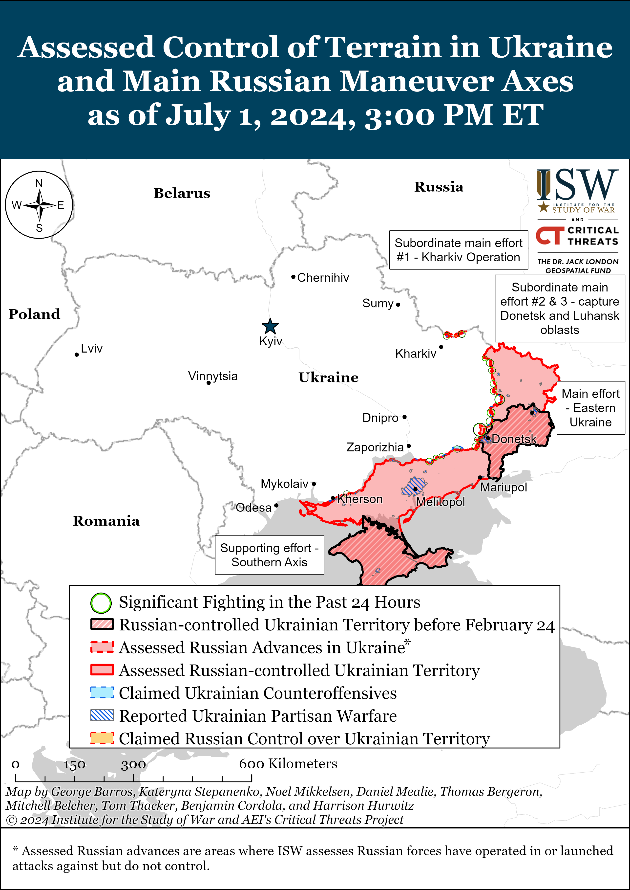
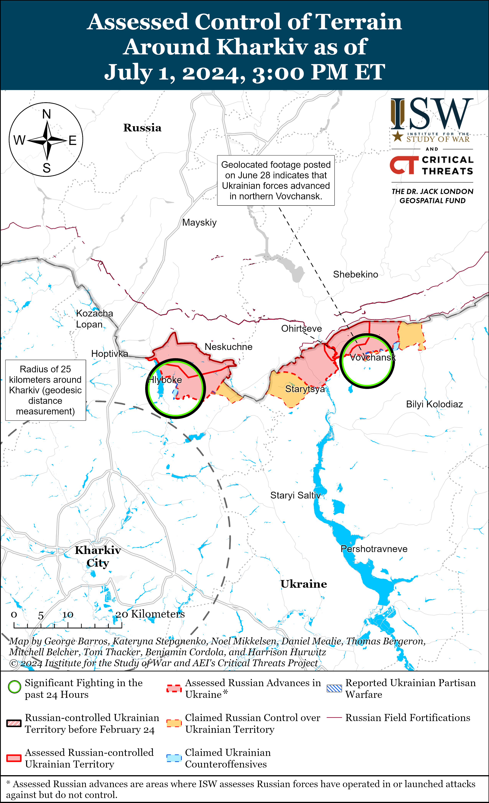
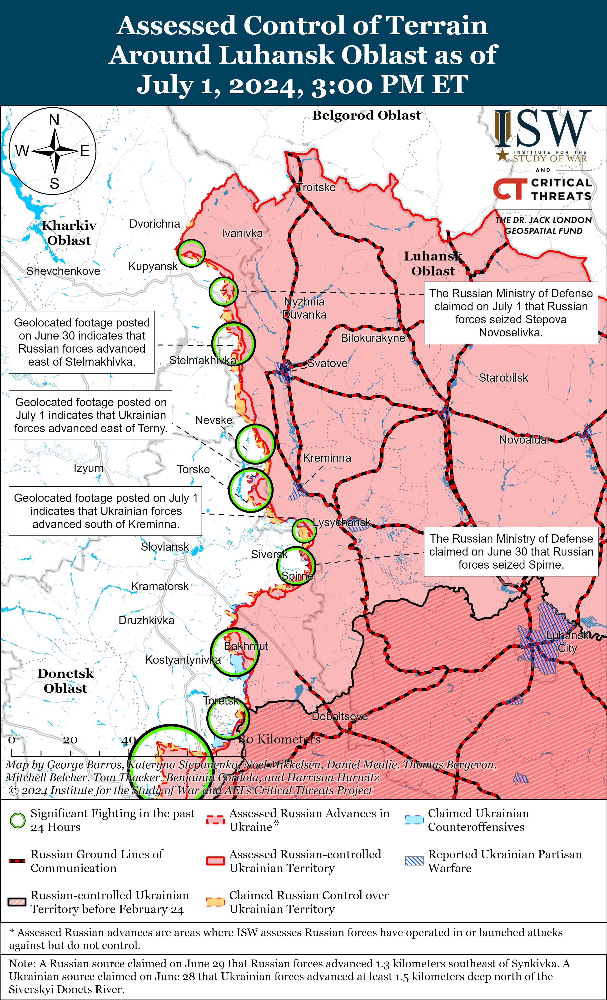
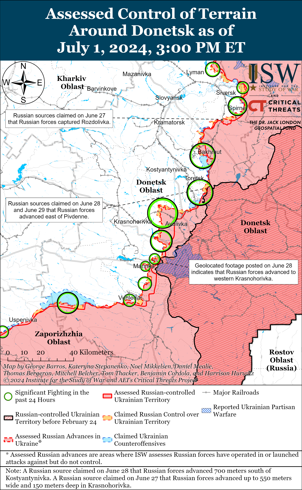
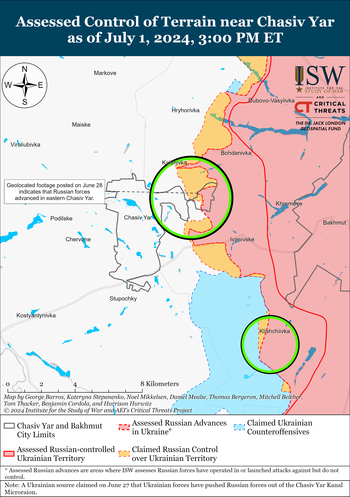
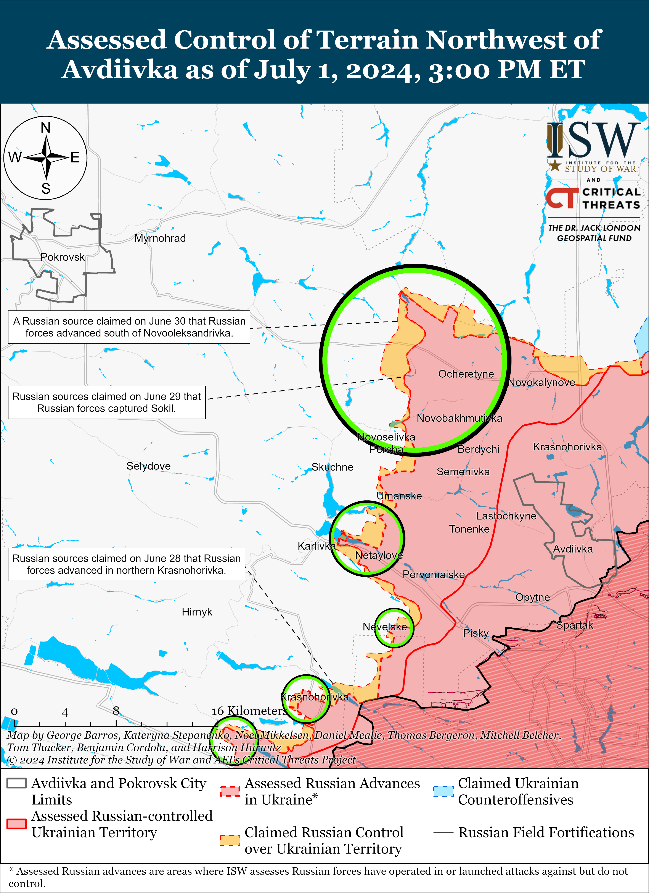
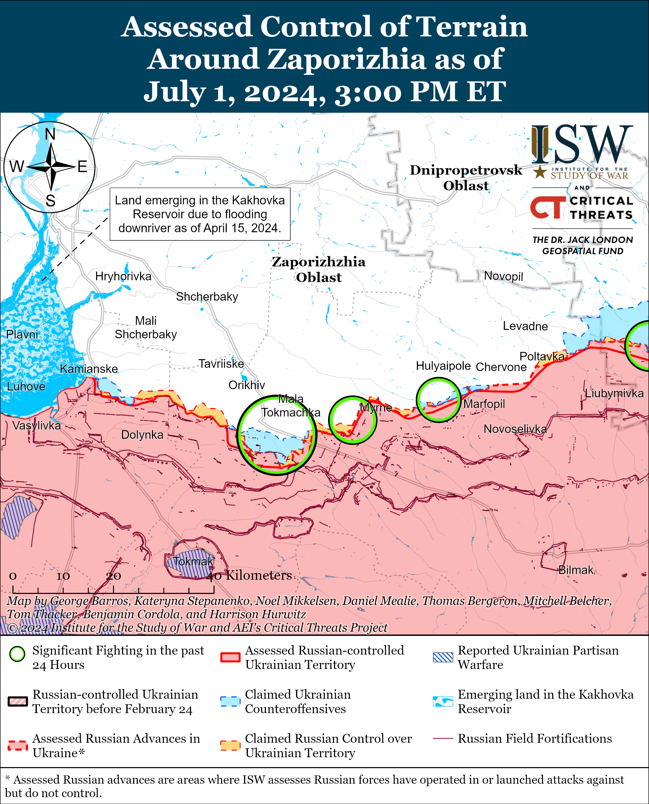
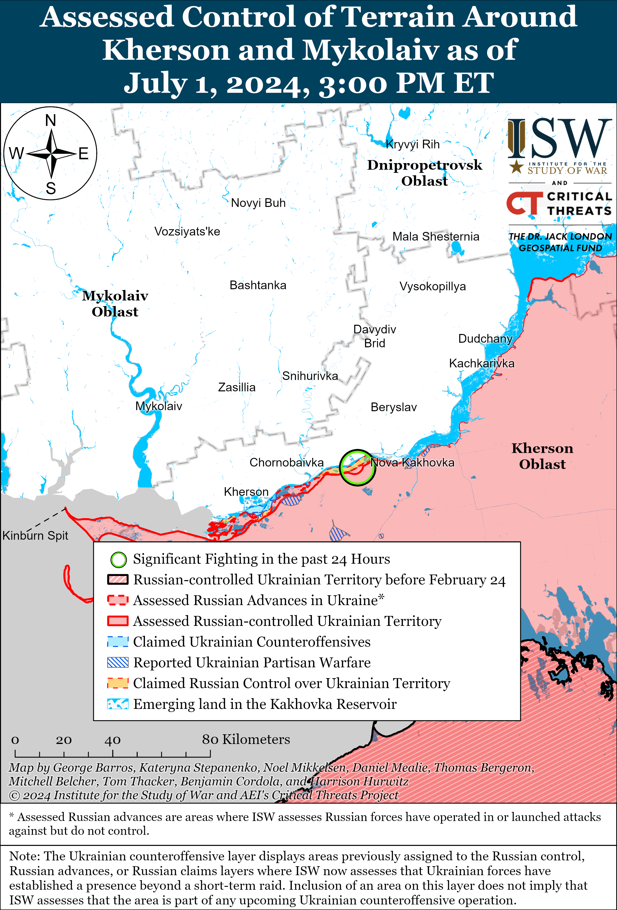

# Russian Offensive Campaign Assessment, July 1, 2024

**Nicole Wolkov, Christina Harward, Angelica Evans, Karolina Hird, and Frederick W. Kagan**

**July 1, 2024, 5pm ET**

**Click**[**here**](https://storymaps.arcgis.com/stories/36a7f6a6f5a9448496de641cf64bd375)**to see ISW’s interactive map of the Russian invasion of Ukraine. This map is updated daily alongside the static maps present in this report.**

**Click**[**here**](https://understandingwar.maps.arcgis.com/apps/instant/3dviewer/index.html?appid=1602762dbcde419bb957dea358449580)**to see ISW’s 3D control of terrain topographic map of Ukraine. Use of a computer (not a mobile device) is strongly recommended for using this data-heavy tool.**

**Click**[**here**](https://storymaps.arcgis.com/stories/733fe90805894bfc8562d90b106aa895)**to access ISW’s archive of interactive time-lapse maps of the Russian invasion of Ukraine. These maps complement the static control-of-terrain map that ISW produces daily by showing a dynamic frontline. ISW will update this time-lapse map archive monthly.**

**Note: The data cut-off for this product was 12:15pm ET on July 1. ISW will cover subsequent reports in the July 2 Russian Offensive Campaign Assessment.**

**Russian Ministry of Internal Affairs (MVD) Head Vladimir Kolokoltsev boasted that Russian authorities have increased detentions and prosecutions related to illegal migration into Russia while calling for intensified Russian government crackdowns against illegal migration.**Kolokoltsev claimed on July 1 at a Russian government meeting on crime prevention that the MVD has detected over double the number of crimes related to organizing illegal migration and have prosecuted roughly a quarter more individuals who were illegally in Russia, presumably in comparison with 2023.[1] Kolokoltsev also claimed that the number of “serious” and “especially serious” crimes committed by foreigners in Russia decreased by 7.6 percent in 2024 in comparison to 2023. Kolokoltsev also noted that select crimes that foreigners have committed in Russia have increased interethnic tension in Russia. Kolokoltsev characterized Russia’s fight against illegal migration as “strategically important” and called for joint efforts to resolve migration issues, likely referring to coordinated efforts between multiple Russian state security organs.

Russian milbloggers criticized Kolokoltsev’s statistics and claimed that the reported reduction in crimes committed by foreign citizens in Russia is a result of Russian authorities’ decision to grant Russian citizenship to migrants — not actual decreases in migrant crime.[2] One milblogger insinuated that Kolokoltsev was directly attempting to defy Russian Investigative Committee Head Alexander Bastrykin, who claimed on July 27 that migrant crime is spreading across Russia and that migrants committed an increased percentage of “especially serious” and “extremist” crimes in Russia in 2023.[3] Russian ultranationalists have routinely criticized the Russian government’s policy of giving migrants Russian citizenship, although some Russian milbloggers and some State Duma members have previously justified Russia’s ongoing coercive crypto-mobilization efforts, which disproportionally target migrants, by claiming that migrants who receive Russian citizenship must fight in Ukraine to “earn” their Russian citizenship and that migrants who fight in Ukraine will receive Russian citizenship.[4] Significant Russian ultranationalist efforts to stop the Russian government from giving Russian citizenship to migrants and other “compatriots abroad” (which Russia loosely defines as ethnic Russians and Russian-speakers living outside of Russia) may hinder Russia’s ongoing weaponization of passportization to generate military manpower, offset domestic labor shortages, and set informational conditions to justify potential hybrid operations against other countries with Russian and Russian-speaking populations.[5]

**Russia assumed its one-month-long rotating presidency of the United Nations Security Council (UNSC) on July 1 for the first time since April 2023 and will likely use this position as a power projection base within the international system as it historically has.****[6]**Russian Foreign Minister Sergei Lavrov will chair UNSC debates on July 16 and 17.[7] ISW assessed during Russia’s April 2023 presidency that Russia exploited its UNSC presidency to further several narratives regarding Russia’s desired sway in the international system and has previously noted that Russia uses its UNSC veto power as a base of power projection.[8] Several high-ranking Russian officials have recently launched several information operations meant to deflect responsibility for well-documented Russian violations of international law committed in Ukraine, likely to set conditions for the upcoming UNSC presidency.[9]

**South Korea’s Ministry of Unification announced on July 1 that North Korean state TV channel *Korean Central TV* switched to transmitting broadcasts via Russian satellites instead of Chinese satellites, reportedly affecting South Korea’s ability to monitor North Korean state TV.****[10]**South Korean media and North Korean monitoring organizations reported on July 1 that they suddenly stopped receiving *Korean Central TV* broadcasts, and South Korean’s Ministry of Unification later announced that North Korea stopped transmitting broadcasts through Chinese satellites and that the reception from the Russian satellites is restricted in some areas of South Korea.[11] South Korean state broadcaster *KBS* reported that signals from the Russian satellites overlap with certain domestic frequency banks, making the signals difficult to receive in South Korea.[12] North Korea monitoring organization North Korea Tech stated on July 1 that North Korea is using Russia’s Express-103 satellite, which transmits to a significantly smaller area of the world (reportedly excluding most of Asia, Europe, and Africa) compared to the Chinese Chinasat-12 satellite that North Korea previously used for its broadcasts.[13] It is unclear if North Korea is temporarily switching its broadcasts to Russian satellites or if the change is more permanent; however, it is notable that the Kremlin may be aiding North Korean efforts to conceal information from South Korea and other Western allies.

**Hungary assumed the six-month rotating presidency of the European Union (EU) Council on July 1.****[14]**The EU Council presidencies work in “trios” every 18 months that set long-term goals and prepare a common agenda for the EU Council.[15] Hungary is currently a part of the “trio” that includes Spain, which held the presidency from July 2023 to December 2023, and Belgium, which held the presidency from January 2024 to June 2024. The Spanish–Belgian–Hungarian trio set its 18-month program in July 2023, which expressed commitment to “helping the rest of the world cope with the consequences of Russia’s war and contributing to the coordination of long-term financial support for the reconstruction of Ukraine.”[16] Each presidency also sets its own six-month priorities, and Hungary’s seven focus areas include reinforcing the EU’s defense policy, making the EU enlargement policy consistent and merit-based, stemming illegal migration, promoting farmer-oriented EU agricultural policy, and addressing the EU’s demographic challenges.[17]

**Key Takeaways:**

- **Russian Ministry of Internal Affairs (MVD) Head Vladimir Kolokoltsev boasted that Russian authorities have increased detentions and prosecutions related to illegal migration into Russia while calling for intensified Russian government crackdowns against illegal migration.**
- **Russia assumed its one-month-long rotating presidency of the United Nations Security Council (UNSC) on July 1 for the first time since April 2023 and will likely use this position as a power projection base within the international system as it historically has.**
- **South Korea’s Ministry of Unification announced on July 1 that North Korean state TV channel *Korean Central TV* switched to transmitting broadcasts via Russian satellites instead of Chinese satellites, reportedly affecting South Korea’s ability to monitor North Korean state TV.**
- **Hungary assumed the six-month rotating presidency of the European Union (EU) Council on July 1.**
- **Ukrainian forces recently advanced near Kreminna, and Russian forces recently advanced near Avdiivka.**
- **The Russian information space continues to discuss the mistreatment of wounded and disabled Russian servicemembers in Ukraine.**

***We do not report in detail on Russian war crimes because these activities are well-covered in Western media and do not directly affect the military operations we are assessing and forecasting. We will continue to evaluate and report on the effects of these criminal activities on the Ukrainian military and the Ukrainian population and specifically on combat in Ukrainian urban areas. We utterly condemn Russian violations of the laws of armed conflict and the Geneva Conventions and crimes against humanity even though we do not describe them in these reports.***

- Russian Main Effort — Eastern Ukraine (comprised of three subordinate main efforts)
- Russian Subordinate Main Effort #1 — Push Ukrainian forces back from the international border with Belgorod Oblast and approach to within tube artillery range of Kharkiv City
- Russian Subordinate Main Effort #2 — Capture the remainder of Luhansk Oblast and push westward into eastern Kharkiv Oblast and encircle northern Donetsk Oblast
- Russian Subordinate Main Effort #3 — Capture the entirety of Donetsk Oblast
- Russian Supporting Effort — Southern Axis
- Russian Air, Missile, and Drone Campaign
- Russian Mobilization and Force Generation Efforts
- Russian Technological Adaptations
- Activities in Russian-occupied areas
- Ukrainian Defense Industrial Base Efforts
- Russian Information Operations and Narratives
- Significant Activity in Belarus

**Russian Main Effort — Eastern Ukraine**

**Russian Subordinate Main Effort #1 — Kharkiv Oblast****(Russian objective: Push Ukrainian forces back from the international border with Belgorod Oblast and approach to within tube artillery range of Kharkiv City)**

Geolocated footage published on June 30 shows Ukrainian forces firing at limited Russian positions in houses and a forest area just north of Zhuravka, Sumy Oblast (less than two kilometers from the border and about 35 kilometers northeast of Sumy City).[18] It is currently unclear whether Russian forces have established an enduring presence in these positions, potentially in preparation for a larger Russian offensive operation into Sumy Oblast, or if these positions were the result of a limited cross-border Russian raid into Sumy Oblast. ISW continues to assess that any Russian offensive actions in Sumy Oblast are meant to pin and divert Ukrainian forces away from other critical areas of the frontline.[19]

Russian forces continued offensive operations north of Kharkiv City near Lyptsi and Hlyboke and northeast of Kharkiv City near Vovchansk on June 30 and July 1, but there were no confirmed changes to the frontline.[20] Russian milbloggers amplified footage on July 1 of a purported Russian FAB-3000 glide bomb strike against Ukrainian positions in Slobozhansk (north of Kharkiv City).[21]

**Russian Subordinate Main Effort #2 — Luhansk Oblast****(Russian objective: Capture the remainder of Luhansk Oblast and push westward into eastern Kharkiv Oblast and northern Donetsk Oblast)**

Ukrainian forces recently regained lost positions near Kreminna while Russian forces recently advanced near Kreminna amid continued fighting along the Kupyansk-Svatove-Kreminna line on July 1. Geolocated footage published on July 1 indicates that Russian forces recently advanced east of Makiivka (northwest of Kreminna).[22] Geolocated footage published on June 30 and July 1 indicates that Ukrainian forces recently regained lost positions in the forested area south of Kreminna and east of Terny (west of Kreminna).[23] Russian milbloggers claimed on June 30 that Ukrainian forces advanced about 800 meters near Terny and about one kilometer in the Serebryanske forest area (southwest of Kreminna).[24] The Russian Ministry of Defense (MoD) claimed on July 1 that Russian forces seized Stepova Novoselivka (southeast of Kupyansk), but a milblogger disputed that Russian forces fully control the settlement.[25] ISW’s current control of terrain assessment places Russian forces about 1.1 kilometers away from Stepova Novoselivka at the closest point, and ISW has not yet observed visual evidence of Russian forces operating near or in the settlement. A Russian milblogger claimed that Russian forces have occupied half of Stelmakhivka (southeast of Kupyansk), but ISW has only observed visual confirmation that Russian forces have marginally entered the eastern outskirts of the settlement.[26] Fighting continued northeast of Kupyansk near Synkivka; southeast of Kupyansk near Berestove, Stepova Novoselivka, Stelmakhivka, and Pishchane; northwest of Kreminna near Hrekivka, Nevske, and Makiivka; and west of Kreminna near Torske and Terny on June 30 and July 1.[27] Elements of the Russian 1st Guards Tank Army (Moscow Military District [MMD]) are reportedly operating in the Kupyansk direction, and elements of the Chechen “Shrama” detachment of the 204th “Akhmat” Spetsnaz Regiment are reportedly operating near Kreminna.[28]

**Russian Subordinate Main Effort #3 — Donetsk Oblast****(Russian objective: Capture the entirety of Donetsk Oblast, the claimed territory of Russia’s proxies in Donbas)**

Russian forces continued ground attacks in the Siversk direction on July 1, but there were no confirmed changes to the frontline. A Russian milblogger claimed that Russian forces seized the southern part of Spirne (southeast of Siversk) but that fighting continues on the outskirts of the settlement, contradicting the Russian Ministry of Defense’s (MoD) June 30 claim that Russian forces seized Spirne.[29] Russian forces attacked northeast of Siversk near Bilohorivka and west of Siversk near Verkhnokamyanske, Ivano-Daryivka, and Vyimka on June 30 and July 1.[30] Elements of the Russian 6th Motorized Rifle Brigade (2nd Luhansk People’s Republic Army Corps [LNR AC]) reportedly continue operating near Bilohorivka.[31]

Russian forces continued offensive operations near Chasiv Yar on July 1, but there were no confirmed changes to the frontline. Russian milbloggers claimed that Russian forces advanced northeast of Kalynivka (north of Chasiv Yar), to the western (right) bank of the Siverskyi Donets-Donbas Canal near Kalynivka (in the area where the canal runs underground), and in the forest area south of Kalynivka, although ISW has not observed visual evidence of these claims.[32] Fighting continued near Chasiv Yar, the Novyi Microraion (eastern Chasiv Yar), and Klishchiivka (southeast of Chasiv Yar) on July 1.[33]

Russian forces continued ground attacks in the Toretsk direction on July 1, but there were no confirmed changes to the frontline. The Ukrainian General Staff reported that Russian forces attacked near Toretsk, east of Toretsk near Pivnichne, and southeast of Toretsk near Pivdenne and Niu York on July 1.[34] Elements of the Russian “Veterany” Assault Brigade (Russian Volunteer Corps) and 132nd Motorized Rifle Brigade (1st Donetsk People’s Republic [DNR] AC) reportedly continue operating near Pivnichne.[35]

Russian forces recently advanced west of Avdiivka amid continued offensive operations in the area on July 1. Geolocated footage published on June 30 and July 1 indicates that Russian forces recently advanced north and south of Sokil (northwest of Avdiivka).[36] Additional geolocated footage published on July 1 indicates that Russian forces recently advanced south of Netaylove (west of Avdiivka).[37] The Russian MoD claimed that Russian forces seized Novopokrovske (northwest of Avdiivka) as of July 1, although ISW assessed that Russian forces had seized the settlement as of June 13.[38] Russian milbloggers claimed that Russian forces advanced into Voskhod and Yevhenivka (both northwest of Avdiivka) although ISW has not observed visual evidence of these claims.[39] Fighting continued northwest of Avdiivka near Novooleksandrivka, Vozdvyzhenka, Yevhenivka, Voskhod, Prohres, Novoselivka Persha, and Sokil; and west of Avdiivka near Netaylove on July 1.[40]

Russian forces continued offensive operations west and southwest of Donetsk City on July 1, but there were no confirmed changes to the frontline. Geolocated footage published on June 30 shows Ukrainian forces recently repelling a roughly reduced company-sized Russian mechanized assault south of Novomykhailivka (southwest of Donetsk City) and striking seven Russian armored vehicles.[41] Russian forces continued attacking west of Donetsk City near Krasnohorivka, and southwest of Donetsk City near Heorhiivka, Paraskoviivka, Kostyantynivka, and Vodyane on July 1.[42] Elements of the Russian 5th Motorized Rifle Brigade (1st DNR AC) reportedly continue operating near Krasnohorivka; and elements of the 150th Motorized Rifle Division (8th Combined Arms Army [CAA], Southern Military District [SMD]) are reportedly operating near Heorhiivka.[43]

Russian forces continued ground attacks in the Donetsk-Zaporizhia Oblast border area on July 1, but there were no confirmed changes to the frontline. Fighting continued south of Velyka Novosilka near Urozhaine, Staromayorske, and Makarivka, and southwest of Velyka Novosilka near Charivne on July 1.[44] Elements of the Russian 5th Motorized Rifle Brigade (1st DNR AC) are reportedly operating in the Velyka Novosilka area, and elements of the 57th Motorized Rifle Brigade (5th CAA, Eastern Military District [EMD]) are reportedly operating near Vuhledar (southeast of Velyka Novosilka).[45]

**Russian Supporting Effort — Southern Axis****(Russian objective: Maintain frontline positions and secure rear areas against Ukrainian strikes)**

Positional engagements continued in western Zaporizhia Oblast near Robotyne, Verbove (east of Robotyne), Novodanylivka (north of Robotyne), and Mala Tokmachka (northeast of Robotyne) on June 30 and July 1.[46] A Russian milblogger claimed that Russian forces are pushing Ukrainian forces out of positions near Mala Tokmachka but that the situation is difficult due to the open terrain and heavy Ukrainian drone usage and remote mining.[47] A Russian source claimed that Russian soldiers in the Zaporizhia direction are complaining about inefficient electronic warfare (EW) systems since Ukrainian forces are using different frequencies for their drones and because Russian EW systems are overheating in the summer heat.[48]

Positional engagements continued in east (left) bank Kherson Oblast and on the Dnipro River Delta islands on July 1.[49] A Russian milblogger claimed that a Russian soldier fighting in the Kherson direction claimed that Russian forces lack EW systems to protect against Ukrainian drones and that Russian artillery cannot conduct sufficient counterbattery fire.[50] Elements of the Russian 10th Spetsnaz Brigade (Main Military Intelligence Directorate [GRU]) are reportedly operating on the islands in the Dnipro River Delta, and elements of the 61st Naval Infantry Brigade (a district-level unit operating under the Leningrad Military District [LMD], formerly Northern Fleet) are reportedly operating near Nestryha Island.[51]

Russian sources claimed that Ukrainian forces conducted a Storm Shadow missile strike against occupied Crimea on the night of June 30 to July 1 and that missile debris fell near Shcholkine (southeastern Crimea).[52] A Crimea-based Telegram channel also stated that Russian air defense systems activated near occupied Flotskoe (south of Sevastopol) and Sevastopol and that there were explosions near an unspecified Russian military unit near Flotskoe on July 1.[53]

**Russian Air, Missile, and Drone Campaign****(Russian Objective: Target Ukrainian military and civilian infrastructure in the rear and on the frontline)**

Russian forces launched several missiles of various targets throughout Ukraine on the evening of June 30 and during the day on July 1. Ukrainian military sources noted that Russia launched two Iskander-K cruise missiles at Kyiv City on the evening of June 30, both of which Ukrainian forces shot down.[54] Falling debris from the missiles damaged civilian infrastructure in Obolonskyi Raion, Kyiv City, however.[55] Dnipropetrovsk Oblast Head Serhii Lysak noted that Russian forces struck civilian infrastructure in Dnipro City overnight with an unspecified number of ballistic missiles.[56] Russian milbloggers claimed that Russian forces conducted an Iskander strike against the Myrhorod Air Base in Poltava Oblast on July 1, and Ukrainian sources reported the sounds of explosions near the Myrhorod area.[57] Ukraine’s Eastern Air Command reported that Ukrainian air defense forces destroyed one Russian Kh-59/69 cruise missile over an unspecified part of eastern Ukraine on July 1.[58] Ukrainian Air Force Spokesperson Major Ilya Yevlash noted on July 1 that Russian forces appear to be increasingly conducting missile strikes in the evenings, suggesting that Russian forces may seek to maximize damage to civilian areas as more people are spending time outside in the summer.[59]

**Russian Mobilization and Force Generation Efforts****(Russian objective: Expand combat power without conducting general mobilization)**

The Russian information space continues to discuss the mistreatment of wounded and disabled Russian servicemembers in Ukraine. A Russian milblogger claimed on June 30 that Russian commanders from at least one brigade previously forced untreated wounded and disabled servicemembers to return to the frontline and participate in highly attritional infantry-led assaults, knowing that the wounded and disabled servicemembers would almost certainly die.[60] Another milblogger claimed that there have been multiple cases of Russian commanders forcing paraplegic servicemembers to return to the frontlines in Ukraine.[61] One Russian milblogger claimed on July 1 that Russian commanders are forcing wounded and disabled servicemembers to return to frontline units because the commanders are falsifying reports of how well-staffed their units are.[62] The milblogger claimed that the Russian Ministry of Defense (MoD) has very little insight into how well-staffed frontline units are due to false reporting and claimed that Russian forces are facing a shortage of servicemembers in Ukraine due to high losses associated with drone strikes, poor training, and poor artillery support for infantry assaults. The milblogger claimed that frontline Russian units are receiving “combat ready” reinforcements who are wounded and that the Russian military command is beginning to inspect frontline units for wounded personnel. Russian milbloggers made similar claims on June 29, and Russian State Duma Deputy Yaroslav Nilov claimed that he would contact the MoD and Chief Military Prosecutor’s office to investigate the return of wounded personnel to the frontline.[63]

A Russian milblogger amplified claims on July 1 that servicemembers in the 1st Donetsk People’s Republic (DNR) and 2nd Luhansk People’s Republic (LNR) army corps (AC) and a large number of Russians who work along the Russia-Ukraine border do not have “combat veteran” status and noted that Russian authorities need to address these issues.[64] The Russian MoD recently issued several Wagner Group servicemembers “combat veteran” certificates following months of complaints and bureaucratic issues.[65] The Russian MoD will have to continue to address these bureaucratic issues as part of its effort to formalize irregular Russian formations, including the DNR and LNR ACs.

**Russian Technological Adaptations****(Russian objective: Introduce technological innovations to optimize systems for use in Ukraine)**

A representative of the Russian Red Line company told Kremlin newswire *TASS* on July 1 that the company presented the “Vogan-9SP” disposable drone with a warhead for intercepting other drones at an expo in Russia.[66] The “Vogan-9SP” can reportedly reach speeds of 200 kilometers per hour and uses a radar and laser system to lock onto a target.

**Ukrainian Defense Industrial Efforts****(Ukrainian objective: Develop its defense industrial base to become more self-sufficient in cooperation with US, European, and international partners)**

Ukraine continues to take measures to bolster its domestic military equipment production and defense industrial base (DIB) capacity. The Ukrainian Ministry of Defense (MoD) reported that between February 24, 2022 and June 29, 2024, Ukraine has codified (the process of registering military equipment with unique identification and in a unique data set) 20 models of sniper and anti-materiel rifles, one third of which are domestically produced.[67] Ukrainian First Deputy Defense Minister Lieutenant General Ivan Havryliuk later noted on July 1 that Ukraine has codified and deployed nearly 480 new types of weapons and military equipment since the start of 2024 alone.[68] The head of Ukraine’s state-owned defense enterprise manager Ukroboronprom, Herman Smetanin, noted on July 1 that Ukraine is currently domestically mass-producing drones that can hit targets at a range of over 1,000 kilometers.[69] Smetanin also noted that Ukrainian DIB professionals are already repairing German-made armored combat vehicles at the new Rheinmetall (German automotive and arms manufacturer) maintenance center in western Ukraine.[70]

Ukraine continues to conduct certain force reforms and reorganization in order to strengthen its domestic combat capacity. The National Police of Ukraine announced that it is forming three new combat brigades comprised of 8,000 total policemen and policewomen from the existing Department of Preventative Activities, the “Khyzhak” Patrol Police Department, and the “KORD” special purpose police unit.[71] Ukrainian MoD Spokesperson Senior Lieutenant Dmytro Lazutkin noted on June 27 that Ukraine has increased the number of mobilized servicepeople and that general mobilization dynamics are improving compared to the situation in Ukraine in March and February of 2024. [72]

**Activities in Russian-occupied areas****(Russian objective: Consolidate administrative control of annexed areas; forcibly integrate Ukrainian citizens into Russian sociocultural, economic, military, and governance systems)**

*ISW is not publishing coverage of activities in Russian-occupied areas today.*

**Russian Information Operations and Narratives**

The Russian and Belarusian ministries of foreign affairs (MFA) jointly published a report about alleged human rights violations in the West with the intent of deflecting international attention from the Kremlin’s ongoing human rights violations and war of conquest in Ukraine. The Russian and Belarusian MFAs claimed that Canada is violating human rights and becoming increasingly Russophobic.[73] The Russian and Belarusian MFAs recently also accused Australia of human rights violations.[74] The Russian MFA, however, continues to ignore discussion of Russia’s own mistreatment of migrants, ethnic minority populations, and vast repressions in Russia and occupied Ukraine.

A Russian milblogger continued to amplify criticisms made by a Ukrainian official against Ukrainian Commander-in-Chief Colonel General Oleksandr Syrskyi on July 1.[75]

**Significant activity in Belarus****(Russian efforts to increase its military presence in Belarus and further integrate Belarus into Russian-favorable frameworks and Wagner Group activity in Belarus)**

Nothing significant to report.

**Note: ISW does not receive any classified material from any source, uses only publicly available information, and draws extensively on Russian, Ukrainian, and Western reporting and social media as well as commercially available satellite imagery and other geospatial data as the basis for these reports. References to all sources used are provided in the endnotes of each update.**

---

[1] https://www.kommersant dot ru/doc/6798799 ; https://iz dot ru/1720822/2024-07-01/kolokoltcev-zaiavil-ob-uvelichenii-chisla-prestuplenii-v-sfere-nezakonnoi-migratcii

[2] https://t.me/dva\_majors/46531 ; https://t.me/voenkorKotenok/57321

[3] https://t.me/dva\_majors/46531 ; https://isw.pub/UkrWar06272024

[4] https://isw.pub/UkrWar041024

[5] https://isw.pub/UkrWar052224 ; https://isw.pub/UkrWar041524 ; https://isw.pub/UkrWar041024

[6] https://www.un.org/securitycouncil/content/presidency; https://t.me/tass\_agency/257996; https://t.me/tass\_agency/258067

[7] https://t.me/tass\_agency/258067

[8] https://understandingwar.org/wp-content/uploads/2024/07/Putin27s20Offset20The20Kremlin27s20Geopolitical20Adaptations20Since202014.pdf; https://isw.pub/UkrWar032123

[9] https://understandingwar.org/backgrounder/russian-offensive-campaign-assessment-june-19-2024

[10] https://news dot kbs.co.kr/news/pc/view/view.do?ncd=8000881 ; https://www.reuters.com/world/asia-pacific/north-korea-switches-tv-transmission-russia-satellite-chinese-2024-07-01/#:~:text=SEOUL%2C%20July%201%20(Reuters),South’s%20government%20agencies%20and%20media

[11] https://news dot kbs.co.kr/news/pc/view/view.do?ncd=8000881 ; https://www3 dot nhk.or.jp/nhkworld/en/news/20240701\_19/ ; https://www.northkoreatech dot org/2024/07/01/kctv-appears-on-russian-satellite-after-putin-visit/

[12] https://news dot kbs.co.kr/news/pc/view/view.do?ncd=8000881

[13] https://www.northkoreatech dot org/2024/07/01/kctv-appears-on-russian-satellite-after-putin-visit/

[14] https://www.consilium.europa.eu/en/council-eu/presidency-council-eu/

[15] https://www.consilium.europa.eu/en/council-eu/presidency-council-eu/

[16] https://data.consilium.europa.eu/doc/document/ST-10597-2023-INIT/en/pdf

[17] https://www.consilium.europa.eu/en/council-eu/presidency-council-eu/

[18] https://t.me/kiber\_boroshno/8839; https://t.me/marmuletik/25266; https://t.me/creamy\_caprice/5945

[19] https://understandingwar.org/backgrounder/russian-offensive-campaign-assessment-may-26-2024 ; https://understandingwar.org/backgrounder/russian-offensive-campaign-assessment-june-27-2024 ; https://understandingwar.org/backgrounder/russian-offensive-campaign-assessment-june-10-2024

[20] https://t.me/rybar/61421 ; https://t.me/rybar/61421 ; https://t.me/RVvoenkor/71578 ; https://www.facebook.com/GeneralStaff.ua/posts/pfbid0JcHCjtGewmUxDn68NDKwYetmi2JMaC1kBGZTre5SyzmdswY8buCT7G7QxzNnLyBVl ; https://www.facebook.com/GeneralStaff.ua/posts/pfbid07hQZxBwbCfTUrGYiNbFULNVvDQn6sbL6gFoYHo7fBVW3ba5Z9LfY8fzbvx2e7L6gl ; https://t.me/dva\_majors/46483 ; https://t.me/wargonzo/20806

[21] https://t.me/rybar/61437; https://t.me/voenacher/68098 ; https://t.me/vysokygovorit/16360

[22] https://t.me/ombr66/1094; https://t.me/creamy\_caprice/5944

[23] https://t.me/specnazahmat/658; https://x.com/EjShahid/status/1807730844720599381; https://x.com/EjShahid/status/1807537785559253195; https://t.me/operational\_space/665

[24] https://t.me/DnevnikDesantnika/12310; https://t.me/voenkorKotenok/57313

[25] https://t.me/mod\_russia/40534 ;

[26] https://t.me/rusich\_army/15523

[27] https://www.facebook.com/GeneralStaff.ua/posts/pfbid02u8Y7cNgWEsRVexCibsAPHyj5NRsz5CEuEtHD7ULyV6YweQ7LK9RrHdG77T8bxnQrl ; https://www.facebook.com/GeneralStaff.ua/posts/pfbid0JcHCjtGewmUxDn68NDKwYetmi2JMaC1kBGZTre5SyzmdswY8buCT7G7QxzNnLyBVl ; https://www.facebook.com/GeneralStaff.ua/posts/pfbid07hQZxBwbCfTUrGYiNbFULNVvDQn6sbL6gFoYHo7fBVW3ba5Z9LfY8fzbvx2e7L6gl; https://t.me/RVvoenkor/71582

[28] https://t.me/boris\_rozhin/128531 (Kupyansk direction) ; https://t.me/specnazahmat/658; https://x.com/EjShahid/status/1807730844720599381 (Kreminna)

[29] https://t.me/dva\_majors/46483 ; https://understandingwar.org/backgrounder/russian-offensive-campaign-assessment-june-30-2024

[30] https://www.facebook.com/GeneralStaff.ua/posts/pfbid07hQZxBwbCfTUrGYiNbFULNVvDQn6sbL6gFoYHo7fBVW3ba5Z9LfY8fzbvx2e7L6gl ; https://www.facebook.com/GeneralStaff.ua/posts/pfbid02u8Y7cNgWEsRVexCibsAPHyj5NRsz5CEuEtHD7ULyV6YweQ7LK9RrHdG77T8bxnQrl

[31] https://t.me/sons\_fatherland/15332

[32] https://t.me/z\_arhiv/27171 ; https://t.me/DnevnikDesantnika/12312 ; https://t.me/wargonzo/20806

[33] https://www.facebook.com/GeneralStaff.ua/posts/pfbid0JcHCjtGewmUxDn68NDKwYetmi2JMaC1kBGZTre5SyzmdswY8buCT7G7QxzNnLyBVl

[34] https://www.facebook.com/GeneralStaff.ua/posts/pfbid0JcHCjtGewmUxDn68NDKwYetmi2JMaC1kBGZTre5SyzmdswY8buCT7G7QxzNnLyBVl ; https://www.facebook.com/GeneralStaff.ua/posts/pfbid02u8Y7cNgWEsRVexCibsAPHyj5NRsz5CEuEtHD7ULyV6YweQ7LK9RrHdG77T8bxnQrl

[35] https://t.me/Sladkov\_plus/10823

[36] https://t.me/pidrozdilshadowoficial/562; https://t.me/creamy\_caprice/5948; https://x.com/GermanObserver1/status/1807540211611492443; https://t.me/strikedronescompany/315 (north)

https://x.com/GermanObserver1/status/1807543534515261451; https://t.me/strikedronescompany/314 (south)

[37] https://t.me/creamy\_caprice/5951; https://t.me/Kyiv11obmp/33

[38] https://t.me/mod\_russia/40534 ; https://understandingwar.org/backgrounder/russian-offensive-campaign-assessment-june-13-2024

[39] https://t.me/voenkorKotenok/57312 ; https://t.me/dva\_majors/46483

[40] https://www.facebook.com/GeneralStaff.ua/posts/pfbid02u8Y7cNgWEsRVexCibsAPHyj5NRsz5CEuEtHD7ULyV6YweQ7LK9RrHdG77T8bxnQrl ; https://www.facebook.com/GeneralStaff.ua/posts/pfbid0JcHCjtGewmUxDn68NDKwYetmi2JMaC1kBGZTre5SyzmdswY8buCT7G7QxzNnLyBVl ; https://t.me/RVvoenkor/71582 ; https://t.me/DnevnikDesantnika/12347 ; https://t.me/dva\_majors/46483 ; https://t.me/wargonzo/20806 ; https://t.me/voenkorKotenok/57312

[41] https://x.com/bayraktar\_1love/status/1807427601838866453; https://t.me/odshbr79/217 ; https://armyinform dot com.ua/2024/07/01/kilka-desyatkiv-okupantiv-zdalys-v-polon-desantnyky-znyshhyly-7-bmp-strim-iz-pryfrontovogo-mista/ ; https://t.me/ButusovPlus/11497

[42] https://www.facebook.com/GeneralStaff.ua/posts/pfbid0JcHCjtGewmUxDn68NDKwYetmi2JMaC1kBGZTre5SyzmdswY8buCT7G7QxzNnLyBVl ; https://t.me/wargonzo/20806

[43] https://t.me/Sladkov\_plus/10833 ; https://t.me/voenkorKotenok/57312

[44] https://www.facebook.com/GeneralStaff.ua/posts/pfbid0JcHCjtGewmUxDn68NDKwYetmi2JMaC1kBGZTre5SyzmdswY8buCT7G7QxzNnLyBVl ; https://t.me/voin\_dv/9467

[45] https://t.me/voin\_dv/9465

[46] https://www.facebook.com/GeneralStaff.ua/posts/pfbid02u8Y7cNgWEsRVexCibsAPHyj5NRsz5CEuEtHD7ULyV6YweQ7LK9RrHdG77T8bxnQrl; https://www.facebook.com/GeneralStaff.ua/posts/pfbid0JcHCjtGewmUxDn68NDKwYetmi2JMaC1kBGZTre5SyzmdswY8buCT7G7QxzNnLyBVl ; https://www.facebook.com/GeneralStaff.ua/posts/pfbid07hQZxBwbCfTUrGYiNbFULNVvDQn6sbL6gFoYHo7fBVW3ba5Z9LfY8fzbvx2e7L6gl; https://t.me/wargonzo/20806

[47] https://t.me/DnevnikDesantnika/12340

[48] https://t.me/dva\_majors/46475

[49] https://www.facebook.com/GeneralStaff.ua/posts/pfbid02u8Y7cNgWEsRVexCibsAPHyj5NRsz5CEuEtHD7ULyV6YweQ7LK9RrHdG77T8bxnQrl; https://t.me/dva\_majors/46483

[50] https://t.me/dva\_majors/46507

[51] https://t.me/grey\_zone/23421; https://t.me/grey\_zone/23427; https://t.me/vanek\_nikolaev/24740 ; https://x.com/666\_mancer/status/1807753172728865231

[52] https://t.me/dva\_majors/46467 ; https://t.me/dva\_majors/46468; https://t.me/dva\_majors/46480 ;

[53] https://t.me/Crimeanwind/62730; https://t.me/Crimeanwind/62731 ; https://t.me/Crimeanwind/62734; https://t.me/Crimeanwind/62735; https://t.me/Crimeanwind/62740

[54] https://suspilne dot media/780337-raketnij-obstril-kieva-ta-udar-po-terminalu-novoi-posti-u-harkovi-858-den-vijni-onlajn/?anchor=live\_1719829627&utm\_source=copylink&utm\_medium=ps; https://armyinform.com dot ua/2024/07/01/illya-yevlash-rozpoviv-chym-rosiya-zavdala-udariv-po-kyyevu-30-chervnya/

[55] https://t.me/vitaliy\_klitschko/3243; https://t.me/VA\_Kyiv/6597; https://t.me/kyivoda/18219

[56] https://www.facebook.com/permalink.php?story\_fbid=pfbid06qAsJCQMzVdsioiCaofLtRjRz4DYtWE58VKBCw7C1KNok2aBrk1bhm62cbnAHtcBl&id=100089981179124&ref=embed\_post ; https://t.me/dnipropetrovskaODA/14128

[57] https://t.me/RVvoenkor/71606; https://t.me/suspilnepoltava/18315

[58] https://www.facebook.com/pvkshid/posts/pfbid0oTAGYMJPhyfZe19r2oo1hP6hfFdCmKFaQ5CpYYcAbzZ9Ue2xJaHF592TC9b2CCYNl

[59] https://suspilne dot media/780337-raketnij-obstril-kieva-ta-udar-po-terminalu-novoi-posti-u-harkovi-858-den-vijni-onlajn/?anchor=live\_1719829627&utm\_source=copylink&utm\_medium=ps; https://armyinform.com dot ua/2024/07/01/illya-yevlash-rozpoviv-chym-rosiya-zavdala-udariv-po-kyyevu-30-chervnya/

[60] https://t.me/vault8pro/51394

[61] https://t.me/vozlevoiny/5434

[62] https://t.me/akashevarova/7388

[63] https://understandingwar.org/backgrounder/russian-offensive-campaign-assessment-june-30-2024

[64] https://t.me/darkside\_ofthesun/87 ; https://t.me/philologist\_zov/1079 ; https://t.me/philologist\_zov/1081

[65] https://understandingwar.org/backgrounder/russian-offensive-campaign-assessment-june-21-2024

[66] https://t.me/tass\_agency/258012

[67] https://www.ukrinform dot ua/rubric-ato/3879817-v-ukraini-kodifikaciu-projsli-vze-20-zrazkiv-gvintivok-tretina-vitciznanogo-virobnictva.html; https://www.mil dot gov.ua/news/2024/06/28/blizko-20-zrazkiv-snajperskih-i-antimaterialnih-gvintivok-dopushheno-do-ekspluataczii-u-zs-ukraini/

[68] https://armyinform.com dot ua/2024/07/01/za-pershe-pivrichchya-czogo-roku-minoborony-dopustylo-do-ekspluatacziyi-majzhe-480-novyh-zrazkiv-ovt/; https://t.me/bbcrussian/67215

[69] https://mil.in dot ua/uk/news/ukrayina-zapustyla-serijne-vyrobnytstvo-dalekobijnyh-droniv/ ; https://armyinform dot com.ua/2024/06/29/progres-u-spivpraczi-z-inozemnymy-zbroyaramy-ta-perevagy-pered-vorogom-intervyu-armiyainform-z-germanom-smetaninym/

[70] https://armyinform.com dot ua/2024/06/29/progres-u-spivpraczi-z-inozemnymy-zbroyaramy-ta-perevagy-pered-vorogom-intervyu-armiyainform-z-germanom-smetaninym/

[71] https://armyinform.com dot ua/2024/06/26/naczpolicziya-formuye-try-novi-bojovi-brygady/; https://mil.in dot ua/en/news/national-police-forms-three-combined-brigades-to-participate-in-combat-operations/

[72] https://armyinform.com dot ua/2024/06/27/mou-proczes-mobilizacziyi-nabuv-inakshoyi-intensyvnosti/

[73] https://t.me/MID\_Russia/42748; https://mid dot ru/ru/foreign\_policy/humanitarian\_cooperation/1957839/#\_Toc166858732

[74] https://understandingwar.org/backgrounder/russian-offensive-campaign-assessment-june-23-2024

[75] https://t.me/RVvoenkor/71545
