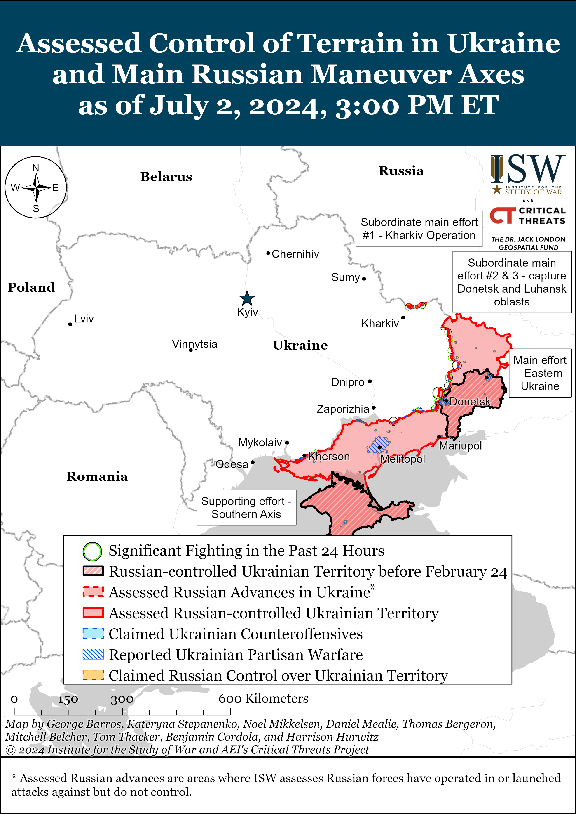
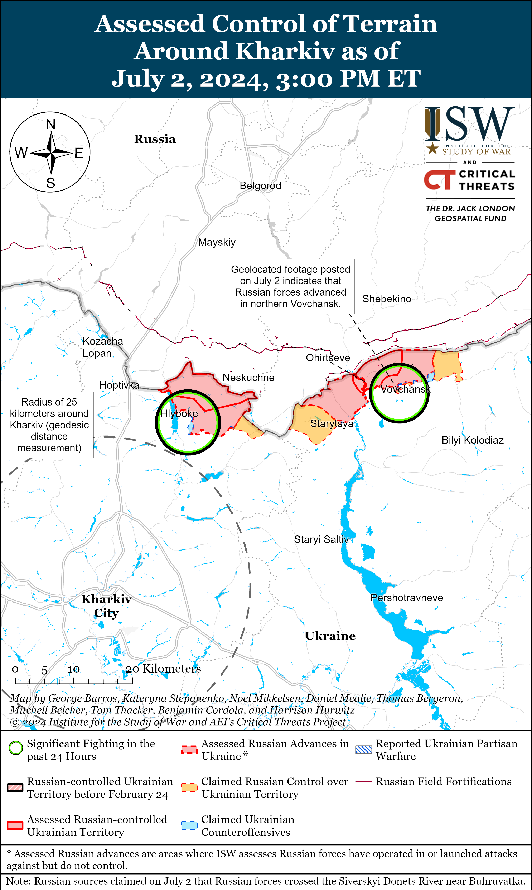
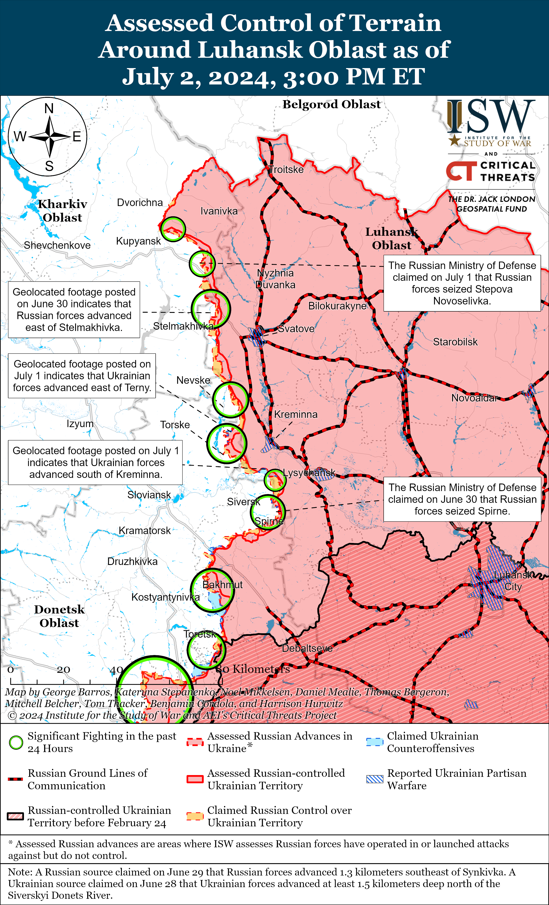
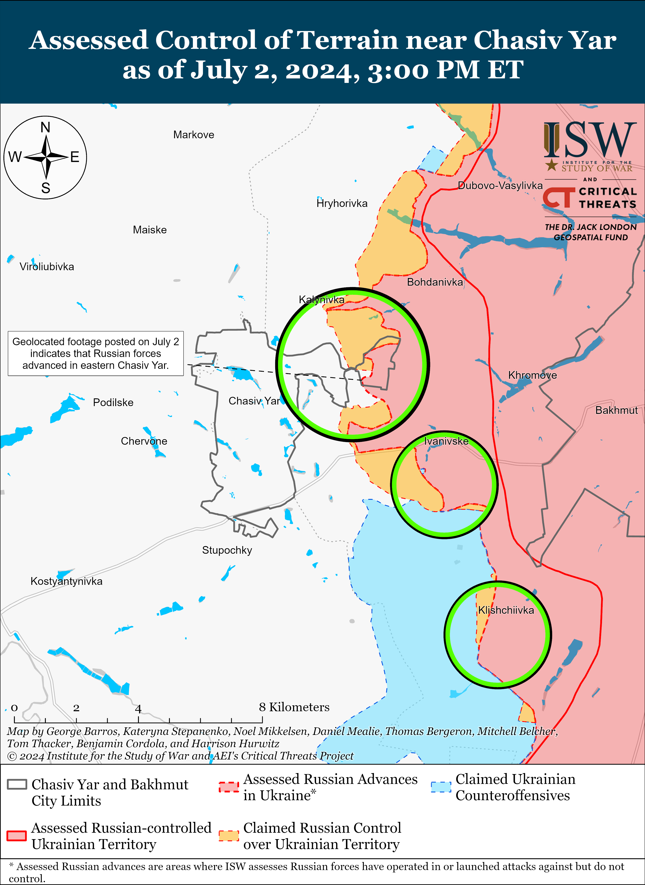
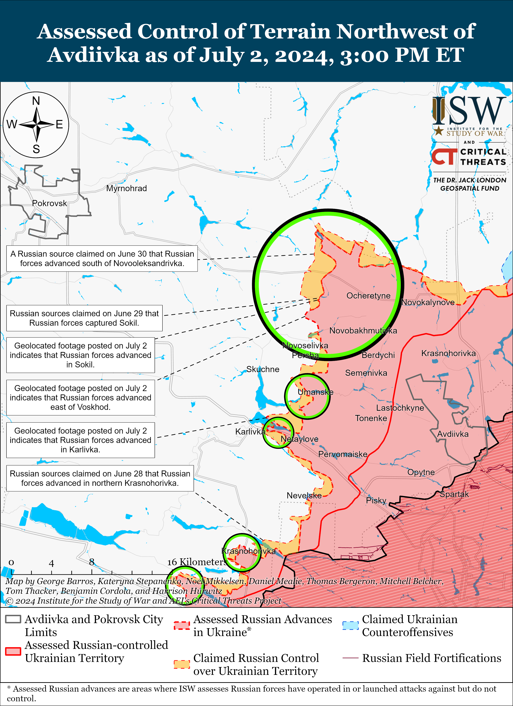
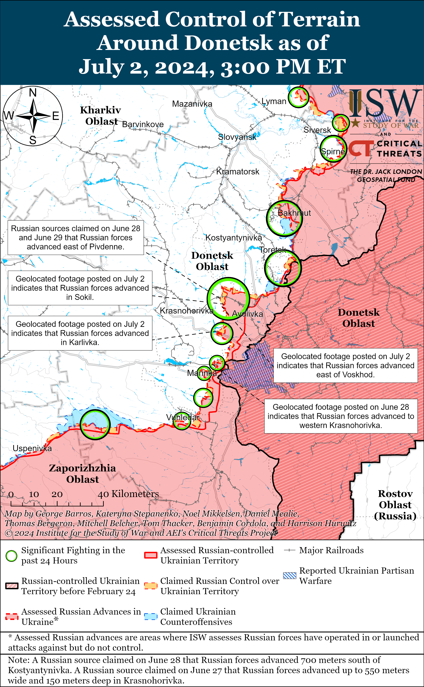
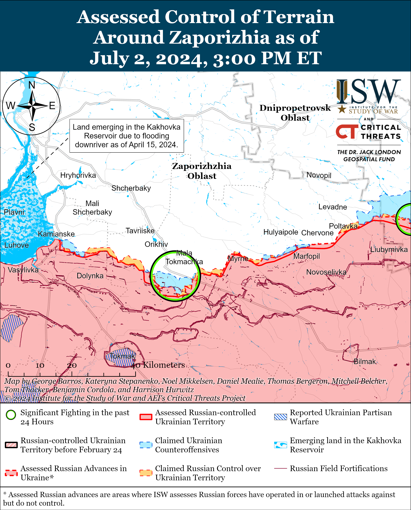
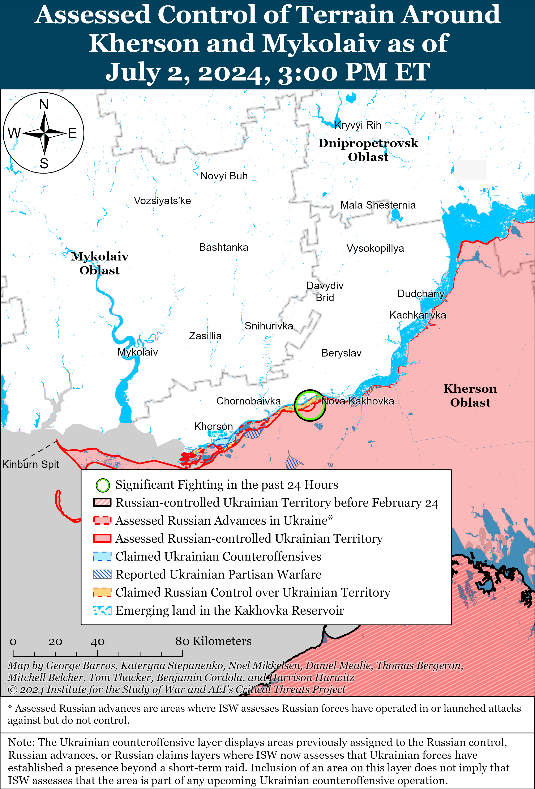

# Russian Offensive Campaign Assessment, July 2, 2024

**Nicole Wolkov, Christina Harward, Grace Mappes, Karolina Hird, and George Barros**

**July 2, 2024, 7:30pm ET**

**Click** [**here**](https://storymaps.arcgis.com/stories/36a7f6a6f5a9448496de641cf64bd375) **to see ISW’s interactive map of the Russian invasion of Ukraine. This map is updated daily alongside the static maps present in this report.**

**Click** [**here**](https://understandingwar.maps.arcgis.com/apps/instant/3dviewer/index.html?appid=1602762dbcde419bb957dea358449580) **to see ISW’s 3D control of terrain topographic map of Ukraine. Use of a computer (not a mobile device) is strongly recommended for using this data-heavy tool.**

**Click** [**here**](https://storymaps.arcgis.com/stories/733fe90805894bfc8562d90b106aa895) **to access ISW’s archive of interactive time-lapse maps of the Russian invasion of Ukraine. These maps complement the static control-of-terrain map that ISW produces daily by showing a dynamic frontline. ISW will update this time-lapse map archive monthly.**

**Note: The data cut-off for this product was 12:30pm ET on July 2. ISW will cover subsequent reports in the July 3 Russian Offensive Campaign Assessment.**

**The interplay between ongoing Russian offensive operations in the Chasiv Yar, Toretsk, and Avdiivka directions indicates that the Russian military command may intend to leverage the ongoing Toretsk push to create operational opportunities for advances in either the Chasiv Yar or Avdiivka areas. Russian preparations that can support multiple future branch plans suggest a more developed level of operational planning and foresight than the Russian command has proven capable of executing thus far in the war since early 2022. The ability of this operational planning to come to fruition, however, will be bounded by the overall poor tactical-level capabilities of Russian forces currently fighting in these areas.** Ukrainian Khortytsia Group of Forces Spokesperson Lieutenant Colonel Nazar Voloshyn stated in an interview with Ukrainian outlet *Suspilne Donbas* on July 2 that Russian forces are beginning to storm Chasiv Yar from the Toretsk direction (south of Chasiv Yar) and have been attacking in the direction of Toretsk-Chasiv Yar using mainly small infantry groups and occasional mechanized assaults.[1] Voloshyn’s suggestion that Russian forces are trying to attack towards the southern flank of Chasiv Yar from the Toretsk area is noteworthy. If Russian forces are able to develop a larger salient in the general Shumy-Pivdenne-Pivniche-Toretsk area, then they may be able to more credibly threaten Chasiv Yar from the south, complementing ongoing offensive Russian efforts north of Chasiv Yar near Kalynivka. Russian forces have continued attacks in the area south and southeast of Chasiv Yar, particularly near Klishchiivka, Andriivka, and Kurdyumivka, suggesting that the Russian command remains interested, at least in principle, in maintaining access to the southern flank of the Chasiv Yar area. Recent Russian advances in Mayorske (east of Toretsk) affords Russian forces positions on the east (left) bank of the Siversky Donets-Donbas Canal, allowing them to advance towards Chasiv Yar from the south along one bank of the canal as opposed to trying to cross the canalizing terrain in northern and eastern Chasiv Yar.

Ukrainian military observer Kostyantyn Mashovets, however, linked Russian efforts in the Toretsk direction with efforts to break through to the Pokrovsk direction (also referred to as the Avdiivka direction or the area west/southwest of Toretsk).[2] Mashovets noted on July 2 that Russian forces have intensified attacks on Toretsk in the past 24 hours and that the Russian Central Grouping of Forces (the command of which is also notably responsible for Russian troops attacking west of Avdiivka) has deployed additional battalions and assault companies near Toretsk to support ongoing offensive operations.[3] Mashovets noted that operational factors in the Toretsk direction “are directly related” to the Avdiivka direction and assessed that Russian troops of the Central Grouping of Forces are trying to interdict Ukrainian positions along the H-32 Pokrovsk-Kostyantynivka road (a major Ukrainian ground line of communication [GLOC] that supplies Ukrainian forces in Toretsk).[4]

Mashovets’ and Voloshyn’s separate observations on the prospects of Russian offensive operations near Toretsk reflect a noteworthy battlefield dynamic — the Russian command may have chosen to escalate offensive operations near Toretsk in mid-June exactly because this area offers Russian forces a flexible point of departure from which they can either attack north towards Chasiv Yar or west/southwest in the Avdiivka direction, depending on whatever route of attack the Russian command deems the most immediately promising. The apparent decision to attack near Toretsk emphasizes that the Russian command may be planning operations with more foresight and understanding of the operational situation than previously, when the Russian command pushed for incoherent offensive operations on unrelated parts of the front. The ability of the Russian command to actually bring these operational plans to bear, however, is contingent on the tactical-level performance of the troops in the Toretsk area and their ability to exploit tactical successes into operationally-significant breakthroughs.[5] As ISW previously noted, the main Russian forces concentration in the Toretsk area is formed of lower-quality forces of the Donetsk People’s Republic (DNR) and Territorial Troops, which will likely struggle to properly execute attacks, especially as Ukraine receives additional military aid over the coming weeks and months.[6]

**Hungarian Prime Minister Viktor Orban likely used his unannounced visit to Kyiv on July 2 to posture himself as a peacemaker following Hungary’s accession to the European Union (EU) Council presidency on July 1, but Orban’s efforts are very unlikely to bring about any robust peace in Ukraine.** Orban met with Ukrainian President Volodymyr Zelensky in Kyiv, and the Hungarian government readout emphasized that Orban met with Zelensky specifically to ask him to “consider a time-bound ceasefire” and “speed up the peace negotiations” given that “the rules of international diplomacy are slow and complicated.”[7] The Hungarian readout suggested that Orban specifically made this request to coincide with Hungary’s EU Council presidency. Zelensky stated that he and Orban discussed bilateral issues, infrastructure, energy issues, and “how to bring a just and lasting peace closer.”[8] Ukrainian Presidential Administration Deputy Head Ihor Zhovka stated that Zelensky listened to Orban’s proposal before emphasizing that Ukraine is working to draft a peace plan and hold another peace summit, which Zhovka stated Russia can attend “in one way or another.”[9] Zhovka noted that Hungary is not the first country to discuss a possible ceasefire but emphasized that “such [peace and negotiations] processes cannot be perceived in isolation.”[10] **ISW continues to assess that a ceasefire in Ukraine on the current lines is unlikely to deter further Russian aggression and only allow Russia critical time to rebuild its forces and prepare for future aggression against Ukraine.**

**The Kremlin is waging an intensified information campaign aimed at pushing Ukraine to negotiate with Russia on Russian terms, and any Russian, Western, or other efforts to cajole Ukraine to prematurely negotiate with Russia would only weaken Ukraine and embolden further Russian aggression inside and beyond Ukraine**.[11] Orban’s recent messaging about a ceasefire could support the Kremlin’s larger strategic messaging that seeks to establish a Russian-preferable operational pause or convince Ukraine’s international partners to abandon Ukraine. Russian President Vladimir Putin recently articulated a theory of victory that posits that gradual and indefinite Russian advances within Ukraine will eventually enable Russian victory.[12] Putin likely assesses that Russiacan protract the war indefinitely and win a war of attrition so long as he can deny decisive international support to Ukraine.[13] Russia’s slow but steady battlefield gains since late 2023 likely reinforce Putin’s assessment and incentivize Putin to avoid any kind of true ceasefire that would end the war. Putin and other senior Russian officials have consistently reiterated that Russia is uninterested in any negotiations that do not result in further Ukrainian territorial concessions of areas that Russia does not already occupy.[14] Freezing the current lines in Ukraine would provide Russia with operationally and strategically significant Ukrainian territory from which Russia can launch renewed aggression with an experienced military and revitalized defense industrial base.

**Several Russian State Duma deputies proposed a bill that would exclude a significant number of ethnicities from Russia’s “compatriots” resettlement program, undermining the Kremlin’s efforts to leverage its “compatriots abroad” to offset Russian labor shortages and set informational conditions to justify potential hybrid operations against other countries with Russian and Russian-speaking populations.** Just Russia Party Duma Deputy Dmitry Kuznetsov and Communist Party Duma Deputy Mikhail Matveyev authored a bill that would exclude citizens of countries formerly within the Soviet Union from using the “compatriots” program to resettle in Russia and that would limit the definition of “compatriots” eligible for resettlement as ethnicities historically living in the territory of Russia and the Russian Soviet Federative Socialist Republic (RSFSR).[15] Kuznetsov and Matveyev claimed that 50 to 70 percent of applicants for the “compatriots” resettlement program in recent years are citizens of Tajikistan, Kazakhstan, and Armenia and claimed that “several generations of citizens” of post-Soviet countries after the collapse of the Soviet Union have grown up with their own countries’ “traditional, cultural, and moral values” and do not have any “blood, historical, cultural, spiritual, or any other connection” with Russia or its people. The Russian government notably eased the requirements for “compatriots” living abroad to apply to resettle in Russia in February 2024 by no longer requiring an applicant to prove their Russian-language proficiency if they previously renounced Russian citizenship; were born or permanently resided in the Soviet Union and had Soviet citizenship; or have relatives who were born or permanently resided on territory formerly part of the Soviet Union or Russian Empire.[16] Russian ultranationalist milbloggers have been increasingly critical of the Russian government’s decision to provide migrants with Russian citizenship, while others have supported this practice on the condition that migrants with acquired Russian citizenship serve in the Russian military in Ukraine.[17] Russian ultranationalists’ increasing animosity toward migrants may have influenced Kuznetsov and Matveyev to propose implementing restrictions against many citizens that would be eligible for resettlement in Russia and by extension, greatly limiting the number of people the Russian government can include in its “compatriots abroad” narrative. Setting strict definitions on Russia’s classification of its “compatriots” directly undermines ongoing Kremin efforts to set informational conditions to justify potential hybrid operations against other countries with Russian and Russian-speaking populations and to use “compatriot” resettlement to offset labor shortages and long-term population decline.[18]

**Ukrainian forces struck an ammunition depot at a Russian military base in occupied Crimea on July 1 that reportedly housed Shahed drones.** Ukrainian Air Force Commander Lieutenant General Mykola Oleshchuk stated on July 2 that Ukrainian forces struck an ammunition depot in occupied Crimea on July 1.[19] A Russian source posted a photo on July 2 purportedly of the aftermath of a Ukrainian cruise missile strike against a Shahed drone warehouse near occupied Sevastopol on the evening of July 1, and the geolocated photograph indicates that Ukrainian forces struck the base of Russian military unit 99375 near occupied Flotske (south of Sevastopol).[20] Russian opposition outlet *Astra* reported on July 2 that Ukrainian forces launched at least six Storm Shadow missiles at Sevastopol on the evening of July 1 and that one missile struck the Russian Black Sea Fleet’s 758th Logistics Center in occupied Sevastopol.[21] A Crimea-based Telegram channel stated on July 1 that Russian air defense systems activated near occupied Flotske and Sevastopol and that there were explosions near an unspecified Russian military unit near Flotske.[22] Sevastopol occupation head Mikhail Razvozhaev claimed that Russian forces shot down five unspecified air targets over the water and near Balaklava and that small fires started.[23]

**Russia may be intensifying its efforts to conduct reconnaissance and disrupt communications in the underwater and air space near NATO states.** *Bloomberg* reported on July 1, citing three unspecified sources, that Russian Kilo-class submarines operated in unspecified areas near the Irish Sea once 18 months ago (in December 2022 or January 2023) and once at an unspecified “more recent” date.[24] *Bloomberg* reported that the sources stated that these submarine movements “went beyond what UK officials had previously seen,” but did not offer specifics on how the new events were anomalous. *Bloomberg* noted that Cork, Ireland is a landing point for the EXA Atlantic submarine cable that connects the UK and Canada and that a spokesperson for the Irish Department of Defense stated that government agencies are working to protect Ireland’s data cables. Sources reportedly stated that Russian submarine deployments to the Irish Sea area could be part of efforts to identify potential weaknesses in Irish and British maritime defenses or to intimidate the UK due to British support for Ukraine. *Bloomberg* reported that a source noted that the varying depths of the Irish Sea would make it difficult for a Russian submarine to traverse the entire Irish Sea submerged. It is unclear why the Russian submarines were operating near the Irish Sea, but the submarines may have been conducting reconnaissance on the defense and communications of NATO members Canada and the UK.

The United Nations’ International Telecommunications Union (ITU) reviewed concerns from Luxembourg, Sweden, France, and the Netherlands about recent interference to their satellite networks that jammed GPS signals, endangered air traffic control, and interrupted children’s TV shows to display footage of the war in Ukraine.[25] The ITU reported that two satellite operators both geolocated the source of the interference against French and Swedish satellite networks to near Moscow, Kaliningrad, and Pavlovka (there are numerous Pavlovkas in Russia and it is unclear to which Pavlovka, Russia the ITU is referring). ISW has also observed high levels of GPS jamming over Poland and the Baltic region since late 2023, which some analysts and experts have attributed to Russian electronic warfare (EW) activity near Kaliningrad and St. Petersburg.[26] ISW has also observed increased reports of disruptions in air communications near the UK and Ireland.[27] The *Telegraph*, citing flight tracker data, also reported on June 30 that roughly 28 percent of the UK’s Royal Air Force transport and surveillance flights over Eastern Europe and 16 percent of flights over northwestern Europe between January and April 2024 experienced GPS interference.[28] Air traffic control communications reportedly from the Shanwick Oceanic Control (overseeing the international airspace zone covering the northeastern Atlantic Ocean between the west coast of Scotland and Ireland to the southwestern coast of Iceland) indicated that a June 2024 flight between Madrid, Spain, and Toronto, Canada, was unable to ascend to a higher altitude due to apparent GPS jamming affecting other aircraft at the higher altitude.[29]The Resilient Navigation and Timing Foundation, a nonprofit advocating for improved GPS security, noted, however, that a GPS jammer is not always able to recover after experiencing jamming and assessed that the aircraft that experienced the jamming over the Atlantic was likely flying from the Baltic region or Middle East and that one of its GPS receivers had not recovered by the time it entered the Shanwick Oceanic Control Zone.Anomalous Russian submarine activity in the Irish Sea and apparent Russian GPS manipulations in a nearby area and across much of NATO airspace may not be directly related, but both represent Russian efforts to interfere with the water and air space of NATO members.

**Russian authorities appear to be publicly fixating on crackdowns against fight clubs and restricting the niqab to signal that Russian authorities are adequately combatting terrorist threats in the North Caucasus instead of addressing systemic issues of Islamist extremism in the region.** Russian outlets reported on June 28 that security forces searched a mixed martial arts (MMA) sports club with links to former Russian MMA fighter Khabib Nurmagomedov in Dagestan Republic since an attacker involved in the June 23 terrorist attacks in Dagestan reportedly trained at the sports club.[30] Russian outlet *RBK* reported on July 1 that the Russian Federal Tax Service (FNS) seized Nurmagomedov’s bank accounts due to a debt of 297 million rubles (about $3.4 million).[31] Russian media reported on July 2 that Russian law enforcement also detained a former coach of the Russian national youth wrestling team in Moscow in a terrorism case.[32] Russian milbloggers have criticized the purported widespread participation of Dagestani youth in MMA fight clubs, which milbloggers claim encourage Islamist extremist ideology.[33] Along with MMA clubs, Russian authorities are also cracking down against niqabs(a garment worn by some Muslim women to cover their entire body and face, excluding their eyes), which they have framed as symbolic of Islamic extremism. Russian Investigative Committee Head Alexander Bastrykin voiced indirect support for banning niqabs, but Dagestan Head Sergei Melikov stated that he is personally against the practice.[34] The Muftiate of Dagestan, which was expected to issue a fatwa (a legal ruling issued by an Islamic jurist on the grounds of Islamic law) against wearing the niqab, stated on July 2 that it could not find sufficient grounds for a general ban on niqab but that local and temporary bans are permitted for security reasons.[35] Russian ultranationalists also claimed that Dagestani officials know the identities of extremist thought leaders but have allowed radical Salafi-Jihadists to control entire spheres of public life within the republic.[36] Residents of Sergokala, Dagestan who reportedly knew some of the assailants in the June 23 terrorist attacks told *RBK* in a July 1 article that all the attackers attended a “Wahhabi” mosque whose imam had not been approved by the Muftiate of Dagestan.[37] Russian authorities’ fixation on cracking down on fight clubs and regulations on niqabs while ignoring systemic issues of Islamist extremism and rising ethnic and religious tension in Russia may actually fuel radicalization in the region and ethnic and religious friction.

**Russian President Vladimir Putin signed a decree on July 2 assigning the Russian 999th Air Base in Kant, Kyrgyzstan the “guards” honorific for “mass heroism and bravery.”**[38] The 999th Air Base is part of the Collective Security Treaty Organization’s (CSTO) Collective Rapid Deployment Forces. Russian milblogger and Kremlin Human Rights Committee member Alexander “Sasha” Kots claimed that Putin’s decree suggests that the 999th Airbase may be supporting combat missions in or near Ukraine.[39]

**Key Takeaways:**

- ****The interplay between ongoing Russian offensive operations in the Chasiv Yar, Toretsk, and Avdiivka directions indicates that the Russian military command may intend to leverage the ongoing Toretsk push to create operational opportunities for advances in either the Chasiv Yar or Avdiivka areas.** Russian preparations that can support multiple future branch plans in Donetsk Oblast suggest a more developed level of operational planning and foresight than the Russian command has proven capable of executing thus far in the war since early 2022. The ability of this operational planning to come to fruition, however, will be bounded by the overall poor tactical-level capabilities of Russian forces currently fighting in these areas.**
- **Hungarian Prime Minister Viktor Orban likely used his unannounced visit to Kyiv on July 2 to posture himself as a peacemaker following Hungary’s accession to the European Union (EU) Council presidency on July 1, but Orban’s efforts are very unlikely to bring about any robust peace in Ukraine.**
- **The Kremlin is waging an intensified information campaign aimed at pushing Ukraine to negotiate with Russia on Russian terms, and any Russian, Western, or other efforts to cajole Ukraine to prematurely negotiate with Russia would only weaken Ukraine and embolden further Russian aggression inside and beyond Ukraine.**
- **Several Russian State Duma deputies proposed a bill that would exclude a significant number of ethnicities from Russia’s “compatriots” resettlement program, undermining the Kremlin’s efforts to leverage its “compatriots abroad” to offset Russian labor shortages and set informational conditions to justify potential hybrid operations against other countries with Russian and Russian-speaking populations.**
- **Ukrainian forces struck an ammunition depot at a Russian military base in occupied Crimea on July 1 that reportedly housed Shahed drones.**
- **Russia may be intensifying its efforts to conduct reconnaissance and disrupt communications in the underwater and air space near NATO states.**
- **Russian authorities appear to be publicly fixating on crackdowns against fight clubs and restricting the niqab to signal that Russian authorities are adequately combatting terrorist threats in the North Caucasus instead of addressing systemic issues of Islamist extremism in the region.**
- **Russian President Vladimir Putin signed a decree on July 2 assigning the Russian 999th Air Base in Kant, Kyrgyzstan the “guards” honorific for “mass heroism and bravery.**
- **Russian forces recently advanced near Vovchansk, Chasiv Yar, Avdiivka, and the Donetsk-Zaporizhia Oblast border area.**
- **Russia is reportedly recruiting women from Russian penal colonies to fight in Ukraine, and some of these recruits are reportedly fighting on the frontline.**

****

***We do not report in detail on Russian war crimes because these activities are well-covered in Western media and do not directly affect the military operations we are assessing and forecasting. We will continue to evaluate and report on the effects of these criminal activities on the Ukrainian military and the Ukrainian population and specifically on combat in Ukrainian urban areas. We utterly condemn Russian violations of the laws of armed conflict and the Geneva Conventions and crimes against humanity even though we do not describe them in these reports.***

- Russian Main Effort – Eastern Ukraine (comprised of three subordinate main efforts)
- Russian Subordinate Main Effort #1 – Push Ukrainian forces back from the international border with Belgorod Oblast and approach to within tube artillery range of Kharkiv City
- Russian Subordinate Main Effort #2 – Capture the remainder of Luhansk Oblast and push westward into eastern Kharkiv Oblast and encircle northern Donetsk Oblast
- Russian Subordinate Main Effort #3 – Capture the entirety of Donetsk Oblast
- Russian Supporting Effort – Southern Axis
- Russian Air, Missile, and Drone Campaign
- Russian Mobilization and Force Generation Efforts
- Russian Technological Adaptations
- Activities in Russian-occupied areas
- Ukrainian Defense Industrial Base Efforts
- Russian Information Operations and Narratives
- Significant Activity in Belarus

**Russian Main Effort – Eastern Ukraine**

**Russian Subordinate Main Effort #1 – Kharkiv Oblast** **(Russian objective: Push Ukrainian forces back from the international border with Belgorod Oblast and approach to within tube artillery range of Kharkiv City)**

The Ukrainian General Staff reported on July 2 that Russian forces are conducting sabotage and reconnaissance activities in the international border area in Sumy and Chernihiv oblasts, suggesting that the previously observed geolocated footage published on June 30 showing Ukrainian forces firing at limited Russian positions in houses and a forest area just north of Zhuravka, Sumy Oblast (less than two kilometers from the border and about 35 kilometers northeast of Sumy City) were likely a part of a limited Russian cross-border raid and not reflective of an enduring Russian presence in this area.[40] The Russian military still maintains reserves and the flexibility to launch offensive operations in Sumy Oblast, if it decides to do so, nonetheless.

Russian forces recently advanced within Vovchansk (northeast of Kharkiv City) amid continued Russian ground attacks in northern Kharkiv Oblast on July 2. Geolocated footage published on July 1 showing elements of the Russian 2nd Spetsnaz Brigade (Russian Main Military Intelligence Directorate [GRU]) operating along Soborna Street indicates that Russian forces recently advanced in northern Vovchansk.[41] A Russian milblogger claimed that Russian forces crossed the Siverskyi Donets River east of Buhruvatka (southwest of Vovchansk), but ISW has not observed visual evidence of this claim.[42] Fighting continued north of Kharkiv City near Hlyboke and Lyptsi and near and within Vovchansk on July 2.[43] Ukrainian Kharkiv Oblast Group of Forces Spokesperson Colonel Vitaliy Sarantsev stated on July 2 that Russian forces operating in northern Kharkiv Oblast are transferring reinforcements from other unspecified sectors of the frontline to replenish losses and that Russian forces have transferred three assault groups of unspecific echelon from the Russian 138th Motorized Rifle Brigade (6th Combined Arms Army [CAA], Leningrad Military District [LMD]) to Vovchansk.[44] Russian and Ukrainian sources have stated that elements of the 138th Motorized Rifle Brigade have been operating near Vovchansk since mid-May 2023.[45]

[****](https://understandingwar.org/wp-content/uploads/2025/05/Kharkiv20Battle20Map20Draft20July2022C202024.png)

**Russian Subordinate Main Effort #2 – Luhansk Oblast** **(Russian objective: Capture the remainder of Luhansk Oblast and push westward into eastern Kharkiv Oblast and northern Donetsk Oblast)**

Russian forces continued offensive operations along the Kupyansk-Svatove-Kreminna line on July 2 but did not make any confirmed advances. Russian milbloggers continued to exchange competing claims on the status of Stelmakhivka (southeast of Kupyansk), with some claiming that Russian forces have advanced up to two kilometers towards Stelmakhivka and entered eastern parts of the settlement, and another conversely reporting that Russian forces barely managed to advance 200 meters towards Stelmakhivka and have not even attempted to enter the settlement.[46] ISW’s control of terrain assessment currently places Russian forces about one kilometer from Stelmakhivka. One Russian milblogger also claimed that Russian forces advanced up to the O-131306 Svatove-Makiivka highway just east of Makiivka (northwest of Kreminna), although ISW has not yet observed visual confirmation of Russian forces operating this close to the highway.[47] Several Russian milbloggers continued to discuss Ukrainian counterattacks in the forest west of Kreminna and claimed that Ukrainian forces have advanced up to 400 meters in this area over the past 24 hours.[48] Russian and Ukrainian sources reported continued fighting on July 1 and July 2 northeast of Kupyansk near Synkivka; southeast of Kupyansk near Stelmakhivka, Berestove, Pishchane, and Stepova Novoselivka; northwest of Kreminna near Makiivka, Nevske, and Hrekivka; and west of Kreminna near Terny and Torske.[49] Elements of the Russian 488th Motorized Rifle Regiment (144th Motorized Rifle Division, 20th Combined Arms Army [CAA], Moscow Military District [MMD]) and 37th Motorized Rifle Regiment (67th Motorized Rifle Division, 25th CAA, Central Military District [CMD]) are reportedly operating east of Terny.[50]

**Russian Subordinate Main Effort #3 – Donetsk Oblast** **(Russian objective: Capture the entirety of Donetsk Oblast, the claimed territory of Russia’s proxies in Donbas)**

Russian forces continued offensive operations in the Siversk direction on July 2, but there were no confirmed changes to the frontline in this area. Russian forces continued offensive operations southeast of Siversk near Spirne, Vyimka, and Ivano-Daryivka; east of Siversk near Verkhnokamyanske; and northeast of Siversk near Bilohorivka on July 1 and 2.[51] Russian milbloggers noted that Russian forces have not completely seized Spirne.[52] Elements of the Russian 123rd Motorized Rifle Brigade (2nd Luhansk People’s Republic [LNR] Army Corps [AC]) are reportedly operating near Vyimka.[53]

Russian forces recently advanced within easternmost Chasiv Yar amid continued Russian offensive operations in the area on July 2. Geolocated footage published on July 2 indicates that Russian forces recently advanced within the Kanal Microraion (easternmost Chasiv Yar).[54] Russian forces continued offensive operations east of Chasiv Yar near Ivanivske and southeast of Chasiv Yar near Klishchiivka on July 1 and 2.[55] A Russian milblogger claimed that Russian forces have partially occupied western Kalynivka (north of Chasiv Yar), generally consistent with ISW’s assessment of Russian positions in western Kalynivka along Lisova Street.[56] Ukrainian Khortytsia Group of Forces Spokesperson Lieutenant Colonel Nazar Voloshyn stated that Russian forces are conducting mechanized assaults near Chasiv Yar and using small groups of up to five soldiers to break through to the Novyi and Kanal microraions (eastern Chasiv Yar).[57] Elements of the “Night Wolves” drone detachment of the “Pyatnashka” International Volunteer Brigade (1st Donetsk People’s Republic [DNR] AC) are reportedly operating near Chasiv Yar.[58]

Russian forces continued offensive operations near Toretsk on July 2, but there were no confirmed changes to the frontline in this area. Russian forces continued offensive operations near Toretsk; northeast of Toretsk near Druzhba; east of Toretsk near Pivdenne, Pivnichne, Zalizne, and Shumy; and southeast of Toretsk near Niu York on July 1 and 2.[59] Ukrainian military observer Kostyantyn Mashovets stated that elements of the Russian 506th and 589th motorized rifle regiments (27th Motorized Rifle Division, 2nd Combined Arms Army [CAA], Central Military District [CMD]) are likely operating near Mayorske (east of Toretsk).[60]

Russian forces recently advanced near Avdiivka amid continued Russian offensive operations in the area on July 2. Geolocated footage published on July 2 indicates that Russian forces recently advanced northwest of Avdiivka within Sokil, northeast of Novooleksandrivka, and south of Voskhod, and southwest of Avdiivka in the area north of Karlivka.[61] A Russian milblogger claimed that Russian forces recently advanced over 1.5 kilometers northwest of Novopokrovske (northwest of Avdiivka and south of Voskhod).[62] Russian milbloggers claimed that Russian forces advanced further north of Karlivka, east of Voskhod, northwest of Novooleksandrivka, and south of Novoselivka Persha (northwest of Avdiivka), but ISW has not observed confirmation of these claims.[63] A Russian milblogger claimed that Ukrainian first-person view (FPV) drones are hampering Russian advances near Sokil.[64] Fighting continued northwest of Avdiivka near Vozdvyzhenka, Novooleksandrivka, Yevhenivka, Novoselivka Persha, Lozuvatske, Sokil, and Voskhod; west of Avdiivka near Umanske and Yasnobrodivka; and southwest of Avdiivka near Netaylove on July 1 and 2.[65] Mashovets stated that elements of the 90th Tank Division (41st CAA, CMD) are operating near Yasnobrodivka.[66]

Russian forces continued offensive operations west and southwest of Donetsk City on July 2, but there were no confirmed changes to the frontline in this area. Russian forces continued offensive operations west of Donetsk City near Krasnohorivka and Heorhiivka and southwest of Donetsk City near Kostyantynivka, Paraskoviivka, and Vodyane on July 1 and 2.[67] Elements of the Russian 110th and 5th motorized rifle brigades (both of the 1st DNR AC) and 238th Artillery Brigade (8th CAA, Southern Military District [SMD]) are reportedly operating in the Kurakhove direction (west and southwest of Donetsk City).[68]

Russian forces recently advanced in the Donetsk-Zaporizhia Oblast border area amid continued positional engagements in the area on July 2. Geolocated footage published on July 2 indicates that Russian forces recently advanced north of Staromayorske (south of Velyka Novosilka).[69] Positional engagements continued south of Velyka Novosilka near Makarivka and Urozhaine on July 1 and 2.[70] Elements of the Russian 5th Tank Brigade (36th CAA, Eastern Military District [EMD]) are reportedly operating in the Donetsk-Zaporizhia Oblast border area.[71]

**Russian Supporting Effort – Southern Axis** **(Russian objective: Maintain frontline positions and secure rear areas against Ukrainian strikes)**

Fighting continued in western Zaporizhia Oblast on July 2, but there were no confirmed changes to the frontline. Fighting continues near Robotyne, Novodanylivka (north of Robotyne), Mala Tokmachka (northeast of Robotyne), and Verbove (east of Robotyne) on July 1 and 2.[72] A Russian milblogger claimed on July 1 that unspecified Russian Airborne Forces (VDV) elements may have advanced near Verbove but that this information is unconfirmed.[73] Elements of the Russian 429th Motorized Rifle Regiment (19th Motorized Rifle Division, 58th Combined Arms Army [CAA], Southern Military District [SMD]) and BARS-1 (Russian Combat Army Reserve) formation reportedly continue operating in the Zaporizhia direction.[74]

Fighting continued in the east (left) bank of Kherson Oblast near Krynky on July 2, but there were no confirmed changes to the frontline.[75] Russian milbloggers claimed that Russian forces struggle to conduct effective counterbattery fire in the Kherson direction because the east bank’s elevation is lower than that of the west (right) bank and Ukrainian artillery has longer ranges than Russian artillery, making it difficult for Russian forces to spot and hit Ukrainian artillery systems.[76] The milbloggers claimed that Russian forces in the Kherson direction lack sufficient artillery shells for counterbattery fire.[77]

[****](https://understandingwar.org/wp-content/uploads/2025/05/Kherson20and20Mykolaiv20Battle20Map20July2022C202024.png)

**Russian Air, Missile, and Drone Campaign** **(Russian Objective: Target Ukrainian military and civilian infrastructure in the rear and on the frontline)**

The Russian Ministry of Defense (MoD) claimed on June 2 that Russian forces conducted an Iskander-M ballistic missile strike against Myrhorod Air Base in Poltava Oblast on June 1 and damaged and destroyed seven Ukrainian aircraft.[78] Former Ukrainian Air Force Spokesperson Colonel Yuriy Ihnat stated that the strike damaged some Ukrainian aircraft, but not as many as Russia claims.[79]

**Russian Mobilization and Force Generation Efforts** **(Russian objective: Expand combat power without conducting general mobilization)**

Russia is reportedly recruiting women from Russian penal colonies to fight in Ukraine, and some of these recruits are reportedly fighting on the frontline. The *New York Times* (NYT) reported on June 10, citing former inmates, that Russian military recruiters removed a group of several women from a penal colony in St. Petersburg in late May 2024.[80] The *NYT* noted that Russian authorities began enlisting female penal recruits in Fall 2023 but had not yet pulled these recruits from prison, and the *NYT* noted it is unclear whether the May 2024 group is an isolated case of part of a broader Russian recruitment effort. ISW has previously observed reports of the Russian Ministry of Defense (MoD) and its “Redut” private military company (PMC) attempting to recruit women in Fall 2023.[81] Russian Human Rights Commissioner Tatyana Moskalkova stated on June 11 that there are “isolated cases” of female convicts asking to fight in Ukraine but that no female convicts so far have gone to Ukraine.[82] A Ukrainian brigade fighting in the Pokrovsk (Avdiivka, Donetsk Oblast) direction reported on July 2 that there are “isolated cases” of Russian female penal recruits fighting in the Pokrovsk direction and across the theater, and that Ukrainian forces observed “even a whole detachment [of female fighters]” in another unspecified operational direction.[83] A Kremlin-affiliated Russian milblogger recently complained that bringing women to fight on the frontline would cause a variety of discipline issues.[84]

Russian independent media and milbloggers continue to criticize Russian government structures and state initiatives for failing to adequately support Russian military personnel and veterans who fought in Ukraine. Russian independent outlet *Mozhem Obyasnit* (We Can Explain) claimed that the Russian state “Defenders of the Fatherland” foundation, led by Deputy Defense Minister Anna Tsivileva, is failing Russian soldiers because it lacks specialists who can treat post-traumatic stress disorder (PTSD).[85] *Mozhem Obyasnit* noted that many Russian soldiers suffering from mental trauma from the war are not seeking treatment due to Russian societal norms and attitudes towards mental health treatment and that the Russian state hides veterans struggling with mental illnesses rather than effectively treating them. Russian milbloggers claimed that the Russian command sent injured personnel from the Russian 26th Tank Regiment (47th Tank Division, 1st Guards Tank Army, Moscow Military District) back to the frontline without medical care and that the Russian military only later provided these soldiers with medical care due to outcry from the Russian ultranationalist community.[86] One milblogger claimed that the Russian command confiscated the personnel’s mobile phones, however.[87] The injured Russian personnel only gained the attention of the Russian ultranationalist community by publishing a video appeal for assistance, and seizing the soldiers’ phones would complicate their ability to publish another video appeal if necessary.[88] Another milblogger criticized the Russian military command for having an irresponsible attitude towards saving Russian military personnel.[89]

The Russian Cabinet of Ministers approved a project on July 2 that would send confiscated firearms to Russian forces fighting in Ukraine, and a Russian milblogger claimed this approval was the result of Russian milbloggers appealing to Russian Defense Minister Andrey Belousov about this issue.[90] Belousov met with a select group of Russian milbloggers on June 10, including the milblogger who made this claim, and is likely further cultivating ties with and loyalty of these milbloggers by addressing smaller complaints that individually are unlikely to meaningfully affect the war through addressing systemic issues.[91]

**Russian Technological Adaptations (Russian objective: Introduce technological innovations to optimize systems for use in Ukraine)**

Russian defense industrial base (DIB) enterprises and frontline Russian forces continue efforts to protect Russian military assets and other objects from Ukrainian drone strikes. The Russian airship company JSC “First Airship” announced on June 1 that it created the “Barrier” floating barrier system inspired by World War II-era Zeppelins to protect Russian objects from drone strikes.[92] The “Barrier” system consists of balloons armed with nets deployed over targets. Russian Telegram channels also amplified footage of a Russian “ZVeraBoy” buggy consisting of jerry-rigged turrets, shotguns, and close-range defense charges to combat Ukrainian drones.[93]

**Ukrainian Defense Industrial Efforts** **(Ukrainian objective: Develop its defense industrial base to become more self-sufficient in cooperation with US, European, and international partners)**

*ISW is not publishing coverage of Ukrainian defense industrial efforts today.*

**Activities in Russian-occupied areas** **(Russian objective: Consolidate administrative control of annexed areas; forcibly integrate Ukrainian citizens into Russian sociocultural, economic, military, and governance systems)**

Russian authorities continue to illegally deport, militarize, and passportize Ukrainian children. Ukrainian Luhansk Oblast Military Administration Head Artem Lysohor stated on July 1 that Russian authorities deported 138 Ukrainian children from occupied Luhansk Oblast to Volgograd, Russia to attend camps where they will receive military training, including on radiation, chemical, and biological protection and drone operation.[94] Kremlin-appointed Children’s Rights Commissioner Maria Lvova-Belova stated on June 29 that Russian authorities deported about 400 children from occupied Mariupol to St. Petersburg under the guise of attending the “Scarlet Sails” graduation celebration.[95] The Russian Luhansk People’s Republic [LNR] ministry of internal affairs stated on July 1 that Russian authorities issued Russian passports to 15 Ukrainian children from the Russian-state “Movement of the First” youth military organization.[96]

Russian President Vladimir Putin approved a list of instructions on June 29 officially tasking the Russian Agency for Strategic Initiatives (ASI) to take measures to forcibly integrate occupied Ukraine further into the Russian socioeconomic sphere.[97] The list of instructions demands that the ASI implement national projects and strategic planning initiatives in the Azov Region (covering the parts of occupied southeastern Ukraine that are adjacent to the Sea of Azov) to bring the region up to the Russian “standard” by September 1, 2024.[98] The Russian strategy for the Azov Region will impact territorial planning and industrial strategy, according to ASI General Director Svetlana Chupsheva.[99] Russian occupation authorities will likely use this initiative to further seize control of Ukrainian territorial and industrial assets and absorb them into the Russian system.

**Russian Information Operations and Narratives**

The Russian government is continuing to charge current and former Ukrainian officials with invented crimes in absentia as part of its ongoing efforts to enforce Russian federal law outside of Russia’s jurisdiction and insinuate that Ukraine should not exist as an independent state. The Russian Ministry of Internal Affairs (MVD) charged former Ukrainian Prime Minister Volodymyr Groysman, former Foreign Minister Pavlo Klimkin, former Finance Minister Oleksandr Slapak, Lieutenant General Ihor Dovhan, and Southern Operational Command’s deputy commander Brigadier General Vladyslav Lishchynskyi for using “prohibited means and methods of warfare.”[100] The Kremlin’s prosecution of current and former Ukrainian officials continues to highlight Russia’s enduring belief that the Ukrainian state does not and should not exist as a political entity separate from Russia.[101]

Russian Permanent Representative to the United Nations (UN) Vasily Nebenzya used Russia’s one-month-long rotating presidency of the United Nations Security Council (UNSC), which started on July 1, to promote long-standing Kremlin information operations, as ISW assessed.[102]

A Russian milblogger continued to amplify criticisms made by a Ukrainian official against Ukrainian Commander-in-Chief Colonel General Oleksandr Syrskyi.[103]

**Significant activity in Belarus** **(Russian efforts to increase its military presence in Belarus and further integrate Belarus into Russian-favorable frameworks and Wagner Group activity in Belarus)**

Belarusian President Aleksander Lukashenko claimed on July 2 that Ukrainian officials overacted to a recent Russian military contingent’s arrival to Belarus since the contingent only plans to participate in a military parade.[104] Lukashenko claimed that Belarus would respond harshly in the event of a Ukrainian provocation on the border. Belarusian military authorities recently claimed that Ukrainian forces were increasing their drone activity near the Ukrainian-Belarusian border, and the Ukrainian Center for Countering Disinformation reported recently that Belarusian and Russian propagandists are falsely presenting Ukraine as a threat to Belarus.[105]

Russia and Belarus continue efforts to grow joint import substitution programs, likely to offset the effects of sanctions. Belarusian Ambassador to Russia Aleksander Rogozhnik stated on July 2 that Russia and Belarus are working on import substitution projects in the fields of microelectronics, aviation, and machine tools.[106]

**Note: ISW does not receive any classified material from any source, uses only publicly available information, and draws extensively on Russian, Ukrainian, and Western reporting and social media as well as commercially available satellite imagery and other geospatial data as the basis for these reports. References to all sources used are provided in the endnotes of each update.**

****

---

[1] https://suspilne dot media/donbas/781165-rosijski-vijska-pocali-sturmuvati-casiv-ar-z-toreckogo-napramku-osuv-hortica/

[2] https://t.me/zvizdecmanhustu/2002; https://t.me/zvizdecmanhustu/2000

[3] https://t.me/zvizdecmanhustu/2000

[4] https://t.me/zvizdecmanhustu/2002

[5] https://t.me/philologist\_zov/1088

[6] https://isw.pub/UkrWar06272024

[7] https://kormany dot hu/hirek/orban-viktor-a-tuzszunet-megfontolasat-kerte-zelenszkijtol

[8] https://armyinform dot com.ua/2024/07/02/ukrayina-ta-ugorshhyna-gotuyut-dvostoronnij-dogovir/; https://armyinform dot com.ua/2024/07/02/volodymyr-zelenskyj-zustrivsya-z-viktorom-orbanom-i-nazvav-temy-peregovoriv/; https://www.facebook.com/zelenskyy.official/videos/1169064960795896; https://t.me/V\_Zelenskiy\_official/10992

[9] https://en.interfax dot com.ua/news/general/997505.html

[10] https://en.interfax dot com.ua/news/general/997505.html

[11] https://isw.pub/UkrWar062024; https://isw.pub/UkrWar061624; https://isw.pub/UkrWar061524; https://isw.pub/UkrWar061424; https://isw.pub/UkrWar060724; https://understandingwar.org/backgrounder/denying-russia%E2%80%99s-only-strategy-success

[12] https://isw.pub/UkrWar063024

[13] https://isw.pub/UkrWar063024; https://www.aei.org/research-products/one-pager/if-the-west-cuts-aid-to-ukraine-russia-will-win-if-the-west-leans-in-ukraine-can-win/; https://understandingwar.org/backgrounder/high-price-losing-ukraine-part-2-%E2%80%94-military-threat-and-beyond; https://understandingwar.org/backgrounder/reframing-us-policy-debate-%E2%80%98long-war%E2%80%99-ukraine; https://understandingwar.org/backgrounder/how-delays-western-aid-gave-russia-initiative-ukrainian-counteroffensive-kharkiv; https://understandingwar.org/backgrounder/russian-offensive-campaign-assessment-october-5; https://understandingwar.org/backgrounder/russian-offensive-campaign-assessment-november-11

[14] https://understandingwar.org/backgrounder/russian-offensive-campaign-assessment-june-26-2024; https://isw.pub/UkrWar061524; https://isw.pub/UkrWar061424

[15] https://ria dot ru/20240702/gosduma-1956771544.html

[16] https://understandingwar.org/backgrounder/russian-offensive-campaign-assessment-february-19-2024

[17] https://isw.pub/UkrWar070124

[18] https://isw.pub/UkrWar052224 ; https://isw.pub/UkrWar041524 ; https://isw.pub/UkrWar041024

[19] https://t.me/ComAFUA/330

[20] https://t.me/dosye\_shpiona/553; https://t.me/kiber\_boroshno/8863

[21] https://t.me/astrapress/58775

[22] https://understandingwar.org/backgrounder/russian-offensive-campaign-assessment-july-1-2024

[23] https://t.me/razvozhaev/7038

[24] https://www.bloomberg.com/news/articles/2024-07-01/russia-twice-sent-kilo-attack-submarine-toward-the-irish-sea

[25] https://www.itu.int/dms\_pub/itu-r/md/24/rrb24.2/c/R24-RRB24.2-C-0012!!PDF-E.pdf; https://www.reuters.com/world/europe/un-body-condemns-russian-satellite-interference-europe-2024-07-01/

[26] https://isw.pub/UkrWar011824; https://isw.pub/UkrWar013124; https://understandingwar.org/backgrounder/russian-offensive-campaign-assessment-april-29-2024

[27] https://isw.pub/UkrWar063024

[28] https://isw.pub/UkrWar063024; https://understandingwar.org/backgrounder/russian-offensive-campaign-assessment-june-19-2024

[29] https://understandingwar.org/backgrounder/russian-offensive-campaign-assessment-june-19-2024

[30] https://www.interfax dot ru/russia/968489 ; https://t.me/tass\_agency/257711

[31] https://www.rbc dot ru/business/01/07/2024/668274f69a7947fb5bd230b6

[32] https://t.me/tass\_agency/258115 ; https://meduza dot io/news/2024/07/01/v-moskve-po-delu-o-terrorizme-zaderzhali-trenera-molodezhnoy-sbornoy-rossii-po-volnoy-borbe ; https://news dot ru/incidents/uchil-russkih-detej-terrorizmu-chto-izvestno-o-zaderzhannom-trenere-migrante/

[33] https://isw.pub/UkrWar062524 ; https://t.me/rybar/61475 ; https://t.me/dva\_majors/46563

[34] https://isw.pub/UkrWar062924 ; https://www.rbc dot ru/politics/25/06/2024/667a7d129a79470918b28877

[35] https://www.rbc dot ru/society/02/07/2024/66845b379a794799b23ddec7

[36] https://isw.pub/UkrWar062924

[37] https://www.rbc dot ru/society/01/07/2024/667e6f809a7947bbc82b9e66

[38] https://tass dot ru/armiya-i-opk/21254235

[39] https://t.me/sashakots/47644

[40] https://www.facebook.com/GeneralStaff.ua/posts/pfbid02XFjb4FT67ypJ4jhiHZhKASYnt9jjHUWzdwA1VxTcLkKmBQrY1oC9qX5qCunvBQXsl ; https://www.facebook.com/GeneralStaff.ua/posts/pfbid031o2pnrL1aZo8Fnxostw2FBvuMgxHovJ1LBRzhRESWq6R3YYai7Vey9BaVumbHsg4l ; https://understandingwar.org/backgrounder/russian-offensive-campaign-assessment-july-1-2024

[41] https://x.com/moklasen/status/1807864623904796777; https://x.com/moklasen/status/1807864466165714951

[42] https://t.me/DnevnikDesantnika/12403

[43] https://www.facebook.com/GeneralStaff.ua/posts/pfbid02XFjb4FT67ypJ4jhiHZhKASYnt9jjHUWzdwA1VxTcLkKmBQrY1oC9qX5qCunvBQXsl ; https://www.facebook.com/GeneralStaff.ua/posts/pfbid031o2pnrL1aZo8Fnxostw2FBvuMgxHovJ1LBRzhRESWq6R3YYai7Vey9BaVumbHsg4l ; https://t.me/dva\_majors/46572 ; https://t.me/wargonzo/20821

[44] https://armyinform.com dot ua/2024/07/02/protyvnyk-peremistyv-u-vovchansk-try-shturmovi-grupy/

[45] https://understandingwar.org/backgrounder/russian-offensive-campaign-assessment-may-16-2024 ; https://understandingwar.org/backgrounder/russian-offensive-campaign-assessment-june-2-2024 ; https://understandingwar.org/backgrounder/russian-offensive-campaign-assessment-june-16-2024

[46] https://t.me/DnevnikDesantnika/12385; https://t.me/RVvoenkor/71639; https://t.me/NgP\_raZVedka/18278

[47] https://t.me/z\_arhiv/27175

[48] https://t.me/DnevnikDesantnika/12370; https://t.me/motopatriot/24460

[49] https://www.facebook.com/GeneralStaff.ua/posts/pfbid02XFjb4FT67ypJ4jhiHZhKASYnt9jjHUWzdwA1VxTcLkKmBQrY1oC9qX5qCunvBQXsl; https://www.facebook.com/GeneralStaff.ua/posts/pfbid031o2pnrL1aZo8Fnxostw2FBvuMgxHovJ1LBRzhRESWq6R3YYai7Vey9BaVumbHsg4l; https://www.facebook.com/GeneralStaff.ua/posts/pfbid0wECUxbzhiRKzpJL3FyodJcBwTb9aSayT2BuMaH3SeZz9x2YtMspTu9yoagRGhjoXl

[50] https://t.me/motopatriot/24458

[51] https://www.facebook.com/GeneralStaff.ua/posts/pfbid02XFjb4FT67ypJ4jhiHZhKASYnt9jjHUWzdwA1VxTcLkKmBQrY1oC9qX5qCunvBQXsl; https://www.facebook.com/GeneralStaff.ua/posts/pfbid031o2pnrL1aZo8Fnxostw2FBvuMgxHovJ1LBRzhRESWq6R3YYai7Vey9BaVumbHsg4l; https://www.facebook.com/GeneralStaff.ua/posts/pfbid0wECUxbzhiRKzpJL3FyodJcBwTb9aSayT2BuMaH3SeZz9x2YtMspTu9yoagRGhjoXl; https://t.me/dva\_majors/46572; https://t.me/DnevnikDesantnika/12392

[52] https://t.me/DnevnikDesantnika/12392; https://t.me/motopatriot/24489

[53] https://t.me/mod\_russia/40578 ; https://t.me/RVvoenkor/71658 ; https://t.me/epoddubny/20283; https://t.me/sashakots/47641

[54] https://t.me/EnotHersonVDV/3062; https://t.me/creamy\_caprice/5959

[55] https://www.facebook.com/GeneralStaff.ua/posts/pfbid02XFjb4FT67ypJ4jhiHZhKASYnt9jjHUWzdwA1VxTcLkKmBQrY1oC9qX5qCunvBQXsl; https://www.facebook.com/GeneralStaff.ua/posts/pfbid031o2pnrL1aZo8Fnxostw2FBvuMgxHovJ1LBRzhRESWq6R3YYai7Vey9BaVumbHsg4l ; https://www.facebook.com/GeneralStaff.ua/posts/pfbid0wECUxbzhiRKzpJL3FyodJcBwTb9aSayT2BuMaH3SeZz9x2YtMspTu9yoagRGhjoXl; https://t.me/DnevnikDesantnika/12402;

[56] https://t.me/DnevnikDesantnika/12402

[57] https://suspilne dot media/donbas/781165-rosijski-vijska-pocali-sturmuvati-casiv-ar-z-toreckogo-napramku-osuv-hortica/

[58] https://t.me/wargonzo/20830

[59] https://www.facebook.com/GeneralStaff.ua/posts/pfbid02XFjb4FT67ypJ4jhiHZhKASYnt9jjHUWzdwA1VxTcLkKmBQrY1oC9qX5qCunvBQXsl ; https://www.facebook.com/GeneralStaff.ua/posts/pfbid031o2pnrL1aZo8Fnxostw2FBvuMgxHovJ1LBRzhRESWq6R3YYai7Vey9BaVumbHsg4l ; https://www.facebook.com/GeneralStaff.ua/posts/pfbid0wECUxbzhiRKzpJL3FyodJcBwTb9aSayT2BuMaH3SeZz9x2YtMspTu9yoagRGhjoXl; https://t.me/dva\_majors/46572

[60] https://t.me/zvizdecmanhustu/2000

[61] https://t.me/rusich\_army/15539; https://t.me/creamy\_caprice/5957; https://t.me/Khortytsky\_wind/625; https://t.me/creamy\_caprice/5954; https://t.me/godsworkfpv/101; https://t.me/WarArchive\_ua/16820

[62] https://t.me/rybar/61487

[63] https://t.me/z\_arhiv/27179; https://t.me/motopatriot/24495 ; https://t.me/z\_arhiv/27181; https://t.me/motopatriot/24487

[64] https://t.me/rybar/61487

[65] https://www.facebook.com/GeneralStaff.ua/posts/pfbid02XFjb4FT67ypJ4jhiHZhKASYnt9jjHUWzdwA1VxTcLkKmBQrY1oC9qX5qCunvBQXsl ; https://www.facebook.com/GeneralStaff.ua/posts/pfbid031o2pnrL1aZo8Fnxostw2FBvuMgxHovJ1LBRzhRESWq6R3YYai7Vey9BaVumbHsg4l ; https://www.facebook.com/GeneralStaff.ua/posts/pfbid0wECUxbzhiRKzpJL3FyodJcBwTb9aSayT2BuMaH3SeZz9x2YtMspTu9yoagRGhjoXl; https://t.me/dva\_majors/46572

[66] https://t.me/zvizdecmanhustu/2000; https://t.me/zvizdecmanhustu/2002

[67] https://www.facebook.com/GeneralStaff.ua/posts/pfbid02XFjb4FT67ypJ4jhiHZhKASYnt9jjHUWzdwA1VxTcLkKmBQrY1oC9qX5qCunvBQXsl; https://www.facebook.com/GeneralStaff.ua/posts/pfbid031o2pnrL1aZo8Fnxostw2FBvuMgxHovJ1LBRzhRESWq6R3YYai7Vey9BaVumbHsg4l ; https://www.facebook.com/GeneralStaff.ua/posts/pfbid0wECUxbzhiRKzpJL3FyodJcBwTb9aSayT2BuMaH3SeZz9x2YtMspTu9yoagRGhjoXl; https://t.me/dva\_majors/46572; https://t.me/wargonzo/20821

[68] https://t.me/nm\_dnr/12444; https://t.me/nm\_dnr/12445

[69] https://t.me/mod\_russia/40580; https://t.me/creamy\_caprice/5961

[70] https://www.facebook.com/GeneralStaff.ua/posts/pfbid031o2pnrL1aZo8Fnxostw2FBvuMgxHovJ1LBRzhRESWq6R3YYai7Vey9BaVumbHsg4l; https://www.facebook.com/GeneralStaff.ua/posts/pfbid0wECUxbzhiRKzpJL3FyodJcBwTb9aSayT2BuMaH3SeZz9x2YtMspTu9yoagRGhjoXl

[71] https://t.me/boris\_rozhin/128627

[72] https://www.facebook.com/GeneralStaff.ua/posts/pfbid02XFjb4FT67ypJ4jhiHZhKASYnt9jjHUWzdwA1VxTcLkKmBQrY1oC9qX5qCunvBQXsl; https://www.facebook.com/GeneralStaff.ua/posts/pfbid031o2pnrL1aZo8Fnxostw2FBvuMgxHovJ1LBRzhRESWq6R3YYai7Vey9BaVumbHsg4l; https://www.facebook.com/GeneralStaff.ua/posts/pfbid0wECUxbzhiRKzpJL3FyodJcBwTb9aSayT2BuMaH3SeZz9x2YtMspTu9yoagRGhjoXl; https://t.me/wargonzo/20821;

[73] https://t.me/motopatriot/24458

[74] https://t.me/dva\_majors/46550; https://t.me/stringer\_donetsk/12485 ; https://t.me/NeoficialniyBeZsonoV/37302

[75] https://www.facebook.com/GeneralStaff.ua/posts/pfbid02XFjb4FT67ypJ4jhiHZhKASYnt9jjHUWzdwA1VxTcLkKmBQrY1oC9qX5qCunvBQXsl; https://www.facebook.com/GeneralStaff.ua/posts/pfbid031o2pnrL1aZo8Fnxostw2FBvuMgxHovJ1LBRzhRESWq6R3YYai7Vey9BaVumbHsg4l; https://www.facebook.com/GeneralStaff.ua/posts/pfbid0wECUxbzhiRKzpJL3FyodJcBwTb9aSayT2BuMaH3SeZz9x2YtMspTu9yoagRGhjoXl; https://t.me/SJTF\_Odes/10256

[76] https://t.me/dva\_majors/46555; https://t.me/osetin20/8747

[77] https://t.me/dva\_majors/46604; https://t.me/dva\_majors/46556; https://t.me/osetin20/8752

[78] https://t.me/mod\_russia/40570

[79] https://www.facebook.com/yuriy.ignat/posts/7917666638255359

[80] https://www.nytimes.com/2024/06/10/world/europe/russia-women-inmates-ukraine.html

[81] https://t.me/sotaproject/63865; https://understandingwar.org/backgrounder/russian-offensive-campaign-assessment-october-24-2023

[82] https://m.business-gazeta dot ru/news/636589; https://t.me/shot\_shot/67487; https://www.gazeta dot ru/army/news/2024/06/11/23222035.shtml

[83] https://t.me/brygada47/819

[84] https://t.me/wargonzo/20768

[85] https://t.me/svobodnieslova/5173; https://pointmedia dot io/story/6683d584dc48800406e0f483

[86] https://t.me/akashevarova/7385; https://t.me/philologist\_zov/1086

[87] https://t.me/akashevarova/7391

[88] 7385

[89] https://t.me/philologist\_zov/1087

[90] https://t.me/Sladkov\_plus/10838; https://t.me/tass\_agency/258237

[91] https://understandingwar.org/backgrounder/russian-offensive-campaign-assessment-june-10-2024

[92] https://ria dot ru/20240701/drony-1956642571.html

[93] https://x.com/666\_mancer/status/1808128711201300944; https://t.me/btvt2019/13199; https://x.com/666\_mancer/status/1808129342523748831; https://t.me/btvt2019/13203 ; https://t.me/milinfolive/125239

[94] https://t.me/luhanskaVTSA/19830

[95] https://t.me/malvovabelova/3531

[96] https://t.me/mvdlnr\_official/6461

[97] http://www.kremlin dot ru/acts/assignments/orders/74442

[98] https://www.vedomosti dot ru/politics/news/2024/07/02/1047430-putin-poruchil-utverdit

[99] https://www.vedomosti dot ru/politics/news/2024/07/02/1047430-putin-poruchil-utverdit

[100] https://meduza dot io/news/2024/07/02/sud-v-moskve-zaochno-arestoval-eks-glavu-mid-ukrainy-i-byvshego-glavu-minfina

[101] https://understandingwar.org/backgrounder/russian-offensive-campaign-assessment-june-18-2024

[102] https://t.me/russiaun/5168 ; https://t.me/tass\_agency/258106 ; https://understandingwar.org/backgrounder/russian-offensive-campaign-assessment-july-1-2024

[103] https://t.me/RVvoenkor/71638 ; https://t.me/marybezuhla/1734

[104] https://t.me/tass\_agency/258305

[105] https://understandingwar.org/backgrounder/russian-offensive-campaign-assessment-june-29-2024; https://understandingwar.org/backgrounder/russian-offensive-campaign-assessment-june-28-2024

[106] https://www.belta dot by/economics/view/belarus-prorabotaet-s-rossiej-vydelenie-dopolnitelnyh-sredstv-na-importozameschajuschie-proekty-645099-2024/
