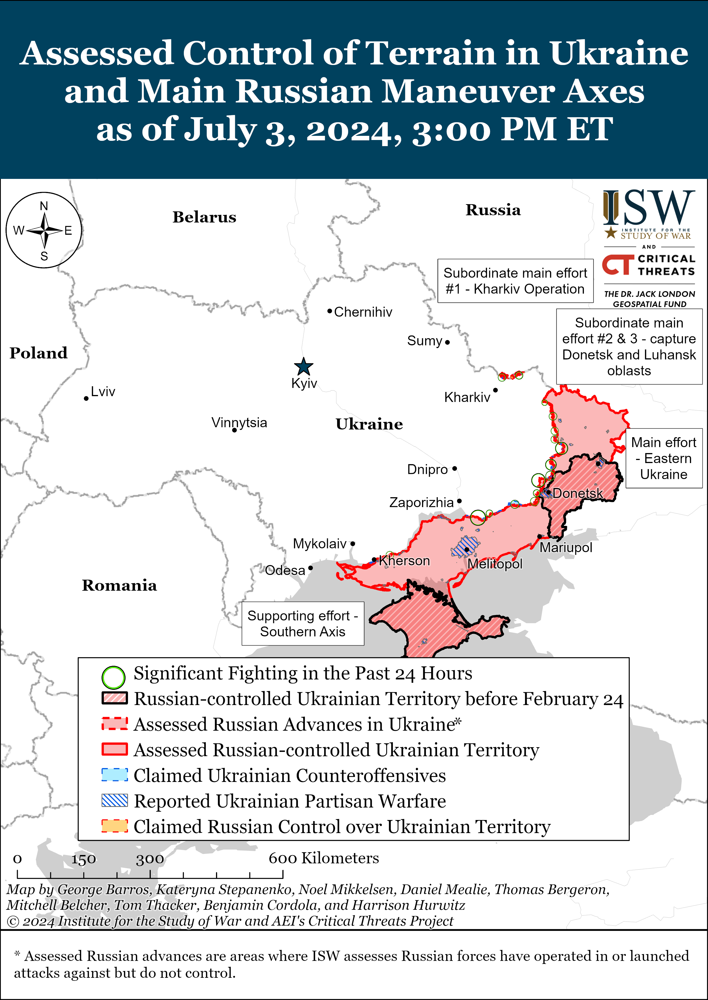
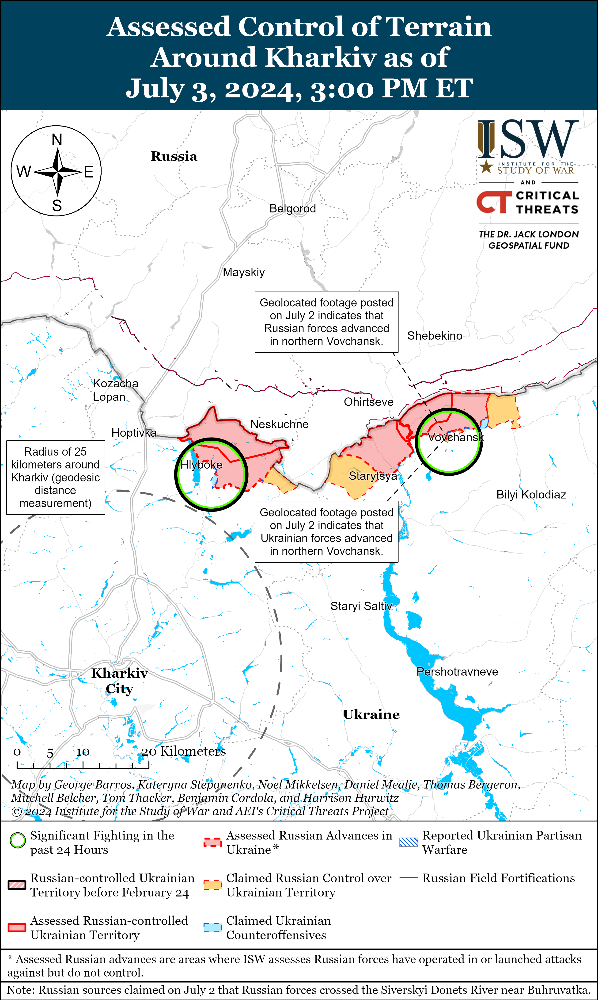
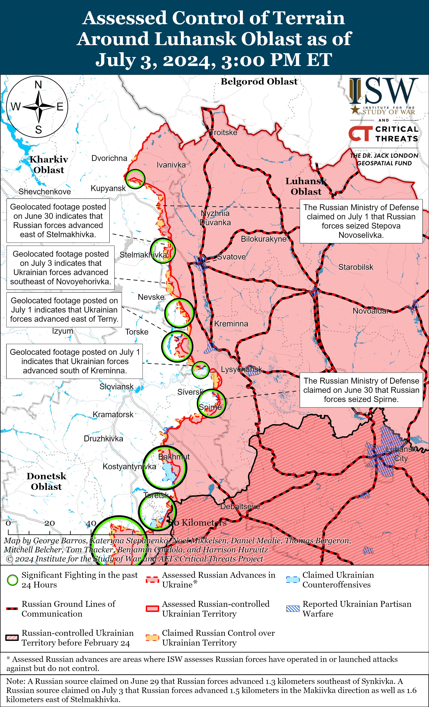
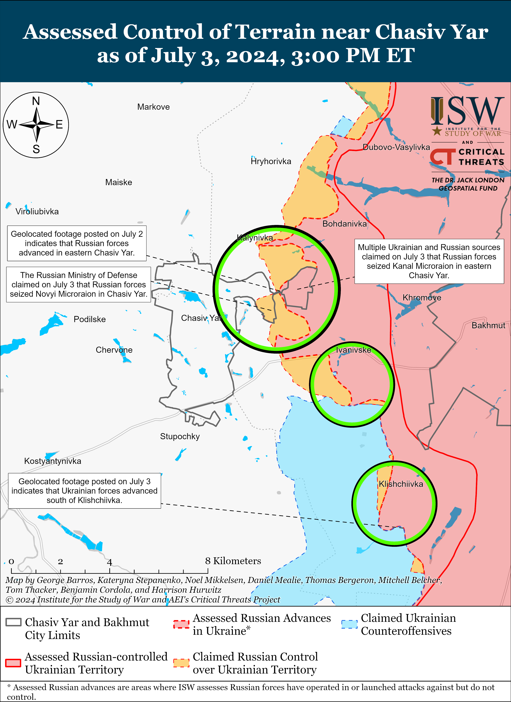
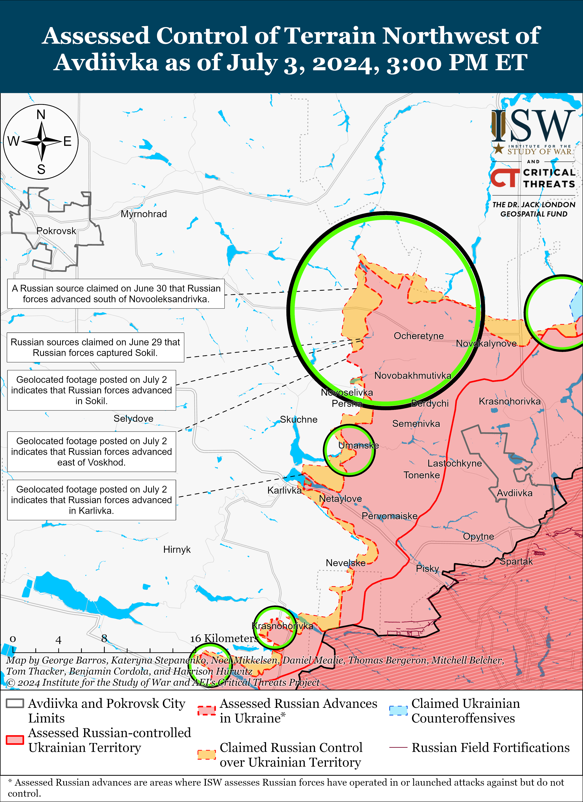
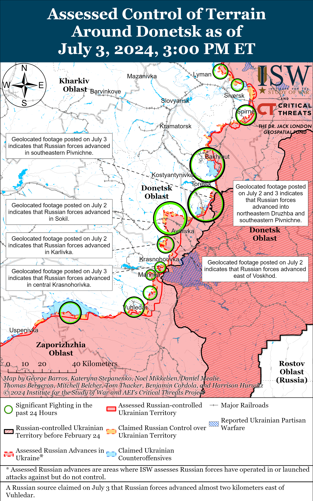
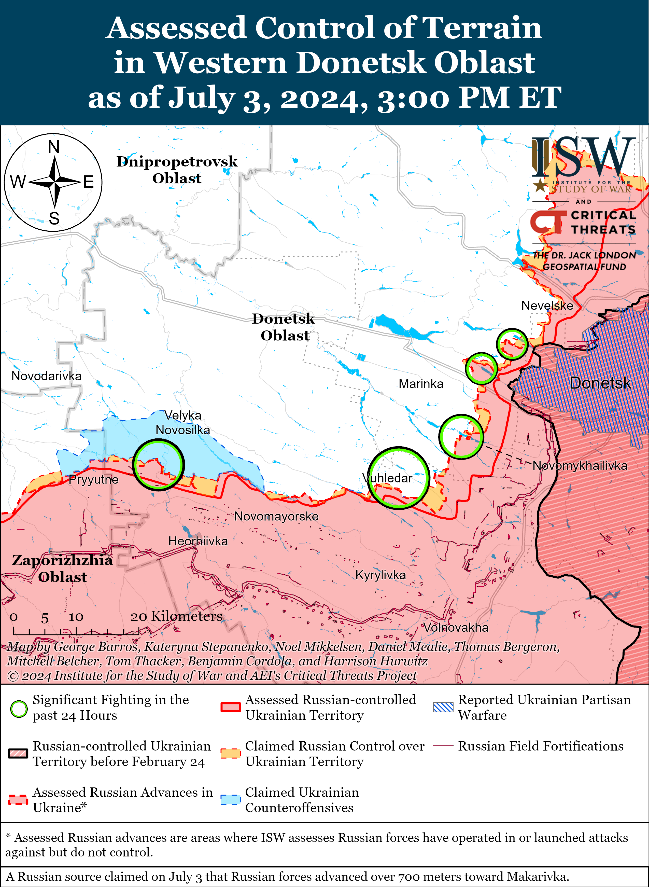
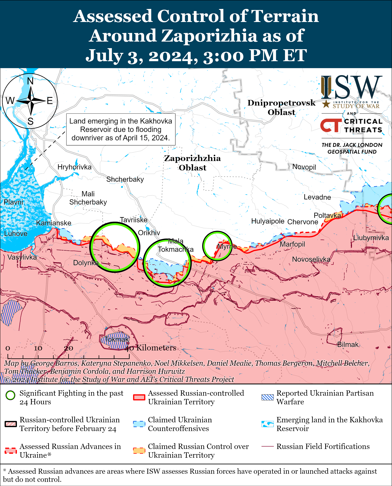
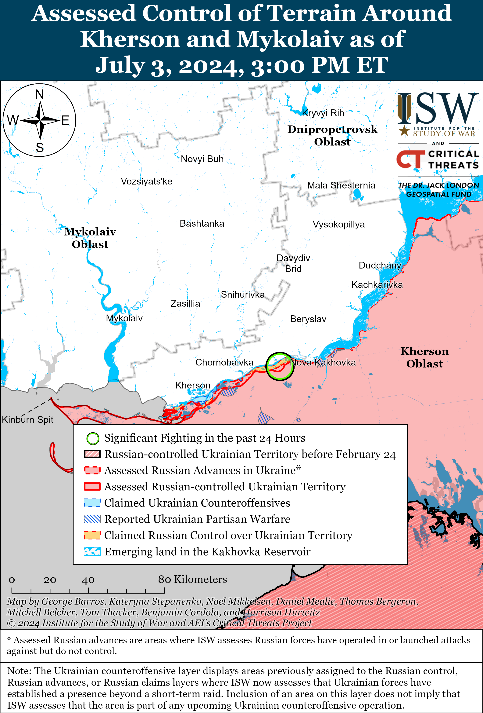

# Russian Offensive Campaign Assessment, July 3, 2024

**Riley Bailey, Grace Mappes, Karolina Hird, Nicole Wolkov, and George Barros**

**July 3, 2024, 6:30pm ET**

**Click**[**here**](https://storymaps.arcgis.com/stories/36a7f6a6f5a9448496de641cf64bd375)**to see ISW’s interactive map of the Russian invasion of Ukraine. This map is updated daily alongside the static maps present in this report.**

**Click**[**here**](https://understandingwar.maps.arcgis.com/apps/instant/3dviewer/index.html?appid=1602762dbcde419bb957dea358449580)**to see ISW’s 3D control of terrain topographic map of Ukraine. Use of a computer (not a mobile device) is strongly recommended for using this data-heavy tool.**

**Click**[**here**](https://storymaps.arcgis.com/stories/733fe90805894bfc8562d90b106aa895)**to access ISW’s archive of interactive time-lapse maps of the Russian invasion of Ukraine. These maps complement the static control-of-terrain map that ISW produces daily by showing a dynamic frontline. ISW will update this time-lapse map archive monthly.**

**Note: The data cut-off for this product was 1pm ET on July 3. ISW will cover subsequent reports in the July 4 Russian Offensive Campaign Assessment.**

**Ukraine is addressing its manpower challenges and is forming several new brigades, but delayed and insufficient Western weapons deliveries will likely prevent Ukraine from equipping all these new brigades. Timely and appropriate Western security assistance continues to be a crucial determinant of when and at what scale Ukrainian forces can contest the battlefield initiative and conduct operationally significant counteroffensive operations in the future.**UkrainianPresident Volodymyr Zelensky stated in an interview with *Bloomberg*published on July 3 that Ukrainian forces are better positioned in terms of manpower than they were a few months ago and that Ukraine’s ability to conduct a future counteroffensive operation depends on equipping brigades with heavy equipment, such as mechanized fighting vehicles, armored personnel carriers, tanks, and heavy artillery (likely referencing at least 10 planned new Ukrainian brigades.)[1] The commander of a Ukrainian brigade operating near Chasiv Yar provided a similar assessment at the tactical level on July 3, stating that Ukrainian forces in his area of operations are more in need of ammunition than manpower.[2] Zelensky stated that military equipment is taking too long to arrive at the front, however, echoing his comments from early June 2024 about how the slow arrival of US security assistance was complicating Ukrainian efforts to equip reserve brigades sufficiently to commit them to defensive operations.[3] Ukrainian media has routinely highlighted in recent months the lack of sufficient materiel for equipping all the new Ukrainian brigades currently being formed, and current reporting suggests that Ukraine will not be able to fully equip all their upcoming brigades without the arrival of additional Western security assistance.[4] The months-long delay of Western security assistance exacerbated challenges with Ukraine’s force mobilization efforts.[5]

Ukraine’s ability to conduct operationally significant counteroffensive operations at the time of its choosing is crucial to avoid protracting the war. Russian President Vladimir Putin’s theory of victory that Russia will be able to make creeping advances in Ukraine indefinitely is likely incentivizing Putin to protract the war and hardening his commitment to destroying Ukrainian statehood, and Putin is unlikely to change his calculus without Ukraine inflicting further significant defeats on Russian forces.[6] Ukraine does not have the time and flexibility to wait for Western security assistance to equip new units. Russian forces are likely currently attempting to leverage the theater-wide initiative to try to force Ukraine to commit manpower and materiel to current defensive operations and to prevent Ukraine from accumulating the decisive personnel and resources it needs to contest the initiative.[7] The longer Ukraine must wait to equip and deploy new brigades the more opportunities Russian forces will have to disrupt Ukrainian efforts to concentrate new uncommitted combat power for future counteroffensive operations. Western security assistance that allows Ukrainian forces to equip new units will ease these pressures, and more certainty in what forces will be available will permit Ukraine to start concretely planning future counteroffensive operations. Western security assistance that provides Ukrainian forces with the necessary equipment and weapons at the scale, timing, and regularity required for operations that liberate significant swaths of occupied Ukraine remains the only likely path for reducing Putin’s current commitment to destroying Ukrainian statehood and identity.[8]

**Russian President Vladimir Putin is leveraging existing Eurasian-focused and Russian-led international organizations as the cornerstone for his new proposed alternative “Eurasian security architecture.”**Russian Defense Minister Andrey Belousov stated during the Commonwealth of Independent States (CIS) Defense Ministers’ meeting on July 3 that Putin’s recently-announced “Eurasian security structure” will cover “all spheres of activity” and is “open to all Eurasian countries without exception.”[9] Belousov emphasized the importance of the Russian-Belarusian Union State, Collective Security Treaty Organization (CSTO), Eurasian Economic Union (EAEU), CIS, and Shanghai Cooperation Organization (SCO) in the creation of this new Eurasian security architecture.[10] Putin previously emphasized on June 21 that Russia wants to discuss Eurasian security issues with these international organizations and BRICS.[11]

Putin held bilateral meetings with the heads of various SCO member states, observers, and dialogue partners on the sidelines of the SCO summit on July 3, including Turkish President Recep Tayyip Erdogan, People’s Republic of China (PRC) President Xi Jinping, Azerbaijani President Ilham Aliyev, Pakistani Prime Minister Shehbaz Sharif, Mongolian President Ukhnaagiin Khürelsükh, and Kazakh President Kassym-Jomart Tokayev.[12] The Kremlin readouts for each meeting were largely boilerplate and emphasized a long history of friendly relations, strong trade, and growing energy cooperation — all portraying Russia as part of a network of friendly economic partners within Eurasia despite Western sanctions. Putin has been attempting to create a coalition of states friendly to act as an alternative to the West and undermine NATO and has recently pursued the PRC, North Korea, Vietnam, and Venezuela in support of this coalition, and is especially seeking to persuade and portray the PRC as invested in this Eurasian security architecture.[13] Senior Russian officials including Kremlin Spokesperson Dmitry Peskov and Foreign Minister Sergey Lavrov celebrated the July 3 Putin-Xi meeting as having gone “excellently” and with “complete mutual understanding,” while Xi reiterated ongoing Kremlin information operations aimed at undermining the Ukrainian peace formula.[14] Putin and Khürelsükh discussed further developing rail infrastructure between Russia and Mongolia, and the Kremlin’s readout of the meeting emphasized that these rail lines would increase logistics between Russia and the PRC through Mongolia and enable trilateral trade, while the official Mongolian readout did not include this emphasis.[15]

**Ukraine conducted a naval drone strike against Russian naval infrastructure in Novorossiysk, Krasnodar Krai on the night July 3 and reportedly damaged energy infrastructure during an aerial drone strike on Belgorod Oblast on the night of July 1.**The Russian Ministry of Defense (MoD) claimed that Russian Black Sea Fleet (BSF) forces destroyed three Ukrainian naval drones *en route* to Novorossiysk, and the Russian MoD and Russian milbloggers later amplified footage reportedly showing BSF elements repelling naval drones that were reportedly targeting the Russian naval base in Novorossiysk.[16] Novorossiysk Mayor Andrey Kravchenko confirmed the attack and announced the closure of beaches.[17] Ukrainian Naval Spokesperson Captain Third Rank Dmytro Pletenchuk noted on July 3 that the Ukrainian Navy is not yet ready to confirm details of the attack, however. ISW has not yet observed visual evidence of the attack damaging Russian naval targets.[18]

Ukrainian outlet *Suspilne*, citing sources within the Ukrainian special forces, reported on June 3 that a June 1 Ukrainian drone strike “seriously damaged” the Oskol Electrometallurgical Plant (OEMK) in Belgorod Oblast.[19] *Suspilne*stated that Ukrainian loitering munitions targeted two OEMK electrical substations—the Stary Oskol Substation near Neznamovo and the Metalurgiyna Substation near Volokonovka— causing the entire OMEK to lose power.[20] *Suspilne* noted that the OMEK is the only full-cycle metallurgical enterprise in Russia, so an outage could severely impact metallurgical outputs.[21] Russian sources noted electricity outages near Stary Oskol on July 1, apparently as a result of the Ukrainian strike.[22]

**Unspecified People’s Republic of China (PRC) and Russian companies are reportedly working together to develop a drone similar to the Iranian-designed Shahed loitering munition for Russia to use in Ukraine.** Two unspecified European officials told *Bloomberg*in a July 2 article that unspecified Russian and PRC companies held talks in 2023 about collaborating to “replicate” Shahed drones and started developing and testing a prototype in 2024.[23] The officials stated the companies are preparing to ship the drones to Russia but that Russian forces have yet to use the drones against Ukraine. *Bloomberg*reported that, according to another official familiar with the matter, the United States assesses that the PRC is not currently providing lethal aid to Russia but is sending kits to Russia that Russia can convert into attack drones, while continuing to consider whether to send fully built drones to Russia. ISW cannot independently verify any of these reported officials’ statements. Ukrainian President Volodymyr Zelensky stated in an interview with *Bloomberg*published on July 3 that Ukraine does not have evidence that the PRC is providing Russia with weapons but noted that Russia has acquired dual-use goods from the PRC. US Secretary of State Antony Blinken stated on May 1 that the PRC’s export of dual-use goods to Russia have helped Russia significantly increase its defense production and that Russia is acquiring 70 percent of its machine tools and 90 percent of its microelectronics from the PRC.[24] The provision of jointly PRC- and Russian-made loitering munitions to Russia to use in Ukraine would be a significant inflection in PRC-Russian relations and would suggest that Russian President Vladimir Putin had secured a notable concession from PRC President Xi Jinping given that ISW continues to assess that the PRC is attempting to portray itself as a neutral mediator and retains the upper hand in PRC-Russian relations.[25]

**Key Takeaways:**

- **Ukraine is addressing its manpower challenges and is forming several new brigades, but delayed and insufficient Western weapons deliveries will likely prevent Ukraine from equipping all these new brigades. Timely and appropriate Western security assistance continues to be crucial determinant of when and at what scale Ukrainian forces can contest the battlefield initiative and conduct operationally significant counteroffensive operations in the future.**
- **Russian President Vladimir Putin is leveraging existing Eurasian-focused and Russian-led international organizations as the cornerstone for his new proposed alternative “Eurasian security architecture.”**
- **Ukraine conducted a naval drone strike against Russian naval infrastructure in Novorossiysk, Krasnodar Krai on the night July 3 and reportedly damaged energy infrastructure during an aerial drone strike on Belgorod Oblast on the night of July 1.**
- **Unspecified People’s Republic of China (PRC) and Russian companies are reportedly working together to develop a drone similar to the Iranian-designed Shahed loitering munition for Russia to use in Ukraine.**
- **Russian forces recently advanced within easternmost Chasiv Yar, in the Toretsk direction, and near Avdiivka, and Ukrainian forces recently advanced within Vovchansk, near Kreminna, and southeast of Chasiv Yar.**
- **The Kremlin continues efforts to position Russian veterans that have fought in Ukraine in official roles in Russian domestic politics.**

[****](https://understandingwar.org/wp-content/uploads/2025/05/DraftUkraineCOTJuly032C2024.png)

***We do not report in detail on Russian war crimes because these activities are well-covered in Western media and do not directly affect the military operations we are assessing and forecasting. We will continue to evaluate and report on the effects of these criminal activities on the Ukrainian military and the Ukrainian population and specifically on combat in Ukrainian urban areas. We utterly condemn Russian violations of the laws of armed conflict and the Geneva Conventions and crimes against humanity even though we do not describe them in these reports.***

- Russian Main Effort – Eastern Ukraine (comprised of three subordinate main efforts)
- Russian Subordinate Main Effort #1 – Push Ukrainian forces back from the international border with Belgorod Oblast and approach to within tube artillery range of Kharkiv City
- Russian Subordinate Main Effort #2 – Capture the remainder of Luhansk Oblast and push westward into eastern Kharkiv Oblast and encircle northern Donetsk Oblast
- Russian Subordinate Main Effort #3 – Capture the entirety of Donetsk Oblast
- Russian Supporting Effort – Southern Axis
- Russian Air, Missile, and Drone Campaign
- Russian Mobilization and Force Generation Efforts
- Russian Technological Adaptations
- Activities in Russian-occupied areas
- Ukrainian Defense Industrial Base Efforts
- Russian Information Operations and Narratives
- Significant Activity in Belarus

**Russian Main Effort – Eastern Ukraine**

**Russian Subordinate Main Effort #1 – Kharkiv Oblast****(Russian objective: Push Ukrainian forces back from the international border with Belgorod Oblast and approach to within tube artillery range of Kharkiv City)**

Russian forces continue sabotage and reconnaissance activities along the border with Sumy Oblast, likely as part of an effort to fix and draw Ukrainian forces along a wider front in northeastern Ukraine. Sumy Oblast Military Administration Head Volodymyr Artyukh stated on July 3 that Russian sabotage and reconnaissance groups routinely attempt to cross the border and enter Sumy Oblast.[26] Artyukh stated that Ukrainian artillery units recently struck concentrations of small Russian units near Zhuravka (northeast of Sumy City and two kilometers from the border with Kursk Oblast), and geolocated footage published on June 30 shows Ukrainian forces shelling limited Russian positions north of the settlement.[27] ISW has yet to observe any evidence that Russian forces have established enduring positions near Zhuravka in Sumy Oblast. Artyukh added that Russian forces do not have enough forces in the area for large-scale offensive operations and will likely instead continue cross border sabotage and reconnaissance activities.[28]

Ukrainian forces recently made marginal gains within Vovchansk (northeast of Kharkiv City) amid continued fighting in northern Kharkiv Oblast on July 3. Geolocated footage published on July 3 indicates that Ukrainian forces recently advanced along Soborna Street in central Vovchansk.[29] Fighting continued near and within Vovchansk and near Hlyboke and Lyptsi (both north of Kharkiv City) on July 2 and 3.[30] Elements of the Russian 79th Motorized Rifle Regiment (18th Motorized Rifle Division, 11th Army Corps [AC], Leningrad Military District [LMD]) and unspecified Chechen Akhmat Spetsnaz elements are reportedly operating near Vovchansk.[31]

**Russian Subordinate Main Effort #2 – Luhansk Oblast****(Russian objective: Capture the remainder of Luhansk Oblast and push westward into eastern Kharkiv Oblast and northern Donetsk Oblast)**

Ukrainian forces recently marginally advanced northwest of Kreminna amid continued Russian ground attacks along the Kupyansk-Svatove-Kreminna line on July 3. Geolocated footage published on July 2 shows that Ukrainian forces recently marginally advanced southeast of Novoyehorivka (northwest of Kreminna).[32] Russian milbloggers claimed that Russian forces marginally advanced into Makiivka (northwest of Kreminna) and that Ukrainian forces conducted two unsuccessful counterattacks in the area. However, ISW has not observed visual confirmation of these claims.[33] Another milblogger claimed that Russian forces advanced 1.6 kilometers in depth east of Stelmakhivka (southeast of Kupyansk).[34] Russian forces also continued attacking northeast of Kupyansk near Synkivka; east of Kupyansk near Petropavlivka; southeast of Kupyansk near Ivanivka; northwest of Kreminna near Nevske and Hrekivka; west of Kreminna near Terny and Torske; and south of Kreminna in the Serebryanske forest area.[35]

**Russian Subordinate Main Effort #3 – Donetsk Oblast****(Russian objective: Capture the entirety of Donetsk Oblast, the claimed territory of Russia’s proxies in Donbas)**

Russian forces continued ground attacks in the Siversk direction on July 3 but did not make any confirmed advances. A prominent Kremlin-affiliated Russian milblogger claimed that Russian forces are breaking through Ukrainian defenses and gaining positions in windbreaks near Spirne (southeast of Siversk).[36] Russian and Ukrainian sources reported continued fighting northeast of Siversk near Bilohorivka and near Spirne, Vyimka, and Ivano-Darivka (all southeast of Siversk) on July 3.[37] Elements of the Russian 106th Airborne (VDV) Division are reportedly continuing to operate near Rozdolivka (south of Siversk).[38]

Russian forces recently advanced within easternmost Chasiv Yar. A Ukrainian battalion commander operating in the Kanal Microraion reported in a now-deleted Telegram post that Russian forces have entirely seized the Kanal Microraion as of July 2 and warned of further advances towards Chasiv Yar.[39] Ukrainian military observed Kostyantyn Mashovets also reported on July 2 that Ukrainian forces have “completely lost” the Kanal Microraion.[40] The Russian MoD claimed on July 3 that Russian forces completely seized the Novyi Microraion (eastern Chasiv Yar), and other Russian milbloggers claimed that elements of the 98th VDV Division additionally seized the Kanal Microraion (easternmost Chasiv Yar, just northeast of Novyi Microraion).[41] ISW has not yet observed visual confirmation of Russian forces operating within Novyi Microraion but assesses that Ukrainian forces have likely withdrawn as reported. Russian forces will likely soon begin efforts to attack across the Siversky-Donets Donbas Canal into central Chasiv Yar from their positions in the Kanal Microraion if they have not already. The Ukrainian General Staff reported that Russian forces also attacked north of Chasiv Yar near Kalynivka; east of Chasiv Yar near Ivanivske; and southeast of Chasiv Yar near Klishchiivka.[42] Elements of the 200th Motorized Rifle Brigade (14th Army Corps [AC], Leningrad Military District [LMD]) are reportedly operating on the flanks of Chasiv Yar.[43]

Ukrainian forces recently regained lost positions southeast of Chasiv Yar. Geolocated footage published on July 3 shows Ukrainian forces assaulting Russian positions along a windbreak south of Klishchiivka (southeast of Chasiv Yar).[44]

Russian forces recently made significant tactical gains in the Toretsk direction and continued offensive operations on July 3. Geolocated footage published on July 3 confirms that Russian forces have advanced over one kilometer from the previously confirmed Russian front line of own troops towards the eastern outskirts of Druzhba (east of Toretsk) and gained new positions along Sadova Street.[45] Additional geolocated footage published on July 2 and July 3 shows that Russian forces advanced about 1.8 kilometers west along Kalynova Street towards the eastern outskirts of the Pivnichne-Druzhba area (also east of Toretsk) and into southeastern Pivnichne.[46] These relatively large gains likely did not occur over the last 24-hour period as Russian sources claimed many previously unconfirmed smaller gains near Toretsk over the past several days. ISW has only recently observed geolocated footage to adjust the frontline. A Russian milblogger claimed that Russian forces advanced to the southern part of Niu-York and captured parts of Yurivka (both south of Toretsk), and Mashovets stated that Ukrainian forces have likely lost parts of southern Niu-York.[47] The Ukrainian General Staff reported that Russian forces attacked near Niu-York, Zalizne (southwest of Toretsk), Pivdenne and Pivnichne (both southeast of Toretsk), and northwest of Toretsk near Dyliivka and Bila Hora.[48]

Russian forces reportedly advanced northwest and west of Avdiivka on July 3, but there were no confirmed changes to the frontline. Russian milbloggers claimed that Russian forces advanced westward along the T-0511 (Ocheretyne-Myrnohrad) highway northeast of Prohres (northwest of Avdiivka) and in fields near the Karlivske Reservoir southwest of Yasnobrodivka (west of Avdiivka).[49] ISW has not observed visual confirmation of Russian advances in either of these areas, however. Russian milbloggers also claimed that Russian forces are attacking both banks of the Karlivske Reservoir, including the southern bank near Karlivka (southwest of Avdiivka) and the northern bank near Yasnobrodivka.[50] The Ukrainian General Staff reported that Russian forces conducted ground attacks north of Avdiivka near Kalynove and Panteleymonivka; northwest of Avdiivka near Vozdvyzhenka, Novooleksandrivka, Prohres, Yevhenivka, and Novoselivka Persha; and west of Avdiivka near Umanske and Yasnobrodivka.[51] Elements of the 433rd Motorized Rifle Regiment (27th Motorized Rifle Division, 2nd Combined Arms Army [CAA], Central Military District [CMD]) are reportedly operating near Sokil (northeast of Avdiivka).[52]

Russian forces recently made confirmed advances west of Donetsk City and continued offensive operations west and southwest of Donetsk City on July 3. Geolocated footage published on July 3 shows that Russian forces advanced northwest along Akademik Korolev Street in central Krasnohorivka (west of Donetsk City).[53] Russian milbloggers also claimed that Russian forces also advanced within central Krasnohorivka along Michurin, Vidrozhennya, Haharin, Kalynov, Suvorov, Chkalov, Chekhov, and Matrosov streets.[54] One milblogger also claimed that Russian forces advanced up to two kilometers in the Vuhledar area (southwest of Donetsk City), but ISW has not observed visual confirmation of Russian gains here.[55] The Ukrainian General Staff reported that Russian forces attacked west of Donetsk City near Krasnohorivka and Heorhiivka and southwest of Donetsk City near Paraskoviivka, Kostyantynivka, and Vodyane on July 3.[56]

Russian forces continued ground attacks in the Donetsk-Zaporizhia Oblast border area on July 3 but did not make any confirmed advances. One Russian milblogger claimed that Russian forces advanced in fields north and west of Staromayorske (south of Velyka Novosilka) and another milblogger claimed that Russian forces advanced up to 700 meters towards Makarivka (also south of Velyka Novosilka and just north of Staromayorske) although ISW has not yet observed visual confirmation of these claims.[57] The Ukrainian General Staff reported Russian ground attacks near Urozhaine (south of Velyka Novosilka).[58] Elements of the Russian Eastern Military District (EMD), including the 64th Motorized Rifle Regiment (35th CAA) and 39th Motorized Rifle Brigade (68th AC) are reportedly operating in the Donetsk-Zaporizhia Oblast border area.[59]

**Russian Supporting Effort – Southern Axis****(Russian objective: Maintain frontline positions and secure rear areas against Ukrainian strikes)**

Fighting continued in western Zaporizhia Oblast on July 3, but there were no confirmed changes to the frontline. Russian forces conducted ground attacks near Robotyne, north of Robotyne near Novodanylivka, northeast of Robotyne near Novopokrovka, and northwest of Robotyne near Shcherbaky and Novoandriivka.[60] Elements of the Russian 392nd Motorized Rifle Regiment (likely a reformed Soviet-era unit) and 19th Motorized Rifle Division (58th Combined Arms Army [CAA], Southern Military District [SMD]) reportedly continue operating in the Zaporizhia direction.[61]

Fighting continued in the east (left) bank of Kherson Oblast near Krynky and on the Dnipro River Delta islands on July 3.[62]

A Russian milblogger claimed on July 3 that a June 30 Ukrainian HIMARS strike against a Russian “Dnepr” Grouping of Forces command post near occupied Henichesk, Kherson Oblast may have wounded “Dnepr” Grouping of Forces and Airborne Forces (VDV) Commander Colonel General Mikhail Teplinsky.[63] ISW has not observed evidence to support this claim and cannot verify the milblogger’s claim. ISW has not yet observed similar claims from any other milbloggers.

**Russian Air, Missile, and Drone Campaign****(Russian Objective: Target Ukrainian military and civilian infrastructure in the rear and on the frontline)**

Russian forces conducted a limited drone and missile strike against Ukraine on the morning of July 3, hitting civilian areas in Dnipro City. Ukrainian officials reported on July 3 that Russian forces launched three Iskander-K cruise missiles, four Kh-59 cruise missiles, and five Shahed-136/131 drones mainly at Dnipropetrovsk Oblast in the morning and that Ukrainian forces shot down one Iskander-K missile, four Kh-59 missiles, and all five Shaheds.[64] Dnipropetrovsk Oblast Military Administration Head Serhiy Lysak reported that the Russian strike killed at least four civilians and injured at least 53 more, and Ukrainian President Volodymyr Zelensky reported that Russian forces struck a shopping center, houses, and a hospital in Dnipro City.[65] Russian milbloggers claimed that Russian forces struck Dovhyntseve Airfield near Kryvvi Rih and the Yuzhmash defense enterprise on the outskirts of Dnipro City.[66]

**Russian Mobilization and Force Generation Efforts****(Russian objective: Expand combat power without conducting general mobilization)**

The Kremlin continues efforts to position Russian veterans that have fought in Ukraine in official roles in Russian domestic politics. The ruling United Russia party announced on July 2 that it will nominate 342 veterans of the war in Ukraine as United Russia candidates in Russian regional elections in September 2024.[67] United Russia noted that some of these candidates are part of the “Time of Heroes” program – an initiative that Russian President Vladimir Putin announced in April 2024 to train veterans of the war in Ukraine to assume roles in the Russian government. ISW continues to assess that the “Time of Heroes” initiative may be part of ongoing Kremlin efforts to incentivize Russians to sign military service contracts in exchange for compensation and state benefits and to appease the growing veteran population by offering veterans official roles.[68]

Russian milbloggers continued to claim that Russian commanders are deploying injured personnel to the frontline. A Russian milblogger published a letter from a Russian soldier in the 205th Motorized Rifle Brigade (49th Combined Arms Army [CAA], Southern Military District [SMD]) on July 2 who claimed that the brigade’s commander is deploying groups of wounded soldiers to the frontline despite the soldiers having the proper medical documents indicating their injuries.[69] The soldier claimed that commanders are threatening wounded personnel with criminal charges if they refuse to conduct assaults and noted that issuing complaints with the military prosecutor’s office in Bodyonnovsk, Stavropol Krai (where the brigade is garrisoned) is pointless. The soldier claimed that the military prosecutor’s office transfers the identities of those who submit complaints to the brigade commander, who then orders these individuals to conduct assaults. Russian milbloggers previously criticized the Russian MoD for the mistreatment of personnel of the 205th Motorized Rifle Brigade in August 2023, although other Russian milbloggers responded to the soldier’s complaint and noted that similar instances are prevalent across the entire frontline.[70]

**Russian Technological Adaptations (Russian objective: Introduce technological innovations to optimize systems for use in Ukraine)**

Nothing significant to report.

**Ukrainian Defense Industrial Efforts****(Ukrainian objective: Develop its defense industrial base to become more self-sufficient in cooperation with US, European, and international partners)**

*ISW is not publishing coverage of Ukrainian defense industrial efforts today.*

**Activities in Russian-occupied areas****(Russian objective: Consolidate administrative control of annexed areas; forcibly integrate Ukrainian citizens into Russian sociocultural, economic, military, and governance systems)**

*ISW is not publishing coverage of activities in Russian-occupied areas today.*

**Russian Information Operations and Narratives**

Russia continues demonstrative naval posturing in the Western hemisphere as part of its reflexive control campaign to encourage Western self-deterrence. The Russian MoD stated on July 2 that a detachment of Russian Northern Fleet ships, including a frigate and a medium sea tanker, arrived at the port of La Guaira, Venezuela.[71] The Russian port call in Venezuela follows a Russian naval port call to and military exercises near Havana, Cuba from June 12 to 17.[72] Russia and Venezuela recently signed a memorandum of understanding (MOU) aimed at countering “coercive measures,” likely to demonstrate to the West that the Kremlin holds influence in the Western hemisphere.[73] Russian naval posturing in the Caribbean likely aims to bolster Kremlin narratives threatening a wider geopolitical confrontation with the West over the war in Ukraine and encourage Western self-deterrence.[74]

The CEO of Microsoft’s Digital Threat Analysis Center, Clint Watts, stated that Russian authorities continue to promote longstanding information operations aimed at audiences in the West.[75] Watts stated in an interview with Russian opposition outlet *Meduza* published on July 3 that the Russian Presidential Administration is increasingly organizing Russian information operations and that the Russian General Staff’s Main Directorate (GRU) is involved with “telegrammers” in occupied Ukraine, likely referencing Russian milbloggers.[76] Watts stated that Russian information operations continue to primarily focus on undermining Western support for Ukraine but are also attempting to appeal to “traditional values” to “coordinate” with nationalistically minded audiences in Europe and the United States.[77] Watts stated that Russian actors continue to regularly promote information operations falsely alleging that Ukraine is the aggressor in the war and depicting Ukraine as a remarkably corrupt country.[78]

Russian milbloggers continued to amplify criticisms of Ukrainian commanders from a Ukrainian official on July 3.[79]

Russian legal authorities continue to accuse, investigate, and sentence detained Ukrainian military personnel for alleged war crimes committed before the full-scale invasion to support long-standing Kremlin justifications about the war in Ukraine.[80]

**Significant activity in Belarus****(Russian efforts to increase its military presence in Belarus and further integrate Belarus into Russian-favorable frameworks and Wagner Group activity in Belarus)**

Belarusian President Alexander Lukashenko continues to use military posturing to support the Kremlin’s ongoing reflexive control campaign aimed at undermining Western support for Ukraine. Lukashenko claimed on July 2 that Belarusian and Russian air force and air defense forces are on “high alert” and that Belarus has deployed Iskander and Polonez missile systems capable of delivering tactical nuclear weapons to unspecified positions.[81] Lukashenko emphasized that Belarus will not engage in any military actions, including border engagements with Ukraine. Lukashenko stated on July 3 that the Union State is at its highest defensive capabilities as demonstrated by the July 3 Belarusian Independence Day parade, the Union State’s interaction with the Collective Security Treaty Organization (CSTO), and military cooperation with the People’s Republic of China (PRC).[82] Belarusian state media published footage of the parade on July 3, notably including an Iskander system with ostentatious radiation hazard symbols.[83]

**Note: ISW does not receive any classified material from any source, uses only publicly available information, and draws extensively on Russian, Ukrainian, and Western reporting and social media as well as commercially available satellite imagery and other geospatial data as the basis for these reports. References to all sources used are provided in the endnotes of each update.**

****

---

[1] https://isw.pub/UkrWar051024; https://www.bloomberg.com/news/articles/2024-07-03/zelenskiy-challenges-trump-to-reveal-plans-for-quick-end-to-war?srnd=homepage-europe ; https://www.economist.com/europe/2024/05/10/ukraine-will-hold-if-it-gets-the-arms-it-needs-says-a-top-general

[2] https://t.me/official24ombr/151 ; https://x.com/666\_mancer/status/1808459123995922565

[3] https://www.bloomberg.com/news/articles/2024-07-03/zelenskiy-challenges-trump-to-reveal-plans-for-quick-end-to-war?srnd=homepage-europe ; https://understandingwar.org/backgrounder/russian-offensive-campaign-assessment-june-1-2024

[4] https://defence-ua.com/army\_and\_war/u\_zsu\_je\_mozhlivist\_navchati\_10\_brigad\_odnochasno\_ale\_skilki\_partneri\_majut\_peredati\_na\_nih\_ozbrojennja-13942.html ; https://expres.online/lyudi-i-problemi/zsu-formuyut-novi-viyskovi-brigadi-dlya-posilennya-pozitsiy-a-chi-bude-u-nikh-zbroya ; https://24tv.ua/zelenskiy-ramshtayni-zayaviv-shho-ukrayina-formuye-novi-brigadi\_n2543709

[5] https://understandingwar.org/backgrounder/how-delays-western-aid-gave-russia-initiative-ukrainian-counteroffensive-kharkiv

[6] https://understandingwar.org/backgrounder/russian-offensive-campaign-assessment-june-30-2024

[7] https://isw.pub/UkrWar060724 ; https://understandingwar.org/backgrounder/russian-offensive-campaign-assessment-june-30-2024

[8] https://understandingwar.org/backgrounder/russian-offensive-campaign-assessment-june-30-2024

[9] https://t.me/mod\_russia/40618; https://t.me/tass\_agency/258444

[10] https://t.me/mod\_russia/40618; https://t.me/tass\_agency/258444

[11] https://isw.pub/UkrWar062124; http://kremlin dot ru/events/president/news/74363

[12] http://kremlin dot ru/events/president/news/74462; http://kremlin dot ru/events/president/news/74462; http://kremlin dot ru/events/president/news/74458; https://t.me/MID\_Russia/42842; http://kremlin dot ru/events/president/news/74460; https://t.me/MID\_Russia/42847; http://kremlin dot ru/events/president/news/74461; https://t.me/MID\_Russia/42849; http://kremlin dot ru/events/president/news/74457; https://t.me/MID\_Russia/42840

[13] https://isw.pub/UkrWar062524; https://isw.pub/UkrWar062824; https://isw.pub/UkrWar062124; https://understandingwar.org/backgrounder/russian-offensive-campaign-assessment-june-19-2024; https://isw.pub/UkrWar061424

[14] https://t.me/tass\_agency/258523; https://t.me/tass\_agency/258523; http://www.news dot cn/politics/leaders/20240704/55085d109bf74020980d993c2dd7fdd8/c.html

[15] https://president dot mn/29840/; http://kremlin dot ru/events/president/news/74456

[16] https://t.me/mod\_russia/40609; https://t.me/mod\_russia/40630; https://t.me/mod\_russia/40615; https://t.me/sashakots/47660; https://x.com/GirkinGirkin/status/1808423721532559446

[17] https://t.me/andriyshTime/24061 ; https://t.me/vrogov/16453 ; https://t.me/astrapress/58800 ; https://t.me/bazabazon/29142

[18] https://armyinform.com dot ua/2024/07/03/u-vms-zsu-rozpovily-pro-korabli-rf-u-novorosijsku-yakym-dovelosya-vtikaty-z-krymu/

[19] https://suspilne dot media/782373-ukrainski-droni-atakuvali-vazlivij-dla-rosijskogo-vpk-kombinat-dzerela/ ; https://www.pravda.com dot ua/rus/news/2024/07/3/7463862/ ; https://hromadske dot ua/ru/voyna/227133-ukrainskie-razvedchiki-ostanovili-rabotu-oskolskogo-metallurgicheskogo-kombinata-kotoryy-rabotaet-na-rossiyskiy-vpk ; https://armyinform.com dot ua/2024/07/03/gur-ta-svr-rozpovily-pro-udar-po-rosijskomu-metkombinatu-yakyj-vyroblyav-stal-dlya-armiyi/

[20] https://suspilne.media/782373-ukrainski-droni-atakuvali-vazlivij-dla-rosijskogo-vpk-kombinat-dzerela/

[21] https://suspilne.media/782373-ukrainski-droni-atakuvali-vazlivij-dla-rosijskogo-vpk-kombinat-dzerela/

[22] https://armyinform.com dot ua/2024/07/01/u-byelgorodskij-oblasti-rf-vnaslidok-zovnishnogo-vplyvu-znyklo-svitlo/; https://t.me/voenkorKotenok/57315; https://t.me/astrapress/58698

[23] https://www.bloomberg.com/news/articles/2024-07-02/china-is-building-and-testing-lethal-attack-drones-for-russia

[24] https://www.state.gov/secretary-antony-j-blinken-at-a-conversation-with-world-economic-forum-president-borge-brende ; https://understandingwar.org/backgrounder/russian-offensive-campaign-assessment-may-1-2024

[25] https://isw.pub/UkrWar040924 ; https://understandingwar.org/backgrounder/russian-offensive-campaign-assessment-may-17-2024 ; https://understandingwar.org/backgrounder/russian-offensive-campaign-assessment-april-16-2024

[26] https://armyinform.com dot ua/2024/07/03/buly-znyshheni-desyatky-vorozhyh-soldativ-nachalnyk-sumskoyi-ova-pro-likvidacziyu-drg-v-oblasti/

[27] https://armyinform.com dot ua/2024/07/03/buly-znyshheni-desyatky-vorozhyh-soldativ-nachalnyk-sumskoyi-ova-pro-likvidacziyu-drg-v-oblasti/ ; https://t.me/kiber\_boroshno/8839; https://t.me/marmuletik/25266; https://t.me/creamy\_caprice/5945

[28] https://armyinform.com dot ua/2024/07/03/buly-znyshheni-desyatky-vorozhyh-soldativ-nachalnyk-sumskoyi-ova-pro-likvidacziyu-drg-v-oblasti/

[29] https://x.com/Bielitzling/status/1808266415687757860; https://t.me/VARVARGROUP/274

[30] https://www.facebook.com/GeneralStaff.ua/posts/pfbid0Mc9H3164b5pkB5HH1aVCq6MLfzDQ1hvpns6tGiSiYnBdh4v9uwJMHRpJyQD6QUdjl ; https://www.facebook.com/GeneralStaff.ua/posts/pfbid0A9i63yHEPJAwF2gN3sMU6vMr4VEQbAx1o4jR7JtQHLbwqokk4bWBVdQszRDh311Ml ; https://www.facebook.com/GeneralStaff.ua/posts/pfbid02jdMXTypASRGgSjCUmi5UnGoQdQyJmLwFnDocP4nVmanDanZUQFg7tBeFvgSuQB2Zl ; https://t.me/wargonzo/20838 ; https://t.me/voenkorKotenok/57390 ; https://t.me/RVvoenkor/71710 ; https://t.me/dva\_majors/46637

[31] https://x.com/GirkinGirkin/status/1808424412011524518 ; https://x.com/Bielitzling/status/1808266415687757860; https://t.me/VARVARGROUP/274

[32] https://x.com/EjShahid/status/1808525310247203172; https://www.youtube.com/watch?v=XsExi5dKkF0

[33] https://t.me/z\_arhiv/27186; https://t.me/z\_arhiv/27186; https://t.me/z\_arhiv/27186; https://t.me/rusich\_army/15562; https://t.me/dva\_majors/46637

[34] https://t.me/dva\_majors/46637

[35] https://www.facebook.com/GeneralStaff.ua/posts/pfbid0Mc9H3164b5pkB5HH1aVCq6MLfzDQ1hvpns6tGiSiYnBdh4v9uwJMHRpJyQD6QUdjl; https://www.facebook.com/GeneralStaff.ua/posts/pfbid0A9i63yHEPJAwF2gN3sMU6vMr4VEQbAx1o4jR7JtQHLbwqokk4bWBVdQszRDh311Ml; https://www.facebook.com/GeneralStaff.ua/posts/pfbid02jdMXTypASRGgSjCUmi5UnGoQdQyJmLwFnDocP4nVmanDanZUQFg7tBeFvgSuQB2Zl; https://t.me/voenkorKotenok/57390

[36] https://t.me/rybar/61490

[37] https://www.facebook.com/GeneralStaff.ua/posts/pfbid0Mc9H3164b5pkB5HH1aVCq6MLfzDQ1hvpns6tGiSiYnBdh4v9uwJMHRpJyQD6QUdjl; https://www.facebook.com/GeneralStaff.ua/posts/pfbid0A9i63yHEPJAwF2gN3sMU6vMr4VEQbAx1o4jR7JtQHLbwqokk4bWBVdQszRDh311Ml; https://t.me/voenkorKotenok/57390; https://t.me/dva\_majors/46637

[38] https://x.com/EjShahid/status/1808238622057062773; https://t.me/vremjazov/795

[39] https://t.me/BKhodakovsky/3260; https://t.me/stranaua/160438; https://uk.tgstat dot com/channel/@BKhodakovsky/3260

[40] https://t.me/zvizdecmanhustu/2005

[41] https://t.me/mod\_russia/40629; https://t.me/DnevnikDesantnika/12431; https://t.me/motopatriot/24527; https://t.me/rus\_bakhmut/29902; https://t.me/motopatriot/24516; https://t.me/voenkorKotenok/57390; https://t.me/milinfolive/125300; https://t.me/RVvoenkor/71722

[42] https://www.facebook.com/GeneralStaff.ua/posts/pfbid0Mc9H3164b5pkB5HH1aVCq6MLfzDQ1hvpns6tGiSiYnBdh4v9uwJMHRpJyQD6QUdjl; https://www.facebook.com/GeneralStaff.ua/posts/pfbid0A9i63yHEPJAwF2gN3sMU6vMr4VEQbAx1o4jR7JtQHLbwqokk4bWBVdQszRDh311Ml

[43] https://t.me/RVvoenkor/71712

[44] https://x.com/EjShahid/status/1808542491509149783; https://x.com/EjShahid/status/1808542678188990941; https://www.youtube.com/watch?v=9unFplhkz7Q

[45] https://x.com/EjShahid/status/1808434800694329640; https://x.com/EjShahid/status/1808434954289676336; https://t.me/rubpak28/250

[46] https://t.me/creamy\_caprice/5965; https://t.me/Sladkov\_plus/10840; https://x.com/blinzka/status/1808529925672255851; https://x.com/CinC\_AFU/status/1808526587429626363

[47] https://t.me/zvizdecmanhustu/2005; https://t.me/voenkorKotenok/57390; https://t.me/z\_arhiv/27193; https://t.me/boris\_rozhin/128719 ; https://t.me/boris\_rozhin/128758

[48] https://www.facebook.com/GeneralStaff.ua/posts/pfbid0Mc9H3164b5pkB5HH1aVCq6MLfzDQ1hvpns6tGiSiYnBdh4v9uwJMHRpJyQD6QUdjl; https://www.facebook.com/GeneralStaff.ua/posts/pfbid0A9i63yHEPJAwF2gN3sMU6vMr4VEQbAx1o4jR7JtQHLbwqokk4bWBVdQszRDh311Ml

[49] https://t.me/z\_arhiv/27190; https://t.me/motopatriot/24533

[50] https://t.me/motopatriot/24533; https://t.me/wargonzo/20838

[51] https://www.facebook.com/GeneralStaff.ua/posts/pfbid0Mc9H3164b5pkB5HH1aVCq6MLfzDQ1hvpns6tGiSiYnBdh4v9uwJMHRpJyQD6QUdjl; https://www.facebook.com/GeneralStaff.ua/posts/pfbid0A9i63yHEPJAwF2gN3sMU6vMr4VEQbAx1o4jR7JtQHLbwqokk4bWBVdQszRDh311Ml

[52] https://t.me/RVvoenkor/71705

[53] https://t.me/creamy\_caprice/5970; https://t.me/Khortytsky\_wind/632

[54] https://t.me/z\_arhiv/27192; https://t.me/NgP\_raZVedka/18288

[55] https://t.me/voenkorKotenok/57390

[56] https://www.facebook.com/GeneralStaff.ua/posts/pfbid0Mc9H3164b5pkB5HH1aVCq6MLfzDQ1hvpns6tGiSiYnBdh4v9uwJMHRpJyQD6QUdjl; https://www.facebook.com/GeneralStaff.ua/posts/pfbid0A9i63yHEPJAwF2gN3sMU6vMr4VEQbAx1o4jR7JtQHLbwqokk4bWBVdQszRDh311Ml

[57] https://t.me/z\_arhiv/27188; https://t.me/rybar/61501

[58] https://www.facebook.com/GeneralStaff.ua/posts/pfbid0Mc9H3164b5pkB5HH1aVCq6MLfzDQ1hvpns6tGiSiYnBdh4v9uwJMHRpJyQD6QUdjl; https://www.facebook.com/GeneralStaff.ua/posts/pfbid0A9i63yHEPJAwF2gN3sMU6vMr4VEQbAx1o4jR7JtQHLbwqokk4bWBVdQszRDh311Ml

[59] https://t.me/voin\_dv/9521 (general border area); https://t.me/voin\_dv/9514 (near Hulyaipole/west of Velyka Novosilka)

[60] https://www.facebook.com/GeneralStaff.ua/posts/pfbid0Mc9H3164b5pkB5HH1aVCq6MLfzDQ1hvpns6tGiSiYnBdh4v9uwJMHRpJyQD6QUdjl ; https://www.facebook.com/GeneralStaff.ua/posts/pfbid0A9i63yHEPJAwF2gN3sMU6vMr4VEQbAx1o4jR7JtQHLbwqokk4bWBVdQszRDh311Ml ; https://t.me/dva\_majors/46637 ; https://t.me/voenkorKotenok/57390

[61] https://t.me/boris\_rozhin/128812 ; https://t.me/rogozin\_do/6007

[62] https://www.facebook.com/GeneralStaff.ua/posts/pfbid0Mc9H3164b5pkB5HH1aVCq6MLfzDQ1hvpns6tGiSiYnBdh4v9uwJMHRpJyQD6QUdjl ; https://www.facebook.com/GeneralStaff.ua/posts/pfbid0A9i63yHEPJAwF2gN3sMU6vMr4VEQbAx1o4jR7JtQHLbwqokk4bWBVdQszRDh311Ml ; https://t.me/DnevnikDesantnika/12422

[63] https://t.me/dosye\_shpiona/554

[64] https://www.facebook.com/GeneralStaff.ua/posts/pfbid0Mc9H3164b5pkB5HH1aVCq6MLfzDQ1hvpns6tGiSiYnBdh4v9uwJMHRpJyQD6QUdjl; https://t.me/ComAFUA/333; https://t.me/kpszsu/16107;

[65] https://t.me/dnipropetrovskaODA/14192; https://t.me/dnipropetrovskaODA/14203; https://t.me/dnipropetrovskaODA/14212; https://t.me/dnipropetrovskaODA/14213; https://t.me/V\_Zelenskiy\_official/11008; https://t.me/V\_Zelenskiy\_official/11009

[66] https://t.me/NeoficialniyBeZsonoV/37336; https://t.me/smotri\_z/32109; https://t.me/swodki/395376; https://t.me/NeoficialniyBeZsonoV/37343 ; https://t.me/RVvoenkor/71726 ; https://t.me/dva\_majors/46663 ; https://t.me/dva\_majors/46665 ; https://t.me/voin\_dv/9519 ; https://t.me/sashakots/47663 ; https://t.me/epoddubny/20289 ; https://t.me/voenkorKotenok/57381; https://t.me/DnevnikDesantnika/12425; https://t.me/DnevnikDesantnika/12425

[67] https://regnum dot ru/news/3899476

[68] https://understandingwar.org/backgrounder/russian-offensive-campaign-assessment-march-18-2024 ; https://understandingwar.org/backgrounder/russian-offensive-campaign-assessment-june-15-2024

[69] https://t.me/dva\_majors/46614

[70] https://t.me/dva\_majors/46621 ; https://t.me/dva\_majors/46621 ; https://understandingwar.org/backgrounder/russian-offensive-campaign-assessment-august-29-2023

[71] https://t.me/tass\_agency/258311

[72] https://understandingwar.org/backgrounder/russian-offensive-campaign-assessment-june-6-2024; https://abcnews.go.com/Business/wireStory/russian-warships-leave-havanas-port-after-5-day-111192438 ; https://understandingwar.org/backgrounder/russian-offensive-campaign-assessment-june-25-2024

[73] https://isw.pub/UkrWar062524 ; https://understandingwar.org/backgrounder/russian-offensive-campaign-assessment-june-12-2024

[74] https://understandingwar.org/backgrounder/russian-offensive-campaign-assessment-june-12-2024 ; https://isw.pub/UkrWar062524 ; https://understandingwar.org/backgrounder/russian-offensive-campaign-assessment-june-12-2024

[75] https://meduza dot io/feature/2024/07/03/rossiyskie-hakery-i-propagandisty-provodyat-operatsii-vliyaniya-po-vsemu-miru-naprimer-diskreditiruyut-olimpiyskie-igry-v-parizhe

[76] https://meduza dot io/feature/2024/07/03/rossiyskie-hakery-i-propagandisty-provodyat-operatsii-vliyaniya-po-vsemu-miru-naprimer-diskreditiruyut-olimpiyskie-igry-v-parizhe

[77] https://meduza dot io/feature/2024/07/03/rossiyskie-hakery-i-propagandisty-provodyat-operatsii-vliyaniya-po-vsemu-miru-naprimer-diskreditiruyut-olimpiyskie-igry-v-parizhe

[78] https://meduza dot io/feature/2024/07/03/rossiyskie-hakery-i-propagandisty-provodyat-operatsii-vliyaniya-po-vsemu-miru-naprimer-diskreditiruyut-olimpiyskie-igry-v-parizhe

[79] https://t.me/RVvoenkor/71724 ; https://t.me/marybezuhla/1741

[80] https://t.me/sledcom\_press/14318

[81] https://www.belta dot by/president/view/situatsija-na-granitse-s-ukrainoj-migranty-i-neozhidannyj-obmen-zakljuchennymi-gorjachie-podrobnosti-645286-2024/

[82] https://www.belta dot by/president/view/lukashenko-uroven-oboronosposobnosti-sojuznogo-gosudarstva-kak-nikogda-vysok-645328-2024/

[83] https://t.me/sashakots/47664; https://t.me/belta\_telegramm/256209
