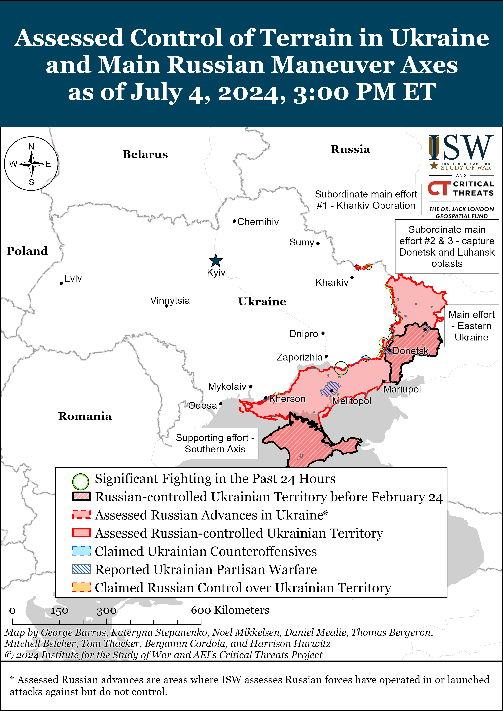
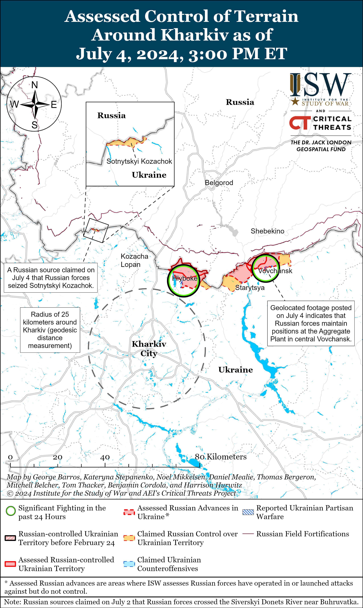
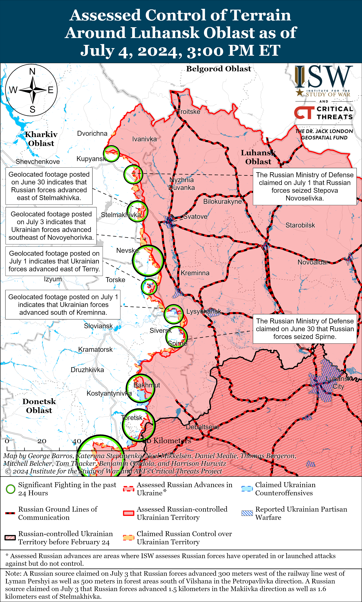
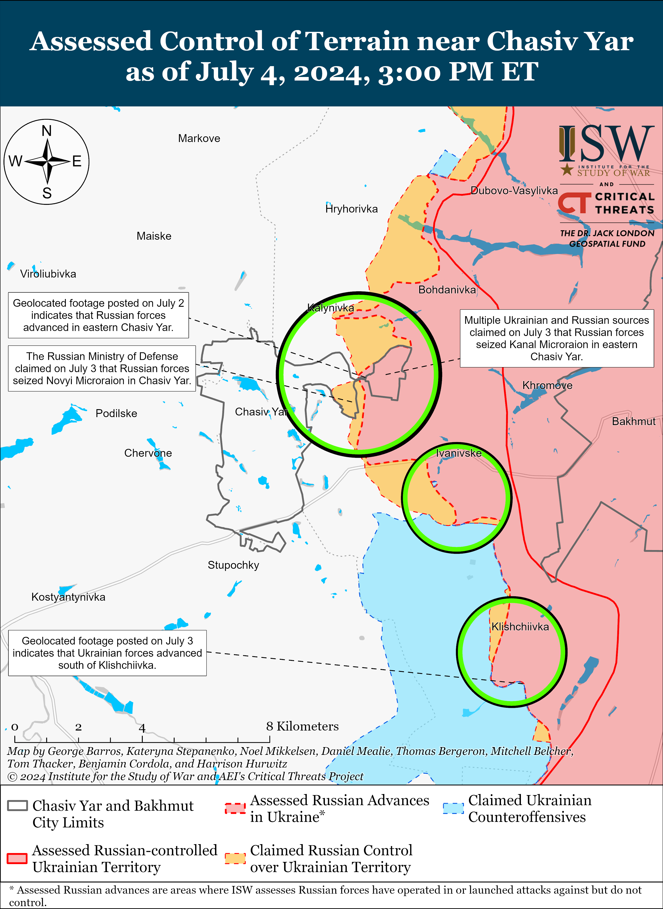
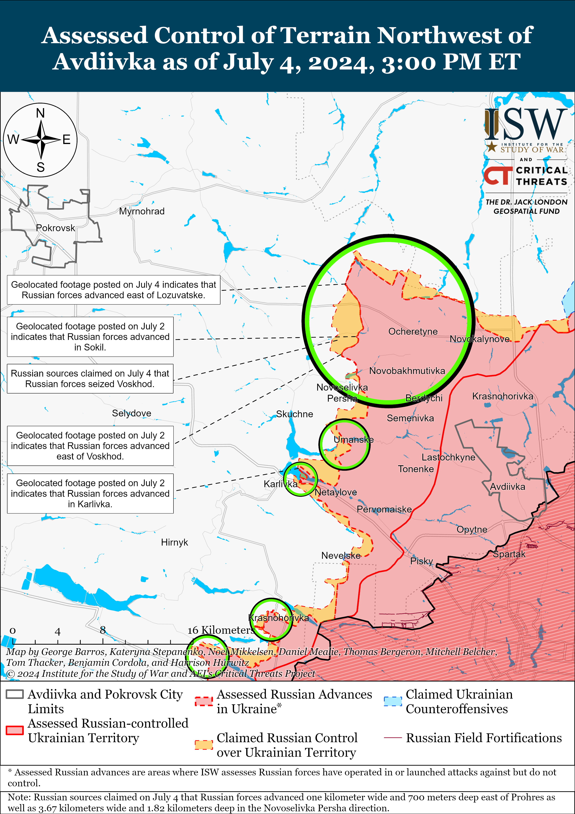
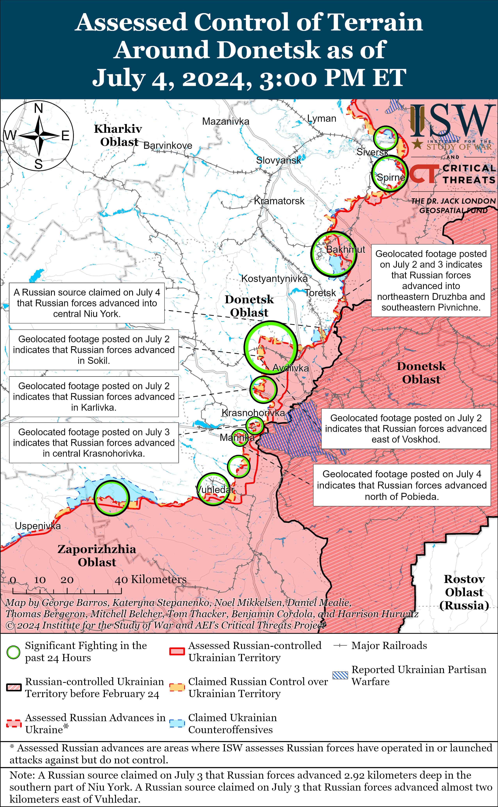
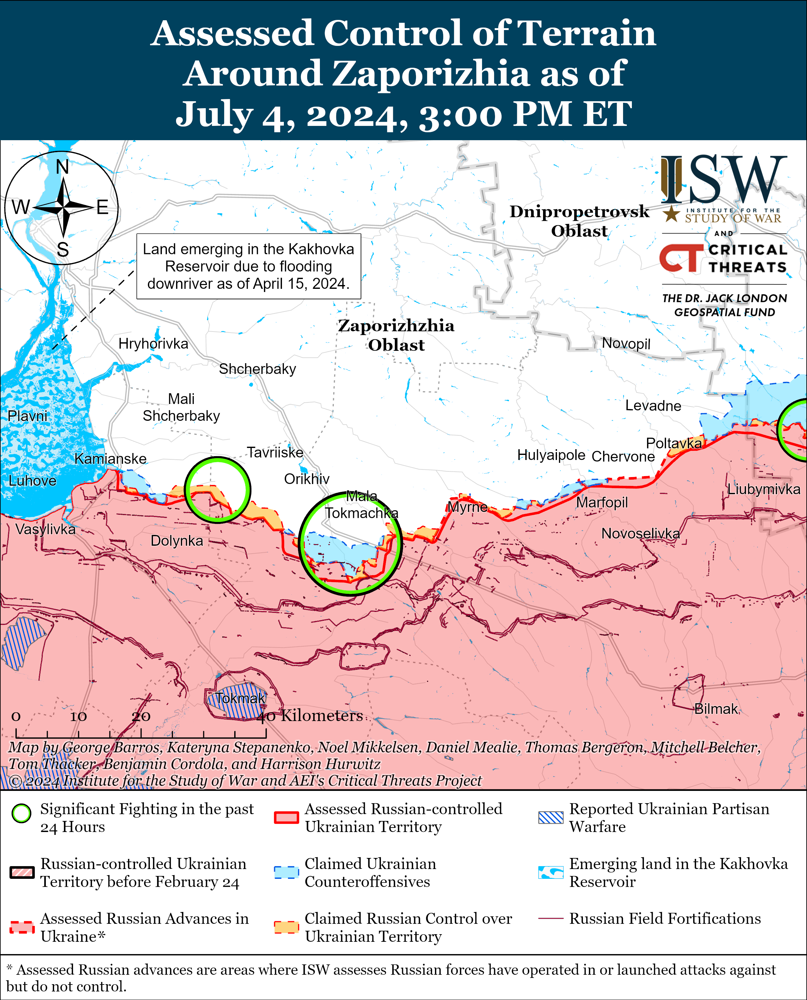
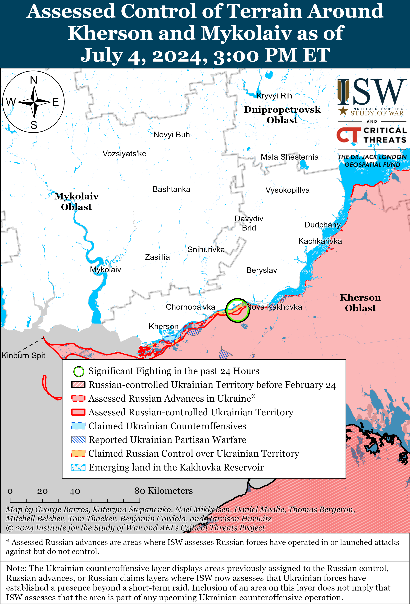

# Russian Offensive Campaign Assessment, July 4, 2024

**Angelica Evans, Riley Bailey, Nicole Wolkov, Karolina Hird, and Frederick W. Kagan**

**July 4, 2024, 5:45pm ET**

**Click**[**here**](https://storymaps.arcgis.com/stories/36a7f6a6f5a9448496de641cf64bd375)**to see ISW’s interactive map of the Russian invasion of Ukraine. This map is updated daily alongside the static maps present in this report.**

**Click**[**here**](https://understandingwar.maps.arcgis.com/apps/instant/3dviewer/index.html?appid=1602762dbcde419bb957dea358449580)**to see ISW’s 3D control of terrain topographic map of Ukraine. Use of a computer (not a mobile device) is strongly recommended for using this data-heavy tool.**

**Click**[**here**](https://storymaps.arcgis.com/stories/733fe90805894bfc8562d90b106aa895)**to access ISW’s archive of interactive time-lapse maps of the Russian invasion of Ukraine. These maps complement the static control-of-terrain map that ISW produces daily by showing a dynamic frontline. ISW will update this time-lapse map archive monthly.**

**Note: The data cut-off for this product was 12:30pm ET on July 4. ISW will cover subsequent reports in the July 5 Russian Offensive Campaign Assessment.**

**Russian President Vladimir Putin explicitly rejected Russian participation in any meaningful negotiations on a ceasefire agreement, instead demanding Ukraine’s “irreversible” “demilitarization” as a precondition for any ceasefire agreement. Putin is thus demanding that Ukraine effectively surrender in advance of any ceasefire.**Putin commented on the prospects of a negotiated ceasefire in Ukraine at the Shanghai Cooperation Organization (SCO) summit in Astana, Kazakhstan, on July 4, but instead of offering his typical feigned interest in such negotiations he outright rejected any ceasefire negotiation process.[1] Putin has repeatedly portrayed the West as his envisioned negotiating partner in a ceasefire agreement in order to prompt Western concessions on Ukrainian sovereignty, but Putin notably dismissed all intermediary parties as possible mediators for an agreement between Ukraine and Russia.[2] Putin also dismissed the Verkhovna Rada as a possible point of contact for negotiations despite previously claiming that the body was the only legitimate Ukrainian entity that Russia could negotiate with.[3] Putin has now labeled all Ukrainian governing institutions illegitimate or unsuitable for negotiations and has dismissed the idea of third parties participating in negotiations — de facto rejecting any realistic process for meaningfully negotiating a ceasefire agreement.[4]

Putin instead highlighted his demand for Ukraine’s “demilitarization” as a primary prerequisite for any ceasefire agreement, demanding that Ukraine agree to “demilitarization” measures that would be irreversible.[5] Putin argued that Russia cannot allow the Ukrainian military to take advantage of a ceasefire to reconstitute its forces.[6] Putin notably did not address the near-certainty that Russian forces would take advantage of a potential ceasefire in exactly such a way, and ISW continues to assess that Russia would use the respite of a ceasefire to reconstitute and expand its forces and to further mobilize its defense industrial base (DIB) for future aggression aiming to destroy the Ukrainian state.[7] Putin’s rejection of any ceasefire agreement short of Ukrainian capitulation further illustrates that he is confident in his assessment that Russia can pursue victory by continuing creeping advances in Ukraine, outlasting Western support for Ukraine, and winning a war of attrition against Ukrainian forces.[8]

**Russian Federal Security Service (FSB) officers reportedly detained the commander of the Russian 83rd Guards Airborne Assault (VDV) Brigade, Colonel Artyom Gorodilov, on fraud charges on July 3 following reports of the brigade suffering heavy losses in the Kharkiv direction in June 2024.[9]**Kremlin-affiliated business outlet*Kommersant*stated that FSB military counterintelligence officers detained Gorodilov in Ryazan Oblast on a charge of especially large-scale fraud and transported Gorodilov to the Russian Investigative Committee’s headquarters in Moscow.[10] Russian media reported that Gorodilov denied the charge and stated that he will seek acquittal in the future, and that the Russian 235th Garrison Military Court sent Gorodilov to a pre-trial detention center.[11] Gorodilov reportedly served as commander of the Russian 234th Guards VDV Regiment (76th VDV Division) from 2019 until an unspecified recent date, and Russian media first introduced Gorodilov as commander of the 83rd VDV Brigade in May 2024.[12] The*New York Times* reported in December 2022 that elements of the 234th VDV Regiment under Gorodilov’s leadership committed massacres of Ukrainian civilians in Bucha, Kyiv Oblast in March 2022.[13] If Gorodilov was indeed the commander of the 83rd VDV Brigade at the time of his arrest, then the Russian high command gave him increased responsibilities as commander of a separate brigade rather than of a regiment subordinated to a division between Russian atrocities in Bucha and the Russian Kharkiv Oblast offensive. Ukrainian officials recently reported that the Russian military command attempted to withdraw elements of the 83rd VDV Brigade from the Kharkiv direction after suffering significant losses that rendered the elements[14]

Russian President Vladimir Putin and the Russian military command may be punishing Gorodilov for what Putin perceives as gross incompetence that failed to achieve its military objectives while causing the deaths of a significant number of “elite” Russian servicemembers in the Kharkiv direction, as Russian VDV troops were widely considered elite prior to Russia’s full-scale invasion of Ukraine and the Russian military command may still consider them to be elite.[15] Russian authorities have recently arrested a series of Russian Ministry of Defense (MoD) officials and high-ranking military officers on criminal charges seemingly unrelated to their positions, including recently announcing charges of forgery and high treason against former 58th Combined Arms Army (CAA) Commander Major General  Ivan Popov.[16] Putin appears to be willing to accept low levels of incompetence in exchange for loyalty but continues to levy seemingly unrelated criminal charges against Russian officials who transgress beyond acceptable levels of incompetence and insubordination.

**Russian President Vladimir Putin supported the Shanghai Cooperation Organization’s (SCO) efforts to expand its presence in Central Asia and will likely use an increased SCO presence as one of its levers to expand Russian influence in the region.** Putin commended on July 4 the SCO’s development of its Regional Anti-Terrorist Structure and the official establishment of the SCO Anti-Drug Center in Dushanbe — an initiative that Tajik President Emomali Rahmon had proposed in 2019.[17] SCO General Secretary Zhang Ming stated that Central Asia is the “core” of the SCO and that peace and prosperity in Central Asia is closely linked to the SCO’s stability and development.[18] Putin also stated his support for reviving the SCO-Afghanistan contact group and noted that Russia has received signals from the Taliban that it may be ready to help Russia combat terrorism.[19]

**The US Department of Defense (DoD) announced the purchase of $2.2 billion worth of US-produced air defense interceptors and an aid package worth $150 million for Ukraine on July 3.[20]**TheDoD stated that it will purchase $2.2 billion worth of recently produced PATRIOT and NASAMS air defense missiles for Ukraine to help protect the Ukrainian people and Ukraine’s critical infrastructure from Russian drone and missile strikes. The DoD has yet to announce that it is sending these air defense missiles to Ukraine. The DoD stated that it is also provided an aid package worth $150 million from the Presidential Drawdown Authority (PDA), which includes: HAWK air defense missiles; HIMARS ammunition; 155mm and 105mm artillery shells; 81mm mortar rounds; Tube-Launched, Optically-Tracked, Wire-Guided (TOW) missiles; Javelin and AT-4 anti-armor systems; small arms ammunition and grenades; demolition equipment and munitions; tactical vehicles and air navigation systems; and space parts, maintenance, and other equipment. The DoD noted that the PDA package is the Biden Administration’s 60th tranche of equipment provided to Ukraine since August 2021.

**Key Takeaways:**

- **Russian President Vladimir Putin explicitly rejected Russian participation in any meaningful negotiations on a ceasefire agreement, instead demanding Ukraine’s “irreversible” “demilitarization” as a precondition for any ceasefire agreement. Putin is thus demanding that Ukraine effectively surrender in advance of any ceasefire.**
- **Russian Federal Security Service (FSB) officers reportedly detained the commander of the Russian 83rd Guards Airborne Assault (VDV) Brigade, Colonel Artyom Gorodilov, on fraud charges on July 3 following reports of the brigade suffering heavy losses in the Kharkiv direction in June 2024.**
- **Russian President Vladimir Putin supported the Shanghai Cooperation Organization’s (SCO) efforts to expand its presence in Central Asia and will likely use an increased SCO presence as one of its levers to expand Russian influence in the region.**
- **The US Department of Defense (DoD) announced the purchase of $2.2 billion worth of US-produced air defense interceptors and an aid package worth $150 million for Ukraine on July 3.**
- **Russian forces recently advanced near Kreminna, Avdiivka, and Donetsk City.**
- **Russian Security Council Deputy Chairperson Dmitry Medvedev claimed on July 4 that around 190,000 Russians signed military service contracts during the first six months of 2024 during a Russian Ministry of Defense (MoD) meeting about staffing the Russian military with contract soldiers.**

****

***We do not report in detail on Russian war crimes because these activities are well-covered in Western media and do not directly affect the military operations we are assessing and forecasting. We will continue to evaluate and report on the effects of these criminal activities on the Ukrainian military and the Ukrainian population and specifically on combat in Ukrainian urban areas. We utterly condemn Russian violations of the laws of armed conflict and the Geneva Conventions and crimes against humanity even though we do not describe them in these reports.***

- Russian Main Effort – Eastern Ukraine (comprised of three subordinate main efforts)
- Russian Subordinate Main Effort #1 – Push Ukrainian forces back from the international border with Belgorod Oblast and approach to within tube artillery range of Kharkiv City
- Russian Subordinate Main Effort #2 – Capture the remainder of Luhansk Oblast and push westward into eastern Kharkiv Oblast and encircle northern Donetsk Oblast
- Russian Subordinate Main Effort #3 – Capture the entirety of Donetsk Oblast
- Russian Supporting Effort – Southern Axis
- Russian Air, Missile, and Drone Campaign
- Russian Mobilization and Force Generation Efforts
- Russian Technological Adaptations
- Activities in Russian-occupied areas
- Ukrainian Defense Industrial Base Efforts
- Russian Information Operations and Narratives
- Significant Activity in Belarus

**Russian Main Effort – Eastern Ukraine**

**Russian Subordinate Main Effort #1 – Kharkiv Oblast****(Russian objective: Push Ukrainian forces back from the international border with Belgorod Oblast and approach to within tube artillery range of Kharkiv City)**

Russian forces continue periodic cross-border raids into northern Kharkiv Oblast and have reportedly entered a small border settlement northwest of Kharkiv City. Ukrainian Kharkiv Group of Forces Spokesperson Colonel Yuriy Povkh stated on July 4 that a Russian sabotage and reconnaissance group entered the village of Sotnytskyi Kozachok (directly on the Kharkiv-Belgorod Oblast border about 45 kilometers northwest of Kharkiv City) and that Ukrainian forces are still trying to identify and repel the Russian group.[21] Povkh noted that Russian forces are trying to create points of tension along the international border by using sabotage and reconnaissance groups, consistent with ISW’s assessment that Russian forces are conducting periodic cross-border raids into northern Ukraine to divert and fix Ukrainian troops from other critical areas of the theater.[22] The Ukrainian State Border Guard Service previously reported a small Russian raid into Sotnytskyi Kozachok on June 26.[23] Russian milbloggers claimed that Russian forces have almost “completely” seized the settlement and are making “good progress” in the area, although ISW has not yet observed visual confirmation of an enduring Russian presence in Sotnytskyi Kozachok.

Geolocated footage published on July 4 shows Ukrainian forces repelling a Russian reinforced platoon-sized mechanized assault north of Kharkiv City, which is notably the first visual confirmation ISW has observed of an at least platoon-sized Russian mechanized assault in this area since Russian forces opened the northern Kharkiv Oblast axis in mid-May 2024.[24] The footage shows five Russian armored combat vehicles west of Krasne presumably attacking in the direction of Hlyboke.[25] Ukrainian forces destroyed three of five armored vehicles, and Russian forces did not make any confirmed advances during the assault.

Geolocated footage indicates that Russian forces have seized the entire Vovchansk Aggregate Plant in Vovchansk (northeast of Kharkiv City), although this footage is visual confirmation of a change that ISW assessed to have likely taken place in mid-June. The geolocated footage, published on July 4, shows Russian forces operating in the southwestern part of the Aggregate Plant, suggesting that they have taken control of the entire Aggregate Plant complex.[26] Geolocated footage from mid-June shows Russian forces elsewhere in the Aggregate Plant, and Ukrainian military sources reported that Ukrainian forces “blocked” a small detachment of Russian forces in the plant in late June, suggesting that Russian forces have held positions in the plant for several weeks.[27]  Russian and Ukrainian sources also reported continued heavy fighting within Vovchansk on July 4.[28]

**Russian Subordinate Main Effort #2 – Luhansk Oblast****(Russian objective: Capture the remainder of Luhansk Oblast and push westward into eastern Kharkiv Oblast and northern Donetsk Oblast)**

Russian forces recently marginally advanced near Kreminna amid continued Russian ground attacks along the Kupyansk-Svatove-Kreminna line on July 4. Geolocated footage published on July 3 indicates that Russian forces recently marginally advanced northeast of Makiivka (northwest of Kreminna).[29] Ukrainian military observer Kostyantyn Mashovets stated on July 4 that Russian forces entered the eastern outskirts of Makiivka and seized the intersection of the Makiivka-Nevske and Makiivka-Hrekivka roads (both northwest of Kreminna).[30] A Russian milblogger claimed on July 3 that Russian forces advanced up to 500 meters in depth in the forest areas south of Vilshana (northeast of Kupyansk) towards Petropavlivka (east of Kupyansk), although ISW has not observed visual evidence of this claim.[31] Fighting continued northeast of Kupyansk near Synkivka; southeast of Kupyansk near Stepova Novoselivka and Stelmakhivka; northwest of Kreminna near Hrekivka, Makiivka, and Nevske; west of Kreminna near Terny; and south of Kreminna in the Serebryanske forest area on July 4.[32] Mashovets stated that Russian forces have transferred elements of the 25th Combined Arms Army (CAA) (Central Military District [CMD]) to the Ploshchanka-Makiivka area (northwest of Kreminna) where elements of the 3rd Motorized Rifle Division (20th CAA, Moscow Military District [MMD]) are operating after Russian forces failed to advance near Terny and Yampolivka (both northwest of Kreminna).[33] Mashovets stated that elements of the 3rd and 144th motorized rifle divisions (both of the 20th CAA) and 67th Motorized Rifle Division, 11th Separate Tank Brigade, and 164th and 169th separate motorized rifle brigades (all of the 25th CAA) are operating in the Lyman direction.[34]

**Russian Subordinate Main Effort #3 – Donetsk Oblast****(Russian objective: Capture the entirety of Donetsk Oblast, the claimed territory of Russia’s proxies in Donbas)**

Russian forces continued offensive operations in the Siversk direction on July 4, but there were no confirmed changes to the frontline. Russian forces attacked east of Siversk near Verkhnokamyanske and southeast of Siversk near Vyimka.[35] Elements of the Russian 137th Airborne (VDV) Regiment (106th VDV Division) are reportedly operating near Rozdolivka and Pereizne (both south of Siversk).[36]

A Ukrainian military official confirmed that Russian forces seized easternmost Chasiv Yar amid continued Russian offensive operations in the area on July 4. Ukrainian Khortytsia Group of Forces Spokesperson Lieutenant Colonel Nazar Voloshyn stated on July 4 that Ukrainian forces withdrew from Kanal Microraion (easternmost Chasiv Yar) to prepared positions after it became impractical to hold the microraion.[37] Ukrainian military observer Kostyantyn Mashovets stated that elements of the Russian 98th VDV Division’s 217th, 299th, and 331st VDV regiments were responsible for seizing Kanal Microraion and that elements of the 11th VDV Brigade and the 102nd Motorized Rifle Regiment (150th Motorized Rifle Division, 8th Combined Arms Army [CAA], Southern Military District [SMD]) may have assisted in the effort.[38] Mashovets stated that Russian forces hold positions west of Kanal Microraion near the destroyed bridge across the Siverskyi-Donets Donbas Canal along Oleh Koshevoy Street.[39] Mashovets added that the Russian Southern Grouping of Forces has elements of the 4th Motorized Rifle Brigade (2nd Luhansk People’s Republic Army Corps [LNR AC]) in reserve and forecasted that Russian forces will likely commit these elements to intensified efforts to advance further into Chasiv Yar.[40] Russian forces continued offensive operations northeast of Chasiv Yar near Hryhorivka, north of Chasiv Yar near Kalynivka, east of Chasiv Yar near Ivanivske, and southeast of Chasiv Yar near Klishchiivka.[41]

Russian forces reportedly continued to advance near Toretsk on July 4. Russian milbloggers claimed on July 3 and 4 that Russian forces broke through Ukrainian defenses and advanced into the southwestern outskirts of Niu York (south of Toretsk) and have almost completely seized Yurivka (south of Niu York).[42] Russian forces continued offensive operations near Toretsk, Dyliivka (north of Toretsk), Pivnichne (east of Toretsk), and Niu York on July 4; and Voloshyn noted that Russian forces became more active near these settlements.[43] Unspecified elements of the Russian 3rd AC are reportedly operating near Dyliivka.[44]

Russian forces recently advanced northwest of Avdiivka and reportedly made further gains in the area on July 4. Geolocated footage published on July 4 indicates that Russian forces recently advanced southwest of Novooleksandrivka towards Lozuvatske (both northwest of Avdiivka).[45] Russian milbloggers claimed that Russian forces northwest of Avdiivka advanced up to a kilometer in depth and 700 meters in width east of Prohres, seized Sokil and Voskhod, and advanced nearly two kilometers in the direction of Novoselivka Persha.[46] ISW has not observed confirmation of these Russian claims, however. Russian forces continued offensive operations north of Avdiivka near Kalynove; northwest of Avdiivka near Novooleksandrivka, Vozdvyzhenka, Prohres, Lozuvatske, Yevhenivka, and Novoselivka Persha; west of Avdiivka near Umanske, Yasnobrodivka ,and Karlivka; and southwest of Avdiivka near Nevelske and Netaylove on July 3 and 4.[47]

Russian forces recently advanced southwest of Donetsk City and continued offensive operations west and southwest of Donetsk City on July 4. Geolocated footage published on July 4 indicates that Russian forces recently advanced westward in fields north of Pobieda (southwest of Donetsk City).[48] A Russian milblogger claimed that Russian forces advanced further within northwestern Krasnohorivka (west of Donetsk City), although ISW has not observed confirmation of this claim.[49] Russian forces continued offensive operations west of Donetsk City near Krasnohorivka and Heorhiivka and southwest of Donetsk City near Paraskoviivka, Kostyantynivka, and Vodyane on July 4.[50] Elements of the Russian 238th Artillery Brigade (8th CAA, SMD) are reportedly operating near Krasnohorivka.[51]

Russian forces continued offensive operations in the Donetsk-Zaporizhia Oblast border area on July 4, but there were no confirmed changes to the frontline. A Russian milblogger claimed that elements of the Russian 218th Tank Regiment (127th Motorized Rifle Division, 5th CAA, Eastern Military District [EMD]) recently advanced north of Staromayorske (south of Velyka Novosilka).[52] Russian forces continued offensive operations south of Velyka Novosilka near Urozhaine and Makarivka on July 3 and 4.[53] Elements of the 1461st Motorized Rifle Regiment (reportedly assigned to the 36th CAA, EMD) are reportedly operating near Urozhaine.[54]

**Russian Supporting Effort – Southern Axis****(Russian objective: Maintain frontline positions and secure rear areas against Ukrainian strikes)**

Russian forces continued assaults in western Zaporizhia Oblast near Robotyne, Verbove (east of Robotyne), and Shcherbaky (northwest of Robotyne) on July 3 to 4, but there were no confirmed changes to the frontline.[55] A Russian milblogger claimed that Russian forces advanced 500 meters near Shcherbaky and Nesteryanka (northwest of Robotyne) and seized three Ukrainian positions in the area.[56] Elements of the Russian “Valkyrie” Special Detachment (4th Military Base, 58th Combined Arms Army [CAA], Southern Military District [SMD]) are reportedly operating in the Zaporizhia direction.[57]

The Ukrainian Security Service (SBU) and Ukrainian forces reportedly struck a Russian Nebo-SVU long-range radar detection system that was 70 kilometers from the frontline in an unspecified area of southern Ukraine.[58]

Russian forces continued assaults near Krynky in the east (left) bank of Kherson Oblast and on the Dnipro River islands on July 3 to 4, but there were no confirmed changes to the frontline.[59] A Russian milblogger claimed that Russian and Ukrainian forces are fighting near the Antonivsky Railway Bridge north of Oleshky.[60]

[****](https://understandingwar.org/wp-content/uploads/2025/05/Kherson-Mykolaiv20Battle20Map20Draft20July2042C202024.png)

**Russian Air, Missile, and Drone Campaign****(Russian Objective: Target Ukrainian military and civilian infrastructure in the rear and on the frontline)**

Russian forces conducted drone strikes against Ukraine on the night of July 3 to 4 and a missile strike against Odesa Oblast during the day on July 4. The Ukrainian Air Force reported that Russian forces launched 22 Shahed-136/131 drones from Kursk Oblast and that Ukrainian forces shot down 21 drones over Kyiv, Chernihiv, Zhytomyr, Sumy, Dnipropetrovsk, and Poltava oblasts.[61] Chernihiv Oblast Military Administration Head Vyacheslav Chaus stated that a drone struck an unspecified facility in Chernihiv Oblast leaving almost 6,000 residents without electricity.[62] Odesa Oblast Military Administration Head Oleh Kiper stated that Russian forces conducted a missile strike with an unspecified type of missile against civilian port infrastructure in Odesa Raion, killing one, injuring seven, and damaging port facilities.[63]

Ukrainian officials reported that the Russian military is trying to modernize glide bombs to use in the Kharkiv direction. Ukraine’s Southern Volunteer Army Spokesperson Serhiy Bratchuk stated on July 4 that Russian aviation has intensified glide bomb strikes, which has facilitated unspecified Russian tactical success in some sectors of the frontline.[64] Bratchuk noted that Russian forces are trying to use modernized glide bombs against Kharkiv Oblast. Kharkiv Oblast Military Administration Head Oleh Synehubov stated that Russian forces began conducting strikes against Kharkiv City and Oblast with FAB-500 glide bombs with increased ranges of up to 80 kilometers.

**Russian Mobilization and Force Generation Efforts****(Russian objective: Expand combat power without conducting general mobilization)**

Russian Security Council Deputy Chairperson Dmitry Medvedev claimed on July 4 that around 190,000 Russians signed military service contracts during the first six months of 2024 during a Russian Ministry of Defense (MoD) meeting about staffing the Russian military with contract soldiers.[65] Medvedev noted that the MoD’s average daily recruitment rate is 1,000 people and praised the MoD for fulfilling its force generation tasks. The Russian MoD claimed on April 3 that more than 100,000 Russians signed military service contracts since the beginning of 2024.[66]

The Russian Ministry of Defense (MoD) continues efforts to formalize Russia’s irregular forces. Kremlin newswire *TASS* stated on July 4 that the Russian State Duma is considering amending its legislation on military service to allow servicemembers from occupied Donetsk, Luhansk, Zaporizhia, and Kherson oblasts to count their service in the Russian military in Ukraine and Russian-backed proxy forces prior to the illegal annexation of the four oblasts towards their combat veteran status.[67] Servicemembers from occupied Ukraine will be allowed to count their military service towards their combat veteran status provided the servicemember did not serve with the Ukrainian Armed Forces or “commit crimes” against Russia and its population.  This is likely a significant step towards integrating pro-Russian irregular forces that have been active in eastern Ukraine since at least 2014.

Russian news outlet *Izvestia* reported on July 1 that sources within the Russian MoD stated that Russia upgraded the *Gremyashchiy* Gremyashchiy-classProject 20385 corvette’s missile launcher to fire Zircon hypersonic missiles.[68] The *Gremyashchiy* could previously only launch Kalibr cruise missiles and Onyx supersonic missiles and is currently serving in Russia’s Pacific Fleet.Sources within Russia’s shipbuilding industry told *Izvestia* that Russia also upgraded the *Provornyy*Gremyashchiy-classcorvette’s missile launcher to fire Zircon missiles and the *Provornyy* will join the Russian Navy after undergoing testing. *Izvestia* reported that Russia plans to construct four additional Gremyashchiy-classcorvettes in an unspecified time frame.

**Russian Technological Adaptations (Russian objective: Introduce technological innovations to optimize systems for use in Ukraine)**

General Director of Russian vehicle manufacturer Remdizel, Alexander Zakharov, told Kremlin newswire *TASS* on July 4 that Russian forces are testing the new “Zubilo” unmanned ground vehicle (UGV) and that Russian engineering troops are particularly interested in the system’s ability to minimize personnel losses along the frontline.[69]

The Russian Ministry of Defense (MoD) published footage on July 4 showing two machine guns mounted on a frame and attached to a jerry-rigged counter-drone vehicle that elements of the Russian Dnepr Grouping of Forces are using to counter drones in an unspecified frontline area.[70]

**Ukrainian Defense Industrial Efforts****(Ukrainian objective: Develop its defense industrial base to become more self-sufficient in cooperation with US, European, and international partners)**

*ISW is not publishing coverage of Ukrainian defense industrial efforts today.*

**Activities in Russian-occupied areas****(Russian objective: Consolidate administrative control of annexed areas; forcibly integrate Ukrainian citizens into Russian sociocultural, economic, military, and governance systems)**

*ISW is not publishing coverage of activities in Russian-occupied areas today.*

**Russian Information Operations and Narratives**

Russian Security Council Deputy Chairperson Dmitry Medvedev attempted to compare Russia’s full-scale invasion of Ukraine to the American Civil War on July 4 likely in an effort to cater to American audiences on the Fourth of July holiday.[71] Medvedev drew inaccurate parallels between contemporary Russia and the Union, while accusing Ukraine of representing the Confederacy. The US Department of Defense (DoD) notably announced its sixtieth tranche of aid for Ukraine on July 3, to which Medvedev may be responding.[72]

**Significant activity in Belarus****(Russian efforts to increase its military presence in Belarus and further integrate Belarus into Russian-favorable frameworks and Wagner Group activity in Belarus)**

Belarus officially joined the People’s Republic of China (PRC)-led Shanghai Cooperation Organization (SCO) on July 4.[73] Russian Foreign Minister Sergei Lavrov stated that the official inclusion of Belarus in the SCO is part of Union State efforts for Russia and Belarus to participate in international processes as a “united front.”[74]

**Note: ISW does not receive any classified material from any source, uses only publicly available information, and draws extensively on Russian, Ukrainian, and Western reporting and social media as well as commercially available satellite imagery and other geospatial data as the basis for these reports. References to all sources used are provided in the endnotes of each update.**

---

[1] https://t.me/tass\_agency/258708 ; https://t.me/tass\_agency/258716 ; https://t.me/tass\_agency/258714 ; https://t.me/tass\_agency/258718 ; https://t.me/tass\_agency/258719 ; https://t.me/tass\_agency/258725 ; https://tass dot ru/politika/21278383

[2] https://t.me/tass\_agency/258730 ; https://understandingwar.org/backgrounder/russian-offensive-campaign-assessment-march-3-2024 ; https://isw.pub/UkrWar021424 ; https://isw.pub/UkrWar022924 ; https://isw.pub/UkrWar030224 ; https://isw.pub/UkrWar012624 ; https://isw.pub/UkrWar012724 ; https://isw.pub/UkrWar020824 ; https://isw.pub/UkrWar012224

[3] https://isw.pub/UkrWar052824

[4] https://isw.pub/UkrWar052824 ;    https://isw.pub/UkrWar052624 ; https://isw.pub/UkrWar052424

[5] https://t.me/tass\_agency/258725 ; https://tass dot ru/politika/21278383

[6] https://t.me/tass\_agency/258725 ; https://tass dot ru/politika/21278383

[7] https://understandingwar.org/backgrounder/russian-offensive-campaign-assessment-june-30-2024 ; https://isw.pub/UkrWar122923 ; https://isw.pub/UkrWar052424 ;

[8] https://understandingwar.org/backgrounder/russian-offensive-campaign-assessment-june-30-2024 ; https://isw.pub/UkrWar060724

[9] https://t.me/astrapress/58903 ; https://www.kommersant dot ru/doc/6806653 ;https://tass dot ru/proisshestviya/21280709 ; https://ria dot ru/20240704/gorodilov–1957488676.html

[10] https://www.kommersant dot ru/doc/6806653

[11] https://tass dot ru/proisshestviya/21280709 ; https://ria dot ru/20240704/gorodilov–1957488676.html

[12] https://www.kommersant dot ru/doc/6806653 ; https://tass dot ru/proisshestviya/21280709

[13] https://www.nytimes.com/2022/12/22/video/russia-ukraine-bucha-massacre-takeaways.html

[14] https://understandingwar.org/backgrounder/russian-offensive-campaign-assessment-june-28-2024

[15] https://understandingwar.org/backgrounder/russian-offensive-campaign-assessment-may-3-2024  ; https://understandingwar.org/backgrounder/russian-offensive-campaign-assessment-june-30-2024

[16] https://understandingwar.org/backgrounder/russian-offensive-campaign-assessment-may-21-2024 ; https://isw.pub/UkrWar042424; https://isw.pub/UkrWar051424 ; https://isw.pub/UkrWar051324 ; https://t.me/tass\_agency/258577 ; https://tass dot ru/proisshestviya/21269973 ; https://t.me/tass\_agency/258649

[17] http://www.kremlin dot ru/events/president/news/74464 ; https://asiaplustj dot info/ru/news/tajikistan/politics/20240704/v-astane-utverdili-sozdanie-antinarkoticheskogo-tsentra-shos-v-dushanbe

[18] https://t.me/sectsco/6343

[19] http://www.kremlin dot ru/events/president/news/74464 ; https://t.me/tass\_agency/258711  ; https://t.me/tass\_agency/258712

[20] https://www.defense.gov/News/Releases/Release/Article/3827072/biden-administration-announces-additional-security-assistance-for-ukraine/

[21] https://www.ukrinform dot ua/rubric-ato/3881806-sili-oboroni-znisuut-zaliski-drg-aka-zajsla-v-sotnickij-kozacok-na-harkivsini.html

[22] https://understandingwar.org/backgrounder/russian-offensive-campaign-assessment-july-2-2024; https://understandingwar.org/backgrounder/russian-offensive-campaign-assessment-june-12-2024

[23] https://www.ukrinform dot ua/rubric-ato/3879436-prikordonniki-vidbili-na-harkivsini-ataku-rosijskoi-drg.html

[24] https://t.me/stanislav\_osman/6418 ; https://x.com/GirkinGirkin/status/1808874627432685619 ; https://x.com/666\_mancer/status/1808892192053731442; https://t.me/stanislav\_osman/6418; https://t.me/The\_life\_of\_Predova/2828; https://t.me/The\_life\_of\_Predova/2827; https://x.com/giK1893/status/1808879534881575376

[25] https://t.me/stanislav\_osman/6418 ; https://x.com/GirkinGirkin/status/1808874627432685619 ; https://x.com/666\_mancer/status/1808892192053731442

[26] https://x.com/PuenteUribarri/status/1808820528863416659; https://x.com/Bielitzling/status/1808824253791207762

[27] https://x.com/EjShahid/status/1803002411411210425; https://t.me/khornegroup/21722; https://suspilne dot media/kharkiv/770031-agregatnij-zavod-u-vovcansku-perebuvae-pid-vognevim-kontrolem-zsu-deepstate/; https://t.me/WarArchive\_ua/16102; https://x.com/small10space/status/1802045258777448750; https://t.me/creamy\_caprice/5827; https://t.me/operativnoZSU/148644; https://mil.in dot ua/uk/news/ps-zsu-zavdaly-udariv-aviabombamy-po-pozytsiyah-okupantiv-na-zahoplenomu-zavodi-u-vovchansku/; https://t.me/zvizdecmanhustu/1953; https://understandingwar.org/wp-content/uploads/2024/07/Russian20Offensive20Campaign20Assessment2C20June2030202024.pdf

[28] https://t.me/wargonzo/20858; https://t.me/dva\_majors/46705; https://t.me/RVvoenkor/71774; https://www.facebook.com/GeneralStaff.ua/posts/pfbid0VZ7viw6xuwqPAPYwzArFbgpdE9SZJbX3AnytAzoQKtS29EvCXq3eRmYdkeWExJtSl; https://www.facebook.com/GeneralStaff.ua/posts/pfbid02Gxiq4GY6YkobqEFpTtgc9ah5Gv2PeGM67GDw68PfaDp67L3iefCbEUtX5zL5D4Qpl

[29] https://x.com/klinger66/status/1808632787945271576; https://x.com/TOGAjano21/status/1808338989310443763

[30] https://t.me/zvizdecmanhustu/2007

[31] https://t.me/NgP\_raZVedka/18290

[32] https://www.facebook.com/GeneralStaff.ua/posts/pfbid02Gxiq4GY6YkobqEFpTtgc9ah5Gv2PeGM67GDw68PfaDp67L3iefCbEUtX5zL5D4Qpl ; https://www.facebook.com/GeneralStaff.ua/posts/pfbid0VZ7viw6xuwqPAPYwzArFbgpdE9SZJbX3AnytAzoQKtS29EvCXq3eRmYdkeWExJtSl ; https://t.me/dva\_majors/46705

[33] https://t.me/zvizdecmanhustu/2006

[34] https://t.me/zvizdecmanhustu/2007

[35] https://www.facebook.com/GeneralStaff.ua/posts/pfbid0VZ7viw6xuwqPAPYwzArFbgpdE9SZJbX3AnytAzoQKtS29EvCXq3eRmYdkeWExJtSl ; https://www.facebook.com/GeneralStaff.ua/posts/pfbid0iSE549c63piXa2neem5sYwqDYP8dvTAn8AVwB9MsjkPTs5MCyJgXZviMJ68wG9Ghl

[36] https://t.me/RVvoenkor/71760

[37] https://armyinform.com dot ua/2024/07/04/shho-vidbuvayetsya-v-rajoni-chasovogo-yaru-poyasnyly-v-sylah-oborony/

[38] https://t.me/zvizdecmanhustu/2008

[39] https://t.me/zvizdecmanhustu/2008

[40] https://t.me/zvizdecmanhustu/2009

[41] https://www.facebook.com/GeneralStaff.ua/posts/pfbid02Gxiq4GY6YkobqEFpTtgc9ah5Gv2PeGM67GDw68PfaDp67L3iefCbEUtX5zL5D4Qpl ; https://www.facebook.com/GeneralStaff.ua/posts/pfbid0VZ7viw6xuwqPAPYwzArFbgpdE9SZJbX3AnytAzoQKtS29EvCXq3eRmYdkeWExJtSl

[42] https://t.me/RVvoenkor/71752 ; https://t.me/dva\_majors/46705 ; https://t.me/boris\_rozhin/128916

[43] https://www.facebook.com/GeneralStaff.ua/posts/pfbid02Gxiq4GY6YkobqEFpTtgc9ah5Gv2PeGM67GDw68PfaDp67L3iefCbEUtX5zL5D4Qpl ; https://www.facebook.com/GeneralStaff.ua/posts/pfbid0VZ7viw6xuwqPAPYwzArFbgpdE9SZJbX3AnytAzoQKtS29EvCXq3eRmYdkeWExJtSl ; https://armyinform.com dot ua/2024/07/04/shho-vidbuvayetsya-v-rajoni-chasovogo-yaru-poyasnyly-v-sylah-oborony/

[44] https://t.me/NgP\_raZVedka/18296

[45] https://t.me/creamy\_caprice/5974; https://t.me/BRODIAHY\_UKR/215

[46] https://t.me/dva\_majors/46713 ; https://t.me/z\_arhiv/27202 ; https://t.me/DnevnikDesantnika/12444 ; https://t.me/motopatriot/24542 ; https://t.me/boris\_rozhin/128900 ; https://t.me/RVvoenkor/71777

[47] https://www.facebook.com/GeneralStaff.ua/posts/pfbid02Gxiq4GY6YkobqEFpTtgc9ah5Gv2PeGM67GDw68PfaDp67L3iefCbEUtX5zL5D4Qpl ; https://www.facebook.com/GeneralStaff.ua/posts/pfbid0VZ7viw6xuwqPAPYwzArFbgpdE9SZJbX3AnytAzoQKtS29EvCXq3eRmYdkeWExJtSl ; https://www.facebook.com/GeneralStaff.ua/posts/pfbid0iSE549c63piXa2neem5sYwqDYP8dvTAn8AVwB9MsjkPTs5MCyJgXZviMJ68wG9Ghl ; https://t.me/dva\_majors/46713 ; https://t.me/motopatriot/24542   ; https://t.me/dva\_majors/46705 ; https://t.me/DnevnikDesantnika/12444 ; https://t.me/wargonzo/20858

[48] https://t.me/WarArchive\_ua/16907; https://t.me/ssternenko/30651

[49] https://t.me/boris\_rozhin/128910

[50] https://www.facebook.com/GeneralStaff.ua/posts/pfbid02Gxiq4GY6YkobqEFpTtgc9ah5Gv2PeGM67GDw68PfaDp67L3iefCbEUtX5zL5D4Qpl ; https://www.facebook.com/GeneralStaff.ua/posts/pfbid0VZ7viw6xuwqPAPYwzArFbgpdE9SZJbX3AnytAzoQKtS29EvCXq3eRmYdkeWExJtSl

[51] https://t.me/RVvoenkor/71750

[52] https://t.me/dva\_majors/46698

[53] https://www.facebook.com/GeneralStaff.ua/posts/pfbid0iSE549c63piXa2neem5sYwqDYP8dvTAn8AVwB9MsjkPTs5MCyJgXZviMJ68wG9Ghl ; https://www.facebook.com/GeneralStaff.ua/posts/pfbid0VZ7viw6xuwqPAPYwzArFbgpdE9SZJbX3AnytAzoQKtS29EvCXq3eRmYdkeWExJtSl ; https://www.facebook.com/GeneralStaff.ua/posts/pfbid02Gxiq4GY6YkobqEFpTtgc9ah5Gv2PeGM67GDw68PfaDp67L3iefCbEUtX5zL5D4Qpl

[54] https://t.me/boris\_rozhin/128872 ; https://t.me/zvizdecmanhustu/1667

[55] https://www.facebook.com/GeneralStaff.ua/posts/pfbid02Gxiq4GY6YkobqEFpTtgc9ah5Gv2PeGM67GDw68PfaDp67L3iefCbEUtX5zL5D4Qpl ; https://www.facebook.com/GeneralStaff.ua/posts/pfbid0VZ7viw6xuwqPAPYwzArFbgpdE9SZJbX3AnytAzoQKtS29EvCXq3eRmYdkeWExJtSl ; https://www.facebook.com/GeneralStaff.ua/posts/pfbid0iSE549c63piXa2neem5sYwqDYP8dvTAn8AVwB9MsjkPTs5MCyJgXZviMJ68wG9Ghl

[56] https://t.me/dva\_majors/46705

[57] https://t.me/RVvoenkor/71806

[58] https://armyinform.com dot ua/2024/07/03/nashi-zahysnyky-zmogly-vrazyty-vorozhyj-kompleks-nebo-yakyj-koshtuye-bilya-100-miljoniv/

[59] https://www.facebook.com/GeneralStaff.ua/posts/pfbid02Gxiq4GY6YkobqEFpTtgc9ah5Gv2PeGM67GDw68PfaDp67L3iefCbEUtX5zL5D4Qpl ; https://www.facebook.com/GeneralStaff.ua/posts/pfbid0VZ7viw6xuwqPAPYwzArFbgpdE9SZJbX3AnytAzoQKtS29EvCXq3eRmYdkeWExJtSl ; https://www.facebook.com/GeneralStaff.ua/posts/pfbid0iSE549c63piXa2neem5sYwqDYP8dvTAn8AVwB9MsjkPTs5MCyJgXZviMJ68wG9Ghl ; https://t.me/DnevnikDesantnika/12447

[60] https://t.me/dva\_majors/46705

[61] https://t.me/kpszsu/16145; https://t.me/ComAFUA/334

[62] https://t.me/chernigivskaODA/13486

[63] https://t.me/odeskaODA/5821

[64] https://armyinform.com dot ua/2024/07/04/u-sylah-oborony-rozpovily-chomu-zbilshylas-kilkist-vorozhyh-atak-kabamy/

[65] https://tass dot ru/armiya-i-opk/21279019 https://tass dot ru/politika/21279033

[66] https://understandingwar.org/backgrounder/russian-offensive-campaign-assessment-april-3-2024 ; https://t.me/mod\_russia/37290

[67] https://tass dot ru/armiya-i-opk/21263911

[68] https://iz dot ru/1719785/vladimir-matveev-bogdan-stepovoi-roman-kretcul/vybit-makhom-rossiiskie-korvety-modernizirovali-pod-rakety-tcirkon

[69] https://tass dot ru/armiya-i-opk/21270077 ; https://t.me/tass\_agency/258578

[70] https://t.me/mod\_russia/40676

[71] https://t.me/medvedev\_telegram/513

[72] https://t.me/medvedev\_telegram/513

[73] https://t.me/modmilby/40103 ; https://t.me/pul\_1/12901 ; https://t.me/belta\_telegramm/256584 ; https://t.me/sectsco/6343

[74] https://t.me/MID\_Russia/42900
