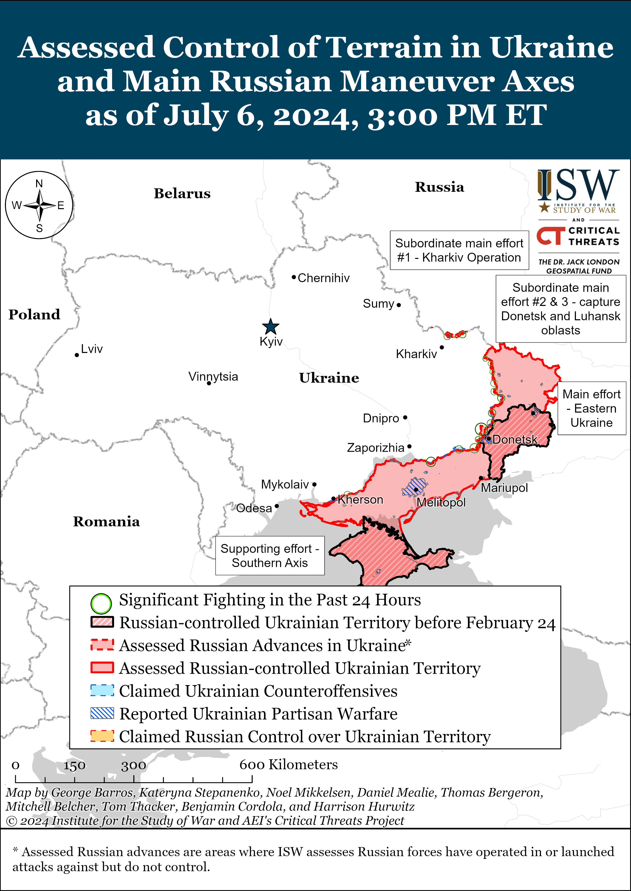
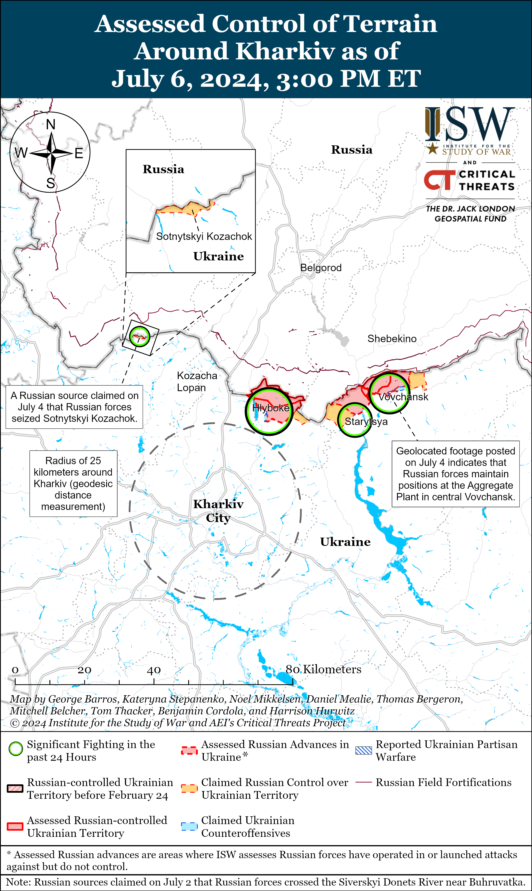
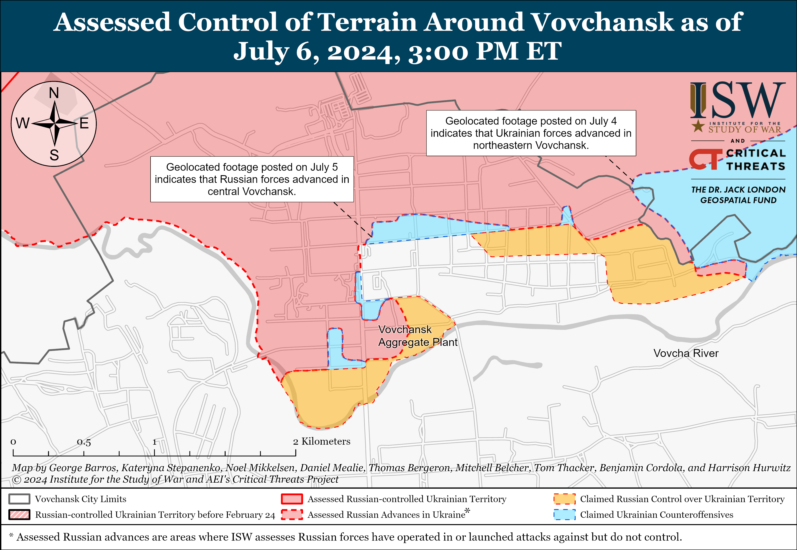
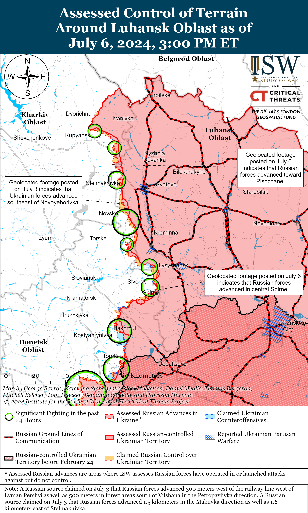
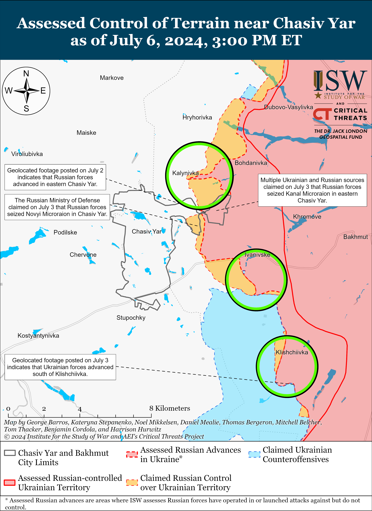
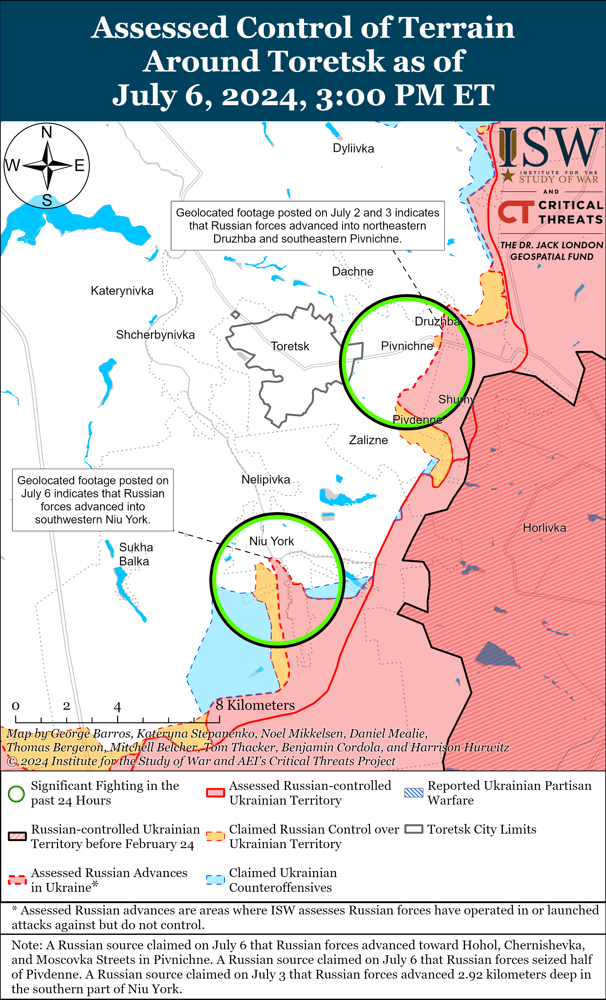
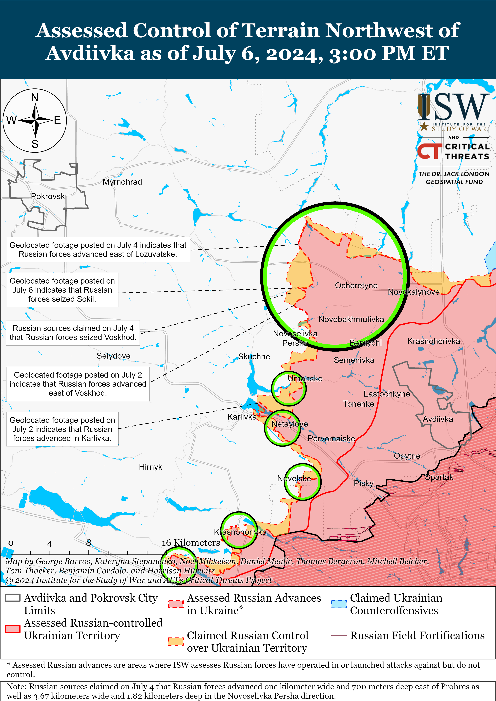
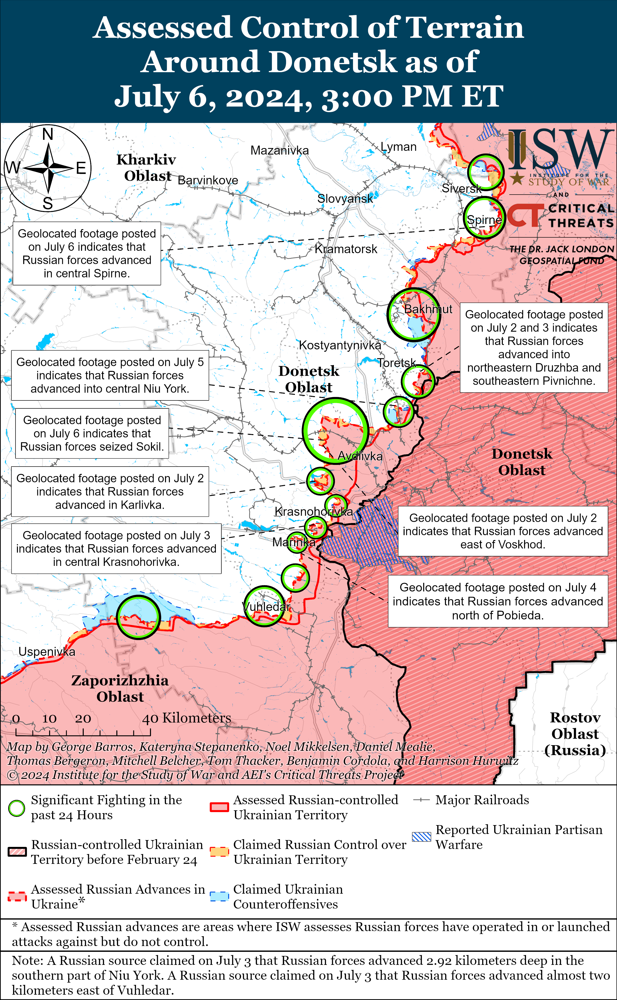
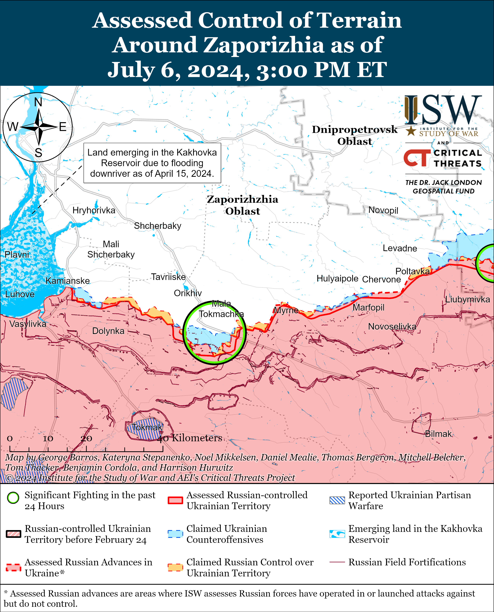
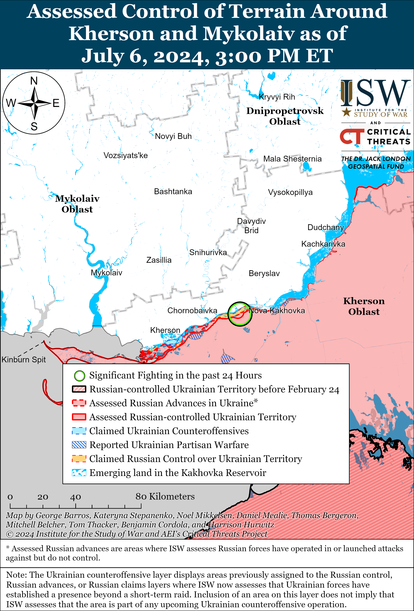

# Russian Offensive Campaign Assessment, July 6, 2024

**Grace Mappes, Angelica Evans, Christina Harward, Riley Bailey, and Frederick W. Kagan**

**July 6, 2024, 4:20pm ET**

**Click**[**here**](https://storymaps.arcgis.com/stories/36a7f6a6f5a9448496de641cf64bd375)**to see ISW’s interactive map of the Russian invasion of Ukraine. This map is updated daily alongside the static maps present in this report.**

**Click**[**here**](https://understandingwar.maps.arcgis.com/apps/instant/3dviewer/index.html?appid=1602762dbcde419bb957dea358449580)**to see ISW’s 3D control of terrain topographic map of Ukraine. Use of a computer (not a mobile device) is strongly recommended for using this data-heavy tool.**

**Click**[**here**](https://storymaps.arcgis.com/stories/733fe90805894bfc8562d90b106aa895)**to access ISW’s archive of interactive time-lapse maps of the Russian invasion of Ukraine. These maps complement the static control-of-terrain map that ISW produces daily by showing a dynamic frontline. ISW will update this time-lapse map archive monthly.**

**Note: The data cut-off for this product was 12:00pm ET on July 6. ISW will cover subsequent reports in the July 7 Russian Offensive Campaign Assessment.**

**Hungarian Prime Minister Viktor Orban continues to posture himself as a potential mediator to end the war in Ukraine despite Russian President Vladimir Putin’s rejection of mediation or serious negotiations. Orban is likely aiming to shift Western focus towards possible peace negotiations as part of his overarching effort to undermine European support for Ukraine.** Orban published an op-ed in *Newsweek*on July 5 in which Orban accused NATO of choosing conflict over peace and stated that NATO was established to maintain peace.[1] Orban’s op-ed follows his visits to Kyiv on July 2 and Moscow on July 5 to advocate for Russia and Ukraine to start negotiations.[2] Orban’s efforts to push for negotiations are likely part of his ongoing effort to shift European focus to discussions about peace negotiations and away from discussions about military support for Ukraine. Orban has consistently opposed and undermined the European Union (EU)’s efforts to provide military assistance to Ukraine, and shifting Europe’s focus away from military assistance supports this broader aim now that Hungary has assumed the EU Council presidency.[3] Bulgarian Prime Minister Dimitar Glavchev offered on July 5 for Bulgaria to mediate peace negotiations between Ukraine and Russia and emphasized that negotiations must comply with the UN charter and international law.[4] Turkish Foreign Minister Hakan Fidan similarly pushed for Ukraine to widen and accelerate Ukraine’s ongoing peace process on July 6 to prevent “deepening polarization” and “prioritize diplomacy.”[5]

**Orban’s and others’ calls for negotiations and Ukraine’s peace formula are distinct efforts with different aims, and Russian President Vladimir Putin has demonstrated that he is not interested in any negotiated agreements short of Ukraine’s capitulation**. Putin rejected Russian participation in possible ceasefire negotiations processes and denied interest in a ceasefire altogether on July 4 and 5.[6] Putin instead demanded Ukrainian capitulation through “demilitarization” and the surrender of significant territory that Russia does not currently occupy — all following months of attempts to portray Russia as willing to negotiate but falsely painting Ukrainian officials as either unwilling or unable to negotiate.[7] Ukraine recently concluded the first of multiple summits with its partners to establish conditions for possible future negotiations that would result in an enduring peace on terms acceptable to Ukraine and its supporters, and dozens of partner states and international organizations, including Hungary, Turkey, and Bulgaria, signed a Joint Peace Communique affirming their support for Ukraine’s sovereignty and territorial integrity on June 16.[8] Ukraine’s ability to pursue its own peace process is contingent on its ability to liberate operationally-significant territory. Ukraine cannot undertake successful counteroffensive efforts in support of this aim without Western military support in the near- and medium-terms.

**Ukrainian forces struck energy infrastructure in Krasnodar Krai with drones on the night of July 5 to 6.**The Krasnodar Krai Operational Headquarters stated that Russian forces shot down Ukrainian drones near Leningradskaya, Yeysk and Pavlovskaya, Krasnodar Krai on the night of July 5 to 6 and that falling drone debris damaged a cell phone tower in Yeysk and caused a fire at an oil depot in Pavlovskaya.[9] The Krasnodar Krai Operational Headquarters also stated that Ukrainian drones struck a fuel tank in Leningradskaya, Krasnodar Krai. Russian opposition outlet *Astra*posted footage on July 6 of fires at fuel tanks in Leningradskaya and the Lukoil oil depot in Pavlovskaya.[10]

**Iran announced on July 6 that Iran and Russia signed a bank agreement on July 4 enabling Russia and Iran to trade in the Russian ruble and Iranian rial.****[11]**Iranian Central Bank Head Mohammad Reza Farzin announced that he and Russian Central Bank Head Elvira Nabiullina also signed a memorandum of understanding on unspecified joint measures for both banks.

**The Russian government continues efforts to isolate the Russian people from material it considers antithetical to state interests and ideology.**Russian federal censor Rozkomnadzor announced on July 4 that it recently blocked Russians from accessing 25 mobile virtual private network (VPN) services.[12] Russian outlet*RBK*reported on July 4 that it obtained a letter from the Russian Federal Security Service (FSB) demanding that Russian telecom operators prohibit clients from using foreign- and domestic-based Voice over Internet Protocol (VoIP) accounts, which allow clients to make phone calls via an Internet connection instead of a traditional phone line and are more difficult to trace.[13] The FSB alleged that the VoIP prohibition will help reduce fraud.[14] Rozkomnadzor announced in April 2024 that it began blocking 150 popular VPN services and restricting access to websites and social media posts that advertise VPNs as of March 1, 2024.[15] Russian State Duma Committee on Information Policy, Information Technology, and Communication Deputy Chairperson Oleg Matveychev stated in October 2023 that Rozkomnadzor is maintaining a list of VPNs that “comply” with existing Russian legislation and will continue to operate in Russia while Rozkomnadzor will block VPNs that “violate Russian laws.”[16] Kremlin-sponsored outlet*Izvestia*clarified in March 2024 that Rozkomnadzor considers any VPN services that allow Russians to access prohibited content and resources as violating Russian law and eligible to be blocked.[17]

The Russian Ministries of Education, Higher Education, Science, and Culture have approved a plan to develop criteria for an annual review of works of literature, art, media, or other materials to determine if a work uses an “excessive” amount of foreign vocabulary.[18] The order claims that developing the criteria is part of the Russian government’s efforts to protect Russia against “external destructive information, psychological influence, … and activities aimed at destroying [Russia’s] traditional values.” The Kremlin’s efforts to ban VPNs and identify works that employ “excessive use of foreign vocabulary” are part of ongoing efforts to consolidate control over the Russian information space and promote further Russian nationalist values domestically.

**Key Takeaways:**

- **Hungarian Prime Minister Viktor Orban continues to posture himself as a potential mediator to end the war in Ukraine despite Putin’s rejection of mediation or serious negotiations. Orban is likely aiming to shift Western focus towards possible peace negotiations as part of his overarching effort to undermine European support for Ukraine.**
- **Orban’s and others’ calls for negotiations and Ukraine’s peace formula, are distinct efforts with different aims, and Russian President Vladimir Putin has demonstrated he is not interested in any negotiated agreements short of Ukraine’s capitulation**.
- **Ukrainian forces struck energy infrastructure in Krasnodar Krai with drones on the night of July 5 to 6.**
- **Iran announced on July 6 that Iran and Russia signed a bank agreement on July 4 enabling Russia and Iran to trade in the Russian ruble and Iranian rial.**
- **The Russian government continues efforts to isolate the Russian people from material it considers antithetical to state interests and ideology.**
- **Russian forces recently advanced near Kupyansk, Siversk, and Avdiivka.**
- **Russian federal subjects (regions) continue to increase monetary incentives to recruit contract soldiers (*kontraktniki*).**

[****](https://understandingwar.org/wp-content/uploads/2025/05/DraftUkraineCoTJuly2062C202024.png)

***We do not report in detail on Russian war crimes because these activities are well-covered in Western media and do not directly affect the military operations we are assessing and forecasting. We will continue to evaluate and report on the effects of these criminal activities on the Ukrainian military and the Ukrainian population and specifically on combat in Ukrainian urban areas. We utterly condemn Russian violations of the laws of armed conflict and the Geneva Conventions and crimes against humanity even though we do not describe them in these reports.***

- Russian Main Effort – Eastern Ukraine (comprised of three subordinate main efforts)
- Russian Subordinate Main Effort #1 – Push Ukrainian forces back from the international border with Belgorod Oblast and approach to within tube artillery range of Kharkiv City
- Russian Subordinate Main Effort #2 – Capture the remainder of Luhansk Oblast and push westward into eastern Kharkiv Oblast and encircle northern Donetsk Oblast
- Russian Subordinate Main Effort #3 – Capture the entirety of Donetsk Oblast
- Russian Supporting Effort – Southern Axis
- Russian Air, Missile, and Drone Campaign
- Russian Mobilization and Force Generation Efforts
- Russian Technological Adaptations
- Activities in Russian-occupied areas
- Ukrainian Defense Industrial Base Efforts
- Russian Information Operations and Narratives
- Significant Activity in Belarus

**Russian Main Effort – Eastern Ukraine**

**Russian Subordinate Main Effort #1 – Kharkiv Oblast****(Russian objective: Push Ukrainian forces back from the international border with Belgorod Oblast and approach to within tube artillery range of Kharkiv City)**

Russian forces reportedly continued sabotage and reconnaissance activities along the international border area in northeastern Ukraine on July 6. A Russian milblogger claimed that Russian sabotage and reconnaissance groups entered Oleksandrivka and Popivka in Sumy Oblast (northwest of Zolochiv and directly on the border with Belgorod Oblast) and that Ukrainian forces are no longer present in the two settlements.[19] The milblogger noted that Russian forces have not started offensive operations in the area, however.[20] Russian forces reportedly recently seized positions in Sotynytskyi Kozachok (north of Zolochiv and directly on the border with Belgorod Oblast), although ISW has yet to observe confirmation of Russian forces holding enduring positions within the settlement.[21] Russian sabotage and reconnaissance activities likely aim to draw and fix Ukrainian forces along a wider front in the international border area, although this activity may portend future Russian offensive operations. Ukrainian President Volodymyr Zelensky stated on May 26 that Russian forces are concentrating a grouping of an unspecified size near the Ukrainian border 90 kilometers northwest of Kharkiv City in preparation for new offensive actions.[22] Russian forces could launch offensive operations from this area to the south in the direction of Zolochiv and Bohodukhiv, two Ukrainian towns northwest of Kharkiv City within 25 kilometers of the international border, or to the west in the direction of settlements along the P-45 highway that connects Bohodukhiv with Sumy City.[23] Russian forces have likely concentrated in the area to generate operational ambiguity about which direction they could start offensive operations in order to further fix Ukrainian forces in both directions. Recent Russian sabotage and reconnaissance activity has occurred in both directions and is likely meant to support Russian efforts to create operational ambiguity in the area.

Fighting continued north and northeast of Kharkiv City on July 6, but there were no confirmed changes to the frontline. The Ukrainian General Staff reported that Russian forces continued offensive operations north of Kharkiv City near Lyptsi and Hlyboke and northeast of Kharkiv City near Starytsya and Vovchansk.[24] Russian milbloggers claimed that Ukrainian forces conducted counterattacks near Lyptsi and Hlyboke, within and near Vovchansk, and near Tykhe (north of Vovchansk).[25] Ukrainian Kharkiv Group of Forces Spokesperson Colonel Yuriy Povkh stated on July 6 that Russian forces in the Vovchansk area are attempting to regroup units by moving individual personnel, suggesting that Russian forces are concerned that even small manpower concentrations are vulnerable to Ukraine’s reconnaissance fire complex (RFC).[26] Elements of the Russian 155th Naval Infantry Brigade (Pacific Fleet) are reportedly operating within Hlyboke, and Ukrainian journalist Yuriy Butusov stated that Ukrainian forces destroyed a battalion of the 7th Motorized Rifle Regiment (11th Army Corps [AC], Leningrad Military District [LMD]) near Lyptsi in June 2024.[27]

An often-critical Russian milblogger pointedly criticized the Russian military command for Russia’s lack of progress in the Vovchansk direction on July 5.[28] The milblogger claimed that Russian forces are far from achieving their objective of creating a 15-kilometer buffer zone and that Russian forces are struggling with coordination in the Vovchansk direction.[29] The milblogger claimed that Russian forces attacking within Vovchansk have already suffered a third of the casualties that Russian forces suffered in their four-month campaign to seize Avdiivka in late 2023 and early 2024.[30] Russian and Ukrainian sources have offered various figures for Russian casualties in the Avdiivka offensive, and it is unclear what figure the milblogger is using for his comparison, but nonetheless the milblogger is suggesting that Russian forces have suffered significant casualties so far in their effort to seize the small Ukrainian border town of Vovchansk. The milblogger pointedly placed the responsibility for the progress of Russian offensive operations in Vovchansk directly on Russian Northern Grouping of Forces and LMD Commander Colonel General Alexander Lapin.[31]

**Russian Subordinate Main Effort #2 – Luhansk Oblast****(Russian objective: Capture the remainder of Luhansk Oblast and push westward into eastern Kharkiv Oblast and northern Donetsk Oblast)**

Russian forces recently marginally advanced southeast of Kupyansk amid continued fighting along the Kupyansk-Svatove-Kreminna line on July 6. Geolocated footage published on July 6 indicates that Russian forces recently marginally advanced east of Pishchane (southeast of Kupyansk) during a roughly reinforced platoon-sized mechanized assault in the area.[32] A Ukrainian military observer stated that Russian forces were unable to advance further during the mechanized assault due to dense Ukrainian minefields and artillery fire in the area.[33] Russian forces continued assaults northeast of Kupyansk near Synkivka; east of Kupyansk near Petropavlivka; southeast of Kupyansk near Stelmakhivka; southwest of Svatove near Nevske, Makiivka, and Hrekivka; west of Kreminna near Terny and Torske; and southwest of Kreminna near the Serebryanske forest area on July 5 and 6.[34]

[****](https://understandingwar.org/wp-content/uploads/2025/05/Luhansk20Battle20Map20Draft20July2062C202024.png)

**Russian Subordinate Main Effort #3 – Donetsk Oblast****(Russian objective: Capture the entirety of Donetsk Oblast, the claimed territory of Russia’s proxies in Donbas)**

Russian forces recently advanced southeast of Siversk amid continued fighting in the area on July 6. Geolocated footage published on July 6 shows elements of the Russian 123rd Motorized Rifle Brigade (2nd Luhansk People’s Republic Army Corps [LNR AC]) raising a flag within central Spirne (southeast of Siversk).[35] One milblogger claimed that Russian forces completely seized Spirne, but other milbloggers claimed that Ukrainian forces still maintain positions within the settlement.[36] Russian forces also continued attacks northeast of Siversk near Bilohorivka and south of Siversk near Vyimka on July 5 and 6.[37] Elements of the Russian 6th Motorized Rifle Brigade (2nd LNR AC) are reportedly operating near Bilohorivka, and elements of the 2nd Artillery Brigade (2nd LNR AC) reportedly operate near Berestove (southeast of Siversk).[38]

Russian forces continued offensive operations near Chasiv Yar on July 6, but there were no confirmed changes to the frontline. Russian forces continued ground attacks within eastern Chasiv Yar, north of Chasiv Yar near Kalynivka, east of Chasiv Yar near Ivanivske, and southeast of Chasiv Yar near Klishchiivka and Andriivka on July 5 and 6.[39] A Russian milblogger claimed that Russian forces are attempting to establish positions along the entirety of the east bank of the Siverskyi-Donets Donbas Canal after seizing Kanal Microraion (easternmost Chasiv Yar).[40] Elements of the Russian 98th Airborne (VDV) Division and 11th VDV Brigade continue to fight within eastern Chasiv Yar.[41]

Russian forces recently advanced in the Toretsk direction amid continued Russian offensive operations in the area on July 6. Geolocated footage published on July 6 indicates that Russian forces recently advanced into southwestern Niu York (south of Toretsk).[42] Russian milbloggers claimed that Russian forces advanced up to 500 meters deep within southeastern Druzhba (east of Toretsk) and southern Pivnichne (east of Toretsk and south of Druzhba) and up to 800 meters deep within southern Niu York (south of Toretsk).[43] Another milblogger claimed that Russian forces had seized half of Pivdenne (southeast of Toretsk).[44] A Russian milblogger claimed that Russian forces are pressuring Ukrainian positions near the Zalizna railway station in southern Niu York.[45] Russian forces also continued attacks near Zalizne (southeast of Toretsk) on July 6.[46] Elements of the Russian 9th Motorized Rifle Brigade (1st Donetsk People’s Republic [DNR] AC) are reportedly fighting near Yurivka (south of Niu York).[47]

Russian forces likely recently seized Sokil (northwest of Avdiivka) amid continued fighting near Avdiivka on July 6. Geolocated footage published on July 6 shows elements of the Russian “Black Hussars” detachment (15th Motorized Rifle Brigade, 2nd Combined Arms Army [CAA], Central Military District [CMD]) raising a flag in western Sokil, and the Russian Ministry of Defense (MoD) claimed that Russian forces seized the settlement.[48] Russian milbloggers have previously claimed that Russian forces seized Sokil on June 29 and July 4.[49] Additional geolocated footage published on July 6 shows that Russian forces advanced west of Sokil towards Voskhod and marginally advanced within eastern Karlivka (west of Avdiivka).[50] Russian milbloggers claimed that Russian forces reached the outskirts of Voskhod; seized half of Yevhenivka (northwest of Avdiivka and west of Sokil); and advanced within Novooleksandrivka and towards Lozuvatske and Novoselivka Persha (all northwest of Avdiivka).[51] Elements of the Russian “Sparta” and “Somalia” battalions (1st DNR AC) are reportedly fighting near Yasnobrodivka (west of Avdiivka), and elements of the Russian 74th Motorized Rifle Brigade (41st CAA, CMD) are reportedly fighting in the Avdiivka direction.[52] Russian forces also continued fighting northwest of Avdiivka near Vozdvyzhenka, Prohres, and Kalynove; west of Avdiivka near Umanske and Netaylove; and southwest of Avdiivka near Nevelske.[53] The Ukrainian General Staff reported that Russian forces in the Pokrovsk (Avdiivka) direction are focusing on advancing towards Novooleksandrivka and Novoselivka Persha and that Russian forces conducted at least 20 attacks in these directions on July 5 and 6.[54]

Russian forces continued offensive operations west and southwest of Donetsk City on July 6, but there were no confirmed changes to the frontline in this area. Russian milbloggers claimed that Russian forces advanced between 300 and 500 meters within Krasnohorivka (west of Donetsk City), but ISW has not observed confirmation of these claims.[55] Russian forces conducted offensive operations west of Donetsk City near Krasnohorivka and Heorhiivka and southwest of Donetsk City near Pobieda, Kostyantynivka, Paraskoviivka, Vuhledar, and Vodyane on July 5 and 6.[56] A Russian milblogger claimed that Ukrainian forces unsuccessfully counterattacked in Paraskoviivka.[57] Elements of the Russian 238th Artillery Brigade (8th CAA, Southern Military District [SMD]) and 5th Motorized Rifle Brigade (1st DNR AC) are reportedly operating near Krasnohorivka.[58]

Positional engagements continued in the Donetsk-Zaporizhia Oblast border area south of Velyka Novosilka near Staromayorske, Urozhaine, and Makarivka on July 6.[59]

Ukrainian Mariupol Mayoral Advisor Petro Andryushchenko reported on July 6 that Ukrainian forces struck a Russian military camp along the coastline southwest of Urzuf (between occupied Mariupol, Donetsk Oblast and Berdyansk, Zaporizhia Oblast) and inflicted unspecified personnel casualties.[60] ISW has not observed confirmation of this reported strike.

**Russian Supporting Effort – Southern Axis****(Russian objective: Maintain frontline positions and secure rear areas against Ukrainian strikes)**

Russian forces continued ground assaults near Robotyne and Novodanylivka (north of Robotyne), east of Mala Tokmachka (northeast of Robotyne), and northwest of Verbove (east of Robotyne) in western Zaporizhia Oblast on July 5 and 6.[61]

Russian forces continued ground attacks in the east (left) bank of Kherson Oblast, including northwest of Kozachi Laheri (northeast of Kherson City) and on the islands in the Dnipro River on July 5 and 6.[62]

**Russian Air, Missile, and Drone Campaign****(Russian Objective: Target Ukrainian military and civilian infrastructure in the rear and on the frontline)**

Russian forces conducted a series of drone and missile strikes against Ukraine on July 5 and 6. Ukrainian Air Force Commander Lieutenant General Mykola Oleshchuk reported that Russian forces launched 27 Shahed-136/131 drones from occupied Crimea and Kursk Oblast on the night of July 5 to 6 and that Ukrainian forces destroyed 24 Shahed drones over Dnipropetrovsk, Poltava, Zaporizhia, Kherson, Kharkiv, Donetsk, Sumy, Chernihiv, Vinnytsia, Kyiv, Kirovohrad, and Mykolaiv oblasts.[63] The Sumy Oblast Military Administration reported that Russian Shahed drones damaged energy infrastructure in Sumy Oblast and disrupted power to several raions.[64] The Ukrainian Air Force reported that Ukraine’s Southern Air Command downed five Russian Kh-59 cruise missiles during the day on July 5.[65] Russian sources, including the Russian Ministry of Defense (MoD), published footage claiming to show a Russian Iskander-M ballistic missile striking a Ukrainian S-300 air defense system near Koptiv, Poltava Oblast on July 5 and purportedly destroying two S-300 launchers, a combat control cabin, transport vehicles, and the system’s personnel.[66]

Ukrainian President Volodymyr Zelensky reported that Russian forces launched over 600 glide bombs, 60 Shahed drones, and 40 missiles of various types against targets in Ukraine between roughly June 29 and July 5.[67]

**Russian Mobilization and Force Generation Efforts****(Russian objective: Expand combat power without conducting general mobilization)**

Russian federal subjects (regions) continue to increase monetary incentives to recruit contract soldiers (*kontraktniki*). Tatarstan President Rustam Minnikhanov stated on July 5 that Tatarstan will increase one-time payments to 1.05 million rubles (about $12,000) for *kontraktniki*who sign contracts before July 31.[68] This one-time payment has roughly doubled, as Tatarstan previously paid *kontraktniki* 505,000 rubles (about $5,700).

**Russian Technological Adaptations (Russian objective: Introduce technological innovations to optimize systems for use in Ukraine)**

Nothing significant to report.

**Ukrainian Defense Industrial Efforts****(Ukrainian objective: Develop its defense industrial base to become more self-sufficient in cooperation with US, European, and international partners)**

*ISW is not publishing coverage of Ukrainian defense industrial efforts today.*

**Activities in Russian-occupied areas****(Russian objective: Consolidate administrative control of annexed areas; forcibly integrate Ukrainian citizens into Russian sociocultural, economic, military, and governance systems)**

*ISW is not publishing coverage of activities in Russian-occupied areas today.*

**Russian Information Operations and Narratives**

A prominent Kremlin-affiliated Russian milblogger presented Armenian efforts to cooperate with the European Union and the United States as threats to Armenian security and sovereignty on July 6.[69] The milblogger has previously heavily amplified protests critical of Armenian Prime Minister Nikol Pashinyan and likely hopes that claims about the alleged threat of Western cooperation will generate further criticism about Pashinyan within Armenia that favors Russia’s goal to reverse Armenia’s turn away from security and political relations with Russia.[70]

The Kremlin continues to use narratives about alleged discrimination against Russian citizens abroad as conditions setting for possible escalations with Western countries. The Russian Ministry of Foreign Affairs (MFA) stated on July 5 that Belarus and Russia submitted a joint report to the Organization for Security and Co-operation in Europe (OSCE) about Western countries infringing on human rights, specifically against Russian citizens.[71] The Russian State Duma and Federation Council adopted a joint statement on July 3 to suspend the Russian Federal Assembly’s participation in the OSCE’s Parliamentary Assembly.[72]

A Kremlin-affiliated ultranationalist milblogger expressed concerns on July 6 about Turkey using possible future membership in the Shanghai Cooperation Organization (SCO) to promote the Turkic Council and increase Turkish influence in Central Asia and the South Caucasus.[73] Russian President Vladimir Putin has highlighted the SCO as a possible cornerstone for his proposed alternative “Eurasian security architecture,” but the milblogger’s concern suggests that some Russian ultranationalists may be wary about who is included in the “Eurasian security architecture.”[74]

**Significant activity in Belarus****(Russian efforts to increase its military presence in Belarus and further integrate Belarus into Russian-favorable frameworks and Wagner Group activity in Belarus)**

Belarus continues to deepen its ties to the People’s Republic of China (PRC). The Belarusian Ministry of Defense (MoD) stated on July 6 that military personnel from the PRC arrived in Belarus to participate in joint counterterrorism exercises from July 8 to 19.[75] Belarusian Foreign Minister Maxim Ryzhenkov arrived in the PRC on July 6 to meet with PRC Foreign Minister Wang Yi, the China International Development Cooperation Agency, and the International Department of the Central Committee of the Chinese Communist Party from July 6 to 9.[76]

**Note: ISW does not receive any classified material from any source, uses only publicly available information, and draws extensively on Russian, Ukrainian, and Western reporting and social media as well as commercially available satellite imagery and other geospatial data as the basis for these reports. References to all sources used are provided in the endnotes of each update.**

---

[1] https://www.newsweek.com/orban-point-nato-peace-not-endless-war-opinion-1915287

[2] https://understandingwar.org/backgrounder/russian-offensive-campaign-assessment-july-2-2024; https://understandingwar.org/backgrounder/russian-offensive-campaign-assessment-july-5-2024

[3] https://www.consilium.europa.eu/en/council-eu/presidency-council-eu/ ; https://understandingwar.org/backgrounder/russian-offensive-campaign-assessment-july-1-2024 ; https://www.politico.eu/article/ukraine-gets-eu-aid-as-orban-folds/#:~:text=European%20Union%20leaders%20on%20Thursday,Orb%C3%A1n%2C%20to%20drop%20his%20veto.; https://www.euronews.com/my-europe/2024/05/27/it-has-gone-very-far-eu-countries-voice-exasperation-over-hungarys-vetoes-on-ukraine-aid; https://www.politico.eu/article/eu-threatens-silence-hungary-orban-if-blocks-ukrainian-aid-funds-article-7/; https://www.dw.com/en/eu-overcomes-orbans-veto-on-50-billion-ukraine-aid-deal/a-68147741

[4] https://www.novinite.com/articles/227014/Acting+PM%3A+Bulgaria+to+Advocate+for+Peace+Negotiations+between+Russia+and+Ukraine+at+NATO+Summit

[5] https://kyivindependent dot com/turkey-proposes-peace-platform-to-end-war-in-ukraine/1

[6] https://understandingwar.org/backgrounder/russian-offensive-campaign-assessment-july-5-2024; https://understandingwar.org/backgrounder/russian-offensive-campaign-assessment-july-4-2024

[7] https://understandingwar.org/backgrounder/russian-offensive-campaign-assessment-july-5-2024; https://understandingwar.org/backgrounder/russian-offensive-campaign-assessment-july-4-2024; https://isw.pub/UkrWar052624; https://isw.pub/UkrWar052424; https://isw.pub/UkrWar040424; https://isw.pub/UkrWar052624; https://isw.pub/UkrWar052524; https://isw.pub/UkrWar051724

[8] https://www.eda.admin dot ch/eda/en/fdfa/fdfa/aktuell/dossiers/konferenz-zum-frieden-ukraine/Summit-on-Peace-in-ukraine-joint-communique-on-a-peace-framework.html

[9] https://t.me/opershtab23/8172

[10] https://t.me/astrapress/59009; https://t.me/astrapress/59010

[11] https://en.irna dot ir/news/85531536/Iran-Russia-sign-monetary-contract; https://www.irna dot ir/news/85531348/%D8%A7%D9%85%D8%B6%D8%A7%DB%8C-%D9%86%D8%AE%D8%B3%D8%AA%DB%8C%D9%86-%D9%82%D8%B1%D8%A7%D8%B1%D8%AF%D8%A7%D8%AF-%D9%BE%DB%8C%D9%85%D8%A7%D9%86-%D9%BE%D9%88%D9%84%DB%8C-%D8%A7%DB%8C%D8%B1%D8%A7%D9%86-%D9%88-%D8%B1%D9%88%D8%B3%DB%8C%D9%87-%D8%A7%D8%AA%D8%B5%D8%A7%D9%84-%D8%B4%D8%A8%DA%A9%D9%87-%D8%B4%D8%AA%D8%A7%D8%A8

[12] https://t.me/tass\_agency/258704 ; https://meduza dot io/news/2024/07/04/app-store-udalil-iz-rossiyskogo-magazina-neskolko-prilozheniy-vpn ;

[13] https://www.rbc dot ru/technology\_and\_media/04/07/2024/668570169a79479ffd56d8bc

[14] https://www.rbc dot ru/technology\_and\_media/04/07/2024/668570169a79479ffd56d8bcv ; https://x.com/DefenceHQ/status/1809480486428823654

[15] https://understandingwar.org/backgrounder/russian-offensive-campaign-assessment-april-23-2024

[16] https://lenta dot ru/news/2023/10/30/happylist/

[17] https://iz dot ru/1653703/elizaveta-gritcenko/vpn-opasen-otkliuchat-li-vpn-v-rossii-s-1-marta-2024-goda

[18] https://www.pnp dot ru/social/v-rossii-opredelyat-kriterii-izlishnego-ispolzovaniya-inostrannoy-leksiki.html ; https://t.me/tass\_agency/259051 ; https://t.me/idelrealii/36293

[19] https://t.me/boris\_rozhin/129151

[20] https://t.me/boris\_rozhin/129151

[21] https://understandingwar.org/backgrounder/russian-offensive-campaign-assessment-july-4-2024

[22] https://isw.pub/UkrWar052624

[23] https://isw.pub/UkrWar052624

[24] https://www.facebook.com/GeneralStaff.ua/posts/pfbid031FFj1HYCTmRorQoDeTCowyoZqNmHPX27WTCCkvVWUCwcskmWd8M2BkNcPvTWcXpMl ; https://www.facebook.com/GeneralStaff.ua/posts/pfbid02q8gnXXDaMA2n6NhX7RG4vPETBJcST6xbHnL24J9prRZ3iDyApEGcgcmohuKJuwmrl

[25] https://t.me/dva\_majors/46810 ; https://t.me/wargonzo/20893

[26] https://armyinform.com dot ua/2024/07/06/vorog-namagayetsya-peregrupuvaty-osobovyj-sklad-bilya-vovchanska/

[27] https://t.me/creamy\_caprice/5998; https://t.me/rustroyka1945/17358 ; https://t.me/ButusovPlus/11609

[28] https://t.me/romanov\_92/44831

[29] https://t.me/romanov\_92/44831

[30] https://t.me/romanov\_92/44831

[31] https://t.me/romanov\_92/44831

[32] https://t.me/creamy\_caprice/5991; https://t.me/voynareal\_ua/42549

[33] https://t.me/ButusovPlus/11618

[34] https://www.facebook.com/GeneralStaff.ua/posts/pfbid031FFj1HYCTmRorQoDeTCowyoZqNmHPX27WTCCkvVWUCwcskmWd8M2BkNcPvTWcXpMl ; https://www.facebook.com/GeneralStaff.ua/posts/pfbid02q8gnXXDaMA2n6NhX7RG4vPETBJcST6xbHnL24J9prRZ3iDyApEGcgcmohuKJuwmrl ; https://www.facebook.com/GeneralStaff.ua/posts/pfbid02iknsXrHp7yiRKoA9nEwdcncWvJPrWLpSzjVXiar9J32TMYppnNxb4vMTRS8cJArTl;

[35] https://t.me/creamy\_caprice/5994; https://t.me/frontline\_pvt/1580

[36] https://t.me/rybar/61607; https://t.me/nm\_dnr/12458; https://t.me/frontline\_pvt/1580

[37] https://www.facebook.com/GeneralStaff.ua/posts/pfbid031FFj1HYCTmRorQoDeTCowyoZqNmHPX27WTCCkvVWUCwcskmWd8M2BkNcPvTWcXpMl; https://www.facebook.com/GeneralStaff.ua/posts/pfbid02q8gnXXDaMA2n6NhX7RG4vPETBJcST6xbHnL24J9prRZ3iDyApEGcgcmohuKJuwmrl; https://www.facebook.com/GeneralStaff.ua/posts/pfbid02iknsXrHp7yiRKoA9nEwdcncWvJPrWLpSzjVXiar9J32TMYppnNxb4vMTRS8cJArTl

[38] https://t.me/sons\_fatherland/15421 (Siversk); https://t.me/sons\_fatherland/15421 (Bilohorivka)

[39] https://www.facebook.com/GeneralStaff.ua/posts/pfbid031FFj1HYCTmRorQoDeTCowyoZqNmHPX27WTCCkvVWUCwcskmWd8M2BkNcPvTWcXpMl; https://www.facebook.com/GeneralStaff.ua/posts/pfbid02q8gnXXDaMA2n6NhX7RG4vPETBJcST6xbHnL24J9prRZ3iDyApEGcgcmohuKJuwmrl; https://www.facebook.com/GeneralStaff.ua/posts/pfbid02iknsXrHp7yiRKoA9nEwdcncWvJPrWLpSzjVXiar9J32TMYppnNxb4vMTRS8cJArTl

[40] https://t.me/dva\_majors/46810

[41] https://t.me/rusich\_army/15621; https://t.me/boris\_rozhin/129058

[42] https://x.com/EjShahid/status/1809655026941587614; https://t.me/skalabatalion/186

[43] https://t.me/RVvoenkor/71883; https://t.me/NgP\_raZVedka/18313; https://t.me/RVvoenkor/71898; https://t.me/z\_arhiv/27207;

[44] https://t.me/DnevnikDesantnika/12498

[45] https://t.me/dva\_majors/46811;

[46] https://www.facebook.com/GeneralStaff.ua/posts/pfbid031FFj1HYCTmRorQoDeTCowyoZqNmHPX27WTCCkvVWUCwcskmWd8M2BkNcPvTWcXpMl;

[47] https://t.me/RVvoenkor/71887

[48] https://t.me/mod\_russia/40738; https://t.me/blackhussars/2212; https://t.me/creamy\_caprice/5996;

[49] https://understandingwar.org/backgrounder/russian-offensive-campaign-assessment-july-4-2024; https://understandingwar.org/backgrounder/russian-offensive-campaign-assessment-june-29-2024

[50] https://t.me/creamy\_caprice/5993; https://t.me/Khortytsky\_wind/650; https://t.me/WarArchive\_ua/16971; https://t.me/strikedronescompany/322 ; https://x.com/666\_mancer/status/1809525494729019616; https://t.me/creamy\_caprice/6000

[51] https://t.me/rybar/61589; https://t.me/DnevnikDesantnika/12479; https://t.me/dva\_majors/46810; https://t.me/RVvoenkor/71898; https://t.me/rusich\_army/15632

[52] https://t.me/rybar/61608; https://t.me/boris\_rozhin/129059

[53] https://www.facebook.com/GeneralStaff.ua/posts/pfbid02q8gnXXDaMA2n6NhX7RG4vPETBJcST6xbHnL24J9prRZ3iDyApEGcgcmohuKJuwmrl; https://www.facebook.com/GeneralStaff.ua/posts/pfbid031FFj1HYCTmRorQoDeTCowyoZqNmHPX27WTCCkvVWUCwcskmWd8M2BkNcPvTWcXpMl; https://www.facebook.com/GeneralStaff.ua/posts/pfbid02iknsXrHp7yiRKoA9nEwdcncWvJPrWLpSzjVXiar9J32TMYppnNxb4vMTRS8cJArTl

[54] https://www.facebook.com/GeneralStaff.ua/posts/pfbid02iknsXrHp7yiRKoA9nEwdcncWvJPrWLpSzjVXiar9J32TMYppnNxb4vMTRS8cJArTl; https://www.facebook.com/GeneralStaff.ua/posts/pfbid02q8gnXXDaMA2n6NhX7RG4vPETBJcST6xbHnL24J9prRZ3iDyApEGcgcmohuKJuwmrl

[55] https://t.me/DnevnikDesantnika/12480; https://t.me/wargonzo/20893; https://t.me/rybar/61608

[56] https://www.facebook.com/GeneralStaff.ua/posts/pfbid031FFj1HYCTmRorQoDeTCowyoZqNmHPX27WTCCkvVWUCwcskmWd8M2BkNcPvTWcXpMl; https://www.facebook.com/GeneralStaff.ua/posts/pfbid02q8gnXXDaMA2n6NhX7RG4vPETBJcST6xbHnL24J9prRZ3iDyApEGcgcmohuKJuwmrl; https://www.facebook.com/GeneralStaff.ua/posts/pfbid02iknsXrHp7yiRKoA9nEwdcncWvJPrWLpSzjVXiar9J32TMYppnNxb4vMTRS8cJArTl; https://t.me/RVvoenkor/71877; https://t.me/NgP\_raZVedka/18307; https://t.me/NgP\_raZVedka/18313; https://t.me/RVvoenkor/71877; https://t.me/wargonzo/20893

[57] https://t.me/NgP\_raZVedka/18307

[58] https://t.me/boris\_rozhin/129131

[59] https://www.facebook.com/GeneralStaff.ua/posts/pfbid02q8gnXXDaMA2n6NhX7RG4vPETBJcST6xbHnL24J9prRZ3iDyApEGcgcmohuKJuwmrl; https://t.me/RVvoenkor/71877

[60] https://t.me/andriyshTime/24219; https://t.me/andriyshTime/24217

[61] https://t.me/tass\_agency/259048 ; https://t.me/wargonzo/20893 ; https://t.me/wargonzo/20893 ; https://www.facebook.com/GeneralStaff.ua/posts/pfbid031FFj1HYCTmRorQoDeTCowyoZqNmHPX27WTCCkvVWUCwcskmWd8M2BkNcPvTWcXpMl ; https://www.facebook.com/GeneralStaff.ua/posts/pfbid02iknsXrHp7yiRKoA9nEwdcncWvJPrWLpSzjVXiar9J32TMYppnNxb4vMTRS8cJA rTl ; https://t.me/dva\_majors/46810

[62] https://t.me/dva\_majors/46810 ; https://www.facebook.com/GeneralStaff.ua/posts/pfbid02iknsXrHp7yiRKoA9nEwdcncWvJPrWLpSzjVXiar9J32TMYppnNxb4vMTRS8cJArTl ; https://www.facebook.com/GeneralStaff.ua/posts/pfbid02q8gnXXDaMA2n6NhX7RG4vPETBJcST6xbHnL24J9prRZ3iDyApEGcgcmohuKJuwmrl

[63] https://t.me/ComAFUA/336; https://www.facebook.com/GeneralStaff.ua/posts/pfbid02Frj53DBU3L8NCCdwAxoTfYJYVRiJw6CvdEAZ8vbN1fsiHiryajKr1gDRaN14RKtzl ; https://www.facebook.com/GeneralStaff.ua/posts/pfbid02q8gnXXDaMA2n6NhX7RG4vPETBJcST6xbHnL24J9prRZ3iDyApEGcgcmohuKJuwmrl

[64] https://t.me/Sumy\_news\_ODA/27867

[65] https://t.me/kpszsu/16209

[66] https://t.me/mod\_russia/40734 ; https://t.me/z\_arhiv/27206; https://t.me/The\_Wrong\_Side/16951 ; https://t.me/grey\_zone/23446 ; https://t.me/sashakots/47708 ; https://t.me/boris\_rozhin/129056 ; https://t.me/epoddubny/20319 ; https://t.me/milinfolive/125448 ; https://t.me/rybar/61589

[67] https://www.facebook.com/zelenskyy.official/videos/455169900642735/ ; https://armyinform.com dot ua/2024/07/06/prezydent-czogo-tyzhnya-rosiya-zastosuvala-ponad-600-kabiv-ponad-60-shahediv-i-majzhe-40-raket/

[68] https://www.idelreal.org/a/v-tatarstane-uvelichili-edinovremennuyu-vyplatu-dlya-kontraktnikov-do-1-5-milliona-rubley/33023533.html ; https://www.business-gazeta dot ru/news/639797

[69] https://t.me/rybar/61603 ; https://t.me/rybar/61609

[70] https://understandingwar.org/backgrounder/russian-offensive-campaign-assessment-june-12-2024 ; https://isw.pub/UkrWar061024

[71] https://t.me/MID\_Russia/42957; https://t.me/RusMissionOSCE/4888; https://t.me/MID\_Russia/42967

[72] https://interfax.com/newsroom/top-stories/103972/

[73] https://t.me/wargonzo/20901

[74] https://isw.pub/UkrWar070324

[75] https://t.me/modmilby/40153;

[76] https://belta dot by/politics/view/glava-mid-belarusi-ryzhenkov-pribyl-v-kitaj-646079-2024/
