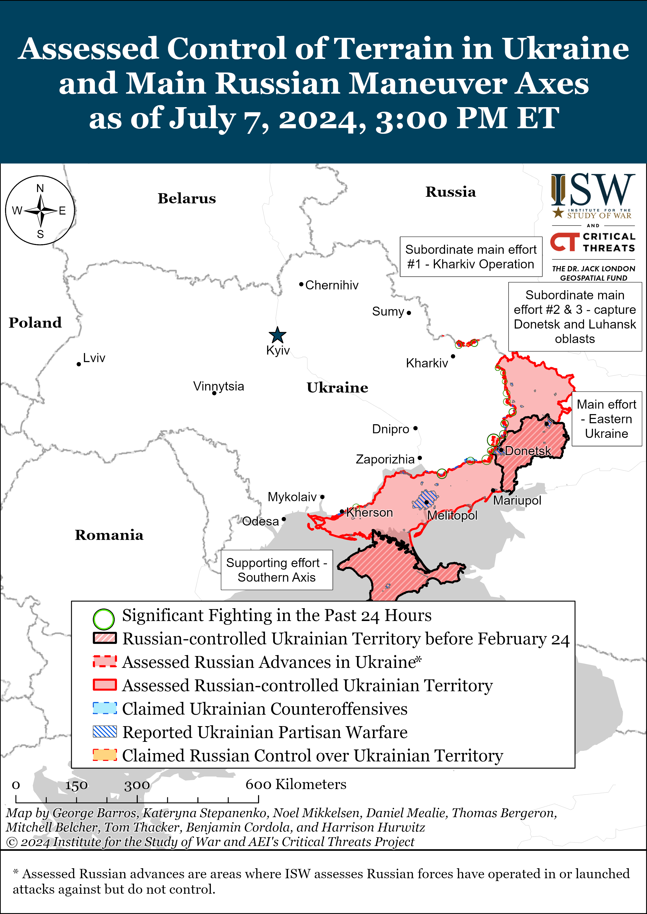
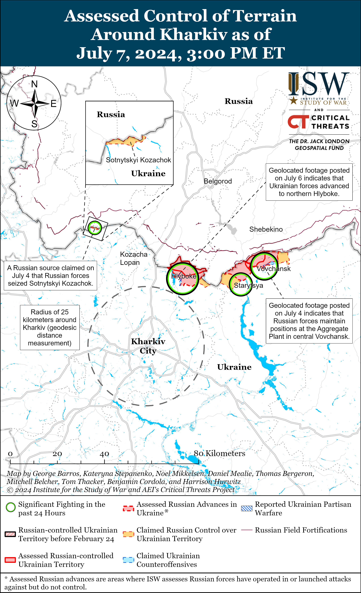
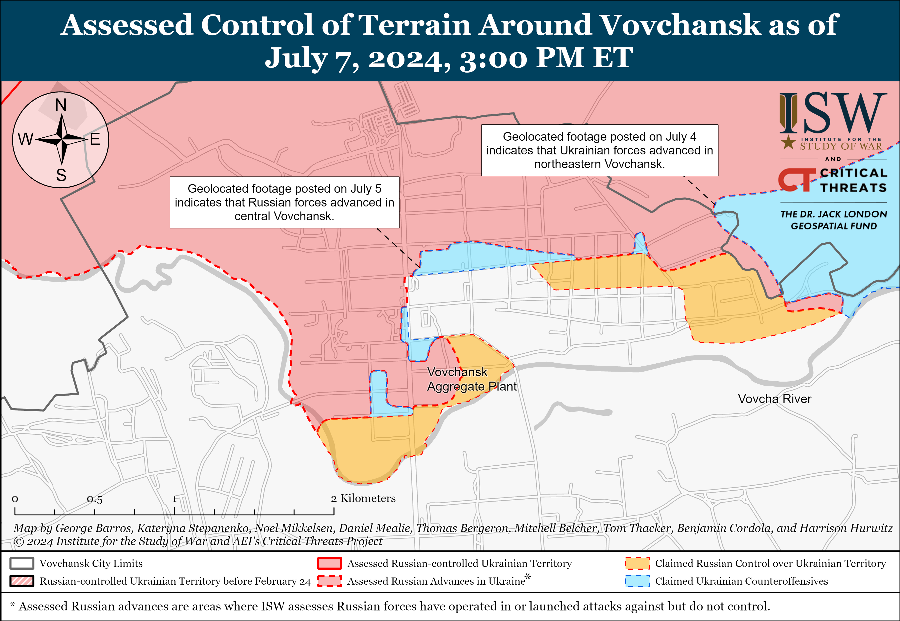
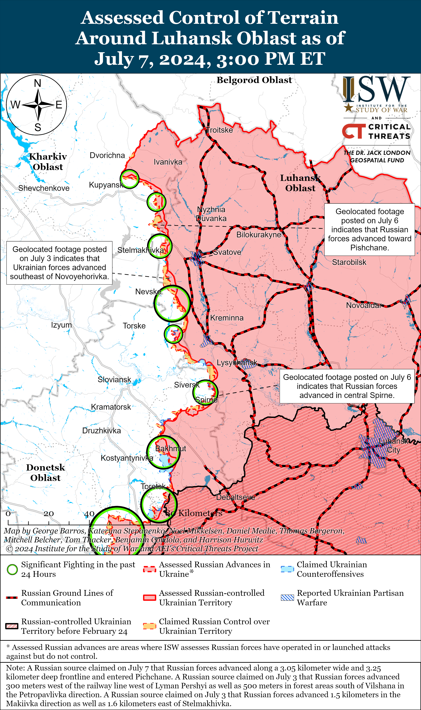
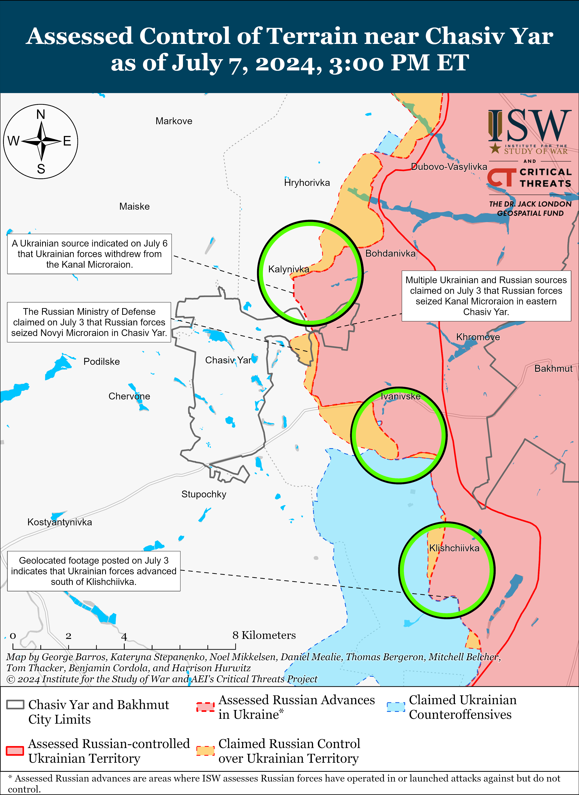
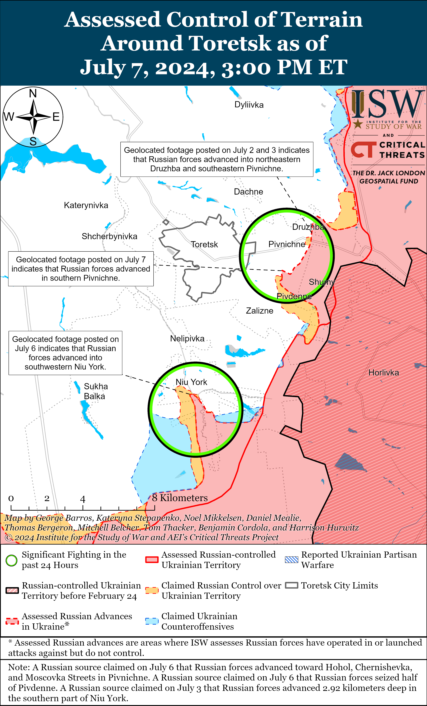
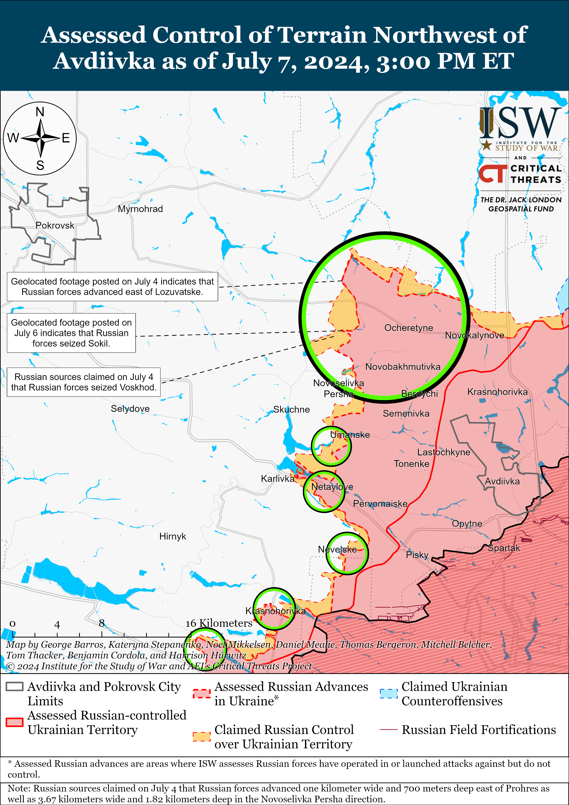
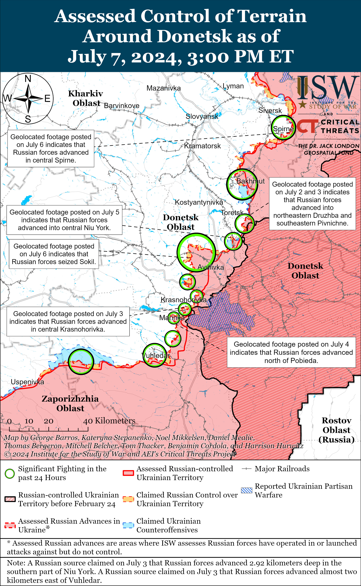
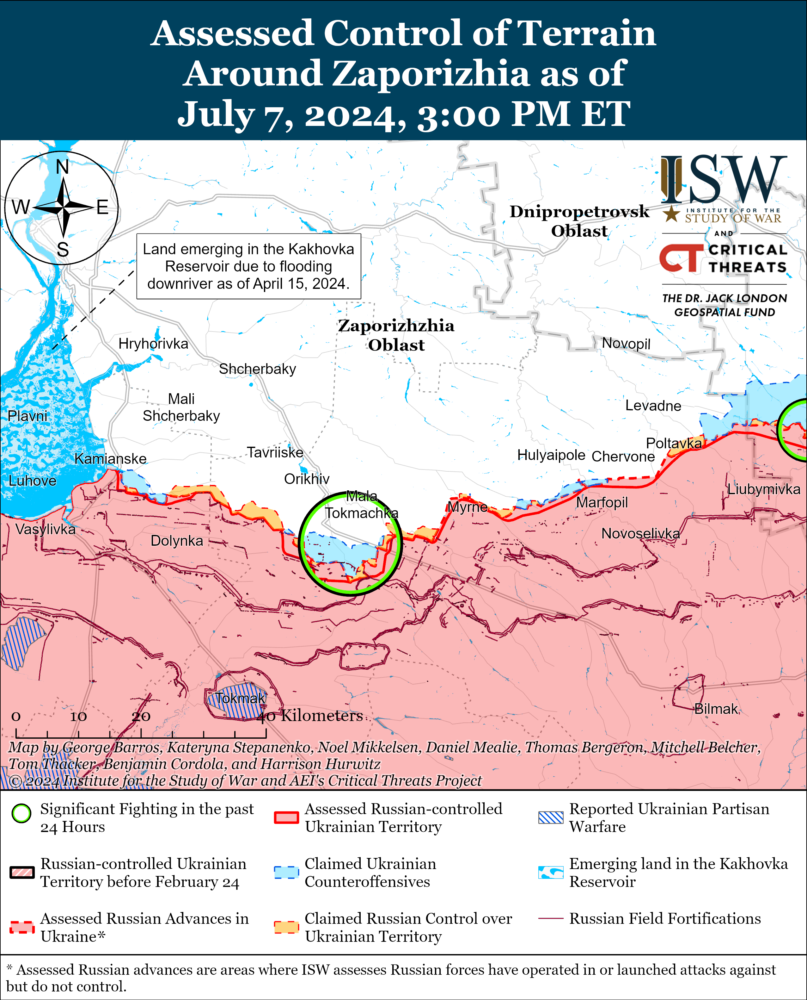
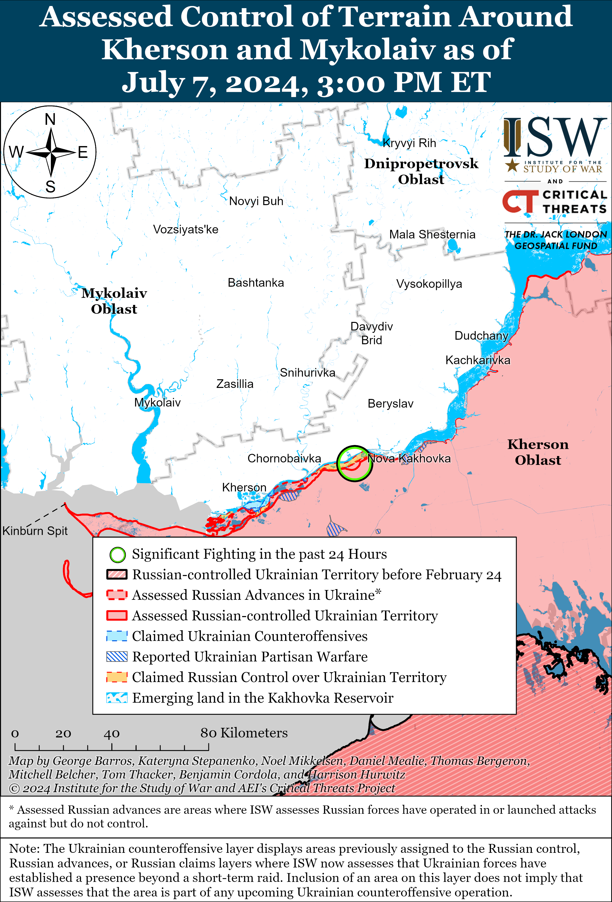

# Russian Offensive Campaign Assessment, July 7, 2024

**Christina Harward, Riley Bailey, Nicole Wolkov, Grace Mappes, and George Barros**

**July 7, 2024, 5:25pm ET**

**Click**[**here**](https://storymaps.arcgis.com/stories/36a7f6a6f5a9448496de641cf64bd375)**to see ISW’s interactive map of the Russian invasion of Ukraine. This map is updated daily alongside the static maps present in this report.**

**Click**[**here**](https://understandingwar.maps.arcgis.com/apps/instant/3dviewer/index.html?appid=1602762dbcde419bb957dea358449580)**to see ISW’s 3D control of terrain topographic map of Ukraine. Use of a computer (not a mobile device) is strongly recommended for using this data-heavy tool.**

**Click**[**here**](https://storymaps.arcgis.com/stories/733fe90805894bfc8562d90b106aa895)**to access ISW’s archive of interactive time-lapse maps of the Russian invasion of Ukraine. These maps complement the static control-of-terrain map that ISW produces daily by showing a dynamic frontline. ISW will update this time-lapse map archive monthly.**

**Note: The data cut-off for this product was 12:00pm ET on July 7. ISW will cover subsequent reports in the July 8 Russian Offensive Campaign Assessment.**

**Ukrainian forces conducted a drone strike against a Russian ammunition depot in Sergeevka, Voronezh Oblast on the night of July 6 to 7.** Ukrainian outlet *Suspilne*reported that its sources stated that the Ukrainian Security Service (SBU) conducted the strike and reported that the ammunition depot contained surface-to-surface missiles, surface-to-air missiles, ammunition for tanks and artillery, and small arms rounds.[1] Geolocated footage published on July 7 taken near Morozovka, Voronezh Oblast (just northeast of Sergeevka along the M2 highway) shows a smoke plume and explosions with visible secondary detonations in the distance.[2] Voronezh Oblast Governor Alexander Gusev claimed on July 7 that Russian air defense systems destroyed several Ukrainian drones over Voronezh Oblast and that drone debris fell on a warehouse in Podgorensky Raion, causing a fire and secondary explosions.[3] NASA Fire Information for Resource Management (FIRMS) data from July 7 detected anomalous heat signatures near Sergeevka.[4]

**Satellite imagery confirms that the Ukrainian Air Force conducted a successful strike against a reported Russian regimental command post in Belgorod Oblast in late June 2024, likely with Western-provided weapons – further demonstrating how Ukraine could disrupt Russian offensive operations should the West continue to lift restrictions on Ukraine’s use of Western-provided weapons to strike military targets in Russia.**The Ukrainian General Staff reported on June 23 that the Ukrainian Air Force struck the command post of an unspecified Russian motorized rifle regiment in Nekhoteevka, Belgorod Oblast on an unspecified date.[5] Geolocated footage of the strike shows that the command post was less than one kilometer from the Russian-Ukrainian border.[6] Satellite imagery collected on April 1 and June 28 shows significant damage to the building that reportedly housed the command post in Nekhoteevka.[7] Ukrainian forces likely used a French-made Armement Air-Sol Modulaire Hammer precision-guided bomb.[8] The command post’s location close to the frontline in northern Kharkiv Oblast suggests that it was involved with ongoing Russian offensive operations north of Kharkiv City.[9] The Nekhoteevka strike demonstrates Ukraine’s ability to conduct successful strikes on Russian military targets within Russia using Western-provided weapons to degrade Russian forces’ ability to conduct offensive operations in Ukraine. ISW continues to assess that Ukraine should be able to use Western-provided weapons, including ATACMS missiles, to strike Russian military targets within Russia’s operational rear and deep rear areas to substantially disrupt Russian operations at scale.[10]

**Ukrainian drone operators appear to be improving their capabilities to interdict longer-range Russian drones in mid-air, and these technological innovations may allow Ukrainian forces to ease pressures on short-range and medium-range air defense assets if successfully fielded at scale.**Footage posted on June 1 shows Ukrainian forces using first-person view (FPV) drones to strike a Russian tactical Zala reconnaissance drone and a medium-range Orlan-10 reconnaissance drone in mid-flight in the Velyka Novosilka area.[11] The Ukrainian Kharkiv Group of Forces posted footage on June 29 showing a Ukrainian FPV drone intercepting a Russian Lancet loitering munition in mid-air in the Kharkiv direction.[12] Both Ukrainian and Russian forces appear to be improving their capability to use FPV drones to intercept other FPV drones at the tactical level, but ISW has yet to observe confirmation of Russian forces using FPV drones to strike Ukrainian loitering munitions or longer-range reconnaissance drones in mid-air.[13] Russian forces leveraged constraints on Ukrainian air defense assets in recent months to more freely operate fixed-wing reconnaissance drones in Ukraine, including in deep Ukrainian rear areas, which likely allowed Russian forces to improve their reconnaissance fire and reconnaissance strike complexes (RFC/RSC).[14] A robust Ukrainian capability to use cheap and widely-available drones to interdict more expensive Russian reconnaissance drones at scale would likely allow Ukrainian forces to degrade Russia’s RFC/RSC while conserving expensive and scarce short- and medium-range air defense interceptors for more expensive and significant Russian air targets. ISW has yet to observe Ukrainian forces using FPV drones to strike conventional Russian reconnaissance drones at scale, however. Russian and Ukrainian forces are currently engaged in a technological offense-defense race, and Ukraine’s capability to field technological innovations at scale ahead of Russian adaptations is crucial for Ukraine’s ability to offset Russia’s current materiel advantages.[15]

**Chechen “Akhmat” Spetsnaz forces likely coerced a Russian milblogger to issue a public apology after he criticized “Akhmat” forces – an illustrative example of unprofessionalism in the Russian military.**An often-critical Russian milblogger claimed on June 5 that “TikTokers” are “standing behind” conscripts in Belgorod Oblast, insinuating that Chechen “Akhmat” forces are not contributing to ongoing Russian offensive operations in the Kharkiv direction.[16] The milblogger later published an apology video on July 7 in which the milblogger is sitting with a soldier from the “Akhmat” Spetsnaz “Aida” Detachment and acknowledged that he was referring to “Akhmat” forces as “TikTokers.[17] The milblogger claimed on July 7 that he met with “Akhmat” Spetsnaz Commander Apty Alaudinov and that Akhmat forces are actually fighting on the frontline in the Kharkiv direction. The milblogger notably pointedly criticized the Russian military command for Russia’s lack of progress and significant losses in the Vovchansk direction in the July 5 video but only focused his July 7 apology on his comments about “Akhmat” forces.[18] Russian milbloggers have previously criticized “Akhmat” forces for not contributing to Russian military operations and only visiting frontline areas for propaganda purposes, and Chechen officials have tried to publicly restore “Akhmat’s” reputation.[19] The Kremlin has recently undertaken measures that have successfully limited criticisms of the Russian military in the Russian information space, and Alaudinov’s immediate involvement in the issue after the milblogger’s July 5 video demonstrates the extreme measures that select members of the Russian military command are able to take to suppress critical voices.[20] The “Akhmat” forces’ response to the milblogger’s video also demonstrates the widespread unprofessionalism that is pervasive throughout the Russian military, since it appears that the “Akhmat” forces took matters affecting their reputations into their own hands.

**Key Takeaways:**

- **Ukrainian forces conducted a drone strike against a Russian ammunition depot in Sergeevka, Voronezh Oblast on the night of July 6 to 7.**
- **Satellite imagery confirms that the Ukrainian Air Force conducted a successful strike against a reported Russian regimental command post in Belgorod Oblast in late June 2024, likely with Western-provided weapons – further demonstrating how Ukraine could disrupt Russian offensive operations should the West continue to lift restrictions on Ukraine’s use of Western-provided weapons to strike military targets in Russia.**
- **Ukrainian drone operators appear to be improving their capabilities to interdict longer-range Russian drones in mid-air, and these technological innovations may allow Ukrainian forces to ease pressures on short-range and medium-range air defense assets if successfully fielded at scale.**
- **Chechen “Akhmat” Spetsnaz forces likely coerced a Russian milblogger to issue a public apology after he criticized “Akhmat” forces – an illustrative example of unprofessionalism in the Russian military.**
- **Russian forces recently made confirmed advances near Chasiv Yar and Toretsk, and Ukrainian forces recently advanced north of Kharkiv City.**
- **Open-source researchers analyzed satellite imagery and assessed that Russia has removed roughly 42 percent of Russian tanks from pre-war open-air storage since the start of the full-scale invasion.**

[****](https://understandingwar.org/wp-content/uploads/2025/05/DraftUkraineCoTJuly2072C202024.png)

***We do not report in detail on Russian war crimes because these activities are well-covered in Western media and do not directly affect the military operations we are assessing and forecasting. We will continue to evaluate and report on the effects of these criminal activities on the Ukrainian military and the Ukrainian population and specifically on combat in Ukrainian urban areas. We utterly condemn Russian violations of the laws of armed conflict and the Geneva Conventions and crimes against humanity even though we do not describe them in these reports.*** 

- Russian Main Effort – Eastern Ukraine (comprised of three subordinate main efforts)
- Russian Subordinate Main Effort #1 – Push Ukrainian forces back from the international border with Belgorod Oblast and approach to within tube artillery range of Kharkiv City
- Russian Subordinate Main Effort #2 – Capture the remainder of Luhansk Oblast and push westward into eastern Kharkiv Oblast and encircle northern Donetsk Oblast
- Russian Subordinate Main Effort #3 – Capture the entirety of Donetsk Oblast
- Russian Supporting Effort – Southern Axis
- Russian Air, Missile, and Drone Campaign
- Russian Mobilization and Force Generation Efforts
- Russian Technological Adaptations
- Activities in Russian-occupied areas
- Ukrainian Defense Industrial Base Efforts
- Russian Information Operations and Narratives
- Significant Activity in Belarus

**Russian Main Effort – Eastern Ukraine**

**Russian Subordinate Main Effort #1 – Kharkiv Oblast****(Russian objective: Push Ukrainian forces back from the international border with Belgorod Oblast and approach to within tube artillery range of Kharkiv City)**

Ukrainian forces recently advanced during tactical counterattacks north of Kharkiv City amid continued fighting north and northeast of Kharkiv City on July 7. Geolocated footage published on July 6 shows that Ukrainian forces recently advanced northwest of Hlyboke (north of Kharkiv City) while counterattacking in the area, and available satellite imagery collected between July 3 and 6 suggests that Ukrainian forces conducted a counterattack in the area between July 3 and 6.[21] The current status of Hlyboke is unclear, however. Russian milbloggers claimed that Ukrainian forces are regularly counterattacking near Hlyboke and that Ukrainian forces advanced near Hlyboke from the southwest.[22] Another milblogger claimed that Ukrainian forces are also conducting raids near Lyptsi (north of Kharkiv City) and Tykhe (northeast of Kharkiv City) to identify vulnerabilities in Russian defensive lines.[23] Russian forces continued ground attacks north of Kharkiv City near Lyptsi and Hlyboke and northeast of Kharkiv City within Vovchansk and near Starytsya on July 6 and 7.[24] Russian milbloggers claimed that Russian forces recaptured positions on Korolenko and Soborna streets within central Vovchansk.[25] The Ukrainian National Guard reported that its special forces struck a Russian tactical command post and small ammunition depot near Hlyboke.[26] Elements of the Russian Akhmat Spetsnaz’s 11th Detachment are reportedly operating in the Kharkiv direction, elements of the Russian 155th Naval Infantry Brigade (Pacific Fleet) are reportedly fighting near Hlyboke, and elements of the 83rd Airborne (VDV) Brigade are reportedly fighting near Tyhke.[27]

[](https://understandingwar.org/wp-content/uploads/2025/05/Kharkiv20Battle20Map20Draft20Kharkiv20July2072C202024.png)

[](https://understandingwar.org/wp-content/uploads/2025/05/Vovchansk20Battle20Map20Draft20July2072C202024.png)

**Russian Subordinate Main Effort #2 – Luhansk Oblast****(Russian objective: Capture the remainder of Luhansk Oblast and push westward into eastern Kharkiv Oblast and northern Donetsk Oblast)**

Russian forces reportedly advanced along the Kupyansk-Svatove-Kreminna line on July 7, but there were no confirmed changes to the frontline in this area. Russian milbloggers claimed that Russian forces advanced near Makiivka (northwest of Kreminna), within Pishchane (southeast of Kupyansk), and up to 3.05 kilometers wide and 3.25 kilometers deep south of Tabaivka and west of Krokhmalne (both southeast of Kupyansk).[28] ISW has not observed confirmation of these claims, however. Russian forces continued offensive operations northeast of Kupyansk near Synkivka; east of Kupyansk near Petropavlivka; southeast of Kupyansk near Pishchane, Stelmakhivka, and Stepova Novoselivka; west of Svatove near Andriivka; southwest of Svatove near Nevske, Makiivka, and Hrekivka; and west of Kreminna near Terny and Torske on July 6 and 7.[29] Russian sources claimed that Russian forces destroyed a Ukrainian crossing over the Oskil River near Kupyansk-Vuzlovyi (south of Kupyansk).[30] Elements of the Russian 1st Guards Tank Army (Moscow Military District [MMD]) are reportedly operating in the Kupyansk direction, and elements of the 488th and 254th motorized rifle regiments (both of the 144th Motorized Rifle Division, 20th Combined Arms Army [CAA], MMD) are reportedly operating near Makiivka.[31]

**Russian Subordinate Main Effort #3 – Donetsk Oblast****(Russian objective: Capture the entirety of Donetsk Oblast, the claimed territory of Russia’s proxies in Donbas)**

Russian forces continued offensive operations in the Siversk direction on July 7, but there were no confirmed changes to the frontline. Russian forces continued offensive operations east of Siversk near Verkhnokamyanske and southeast of Siversk near Spirne and Vyimka on July 6 and 7.[32] Elements of the Russian 123rd Motorized Rifle Regiment and the 2nd Artillery Brigade (both of the 2nd Luhansk People’s Republic Army Corps [LNR AC]) are reportedly operating in the Siversk direction.[33]

Russian forces continued offensive operations near Chasiv Yar on July 7 and have likely advanced up to the eastern bank of the Siverskyi-Donets Donbas Canal within Chasiv Yar. A Ukrainian brigade operating in the Chasiv Yar area stated on July 6 that the Siverskyi-Donets Donbas Canal became the *de facto* line of contact in Chasiv Yar following the Ukrainian withdrawal from Kanal Microraion (easternmost Chasiv Yar) as of July 3.[34] Russian milbloggers claimed that Russian forces advanced up to 900 meters deep and 1.48 kilometers wide between Kalynivka (north of Chasiv Yar) and Kanal Microraion, although ISW has not observed confirmation of these claims.[35] Russian forces continued offensive operations north of Chasiv Yar near Kalynivka, east of Chasiv Yar near Ivanivske, and southeast of Chasiv Yar near Klishchiivka and Andriivka on July 6 and 7.[36] Ukrainian Khortytsia Group of Forces Spokesperson Lieutenant Colonel Nazar Voloshyn stated that Russian artillery and aviation units are currently heavily striking southern Chasiv Yar.[37] Elements of the Russian 98th Airborne (VDV) Division are reportedly operating within Kanal Microraion, and elements of the 4th Motorized Rifle Brigade (2nd LNR AC) are reportedly operating between Klishchiivka and Chasiv Yar.[38]

[](https://understandingwar.org/wp-content/uploads/2025/05/Chasiv20Yar20Battle20Map20Draft20July2072C202024.png)

Russian forces recently advanced in the Toretsk direction amid continued Russian offensive operations in the area on July 7. Geolocated footage published on July 7 indicates that Russian forces recently advanced within southern Pivnichne (east of Toretsk).[39] The Russian Ministry of Defense (MoD) claimed that elements of the Russian Central Grouping of Forces seized the neighborhood of Chyhari in southern Pivdenne.[40] Russian milbloggers claimed that Russian forces advanced near Druzhba (east of Toretsk) and further within southern and southwestern Niu York (south of Toretsk).[41] A Russian milblogger claimed on July 6 that Russian forces have almost completely seized Yurivka (south of Toretsk), although ISW has yet to observe confirmation of this claim.[42] Russian forces continued offensive operations near Toretsk, east of Toretsk near Pivnichne, southeast of Toretsk near Zalizne, and south of Toretsk near Niu York on July 6 and 7.[43] Unspecified elements of the 1st Donetsk People’s Republic [DNR] AC are reportedly operating within Niu York.[44]

[](https://understandingwar.org/wp-content/uploads/2025/05/Toretsk20Battle20Map20Draft20July2072C202024.png)

Russian forces reportedly advanced northwest of Avdiivka on July 7, but there were no confirmed changes to the frontline. Russian milbloggers claimed that Russian forces seized Yevhenivka (northwest of Avdiivka) and advanced westward towards Novoselivka Persha (northwest of Avdiivka), although ISW has not observed confirmation of these Russian claims.[45] Russian forces continued offensive operations north of Avdiivka near Kalynove; northwest of Avdiivka near Novooleksandrivka, Vozdvyzhenka, Prohres, Lozuvatske, Yevhenivka, Voskhod, and Novoselivka Persha; and west of Avdiivka near Yasnobrodivka and Karlivka on July 7.[46] Ukrainian officials reported that Ukrainian forces shot down a Russian Su-25 fixed-wing aircraft in the Pokrovsk (Avdiivka) direction on July 7.[47]

Ukraine’s Main Military Intelligence Directorate (GUR) reported on July 7 that Ukrainian forces struck a Russian Zhitel electronic warfare (EW) system near Novoluhansk (northeast of Horlivka) and a Russian logistics center near Debaltseve (east of Horlivka), where Russian forces stored tanks and ammunition, on July 6.[48]

[](https://understandingwar.org/wp-content/uploads/2025/05/West20Of20Avdiivka20Battle20Map20Draft20July2072C202024.png)

Russian forces continued ground attacks west and southwest of Donetsk City on July 7, but there were no confirmed changes to the frontline. Fighting continued west of Donetsk City near Krasnohorivka and southwest of Donetsk City near Paraskoviivka, Kostyantynivka, and Vodyane.[49] Elements of the Russian 150th Motorized Rifle Division (8th Combined Arms Army [CAA], Southern Military District [SMD]) are reportedly operating near Heorhiivka (southwest of Donetsk City).[50]

The Ukrainian General Staff reported that Russian forces attacked near Makarivka (south of Velyka Novosilka) in the Donetsk-Zaporizhia Oblast border area on July 7.[51] Elements of the Russian 14th Spetsnaz Brigade (Russian General Staff’s Main Intelligence Directorate [GRU]) are reportedly operating in the Velyka Novosilka direction.[52]

[](https://understandingwar.org/wp-content/uploads/2025/05/Donetsk20Battle20Map20Draft20July2072C202024.png)

**Russian Supporting Effort – Southern Axis****(Russian objective: Maintain frontline positions and secure rear areas against Ukrainian strikes)**

Positional engagements continued in western Zaporizhia Oblast on July 7, but there were no confirmed changes to the frontline. Fighting continued near Robotyne, northwest of Robotyne near Novoandriivka, east of Robotyne near Verbove, and northeast of Robotyne near Mala Tokmachka on July 6 and 7.[53]

Zaporizhia Oblast occupation official Vladmir Rogov claimed on July 7 that Ukrainian forces launched five HIMARS rockets against occupied Melitopol, Zaporizhia Oblast and that Russian forces intercepted all the rockets, but that debris fell on the northern part of the city and started a fire.[54] Rogov posted footage purportedly of a smoke plume over occupied Melitopol.[55]

[](https://understandingwar.org/wp-content/uploads/2025/05/Zaporizhia20Battle20Map20Draft20July2072C202024.png)

Fighting continued in east (left) bank Kherson Oblast on July 7, but there were no confirmed changes to the frontline.[56] Elements of the Russian 80th Arctic Motorized Rifle Brigade (14th Army Corps, Leningrad Military District [LMD]) reportedly continue operating in the Kherson direction.[57]

[](https://understandingwar.org/wp-content/uploads/2025/05/Kherson-Mykolaiv20Battle20Map20Draft20July2072C202024.png)

**Russian Air, Missile, and Drone Campaign****(Russian Objective: Target Ukrainian military and civilian infrastructure in the rear and on the frontline)**

Russian forces conducted a series of missile and drone strikes against Ukraine on the night of July 6 to 7. Ukrainian Air Force Commander Lieutenant General Mykola Oleshchuk stated that Russian forces launched two Iskander-M ballistic missiles and 13 Shahed-136/131 drones from Kursk Oblast and that Ukrainian forces shot down all 13 drones over Kirovohrad, Kharkiv, Sumy, and Poltava oblasts.[58] Dnipropetrovsk Oblast Military Administration Head Serhiy Lysak stated that Russian forces struck Pavlohrad with missiles.[59] The Russian Ministry of Defense (MoD) posted footage on July 7 purportedly of Russian Iskander missiles destroying two Patriot air defense launchers and a Giraffe radar station near Yuzhnye, Odesa Oblast.[60]

Oleshchuk stated on July 6 that Russian Iskander-M strikes against Dovhyntseve Airfield near Kryvyi Rih, Dnipropetrovsk Oblast on July 3 and against Yuzhnye, Odesa Oblast on July 6 struck mock-ups and not actual Ukrainian equipment.[61]

**Russian Mobilization and Force Generation Efforts****(Russian objective: Expand combat power without conducting general mobilization)**

Open-source researchers analyzed satellite imagery and assessed that Russia has removed roughly 42 percent of Russian tanks from pre-war open-air storage since the start of the full-scale invasion.[62] The researchers reported on July 6 that the Russian military has removed roughly 2,500 tanks total from open-air storage since the start of the full-scale invasion. Russian forces reportedly removed roughly 115 tanks per month from open-air storage from February 2022 to July 2023 but have only removed roughly 60 tanks per month between July 2023 and July 2024. The researchers noted that the Russian military likely removed more tanks per month in the first 16 months of the war since the tanks were in good condition and could compensate for initial high tank losses but that the removal rate declined as the quality of tanks in storage declined. ISW continues to assess that Russia’s reported tank “production” numbers in recent years largely reflect restored and modernized tanks drawn from storage rather than new production.[63]

Russian federal subjects (regions) continue to increase monetary incentives to recruit contract soldiers (*kontraktniki*). Dagestan Republic Head Sergei Melikov announced on July 6 that he increased the republic’s contribution to one-time payments to *kontraktniki*by five times to 500,000 rubles (about $5,700).[64] Melikov stated that *kontraktniki*will now receive a total one-time payment of roughly 800,000 rubles (about $9,100) as the federal government contributes 190,000 rubles (about $2,160) and cities and raions contribute no less than 100,000 rubles (about $1,140) to one-time payments.

**Russian Technological Adaptations (Russian objective: Introduce technological innovations to optimize systems for use in Ukraine)**

The Russian Ministry of Defense (MoD) posted footage on July 7 purportedly showing elements of the Northern Grouping of Forces (operating in northern Kharkiv Oblast) using new Irbis radar stations to detect Ukrainian missiles, drones, mortars, and artillery systems.[65] The Russian MoD claimed that Russian forces are using Irbis radar stations, which have a range of up to 150 kilometers, to direct artillery fire and improve Russian counterbattery capabilities.

**Ukrainian Defense Industrial Efforts****(Ukrainian objective: Develop its defense industrial base to become more self-sufficient in cooperation with US, European, and international partners)**

*ISW is not publishing coverage of Ukrainian defense industrial efforts today.*

**Activities in Russian-occupied areas****(Russian objective: Consolidate administrative control of annexed areas; forcibly integrate Ukrainian citizens into Russian sociocultural, economic, military, and governance systems)**

*ISW is not publishing coverage of activities in Russian-occupied areas today.*

**Russian Information Operations and Narratives**

A prominent Kremlin-affiliated Russian milblogger attempted to downplay the severity of the rising threat of the Islamic State’s Central Asian and Afghan branch Wilayat Khorasan (IS-K) in Russia.[66] Downplaying the threat of Islamic terrorism in Russia is notable and irresponsible given the increase in major terrorist attacks by IS-K actors since March 2024.[67]

A Russian milblogger amplified a criticism of the Ukrainian Air Force command from a Ukrainian official.[68]

**Significant activity in Belarus****(Russian efforts to increase its military presence in Belarus and further integrate Belarus into Russian-favorable frameworks and Wagner Group activity in Belarus)**

Nothing significant to report.

**Note: ISW does not receive any classified material from any source, uses only publicly available information, and draws extensively on Russian, Ukrainian, and Western reporting and social media as well as commercially available satellite imagery and other geospatial data as the basis for these reports. References to all sources used are provided in the endnotes of each update.**

---

[1] https://suspilne dot media/785153-droni-sbu-atakuvali-zbrojovij-sklad-u-voronezkij-oblasti-rosii-dzerela/

[2] https://x.com/GirkinGirkin/status/1809877014645494181 ; https://x.com/99Dominik\_/status/1809881689990000803

[3] https://t.me/gusev\_36/2440 ; https://t.me/gusev\_36/2441

[4] https://firms.modaps.eosdis.nasa.gov/map/#d:24hrs;@39.81,50.43,13.33z

[5] https://understandingwar.org/backgrounder/russian-offensive-campaign-assessment-june-23-2024; https://www.facebook.com/GeneralStaff.ua/posts/pfbid0FRpTxkr6rLd7QAUD7HDu6FtAkAerYzRmiRXdvopiYruGfJqfvwbZsjYMG9mgEG59l?locale=uk\_UA

[6] https://x.com/georgewbarros/status/1809969130025455736; https://twitter.com/Archer83Able/status/1806288563077558274?ref\_src=twsrc%5Etfw%7Ctwcamp%5Etweetembed%7Ctwterm%5E1806288563077558274%7Ctwgr%5Ebb427ca3a362b4e2c9b0935aa1c3e5162b4f90d1%7Ctwcon%5Es1\_&ref\_url=https%3A%2F%2Fwww.kyivpost.com%2Fpost%2F35032

[7] https://x.com/georgewbarros/status/1809969127756353691

[8] https://www.twz.com/air/watch-a-ukrainian-mig-29-tos-a-bomb-across-the-front-lines; https://twitter.com/Osinttechnical/status/1806304318057783343?ref\_src=twsrc%5Etfw%7Ctwcamp%5Etweetembed%7Ctwterm%5E1806304318057783343%7Ctwgr%5Ec02e51edbd0d490d0e23fd316e51d2e0879082f8%7Ctwcon%5Es1\_&ref\_url=https%3A%2F%2Fwww.twz.com%2Fair%2Fwatch-a-ukrainian-mig-29-tos-a-bomb-across-the-front-lines

[9] https://understandingwar.org/backgrounder/russian-offensive-campaign-assessment-june-23-2024

[10] https://understandingwar.org/backgrounder/russian-offensive-campaign-assessment-june-9-2024

[11] https://armyinform.com dot ua/2024/07/06/ukrayinskyj-fpv-napav-na-rosijskyj-zala-pryamo-v-povitri/ ; https://www.youtube.com/watch?v=9LeJH8iZ6ZM

[12] https://www.facebook.com/watch/61560542679998/?ref=embed\_video ; https://armyinform.com dot ua/2024/06/29/na-harkivshhyni-nashi-dronari-znovu-zbyly-lanczet/

[13] https://t.me/konkurentinua/26323 ; https://www.youtube.com/watch?v=UKPktZpr3p8 ; https://www.youtube.com/watch?v=KmlVSALESeE ; https://www.facebook.com/watch/?v=1212408449321299

[14] https://isw.pub/UkrWar051624 ; https://rusi.org/explore-our-research/publications/commentary/ukraine-russia-beginning-compound-advantages

[15] https://isw.pub/UkrWar042524 ; https://isw.pub/UkrWar052524 ; https://isw.pub/UkrWar060424

[16] https://meduza dot io/news/2024/07/07/rossiyskiy-voenkor-romanov-nazval-boytsov-podrazdeleniya-ahmat-tiktokerami-kotorye-stoyat-za-srochnikami-a-cherez-dva-dnya-opublikoval-video-s-izvineniem; https://t.me/romanov\_92/44831

[17] https://t.me/romanov\_92/44837; https://meduza dot io/news/2024/07/07/rossiyskiy-voenkor-romanov-nazval-boytsov-podrazdeleniya-ahmat-tiktokerami-kotorye-stoyat-za-srochnikami-a-cherez-dva-dnya-opublikoval-video-s-izvineniem

[18] https://understandingwar.org/backgrounder/russian-offensive-campaign-assessment-july-6-2024; https://t.me/romanov\_92/44837

[19] https://understandingwar.org/backgrounder/russian-offensive-campaign-assessment-july-10-2023 ; https://understandingwar.org/backgrounder/russian-offensive-campaign-assessment-january-22-2024; https://understandingwar.org/backgrounder/russian-offensive-campaign-assessment-june-1-2023 ; https://understandingwar.org/backgrounder/russian-offensive-campaign-assessment-may-7-2023

[20] https://understandingwar.org/backgrounder/russian-offensive-campaign-assessment-march-14-2024; https://understandingwar.org/backgrounder/russian-offensive-campaign-assessment-february-3-2024 ; https://isw.pub/UkrWar042024 ; https://isw.pub/UkrWar020724 ; https://understandingwar.org/backgrounder/russian-offensive-campaign-assessment-september-28-2023; https://understandingwar.org/wp-content/uploads/2024/07/July202120Russian20Offensive20Campaign20Assessment20PDF.pdf

[21] https://t.me/creamy\_caprice/5998; https://t.me/rustroyka1945/17358; https://x.com/GirkinGirkin/status/1809621101376401868; https://x.com/GirkinGirkin/status/1809634086941585515; https://www.youtube.com/watch?v=ghdwqUWbHp4; assessment based on 0.5 meter imagery collected near Hlyboke on July 3 and 6.

[22] https://t.me/DnevnikDesantnika/12522; https://t.me/rybar/61619; https://t.me/dva\_majors/46845; https://t.me/wargonzo/20908; https://t.me/RVvoenkor/71947

[23] https://t.me/dva\_majors/46845

[24] https://www.facebook.com/GeneralStaff.ua/posts/pfbid0Q2hVt1dWbVqEag5LZYfEZHRH4WSmmPYaXe24KBnPateUb4Hi8QcQJALEHwGuTmDil; https://www.facebook.com/GeneralStaff.ua/posts/pfbid02jyzozTf56W3dYGUpKbCLdayHgLpG4DhtXJocJr8Q2NDuawhqsAV525RJRRhrvN2vl; https://www.facebook.com/GeneralStaff.ua/posts/pfbid034F7kRw5QRhy17XeGHDpQABcSVyCR2QxgGUUWVyiFFTkocA33M3coxfF2d4qXquazl

[25] https://t.me/DnevnikDesantnika/12527; https://t.me/RVvoenkor/71928; https://t.me/dva\_majors/46845; https://t.me/rybar/61619

[26] https://t.me/ngu\_war\_for\_peace/18956

[27] https://t.me/RKadyrov\_95/4909; https://t.me/rybar/61619; https://t.me/brigada83/14

[28]  https://t.me/z\_arhiv/27215; https://t.me/z\_arhiv/27221; https://t.me/dva\_majors/46849 ; https://t.me/boris\_rozhin/129264 ; https://t.me/RVvoenkor/71967; https://t.me/motopatriot/24554

[29] https://www.facebook.com/GeneralStaff.ua/posts/pfbid0Q2hVt1dWbVqEag5LZYfEZHRH4WSmmPYaXe24KBnPateUb4Hi8QcQJALEHwGuTmDil; https://www.facebook.com/GeneralStaff.ua/posts/pfbid02jyzozTf56W3dYGUpKbCLdayHgLpG4DhtXJocJr8Q2NDuawhqsAV525RJRRhrvN2vl ; https://www.facebook.com/GeneralStaff.ua/posts/pfbid034F7kRw5QRhy17XeGHDpQABcSVyCR2QxgGUUWVyiFFTkocA33M3coxfF2d4qXquazl; https://t.me/motopatriot/24554

[30] https://t.me/boris\_rozhin/129256; https://t.me/bortzhyrnal/473 ; https://t.me/grey\_zone/23470 ; https://t.me/voenkorKotenok/57437 ; https://t.me/RVvoenkor/71974

[31] https://t.me/boris\_rozhin/129232

[32] https://www.facebook.com/GeneralStaff.ua/posts/pfbid02jyzozTf56W3dYGUpKbCLdayHgLpG4DhtXJocJr8Q2NDuawhqsAV525RJRRhrvN2vl ; https://www.facebook.com/GeneralStaff.ua/posts/pfbid0Q2hVt1dWbVqEag5LZYfEZHRH4WSmmPYaXe24KBnPateUb4Hi8QcQJALEHwGuTmDil

[33] https://t.me/sons\_fatherland/15435

[34] https://understandingwar.org/backgrounder/russian-offensive-campaign-assessment-july-4-2024 ; https://understandingwar.org/backgrounder/russian-offensive-campaign-assessment-july-3-2024 ; https://t.me/official24ombr/180

[35] https://t.me/RVvoenkor/71948 ; https://t.me/dva\_majors/46845 ; https://t.me/boris\_rozhin/129264

[36] https://www.facebook.com/GeneralStaff.ua/posts/pfbid0Q2hVt1dWbVqEag5LZYfEZHRH4WSmmPYaXe24KBnPateUb4Hi8QcQJALEHwGuTmDil ; https://www.facebook.com/GeneralStaff.ua/posts/pfbid02jyzozTf56W3dYGUpKbCLdayHgLpG4DhtXJocJr8Q2NDuawhqsAV525RJRRhrvN2vl ; https://www.facebook.com/GeneralStaff.ua/posts/pfbid034F7kRw5QRhy17XeGHDpQABcSVyCR2QxgGUUWVyiFFTkocA33M3coxfF2d4qXquazl

[37] https://armyinform.com dot ua/2024/07/07/vorog-zranku-pyat-raziv-namagavsya-shturmuvaty-chasiv-yar-zafiksovano-ponad-280-obstriliv/

[38] https://t.me/DnevnikDesantnika/12512

[39] https://www.facebook.com/watch/?v=992175418898657; https://t.me/creamy\_caprice/6008 ; https://x.com/giK1893/status/1809884505777246273; https://t.me/z\_arhiv/27219

[40] https://t.me/mod\_russia/40790 ; https://t.me/vrogov/16501

[41] https://t.me/rybar/61628 ; https://t.me/motopatriot/24555 ; https://t.me/z\_arhiv/27219

[42] https://t.me/RVvoenkor/71930

[43] https://www.facebook.com/GeneralStaff.ua/posts/pfbid0Q2hVt1dWbVqEag5LZYfEZHRH4WSmmPYaXe24KBnPateUb4Hi8QcQJALEHwGuTmDil ; https://www.facebook.com/GeneralStaff.ua/posts/pfbid02jyzozTf56W3dYGUpKbCLdayHgLpG4DhtXJocJr8Q2NDuawhqsAV525RJRRhrvN2vl ; https://www.facebook.com/GeneralStaff.ua/posts/pfbid034F7kRw5QRhy17XeGHDpQABcSVyCR2QxgGUUWVyiFFTkocA33M3coxfF2d4qXquazl ; https://t.me/wargonzo/20908 ; https://t.me/rybar/61628

[44] https://t.me/z\_arhiv/27223

[45] https://t.me/z\_arhiv/27217 ; https://t.me/voenkorKotenok/57434 ; https://t.me/z\_arhiv/27213

[46] https://www.facebook.com/GeneralStaff.ua/posts/pfbid0Q2hVt1dWbVqEag5LZYfEZHRH4WSmmPYaXe24KBnPateUb4Hi8QcQJALEHwGuTmDil ; https://www.facebook.com/GeneralStaff.ua/posts/pfbid02jyzozTf56W3dYGUpKbCLdayHgLpG4DhtXJocJr8Q2NDuawhqsAV525RJRRhrvN2vl ; https://t.me/wargonzo/20908 ; https://t.me/dva\_majors/46845 ;

[47] https://www.facebook.com/GeneralStaff.ua/posts/pfbid0Q2hVt1dWbVqEag5LZYfEZHRH4WSmmPYaXe24KBnPateUb4Hi8QcQJALEHwGuTmDil ; https://t.me/Khortytsky\_wind/658  

[48] https://t.me/DIUkraine/4086

[49] https://www.facebook.com/GeneralStaff.ua/posts/pfbid0Q2hVt1dWbVqEag5LZYfEZHRH4WSmmPYaXe24KBnPateUb4Hi8QcQJALEHwGuTmDil ; https://www.facebook.com/GeneralStaff.ua/posts/pfbid02jyzozTf56W3dYGUpKbCLdayHgLpG4DhtXJocJr8Q2NDuawhqsAV525RJRRhrvN2vl ; https://t.me/wargonzo/20908 ; https://t.me/voenkorKotenok/57434

[50] https://t.me/voenkorKotenok/57434

[51] https://www.facebook.com/GeneralStaff.ua/posts/pfbid0Q2hVt1dWbVqEag5LZYfEZHRH4WSmmPYaXe24KBnPateUb4Hi8QcQJALEHwGuTmDil

[52] https://t.me/boris\_rozhin/129231

[53] https://www.facebook.com/GeneralStaff.ua/posts/pfbid0Q2hVt1dWbVqEag5LZYfEZHRH4WSmmPYaXe24KBnPateUb4Hi8QcQJALEHwGuTmDil ; https://www.facebook.com/GeneralStaff.ua/posts/pfbid02jyzozTf56W3dYGUpKbCLdayHgLpG4DhtXJocJr8Q2NDuawhqsAV525RJRRhrvN2vl ; https://t.me/wargonzo/20908

[54] https://t.me/vrogov/16496 ; https://t.me/vrogov/16500

[55] https://t.me/vrogov/16509

[56] https://www.facebook.com/GeneralStaff.ua/posts/pfbid0Q2hVt1dWbVqEag5LZYfEZHRH4WSmmPYaXe24KBnPateUb4Hi8QcQJALEHwGuTmDil ; https://www.facebook.com/GeneralStaff.ua/posts/pfbid02jyzozTf56W3dYGUpKbCLdayHgLpG4DhtXJocJr8Q2NDuawhqsAV525RJRRhrvN2vl ; https://t.me/SJTF\_Odes/10359

[57] https://t.me/NeoficialniyBeZsonoV/37454

[58] https://t.me/ComAFUA/339

[59] https://t.me/dnipropetrovskaODA/14312

[60] https://t.me/mod\_russia/40784

[61] https://t.me/ComAFUA/338;

[62] https://x.com/HighMarsed/status/1809641392232075743 ; https://www.youtube.com/watch?v=xWCEZUQtUwE

[63] https://understandingwar.org/backgrounder/russian-offensive-campaign-assessment-march-9-2024 ; https://understandingwar.org/backgrounder/russian-offensive-campaign-assessment-february-13-2024 ; https://understandingwar.org/backgrounder/russian-offensive-campaign-assessment-february-20-2024

[64] https://t.me/melikov05/2425

[65] https://t.me/mod\_russia/40792

[66] https://t.me/rybar/61610 

[67] https://understandingwar.org/backgrounder/russian-offensive-campaign-assessment-june-23-2024; https://isw.pub/UkrWar061624; https://understandingwar.org/backgrounder/russian-offensive-campaign-assessment-march-25-2024

[68] https://t.me/RVvoenkor/71953
