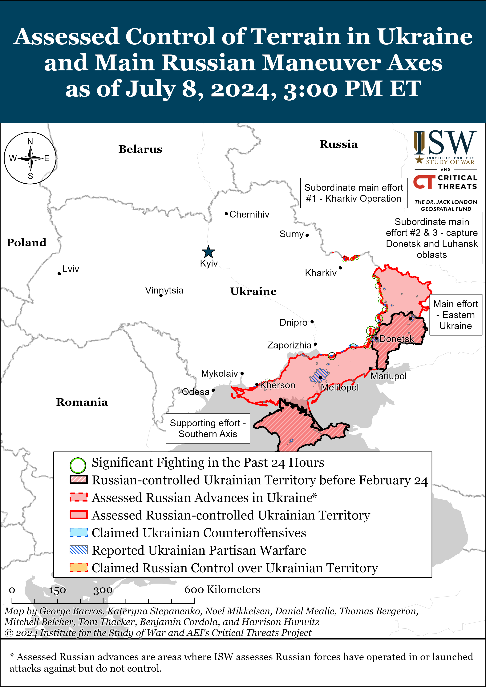
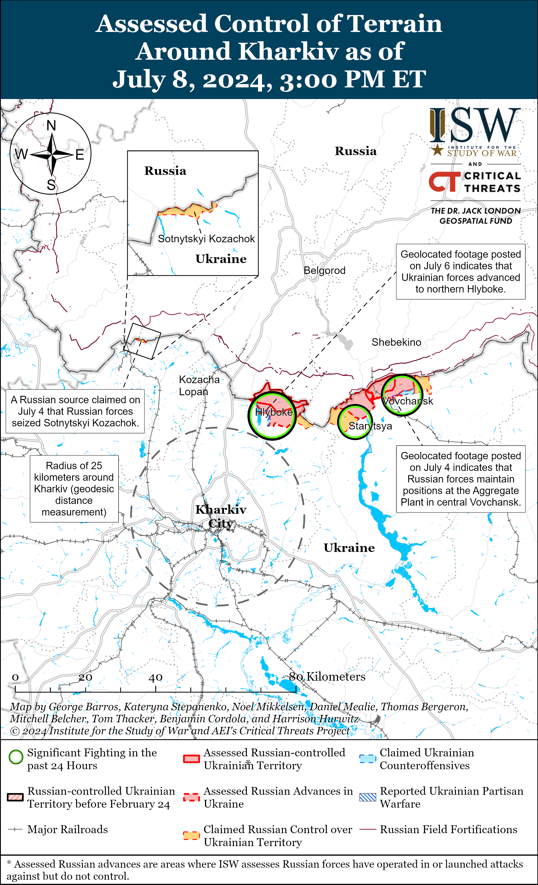
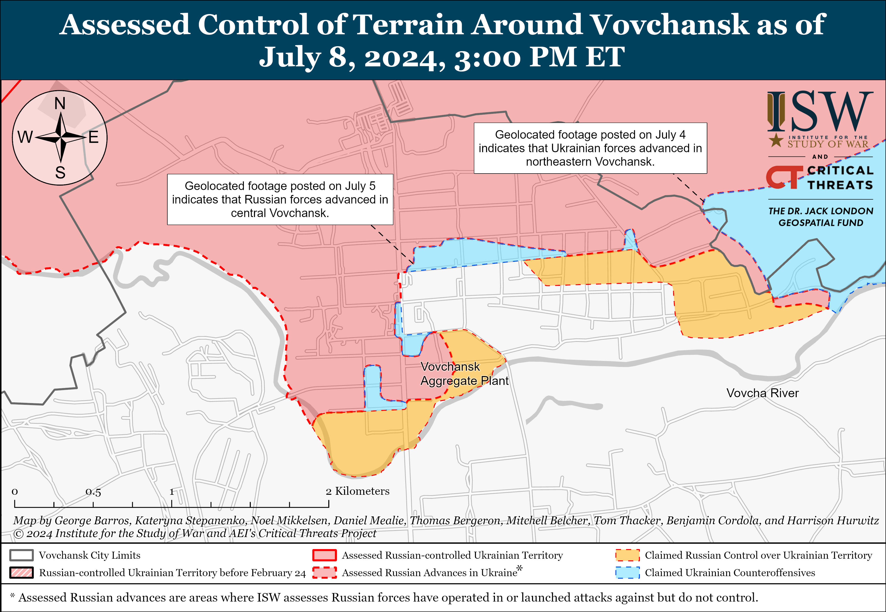
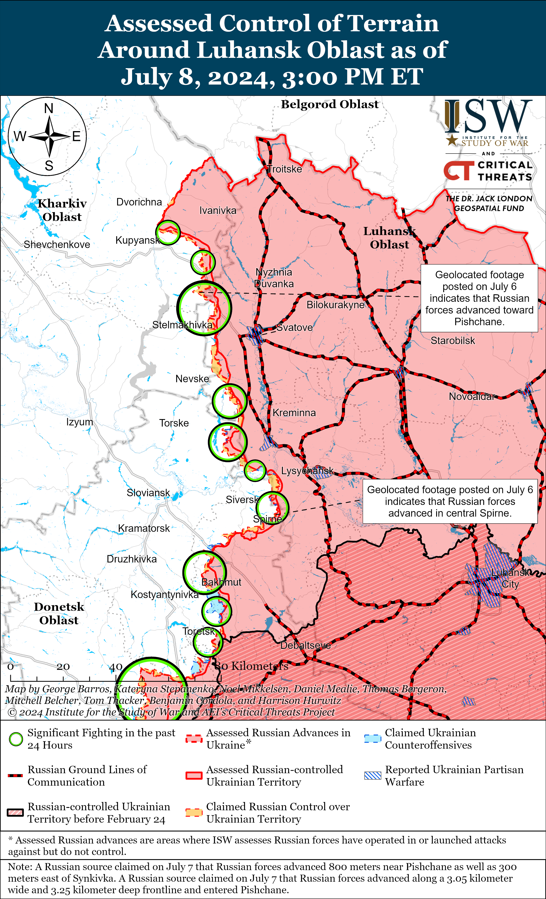
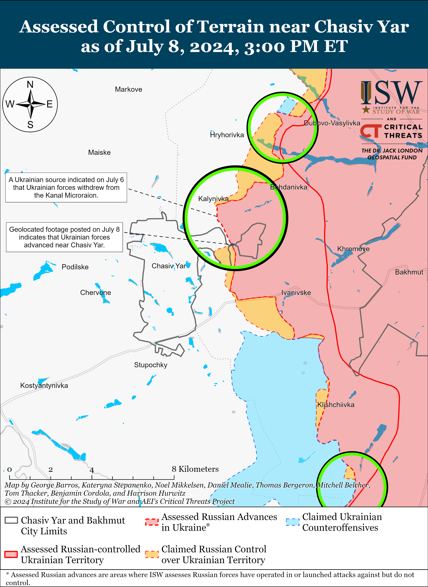
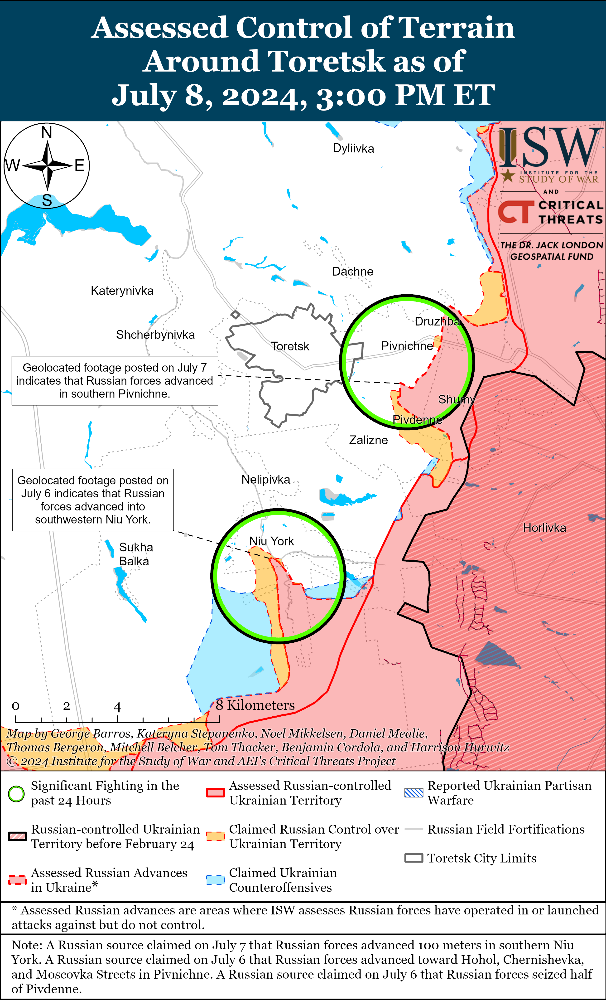
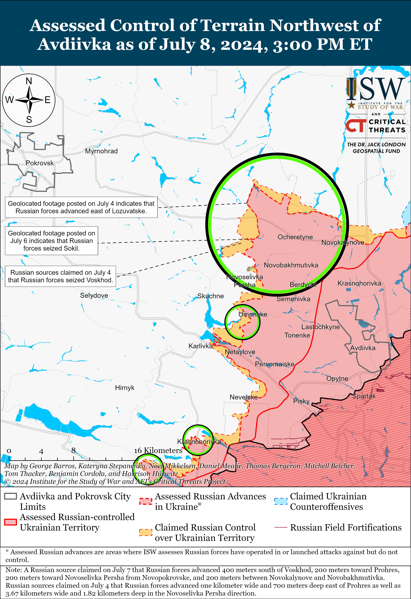
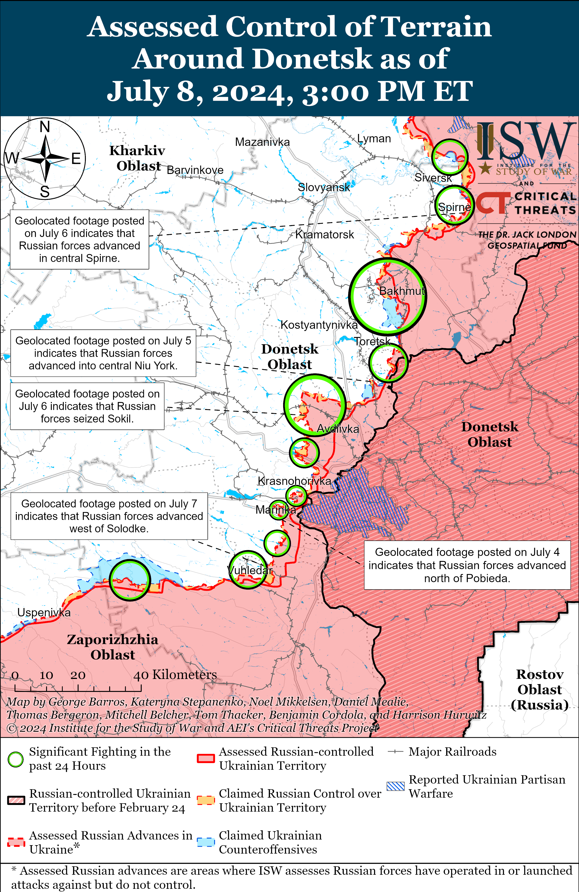
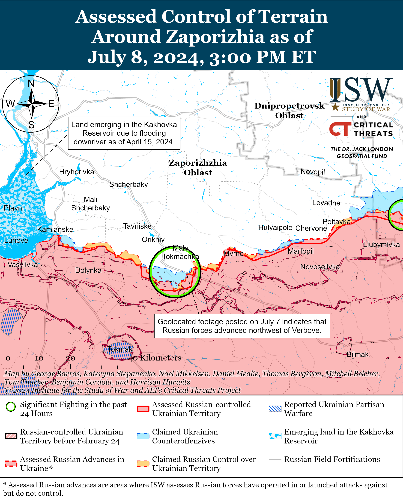
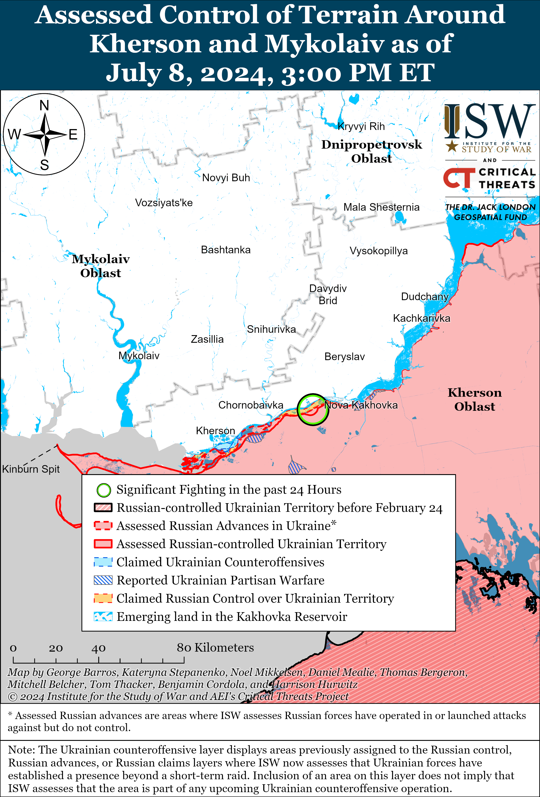

# Russian Offensive Campaign Assessment, July 8, 2024

**Nicole Wolkov, Grace Mappes, Christina Harward, Karolina Hird, and Frederick W. Kagan**

**July 8, 2024, 6pm ET**

**Click**[**here**](https://storymaps.arcgis.com/stories/36a7f6a6f5a9448496de641cf64bd375)**to see ISW’s interactive map of the Russian invasion of Ukraine. This map is updated daily alongside the static maps present in this report.**

**Click**[**here**](https://understandingwar.maps.arcgis.com/apps/instant/3dviewer/index.html?appid=1602762dbcde419bb957dea358449580)**to see ISW’s 3D control of terrain topographic map of Ukraine. Use of a computer (not a mobile device) is strongly recommended for using this data-heavy tool.**

**Click**[**here**](https://storymaps.arcgis.com/stories/733fe90805894bfc8562d90b106aa895)**to access ISW’s archive of interactive time-lapse maps of the Russian invasion of Ukraine. These maps complement the static control-of-terrain map that ISW produces daily by showing a dynamic frontline. ISW will update this time-lapse map archive monthly.**

**Note: The data cut-off for this product was 12:15pm ET on July 8 ISW will cover subsequent reports in the July 9 Russian Offensive Campaign Assessment.**

**A Russian Kh-101 cruise missile hit the Okhmatdyt Children’s Hospital in central Kyiv during a wider series of missile strikes targeting critical Ukrainian infrastructure throughout the day on July 8.**Ukrainian Air Force Commander Lieutenant General Mykola Oleshchuk stated that Russian forces conducted two rounds of combined missile strikes on July 8—first launching four Kh-101 cruise missiles from Saratov Oblast and two Iskander-M ballistic missiles from occupied Crimea and Kursk Oblast overnight on July 7 to 8, and then launching a second wave of missiles, including one Kh-47 Kinzhal aeroballistic missile, four Iskander-M ballistic missiles, one 3M22 Zircon cruise missile, 13 Kh-101 cruise missiles, 14 Kalibr cruise missiles, two Kh-22 cruise missiles, and three Kh-59/69 guided air missiles around 1000 local time on July 8.[1] Ukrainian air defense shot down two Kh-101s in the first wave, and one Kh-47, three Iskanders, 11 Kh-101s, 12 Kalibrs, and three Kh-59/69s during the second wave.[2] Ukrainian President Volodymyr Zelensky stated that Russian forces targeted residential and other civilian infrastructure in Kyiv, Dnipro, Kryvyi Rih, Slovyansk, and Kramatorsk cities.[3]

Footage taken by a bystander in Kyiv City shows the second before a Russian missile struck the Okhmatdyt Children’s Hospital—Ukraine’s largest pediatric hospital that treats thousands of patients, including cancer cases, daily.[4] The footage clearly shows a single missile flying at a sharp downward trajectory before making contact with the hospital building. Ukraine’s Security Service (SBU) conducted a preliminary investigation of the blast site at Okhmatdyt and concluded that Russian forces used a Kh-101 missile to strike the hospital.[5] The Okhmatdyt Children’s Hospital published footage showing extensive damage to medical facilities on the premises.[6] Falling debris from Russian missiles also struck the Isida Maternity Hospital in western Kyiv City after the initial strike on the Okhmatdyt hospital, and Russian missile strikes also damaged residential infrastructure elsewhere both in Kyiv and Dnipro cities.[7] The Ukrainian Ministry of Internal Affairs has confirmed 22 deaths and 74 injured in Kyiv City and 11 deaths and 64 injured within Dnipropetrovsk Oblast as of the time of this publication.[8] Zelensky announced that Ukraine is convening an emergency session of the United Nations Security Council (UNSC) in response to these Russian strikes.[9] Russia is currently the president of the UNSC.

**Russian officials and information space actors are attempting to deflect responsibility for the Okhmatdyt Children’s Hospital strike by making false claims about the missiles involved and the state of the hospital — all contrary to available evidence.**The Ukrainian Center for Countering Disinformation warned on July 9 that various Russian propaganda sources are amplifying a wide variety of information operations deflecting blame for the strike away from Russia, including false claims that Ukraine was using part or all of the hospital to treat wounded Ukrainian soldiers, that Ukraine was storing missiles at the hospital, and that Ukrainian air defense missiles and not a Russian missile hit the hospital.[10] The Russian Ministry of Defense (MoD) claimed that available footage “clearly confirms” that falling Ukrainian air defense missiles damaged civilian objects within Kyiv City, likely referring to the Okhmatdyt Children’s Hospital and not to another medical facility within the city that Ukrainian officials acknowledged was damaged by falling missile debris.[11] Russian sources widely circulated the footage and image of the missile in the second before it hit the Okhmatdyt Children’s Hospital, and some milbloggers even published misleading posts falsely claiming that it was a Ukrainian air defense missile and not an attacking Russian Kh-101 missile.[12] The trajectory of the missile in the video and the visible turbojet engine under its hull match the frame of a Russian Kh-101 and do not support claims that it was an air defense interceptor, nor does the missile appear damaged by air defense interceptors.[13] The Ukrainian SBU also reported that the serial numbers of the missile components match those of other Russian Kh-101s launched at Ukraine.[14] Some Russian milbloggers claimed that Russian forces were attempting to strike the Artem machine building plant roughly 1.6 kilometers north of the Okhmatdyt Children’s Hospital, but other Russian missiles actually hit the Artem Plant during the strike.[15]

**Many of these false Russian information operations would not absolve Russian forces of legal or moral responsibility for the impacts of their strikes against Ukraine even if true.**Russian information operations falsely portraying the Okhmatdyt Children’s Hospital as partially or completely a military hospital falsely suggest that such a hospital is inherently a legitimate military target. The Okhmatdyt Children’s Hospital is notably not a military hospital—it is the largest multidisciplinary children’s hospital in Ukraine and treats up to 18,000 children per year.[16] Article 19 of the Geneva Convention, to which Russia is a signatory, relative to the Protection of Civilian Persons in Time of War states that the international legal protection to civilian hospitals does not end unless the hospital undertakes “acts harmful to the enemy,” and Article 19 explicitly excludes the presence of sick or wounded military personnel as an act “harmful to the enemy.”[17] Article 19 also states that the “enemy” must give a warning prior to attacking a hospital allegedly containing a “harmful” military target, and no Russian sources are claiming that Russian authorities issued such a warning, nor have any offered proof that a hospital full of sick children was posing an imminent threat to Russian forces.[18] The Russian MoD’s claim that a Ukrainian air defense interceptor hit civilian objects and Russian milblogger claims that a Russian missile accidentally hit the hospital also do not absolve Russian forces of responsibility for these consequences, as Russia is the aggressor state in this war and Ukraine would not have to defend against Russian strikes if Russia had not launched its full-scale invasion of and routine missile strike series against Ukraine.

**The July 8 Russian missile strikes likely employed a new and noteworthy tactic to maximize the damage from such strike series.**Former Ukrainian Air Forces Spokesperson Colonel Yuriy Ihnat stated following the strikes on July 8 that Russian forces are constantly improving their reconnaissance and strike drone capabilities and the efficacy of both cruise and ballistic missiles, noting that during the July 8 strike Russian cruise missiles flew at “extremely low” altitudes.[19] Ihnat noted that in some cases, Ukrainian air defense forces had to attempt to intercept cruise missiles flying as low as 50 meters above the ground. Ukrainian air defenses have historically had high shoot-down rates for certain types of cruise missiles, particularly the older Kh-101 variety, but Ihnat’s suggestion of Russian forces launching cruise missile strikes at such low altitudes indicates that Russian forces may have innovated their tactics and/or technology somewhat to inflict maximum damage on Ukrainian infrastructure by giving Ukrainian air defense practically no time to respond until the missile is already within close range of the ground.[20] Ihnat noted that Russian forces are reducing the electromagnetic signatures of the drones until the last possible moment to prevent their detection by Ukrainian forces, which Ihnat noted means that by the time Ukrainian forces detect the drone, the missile the drone was guiding could already be close to the target point.[21] Russia has consistently adapted the strike packages it uses against Ukraine to take advantage of Ukraine’s air defense shortages, and the July 8 strikes represent a new and adapted strike package that Ukraine will need to learn to respond to with requisite levels of Western-provided air defense systems.[22]

**Hungarian Prime Minister Viktor Orban and People’s Republic of China (PRC) President Xi Jinping continued to posture themselves as potential mediators to an end to the war in Ukraine during a July 8 meeting in Beijing, despite Russian President Vladimir Putin’s rejection of serious negotiations or any third-party mediation.**Orban called the PRC a “key power” in creating conditions for peace and stated that Hungary highly appreciates the PRC’s peace initiative.[23] Xi stated that the international community should support direct negotiations between Russia and Ukraine and that other unspecified major world powers should employ “positive energy rather than negative energy” to support a ceasefire as soon as possible.[24] Xi also claimed that the PRC and Hungary share the same basic proposals to end the war. Orban and Xi are likely trying to mutually reinforce each other’s efforts to portray Hungary and the PRC as neutral mediators despite Orban’s consistent efforts to oppose and undermine the European Union’s (EU) support for Ukraine and increasing evidence that the PRC is supporting Russia’s war effort by providing Russia with dual-use goods and unconfirmed reports of joint PRC–Russian production of loitering munitions.[25] Ukrainian President Volodymyr Zelensky responded to a question at a July 8 press conference about whether Hungary could serve as a mediator to an end to the war and stated that only serious and strong alliances could stop the war and that a foreign country’s representative holding bilateral discussions with Putin does not indicate Putin’s interest in ending the war.[26] Zelensky also noted that countries with strong economies that influence Russia’s economy and countries with militaries that threaten Russia’s military – such as the US, the PRC, and the entire EU — could lead international mediation efforts and pressure Russia. Putin rejected Russian participation in possible ceasefire negotiations processes, denied interest in a ceasefire altogether, and demanded Ukrainian capitulation through “demilitarization” and the surrender of significant territory that Russia does not currently occupy on July 4 and 5.[27]

**Russian Vice Admiral Sergei Lipilin replaced Vice Admiral Vladimir Vorobyov as Russian Baltic Fleet Commander.**The Russian military officially introduced Lipilin as Baltic Fleet Commander at a Russian Navy ceremony in Kronstadt in St. Petersburg on July 8.[28] Lipilin previously served as the Baltic Fleet’s Chief of Staff and First Deputy Commander since 2021, and Vorobyov is now Deputy Commander-in-Chief of the Russian Navy.[29]

**The Russian Ministry of Foreign Affairs (MFA) claimed on July 8 that a May 2024 op-ed by an ISW Russia analyst published in the *Telegraph* was unsubstantiated.****[30]**The op-ed was a brief presentation of in-depth and well-documented research that ISW has published regarding Russia’s occupation of Ukraine and project to destroy Ukrainian statehood via genocidal means.[31] ISW stands by its assessments, including those presented in the *Telegraph* op-ed.

**Key Takeaways:**

- **A Russian Kh-101 cruise missile hit the Okhmatdyt Children’s Hospital in central Kyiv during a wider series of missile strikes targeting critical Ukrainian infrastructure throughout the day on July 8.**
- **Russian officials and information space actors are attempting to deflect responsibility for the Okhmatdyt Children’s Hospital strike by making false claims about the missiles involved and the state of the hospital — all contrary to available evidence.**
- **The July 8 Russian missile strikes likely employed a new and noteworthy tactic to maximize the damage from such strike series**
- **Hungarian Prime Minister Viktor Orban and People’s Republic of China (PRC) President Xi Jinping continued to posture themselves as potential mediators to an end to the war in Ukraine during a July 8 meeting in Beijing, despite Russian President Vladimir Putin’s rejection of serious negotiations or any third-party mediation.**
- **Russian Vice Admiral Sergei Lipilin replaced Vice Admiral Vladimir Vorobyov as Russian Baltic Fleet Commander.**
- **Ukrainian forces recently regained lost positions in Chasiv Yar, and Russian forces recently advanced near Donetsk City and in western Zaporizhia Oblast.**
- **Russian Prime Minister Mikhail Mishustin called on July 8 for Russia to increase its domestic production of drones fivefold by 2030.**

***We do not report in detail on Russian war crimes because these activities are well-covered in Western media and do not directly affect the military operations we are assessing and forecasting. We will continue to evaluate and report on the effects of these criminal activities on the Ukrainian military and the Ukrainian population and specifically on combat in Ukrainian urban areas. We utterly condemn Russian violations of the laws of armed conflict and the Geneva Conventions and crimes against humanity even though we do not describe them in these reports.***

- Russian Main Effort — Eastern Ukraine (comprised of three subordinate main efforts)
- Russian Subordinate Main Effort #1 — Push Ukrainian forces back from the international border with Belgorod Oblast and approach to within tube artillery range of Kharkiv City
- Russian Subordinate Main Effort #2 — Capture the remainder of Luhansk Oblast and push westward into eastern Kharkiv Oblast and encircle northern Donetsk Oblast
- Russian Subordinate Main Effort #3 — Capture the entirety of Donetsk Oblast
- Russian Supporting Effort — Southern Axis
- Russian Air, Missile, and Drone Campaign
- Russian Mobilization and Force Generation Efforts
- Russian Technological Adaptations
- Activities in Russian-occupied areas
- Ukrainian Defense Industrial Base Efforts
- Russian Information Operations and Narratives
- Significant Activity in Belarus

**Russian Main Effort — Eastern Ukraine**

**Russian Subordinate Main Effort #1 — Kharkiv Oblast****(Russian objective: Push Ukrainian forces back from the international border with Belgorod Oblast and approach to within tube artillery range of Kharkiv City)**

Russian forces continued offensive operations in northern Kharkiv Oblast on July 8 but did not make any confirmed advances. Russian milbloggers claimed that Ukrainian forces are conducting constant counterattacks near Hlyboke (north of Kharkiv City) and that heavy fighting is ongoing within urban areas in Vovchansk (northeast of Kharkiv City).[32] The Ukrainian General Staff reported Russian ground attacks north of Kharkiv City near Hlyboke and Lyptsi and northeast of Kharkiv City near Starytsya, Tykhe, and Vovchansk on July 8.[33]

**Russian Subordinate Main Effort #2 — Luhansk Oblast****(Russian objective: Capture the remainder of Luhansk Oblast and push westward into eastern Kharkiv Oblast and northern Donetsk Oblast)**

Russian forces continued offensive operations along the Kupyansk-Svatove-Kreminna line on July 8 but did not make any confirmed advances. Russian milbloggers claimed that recent Russian strikes on Ukrainian crossings across the Oskil River near Kupyansk have forced Ukrainian troops to draw some of their forces to the west (right) bank of the Oskil River.[34] Russian forces have recently conducted several strikes against bridges over the Oskil River, likely in an effort to make the Ukrainian presence on the east (left) bank more untenable.[35] Russian milbloggers also claimed that Russian forces advanced up to 800 meters near Pishchane (southeast of Kupyansk).[36] The Ukrainian General Staff reported Russian ground attacks northeast of Kupyansk near Synkivka; southeast of Kupyansk near Pishchane, Stepova Novoselivka, and Berestove; northwest of Svatove near Stelmakhivka; northwest of Kreminna near Makiivka, Hrekivka, Nevske, and Terny; west of Kreminna near Torske; and southwest of Kreminna in the Serebryanske forest area.[37]

**Russian Subordinate Main Effort #3 — Donetsk Oblast****(Russian objective: Capture the entirety of Donetsk Oblast, the claimed territory of Russia’s proxies in Donbas)**

Russian forces continued ground attacks in the Siversk direction on July 8, but there were no confirmed changes to the frontline. Fighting continued northeast of Siversk near Bilohorivka; east of Siversk near Verkhnokamyanske; southeast of Siversk near Spirne; and south of Siversk near Rozdolivka and Vesele on July 7 and 8.[38]

Ukrainian forces recently advanced in Chasiv Yar amid continued Russian offensive operations in the area on July 8. Geolocated footage published on July 8 indicates that Ukrainian forces recently advanced along Oleh Koshovyi Street in the western part of the Kanal Microraion (easternmost Chasiv Yar).[39] A Russian milblogger claimed that Russian forces may have crossed the Siverskyi Donets-Donbas Canal in an unspecified area in the Chasiv Yar direction, but ISW has not observed visual evidence of enduring Russian positions on the west side of the canal and has not observed other milbloggers making a similar claim. Fighting continued in the Kanal Microraion; northeast of Chasiv Yar near Bohdanivka; north of Chasiv Yar near Kalynivka and Hryhorivka; southeast of Chasiv Yar near Andriivka and Klishchiivka; and south of Chasiv Yar near Bila Hora on July 7 and 8.[40] Elements of the Russian 98th Airborne (VDV) Division reportedly continue operating in the Kanal Microraion; elements of the Russian “Sever-V” Brigade (Volunteer Corps) reportedly continue operating near Hryhorivka; and elements of the Russian 11th VDV Brigade and “Burevestnik” drone detachment reportedly continue operating in the Chasiv Yar direction.[41]

Russian forces continued offensive operations in the Toretsk direction on July 8, but there were no confirmed changes to the frontline. A Russian milblogger claimed that Russian forces advanced 100 meters in southern Niu York (south of Toretsk) and have occupied roughly 30 percent of the settlement.[42] ISW currently assesses that Russian forces have advanced into 16 percent of the administrative boundaries of Niu York. Fighting continued near Toretsk itself; southeast of Toretsk near Pivnichne; and south of Toretsk near Niu York.[43] Elements of the Russian 16th Spetsnaz Brigade (Russian General Staff’s Main Intelligence Directorate [GRU]) and 9th Motorized Rifle Brigade (1st Donetsk People’s Republic Army Corps [DNR AC]) are reportedly operating near Niu York.[44]

Russian forces continued offensive operations in the Avdiivka direction on July 8, but there were no confirmed changes to the frontline. Russian milbloggers claimed that Russian forces advanced 200 meters between Novokalynove and Novobakhmutivka (both north of Avdiivka); north of Novooleksandrivka (northwest of Avdiivka); 200 meters toward Prohres (northwest of Avdiivka); 400 meters south of Voskhod (northwest of Avdiivka); and 200 meters toward Novoselivka Persha from Novopokrovske (both northwest of Avdiivka).[45] ISW has not observed visual evidence of any of these claims. Fighting also continued northwest of Avdiivka near Vozdvyzhenka, Lozuvatske, Timofiivka, Yevhenivka, and Yasnobrodivka; and west of Avdiivka near Umanske and Karlivka on July 7 and 8.[46]

Russian forces recently advanced southwest of Donetsk City amid continued Russian offensive operations west and southwest of Donetsk City on July 8. Geolocated footage published on July 7 indicates that Russian forces recently advanced west of Solodke (southwest of Donetsk City).[47] Fighting continued west of Donetsk City near Krasnohorivka and southwest of Donetsk city near Heorhiivka, Kostyantynivka and Paraskoviivka on July 7 and 8.[48]

Ukraine’s Main Military Intelligence Directorate (GUR) reported on July 8 that Ukrainian forces struck two military facilities in occupied Donetsk Oblast on July 6, including a logistics center with tank equipment and ammunition in Debaltseve and an electronic warfare (EW) jamming communications station in Novoluhanske.[49]

Positional engagements continued in the Donetsk-Zaporizhia Oblast border area south of Velyka Novosilka near Makarivka, Urozhaine, and Staromayorske on July 7 and 8.[50] Elements of the Russian 64th Motorized Rifle Brigade (35th Combined Arms Army [CAA], Eastern Military District [EMD]) are reportedly operating near Marfopil (southwest of Velyka Novosilka).[51]

**Russian Supporting Effort — Southern Axis****(Russian objective: Maintain frontline positions and secure rear areas against Ukrainian strikes)**

Russian forces recently advanced in western Zaporizhia Oblast amid continued positional engagements in the area on July 8. Geolocated footage published on July 7 indicates that Russian forces advanced northwest of Verbove (east of Robotyne).[52] A Russian milblogger claimed that Russian forces made marginal additional advances in the same area northwest of Verbove[53] Positional engagements continued near Robotyne and Mala Tokmachka (northeast of Robotyne) on July 7 and 8.[54] Elements of the Russian 291st Motorized Rifle Regiment (42nd Motorized Rifle Division, 58th Combined Arms Army [CAA], Southern Military District [SMD]) are reportedly operating in the Zaporizhia direction; elements of the 11th Air Force and Air Defense Army (Russian Aerospace Forces [VKS] and Eastern Military District [EMD]) reportedly conducted glide bomb strikes near Novoselikva (southwest of Hulyaipole); elements of the 64th Motorized Rifle Brigade (35th CAA, EMD) are reportedly operating near Marfopil (southeast of Hulyaipole);and elements of the Russian 247th Airborne (VDV) Regiment (7th VDV Division) are reportedly operating near Novopokrovka (northeast of Robotyne).[55]

Positional engagements continued in east (left) bank Kherson Oblast, including near Krynky and the islands in the Dnipro River Delta, on July 8.[56]

The Russian Ministry of Defense (MoD) claimed on July 8 that Russian Iskander missiles destroyed three Ukrainian HIMARS launchers near Klapaya, Kherson Oblast on an unspecified date.[57] The Russian MoD claimed that Ukrainian forces launched an ATACMS strike against occupied Sevastopol on June 23 from these HIMARS launchers in Klapaya.

**Russian Air, Missile, and Drone Campaign****(Russian Objective: Target Ukrainian military and civilian infrastructure in the rear and on the frontline)**

See topline text.

**Russian Mobilization and Force Generation Efforts****(Russian objective: Expand combat power without conducting general mobilization)**

Russian Prime Minister Mikhail Mishustin called on July 8 for Russia to increase its domestic production of drones fivefold by 2030.[58] Mishustin stated that Russia needs to localize the production of popular drone models as much as possible and that the Russian government is discussing the establishment of grants and subsidies for drone design, research, and production centers.

Russian authorities continue cryptomobilization efforts in occupied Ukraine likely aimed at building out Russian reserves. The Ukrainian Resistance Center stated on July 8 that Russian occupation officials in occupied Kherson Oblast approved a plan to develop a “Cossack” cooperative that includes all male inhabitants of occupied Kherson Oblast.[59] Russian President Vladimir Putin signed a law in March 2024 allowing members of the All-Russian Cossack Society who are in the Russian military, Foreign Intelligence Service (SVR), and Federal Security Service (FSB) reserves to join the mobilization reserve.[60] Putin also notably transferred control of the Cossack Cadet corps to the jurisdiction of the Russian Ministry of Defense (MoD) in June 2024, and it is likely that Cossack organizations in occupied Ukraine will also fall under the control of the MoD.[61]

**Russian Technological Adaptations****(Russian objective: Introduce technological innovations to optimize systems for use in Ukraine)**

Russian President Vladimir Putin signed a decree on July 8 authorizing Russian weapons and military equipment designers to use foreign intellectual property when developing new weapons.[62] The European Union (EU) recently tightened restrictions on Russian nationals’ and businesses’ applications for intellectual property rights within the EU to offset Russian efforts to deprive EU property rights holders of their protections in Russia.[63] The EU has also imposed sanctions against EU businesses selling intellectual property rights regarding sanctioned materials to Russian entities.[64]

A prominent Russian milblogger continues efforts to manufacturer drones for Russian forces to use on the battlefield. The milblogger claimed that he is scaling up manufacturing of first-person view (FPV) strike drones.[65] Other Russian milbloggers have recently criticized this milblogger and other Russian milbloggers for their grassroots efforts to manufacture new drones and other weapons for use in Ukraine due to the poor quality of the systems.[66]

**Ukrainian Defense Industrial Efforts****(Ukrainian objective: Develop its defense industrial base to become more self-sufficient in cooperation with US, European, and international partners)**

Ukraine and Poland signed a bilateral security agreement on July 8. Ukrainian President Volodymyr Zelensky and Polish Prime Minister Donald Tusk met in Warsaw, Poland on July 8 and signed a bilateral security agreement that affirms Poland’s support of Ukraine and promises cooperation in the security, defense, military, political, and economic fields.[67] The bilateral security agreement also states that Poland will consider transferring one squadron (at least 14 aircraft) of MiG-29 fighter aircraft to Ukraine and that Poland and Ukraine will discuss with their allies the possibility of Polish air defenses intercepting missiles and drones flying towards Poland over Ukrainian territory. The bilateral agreement also affirms Poland’s support for Ukraine’s accession into the European Union (EU).

Ukraine’s allies continue to provide Ukraine with additional military assistance. The United Kingdom (UK) Ministry of Defense (MoD) announced a new package of military support to Ukraine on July 7 including 250,000 rounds of 50mm small arms ammunition, 90 anti-armor Brimstone missiles, 50 small boats, 40 demining vehicles, 10 AS-90 155mm artillery systems, 32 new barrels for Ukraine’s current AS-90 systems, and 61 bulldozers to construct defensive structures.[68] New UK Defense Minister John Healy stated that the UK is also expediting prior military assistance pledged in April 2024 to arrive within the next 100 days (by roughly October 14).[69] German Ambassador to Ukraine Martin Jaeger announced on July 5 that the third Patriot air defense system from Germany arrived in Ukraine.[70] The Latvian MoD announced on July 5 that it will transfer 2,500 drones worth four million euros (about $4.3 million) to Ukraine in July 2024 through the Ukraine Drone Coalition and that the first batch of these drones will arrive in the coming days.[71]

**Activities in Russian-occupied areas (Russian objective: Consolidate administrative control of annexed areas; forcibly integrate Ukrainian citizens into Russian sociocultural, economic, military, and governance systems)**

*ISW is not publishing coverage of activities in Russian-occupied areas today.*

**Russian Information Operations and Narratives**

Russian officials continue to discredit international human rights organizations in order to deflect from Russia’s own human rights abuses in Ukraine. Head of the Russian Ministry of Foreign Affairs’ (MFA) Department of Multilateral Cooperation on Human Rights Grigory Lukyantsev claimed on July 8 that the European Court of Human Rights is a “mouthpiece for anti-Russian propaganda” and that the West is using the UN Human Rights Council to “advance [its] agenda.”[72] A prominent Russian milblogger denied on July 8 that Russian forces committed war crimes in Bucha (evidence of which is well-documented and internationally recognized), instead claiming that Ukrainian forces were to blame and that foreign mercenaries conducted mass lootings in Bucha after Russian forces left the area.[73]

**Significant activity in Belarus****(Russian efforts to increase its military presence in Belarus and further integrate Belarus into Russian-favorable frameworks and Wagner Group activity in Belarus)**

Nothing significant to report.

**Note: ISW does not receive any classified material from any source, uses only publicly available information, and draws extensively on Russian, Ukrainian, and Western reporting and social media as well as commercially available satellite imagery and other geospatial data as the basis for these reports. References to all sources used are provided in the endnotes of each update.**

---

[1] https://t.me/ComAFUA/342; https://t.me/ComAFUA/343

[2] https://t.me/ComAFUA/342; https://t.me/ComAFUA/343

[3] https://armyinform dot com.ua/2024/07/08/masovanyj-udar-po-ukrayini-vorog-vypustyv-ponad-40-raket-riznyh-typiv/; https://armyinform dot com.ua/2024/07/08/raketnyj-obstril-rf-po-ukrayini-blyzko-20-zagyblyh-i-pivsotni-postrazhdalyh/; https://t.me/V\_Zelenskiy\_official/11047

[4] https://x.com/666\_mancer/status/1810290552501387344; https://meduza.io/feature/2024/07/08/rossiyskaya-raketa-popala-v-ohmatdet-krupneyshuyu-v-ukraine-detskuyu-bolnitsu-gde-lechat-samyh-tyazhelyh-patsientov

[5] https://armyinform.com dot ua/2024/07/08/vorog-vdaryv-po-ohmaditu-krylatoyu-raketoyu-x-101-sbu/

[6] https://www.instagram.com/p/C9KAuhJo4VF/?igsh=MWthdHV4cmwzaW9naA%3D%3D&img\_index=1

[7] https://kyivindependent.com/latest-russian-attack-on-kyiv-hits-maternity-hospital-4-killed/; https://t.me/vitaliy\_klitschko/3259; https://armyinform dot com.ua/2024/07/08/u-kryvomu-rozi-10-zagyblyh-pislya-vorozhogo-raketnogo-obstrilu/; https://t.me/vilkul/7098 ; https://t.me/SJTF\_Odes/10391

[8] https://www.facebook.com/mvs.gov.ua/posts/pfbid0uD26h2HLHqc6gQ5Dqt2uAMMW8Ec8DEk13FGW73XjGkJ4naB2jzcNQVjBVej5HFhAl

[9] https://t.me/V\_Zelenskiy\_official/11053; https://armyinform dot com.ua/2024/07/08/mayemo-prytyagty-do-vidpovidalnosti-rosiyu-za-teror-i-putina-za-nakazy-zavdavaty-udariv-prezydent/

[10] https://armyinform dot com.ua/2024/07/08/ohmatdyt-vijskovyj-gospital-yak-rosijska-propaganda-vypravdovuye-obstril-dytyachoyi-likarni/; https://t.me/ComAFUA/343

[11] https://t.me/mod\_russia/40826 ; https://t.me/mod\_russia/40827 ; https://t.me/MID\_Russia/43040; https://armyinform dot com.ua/2024/07/08/vorog-znovu-udaryv-po-medychnomu-obyektu-u-kyyevi-4-lyudyny-zagynulo-i-3-travmovano/; https://t.me/dsns\_telegram/29970; https://armyinform dot com.ua/2024/07/08/vorog-znovu-udaryv-po-medychnomu-obyektu-u-kyyevi-4-lyudyny-zagynulo-i-3-travmovano/

[12] https://t.me/boris\_rozhin/129394; https://t.me/basurin\_e/12584; https://t.me/ssigny/103545; https://t.me/notes\_veterans/18012; https://t.me/basurin\_e/12580; https://t.me/sashakots/47743; https://t.me/vysokygovorit/16428; https://t.me/DnevnikDesantnika/12556; https://t.me/belarusian\_silovik/3743; https://t.me/RSaponkov/8424; https://t.me/fighter\_bomber/17299; https://t.me/wargonzo/20931; https://t.me/wargonzo/20934; https://t.me/motopatriot/24569; https://t.me/RSaponkov/8427; https://t.me/milinfolive/125646; https://t.me/dva\_majors/46932; https://t.me/warfakes/23213

[13] https://x.com/666\_mancer/status/1810290552501387344; https://t.me/ButusovPlus/11694; https://x.com/JulianRoepcke/status/1810305238387097717; https://missilethreat.csis.org/missile/kh-101-kh-102/; https://euromaidanpress.com/2023/01/20/how-many-air-launched-kh-101-missiles-russia-is-able-to-produce-analysis/

[14] https://armyinform dot com.ua/2024/07/08/vorog-vdaryv-po-ohmaditu-krylatoyu-raketoyu-x-101-sbu/

[15] https://t.me/rybar/61649; https://t.me/rybar/61652; https://t.me/dva\_majors/46931; https://t.me/sashakots/47743; https://t.me/wargonzo/20934; https://x.com/MassDara/status/1810313152027845025

[16] https://meduza dot io/feature/2024/07/08/rossiyskaya-raketa-popala-v-ohmatdet-krupneyshuyu-v-ukraine-detskuyu-bolnitsu-gde-lechat-samyh-tyazhelyh-patsientov

[17] https://www.ohchr.org/en/instruments-mechanisms/instruments/geneva-convention-relative-protection-civilian-persons-time-war#:~:text=from%20such%20objectives.-,Article%2019,acts%20harmful%20to%20the%20enemy.

[18] https://www.ohchr.org/en/instruments-mechanisms/instruments/geneva-convention-relative-protection-civilian-persons-time-war#:~:text=from%20such%20objectives.-,Article%2019,acts%20harmful%20to%20the%20enemy.

[19] https://www.facebook.com/100000363042511/posts/7955200821168607/?rdid=HO0mmCVNCT3TAx3U

[20] https://understandingwar.org/backgrounder/russian-offensive-campaign-assessment-june-22-2024 ; https://understandingwar.org/backgrounder/russian-offensive-campaign-assessment-june-14-2024 ; https://understandingwar.org/backgrounder/russian-offensive-campaign-assessment-june-1-2024 ; https://understandingwar.org/backgrounder/russian-offensive-campaign-assessment-april-11-2024 ; https://understandingwar.org/backgrounder/russian-offensive-campaign-assessment-december-8-2023; https://understandingwar.org/backgrounder/russian-offensive-campaign-assessment-december-29-2023 ; https://understandingwar.org/backgrounder/russian-offensive-campaign-assessment-january-23-2024; https://understandingwar.org/backgrounder/russian-offensive-campaign-assessment-february-7-2024 ; https://understandingwar.org/backgrounder/russian-offensive-campaign-assessment-march-21-2024 ; https://understandingwar.org/backgrounder/russian-offensive-campaign-assessment-may-8-2024

[21] https://www.radiosvoboda dot org/a/news-rozviduval%CA%B9ni-drony-rosiya/33026220.html

[22] https://isw.pub/UkrWar010224; https://isw.pub/UkrWar011324; https://isw.pub/UkrWar011324; https://isw.pub/UkrWar011524; https://isw.pub/UkrWar012324; https://isw.pub/UkrWar020724; https://isw.pub/UkrWarO41224

[23] https://kormany dot hu/hirek/a-magyaroknak-fontos-hogy-kina-szorgalmazza-a-beket-a-vilagban

[24] https://www.fmprc.gov dot cn/zyxw/202407/t20240708\_11449761.shtml ; https://english.www.gov dot cn/news/202407/08/content\_WS668b8d33c6d0868f4e8e8fcb.html

[25] https://isw.pub/UkrWar070624 ; https://isw.pub/UkrWar070324 ; https://isw.pub/UkrWar041624

[26] https://suspilne dot media/786053-zelenskij-ne-znav-so-orban-poide-do-putina-tim-casom-lider-knr-zaklikae-ne-eskaluvati/ ; https://www.pravda.com dot ua/news/2024/07/8/7464660/

[27] https://isw.pub/UkrWar070624

[28] https://t.me/mod\_russia/40829

[29] https://www.kommersant dot ru/doc/6820380 ; https://t.me/mod\_russia/40829

[30] https://t.me/MID\_Russia/43030 ; https://mid

dot ru/ru/press\_service/publikacii-i-oproverzenia/oproverzenia1/nedostovernie-publikacii/1961047/ ; https://www.telegraph.co.uk/news/2024/05/31/europe-see-the-worst-genocide-since-holocaust/

[31] https://understandingwar.org/wp-content/uploads/2024/07/24-210-0120ISW20Occupation20playbook.pdf; https://understandingwar.org/backgrounder/russian-offensive-campaign-assessment-may-28-2024 ; https://understandingwar.org/backgrounder/russian-offensive-campaign-assessment-february-21-2024 ; https://understandingwar.org/backgrounder/russian-offensive-campaign-assessment-june-4-2024; https://isw.pub/UkrWar031723 ; https://isw.pub/UkrWar082023; https://understandingwar.org/backgrounder/russian-offensive-campaign-assessment-april-9-2023 ; https://isw.pub/UkrWar020623

[32] https://t.me/RVvoenkor/72007; https://t.me/dva\_majors/46894; https://t.me/wargonzo/20924; https://t.me/RVvoenkor/72000; https://t.me/motopatriot/24585; https://t.me/Sladkov\_plus/10948; https://t.me/DnevnikDesantnika/12560; https://t.me/voenkorKotenok/57441

[33] https://www.facebook.com/GeneralStaff.ua/posts/pfbid0CqzUtdnRmA6xYRUksgF85KBa7fyWS5APNMZTgUUTE8n9koVdrv5nLwXtnJKCCwNCl; https://www.facebook.com/GeneralStaff.ua/posts/pfbid02xgqceL8gVBg6CfhSYQNCqSSeXqDUi94o493VG5SK9VvmYyLKiTeApkxPiZyGzMWil

[34] https://t.me/DnevnikDesantnika/12539; https://t.me/Sladkov\_plus/10948

[35] https://t.me/boris\_rozhin/129256; https://t.me/bortzhyrnal/473 ; https://t.me/grey\_zone/23470 ; https://t.me/voenkorKotenok/57437 ; https://t.me/RVvoenkor/71974; https://understandingwar.org/backgrounder/russian-offensive-campaign-assessment-july-7-2024; https://t.me/DnevnikDesantnika/11924; https://t.me/dva\_majors/45566

[36] https://t.me/RVvoenkor/71988 ; https://t.me/boris\_rozhin/129311; https://t.me/voenkorKotenok/57441

[37] https://www.facebook.com/GeneralStaff.ua/posts/pfbid0CqzUtdnRmA6xYRUksgF85KBa7fyWS5APNMZTgUUTE8n9koVdrv5nLwXtnJKCCwNCl; https://www.facebook.com/GeneralStaff.ua/posts/pfbid02xgqceL8gVBg6CfhSYQNCqSSeXqDUi94o493VG5SK9VvmYyLKiTeApkxPiZyGzMWil

[38] https://www.facebook.com/GeneralStaff.ua/posts/pfbid0CqzUtdnRmA6xYRUksgF85KBa7fyWS5APNMZTgUUTE8n9koVdrv5nLwXtnJKCCwNCl ; https://www.facebook.com/GeneralStaff.ua/posts/pfbid02xgqceL8gVBg6CfhSYQNCqSSeXqDUi94o493VG5SK9VvmYyLKiTeApkxPiZyGzMWil ; https://www.facebook.com/GeneralStaff.ua/posts/pfbid0479XJ44PCLwgyW8TzaNFwkQi3t7Wq2J9J9rKfCGzcyHe2hUmWjwdq4tegDNhADySl

 ; https://t.me/voenkorKotenok/57441

[39] https://t.me/creamy\_caprice/6014; https://t.me/DobroKor/520

[40] https://www.facebook.com/GeneralStaff.ua/posts/pfbid0CqzUtdnRmA6xYRUksgF85KBa7fyWS5APNMZTgUUTE8n9koVdrv5nLwXtnJKCCwNCl ; https://www.facebook.com/GeneralStaff.ua/posts/pfbid02xgqceL8gVBg6CfhSYQNCqSSeXqDUi94o493VG5SK9VvmYyLKiTeApkxPiZyGzMWil ; https://www.facebook.com/GeneralStaff.ua/posts/pfbid0479XJ44PCLwgyW8TzaNFwkQi3t7Wq2J9J9rKfCGzcyHe2hUmWjwdq4tegDNhADySl ; https://t.me/DnevnikDesantnika/12549 ; https://t.me/wargonzo/20924 ; https://t.me/motopatriot/24587 ; https://t.me/voenkorKotenok/57441

[41] https://t.me/DnevnikDesantnika/12537 (Kanal); https://t.me/boris\_rozhin/129336 (Hryhorivka); https://t.me/NeoficialniyBeZsonoV/37474 ; https://t.me/wargonzo/20923 (Chasiv Yar)

[42] https://t.me/RVvoenkor/71988 ; https://t.me/RVvoenkor/71989

[43] https://www.facebook.com/GeneralStaff.ua/posts/pfbid0CqzUtdnRmA6xYRUksgF85KBa7fyWS5APNMZTgUUTE8n9koVdrv5nLwXtnJKCCwNCl ; https://www.facebook.com/GeneralStaff.ua/posts/pfbid02xgqceL8gVBg6CfhSYQNCqSSeXqDUi94o493VG5SK9VvmYyLKiTeApkxPiZyGzMWil ; https://t.me/DnevnikDesantnika/12545 ; https://t.me/wargonzo/20924 ; https://t.me/voenkorKotenok/57441 ; https://t.me/boris\_rozhin/129311

[44] https://t.me/dva\_majors/46896 ; https://t.me/wargonzo/20933 ; https://t.me/boris\_rozhin/129318

[45] https://t.me/RVvoenkor/71988 ; https://t.me/motopatriot/24579

[46] https://www.facebook.com/GeneralStaff.ua/posts/pfbid0CqzUtdnRmA6xYRUksgF85KBa7fyWS5APNMZTgUUTE8n9koVdrv5nLwXtnJKCCwNCl ; https://www.facebook.com/GeneralStaff.ua/posts/pfbid02xgqceL8gVBg6CfhSYQNCqSSeXqDUi94o493VG5SK9VvmYyLKiTeApkxPiZyGzMWil ; https://www.facebook.com/GeneralStaff.ua/posts/pfbid0479XJ44PCLwgyW8TzaNFwkQi3t7Wq2J9J9rKfCGzcyHe2hUmWjwdq4tegDNhADySl ; https://t.me/dva\_majors/46894 ; https://t.me/DnevnikDesantnika/12555 ; https://t.me/wargonzo/20924 ; https://t.me/voenkorKotenok/57441

[47] https://x.com/klinger66/status/1810027330678440331; https://x.com/lost\_warinua/status/1809999838450184527

[48] https://www.facebook.com/GeneralStaff.ua/posts/pfbid0CqzUtdnRmA6xYRUksgF85KBa7fyWS5APNMZTgUUTE8n9koVdrv5nLwXtnJKCCwNCl ; https://www.facebook.com/GeneralStaff.ua/posts/pfbid02xgqceL8gVBg6CfhSYQNCqSSeXqDUi94o493VG5SK9VvmYyLKiTeApkxPiZyGzMWil ; https://t.me/wargonzo/20924 ; https://t.me/voenkorKotenok/57441

[49] https://t.me/DIUkraine/4086 ; https://gur.gov dot ua/content/rozvidnyky-na-fronti-spalyly-rosiiskoho-zhytielia-ta-tsentr-lohistyky-okupantiv.html

[50] https://www.facebook.com/GeneralStaff.ua/posts/pfbid0CqzUtdnRmA6xYRUksgF85KBa7fyWS5APNMZTgUUTE8n9koVdrv5nLwXtnJKCCwNCl ; https://www.facebook.com/GeneralStaff.ua/posts/pfbid02xgqceL8gVBg6CfhSYQNCqSSeXqDUi94o493VG5SK9VvmYyLKiTeApkxPiZyGzMWil ; https://www.facebook.com/GeneralStaff.ua/posts/pfbid0479XJ44PCLwgyW8TzaNFwkQi3t7Wq2J9J9rKfCGzcyHe2hUmWjwdq4tegDNhADySl ; https://t.me/voenkorKotenok/57441

[51] https://t.me/voin\_dv/9593; https://x.com/moklasen/status/1810064445550542929; https://x.com/moklasen/status/1810064449358733422

[52] https://t.me/WarArchive\_ua/17041; https://t.me/Alliance\_KARA\_DAG/83; https://t.me/creamy\_caprice/6011

[53] https://t.me/z\_arhiv/27229

[54] https://www.facebook.com/GeneralStaff.ua/posts/pfbid02xgqceL8gVBg6CfhSYQNCqSSeXqDUi94o493VG5SK9VvmYyLKiTeApkxPiZyGzMWil; https://www.facebook.com/GeneralStaff.ua/posts/pfbid0CqzUtdnRmA6xYRUksgF85KBa7fyWS5APNMZTgUUTE8n9koVdrv5nLwXtnJKCCwNCl; https://t.me/wargonzo/20924; https://t.me/voenkorKotenok/57441

[55] https://t.me/RVvoenkor/71990 (291st Regiment) ; https://t.me/boris\_rozhin/129332 (11th Air Force and Air Defense Army); https://t.me/voin\_dv/9593; https://x.com/moklasen/status/1810064445550542929; https://x.com/moklasen/status/1810064449358733422 (64th Brigade); https://t.me/motopatriot/24563 (247th Regiment)

[56] https://www.facebook.com/GeneralStaff.ua/posts/pfbid0CqzUtdnRmA6xYRUksgF85KBa7fyWS5APNMZTgUUTE8n9koVdrv5nLwXtnJKCCwNCl; https://www.facebook.com/GeneralStaff.ua/posts/pfbid02xgqceL8gVBg6CfhSYQNCqSSeXqDUi94o493VG5SK9VvmYyLKiTeApkxPiZyGzMWil; https://t.me/SJTF\_Odes/10393; https://t.me/dva\_majors/46894

[57] https://t.me/mod\_russia/40839

[58] https://tass dot ru/ekonomika/21305673

[59] https://sprotyv dot mod.gov.ua/na-tot-hersonshhyny-usih-cholovikiv-zroblyat-kazakamy/

[60] https://understandingwar.org/sites/default/files/2024-03-24-PDF-Russian%20Offensive%20Campaign%20Assessment.pdf

[61] https://understandingwar.org/backgrounder/russian-offensive-campaign-assessment-june-23-2024

[62] https://tass dot ru/ekonomika/21308423; http://publication.pravo dot gov.ru/document/0001202407080018

[63] https://www.consilium.europa.eu/en/press/press-releases/2024/06/24/russia-s-war-of-aggression-against-ukraine-comprehensive-eu-s-14th-package-of-sanctions-cracks-down-on-circumvention-and-adopts-energy-measures/

[64] https://www.consilium.europa.eu/en/policies/sanctions-against-russia/sanctions-against-russia-explained/

[65] https://t.me/dva\_majors/46928

[66] https://understandingwar.org/backgrounder/russian-offensive-campaign-assessment-june-18-2024

[67] https://armyinform dot com.ua/2024/07/08/ukrayina-ta-polshha-pidpysaly-bezpekovu-ugodu-yaka-peredbachaye-mozhlyvist-perehoplennya-rosijskyh-raket-ta-droniv/; https://www.president dot gov.ua/news/ugoda-pro-spivrobitnictvo-u-sferi-bezpeki-mizh-ukrayinoyu-ta-92009; https://www.president dot gov.ua/news/ukrayina-ta-polsha-uklali-bezpekovu-ugodu-dokument-peredbach-92013 ; https://mil.in dot ua/uk/news/polshha-rozglyane-peredachu-ukrayini-eskadrylyi-myg-29/ ; https://t.me/bbcrussian/67495; https://armyinform dot com.ua/2024/07/08/volodymyr-zelenskyj-u-varshavi-provodyt-peregovory-premyerom-polshhi/; https://t.me/OP\_UA/12757

[68] https://www.gov.uk/government/news/new-defence-secretary-pledges-to-step-up-support-for-ukraine-on-visit-to-odesa; https://armyinform dot com.ua/2024/07/08/rakety-brimstone-sau-as-90-i-katery-brytaniya-ogolosyla-novyj-paket-dopomogy-ukrayini/ ; https://mil dot in.ua/uk/news/ukrayina-otrymaye-partiyu-raket-brimstone-vid-brytaniyi/ ; https://mil.in dot ua/uk/news/brytaniya-peredast-ukrayini-novi-stvoly-do-sau-as-90/

[69] https://www.gov.uk/government/news/new-defence-secretary-pledges-to-step-up-support-for-ukraine-on-visit-to-odesa; https://armyinform dot com.ua/2024/07/08/rakety-brimstone-sau-as-90-i-katery-brytaniya-ogolosyla-novyj-paket-dopomogy-ukrayini/ ; https://mil dot in.ua/uk/news/ukrayina-otrymaye-partiyu-raket-brimstone-vid-brytaniyi/ ; https://mil.in dot ua/uk/news/brytaniya-peredast-ukrayini-novi-stvoly-do-sau-as-90/

[70] https://x.com/MJaegerT/status/1809156725913633130; https://x.com/bayraktar\_1love/status/1809165271568961822 ; https://www.reuters.com/world/europe/ukraine-receives-third-patriot-air-defence-system-germany-envoy-says-2024-07-05/;

[71] https://mil.in dot ua/uk/news/koalitsiya-droniv-latviya-peredast-ukrayini-ponad-2500-bezpilotnykiv/; https://www.mod.gov dot lv/lv/zinas/aizsardzibas-ministrija-ukrainai-piegadas-nakamo-dronu-pakotni-vairak-neka-2500-dronus-4

[72] https://iz dot ru/1723293/elizaveta-borisenko/mysli-vernutsia-v-sovet-evropy-prosto-ne-voznikaet-eto-nevozmozhno

[73] https://t.me/rybar/61648
