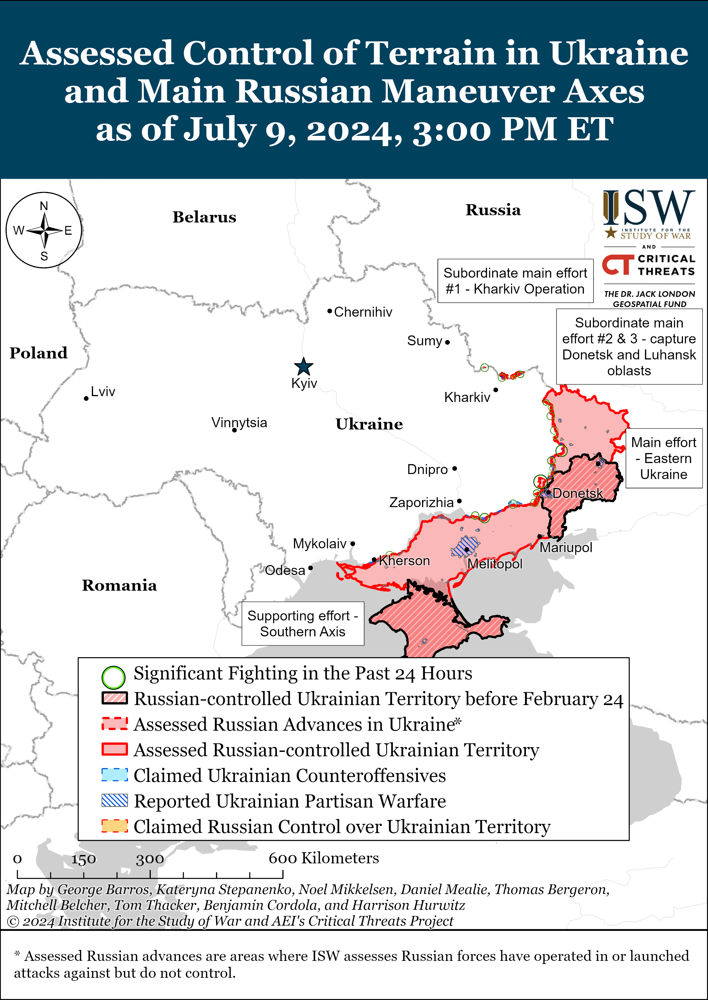
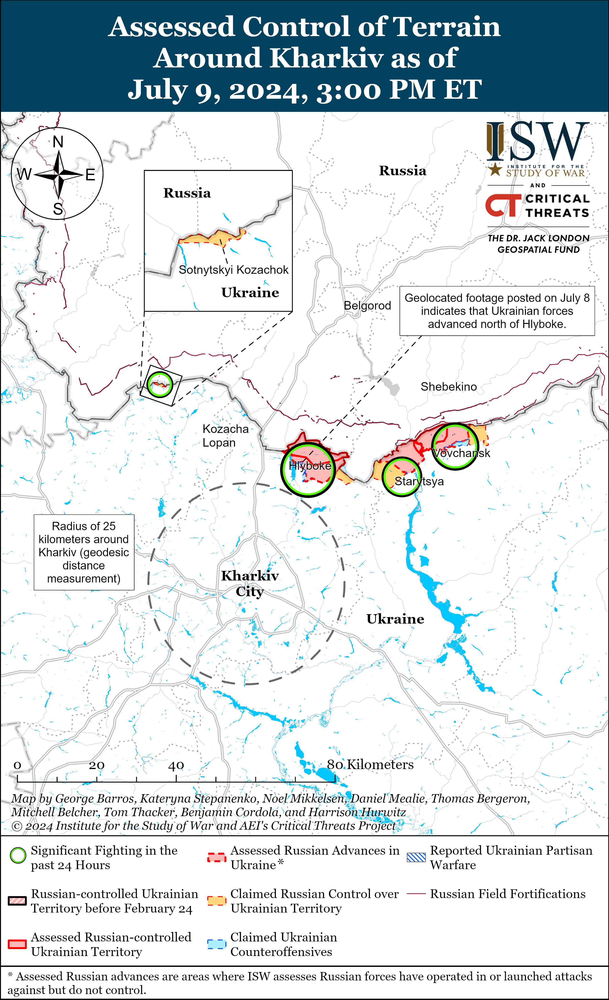
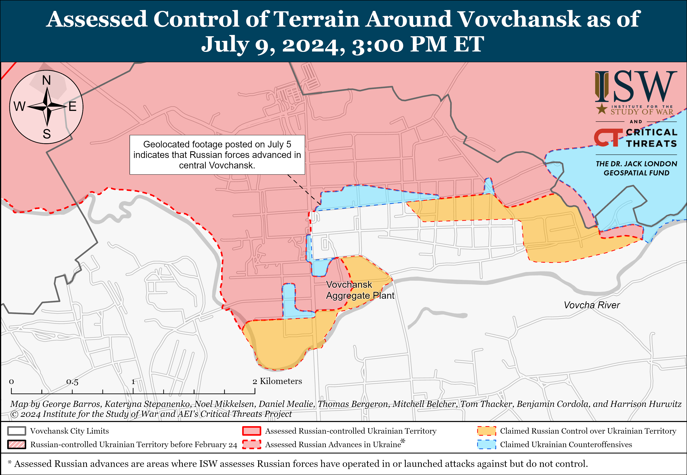
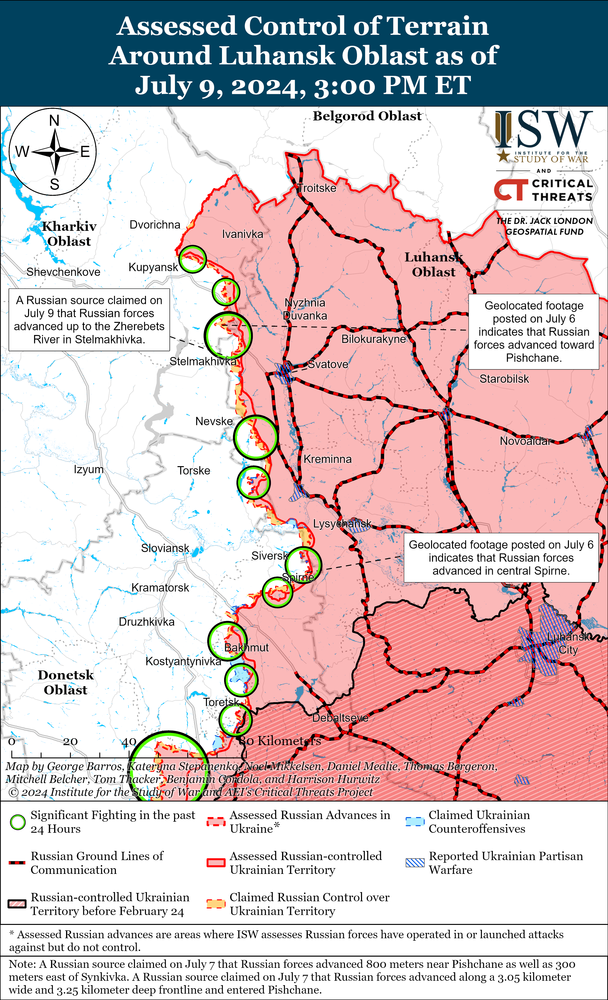
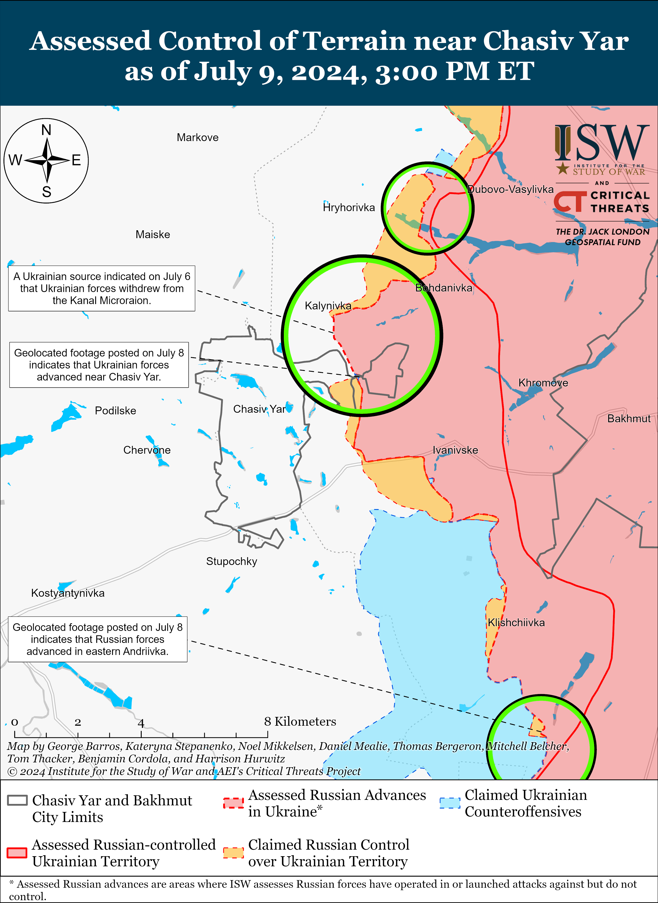
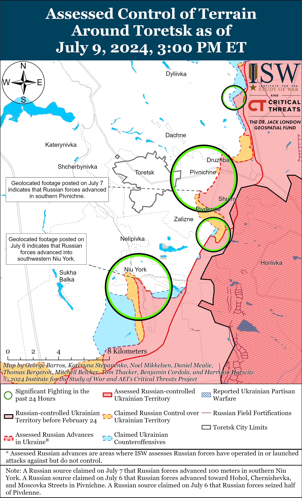
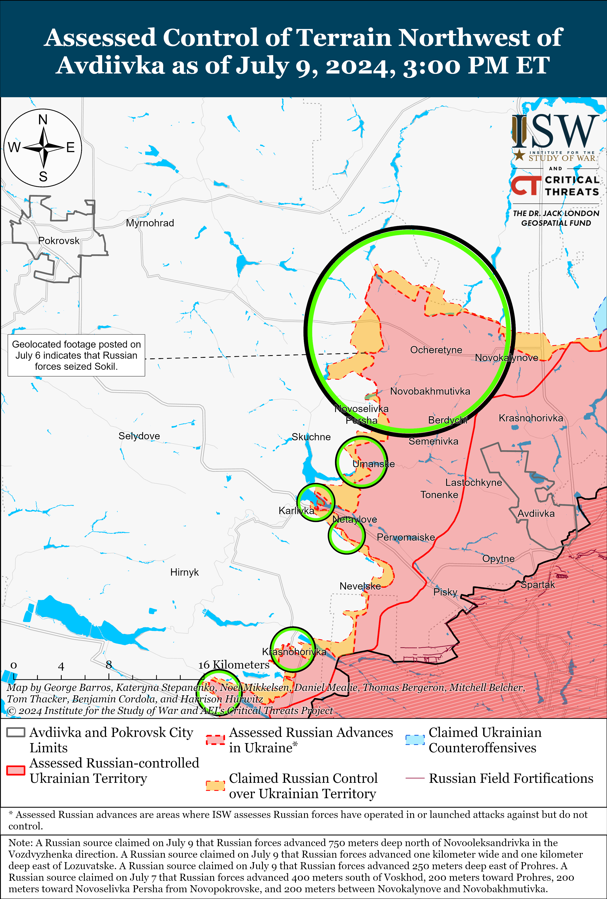
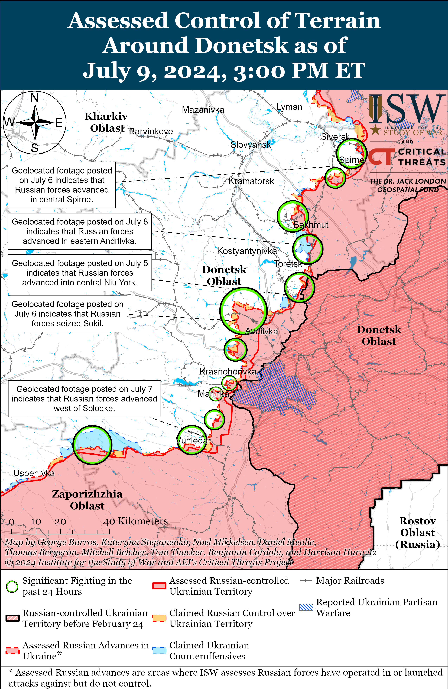
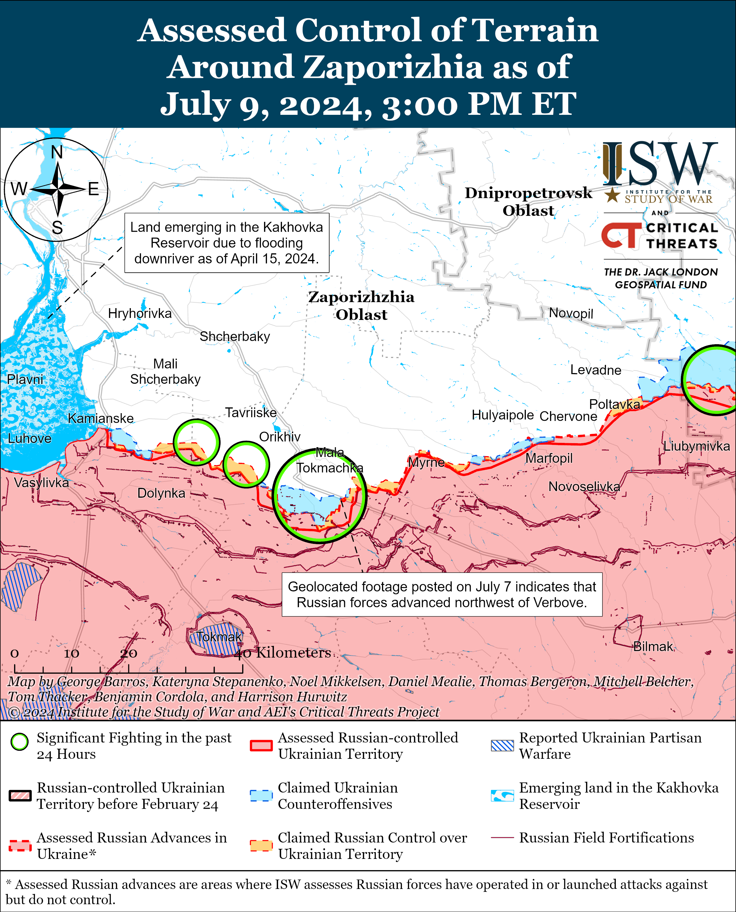
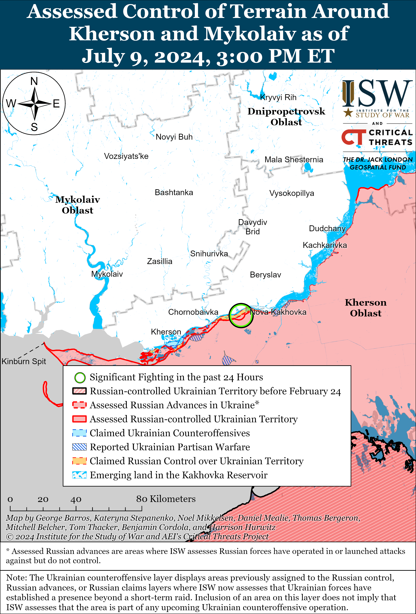

# Russian Offensive Campaign Assessment, July 9, 2024

**Karolina Hird, Nicole Wolkov, Kateryna Stepanenko, Grace Mappes, and Fredrick W. Kagan**

**July 9, 2024, 8:45 pm ET**

**Click**[**here**](https://storymaps.arcgis.com/stories/36a7f6a6f5a9448496de641cf64bd375)**to see ISW’s interactive map of the Russian invasion of Ukraine. This map is updated daily alongside the static maps present in this report.**

**Click**[**here**](https://understandingwar.maps.arcgis.com/apps/instant/3dviewer/index.html?appid=1602762dbcde419bb957dea358449580)**to see ISW’s 3D control of terrain topographic map of Ukraine. Use of a computer (not a mobile device) is strongly recommended for using this data-heavy tool.**

**Click**[**here**](https://storymaps.arcgis.com/stories/733fe90805894bfc8562d90b106aa895)**to access ISW’s archive of interactive time-lapse maps of the Russian invasion of Ukraine. These maps complement the static control-of-terrain map that ISW produces daily by showing a dynamic frontline. ISW will update this time-lapse map archive monthly.**

**Note: The data cut-off for this product was 1 pm ET on July 9. ISW will cover subsequent reports in the July 10 Russian Offensive Campaign Assessment.**

**Russian President Vladimir Putin and Indian Prime Minister Narendra Modi issued a joint statement on July 9 about strengthening mutually beneficial political, economic, energy, and military-technical cooperation between Russia and India.**Modi met with Putin in Moscow on July 8 and 9 to discuss furthering Russo-Indian relations, which Putin referred to as a “particularly privileged strategic partnership.”[1] The joint statement specifically pledged to increase joint production of spare components and parts for servicing Russian-made military equipment and weapons in India, agreed to establish a working group on technological cooperation, and planned to reorient the existing Russo-Indian Intergovernmental Commission on Military and Military-Technical Cooperation on joint research, development, and production of advanced defense technologies and systems.[2]  Russian Deputy Prime Minister Alexander Novak stated that India and Russia are considering entering a long-term agreement on oil supplies and that Russia is considering allowing Indian companies to participate in Russian gas projects.[3] Head of the Russian state nuclear energy operator Rosatom Alexei Likhachev stated during a tour that Putin and Modi took at a Rosatom exhibition that Russia is offering to assist India in constructing low-power tropical nuclear power plants.[4] Modi credited Russo-Indian energy, economic, and food security cooperation for helping to control Indian inflation and ensure economic stability.[5]

**Putin has been intensifying efforts to strengthen Russian relations with non-Western countries through individualized appeals, although he is likely emphasizing Russo-Indian cooperation in the Shanghai Cooperation Organization (SCO) and BRICS as part of a wider Russian effort to create an alternative “Eurasian security architecture” leveraging existing Eurasian multilateral organizations.****[6]** Putin stated that Russia and India will continue to closely cooperate in multilateral organizations such as the United Nations (UN), SCO, and BRICS.[7] Putin and Russian Defense Minister Andrey Belousov have both explicitly identified the SCO and BRICS as the pillars of this “Eurasian security architecture.”[8] Putin also recently visited the People’s Republic of China (PRC), North Korea, and Vietnam to strengthen bilateral cooperation with these countries and attempt to build a coalition of support for Russia from non-Western countries.[9]

**Modi tacitly supported the Kremlin’s false narrative that Russia is interested in a peaceful, negotiated resolution to the war in Ukraine, likely in exchange for deepening economic, energy, and technological cooperation with Russia.**Putin thanked Modi for trying to find a “peaceful” way to resolve the war in Ukraine, and Modi stated that dialogue, not war, is necessary for a peaceful solution.[10] Modi also stated that India is ready to assist Russia in establishing peace as soon as possible. Modi notably did not frame India as a potential mediator between Russia and Ukraine, and Kremlin Spokesperson Dmitry Peskov stated to the press following Russian-Indian negotiations that Modi did not claim to be a mediator in the war.[11] Putin has previously expressed support for non-Western countries’ mediation efforts – most notably the People’s Republic of China (PRC) and a coalition of African states — as part of Russian information operations falsely portraying Russia as willing to negotiate with Ukraine.[12] Putin previously amplified the false narrative that Russian authorities are interested in good-faith negotiations but continues to state that his prerequisites for negotiation require Ukraine’s full capitulation through “demilitarization” and the surrender of significant territory that Russia does not currently occupy.[13] Putin has more recently rejected any efforts of third-party mediation.[14]

**Putin may have pledged to return Indian volunteers fighting in Ukraine during a private dinner with Modi in Novo-Ogaryovo, Moscow Oblast on July 8.**Indian Foreign Secretary Vinay Mohan Kwatra stated on July 9 that Modi “strongly” raised the need for Russia to facilitate the early discharge of Indian nationals “who have been misled” into fighting in Ukraine as part of the Russian military.[15] Kwatra stated that Russian officials promised the early discharge of Indian nationals and noted that around 35 to 50 Indian nationals have fought in Ukraine under misleading offers of high-paying “support roles” in the Russian military and that 10 of these Indian nationals already returned to India.[16] Unnamed sources told Indian news media company *New Delhi Television*(NDTV) that Putin personally agreed to discharge all Indian volunteers who had signed military service contracts with the Russian Ministry of Defense (MoD) and pledged to facilitate the return of Indian volunteers.[17] Unnamed sources told the Indian English-language newspaper *The Hindu*that India expects the release of Indian volunteers within the coming weeks after Modi’s ”direct intervention” in the matter.[18] Kremlin Spokesperson Dmitry Peskov stated that the Kremlin will not comment on these reports, although Russian state news agency *TASS* notably paraphrased Indian reports as stating that Indian citizens were allegedly fighting in Ukraine ”by mistake.”[19] The official Kremlin read-out of the July 8 meeting also omitted to mention the Putin-Modi discussion of Indian volunteers fighting in Ukraine.[20]

**The recruitment of Indian volunteers into the Russian military is certainly not a “mistake” and is part of the Kremlin’s deceptive volunteer recruitment campaign aimed at reinforcing the frontlines in Ukraine without declaring unpopular mobilization in Russia.**Indian officials announced their efforts in February 2024 to secure early discharge for 20 Indian nationals recruited into the Russian military.[21] The Indian Central Bureau of Investigation (CBI) announced in March 2022 that it uncovered “a major human trafficking network” that lured Indian citizens to work in Russia but forced them to join the Russian military.[22] A group of Indian men published a video appeal in March 2024 requesting help from the Indian government to return from Russia, stating that Russian officials coerced them into joining the Russian army upon arrival to Russia on tourist visas and threatened to imprison them for 10 years.[23] Indian nationals told *Reuters*in March 2024 that recruiters offered permanent residency in Russia after six months of combat service.[24] The recruitment of Indian nationals is part of an ongoing Kremlin force generation campaign which began in Spring 2022 as a way for Putin to avoid declaring deeply unpopular mobilization in Russia and has continued following Putin’s partial mobilization declaration in September 2022.[25] The Kremlin entrusted a wide range of recruiters including Russian government officials, businessmen, private military companies (PMCs), and foreign nationals with recruiting any available volunteers to fight in Ukraine, often using deceptive practices and incentives.[26] ISW observed Russia commit citizens of Nepal, Cuba, Serbia, and Central Asian and African countries to combat operations in Ukraine under deceptive premises such as offers of Russian citizenship or steep financial compensations.[27]

**Some unnamed US government officials appear to believe that Ukraine does not need to liberate its occupied lands and people to win the war, despite Russian President Vladimir Putin’s recent clear statements that Russia will not accept a negotiated ceasefire on any terms other than Ukrainian capitulation and will not abandon its goals of the total destruction of the entire Ukrainian state–not just the lands it currently occupies.**The *New York Times* (NYT) reported on July 9 that anonymous US officials think that “even without formally winning back its land, Ukraine could still emerge a victor in the war by moving closer to NATO and Europe.”[28] This US assessment is premised on several faulty assumptions—first and foremost on the assumption that Ukraine’s NATO or European Union (EU) membership is guaranteed. Ukraine’s NATO and EU membership should not be taken as a given in discussions of the future of Ukrainian security.[29] This assessment also rests on the assumption that losing the lands Russia currently occupies and its civilians under Russian occupation will not severely compromise Ukraine’s future economic viability and ability to defend itself against future Russian attacks, which, as ISW has frequently emphasized, is not the case.[30] The lands Russia currently occupies are both economically and strategically necessary for Ukraine, and their continued occupation will deprive Ukraine of economic resources and strategically critical land. Putin himself has stated that Russia will not be content with ending the war on the lines it currently holds and has explicitly called for the Ukrainian withdrawal from the non-occupied parts of Donetsk, Luhansk, Kherson, and Zaporizhia oblasts as a prerequisite for any sort of “peace” negotiations with Ukraine.[31] The areas Putin is currently demanding include the large cities of Kherson and Zaporizhzhia, among other things. Putin has, furthermore, continually framed the war as a struggle against NATO and repeated his insistence that Ukraine change its constitution to formally abandon any aspirations of joining the alliance.[32]  There is no basis for assessing that Putin would agree to a ceasefire that leaves Ukraine closer to NATO. Finally, this suggestion is contingent on the faulty assumption that Russian aggression will “end” with the conclusion of the war on Russia’s terms. ISW, on the contrary, has assessed that a negotiated ceasefire on Russian terms will afford the Russian military time to rest and reconstitute, likely before conducting a future attack on Ukraine from a much more advanced and fortified frontline.[33] Putin has been firm and consistent in his ultimate goal of destroying the Ukrainian state and will not give up that goal until he feels that he has achieved it.[34]

**Several independent investigations, including one conducted by the United Nations (UN) Human Rights Monitoring Mission in Ukraine (HRMMU), concluded that a Russian missile struck the Kyiv City Okhmatdyt Children’s Hospital on July 8 amid continued official Russian denials and deflections.**The HRMMU assessed on July 9 that the Okhmatdyt strike “was likely caused by a direct hit from a Russian missile.”[35] Open-source investigations conducted by *Molfar*, *Bellingcat*, and a Ukrainian reserve officer for the Ukrainian outlet *Euromaidan Press*concluded that a Russian Kh-101 cruise missile struck the hospital.[36] The investigations cited visual characteristics of the Kh-101 model that are consistent with clear footage of the missile seconds before its impact. Ukraine called a meeting of the UN Security Council (UNSC) on July 9 to discuss the Okhmatdyt strike, and several international officials condemned Russia for so blatantly striking a civilian object.[37] Russian officials and commentators, however, continue to deny Russian responsibility for the strike or blame it on an errant Ukrainian air defense missile, despite the growing body of documentation to the contrary.[38] Russian Foreign Ministry Spokesperson Maria Zakharova claimed that a Ukrainian NASAMS air defense missile struck the Okhmatdyt hospital and accused Ukraine of using the strike for informational effect to “further escalate” the war.[39] Kremlin spokesperson Dmitry Peskov claimed that a Ukrainian missile hit Okhmatdyt and called it a “PR operation in blood.”[40]  A former pro-Russian Ukrainian Rada deputy attempted to justify the strike by claiming that Ukrainian forces had an air defense headquarters in the area.[41] These Russian claims are baseless and refuted by the aforementioned visual evidence and open-source investigations, and as ISW stated on July 8, do not absolve Russian forces of legal or moral responsibility for the impacts of the strike on Okhmatdyt.[42]

**Ukrainian forces conducted a series of drone strikes against Russian energy and military infrastructure in Belgorod, Kursk, Rostov, Astrakhan, and Volgograd oblasts overnight on July 8 to 9.**Sources in Ukrainian intelligence told Ukrainian media that Ukraine’s Security Service (SBU) and Main Military Intelligence Directorate (GUR) conducted drone strikes against the Akhtubinsk military airfield in Astrakhan Oblast, an electrical substation in Rostov Oblast, and an oil depot in Kalach-on-Don in Volgograd Oblast overnight.[43] Geolocated footage published on July 9 shows fires at an electrical substation in Yudino, Rostov Oblast and the Kalach-on-Don oil depot.[44]  Russian and Ukrainian sources reported that Ukrainian drones also struck electrical substations at an oil refinery, butter factory, and gas stations in Kursk Oblast, as well as the Energomash electrical equipment plant in Belgorod City.[45] Russian sources claimed that Ukrainian forces launched over 40 drones at areas in Russia overnight, including “several dozen” drones against Rostov Oblast, and that Russian air defenses intercepted most but not all of the drones.[46]

**Russian President Vladimir Putin appointed new military prosecutors on July 8, likely in support of ongoing, long-term Russian military reforms.**Putin appointed Russian Lieutenant General of Justice Sergey Kazakov as military prosecutor of the Russian Joint Group of Forces for a five-year term, replacing Lieutenant General of Justice Alexey Naida.[47] Putin appointed Naida as military prosecutor of the Leningrad Military District (LMD), Major General of Justice Konstantin Olkhovatenko as Central Military District (CMD) military prosecutor, Major General of Justice Igor Kupreev as Northern Fleet military prosecutor, and Major General of Justice Oleg Okorokov as Black Sea Fleet (BSF) military prosecutor.[48] Putin appointed Lieutenant General of Justice Andrey Popov on April 8 as military prosecutor of the Moscow Military District (MMD) after having served in the same position for the CMD.[49] Putin is likely shifting around and appointing new military prosecutors to support his effort to reform and encourage discipline within the Russian military in the long-term.

**Newly-elected Iranian President Masoud Pezeshkian reiterated Iran’s continued willingness to enter a comprehensive strategic partnership with Russia, emphasizing the continuity in Iran’s support for Russia even under a new presidential administration.**Pezeshkian spoke with Russian President Vladimir Putin on the phone on July 8 and reportedly voiced Iran’s willingness to sign a comprehensive strategic partnership agreement with Russia at the upcoming October 2024 BRICS summit.[50] Putin in turn highlighted his satisfaction with close Russo-Iranian relations and expressed his readiness for “joint work” in various areas.[51] Pezeshkian’s apparent willingness to pursue and develop a strategic partnership with Russia is consistent with the efforts of his predecessor, Ebrahim Raisi, to expand bilateral cooperation by having consistent meetings with Putin and other Russian officials.[52] ISW-CTP previously assessed that Pezeshkian’s presidency is unlikely to create meaningful changes in the Iranian regime, as Iranian Supreme Leader Ali Khamenei will continue to dictate Iran’s foreign policy objectives.[53]

**The US Department of Justice (DoJ) released affidavits on July 9 for several hundred X (formerly Twitter) accounts and domain names used by Russian state media and security services to operate a bot farm aimed at spreading disinformation in the United States and abroad.****[54]**The DoJ announced that it seized two domain names and searched 986 X accounts linked to an artificial intelligence (AI)-enhanced bot farm developed by Russian state media network *RT* and operated by the Russian Federal Security Service (FSB). The DoJ reported that this bot farm used AI to create fictitious social media profiles of individuals falsely posing as US individuals to promote messages in support of Russian government objectives. The DoJ said that *RT*leadership has sought to develop alternative means to distribute Russian narratives beyond its international TV broadcasts since at least 2022 and began establishing this bot farm in April 2022. The DoJ added that the Kremlin approved and offered financial support in early 2023 to create and lead a private intelligence organization to spread Russian disinformation using this bot farm. US Attorney General Merrick Garland reported that DoJ searches and seizures have disrupted a Russian “AI-enabled propaganda campaign” intended to sow disinformation among US and international social media outlets. The DoJ report emphasized the prevalence of fictitious social media accounts, particularly on X, that were linked to both the bot farm and the seized domain names. The DoJ reported that X voluntarily suspended the remaining identified bot accounts. These X accounts propagated debunked narratives and Kremlin talking points about the war in Ukraine, such as Kremlin claims that parts of Poland, Ukraine, and Lithuania were “gifts” from Russia. The bot farm pushed other narratives in video format such as a video of Russian President Vladimir Putin claiming that the war in Ukraine is not a territorial conflict or a matter of geopolitical balance, but rather about the “principles on which the New World Order will be based.”

**Key Takeaways:**

- **Russian President Vladimir Putin and Indian Prime Minister Narendra Modi issued a joint statement on July 9 about strengthening mutually beneficial political, economic, energy, and military-technical cooperation between Russia and India.**
- **Putin has been intensifying efforts to strengthen Russian relations with non-Western countries through individualized appeals, although he is likely emphasizing Russo-Indian cooperation in the Shanghai Cooperation Organization (SCO) and BRICS as part of a wider Russian effort to create an alternative “Eurasian security architecture” leveraging existing Eurasian multilateral organizations.**
- **Modi tacitly supported the Kremlin’s false narrative that Russia is interested in a peaceful, negotiated resolution to the war in Ukraine, likely in exchange for deepening economic, energy, and technological cooperation with Russia.**
- **Putin may have pledged to return Indian volunteers fighting in Ukraine during a private dinner with Modi in Novo-Ogaryovo, Moscow Oblast on July 8.**
- **Some unnamed US government officials appear to believe that Ukraine does not need to liberate its occupied lands and people to win the war, despite Russian President Vladimir Putin’s recent clear statements that Russia will not accept a negotiated ceasefire on any terms other than Ukrainian capitulation and will not abandon its goals of the total destruction of the entire Ukrainian state–not just the lands it currently occupies.**
- **Several independent investigations, including one conducted by the United Nations (UN) Human Rights Monitoring Mission in Ukraine (HRMMU), concluded that a Russian missile struck the Kyiv City Okhmatdyt Children’s Hospital on July 8 amid continued official Russian denials and deflections.**
- **Ukrainian forces conducted a series of drone strikes against Russian energy and military infrastructure in Belgorod, Kursk, Rostov, Astrakhan, and Volgograd oblasts overnight on July 8 to 9.**
- **Russian President Vladimir Putin appointed new military prosecutors on July 8, likely in support of ongoing, long-term Russian military reforms.**
- **Newly-elected Iranian President Masoud Pezeshkian reiterated Iran’s continued willingness to enter a comprehensive strategic partnership with Russia, emphasizing the continuity in Iran’s support for Russia even under a new presidential administration.**
- **The US Department of Justice (DoJ) released affidavits on July 9 for several hundred X (formerly Twitter) accounts and domain names used by Russian state media and security services to operate a bot farm aimed at spreading disinformation in the US and abroad.**
- **Russian forces recently made confirmed advances southeast of Chasiv Yar, near Avdiivka, and southwest of Donetsk City, and Ukrainian forces recently advanced north of Kharkiv City.**
- **Russian Prime Minister Mikhail Mishustin signed a decree ordering the reestablishment of the Saratov Higher Artillery Command School on July 8, likely as part of ongoing efforts to build out a cadre of Russian officers.**
- **Russian authorities continue to deploy Rosgvardia contingents to occupied Ukraine to serve law enforcement functions.**

[****](https://understandingwar.org/wp-content/uploads/2025/05/DraftUkraineCoT20July2092C202024.png)

***We do not report in detail on Russian war crimes because these activities are well-covered in Western media and do not directly affect the military operations we are assessing and forecasting. We will continue to evaluate and report on the effects of these criminal activities on the Ukrainian military and the Ukrainian population and specifically on combat in Ukrainian urban areas. We utterly condemn Russian violations of the laws of armed conflict and the Geneva Conventions and crimes against humanity even though we do not describe them in these reports.***

- Russian Main Effort – Eastern Ukraine (comprised of three subordinate main efforts)
- Russian Subordinate Main Effort #1 – Push Ukrainian forces back from the international border with Belgorod Oblast and approach to within tube artillery range of Kharkiv City
- Russian Subordinate Main Effort #2 – Capture the remainder of Luhansk Oblast and push westward into eastern Kharkiv Oblast and encircle northern Donetsk Oblast
- Russian Subordinate Main Effort #3 – Capture the entirety of Donetsk Oblast
- Russian Supporting Effort – Southern Axis
- Russian Air, Missile, and Drone Campaign
- Russian Mobilization and Force Generation Efforts
- Russian Technological Adaptations
- Activities in Russian-occupied areas
- Ukrainian Defense Industrial Base Efforts
- Russian Information Operations and Narratives
- Significant Activity in Belarus

**Russian Main Effort – Eastern Ukraine**

**Russian Subordinate Main Effort #1 – Kharkiv Oblast****(Russian objective: Push Ukrainian forces back from the international border with Belgorod Oblast and approach to within tube artillery range of Kharkiv City)**

Ukrainian forces recently regained positions near and in Hlyboke (north of Kharkiv City) amid continued Ukrainian counterattacks north and northeast of Kharkiv City on July 9.[55] Geolocated footage published on July 8 showed reportedly elements of the Russian 155th Naval Infantry Brigade (Pacific Fleet) striking Ukrainian positions north of Hlyboke and in southern part of the settlement, indicating that Ukrainian forces regained these positions.[56] A Russian milblogger claimed that his sources in the Russian 155th Naval Infantry Brigade stated that Russian forces were unable to repel a routine Ukrainian attack on hangars north of Hlyboke despite successfully doing so in the past and also indicated that Russian forces no longer control fields immediately west of Hlyboke.[57] The milblogger also claimed that elements of the Russian 155th Naval Infantry Brigade are operating in Vovchansk (northeast of Kharkiv City) — not near Hlyboke — despite the numerous reports that some elements of this brigade are fighting in Hlyboke.[58] Another Russian milblogger commented on the ongoing Ukrainian counterattacks near Hlyboke and claimed that Ukrainian forces are concentrating in Lyptsi (south of Hlyboke), arguing that the Russian military command needs to go on the defensive in the Kharkiv direction due to the lack of necessary forces to continue offensive operations.[59] The milblogger attributed these force shortages to poor planning.

Russian forces continued offensive operations northwest, north, and northeast of Kharkiv City on July 9. The Ukrainian General Staff reported on July 8 and 9 that Russian forces attacked northwest of Kharkiv City near Sotnytskyi Kozachok; north of Kharkiv City near Lyptsi and Hlyboke; and northeast of Kharkiv City near Starytsya, Tykhe, and Vovchansk.[60] A Ukrainian serviceman stated on July 8 that Russian forces attacked Ukrainian positions dressed in civilian clothes and hide machine guns under these clothes in the Vovchansk direction, which may constitute a resort to perfidy, which is prohibited under international law.[61] The serviceman also implied that the Russian military command routinely asks for reinforcements to support offensive operations in the Kharkiv direction. Elements of the Russian 83rd Separate Guards Airborne (VDV) Brigade continued to operate in the Vovchansk area; and elements of the “Aida” group of the Chechen “Akhmat” Spetsnaz (204th Spetsnaz Regiment) reportedly continued to operate in the Kharkiv direction.[62] Chechen Republic Head Ramazan Kadyrov claimed on July 9 that elements of “Akhmat” Spetsnaz are fighting in the Vovchansk area.[63]

The official Telegram channel of the Russian Ministry of Defense’s (MoD) Africa Corps confirmed on July 9 that the Russian military command transferred some units of the Africa Corps to Belgorod Oblast border “some time ago,” and that they are continuing combat operations in the area.[64] Africa Corps claimed that some of its units have been involved in the creation of the “buffer zone” on the Ukrainian-Russian international border since the “first days,” implying that its elements have been fighting in the area since the start of the Russian offensive in northern Kharkiv Oblast in May. ISW previously observed reports of elements of Africa Corps and “African mercenaries” fighting in northern Kharkiv Oblast in mid- to late-May.[65] Africa Corps implied that it had participated in repelling all-Russian pro-Ukrainian cross-border raids near Tetkino, Kursk Oblast and Kozinka, Belgorod Oblast in March alongside Russian border guards, VDV elements, motorized riflemen, and Spetsnaz elements.[66] Africa Corps also claimed that its reconnaissance groups participated in the capture of terrorists involved in the March 22 Crocus City Hall attack.

**Russian Subordinate Main Effort #2 – Luhansk Oblast****(Russian objective: Capture the remainder of Luhansk Oblast and push westward into eastern Kharkiv Oblast and northern Donetsk Oblast)**

Russian sources largely circulated warnings on July 8 and 9 from two Ukrainian military observers about a threat of a potential Russian breakthrough towards the Oskil River southeast of Kupyansk. Ukrainian military observers Kostyantyn Mashovets and Bohdan Myroshnykov assessed that the recent Russian advances near Pishchane (southeast of Kupyansk) may allow Russian forces to break through towards the Oskil River, which is about 10 kilometers from Pishchane.[67] Russian state media outlets and milbloggers widely amplified Mashovets’ and Myroshnykov’s assessments, and one Russian milblogger claimed that Russian forces recently advanced over four kilometers west and three kilometers wide near Pishchane and entered the settlement.[68] ISW has not observed visual evidence to confirm this claim, and other Russian milbloggers did not claim that Russian forces seized Pishchane.[69] A Russian milblogger also claimed that Russian forces advanced in northern and northeastern Stelmakhivka (southeast of Kupyansk).[70] The Ukrainian General Staff reported that Russian forces attacked east of Kupyansk near Petropavlivka and southeast of Kupyansk near Berestove, Pishchane, and Stelmakhivka; and a Russian milblogger claimed that Ukrainian forces are counterattacking near Synkivka (northeast of Kupyansk).[71]

Russian forces continued offensive operations around Kreminna on July 8 and 9 but did not make confirmed advances. The Ukrainian General Staff reported that Russian forces attacked northwest of Kreminna near Hrekivka, Nevske, and Makiivka; and west of Kreminna near Terny.[72]

**Russian Subordinate Main Effort #3 – Donetsk Oblast****(Russian objective: Capture the entirety of Donetsk Oblast, the claimed territory of Russia’s proxies in Donbas)**

Russian forces continued offensive operations in the Siversk direction near Verkhnokamyanske (east of Siversk), Spirne (southeast of Siversk), and Vyimka, Vesele, and Rozdolivka (all south of Siversk) on July 8 and 9.[73]

Russian forces recently marginally advanced southeast of Chasiv Yar amid continued fighting in the area on July 9. Geolocated footage published on July 8 shows that a fireteam of the Russian “94th Regiment,” possibly referring to the 94th Operational Regiment (46th Separate Operational Brigade, Rosgvardia’s North Caucasus District), recently marginally advanced within Andriivka (southeast of Chasiv Yar) during an assault.[74] Chechen Republic Head Ramzan Kadyrov claimed on January 21 that elements of the Russian 94th Operational Regiment had returned to Ukraine to rotate into an unspecified critical sector of the frontline.[75] A Russian milblogger claimed that Russian forces advanced between Chasiv Yar and Kalynivka (north of Chasiv Yar).[76] Russian forces also continued attacking within eastern Chasiv Yar; north of Chasiv Yar near Bohdanivka and Hryhorivka; and southeast of Chasiv Year near Bila Hora, Klishchiivka, and Andriivka on July 8 and 9.[77] Elements of the Russian 98th Airborne (VDV) Brigade, including its 215th Reconnaissance Battalion, continue to operate near Chasiv Yar.[78]

Russian forces continued offensive operations in the Toretsk direction on July 9 but did not make any confirmed advances. Russian forces attacked near Toretsk; north of Toretsk near Dyliivka; east of Toretsk near Druzhba and Pivnichne; southeast of Toretsk near Pivdenne; and south of Toretsk near Niu York on July 8 and 9.[79] A Russian milblogger claimed that fighting is ongoing on the outskirts of Toretsk, but Ukrainian Khortytsia Group of Forces Spokesperson Colonel Nazar Voloshyn stated that Russian forces have not entered Toretsk itself.[80] A Russian milblogger claimed that Russian forces were able to advance in the Toretsk direction because elements of the Russian “Veterany” Assault Brigade (Russian Volunteer Corps) dug 90 centimeter-wide tunnels to crawl underground and bypass heavily fortified Ukrainian defensive lines in this direction.[81] The milblogger noted that Ukrainian forces would have otherwise destroyed Russian assault groups during frontal assaults due to the heavy defenses and intense drone operations in the area.

Russian forces reportedly recently advanced northwest and west of Avdiivka amid continued fighting in the area on July 9. The Russian MoD claimed on July 9 that Russian forces seized Yasnobrodivka (west of Avdiivka) after a Russian milblogger first claimed that Russian forces seized the settlement on June 30.[82] Russian milbloggers claimed that Russian forces advanced 750 meters deep north of Novooleksandrivka, 250 meters deep south of Prohres, up to one kilometer deep east of Lozuvatske, to the northwest and southwest of Yevhenivka, and west of Novopokrovske (all northwest of Avdiivka).[83] Some Russian sources claimed that Ukrainian forces also withdrew from tactical positions near Yevhenivka and Novoselivka Persha (northwest of Avdiivka).[84] ISW has not observed visual confirmation of these Russian claims, however. Russian forces also continued attacking northwest of Avdiivka near Vozdvyzhenka, Tymofiivka, and Kalynove; west of Avdiivka near Karlivka, Netaylove, and Umanske; and southwest of Avdiivka near Nevelske on July 8 and 9.[85] Elements of the Russian “Somalia” Battalion (1st Donetsk People’s Republic Army Corps [DNR AC]) are reportedly fighting near Karlivka.[86]

Russian forces recently marginally advanced southwest of Donetsk City amid continued offensive operations in the area on July 9. Geolocated footage published on July 9 shows that Russian forces recently marginally advanced in fields east of Kostyantynivka (southwest of Donetsk City).[87] A Russian milblogger claimed that Russian forces continued to advance near the Ikryana Balka (between Vodyane and Kostyantynivka southwest of Donetsk City).[88] Russian forces also attacked west of Donetsk City near Krasnohorivka and Heorhiivka and southwest of Donetsk City near Paraskoviivka and Vodyane on July 8 and 9.[89]

Russian forces continued attacking in the Donetsk-Zaporizhia border area near Novosilka (west of Velyka Novosilka), Rivnopil (southwest of Velyka Novosilka), and Urozhaine and Makarivka (both south of Velyka Novosilka) on July 8 and 9 but did not make confirmed advances.[90]

**Russian Supporting Effort – Southern Axis****(Russian objective: Maintain frontline positions and secure rear areas against Ukrainian strikes)**

Positional engagements continued in western Zaporizhia Oblast on July 9, but there were no confirmed changes to the frontline. Fighting continued near Robotyne, Verbove (east of Robotyne), Mala Tokmachka (northeast of Robotyne), Novoandriivka (north of Robotyne), and Shcherbaky (northwest of Robotyne) on July 8 and 9.[91] Footage that Ukrainian sources published on July 8 shows Ukrainian forces repelling a Russian squad-sized infantry assault mounted on a golf cart and an infantry fighting vehicle near Robotyne.[92] Elements of the Russian 7th Airborne (VDV) Division reportedly continue operating in the Orikhiv direction.[93]

Fighting continued in the east (left) bank of Kherson Oblast, including near Krynky, on July 9.[94] A Russian milblogger claimed that Russian and Ukrainian forces continue to fight for control over the islands in the Dnipro River Delta.[95]

**Russian Air, Missile, and Drone Campaign****(Russian Objective: Target Ukrainian military and civilian infrastructure in the rear and on the frontline)**

Russian forces conducted a limited missile strike against Poltava and Odesa oblasts on the evening of July 9.[96] Poltava Oblast Head Filip Pronin stated that an unspecified missile struck an industrial object in Poltava Oblast.[97] Russian milbloggers claimed that Russian forces struck the Myrhorod Air Base with Kh-101 cruise missiles launched from Ryazan Oblast, but Ukrainian sources have not yet confirmed strikes on air base infrastructure at Myrhorod.[98] Ukraine’s Southern Air Command also reported that Russian forces launched an Iskander-M ballistic missile at Odesa Oblast on the evening of July 9.[99]

The Russian MoD published footage on July 9 purportedly showing Russian forces striking a Ukrainian column with military equipment near Stetskivka, Sumy Oblast with an Iskander-M ballistic missile on an unspecified date.[100] The Russian MoD claimed that the Russian strike targeted a Ukrainian warehouse with artillery ammunition, 20 military vehicles, and up to 65 Ukrainian personnel but ISW cannot verify these claims. Ukrainian military officials reported on July 8 that Russian forces struck unspecified critical infrastructure in Stetskivka area overnight on July 7 and 8.[101]

**Russian Mobilization and Force Generation Efforts****(Russian objective: Expand combat power without conducting general mobilization)**

Russian Prime Minister Mikhail Mishustin signed a decree ordering the reestablishment of the Saratov Higher Artillery Command School on July 8, likely as part of ongoing efforts to build out a cadre of Russian officers.[102] The reopened Saratov Higher Artillery Command School can train a maximum of 6,000 military and civilian personnel, and it initially closed in 2003.[103] Russian forces suffered significant officer losses during the initial phases of Russia’s full-scale invasion, and the Russian military likely intends to expand its educational resources to build out an officer cadre.[104] Russia also announced the reestablishment of the Donetsk Higher Combined Arms Command School in July 2023, likely intended to increase the officer cadre and integrate proxy military formations into the regular Russian military.[105]

The re-establishment of the Saratov Higher Artillery Command school prompted Russian milbloggers to advocate for the establishment of a dedicated institute to train electronic warfare (EW) specialists. Russian milbloggers argued that the Russian military should establish a separate electronic warfare (EW) military education institution since the current EW department at the Russian Air Force Academy cannot train enough personnel.[106] The milbloggers argued that opening a separate EW military education institution would allow Russia to train more personnel in short- to long-range EW and allow more integrated cooperation between EW operators and Russian defense companies that design and produce EW systems.[107] Another milblogger noted that not enough Russian military personnel know how to use EW systems rendering Russian military efforts to produce more EW systems a fruitless endeavor.[108]

*Forbes*assessed on July 9 that Russia may be choosing to refurbish older Russian tank models instead of newer T-72 tanks because T-72 automatic loaders are “intricate” and hard to maintain.[109] *Forbes* cited a recent report from open-source researchers who analyzed satellite imagery and assessed that Russian forces have removed roughly 12 to 37 percent of T-55, T-62, and T-64 tanks (which lack autoloaders) and only roughly nine percent T-72A/Ural tanks (which have autoloaders) from open-air storage.[110] The open-source researchers also assessed that Russian forces have removed roughly 52 to 79 percent of Russian T-72B, T-90B/BV and T-80U/UD tanks from open-air storage – all of which have autoloaders.[111]

North Korean state news agency Korean Central News Agency (KCNA) reported that a delegation from North Korea’s Kim Il Sung Military University led by its president Kim Kum-chol departed for Russia.[112] KCNA did not state the purpose of the visit. North Korea and Russia have previously engaged in youth exchanges and the North Korea is trying to increase the number of North Korean students studying in Russia.[113]

**Russian Technological Adaptations****(Russian objective: Introduce technological innovations to optimize systems for use in Ukraine)**

Nothing significant to report.

**Ukrainian Defense Industrial Efforts****(Ukrainian objective: Develop its defense industrial base to become more self-sufficient in cooperation with US, European, and international partners)**

*ISW is not publishing coverage of the Ukrainian defense industrial effort today.*

**Activities in Russian-occupied areas (Russian objective: Consolidate administrative control of annexed areas; forcibly integrate Ukrainian citizens into Russian sociocultural, economic, military, and governance systems)**

Russian authorities continue to deploy Rosgvardia contingents to occupied Ukraine to serve law enforcement functions. Ukrainian Mariupol Mayoral Advisor Petro Andryushchenko warned on July 7 that a plainclothes Rosgvardia unit arrived in occupied Urzuf, Donetsk Oblast to patrol public areas along the beach areas along the coast from Uzruf to Yalta, Donetsk Oblast.[114] Andryushchenko suggested that the plainclothes Rosgvardia personnel are patrolling civilian areas and arbitrarily detaining people based on their facial expressions and other random factors. The Ukrainian Resistance Center similarly reported on July 9 that Rosgvardia units are arriving in occupied Ukraine in greater numbers to crack down against Ukrainian partisan activities, which the Russian occupation administration has classified as an “extremist” threat.[115] ISW has previously reported on Russian efforts to use Rosgvardia units as a military occupation force in occupied Ukraine.[116]

Zaporizhia Oblast occupation authorities signed an agreement with Rosgvardia to institute military training courses in schools in occupied Berdyansk.[117] The agreement allows Rosgvardia to instruct Ukrainian children in the basics of security and anti-terrorist measures. Ukrainian Melitopol Mayor Ivan Fedorov suggested that a Rosgvardia unit from Makhachkala, Dagestan Republic, will be involved with the training in Berdyansk.[118] Russian opposition outlet *ASTRA* noted that Rosgvardia is also offering such classes in occupied Melitopol and Kostyantynivka.[119] Rosgvardia is likely interested in training children in occupied schools to build out its own mobilization reserve and is creating a cadre of Ukrainian youth that it will likely use in the future to further police occupied areas.

A Russian insider source reportedly obtained documents detailing the Russian occupation administration’s ongoing efforts to seize and nationalize private property in occupied Crimea.[120] The documents show a decision of the Crimean occupation Anti-Terrorism Commission that instructs Russian law enforcement “to compile a list of individuals and legal entities” that have alleged associations with “unfriendly” foreign states in order to forcibly confiscate property from listed individuals. Crimean occupation authorities have previously seized and nationalized properties of Ukrainians who formerly lived in Crimea and whom the occupation administration considers “undesirable” or “unfriendly” to Russia.[121] Kremlin-affiliated business-focused outlet *Kommersant*reported that as of early 2023, Crimean occupation officials seized and nationalized over 700 assets, including properties, belonging to Ukrainians, and that number is likely to grow as occupation authorities expand the legal boundaries of those whom they may seize property from.[122]

Russian occupation officials continue to inadvertently confirm that they forcibly removed a group of Ukrainian children from occupied Kherson to an orphanage in occupied Crimea. Kherson Oblast occupation deputy governor Tatyana Kuzmich visited the Yolochka orphanage in occupied Simferopol, Crimea, on July 7 to visit a group of children from occupied Kherson Oblast who have been at the orphanage since October 2022.[123] Kuzmich claimed that the children live in “warmth and comfort” and have good medical care and that Western observers are deliberately “slandering” the orphanage. An investigation by Russian opposition outlet *Verstka*found in early 2023 that the Yolochka orphanage was complicit in placing at least 14 Ukrainian children up for adoption into Russian families in Moscow.[124] Russian occupation officials previously claimed that they removed the children from Kherson Oblast due to imminent danger to their lives due to military activity—but international law requires the occupying power (Russia) not to remove or displace populations permanently.[125] The Ukrainian children at the Yolochka orphanage have been displaced from Ukraine, their Ukrainian guardians, and potential Ukrainian relatives for nearly two years.

**Russian Information Operations and Narratives**

The Russian MoD reiterated a boilerplate Russian narrative on July 9 accusing Ukraine of violating the Chemical Weapons Convention (CWC).[126] Russian officials frequently invoke the concept of chemical and biological threats to discredit and undermine support for Ukraine, including through the debunked narrative that Ukraine is developing biological weapons in US- and NATO-funded laboratories in Ukraine and the accusation that Ukraine is using chemical and biological weapons against Russian troops.[127]

**Significant activity in Belarus****(Russian efforts to increase its military presence in Belarus and further integrate Belarus into Russian-favorable frameworks and Wagner Group activity in Belarus)**

The Belarusian Ministry of Defense (MoD) reported on July 9 that Belarusian and People’s Republic of China (PRC) People’s Liberation Army (PLA) forces conducted parachute training sessions as part of the ongoing “Attack Falcon” counterterrorism exercises in Belarus.[128] PLA forces arrived in Belarus on July 6 for exercises from July 8 to 19.[129] The Belarusian Hajun Project reported that the PRC military arrival was the first time that a PLA aircraft landed at Belarus’ Baranovichi airfield.[130]

Russia and Belarus continue to deepen trade and industrial cooperation. Belarusian Prime Minister Roman Golovchenko stated on July 9 that Russia and Belarus have successfully implemented 60 Union State initiatives to increase industrial production and technological innovations, adopted a joint action plan to increase independence in technological and scientific fields, and plan to implement 26 import-substitution projects.[131] Golovchenko met with Sverdlovsk Oblast Head Yevgeny Kuyvashev in Yekaterinburg and announced that an unspecified Belarusian company signed an agreement with the Russian Ural Civil Aviation Plant to jointly design Osvey light twin-engine aircraft.[132] Golovchenko stated that trade between Belarus and Sverdlovsk Oblast traded $800 million of goods in 2023 and $365 million of goods so far in 2024.

**Note: ISW does not receive any classified material from any source, uses only publicly available information, and draws extensively on Russian, Ukrainian, and Western reporting and social media as well as commercially available satellite imagery and other geospatial data as the basis for these reports. References to all sources used are provided in the endnotes of each update.**

****

---

[1] http://kremlin dot ru/events/president/transcripts/74519 ; http://kremlin dot ru/events/president/news/74511

[2] http://kremlin dot ru/supplement/6168

[3] https://www.rbc dot ru/rbcfreenews/668d406e9a7947d7cfbc8642 ; https://iz dot ru/1724970/2024-07-09/rossiia-i-indiia-mogut-zakliuchit-dolgosrochnoe-soglashenie-na-postavki-nefti

[4] https://tass dot ru/ekonomika/21315801

[5] http://kremlin dot ru/events/president/transcripts/74519

[6] https://isw.pub/UkrWar062124

[7] http://kremlin dot ru/events/president/transcripts/74519

[8] https://understandingwar.org/backgrounder/russian-offensive-campaign-assessment-june-21-2024; https://understandingwar.org/backgrounder/russian-offensive-campaign-assessment-july-3-2024

[9] https://understandingwar.org/backgrounder/russian-offensive-campaign-assessment-june-19-2024 ; https://isw.pub/UkrWar062124 ; https://isw.pub/UkrWar051624

[10] http://kremlin dot ru/events/president/transcripts/74519

[11] https://t.me/tass\_agency/259652

[12] https://understandingwar.org/backgrounder/russian-offensive-campaign-assessment-june-17-2023 ; https://understandingwar.org/backgrounder/russian-offensive-campaign-assessment-april-9-2024

[13] https://isw.pub/UkrWar070624 ; https://isw.pub/UkrWar070524

[14] https://isw.pub/UkrWar070824

[15] https://www.reuters.com/world/russia-promises-discharge-indians-misled-into-joining-its-army-indian-official-2024-07-09/

[16] https://www.reuters.com/world/russia-promises-discharge-indians-misled-into-joining-its-army-indian-official-2024-07-09/

[17] https://www.ndtv.dot com/india-news/russia-to-discharge-indians-from-army-after-pm-raises-it-with-putin-sources-6064344; https://meduza dot io/news/2024/07/09/ndtv-rossiya-soglasilas-uvolit-iz-armii-grazhdan-indii-kotoryh-obmanom-otpravili-voevat-v-ukrainu

[18] https://www.thehindu dot com/news/national/putin-accepts-pm-modis-request-to-release-indian-military-recruits-on-russia-ukraine-warfront/article68383776.ece

[19] https://tass dot ru/politika/21312773

[20] http://kremlin dot ru/events/president/news/74511 ; https://t.me/MID\_Russia/43067

[21] https://www.uawire dot org/putin-pledges-to-withdraw-indian-mercenaries-from-ukraine-after-modi-s-appeal; https://understandingwar.org/backgrounder/russian-offensive-campaign-assessment-march-9-2024

[22] https://understandingwar.org/backgrounder/russian-offensive-campaign-assessment-march-9-2024

[23] https://www.ndtv.dot com/india-news/russia-to-discharge-indians-from-army-after-pm-raises-it-with-putin-sources-6064344; https://meduza dot io/news/2024/07/09/ndtv-rossiya-soglasilas-uvolit-iz-armii-grazhdan-indii-kotoryh-obmanom-otpravili-voevat-v-ukrainu; https://www.reuters.com/world/india/indians-killed-ukraine-were-forced-fight-russia-families-say-2024-03-07/

[24] https://www.reuters.com/world/india/indians-killed-ukraine-were-forced-fight-russia-families-say-2024-03-07/

[25] https://understandingwar.org/backgrounder/russian-offensive-campaign-assessment-february-26-2023; https://understandingwar.org/backgrounder/russian-volunteer-units-and-battalions

[26] https://understandingwar.org/backgrounder/russian-offensive-campaign-assessment-february-26-2023; https://understandingwar.org/backgrounder/russian-volunteer-units-and-battalions

[27] https://understandingwar.org/backgrounder/russian-offensive-campaign-assessment-october-3-2023; https://understandingwar.org/backgrounder/russian-offensive-campaign-assessment-february-11-2024; https://understandingwar.org/backgrounder/russian-offensive-campaign-assessment-december-5-2023; https://understandingwar.org/backgrounder/russian-offensive-campaign-assessment-january-9-2024; https://understandingwar.org/backgrounder/russian-offensive-campaign-assessment-may-22-2024 ; https://understandingwar.org/backgrounder/russian-offensive-campaign-assessment-july-26

[28] https://www.nytimes.com/2024/07/09/us/politics/russia-ukraine-nato.html

[29] https://www.theguardian.com/commentisfree/2023/nov/11/ukraine-join-eu-membership-talks-subsidies; https://www.nato.int/cps/en/natohq/topics\_37750.htm; https://www.euractiv.com/section/europe-s-east/news/why-ukraines-nato-membership-hopes-keep-running-into-trouble/

[30] https://understandingwar.org/backgrounder/lands-ukraine-must-liberate

[31] https://understandingwar.org/backgrounder/russian-offensive-campaign-assessment-june-14-2024

[32] https://isw.pub/UkrWar061524 ; https://isw.pub/UkrWar061424 ; https://isw.pub/UkrWar012624

[33] https://understandingwar.org/backgrounder/high-price-losing-ukraine-part-1-%E2%80%94-military-strategic-financial-implications-russian

[34] https://understandingwar.org/backgrounder/russian-offensive-campaign-assessment-july-5-2024; https://understandingwar.org/backgrounder/russian-offensive-campaign-assessment-june-30-2024

[35] https://www.reuters.com/world/europe/un-assessment-suggests-ukraine-childrens-hospital-hit-by-russian-missile-2024-07-09/

[36] https://t.me/molfar\_global/3177 ; https://www.bellingcat.com/news/2024/07/09/russian-missile-identified-in-kyiv-childrens-hospital-attack/ ; https://euromaidanpress.com/2024/07/09/russia-struck-kyiv-children-hospital-with-kh-101-missile-osint-analysis-indicates/

[37] https://suspilne dot media/786803-radbez-oon-na-vimogu-ukraini-zibravsa-na-zasidanna-cerez-masovanu-ataku-rf-ta-udar-po-ohmatditu/

[38] https://t.me/tass\_agency/259508 ; https://t.me/MID\_Russia/43070; https://t.me/EmbUSA/7082; https://t.me/tass\_agency/259701 ; https://t.me/tass\_agency/259704; https://t.me/tass\_agency/259676 ; https://t.me/tass\_agency/259677 ;

[39] https://t.me/tass\_agency/259570; https://t.me/MID\_Russia/43074

[40] https://t.me/tass\_agency/259676

[41] https://t.me/RVvoenkor/72052

[42] https://isw.pub/UkrWar070824

[43] https://armyinform dot com.ua/2024/07/09/vybuhova-nich-u-rosiyi-vrazheni-vijskovyj-aerodrom-npz-ta-elektropidstancziya/; https://t.me/army\_tv/4290 ; https://suspilne dot media/786165-den-zalobi-v-kievi-udar-po-ohmatditu-ta-paket-dopomogi-vid-nimeccini-866-den-vijni-onlajn/?anchor=live\_1720521680&utm\_source=copylink&utm\_medium=ps

[44] https://t.me/astrapress/59270; https://t.me/astrapress/59275; https://x.com/bayraktar\_1love/status/1810570916406903202; https://x.com/bayraktar\_1love/status/1810571704738947439; https://x.com/bayraktar\_1love/status/1810572524205281674; https://t.me/andriyshTime/24301 ; https://t.me/bazabazon/29303 ; https://t.me/astrapress/59271 ; https://t.me/milinfolive/125704; https://x.com/bayraktar\_1love/status/1810693879299276865; https://t.me/etorostov/58487/ ; https://x.com/NOELreports/status/1810624902279336296 ; https://x.com/99Dominik\_/status/1810633269702189455

[45] https://www.rbc dot ru/rbcfreenews/668c647b9a794747032e9d07; https://www.kommersant dot ru/doc/6820704; https://t.me/tass\_agency/259494

[46] https://t.me/mod\_russia/40850; https://t.me/mod\_russia/40854; https://t.me/rybar/61680 ; https://t.me/dva\_majors/46958 ; https://t.me/golubev\_vu/1430

[47] https://www.vedomosti dot ru/politics/news/2024/07/08/1048753-putin-naznachil

[48] https://www.vedomosti dot ru/politics/news/2024/07/08/1048753-putin-naznachil

[49] https://www.vedomosti dot ru/politics/news/2024/04/08/1030555-putin-naznachil-popova

[50] https://t.me/tass\_agency/259606; http://kremlin dot ru/events/president/news/74509

[51] https://www.interfax dot ru/world/969839

[52] https://understandingwar.org/backgrounder/russian-offensive-campaign-assessment-january-23-2023; https://isw.pub/UkrWar120723

[53] https://understandingwar.org/backgrounder/iran-update-july-6-2024

[54] https://www.justice.gov/opa/pr/justice-department-leads-efforts-among-federal-international-and-private-sector-partners; https://www.justice.gov/d9/2024-07/affadavit\_for\_968\_x\_accounts.pdf; https://www.justice.gov/d9/2024-07/affidavit\_for\_two\_domains.pdf

[55] https://t.me/mod\_russia/40856; https://t.me/wargonzo/20941; https://t.me/dva\_majors/46958; https://t.me/Sladkov\_plus/10952

[56] https://t.me/VARYAGI\_155/96; https://x.com/Bielitzling/status/1810406742011871353 https://t.me/motopatriot/24612

[57]  https://t.me/motopatriot/24612; https://t.me/motopatriot/24647

[58] https://t.me/motopatriot/24612; https://understandingwar.org/backgrounder/russian-offensive-campaign-assessment-july-7-2024; https://t.me/VARYAGI\_155/96 ; https://x.com/Bielitzling/status/1810406742011871353;  https://understandingwar.org/backgrounder/russian-offensive-campaign-assessment-july-6-2024; https://understandingwar.org/backgrounder/russian-offensive-campaign-assessment-june-18-2024

[59] https://t.me/DnevnikDesantnika/12580

[60] https://www.facebook.com/GeneralStaff.ua/posts/pfbid02VCGBkQtTCh4332mLVQqK5kcFsNDzbUaiH8qYKAWf8ARir2ZcMr4kzSSLgJpR2iBcl; https://www.facebook.com/GeneralStaff.ua/posts/pfbid036MYSrq44eM2sJPiqBi3CpfM5TWEGS8i2CCdGAwHHDLHTGks32hPMQaNQ61PAmaafl; https://www.facebook.com/GeneralStaff.ua/posts/pfbid0AFHL4BtYT3j7VekdNLkdMpysf3TKC53tVRpCbUzrVHz9z2cLJp9Z1bnvEgQVZyT7l; https://t.me/synegubov/10297

[61] ” https://armyinform dot com.ua/2024/07/08/dajte-nam-na-vechir-vzvod-a-na-zavtra-shhe-rotu-yak-okupanty-voyuyut-u-vovchansku/; https://casebook.icrc.org/a\_to\_z/glossary/perfidy

[62] https://t.me/boris\_rozhin/129477 (Kharkiv direction); https://t.me/motopatriot/24649 (Vovchansk area)

[63] https://t.me/RKadyrov\_95/4911

[64] https://t.me/KorpusAfrica/693

[65] https://understandingwar.org/backgrounder/russian-offensive-campaign-assessment-may-21-2024

[66] https://understandingwar.org/backgrounder/russian-offensive-campaign-assessment-march-16-2024; https://understandingwar.org/backgrounder/russian-offensive-campaign-assessment-march-12-2024

[67] https://t.me/zvizdecmanhustu/2020; https://www.facebook.com/pashtetof/posts/pfbid0bfBWPPnuix1nyQEXNaHHgPx8PSs8w7yoJkQHuFFq4AzagQYrGXR6Pcwqc5bVdbuql; https://t.me/myro\_shnykov/5748

[68] https://t.me/RVvoenkor/72073; https://t.me/RVvoenkor/72073 ; https://t.me/RVvoenkor/72097; https://lenta dot ru/news/2024/07/09/na-ukraine-soobschili-o-nazrevayuschem-krizise-vsu-na-kupyanskom-napravlenii/; https://topwar dot ru/245960-ukrainskij-jekspert-u-vsu-nazrevaet-krizis-na-kupjanskom-napravlenii.html; https://rg dot ru/2024/07/09/rv-vs-rf-formiruiut-kleshchi-vokrug-kupianska-vsu-stachivaiut-batalon-za-batalonom.html

[69] https://t.me/rybar/61685; https://t.me/rybar/61664; https://t.me/dva\_majors/46958

[70] https://t.me/motopatriot/24643; https://t.me/motopatriot/24645

[71] https://t.me/rybar/61685; https://www.facebook.com/GeneralStaff.ua/posts/pfbid02VCGBkQtTCh4332mLVQqK5kcFsNDzbUaiH8qYKAWf8ARir2ZcMr4kzSSLgJpR2iBcl; https://www.facebook.com/GeneralStaff.ua/posts/pfbid036MYSrq44eM2sJPiqBi3CpfM5TWEGS8i2CCdGAwHHDLHTGks32hPMQaNQ61PAmaafl; https://www.facebook.com/GeneralStaff.ua/posts/pfbid0AFHL4BtYT3j7VekdNLkdMpysf3TKC53tVRpCbUzrVHz9z2cLJp9Z1bnvEgQVZyT7l

[72] https://www.facebook.com/GeneralStaff.ua/posts/pfbid02VCGBkQtTCh4332mLVQqK5kcFsNDzbUaiH8qYKAWf8ARir2ZcMr4kzSSLgJpR2iBcl; https://www.facebook.com/GeneralStaff.ua/posts/pfbid036MYSrq44eM2sJPiqBi3CpfM5TWEGS8i2CCdGAwHHDLHTGks32hPMQaNQ61PAmaafl; https://www.facebook.com/GeneralStaff.ua/posts/pfbid0AFHL4BtYT3j7VekdNLkdMpysf3TKC53tVRpCbUzrVHz9z2cLJp9Z1bnvEgQVZyT7l;

[73] https://www.facebook.com/GeneralStaff.ua/posts/pfbid02VCGBkQtTCh4332mLVQqK5kcFsNDzbUaiH8qYKAWf8ARir2ZcMr4kzSSLgJpR2iBcl; https://www.facebook.com/GeneralStaff.ua/posts/pfbid02VCGBkQtTCh4332mLVQqK5kcFsNDzbUaiH8qYKAWf8ARir2ZcMr4kzSSLgJpR2iBcl; https://www.facebook.com/GeneralStaff.ua/posts/pfbid0AFHL4BtYT3j7VekdNLkdMpysf3TKC53tVRpCbUzrVHz9z2cLJp9Z1bnvEgQVZyT7l

[74] https://t.me/creamy\_caprice/6018; https://t.me/ZovSAG164/54331

[75] https://understandingwar.org/wp-content/uploads/2024/07/Russian20Offensive20Campaign20Assessment2C20January20212C20202420PDF\_0.pdf; https://t.me/RKadyrov\_95/4381

[76] https://t.me/RVvoenkor/72076

[77] https://www.facebook.com/GeneralStaff.ua/posts/pfbid0AFHL4BtYT3j7VekdNLkdMpysf3TKC53tVRpCbUzrVHz9z2cLJp9Z1bnvEgQVZyT7l; https://www.facebook.com/GeneralStaff.ua/posts/pfbid036MYSrq44eM2sJPiqBi3CpfM5TWEGS8i2CCdGAwHHDLHTGks32hPMQaNQ61PAmaafl; https://www.facebook.com/GeneralStaff.ua/posts/pfbid02VCGBkQtTCh4332mLVQqK5kcFsNDzbUaiH8qYKAWf8ARir2ZcMr4kzSSLgJpR2iBcl

[78] https://t.me/motopatriot/24625; https://t.me/rusich\_army/15693

[79] https://t.me/rybar/61664; https://www.facebook.com/GeneralStaff.ua/posts/pfbid02VCGBkQtTCh4332mLVQqK5kcFsNDzbUaiH8qYKAWf8ARir2ZcMr4kzSSLgJpR2iBcl; https://www.facebook.com/GeneralStaff.ua/posts/pfbid036MYSrq44eM2sJPiqBi3CpfM5TWEGS8i2CCdGAwHHDLHTGks32hPMQaNQ61PAmaafl; https://www.facebook.com/GeneralStaff.ua/posts/pfbid0AFHL4BtYT3j7VekdNLkdMpysf3TKC53tVRpCbUzrVHz9z2cLJp9Z1bnvEgQVZyT7l

[80] https://t.me/rybar/61664; https://armyinform dot com.ua/2024/07/09/u-sylah-oborony-povidomyly-pro-sytuacziyu-v-toreczku-zsu-dayut-adekvatnu-vidpovid-vorogu/

[81] https://t.me/RVvoenkor/72065

[82] https://understandingwar.org/backgrounder/russian-offensive-campaign-assessment-june-30-2024; https://t.me/NgP\_raZVedka/18259; https://t.me/mod\_russia/40856 ; https://t.me/tass\_agency/259598

[83] https://t.me/z\_arhiv/27242; https://t.me/DnevnikDesantnika/12567; https://t.me/motopatriot/24594; https://t.me/DnevnikDesantnika/12575; https://t.me/RVvoenkor/72076; https://t.me/boris\_rozhin/129483; https://t.me/z\_arhiv/27242; https://t.me/voenkorKotenok/57467

[84] https://t.me/tass\_agency/259534; https://t.me/rybar/61664; https://t.me/DnevnikDesantnika/12567

[85] https://www.facebook.com/GeneralStaff.ua/posts/pfbid02VCGBkQtTCh4332mLVQqK5kcFsNDzbUaiH8qYKAWf8ARir2ZcMr4kzSSLgJpR2iBcl; https://www.facebook.com/GeneralStaff.ua/posts/pfbid036MYSrq44eM2sJPiqBi3CpfM5TWEGS8i2CCdGAwHHDLHTGks32hPMQaNQ61PAmaafl; https://www.facebook.com/GeneralStaff.ua/posts/pfbid0AFHL4BtYT3j7VekdNLkdMpysf3TKC53tVRpCbUzrVHz9z2cLJp9Z1bnvEgQVZyT7l

[86] https://www.facebook.com/GeneralStaff.ua/posts/pfbid0AFHL4BtYT3j7VekdNLkdMpysf3TKC53tVRpCbUzrVHz9z2cLJp9Z1bnvEgQVZyT7l

[87] https://t.me/WarArchive\_ua/17072; https://t.me/odshbr79/222

[88] https://t.me/rybar/61664

[89] https://www.facebook.com/GeneralStaff.ua/posts/pfbid02VCGBkQtTCh4332mLVQqK5kcFsNDzbUaiH8qYKAWf8ARir2ZcMr4kzSSLgJpR2iBcl; https://www.facebook.com/GeneralStaff.ua/posts/pfbid036MYSrq44eM2sJPiqBi3CpfM5TWEGS8i2CCdGAwHHDLHTGks32hPMQaNQ61PAmaafl; https://www.facebook.com/GeneralStaff.ua/posts/pfbid0AFHL4BtYT3j7VekdNLkdMpysf3TKC53tVRpCbUzrVHz9z2cLJp9Z1bnvEgQVZyT7l

[90] https://www.facebook.com/GeneralStaff.ua/posts/pfbid02VCGBkQtTCh4332mLVQqK5kcFsNDzbUaiH8qYKAWf8ARir2ZcMr4kzSSLgJpR2iBcl; https://www.facebook.com/GeneralStaff.ua/posts/pfbid036MYSrq44eM2sJPiqBi3CpfM5TWEGS8i2CCdGAwHHDLHTGks32hPMQaNQ61PAmaafl; https://www.facebook.com/GeneralStaff.ua/posts/pfbid0AFHL4BtYT3j7VekdNLkdMpysf3TKC53tVRpCbUzrVHz9z2cLJp9Z1bnvEgQVZyT7l

[91] https://www.facebook.com/GeneralStaff.ua/posts/pfbid02VCGBkQtTCh4332mLVQqK5kcFsNDzbUaiH8qYKAWf8ARir2ZcMr4kzSSLgJpR2iBcl ; https://www.facebook.com/GeneralStaff.ua/posts/pfbid036MYSrq44eM2sJPiqBi3CpfM5TWEGS8i2CCdGAwHHDLHTGks32hPMQaNQ61PAmaafl ; https://www.facebook.com/GeneralStaff.ua/posts/pfbid0AFHL4BtYT3j7VekdNLkdMpysf3TKC53tVRpCbUzrVHz9z2cLJp9Z1bnvEgQVZyT7l ; https://t.me/wargonzo/20941 ; https://t.me/dva\_majors/46958

[92] https://armyinform.com dot ua/2024/07/08/syly-oborony-vidbyly-shturm-na-pivdennomu-napryamku/

[93] https://t.me/mod\_russia/40873

[94] https://www.facebook.com/GeneralStaff.ua/posts/pfbid036MYSrq44eM2sJPiqBi3CpfM5TWEGS8i2CCdGAwHHDLHTGks32hPMQaNQ61PAmaafl ; https://www.facebook.com/GeneralStaff.ua/posts/pfbid0AFHL4BtYT3j7VekdNLkdMpysf3TKC53tVRpCbUzrVHz9z2cLJp9Z1bnvEgQVZyT7l

[95] https://t.me/dva\_majors/46958

[96] https://t.me/poltavskaOVA/15936; https://suspilne dot media/poltava/786905-vibuhi-u-poltavskomu-rajoni-9-lipna-so-vidomo/; https://suspilne dot media/odesa/786715-v-odesi-prolunav-vibuh-so-vidomo-12/

[97] https://t.me/poltavskaOVA/15936

[98] https://t.me/milinfolive/125729 ; https://t.me/voenkorKotenok/57475

[99] https://www.facebook.com/PvKPivden/posts/pfbid0ct7UoLJVskBXqzNFBmw6JQoFEUrgywEMf8ZmsEA9EbYzXYZRMwq8KA8PDCEaGhRl

[100] https://t.me/mod\_russia/40852 ;  https://t.me/tass\_agency/259532 ; https://t.me/tass\_agency/259533 ; https://t.me/RVvoenkor/72047; https://t.me/epoddubny/20337 ; https://x.com/PauliusZaleckas/status/1810561518330691702

[101] https://www.facebook.com/story.php?story\_fbid=866225212203171&id=100064471011124&rdid=khqyx3zPzG8IA93w; https://www.rbc dot ua/rus/news/sumskiy-oblasti-vnaslidok-raketnogo-udaru-1720422711.html; https://suspilne dot media/sumy/786097-golovne-so-zivi-ak-meskanci-steckivki-na-sumsini-perezili-raketnij-udar/

[102] https://t.me/mod\_russia/40844

[103] https://www.kommersant dot ru/doc/6820701

[104] https://understandingwar.org/backgrounder/russian-offensive-campaign-assessment-december-15

[105] https://understandingwar.org/backgrounder/russian-offensive-campaign-assessment-july-31-2023 ; https://understandingwar.org/backgrounder/russian-offensive-campaign-assessment-august-19-2023 ; https://understandingwar.org/backgrounder/russian-offensive-campaign-assessment-september-20-2023

[106] https://t.me/Mestb\_Dobroj\_Voli/11854 ; https://t.me/rybar/61686

[107] https://t.me/rybar/61686 ; https://t.me/Mestb\_Dobroj\_Voli/11854

[108] https://t.me/dva\_majors/47003

[109] https://www.forbes.com/sites/davidaxe/2024/07/07/russia-is-running-low-on-tanks-so-why-are-a-thousand-first-generation-t-72s-still-sitting-in-storage/

[110] https://x.com/HighMarsed/status/1809641394916471221

[111] https://x.com/HighMarsed/status/1809641394916471221/photo/1

[112] https://en.yna.co dot kr/view/AEN20240709001300315 ; https://kcnawatch.org/newstream/1720518852-224408904/delegation-of-kpa-military-educationists-leaves-for-russia/

[113] https://tass dot com/society/1031361 ; https://minobrnauki.gov dot ru/press-center/news/novosti-ministerstva/81405/

[114] https://t.me/andriyshTime/24232

[115] https://sprotyv.mod dot gov.ua/okupanty-zvozyat-na-tot-rosgvardijtsiv-dlya-borotby-z-ekstremizmom/

[116] https://understandingwar.org/backgrounder/russian-offensive-campaign-assessment-december-24-2023

[117] https://t.me/obrzp/23775; https://t.me/astrapress/59048

[118] https://t.me/ivan\_fedorov\_zp/9148

[119] https://t.me/astrapress/59048

[120] https://t.me/vchkogpu/49161

[121] https://t.me/rian\_ru/249052; https://t.me/rian\_ru/249057

[122] https://www.kommersant dot ru/doc/5839339; https://www.svoboda dot org/a/okolo-700-aktivov-ukraintsev-v-krymu-natsionalizirovany-rossiey/32278082.html

[123] https://t.me/VGA\_Kherson/23274

[124] https://verstka dot media/rossijskie-vlasti-vyvezli-ne-menee-14-sirot-iz-hersona

[125] https://ihl-databases.icrc.org/en/customary-ihl/v1/rule129

[126] https://t.me/mod\_russia/40860

[127] https://isw.pub/UkrWar032524

[128] https://t.me/modmilby/40213

[129] https://understandingwar.org/backgrounder/russian-offensive-campaign-assessment-july-6-2024; https://t.me/modmilby/40153

[130] https://t.me/Hajun\_BY/7974

[131] https://t.me/belta\_telegramm/257549

[132] https://belta dot by/economics/view/golovchenko-belarusi-i-sverdlovskoj-oblasti-vpolne-realno-dostich-1-mlrd-tovarooborota-646605-2024/
