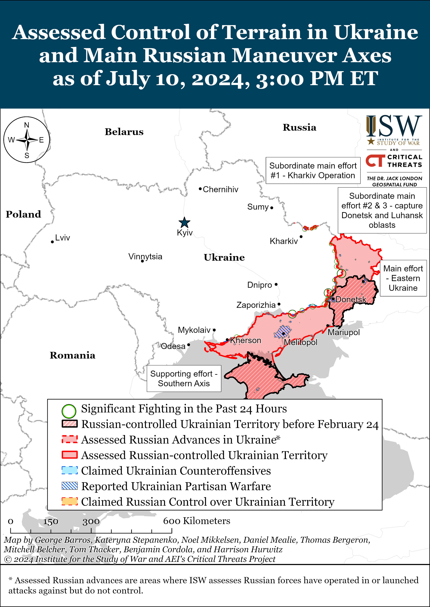
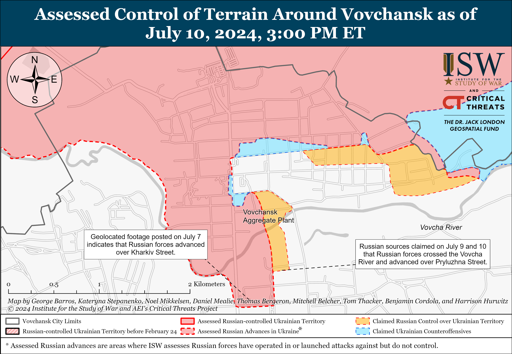
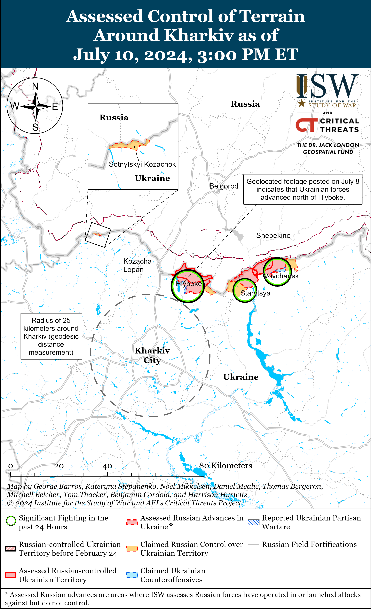
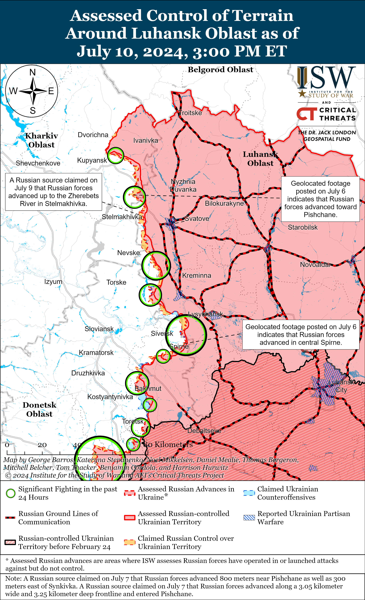
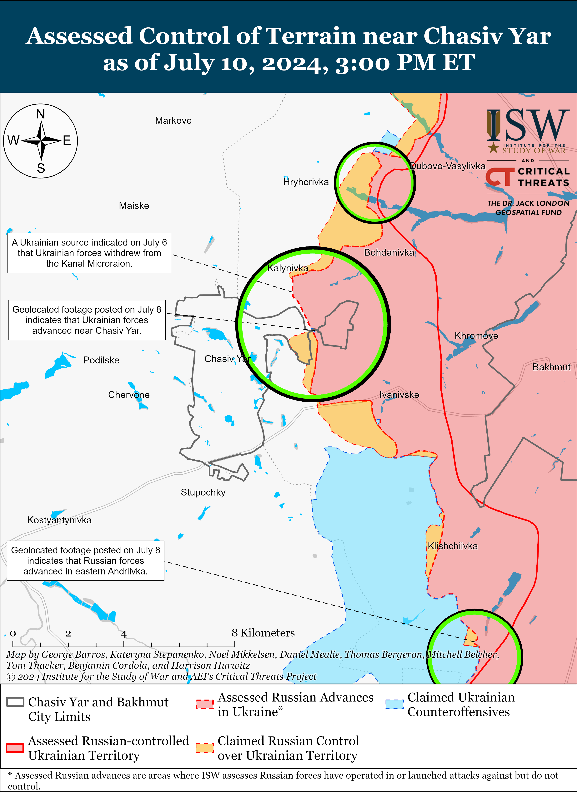
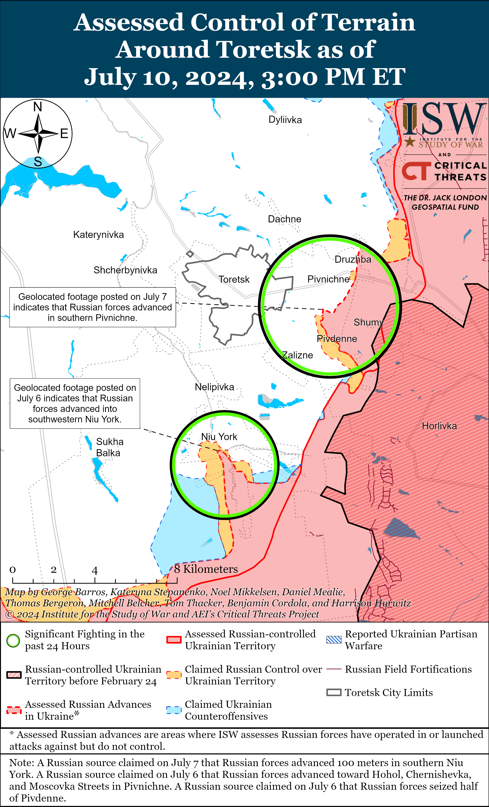
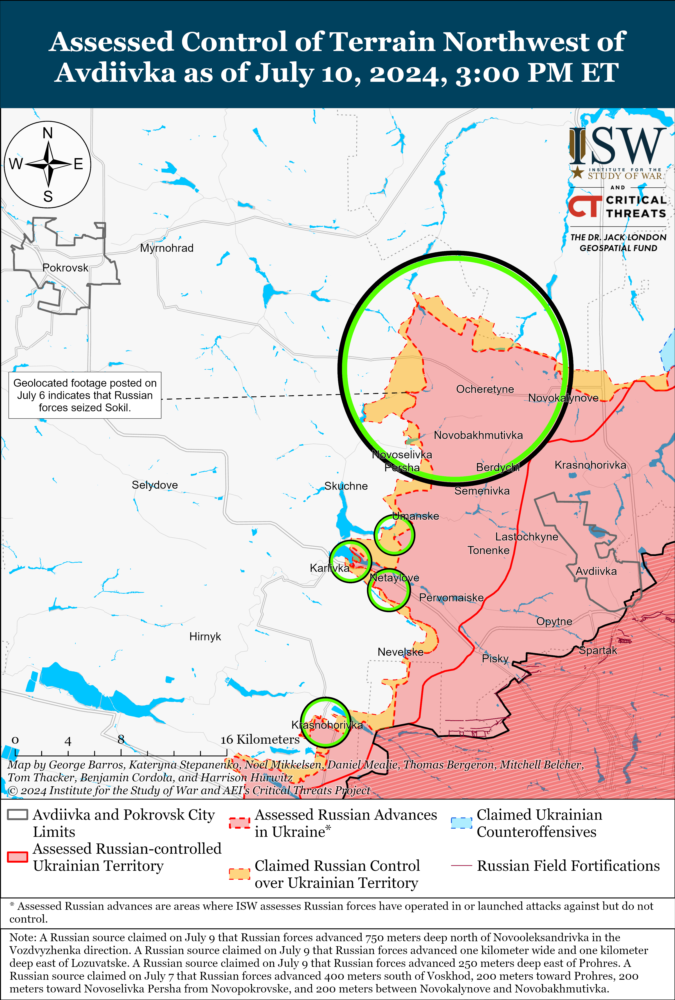
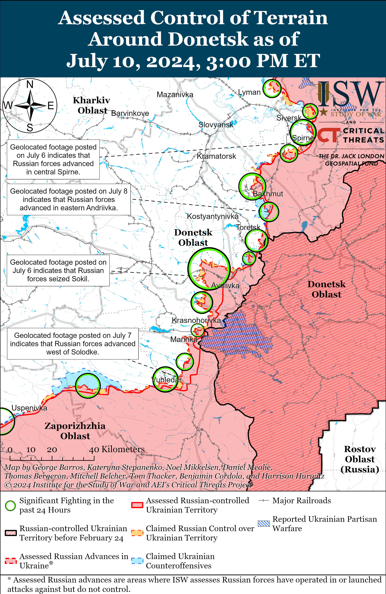
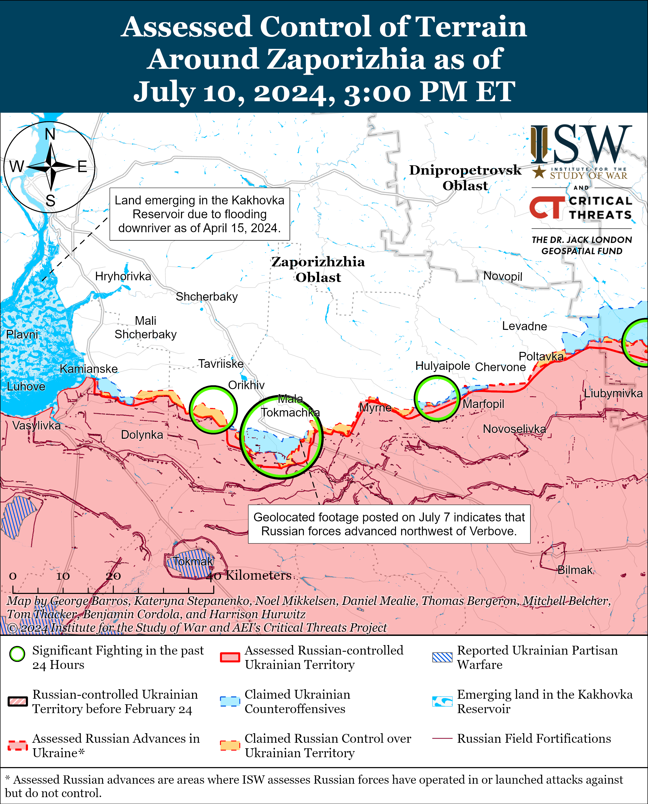
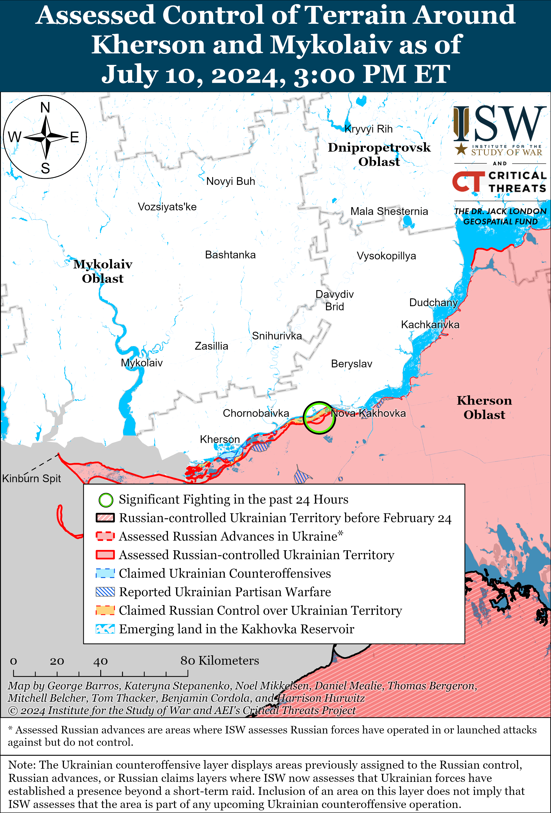

# Russian Offensive Campaign Assessment, July 10, 2024

**Riley Bailey, Nicole Wolkov, Kateryna Stepanenko, Karolina Hird and George Barros**

**July 10, 2024, 7:30pm ET**

**Click** [**here**](https://storymaps.arcgis.com/stories/36a7f6a6f5a9448496de641cf64bd375) **to see ISW’s interactive map of the Russian invasion of Ukraine. This map is updated daily alongside the static maps present in this report.**

**Click** [**here**](https://understandingwar.maps.arcgis.com/apps/instant/3dviewer/index.html?appid=1602762dbcde419bb957dea358449580) **to see ISW’s 3D control of terrain topographic map of Ukraine. Use of a computer (not a mobile device) is strongly recommended for using this data-heavy tool.**

**Click** [**here**](https://storymaps.arcgis.com/stories/733fe90805894bfc8562d90b106aa895) **to access ISW’s archive of interactive time-lapse maps of the Russian invasion of Ukraine. These maps complement the static control-of-terrain map that ISW produces daily by showing a dynamic frontline. ISW will update this time-lapse map archive monthly.**

**Note: The data cut-off for this product was 1:30pm ET on July 10. ISW will cover subsequent reports in the July 11 Russian Offensive Campaign Assessment.**

**Ukrainian First Deputy Defense Minister Lieutenant General Ivan Havrylyuk stressed that robust Western security assistance will be crucial for Ukraine’s ability to contest and seize the battlefield initiative. Havrylyuk also challenged the notion that Russian forces will be able to indefinitely sustain the consistent gradual creeping advances that support Russian President Vladimir Putin’s theory of victory for winning a war of attrition in Ukraine.** Havrylyuk published an article entitled “What Factors Will Allow Ukraine to Conduct a Counteroffensive” on July 9 wherein he states that Ukraine must contest the initiative and conduct counteroffensive operations in order to neutralize the Kremlin’s efforts to protract the war and to increase costs on Russia that will force it towards a just peace aligned with Ukraine’s terms.[1] Havrylyuk stated that Ukraine can contest the initiative if Ukraine strengthens combat brigades with personnel, ammunition, and equipment and specifically staffs and equips new brigades.[2] Havrylyuk also noted that it will be critical for Ukraine to create and consistently replenish reserves and sufficiently train new personnel.[3] Havrylyuk emphasized that Western security assistance will be critically important in determining at what scale Ukraine can achieve these tasks and called for more air defense systems, artillery shells, and long-range strike capabilities to strengthen Ukrainian combat effectiveness and operational capabilities.[4] Ukraine is addressing its manpower challenges and is already forming several new brigades, but Ukraine’s ability to equip these brigades will be the determining factor for how, when, and at what scale Ukraine can commit new brigades to support potential counteroffensive operations.[5] Current reporting suggests that Ukraine will not be able to fully equip all new planned brigades without the arrival of additional Western security assistance.[6] Western security assistance that provides Ukrainian forces with the necessary equipment and weapons at the scale, timing, and regularity required for operations that liberate significant swaths of occupied Ukraine remains the only likely path for reducing Putin’s current commitment to destroying Ukrainian statehood and identity.[7]

**Ukrainian forces are already attempting to contest the battlefield initiative in limited and localized counterattacks at the tactical level — emphasizing that the current state of grinding positional warfare along the frontline is not an indefinitely stable one.** The arrival of Western-provided aid to the frontlines has allowed Ukrainian forces to stabilize critical areas of the front, and Ukrainian forces have conducted tactically significant and successful localized counterattacks in northern Kharkiv Oblast and towards Kreminna (in the Donetsk-Luhansk Oblast border area) starting in mid-May 2024.[8] Ukrainian forces are not yet conducting counterattacks at the scale necessary to seize the battlefield initiative, but these tactical Ukrainian counterattacks are increasing the costs imposed on Russian forces for continuing to pursue their slow, grinding theory of advance. For example, Ukrainian counterattacks in northern Kharkiv Oblast have forced Russian troops to redeploy select Russian elements away from where their centralized command formation should hypothetically be — ISW observed that Russia moved elements of the 810th Naval Infantry Brigade (Black Sea Fleet) and a battalion tactical group of the 9th Motorized Rifle Brigade (1st Donetsk People’s Republic Army Corps) to northern Kharkiv Oblast in mid-June while other elements of the 810th Infantry and 9th Motorized Rifle brigades remained near Krynky, Kherson Oblast, and Toretsk, Donetsk Oblast respectively, where they had been fighting for some time.[9] ISW also recently assessed that the Russian military command was separating and deploying elements of Russian Airborne (VDV) formations across the frontline — elements of the 106th VDV Division’s 137th VDV Regiment are reportedly fighting in Kherson Oblast, while other elements of the regiment are fighting near Siversk, Donetsk Oblast.[10] The disparate deployment of elements of the same wider formation is a strong indicator that Russian forces are beginning to feel the pressure of Ukrainian counterattacks — emphasizing that the frontline is not as static as Putin assesses it to be. Ukraine’s ability to launch more powerful and organized counterattacks, however, continues to be contingent on sustained Western military support.

**Havrylyuk assessed that Russia will face medium- to long-term economic and equipment challenges that will impede the Russian military’s ability to indefinitely retain the theater-wide initiative, sustain consistent offensive pressure that results in gradual creeping advances, and win a war of attrition.** Havrylyuk stated that Russian forces still retain a significant artillery, armored vehicle, and manpower advantage over Ukrainian forces and that Ukraine lacks effective countermeasures to degrade the Russian aviation capabilities that are facilitating Russian tactical advances.[11] Havrylyuk stated that Russian forces are leveraging these advantages and the theater-wide initiative to intensify and sustain the tempo of their offensive operations in order to exhaust Ukrainian forces and prevent Ukraine from accumulating the manpower and materiel needed to contest the initiative.[12] Havrylyuk assessed that Russian forces will not make significant advances in the future but that the current positional warfare suits the Kremlin’s attempt to protract the war and convince the West that Ukraine’s victory is impossible.[13] Havrylyuk’s assessment is consistent with ISW’s assessment about Putin’s strategic calculus, his desire to protract the war, and his attempts to convince the West to abandon Ukraine.[14] Putin and the Russian military command likely view the retention of the initiative as a strategic priority and assess that Ukraine will be unable to conduct any operationally significant counteroffensive operations as long as Russia maintains consistent offensive pressure against Ukraine.[15]

Havrylyuk challenged Russia’s prospects for indefinitely maintaining that offensive pressure, however, suggesting that Russia has reached a limit for mobilizing its defense industrial base (DIB) in support of the war effort.[16] Russia will likely face human capital and supply chain constraints in the medium-term that will prevent the Kremlin from gradually mobilizing Russia’s DIB as it has done so far, presenting Putin with more politically fraught economic choices should he deem further economic mobilization necessary.[17] Havrylyuk stated that Russia is not producing enough to cover its current military equipment losses in Ukraine, increasingly relying on dwindling stockpiles of mainly Soviet-era equipment and becoming more dependent on foreign partners for military materiel.[18] Russia has extensively relied on the refurbishment of Soviet-era equipment to expand defense outputs, and growing constraints on available combat-ready equipment will pose challenges for sustaining Russian operations in Ukraine in the medium- to long-term.[19] Ukrainian forces that have accumulated the manpower and materiel needed for operationally significant counteroffensive operations can exploit disruptions that even temporary Russian equipment constraints cause to contest and seize the battlefield initiative.[20] Havrylyuk assessed that Russian forces will face fewer manpower challenges, although even Russia’s current ability to generate as many new personnel as battlefield losses leads to culminations – periods of temporary regrouping and reconstitution and lower offensive tempo — which will provide opportunities for sufficiently prepared Ukrainian forces to contest and seize the battlefield initiative.[21]

**Putin’s articulated theory of a slow, grinding victory in Ukraine is notably premised on accepting continuously high casualty rates, as exemplified by reported Russian losses accrued during two recent offensive efforts.** In his July 9 article, Havrylyuk claimed that Russian forces suffered 5,000 casualties for just one district of Chasiv Yar, likely referring to Kanal Microraion (the only neighborhood of easternmost Chasiv Yar that Russian forces currently control).[22] Kanal Microraion is around three blocks wide and three blocks long, and the loss of 5,000 personnel for such a small piece of territory is indicative of the highly attritional way in which Russian forces are conducting their offensive operations. Ukrainian Kharkiv Group of Forces Chief-of-Staff Viktor Solimchuk similarly reported on July 10 that Russian forces lost (killed, wounded, or captured) 91 percent of the personnel they committed to fighting (reportedly amounting to roughly a division‘s worth of personnel) in northern Kharkiv Oblast at the start of the Kharkiv Oblast offensive in early May 2024.[23] Solimchuk also noted that Russian offensive efforts in Vovchansk, Kharkiv Oblast, have severely weakened the 138th Motorized Rifle Brigade (6th Combined Arms Army, Leningrad Military District).[24] Ukrainian and Western sources recently reported that the 83rd Airborne (VDV) Brigade suffered such devastating losses in Kharkiv Oblast that it is no longer combat-effective.[25] ISW cannot independently verify either Ukrainian or Western estimates of Russian casualties, but the recent increase in reports of entire Russian units becoming combat ineffective due to losses highlights the tactics on which Russian forces are relying on to pursue Putin’s theory of a slow, gradual, grinding victory in Ukraine.

**NATO allies reaffirmed their commitment to supporting Ukraine and announced new security assistance packages for the Ukrainian war effort at the NATO summit in Washington, DC on July 9 and 10.** NATO Secretary General Jens Stoltenberg stated that he expects NATO allies to agree on a substantial package for Ukraine which includes establishing a NATO command center in Weisbaden, Germany to facilitate the training of Ukrainian personnel and the delivery of security assistance, establishing a new joint training center in Bydgoszcz, Poland, a long-term pledge of continued support for Ukraine, new announcements of provisions of air defense systems and F-16 fighter jets, and bilateral security agreements between NATO allies and Ukraine.[26] Stoltenberg noted that these pledges will constitute a “strong bridge” for possible, future Ukrainian NATO membership. US President Joe Biden, Dutch Prime Minister Dick Schoof, German Chancellor Olaf Scholz, Italian Prime Minister Giorgia Meloni, Romanian President Klaus Iohannis, and Ukrainian President Volodymyr Zelensky issued a joint statement on July 9 pledging to provide five additional Patriot air defense systems to Ukraine.[27] The joint statement notes that the US and its partners, including Canada, Norway, Spain, and the United Kingdom, intend to provide Ukraine with “dozens” of tactical air defense systems in the coming months. Biden, Schoof, and Danish Prime Minister Mette Fredriksen issued a joint statement on July 10 noting that the Netherlands and Denmark are in the process of transferring F-16 fighter jets to Ukraine and that Ukraine will start operating F-16s in the Summer of 2024.[28] Norwegian Prime Minister Jonas Gahr Store announced on July 10 that Norway will provide Ukraine with six F-16s starting at an unspecified date in 2024.[29] The Dutch Ministry of Defense (MoD) stated on July 10 that the Netherlands will allocate an additional 300 million euros (about $325 million) to purchase ammunition for F-16s.[30] The new United Kingdom (UK) Prime Minister, Keir Starmer, reaffirmed on July 9 that he would continue the UK’s policy of allowing Ukrainian forces to strike military targets in Russian territory with UK-provided Storm Shadow missiles.[31]

**Russian Security Council Deputy Chairperson Dmitry Medvedev reaffirmed that Russia would not accept or uphold any negotiated peace settlements with Kyiv short of Ukrainian capitulation, the destruction of the entire Ukrainian state, and the full occupation of Ukraine.** Medvedev stated on July 10 that even if Kyiv agrees to Russian President Vladimir Putin’s most recent conditions for peace — namely recognizing Russia’s territorial claims over eastern and southern Ukraine, including territory that Russia does not currently occupy, and pledging not to join NATO — and signs documents resulting in Ukrainian surrender, these actions will not constitute the “end of the Russian military operation” in Ukraine.[32] Medvedev stated that even if Ukraine surrenders, Russia will eventually still need to destroy the remaining Ukrainian “radicals” and return “remaining [Ukrainian] lands to the bosom of the Russian land.” Medvedev also implied that Russian-Ukrainian negotiations will likely take place only after there is a radical change within the Ukrainian government and that this can only occur after Ukrainian society stages a “third bloody Maidan” revolution in response to a ceasefire agreement and Ukraine’s willingness to abandon prospects for NATO accession. Medvedev insinuated that the Kremlin plans to continue its conquest of Ukraine following a negotiated peace agreement. Medvedev’s argumentation also indicates that the Kremlin believes that the full conquest of Ukraine will be easier if Kyiv accepts deeply unpopular ceasefire agreements and concessions at the current stage of the war, in anticipation that Ukrainian society would demand a government change that could benefit the Kremlin. The Kremlin has misread domestic Ukrainian sentiment before, however. Ukrainian officials have long warned that the Kremlin launched an elaborate “Maidan 3” information campaign, which aims to undermine the Ukrainian government likely in order to trigger a government change and establish a pro-Kremlin government in Ukraine.[33]

**Servicemembers of a Russian motorized rifle regiment that was previously implicated in the execution of Ukrainian prisoners of war (POWs) in late May 2024 reportedly executed two Ukrainian POWs in the same area in western Zaporizhia Oblast in June 2024.** Ukrainian social media sources amplified footage on July 10 showing Russian servicemembers shooting two Ukrainian POWs in the Zaporizhia direction and identified the perpetrators as servicemembers of the Russian 70th Motorized Rifle Regiment (42nd Motorized Rifle Division, 58th Combined Arms Army [CAA], Southern Military District [SMD]).[34] Ukrainian Prosecutor General Andriy Kostin stated on July 10 that the video clearly showed Ukrainian personnel laying down their arms and cooperating with Russian orders and noted that the investigation found that the incident took place near Robotyne in June 2024.[35] The execution of POWs is a violation of the Geneva Convention on POWs.[36] Ukraine’s Main Military Intelligence Directorate (GUR) previously identified four servicemembers of the Russian 70th Motorized Rifle Regiment who executed Ukrainian POWs near Robotyne in late May 2024.[37] ISW assessed on June 19 that the Russian military command endorses a culture of permissiveness towards war crimes perpetrated by subordinates throughout the theater in Ukraine, especially in Donetsk and Zaporizhia oblasts.[38] ISW also assessed that individual tactical-level commanders are likely enabling their subordinates to commit such atrocities given the pervasiveness and recurrence of these war crimes across different operational commands. The fact that the same military unit has continued to commit these crimes also suggests that the Russian high command is failing to properly discipline troops and maintain order.

**Select US military bases in Europe have instituted increased alert levels in response to intensified Russian sabotage and hybrid operations against NATO allies over the past several months.** CNNreported on July 9, citing multiple sources familiar with the matter, that the US recently implemented additional safety protocols and raised the state of alert at US military bases in Europe after receiving intelligence that Russian-backed actors may be planning sabotage attacks against US facilities and personnel.[39] CNN’ssources stated that several US military bases in Europe raised their alert level to “Force Protection Condition Charlie,” which applies “when an incident occurs, or intelligence is received indicating some form of terrorist action or targeting against personnel or facilities is likely.”[40] NATO Secretary General Jens Stoltenberg confirmed on July 10 that the US has increased its alert levels for some US bases in Europe and noted that Russian sabotage attempts and other malign acts against NATO allies are part of a campaign to intimidate NATO countries that support Ukraine.[41] Stoltenberg stated that NATO is increasing its awareness, intelligence sharing, and cyber defenses to combat increased Russian hybrid threats. The *Washington Post* reported on July 10, citing Kremlin documents obtained by an unspecified European intelligence service, that Russia is identifying individuals and recruiting sympathizers through social media to stage sabotage operations in Europe.[42] The Kremlin documents show that Kremlin political strategists in July 2023 analyzed the Facebook profiles of over 1,200 people who they believed were workers of the two large German plants and highlighted posts demonstrating an anti-government, anti-immigration, and anti-Ukraine position. Unspecified Western officials noted that Russia is increasingly working through proxies, including via internet recruits, which offers some deniability while maximizing the pool of potential recruits. Lithuanian Foreign Minister Gabrielius Landsbergis noted that individuals recruited online for Russian sabotage operations may not have a Russian handler in a NATO country.[43]

**Key Takeaways:**

- **Ukrainian First Deputy Defense Minister Lieutenant General Ivan Havrylyuk stressed that robust Western security assistance will be crucial for Ukraine’s ability to contest and seize the battlefield initiative. Havrylyuk also challenged the notion that Russian forces will be able to indefinitely sustain the consistent gradual creeping advances that support Russian President Vladimir Putin’s theory of victory for winning a war of attrition in Ukraine.**
- **Ukrainian forces are already attempting to contest the battlefield initiative in limited and localized counterattacks at the tactical level — emphasizing that the current state of grinding positional warfare along the frontline is not an indefinitely stable one.**
- **Havrylyuk assessed that Russia will face medium- to long-term economic and equipment challenges that will impede the Russian military’s ability to indefinitely retain the theater-wide initiative, sustain consistent offensive pressure that results in gradual creeping advances, and win a war of attrition.**
- **Putin’s articulated theory of a slow, grinding victory in Ukraine is notably premised on accepting continuously high casualty rates, as exemplified by reported Russian losses accrued during two recent offensive efforts.**
- **NATO allies reaffirmed their commitment to supporting Ukraine and announced new security assistance packages for the Ukrainian war effort at the NATO summit in Washington, DC on July 9 and 10.**
- **Russian Security Council Deputy Chairperson Dmitry Medvedev reaffirmed that Russia would not accept or uphold any negotiated peace settlements with Kyiv short of Ukrainian capitulation, the destruction of the entire Ukrainian state, and the full occupation of Ukraine.**
- **Servicemembers of a Russian motorized rifle regiment that was previously implicated in the execution of Ukrainian prisoners of war (POWs) in late May 2024 reportedly executed two Ukrainian POWs in the same area in western Zaporizhia Oblast in June 2024.**
- **Select US military bases in Europe have instituted increased alert levels in response to intensified Russian sabotage and hybrid operations against NATO allies over the past several months.**
- **Russian forces recently advanced in Vovchansk, near Kreminna, and near Toretsk.**
- **The Russian Ministry of Defense (MoD) claimed on July 10 that the Russian military trained the first batch of Moscow Military District (MMD) counter-drone instructors at the Alabino training ground in Moscow Oblast.**

****

***We do not report in detail on Russian war crimes because these activities are well-covered in Western media and do not directly affect the military operations we are assessing and forecasting. We will continue to evaluate and report on the effects of these criminal activities on the Ukrainian military and the Ukrainian population and specifically on combat in Ukrainian urban areas. We utterly condemn Russian violations of the laws of armed conflict and the Geneva Conventions and crimes against humanity even though we do not describe them in these reports.***

- Russian Main Effort – Eastern Ukraine (comprised of three subordinate main efforts)
- Russian Subordinate Main Effort #1 – Push Ukrainian forces back from the international border with Belgorod Oblast and approach to within tube artillery range of Kharkiv City
- Russian Subordinate Main Effort #2 – Capture the remainder of Luhansk Oblast and push westward into eastern Kharkiv Oblast and encircle northern Donetsk Oblast
- Russian Subordinate Main Effort #3 – Capture the entirety of Donetsk Oblast
- Russian Supporting Effort – Southern Axis
- Russian Air, Missile, and Drone Campaign
- Russian Mobilization and Force Generation Efforts
- Russian Technological Adaptations
- Activities in Russian-occupied areas
- Ukrainian Defense Industrial Base Efforts
- Russian Information Operations and Narratives
- Significant Activity in Belarus

**Russian Main Effort – Eastern Ukraine**

**Russian Subordinate Main Effort #1 – Kharkiv Oblast** **(Russian objective: Push Ukrainian forces back from the international border with Belgorod Oblast and approach to within tube artillery range of Kharkiv City)**

Russian forces recently crossed the Vovcha River into central Vovchansk amid continued fighting north and northeast of Kharkiv City on July 10. Geolocated footage published on July 7 shows that Russian forces crossed the Vovcha River and hold positions on Kharkiv Street in central Vovchansk.[44] Russian milbloggers similarly claimed that Russian forces crossed the Vovcha River and advanced along Soborna and Pryluzhna streets in central Vovchansk, although ISW has not observed confirmation of Russian forces on the latter two streets.[45] Another Russian milblogger claimed that heavy fighting continued near high rise buildings in central Vovchansk on the northern side of the Vovcha River.[46] A Russian milblogger claimed that small Ukrainian groups are operating near and north of Hlyboke (north of Kharkiv City) and that there are small arms battles in the area.[47] Fighting also occurred near Lyptsi (north of Kharkiv City) and Starytsya (northeast of Kharkiv City) on July 9 and 10.[48]

Ukrainian officials reported that Russian forces are attempting to sustain offensive operations in the Kharkiv direction despite heavy losses and a lack of progress. Ukrainian President Volodymyr Zelensky stated on July 9 that Ukrainian forces stopped the Russian offensive operation in Kharkiv Oblast in May and June and partially credited the US government for its recent permission for Ukraine to strike some military targets within Russia with US-provided weapons.[49] Ukrainian Kharkiv Group of Forces Chief of Staff Colonel Viktor Solimchuk stated that Russian forces are still attempting to create a “buffer zone” to conduct artillery strikes on Kharkiv City but that heavy Russian losses are complicating Russia’s ability to intensify offensive operations in the area.[50] Solimchuk stated that Russian forces are specifically concentrating on battles within Vovchansk and intensifying offensive operations in the direction of Lyptsi and Starytsya.[51] Solimchuk added that Russian forces in the area still have significant offensive potential and are currently regrouping, replenishing degraded forces, improving logistics, and training assault groups in the rear.[52] Solimchuk and Ukrainian Kharkiv Group of Forces Colonel Yuriy Povkh stated that Russian forces will continue efforts to probe Ukrainian defense elsewhere along the international border in northeastern Ukraine in an effort to fix Ukrainian forces along a wider front.[53] Povkh added that Russian forces are transferring additional engineering equipment to northern Kharkiv Oblast to construct and expand fortifications at recently seized positions and ISW has collected satellite imagery showing new Russian field fortifications in recently Russian-seized territories in northern Kharkiv Oblast.[54] Povkh and Solimchuk noted that Ukrainian forces lack the necessary air defense assets in the Kharkiv direction to sufficiently defend against the Russian aviation threat and that Russian forces launched almost 1,700 glide bombs in the Kharkiv direction between May 10 and July 8.[55]

**Russian Subordinate Main Effort #2 – Luhansk Oblast** **(Russian objective: Capture the remainder of Luhansk Oblast and push westward into eastern Kharkiv Oblast and northern Donetsk Oblast)**

Russian forces recently marginally advanced northwest of Kreminna amid continued Russian ground attacks along the Kupyansk-Svatove-Kreminna line on July 10. Geolocated footage published on July 10 indicates that Russian forces recently marginally advanced south of Novovodyane (northeast of Kreminna).[56] A Russian milblogger claimed that Russian forces marginally advanced northeast of Stelmakhivka (southeast of Kupyansk) and Dzherelne (west of Svatove), although ISW has not observed visual evidence of these claims.[57] Fighting continued northeast of Kupyansk near Synkivka; southeast of Kupyansk near Berestove and Pishchane; west of Svatove near Andriivka; northwest of Kreminna near Hrekivka, Nevske, Makiivka, and Terny on July 9 and 10.[58] Ukrainian military observer Kostyantyn Mashovets stated that elements of the 1st and 2nd motorized rifle regiments (2nd Motorized Rifle Division, 1st Guards Tank Army [GTA], Moscow Military District [MMD]) are attacking near Berestove, Krokhmalne, and Pishchane (all southeast of Kupyansk).[59] Mashovets stated that elements of the Russian 47th Tank Division (1st GTA, MMD) are operating in the Ivanivka-Stepova Novoselivka-Kyslivka-Kotlyarivka area (southeast of Kupyansk). Mashovets also assessed that elements of the 12th Tank Regiment and 423rd Motorized Rifle Regiment (4th Tank Division, 1st GTA, MMD) and elements of the 7th Motorized Rifle Regiment (11th Army Corps, Leningrad Military District [LMD]) are likely operating direction of Synkivka-Petropavlivka (northeast of Kupyansk).

**Russian Subordinate Main Effort #3 – Donetsk Oblast** **(Russian objective: Capture the entirety of Donetsk Oblast, the claimed territory of Russia’s proxies in Donbas)**

Russian forces conducted limited ground attacks northeast of Siversk near Bilohorivka; east of Siversk near Verkhnokamyanske; southeast of Siversk near Vyimka and Spirne; and south of Siversk near Rozdolivka on July 10 but did not make any confirmed advances.[60]

Russian forces continued offensive operations in the Chasiv Yar direction on July 10 but did not make any confirmed advances. Russian milbloggers claimed that Russian forces are advancing in forest areas north and east of Chasiv Yar and consolidating positions in the ruins of Kanal Microraion (easternmost Chasiv Yar).[61] The Ukrainian General Staff reported that Russian forces attacked north of Chasiv Yar near Hryhorivka; east of Chasiv Yar near Ivanivske; and southeast of Chasiv Yar near Andriivka.[62] Elements of the 78th Chechen “Sever-Akhmat” Motorized Rifle Regiment (42nd Motorized Rifle Division, 58th Combined Arms Army [CAA], Southern Military District [SMD]) and 215th Separate Reconnaissance Battalion (98th Airborne [VDV] Division) are reportedly operating near Ivanivske and Chasiv Yar, respectively.[63]

Russian forces recently advanced in the Toretsk direction. Geolocated footage published on July 10 shows that Russian forces advanced southwards towards the northern outskirts of Pivdenne (southeast of Toretsk).[64] Several Russian milbloggers claimed that Russian forces have made gains within southern Niu-York (southwest of Toretsk), although ISW has not yet observed visual evidence of these claims.[65] A Ukrainian soldier reportedly operating near Toretsk stated on July 9 that Russian forces launch three-to-four guided glide bombs against Ukrainian positions in Toretsk every 30 minutes.[66] The Ukrainian General Staff reported fighting near Toretsk, Niu-York, Yurivka (south of Niu-York), Pivdenne, and Pivnichne (southeast of Torestk).[67] Ukrainian military observer Kostyantyn Mashovets stated that elements of the 132nd Motorized Rifle Brigade (1st Donetsk People’s Republic Army Corps [DNR AC]) are fighting near Niu-York while elements of the 506th and 589th motorized rifle regiments (27th Motorized Rifle Division, 2nd CAA, Central Military District [CMD]) are operating in the Shumy-Pivdenne area (southeast of Toretsk).[68]

Russian forces continued offensive operations west of Avdiivka on July 10 and reportedly advanced in some areas. Ukrainian Khortytsia Group of Forces Spokesperson Lieutenant Colonel Nazar Voloshyn refuted recent Russian claims that Russian forces have seized Yasnobrodivka (west of Avdiivka), although some Russian milbloggers continue to claim that Russian forces control Yasnobrodivka and are advancing west towards the Karlivske Reservoir.[69] Russian milbloggers also claimed that Russian forces advanced westward along the S-050918 highway in Yevhenivka and near Novooleksandrivka, Vozdvyzhenka, Novoselivka Persha (all northwest of Avdiivka) and along the southern banks of the Karlivske Reservoir near Karlivka and Netaylove (southwest of Avdiivka).[70] One milblogger claimed that Russian forces are close to encircling Novoselivka Persha, but that it ultimately does not matter because the settlement is so small that it has no wider value to Russian forces.[71] The Ukrainian General Staff reported continued fighting north of Avdiivka near Kalynove; northwest of Avdiivka near Vozdvyzhenka, Novooleksandrivka, Yevhenivka, Novoselivka Persha, and Prohres; and southwest of Avdiivka near Netaylove and Karlivka.[72]

Russian forces reportedly advanced west and southwest of Donetsk City on July 10 amid continued offensive operations in this area. A Russian milblogger claimed that Russian forces advanced between Slovyansk and Chekhov streets in central Krasnohorivka (west of Donetsk City), and another milblogger claimed that Russian forces are continuing to advance within the urban sector of Krasnohorivka.[73] One Russian milblogger complained that Russian forces west of Donetsk City have poor inter-unit communication, claiming that in one instance a unit of the 1st DNR AC accidentally tried to shoot down a quadcopter belonging to elements of its neighboring formation, the 150th Motorized Rifle Division (8th CAA, SMD).[74] Russian and Ukrainian sources reported continued fighting west of Donetsk City near Krasnohorivka and Heorhiivka and southwest of Donetsk City near Paraskoviivka and Kostyantynivka.[75]

Russian forces continued limited ground attacks in the Donetsk-Zaporizhia Oblast border area near Urozhaine and Makarivka (both south of Velyka Novosilka) on July 10 but did not advance.[76] Ukrainian Mariupol Mayoral Advisor Petro Andryushchenko reported that Russian forces moved 21 covered military trucks from Zaporizhia Oblast towards Volnovakha (about 55 kilometers southeast of Velyka Novosilka).[77]

**Russian Supporting Effort – Southern Axis** **(Russian objective: Maintain frontline positions and secure rear areas against Ukrainian strikes)**

The Ukrainian General Staff reported that Russian forces attacked in the Hulyaipole direction on July 9 and 10.[78] Russian forces conducted heavy glide bomb strikes near Chumatske (south of Hulyaipole) on July 9, potentially in preparation for ground attacks.[79] Elements of the Russian 38th Guards Motorized Rifle Brigade (35th Combined Arms Army [CAA], Eastern Military District [EMD]) are operating in the Polohy direction (southwest of Hulyaipole).[80]

Positional engagements continued near Robotyne on July 9 and 10 and did not result in any changes on the frontline in western Zaporizhia Oblast. The Ukrainian General Staff reported that Russian forces attacked near Robotyne, Mala Tokmachka (northeast of Robotyne), and Novoandriivka (north of Robotyne) on July 9 and 10.[81] Russian sources claimed that positional battles continued north and northwest of Verbove, where Russian forces are reportedly continuing effort to consolidate on previously occupied lines.[82] A Russian milblogger claimed that an employee of the Russian Federal Security Service‘s (FSB) Department of Counterintelligence died in combat sometime between July 1 and 2 when fighting alongside the Russian 177th Naval Infantry Regiment (Caspian Flotilla) in the Zaporizhia direction.[83] The milblogger also implied that the deceased FSB counterintelligence operative “supervised” the Russian 177th Naval Infantry Regiment, likely meaning that the operative assumed an administrative role rather than a military command role. Elements of the Russian 56th Airborne (VDV) Regiment (7th VDV Division) are reportedly operating in the Orikhiv direction in western Zaporizhia Oblast.

Positional engagements continued in the east (left) bank of Kherson Oblast near Krynky and on the Dnipro River Delta islands on July 9 and 10.[84]

Satellite imagery collected between April 11 and July 8 and published on July 10 confirms that Ukrainian forces successfully destroyed a storage depot on Cape Fiolent (south of Sevastopol) on July 1, in which Russian forces allegedly stored either Shahed drones or ammunition.[85]

*Naval News* reported on July 10 that it observed the Russian Project 222870 support ship, which had been previously docked at its home port in Novorossiysk, Krasnodar Krai, docking at the Ochamchire port in Russian-controlled Abkhazia, Georgia on July 4 and 5.[86] *Naval News* reported that Russian FSB has a number of small patrol boats at the Ochamchire port, but that the arrival of the Project 222870 support ship marks the first observed significant ship at the port since Russian-backed Abkhazian President Aslan Bzhania announced on October 5, 2023, that Russia and Abkhazia signed an agreement for the construction of a permanent Russian naval base near Ochamchire.[87] ISW assessed in December 2023 that the Russian military likely intended to develop the existing port into a secondary rather than main base since the surrounding terrain largely consists of sandy beaches unsuitable for the construction of naval infrastructure.[88] ISW also assessed that successful Ukrainian strikes on Russian Black Sea Fleet assets have changed Russian naval operating patterns and are forcing Russia to set conditions for a more permanent basing pattern along the eastern Black Sea coast.[89]

**Russian Air, Missile, and Drone Campaign** **(Russian Objective: Target Ukrainian military and civilian infrastructure in the rear and on the frontline)**

Russian forces conducted drone and missile strikes against Ukraine on the night of July 9 to 10 and a missile strike against Mykolaiv Oblast during the day on July 10. The Ukrainian Air Force reported that Russian forces launched one Iskander-M ballistic missile, four Kh-59/69 cruise missiles, and 20 Shahed-136/131 drones at Ukraine overnight on July 9 to 10.[90] The Ukrainian Air Force reported that Ukrainian forces shot down 14 Shahed drones over Odesa, Mykolaiv, Kherson, Dnipropetrovsk, Khmelnytskyi, Cherkassy, Vinnytsia, and Rivne oblasts and prevented three Kh-59/69 missiles and three Shahed drones from reaching their target via unspecified means. Ukrainian authorities reported that missile debris damaged port infrastructure, killed two, and wounded one near Odesa’s port.[91] Ukrainian state electricity transmission operator Ukrenergo and the Rivne Oblast Military Administration reported that Russian drones struck energy infrastructure in Rivne Oblast causing power outages in half of the region.[92] Mykolaiv Oblast Military Administration Head Vitaliy Kim stated that a Russian missile of unspecified type struck civilian infrastructure Voznesensk, killing one and wounding eight.[93]

**Russian Mobilization and Force Generation Efforts** **(Russian objective: Expand combat power without conducting general mobilization)**

The Russian Ministry of Defense (MoD) claimed on July 10 that the Russian military trained the first batch of Moscow Military District (MMD) counter-drone instructors at the Alabino training ground in Moscow Oblast.[94] The Russian MoD added that these instructors will later deploy to the rear areas of the combat zone to train elements of the Western Group of Forces (GoF) to defend themselves against Ukrainian drones. A Russian instructor also published a detailed guide for Russian servicemen to protect themselves from Ukrainian “Baba Yaga” drone attacks.[95] The instructor claimed that Russian forces need thermal imaging, common sense, and the ability to shoot to counter the “Baba Yaga” drones, given that these drones only operate at night.[96] Russian officials also held the “Archipelago 2024” event in Yuzhno-Sakhalinsk, Sakhalin Oblast on July 10, showcasing the Russian drone industry and testing over 30 types of Russian equipment for detecting and defending against drones to an audience of 4,500 participants from 78 regions.[97]

**Russian Technological Adaptations** **(Russian objective: Introduce technological innovations to optimize systems for use in Ukraine)**

The *Financial Times* (FT) reported on July 10 that Russia continues to produce Kh-101 cruise missiles using US and Western electronics and technology.[98] FT reported that Ukrainian analysis of a Kh-101 that Russia fired in January 2024 contained 16 pieces of Western-made electronic components including some made by US companies. An FTanalysis of Russian filings of an unspecified variety from 2023 revealed that Russian companies were able to purchase dual-use electronic goods for Kh-101 missiles on the open market and import them through the People’s Republic of China (PRC). FT noted that the Royal United Services Institute’s (RUSI) June 26 report, which detailed a significant increase in Russian military equipment and weapons production in 2023 and found that Russia produced only 56 Kh-101 missiles in 2021 versus 420 Kh-101 missiles in 2023 — an almost eightfold increase.[99] RUSI also reported, citing observed internal Russian Ministry of Defense (MoD) reports from 2023 about defense industrial production, that the Russian MoD assessed that Western sanctions have imposed a 30 percent price increase for critical microelectronic components used in military equipment and weapons.

Ukrainian and Western officials reportedly stated that Russian forces are adapting their electronic warfare (EW) capabilities, which is impacting the effectiveness of select Western-provided weapons on the battlefield. Unspecified Ukrainian military officials and commanders told the *Wall Street Journal* (WSJ) in a July 10 article that Russian EW capabilities have reduced the effectiveness of Western-provided M982 Excalibur munitions and HIMARS systems.[100] Ukrainian and Western officials also told WSJthat Russian EW capabilities have, in part, forced Ukraine to stop using Ground-Launched Small Diameter Bomb munitions. ISW previously observed reports that Russian forces have adapted EW capabilities to reduce the effect of Joint Direct Attack Munition-Extended Range (JDAM-ER) guided munitions.[101] ISW continues to assess that Russia and Ukraine are engaged in a technological offense-defense race as both sides aim to adapt to the other’s innovations.

A Russian milblogger and former Storm Z instructor claimed on July 9 that Russian use of the TOS-1A “Solntsepek” thermobaric artillery systems demonstrates that these systems could generate better results when employed in densely concentrated urban combat areas rather than in support of offensive operations against sparsely concentrated targets in rural areas.[102] The milblogger added that the TOS-1A system also lacks the necessary precision and long-range capabilities to support the reconnaissance-fire complex, except for targeting Ukrainian positions in the urban environments.

**Ukrainian Defense Industrial Efforts** **(Ukrainian objective: Develop its defense industrial base to become more self-sufficient in cooperation with US, European, and international partners)**

*ISW is not publishing coverage of Ukrainian defense industrial effort today.*

**Activities in Russian-occupied areas (Russian objective: Consolidate administrative control of annexed areas; forcibly integrate Ukrainian citizens into Russian sociocultural, economic, military, and governance systems)**

*ISW is not publishing coverage of activities in Russian-occupied areas.*

**Russian Information Operations and Narratives**

Russian actors are reportedly attempting to inflate the appearance of anti-government and anti-military sentiment within Ukraine. Russian opposition outlet *Vazhnye Istorii* reported on July 10 that Russian darknet sites are advertising contract sabotage jobs to burn Ukrainian military jeeps and other military vehicles in Ukraine for $1,500 to $2,000.[103] *Vazhnye Istorii* reported that the advertisements have prompted unspecified actors to burn Ukrainian military jeeps in Ukraine.[104] Russian state media and milbloggers have been widely amplifying reports of burned-down Ukrainian military jeeps starting late June 2024.[105]

Russian officials and Kremlin-affiliated sources continue efforts to portray Moldova as a threat to Russia. The Russian Federal Security Service (FSB) tangentially tied Moldova to an alleged Ukrainian plot to hijack a Russian Tu-22M3 strategic bomber on July 8 and accused Ukrainian special services of operating freely within Moldova.[106] A prominent Kremlin-affiliated milblogger used the FSB’s claims to portray Moldova as a staunch supporter of all Ukrainian interests.[107]

The Kremlin continues to threaten to destabilize new NATO members for perceived unfriendly actions. Russian Foreign Ministry Spokesperson Maria Zakharova announced on July 9 that Russia will take unspecified asymmetric actions against NATO member Montenegro in response to Montenegro’s bans on the broadcasting of 20 Russian TV and internet outlets from July 10.[108] The Kremlin previously attempted to facilitate a failed coup in Montenegro in 2016 in an effort to prevent Montenegro from joining NATO in 2017.[109]

**Significant activity in Belarus** **(Russian efforts to increase its military presence in Belarus and further integrate Belarus into Russian-favorable frameworks and Wagner Group activity in Belarus)**

Nothing significant to report.

**Note: ISW does not receive any classified material from any source, uses only publicly available information, and draws extensively on Russian, Ukrainian, and Western reporting and social media as well as commercially available satellite imagery and other geospatial data as the basis for these reports. References to all sources used are provided in the endnotes of each update.**

---

[1] https://nv dot ua/ukr/opinion/v-minoboroni-rozpovili-koli-zakinchitsya-viyna-v-ukrajini-50433590.html

[2] https://nv dot ua/ukr/opinion/v-minoboroni-rozpovili-koli-zakinchitsya-viyna-v-ukrajini-50433590.html

[3] https://nv dot ua/ukr/opinion/v-minoboroni-rozpovili-koli-zakinchitsya-viyna-v-ukrajini-50433590.html

[4] https://nv dot ua/ukr/opinion/v-minoboroni-rozpovili-koli-zakinchitsya-viyna-v-ukrajini-50433590.html

[5] https://isw.pub/UkrWar070324

[6] https://defence-ua.com/army\_and\_war/u\_zsu\_je\_mozhlivist\_navchati\_10\_brigad\_odnochasno\_ale\_skilki\_partneri\_majut\_peredati\_na\_nih\_ozbrojennja-13942.html ; https://expres.online/lyudi-i-problemi/zsu-formuyut-novi-viyskovi-brigadi-dlya-posilennya-pozitsiy-a-chi-bude-u-nikh-zbroya ; https://24tv.ua/zelenskiy-ramshtayni-zayaviv-shho-ukrayina-formuye-novi-brigadi\_n2543709 ; https://understandingwar.org/backgrounder/russian-offensive-campaign-assessment-july-3-2024

[7] https://isw.pub/UkrWar070324 ; https://understandingwar.org/backgrounder/russian-offensive-campaign-assessment-june-30-2024

[8] https://isw.pub/UkrWar070824; https://isw.pub/UkrWar063024; https://isw.pub/UkrWar062824; https://isw.pub/UkrWar052524; https://understandingwar.org/backgrounder/russian-offensive-campaign-assessment-may-15-2024

[9] https://understandingwar.org/backgrounder/russian-offensive-campaign-assessment-june-22-2024; https://understandingwar.org/backgrounder/russian-offensive-campaign-assessment-june-18-2024; https://understandingwar.org/backgrounder/russian-offensive-campaign-assessment-july-9-2024

[10] https://understandingwar.org/backgrounder/russian-offensive-campaign-assessment-june-30-2024

[11] https://nv dot ua/ukr/opinion/v-minoboroni-rozpovili-koli-zakinchitsya-viyna-v-ukrajini-50433590.html

[12] https://nv dot ua/ukr/opinion/v-minoboroni-rozpovili-koli-zakinchitsya-viyna-v-ukrajini-50433590.html

[13] https://nv dot ua/ukr/opinion/v-minoboroni-rozpovili-koli-zakinchitsya-viyna-v-ukrajini-50433590.html

[14] https://understandingwar.org/backgrounder/russian-offensive-campaign-assessment-june-7-2024 ; https://understandingwar.org/backgrounder/how-delays-western-aid-gave-russia-initiative-ukrainian-counteroffensive-kharkiv ; https://isw.pub/UkrWar063024

[15] https://understandingwar.org/backgrounder/russian-offensive-campaign-assessment-june-7-2024 ; https://understandingwar.org/backgrounder/how-delays-western-aid-gave-russia-initiative-ukrainian-counteroffensive-kharkiv ; https://isw.pub/UkrWar063024

[16] https://nv dot ua/ukr/opinion/v-minoboroni-rozpovili-koli-zakinchitsya-viyna-v-ukrajini-50433590.html

[17] https://understandingwar.org/backgrounder/russian-offensive-campaign-assessment-june-6-2024 ; https://isw.pub/UkrWar060724 ; https://understandingwar.org/backgrounder/russian-offensive-campaign-assessment-may-29-2024 ; https://isw.pub/UkrWar040424 ; https://isw.pub/UkrWar020224

[18] https://nv dot ua/ukr/opinion/v-minoboroni-rozpovili-koli-zakinchitsya-viyna-v-ukrajini-50433590.html

[19] https://www.wsj.com/world/russia-is-pumping-out-weapons but-can-it-keep-it-up-ba30bb04 ; https://isw.pub/UkrWar040524 ; https://understandingwar.org/backgrounder/russian-offensive-campaign-assessment-march-9-2024 ; https://understandingwar.org/backgrounder/russian-offensive-campaign-assessment-february-13-2024 ; https://understandingwar.org/backgrounder/russian-offensive-campaign-assessment-june-7-2024

[20] https://nv dot ua/ukr/opinion/v-minoboroni-rozpovili-koli-zakinchitsya-viyna-v-ukrajini-50433590.html

[21] https://understandingwar.org/backgrounder/how-delays-western-aid-gave-russia-initiative-ukrainian-counteroffensive-kharkiv

[22] https://nv dot ua/ukr/opinion/v-minoboroni-rozpovili-koli-zakinchitsya-viyna-v-ukrajini-50433590.html

[23] https://suspilne dot media/kharkiv/787383-vtrati-rosii-na-harkivskomu-napramku-skladaut-priblizno-91-za-dva-misaci-otu-harkiv/

[24] https://armyinform.com dot ua/2024/07/10/vtraty-voroga-za-dva-misyaczi-nastupu-na-harkivshhyni-sklaly-ponad-90-otu-harkiv/

[25] https://understandingwar.org/backgrounder/russian-offensive-campaign-assessment-june-28-2024; https://www.forbes.com/sites/davidaxe/2024/06/27/the-russians-may-have-lost-an-entire-airborne-brigade-in-vovchansk/

[26] https://www.nato.int/cps/en/natohq/opinions\_227400.htm ; https://www.defense.gov/News/News-Stories/Article/Article/3834424/nato-secretary-general-ukraine-aid-is-the-most-urgent-task-at-summit/

[27] https://www.whitehouse.gov/briefing-room/statements-releases/2024/07/09/joint-statement-on-strengthening-ukraines-air-defenses-by-u-s-president-joseph-r-biden-dutch-prime-minister-dick-schoof-german-chancellor-olaf-scholz-italian-prime-minister-giorgia-melon/

[28] https://www.whitehouse.gov/briefing-room/statements-releases/2024/07/10/joint-statement-on-f-16s-for-ukraine-from-u-s-president-joseph-r-biden-dutch-prime-minister-dick-schoof-and-danish-prime-minister-mette-frederiksen/

[29] https://abcnews.go.com/International/wireStory/nato-member-norway-donates-16-jets-ukraine-111808811; https://www.nrk dot no/trondelag/norge-donerer-seks-f-16-jagerfly-til-ukraina-1.16959722

[30] https://www.defensie dot nl/actueel/nieuws/2024/07/10/%E2%82%AC-300-miljoen-extra-om-voor-oekraine-bestemde-f-16s-te-bewapenen

[31] https://www.bloomberg.com/news/articles/2024-07-10/starmer-says-ukraine-can-use-uk-missiles-to-strike-inside-russia

[32] https://t.me/medvedev\_telegram/515

[33] https://understandingwar.org/backgrounder/russian-offensive-campaign-assessment-february-27-2024

[34] https://t.me/ssternenko/30936 ; https://x.com/666\_mancer/status/1811043244773437534; https://korrespondent dot net/ukraine/4700478-sotssety-rossyiane-ubyly-ukraynskykh-plennykh

[35] https://www.facebook.com/story.php?story\_fbid=448688324641450&id=100085008594406&mibextid=WC7FNe&rdid=ixs7M2gAKEqAdHTQ

[36] https://www.ohchr.org/en/instruments-mechanisms/instruments/geneva-convention-relative-treatment-prisoners-war

[37] https://understandingwar.org/backgrounder/russian-offensive-campaign-assessment-june-19-2024

[38] https://understandingwar.org/backgrounder/russian-offensive-campaign-assessment-june-19-2024

[39] https://www.nato.int/cps/en/natohq/opinions\_227400.htm

[40] https://www.cnn.com/2024/07/09/politics/intelligence-russian-sabotage-threat-us-bases-europe/index.html ; https://home.army.mil/greggadams/about/Garrison/directorate-plans-training-mobilization-security/fpcon

[41] https://www.nato.int/cps/en/natohq/opinions\_227400.htm

[42] https://www.washingtonpost.com/world/2024/07/10/russia-sabotage-europe-ukraine/

[43] https://www.washingtonpost.com/world/2024/07/10/russia-sabotage-europe-ukraine/

[44] https://t.me/WarArchive\_ua/17048 ; https://www.facebook.com/watch/?v=760735172926152

[45] https://t.me/motopatriot/24656 ; https://t.me/boris\_rozhin/129586

[46] https://t.me/dva\_majors/47011 ;

[47] https://t.me/motopatriot/24664

[48] https://www.facebook.com/GeneralStaff.ua/posts/pfbid0cuonpdyEmjtmm23sreeL1cvvQsziSZpXeUtpVuNjrdtaWCBJmvVz5qdLKU71Yp1Sl ; https://www.facebook.com/GeneralStaff.ua/posts/pfbid0SiDUjYvyxCKpZnAP4wmypp5i4K2hKracSyFUTVJ5t1YHPXC6qHce2W1rDo8AdUx2l ; https://www.facebook.com/GeneralStaff.ua/posts/pfbid02mtdSWhmAtqP9EqjxgkpzN7DzMnqW9xho1EtbLiZbHUZ4JAg1r5dm41rNt2abBRtGl

[49] https://www.president.gov dot ua/news/razom-z-amerikoyu-svit-zdaten-robiti-pravilni-rechi-vistup-v-92045 ; https://armyinform.com dot ua/2024/07/10/volodymyr-zelenskyj-zaklykav-ssha-ckasuvaty-vsi-obmezhennya-na-udary-po-vijskovyh-obyektah-u-rosiyi/

[50] https://armyinform.com dot ua/2024/07/10/otu-harkiv-rosiyany-hotily-vidtyagnuty-nashi-syly-a-teper-sami-zmusheni-perekydaty-rezervy/ ; https://suspilne dot media/kharkiv/787251-dva-misaci-vid-pocatku-nastupu-rf-na-pivnoci-harkivsini-ak-zminilasa-situacia-ta-akih-vtrat-zaznali-rosiani/

[51] https://suspilne dot media/kharkiv/787251-dva-misaci-vid-pocatku-nastupu-rf-na-pivnoci-harkivsini-ak-zminilasa-situacia-ta-akih-vtrat-zaznali-rosiani/

[52] https://armyinform.com dot ua/2024/07/10/vtraty-voroga-za-dva-misyaczi-nastupu-na-harkivshhyni-sklaly-ponad-90-otu-harkiv/

[53] https://suspilne dot media/kharkiv/787251-dva-misaci-vid-pocatku-nastupu-rf-na-pivnoci-harkivsini-ak-zminilasa-situacia-ta-akih-vtrat-zaznali-rosiani/ ; https://suspilne dot media/kharkiv/787251-dva-misaci-vid-pocatku-nastupu-rf-na-pivnoci-harkivsini-ak-zminilasa-situacia-ta-akih-vtrat-zaznali-rosiani/

[54] https://suspilne dot media/kharkiv/787251-dva-misaci-vid-pocatku-nastupu-rf-na-pivnoci-harkivsini-ak-zminilasa-situacia-ta-akih-vtrat-zaznali-rosiani/ ;

[55] https://armyinform.com dot ua/2024/07/10/z-pochatku-travnya-okupanty-zavdaly-1056-aviaczijnyh-udariv-na-harkivskomu-napryamku/ ; https://suspilne dot media/kharkiv/787251-dva-misaci-vid-pocatku-nastupu-rf-na-pivnoci-harkivsini-ak-zminilasa-situacia-ta-akih-vtrat-zaznali-rosiani/

[56] https://x.com/blinzka/status/1811096055120822424; https://www.facebook.com/watch/?v=1183221689373418; https://t.me/creamy\_caprice/6030

[57] https://t.me/rybar/61693

[58] https://www.facebook.com/GeneralStaff.ua/posts/pfbid0cuonpdyEmjtmm23sreeL1cvvQsziSZpXeUtpVuNjrdtaWCBJmvVz5qdLKU71Yp1Sl ; https://www.facebook.com/GeneralStaff.ua/posts/pfbid0SiDUjYvyxCKpZnAP4wmypp5i4K2hKracSyFUTVJ5t1YHPXC6qHce2W1rDo8AdUx2l ; https://www.facebook.com/GeneralStaff.ua/posts/pfbid02mtdSWhmAtqP9EqjxgkpzN7DzMnqW9xho1EtbLiZbHUZ4JAg1r5dm41rNt2abBRtGl ; https://t.me/rybar/61693

[59] https://t.me/zvizdecmanhustu/2021 ; https://t.me/zvizdecmanhustu/2022

[60] https://www.facebook.com/GeneralStaff.ua/posts/pfbid0cuonpdyEmjtmm23sreeL1cvvQsziSZpXeUtpVuNjrdtaWCBJmvVz5qdLKU71Yp1Sl; https://www.facebook.com/GeneralStaff.ua/posts/pfbid0SiDUjYvyxCKpZnAP4wmypp5i4K2hKracSyFUTVJ5t1YHPXC6qHce2W1rDo8AdUx2l

[61] https://t.me/RVvoenkor/72155; https://t.me/wargonzo/20955; https://t.me/rybar/61693; . https://t.me/rybar/61689

[62] https://www.facebook.com/GeneralStaff.ua/posts/pfbid0cuonpdyEmjtmm23sreeL1cvvQsziSZpXeUtpVuNjrdtaWCBJmvVz5qdLKU71Yp1Sl; https://www.facebook.com/GeneralStaff.ua/posts/pfbid0SiDUjYvyxCKpZnAP4wmypp5i4K2hKracSyFUTVJ5t1YHPXC6qHce2W1rDo8AdUx2l

[63] https://t.me/RKadyrov\_95/4914; https://t.me/boris\_rozhin/129545

[64] https://t.me/brigade95/1214; https://t.me/creamy\_caprice/6028

[65] https://t.me/RVvoenkor/72155; https://t.me/z\_arhiv/27246; https://t.me/voenkorKotenok/57501; https://t.me/milinfolive/125783; https://t.me/boris\_rozhin/129568; https://t.me/boris\_rozhin/129586; https://t.me/motopatriot/24651; https://t.me/RVvoenkor/72144

[66] https://armyinform.com dot ua/2024/07/09/vorog-posyleno-bombyt-kab-amy-toreczk/

[67] https://www.facebook.com/GeneralStaff.ua/posts/pfbid0SiDUjYvyxCKpZnAP4wmypp5i4K2hKracSyFUTVJ5t1YHPXC6qHce2W1rDo8AdUx2l; https://www.facebook.com/GeneralStaff.ua/posts/pfbid0cuonpdyEmjtmm23sreeL1cvvQsziSZpXeUtpVuNjrdtaWCBJmvVz5qdLKU71Yp1Sl

[68] https://t.me/zvizdecmanhustu/2022 ; https://t.me/zvizdecmanhustu/2023 ; https://t.me/zvizdecmanhustu/2024 ; https://t.me/zvizdecmanhustu/2025

[69] https://armyinform.com dot ua/2024/07/10/osuv-hortyczya-sprostuvalo-vorozhu-informacziyu-shhodo-okupacziyi-yasnobrodivky-na-donechchyni/; https://suspilne dot media/donbas/787351-pid-povnim-kontrolem-osuv-hortica-sprostuvala-zaavu-rosijskogo-minoboroni-pro-vzatta-sela-na-doneccini/; https://t.me/dva\_majors/47011; https://t.me/voenkorKotenok/57510 long

[70] https://t.me/motopatriot/24664; https://t.me/z\_arhiv/27248; https://t.me/boris\_rozhin/129586; https://t.me/voenkorKotenok/57486; https://t.me/voenkorKotenok/57510; https://t.me/voenkorKotenok/57487; https://t.me/motopatriot/24651; https://t.me/NgP\_raZVedka/18348; https://t.me/wargonzo/20955; https://t.me/RVvoenkor/72133; https://t.me/RVvoenkor/72122

[71] https://t.me/voenkorKotenok/57487

[72] https://www.facebook.com/GeneralStaff.ua/posts/pfbid0cuonpdyEmjtmm23sreeL1cvvQsziSZpXeUtpVuNjrdtaWCBJmvVz5qdLKU71Yp1Sl; https://www.facebook.com/GeneralStaff.ua/posts/pfbid0SiDUjYvyxCKpZnAP4wmypp5i4K2hKracSyFUTVJ5t1YHPXC6qHce2W1rDo8AdUx2l

[73] https://t.me/z\_arhiv/27250; https://t.me/boris\_rozhin/129586

[74] https://t.me/voenkorKotenok/57486

[75] https://www.facebook.com/GeneralStaff.ua/posts/pfbid0cuonpdyEmjtmm23sreeL1cvvQsziSZpXeUtpVuNjrdtaWCBJmvVz5qdLKU71Yp1Sl; https://www.facebook.com/GeneralStaff.ua/posts/pfbid0SiDUjYvyxCKpZnAP4wmypp5i4K2hKracSyFUTVJ5t1YHPXC6qHce2W1rDo8AdUx2l; https://t.me/wargonzo/20955; https://t.me/dva\_majors/47011; https://t.me/rusich\_army/15723; https://t.me/voenkorKotenok/57486

[76] https://www.facebook.com/GeneralStaff.ua/posts/pfbid0cuonpdyEmjtmm23sreeL1cvvQsziSZpXeUtpVuNjrdtaWCBJmvVz5qdLKU71Yp1Sl; https://www.facebook.com/GeneralStaff.ua/posts/pfbid0SiDUjYvyxCKpZnAP4wmypp5i4K2hKracSyFUTVJ5t1YHPXC6qHce2W1rDo8AdUx2l

[77] https://t.me/andriyshTime/24341

[78] https://www.facebook.com/GeneralStaff.ua/posts/pfbid0SiDUjYvyxCKpZnAP4wmypp5i4K2hKracSyFUTVJ5t1YHPXC6qHce2W1rDo8AdUx2l; https://www.facebook.com/GeneralStaff.ua/posts/pfbid0cuonpdyEmjtmm23sreeL1cvvQsziSZpXeUtpVuNjrdtaWCBJmvVz5qdLKU71Yp1Sl; https://www.facebook.com/GeneralStaff.ua/posts/pfbid02mtdSWhmAtqP9EqjxgkpzN7DzMnqW9xho1EtbLiZbHUZ4JAg1r5dm41rNt2abBRtGl

[79] https://www.facebook.com/GeneralStaff.ua/posts/pfbid036MYSrq44eM2sJPiqBi3CpfM5TWEGS8i2CCdGAwHHDLHTGks32hPMQaNQ61PAmaafl

[80] https://t.me/voin\_dv/9677

[81] https://www.facebook.com/GeneralStaff.ua/posts/pfbid0cuonpdyEmjtmm23sreeL1cvvQsziSZpXeUtpVuNjrdtaWCBJmvVz5qdLKU71Yp1Sl; https://www.facebook.com/GeneralStaff.ua/posts/pfbid0SiDUjYvyxCKpZnAP4wmypp5i4K2hKracSyFUTVJ5t1YHPXC6qHce2W1rDo8AdUx2l; https://www.facebook.com/GeneralStaff.ua/posts/pfbid02mtdSWhmAtqP9EqjxgkpzN7DzMnqW9xho1EtbLiZbHUZ4JAg1r5dm41rNt2abBRtGl

[82] https://t.me/dva\_majors/47011; https://t.me/wargonzo/20955

[83] https://t.me/grey\_zone/23514

[84] https://www.facebook.com/GeneralStaff.ua/posts/pfbid0cuonpdyEmjtmm23sreeL1cvvQsziSZpXeUtpVuNjrdtaWCBJmvVz5qdLKU71Yp1Sl; https://www.facebook.com/GeneralStaff.ua/posts/pfbid0SiDUjYvyxCKpZnAP4wmypp5i4K2hKracSyFUTVJ5t1YHPXC6qHce2W1rDo8AdUx2l; https://t.me/boris\_rozhin/129552; https://t.me/dva\_majors/47011

[85] https://t.me/krymrealii/29938; https://x.com/kromark/status/1810945696108892643 : https://x.com/666\_mancer/status/1810953003052007895 ; https://x.com/666\_mancer/status/1807822368242651478

[86] https://www.navalnews.com/naval-news/2024/07/first-russian-navy-ship-seen-in-base-in-abkhazi-separatist-region-of-georgia/

[87] https://understandingwar.org/backgrounder/ukrainian-strikes-have-changed-russian-naval-operations-black-sea

[88] https://understandingwar.org/backgrounder/ukrainian-strikes-have-changed-russian-naval-operations-black-sea

[89] https://understandingwar.org/backgrounder/ukrainian-strikes-have-changed-russian-naval-operations-black-sea

[90] https://t.me/ComAFUA/345; https://t.me/kpszsu/16400

[91] https://t.me/SJTF\_Odes/10423 ; https://t.me/odeskaODA/5915

[92] https://t.me/Ukrenergo/3035; https://t.me/ODA\_RV/22440

[93] https://t.me/mykolaivskaODA/10486 ; https://t.me/mykolaivskaODA/10485

[94] https://t.me/tass\_agency/259817 ; https://t.me/mod\_russia/40889

[95] https://t.me/fireinstruktor/15 ; https://t.me/fireinstruktor/32 ; https://x.com/666\_mancer/status/1811024167979897191

[96] https://t.me/fireinstruktor/15 ; https://t.me/fireinstruktor/32 ; https://x.com/666\_mancer/status/1811024167979897191

[97] https://ria dot ru/20240710/sakhalin-1958764536.html

[98] https://www.ft.com/content/ef463ac9-4804-4ad7-b9a2-c113590f2f96

[99] https://www.ft.com/content/ef463ac9-4804-4ad7-b9a2-c113590f2f96 ; https://static.rusi.org/methodology-degrading-russian-arms-rusi-op-june-2024.pdf ; https://understandingwar.org/backgrounder/russian-offensive-campaign-assessment-june-26-2024

[100] https://www.wsj dot com/world/us-weapons-russia-ukraine-0eed240c

[101] https://isw.pub/UkrWar052524

[102] https://t.me/philologist\_zov/1118; https://t.me/philologist\_zov/1119

[103] https://t.me/istories\_media/6843?single

[104] https://t.me/istories\_media/6843?single

[105] https://t.me/RVvoenkor/71497; https://t.me/RVvoenkor/70103; https://iz dot ru/1725711/2024-07-10/na-ukraine-soobshchili-o-chetyrekh-sozhzhennykh-za-noch-mashinakh-voennykh-vsu; https://www.rbc dot ru/rbcfreenews/668eba7b9a7947a982e92487; https://smotrim dot ru/article/4040862; https://www.vesti dot ru/article/4040862; https://vk.com/wall-70187376\_6448801; https://news-kharkov dot ru/incident/2024/06/30/110970.html

[106] https://ria dot ru/20240708/fsb-1958187620.html

[107] https://t.me/rybar/61697

[108] https://t.me/tass\_agency/259713 ; https://tvpworld dot com/79235787/montenegro-bans-20-russian-tv-channels

[109] https://understandingwar.org/wp-content/uploads/2024/07/Putin27s20Offset20The20Kremlin27s20Geopolitical20Adaptations20Since202014.pdf
