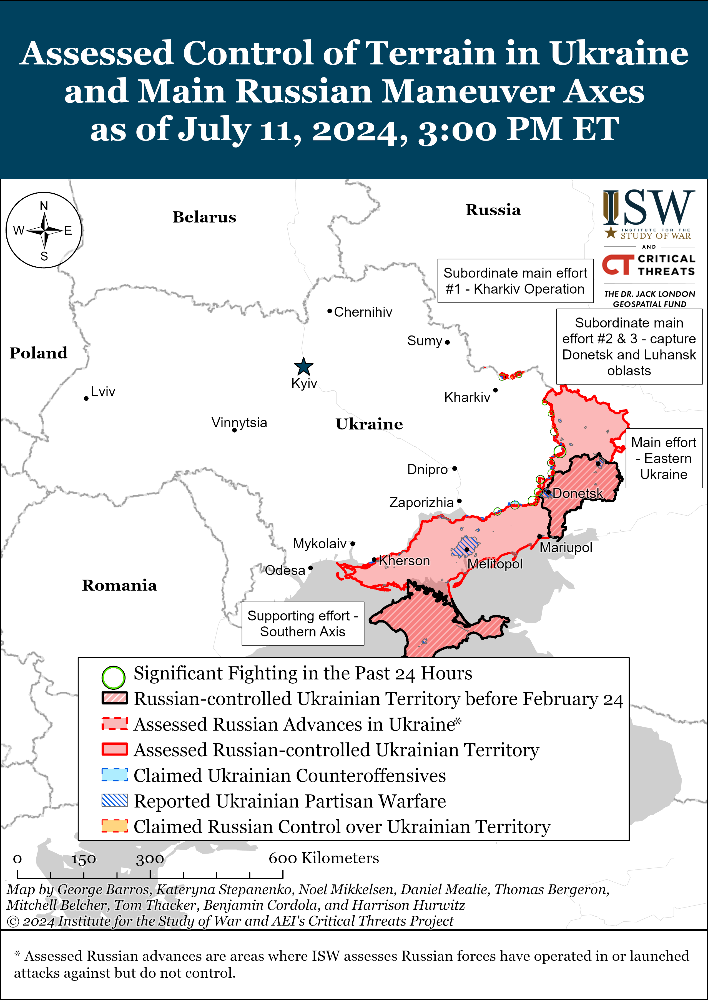
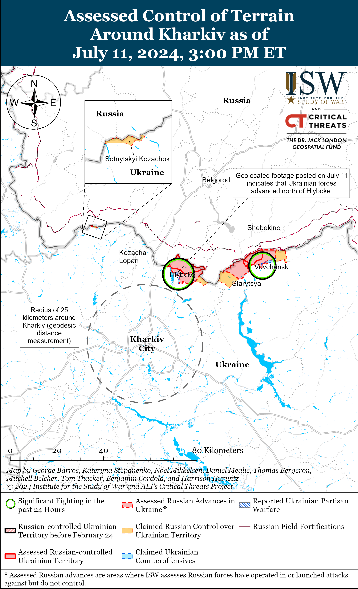
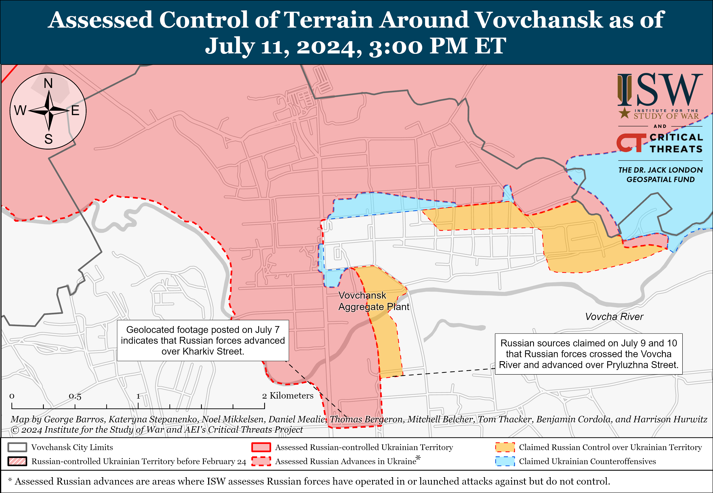
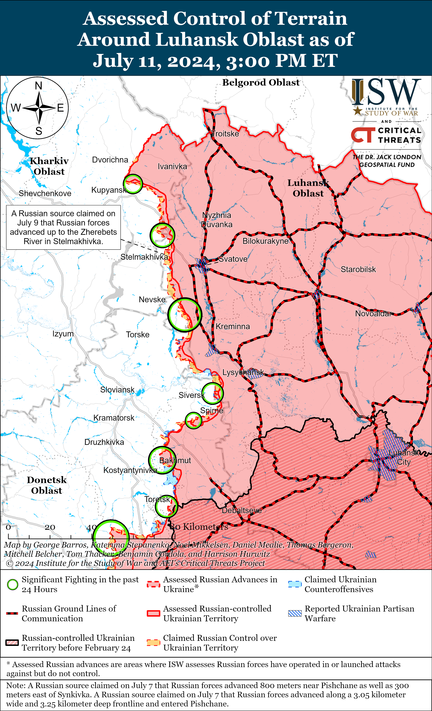
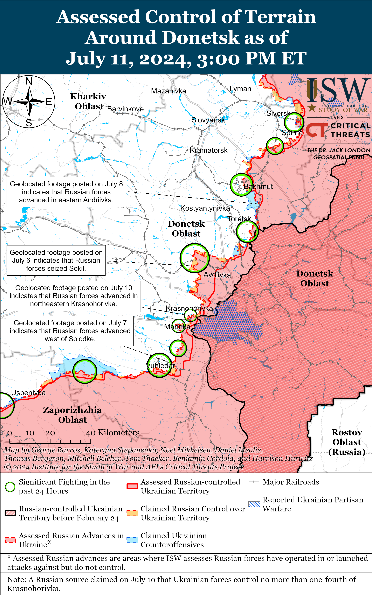
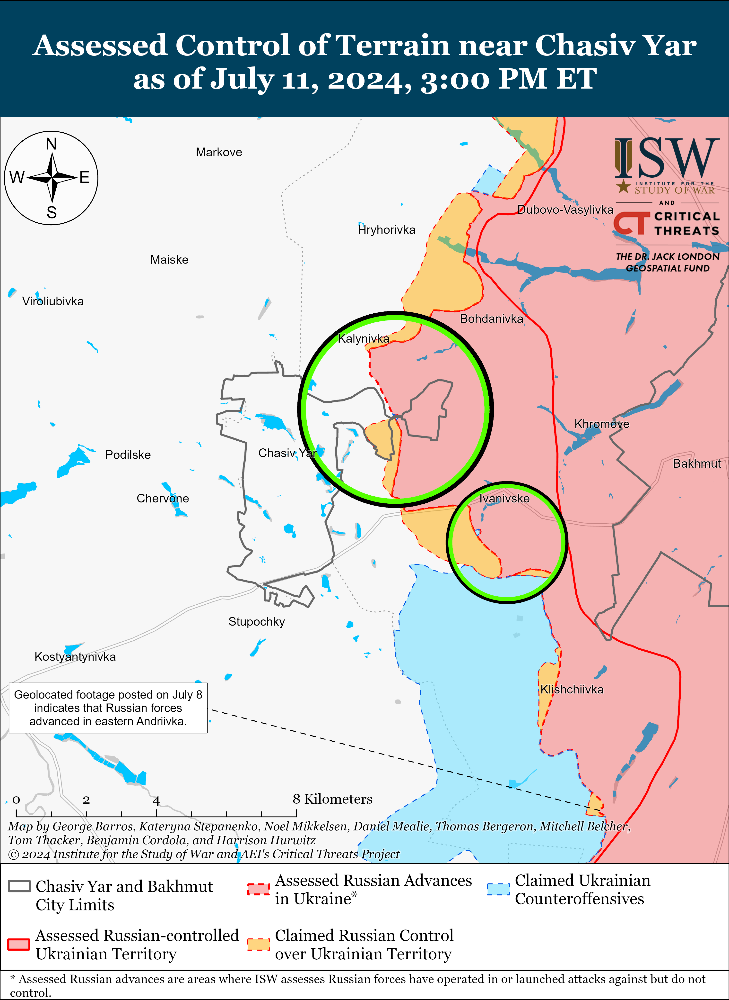
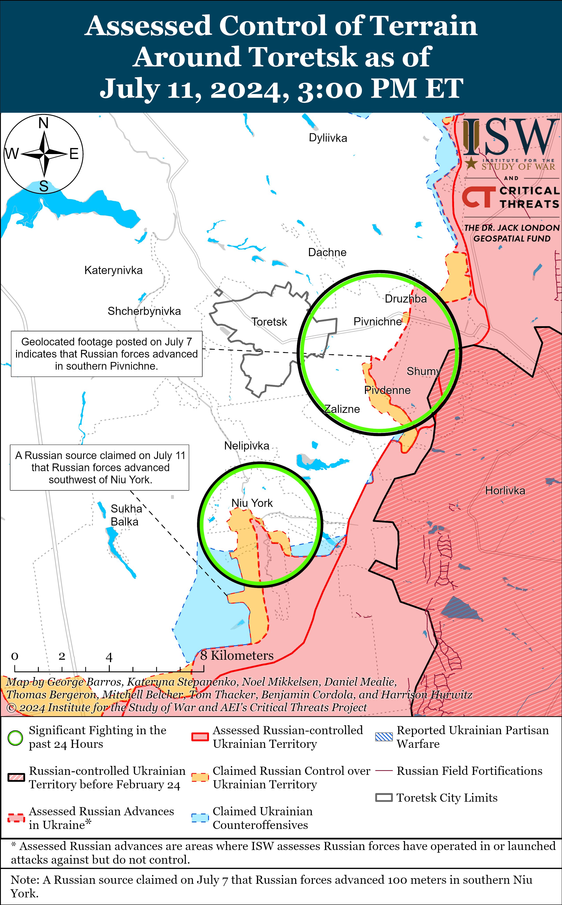
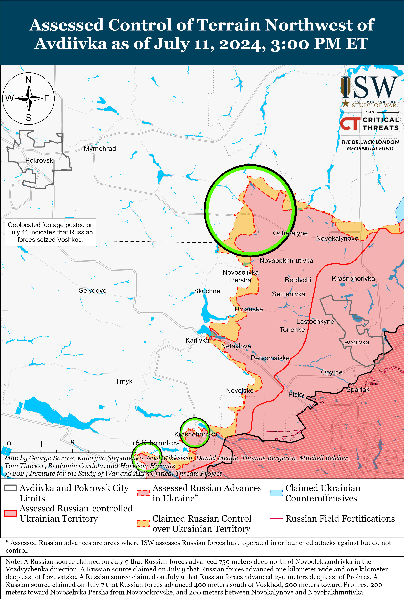
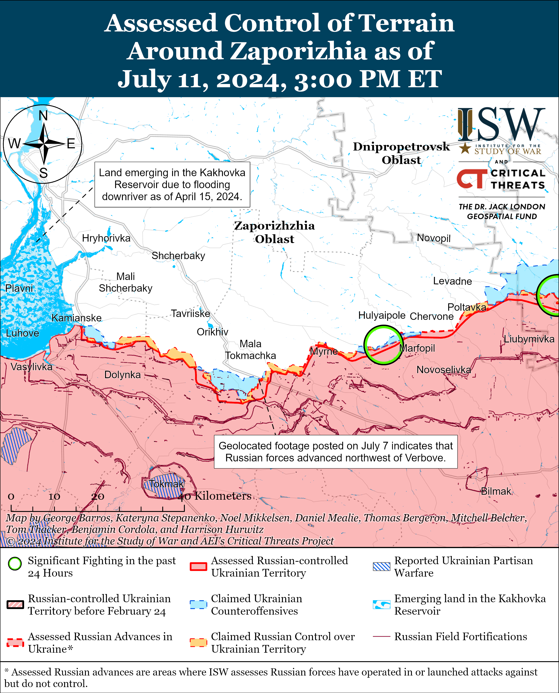
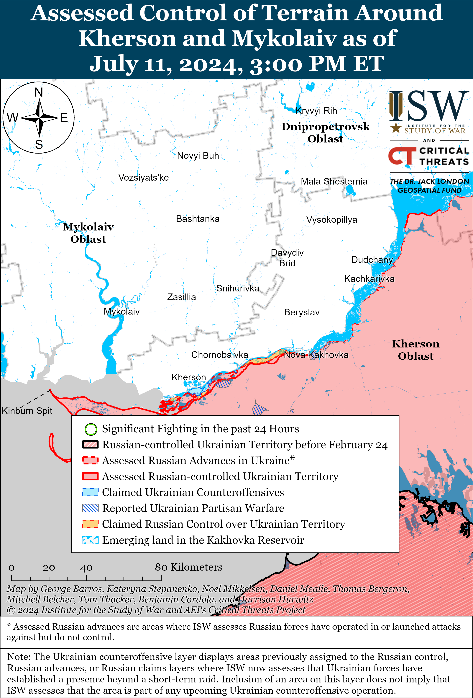

# Russian Offensive Campaign Assessment, July 11, 2024

**Angelica Evans, Grace Mappes, Riley Bailey, Christina Harward, and Frederick W. Kagan**

**July 11, 2024, 6:50pm ET**

**Click**[**here**](https://storymaps.arcgis.com/stories/36a7f6a6f5a9448496de641cf64bd375)**to see ISW’s interactive map of the Russian invasion of Ukraine. This map is updated daily alongside the static maps present in this report.**

**Click**[**here**](https://understandingwar.maps.arcgis.com/apps/instant/3dviewer/index.html?appid=1602762dbcde419bb957dea358449580)**to see ISW’s 3D control of terrain topographic map of Ukraine. Use of a computer (not a mobile device) is strongly recommended for using this data-heavy tool.**

**Click**[**here**](https://storymaps.arcgis.com/stories/733fe90805894bfc8562d90b106aa895)**to access ISW’s archive of interactive time-lapse maps of the Russian invasion of Ukraine. These maps complement the static control-of-terrain map that ISW produces daily by showing a dynamic frontline. ISW will update this time-lapse map archive monthly.**

**Note: The data cut-off for this product was 1:30pm ET on July 11. ISW will cover subsequent reports in the July 12 Russian Offensive Campaign Assessment.**

**Russian authorities reportedly attempted to assassinate leading figures in the European defense industrial base (DIB), likely as part of Russian efforts to disrupt and deter Western aid to Ukraine and Russia’s wider efforts to destabilize NATO members.***CNN*reported on July 11 that five US and Western officials stated that US intelligence uncovered a Kremlin plan in early 2024 to assassinate German arms manufacturer Rheinmetall CEO Armin Papperger.[1] US intelligence reportedly informed the German government, which was able to foil the plot. *CNN*reported that the planned assassination against Papperger was one of multiple plans to kill European defense industry executives, but that the plot against Papperger was the “most mature.” European authorities have reported that Russian actors and proxies have conducted sabotage and other hybrid warfare operations aimed at deterring and disrupting Western aid to Ukraine, and NATO and its member states have repeatedly warned about intensifying Russian hybrid operations on NATO member territory.[2]

**Finnish authorities reported an increase in GPS “malfunctions” in the past week and that most disruptions to aviation and maritime GPS and radar originate from within Russia.****[3]**Finnish federal transport and communications agency Traficom told Finnish outlet *Iltalehti*on July 11 that GPS “malfunctions” have increased in the past week in reference to a specific incident in the Gulf of Finland overnight on July 10-11.[4] A Finnish maritime pilot reported on X (formerly Twitter) that he experienced severe GPS and radar malfunctions overnight while guiding other boats near Kotka and Hamina on Finland’s southern coast.[5] The pilot published footage of his radar malfunctioning and reported that GPS was unavailable for 90 percent of the route between the Orrengrund pilot substation and Hamina harbor.[6] Reports of increased GPS and radar disruptions in the Gulf of Finland cohere with reports of Russian GPS jamming affecting Baltic states and other areas of Europe. Likely Russian jamming from Kaliningrad has previously jammed the GPS of a plane carrying then–UK Defense Minister Grant Shapps and forced Finnish aircraft carrier Finnair to ground multiple flights out of Finland.[7] The GPS interference in the Baltics forced Finnair to cancel flights to Tartu, Estonia until the Tartu airport implemented an approach solution for planes flying into the airport that does not rely on GPS.[8] Russia’s apparent GPS jamming is likely part of Russia’s intensifying hybrid campaign directly targeting NATO states likely aimed at undermining support for Ukraine and NATO unity.[9]

**Ukraine intends to hold a second meeting of the Global Peace Summit by the end of 2024 and reportedly plans to invite Russia to participate.**Deputy Head of theUkrainian Presidential Office Ihor Zhovkva stated on June 21 that Ukraine wants to hold the second meeting of the summit by the end of 2024, and Ukrainian President Volodymyr Zelensky stated on July 4 that “Russian representatives must be present” at any subsequent summit that discusses a legitimate plan to end the war.[10] *Bloomberg*reported on July 11 that a Ukrainian official stated that Ukraine wants to convene the second meeting of the summit before November 2024 and invite Russian representatives.[11] The Kremlin pointedly stated that Russian representatives would not have attended the first meeting of the Global Peace Summit in Switzerland in June even if they had been invited.[12] Russian President Vladimir Putin has indicated that he is opposed to any agreement short of Ukrainian surrender, however, despite other Kremlin officials continuing to feign interest in meaningful negotiations.[13] The first meeting of the Ukrainian-initiated Global Peace Summit aimed to create a global consensus on negotiations about the war in Ukraine so that Ukraine and its international partners can present a joint peace plan to a Russian representative at a subsequent peace summit, and Ukraine has never indicated that it intends to exclude Russia entirely from its peace process.[14]

**European Union (EU) leadership is reportedly considering restricting Hungary’s power as EU Council president following Hungarian Prime Minister Viktor Orban’s meeting with Russian President Vladimir Putin in Moscow and his efforts to present himself as a potential mediator between Russia and Ukraine.***POLITICO Europe*, European Pravda, and Ukrainian outlet *Suspilne*reported on July 8, 9, and 11 that they obtained a copy of a letter from Orban to European Council President Charles Michel detailing Orban’s July 5 meeting with Russian President Vladimir Putin and various claimed Russian positions on negotiations and the frontline situation in Ukraine.[15] Orban reportedly advocated for immediate peace negotiations in the letter and claimed that he did not offer any opinions or policy proposals to Putin on behalf of the EU or EU Council during his visit to Moscow.[16] Orban claimed in the letter that he will continue his efforts to facilitate negotiations and “clarify the possibilities for achieving peace” in the coming weeks. The *Financial Times* (*FT*) reported on July 10 that, according to three people familiar with the matter, the EU’s legal service told member states that Orban’s trip to Moscow may have violated a series of EU treaties that forbid any “measure that could jeopardize the attainment of the Union’s objectives.”[17] Several diplomats told*FT* that many EU member states are considering boycotting ministerial meetings in Hungary and that a sub-group of member states are discussing how to use the EU treaty to restrict Hungary’s power and influence as EU Council president. Pro-European political group Renew Europe president Valerie Hayer called on the European Council to prematurely terminate Hungary’s EU Council presidency following Orban’s visit to Moscow.[18] Orban has previously flouted EU foreign policy and norms, including opposing sanctions against Russia, and will likely continue to use his position as EU Council president to posture himself as a potential mediator for the end of Russia’s invasion of Ukraine.[19]

**The Russian government continued efforts to root out critical voices and consolidate control over the Russian information space.** Russian federal censor Roskomnadzor stated on July 11 that the agency may require social media account owners with a daily audience of over 1,000 people to provide identifying information to Roskomnadzor in the future.[20] Roskomnadzor stated that in accordance with a Russian law requiring consumers to have “reliable information” about the owner of an information distributor, the agency could require account owners to provide their full name and contact information to the Russian government. Roskomnadzor noted that it will prohibit Russian companies from advertising on the social media pages of owners who have not provided their information to the agency. The Russian government has likely identified the individuals behind most prominent Russian social media accounts but is likely aiming to identify the owners of smaller social media accounts that claim to have insider information into the inner workings of the Russian government, military, or companies. *BBC* reported in September 2023 that advertisements are a significant money-making method for more prominent Russian milbloggers, and Roskomnadzor likely hopes to force smaller channels whose owners may need the supplemental income to provide their information by restricting their advertisement revenue.[21]

**The Russian Federal Security Service (FSB) claimed that it prevented a terrorist attack against an Orthodox church in Maykop, Republic of Adygea on July 11.****[22]**The FSB claimed that a man from Central Asia, supposedly affiliated with an unspecified international terrorist organization, planned to murder the church’s clergy and security guards and burn down the church. The FSB claimed that officers found and seized prohibited materials, the flag of an unspecified terrorist organization, a knife, and components of an incendiary device belonging to the man. The Russian government opened an investigation into the terrorist attack.

**Key Takeaways:**

- **Russian authorities reportedly attempted to assassinate leading figures in the European defense industrial base (DIB), likely as part of Russian efforts to disrupt and deter Western aid to Ukraine and Russia’s wider efforts to destabilize NATO members.**
- **Finnish authorities reported an increase in GPS “malfunctions” in the past week and that most disruptions to aviation and maritime GPS and radar originate from within Russia**
- **Ukraine intends to hold a second meeting of the Global Peace Summit by the end of 2024 and reportedly plans to invite Russia to participate.**
- **European Union (EU) leadership is reportedly considering restricting Hungary’s power as EU Council president following Hungarian Prime Minister Viktor Orban’s meeting with Russian president Vladimir Putin in Moscow and his efforts to present himself as a potential mediator between Russia and Ukraine.**
- **The Russian government continued efforts to root out critical voices and consolidate control over the Russian information space.**
- **The Russian Federal Security Service (FSB) claimed that it prevented a terrorist attack against an Orthodox church in Maykop, Republic of Adygea on July 11.**
- **Ukrainian forces advanced north of Kharkiv City; and Russian forces recently advanced south of Siversk, northwest of Avdiivka, and west of Donetsk City.**
- **Russian federal subjects (regions) continue to use monetary incentives as part of Russia’s crypto-mobilization recruitment efforts.**

[****](https://understandingwar.org/wp-content/uploads/2025/05/DraftUkraineCoT20July20112C202024.png)

***We do not report in detail on Russian war crimes because these activities are well-covered in Western media and do not directly affect the military operations we are assessing and forecasting. We will continue to evaluate and report on the effects of these criminal activities on the Ukrainian military and the Ukrainian population and specifically on combat in Ukrainian urban areas. We utterly condemn Russian violations of the laws of armed conflict and the Geneva Conventions and crimes against humanity even though we do not describe them in these reports.***

- Russian Main Effort – Eastern Ukraine (comprised of three subordinate main efforts)
- Russian Subordinate Main Effort #1 – Push Ukrainian forces back from the international border with Belgorod Oblast and approach to within tube artillery range of Kharkiv City
- Russian Subordinate Main Effort #2 – Capture the remainder of Luhansk Oblast and push westward into eastern Kharkiv Oblast and encircle northern Donetsk Oblast
- Russian Subordinate Main Effort #3 – Capture the entirety of Donetsk Oblast
- Russian Supporting Effort – Southern Axis
- Russian Air, Missile, and Drone Campaign
- Russian Mobilization and Force Generation Efforts
- Russian Technological Adaptations
- Activities in Russian-occupied areas
- Ukrainian Defense Industrial Base Efforts
- Russian Information Operations and Narratives
- Significant Activity in Belarus

**Russian Main Effort – Eastern Ukraine**

**Russian Subordinate Main Effort #1 – Kharkiv Oblast****(Russian objective: Push Ukrainian forces back from the international border with Belgorod Oblast and approach to within tube artillery range of Kharkiv City)**

Ukrainian forces recently marginally advanced north of Kharkiv City amid continued fighting in the Kharkiv direction on July 11. Geolocated footage published on July 11 shows that Ukrainian forces marginally advanced eastward in the northern outskirts of Hlyboke (north of Kharkiv City), and a Russian milblogger claimed that Ukrainian forces continue bypassing Hlyboke to counterattack north of the settlement.[23] Some Russian milbloggers claimed that Russian forces crossed the Vovcha River within central Vovchansk (northeast of Kharkiv City), but a prominent Kremlin-affiliated milblogger claimed that such reports are false.[24] ISW observed recent geolocated footage showing that Russian infantry crossed the Vovcha River, however.[25] Fighting continued near Hlyboke and within Vovchansk on July 11.[26] Footage published on July 10 reportedly shows drone operators of the Russian Africa Corps operating in the Kharkiv direction following the Russian Ministry of Defense’s (MoD) confirmation on July 9 that it had transferred some Africa Corps units to the area.[27]

**Russian Subordinate Main Effort #2 – Luhansk Oblast****(Russian objective: Capture the remainder of Luhansk Oblast and push westward into eastern Kharkiv Oblast and northern Donetsk Oblast)**

Russian forces continued offensive operations along the Kupyansk-Svatove-Kreminna line on July 11, but there were no confirmed changes to the frontline. Russian milbloggers claimed that Russian forces are advancing northeast of Kupyansk near Synkivka, east of Kupyansk near Petropavlivka, southeast of Kupyansk near Pishchane and north of Berestove, northwest of Kreminna near Makiivka, and west of Kreminna near Terny on July 10 and 11.[28] Another Russian milblogger denied recent claims that Russian forces seized eastern Stelmakhivka (northwest of Svatove) and claimed that Russian forces are conducting reconnaissance-in-force operations near the settlement.[29] Russian forces also continued assaults near Nevske (northwest of Kreminna).[30] Kharkiv Oblast Military Administration Head Oleh Synehubov stated that Russian forces conducted glide bomb strikes against Borova (west of Svatove).[31]

**Russian Subordinate Main Effort #3 – Donetsk Oblast****(Russian objective: Capture the entirety of Donetsk Oblast, the claimed territory of Russia’s proxies in Donbas)**

Russian forces recently advanced south of Siversk amid continued offensive operations in the Siversk direction on July 11. Geolocated footage published on July 11 indicates that Russian forces recently advanced along a windbreak northeast of Rozdolivka (south of Siversk).[32] Russian forces conducted offensive operations near Rozdolivka and Verkhnokamyanske (southeast of Siversk) on July 11.[33]

Russian forces continued offensive operations in the Chasiv Yar area on July 11, but there were no confirmed changes to the frontline in the area. Russian milbloggers claimed that elements of the Russian 200th Motorized Rifle Brigade (14th Army Corps [AC], Leningrad Military District [LMD]) advanced from Kalynivka (north of Chasiv Yar) towards a section of the Siverskyi-Donets Donbas Canal northwest of Kanal Microraion (easternmost Chasiv Yar).[34] A Ukrainian brigade operating in the area stated that the canal is acting as a barrier and allowing Ukrainian forces to conduct defensive operations from more advantageous positions.[35] Russian forces also continued offensive operations near Chasiv Yar and east of Chasiv Yar near Ivanivske on July 11.[36]

Russian forces continued offensive operations near Toretsk on July 11, but there were no confirmed changes to the frontline. Russian milbloggers claimed that Russian forces advanced in southern Pivdenne (southeast of Toretsk), within central Niu York (south of Toretsk), and east of Oleksandropil (southwest of Toretsk).[37] Ukrainian Khortytsia Group of Forces Spokesperson Lieutenant Colonel Nazar Voloshyn stated that elements of the Russian 109th Motorized Rifle Regiment (reportedly 1st Donetsk People’s Republic Army Corps [DNR AC] and mobilization reserves) are attempting to break through Ukrainian defenses within Niu York and that elements of the 27th Motorized Rifle Division, including its 506th and 589th motorized rifle regiments, are operating in the Toretsk area.[38] Voloshyn stated that elements of five Russian units are operating in the Toretsk area, but did not identify the other two.[39] ISW has observed reports of elements of the “Veterany” Assault Brigade (Russian Volunteer Corps) and the 132nd Motorized Rifle Brigade (DNR AC) operating in the Toretsk direction.[40]

Russian forces recently advanced northwest of Avdiivka amid continued offensive operations in the area on July 11. Geolocated footage published on July 11 indicates that Russian forces recently seized Voskhod (northwest of Avdiivka), and the Russian Ministry of Defense (MoD) claimed that elements of the Russian Central Grouping of Forces seized the settlement on July 11.[41] Russian milbloggers claimed that Russian forces seized Voskhod as early as July 4, and a Russian milblogger claimed on July 11 that Russian forces advanced south of the settlement.[42] Geolocated footage published on July 11 indicates that Russian forces recently advanced westward in the fields east of Novoselivka Persha (northwest of Avdiivka).[43] A Russian milblogger claimed that Russian forces advanced up to Novoselivka Persha’s eastern outskirts on July 11, and another Russian milblogger claimed that Russian forces crossed the Vovcha River and entered Novoselivka Persha.[44] Russian milbloggers claimed that Russian forces seized Yevhenivka (northwest of Avdiivka) and advanced further west of the settlement, advanced southward from Sokil (northwest of Avdiivka), and advanced west of Umanske (west of Avdiivka).[45] ISW has not observed confirmation of these Russian claims, however. Russian forces continued offensive operations northwest of Avdiivka near Novooleksandrivka, Lozuvatske, Vozdvyzhenka, Yevhenivka, Sokil, Prohres, and Novoselivka Persha; west of Avdiivka near Umanske and Yasnobrodivka; and southwest of Avdiivka near Karlivka on July 11.[46] Elements of the Russian “Somalia” Battalion (1st DNR AC) are reportedly fighting near Karlivka.[47]

Russian forces recently advanced west of Donetsk City and continued offensive operations west and southwest of Donetsk City on July 11. Geolocated footage published on July 10 indicates that Russian forces recently advanced northward to Medychna and Belinskyi streets in northeastern Krasnohorivka (west of Donetsk City).[48] Russian forces continued offensive operations west of Donetsk City near Krasnohorivka and Heorhiivka and southwest of Donetsk City near Kostyantynivka, Paraskoviivka, and Vodyane.[49] Elements of the Russian 150th Motorized Rifle Division (8th Combined Arms Army [CAA], Southern Military District [SMD]) are reportedly operating near Krasnohorivka, and elements of the 110th Motorized Rifle Brigade (1st DNR AC) and 255th Motorized Rifle Regiment (20th Motorized Rifle Division, 8th CAA, SMD) are reportedly operating in the Kurakhove direction (west and southwest of Donetsk City).[50]

Positional fighting continued in the Donetsk-Zaporizhia Oblast border area south of Velyka Novosilka near Urozhaine on July 11.[51] Elements of the Russian 36th CAA (Eastern Military District), 40th Naval Infantry Brigade (Pacific Fleet, EMD), and unspecified Spetsnaz elements (Russian General Staff’s Main Intelligence Directorate [GRU]) are reportedly operating near Urozhaine.[52]

**Russian Supporting Effort – Southern Axis****(Russian objective: Maintain frontline positions and secure rear areas against Ukrainian strikes)**

Russian forces continued ground attacks near Hulyaipole and Robotyne and northwest of Verbove (east of Robotyne) in western Zaporizhia Oblast on July 10 and 11, but there were no confirmed changes to the frontline.[53] A Russian milblogger claimed that Russian forces advanced near Mala Tokmachka (northeast of Robotyne).[54] Elements of the Russian 291st Motorized Rifle Regiment (42nd Motorized Rifle Division, 58th Combined Arms Army [CAA], Southern Military District [SMD]) and the 247th Guards Airborne (VDV) Regiment (7th VDV Division) are reportedly operating in the Zaporizhia direction.[55] Elements of the Russian 22nd Spetsnaz Brigade are reportedly operating near Robotyne.[56]

A Russian milblogger claimed that Russian forces control most of the islands within the Dnipro River Delta and that Russian forces continued ground attacks in the area on July 11.[57]

**Russian Air, Missile, and Drone Campaign****(Russian Objective: Target Ukrainian military and civilian infrastructure in the rear and on the frontline)**

Russian forces conducted a limited series of missile and drone strikes against Ukraine on the night of July 10 to 11. Ukrainian Air Force Commander Lieutenant General Mykola Oleshchuk stated on July 11 that Russian forces struck Sumy Oblast with two Iskander-M ballistic missiles launched from Kursk Oblast and that Russian forces also launched six Shahed-136/131 drones from Primorsko-Akhtarsk, Krasnodar Krai on the night of July 10 to 11.[58] Oleshchuk reported that Ukrainian forces downed all six Shahed drones over Mykolaiv, Khmelnytskyi, Lviv, and Ivano-Frankivsk oblasts.

**Russian Mobilization and Force Generation Efforts****(Russian objective: Expand combat power without conducting general mobilization)**

Russian federal subjects (regions) continue to use monetary incentives as part of Russia’s crypto-mobilization recruitment efforts. The Republic of Tatarstan is reportedly offering 100,000 rubles (about $1,150) to contract servicemembers (*kontrakniki*) who recruit another *kontraktnik*to sign a contract with the Russian Ministry of Defense (MoD).[59] Tatarstan recently increased one-time payments to 1.05 million rubles (about $12,000) to *kontraktniki*who sign up before July 31.[60]

Russian authorities are reportedly taking steps to prevent draft dodgers from leaving Russia. Russian opposition outlet *Meduza*reported on July 11 that the “Voskhod” Research Institute, a subordinate enterprise of the Russian Ministry of Digital Development, Communications, and Mass Media, will create an information exchange system between the Russian MoD and Federal Security Service (FSB) containing military summonses data that will allow Russian authorities to prevent draft dodgers from leaving the country after receiving a military summons.[61] “Voskhod” reportedly plans to develop the software for the FSB and Russian MoD exchange by September 2, 2024.

The Russian MoD continues to posture itself as providing accurate medical care and accommodations to Russian servicemembers fighting in Ukraine. Russian Deputy Defense Minister Anna Tsivileva inspected medical care facilities in Rostov-on-Don in the Southern Military District (SMD) on July 11.[62] The Russian MoD also claimed that the working group clarified issues about the provision of housing in occupied Ukraine to Russian servicemembers. Russian ultranationalists recently complained that the Russian MoD is providing inadequate medical care to injured soldiers and improperly returns injured personnel to service, including fighting on the frontline.[63]

NATO labeled the People’s Republic of China (PRC) a “decisive enabler” of Russia’s war in Ukraine in the final communique of the NATO summit on July 10.[64] NATO Secretary General Jens Stoltenberg stated on July 10 that the PRC is providing Russia with equipment, microelectronics, and tools to help Russia build missiles, bombs, aircraft, and weapons.[65] US Secretary of State Antony Blinken stated in May 2024 that the PRC’s export of dual-use goods to Russia has helped Russia significantly increase its defense production and that Russia is acquiring 70 percent of its machine tools and 90 percent of its microelectronics from the PRC.[66]

**Russian Technological Adaptations****(Russian objective: Introduce technological innovations to optimize systems for use in Ukraine)**

Russian state-owned defense conglomerate Rostec stated on July 11 that it is testing its latest armored protective plates for protecting critical facilities from shrapnel, bullets, and first-person view (FPV) drone strikes.[67] Rostec stated that the plates will protect important facilities like oil and gas storage sites, ammunition depots, and energy infrastructure.[68]

A Russian milblogger called on Russia to start producing and fielding NATO-standard 155mm artillery systems based on the experience of fighting in Ukraine.[69] The milblogger lamented that Ukrainian forces are using 155mm artillery systems that have longer maximum effective ranges and that are more accurate than Russian 152mm and 122mm artillery systems.[70]

**Ukrainian Defense Industrial Efforts****(Ukrainian objective: Develop its defense industrial base to become more self-sufficient in cooperation with US, European, and international partners)**

*ISW is not publishing coverage of Ukrainian defense industrial effort today.*

**Activities in Russian-occupied areas (Russian objective: Consolidate administrative control of annexed areas; forcibly integrate Ukrainian citizens into Russian sociocultural, economic, military, and governance systems)**

*ISW is not publishing coverage of activities in Russian-occupied areas.*

**Russian Information Operations and Narratives**

Russian officials continue to falsely frame Western responses to Russian escalation as unprompted independent escalations. Senior Kremlin officials and several Russian diplomats, including Russian Federation Council Chairperson Valentina Matvienko, Deputy Foreign Minister Sergey Ryabkov, and Ministry of Foreign Affairs (MFA) Spokesperson Maria Zakharova, criticized the US decision to deploy long range missiles to Germany as a threat to international security and to Russia itself.[71] The Kremlin has been using nuclear saber rattling and escalatory language, including conducting tactical nuclear exercises and announcing its intent to no longer follow the provisions of the Intermediate-Range Nuclear Forces treaty, as part of its reflexive control campaign aimed at influencing Western decision-making at key moments to stymie support for Ukraine.

Russian Security Council Deputy Chairperson Dmitry Medvedev reiterated claims on July 11 that Russia would not accept or uphold any negotiated peace settlements with Ukraine following the July 10 NATO declaration asserting that Ukraine’s path towards NATO membership is “irreversible.”[72]

The Russian Foreign Intelligence Service (SVR) reiterated boilerplate Kremlin narratives falsely portraying Ukrainian President Volodymyr Zelensky as untrustworthy to Ukrainians and international partners.[73]

Russian milbloggers continued to amplify a Ukrainian parliamentary member’s claims that Ukrainian military officials are lying.[74]

**Significant activity in Belarus****(Russian efforts to increase its military presence in Belarus and further integrate Belarus into Russian-favorable frameworks and Wagner Group activity in Belarus)**

The Belarusian Ministry of Defense (MoD) reported that Belarusian and People’s Liberation Army (PLA) forces continued joint anti-terrorist training exercises near Brest, Brest Oblast.[75]

**Note: ISW does not receive any classified material from any source, uses only publicly available information, and draws extensively on Russian, Ukrainian, and Western reporting and social media as well as commercially available satellite imagery and other geospatial data as the basis for these reports. References to all sources used are provided in the endnotes of each update.**

---

[1] https://www.cnn.com/2024/07/11/politics/us-germany-foiled-russian-assassination-plot/index.html

[2] https://understandingwar.org/backgrounder/russian-offensive-campaign-assessment-june-6-2024; https://understandingwar.org/backgrounder/russian-offensive-campaign-assessment-june-4-2024; https://isw.pub/UkrWar050324; https://isw.pub/UkrWar052724 ; https://isw.pub/UkrWar052224 ; https://understandingwar.org/backgrounder/russian-offensive-campaign-assessment-may-5-2024; https://understandingwar.org/backgrounder/russian-offensive-campaign-assessment-april-29-2024 ;; https://understandingwar.org/backgrounder/russian-offensive-campaign-assessment-july-10-2024; https://isw.pub/UkrWar052724

[3] https://www.iltalehti dot fi/kotimaa/a/339c2dc1-a349-4d45-9c83-4eed35ef4fe3

[4] https://www.iltalehti dot fi/kotimaa/a/339c2dc1-a349-4d45-9c83-4eed35ef4fe3

[5] https://x.com/LukkariHannu/status/1811203586057286007; https://x.com/LukkariHannu/status/1811209150791102813

[6] https://www.iltalehti dot fi/kotimaa/a/339c2dc1-a349-4d45-9c83-4eed35ef4fe3

[7] https://yle dot fi/a/74-20093392; https://yle dot fi/a/74-20086068; https://yle dot fi/a/74-20086338; https://www.bbc.com/news/uk-68569676

[8] https://company.finnair.com/en/media-centre/all-releases/news?id=6A26DF96E1D0D396

[9] https://understandingwar.org/backgrounder/russian-offensive-campaign-assessment-april-29-2024; https://understandingwar.org/backgrounder/russian-offensive-campaign-assessment-may-3-2024; https://understandingwar.org/backgrounder/russian-offensive-campaign-assessment-july-2-2024; https://understandingwar.org/wp-content/uploads/2024/07/Russian20Offensive20Campaign20Assessment20May2052C2020242028PDF29.pdf

[10] https://www.telegraph.co.uk/world-news/2024/07/04/ukraine-zelenskyy-russia-peace-talks/ ; https://kyivindependent.com/ukraine-wants-to-hold-another-peace-summit-by-end-of-year/

[11] https://www.bloomberg.com/news/articles/2024-07-10/ukraine-seeks-new-summit-with-russia-ahead-of-us-elections

[12] https://isw.pub/UkrWar041024

[13] https://www.bloomberg.com/news/articles/2024-07-10/ukraine-seeks-new-summit-with-russia-ahead-of-us-elections ; https://isw.pub/UkrWar070524

[14] https://isw.pub/UkrWar063024 ; https://isw.pub/UkrWar061524

[15] https://suspilne dot media/786355-orban-nadislav-golovi-evroradi-lista-u-akomu-rozpoviv-pro-vlasne-bacenna-miru-miz-ukrainou-ta-rf/ ; https://www.politico.eu/article/viktor-orban-letter-european-council-charles-michel-vladimir-putin-war-in-ukraine-russia-kremlin/ ; https://hungarytoday dot hu/letter-by-viktor-orban-addressed-to-eu-leaders-surfaces-detailing-the-hungarian-pms-peace-initiative/ ; https://www.eurointegration.com.ua/news/2024/07/8/7189766/

[16] https://isw.pub/UkrWar070524 ; https://suspilne dot media/786355-orban-nadislav-golovi-evroradi-lista-u-akomu-rozpoviv-pro-vlasne-bacenna-miru-miz-ukrainou-ta-rf/

[17] https://www.ft.com/content/81b1ccc4-e1af-4e34-a551-a05faad1f6e1

[18] https://www.theguardian.com/world/live/2024/jul/11/renew-europe-calls-on-european-council-to-stop-hungarys-ongoing-presidency-europe-live?CMP=share\_btn\_url&page=with%3Ablock-668f85e98f08cae75f96c586#block-668f85e98f08cae75f96c586 ; https://www.eurointegration.com dot ua/news/2024/07/11/7190015/

[19] https://www.voanews.com/a/eu-dilemma-dealing-with-hungary-viktor-orban/7479954.html ; https://www.chathamhouse.org/2024/07/orban-using-hungarys-eu-council-presidency-bulldoze-eu-norms ; https://ip-quarterly.com/en/european-unions-hungary-problem ; https://www.politico.eu/a rticle/hungary-veto-eu-russia-gas-sanctions/ ; https://www.politico.eu/article/eu-threatens-silence-hungary-orban-if-blocks-ukrainian-aid-funds-article-7/

[20] https://tass dot ru/obschestvo/21332093 ; https://www.rbc dot ru/technology\_and\_media/11/07/2024/668fa9b59a7947819d86454a

[21] https://www.bbc.com/news/world-europe-66653837

[22] https://t.me/tass\_agency/260026 ; https://t.me/tass\_agency/260052 ; https://meduza dot io/news/2024/07/11/fsb-soobschila-chto-predotvratila-napadenie-na-pravoslavnyy-hram-v-adygee; https://www.interfax dot ru/russia/970348

[23] https://t.me/VARYAGI\_155/97; https://x.com/EjShahid/status/1811372320772034757; https://x.com/EjShahid/status/1811372454285115471; https://t.me/motopatriot/24708

[24] https://t.me/DnevnikDesantnika/12617; https://t.me/RVvoenkor/72252; https://t.me/rybar/61715

[25] https://understandingwar.org/backgrounder/russian-offensive-campaign-assessment-july-10-2024

[26] https://www.facebook.com/GeneralStaff.ua/posts/pfbid0278ybt4qmoMjheuF8RpPxMWUSEF33kSEcrjewghEgF5APFYsMDv6dHBvYPp8oaLyxl

[27] https://t.me/milinfolive/125801; https://understandingwar.org/backgrounder/russian-offensive-campaign-assessment-july-9-2024

[28] https://t.me/rybar/61715 ; https://t.me/rybar/61724 ; https://t.me/dva\_majors/47066 ; https://t.me/DnevnikDesantnika/12614 ; https://www.facebook.com/GeneralStaff.ua/posts/pfbid0278ybt4qmoMjheuF8RpPxMWUSEF33kSEcrjewghEgF5APFYsMDv6dHBvYPp8oaLyxl

[29] https://t.me/NgP\_raZVedka/18352

[30] https://www.facebook.com/GeneralStaff.ua/posts/pfbid0278ybt4qmoMjheuF8RpPxMWUSEF33kSEcrjewghEgF5APFYsMDv6dHBvYPp8oaLyxl

[31] https://suspilne dot media/kharkiv/787833-11-lipna-golovni-novini-harkova-onlajn-hronika-podij-dna/?anchor=live\_1720706639&utm\_source=copylink&utm\_medium=ps; https://t.me/synegubov/10325

[32] https://t.me/creamy\_caprice/6034; https://t.me/Khortytsky\_wind/688

[33] https://www.facebook.com/GeneralStaff.ua/posts/pfbid0278ybt4qmoMjheuF8RpPxMWUSEF33kSEcrjewghEgF5APFYsMDv6dHBvYPp8oaLyxl

[34] https://t.me/rusich\_army/15740 ; https://t.me/dva\_majors/47078 ; https://t.me/wargonzo/20974 ; https://t.me/DnevnikDesantnika/12624 ; https://t.me/rybar/61724 ; https://t.me/dva\_majors/47066

[35] https://armyinform.com dot ua/2024/07/11/v-24-ombr-rozpovily-detali-potochnoyi-oborony-chasovogo-yaru/

[36] https://www.facebook.com/GeneralStaff.ua/posts/pfbid0278ybt4qmoMjheuF8RpPxMWUSEF33kSEcrjewghEgF5APFYsMDv6dHBvYPp8oaLyxl

[37] https://t.me/z\_arhiv/27253 ; https://t.me/DnevnikDesantnika/12626

[38] https://armyinform.com dot ua/2024/07/11/skilky-pidrozdiliv-rf-atakuyut-nashi-mista-na-toreczkomu-napryamku-vidpovid-syl-oborony/

[39] https://armyinform.com dot ua/2024/07/11/skilky-pidrozdiliv-rf-atakuyut-nashi-mista-na-toreczkomu-napryamku-vidpovid-syl-oborony/

[40] https://understandingwar.org/backgrounder/russian-offensive-campaign-assessment-july-10-2024 ; https://understandingwar.org/backgrounder/russian-offensive-campaign-assessment-july-9-2024

[41] https://t.me/mir\_perezagruzka/936; https://t.me/creamy\_caprice/6036?single; https://t.me/mod\_russia/40934;

[42] https://t.me/dva\_majors/46713; https://t.me/z\_arhiv/27202; https://t.me/DnevnikDesantnika/12444; https://t.me/z\_arhiv/27255

[43] https://t.me/creamy\_caprice/6033; https://t.me/Khortytsky\_wind/688;

[44] https://t.me/motopatriot/24706 ; https://t.me/NgP\_raZVedka/18351 ; https://t.me/NgP\_raZVedka/18354

[45] https://t.me/rybar/61725 ; https://t.me/z\_arhiv/27255 ; https://t.me/rybar/61724 ; https://t.me/dva\_majors/47066 ; https://t.me/NgP\_raZVedka/18349

[46] https://t.me/voin\_dv/9688 ; https://t.me/NgP\_raZVedka/18349 ; https://t.me/wargonzo/20974 ; https://t.me/rybar/61725 ; https://www.facebook.com/GeneralStaff.ua/posts/pfbid0278ybt4qmoMjheuF8RpPxMWUSEF33kSEcrjewghEgF5APFYsMDv6dHBvYPp8oaLyxl ;

[47] https://t.me/wargonzo/20981

[48] https://t.me/creamy\_caprice/6032; https://t.me/ssternenko/30945

[49] https://www.facebook.com/GeneralStaff.ua/posts/pfbid0278ybt4qmoMjheuF8RpPxMWUSEF33kSEcrjewghEgF5APFYsMDv6dHBvYPp8oaLyxl

[50] https://t.me/astrahandm/12277 ; https://t.me/nm\_dnr/12462 ; https://t.me/nm\_dnr/12463 ; https://t.me/boris\_rozhin/129723 ; https://t.me/warhistoryalconafter/173408 ; https://t.me/NeoficialniyBeZsonoV/37583

[51] https://www.facebook.com/GeneralStaff.ua/posts/pfbid0278ybt4qmoMjheuF8RpPxMWUSEF33kSEcrjewghEgF5APFYsMDv6dHBvYPp8oaLyxl ; https://t.me/DnevnikDesantnika/12615

[52] https://t.me/voin\_dv/9689

[53] https://www.facebook.com/GeneralStaff.ua/posts/pfbid0278ybt4qmoMjheuF8RpPxMWUSEF33kSEcrjewghEgF5APFYsMDv6dHBvYPp8oaLyxl ; https://t.me/rybar/61724 ; https://t.me/dva\_majors/47066 ; https://t.me/wargonzo/20974

[54] https://t.me/DnevnikDesantnika/12616

[55] https://t.me/boris\_rozhin/129661 ; https://t.me/dva\_majors/47082

[56] https://t.me/dva\_majors/47074

[57] https://t.me/rusich\_army/15746

[58] https://t.me/ComAFUA/346

[59] https://t.me/Govorit\_NeMoskva/30039; https://t.me/astrapress/59473 ;

[60] https://understandingwar.org/backgrounder/russian-offensive-campaign-assessment-july-6-2024

[61] https://meduza dot io/feature/2024/07/11/meduza-vyyasnila-kogda-v-rossii-mozhet-poyavitsya-sistema-obmena-dannymi-mezhdu-fsb-i-minoborony-dlya-zapreta-vyezda-iz-strany-muzhchin-s-povestkami

[62] https://t.me/mod\_russia/40927; https://t.me/mod\_russia/40918 ; https://t.me/tass\_agency/259996 ; https://t.me/mod\_russia/40928

[63] https://understandingwar.org/backgrounder/russian-offensive-campaign-assessment-july-5-2024; https://understandingwar.org/backgrounder/russian-offensive-campaign-assessment-july-2-2024; https://understandingwar.org/backgrounder/russian-offensive-campaign-assessment-june-30-2024; https://understandingwar.org/backgrounder/russian-offensive-campaign-assessment-june-23-2024;

[64] https://www.nato.int/cps/en/natohq/official\_texts\_227678.htm

[65] https://abcnews.go.com/US/wireStory/nato-allies-call-china-decisive-enabler-russias-war-111827361; https://apnews.com/article/nato-china-pacific-washington-59876b88cad3ccf15cc5443912fe3d5b

[66] https://understandingwar.org/backgrounder/russian-offensive-campaign-assessment-july-3-2024

[67] https://t.me/tass\_agency/259967 ; https://t.me/rostecru/7800

[68] https://t.me/tass\_agency/259967 ; https://t.me/rostecru/7800

[69] https://t.me/milinfolive/125835

[70] https://t.me/milinfolive/125835

[71] https://t.me/tass\_agency/259971; https://t.me/belta\_telegramm/257833; https://t.me/tass\_agency/259995 ; https://t.me/MID\_Russia/43143; https://t.me/tass\_agency/260051; https://t.me/tass\_agency/260057; https://t.me/MID\_Russia/43152; https://t.me/MID\_Russia/43151

[72] https://t.me/medvedev\_telegram/516 ; https://x.com/MedvedevRussiaE/status/1811293604406530151 ; https://t.me/tass\_agency/259974

[73] https://t.me/tass\_agency/259963 ; https://t.me/RVvoenkor/72235; https://t.me/sashakots/47799

[74] https://t.me/warhistoryalconafter/173365 ; https://t.me/NeoficialniyBeZsonoV/37573 ;

[75] . https://t.me/modmilby/40267; https://t.me/belta\_telegramm/257910
