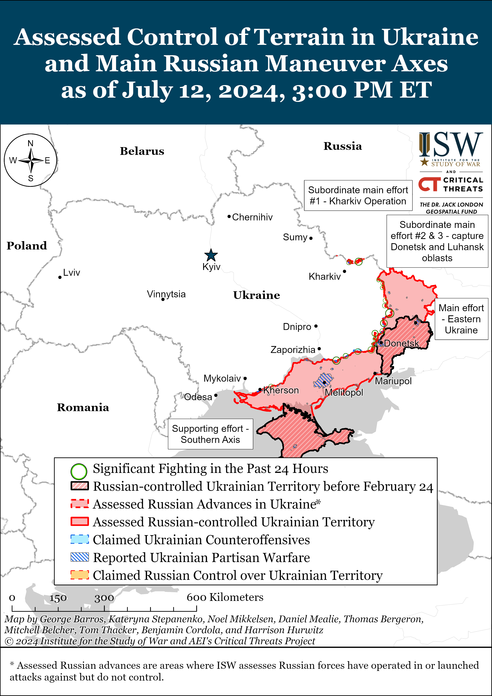
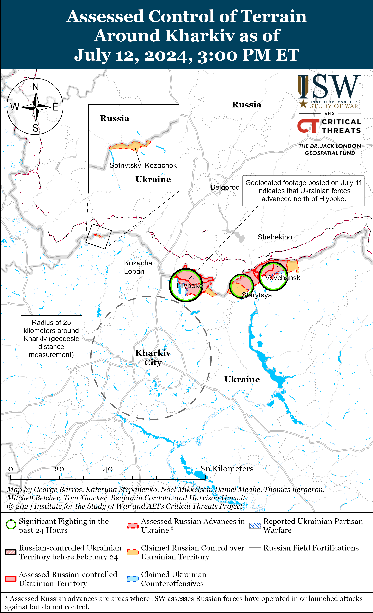
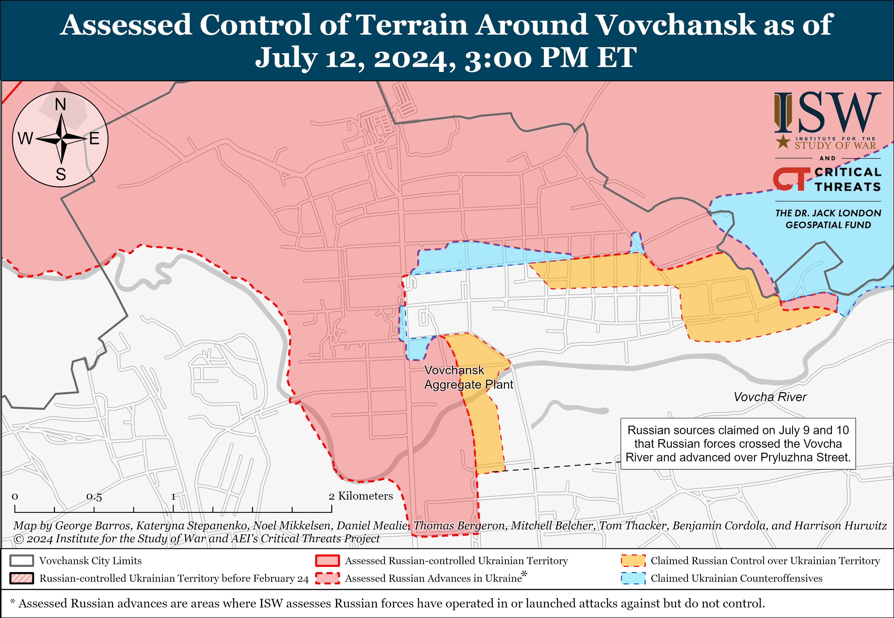
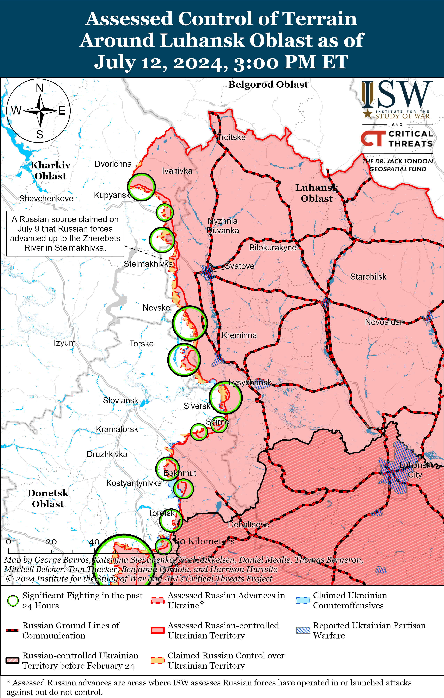
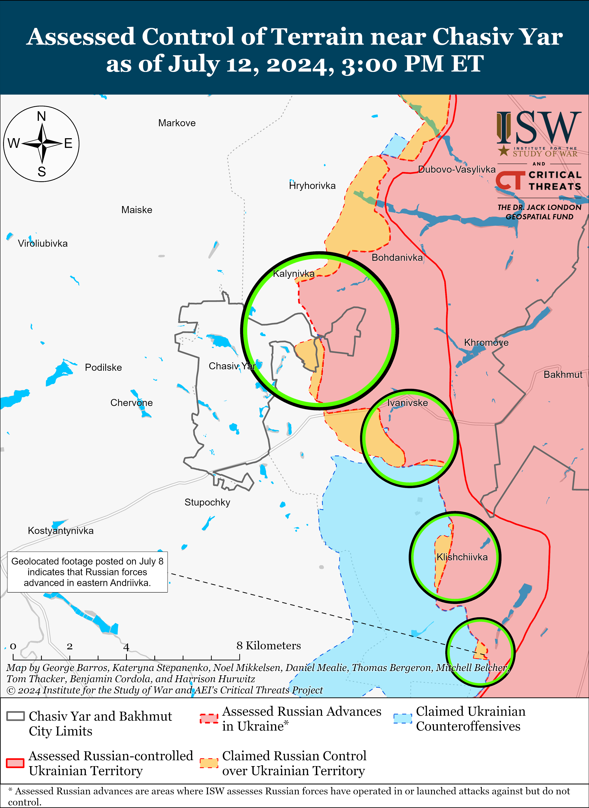
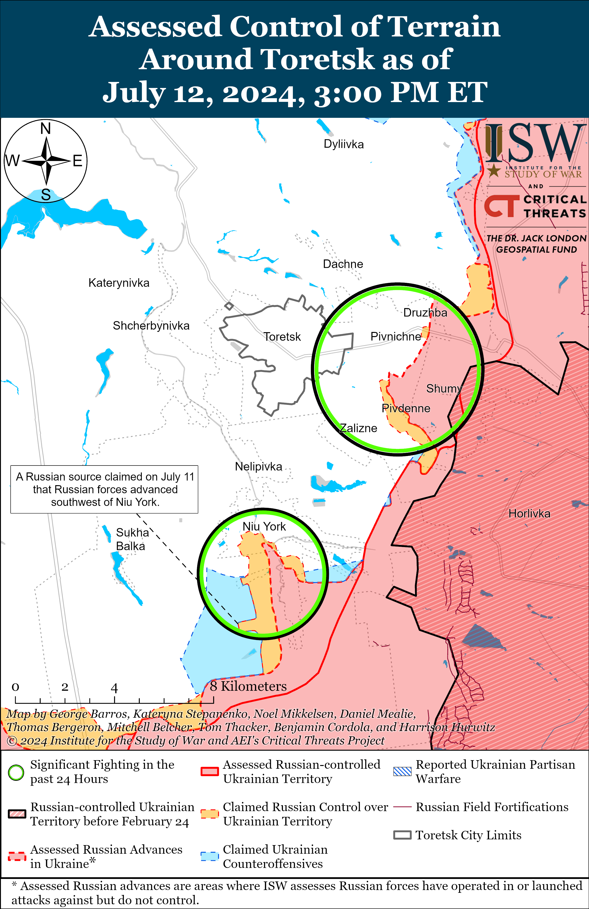
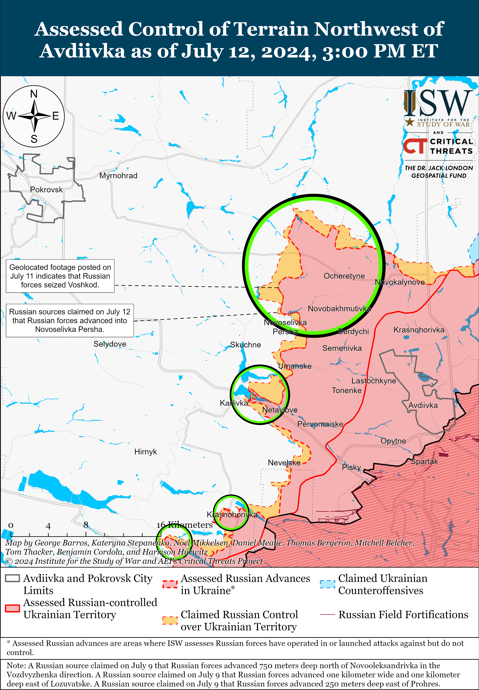
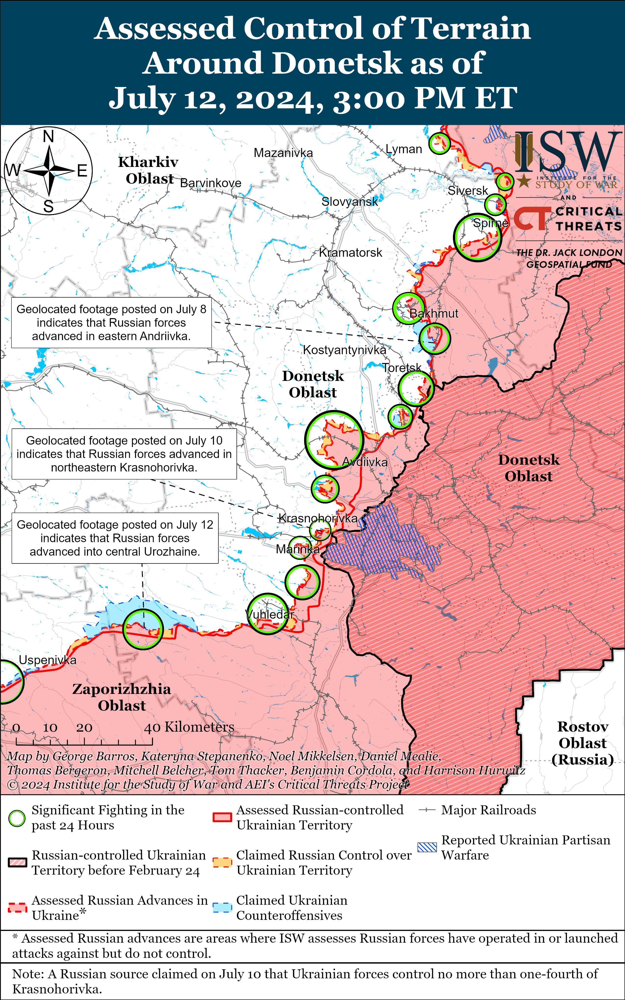
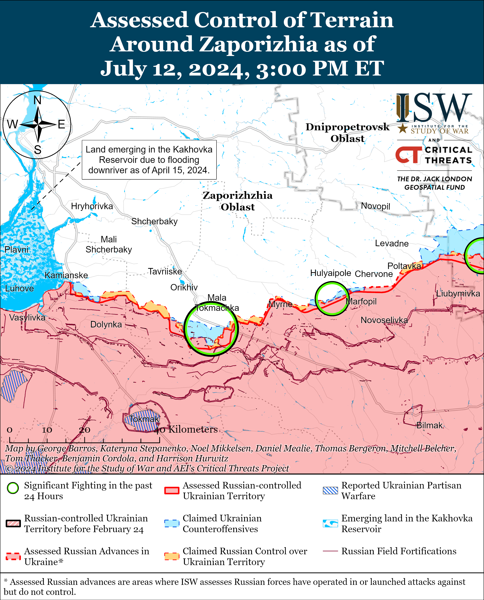
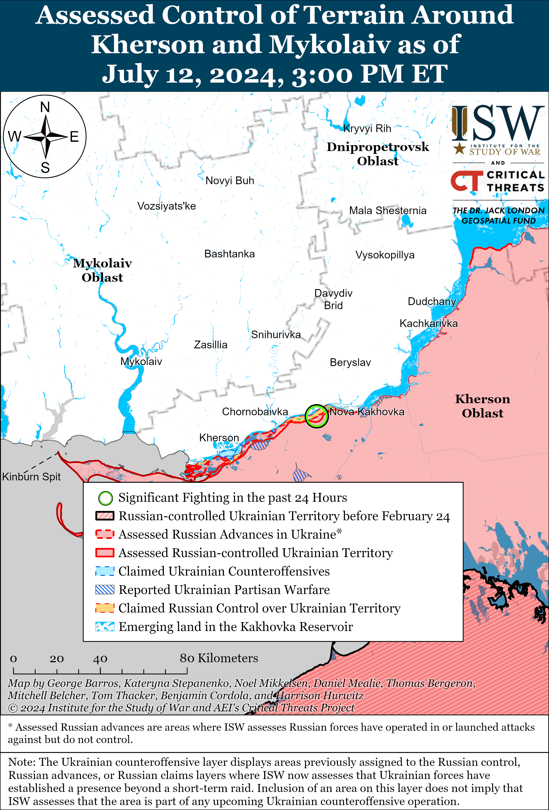

# Russian Offensive Campaign Assessment, July 12, 2024

**Riley Bailey, Angelica Evans, Grace Mappes, Christina Harward,**

****and Frederick W. Kagan****

**July 12, 2024, 7:45pm ET**

**Click**[**here**](https://storymaps.arcgis.com/stories/36a7f6a6f5a9448496de641cf64bd375)**to see ISW’s interactive map of the Russian invasion of Ukraine. This map is updated daily alongside the static maps present in this report.**

**Click**[**here**](https://understandingwar.maps.arcgis.com/apps/instant/3dviewer/index.html?appid=1602762dbcde419bb957dea358449580)**to see ISW’s 3D control of terrain topographic map of Ukraine. Use of a computer (not a mobile device) is strongly recommended for using this data-heavy tool.**

**Click**[**here**](https://storymaps.arcgis.com/stories/733fe90805894bfc8562d90b106aa895)**to access ISW’s archive of interactive time-lapse maps of the Russian invasion of Ukraine. These maps complement the static control-of-terrain map that ISW produces daily by showing a dynamic frontline. ISW will update this time-lapse map archive monthly.**

**Note: The data cut-off for this product was 1:30pm ET on July 12. ISW will cover subsequent reports in the July 13 Russian Offensive Campaign Assessment.**

**Western and US officials reportedly assess that Ukrainian forces will continue to be on the defensive for the next six months and will not be able to conduct a large-scale counteroffensive operation until 2025. Ukrainian forces are already attempting to contest the tactical initiative in limited counterattacks in select sectors of the front, however, and Ukrainian forces may be able to conduct limited counteroffensive operations even while largely on the defensive depending on the arrival of Western aid.**The *New York Times* (*NYT*) reported on July 11 that a senior NATO official stated that Ukraine would have to wait for more Western security assistance and deploy more of its forces to the frontline before conducting counteroffensive operations and that Ukraine would likely not be able to conduct these operations until 2025.[1] A senior US defense official stated that Ukrainian forces would remain on the defensive for the next six months (until January 2025) and that Russian forces will be unlikely to gain significant ground during this time.[2] ISW continues to assess that Russian forces currently remain unlikely to achieve operationally significant gains in Ukraine, and Russian President Vladimir Putin’s articulated theory of victory aims for Russian forces to make consistent gradual creeping advances instead of pursuing rapid operationally significant maneuver.[3]

Ukraine is currently addressing its manpower challenges and forming several new brigades that Ukraine could commit to support contesting the initiative, and the provision of Western security assistance needed for equipping these brigades will determine when and at what scale Ukraine can contest the initiative.[4] The arrival of Western-provided aid to the frontlines has allowed Ukrainian forces to stabilize critical areas of the front, and Ukrainian forces have conducted tactically significant and successful localized counterattacks in northern Kharkiv Oblast and towards Kreminna (in the Donetsk-Luhansk Oblast border area) starting in mid-May 2024.[5] Ukrainian forces will likely be able to intensify both the scale and regularity of counterattacks over the coming months as further Western security assistance arrives at the frontline and as Ukraine continues to build out reserves and new brigades.[6] Russian forces are currently attempting to maintain consistent offensive pressure on Ukraine to force Ukrainian forces to commit manpower and materiel to defensive operations instead of accumulating these resources for counteroffensive operations.[7] Russian forces are attempting to achieve this effect through consistent offensive operations throughout eastern and northeastern Ukraine that stretch Ukrainian forces, but nevertheless, Ukrainian forces are leveraging their capabilities and exploiting Russian vulnerabilities to conduct tactical counterattacks.

Ukrainian forces have so far conducted several large-scale counteroffensive operations that have been operationally successful throughout the full-scale invasion, but this approach to liberating territory is not the only possible approach for Ukrainian forces. Breaking out of the current positional warfare in Ukraine is a challenging task for both Russian and Ukrainian forces, and smaller-scale Ukrainian counteroffensive operations present opportunities for pursuing operationally significant objectives without the challenges associated with conducting larger-scale counteroffensive operations. Smaller-scale counteroffensive operations would likely allow Ukraine to start degrading Russia’s ability to leverage the theater-wide initiative sooner and more quickly reduce some of the theater-wide pressures on Ukrainian forces. Western security assistance that provides Ukrainian forces with the necessary equipment and weapons at the scale, timing, and regularity that Ukrainian forces require for operations that liberate significant swaths of occupied Ukraine remains the only likely path for reducing Putin’s current commitment to destroying Ukrainian statehood and identity regardless of time or cost. These Ukrainian operations do not need to be individual, distinct large-scale endeavors, however, and instead can be a series of compounding counteroffensive operations over the course of late 2024 and throughout 2025.

**The Kremlin continues to signal its unwillingness to participate in peace negotiations that do not result in complete Ukrainian and Western capitulation to the Kremlin’s demands amid ongoing Ukrainian efforts to form an international consensus for future negotiations.**Russian Deputy Foreign Minister Yuriy Galuzin stated on July 12 that Russia is aware of Ukraine’s and the West’s intentions to invite Russia to attend a second Global Peace Summit later in 2024 but that Russia does not “accept such ultimatums” and does not “intend to participate in such summits.”[8] Galuzin claimed that Ukraine’s peace formula (which calls for, among other issues, the withdrawal of Russian forces from Ukraine, free and safe passage through the Black Sea, the restoration of Ukraine’s territorial integrity, and a binding long-term peace agreement) is an “ultimatum” and an “absolute dead-end.”[9]

The United Nations (UN) General Assembly passed a resolution on July 12 demanding that Russia “urgently withdraw” its forces and unauthorized personnel from the occupied Zaporizhzhia Nuclear Power Plant (ZNPP) and “immediately return” the plant to full Ukrainian control, which the Russian Permanent Mission to the UN called a “politicized project” with only Western support.[10] Russian First Deputy Permanent Representative to the UN Dmitry Polyanskyi claimed that the resolution is an “ultimatum” and an effort to create the appearance that Ukraine has widespread support.[11] Russian Ministry of Foreign Affairs (MFA) Spokesperson Maria Zakharova attempted to frame the UN General Assembly’s majority support for the resolution as a failure for Ukraine.[12] Notably, only eight states–all Russian “allies” – Belarus, Burundi, Cuba, North Korea, Eritrea, Mali, Nicaragua, and Syria – voted against the resolution.[13] Kremlin officials will likely continue to frame legitimate Ukrainian negotiating positions as “ultimatums” in order to justify the Kremlin’s disinterest in peace negotiations and its continued war against Ukraine.

Ukrainian President Volodymyr Zelensky met with Turkish President Recep Tayyip Erdogan during the NATO summit on July 11 and announced that Ukraine will hold a conference dedicated to food security and freedom of navigation in Turkey within the framework of the June 2024 Peace Summit.[14] Zelensky also thanked Erdogan for his support for Ukraine’s sovereignty and territorial integrity and Erdogan stated that Turkey has begun work to revitalize the Black Sea Grain Initiative.[15] Erdogan has previously attempted to present Turkey as a possible mediator in future peace negotiations between Russia and Ukraine, and Kremlin officials have repeatedly denied the possibility of Erdogan serving as a future mediator.[16]

**Russian Defense Minister Andrei Belousov used a phone call with US Secretary of Defense Lloyd Austin on July 12, his second in three weeks, to reiterate standard Russian threats intended to coerce the US out of supporting Ukraine as part of an ongoing reflexive control campaign targeting Western decision-makers.****[17]**Austin stressed to Belousov the importance of maintaining lines of communication amid Russia’s ongoing war against Ukraine, while Belousov discussed “preventing security threats” and reducing the “risk of possible escalation.” Austin and Belousov held their first phone call on June 26, and Belousov issued similarly vague threats about the “danger of further escalation” if the United States continues to supply weapons to Ukraine.[18] Russian officials consistently use vague threats of escalation against the United States or other Western countries as part of efforts to discourage Western support for Ukraine.[19]

**The United Kingdom (UK) government has reportedly not permitted Ukraine to use UK-supplied Storm Shadow missiles to strike military targets within Russia, despite previous Western reporting and UK official statements to the contrary.**The *Telegraph*reported on July 11 that unspecified sources in the UK government stated that the UK’s policy “had not changed” and that the UK had not permitted Ukraine to use UK-provided Storm Shadow missiles to strike military targets within Russia.[20] A senior UK defense source reportedly stated that the situation is “more nuanced” and that Ukrainian Storm Shadow strikes into Russia are “not going to happen.” The source reportedly stated that Ukraine would require permission from three countries, including the UK and France, to conduct Storm Shadow strikes against Russian territory. The *Telegraph*did not specify the third country. New UK Foreign Secretary David Lammy stated in an interview with *European Pravda* published on July 12 that the UK is “reflecting on” Ukrainian President Volodymyr Zelensky’s requests for Western states to lift restrictions on the use of Western-provided weapons against Russian territory.”[21] Lammy stated that the UK has held discussions with Zelensky over the last few days and has decided to “look at some other things.” Lammy stated that the UK supports Ukraine’s right to self-defense but declined to detail the UK’s “operational decisions” about the matter. Western media interpreted statements by former UK Prime Minister David Cameron about Ukraine’s possible use of Storm Shadows on May 3 differently, with Reutersreporting that Cameron stated that the UK had no objection to Ukraine using UK-provided weapons to strike targets within Russia, and BBCstating the Cameron did not directly support Ukraine’s use of British weapons in these strikes.[22]*Bloomberg*reported on July 10 that new UK Prime Minister Keir Starmer, however, stated that it is Ukraine’s decision how to deploy Storm Shadows missiles for defensive purposes.[23] Zelensky stated on July 10 that he learned of the UK’s permission for Ukraine to use Storm Shadows against military targets in Russia and met with Starmer to “discuss the practical implementation of this decision.”[24] The exact contours of the UK’s policy regarding Ukraine’s use of Storm Shadow cruise missiles remain unclear.

**The US Department of Defense (DoD) announced on July 11 a military aid package for Ukraine worth $225 million.****[25]**The package includes one Patriot air defense battery; munitions for National Advanced Surface-to-Air Missile Systems (NASAMS); Stinger anti-aircraft missiles; High Mobility Artillery Rocket Systems (HIMARS) ammunition; 155mm and 105mm artillery rounds; and Tube-Launched, Optically-Tracked, Wire-Guided (TOW) equipment and missiles.

**Indian state-run oil refineries are reportedly negotiating an oil import deal with Russia, likely as a result of the recent meetings between Indian Prime Minister Narendra Modi and Russian President Vladimir Putin and improving Russo-Indian energy relations in recent months.**Reutersreported on July 11 that an Indian government source stated that Indian state-run oil refineries are negotiating a long-term oil import deal with Russia but have yet to agree on issues such as the payment currency.[26] The source reportedly stated that private Indian oil refineries may also join the negotiations later. Modi met with Putin in Moscow on July 8 and 9 and issued a joint statement about strengthening mutually beneficial energy cooperation.[27] Russian Deputy Prime Minister Alexander Novak stated on July 9 that India and Russia are considering entering a long-term agreement on oil supplies.[28] Indian private and state-run oil refineries reportedly refused to accept Russian crude oil transported on Russian PJSC Sovcomflot tankers due to US sanctions in early 2024, but *Bloomberg*reported on May 1 that Indian state-owned Indian Oil Corporation resumed buying Russian crude oil delivered on a PJSC Sovcomflot tanker.[29]

**The Kremlin continues to intensify efforts to encourage self-censorship among information space voices and consolidate physical control over internet infrastructure.**Russian State Duma Information Policy Committee member Anton Nemkin stated on July 11 that Russian federal censor Roskomnadzor will crack down against users registering for anonymous social media accounts by forcing applications, including Telegram and WhatsApp, to require phone numbers to register for an account and to establish communications with telecommunications companies to prevent Russians from registering accounts using gray market SIM cards.[30] Nemkin stated that Roskomnadzor will work with Telegram and WhatsApp specifically but will develop new rules for user verification and content moderation by late 2024 or late 2025. The Russian Ministry of Justice designated two small, anonymous Russian Telegram channels claiming to have insider information about the Russian government, *VChK-OGPU* and *Russkiy Criminal*, as foreign agents on July 12, just one day after announcing that Roskomnadzor may require channels with a daily audience of more than 1,000 people to provide identifying information in the future.[31] Russian opposition outlet *Astra*stated that the Russian Ministry of Justice alleged that the administrators of the two insider source channels are two defendants in an extortion case involving Russian oligarch Alisher Usmanov.[32] The Kremlin likely means to punish these channels in order to illustrate to the rest of the Russian ultranationalist information space that Russians cannot hide behind anonymous Telegram accounts to spread criticisms or rumors about the Kremlin without retribution.

Russian authorities are also throttling speeds for users accessing certain Western social media sites likely to discourage the use of these sites ahead of possible domestic bans. Nemkin stated that Roskomnadzor is not currently considering blocking WhatsApp like it has other Western social media sites but noted that Russia is applying “technological measures such as slowdowns” to WhatsApp, particularly in the Republic of Dagestan.[33] Russia’s largest telecommunications operator Rostelecom stated on July 12 that Russians may experience slow load times and low video resolution when accessing YouTube regardless of telecom operator due to a lack of servers hosting content within Russia, but a telecom source told Russian opposition outlet *Meduza* that this narrative is false.[34] The Russian telecom source instead claimed that Russian authorities have begun deliberately slowing down speeds for users accessing YouTube within Russia, and *Meduza* cited the University of Michigan’s Censored Planet project as saying that Roskomnadzor used its specialized TSPU (technical means of countering threats) system to slow down access to X (formerly Twitter) in 2021.[35] Russian news outlet *Gazeta* reported that Russia is considering blocking YouTube in September 2024, but Kremlin Spokesperson Dmitry Peskov denied such reports.[36]

**Key Takeaways:**

- **Western and US officials reportedly assess that Ukrainian forces will continue to be on the defensive for the next six months and will not be able to conduct a large-scale counteroffensive operation until 2025. Ukrainian forces are already attempting to contest the tactical initiative in limited counterattacks in select sectors of the front, however, and Ukrainian forces may be able to conduct limited counteroffensive operations even while largely on the defensive depending on the arrival of Western aid.**
- **The Kremlin continues to signal its unwillingness to participate in peace negotiations that do not result in complete Ukrainian and Western capitulation to the Kremlin’s demands amid ongoing Ukrainian efforts to form an international consensus for future negotiations.**
- **Russian Defense Minister Andrei Belousov used a phone call with US Secretary of Defense Lloyd Austin on July 12, his second in three weeks, to reiterate standard Russian threats intended to coerce the US out of supporting Ukraine as part of an ongoing reflexive control campaign targeting Western decision-makers.**
- **The United Kingdom (UK) government has reportedly not permitted Ukraine to use UK-supplied Storm Shadow missiles to strike military targets within Russia, despite previous Western reporting and UK official statements to the contrary.**
- **The US Department of Defense (DoD) announced on July 11 a military aid package for Ukraine worth $225 million.**
- **Indian state-run oil refineries are reportedly negotiating an oil import deal with Russia, likely as a result of the recent meetings between Indian Prime Minister Narendra Modi and Russian President Vladimir Putin and improving Russo-Indian energy relations in recent months.**
- **The Kremlin continues to intensify efforts to encourage self-censorship among information space voices and consolidate physical control over internet infrastructure.**
- **Russian forces recently made confirmed advances near Avdiivka and in the Donetsk-Zaporizhia Oblast border area.**
- **Russian infantry units are reportedly assaulting Ukrainian trench positions in single-file columns due to pervasive Ukrainian minefields and poor assault training.**
- **Russian President Vladimir Putin met with Zaporizhia Oblast occupation administration head Yevgeny Balitsky on July 12 and discussed social and infrastructure projects in occupied Zaporizhia Oblast.**

***We do not report in detail on Russian war crimes because these activities are well-covered in Western media and do not directly affect the military operations we are assessing and forecasting. We will continue to evaluate and report on the effects of these criminal activities on the Ukrainian military and the Ukrainian population and specifically on combat in Ukrainian urban areas. We utterly condemn Russian violations of the laws of armed conflict and the Geneva Conventions and crimes against humanity even though we do not describe them in these reports.***

- Russian Main Effort – Eastern Ukraine (comprised of three subordinate main efforts)
- Russian Subordinate Main Effort #1 – Push Ukrainian forces back from the international border with Belgorod Oblast and approach to within tube artillery range of Kharkiv City
- Russian Subordinate Main Effort #2 – Capture the remainder of Luhansk Oblast and push westward into eastern Kharkiv Oblast and encircle northern Donetsk Oblast
- Russian Subordinate Main Effort #3 – Capture the entirety of Donetsk Oblast
- Russian Supporting Effort – Southern Axis
- Russian Air, Missile, and Drone Campaign
- Russian Mobilization and Force Generation Efforts
- Russian Technological Adaptations
- Activities in Russian-occupied areas
- Ukrainian Defense Industrial Base Efforts
- Russian Information Operations and Narratives
- Significant Activity in Belarus

**Russian Main Effort – Eastern Ukraine**

**Russian Subordinate Main Effort #1 – Kharkiv Oblast****(Russian objective: Push Ukrainian forces back from the international border with Belgorod Oblast and approach to within tube artillery range of Kharkiv City)**

Fighting continued north and northeast of Kharkiv City on July 12, but there were no confirmed changes to the frontline. A Russian milblogger continued to claim that Russian forces have enduring positions on the southern side of the Vovcha River in central Vovchansk (northeast of Kharkiv City), and ISW has yet to observe evidence repudiating geolocated footage published on July 7 indicating that Russian forces have crossed the Vovcha River within central Vovchansk.[37] A Russian milblogger claimed that small Ukrainian assault groups regularly enter northern Hlyboke (north of Kharkiv City), but that Russian drone and artillery units repel these Ukrainian groups.[38] The Ukrainian General Staff reported that Russian forces continued offensive operations near Hlyboke, Vovchansk, and Starytsya (northeast of Kharkiv City) on July 12.[39] The spokesperson for a Ukrainian brigade operating in northern Kharkiv Oblast stated that volunteers from African countries and the former Soviet Union are fighting in Russian assault groups in the area.[40]

**Russian Subordinate Main Effort #2 – Luhansk Oblast****(Russian objective: Capture the remainder of Luhansk Oblast and push westward into eastern Kharkiv Oblast and northern Donetsk Oblast)**

Russian forces continued offensive operations along the Kupyansk-Svatove-Kreminna line on July 12, but there were no confirmed changes to the frontline. Russian forces continued offensive operations northeast of Kupyansk near Synkivka and Vilshana; southeast of Kupyansk near Pishchane, Berestove, and Stepova Novoselivka; northwest of Kreminna near Makiivka and Nevske; and west of Kreminna near Terny and Torske on July 11 and 12.[41] A Ukrainian servicemember operating in the Kupyansk direction stated that Russian forces are attacking in small squad-sized groups of three to seven people.[42]

**Russian Subordinate Main Effort #3 – Donetsk Oblast****(Russian objective: Capture the entirety of Donetsk Oblast, the claimed territory of Russia’s proxies in Donbas)**

Russian forces continued offensive operations near Siversk on July 12 but did not make any confirmed advances. Russian forces continued offensive operations northeast of Siversk near Bilohorivka, east of Siversk near Verkhnokamyanske, southeast of Siversk near Spirne, and south of Siversk near Rozdolivka and Vyimka on July 11 and 12.[43] A Russian milblogger claimed that Russian forces advanced an additional 1.55 kilometers deep northwest of Rozdolivka, but ISW has not observed visual confirmation of this claim.[44]

Russian forces did not make any confirmed advances amid continued offensive operations near Chasiv Yar on July 12. Russian forces continued attacks within easternmost Chasiv Yar, east of Chasiv Yar near Ivanivske, and southeast of Chasiv Yar near Klishchiivka and Andriivka on July 11 and 12.[45] Ukrainian Khortytsia Group of Forces Spokesperson Colonel Nazar Voloshyn reported on July 12 that Russian forces have largely shifted their focus from the Chasiv Yar direction to the Toretsk direction.[46] Russian sources claimed that Russian forces struck a Ukrainian ammunition depot near Kostyantynivka (southwest of Chasiv Yar and north of Donetsk City).[47]

Russian forces continued offensive operations in the Toretsk direction on July 12, but there were no confirmed changes to the frontline. Russian milbloggers claimed that Russian forces continued to advance within Niu York (south of Toretsk) and are approaching Toretsk from both the east and south.[48] Russian forces also continued attacks near Toretsk and southeast of Toretsk near Zalizne and Pivnichne on July 11 and 12.[49]

Russian forces recently advanced northwest of Avdiivka. Geolocated footage published on July 12 shows that Russian forces advanced up to the northeastern outskirts of Novoselivka Persha (northwest of Avdiivka).[50] Russian milbloggers additionally claimed that Russian forces advanced into northeastern Novoselivka Persha and consolidated their positions within the settlement, although ISW has not observed visual confirmation that Russian forces advanced as much as the milbloggers claim.[51] Ukrainian military observer Kostyantyn Mashovets stated that elements of the Russian 55th and 74th motorized rifle brigades (both of the 41st Combined Arms Army [CAA], Central Military District [CMD]) and 114th Motorized Rifle Brigade (1st Donetsk People’s Republic Army Corps [DNR AC]) are focusing on attacking Novoselivka Persha from the north, northeast, and southeast because southern Novoselivka Persha is the last tactically significant Ukrainian defensive position on the east side of the Vovcha River.[52] Russian forces also continued attacks northwest of Avdiivka near Novooleksandrivka, Vozdvyzhenka, Prohres, Sokil, and Kalynove and west of Avdiivka near Karlivka and Yasnobrodivka on July 11 and 12.[53] Mashovets stated that elements of the Russian 30th Motorized Rifle Brigade (2nd CAA, CMD) and 35th Motorized Rifle Brigade (41st CAA) are fighting near Lozuvatske (northwest of Avdiivka) and towards Vozdvyzhenka; elements of the 433rd Motorized Rifle Regiment (27th Motorized Rifle Division, 2nd CAA), supported by elements of the 15th Motorized Rifle Brigade (2nd CAA) and 55th Motorized Rifle Brigade, are fighting along the railway towards Prohres; and elements of the 30th and 35th motorized rifle brigades are fighting along the Tymofiivka-Prohres line (northwest of Avdiivka).[54]

Russian forces continued attacks west and southwest of Donetsk City but did not make confirmed advances. Russian forces continued attacks west of Donetsk City near Krasnohorivka and Heorhiivka and southwest of Donetsk City near Paraskoviivka, Kostyantynivka, and Vodyane on July 11 and 12.[55] Elements of the Russian 5th and 110th motorized rifle brigades (both of the 1st DNR AC) reportedly continue to fight in Krasnohorivka.[56]

Ukrainian forces conducted a strike against occupied Mariupol on July 12, reportedly targeting a nearby Russian military airfield. Footage published on July 12 shows smoke plumes near Mariupol, and Russian and Ukrainian sources reported a Ukrainian strike near the Mariupol airfield.[57] A Ukrainian open-source account posted satellite imagery of a Russian S-300 air defense system near the Mariupol airport and suggested that Ukrainian forces may have targeted the S-300 system.[58] ISW has not observed confirmation of the Ukrainian strike or resulting damage.

Russian forces recently advanced south of Velyka Novosilka in the Donetsk-Zaporizhia Oblast border area. Geolocated footage published on July 12 shows elements of the Russian 37th Motorized Rifle Brigade (36th CAA, Eastern Military District [EMD]) raising a flag within central Urozhaine (south of Velyka Novosilka), although Russian milbloggers noted that Russian forces advanced into central Urozhaine but have not seized the entire settlement.[59] Russian milbloggers claimed that elements of the Russian 5th Tank Brigade (36th CAA) and 14th Spetsnaz Brigade (Russian General Staff’s Main Intelligence Directorate [GRU]) are also fighting for Urozhaine.[60] The Ukrainian General Staff reported that Russian forces also conducted limited attacks south of Hulyaipole on July 11 and 12.[61]

**Russian Supporting Effort – Southern Axis****(Russian objective: Maintain frontline positions and secure rear areas against Ukrainian strikes)**

Positional engagements continued near Robotyne and Mala Tokmachka (northeast of Robotyne) in western Zaporizhia Oblast on July 12, but there were no confirmed changes to the frontline.[62] Elements of the Russian 7th Airborne (VDV) Division are reportedly operating near Robotyne. [63]

Positional engagements continued in east (left) bank Kherson Oblast, including near Krynky, on July 11 and 12.[64]

A Russian insider source claimed that VDV and “Dnepr” Grouping of Forces Commander Colonel General Mikhail Teplinsky sustained injuries in a Ukrainian strike against a “Dnepr” Grouping of Forces headquarters in late June 2024.[65] A Russian milblogger claimed on July 3 that a June 30 Ukrainian HIMARS strike against a Russian “Dnepr” Grouping of Forces command post near occupied Henichesk, Kherson Oblast may have wounded Teplinsky.[66] ISW cannot independently verify these claims, however.

**Russian Air, Missile, and Drone Campaign****(Russian Objective: Target Ukrainian military and civilian infrastructure in the rear and on the frontline)**

Russian forces conducted a series of missile and drone strikes against Ukraine on July 11 and the night of July 11 to 12. The Ukrainian General Staff reported that Russian forces launched five Kh-101 cruise missiles from Saratov Oblast on the evening of July 11 and 19 Shahed-136/131 drones and other unidentified types of drones from Primorsko-Akhtarsk, Krasnodar Krai and Kursk Oblast on the night of July 11 to 12.[67] The Ukrainian General Staff reported that Russian forces’ main target was Starokostyantyniv, Khmelnytskyi Oblast (the location of a known Ukrainian airfield that Russian forces have repeatedly targeted). The Ukrainian General Staff reported that Ukrainian forces shot down all of the Kh-101 missiles over Khmelnytskyi, Sumy, and Cherkasy oblasts and shot down 11 Shahed and other drones over Mykolaiv, Kyiv, Vinnytsia, Khmelnytskyi, Kherson, and Sumy oblasts, while the other eight drones were “locationally lost.” The Ukrainian General Staff suggested that these eight “lost” drones were Russian “strike imitators” that aimed to overload Ukrainian air defenses.

Acting Head of the Myrnohrad Military Administration Yuryi Tretyak stated that Russian forces launched five D-30SN glide bombs with universal joint glide munitions (UMPB) at Myrnohrad, Donetsk Oblast on July 11 and struck private and commercial buildings.[68]

**Russian Mobilization and Force Generation Efforts****(Russian objective: Expand combat power without conducting general mobilization)**

Russian infantry units are reportedly assaulting Ukrainian trench positions in single-file columns due to pervasive Ukrainian minefields and poor assault training. A Russian milblogger and former Storm-Z instructor amplified excerpts of a January 2024 article from the Russian state-run journal *I Have Honor*, in which the author noted that open-source footage and data indicates that Russian infantry often attack Ukrainian trenches in heavily wooded areas slowly while standing at full height and in a single-file column without deploying into a “wedge.”[69] The author noted that this tactic could be prevalent due to poor training among frontline infantry units or because forested areas often provide cover for attacking infantry, allowing them to slowly advance towards the trench’s flank in single-file lines.[70] The author claimed that the “single column attacks” are surprisingly successful and advocated for the Russian military command to consider incorporating these tactics into training for infantry units.[71] The milblogger responded to the article and agreed in part with the author, claiming that Russian infantry units are still conducting single-column attacks due to poor assault training, low confidence among infantry personnel, and Ukrainian minefields in July 2024.[72] The milblogger repeated previous claims that Russian forces only receive roughly two weeks of training and reiterated that Russian forces need better training in order to conduct assaults with more sophisticated tactics.[73]

Ukraine’s Main Military Intelligence Directorate (GUR) reported on July 12 that a modernized Russian AS-36 deep-sea vehicle was damaged during operations in the Norwegian Sea on July 1.[74] The deep-sea vehicle collided with the “Mikhail Rudnitsky” rescue ship when Russian authorities launched the deep-sea vehicle into the water, which damaged the vehicle and forced Russian authorities to postpone further testing on the vehicle. The GUR reported that Russian authorities are currently assessing the damage and timeline for needed repairs.

**Russian Technological Adaptations****(Russian objective: Introduce technological innovations to optimize systems for use in Ukraine)**

A Russian milblogger claimed on July 12 that Russian forces recently used a first-person view (FPV) “Mikrob-10” drone to strike a Ukrainian naval drone in an unspecified part of the Black Sea.[75] Both Russian and Ukrainian forces are increasingly using FPV drones to strike other FPV drones, but ISW has yet to observe evidence of Russian forces conducting FPV drone strikes against Ukrainian naval drones.[76] Ukrainian drone operators appear to be improving their capabilities to interdict longer-range Russian drones in mid-air with FPV drones, however.[77]

**Ukrainian Defense Industrial Efforts****(Ukrainian objective: Develop its defense industrial base to become more self-sufficient in cooperation with US, European, and international partners)**

*ISW is not publishing coverage of the Ukrainian defense industrial effort today.*

**Activities in Russian-occupied areas (Russian objective: Consolidate administrative control of annexed areas; forcibly integrate Ukrainian citizens into Russian sociocultural, economic, military, and governance systems)**

Russian President Vladimir Putin met with Zaporizhia Oblast occupation administration head Yevgeny Balitsky on July 12 and discussed social and infrastructure projects in occupied Zaporizhia Oblast.[78] Balitsky claimed that the occupation administration is constructing several camps for Ukrainian children and medical facilities in occupied Zaporizhia Oblast on the Kremlin’s orders. Putin noted that maintaining security is his primary concern but claimed that the Kremlin is also supporting agricultural and industrial development in occupied Zaporizhia Oblast.

Russian occupation officials continue efforts to militarize and indoctrinate youth in occupied Ukraine into Russian nationalism and culture. The Ukrainian Resistance Center reported on July 12 that Russian occupation officials and Rosgvardia personnel are holding cadet classes at a sports complex in occupied Skadovsk, Kherson Oblast and schools in occupied Berdyansk, Zaporizhia Oblast.[79] Russian sources seemingly affiliated with the Wagner Group claimed that Wagner Group personnel held patriotic events and taught tactical medicine to cadets at the Military Training Center in occupied Crimea.[80] Chechen Republic Head Ramzan Kadyrov claimed on July 11 that the Chechen Akhmat Peoples’ Friendship Academy completed a two-week course on military, cultural-moral, and moral-psychological issues for Ukrainian children in occupied Luhansk Oblast.[81] Luhansk Oblast occupation administration head Leonid Pasechnik announced on July 10 that the Russian youth military organization “Movement of the First” is launching the “Luhansk Character” project, which will “unite” Ukrainian children with an unspecified “common goal” and “socially useful work” akin to the Soviet Octobrists and Pioneers – children’s branches of the Soviet-era Communist Party.[82] Pasechnik claimed that over 21,000 Ukrainian schoolchildren and students have “joined” the Movement of the First, which encourages “traditional Russian spiritual and moral goals” and seeks to indoctrinate Ukrainian youth with pro-Russian sentiments and encourages participation in civil society in occupied Ukraine.[83] The Kherson Oblast occupation administration announced on July 10 that it is drafting a bill on “patriotic education” that will create a system of patriotic education for Ukrainian children and youth and combat pro-Ukrainian “propaganda” in occupied Kherson Oblast.[84]

The Kherson Oblast occupation administration announced on July 12 that it sent 59 children from occupied Kherson Oblast to Volgograd Oblast with support from the ruling United Russia party.[85] Ukrainian Kherson Oblast Military Administration Head Oleksandr Prokudin reported on July 10 that Ukrainian officials recently returned seven Ukrainian children and their families to Ukrainian-controlled territory from occupied Kherson Oblast.[86] Ukrainian Verkhovna Rada Human Rights Ombudsman Dmytro Lubinets stated on July 12 that Ukrainian officials are working with the International Criminal Court to issue arrest warrants for other Russian officials involved in the deportation of Ukrainian children.[87]

**Russian Information Operations and Narratives**

The Kremlin is attempting to portray Turkish engagement with the Shanghai Cooperation Organization (SCO) as a disruption to NATO unity. Kremlin Spokesperson Dmitri Peskov stated on July 12 that the Kremlin is aware of Turkey’s intention to join the SCO but that there are “contradictions” in the Turkish effort because of Turkey’s NATO membership.[88]

The Ukrainian Coordination Headquarters for the Treatment of Prisoners of War (POWs) stated on July 12 that Russian intelligence services are creating “public organizations” to spread false information about Ukrainian POWs and are trying to manipulate and extort personal information from the family members of Ukrainian POWs.[89]

Russian Foreign Ministry Spokesperson Maria Zakharova baselessly claimed on July 12 that Ukrainian authorities are allegedly preparing to destroy the Kyiv Hydroelectric Power Plant (HPP) and the Kaniv Reservoir.[90] The Ukrainian Center for Combatting Disinformation stated that Zakharova’s comments are a part of information operations to create panic within Ukrainian society.[91]

**Significant activity in Belarus****(Russian efforts to increase its military presence in Belarus and further integrate Belarus into Russian-favorable frameworks and Wagner Group activity in Belarus)**

The Belarusian Ministry of Defense (MoD) stated that a People’s Liberation Army (PLA) military logistics delegation arrived in Minsk on July 11 and will discuss logistics cooperation with Belarusian forces through July 13.[92]

**Note: ISW does not receive any classified material from any source, uses only publicly available information, and draws extensively on Russian, Ukrainian, and Western reporting and social media as well as commercially available satellite imagery and other geospatial data as the basis for these reports. References to all sources used are provided in the endnotes of each update.**

---

[1] https://www.nytimes.com/2024/07/11/us/politics/nato-pledges-ukraine-fall-short.html

[2] https://www.nytimes.com/2024/07/11/us/politics/nato-pledges-ukraine-fall-short.html

[3] https://understandingwar.org/backgrounder/russian-offensive-campaign-assessment-june-7-2024

[4] https://isw.pub/UkrWar070324

[5] https://isw.pub/UkrWar070824; https://isw.pub/UkrWar063024; https://isw.pub/UkrWar062824; https://isw.pub/UkrWar052524; https://understandingwar.org/backgrounder/russian-offensive-campaign-assessment-may-15-2024 ; https://understandingwar.org/backgrounder/russian-offensive-campaign-assessment-july-10-2024

[6] https://understandingwar.org/backgrounder/russian-offensive-campaign-assessment-july-10-2024

[7] https://understandingwar.org/backgrounder/russian-offensive-campaign-assessment-july-10-2024 ; https://understandingwar.org/backgrounder/russian-offensive-campaign-assessment-june-7-2024

[8] https://mid dot ru/ru/foreign\_policy/news/1961668/ ; https://t.me/MID\_Russia/43186 ; https://isw.pub/UkrWar071124

[9] https://www.president.gov.ua/storage/j-files-storage/01/19/53/32af8d644e6cae41791548fc82ae2d8e\_1691483767.pdf ; https://mid dot ru/ru/foreign\_policy/news/1961668/ ; https://t.me/MID\_Russia/43186

[10] https://news.un.org/en/story/2024/07/1152016 ; https://t.me/tass\_agency/260129

[11] https://t.me/MID\_Russia/43176

[12] https://t.me/MID\_Russia/43192

[13] https://x.com/UN\_News\_Centre/status/1811500642847932816/photo/2

[14] https://t.me/V\_Zelenskiy\_official/11094

[15] https://www.hurriyetdailynews dot com/erdogan-says-turkiye-working-on-ukraine-grain-deal-revival-as-nato-summit-wraps-up-198368; https://t.me/V\_Zelenskiy\_official/11094 ; https://t.me/bbcrussian/67646

[16] https://isw.pub/UkrWar030924 ; https://understandingwar.org/backgrounder/russian-offensive-campaign-assessment-march-3-2024 ; https://isw.pub/UkrWar030224 ; https://isw.pub/UkrWar022824

[17] https://www.defense.gov/News/Releases/Release/Article/3837107/readout-of-secretary-of-defense-lloyd-j-austin-iiis-call-with-russian-minister/ ; https://t.me/tass\_agency/260317 ; https://t.me/mod\_russia/40982

[18] https://understandingwar.org/backgrounder/russian-offensive-campaign-assessment-june-26-2024

[19] https://isw.pub/UkrWar060724; https://understandingwar.org/backgrounder/russian-offensive-campaign-assessment-june-6-2024; https://isw.pub/UkrWar040424 ; https://understandingwar.org/backgrounder/russian-offensive-campaign-assessment-june-26-2024

[20] https://www.telegraph.co.uk/world-news/2024/07/11/starmer-ukraine-british-storm-shadow-missiles-russia/

[21] https://www.eurointegration dot com.ua/eng/interview/2024/07/12/7190082/

[22] https://www.reuters.com/world/uk/britains-cameron-kyiv-promises-ukraine-aid-as-long-it-takes-2024-05-02/

[23] https://www.bloomberg.com/news/articles/2024-07-10/starmer-says-ukraine-can-use-uk-missiles-to-strike-inside-russia

[24] https://twitter.com/ZelenskyyUa/status/1811099652625773036?ref\_src=twsrc%5Etfw%7Ctwcamp%5Etweetembed%7Ctwterm%5E1811099652625773036%7Ctwgr%5E5a77d2e144f1300d9f71937316d8738f89166ead%7Ctwcon%5Es1\_&ref\_url=https%3A%2F%2Fwww.bloomberg.com%2Fnews%2Farticles%2F2024-07-10%2Fstarmer-says-ukraine-can-use-uk-missiles-to-strike-inside-russia

[25] https://www.defense.gov/News/Releases/Release/Article/3835746/biden-administration-announces-additional-security-assistance-for-ukraine/

[26] https://www.reuters.com/markets/commodities/indian-state-refiners-talks-long-term-oil-import-deal-with-russia-government-2024-07-11/

[27] https://isw.pub/UkrWar070924

[28] https://isw.pub/UkrWar070924

[29] https://isw.pub/UkrWar032224; https://isw.pub/UkrWar021324; https://www.bloomberg.com/news/articles/2024-05-02/india-s-top-refiner-resumes-russia-oil-trade-on-sovcomflot-ships

[30] https://www.pnp dot ru/politics/anton-nemkin-u-nas-est-tekhnicheskie-vozmozhnosti-polnostyu-zablokirovat-telegram.html

[31] https://meduza dot io/news/2024/07/12/minyust-ob-yavil-inoagentami-telegram-kanal-vchk-ogpu-i-pravnuchku-chkalova-daryu-bogdanovu; https://minjust dot gov.ru/uploaded/files/kopiya-reestr-inostrannyih-agentov-12-07-2024.pdf; https://t.me/idelrealii/36391; https://understandingwar.org/backgrounder/russian-offensive-campaign-assessment-july-11-2024

[32] https://t.me/astrapress/59573

[33] https://www.pnp dot ru/politics/anton-nemkin-u-nas-est-tekhnicheskie-vozmozhnosti-polnostyu-zablokirovat-telegram.html

[34] https://meduza dot io/feature/2024/07/12/vlasti-i-eksperty-obsuzhdayut-dve-versii-problem-v-rabote-youtube-v-rossii-iznos-serverov-google-i-iskusstvennoe-zamedlenie-servisa-kakaya-zvuchit-pravdopodobnee; https://www.company.rt dot ru/press/news/d470885/

[35] https://meduza dot io/feature/2024/07/12/vlasti-i-eksperty-obsuzhdayut-dve-versii-problem-v-rabote-youtube-v-rossii-iznos-serverov-google-i-iskusstvennoe-zamedlenie-servisa-kakaya-zvuchit-pravdopodobnee; https://censoredplanet.org/throttling

[36] https://www.gazeta dot ru/tech/news/2024/07/12/23447353.shtml; https://t.me/tass\_agency/260226

[37] https://t.me/motopatriot/24717 ; https://t.me/motopatriot/24725 ; https://t.me/WarArchive\_ua/17048 ; https://www.facebook.com/watch/?v=760735172926152

[38] https://t.me/DnevnikDesantnika/12629

[39] https://www.facebook.com/GeneralStaff.ua/posts/pfbid0T9zRP5y6Zm6xM7fftsFGsNxcK4CfK4i2JGqrxeRypGEwKdF5Dg8Q2j6q8sDhddvCl

[40] https://suspilne dot media/kharkiv/788919-na-harkivsini-proti-ukrainskih-zahisnikiv-vouut-rosijski-najmanci-z-afriki-3-osbr/

[41] https://www.facebook.com/GeneralStaff.ua/posts/pfbid0T9zRP5y6Zm6xM7fftsFGsNxcK4CfK4i2JGqrxeRypGEwKdF5Dg8Q2j6q8sDhddvCl; https://www.facebook.com/GeneralStaff.ua/posts/pfbid02ZrZPvxR4GovedR1AKYP38bAXA8HFqXatrs6LZSkJrq9PVMKqcXZ9L5QobA1P8bEel; https://www.facebook.com/GeneralStaff.ua/posts/pfbid0Qk6L1U9oKtK2iiz6AReeCBx84kvHgubiftMYvmiwNvCdvQZtGBLioFUyiC5CJv7Ml

[42] https://suspilne dot media/789471-videonovina/

[43] https://www.facebook.com/GeneralStaff.ua/posts/pfbid0Qk6L1U9oKtK2iiz6AReeCBx84kvHgubiftMYvmiwNvCdvQZtGBLioFUyiC5CJv7Ml; https://www.facebook.com/GeneralStaff.ua/posts/pfbid02ZrZPvxR4GovedR1AKYP38bAXA8HFqXatrs6LZSkJrq9PVMKqcXZ9L5QobA1P8bEel; https://www.facebook.com/GeneralStaff.ua/posts/pfbid0T9zRP5y6Zm6xM7fftsFGsNxcK4CfK4i2JGqrxeRypGEwKdF5Dg8Q2j6q8sDhddvCl

[44] https://t.me/dva\_majors/47112; https://t.me/dva\_majors/47121

[45] https://www.facebook.com/GeneralStaff.ua/posts/pfbid0T9zRP5y6Zm6xM7fftsFGsNxcK4CfK4i2JGqrxeRypGEwKdF5Dg8Q2j6q8sDhddvCl; https://www.facebook.com/GeneralStaff.ua/posts/pfbid02ZrZPvxR4GovedR1AKYP38bAXA8HFqXatrs6LZSkJrq9PVMKqcXZ9L5QobA1P8bEel; https://www.facebook.com/GeneralStaff.ua/posts/pfbid0Qk6L1U9oKtK2iiz6AReeCBx84kvHgubiftMYvmiwNvCdvQZtGBLioFUyiC5CJv7Ml

[46] . https://suspilne dot media/donbas/789183-rosijski-vijska-vtratili-interes-do-sturmiv-mista-casiv-ar-volosin/ ; https://t.me/Khortytsky\_wind/696

[47] https://t.me/RVvoenkor/72325 ; https://t.me/boris\_rozhin/129828; https://t.me/voenkorKotenok/57542; https://t.me/notes\_veterans/18077

[48] https://t.me/boris\_rozhin/129814; https://t.me/wargonzo/20988 ; https://t.me/wargonzo/21001; https://t.me/NgP\_raZVedka/18364

[49] https://www.facebook.com/GeneralStaff.ua/posts/pfbid0T9zRP5y6Zm6xM7fftsFGsNxcK4CfK4i2JGqrxeRypGEwKdF5Dg8Q2j6q8sDhddvCl; https://www.facebook.com/GeneralStaff.ua/posts/pfbid02ZrZPvxR4GovedR1AKYP38bAXA8HFqXatrs6LZSkJrq9PVMKqcXZ9L5QobA1P8bEel; https://www.facebook.com/GeneralStaff.ua/posts/pfbid0Qk6L1U9oKtK2iiz6AReeCBx84kvHgubiftMYvmiwNvCdvQZtGBLioFUyiC5CJv7Ml

[50] https://t.me/Khortytsky\_wind/695; https://t.me/creamy\_caprice/6042

[51] https://t.me/motopatriot/24731?single; https://t.me/motopatriot/24762; https://t.me/z\_arhiv/27260; https://t.me/NgP\_raZVedka/18361 ; https://t.me/NgP\_raZVedka/18365;

[52] https://t.me/zvizdecmanhustu/2030

[53] https://www.facebook.com/GeneralStaff.ua/posts/pfbid0T9zRP5y6Zm6xM7fftsFGsNxcK4CfK4i2JGqrxeRypGEwKdF5Dg8Q2j6q8sDhddvCl; https://www.facebook.com/GeneralStaff.ua/posts/pfbid02ZrZPvxR4GovedR1AKYP38bAXA8HFqXatrs6LZSkJrq9PVMKqcXZ9L5QobA1P8bEel; https://www.facebook.com/GeneralStaff.ua/posts/pfbid0Qk6L1U9oKtK2iiz6AReeCBx84kvHgubiftMYvmiwNvCdvQZtGBLioFUyiC5CJv7Ml

[54] https://t.me/zvizdecmanhustu/2029 ; https://www.facebook.com/pashtetof/posts/pfbid0oc1ge4PYfKXqQ1BJWoDZckjac9uZRJVbvvPmpB8pb6LmEYHG1gvgEbHkS35fVonBl

[55] https://www.facebook.com/GeneralStaff.ua/posts/pfbid0T9zRP5y6Zm6xM7fftsFGsNxcK4CfK4i2JGqrxeRypGEwKdF5Dg8Q2j6q8sDhddvCl; https://www.facebook.com/GeneralStaff.ua/posts/pfbid02ZrZPvxR4GovedR1AKYP38bAXA8HFqXatrs6LZSkJrq9PVMKqcXZ9L5QobA1P8bEel; https://www.facebook.com/GeneralStaff.ua/posts/pfbid0Qk6L1U9oKtK2iiz6AReeCBx84kvHgubiftMYvmiwNvCdvQZtGBLioFUyiC5CJv7Ml; https://t.me/wargonzo/20988

[56] https://t.me/RVvoenkor/72277

[57] https://x.com/bayraktar\_1love/status/1811707952790733160; https://x.com/bayraktar\_1love/status/1811731429753041374; https://x.com/666\_mancer/status/1811705931966587073; https://t.me/mariupolrada/22449; https://t.me/andriyshTime/24465 ; https://t.me/andriyshTime/24447; https://t.me/andriyshTime/24451; https://t.me/andriyshTime/24455; https://t.me/andriyshTime/24453 ; https://t.me/andriyshTime/24466; https://t.me/astrapress/59522

[58] https://t.me/kiber\_boroshno/9006; https://t.me/kiber\_boroshno/9004

[59] https://t.me/The\_Wrong\_Side/17051; https://t.me/creamy\_caprice/6038; https://t.me/z\_arhiv/27257; https://t.me/voin\_dv/9706; https://t.me/z\_arhiv/27262; https://t.me/voin\_dv/9709; https://t.me/rybar/61754; https://t.me/RVvoenkor/72330

[60] https://t.me/RVvoenkor/72330; https://t.me/boris\_rozhin/129829; https://t.me/voin\_dv/9713

[61] https://www.facebook.com/GeneralStaff.ua/posts/pfbid02ZrZPvxR4GovedR1AKYP38bAXA8HFqXatrs6LZSkJrq9PVMKqcXZ9L5QobA1P8bEel; https://www.facebook.com/GeneralStaff.ua/posts/pfbid0Qk6L1U9oKtK2iiz6AReeCBx84kvHgubiftMYvmiwNvCdvQZtGBLioFUyiC5CJv7Ml

[62] https://www.facebook.com/GeneralStaff.ua/posts/pfbid0T9zRP5y6Zm6xM7fftsFGsNxcK4CfK4i2JGqrxeRypGEwKdF5Dg8Q2j6q8sDhddvCl; https://www.facebook.com/GeneralStaff.ua/posts/pfbid02ZrZPvxR4GovedR1AKYP38bAXA8HFqXatrs6LZSkJrq9PVMKqcXZ9L5QobA1P8bEel

[63]  https://t.me/DnevnikDesantnika/12639 ; https://t.me/DnevnikDesantnika/12641 ; https://t.me/dva\_majors/47126

[64] https://www.facebook.com/GeneralStaff.ua/posts/pfbid0Qk6L1U9oKtK2iiz6AReeCBx84kvHgubiftMYvmiwNvCdvQZtGBLioFUyiC5CJv7Ml; https://t.me/SJTF\_Odes/10458

[65] https://t.me/vchkogpu/49240

[66] https://understandingwar.org/backgrounder/russian-offensive-campaign-assessment-july-3-2024 ; https://t.me/dosye\_shpiona/554

[67] https://www.facebook.com/GeneralStaff.ua/posts/pfbid0xUW32pwpD4jGQ7ouH6RyGiTPEb5mfznz1taJVvfyWgFbALazsfunFoUnmDmwdWnRl

[68] https://suspilne dot media/donbas/789103-pat-aviabomb-po-mirnogradu-rf-vipustila-dvoma-udarami-ocilnik-mva-rozkazav-podrobici-obstrilu-mista/

[69] https://t.me/philologist\_zov/1120 ; https://t.me/philologist\_zov/1121

[70] https://t.me/philologist\_zov/1122 ; https://t.me/philologist\_zov/1123

[71] https://t.me/philologist\_zov/1124 ; https://t.me/philologist\_zov/1125

[72] https://t.me/philologist\_zov/1126 ; https://t.me/philologist\_zov/1127 ; https://t.me/philologist\_zov/1128

[73] https://t.me/philologist\_zov/1126

[74] https://t.me/DIUkraine/4097 ; https://gur.gov dot ua/content/u-norvezkomu-mori-zitknulys-rosiiski-korabel-ta-hlybokovodnyi-aparat.html; https://t.me/astrapress/59531

[75] https://t.me/boris\_rozhin/129801

[76] https://isw.pub/UkrWar070724

[77] https://isw.pub/UkrWar070724

[78] http://kremlin dot ru/events/president/news/74539

[79] https://sprotyv.mod.gov dot ua/rosiyany-zbilshuyut-kilkist-kadetskyh-klasiv-na-tot/ ; https://t.me/VGA\_Kherson/23358

[80] https://t.me/grey\_zone/23540; https://t.me/VAGNER\_svodki/366

[81] https://t.me/RKadyrov\_95/4917

[82] https://litclubbs dot ru/posts/5673-oktjabrjata-pionery-komsomolcy-kak-eto-bylo.html ; https://lug-info dot ru/news/dvizhenie-pervyh-v-lnr-zapustit-novyj-proekt-luganskij-harakter–pasechnik/ ; https://t.me/glava\_lnr\_info/2676

[83] https://lug-info dot ru/news/dvizhenie-pervyh-v-lnr-zapustit-novyj-proekt-luganskij-harakter–pasechnik/; https://t.me/sons\_fatherland/15499; https://t.me/glava\_lnr\_info/2676  ; https://understandingwar.org/backgrounder/russian-offensive-campaign-assessment-november-20-2023 ; https://understandingwar.org/backgrounder/russian-offensive-campaign-assessment-march-2-2023 ; https://understandingwar.org/backgrounder/russian-offensive-campaign-assessment-november-15-2023 ; https://understandingwar.org/backgrounder/russian-offensive-campaign-assessment-december-12-2023

[84] https://t.me/VGA\_Kherson/23347 ; https://sprotyv dot mod.gov.ua/na-tot-hersonshhyny-na-zakonodavchomu-rivni-zakriplyat-obov-yazkovu-propagandu-sered-ditej/

[85] https://khogov dot ru/media-reportage/lager-voin/

[86] https://t.me/olexandrprokudin/3956

[87] https://armyinform.com dot ua/2024/07/09/ne-lyshe-putin-ta-lvova-byelova-ukrayina-hoche-zbilshyty-kilkist-orderiv-na-aresht-vid-mks-za-deportacziyu-ukrayinskyh-ditej/

[88] https://t.me/tass\_agency/260227

[89] https://armyinform dot com.ua/2024/07/12/rosiyany-prydumaly-novyj-sposib-obmanu-rodyn-polonenyh-ukrayincziv/; https://koordshtab dot gov.ua/posts/rosiyski-spetssluzhby-vymanyuyut-informatsiyu-v-rodyn-ukrayinskykh-zakhysnykiv

[90] https://tass dot ru/politika/21347657 ; https://t.me/tass\_agency/260253

[91] https://www.facebook.com/protydiyadezinformatsiyi.cpd/posts/pfbid0GFE9Qq2ubUmN7UMYjZgpP9uRPiMcZapBYHjbXYSjxGqFPNHvTBQtZPxyiefRYA2Jl ; https://armyinform dot com.ua/2024/07/12/rozkryta-nova-sproba-rf-shantazhuvaty-svit-velykoyu-tehnogennoyu-katastrofoyu-v-ukrayini/

[92] https://t.me/modmilby/40283 ; https://t.me/belta\_telegramm/258080; https://www.belta dot by/society/view/belarus-i-kitaj-obsudili-v-minske-voprosy-tylovogo-obespechenija-647317-2024/
