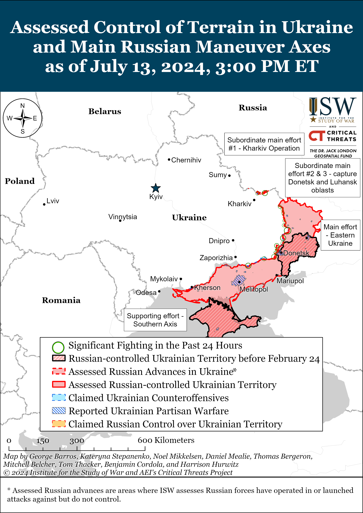
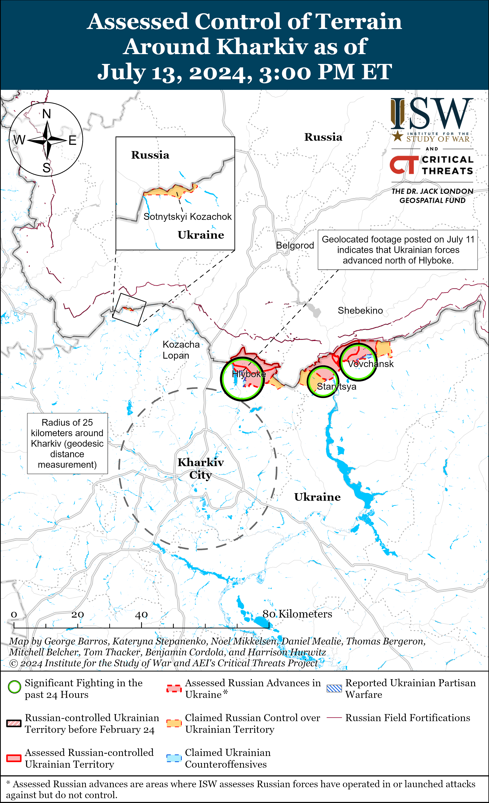
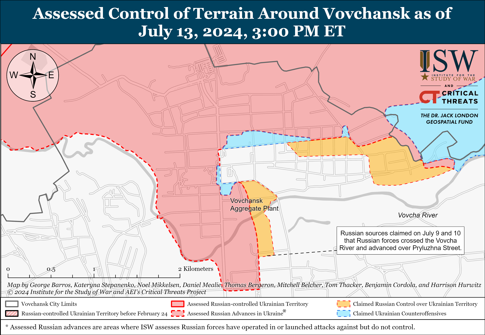
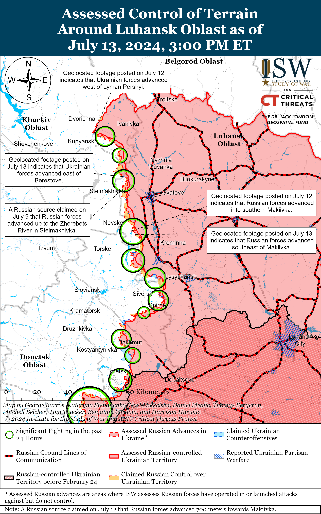
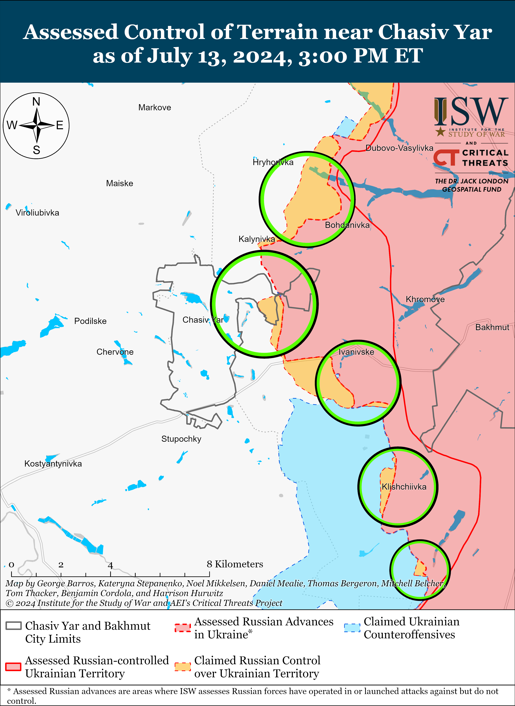
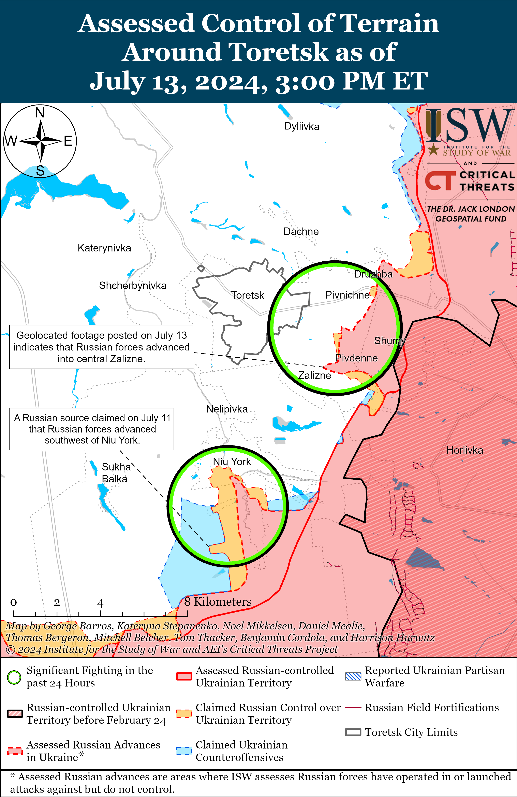
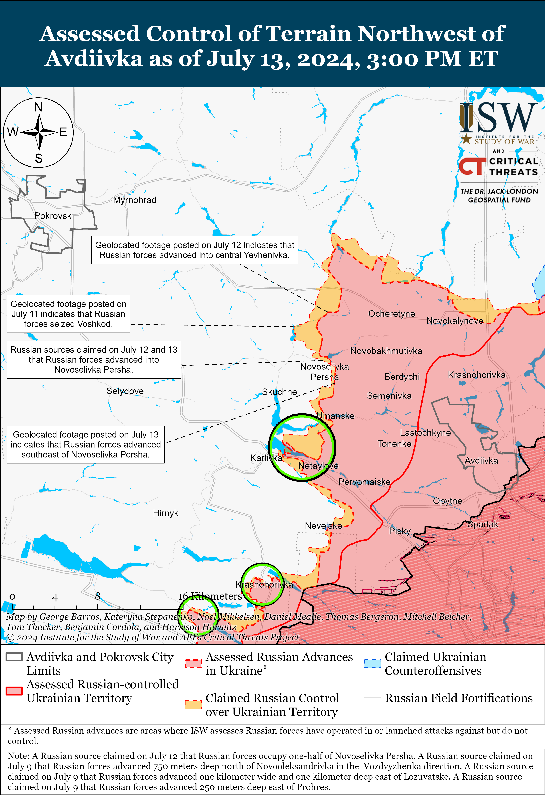
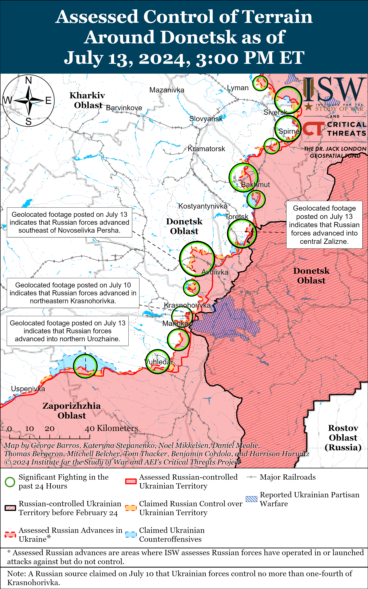
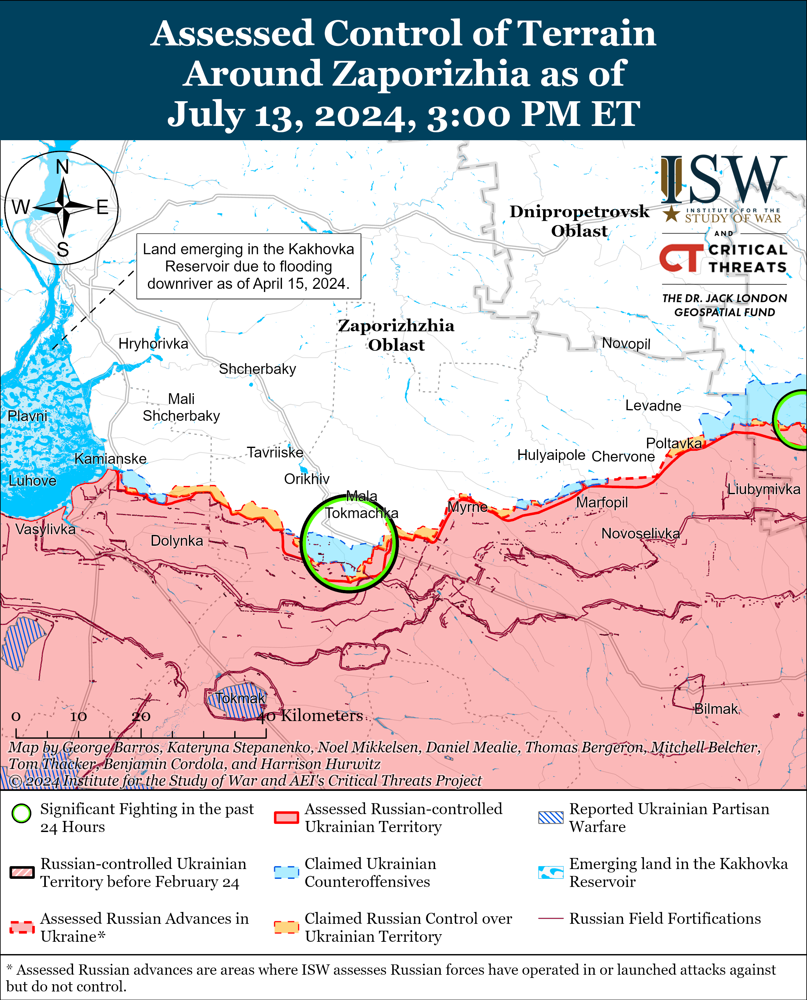
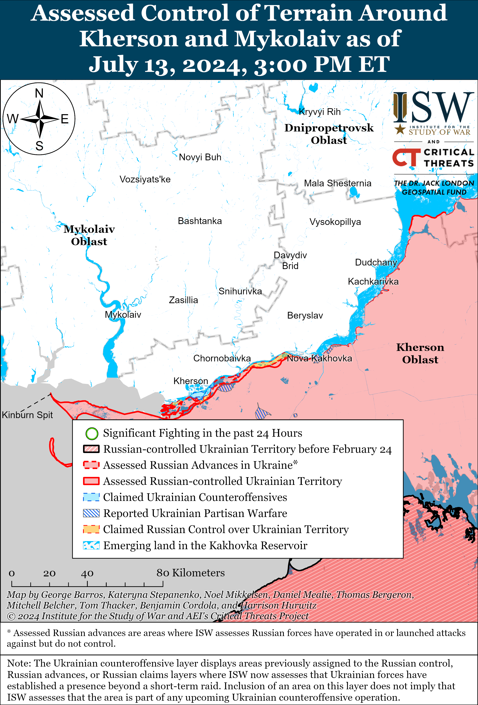

# Russian Offensive Campaign Assessment, July 13, 2024

**Angelica Evans, Riley Bailey, Nicole Wolkov, Christina Harward, and Frederick W. Kagan**

**July 13, 2024, 4:35pm ET**

**Click**[**here**](https://storymaps.arcgis.com/stories/36a7f6a6f5a9448496de641cf64bd375)**to see ISW’s interactive map of the Russian invasion of Ukraine. This map is updated daily alongside the static maps present in this report.**

**Click**[**here**](https://understandingwar.maps.arcgis.com/apps/instant/3dviewer/index.html?appid=1602762dbcde419bb957dea358449580)**to see ISW’s 3D control of terrain topographic map of Ukraine. Use of a computer (not a mobile device) is strongly recommended for using this data-heavy tool.**

**Click**[**here**](https://storymaps.arcgis.com/stories/733fe90805894bfc8562d90b106aa895)**to access ISW’s archive of interactive time-lapse maps of the Russian invasion of Ukraine. These maps complement the static control-of-terrain map that ISW produces daily by showing a dynamic frontline. ISW will update this time-lapse map archive monthly.**

**Note: The data cut-off for this product was 12pm ET on July 13. ISW will cover subsequent reports in the July 14 Russian Offensive Campaign Assessment.**

**Ukraine’s Security Service (SBU) reportedly conducted successful drone strikes against an oil depot near Tsimlyansk, Rostov Oblast on the morning of July 13.**Ukrainian outlet*Suspilne* reported that its sources stated that SBU drones struck the oil depot, which stored various grades of gas and diesel fuel.[1] Russian sources amplified footage showing the fire at an oil depot near Tsimlyansk, Rostov Oblast (156km northeast of Rostov-on-Don), and Rostov Oblast Head Vasily Golubev confirmed that a drone strike caused the fire.[2] A Ukrainian military observer told Ukrainian media that Ukrainian forces are targeting Russian military logistics, including oil depots, and that Rostov Oblast is one of Russia’s most important military logistics hubs.[3]

**Russia and Iran continue to signal their commitment to deepening bilateral relations and multilateral cooperation.**Iranian President-elect Masoud Pezeshkian published an article in the*Tehran Times* on July 12 in which Pezeshkian praised the People’s Republic of China (PRC) and Russia for standing by Iran during “challenging times.”[4] Pezeshkian stated that Russia is a “valued strategic ally and neighbor” to Iran and that his government will remain committed to expanding and prioritizing bilateral and multilateral cooperation with Russia, including through BRICS, the Shanghai Cooperation Organization (SCO), and the Eurasian Economic Union (EAEU). Pezeshkian claimed that Iran “strives for peace” between Russia and Ukraine and is prepared to support initiatives aimed at peace. Russian Ambassador to Iran Alexei Dedov stated during an interview with Russian state news agency *RIA Novosti* published on July 13 that Russia will pursue the same strategic course with Iran under Pezeshkian as Russia pursued under deceased Iranian President Ebrahim Raisi.[5] Dedov claimed that Russia is prepared to consider peace mediation proposals from Iran, although Russian President Vladimir Putin recently rejected the possibility of any third-party mediation efforts between Russia and Ukraine.[6] Dedov stated that Russia and Iran will sign a comprehensive strategic partnership agreement in the “foreseeable future,” but did not provide a concrete timeline for this agreement.

**A detained Russian businessman and a Russian military official who were reportedly connected to detained former Deputy Defense Minister Timur Ivanov recently died on the same day.**Russian media reported that Igor Kotelnikov, a businessman accused of bribing senior officials in the Russian Ministry of Defense (MoD), died of heart failure in a detention facility in Moscow on July 8.[7] A Russian insider source claimed that Russian Federal Security (FSB) officers were attempting to pressure Kotelnikov to testify against Ivanov and other unnamed MoD officials when Kotelnikov fell ill in solitary confinement.[8] A Wagner-affiliated milblogger claimed that Kotelnikov had agreed with FSB military counterintelligence to testify against Ivanov.[9] Russian media reported that the head of the MoD’s State Examination Department and Ivanov’s former subordinate, Magomed Khandayev, also died on July 8 in Moscow of unspecified causes.[10] Russian authorities reportedly questioned Khandayev as a witness in Ivanov’s case, but Khandayev was not facing any criminal charges of his own.[11] Russian authorities arrested Ivanov on April 24, 2024, on charges of accepting bribes, and Ivanov’s arrest was the first arrest part of an ongoing large-scale removal of Russian defense officials.[12]

**Armenian border guards, cooperating with Russian authorities, reportedly detained a Russian citizen in Yerevan, likely as part of a continued Kremlin effort to assert political power over Armenia and challenge Armenia’s sovereignty amid deteriorating Russian-Armenian relations.**Russian opposition outlet *Agentstvo Novosti* reported on July 13, citing two sources familiar with the matter, that Armenian border guards detained Natalia Taranushenko, whom the Russian Ministry of Internal Affairs (MVD) placed on its wanted list for spreading false information about Russia’s invasion of Ukraine, at the Yerevan airport.[13] *Agentstvo Novosti’s*sources reported that Armenian border guards detained Taranushenko and transferred her to local police officials, who then released her on the agreement she appear at local law enforcement agencies. The sources also stated that Russian authorities “forced” Armenian security authorities to cooperate and that Armenian police contacted their Russian counterparts. Russian military police of the 102nd Military Base previously detained Russian citizens in Armenia in December 2023 and April 2024 without notifying the Armenian authorities.[14]

**Key Takeaways:**

- **Ukraine’s Security Service (SBU) reportedly conducted successful drone strikes against an oil depot near Tsimlyansk, Rostov Oblast on the morning of July 13.**
- **Russia and Iran continue to signal their commitment to deepening bilateral relations and multilateral cooperation.**
- **A detained Russian businessman and a Russian military official who were reportedly connected to detained former Deputy Defense Minister Timur Ivanov recently died on the same day.**
- **Armenian border guards, cooperating with Russian authorities, reportedly detained a Russian citizen in Yerevan, likely as part of a continued Kremlin effort to assert political power over Armenia and challenge Armenia’s sovereignty amid deteriorating Russian-Armenian relations.**
- **Ukrainian forces recently regained lost positions near Kupyansk and Svatove, and Russian forces recently advanced near Kreminna, Toretsk and Avdiivka and in the Donetsk-Zaporizhia Oblast border area.**
- **The Russian military continues efforts to improve training capacity.**

[****](https://understandingwar.org/wp-content/uploads/2025/05/DraftUkraineCoT20July20132C202024.png)

***We do not report in detail on Russian war crimes because these activities are well-covered in Western media and do not directly affect the military operations we are assessing and forecasting. We will continue to evaluate and report on the effects of these criminal activities on the Ukrainian military and the Ukrainian population and specifically on combat in Ukrainian urban areas. We utterly condemn Russian violations of the laws of armed conflict and the Geneva Conventions and crimes against humanity even though we do not describe them in these reports.***

- Russian Main Effort – Eastern Ukraine (comprised of three subordinate main efforts)
- Russian Subordinate Main Effort #1 – Push Ukrainian forces back from the international border with Belgorod Oblast and approach to within tube artillery range of Kharkiv City
- Russian Subordinate Main Effort #2 – Capture the remainder of Luhansk Oblast and push westward into eastern Kharkiv Oblast and encircle northern Donetsk Oblast
- Russian Subordinate Main Effort #3 – Capture the entirety of Donetsk Oblast
- Russian Supporting Effort – Southern Axis
- Russian Air, Missile, and Drone Campaign
- Russian Mobilization and Force Generation Efforts
- Russian Technological Adaptations
- Activities in Russian-occupied areas
- Ukrainian Defense Industrial Base Efforts
- Russian Information Operations and Narratives
- Significant Activity in Belarus

**Russian Main Effort – Eastern Ukraine**

**Russian Subordinate Main Effort #1 – Kharkiv Oblast****(Russian objective: Push Ukrainian forces back from the international border with Belgorod Oblast and approach to within tube artillery range of Kharkiv City)**

Russian forces continued ground attacks north and northeast of Kharkiv City on July 13, but there were no confirmed changes to the frontline.[15] A Russian milblogger claimed that Russian forces pushed Ukrainian forces to the south bank of the Vovcha River in Vovchansk (northeast of Kharkiv City), although another milblogger denied reports that Russian forces have crossed the Vovcha River along Hurkanivska Street.[16] Fighting continued north of Kharkiv City near Hlyboke and Lyptsi and northeast of Kharkiv City near Starytsya, Vovchansk, and Tykhe on July 12 and 13.[17] The Ukrainian Kharkiv Group of Forces reported on July 13 that Russian forces are attempting to regroup in the direction of Lyptsi and within Vovchansk and are preparing elements of the 153rd Motorized Rifle Regiment (47th Tank Division, 1st Guards Tank Army [GTA], Moscow Military District [MMD]) and 138th Motorized Rifle Brigade (6th Combined Arms Army [CAA], Leningrad Military District [LMD]) for attacks within Vovchansk.[18]

**Russian Subordinate Main Effort #2 – Luhansk Oblast****(Russian objective: Capture the remainder of Luhansk Oblast and push westward into eastern Kharkiv Oblast and northern Donetsk Oblast)**

Ukrainian forces recently advanced amid continued Russian assaults along the Kupyansk-Svatove-Kreminna line on July 12 and 13. Geolocated footage published on July 12 indicates that Ukrainian forces recently advanced in a forest area west of Lyman Pershyi (northwest of Kupyansk) and east of Berestove (northwest of Svatove).[19] Additional geolocated footage published on July 12 and 13 indicates that Russian forces recently advanced within southern Makiivka (northwest of Kreminna) and southeast of the settlement.[20] A Russian milblogger claimed that Russian forces advanced 700 meters from Novovodyane (northwest of Svatove) towards Makiivka and that Russian forces are roughly 700 to 800 meters from the northern outskirts of Makiivka.[21] Russian milbloggers also claimed that Russian forces advanced near Berestove and Pishchane (both northwest of Svatove) and up to the east (left) bank of the Zherebets River within Stelmakhivka (northwest of Svatove).[22] Russian forces continued assaults northwest of Kupyansk near Vilshana, west of Kupyansk near Petropavlivka and Stepova Novoselivka, southwest of Svatove near Hrekivka and Nevske, west of Kreminna near Terny and Torske, and southwest of Kreminna near the Serebryanske forest area.[23] Elements of the Russian 1486th Motorized Rifle Regiment (likely comprised of mobilized personnel) are reportedly operating near Lyman Pershyi.[24]

[****](https://understandingwar.org/wp-content/uploads/2025/05/Luhansk20Battle20Map20Draft20July20132C202024.png)

**Russian Subordinate Main Effort #3 – Donetsk Oblast****(Russian objective: Capture the entirety of Donetsk Oblast, the claimed territory of Russia’s proxies in Donbas)**

Russian forces continued offensive operations in the Siversk direction on July 13, but there were no confirmed changes to the frontline in this area. Russian forces continued offensive operations northeast of Siversk near Bilohorivka, east of Siversk near Verkhnokamyanske, southeast of Siversk near Spirne, and south of Siversk near Rozdolivka and Vyimka on July 12 and 13.[25] A Russian milblogger claimed that Russian forces advanced three kilometers towards Pereizne from Vesele (both south of Siversk), but ISW has not observed confirmation of this claim.[26]

Russian forces continued offensive operations near Chasiv Yar on July 13, but there were no confirmed changes to the frontline in this area. Russian forces continued offensive operations near Chasiv Yar, north of Chasiv Yar near Hryhorivka, east of Chasiv Yar near Ivanivske, and southeast of Chasiv Yar near Andriivka and Klishchiivka on July 12 and 13.[27] A Russian milblogger claimed that small groups of Russian forces are advancing towards the Siverskyi-Donets Donbas Canal in the area southwest of Kalynivka.[28] Elements of the Chechen “Akhmat” Spetsnaz are reportedly operating near Ozaryanivka (southeast of Chasiv Yar), and elements of the Russian 1442nd Motorized Rifle Regiment (6th Motorized Rifle Division, 3rd Army Corps [AC]) and the “Hispaniola” Volunteer Brigade (Russian Volunteer Corps) are reportedly operating in the Chasiv Yar direction.[29]

Russian forces recently made confirmed advances near Toretsk amid continued offensive operations in the area on July 13. Geolocated footage published on July 13 indicates that Russian forces recently advanced along Pershotravneva Street within Zalizne (southeast of Toretsk).[30] A Russian milblogger claimed that Russian forces advanced to the eastern outskirts of Pivnichne (southeast of Toretsk) and 400 meters within Niu York (south of Toretsk), but ISW has not observed confirmation of these claims.[31] Russian forces continued offensive operations near Toretsk, east of Toretsk near Druzhba, southeast of Toretsk near Zalizne and Pivnichne, and south of Toretsk near Niu York on July 12 and 13.[32]

Russian forces recently advanced near Avdiivka amid continued offensive operations in the area on July 13. Geolocated footage published on July 12 and 13 indicates that Russian forces recently advanced within eastern Yevhenivka (northwest of Avdiivka) and southeast of Novoselivka Persha (northwest of Avdiivka).[33] Russian milbloggers claimed that Russian forces also advanced within Novoselivka Persha and up to five kilometers wide and 1.2 kilometers deep north and east of the settlement.[34] Russian sources claimed that Russian forces have almost completely seized Yevhenivka and control half of Novoselivka Persha.[35] Russian sources also claimed that Russian forces advanced north of Novooleksandrivka (northwest of Avdiivka), west of Yevhenivka, towards Prohres (northwest of Avdiivka), near Karlivka and the Karlivske Reservoir (both southwest of Avdiivka), and 450 meters south of Vozdvyzhenka (northwest of Avdiivka).[36] ISW has not observed visual confirmation of these various Russian claims, however. Russian forces continued offensive operations north of Avdiivka near Oleksandropil; northwest of Avdiivka near Kalynove, Novooleksandrivka, Vozdvyzhenka, Lozuvatske, Prohres, Novoselivka Persha, and Sokil; west of Avdiivka near Yasnobrodivka; and southwest of Avdiivka near Karlivka on July 12 and 13.[37]

Russian forces continued offensive operations west and southwest of Donetsk City on July 13, but there were no confirmed changes to the frontline in this area. Russian milbloggers claimed that Russian forces advanced up to two kilometers within Krasnohorivka, but ISW has not observed confirmation of these claims.[38] Russian forces continued offensive operations west of Donetsk City near Krasnohorivka and southwest of Donetsk City near Kostyantynivka, Pobieda, Paraskoviivka, and Vodyane on July 12 and 13.[39] Elements of the Russian 5th Motorized Rifle Brigade (1st Donetsk People’s Republic [DNR] AC) are reportedly operating near Krasnohorivka.[40]

Russian forces recently made confirmed advances in the Donetsk-Zaporizhia Oblast border area as select Russian milbloggers claimed that Russian forces seized Urozhaine. Geolocated footage published on July 13 indicates that Russian forces recently advanced within northern Urozhaine (south of Velyka Novosilka).[41] Select Russian milbloggers differed in their claims that Russian forces either completely or partially seized Urozhaine.[42] Russian sources credited elements of the Russian 37th Motorized Rifle Brigade, 5th Tank Brigade, 30th Artillery Brigade (all 36th Combined Arms Army, Eastern Military District [EMD]), and 40th Naval Infantry Brigade (Pacific Fleet, EMD) with Russian advances within Urozhaine.[43] The Ukrainian General Staff reported that Russian forces significantly intensified offensive operations in the Vremivka direction (Donetsk-Zaporizhia Oblast border area) on July 13.[44] Positional engagements continued near Velyka Novoselivka and Makarivka (south of Velyka Novoselivka) on July 13.[45]

[****](https://understandingwar.org/wp-content/uploads/2025/05/Donetsk20Battle20Map20Draft20July20132C202024.png)

**Russian Supporting Effort – Southern Axis****(Russian objective: Maintain frontline positions and secure rear areas against Ukrainian strikes)**

Ukrainian forces reportedly advanced in western Zaporizhia Oblast amid continued Russian ground attacks in the area on July 12 and 13. A Russian milblogger claimed that Ukrainian forces seized several forest areas north of Dorozhnyanka (south of Hulyaipole).[46] Fighting continued near Robotyne and Mala Tokmachka (northeast of Robotyne) and northwest of Verbove (east of Robotyne).[47] Elements of the Russian 22nd Spetsnaz Brigade (Russian General Staff Main Directorate [GRU]) are reportedly operating in the Zaporizhia direction.[48]

A Russian milblogger claimed that Russian forces continued assaults on islands in the Dnipro River Delta on July 13.[49] Russian forces conducted several glide bomb strikes against Ukrainian positions in the west (right) bank of Kherson Oblast.[50]

**Russian Air, Missile, and Drone Campaign****(Russian Objective: Target Ukrainian military and civilian infrastructure in the rear and on the frontline)**

Russian forces conducted a limited number of drone strikes against Ukraine on the night of July 12 to 13. Ukrainian Air Force Commander Lieutenant General Mykola Oleshchuk stated that Russian forces launched five Shahed-136/131 drones from Primorsko-Akhtarsk, Krasnodar Krai, and that Ukrainian mobile fire groups shot down four of the drones.[51] Oleshchuk reported that the fifth Russian Shahed drone left Ukrainian airspace and entered airspace over Gomel Oblast, Belarus.[52] The Belarusian Hajun Project stated on July 13 that a Shahed drone entered Belarusian airspace on the morning of July 13 and flew 350 kilometers to Vitebsk Oblast.[53] The Belarusian Hajun Project stated that Belarusian forces sortied a Mi-24 helicopter and an Su-30 fixed wing aircraft to intercept the Shahed but that the status of the Shahed drone is unknown.[54] The Belarusian Hajun Project reported on July 12 that a Russian Shahed drone entered Belarusian airspace from Chernihiv Oblast and loitered for an hour before reentering Ukrainian airspace to target Kyiv Oblast.[55] Belarus has previously allowed Russian forces to attack Ukraine with high-precision weapons from Belarusian airspace.[56]

**Russian Mobilization and Force Generation Efforts****(Russian objective: Expand combat power without conducting general mobilization)**

The Russian military continues efforts to improve training capacity. The Russian MoD posted footage on July 12 showing Russian Deputy Defense Minister Colonel General Yunus-Bek Yevkurov inspecting a training ground in Molkino, Krasnodar Krai, and reported that the MoD is modernizing training facilities.[57] The Russian MoD stated that it is creating new training facilities, specifically to train drone operators.[58]

**Russian Technological Adaptations****(Russian objective: Introduce technological innovations to optimize systems for use in Ukraine)**

Rostec subsidiary Cyclone Central Research Institute claimed on July 12 that it has developed a neural network for optical drone detectors that can increase detection ranges by 40 percent.[59] Cyclone Central Research Institute stated that the neural network will automate drone detection and notify operators of further measures required to suppress incoming drones.[60]

Russian forces reportedly struggle with consistent electronic warfare (EW) coverage in Ukraine. A Russian milblogger who claimed to have recently returned from combat operations on the front alleged on July 13 that Russian forces have sufficient EW capabilities but that there are issues with continuous EW coverage since EW devices can “overheat” after 30 to 40 minutes of use.[61]

**Ukrainian Defense Industrial Efforts****(Ukrainian objective: Develop its defense industrial base to become more self-sufficient in cooperation with US, European, and international partners)**

*ISW is not publishing coverage of the Ukrainian defense industrial effort today.*

**Activities in Russian-occupied areas (Russian objective: Consolidate administrative control of annexed areas; forcibly integrate Ukrainian citizens into Russian sociocultural, economic, military, and governance systems)**

*ISW is not publishing coverage of activities in Russian-occupied areas today.*

**Russian Information Operations and Narratives**

The Ukrainian Kharkiv Group of Forces warned on July 13 that Russian actors on the internet are spreading a false conspiracy theory about territorial recruitment centers, which recruit Ukrainian military personnel, to undermine trust in Ukrainian authorities and ongoing Ukrainian mobilization efforts.[62] The Ukrainian Kharkiv Group of Forces reported that Russian online actors are claiming that the Russian Federal Security Service (FSB) created territorial recruitment centers in Ukraine and noted that select Western academics are amplifying this false narrative.

Kremlin officials continue to falsely portray Western responses to Russian aggression as unprompted escalations and endangering Europe. Kremlin Spokesperson Dmitry Peskov claimed on July 13 that Russia has identified European targets in response to the US deployment of long-range missiles to Germany.[63] The Kremlin has been using nuclear saber rattling and escalatory language, including conducting tactical nuclear exercises and announcing its intent to no longer follow the provisions of the Intermediate-Range Nuclear Forces treaty, as part of its reflexive control campaign aimed at influencing Western decision-making at key moments to stymie support for Ukraine.

**Significant activity in Belarus****(Russian efforts to increase its military presence in Belarus and further integrate Belarus into Russian-favorable frameworks and Wagner Group activity in Belarus)**

The Belarusian Ministry of Defense (MoD) stated on July 13 that 50 Belarusian Special Operations Forces personnel departed for the Taktal military training ground in Kazakhstan to participate in the “Summit of Brotherhood – 2024” joint training exercises.[64]

**Note: ISW does not receive any classified material from any source, uses only publicly available information, and draws extensively on Russian, Ukrainian, and Western reporting and social media as well as commercially available satellite imagery and other geospatial data as the basis for these reports. References to all sources used are provided in the endnotes of each update.**

****

---

[1] https://suspilne dot media/789539-status-ubd-mozna-bude-oformiti-v-dii-rf-obstrilala-mirnograd-e-zagibli-870-den-vijni-onlajn/?anchor=live\_1720883499&utm\_source=copylink&utm\_medium=ps

[2] https://t.me/tass\_agency/260344 ; https://t.me/bbcrussian/67688 ; https://t.me/severrealii/26068 ; https://t.me/ostorozhno\_novosti/27684 ; https://t.me/astrapress/59592 ; https://t.me/RVvoenkor/72354 ; https://t.me/idelrealii/36399

[3] https://24tv dot ua/pozhezha-naftobazi-rostovi-chomu-vazhlivo-biti-po-tsih-obyektah\_n2596325 ; https://tsn dot ua/ru/ato/komandovanie-vsu-unichtozhaet-logistiku-rossiyan-dlya-fronta-svitan-rasskazal-detali-2620497.html

[4] https://www.tehrantimes dot com/news/501077/My-message-to-the-new-world

[5] https://ria dot ru/20240713/dedov-1959269565.html

[6] https://ria dot ru/20240713/dedov-1959269565.html ; https://isw.pub/UkrWar070824

[7] https://www.mk dot ru/incident/2024/07/12/vyyasnilis-detali-smerti-v-karcere-sizo-figuranta-dela-o-khishheniyakh-v-minoborony.html ; https://meduza dot io/news/2024/07/13/v-moskve-v-sizo-umer-biznesmen-igor-kotelnikov-obvinyaemyy-v-dache-vzyatok-chinovnikam-minoborony-po-dannym-vchk-ogpu-ot-nego-trebovali-pokazaniya-protiv-timura-ivanova; https://t.me/severrealii/26073

[8] https://t.me/vchkogpu/49237

[9] https://t.me/grey\_zone/23551

[10] https://www.rbc dot ru/rbcfreenews/6692b6209a79477f2524fcc8 ; https://ria dot ru/20240709/khandaev-1958608472.html ; https://rtvi dot com/news/umer-glava-upravleniya-gosudarstvennoj-ekspertizy-minoborony/

[11] https://lenta dot ru/news/2024/07/13/dvoe-priblizhennyh-k-byvshemu-zamministra-oborony-ivanovu-skonchalis-v-odin-den-chto-izvestno-ob-ih-smertyah/

[12] https://isw.pub/UkrWar060924 ; https://isw.pub/UkrWar042424

[13] https://t.me/agentstvonews/6598 ; https://t.me/mediazona\_exclusive/1834

[14] https://understandingwar.org/backgrounder/russian-offensive-campaign-assessment-april-9-2024

[15] https://armyinform.com dot ua/2024/07/13/potopyly-rusnyu-v-dnipri-shturm-posadky-pid-obstrilom-orka-rozirvalo-strim-iz-pryfrontovogo-mista/ ; https://www.youtube.com/watch?v=ywMCzEVlTIE

[16] https://t.me/DnevnikDesantnika/12685 ; https://t.me/voin\_dv/9733

[17] https://www.facebook.com/GeneralStaff.ua/posts/pfbid0oaGMx3xFeXXZHyMxFPYma1GK7RSrZ1brxyubQ7BruqPoHyPTYDQZTMtqFvYPuDkXl ; https://www.facebook.com/GeneralStaff.ua/posts/pfbid02HprWz7drk6r6XeUEPeQQWFbv1vBHtnMmzJamq2ifJ1pPzjimrvvdrv78yc7fv8UDl ; https://t.me/dva\_majors/47182 ; https://t.me/wargonzo/21007 ; https://t.me/motopatriot/24851 ; https://t.me/motopatriot/24852

[18] https://t.me/otukharkiv/240

[19] https://x.com/moklasen/status/1811868469421314063; https://t.me/RVvoenkor/72345 ; https://x.com/giK1893/status/1812059912186327471; https://t.me/lihoradka\_team/182

[20] https://t.me/creamy\_caprice/6048; https://t.me/ZSU\_115OMBr/355; https://x.com/giK1893/status/1811880547691434204 ; https://x.com/giK1893/status/1812074758957105239; https://t.me/kulgavysnayper/13160; https://t.me/creamy\_caprice/6059

[21] https://t.me/DnevnikDesantnika/12657

[22] https://t.me/DnevnikDesantnika/12669 ; https://t.me/dva\_majors/47182

[23] https://www.facebook.com/GeneralStaff.ua/posts/pfbid02HprWz7drk6r6XeUEPeQQWFbv1vBHtnMmzJamq2ifJ1pPzjimrvvdrv78yc7fv8UDl ; https://www.facebook.com/GeneralStaff.ua/posts/pfbid0oaGMx3xFeXXZHyMxFPYma1GK7RSrZ1brxyubQ7BruqPoHyPTYDQZTMtqFvYPuDkXl ; https://www.facebook.com/GeneralStaff.ua/posts/pfbid0234eUMxsgVCNpeKbQk2rtYHFss9DeNDWzW4n4YXktTp8J8b3iWyezhnNjd7JZDE6Ql

[24] https://t.me/RVvoenkor/72345

[25] https://www.facebook.com/GeneralStaff.ua/posts/pfbid0oaGMx3xFeXXZHyMxFPYma1GK7RSrZ1brxyubQ7BruqPoHyPTYDQZTMtqFvYPuDkXl; https://www.facebook.com/GeneralStaff.ua/posts/pfbid02HprWz7drk6r6XeUEPeQQWFbv1vBHtnMmzJamq2ifJ1pPzjimrvvdrv78yc7fv8UDl ; https://www.facebook.com/GeneralStaff.ua/posts/pfbid0234eUMxsgVCNpeKbQk2rtYHFss9DeNDWzW4n4YXktTp8J8b3iWyezhnNjd7JZDE6Ql; https://t.me/DnevnikDesantnika/12674

[26] https://t.me/DnevnikDesantnika/12674

[27] https://www.facebook.com/GeneralStaff.ua/posts/pfbid0oaGMx3xFeXXZHyMxFPYma1GK7RSrZ1brxyubQ7BruqPoHyPTYDQZTMtqFvYPuDkXl; https://www.facebook.com/GeneralStaff.ua/posts/pfbid02HprWz7drk6r6XeUEPeQQWFbv1vBHtnMmzJamq2ifJ1pPzjimrvvdrv78yc7fv8UDl ; https://www.facebook.com/GeneralStaff.ua/posts/pfbid0234eUMxsgVCNpeKbQk2rtYHFss9DeNDWzW4n4YXktTp8J8b3iWyezhnNjd7JZDE6Ql; https://t.me/RVvoenkor/72367; https://t.me/wargonzo/21007

[28] https://t.me/RVvoenkor/72367

[29] https://t.me/DnevnikDesantnika/12683; https://t.me/dva\_majors/47204 ; https://t.me/spainrus/1425

[30] https://x.com/small10space/status/1812010969515573275 ; https://x.com/99Dominik\_/status/1812020599222382715 ; https://www.facebook.com/share/v/sN2teBq96TtVipwj/

[31] https://t.me/DnevnikDesantnika/12680

[32] https://www.facebook.com/GeneralStaff.ua/posts/pfbid0oaGMx3xFeXXZHyMxFPYma1GK7RSrZ1brxyubQ7BruqPoHyPTYDQZTMtqFvYPuDkXl ; https://www.facebook.com/GeneralStaff.ua/posts/pfbid02HprWz7drk6r6XeUEPeQQWFbv1vBHtnMmzJamq2ifJ1pPzjimrvvdrv78yc7fv8UDl ; https://www.facebook.com/GeneralStaff.ua/posts/pfbid0234eUMxsgVCNpeKbQk2rtYHFss9DeNDWzW4n4YXktTp8J8b3iWyezhnNjd7JZDE6Ql

; https://t.me/dva\_majors/47182; https://t.me/wargonzo/21007

[33] https://t.me/creamy\_caprice/6058; https://t.me/Khortytsky\_wind/700 ; https://x.com/Bielitzling/status/1812080258935374131 ;

https://t.me/creamy\_caprice/6046; https://t.me/rsotmdivision/17845

[34] https://t.me/RVvoenkor/72339; https://t.me/RVvoenkor/72339; https://t.me/DnevnikDesantnika/12656; https://t.me/RVvoenkor/72356; https://t.me/z\_arhiv/27264; https://t.me/RVvoenkor/72369; https://t.me/wargonzo/21007; https://t.me/motopatriot/24799 ; https://t.me/boris\_rozhin/129866

[35] https://t.me/boris\_rozhin/129866; https://t.me/RVvoenkor/72339

[36] https://t.me/RVvoenkor/72339; https://t.me/DnevnikDesantnika/12656; https://t.me/z\_arhiv/27266; https://t.me/boris\_rozhin/129866; https://t.me/voenkorKotenok/57548

[37] https://www.facebook.com/GeneralStaff.ua/posts/pfbid0oaGMx3xFeXXZHyMxFPYma1GK7RSrZ1brxyubQ7BruqPoHyPTYDQZTMtqFvYPuDkXl; https://www.facebook.com/GeneralStaff.ua/posts/pfbid02HprWz7drk6r6XeUEPeQQWFbv1vBHtnMmzJamq2ifJ1pPzjimrvvdrv78yc7fv8UDl ; https://www.facebook.com/GeneralStaff.ua/posts/pfbid0234eUMxsgVCNpeKbQk2rtYHFss9DeNDWzW4n4YXktTp8J8b3iWyezhnNjd7JZDE6Ql; https://t.me/RVvoenkor/72339; https://t.me/dva\_majors/47182; https://t.me/RVvoenkor/72369; https://t.me/wargonzo/21007 ; https://t.me/boris\_rozhin/129897; https://t.me/boris\_rozhin/129866

[38] https://t.me/dva\_majors/47182; https://t.me/wargonzo/21007; https://t.me/DnevnikDesantnika/12687

[39] https://www.facebook.com/GeneralStaff.ua/posts/pfbid0oaGMx3xFeXXZHyMxFPYma1GK7RSrZ1brxyubQ7BruqPoHyPTYDQZTMtqFvYPuDkXl ; https://www.facebook.com/GeneralStaff.ua/posts/pfbid02HprWz7drk6r6XeUEPeQQWFbv1vBHtnMmzJamq2ifJ1pPzjimrvvdrv78yc7fv8UDl ; https://www.facebook.com/GeneralStaff.ua/posts/pfbid0234eUMxsgVCNpeKbQk2rtYHFss9DeNDWzW4n4YXktTp8J8b3iWyezhnNjd7JZDE6Ql; https://t.me/wargonzo/21007

[40] https://t.me/Sladkov\_plus/10979

[41] https://t.me/creamy\_caprice/6056; https://t.me/creamy\_caprice\_chat/139552

[42] https://t.me/NgP\_raZVedka/18370; https://t.me/rybar/61779

[43] https://t.me/boris\_rozhin/129894; https://t.me/z\_arhiv/27270 ; https://t.me/z\_arhiv/27275; https://t.me/RVvoenkor/72384; https://t.me/voin\_dv/9732

[44] https://www.facebook.com/GeneralStaff.ua/posts/pfbid0oaGMx3xFeXXZHyMxFPYma1GK7RSrZ1brxyubQ7BruqPoHyPTYDQZTMtqFvYPuDkXl

[45] https://www.facebook.com/GeneralStaff.ua/posts/pfbid0oaGMx3xFeXXZHyMxFPYma1GK7RSrZ1brxyubQ7BruqPoHyPTYDQZTMtqFvYPuDkXl

[46] https://t.me/DnevnikDesantnika/12675

[47] https://www.facebook.com/GeneralStaff.ua/posts/pfbid02HprWz7drk6r6XeUEPeQQWFbv1vBHtnMmzJamq2ifJ1pPzjimrvvdrv78yc7fv8UDl ; Qk2rtYHFss9DeNDWzW4n4YXktTp8J8b3iWyezhnNjd7JZDE6Ql ; https://t.me/wargonzo/21007

[48] https://t.me/dva\_majors/47188

[49] https://t.me/dva\_majors/47182

[50] https://t.me/milinfolive/125972 ; https://t.me/dva\_majors/47185 ; https://t.me/voin\_dv/9736 ; https://t.me/dva\_majors/47208 ; https://t.me/NeoficialniyBeZsonoV/37632 ; https://t.me/dva\_majors/47205

[51] https://t.me/ComAFUA/348

[52] https://t.me/ComAFUA/348

[53] https://t.me/Hajun\_BY/7999

[54] https://t.me/Hajun\_BY/7999

[55] https://t.me/Hajun\_BY/7989

[56] https://understandingwar.org/backgrounder/russian-offensive-campaign-assessment-december-11 ; https://isw.pub/RusCampaignOct11

[57] https://t.me/mod\_russia/40983

[58] https://t.me/mod\_russia/40983

[59] https://tass dot ru/ekonomika/21333145 ; https://www.gtlk dot ru/press\_room/massmedia/1167/

[60] https://tass dot ru/ekonomika/21333145 ; https://www.gtlk dot ru/press\_room/massmedia/1167/

[61] https://t.me/pgubarev/1026 ; https://t.me/voenkorKotenok/57550

[62] https://armyinform.com dot ua/2024/07/13/v-sylah-oborony-rozpovily-pro-novu-vorozhu-ipso-proty-mobilizacziyi/

[63] https://tass dot ru/politika/21353833

[64] https://t.me/modmilby/40331
