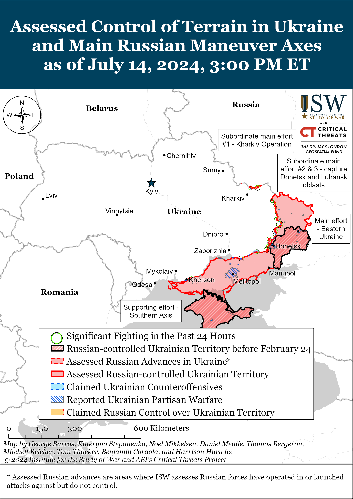
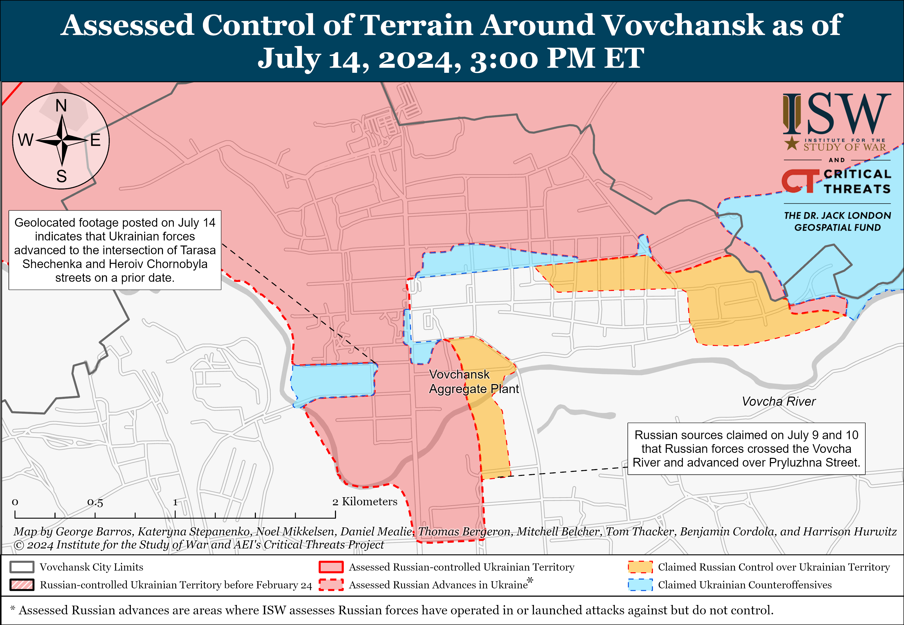
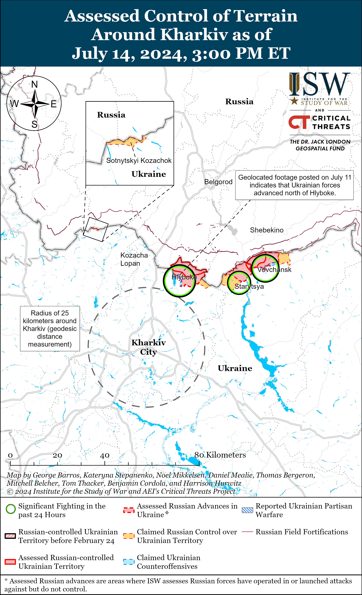
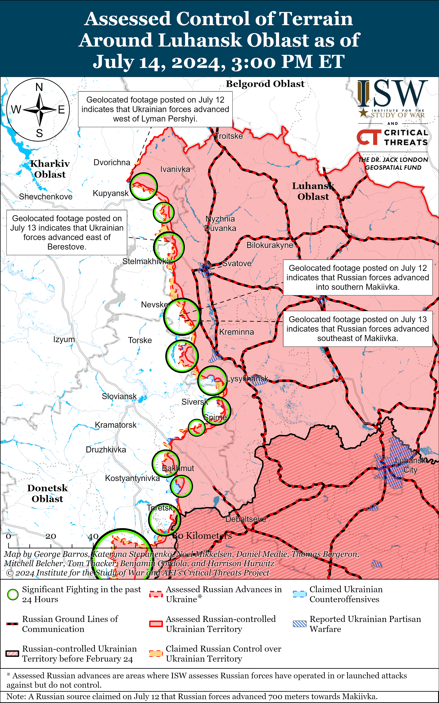
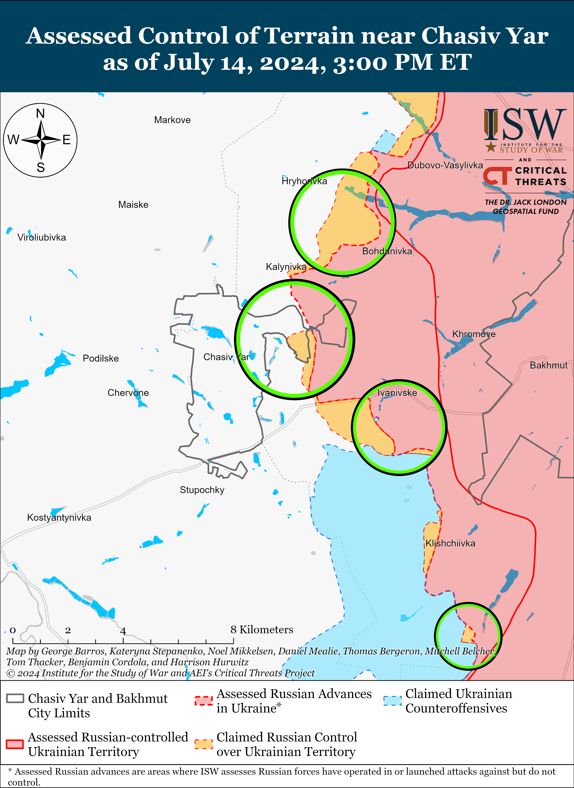
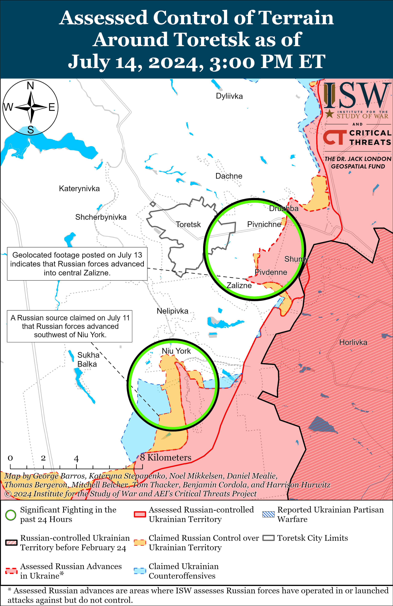
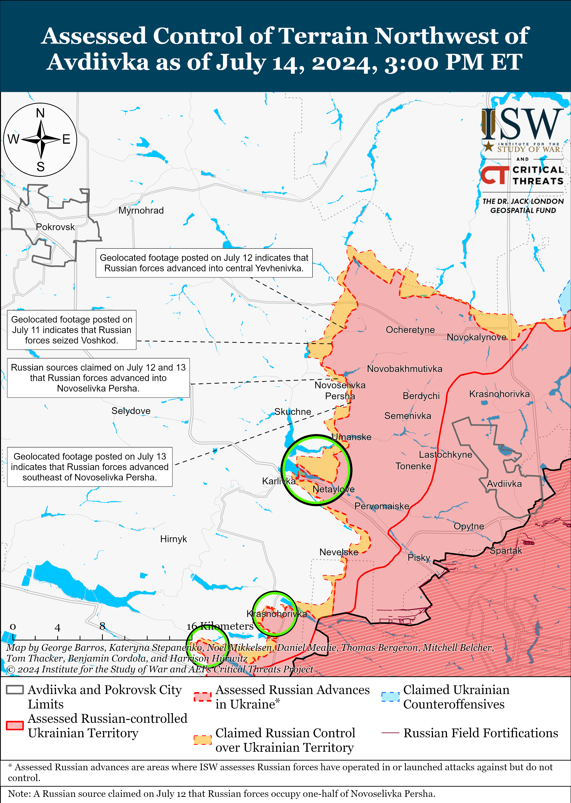
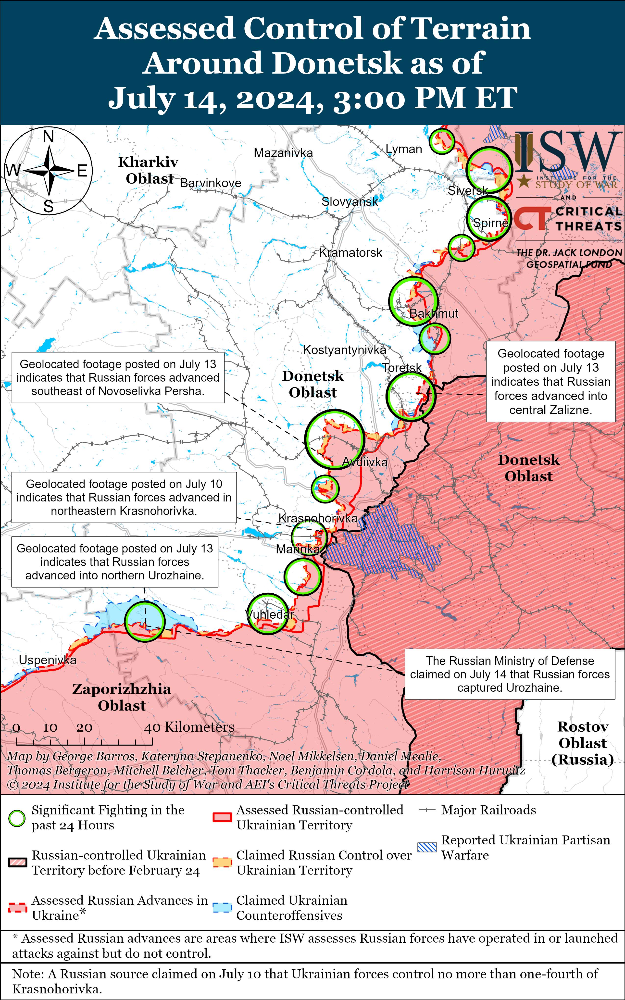
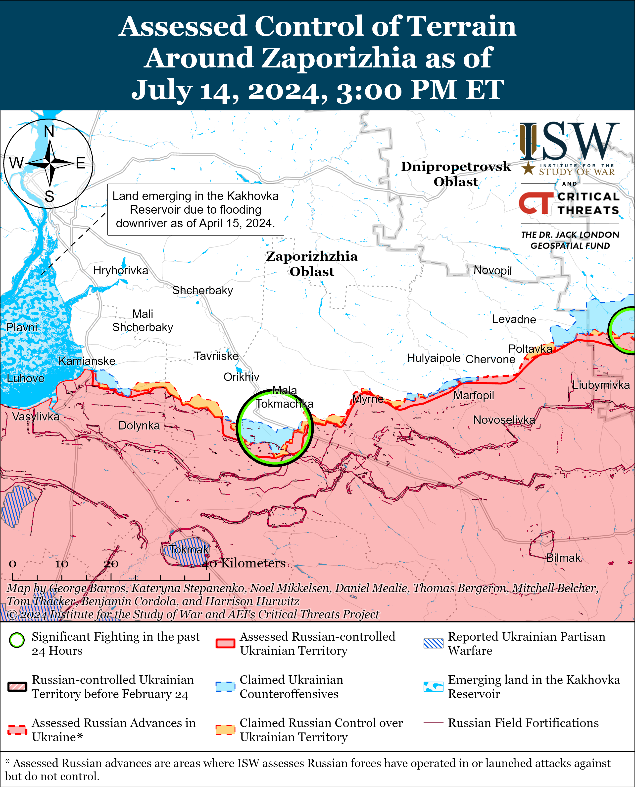
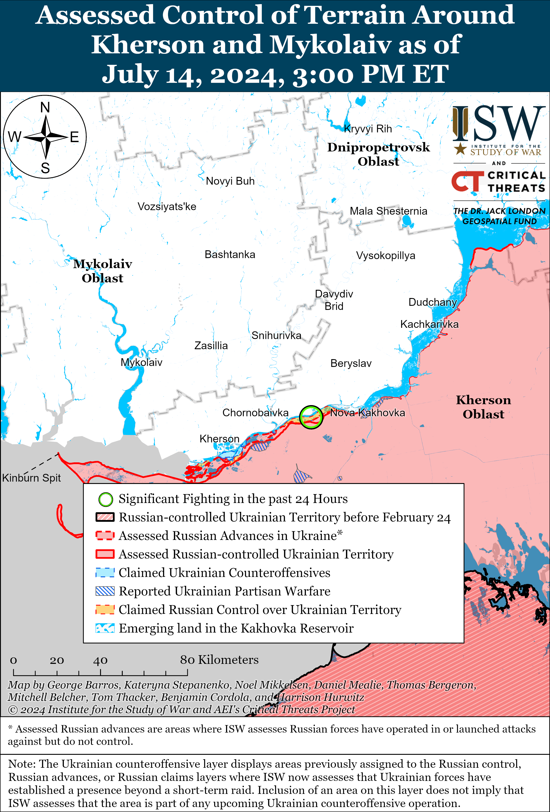

# Russian Offensive Campaign Assessment, July 14, 2024

**Christina Harward, Angelica Evans, Nicole Wolkov, Kateryna Stepanenko, and George Barros**

**July 14, 2024, 6pm ET**

**Click**[**here**](https://storymaps.arcgis.com/stories/36a7f6a6f5a9448496de641cf64bd375)**to see ISW’s interactive map of the Russian invasion of Ukraine. This map is updated daily alongside the static maps present in this report.**

**Click**[**here**](https://understandingwar.maps.arcgis.com/apps/instant/3dviewer/index.html?appid=1602762dbcde419bb957dea358449580)**to see ISW’s 3D control of terrain topographic map of Ukraine. Use of a computer (not a mobile device) is strongly recommended for using this data-heavy tool.**

**Click**[**here**](https://storymaps.arcgis.com/stories/733fe90805894bfc8562d90b106aa895)**to access ISW’s archive of interactive time-lapse maps of the Russian invasion of Ukraine. These maps complement the static control-of-terrain map that ISW produces daily by showing a dynamic frontline. ISW will update this time-lapse map archive monthly.**

**Note: The data cut-off for this product was 12pm ET on July 14. ISW will cover subsequent reports in the July 15 Russian Offensive Campaign Assessment.**

Note: This assessment has been updated to reflect that the Kharkiv Operational Tactical Group said that Russian forces are preparing assault groups of the153rd Motorized Rifle Regiment of the 47th Motorized Rifle Division. Not the 153rd Motorized Rifle Division (47th Tank Division)

**Russian officials and milbloggers reiterated complaints about poor security around critical infrastructure in rear areas of Russia in response to a July 13 Ukrainian drone strike against an oil depot near Tsimlyansk, Rostov Oblast.**Russian sources circulated footage on July 13 and 14 of two security guards armed with anti-drone guns seemingly watching a Ukrainian drone strike the oil depot without attempting to shoot down the drone and criticized the security guards for not defending the depot.[1] Russian sources alleged that Russian authorities have attempted to absolve themselves of responsibility for Ukrainian drone strikes by ordering Russian facilities to hire their own security and questioned why the Russian government has not organized mobile fire groups similar to Ukraine’s mobile fire groups that defend against Russian Shahed-136/131 drone strikes.[2] Former Roscosmos (Russian space agency) head and Zaporizhia Oblast occupation senator Dmitry Rogozin responded to milblogger criticism on July 14 and claimed that Rosgvardia – a security agency tasked with protecting Russian President Vladimir Putin‘s regime from internal threats and some critical infrastructure – does not have the necessary manpower to set up defense posts at every critical facility in Russia.[3] Rogozin suggested that Russia should form, train, and equip specialized BARS (Russian Combat Army Reserve) volunteer units to provide technical and armed protection of critical energy and transport infrastructure facilities and called on the Russian government and Russian President Vladimir Putin to consider his proposal. Rogozin supervises several BARS units including the Russian BARS-10 Battalion of the “Tsarskiye Volki” Brigade, and owners of Russian irregular formations have previously attempted to use threats to Russian territory in order to advocate for their forces to move from frontline areas in Ukraine to defend Russia’s rear and border areas.[4] Russian milbloggers have routinely complained about the Russian government’s inability to address and repel Ukrainian strikes against Russian infrastructure.[5]

**The Russian military command may have committed under-equipped units initially intended to act as an operational reserve to combat operations, possibly due to constraints on the Russian defense industrial base (DIB) or efforts to reinforce ongoing Russian grinding assaults in Ukraine.**Ukrainian military observer Kostyantyn Mashovets stated on July 13 that the Russian military command intended to form the 27th Motorized Rifle Division (2nd Combined Arms Army, Central Military District) as an operational reserve of the Central Grouping of Forces (the command currently overseeing Russian offensive operations in the Avdiivka and Toretsk directions) that could be brought into battle in the event of the development of a Ukrainian counteroffensive in the Avdiivka direction or a Russian offensive in the Toretsk direction.[6] Mashovets stated that the Russian military command, however, deployed the 27th Motorized Rifle Division’s 433rd Motorized Rifle Regiment, which is staffed by degraded remnants of the 21st Motorized Rifle Brigade, to the area northwest of Avdiivka before fully restoring its combat capability. Mashovets added that the Russian military command deployed the 506th and 589th motorized rifle regiments to the Toretsk direction ahead of schedule before the units reached their “planned terms.”[7] Mashovets stated in March 2024 that the Russian military command only planned to equip the units of the 27th Motorized Rifle Division with up to 87 percent of its doctrinally required amounts of weapons and equipment and that the Russian military command planned to have the 433rd, 506th, and 598th motorized rifle regiments ready for combat by late spring or early summer 2024.[8] ISW first observed reports of elements of the 27th Motorized Rifle Division operating near Avdiivka in April 2024 and near Toretsk in early July 2024.[9] Mashovets’ July 14 observation that these regiments deployed to combat earlier than planned, however, may suggest that the Russian military command fell behind the intended staffing and armament schedule and failed to equip these units up to the target 87 percent mark. ISW previously assessed that Russia’s ongoing force generation efforts are creating a marginal number of additional forces not immediately committed to the front as reinforcements that Russia can use to gradually establish operational reserves but that the Russian DIB is unlikely able to fully support Russia’s reserve manpower.[10] The Russian military command may also have deployed the units early in order to reinforce Russian forces’ ongoing grinding assaults in eastern Ukraine.[11]

**Ukraine signed a series of security agreements and received several aid packages amid and following the July 9-11 NATO summit.**NATO member states issued a declaration on July 10 announcing a Pledge of Long-Term Security Assistance for Ukraine of at least 40 billion euros (about $43 billion) within the next year that will purchase military equipment for Ukraine; fund the maintenance, logistics, and transportation of military equipment; fund military training for Ukrainian forces; invest in Ukraine’ defense industrial base (DIB); and supply non-lethal aid to Ukraine.[12] Ukrainian President Volodymyr Zelensky announced on July 11 that he signed a bilateral security agreement with Romanian President Klaus Iohannis and Iohaniss announced that Romania will transfer a Patriot air defense system to Ukraine at an unspecified future date.[13] Zelensky and Luxembourgish Prime Minister Luc Frieden signed a ten-year bilateral security agreement on July 10, and Zelensky and Polish Prime Minister Donald Tusk signed a security agreement requiring Poland to train Ukrainian volunteers and Ukrainian Legion units in Poland and provide Western equipment for the units.[14] Zelensky stated on July 14 that Ukraine is also negotiating agreements with Czechia, Slovenia, and Ireland.[15] The European Commission announced on July 13 that 21 countries and the European Union (EU) formed the Ukraine Compact that declares their support for Ukraine’s independence, sovereignty, and territorial integrity.[16] The Compact pledges to support Ukraine’s defensive needs, accelerate the development of Ukraine’s forces, and allow them to respond swiftly to future Russian aggression against Ukraine. Australia committed to contributing to the training of Ukrainian forces and allocated 250 million Australian dollars (about $170 million) worth of military aid to Ukraine on July 11 which includes air defense missiles, anti-tank weapons, and artillery ammunition.[17]

**Key Takeaways:**

- **Russian officials and milbloggers reiterated complaints about poor security around critical infrastructure in rear areas of Russia in response to a July 13 Ukrainian drone strike against an oil depot near Tsimlyansk, Rostov Oblast.**
- **The Russian military command may have committed under-equipped units initially intended to act as an operational reserve to combat operations, possibly due to constraints on the Russian defense industrial base (DIB) or efforts to reinforce ongoing Russian grinding assaults in Ukraine.**
- **Ukraine signed a series of security agreements and received several aid packages amid and following the July 9-11 NATO summit.**
- **Ukrainian forces recently regained lost positions near Vovchansk, and Russian forces recently advanced near Avdiivka.**
- **Russian State Duma Defense Committee Chairman Andrei Kartapolov reiterated on July 14 that the Russian Ministry of Defense (MoD) is not planning to demobilize servicemembers that Russia mobilized in Fall 2022 before the end of the war.**

[******](https://understandingwar.org/wp-content/uploads/2025/05/DraftUkraineCoTJuly20142C202024.png)

***We do not report in detail on Russian war crimes because these activities are well-covered in Western media and do not directly affect the military operations we are assessing and forecasting. We will continue to evaluate and report on the effects of these criminal activities on the Ukrainian military and the Ukrainian population and specifically on combat in Ukrainian urban areas. We utterly condemn Russian violations of the laws of armed conflict and the Geneva Conventions and crimes against humanity even though we do not describe them in these reports.***

- Russian Main Effort – Eastern Ukraine (comprised of three subordinate main efforts)
- Russian Subordinate Main Effort #1 – Push Ukrainian forces back from the international border with Belgorod Oblast and approach to within tube artillery range of Kharkiv City
- Russian Subordinate Main Effort #2 – Capture the remainder of Luhansk Oblast and push westward into eastern Kharkiv Oblast and encircle northern Donetsk Oblast
- Russian Subordinate Main Effort #3 – Capture the entirety of Donetsk Oblast
- Russian Supporting Effort – Southern Axis
- Russian Air, Missile, and Drone Campaign
- Russian Mobilization and Force Generation Efforts
- Russian Technological Adaptations
- Activities in Russian-occupied areas
- Ukrainian Defense Industrial Base Efforts
- Russian Information Operations and Narratives
- Significant Activity in Belarus

**Russian Main Effort – Eastern Ukraine**

**Russian Subordinate Main Effort #1 – Kharkiv Oblast****(Russian objective: Push Ukrainian forces back from the international border with Belgorod Oblast and approach to within tube artillery range of Kharkiv City)**

Ukrainian forces conducted localized counterattacks north and northeast of Kharkiv City on July 13 and 14 and recently regained limited positions in Vovchansk (northeast of Kharkiv City).[18] Geolocated footage published on July 14 showed elements of the Chechen 204th “Akhmat” Spetsnaz Regiment striking Ukrainian forces in northwestern Vovchansk, indicating that Ukrainian forces regained some positions in the area.[19] A Ukrainian source reported that Ukrainian forces repelled Russian forces, namely elements of the 245th Motorized Rifle Regiment (47th Tank Division, 1st Guard Tank Army, Moscow Military District [MMD]), from Sotnytskyi Kozachok (northwest of Kharkiv City).[20] ISW is unable to confirm this report at this time. Fighting continued in Vovchansk and near Hlyboke (north of Kharkiv City).[21] The Ukrainian National Guard reported that the number of Russian infantry attacks near Lyptsi (north of Kharkiv City) recently decreased, but Russian forces intensified airstrikes in the area.[22]

The Russian military command is reportedly regrouping troops in an effort to continue offensive operations in the Kharkiv direction.[23] Ukraine’s Kharkiv Operational Tactical Group reported the Russian military command transferred assault groups of the 155th Naval Infantry Brigade (Pacific Fleet) and the 18th Motorized Rifle Division (11th Army Corps [AC], Leningrad Military District [LMD]) from Morokhovets and Krasne (both northeast of Hlyboke) to sustain offensive operations in the Hlyboke area.[24] The Kharkiv Operational Tactical Group added that Russian forces are preparing assault groups of the 138th Motorized Rifle Brigade (6th Combined Arms Army [CAA], LMD) and 153rd Motorized Rifle Regiment of the 47th Motorized Rifle Division in the Vovchansk area for further offensive operations. The Kharkiv Operational Tactical Group added that Russian forces cannot evacuate wounded personnel on certain parts of the Kharkiv frontline, resulting in the deterioration of the epidemiological situation. A Russian milblogger claimed that the Russian Northern Grouping of Forces (GoF), which is responsible for the offensive in the Kharkiv direction, only has 30,000 to 70,000 troops – which is insufficient for a full-fledged penetration of Ukrainian defenses to a depth of 40 kilometers.[25]

**Russian Subordinate Main Effort #2 – Luhansk Oblast****(Russian objective: Capture the remainder of Luhansk Oblast and push westward into eastern Kharkiv Oblast and northern Donetsk Oblast)**

Russian forces reportedly advanced along the Kupyansk-Svatove-Kreminna line on July 14, but there were no confirmed changes to the frontline in this area. Russian milbloggers claimed that Russian forces advanced within Makiivka (northwest of Kreminna) and control the territory in settlement up to the Zherebets River, but ISW has not observed confirmation of these claims.[26] Russian forces continued offensive operations northeast of Kupyansk near Synkivka, Vilshana, and Petropavlivka; southeast of Kupyansk near Novoselivske; northwest of Svatove near Stelmakhivka, Berestove, and Pishchane; southwest of Svatove near Hrekivka; northwest of Kreminna near Makiivka; and west of Kreminna near Terny on July 13 and 14.[27] A Russian milblogger claimed that Russian forces struck a bridge in Kupyansk with a Kh-38ML missile.[28] Elements of the Russian 752nd Motorized Rifle Regiment (3rd Motorized Rifle Division, 20th Combined Arms Army, Moscow Military District [MMD]).[29]

**Russian Subordinate Main Effort #3 – Donetsk Oblast****(Russian objective: Capture the entirety of Donetsk Oblast, the claimed territory of Russia’s proxies in Donbas)**

Russian forces continued ground attacks in the Siversk direction on July 14, but there were no confirmed changes to the frontline. Russian forces continued attacking northeast of Siversk near Bilohorivka; west of Siversk near Verkhnokamyanske; southeast of Siversk near Spirne; and south of Siversk near Rozdolivka and Vyimka on July 13 and 14.[30] Elements of the Russian 2nd Artillery Brigade (2nd Luhansk People’s Republic Army Corps [LNR AC]) reportedly continue operating in the Siversk direction.[31]

Russian forces continued offensive operations near Chasiv Yar on July 14, but there were no confirmed changes to the frontline. A Ukrainian battalion commander operating near Chasiv Yar reported that Russian forces are not conducting large infantry-led assaults and are instead operating in small infantry groups with artillery and drone support in the Chasiv Yar direction.[32] The battalion commander also stated that Russian forces are operating a large number of aircraft-type drones in the area. Fighting continued near Chasiv Yar; north of Chasiv Yar near Hryhorivka; east of Chasiv Yar near Ivanivske; and southeast of Chasiv Yar near Klishchiivka and Andriivka on July 13 and 14.[33] Elements of the Russian 98th Airborne (VDV) Division reportedly continue operating near Chasiv Yar.[34]

Russian forces continued offensive operations in the Toretsk direction on July 14, but there were no confirmed changes to the frontline. A Russian milblogger claimed that Russian forces advanced southwest of Niu York (south of Toretsk) and within Zalizne (southeast of Toretsk), although ISW has not observed visual evidence of this claim.[35] Fighting continued east of Toretsk near Druzhba; southeast of Toretsk near Zalizne, Pivnichne, and Pivdenne; and south of Toretsk near Niu York.[36] Elements of the Russian 9th Motorized Rifle Brigade (1st Donetsk People’s Republic [DNR] AC) reportedly continue operating near Niu York.[37]

Russian forces recently advanced northwest of Avdiivka amid continued Russian offensive operations in the area. Geolocated footage published on July 14 indicates that Russian forces recently advanced north of Sokil (northwest of Avdiivka) and north of Novoselivka Persha (northwest of Avdiivka).[38] A Russian milblogger claimed that Russian forces are advancing north and south of Yasnobrodivka (west of Avdiivka), although ISW has not observed visual confirmation of these claims.[39] Fighting continued northwest of Avdiivka near Prohres, Vozdvyzhenka, Novooleksandrivka, Ocheretyne, Kalynove, Lozuvatske, and Novoselivka Persha and west of Avdiivka near Yasnobrodivka and Karlivka on July 13 and 14.[40]

Russian forces continued offensive operations west and southwest of Donetsk City, but there were no confirmed changes to the frontline. Fighting continued west of Donetsk City near Krasnohorivka and southwest of Donetsk City near Pobieda, Paraskoviivka, Kostyantynivka, and Vodyane.[41] Elements of the Russian 238th Artillery Brigade and 150th Motorized Rifle Division (both of the 8th Combined Arms Army [CAA], Southern Military District [SMD]) reportedly continue operating southwest of Donetsk City; and elements of the Russian 57th Motorized Rifle Brigade (5th CAA, Eastern Military District [EMD]) reportedly continue operating near Vuhledar (southwest of Donetsk City).[42] 

The Russian Ministry of Defense (MoD) claimed that Russian forces seized Urozhaine as of July 14 amid continued fighting in the Donetsk-Zaporizhia Oblast border area.[43] Some milbloggers claimed that Russian forces seized Urozhaine (south of Velyka Novosilka), pushed Ukrainian forces from the outskirts, and are clearing the settlement, whereas other milbloggers claimed that Russian forces only seized a large part of Urozhaine.[44] Positional engagements continued near Velyka Novosilka and south of Velyka Novosilka near Makarivka and Staromayorske on July 13 and 14.[45] Elements of the Russian 37th Motorized Rifle Brigade (36th CAA, EMD) are reportedly operating in the Donetsk-Zaporizhia Oblast border area, and elements of the 11th Air Force and Air Defense Army (Russian Aerospace Forces [VKS] and EMD) and 40th Naval Infantry Brigade (Pacific Fleet, EMD) are reportedly operating near Prechystivka (southwest of Velyka Novosilka).[46]

**Russian Supporting Effort – Southern Axis****(Russian objective: Maintain frontline positions and secure rear areas against Ukrainian strikes)**

Positional engagements continued in western Zaporizhia Oblast near Mala Tokmachka (northeast of Robotyne) on July 14.[47] A spokesperson of a Ukrainian brigade operating in the Zaporizhia direction reported that Russian forces continue to attack in groups of two to three personnel from mostly airborne (VDV) and mechanized units.[48] The spokesperson also reported that Russian forces are wearing outerwear that camouflages and conceals them from Ukrainian thermal imaging equipment. Drone operators of the Russian “Valkiriya” Special Detachment (4th Military Base, 58th Combined Arms Army, Southern Military District [SMD]) are reportedly operating in the Zaporizhia direction.[49]

Positional engagements continued in east (left) bank Kherson Oblast, including near Krynky and Kozachi Laheri (northeast of Kherson City), on July 14.[50] A Russian milblogger complained that Russian forces operating on the islands in the Dnipro River Delta are struggling with supplies and that Russian governors have not followed through on promises to supply Russian forces with boats.[51]

**Russian Air, Missile, and Drone Campaign****(Russian Objective: Target Ukrainian military and civilian infrastructure in the rear and on the frontline)**

Russian forces conducted a series of missile and drone strikes against Ukraine on July 13 and 14. Ukraine’s Eastern Air Command reported that Ukrainian air defenses downed two Russian Kh-59/69 cruise missiles and four reconnaissance drones over eastern Ukraine on the night of July 13 and 14.[52] Ukraine’s Southern Operational Command reported that Russian forces conducted a likely Iskander-M ballistic missile strike against Odesa Oblast and Ukrainian air defenses destroyed two Russian Orlan-10 reconnaissance drones over southern Ukraine on July 13.[53] Kharkiv Oblast Military Administration Head Oleh Synehubov reported that Russian forces also conducted missile strikes against Budy, Kharkiv Oblast on July 13 and 14, including striking a nearby training station with an Iskander missile.[54] The Russian Ministry of Defense (MoD) reported on July 14 that Russian forces struck a train near Budy with two Iskander-M missiles.[55] The Sumy Oblast Military Administration reported on July 14 that Ukrainian forces downed a Russian cruise missile near Sumy City.[56]

**Russian Mobilization and Force Generation Efforts****(Russian objective: Expand combat power without conducting general mobilization)**

Russian State Duma Defense Committee Chairman Andrei Kartapolov reiterated on July 14 that the Russian Ministry of Defense (MoD) is not planning to demobilize servicemembers that Russia mobilized in Fall 2022 before the end of the war.[57] Kartapolov, reportedly responding to online rumors about imminent demobilization, stated that the MoD is not preparing a new general mobilization wave to replace the current mobilized personnel, and thus there will be no demobilization until the end of the war. Kartapolov noted that the MoD and Russian General Staff are working to provide leave to frontline servicemembers and dismiss servicemembers as needed. Karatopolov previously denied online rumors about demobilization in September 2023, and family members of mobilized Russian servicemembers continue to protest in support of demobilization.[58]

Ukrainian military observer Kostyantyn Mashovets noted on July 14 that there are discrepancies in the various assault tactics described in Russian military training manuals. Mashovets stated that he reviewed a training manual and noted that it recommends that Russian assault companies only assault Ukrainian positions with adequate fire support and after Ukrainian forces begin to withdraw from a position, but also recommends that assault companies conduct hour-long assaults from various directions without fire preparation to achieve surprise against enemy forces.[59] Mashovets suggested that the Russian military command may have ordered the manual’s authors to present infantry-led assaults without fire preparation as an effective tactic due to the tactic’s prevalence among frontline units.

Izhevsk Unmanned Systems, a subsidiary of Russian joint-stock arms manufacturing company Kalashnikov Concern, announced on July 11 that Izhevsk will increase its drone production tenfold in 2024 and intends to further increase drone production in 2025.[60]

**Russian Technological Adaptations****(Russian objective: Introduce technological innovations to optimize systems for use in Ukraine)**

Nothing significant to report.

**Ukrainian Defense Industrial Efforts****(Ukrainian objective: Develop its defense industrial base to become more self-sufficient in cooperation with US, European, and international partners)**

*ISW is not publishing coverage of Ukrainian defense industrial efforts today.*

**Activities in Russian-occupied areas (Russian objective: Consolidate administrative control of annexed areas; forcibly integrate Ukrainian citizens into Russian sociocultural, economic, military, and governance systems)**

*ISW is not publishing coverage of activities in Russian-occupied areas today.*

**Russian Information Operations and Narratives**

Russian state media and milbloggers amplified a baseless claim that Ukrainian military commanders are considering a ceasefire and capitulation. Russian state media widely amplified an accusation made by a Ukrainian politician that Ukrainian Commander-in-Chief Colonel General Oleksandr Syrskyi is inclined to sign a ceasefire agreement and agree to “capitulation and forcing peace.”[61] ISW continues to assess that a ceasefire would disproportionally benefit Russia, which would use this time to solidify its control over occupied territories and prepare for the subsequent aggression.

The Kremlin continues to iterate demands for preconditions for negotiations, further indicating that Russia does not seek to negotiate in good faith. Kremlin Spokesperson Dmitry Peskov accused NATO of not respecting “Russia’s main concern” by announcing Ukraine’s prospects for admission into NATO, noting that the alliance’s behavior suggests that there is no basis for negotiations about the war in Ukraine.[62] Peskov concluded that Russia needs to fight and achieve Russian President Vladimir Putin’s established war goals – goals assessed to include the complete destruction of the Ukrainian state and its military. Peskov effectively suggested that the Kremlin is demanding that NATO compromise its Open Door Policy and deny Ukraine the prospect of joining the alliance before Russia would be willing to participate in any peace talks.

Russian milbloggers amplified Russian Foreign Ministry Spokesperson Maria Zakharova’s July 12 allegation that Ukraine is considering staging false flag attacks against the Kyiv Hydroelectric Power Station and claimed that this is a Ukrainian effort to convince NATO countries to join the fight against Russian forces in Ukraine.[63]

**Significant activity in Belarus****(Russian efforts to increase its military presence in Belarus and further integrate Belarus into Russian-favorable frameworks and Wagner Group activity in Belarus)**

Belarusian President Alexander Lukashenko announced on July 13 that Belarus withdrew additional forces from the Ukrainian-Belarusian border and claimed that the situation on the border had stabilized.[64] Belarusian officials claimed that certain Ukrainian forces had withdrawn from the border on July 3 and 4.[65]

**Note: ISW does not receive any classified material from any source, uses only publicly available information, and draws extensively on Russian, Ukrainian, and Western reporting and social media as well as commercially available satellite imagery and other geospatial data as the basis for these reports. References to all sources used are provided in the endnotes of each update.**

****

---

[1] https://t.me/Mestb\_Dobroj\_Voli/11869 ; https://t.me/RSaponkov/8492 ; https://t.me/rogozin\_alexey/2157 ; https://t.me/vysokygovorit/16504

[2] https://t.me/rogozin\_alexey/2157 ; https://t.me/vysokygovorit/16509

[3] https://t.me/rogozin\_do/6086

[4] https://understandingwar.org/backgrounder/russian-offensive-campaign-assessment-may-22-2024 ; https://ria dot ru/20221111/rogozin-1830870951.html ; https://isw.pub/UkrWar061523 ; https://isw.pub/UkrWar070423 ; https://isw.pub/UkrWar080223 ; https://understandingwar.org/backgrounder/russian-offensive-campaign-assessment-november-7 ; https://understandingwar.org/backgrounder/russian-offensive-campaign-assessment-october-24 ; https://www.bbc.com/russian/news-67454788

[5] https://understandingwar.org/backgrounder/russian-offensive-campaign-assessment-may-12-2024 ; https://isw.pub/UkrWar033024 ; https://isw.pub/UkrWar032024

[6] https://t.me/zvizdecmanhustu/2032

[7] https://understandingwar.org/backgrounder/russian-offensive-campaign-assessment-march-11-2024; https://t.me/zvizdecmanhustu/2032

[8] https://understandingwar.org/backgrounder/russian-offensive-campaign-assessment-march-11-2024

[9] https://understandingwar.org/backgrounder/russian-offensive-campaign-assessment-april-10-2024; https://understandingwar.org/backgrounder/russian-offensive-campaign-assessment-july-3-2024 ; https://understandingwar.org/backgrounder/russian-offensive-campaign-assessment-july-2-2024; https://understandingwar.org/backgrounder/russian-offensive-campaign-assessment-july-10-2024; https://understandingwar.org/backgrounder/russian-offensive-campaign-assessment-july-11-2024 ; https://understandingwar.org/backgrounder/russian-offensive-campaign-assessment-july-12-2024

[10] https://understandingwar.org/backgrounder/how-delays-western-aid-gave-russia-initiative-ukrainian-counteroffensive-kharkiv; https://understandingwar.org/backgrounder/russian-offensive-campaign-assessment-june-6-2024; https://understandingwar.org/backgrounder/russian-offensive-campaign-assessment-february-4-2024 ; https://understandingwar.org/backgrounder/russian-offensive-campaign-assessment-march-11-2024

[11] https://isw.pub/UkrWar06272024; https://isw.pub/UkrWar060824 ; https://isw.pub/UkrWar06272024

[12] https://www.nato.int/cps/en/natohq/official\_texts\_227678.htm

[13] https://armyinform.com dot ua/2024/07/11/ukrayina-pidpysala-bezpekovu-ugodu-z-pivdennym-susidom/ ; https://suspilne dot media/788553-ukraina-ta-rumunia-pidpisali-bezpekovu-ugodu/

[14] https://www.eurointegration.com dot ua/rus/news/2024/07/10/7189912/ ; https://www.president.gov dot ua/news/ugoda-pro-spivrobitnictvo-u-sferi-bezpeki-ta-dovgostrokovu-p-92057 ;

 https://armyinform.com dot ua/2024/07/09/rustem-umyerov-rozpoviv-detali-stvorennya-ukrayinskogo-legionu-v-polshhi/

[15] https://x.com/ZelenskyyUa/status/1812392765197631609 ; https://t.me/V\_Zelenskiy\_official/11119

[16] https://ec.europa.eu/commission/presscorner/detail/en/statement\_24\_3753 ; https://suspilne dot media/788709-na-samiti-nato-evrosouz-i-21-derzava-pidpisali-ukrainskij-dogovir-so-vin-peredbacae/ ; https://armyinform dot com.ua/2024/07/12/na-samiti-nato-pidpysaly-ukrayinskyj-dogovir/ ; https://www.president dot gov.ua/news/shvalennya-ukrayinskogo-dogovoru-stalo-urochistim-zavershenn-92141

[17] https://www.minister.defence.gov.au/media-releases/2024-07-11/australias-largest-single-military-assistance-package-ukraine#:~:text=Today’s%20announcement%20by%20the%20Albanese,to%20more%20than%20%241.3%20billion.

[18] https://t.me/wargonzo/21023; https://t.me/Sladkov\_plus/10988; https://t.me/DnevnikDesantnika/12689

[19] ttps://x.com/EjShahid/status/1812493228089737450; https://t.me/VARVARGROUP/286

[20] https://t.me/russianocontext/3929 ; https://x.com/666\_mancer/status/1812405844312502412

[21] https://t.me/wargonzo/21023; https://t.me/Sladkov\_plus/10988; https://t.me/DnevnikDesantnika/12689; https://www.facebook.com/GeneralStaff.ua/posts/pfbid0trGn1AMrn8xpiLfqi1QrznMQD4FfgrJ97pJfVTeq334YRLFCPy4h7o9H8qoSGDTul; https://www.facebook.com/GeneralStaff.ua/posts/pfbid0MpVQpRy75ycAzR52TK4m8Z49CeCCHzvnULcAdHtJ7tvaG3TGNQcoRjzUp3eMV2e3l; https://www.facebook.com/GeneralStaff.ua/posts/pfbid02EY4ifHkgioNP28BZxHqFRu5K9eivS7n3aCNmA2Vr1bHs6jwNUaJXN9eV9YENKKqol

[22] https://armyinform dot com.ua/2024/07/14/yak-zaraz-vyglyadayut-lypczi-kudy-vorog-rvavsya-na-harkivshhyni/

[23] https://armyinform.com dot ua/2024/07/14/v-otu-harkiv-rozpovily-pro-zbilshennya-intensyvnosti-bojovyh-dij/

[24] https://t.me/otukharkiv/252

[25] https://t.me/dva\_majors/47272

[26] https://t.me/DnevnikDesantnika/12718; https://t.me/motopatriot/24912; https://t.me/RVvoenkor/72453

[27] https://www.facebook.com/GeneralStaff.ua/posts/pfbid0trGn1AMrn8xpiLfqi1QrznMQD4FfgrJ97pJfVTeq334YRLFCPy4h7o9H8qoSGDTul; https://www.facebook.com/GeneralStaff.ua/posts/pfbid0MpVQpRy75ycAzR52TK4m8Z49CeCCHzvnULcAdHtJ7tvaG3TGNQcoRjzUp3eMV2e3l; https://www.facebook.com/GeneralStaff.ua/posts/pfbid02EY4ifHkgioNP28BZxHqFRu5K9eivS7n3aCNmA2Vr1bHs6jwNUaJXN9eV9YENKKqol; https://t.me/RVvoenkor/72453

[28] https://t.me/milinfolive/125974; https://t.me/milinfolive/126068

[29] https://t.me/rusich\_army/15792

[30] https://www.facebook.com/GeneralStaff.ua/posts/pfbid0trGn1AMrn8xpiLfqi1QrznMQD4FfgrJ97pJfVTeq334YRLFCPy4h7o9H8qoSGDTul ; https://www.facebook.com/GeneralStaff.ua/posts/pfbid0MpVQpRy75ycAzR52TK4m8Z49CeCCHzvnULcAdHtJ7tvaG3TGNQcoRjzUp3eMV2e3l ; https://www.facebook.com/GeneralStaff.ua/posts/pfbid02EY4ifHkgioNP28BZxHqFRu5K9eivS7n3aCNmA2Vr1bHs6jwNUaJXN9eV9YENKKqol

[31] https://t.me/sons\_fatherland/15580

[32] https://armyinform.com dot ua/2024/07/13/v-sylah-oborony-rozpovily-pro-novu-poshest-okupantiv-pid-chasovym-yarom/

[33] https://www.facebook.com/GeneralStaff.ua/posts/pfbid0trGn1AMrn8xpiLfqi1QrznMQD4FfgrJ97pJfVTeq334YRLFCPy4h7o9H8qoSGDTul ; https://www.facebook.com/GeneralStaff.ua/posts/pfbid0MpVQpRy75ycAzR52TK4m8Z49CeCCHzvnULcAdHtJ7tvaG3TGNQcoRjzUp3eMV2e3l ; https://www.facebook.com/GeneralStaff.ua/posts/pfbid02EY4ifHkgioNP28BZxHqFRu5K9eivS7n3aCNmA2Vr1bHs6jwNUaJXN9eV9YENKKqol ; https://t.me/wargonzo/21023 ; https://t.me/dva\_majors/47228 ; https://t.me/RVvoenkor/72409

[34] https://t.me/boris\_rozhin/130009

[35] https://t.me/z\_arhiv/27282 ; https://t.me/DnevnikDesantnika/12719

[36] https://t.me/RVvoenkor/72450 ; https://t.me/NgP\_raZVedka/18372 ; https://t.me/NgP\_raZVedka/18375

[37] https://t.me/wargonzo/21018

[38] https://t.me/creamy\_caprice/6065?single; https://t.me/ZParaBellumMD/9241 (north of Sokil)

https://t.me/kiber\_boroshno/9035; https://t.me/brygada47/867; https://t.me/z\_arhiv/27284 (north of Novoselivka Persha)

[39] https://t.me/rybar/61788

[40] https://www.facebook.com/GeneralStaff.ua/posts/pfbid0MpVQpRy75ycAzR52TK4m8Z49CeCCHzvnULcAdHtJ7tvaG3TGNQcoRjzUp3eMV2e3l ; https://www.facebook.com/GeneralStaff.ua/posts/pfbid02EY4ifHkgioNP28BZxHqFRu5K9eivS7n3aCNmA2Vr1bHs6jwNUaJXN9eV9YENKKqol ; https://www.facebook.com/GeneralStaff.ua/posts/pfbid0trGn1AMrn8xpiLfqi1QrznMQD4FfgrJ97pJfVTeq334YRLFCPy4h7o9H8qoSGDTul ; https://t.me/rybar/61791 ; https://t.me/wargonzo/21023 ; https://t.me/voenkorKotenok/57566 ; https://t.me/DnevnikDesantnika/12721 ; https://t.me/boris\_rozhin/130007

[41] https://www.facebook.com/GeneralStaff.ua/posts/pfbid0trGn1AMrn8xpiLfqi1QrznMQD4FfgrJ97pJfVTeq334YRLFCPy4h7o9H8qoSGDTul ; https://www.facebook.com/GeneralStaff.ua/posts/pfbid0MpVQpRy75ycAzR52TK4m8Z49CeCCHzvnULcAdHtJ7tvaG3TGNQcoRjzUp3eMV2e3l ; https://www.facebook.com/GeneralStaff.ua/posts/pfbid02EY4ifHkgioNP28BZxHqFRu5K9eivS7n3aCNmA2Vr1bHs6jwNUaJXN9eV9YENKKqol ; https://t.me/wargonzo/21023

[42] https://t.me/nm\_dnr/12470

[43] https://t.me/mod\_russia/41025

[44] https://t.me/NgP\_raZVedka/18375; https://t.me/rybar/61791 ; https://t.me/wargonzo/21023 ; https://t.me/motopatriot/24872; https://t.me/boris\_rozhin/130007; https://t.me/sashakots/47840

[45] https://t.me/rybar/61791; https://www.facebook.com/GeneralStaff.ua/posts/pfbid0MpVQpRy75ycAzR52TK4m8Z49CeCCHzvnULcAdHtJ7tvaG3TGNQcoRjzUp3eMV2e3l ; https://www.facebook.com/GeneralStaff.ua/posts/pfbid02EY4ifHkgioNP28BZxHqFRu5K9eivS7n3aCNmA2Vr1bHs6jwNUaJXN9eV9YENKKqol

[46] https://t.me/RVvoenkor/72398; https://t.me/voin\_dv/9747

[47] https://www.facebook.com/GeneralStaff.ua/posts/pfbid0MpVQpRy75ycAzR52TK4m8Z49CeCCHzvnULcAdHtJ7tvaG3TGNQcoRjzUp3eMV2e3l

[48] https://armyinform dot com.ua/2024/07/14/u-sylah-oborony-rozpovily-yak-vorog-zminyv-nichnu-taktyku-pid-chas-shturmiv-na-pivdni/

[49] https://t.me/boris\_rozhin/129998 ; https://t.me/voin\_dv/9746

[50] https://www.facebook.com/GeneralStaff.ua/posts/pfbid0MpVQpRy75ycAzR52TK4m8Z49CeCCHzvnULcAdHtJ7tvaG3TGNQcoRjzUp3eMV2e3l; https://www.facebook.com/GeneralStaff.ua/posts/pfbid0trGn1AMrn8xpiLfqi1QrznMQD4FfgrJ97pJfVTeq334YRLFCPy4h7o9H8qoSGDTul; https://www.facebook.com/GeneralStaff.ua/posts/pfbid02EY4ifHkgioNP28BZxHqFRu5K9eivS7n3aCNmA2Vr1bHs6jwNUaJXN9eV9YENKKqol

[51] https://t.me/dva\_majors/47228

[52] https://t.me/kpszsu/16542

[53] https://t.me/SJTF\_Odes/10492 ; https://armyinform.com dot ua/2024/07/13/teror-rf-na-pivdni-pidbyly-pozhezhnu-mashynu-pokalichyly-16-richnu-divchynu/

[54] https://armyinform.com dot ua/2024/07/13/obstril-sela-pid-harkovom-povtorna-ataka-rf-zabrala-zhyttya-ryatuvalnyka-policzejskogo/ ; https://t.me/Klymenko\_MVS/1028 ; https://t.me/synegubov/10362

[55] https://t.me/mod\_russia/41013

[56] https://armyinform dot com.ua/2024/07/14/nad-sumshhynoyu-sogodni-vden-zbyly-krylatu-raketu/; https://t.me/Sumy\_news\_ODA/28118

[57] https://topwar dot ru/246365-glava-oboronnogo-komiteta-gosdumy-kartapolov-oproverg-sluhi-o-massovom-uvolnenii-mobilizovannyh-iz-zony-svo.html

[58] https://understandingwar.org/backgrounder/russian-offensive-campaign-assessment-september-15-2023 ; https://understandingwar.org/backgrounder/russian-offensive-campaign-assessment-june-3-2024 ; https://understandingwar.org/backgrounder/russian-offensive-campaign-assessment-june-1-2024

[59] https://t.me/zvizdecmanhustu/2034

[60] https://kalashnikovgroup dot ru/news/kalashnikov-\_narashchivaet\_proizvodstvo\_bla

[61] https://t.me/tass\_agency/260516; https://t.me/rybar/61804; https://t.me/warhistoryalconafter/173367; https://t.me/boris\_rozhin/129918; https://t.me/rian\_ru/253232; https://t.me/NeoficialniyBeZsonoV/37289 ; https://t.me/RVvoenkor/72417 ; https://t.me/RVvoenkor/72471

[62] https://t.me/tass\_agency/260509 ; https://ura dot news/news/1052792658

[63] https://t.me/rybar/61806; https://t.me/boris\_rozhin/129834; https://t.me/rybar/61659; https://t.me/dva\_majors/47278 ; https://understandingwar.org/backgrounder/russian-offensive-campaign-assessment-july-12-2024

[64] https://t.me/tass\_agency/260423 ; https://t.me/tass\_agency/260425 ; https://t.me/tass\_agency/260426 ; https://t.me/tass\_agency/260427 ; https://t.me/modmilby/40354 ; https://t.me/modmilby/40355 ; https://t.me/RVvoenkor/72392 ; https://t.me/modmilby/40352 ; https://t.me/modmilby/40353 ; https://t.me/pul\_1/12995;

[65] https://www.ukrinform dot net/rubric-ato/3885105-lukashenko-orders-withdrawal-of-troops-from-border-with-ukraine.html; https://t.me/tass\_agency/260440
