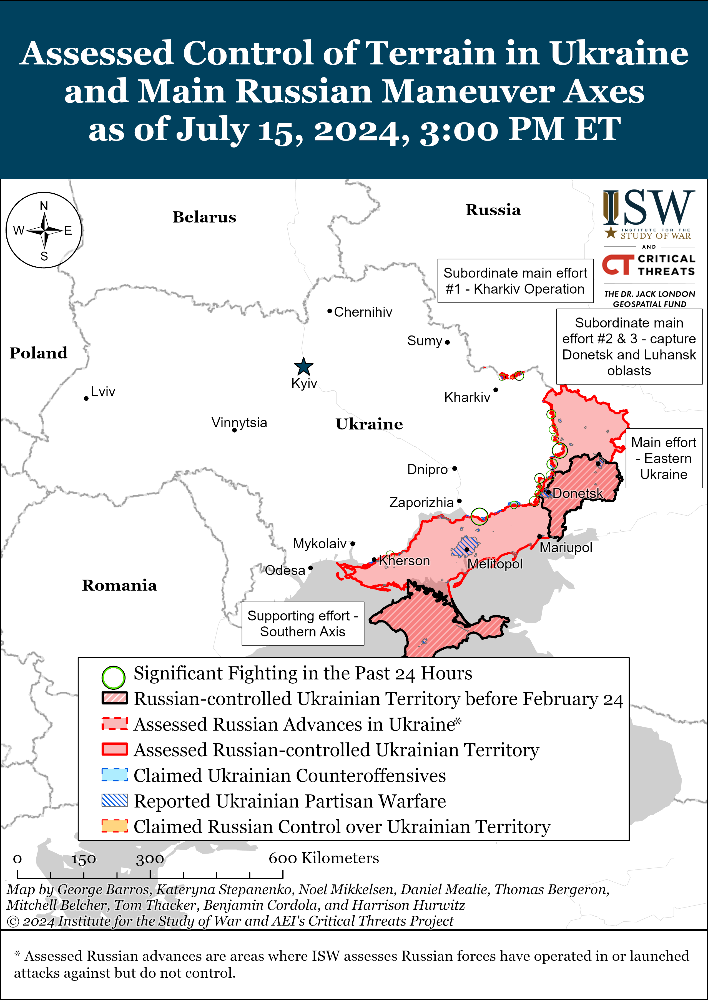
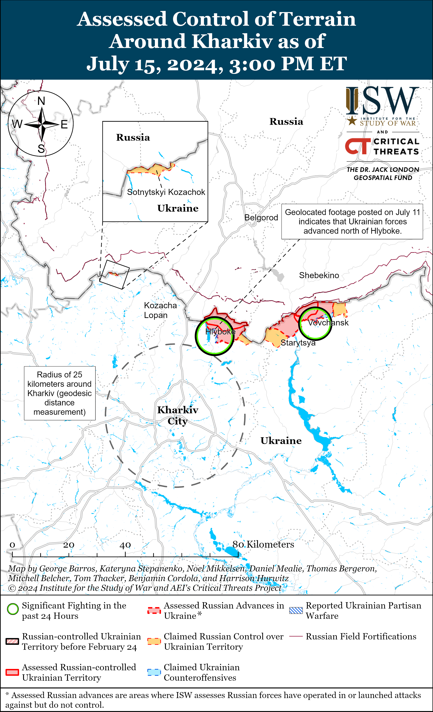
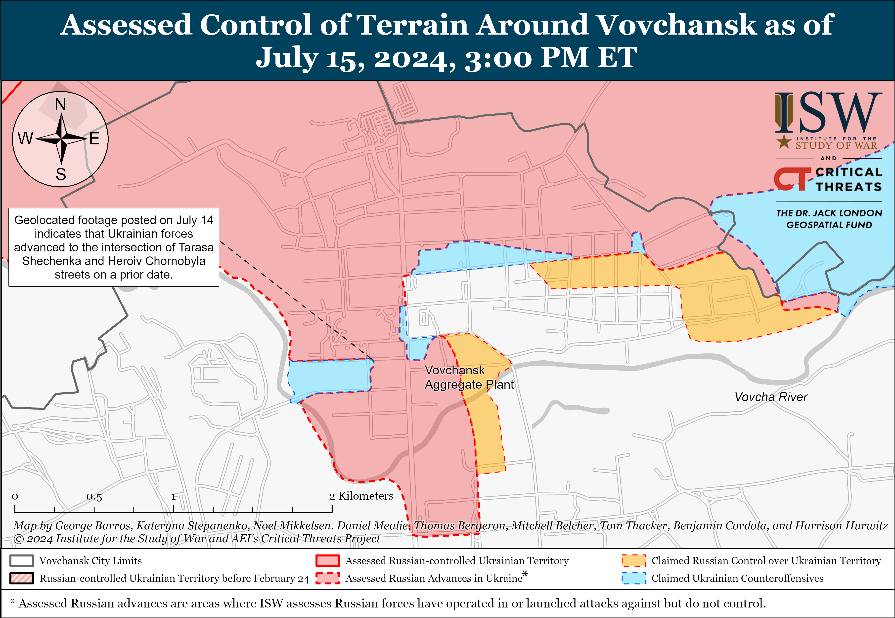
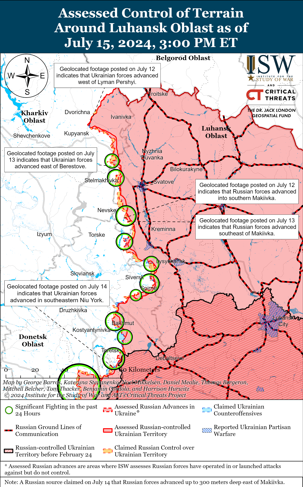
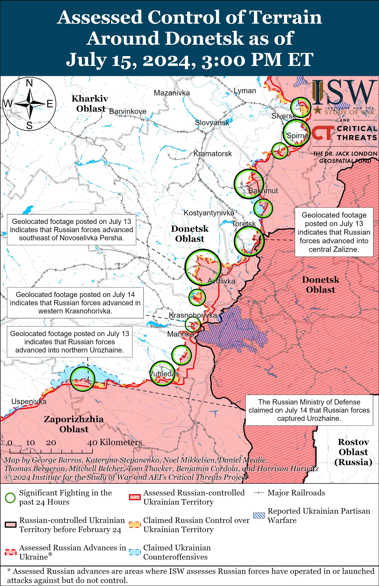
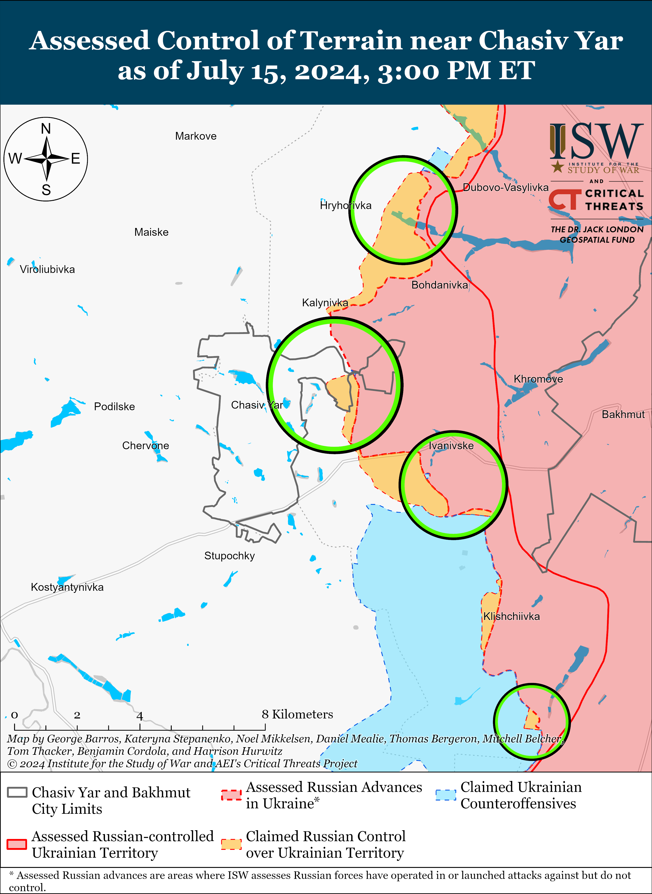
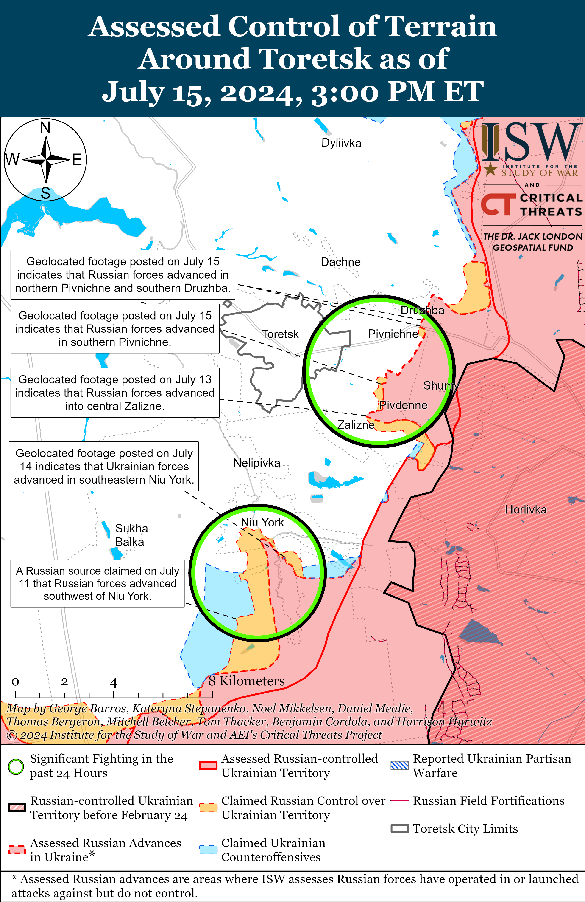
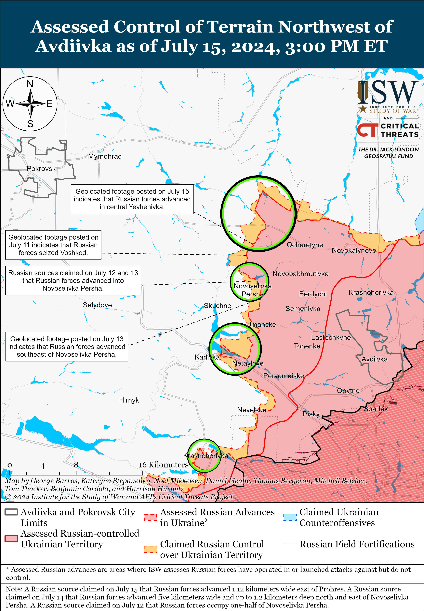
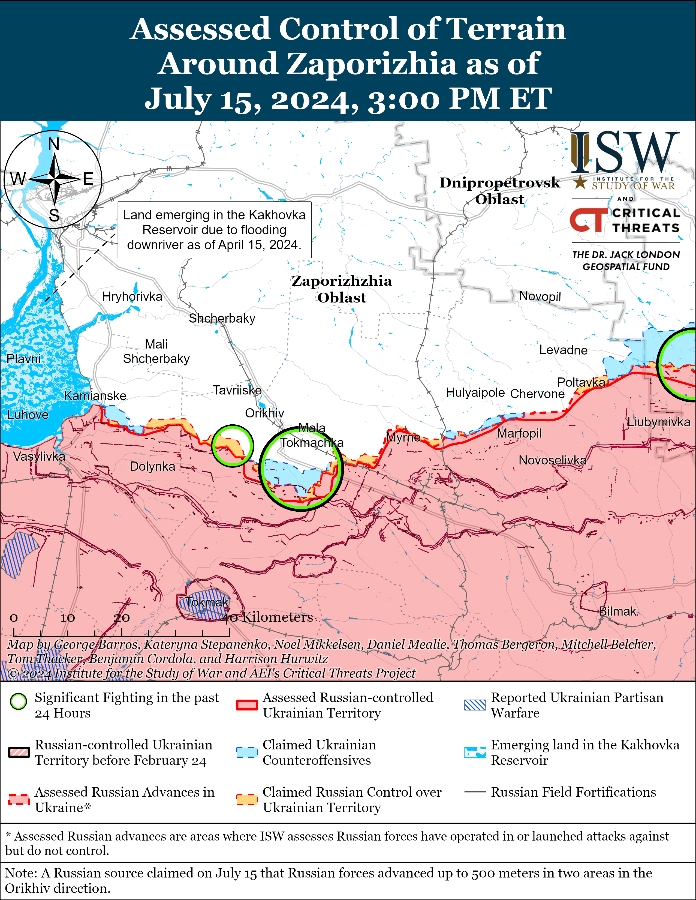
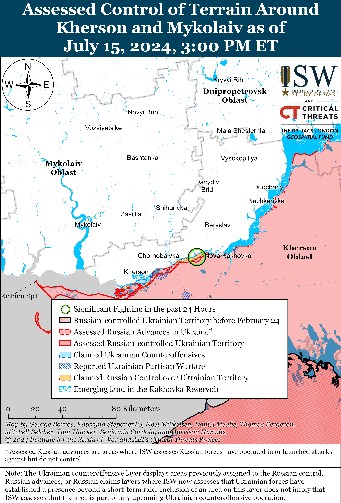

# Russian Offensive Campaign Assessment, July 15, 2024

**Christina Harward, Nicole Wolkov, Karolina Hird, Grace Mappes, and George Barros**

**July 15, 2024, 7pm ET**

**Click**[**here**](https://storymaps.arcgis.com/stories/36a7f6a6f5a9448496de641cf64bd375)**to see ISW’s interactive map of the Russian invasion of Ukraine. This map is updated daily alongside the static maps present in this report.**

**Click**[**here**](https://understandingwar.maps.arcgis.com/apps/instant/3dviewer/index.html?appid=1602762dbcde419bb957dea358449580)**to see ISW’s 3D control of terrain topographic map of Ukraine. Use of a computer (not a mobile device) is strongly recommended for using this data-heavy tool.**

**Click**[**here**](https://storymaps.arcgis.com/stories/733fe90805894bfc8562d90b106aa895)**to access ISW’s archive of interactive time-lapse maps of the Russian invasion of Ukraine. These maps complement the static control-of-terrain map that ISW produces daily by showing a dynamic frontline. ISW will update this time-lapse map archive monthly.**

**Note: The data cut-off for this product was 12pm ET on July 15. ISW will cover subsequent reports in the July 16 Russian Offensive Campaign Assessment.**

**A recent Ukrainian poll indicates that Ukrainians widely reject Russia’s demands for total Ukrainian capitulation, emphasizing that the Kremlin’s conditions for the end of the war are entirely unreasonable and widely unpopular within Ukraine.** Ukrainian outlet *Dzerkalo Tyzhnya* commissioned a poll by the Ukrainian Razumkov Center and published its results on July 15.[1] The poll found that 83 percent of respondents rejected Putin’s statement that Ukraine must withdraw from all of Donetsk, Luhansk, Kherson, and Zaporizhia oblasts — including territory in these oblasts currently under Ukrainian control.[2] The poll also reported that 58 percent of respondents stated that Ukraine should not agree to enshrine a neutral, non-aligned, and non-nuclear status in its constitution. Putin demanded in June 2024 that Ukraine recognize Russia’s territorial claims over eastern and southern Ukraine (including territory that Russia does not currently occupy), “demilitarize,” and pledge not to join NATO as preconditions to begin “peace” negotiations.[3] Putin’s extreme terms are tantamount to Ukraine’s capitulation, indicating that Putin continues to be uninterested in good-faith negotiations on any terms other than Russia’s. Kremlin Spokesperson Dmitry Peskov recently accused NATO on July 14 of not respecting “Russia’s main concern” when NATO announced Ukraine’s prospects of admission into the alliance, claiming that the alliance’s behavior suggests that there is no basis for negotiations about the war in Ukraine.[4] Putin’s framing of Ukraine’s total capitulation as a reasonable precondition for peace negotiations is also part of an attempt to undermine Ukraine’s efforts to garner international support for Ukraine’s own legitimate negotiating positions, which are based on and backed by international law, by shifting international perceptions of logical negotiating terms in Russia’s favor. Continued Russian efforts to claim that Ukraine is refusing “reasonable” demands intend to cast Ukraine as the unreasonable actor, despite the fact that Ukraine’s rightful borders have been recognized by international law since 1991.

**Ukraine continues to demonstrate its willingness to negotiate with Russia on Ukraine’s own terms, and Ukraine’s demands for a peace settlement are in accordance with international law — in direct contrast to Russia’s unwillingness to engage in negotiations that end in anything short of full Ukrainian surrender.**Ukrainian President Volodymyr Zelensky stated on July 15 that Ukrainian plans for a second peace summit should be ready by November 2024 and reiterated that a Russian representative should attend.[5] Zelensky stated that in preparation, Ukraine will hold a meeting in Qatar on energy security in late July or early August 2024, a meeting on freedom of navigation in Turkey in August 2024, and a meeting on prisoner of war (POW) exchanges and the repatriation of deported Ukrainian children in Canada in September 2024 — three issues on which the communique of the first Ukraine-initiated Global Peace Summit in Switzerland in June 2024 focused.[6] Recent Kremlin statements continue to demonstrate that Russia is inflexible on negotiations with Ukraine, however, and Kremlin officials have directly stated that Russia would not participate in a second peace summit because its terms are a non-starter given Russian demands.[7] Ukrainian officials emphasized that the purpose of the first peace summit was to facilitate a peace based on international law, including laws to which the Russian Federation is party.[8] Ukraine’s demands that Russia completely withdraw from Ukrainian territory are provided for under international law and are therefore reasonable. Russia’s demands for Ukraine’s complete capitulation and continued Russian occupation of Ukrainian land are and would be violations of international law, however. ISW also continues to assess that Putin’s demands for Ukrainian capitulation would allow Russian forces and occupation administrations to continue their large-scale and deliberate ethnic cleansing campaigns in occupied Ukraine, and the complete reinstatement of Ukraine’s territory integrity is necessary to liberate the Ukrainian people from Russian occupation.[9] An acceptance of anything but Ukraine’s liberation of its people is an implicit endorsement of Russia’s illegal occupation of over five million Ukrainians.

**European Union (EU) officials continue to take steps to demonstrate the EU’s non-alignment with Hungarian Prime Minister Viktor Orban’s political stances concerning the war in Ukraine.**Balazs Orban, Viktor Orban’s Political Director, stated on July 15 that Viktor Orban has additional “trips and negotiations” planned and wrote to the European Council about his previous visits to and discussions about negotiations with Ukraine, Russia, the People’s Republic of China (PRC), and the US.[10] EU Commission Spokesperson Eric Mamer stated on July 15 that due to Orban’s recent actions, EU leaders, including European Commission President Ursula von der Leyen, would not attend informal meetings led by Hungary.[11] *Politico*reported on July 15 that three unspecified EU diplomats stated that EU High Commissioner Josep Borrel will hold a “formal” foreign affairs council meeting at the same time as Hungary’s foreign affairs summit in Budapest in late August 2024.[12] A source reportedly stated that other EU foreign ministers want to “send a clear signal that Hungary does not speak for the EU.” Swedish Minister for EU Affairs Jessika Roswall told *Reuters*on July 11 that Sweden, Finland, Estonia, Latvia, Lithuania, and Poland would only send civil servants to government meetings connected with Hungary’s EU Council presidency in July 2024 and that other EU states are considering similar measures.[13]

**The Russian government proposed to significantly increase the number of conditions on which the Russian government can designate a person as a terrorist or extremist, likely as part of efforts to censor criticisms about Russia’s war in Ukraine.**The Russian government submitted a bill to the State Duma on July 15 that would expand the number of articles of the Russian Criminal Code under which the Russian Federal Service for Financial Monitoring (Rosfinmonitoring) could add people to Russia’s list of terrorists and extremists.[14] The proposal notably would allow Rosfinmonitoring to add people whom Russian authorities have convicted of spreading “fakes” about the Russian military out of political, ideological, racial, national, or religious hatred to the list. The proposal would also allow Rosfinmonitoring to add people accused of committing unspecified “other crimes” motivated by political, ideological, racial, national, or religious hatred to the list — granting the Russian government significant leeway to designate people who have allegedly committed a wide array of crimes as terrorists and extremists. The Kremlin has repeatedly attempted to portray Russia as a harmonious multinational and multireligious society despite recent increases in xenophobic rhetoric from Russia’s ultranationalist community.[15] The Russian government is likely looking to change the mechanisms for adding people to the terrorist and extremist list in order to incentivize Russians to engage in self-censorship by tightening the Kremlin’s control over criticism in Russian society, especially about Russia’s war in Ukraine, while posturing these changes as part of efforts to ensure political and religious freedom and societal harmony in Russia.

**Ukrainian forces conducted drone strikes against Russian energy infrastructure overnight on July 14 to 15 and reportedly also hit Russian military assets in occupied Crimea.** Lipetsk Oblast Head Igor Artamonov claimed on July 15 that a Ukrainian drone struck the grounds of an electrical substation in Stanovlyansky Raion, Lipetsk Oblast, and the Oryol Oblast administration claimed that a Ukrainian drone damaged an oil storage container after Russian electronic warfare (EW) suppressed the drone over a fuel and energy complex in the Oryolsky Raion.[16] A local Crimean channel claimed that Ukrainian drones struck either a Russian S-300/S-400 air defense system or a Black Sea Fleet (BSF) electronic intelligence unit near occupied Cape Fiolent, but ISW is unable to confirm this strike.[17] The Russian Ministry of Defense (MoD) claimed that Russian forces downed six Ukrainian drones over occupied Crimea and one Ukrainian drone over Lipetsk Oblast overnight on July 14 to 15 and another Ukrainian drone near western Crimea on the afternoon of July 15.[18]

**A new Russian migrant assimilation program highlights the apparent struggle the Russian government is facing with reconciling aspects of its policy towards Central Asian migrants as the Russian state desires to present itself as welcoming and multicultural while also emphasizing the primacy of Russian language and historical legacy.**Kremlin-affiliated business-focused outlet *Kommersant*reported on July 15 that the Russian Federal Agency for Ethnic Affairs (FADN) has developed a 70-minute lecture for Central Asian migrants on how to adapt to life in Russia.[19] *Kommersant*reportedly reviewed the course, which has four sections: “fundamentals of migration and labor legislation,” “fundamentals of informal behavior in Russia,” “responsibility for non-compliance with Russian legislation,” and “the history of relations between Russian and the countries of Central Asia.” The course reportedly emphasizes that migrants may undergo a simplified process for acquiring citizenship if they choose to serve with the Russian military, suggesting that the Russian government continues to use the promise of citizenship as a method of luring Central Asian migrants into the army. The course also stresses that “it is important to remember that Russia is a secular state” so migrants must not perform religious rituals, including daily prayers, in public spaces and that “Russians are a multinational people, but everyone speaks Russian.” *Kommersant* found that the course offers a paternalistic and Russia-centric version of Central Asian history, claiming that “big money from the Soviet budget allowed the Central Asian republics to develop successfully.”

The purposed assimilation lecture distills several of the tensions that currently exist in Russia’s relationship with its migrant minority communities, particularly those from various Central Asian states. As ISW has written at length, Russia’s reliance on Central Asian migrants to support Russia’s labor force and sustain military mobilization efforts, has caused substantial frictions within such communities, particularly as many pro-war ultranationalist voices have espoused increasingly xenophobic rhetoric over the backdrop of the war in Ukraine.[20] Head of the Russian Federal Service for the Supervision of Education and Science (Rosnobrnadzor) Anzor Muzaev, for example, advocated that migrants’ children must know Russian to study in Russian schools.[21] Several ultranationalist commentators responded and suggested that the Russian government must adopt a harsher response that prohibits migrants from bringing their families to Russia or prohibits migrant children from studying in public schools at all.[22] The FADN’s assimilation program is ostensibly meant to soothe these tensions, but emphasizes that Russian language, history, and culture are meant to enjoy special primacy in migrant communities—directly undermining the Kremlin narrative that Russia is an open and accepting multicultural and multireligious society. This program may also increase tensions and feelings of disenfranchisement within Central Asian migrant communities by enforcing their isolation from their languages, customs, and religious practices.

**Chechen Republic Head Ramzan Kadyrov is posturing himself and the North Caucasus as key to Russia’s outreach to the Arab world.**Kadyrov met on July 15 with United Arab Emirates (UAE) Ambassador to Russia Mohammed Akhmed Sultan Essa Al Jaber and Qatari Ambassador to Russia Sheikh Ahmed bin Nasser Al Thani in Grozny, Chechnya at the ongoing Caucasus Investment Forum.[23] Kadyrov emphasized Qatar’s and the UAE’s “warm relations” with Russia and Qatar, while also highlighting their individual relationships with Chechnya and the wider Caucasus region. The Kremlin likely seeks to use the Caucasus’ unique geopolitical, religious, and socio-cultural positioning vis-a-vis the Arab world in order to draw investment to the region and increase political and diplomatic ties with major political players such as Qatar and the UAE. Qatar and the UAE, for example, continue to mediate prisoner of war (POW) exchanges and the repatriation of deported Ukrainian children, so it remains in Russia’s interest to maintain firm ties with Gulf states.[24]

**Key Takeaways:**

- **A recent Ukrainian poll indicates that Ukrainians widely reject Russia’s demands for total Ukrainian capitulation, emphasizing that the Kremlin’s conditions for the end of the war are entirely unreasonable and widely unpopular within Ukraine.**
- **Ukraine continues to demonstrate its willingness to negotiate with Russia on Ukraine’s own terms, and Ukraine’s demands for a peace settlement are in accordance with international law — in direct contrast to Russia’s unwillingness to engage in negotiations that end in anything short of full Ukrainian surrender.**
- **European Union (EU) officials continue to take steps to demonstrate the EU’s non-alignment with Hungarian Prime Minister Viktor Orban’s political stances concerning the war in Ukraine.**
- **The Russian government proposed to significantly increase the number of conditions on which the Russian government can designate a person as a terrorist or extremist, likely as part of efforts to censor criticisms about Russia’s war in Ukraine.**
- **Ukrainian forces conducted drone strikes against Russian energy infrastructure overnight on July 14 to 15 and reportedly also hit Russian military assets in occupied Crimea.**
- **A new Russian migrant assimilation program highlights the apparent struggle the Russian government is facing with reconciling aspects of its policy towards Central Asian migrants as the Russian state desires to present itself as welcoming and multicultural while also emphasizing the primacy of Russian language and historical legacy.**
- **Chechen Republic Head Ramzan Kadyrov is posturing himself and the North Caucasus as key to Russia’s outreach to the Arab world.**
- **Ukrainian forces recently regained lost positions near Toretsk, and Russian forces recently advanced near Toretsk and Avdiivka.**
- **Russian President Vladimir Putin emphasized ongoing Russian efforts to integrate the metallurgy industry in occupied Ukraine into Russia’s defense industrial base (DIB).**

***We do not report in detail on Russian war crimes because these activities are well-covered in Western media and do not directly affect the military operations we are assessing and forecasting. We will continue to evaluate and report on the effects of these criminal activities on the Ukrainian military and the Ukrainian population and specifically on combat in Ukrainian urban areas. We utterly condemn Russian violations of the laws of armed conflict and the Geneva Conventions and crimes against humanity even though we do not describe them in these reports.***

- Russian Main Effort — Eastern Ukraine (comprised of three subordinate main efforts)
- Russian Subordinate Main Effort #1 — Push Ukrainian forces back from the international border with Belgorod Oblast and approach to within tube artillery range of Kharkiv City
- Russian Subordinate Main Effort #2 — Capture the remainder of Luhansk Oblast and push westward into eastern Kharkiv Oblast and encircle northern Donetsk Oblast
- Russian Subordinate Main Effort #3 — Capture the entirety of Donetsk Oblast
- Russian Supporting Effort — Southern Axis
- Russian Air, Missile, and Drone Campaign
- Russian Mobilization and Force Generation Efforts
- Russian Technological Adaptations
- Activities in Russian-occupied areas
- Ukrainian Defense Industrial Base Efforts
- Russian Information Operations and Narratives
- Significant Activity in Belarus

**Russian Main Effort — Eastern Ukraine**

**Russian Subordinate Main Effort #1 — Kharkiv Oblast****(Russian objective: Push Ukrainian forces back from the international border with Belgorod Oblast and approach to within tube artillery range of Kharkiv City)**

Russian forces continued offensive operations in northern Kharkiv Oblast on July 15 but did not make confirmed advances. Ukrainian Kharkiv Group of Forces Colonel Yuriy Povkh stated that Russian forces are preparing new assault groups from elements of the “153rd Motorized Rifle Regiment of the 47th Motorized Rifle Division” and 138th Motorized Rifle Brigade (6th Combined Arms Army [CAA], Leningrad Military District [LMD]) for renewed attacks in the Kharkiv direction.[25] Povkh may have misspoken and was most likely referring to the 153rd Tank Regiment of the 47th Tank Division (1st Guards Tank Army, Moscow Military District [MMD]), since the 47th Motorized Rifle Division is not confirmed to have a 153rd Motorized Rifle Regiment (unlike the 47th Tank Division, which reportedly has a 153rd Tank Regiment), is part of the 40th Army Corps (18th CAA, Southern Military District [SMD]) and has been fighting in southern Ukraine since September 2022.[26] ISW has observed frequent mentions of the 47th Tank Division operating in Kharkiv Oblast in recent months, whereas the deployment of the 47th Motorized Rifle Division from southern Ukraine would represent a major inflection.[27] Social media footage circulated on July 14 and 15 shows a Russian soldier of the “Storm” detachment of the 138th Motorized Rifle Brigade complaining about high losses during assaults in Vovchansk (northeast of Kharkiv City) and claiming that his unit lost 16 of 46 soldiers during one attack.[28] Russian and Ukrainian sources reported that fighting continued within Vovchansk and near Hlyboke (north of Kharkiv City).[29] Elements of the Russian 83rd Airborne (VDV) Brigade reportedly continue operating near Vovchansk.[30]

**Russian Subordinate Main Effort #2 — Luhansk Oblast****(Russian objective: Capture the remainder of Luhansk Oblast and push westward into eastern Kharkiv Oblast and northern Donetsk Oblast)**

Russian forces continued offensive operations along the Kupyansk-Svatove-Kreminna line on July 15 but did not make confirmed advances. A Russian milblogger claimed that Russian forces advanced up to 300 meters east of Makiivka (northwest of Kreminna), although ISW has not observed visual evidence of this claim.[31] Russian forces continued attacking northwest of Svatove near Pishchane and Stelmakhivka; northwest of Kreminna near Makiivka and Hrekivka; and west of Kreminna near Terny on July 14 and 15.[32] Elements of the Russian 752nd Motorized Rifle Regiment (3rd Motorized Rifle Division, 20th Combined Arms Army [CAA], Moscow Military District [MMD]) are reportedly operating near Makiivka.[33]

**Russian Subordinate Main Effort #3 — Donetsk Oblast****(Russian objective: Capture the entirety of Donetsk Oblast, the claimed territory of Russia’s proxies in Donbas)**

Russian forces continued attacks in the Siversk area on July 15 but did not make any confirmed advances. Russian forces attacked northeast of Siversk near Bilohorivka, east of Siversk near Verkhnokamyanske, and southeast of Siversk near Spirne and Vyimka on July 14 and 15.[34] Elements of the Russian 2nd Artillery Brigade (2nd Luhansk People’s Republic Army Corps [LNR AC]) reportedly continue to operate in the Siversk direction.[35]

Russian forces did not make any confirmed gains amid continued fighting near Chasiv Yar on July 15. Russian forces attacked within easternmost Chasiv Yar; north of Chasiv Yar near Hryhorivka and Kalynivka; east of Chasiv Yar near Ivanivske; and southeast of Chasiv Yar near Andriivka on July 14 and 15.[36] Elements of the Russian 98th Airborne (VDV) Division reportedly continue to operate near Chasiv Yar.[37]

Both Russian and Ukrainian forces recently advanced in the Toretsk direction as fighting continued on July 15. Geolocated footage published on July 14 shows that Ukrainian forces recently recaptured some positions within southern Niu York (south of Toretsk) and confirms some claims of Russian advance within the city.[38] Additional geolocated footage published on July 15 shows that Russian forces recently marginally advanced within eastern Pivnichne (east of Toretsk).[39] Russian forces also continued to attack within Zalizne (immediately southeast of Toretsk) on July 14 and 15, where Russian milbloggers claimed that Russian forces advanced.[40] ISW has not observed confirmation of these claimed Russian advances in Zalizne, however.

Russian forces recently advanced northwest of Avdiivka amid continued fighting on July 15. Geolocated footage published on July 15 shows that Russian forces advanced within central Yevhenivka (northwest of Avdiivka).[41] Russian milbloggers claimed that Russian forces also advanced 1.12 kilometers deep along a railway line east of Prohres (northwest of Avdiivka), up to 1.2 kilometers deep in fields southeast of Novoselivka Persha (northwest of Avdiivka), and marginally on the outskirts of Karlivka (southwest of Avdiivka), but ISW has not observed confirmation of these claims.[42] Russian forces also attacked northwest of Avdiivka near Novooleksandrivka, Vozdvyzhenka, and Lozuvatske; and west of Avdiivka near Yasnobrodivka on July 14 and 15.[43] Elements of the Russian 1st Motorized Rifle Brigade (1st Donetsk People’s Republic [DNR] AC) are reportedly operating in the Avdiivka direction.[44]

Russian forces recently marginally advanced west of Donetsk City amid continued fighting in the area on July 15. Geolocated footage published on July 14 shows that Russian forces marginally advanced within western Krasnohorivka (west of Donetsk City), and Russian milbloggers claimed that Russian forces advanced even further west within and in fields south of Krasnohorivka.[45] Russian forces also continued attacking southwest of Donetsk City near Paraskoviivka, Kostyantynivka, and Vodyane on July 14 and 15.[46] Elements of the Russian 39th Motorized Rifle Brigade (68th AC, Eastern Military District [EMD]) and 14th Spetsnaz Brigade (Russian General Staff’s Main Directorate [GRU]) reportedly continue operating in the area west and southwest of Donetsk City.[47]

Russian forces did not make any confirmed advances amid continued fighting in the Donetsk-Zaporizhia Oblast border area on July 15. Russian forces continued attacking south of Velyka Novosilka near Makarivka on July 14 and 15.[48] Russian milbloggers claimed that Russian forces are attempting to advance north of Urozhaine (south of Velyka Novosilka) following claims that Russian forces seized the settlement on July 14, but one milblogger claimed on July 15 that Ukrainian forces retain some positions within northern Urozhaine.[49] Russian milbloggers credited the Russian 37th Motorized Rifle Brigade, 30th Artillery Brigade, and 5th Tank Brigade (all of the 36th Combined Arms Army, EMD) and 40th Naval Infantry Brigade (Pacific Fleet, EMD) with seizing Urozhaine.[50]

**Russian Supporting Effort — Southern Axis****(Russian objective: Maintain frontline positions and secure rear areas against Ukrainian strikes)**

Positional engagements continued in western Zaporizhia Oblast on July 15, but there were no confirmed changes to the frontline. A Russian milblogger claimed that Russian forces advanced up to 500 meters in two unspecified areas in the Orikhiv direction (western Zaporizhia Oblast).[51] The Ukrainian General Staff reported that Ukrainian forces repelled Russian attacks northwest of Robotyne near Novoandriivka and northwest of Robotyne near Mala Tokmachka on July 15.[52] Elements of the Russian 19th Motorized Rifle Division (58th Combined Arms Army [CAA], Southern Military District [SMD]) are reportedly operating in the Orikhiv direction; and elements of the “Valkyrie” Special Detachment (4th Military Base, 58th CAA, SMD) are reportedly operating near Kamyanske (northwest of Robotyne).[53]

Positional engagements continued in east (left) bank Kherson Oblast, including near Krynky, on July 15.[54] Russian milbloggers claimed that fighting is ongoing on the Dnipro River Delta islands.[55] Elements of the Russian 56th Airborne (VDV) Regiment (7th VDV Division) and 70th Motorized Rifle Division and 126th Coastal Defense Brigade (both of the 18th CAA, SMD) are operating in the Kherson direction.[56]

**Russian Air, Missile, and Drone Campaign****(Russian Objective: Target Ukrainian military and civilian infrastructure in the rear and on the frontline)**

Russian forces launched two D-30SN glide bombs with universal joint glide munitions (UMPBs) at Myrhorod, Donetsk Oblast on July 14 and struck a residential building and educational institution.[57]

**Russian Mobilization and Force Generation Efforts****(Russian objective: Expand combat power without conducting general mobilization)**

Russian President Vladimir Putin emphasized ongoing Russian efforts to integrate the metallurgy industry in occupied Ukraine into Russia’s defense industrial base (DIB).[58] Putin claimed in a July 15 speech for Russia’s Metallurgist Day that the Russian metallurgy industry is strategically important to Russia’s defense and security and continues to grow despite Western sanctions. Putin claimed that the production of metal products in occupied Donetsk and Luhansk oblasts has increased by 30 percent in 2023 from 2022.

The Russian Ministry of Defense (MoD) announced on July 15 the completion of Russia’s Spring 2024 conscription cycle.[59] The Russian MoD claimed that the Russian military conscripted 150,000 personnel and reiterated reassurances that Russian conscripts do not serve in occupied Luhansk, Donetsk, Zaporizhia, and Kherson oblasts and did participate in combat operations in Ukraine.[60] ISW continues to assess that Russia coerced conscripts into signing Russian military contracts to support ongoing crypto-mobilization efforts.[61]

Russian opposition outlets reported that pro-war Russian Telegram channels are attempting to threaten mobilized personnel and their relatives against voicing complaints against the Russian military and advocating for demobilization. Russian opposition outlets *Astra*and *Mobilization News* reported that pro-war Russian Telegram channels published a video of Russian soldiers purportedly claiming that “provocateurs” are organizing rallies in support demobilization after relatives of Russian mobilized personnel advocated for their loved ones’ demobilization.[62] The Russian opposition outlets reported that pro-war Russian Telegram channels had actually re-dubbed an existing video of Russian soldiers discussing a different topic in order to threaten mobilized personnel and their relatives from speaking out against the Russian military.

**Russian Technological Adaptations****(Russian objective: Introduce technological innovations to optimize systems for use in Ukraine)**

Russian state-owned defense conglomerate Rostec reported on July 15 that it is currently developing an improved version of unified planning and correction modules (UMPCs) in order to increase the range of unguided glide bombs.[63] Rostec CEO Sergei Chemezov stated that it is much cheaper and still effective for Rostec to produce unguided glide bombs with UMPCs than guided glide bombs.[64] A Russian defense industrial base (DIB) source told Kremlin newswire *TASS*that FAB-3000 glide bombs with UMPCs have a range of up 50 to 60 kilometers and that FAB-250 to FAB-1500 glide bombs, presumably with UMPCs, have a range of up to 60 to 70 kilometers.[65]

Rostec subsidiary United Aircraft Corporation stated on July 15 that it handed over the first batch of repaired and modernized MiG-31 fighter aircraft for 2024 to the Russian Ministry of Defense (MoD).[66]

**Ukrainian Defense Industrial Efforts****(Ukrainian objective: Develop its defense industrial base to become more self-sufficient in cooperation with US, European, and international partners)**

Ukraine’s Western partners continue to provide military and financial aid to Ukraine. The German government announced on July 8 that it delivered additional military aid to Ukraine, including ammunition for Leopard tanks, a Patriot air defense system and missiles, and 155mm artillery ammunition.[67] The Ukrainian Ministry of Economy stated on July 9 that Ukraine and the European Union (EU) signed an agreement that regulates financial aid worth 5.27 billion euros (about $5.7 billion) to support Ukraine’s economy over the next four years under the EU’s Ukraine Facility mechanism.[68] Portugal announced on July 10 that Portuguese aid to Ukraine will total more than 220 million euros (about $239 million) in 2024 and that Portugal will allocate the same amount in 2025.[69] New Zealand announced a package on July 10 of six million NZD (about $3.6 million) worth of military aid to Ukraine, including two million NZD (about $1.2 million) to support Ukraine’s military healthcare system.[70] New Zealand also announced that it would provide a package of ten million NZD (about $6 million) worth of humanitarian assistance to Ukraine. Canadian Prime Minister Justin Trudeau announced on July 11 a package of military aid worth 500 million CAD (about $365 million) to Ukraine.[71] Norwegian Prime Minister Jonas Gahr Store stated on July 11 that Norway will allocate one billion kroner (about $92 million) to support Ukraine’s air defenses.[72] The Lithuanian MoD stated on July 11 that Lithuania supplied drone jamming equipment and 5.56x45mm NATO intermediate ammunition cartridges to Ukraine.[73] Spain stated on July 15 that it began transferring 10 repaired Leopard tanks to Ukraine and that the tanks will first arrive in Poland on July 20 before traveling to Ukraine.[74]

The Czech-led artillery shell coalition will reportedly deliver shells to Ukraine starting in July 2024. Czech outlet *Ceske Noviny*reported on July 13 that Czech President Petr Pavel stated that the coalition should deliver 50,000 shells to Ukraine in July and August 2024 and 80,000 to 100,000 shells per month from September 2024 to the end of 2024.[75]

Ukraine’s Western partners continue to support the UK and Latvian-led drone coalition. The Swedish MoD announced on July 11 that Sweden joined the coalition.[76] Members of the coalition — the Netherlands, UK, Latvia, New Zealand, and Sweden — signed a memorandum of understanding on July 10 that provides a framework for the coalition’s activities and procurement mechanisms to provide Ukraine with one million first-person view (FPV) drones.[77] The Dutch MoD stated on July 10 that the Netherlands will provide 20 million euros (about $21.8 million) to the drone coalition.[78] The New Zealand government announced on July 10 it would provide four million NZD (about $2.4 million) to support the drone coalition.[79]

Ukraine’s Western partners continue to support the provision of F-16 aircraft to Ukraine. Norway stated on July 10 that it will provide Ukraine with six F-16 aircraft at an unspecified time in 2024.[80] The Dutch MoD stated on July 10 that the Netherlands would provide an additional 300 million euros (about $326 million) to purchase ammunition for F-16 aircraft for Ukraine.[81] Canada announced on July 11 that it allocated 389 million CAD (about $284 million) to support the training of Ukrainian F-16 pilots through the Ukraine Defense Contact Air Force Capability Coalition.[82]

Ukraine’s Western partners continue to support Ukraine’s defense industrial base (DIB). The Danish Ministry of Defense (MoD) stated on July 10 that Denmark financed the production of 18 Bohdana self-propelled howitzers in Ukraine, which are expected to arrive to Ukrainian forces in the coming months.[83] Ukrainian President Volodymyr Zelensky met with representatives of US defense companies on July 11 and discussed joint partnerships in Ukraine.[84] Ukraine’s state-owned defense enterprise manager Ukroboronprom signed an agreement on July 11 with US defense company Northrop Grumman to create a new joint production line for NATO standard medium caliber artillery ammunition.[85]

**Activities in Russian-occupied areas****(Russian objective: Consolidate administrative control of annexed areas; forcibly integrate Ukrainian citizens into Russian sociocultural, economic, military, and governance systems)**

*ISW is not publishing coverage of activities in Russian-occupied areas today.*

**Russian Information Operations and Narratives**

Russian milbloggers seized on a report from the Ukrainian General Staff on July 15 announcing that Ukrainian Commander-in-Chief Colonel General Oleksandr Syrskyi is conducting an investigation into the command of a Ukrainian brigade due to recent personnel losses in order to spread discontent and distrust of the Ukrainian military command.[86]

Russia continues to charge Ukrainian officials with invented and unsubstantiated crimes *in absentia* to enforce Russian law outside of Russian legal jurisdiction and insinuate that Ukraine should not exist as an independent state. The Moscow City Basmanny District Court issued *in absentia* war crimes sentences against former head of the Ukrainian State Security Service (SBU) Valentyn Nalyvaichenko and Secretary of the Ukrainian National Security and Defense Council Oleksandr Lytvynenko.[87]

Disinformation-focused analytical outlet NewsGuard reported on July 11 that it has identified 41 English- and French-language TikTok accounts that use AI-generated narration to spread disinformation, including Kremlin narratives regarding the war in Ukraine.[88] NewsGuard found that 17 of these accounts particularly concentrate on pro-Kremlin narratives, 14 of which use AI generated French-language narration.

**Significant activity in Belarus****(Russian efforts to increase its military presence in Belarus and further integrate Belarus into Russian-favorable frameworks and Wagner Group activity in Belarus)**

Nothing significant to report.

**Note: ISW does not receive any classified material from any source, uses only publicly available information, and draws extensively on Russian, Ukrainian, and Western reporting and social media as well as commercially available satellite imagery and other geospatial data as the basis for these reports. References to all sources used are provided in the endnotes of each update.**

---

[1] https://zn dot ua/ukr/UKRAINE/44-ukrajintsiv-vvazhajut-shcho-nastav-chas-dlja-perehovoriv-z-rf-rezultati-sotsiolohichnoho-opituvannja-znua.html ; https://t.me/bbcrussian/67785

[2] https://zn dot ua/ukr/UKRAINE/vijna-chi-mir-ukrajintsi-khochut-povernuti-kordoni-1991-roku-ale-chijimi-rukami-rezultati-sotsiolohichnoho-doslidzhennja.html

[3] https://isw.pub/UkrWar061524; https://understandingwar.org/backgrounder/russian-offensive-campaign-assessment-june-14-2024

[4] https://understandingwar.org/backgrounder/russian-offensive-campaign-assessment-july-14-2024

[5] https://suspilne dot media/790971-zelenskij-rozpoviv-pro-pidgotovku-do-drugogo-samitu-miru/ ; https://meduza dot io/news/2024/07/15/zelenskiy-schitayu-chto-predstaviteli-rossii-dolzhny-byt-na-vtorom-sammite-mira

[6] https://isw.pub/UkrWar061624; https://suspilne dot media/790971-zelenskij-rozpoviv-pro-pidgotovku-do-drugogo-samitu-miru/ ; https://meduza dot io/news/2024/07/15/zelenskiy-schitayu-chto-predstaviteli-rossii-dolzhny-byt-na-vtorom-sammite-mira

[7] https://isw.pub/UkrWar071224 ; https://understandingwar.org/backgrounder/russian-offensive-campaign-assessment-june-14-2024

[8] https://isw.pub/UkrWar061624

[9] https://understandingwar.org/backgrounder/russian-offensive-campaign-assessment-december-28-2023

[10] https://magyarnemzet dot hu/belfold/2024/07/orban-balazs-ha-europa-beket-akar-most-kell-az-iranyvaltast-kidolgozni#google\_vignette

[11] https://twitter.com/MamerEric/status/1812899626468651195 ; https://abcnews.go.com/International/wireStory/hungarys-orbn-briefed-eu-leaders-meetings-putin-xi-111954728

[12] https://www.politico.eu/article/hungary-boycott-foreign-affairs-summit-eu-ukraine-pm-viktor-orban-event-august-budapest/

[13] https://www.reuters.com/world/europe/some-eu-states-wont-send-ministers-presidency-meetings-protest-orbans-russia-2024-07-11/

[14] https://meduza dot io/news/2024/07/15/pravitelstvo-rf-predlozhilo-vklyuchat-lyudey-v-perechen-terroristov-za-prestupleniya-po-motivam-politicheskoy-nenavisti-v-tom-chisle-po-delam-o-feykah-pro-armiyu ; https://sozd.duma.gov.ru/bill/671687-8

[15] https://isw.pub/UkrWar123123; https://isw.pub/UkrWar122023; https://isw.pub/UkrWar121323 ; https://isw.pub/UkrWar121223 ; https://isw.pub/UkrWar121123 ; https://isw.pub/UkrWar120823 ; https://isw.pub/UkrWar120223

[16] https://t.me/tass\_agency/260622; https://t.me/igor\_artamonov48/3119 ; https://t.me/istories\_media/6868 ; https://t.me/bbcrussian/67768; https://t.me/tass\_agency/260639; https://t.me/Klychkov\_Andrey/3788; https://t.me/tass\_agency/260639; https://t.me/Klychkov\_Andrey/3788

[17] https://t.me/Crimeanwind/63741; https://t.me/Crimeanwind/63741

[18] https://t.me/mod\_russia/41036; https://t.me/mod\_russia/41047

[19] https://www.kommersant dot ru/doc/6835219

[20] https://isw.pub/UkrWar041024; https://isw.pub/UkrWar040924; https://isw.pub/UkrWar040424

[21] https://t.me/tass\_agency/260726 ; https://lenta dot ru/news/2024/07/15/glava-rosobrnadzora-prizval-brat-v-shkoly-detey-migrantov-tolko-pri-odnom-uslovii/

[22] https://t.me/dva\_majors/47339; https://t.me/dva\_majors/47350; https://t.me/MedvedevVesti/18038

[23] https://t.me/RKadyrov\_95/4924; https://t.me/RKadyrov\_95/4923

[24] https://understandingwar.org/backgrounder/russian-offensive-campaign-assessment-april-24-2024; https://understandingwar.org/backgrounder/russian-offensive-campaign-assessment-june-26-2024

[25] https://suspilne dot media/kharkiv/790763-33-kabi-za-dobu-boi-u-vovcansku-novi-sturmovi-grupi-situacia-na-harkivskomu-napramku-na-15-lipna/

[26] https://understandingwar.org/backgrounder/russia%E2%80%99s-military-restructuring-and-expansion-hindered-ukraine-war; https://dzen dot ru/a/ZbXxbqTS2lcYbtai

[27] https://t.me/zvizdecmanhustu/1889; https://t.me/zvizdecmanhustu/1305; https://t.me/zvizdecmanhustu/1346

[28] https://t.me/astrapress/59708 ; https://t.me/astrapress/59738; ttps://t.me/ButusovPlus/11873

[29] https://www.facebook.com/GeneralStaff.ua/posts/pfbid0X4iHpmMdDndk9q7YbBF8bnewKtzTkm27kbapxv7yRMAxaaTumqi6VqNT9JEZCVwRl; https://www.facebook.com/GeneralStaff.ua/posts/pfbid0SCBkWTrfXfKLfGmxRoLYbtZKoBraoA8oG27ak8re2q33A9LW8it6dSSxWKN1SZecl; https://suspilne dot media/kharkiv/790585-na-harkivskomu-napramku-vedetsa-sistemna-ta-dinamicna-robota-sodo-znisenna-okupantiv-na-teritorii-rf-ahilles/; https://t.me/RVvoenkor/72520; https://t.me/dva\_majors/47311; https://t.me/wargonzo/21038; https://t.me/DnevnikDesantnika/12753

[30] https://t.me/motopatriot/24923

[31] https://t.me/RVvoenkor/72490

[32] https://www.facebook.com/GeneralStaff.ua/posts/pfbid0X4iHpmMdDndk9q7YbBF8bnewKtzTkm27kbapxv7yRMAxaaTumqi6VqNT9JEZCVwRl ; https://www.facebook.com/GeneralStaff.ua/posts/pfbid0SCBkWTrfXfKLfGmxRoLYbtZKoBraoA8oG27ak8re2q33A9LW8it6dSSxWKN1SZecl ; https://www.facebook.com/GeneralStaff.ua/posts/pfbid0Y1D3qtyAUb2nwpGojKowPD1ADwqXubSuUCwBf7chRmnbnPBh6QCnSYakdc4jSrNGl ; https://t.me/RVvoenkor/72490

[33] https://t.me/boris\_rozhin/130093

[34] https://www.facebook.com/GeneralStaff.ua/posts/pfbid0X4iHpmMdDndk9q7YbBF8bnewKtzTkm27kbapxv7yRMAxaaTumqi6VqNT9JEZCVwRl; https://www.facebook.com/GeneralStaff.ua/posts/pfbid0SCBkWTrfXfKLfGmxRoLYbtZKoBraoA8oG27ak8re2q33A9LW8it6dSSxWKN1SZecl; https://www.facebook.com/GeneralStaff.ua/posts/pfbid0Y1D3qtyAUb2nwpGojKowPD1ADwqXubSuUCwBf7chRmnbnPBh6QCnSYakdc4jSrNGl

[35] https://t.me/sons\_fatherland/15601

[36] https://www.facebook.com/GeneralStaff.ua/posts/pfbid0SCBkWTrfXfKLfGmxRoLYbtZKoBraoA8oG27ak8re2q33A9LW8it6dSSxWKN1SZecl; https://www.facebook.com/GeneralStaff.ua/posts/pfbid0X4iHpmMdDndk9q7YbBF8bnewKtzTkm27kbapxv7yRMAxaaTumqi6VqNT9JEZCVwRl; https://www.facebook.com/GeneralStaff.ua/posts/pfbid0Y1D3qtyAUb2nwpGojKowPD1ADwqXubSuUCwBf7chRmnbnPBh6QCnSYakdc4jSrNGl; https://t.me/DnevnikDesantnika/12732; https://t.me/DnevnikDesantnika/12732

[37] https://t.me/DnevnikDesantnika/12752

[38] https://x.com/PuenteUribarri/status/1812506311357018562; https://x.com/TuiteroMartin/status/1812531125912248597

[39] https://www.facebook.com/watch/?v=447498484827497; https://x.com/Bielitzling/status/1812814570253160625; https://x.com/Bielitzling/status/1812819629334483293; https://t.me/creamy\_caprice/6074; https://x.com/albafella1/status/1812755006094762366; https://x.com/PauliusZaleckas/status/1812881369187353011;

[40] https://www.facebook.com/GeneralStaff.ua/posts/pfbid0SCBkWTrfXfKLfGmxRoLYbtZKoBraoA8oG27ak8re2q33A9LW8it6dSSxWKN1SZecl; https://t.me/RVvoenkor/72520; https://t.me/RVvoenkor/72520; https://t.me/RVvoenkor/72520

[41] https://t.me/strikedronescompany/337; https://x.com/99Dominik\_/status/1812752484256862651

[42] https://t.me/z\_arhiv/27290; https://t.me/RVvoenkor/72486; https://t.me/RVvoenkor/72520; https://t.me/wargonzo/21038; https://t.me/boris\_rozhin/130154; https://t.me/voenkorKotenok/57593; https://t.me/NgP\_raZVedka/18379

[43] https://www.facebook.com/GeneralStaff.ua/posts/pfbid0X4iHpmMdDndk9q7YbBF8bnewKtzTkm27kbapxv7yRMAxaaTumqi6VqNT9JEZCVwRl; https://www.facebook.com/GeneralStaff.ua/posts/pfbid0SCBkWTrfXfKLfGmxRoLYbtZKoBraoA8oG27ak8re2q33A9LW8it6dSSxWKN1SZecl https://www.facebook.com/GeneralStaff.ua/posts/pfbid0Y1D3qtyAUb2nwpGojKowPD1ADwqXubSuUCwBf7chRmnbnPBh6QCnSYakdc4jSrNGl

[44] https://t.me/boris\_rozhin/130058

[45] https://t.me/motopatriot/24918; https://x.com/small10space/status/1812534939314757746; https://x.com/Bielitzling/status/1812572115628867843

[46] https://www.facebook.com/GeneralStaff.ua/posts/pfbid0X4iHpmMdDndk9q7YbBF8bnewKtzTkm27kbapxv7yRMAxaaTumqi6VqNT9JEZCVwRl; https://www.facebook.com/GeneralStaff.ua/posts/pfbid0SCBkWTrfXfKLfGmxRoLYbtZKoBraoA8oG27ak8re2q33A9LW8it6dSSxWKN1SZecl; https://www.facebook.com/GeneralStaff.ua/posts/pfbid0SCBkWTrfXfKLfGmxRoLYbtZKoBraoA8oG27ak8re2q33A9LW8it6dSSxWKN1SZecl

[47] https://t.me/voin\_dv/9759; https://t.me/voin\_dv/9766

[48] https://www.facebook.com/GeneralStaff.ua/posts/pfbid0X4iHpmMdDndk9q7YbBF8bnewKtzTkm27kbapxv7yRMAxaaTumqi6VqNT9JEZCVwRl; https://www.facebook.com/GeneralStaff.ua/posts/pfbid0SCBkWTrfXfKLfGmxRoLYbtZKoBraoA8oG27ak8re2q33A9LW8it6dSSxWKN1SZecl

[49] https://t.me/basurin\_e/12710; https://t.me/rusich\_army/15815; https://t.me/rusich\_army/15815

[50] https://t.me/DnevnikDesantnika/12723; https://t.me/RVvoenkor/72485

[51] https://t.me/DnevnikDesantnika/12741

[52] https://www.facebook.com/GeneralStaff.ua/posts/pfbid0X4iHpmMdDndk9q7YbBF8bnewKtzTkm27kbapxv7yRMAxaaTumqi6VqNT9JEZCVwRl

[53] https://t.me/SALDO\_VGA/3782 ; https://t.me/RVvoenkor/72492

[54] https://www.facebook.com/GeneralStaff.ua/posts/pfbid0X4iHpmMdDndk9q7YbBF8bnewKtzTkm27kbapxv7yRMAxaaTumqi6VqNT9JEZCVwRl ; https://www.facebook.com/GeneralStaff.ua/posts/pfbid0SCBkWTrfXfKLfGmxRoLYbtZKoBraoA8oG27ak8re2q33A9LW8it6dSSxWKN1SZecl

[55] https://t.me/dva\_majors/47311 ; https://t.me/osetin20/8799

[56] https://t.me/dva\_majors/47299 ; https://t.me/dva\_majors/47301 ; https://t.me/Sladkov\_plus/10998

[57] https://t.me/astrapress/59709

[58] http://kremlin dot ru/events/president/news/74560

[59] https://t.me/mod\_russia/41061

[60] https://t.me/mod\_russia/41061

[61] https://isw.pub/UkrWar061624

[62] https://t.me/astrapress/59730 ; https://t.me/mobilizationnews/19417

[63] https://t.me/rostecru/7821

[64] https://t.me/rostecru/7821

[65] https://tass dot ru/armiya-i-opk/21364323

[66] https://tass dot ru/armiya-i-opk/21365155

[67] https://www.bundesregierung dot de/breg-de/schwerpunkte/krieg-in-der-ukraine/lieferungen-ukraine-2054514

[68] https://www.kmu.gov dot ua/news/yuliia-svyrydenko-pidpysala-finansovu-uhodu-mizh-ukrainoiu-ta-ies-na-527-mlrd-v-ramkakh-ukraine-facility

[69] https://twitter.com/govpt/status/1811143356149379447?t=mKVNCd\_G4ORfihHtbYCmjA&s=19

[70] https://www.beehive.govt.nz/release/new-zealand-increases-support-ukraine

[71] https://www.president dot gov.ua/news/kanada-anonsuvala-novij-paket-vijskovoyi-dopomogi-ukrayini-n-92105

[72] https://www.reuters.com/world/europe/norway-donate-93-mln-ukraine-air-defence-pm-says-2024-07-11/

[73] https://kam dot lt/lietuva-ukrainai-perdave-soviniu-antidronu-ir-sulankstomu-lovyciu/?fbclid=IwZXh0bgNhZW0CMTEAAR1DbeyJ\_D2FfJiP-c1bu4Xi7IvQRaJ6jrENm1JCDpDpz8xnXtwjtA0xXr4\_aem\_d5So\_EKivvWkHMvQQsVyQQ

[74] https://www.defensa dot gob.es/gabinete/notasPrensa/2024/07/DGC-240715-envio-leopards.html

[75] https://www.ceskenoviny dot cz/zpravy/pavel-v-usa-resil-mozne-zdroje-dodavek-ropy-a-plynu-s-firmami/2542646

[76] https://www.government dot se/press-releases/2024/07/sweden-to-join-a-drone-cooperation-for-ukraine/

[77] https://www.gov.uk/government/news/joint-statement-by-defence-ministers-of-the-drone-coalition

[78] https://www.defensie dot nl/actueel/nieuws/2024/07/10/nederland-draagt-%E2%82%AC20-miljoen-bij-aan-1-miljoen-first-person-view-drones-voor-oekraine-kopie

[79] https://twitter.com/govpt/status/1811143356149379447?t=mKVNCd\_G4ORfihHtbYCmjA&s=19

[80] https://www.regjeringen dot no/en/aktuelt/norge-vil-donere-f-16-til-ukraina-i-lopet-av-aret/id3048341/

[81] https://www.defensie dot nl/actueel/nieuws/2024/07/10/%E2%82%AC-300-miljoen-extra-om-voor-oekraine-bestemde-f-16s-te-bewapenen

[82] https://www.pm.gc.ca/en/news/news-releases/2024/07/11/prime-minister-strengthens-defence-and-security-partnerships-nato-summit

[83] https://www.fmn dot dk/da/nyheder/2024/danmark-star-bag-donation-af-ukrainskproduceret-artilleri/

[84] https://www.president dot gov.ua/news/prezident-ukrayini-zustrivsya-z-predstavnikami-amerikanskih-92101

[85] https://president dot gov.ua/news/prezident-ukrayini-zustrivsya-z-predstavnikami-amerikanskih-92101

[86] https://t.me/rybar/61821 ; https://t.me/NeoficialniyBeZsonoV/37696 ; https://t.me/RVvoenkor/72525; https://t.me/GeneralStaffZSU/16148

[87] https://tass dot ru/proisshestviya/21362627; https://t.me/tass\_agency/260668

[88] https://www.newsguardtech.com/special-reports/tiktok-content-farms-use-ai-voiceovers-to-mass-produce-political-misinformation/
