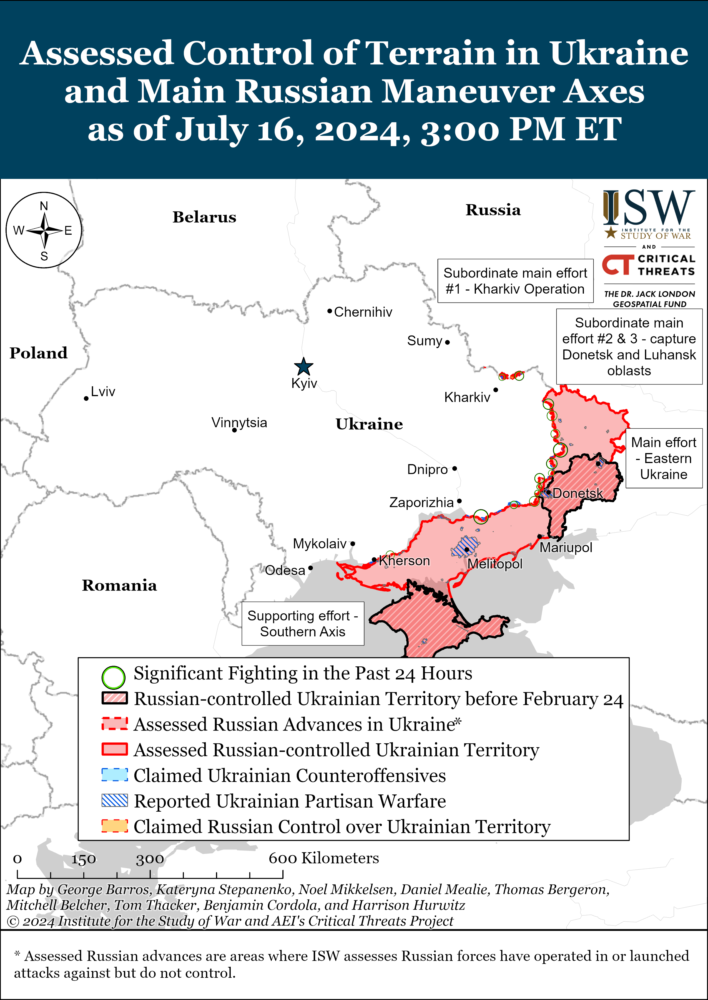
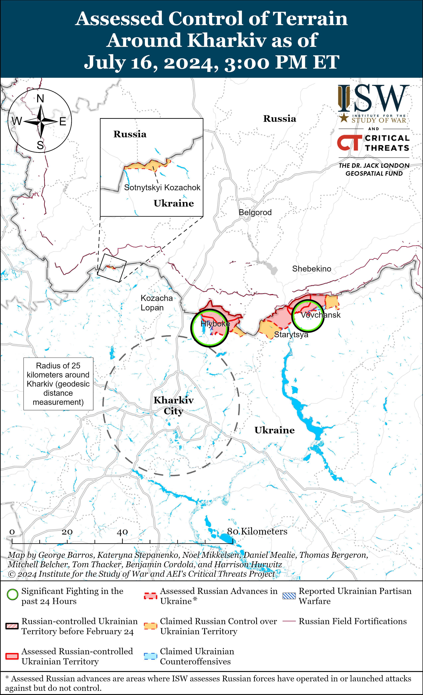
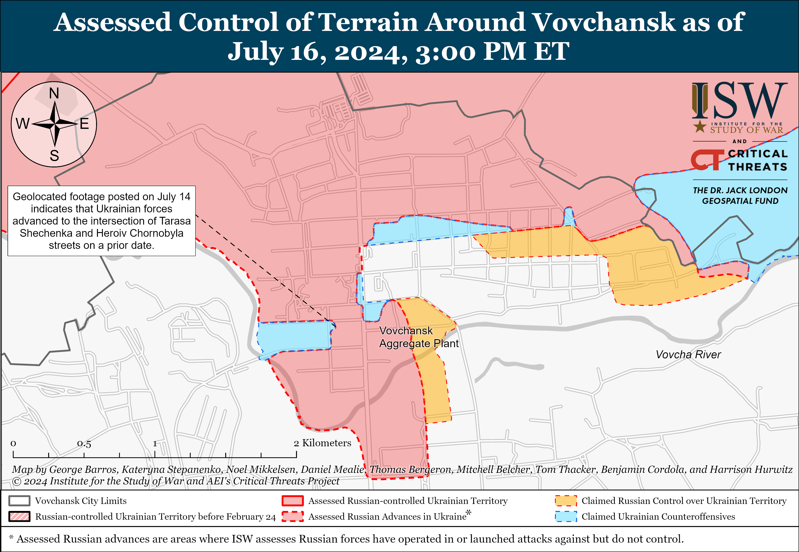
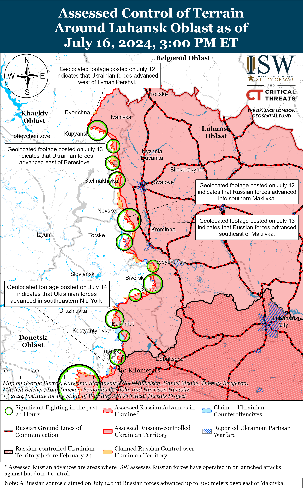
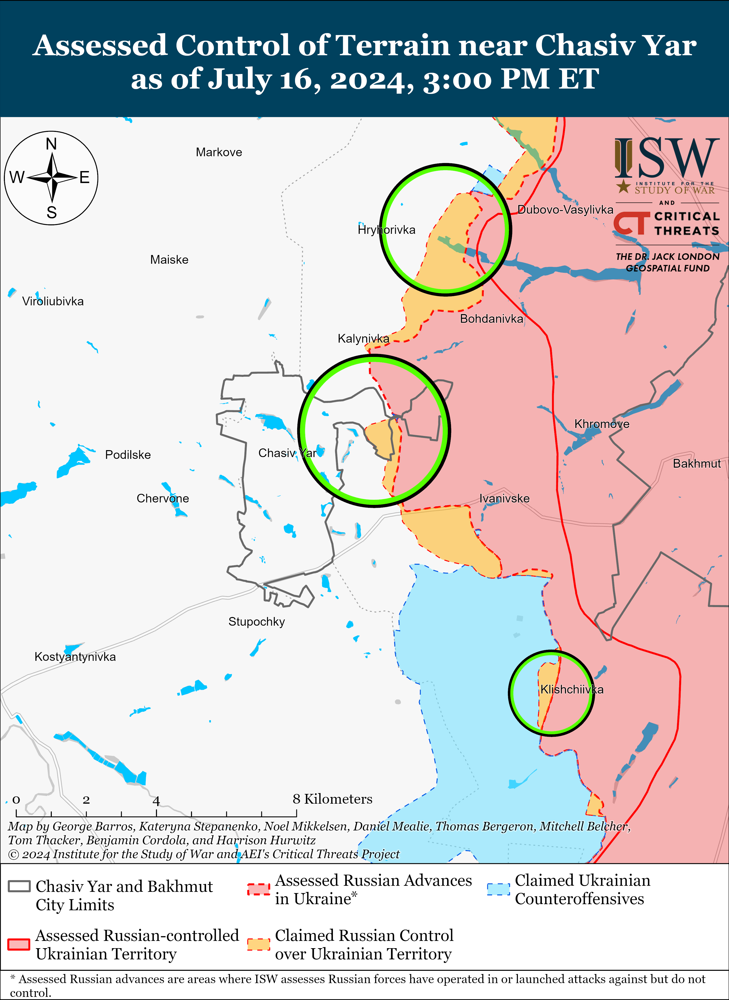
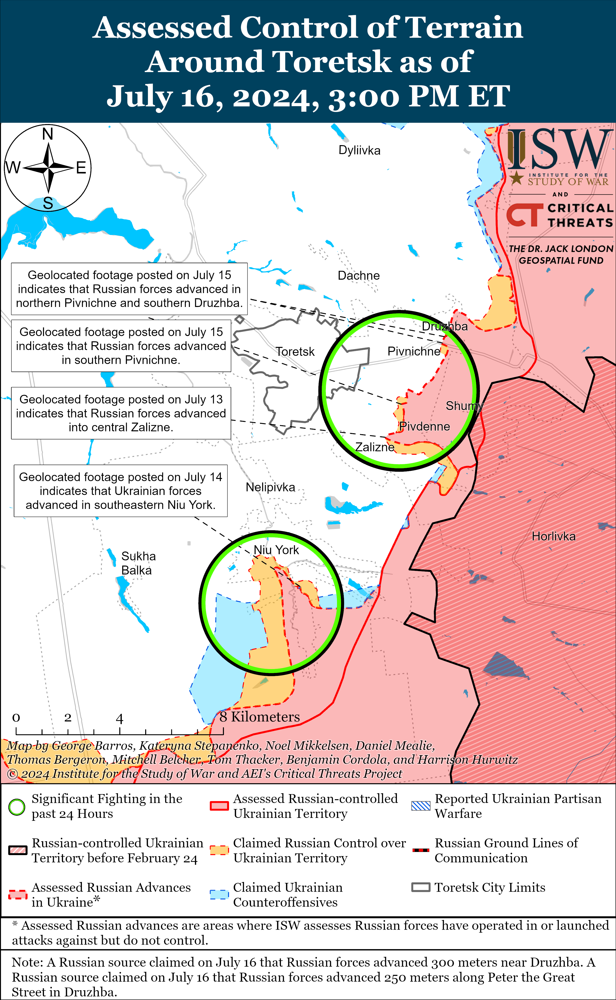
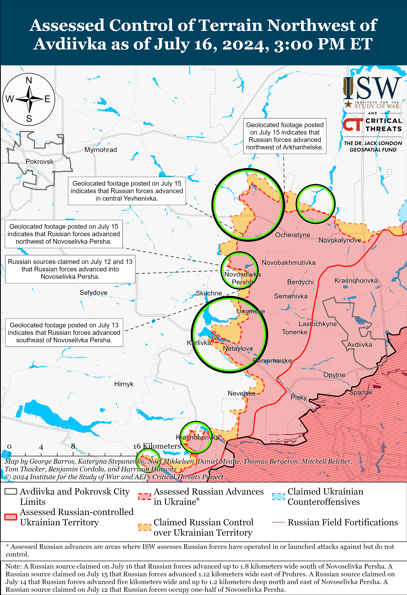
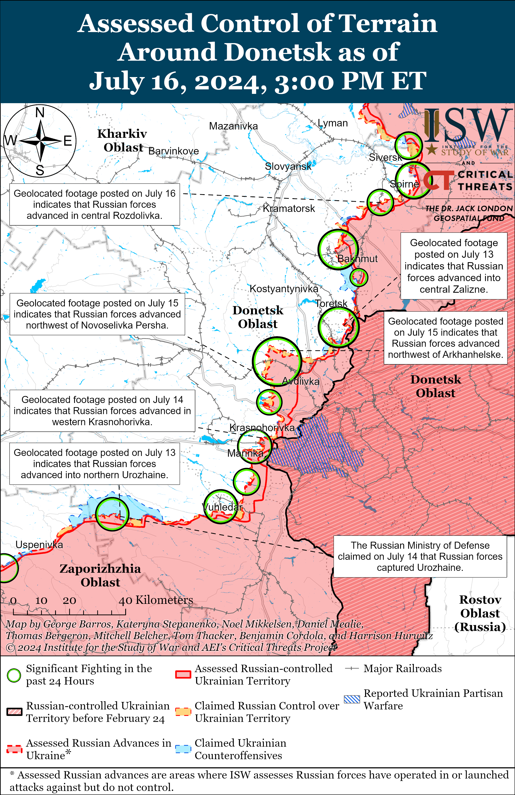
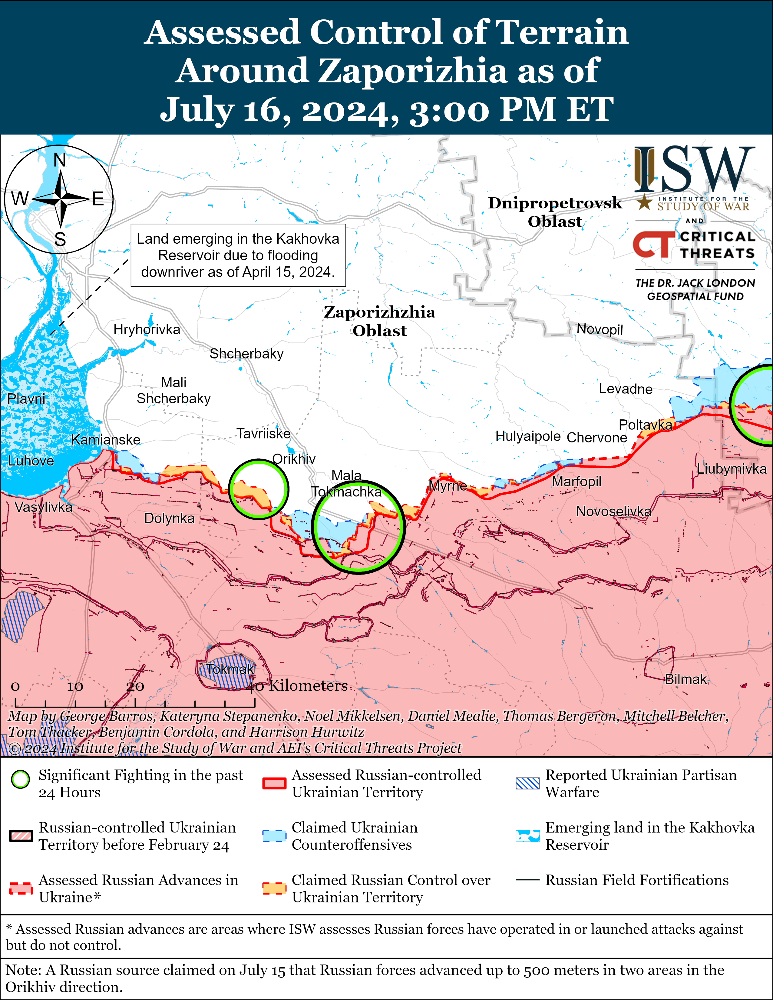
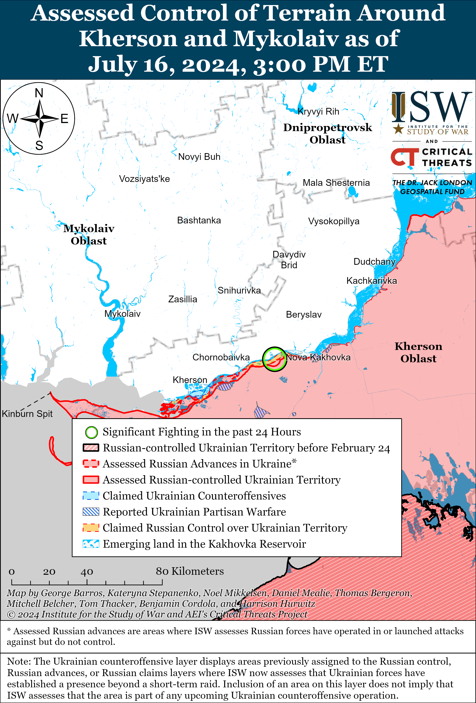

# Russian Offensive Campaign Assessment, July 16, 2024

**Riley Bailey, Nicole Wolkov, Grace Mappes, Kateryna Stepanenko, Karolina Hird, and George Barros**

**July 16, 2024, 6:30pm ET**

**Click**[**here**](https://storymaps.arcgis.com/stories/36a7f6a6f5a9448496de641cf64bd375)**to see ISW’s interactive map of the Russian invasion of Ukraine. This map is updated daily alongside the static maps present in this report.**

**Click**[**here**](https://understandingwar.maps.arcgis.com/apps/instant/3dviewer/index.html?appid=1602762dbcde419bb957dea358449580)**to see ISW’s 3D control of terrain topographic map of Ukraine. Use of a computer (not a mobile device) is strongly recommended for using this data-heavy tool.**

**Click**[**here**](https://storymaps.arcgis.com/stories/733fe90805894bfc8562d90b106aa895)**to access ISW’s archive of interactive time-lapse maps of the Russian invasion of Ukraine. These maps complement the static control-of-terrain map that ISW produces daily by showing a dynamic frontline. ISW will update this time-lapse map archive monthly.**

**Note: The data cut-off for this product was 1pm ET on July 16. ISW will cover subsequent reports in the July 17 Russian Offensive Campaign Assessment.**

**Ukrainian drone strikes deep within Russia continue to pressure Russia’s air defense umbrella and force the Russian military command to prioritize allocating limited air defense assets to cover what it deems to be high-value targets.**Satellite imagery collected on May 6 indicates that Russian forces have concentrated at least seven Pantsir-1 medium-range air defense systems around Russian President Vladimir Putin’s residence in Valdai, Leningrad Oblast.[1] Ruslan Pukhov, the head of the Moscow-based Center for Analysis of Strategies and Technologies and a member of a Russian Ministry of Defense (MoD) civilian advisory board, stated on July 16 that such “focal” air defense coverage (static coverage of a singular target) is meaningless at scale because it allows Ukrainian drones to bypass Russian air defense coverage and strike from uncovered directions.[2] The Russian military apparently lacks the required conventional air defense systems to protect all critical facilities within western Russia and has even struggled to cover important potential targets in reportedly well-defended areas within Russia.[3] Pukhov called on the Russian military to introduce an innovative decentralized approach to protect facilities in Russia from Ukrainian drones and warned that Ukrainian drones will likely reach deeper within Russia.[4] The Russian military began forming mobile fire groups — decentralized groups that Ukraine successfully deployed to defend against Russian Shahed-136/131 drone strikes — in March 2024 but have yet to field these groups at the required scale to sufficiently protect critical facilities in western Russia.[5] Continued pressures on Russia’s air defense umbrella have led select regional authorities to explicitly state that Russian companies and local authorities cannot rely on federal-level Russian air defenses and need to provide for their own anti-drone capabilities.[6] Pukhov suggested that the Russian military field a fleet of light aircraft to intercept Ukrainian drones but noted that Russia’s low level of light aircraft production would complicate such an effort.[7]

**Ukrainian forces continue targeting Russian air defense systems in occupied Ukraine and in Russia’s border areas to set conditions to field F-16 fighter jets following their anticipated Summer-Fall 2024 arrival to Ukraine.**Ukrainian Commander-in-Chief Colonel General Oleksandr Syrskyi reported on July 16 that Ukrainian forces struck an S-300 position in occupied Donetsk Oblast and that Ukrainian forces have destroyed 20 S-300 launchers and 15 radar stations total in an unspecified time period.[8] Syrskyi published geolocated footage showing Ukrainian forces using cluster munitions to strike Russian air defense systems located east of occupied Manhush, Donetsk Oblast (west of Mariupol).[9] The Council of Deputies of Krasninskoye, Volgograd Oblast also claimed on July 15 that the commander of a Russian S-300 battery originally from the area was killed in a Ukrainian ATACMS strike against a S-300 position in the Kharkiv direction at 1300 local time on July 12.[10] The Russian S-300 commander more likely died in a Ukrainian strike against occupied Mariupol, as the commander’s reported time of death is within 15 minutes of a reported strike against a Russian S-300 system near Mariupol on July 12. ISW has not observed indications of a Ukrainian strike against Russian air defense assets in Belgorod Oblast on July 12.[11] ISW is unable to confirm the location of the July 12 strike.

Syrskyi stated on July 16 that Ukrainian forces were systematically destroying Russia’s air defense capabilities to set conditions for Ukraine’s successful use of strike aircraft and noted that F-16s are arriving “soon.”[12] Founder of the Ukrainian Main Military Intelligence Directorate (GUR) “Kraken” Regiment Kostyantyn Nemichev stated on July 12 that Ukrainian forces destroyed four Russian S-300 systems that Russian forces used to strike Kharkiv City within an unspecified period of time.[13] The Council of Deputies of Krasninskoye, Volgograd Oblast claimed that the Russian S-300 battery commander killed on July 12 had noted in a recent letter that Ukrainian strikes against Russian air defense assets had killed two Russian battery commanders, likely air defense batteries, in the past two weeks (likely referring to some time in June-early July 2024).[14] The F-16 deliveries to Ukraine will likely begin in small numbers, and materiel and training constraints will likely prevent Ukrainian forces from leveraging fixed-wing airpower at scale in 2024, as ISW has previously noted.[15] Ukrainian officials have previously indicated that Ukrainian forces also intend to use F-16s and other fixed-wing aircraft as part of Ukraine’s broader air defense umbrella.[16] However, as ISW previously noted, Ukraine will need to attrit Russia’s overall air defense capabilities to safeguard F-16s and properly integrate them into Ukraine’s combat operations.[17]

**The Russian 235th Garrison Military Court released former 58th Combined Arms Army (CAA) Major General Ivan Popov from pre-detention on July 15 and placed him under house arrest until October 11.****[18]**The 235th Garrison Military Court previously refused a request to transfer Popov to house arrest in May 2024 due to opposition from the Russian Prosecutor’s Office.[19] Russian authorities arrested Popov on fraud charges on May 17, but ISW assessed that the real reason behind Popov’s arrest is likely tied to his leaked audio message in which he revealed that former Russian Defense Minister Sergei Shoigu dismissed him for expressing persistent grievances about problems in western Zaporizhia Oblast during the Ukrainian Summer 2023 counteroffensive.[20] Russian political bloggers speculated that First Deputy Chief of Staff of the Russian Presidential Administration Sergey Kiriyenko may have influenced the court’s decision to transfer Popov to house arrest and that this transfer occurred during Russian Chief of General Staff Army General Valery Gerasimov’s leave.[21] One political blogger claimed that Gerasimov considers Popov a ”personal enemy,” which may explain why Kiriyenko made the decision during Gerasimov’s absence.[22] The Russian MoD, however, published footage on July 16 of Gerasimov visiting a command post of the Russian Eastern Grouping of Forces (GoF), where he reportedly heard reports from Eastern GoF Commander Lieutenant General Alexander Sanchik and lauded the claimed Russian seizure of Urozhaine (a settlement on the Donetsk-Zaporizhia Oblast border).[23] ISW observed that the Kremlin recently publicly confirmed that Sanchik replaced Colonel General Sergei Kuzmenko as acting Eastern Military District (EMD) commander.[24]

**Armenian police detained another Russian citizen in Armenia, likely at the request of Russian authorities, amid deteriorating Armenian-Russian political and security relations.**The Armenian Police reported on July 15 that they detained Russian citizen “Ivan Ch” at the Zvartnots Yerevan International Airport after he arrived in Armenia from Kazakhstan and that Russian authorities put “Ivan Ch” on the Russian wanted list in 2023 for unauthorized abandonment of a military unit.[25] The Armenian police reportedly notified Russian law enforcement of Ivan Ch’s detention.[26] Russian military authorities in Armenia previously detained Russian citizens in Armenia for desertion in December 2023 and April 2024, reportedly without notifying Armenian officials.[27] Armenian law enforcement, cooperating with Russian authorities, also recently detained a Russian citizen on Russia’s wanted list at the Yerevan Airport for spreading false information about the Russian military.[28] Russia’s detentions of its citizens and Russia’s requests for Armenian authorities to detain Russian citizens in Armenia are likely part of a Kremlin effort to assert and demonstrate power over Armenia and challenge Armenia’s sovereignty.

**An investigation by Russian opposition outlet *The Bell* found that approximately 650,000 people left Russia following the start of the full-scale invasion of Ukraine and have not returned.****[29]***The Bell* stated that official Russian estimates on how many people have permanently left the country since 2022 are deliberately misrepresentative of the actual scale and instead analyzed immigration statistics of the countries to which Russian citizens fled. *The Bell* found that the majority of these Russian citizens went to countries that have visa-free regime agreements with Russia, including Armenia (which took 110,000 Russians), Kazakhstan (which took 80,000 Russians), and Georgia (which took 74,000 Russians). Israel and the US took 80,000 and 48,000 Russian citizens, respectively. The actual number of Russian citizens who left Russia is likely greater than 700,000 given that *The Bell* reported that countries such as Thailand, Indonesia, Azerbaijan, Greece, and Cyprus did not provide Russian immigration data and that some countries such as Portugal lack updated Russian immigration statistics beyond 2022. *Forbes* notably reported in October 2022, citing sources in the Russian Presidential Administration, that about 700,000 people fled Russia in the first two weeks following the September 21, 2022, start of partial mobilization in Russia.[30] Russian officials previously engaged in a concerted effort to claim that a majority of those who fled since February 2022 began returning to Russia in 2023, but *The Bell* investigation undermines those Russian claims.[31] *The Bell* noted that the number of people it confirmed to have permanently left Russia accounts for only 0.5 percent of the whole Russian population, but that this percentage still represents the largest mass Russian emigration in the last two decades (since the period between 1992-2004, when 1.6 million people left Russia in the aftermath of the dissolution of the Soviet Union). The permanent loss of this population will continue to impact Russia’s economy—ISW previously reported that mass emigration on such a scale caused mass skilled labor shortages and “brain-drain” amongst more educated and skilled parts of the labor force, who are more likely to be able to afford to permanently move abroad.[32]

**Key Takeaways:**

- **Ukrainian drone strikes deep within Russia continue to pressure Russia’s air defense umbrella and force the Russian military command to prioritize allocating limited air defense assets to cover what it deems to be high-value targets.**
- **Ukrainian forces continue targeting Russian air defense systems in occupied Ukraine and in Russia’s border areas to set conditions to field F-16 fighter jets following their anticipated Summer-Fall 2024 arrival to Ukraine.**
- **The Russian 235th Garrison Military Court released former 58th Combined Arms Army (CAA) Major General Ivan Popov from pre-detention on July 15 center and placed him under house arrest until October 11.**
- **Armenian police detained another Russian citizen in Armenia, likely at the request of Russian authorities, amid deteriorating Armenian-Russian political and security relations.**
- **An investigation by Russian opposition outlet *The Bell* found that approximately 650,000 people left Russia following the start of the full-scale invasion of Ukraine and have not returned.**
- **Russian forces recently advanced northwest of Avdiivka.**
- **The Russian government is continuing to improve Russia’s bureaucratic mobilization and conscription systems.**

***We do not report in detail on Russian war crimes because these activities are well-covered in Western media and do not directly affect the military operations we are assessing and forecasting. We will continue to evaluate and report on the effects of these criminal activities on the Ukrainian military and the Ukrainian population and specifically on combat in Ukrainian urban areas. We utterly condemn Russian violations of the laws of armed conflict and the Geneva Conventions and crimes against humanity even though we do not describe them in these reports.***

- Russian Main Effort – Eastern Ukraine (comprised of three subordinate main efforts)
- Russian Subordinate Main Effort #1 – Push Ukrainian forces back from the international border with Belgorod Oblast and approach to within tube artillery range of Kharkiv City
- Russian Subordinate Main Effort #2 – Capture the remainder of Luhansk Oblast and push westward into eastern Kharkiv Oblast and encircle northern Donetsk Oblast
- Russian Subordinate Main Effort #3 – Capture the entirety of Donetsk Oblast
- Russian Supporting Effort – Southern Axis
- Russian Air, Missile, and Drone Campaign
- Russian Mobilization and Force Generation Efforts
- Russian Technological Adaptations
- Activities in Russian-occupied areas
- Ukrainian Defense Industrial Base Efforts
- Russian Information Operations and Narratives
- Significant Activity in Belarus

**Russian Main Effort – Eastern Ukraine**

**Russian Subordinate Main Effort #1 – Kharkiv Oblast****(Russian objective: Push Ukrainian forces back from the international border with Belgorod Oblast and approach to within tube artillery range of Kharkiv City)**

Russian forces continued ground attacks north and northeast of Kharkiv City on July 16, but there were no confirmed changes to the frontline. The Ukrainian General Staff reported that Russian forces attacked north of Kharkiv City near Hlyboke and northeast of Kharkiv City in Vovchansk on July 15 and 16.[33] Russian milbloggers claimed on July 16 that Ukrainian forces counterattacked near Hlyboke.[34] Ukrainian military observer Kostyantyn Mashovets stated that elements of the Russian 2nd Spetsnaz Brigade (Russian General Staff’s Main Directorate [GRU]), the Russian Volunteer Corps, and 128th Motorized Rifle Brigade (44th Army Corps [AC], Leningrad Military District [LMD]) are attacking in Vovchansk.[35]

**Russian Subordinate Main Effort #2 – Luhansk Oblast****(Russian objective: Capture the remainder of Luhansk Oblast and push westward into eastern Kharkiv Oblast and northern Donetsk Oblast)**

Russian forces continued limited offensive operations along the Kupyansk-Svatove-Kreminna line on July 16 but did not make any confirmed advances. A Russian milblogger claimed that the Russian Aerospace Forces (VKS) are targeting Ukrainian bridges across the Hnylytsya River west of Kupyansk in order to complicate Ukrainian logistics in the Kupyansk area.[36] A Ukrainian mechanized battalion operating in the Svatove direction reported that they recently repelled a Russian platoon-sized attack during which Russian forces tried to approach Ukrainian positions in ATV-style buggies.[37] Russian milbloggers claimed that Russian forces continue attacking towards the Zherebets River west of Makiivka (southwest of Svatove) but largely classified Makiivka itself as a contested grey zone.[38] The Ukrainian General Staff reported that Russian forces conducted ground attacks northeast of Kupyansk near Synkivka and Petropavlivka; southeast of Kupyansk near Stepova Novoselivka, Pishchane, and Berestove; northwest of Svatove near Stelmakhivka; west of Svatove near Andriivka; southwest of Svatove near Makiivka; and northwest of Kreminna near Nevske.[39] Elements of the 47th Tank Division (1st Guards Tank Army, Moscow Military District [MMD]) reportedly continue operating in the Kupyansk direction.[40]

**Russian Subordinate Main Effort #3 – Donetsk Oblast****(Russian objective: Capture the entirety of Donetsk Oblast, the claimed territory of Russia’s proxies in Donbas)**

Russian forces continued offensive operations in the Siversk direction on July 16, but there were no confirmed changes to the frontline. Russian forces conducted offensive operations northeast of Siversk near Bilohorivka; east of Siversk near Verkhnokamyanske; southeast of Siversk near Spirne; and south of Siversk near Pereizne and Rozdolivka on July 15 and 16.[41] Elements of the Russian 2nd Artillery Brigade (2nd Luhansk People’s Republic Army Corps [LNR AC]) are reportedly operating in the Siversk direction.[42]

Russian forces continued offensive operations near Chasiv Yar on July 16, but there were no confirmed changes to the front. Russian forces conducted assaults near Chasiv Yar; northeast of Chasiv Yar near Hryhorivka; and southeast of Chasiv Yar near Klishchiivka on July 15 and 16.[43] The Ukrainian General Staff reported that Ukrainian forces repelled a Russian assault near Opytne (south of Bakhmut and east of Klishchiivka) on July 16, although this likely refers to unsuccessful Russian offensive activity in the direction of Klishchiivka since Optyne lies well behind ISW’s current assessed Russian control of terrain line.[44] Elements of the Russian “Sever-V” Brigade (Russian Volunteer Corps) are reportedly operating near Novomarkove (north of Chaisv Yar).[45]

Russian forces reportedly advanced near Toretsk on July 16, but there were no confirmed changes to the frontline. Russian milbloggers claimed that Russian forces advanced along Petra Velykoho street in eastern Druzhba (east of Toretsk) and up to 300 meters deep on Druzhba’s northern outskirts, although ISW has not observed confirmation of these claims.[46] Russian forces continued offensive operations near Toretsk; east of Toretsk near Pivnichne; and south of Toretsk near Niu York on July 15 and 16.[47] Ukrainian military observer Kostyantyn Mashovets stated that elements of the Russian 506th and 589th motorized rifle regiments (both of the 27th Motorized Rifle Division, 2nd Combined Arms Army [CAA], Central Military District [CMD]) are attacking near Pivdenne and Zalizne (both southeast of Toretsk), respectively, and that elements of the 132nd Motorized Rifle Brigade (1st Donetsk People’s Republic [DNR] AC) are operating near Niu York.[48]

Russian forces recently advanced northwest of Avdiivka and continued offensive operations in the area on July 16. Geolocated footage published on July 15 and 16 indicates that Russian forces recently advanced within northwestern Novoselivka Persha (northwest of Avdiivka).[49] A Russian milblogger claimed that Russian forces also advanced within southwestern Novoselivka Persha, although ISW has not observed confirmation of this claim.[50] Geolocated footage published on July 16 indicates that Russian forces recently advanced westward in fields east of Lozuvatske (also northwest of Avdiivka), and Russian milbloggers claimed that Russian forces have made additional advances in this general area.[51] Geolocated footage published on July 15 indicates that Russian forces recently advanced along a windbreak northwest of Arkhanhelske (northwest of Avdiivka).[52] A Russian milblogger claimed that Russian forces also advanced northwestward of Novooleksandrivka and Yevhenivka (both northwest of Avdiivka).[53] Russian forces continued offensive operations north of Avdiivka near Kalynove; northwest of Avdiivka near Novooleksandrivka, Vozdvyzhenka, Prohres, Novoselivka Persha, and Lozuvatske; west of Avdiivka near Umanske and Yasnobrodivka; and southwest of Avdiivka near Karlivka on July 15 and 16.[54] Mashovets stated that brigade-level elements of the CMD’s 2nd and 41st CAAs appear to be losing combat capabilities northwest of Avdiivka and assessed that the command of the Russian Central Grouping of Forces will likely have decide whether to prioritize operations either in the Avdiivka or Toretsk area.[55]

Russian forces continued offensive operations west and southwest of Donetsk City on July 16 but did not make any confirmed advances. Russian milbloggers claimed that Russian forces continued to advance within northern Krasnohorivka (west of Donetsk City) and have seized roughly 90 percent of the settlement.[56] Russian forces continued offensive operations west of Donetsk City near Krasnohorivka and Heorhiivka and southwest of Donetsk City near Kostyantynivka, Paraskoviivka, and Vodyane.[57] Elements of the Russian 238th Artillery Brigade (8th CAA, Southern Military District [SMD]) are reportedly operating near Yelyzavetivka (southwest of Donetsk City), and elements of the 110th Motorized Rifle Brigade (1st DNR AC) are reportedly operating in the Kurakhove direction (west and southwest of Donetsk City).[58]

Russian forces continued offensive operations in the Donetsk-Zaporizhia Oblast border area south of Velyka Novosilka near Makarivka on July 15 and 16.[59] Russian Minister of Defense Andrei Belousov congratulated elements of the 5th Tank Brigade (36th CAA, Eastern Military District [EMD]) and the 40th Naval Infantry Brigade (Pacific Fleet, EMD) on July 16 for seizing Urozhaine (south of Velyka Novosilka), although ISW has yet to observe confirmation that Russian forces have fully seized the settlement.[60]

**Russian Supporting Effort – Southern Axis****(Russian objective: Maintain frontline positions and secure rear areas against Ukrainian strikes)**

Fighting continued in western Zaporizhia Oblast near Robotyne, Mala Tokmachka (northeast of Robotyne), and Novoandriivka (northwest of Robotyne) on July 15 and 16, but there were no confirmed changes to the frontline.[61] Elements of the Russian 70th Motorized Rifle Regiment (42nd Motorized Rifle Division, 58th Combined Arms Army [CAA], Southern Military District [SMD]) are reportedly fighting in the Zaporizhia direction.[62]

Fighting continued in the east (left) bank of Kherson Oblast near Krynky on July 15 and 16, but there were no confirmed changes to the frontline.[63]

Ukrainian Naval Spokesperson Captain Third Rank Dmytro Pletenchuk reported that the last Russian Black Sea Fleet (BSF) patrol boat left occupied Crimea on July 15 and that the patrol boat arrived in Novorossiysk, Krasnodar Krai on July 16.[64] Pletenchuk noted that there are still Russian non-combat supply ships based in occupied Crimea.

**Russian Air, Missile, and Drone Campaign****(Russian Objective: Target Ukrainian military and civilian infrastructure in the rear and on the frontline)**

Russian forces conducted limited drone and missile strikes against Ukraine from July 15 to 16, and some of the Russian drones reportedly flew deep into Belarusian airspace. The Ukrainian Air Force reported on July 16 that Ukrainian forces downed two Russian Shahed-136/131 drones overnight, and the Kyiv Oblast Military Administration reported that Russian drone debris hit residential areas and areas outside of populated settlements.[65] Russian sources claimed that Russian forces struck Ukrainian infrastructure in Odesa, Dnipropetrovsk, Cherkasy, and Chernihiv oblasts overnight on July 15 to 16 and conducted a missile strike on an alleged Ukrainian drone facility at the Hydroport Airport in Odesa Oblast during the day on July 15.[66]

The Ukrainian Air Force reported that two of the Russian Shahed drones were “lost” in Belarusian airspace overnight, and independent Belarusian monitoring group the Hajun Project noted that at least one Russian drone entered Belarusian airspace from the south and flew 60 kilometers for about 50 minutes before re-entering Ukrainian airspace to the east [67] A Russian Shahed drone reportedly flew into Belarusian airspace overnight on July 12 to 13.[68]

**Russian Mobilization and Force Generation Efforts****(Russian objective: Expand combat power without conducting general mobilization)**

The Russian government continues to improve Russia’s bureaucratic mobilization and conscription systems. The UK Ministry of Defense (MoD) reported on July 16 that the Russian government is enacting an “information exchange system” between the Russian MoD and the Federal Security Service (FSB) which will pass personal information on potential conscripts to the FSB border guards.[69] The UK MoD assessed that this system will allow FSB border guards to prevent potential draftees from fleeing Russia before the Fall 2024 conscription cycle. The Russian government could potentially use this mechanism to prevent newly mobilized personnel from leaving the country in the event of another mobilization wave or during other crypto-mobilization force generation drives.

Russian “Vostok” Battalion Commander Alexander Khodakovsky claimed that the Russian military is continuing to integrate elements of Donetsk and Luhansk People’s Republics’ (DNR and LNR) militias with some “serious” setbacks.[70] Khodakovsky stated that the newly imposed Russian conscription laws imply that veterans — including those who have state military awards, were repeatedly wounded in combat, or did not fight under the Russian MoD’s direct supervision — are subject to conscription.[71] Khodakovsky added that many DNR veterans who fought as part of the DNR Ministry of Internal Affairs (MVD) and continue to serve in security forces are now facing the possibility of being conscripted into the Russian military.

Social media users amplified Russian recruitment posts offering recruits a 1.7 million-ruble (about $19,200) one-time enlistment bonus for signing military contracts in Moscow Oblast for service in the 1st Guards Tank Army (Moscow Military District [MMD]) as part of a recruitment campaign which started on June 1.[72] Social media users also amplified Russian recruitment posts from Nizhny Novgorod offering a one-time enlistment bonus of one million rubles ($11,300) for recruits to serve on a year-long contract, and Yaroslavl Oblast offering 705,000 rubles ($8,000) enlistment bonus for interested recruits.[73]

The Russian MoD announced that Russian and People’s Liberation Army (PLA) navies completed joint maritime patrols in the South China Sea on July 16.[74] The Russian MoD reported that the Russian Pacific Fleet’s *Sovershennyi* Steregushchy-class corvette and the PLA Navy’s *Yinchuan*destroyer, *Hengshui* frigate, and *Weishanhu*universal supply transport ship conducted training on convoying a ship in a maritime strait zone. The Russian MoD reported that Russian and PLA ships organized a comprehensive defense for one ship passing through the straits as part of the patrol exercises. Russian and PLA ships also trained to replenish supplies with the*Weishanhu*universal supply transport ship. The Russian MoD claimed that the Russian and PLA navies jointly covered 4,800 nautical miles in the Asia-Pacific region in just 15 days.

**Russian Technological Adaptations****(Russian objective: Introduce technological innovations to optimize systems for use in Ukraine)**

Russian theater commander and Chief of the Russian General Staff Army General Valery Gerasimov viewed samples of Russian unmanned ground-based vehicles (UGVs) when he visited the command post of the Eastern Grouping of Forces in Ukraine on July 16.[75] The Russian MoD claimed that elements of the Eastern Grouping of Forces used UGVs in assaults in the Donetsk-Zaporizhia Oblast border area near Urozhaine (south of Velyka Novosilka).[76]

The director of the Russian defense enterprise Kingisepp Machine-Building Plant (KMZ), Mikhail Danilenko, stated on July 15 that KMZ plans to arm its multifunctional “Vizir” naval drone with light missiles.[77] Danilenko stated that KMZ plans to equip one side of the naval drone with six to eight missiles.[78] KMZ signed a contract with the Russian Ministry of Defense (MoD) in May 2024 to build 199 multi-purpose patrol boats for the Russian military.[79]

**Ukrainian Defense Industrial Efforts****(Ukrainian objective: Develop its defense industrial base to become more self-sufficient in cooperation with US, European, and international partners)**

*ISW is not publishing coverage of Ukrainian defense industrial efforts today.*

**Activities in Russian-occupied areas****(Russian objective: Consolidate administrative control of annexed areas; forcibly integrate Ukrainian citizens into Russian sociocultural, economic, military, and governance systems)**

Russian occupation authorities are using youth organizations to drive passportization among younger demographics. The Luhansk People’s Republic Ministry of Internal Affairs (LNR MVD) stated on July 16 that the “We are Citizens of Russia” program handed out Russian passports to five young residents of occupied Rovenky, Luhansk Oblast.[80] The “We are Citizens of Russian” program advertises itself as a project of the Russian youth organization “Movement of the First” and claims that it aims to make the presentation of Russian passports to children 14 and older “a solemn and memorable event that fosters a sense of patriotism.”[81] The “Movement of the First” program is notably a Kremlin-linked youth military-patriotic organization that operates throughout Russia and occupied Ukraine and aims to instill pro-Russian ideals via youth civic engagement.[82] Russian passportization in occupied Ukraine furthers the Kremlin narrative that residents of occupied Ukraine are legally Russian citizens, as ISW has previously assessed.[83] The passportization of youth, furthermore, sets long-term multigenerational conditions for this Russian effort.

Ukrainian officials continue to warn that Russian occupation officials are militarizing Ukrainian youth living in occupied areas. Ukrainian Mariupol Mayoral Advisor Petro Andryushchenko stated on July 16 that Russian occupation authorities will open School No. 28 in the Kalimiusky Raion of Mariupol for the new school year (2024-2025) but mostly offer military cadet classes to children under the leadership of the former head of an unspecified Russian maritime academy.[84] Ukrainian Zaporizhia Oblast Head Ivan Fedorov reported that Russian authorities have improved new curricula for schools in occupied Zaporizhia Oblast that teach children how to fight and kill to “protect the motherland.”[85] Fedorov also noted that Russian authorities opened a new military-patriotic club for youth in Melitopol to propagate pro-Russian militaristic ideals.[86] The Ukrainian Resistance Center warned on July 13 that Russian occupation authorities are increasingly using Russian military veterans affiliated with the Russian state-run “Defenders of the Fatherland” foundation to teach Kremlin narratives and pro-Russian ideologies amongst youth in occupied Ukraine.[87]

**Russian Information Operations and Narratives**

A Russian official intensified a boilerplate Russian narrative on July 15 accusing Ukraine of planning to use chemical weapons against Russian forces. Russian Permanent Representative to the Organization for the Prohibition of Chemical Weapons Vladimir Tarabrin claimed that the risk of Ukrainian forces using chemical weapons has grown due to alleged Ukrainian battlefield failures.[88] Russian officials have routinely accused Ukraine of using or intending to use chemical weapons in violation of the Chemical Weapons Convention (CWC) in order to discredit and undermine support for Ukraine.[89] The US Department of State (DoS) announced on May 1 that it had determined that Russian forces are violating the CWC, to which Russia is a signatory.[90]

Russian Foreign Minister Sergei Lavrov reiterated the baseless claim that Ukrainian authorities mistreat ethnic Russians and ethnic minorities in Ukraine on July 15 at a United Nations Security Council (UNSC) meeting in an attempt to justify Russia’s full-scale invasion of Ukraine.[91] Senior Russian officials have long attempted to falsely justify Russia’s invasion of Ukraine as an attempt to protect ethnic Russians and Russian speakers in Ukraine.[92] Russian occupation authorities have targeted religious and ethnic minorities in occupied Ukraine, especially Crimean Tatars.[93]

Russian milbloggers continue to amplify Ukrainian criticisms of Ukrainian officials, likely as part of ongoing attempts to divide Ukrainian society and sew domestic distrust in Ukrainian government officials. Russian milbloggers widely amplified reports that a Ukrainian official was removed from some of their government positions due to their criticisms of Ukrainian forces.[94] Russian milbloggers have previously amplified the Ukrainian official’s criticisms of the Ukrainian military and quickly amplified a prominent Ukrainian source’s condemnations of the official.[95]

The Russian Ministry of Foreign Affairs (MFA) amplified on July 15 a debate about a contentious historical site to exacerbate ongoing issues between Serbia and Kosovo in an attempt to destabilize Kosovo.[96] The Russian MFA has previously used issues regarding historical sites and monuments to amplify domestic discord in foreign countries and justify potential future Russian aggression.[97] Russia may be expanding its efforts to destabilize the Balkans and attempting to undermine Western-brokered settlements in the region.[98]

The Kremlin continues to use Russian government-linked Russian cultural organizations to influence Russians living outside of Russia. Russian Ambassador to Cyprus Murat Zyazikov announced on July 6 the opening of a new branch of the International Russophile Movement, an organization intending to promote Russian narratives abroad and combat “Russophobia,” in Cyprus.[99]

**Significant activity in Belarus****(Russian efforts to increase its military presence in Belarus and further integrate Belarus into Russian-favorable frameworks and Wagner Group activity in Belarus)**

Belarusian forces continued joint military exercises with the People’s Liberation Army (PLA) forces in the “Attacking Falcon” exercises in Minsk and with Kazakh forces in the Peak Brotherhood-2024″ exercises at the Koktal Training Ground in Kazakhstan.[100]

Belarusian President Alexander Lukashenko continued on July 16 to reiterate that Belarus does not intend to join the war in Ukraine and to amplify rhetoric supporting the Kremlin’s reflexive control campaign aimed at influencing Western states to reduce their support for Ukraine.[101]

**Note: ISW does not receive any classified material from any source, uses only publicly available information, and draws extensively on Russian, Ukrainian, and Western reporting and social media as well as commercially available satellite imagery and other geospatial data as the basis for these reports. References to all sources used are provided in the endnotes of each update.**

****

---

[1] https://www.severreal dot org/a/ryadom-s-rezidentsiey-putina-na-valdae-ustanovili-sistemu-pvo-pantsir-s1-/33038056.html; https://t.me/severrealii/26099 ; https://x.com/kromark/status/1812865455381418360

[2] https://rg dot ru/2024/07/16/ruslan-puhov-strane-neobhodima-novatorskaia-organizaciia-protivodronovoj-oborony.html

[3] https://understandingwar.org/backgrounder/russian-offensive-campaign-assessment-march-30-2024 ; https://understandingwar.org/backgrounder/russian-offensive-campaign-assessment-january-21-2024

[4] https://rg dot ru/2024/07/16/ruslan-puhov-strane-neobhodima-novatorskaia-organizaciia-protivodronovoj-oborony.html;

[5] https://understandingwar.org/backgrounder/russian-offensive-campaign-assessment-march-30-2024

[6] https://isw.pub/UkrWar040324

[7] https://rg dot ru/2024/07/16/ruslan-puhov-strane-neobhodima-novatorskaia-organizaciia-protivodronovoj-oborony.html

[8] https://x.com/CinC\_AFU/status/1813207080951586927; https://t.me/osirskiy/765

[9] https://t.me/osirskiy/765; https://x.com/bayraktar\_1love/status/1813225522404507650; https://x.com/EjShahid/status/1813219580505936146; https://x.com/CinC\_AFU/status/1813207080951586927

[10] https://vk dot com/wall-221841402\_431; https://t.me/pechalbeda200/96672; https://t.me/ButusovPlus/11889; https://t.me/uniannet/139414

[11] https://understandingwar.org/backgrounder/russian-offensive-campaign-assessment-july-12-2024; https://x.com/bayraktar\_1love/status/1811707952790733160; https://x.com/bayraktar\_1love/status/1811731429753041374; https://x.com/666\_mancer/status/1811705931966587073; https://t.me/mariupolrada/22449; https://t.me/andriyshTime/24465 ; https://t.me/andriyshTime/24447; https://t.me/andriyshTime/24451; https://t.me/andriyshTime/24455; https://t.me/andriyshTime/24453 ; https://t.me/andriyshTime/24466; https://t.me/astrapress/59522; https://t.me/mariupolnow/45368

[12] https://x.com/CinC\_AFU/status/1813207088845267248

[13] https://33kanal dot com/news/259653.html; https://www.facebook.com/nemichev.kn/posts/pfbid02X3Hup9HVZPvehqnaAZGKRsVzmVvr5LCrc9c9BarqDEQXEDjewc82GpRg4wjjDxwul

[14] https://vk dot com/wall-221841402\_431; https://t.me/pechalbeda200/96672; https://t.me/ButusovPlus/11889; https://t.me/uniannet/139414; https://t.me/mariupolnow/45368

[15] https://understandingwar.org/backgrounder/russian-offensive-campaign-assessment-june-12-2024

[16] https://understandingwar.org/backgrounder/russian-offensive-campaign-assessment-april-13-2024

[17] https://understandingwar.org/backgrounder/russian-offensive-campaign-assessment-june-12-2024

[18] https://ria dot ru/20240715/sud-1959802910.html

[19] https://ria dot ru/20240715/sud-1959802910.html

[20] https://understandingwar.org/backgrounder/russian-offensive-campaign-assessment-may-21-2024

[21] https://t.me/russicatrend/4664 ; https://t.me/arbat/1835

[22] https://t.me/russicatrend/4664

[23] https://t.me/mod\_russia/41088

[24] https://understandingwar.org/backgrounder/russian-offensive-campaign-assessment-may-15-2024

[25] https://www.police dot am/news/view/het7150724.html

[26] https://meduza dot io/news/2024/07/16/v-aeroportu-erevana-zaderzhali-rossiyanina-kotorogo-ob-yavili-v-rozysk-po-delu-o-samovolnom-ostavlenii-chasti ; https://t.me/astrapress/59756

[27] https://understandingwar.org/backgrounder/russian-offensive-campaign-assessment-december-10-2023 ; https://understandingwar.org/backgrounder/russian-offensive-campaign-assessment-april-9-2024

[28] https://understandingwar.org/backgrounder/russian-offensive-campaign-assessment-july-13-2024

[29] https://gnkaglamozazamjh dot bmeq4xku34je.live/posle-nachala-voyny-iz-rossii-uekhali-i-ne-vernulis-bolshe-700-tysyach-chelovek-issledovanie-the-bel

[30] https://www.forbes.ru/society/478827-rossiu-posle-21-sentabra-pokinuli-okolo-700-000-grazdan

[31] https://t.me/vv\_volodin/719

[32] https://understandingwar.org/backgrounder/russian-offensive-campaign-assessment-november-26-2023; https://gnkaglamozazamjh dot bmeq4xku34je.live/posle-nachala-voyny-iz-rossii-uekhali-i-ne-vernulis-bolshe-700-tysyach-chelovek-issledovanie-the-bel

[33] https://www.facebook.com/GeneralStaff.ua/posts/pfbid026L8PGXu4ZmZSuYEwAxZrAhDfLs5uoPgbGLRmQiyUZACkLJ5JwMn2yMq3SjAd6bKAl ; https://www.facebook.com/GeneralStaff.ua/posts/pfbid0bCYBu4Pom2jSMNZJHaxYNrGTiPtqAkKVVhagMNKhp6QN6KfyjaaQbzmZz2YGSzHvl ; https://www.facebook.com/GeneralStaff.ua/posts/pfbid0vxUofepy9FYGajZJ7rTuSoW8aSeKoNbGxh9o1PR4EVffzAuenxnTxn6KtxD3MwYcl

[34] https://t.me/dva\_majors/47397 ; https://t.me/wargonzo/21052 ; https://t.me/DnevnikDesantnika/12759 ; https://t.me/DnevnikDesantnika/12766

[35] https://t.me/zvizdecmanhustu/2038

[36] https://t.me/DnevnikDesantnika/12772

[37] https://suspilne dot media/791347-nimeccina-taemno-peredala-ukraini-paket-dopomogi-v-59-i-brigadi-iniciuvali-perevirku-873-den-vijni-onlajn/?anchor=live\_1721124638&utm\_source=copylink&utm\_medium=ps; https://suspilne dot media/kharkiv/791583-bijci-44-i-ombr-znisili-pat-bagi-razom-z-rosijskimi-vijskovimi-na-svativskomu-napramku/; https://armyinform dot com.ua/2024/07/16/baggi-v-odyn-kinecz-rosijski-mashyny-dobre-goryat-v-speku/; https://www.facebook.com/kommander.nord/videos/472148538782486

[38] https://t.me/rybar/61842; https://t.me/dva\_majors/47397

[39] https://www.facebook.com/GeneralStaff.ua/posts/pfbid026L8PGXu4ZmZSuYEwAxZrAhDfLs5uoPgbGLRmQiyUZACkLJ5JwMn2yMq3SjAd6bKAl; https://www.facebook.com/GeneralStaff.ua/posts/pfbid0bCYBu4Pom2jSMNZJHaxYNrGTiPtqAkKVVhagMNKhp6QN6KfyjaaQbzmZz2YGSzHvl

[40] https://t.me/boris\_rozhin/130185

[41] https://www.facebook.com/GeneralStaff.ua/posts/pfbid026L8PGXu4ZmZSuYEwAxZrAhDfLs5uoPgbGLRmQiyUZACkLJ5JwMn2yMq3SjAd6bKAl ; https://www.facebook.com/GeneralStaff.ua/posts/pfbid0bCYBu4Pom2jSMNZJHaxYNrGTiPtqAkKVVhagMNKhp6QN6KfyjaaQbzmZz2YGSzHvl ; https://www.facebook.com/GeneralStaff.ua/posts/pfbid0vxUofepy9FYGajZJ7rTuSoW8aSeKoNbGxh9o1PR4EVffzAuenxnTxn6KtxD3MwYcl

[42] https://t.me/sons\_fatherland/15622

[43] https://www.facebook.com/GeneralStaff.ua/posts/pfbid026L8PGXu4ZmZSuYEwAxZrAhDfLs5uoPgbGLRmQiyUZACkLJ5JwMn2yMq3SjAd6bKAl ; https://www.facebook.com/GeneralStaff.ua/posts/pfbid0bCYBu4Pom2jSMNZJHaxYNrGTiPtqAkKVVhagMNKhp6QN6KfyjaaQbzmZz2YGSzHvl ; https://www.facebook.com/GeneralStaff.ua/posts/pfbid0vxUofepy9FYGajZJ7rTuSoW8aSeKoNbGxh9o1PR4EVffzAuenxnTxn6KtxD3MwYcl

[44] https://www.facebook.com/GeneralStaff.ua/posts/pfbid026L8PGXu4ZmZSuYEwAxZrAhDfLs5uoPgbGLRmQiyUZACkLJ5JwMn2yMq3SjAd6bKAl

[45] https://t.me/grey\_zone/23581

[46] https://t.me/RVvoenkor/72579 ; https://t.me/DnevnikDesantnika/12764

[47] https://www.facebook.com/GeneralStaff.ua/posts/pfbid026L8PGXu4ZmZSuYEwAxZrAhDfLs5uoPgbGLRmQiyUZACkLJ5JwMn2yMq3SjAd6bKAl ; https://www.facebook.com/GeneralStaff.ua/posts/pfbid0bCYBu4Pom2jSMNZJHaxYNrGTiPtqAkKVVhagMNKhp6QN6KfyjaaQbzmZz2YGSzHvl ; https://www.facebook.com/GeneralStaff.ua/posts/pfbid0vxUofepy9FYGajZJ7rTuSoW8aSeKoNbGxh9o1PR4EVffzAuenxnTxn6KtxD3MwYcl

[48] https://t.me/zvizdecmanhustu/2039

[49] https://x.com/GeoConfirmed/status/1813157776375308341; https://x.com/GeoRaccoon/status/1813156633448493268; https://t.me/creamy\_caprice\_chat/141625; https://t.me/creamy\_caprice/6081;

[50] https://t.me/motopatriot/24930

[51] https://t.me/creamy\_caprice/6079; https://t.me/kokos\_group15/127; https://x.com/giK1893/status/1812990817428250986; https://t.me/motopatriot/24927; https://t.me/z\_arhiv/27306

[52] https://x.com/GermanObserver1/status/1812984453028803065; https://x.com/GermanObserver1/status/1812984459190542605; https://t.me/voron1OO/34

[53] https://t.me/motopatriot/24930

[54] https://www.facebook.com/GeneralStaff.ua/posts/pfbid026L8PGXu4ZmZSuYEwAxZrAhDfLs5uoPgbGLRmQiyUZACkLJ5JwMn2yMq3SjAd6bKAl ; https://www.facebook.com/GeneralStaff.ua/posts/pfbid0bCYBu4Pom2jSMNZJHaxYNrGTiPtqAkKVVhagMNKhp6QN6KfyjaaQbzmZz2YGSzHvl ; https://www.facebook.com/GeneralStaff.ua/posts/pfbid0vxUofepy9FYGajZJ7rTuSoW8aSeKoNbGxh9o1PR4EVffzAuenxnTxn6KtxD3MwYcl ; https://t.me/RVvoenkor/72564 ; https://t.me/motopatriot/24927 ; https://t.me/dva\_majors/47397 ; https://t.me/wargonzo/21052 ; https://t.me/RVvoenkor/72579 ; https://t.me/motopatriot/24930

[55] https://t.me/zvizdecmanhustu/2040

[56] https://t.me/NgP\_raZVedka/18385 ; https://t.me/wargonzo/21052 ; https://t.me/dva\_majors/47397

[57] https://www.facebook.com/GeneralStaff.ua/posts/pfbid026L8PGXu4ZmZSuYEwAxZrAhDfLs5uoPgbGLRmQiyUZACkLJ5JwMn2yMq3SjAd6bKAl ; https://www.facebook.com/GeneralStaff.ua/posts/pfbid0bCYBu4Pom2jSMNZJHaxYNrGTiPtqAkKVVhagMNKhp6QN6KfyjaaQbzmZz2YGSzHvl ; https://www.facebook.com/GeneralStaff.ua/posts/pfbid0vxUofepy9FYGajZJ7rTuSoW8aSeKoNbGxh9o1PR4EVffzAuenxnTxn6KtxD3MwYcl ; https://t.me/NgP\_raZVedka/18385 ; https://t.me/wargonzo/21052 ; https://t.me/dva\_majors/47397

[58] https://t.me/nm\_dnr/12477 ; https://t.me/RVvoenkor/72569

[59] https://www.facebook.com/GeneralStaff.ua/posts/pfbid0bCYBu4Pom2jSMNZJHaxYNrGTiPtqAkKVVhagMNKhp6QN6KfyjaaQbzmZz2YGSzHvl ; https://www.facebook.com/GeneralStaff.ua/posts/pfbid0vxUofepy9FYGajZJ7rTuSoW8aSeKoNbGxh9o1PR4EVffzAuenxnTxn6KtxD3MwYcl

[60] https://t.me/mod\_russia/41068

[61] https://www.facebook.com/GeneralStaff.ua/posts/pfbid026L8PGXu4ZmZSuYEwAxZrAhDfLs5uoPgbGLRmQiyUZACkLJ5JwMn2yMq3SjAd6bKAl; https://www.facebook.com/GeneralStaff.ua/posts/pfbid0bCYBu4Pom2jSMNZJHaxYNrGTiPtqAkKVVhagMNKhp6QN6KfyjaaQbzmZz2YGSzHvl; https://www.facebook.com/GeneralStaff.ua/posts/pfbid0vxUofepy9FYGajZJ7rTuSoW8aSeKoNbGxh9o1PR4EVffzAuenxnTxn6KtxD3MwYcl; https://t.me/wargonzo/21052; https://t.me/dva\_majors/47397

[62] https://t.me/RVvoenkor/72559

[63] https://www.facebook.com/GeneralStaff.ua/posts/pfbid0bCYBu4Pom2jSMNZJHaxYNrGTiPtqAkKVVhagMNKhp6QN6KfyjaaQbzmZz2YGSzHvl; https://www.facebook.com/GeneralStaff.ua/posts/pfbid0vxUofepy9FYGajZJ7rTuSoW8aSeKoNbGxh9o1PR4EVffzAuenxnTxn6KtxD3MwYcl

[64] https://armyinform.com dot ua/2024/07/15/okupanty-vyrishyly-shho-v-krymu-yim-bilshe-nemaye-chogo-storozhyty/; https://armyinform dot com.ua/2024/07/16/u-vms-rozpovily-yaki-vorozhi-korabli-zalyshylys-u-krymu/

[65] https://suspilne dot media/kyiv/791431-nicna-ataka-droniv-na-kiivsinu-v-oblasti-pracuvali-sili-ppo/; https://t.me/kyivoda/18620; https://t.me/kpszsu/16632

[66] https://t.me/DnevnikDesantnika/12766 ; https://t.me/dva\_majors/47397; https://t.me/RVvoenkor/72557 ; https://t.me/boris\_rozhin/130174

[67] https://t.me/Hajun\_BY/8004; https://t.me/kpszsu/16632

[68] https://understandingwar.org/backgrounder/russian-offensive-campaign-assessment-july-13-2024; https://t.me/ComAFUA/348; https://t.me/Hajun\_BY/7999

[69] https://x.com/DefenceHQ/status/1813123442729779368

[70] https://t.me/aleksandr\_skif/3252

[71] https://t.me/aleksandr\_skif/3252

[72] https://x.com/GirkinGirkin/status/1813163968330146019

[73] https://x.com/GirkinGirkin/status/1801099158540992706/photo/2

[74] https://t.me/mod\_russia/41084; https://t.me/milinfolive/126144

[75] https://t.me/mod\_russia/41088

[76] https://t.me/mod\_russia/41088

[77] https://iz dot ru/1727561/2024-07-15/tiazhelyi-morskoi-dron-na-baze-katera-vizir-sdelaiut-raketnym

[78] https://iz dot ru/1727561/2024-07-15/tiazhelyi-morskoi-dron-na-baze-katera-vizir-sdelaiut-raketnym

[79] https://en.topwar dot ru/242807-holding-kmz-postroit-seriju-mnogocelevyh-katerov-v-interesah-mchs.html ; https://bulgarianmilitary dot com/2024/05/21/russia-orders-199-multi-purpose-patrol-boats-kmz-begins-production/

[80] https://t.me/mvdlnr\_official/6589

[81] https://xn--90acagbhgpca7c8c7f dot xn--p1ai/projects/40

[82] https://xn--90acagbhgpca7c8c7f dot xn--p1ai/; https://t.me/sprotyv\_official/4749

[83] https://understandingwar.org/wp-content/uploads/2024/07/24-210-0120ISW20Occupation20playbook.pdf

[84] https://t.me/andriyshTime/24625

[85] https://t.me/ivan\_fedorov\_zp/9459

[86] https://t.me/ivan\_fedorov\_zp/9459

[87] https://sprotyv dot mod.gov.ua/vorog-shukaye-veteraniv-dlya-provedennya-lektsij-ukrayinskym-dityam/ ; https://t.me/sprotyv\_official/4746

[88] https://tass dot ru/politika/21368995

[89] https://understandingwar.org/backgrounder/russian-offensive-campaign-assessment-july-9-2024 ; https://understandingwar.org/backgrounder/russian-offensive-campaign-assessment-march-25-2024

[90] https://www.state.gov/imposing-new-measures-on-russia-for-its-full-scale-war-and-use-of-chemical-weapons-against-ukraine-2/ ; https://understandingwar.org/backgrounder/russian-offensive-campaign-assessment-may-2-2024

[91] https://t.me/tass\_agency/260808 ; https://tass dot ru/politika/21376377

[92] https://understandingwar.org/backgrounder/russian-offensive-campaign-assessment-february-28-2024 ; https://understandingwar.org/backgrounder/russian-offensive-campaign-assessment-march-29-2024 ;

[93] https://understandingwar.org/backgrounder/russian-offensive-campaign-assessment-april-9-2023 ; https://understandingwar.org/backgrounder/russian-offensive-campaign-assessment-march-5-2024 ; https://understandingwar.org/backgrounder/russian-offensive-campaign-assessment-february-2-2023 ; https://understandingwar.org/backgrounder/russian-offensive-campaign-assessment-may-29-2023

[94] https://t.me/dva\_majors/47377 ; https://t.me/designersmil/8523 ; https://t.me/marybezuhla/1806 ; https://unn dot ua/en/news/bezuhla-removed-from-the-post-of-head-of-the-subcommittee-in-the-national-security-committee

[95] https://t.me/RVvoenkor/72588 ; https://t.me/dva\_majors/47407 ; https://t.me/vysokygovorit/16540 ; https://myrotvorets dot center/criminal/bezuhlaia-mariana-vladymyrovna/ ; https://ria dot ru/20240716/bezuglaya-1959991673.html ; https://strana dot news/news/468686-marjanu-bezuhluju-vnesli-na-sajt-mirotvorets-za-antihosudarstvennuju-dejatelnost.html ; https://understandingwar.org/backgrounder/russian-offensive-campaign-assessment-july-3-2024 ; https://understandingwar.org/backgrounder/russian-offensive-campaign-assessment-june-23-2024 ; https://understandingwar.org/backgrounder/russian-offensive-campaign-assessment-july-14-2024

[96] https://t.me/MID\_Russia/43247; https://t.me/rusembserbia/1286

[97] https://understandingwar.org/backgrounder/russian-offensive-campaign-assessment-february-2-2024 ; https://understandingwar.org/backgrounder/russian-offensive-campaign-assessment-february-5-2024 ; https://understandingwar.org/backgrounder/russian-offensive-campaign-assessment-may-10-2024

[98] https://understandingwar.org/backgrounder/russian-offensive-campaign-assessment-april-25-2024 ; https://understandingwar.org/backgrounder/russian-offensive-campaign-assessment-june-9-2024 ; https://understandingwar.org/backgrounder/russian-offensive-campaign-assessment-june-7-2024

[99] https://t.me/MID\_Russia/43256 ; https://www.kp dot ru/online/news/5887515/

[100] https://t.me/modmilby/40416 ; https://t.me/belta\_telegramm/258709; https://t.me/modmilby/40409

[101] https://t.me/pul\_1/13017 ; https://t.me/belta\_telegramm/258727; https://t.me/modmilby/40425 ; https://t.me/modmilby/40424; https://t.me/modmilby/40430 ; https://t.me/pul\_1/13023 ; https://t.me/belta\_telegramm/258755
