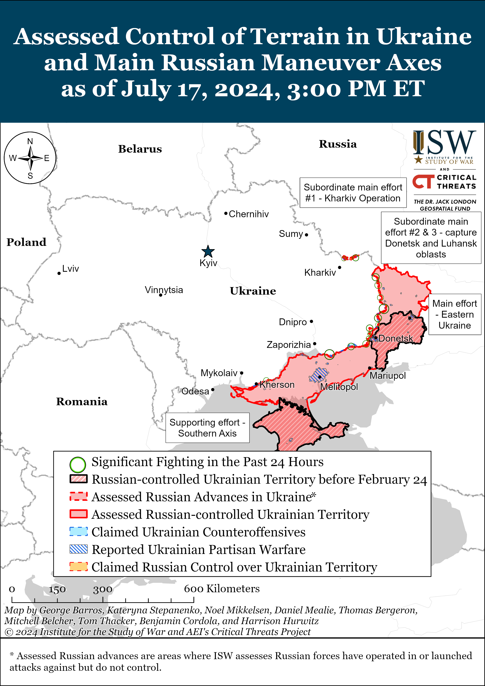
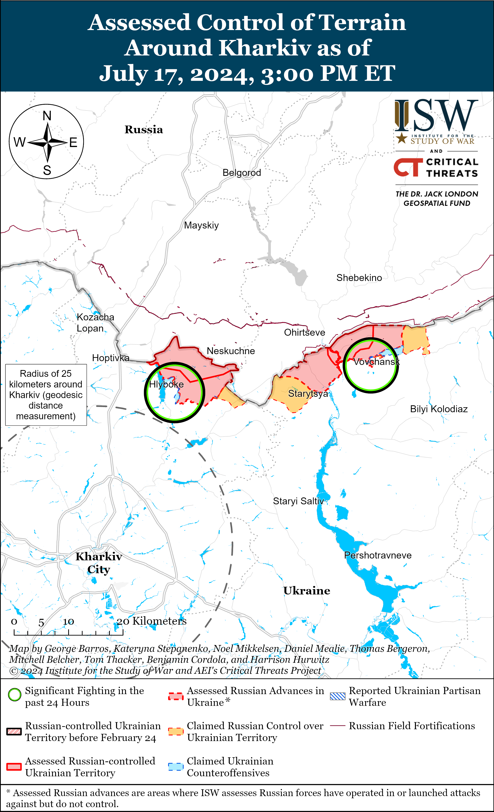
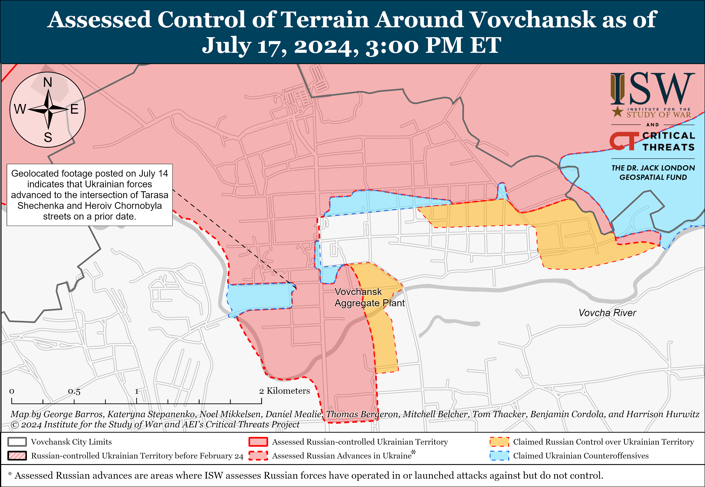
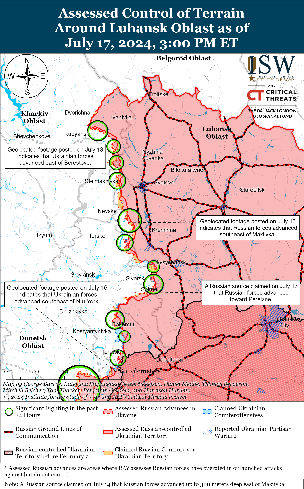
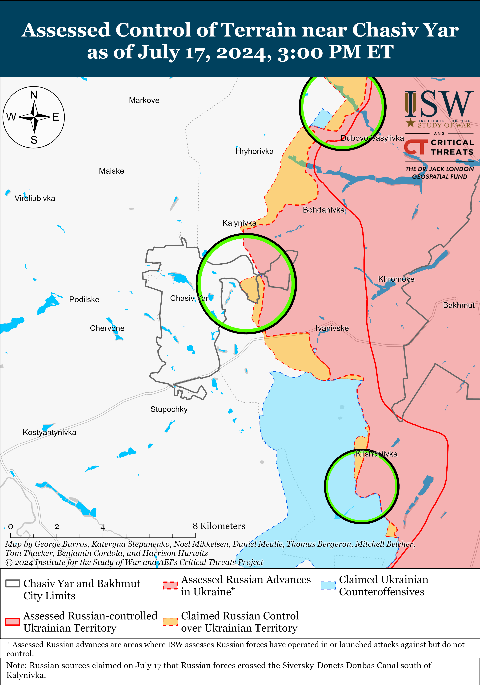
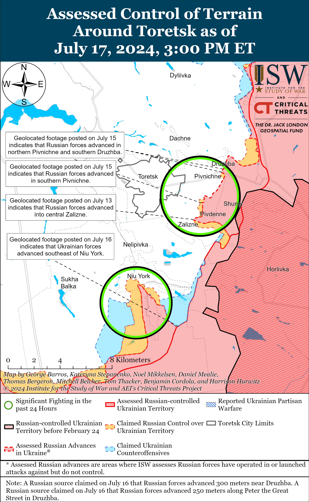
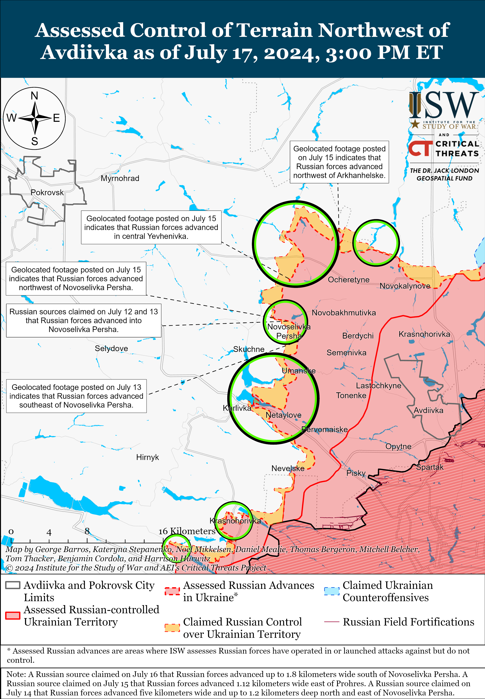
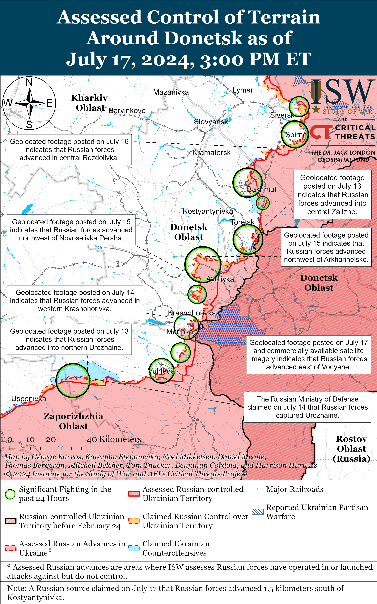
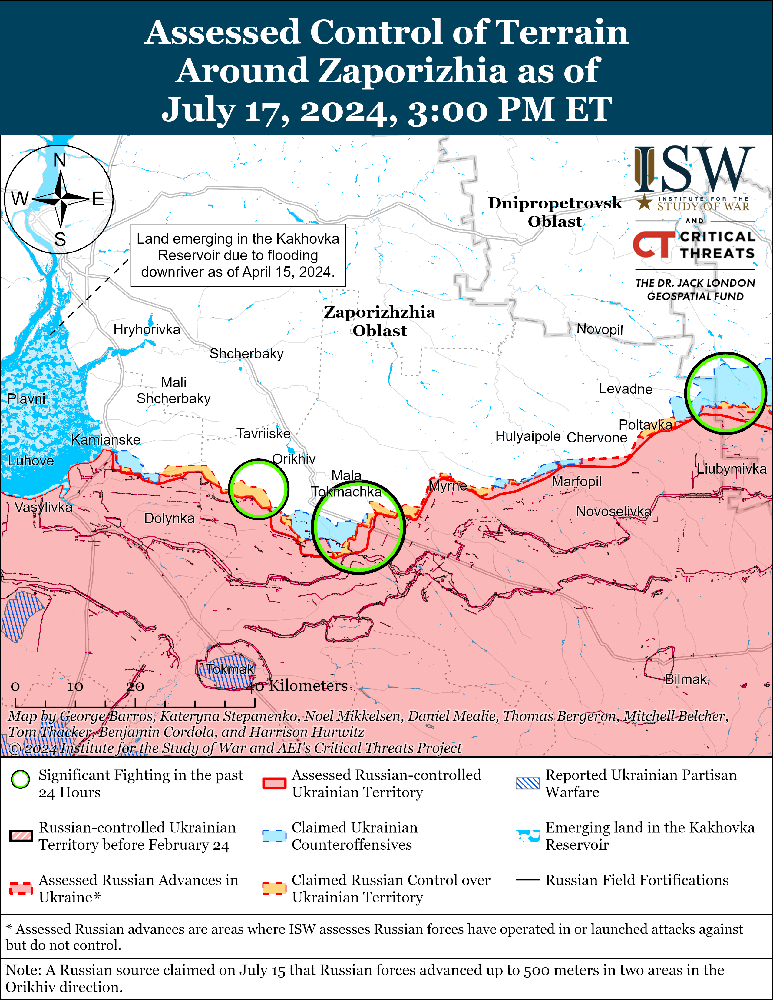
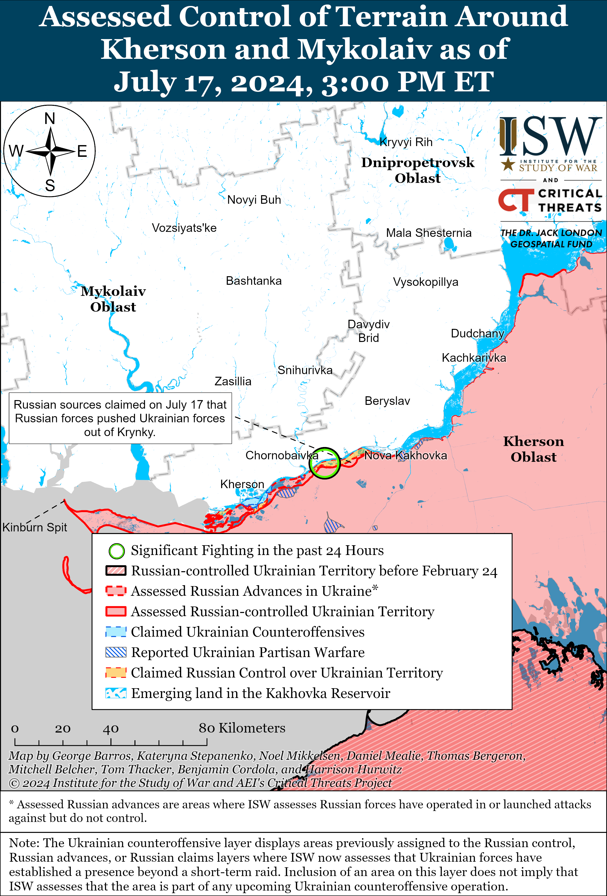

# Russian Offensive Campaign Assessment, July 17, 2024

**Angelica Evans, Riley Bailey, Karolina Hird, and George Barros**

**July 17, 2024, 6:30pm ET**

**Click**[**here**](https://storymaps.arcgis.com/stories/36a7f6a6f5a9448496de641cf64bd375)**to see ISW’s interactive map of the Russian invasion of Ukraine. This map is updated daily alongside the static maps present in this report.**

**Click**[**here**](https://understandingwar.maps.arcgis.com/apps/instant/3dviewer/index.html?appid=1602762dbcde419bb957dea358449580)**to see ISW’s 3D control of terrain topographic map of Ukraine. Use of a computer (not a mobile device) is strongly recommended for using this data-heavy tool.**

**Click**[**here**](https://storymaps.arcgis.com/stories/733fe90805894bfc8562d90b106aa895)**to access ISW’s archive of interactive time-lapse maps of the Russian invasion of Ukraine. These maps complement the static control-of-terrain map that ISW produces daily by showing a dynamic frontline. ISW will update this time-lapse map archive monthly.**

**Note: The data cut-off for this product was 12:30pm ET on July 17. ISW will cover subsequent reports in the July 18 Russian Offensive Campaign Assessment.**

**Russian state news outlets editorialized comments by Russian Security Council Deputy Chairperson Dmitry Medvedev and claimed that he said that the Ukrainian state will no longer exist by 2034, likely to support the Kremlin’s efforts to prepare the Russian public for a long war in Ukraine while promising that Russia will complete its objective to destroy Ukrainian statehood within a decade.** Russian media editorialized comments made by Russian Security Council Deputy Chairperson Dmitry Medvedev in an interview with Russian outlet*Argumenty i Fakty* (AIF) on July 17.[1] Medvedev claimed that “it is not for nothing” that NATO General Secretary Jens Stoltenberg suggested that Ukraine could be able to join the alliance within the next ten years, concluding that Ukraine will “never” join NATO because NATO leadership will have changed by 2034 and because “it is quite possible that the notorious country 404 [a derogative use of the 404 computer ‘error’ code meant to suggest that Ukraine is not a real state] will not exist either.”[2] Medvedev notably did not explicitly say that Ukraine will cease to exist by 2034 — rather it was a tangential implication of his statements — but Russian news outlets, including Kremlin newswire *TASS*, immediately began publishing stories with headlines such as “Medvedev Admitted that Ukraine Will No Longer Exist in 2034” and, “Medvedev Predicted the Disappearance of Ukraine by 2034.”[3]

There are several implications to the way that Russian media is currently editorializing Medvedev’s statements. First and foremost, the explicit suggestion that Russia will be able to “destroy Ukraine” by 2034 is a promise to the Russian public that Russia will be able to win the war and achieve its objective to destroy Ukrainian statehood within a decade. This sets careful information conditions and societal expectations for a war that will last another decade, but one that will end with Russia’s desired “victory.” This Russian narrative also directly and strongly undermines select Kremlin officials’ separate attempts to suggest that Russia is willing to “negotiate” for “peace” with Ukraine and further emphasizes that the Kremlin’s only desired end-state for the war is the complete destruction of the Ukrainian state and people. Russian President Vladimir Putin has carefully articulated his goals for the war as such and has demanded that Ukrainian forces withdraw from territory that Russian forces do not control as a precondition for any kind of “peace” negotiations, as ISW has previously assessed.[4] Neither Ukraine nor the West can expect to negotiate with Russia on Russia’s terms if Russia’s terms are premised on the eradication of Ukraine and its people in the next ten years.

**Russian officials continue to seize on diplomatic meetings with European states to create the impression that Russia is normalizing its relations with the West and claim that there is limited Western support for Russia.**Russian Foreign Minister Sergei Lavrov met with Hungarian Foreign Minister Peter Szijjarto on the sidelines of the United Nations (UN) on July 16 and reiterated the importance of Russian President Vladimir Putin’s and Hungarian Prime Minister Viktor Orban’s July 5 meeting in Moscow.[5] Lavrov and Szijjarto amplified standard Kremlin narratives about the war in Ukraine, condemned Ukraine’s supposed human rights violations against its “national minorities,” and reiterated that Russian–Hungarian relations will continue to develop despite the “difficult international situation.”[6] Szijjarto continued Orban’s efforts to present Hungary as a possible mediator between Russia and Ukraine and claimed following a July 16 meeting with People’s Republic of China (PRC) Foreign Minister Wang Yi that Hungary is in favor of keeping open channels of communication with Russia in order to “resolve the Ukraine conflict.”[7] Putin attempted to portray Orban as a representative of the European Union (EU) empowered to speak on the EU’s behalf during Orban’s July 5 visit to Moscow, but EU officials have continued to deny that Orban is speaking for the EU as a whole.[8] European Council President Charles Michel denounced Orban’s recent trip to Moscow in a letter published on July 16 and reiterated that Hungary’s temporary, rotating role as President of the EU Council does not give Orban the mandate to represent the EU or engage with world leaders on behalf of the EU.[9] The European Parliament adopted a resolution on July 17 condemning Orban for visiting Russia.[10]

**Russia and India continue to strengthen their bilateral relationship amid reports of ongoing Russian weapons exports to India.**Mumbai-based English-language outlet, the*Economic Times,* reported on July 16 that the Indian Ministry of Foreign Affairs (MFA) recently summoned the Ukrainian Ambassador to India and “raised an issue” with Ukrainian President Volodymyr Zelensky’s criticism of Indian Prime Minister Narendra Modi’s July 8–9 visit to Russia.[11] The*Economic Times* stated that the Indian government also postponed a joint cultural working group with Ukraine following Zelensky’s statement. Chennai-based Indian outlet the*Hindu* reported on July 15, citing an unspecified defense official, that Russia will deliver two stealth frigates to the Indian Navy by February 2025 as part of a 2016 agreement.[12] The 2016 Russian­–Indian agreement requires that India will import two frigates from Russia by 2026 and that Russia will assist with the in-country manufacturing of two frigates by an Indian shipbuilding company.[13] The*Times of India*, citing unspecified defense officials, reported on July 12 that India recently requested Russia expedite the delivery of two Russian S-400 air defense systems in order to meet the Indian Air Force’s requirements.[14] The defense officials claimed that the Russian government assured India that it will consider the request, and the *Times of India* reported that Russia has delivered only three of the five promised air defense systems thus far. *Reuters* reported on July 11 that an Indian government source stated that Indian state-run oil refineries are negotiating a long-term oil import deal with Russia following Modi’s visit to Russia on July 8 and 9.[15]

**Russia and Ukraine exchanged 95 prisoners of war (POWs) each in a one-to-one POW exchange on July 17.**Ukrainian President Volodymyr Zelenksy stated that 95 Ukrainian POWs returned to Ukrainian held-territory in an exchange mediated by the United Arab Emirates (UAE), and the Russian Ministry of Defense (MoD) reported the return of 95 Russian POWs.[16] Ukrainian and international organizations have recorded abuse and torture amongst almost all Ukrainian POWs released from Russian detention, and ISW has extensively reported on footage and reports of Russian servicemen abusing and executing Ukrainian POWs.[17] One serviceman who returned in the July 17 exchange stated that he suffers from chronic stomach issues and breathing problems due to constant beatings and other abuse at the hands of his Russian captors.[18]

**Kremlin officials continue attempts to curry favor with Russian ultranationalists by appealing to anti-migrant animus despite such appeals generating tensions with the Russian government’s efforts to execute the Kremlin’s wider migration policy.**Russian Investigative Committee Head Alexander Bastrykin chaired a review of the Investigative Committee’s work for the first six months of 2024 on July 16 and specifically focused on the topic of investigating crimes associated with migrants.[19] The Investigative Committee claimed that specific violent and extremist crimes committed by migrants in Russia increased by five to 55 percent in the first six months of 2024.[20] The Investigative Committee claimed that crimes committed by migrants are closely related to abuses within Russian regulatory and law enforcement agencies as well as among entrepreneurs trying to attract foreign labor, likely attempting to tie claims about crimes committed by migrants to perceptions that corruption is facilitating illegal migration to Russia.[21] A prominent Russian ultranationalist pointed to the alleged statistics from the Investigative Committee to justify their routine claims about issues associated with migration in Russia.[22] The prominent ultranationalist also claimed that pro-migrant actors within the Russian State Duma are trying to prevent select Kremlin officials from addressing the issue of migration.[23] The ultranationalist’s observations likely reflect the contradictory approach the Kremlin has used towards migrants instead of any wide rift on the topic of migration, however. The Kremlin is currently relying on migrants to offset labor shortages and is leveraging migrants as a recruitment pool for the war in Ukraine, but the Kremlin’s appeals to ultranationalist xenophobia undermine these efforts.[24] ISW continues to assess that the Kremlin is struggling to reconcile inconsistent and contradictory policies that attempt to appease the Russian ultranationalist community’s anti-migration position while leveraging migrants to address manpower and human capital needs.[25]

**Key Takeaways:**

- **Russian state news outlets editorialized comments by Russian Security Council Deputy Chairperson Dmitry Medvedev and claimed that he said that the Ukrainian state will no longer exist by 2034, likely to support the Kremlin’s efforts to prepare the Russian public for a long war in Ukraine while promising that Russia will complete its objective to destroy Ukrainian statehood within a decade.**
- **Russian officials continue to seize on diplomatic meetings with European states to create the impression that Russia is normalizing its relations with the West and claim that there is limited Western support for Russia.**
- **Russia and India continue to strengthen their bilateral relationship amid reports of ongoing Russian weapons exports to India.**
- **Russia and Ukraine exchanged 95 prisoners of war (POWs) each in a one-to-one POW exchange on July 17.**
- **Kremlin officials continue attempts to curry favor with Russian ultranationalists by appealing to anti-migrant animus despite such appeals generating tensions with the Russian government’s efforts to execute the Kremlin’s wider migration policy.**
- **Ukrainian forces regained positions south of Toretsk, and Russian forces recently advanced north of Kharkiv City and near Kupyansk, Svatove, Avdiivka, and Vuhledar.**
- **Russia’s crypto-mobilization campaign continues to generate increasing financial costs for the Russian government.**

****

***We do not report in detail on Russian war crimes because these activities are well-covered in Western media and do not directly affect the military operations we are assessing and forecasting. We will continue to evaluate and report on the effects of these criminal activities on the Ukrainian military and the Ukrainian population and specifically on combat in Ukrainian urban areas. We utterly condemn Russian violations of the laws of armed conflict and the Geneva Conventions and crimes against humanity even though we do not describe them in these reports.***

- Russian Main Effort – Eastern Ukraine (comprised of three subordinate main efforts)
- Russian Subordinate Main Effort #1 – Push Ukrainian forces back from the international border with Belgorod Oblast and approach to within tube artillery range of Kharkiv City
- Russian Subordinate Main Effort #2 – Capture the remainder of Luhansk Oblast and push westward into eastern Kharkiv Oblast and encircle northern Donetsk Oblast
- Russian Subordinate Main Effort #3 – Capture the entirety of Donetsk Oblast
- Russian Supporting Effort – Southern Axis
- Russian Air, Missile, and Drone Campaign
- Russian Mobilization and Force Generation Efforts
- Russian Technological Adaptations
- Activities in Russian-occupied areas
- Ukrainian Defense Industrial Base Efforts
- Russian Information Operations and Narratives
- Significant Activity in Belarus

**Russian Main Effort – Eastern Ukraine**

**Russian Subordinate Main Effort #1 – Kharkiv Oblast****(Russian objective: Push Ukrainian forces back from the international border with Belgorod Oblast and approach to within tube artillery range of Kharkiv City)**

Geolocated footage published on July 17 shows Ukrainian strikes against a Russian-occupied building and Russian forces in eastern Sotnytskyi Kozachok (northwest of Kharkiv City).[26] ISW has not observed additional footage of Russian forces operating in the settlement in recent days and assesses that Russian forces likely do not have an enduring presence in the settlement.

Russian forces recently advanced north of Kharkiv City amid continued assaults north and northeast of Kharkiv City on July 17. Geolocated footage published on July 17 indicates that Russian forces recently marginally advanced north of Hlyboke (north of Kharkiv City), and a Russian milblogger claimed that Russian forces recently pushed Ukrainian forces from positions north of Hlyboke.[27] Russian forces also continued assaults near Hlyboke and northeast of Kharkiv City near Vovchansk and Tykhe on July 16 and 17.[28] Kremlin Spokesperson Dmitry Peskov reported on July 17 that the operation to create a “security zone” in Kharkiv Oblast continues and will continue until Russian forces successfully complete the operation, likely in reference to Kremlin promises to make northern Kharkiv Oblast a “buffer zone” to protect Russian border settlements.[29] Elements of the Russian 155th Naval Infantry Brigade (Pacific Fleet) and the 18th Motorized Rifle Division (11th Army Corps [AC], Baltic Sea Fleet) are reportedly operating near Hlyboke, and elements of the Russian 138th Motorized Rifle Brigade (6th Combined Arms Army [CAA], Leningrad Military District [LMD]) and the 30th Motorized Rifle Regiment (72nd Motorized Rifle Division, 44th AC, LMD) are reportedly operating near Vovchansk.[30] Elements of the Russian 83rd Airborne (VDV) Brigade are reportedly operating in the Kharkiv direction.[31]

**Russian Subordinate Main Effort #2 – Luhansk Oblast****(Russian objective: Capture the remainder of Luhansk Oblast and push westward into eastern Kharkiv Oblast and northern Donetsk Oblast)**

Russian forces recently advanced near Kupyansk and Svatove amid continued assaults along the Kupyansk-Svatove-Kreminna line on July 17. Geolocated footage published on July 17 indicates that Russian forces recently marginally advanced in a forest area northwest of Kyslivka (southeast of Kupyansk).[32] Additional geolocated footage published on July 16 indicates that Russian forces recently marginally advanced northwest of Dzherelne (west of Svatove).[33] Russian milbloggers claimed that Russian forces also advanced southeast of Kupyansk near Berestove, Pishchane, and Novoselivske; southwest of Svatove near Makiivka; and west of Kreminna along the Terny-Torske line.[34] The Ukrainian General Staff reported that Russian forces also continued assaults northeast of Kupyansk near Synkivka; southeast of Kupyansk near Stepova Novoselivka; west of Svatove near Stelmakhivka and Andriivka; southwest of Svatove near Hrekivka and Nevske on July 16 and 17.[35] A Russian milblogger claimed that Ukrainian forces unsuccessfully counterattacked from Novosadove (southwest of Svatove) towards Chervonopopivka (just north of Kreminna).[36] Elements of the Russian 47th Tank Division (1st Guards Tank Army [GTA], Moscow Military District [MMD] are reportedly operating near Kyslivka and Stepova Novoselivka.[37]

**Russian Subordinate Main Effort #3 – Donetsk Oblast****(Russian objective: Capture the entirety of Donetsk Oblast, the claimed territory of Russia’s proxies in Donbas)**

Russian forces reportedly made marginal tactical gains in the Siversk direction on July 16 and continued offensive operations in this area on July 17. Russian milbloggers claimed on July 16 that elements of the Russian 106th Airborne (VDV) Division advanced to the southern outskirts of Pereizne (south of Siversk) and began consolidating positions in the southern part of the settlement.[38] ISW has not yet observed visual evidence of Russian forces operating in Pereizne. The Ukrainian General Staff reported that Russian forces also conducted ground attacks east of Siversk near Verkhnokamyanske; southeast of Siversk near Vyimka and Spirne; and south of Siversk near Pereizne and Fedorivka.[39] Elements of the 2nd Artillery Brigade (2nd Luhansk People’s Republic Army Corps [LNR AC]) are operating in the Siversk direction alongside elements of the 106th VDV Division.[40]

Russian forces reportedly advanced near Chasiv Yar on July 17, although ISW has not yet observed visual evidence of the claimed Russian gains. Several Russian milbloggers claimed that Russian forces broke through Ukrainian defenses southwest of Kalynivka (northeast of Chasiv Yar), with some claiming that Russian forces crossed the Siverskyi Donets-Donbas canal north of Chasiv Yar while others claimed that Russian forces advanced up to a pipe system that crosses the canal.[41] ISW has not yet observed visual confirmation of Russian forces having crossed the canal in the Kalynivka area. A Ukrainian colonel fighting in Chasiv Yar area reported on July 11 that Russian forces are mainly conducting infantry-led frontal assaults with poor-quality mobilized personnel and noted that Russian forces are increasingly using light dual-use vehicles such as golf carts, ATVs, and motorcycles to transport infantry due to armored vehicle losses.[42] The Ukrainian General Staff reported that Russian forces conducted ground attacks north of Chasiv Yar near Novomarkove and southeast of Chasiv Yar near Klishchiivka, Andriivka, and from the direction of Opytne (east of Klishchiivka).[43] Elements of the 98th VDV Division and 200th Motorized Rifle Brigade (14th AC, Leningrad Military District [LMD]) are reportedly operating near Kalynivka and in the general Chasiv Yar direction.[44]

Ukrainian forces recently regained lost positions south of Toretsk amid continued Russian offensive operations in the Toretsk direction on July 17. Geolocated footage published on July 16 indicates that Ukrainian forces have regained positions along a windbreak southeast of Niu-York (south of Toretsk).[45] A Russian milblogger reported that Ukrainian forces are holding positions in the same windbreak area.[46] The Russian milblogger claimed that Russian forces have also advanced up to Kooperatyvna Street in southern Niu-York, although ISW has not observed visual evidence of this claim.[47] Russian and Ukrainian sources reported that fighting continued near Toretsk itself; south of Toretsk near Niu-York; southeast of Toretsk near Pivnichne; and east of Toretsk near Druzhba.[48]

Russian forces recently advanced northwest of Avdiivka. Geolocated footage published on July 17 shows that Russian forces advanced to a windbreak north of Novooleksandrivka (northwest of Avdiivka).[49] Russian milbloggers claimed that Russian forces seized Lozuvatske (also northwest of Avdiivka and just southwest of Novooleksandrivka) and advanced in fields north of the settlement, although ISW has not observed visual confirmation of Russian forces operating in Lozuvatske at this time.[50] Russian milbloggers claimed that Russian forces also gained new positions in central Novoselivka Persha (northwest of Avdiivka) and are advancing west within the settlement, but ISW has not observed confirmation of these claims.[51] Ukrainian and Russian sources reported continued heavy fighting north of Avdiivka near Kalynove; northwest of Avdiivka near Prohres, Vozdvyzhenka, Novooleksandrivka, and Novoselivka Persha; west of Avdiivka near Umanske and Yasnobrodivka; and southwest of Avdiivka near Karlivka.[52]

Russian forces continued limited offensive operations west and southwest of Donetsk City on July 17 but did not make any confirmed advances. Russian and Ukrainian sources reported continued fighting west of Donetsk City near and in Krasnohorivka and Heorhiivka, and southwest of Donetsk City near Kostyantynivka and Paraskoviivka.[53]

Russian forces have made significant advances towards an important ground line of communication (GLOC) in the Vuhledar area (southwest of Donetsk City), but these gains likely did not happen in the last 24 hours. Geolocated footage published on July 17, but likely taken earlier in July, shows a Russian armored vehicle rapidly advancing along a windbreak up to a point near the T0524 Marinka-Vuhledar route southeast of Vodyane and northeast of Vuhledar, about five kilometers from the previously assessed frontline.[54] The rate and ease of advance of the vehicle suggest that Russian forces likely hold additional positions in field areas east of Vuhledar and were able to provide cover for the vehicle as it advanced. Commercially available satellite imagery from July 14 shows additional destroyed likely Russian vehicles along the same windbreak area near the T0524 route southeast of Vodyane, further confirming that Russian forces have advanced in this area. Russian milbloggers only began amplifying and discussing the footage on July 17, suggesting that it had not been circulated in the Russian information space prior to July 17.[55] Russian sources have long emphasized since 2022 that the foremost tactical objective in the Vuhledar area is for Russian forces to interdict the T0524 road and disrupt Ukrainian GLOCs into Vuhledar.[56] A Russian milblogger claimed on July 17 that Russian forces are likely to intensify attacks south of Kostyantynivka (about 10km northeast of Vodyane along the T0524 road) in order to support this tactical objective.[57] The Ukrainian General Staff reported that Russian forces conducted ground attacks near both Kostyantynivka and Vodyane on July 17.[58]|

No significant activity occurred in the Donetsk-Zaporizhia Oblast border area on July 17.

**Russian Supporting Effort – Southern Axis****(Russian objective: Maintain frontline positions and secure rear areas against Ukrainian strikes)**

Positional fighting continued in western Zaporizhia Oblast on July 17, but there were no confirmed changes to the frontline. Russian and Ukrainian forces engaged in positional fighting near Robotyne, northeast of Robotyne near Mala Tokmachka, and northwest of Robotyne near Novoandriivka.[59] A Russian milblogger claimed on July 17 that Ukrainian drone activity in the Zaporizhia direction decreased after Russian forces struck a group of Ukrainian drone operators near Mala Tokmachka.[60]

Russian sources claimed on July 17 that Ukrainian forces have withdrawn from positions in Krynky in the east (left) bank of Kherson Oblast, although ISW has not observed confirmation of these claims.[61] The Ukrainian General Staff reported continued positional fighting in the east bank of Kherson Oblast, including near Kozachi Laheri (west of Krynky), on July 16 and 17.[62] A Russian milblogger claimed on July 17 that Russian and Ukrainian forces continued small arms battles on unspecified islands in the Dnipro River Delta.[63] Elements of the Russian 80th Arctic Brigade (14th Army Corps [AC], Leningrad Military District [LMD]) are reportedly operating in the Kherson direction.[64]

**Russian Air, Missile, and Drone Campaign****(Russian Objective: Target Ukrainian military and civilian infrastructure in the rear and on the frontline)**

Russian forces conducted individual missile strikes against targets in Ukraine on July 16. Ukrainian military officials reported that Russian forces conducted a strike against Kherson Oblast with a likely Iskander-M ballistic missile and struck Odesa Oblast with an unspecified type and number of missiles on July 16.[65] Russian sources amplified footage on July 16 purporting to show Russian forces striking a Ukrainian training ground near Peresichne, Kharkiv Oblast (west of Kharkiv City) with an unspecified type of Iskander missile.[66]

**Russian Mobilization and Force Generation Efforts****(Russian objective: Expand combat power without conducting general mobilization)**

Russia’s crypto-mobilization campaign continues to generate increasing financial costs for the Russian government. Russia-focused analytical platform *Re:Russia*estimated on July 16 that between July 2023 and June 2024 government payments made to Russian military personnel fighting in Ukraine, to wounded personnel, and to the relatives of deceased soldiers amounted to approximately 2.75 to 3 trillion rubles ($31 billion to $33 billon).[67] *Re:Russia*noted that these payments comprise about 1.5 percent of Russia’s GDP and between 7.5 to 8.2 percent of Russia’s 2024 federal budget.***[68]*** The Russian government, presumably both at the federal and regional level, reportedly spent 1.55 to 1.8 trillion rubles ($17.5 billion to $20 billion) on Russian military personnel, comprised of monthly payments and one-time payments for signing a contract, and 1.2 trillion rubles ($13.5 billion) for injuries and deaths.[69]

**Russian Technological Adaptations****(Russian objective: Introduce technological innovations to optimize systems for use in Ukraine)**

Russian volunteers continue to supply Russian forces with domestically produced and commercially available quadcopter drones to augment Russian combat requirements in Ukraine. The head of the “Kulibin Club” of Russian President Vladimir Putin’s People’s Front (*Narodnyi Front*) political coalition, Alexander Panichev, stated on July 16 that Russian analogues of commercially available Autel, DJI, and EVR quadcopter drones passed tests at training grounds and that the “Kulibin Club” will soon transfer 160 of these drones to Russian forces in Ukraine.[70]

**Ukrainian Defense Industrial Efforts****(Ukrainian objective: Develop its defense industrial base to become more self-sufficient in cooperation with US, European, and international partners)**

*ISW is not publishing coverage of Ukrainian defense industrial efforts today.*

**Activities in Russian-occupied areas****(Russian objective: Consolidate administrative control of annexed areas; forcibly integrate Ukrainian citizens into Russian sociocultural, economic, military, and governance systems)**

*ISW is not publishing coverage of Russian-occupied areas of Ukraine today.*

**Russian Information Operations and Narratives**

The Ukrainian Kharkiv Group of Forces reported on July 17 that Russian Telegram channels are spreading false information about alleged Ukrainian chemical weapons use in Donetsk and Kherson oblasts in order to discredit Ukrainian forces and discourage Western support for Ukraine.[71] Russian Permanent Representative to the Organization for the Prohibition of Chemical Weapons Vladimir Tarabrin claimed on July 15 that the risk of Ukrainian forces using chemical weapons has grown due to alleged Ukrainian battlefield failures.[72]

The Russian and Belarusian ministries of foreign affairs (MFA) published a joint report about alleged human rights violations in Belgium in an attempt to deflect international attention from the Kremlin’s ongoing human rights violations and invasion of Ukraine.[73] The Russian and Belarusian MFAs claimed that Belgium is violating human rights and has recently accused Canada, Switzerland, and Australia of human rights violations.[74]

Russian sources continued efforts to foment anti-government and anti-military sentiment among Ukrainians using informational means. Russian milbloggers amplified footage on July 17 claiming to show unspecified actors setting fire to the vehicles of Ukrainian regional recruiting center officials and claimed that the arson cases are especially prevalent in Odesa City, Odesa Oblast.[75] Russian opposition outlet*Vazhnye Istorii*reported on July 10 that Russian darknet sites are advertising contract sabotage jobs to burn Ukrainian military jeeps and other military vehicles in Ukraine for $1,500 to $2,000.[76] The Kremlin has long been working to develop capabilities to foment violent protests and anti-government activities in Ukraine through informational efforts.[77]

**Significant activity in Belarus****(Russian efforts to increase its military presence in Belarus and further integrate Belarus into Russian-favorable frameworks and Wagner Group activity in Belarus)**

Russian forces appear not to be coordinating with Belarusian forces about the operation of Russian strike drones in Belarusian airspace. Ukrainian and independent Belarusian sources reported that at least four Russian Shahed-136/131 drones targeting Ukraine entered Belarusian airspace on July 12, July 13, and on the night of July 15 to 16.[78] Independent Belarusian monitoring group the Hajun Project reported on July 13 that Belarusian forces sortied a Mi-24 helicopter and a Su-30 multirole fighter aircraft to intercept a Shahed drone that had entered Belarusian airspace.[79] The Hajun Project reported on July 16 that the Russian Shahed drone that entered Belarusian airspace on the night of July 15 to 16 crashed in Oktyabrsky Raion, Gomel Oblast 55 km from Bobruisk and exploded.[80] Belarus has previously allowed Russian forces to attack Ukraine with high-precision weapons from Belarusian airspace.[81] The entry of Russian strike drones into Belarusian airspace from Ukrainian airspace, the reported Belarusian sorties of high-value aviation assets, and the reported crash suggest that Russian forces may not be adequately notifying or coordinating with Belarusian forces regarding these Russian drone operations in Belarusian airspace at this time despite the fact that Russia and Belarus have an integrated air defense system that has been in theory operational since 2016.[82]

**Note: ISW does not receive any classified material from any source, uses only publicly available information, and draws extensively on Russian, Ukrainian, and Western reporting and social media as well as commercially available satellite imagery and other geospatial data as the basis for these reports. References to all sources used are provided in the endnotes of each update.**

---

[1] https://aif dot ru/politics/russia/dmitriy-medvedev-poryadok-zapada-eto-kidalovo

[2] https://aif dot ru/politics/russia/dmitriy-medvedev-poryadok-zapada-eto-kidalovo

[3] https://tass dot ru/politika/21379443; https://rg dot ru/2024/07/17/medvedev-zaiavil-chto-ukrainy-k-2034-godu-uzhe-ne-budet.html; https://lenta dot ru/news/2024/07/17/medvedev-predrek-ischeznovenie-ukrainy-k-2034-godu/; https://www.gazeta dot ru/politics/news/2024/07/17/23476651.shtml; https://www.m24 dot ru/news/politika/17072024/709038; https://www.mk dot ru/politics/2024/07/17/medvedev-rasskazal-kogda-ukraina-prekratit-svoe-sushhestvovanie.html; https://russian.rt dot com/ussr/news/1342388-medvedev-ukraina; https://by.tsargrad dot tv/news/medvedev-zajavil-chto-ukrainy-mozhet-ne-byt-k-2034-godu\_1028843; https://t.me/tass\_agency/261080

[4] https://isw.pub/UkrWar060724; https://isw.pub/UkrWar063024

[5] https://t.me/tass\_agency/261042 ; https://t.me/tass\_agency/261047 ; https://t.me/tass\_agency/261051 ; https://isw.pub/UkrWar070524 ; https://www.mid dot ru/ru/foreign\_policy/news/1962065/

[6] https://t.me/tass\_agency/261054 ; https://ria dot ru/20240716/lavrov-1960116168.html

[7] https://tass dot ru/mezhdunarodnaya-panorama/21376295

[8] https://isw.pub/UkrWar070524 ; https://isw.pub/UkrWar070524 ; https://isw.pub/UkrWar071124 ; https://isw.pub/UkrWar071524

[9] https://www.politico.eu/article/charles-michel-viktor-orban-peace-mission-washington-trump-zelenskyy-putin-ukraine-war/

[10] https://www.europarl.europa dot eu/news/en/press-room/20240710IPR22810/newly-elected-parliament-reaffirms-its-strong-support-for-ukraine

[11] https://economictimes dot indiatimes.com/news/india/india-summons-envoy-to-raise-zelenskyys-criticism-of-modi-putin-meet/articleshow/111763232.cms

[12] https://www.thehindu dot com/news/national/stealth-frigates-from-russia-to-be-delivered-in-september-2024-february-2025/article68407630.ece

[13] https://www.thehindu dot com/news/national/india-russia-to-build-stealth-frigates/article62024038.ece ; https://www.thehindu dot com/news/national/stealth-frigates-from-russia-to-be-delivered-in-september-2024-february-2025/article68407630.ece

[14] https://timesofindia dot indiatimes.com/india/india-urges-russia-to-accelerate-s-400-missile-system-deliveries-amid-strengthening-ties/articleshow/111694972.cms

[15] https://isw.pub/UkrWar071224

[16] https://t.me/V\_Zelenskiy\_official/11147 ; https://t.me/tass\_agency/261192 ; https://t.me/tass\_agency/261193

[17] https://understandingwar.org/backgrounder/russian-offensive-campaign-assessment-june-19-2024 ; https://isw.pub/UkrWar122823 ; https://understandingwar.org/backgrounder/russian-offensive-campaign-assessment-june-3-2024 ; https://isw.pub/UkrWar032724 ; https://isw.pub/UkrWar052924 ; https://understandingwar.org/backgrounder/russian-offensive-campaign-assessment-june-26-2024

[18] https://t.me/ButusovPlus/11919

[19] https://t.me/sledcom\_press/14574

[20] https://t.me/sledcom\_press/14574

[21] https://t.me/sledcom\_press/14574

[22] https://t.me/dva\_majors/47453

[23] https://t.me/dva\_majors/47510

[24] https://isw.pub/UkrWar071524 ; https://understandingwar.org/backgrounder/russian-offensive-campaign-assessment-july-2-2024 ; https://isw.pub/UkrWar070124 ; https://isw.pub/UkrWar06272024 ; https://isw.pub/UkrWar060724

[25] https://understandingwar.org/backgrounder/russian-offensive-campaign-assessment-december-24-2023 ; https://understandingwar.org/backgrounder/russian-offensive-campaign-assessment-november-26-2023 ; https://understandingwar.org/backgrounder/russian-offensive-campaign-assessment-december-4-2023 ; https://isw.pub/UkrWar121323 ; https://isw.pub/UkrWar121123

[26] https://t.me/creamy\_caprice/6092; https://t.me/quickdeaht/254

[27] https://x.com/blinzka/status/1813492234454450446; https://www.facebook.com/watch/?v=465246899571528; https://x.com/blinzka/status/1813492936190947576 ; https://t.me/motopatriot/24945

[28] https://www.facebook.com/GeneralStaff.ua/posts/pfbid02Vp656UUdwTcAvE3CgRgrKVUWByrk7qfCoVycp1T6WcasMfDigWVKUQSGvn4FGW7wl ; https://www.facebook.com/GeneralStaff.ua/posts/pfbid02o7wuqQ11WqLU4T9xJQMwdGjGTq9vGHYSJTfDxGZEJrc2TmV48xd6gpiQn6936QDkl ; https://www.facebook.com/GeneralStaff.ua/posts/pfbid02EcSBiLW5DJXGNhZerRz8KKTaVgxQg5K6d5Ce7Fq6DQck9CGwZ5XFDCE9KoK13x79l ; https://t.me/wargonzo/21065 ; https://t.me/rybar/61852 ; https://t.me/rybar/61860 ; https://t.me/dva\_majors/47457 ; https://t.me/rybar/61869 ; https://t.me/Sladkov\_plus/11011 ; https://t.me/motopatriot/24938

[29] https://t.me/tass\_agency/261169 ; https://isw.pub/UkrWar051824 ; https://isw.pub/UkrWar051724

[30] https://t.me/otukharkiv/275 ; https://x.com/Vit\_Ovchar/status/1813370055482130626

[31] https://t.me/rusich\_army/15863

[32] https://t.me/creamy\_caprice/6089; https://t.me/Khortytsky\_wind/727

[33] https://t.me/WarArchive\_ua/17303; https://t.me/ssternenko/31161; https://x.com/666\_mancer/status/1813313495083175952

[34] https://t.me/z\_arhiv/27310 ; https://t.me/rybar/61860 ; https://t.me/dva\_majors/47457

[35] https://www.facebook.com/GeneralStaff.ua/posts/pfbid02Vp656UUdwTcAvE3CgRgrKVUWByrk7qfCoVycp1T6WcasMfDigWVKUQSGvn4FGW7wl ; https://www.facebook.com/GeneralStaff.ua/posts/pfbid02o7wuqQ11WqLU4T9xJQMwdGjGTq9vGHYSJTfDxGZEJrc2TmV48xd6gpiQn6936QDkl ; https://www.facebook.com/GeneralStaff.ua/posts/pfbid02EcSBiLW5DJXGNhZerRz8KKTaVgxQg5K6d5Ce7Fq6DQck9CGwZ5XFDCE9KoK13x79l ;

[36] https://t.me/rusich\_army/15866

[37] https://t.me/epoddubny/20427 ; https://t.me/brussinf/7775; https://news-kharkov dot ru/society/2024/06/06/106500.html ; https://tlgrm dot ru/channels/@belarusian\_silovik/37779

[38] https://t.me/DnevnikDesantnika/12786; https://t.me/RVvoenkor/72609

[39] https://www.facebook.com/GeneralStaff.ua/posts/pfbid02Vp656UUdwTcAvE3CgRgrKVUWByrk7qfCoVycp1T6WcasMfDigWVKUQSGvn4FGW7wl; https://www.facebook.com/GeneralStaff.ua/posts/pfbid02o7wuqQ11WqLU4T9xJQMwdGjGTq9vGHYSJTfDxGZEJrc2TmV48xd6gpiQn6936QDkl

[40] https://t.me/sons\_fatherland/15646; https://t.me/DnevnikDesantnika/12786

[41] https://t.me/DnevnikDesantnika/12795; https://t.me/RVvoenkor/72613; https://t.me/motopatriot/24944

[42] https://censor dot net/ua/resonance/3499158/kombat\_oleg\_shyryayev; https://t.me/ButusovPlus/11911; https://t.me/censor\_net/53729

[43] https://www.facebook.com/GeneralStaff.ua/posts/pfbid02Vp656UUdwTcAvE3CgRgrKVUWByrk7qfCoVycp1T6WcasMfDigWVKUQSGvn4FGW7wl; https://www.facebook.com/GeneralStaff.ua/posts/pfbid02o7wuqQ11WqLU4T9xJQMwdGjGTq9vGHYSJTfDxGZEJrc2TmV48xd6gpiQn6936QDkl

[44] https://censor dot net/ua/resonance/3499158/kombat\_oleg\_shyryayev; https://t.me/RVvoenkor/72613

[45] https://t.me/creamy\_caprice/6085; https://t.me/BPLAROSTOV/2222

[46] https://t.me/motopatriot/24937

[47] https://t.me/motopatriot/24937

[48] https://www.facebook.com/GeneralStaff.ua/posts/pfbid02Vp656UUdwTcAvE3CgRgrKVUWByrk7qfCoVycp1T6WcasMfDigWVKUQSGvn4FGW7wl; https://www.facebook.com/GeneralStaff.ua/posts/pfbid02o7wuqQ11WqLU4T9xJQMwdGjGTq9vGHYSJTfDxGZEJrc2TmV48xd6gpiQn6936QDkl; https://t.me/rybar/61852; https://t.me/rybar/61860 ; https://t.me/dva\_majors/47457

[49] https://t.me/creamy\_caprice/6090; https://t.me/kokos\_group15/129

[50] https://t.me/motopatriot/24956; https://t.me/RVvoenkor/72619

[51] https://t.me/wargonzo/21065; https://t.me/rybar/61852; https://t.me/rybar/61860 ; https://t.me/dva\_majors/47457; https://t.me/RVvoenkor/72616; https://t.me/dva\_majors/47461

[52] https://t.me/rybar/61860 ; https://t.me/dva\_majors/47457; https://www.facebook.com/GeneralStaff.ua/posts/pfbid02Vp656UUdwTcAvE3CgRgrKVUWByrk7qfCoVycp1T6WcasMfDigWVKUQSGvn4FGW7wl; https://www.facebook.com/GeneralStaff.ua/posts/pfbid02o7wuqQ11WqLU4T9xJQMwdGjGTq9vGHYSJTfDxGZEJrc2TmV48xd6gpiQn6936QDkl; https://t.me/wargonzo/21065

[53] https://www.facebook.com/GeneralStaff.ua/posts/pfbid02Vp656UUdwTcAvE3CgRgrKVUWByrk7qfCoVycp1T6WcasMfDigWVKUQSGvn4FGW7wl; https://www.facebook.com/GeneralStaff.ua/posts/pfbid02o7wuqQ11WqLU4T9xJQMwdGjGTq9vGHYSJTfDxGZEJrc2TmV48xd6gpiQn6936QDkl; https://t.me/wargonzo/21065; https://t.me/rybar/61860 ; https://t.me/dva\_majors/47457

[54] https://x.com/Shtirlitz53/status/1813489768161853765; https://x.com/klinger66/status/1813499626932064416; https://t.me/a\_shtirlitz

[55] https://t.me/motopatriot/24948 ; https://t.me/motopatriot/24952 ; https://t.me/motopatriot/24953

[56] https://understandingwar.org/backgrounder/russian-offensive-campaign-assessment-august-18

[57] https://t.me/NgP\_raZVedka/18390

[58] https://www.facebook.com/GeneralStaff.ua/posts/pfbid02Vp656UUdwTcAvE3CgRgrKVUWByrk7qfCoVycp1T6WcasMfDigWVKUQSGvn4FGW7wl; https://www.facebook.com/GeneralStaff.ua/posts/pfbid02o7wuqQ11WqLU4T9xJQMwdGjGTq9vGHYSJTfDxGZEJrc2TmV48xd6gpiQn6936QDkl

[59] https://www.facebook.com/GeneralStaff.ua/posts/pfbid02Vp656UUdwTcAvE3CgRgrKVUWByrk7qfCoVycp1T6WcasMfDigWVKUQSGvn4FGW7wl ; https://t.me/wargonzo/21065 ; https://t.me/rybar/61860 ; https://t.me/dva\_majors/47457

[60] https://t.me/DnevnikDesantnika/12793

[61] https://t.me/rusich\_army/15862 ; https://x.com/GirkinGirkin/status/1813266532836790701; https://t.me/stanislav\_osman/6526 ; https://t.me/motopatriot/24942

[62] https://www.facebook.com/GeneralStaff.ua/posts/pfbid02Vp656UUdwTcAvE3CgRgrKVUWByrk7qfCoVycp1T6WcasMfDigWVKUQSGvn4FGW7wl ; https://www.facebook.com/GeneralStaff.ua/posts/pfbid02o7wuqQ11WqLU4T9xJQMwdGjGTq9vGHYSJTfDxGZEJrc2TmV48xd6gpiQn6936QDkl

[63] https://t.me/DnevnikDesantnika/12792

[64] https://t.me/NeoficialniyBeZsonoV/37750

[65] https://t.me/SJTF\_Odes/10538 ; https://t.me/kpszsu/16667

[66] https://t.me/RVvoenkor/72611 ; https://t.me/milinfolive/126208 ; https://t.me/NSDVDnepre/28000 https://t.me/Sladkov\_plus/11008

[67] https://re-russia.net/review/760/

[68] https://re-russia.net/review/760/

[69] https://re-russia.net/review/760/

[70] https://t.me/tass\_agency/261053

[71] https://t.me/otukharkiv/281

[72] https://understandingwar.org/backgrounder/russian-offensive-campaign-assessment-july-16-2024 ; https://tass dot ru/politika/21368995

[73] https://t.me/MID\_Russia/43306 ; https://mid dot ru/ru/foreign\_policy/humanitarian\_cooperation/1957839/#sel=518:1:x0f,618:24:gim

[74] https://understandingwar.org/backgrounder/russian-offensive-campaign-assessment-july-1-2024 ; https://understandingwar.org/backgrounder/russian-offensive-campaign-assessment-june-23-2024 ; https://mid dot ru/ru/foreign\_policy/humanitarian\_cooperation/1957839/#\_Toc166858728

[75] https://t.me/DnevnikDesantnika/12798 ; https://t.me/dva\_majors/47468 ; https://t.me/belarusian\_silovik/37855 ; https://t.me/sashakots/47887 ; https://t.me/epoddubny/20417

[76] https://understandingwar.org/backgrounder/russian-offensive-campaign-assessment-july-10-2024 ; https://t.me/istories\_media/6843?single

[77] https://understandingwar.org/backgrounder/viral-disinformation-kremlin%E2%80%99s-coronavirus-information-operation-ukraine

[78] https://t.me/Hajun\_BY/8004; https://t.me/kpszsu/16632 ; https://understandingwar.org/backgrounder/russian-offensive-campaign-assessment-july-13-2024; https://t.me/ComAFUA/348; https://t.me/Hajun\_BY/7999 ; https://t.me/Hajun\_BY/7989

[79] https://t.me/Hajun\_BY/7999

[80] https://t.me/Hajun\_BY/8009

[81] https://understandingwar.org/backgrounder/russian-offensive-campaign-assessment-december-11 ; https://isw.pub/RusCampaignOct11

[82] https://icds.ee/wp-content/uploads/2021/08/The-Belarusian-Armed-Forces.pdf
