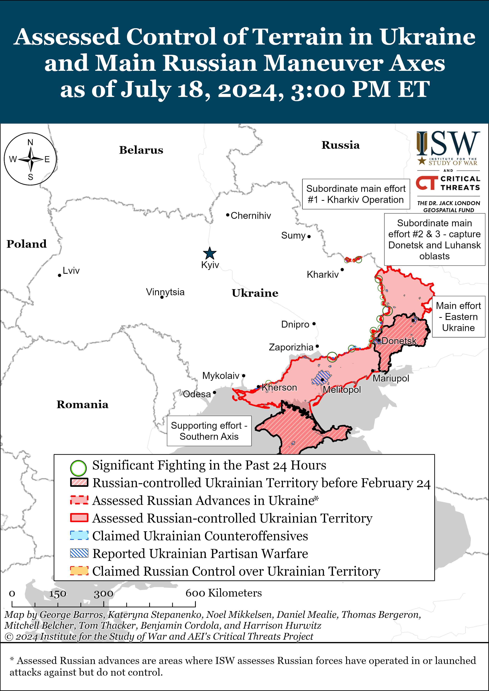
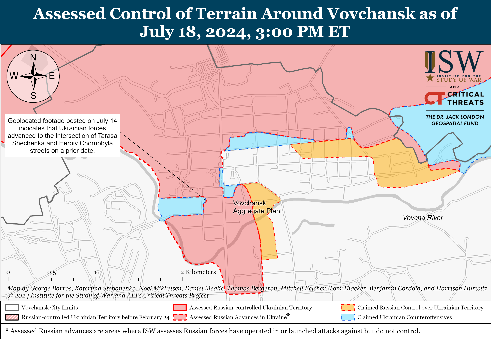
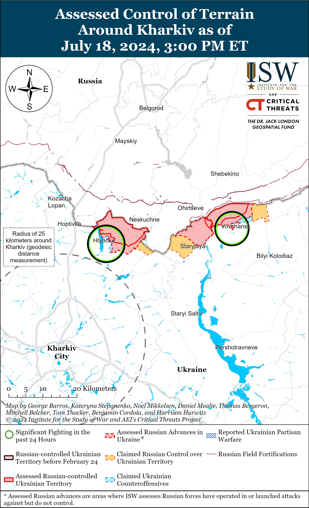
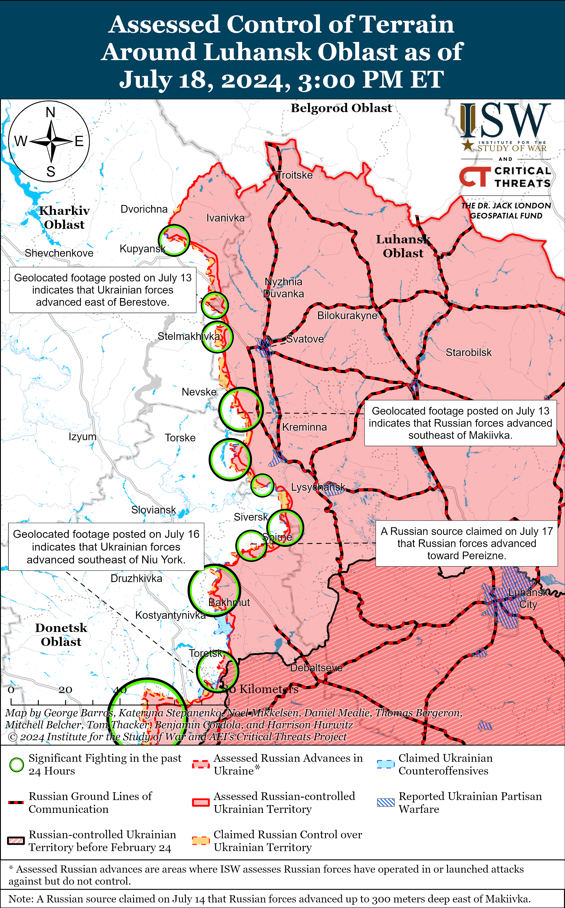
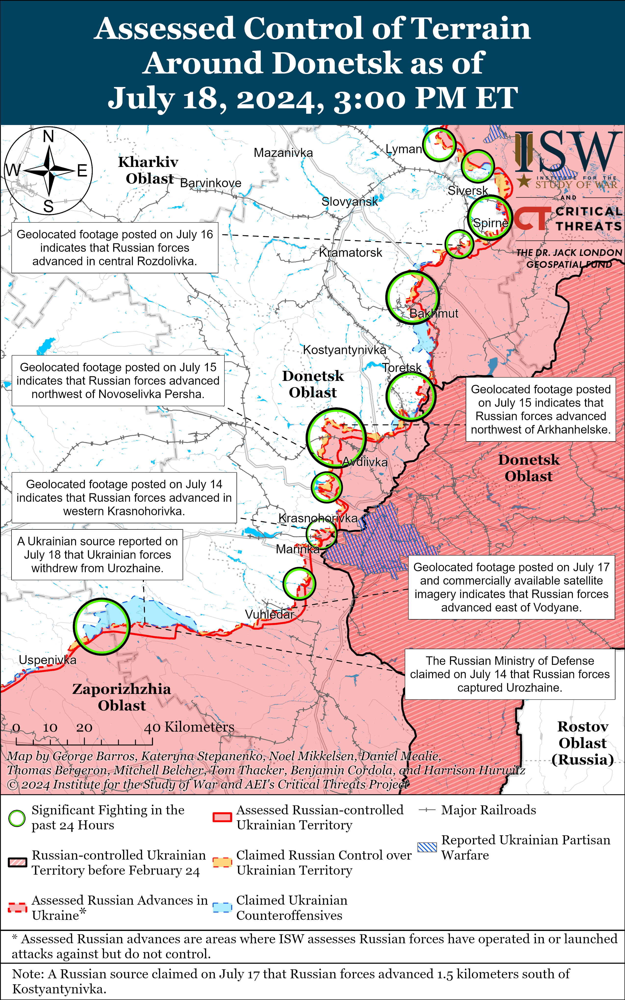
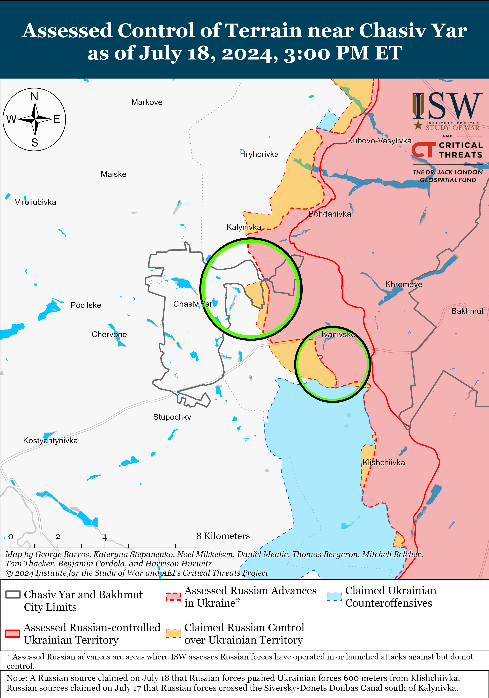
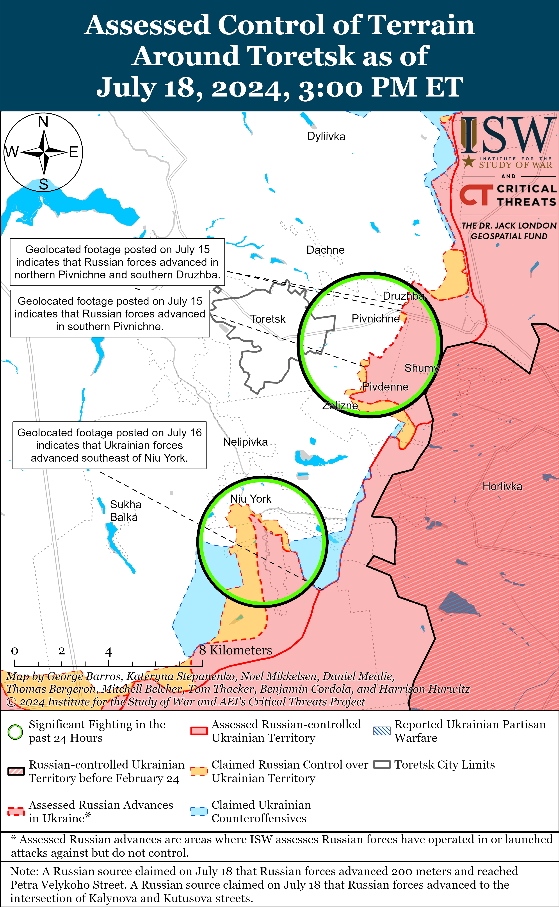
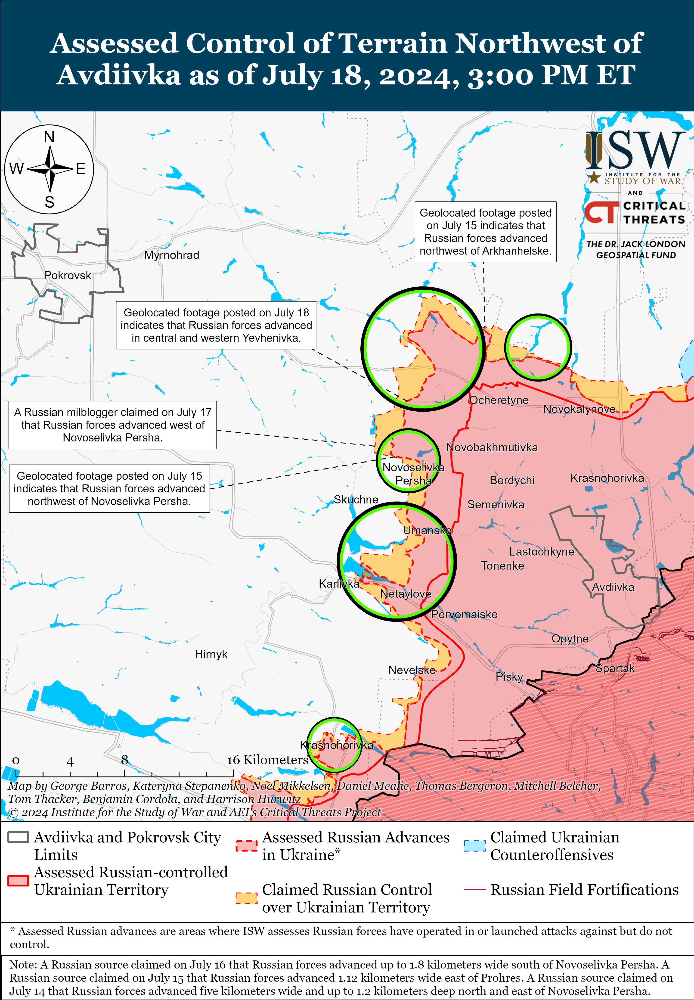
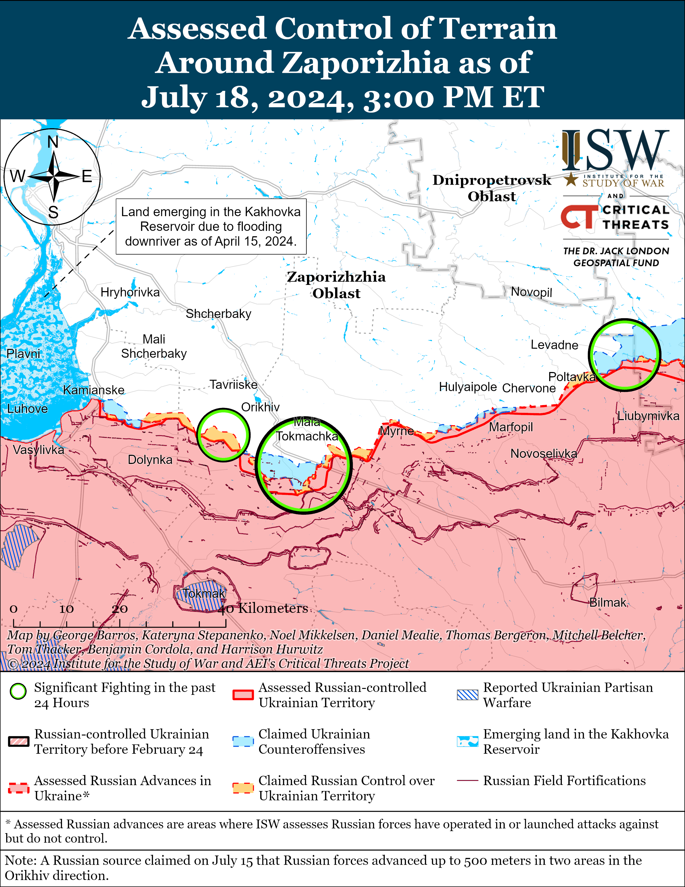
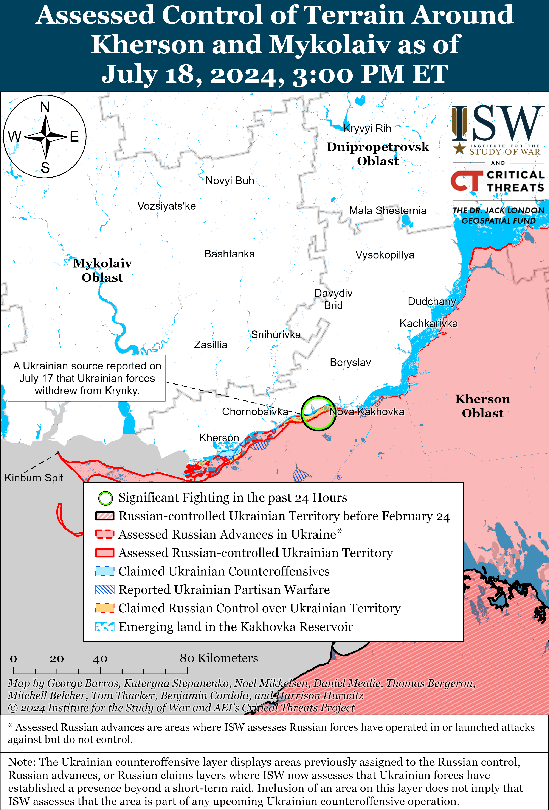

# Russian Offensive Campaign Assessment, July 18, 2024

**Angelica Evans, Kateryna Stepanenko, Karolina Hird, Christina Harward, and George Barros**

**July 18, 2024, 7:15 pm ET**

**Click**[**here**](https://storymaps.arcgis.com/stories/36a7f6a6f5a9448496de641cf64bd375)**to see ISW’s interactive map of the Russian invasion of Ukraine. This map is updated daily alongside the static maps present in this report.**

**Click**[**here**](https://understandingwar.maps.arcgis.com/apps/instant/3dviewer/index.html?appid=1602762dbcde419bb957dea358449580)**to see ISW’s 3D control of terrain topographic map of Ukraine. Use of a computer (not a mobile device) is strongly recommended for using this data-heavy tool.**

**Click**[**here**](https://storymaps.arcgis.com/stories/733fe90805894bfc8562d90b106aa895)**to access ISW’s archive of interactive time-lapse maps of the Russian invasion of Ukraine. These maps complement the static control-of-terrain map that ISW produces daily by showing a dynamic frontline. ISW will update this time-lapse map archive monthly.**

**Note: The data cut-off for this product was 1pm ET on July 18. ISW will cover subsequent reports in the July 19 Russian Offensive Campaign Assessment.**

**Ukrainian forces reportedly struck a Russian coast guard base in occupied Crimea on the night of July 17 to 18.**Ukrainian outlet *Suspilne*reported on July 18 that sources in Ukrainian law enforcement stated that Ukraine’s Security Service (SBU) conducted a naval and aerial drone strike during a Russian military exercise at a Russian coast guard base near occupied Lake Donuzlav, Crimea on the night of July 17 to 18 and damaged and disabled a headquarters with a control point, a warehouse with ammunition and equipment, an electric substation, technical facilities, and Russian firing positions.[1] A prominent Russian milblogger claimed that elements of the Russian 31st Air Force and Air Defense Division (4th Air Force and Air Defense Army) shot down at least 33 aerial drones but that debris from falling drones caused insignificant damage near occupied Yevpatoria.[2] The Russian Ministry of Defense (MoD) claimed on July 18 that elements of the Black Sea Fleet (BSF) destroyed 10 naval drones in the Black Sea.[3]

**European countries continue to display their commitment to Ukraine and unity in the face of Russian aggression.**Ukrainian President Volodymyr Zelensky stated during the plenary session of the European Political Community summit in the United Kingdom (UK) on July 18 that Russian President Vladimir Putin has failed to divide Europe and thanked Ukraine’s Western partners for easing restrictions on Ukraine’s ability to use Western-provided weapons to strike military targets in Russian border areas north of Kharkiv Oblast.[4] Zelensky stated that Ukrainian forces have stopped the Russian offensive into northern Kharkiv Oblast and noted that Ukrainian strikes against military targets in Belgorod Oblast play a role in Ukraine’s ability to repel this offensive. Zelensky called on Western states to further lift restrictions on Ukraine’s ability to strike military targets in Russia to help defend Ukrainian civilians from Russian air, drone, and missile strikes. Zelensky will have additional meetings with UK officials and defense company representatives on July 19 and announced an intergovernmental agreement to support Ukraine’s defense industry on July 18.[5] Ukraine also signed bilateral agreements with Czechia and Slovenia on July 18.[6] NATO Secretary General Jens Stoltenberg announced that NATO will open a command center in Germany to oversee and coordinate NATO’s military assistance and training projects that support the Ukrainian Armed Forces and that the command center will be operational in September 2024.[7] Stoltenberg stated that 700 personnel will staff the command center and help coordinate NATO member states’ support for Ukraine. European Commission President Ursula von der Leyen announced on July 18 that she hopes to launch a “European Defense Union” during her second term to help address cross-border threats within the European Union (EU), beginning with new “European Air Shield” and cyber defense programs.[8]

**Rosgvardia made an unprecedented proposal on July 17 to grant Russian Central Bank leadership the right to carry automatic weapons and handguns.****[9]**Rosgvardia — a security agency tasked with protecting Russian President Vladimir Putin‘s regime from internal threats and safeguarding some critical infrastructure — submitted a draft bill, which explained that Russian Central Bank leadership needs the right to carry weapons, including pistols, assault rifles, and submachine and machine guns,” to strengthen the protection and security of [Russian] infrastructure facilities.”[10] The Central Bank’s press service added that this proposal will allow the Central Bank to ensure the protection of the Russian Bank’s facilities and employees in occupied Ukraine.[11] The draft bill proposed allowing deputy chairpersons, their advisers, and department directors and deputies to carry pistols and submachine guns. The draft bill specified that security guards and employees of the departments involved in cash collection and weapons circulation at Central Bank facilities would receive assault rifles and machine guns if the bill passes. The draft bill did not list the Central Bank Head Elvira Nabiullina as a potential recipient of weapons, however.[12] ISW previously observed reports that Putin trusts Nabiullina and even granted her the “exclusive right” to voice her true opinions about the real economic situation in Russia. The reason for her exclusion from this proposal is unclear.[13] It is possible that she was excluded from the list because she does not work in high-risk areas, such as Russia’s border regions or occupied Ukraine. Russian military and political bloggers expressed frustration that Rosgvardia is considering allocating weapons to Central Bank employees despite the fact that these weapons are needed on the frontlines and Russian officers and contract servicemen are not allowed to carry short-barreled weapons.[14] Rosgvardia may have proposed to arm Central Bank leadership as part of its ongoing efforts to expand Rosgvardia’s authority in Russia and occupied Ukraine.[15] Rosgvardia may have also proposed to arm Central Bank employees to establish patronage networks over the banking sector in Russia and occupied Ukraine.

**Kremlin officials continue to expand the geographic scope of Russia’s proposed alternative “Eurasian security architecture.”**Russian Foreign Minister Sergei Lavrov claimed at a press conference at the United Nations (UN) on July 17 that Russia and the People’s Republic of China (PRC) are advocating within the Shanghai Cooperation Organization (SCO), Association of Southeast Asian Nations (ASEAN), and the Gulf Cooperation Council (an economic union comprising Bahrain, Kuwait, Oman, Qatar, Saudi Arabia, and the United Arab Emirates) for the creation of a Eurasian security architecture.[16] Russian President Vladimir Putin proposed the creation of an alternative Eurasian security system with support from PRC President Xi Jinping on June 14.Putin has recently specifically highlighted that Russia is ready to discuss Eurasian security issues with the SCO and that Russia wants to develop dialogue with ASEAN .[17] Putin has labelled Vietnam — a country not typically included in political conceptions of Eurasia — as part of his proposed Eurasian security system.[18] The Gulf Cooperation Council consists of Bahrain, Kuwait, Oman, Qatar, Saudia Arabia, and the United Arab Emirates; and Russia appears to consider the Gulf states as potential members of Russia’s envisioned “Eurasian” system.

**The US continues efforts to build out a partnership with Armenia, sparking critical reactions from Kremlin officials.**US Under Secretary of State for Civilian Security, Democracy, and Human Rights Uzra Zeya traveled to Yerevan, Armenia on July 13 and announced that the US has allocated roughly $16 million to the formation of a patrol police force in Armenia and is working with Armenia to pursue law enforcement reforms.[19] Zeya also highlighted the joint US–Armenian “Eagle Partner” military exercise, which began on July 16, and confirmed that a US Army resident advisor will soon be attached to the Armenia Ministry of Defense.[20] Zeya noted that Armenia’s participation in the Collective Security Treaty Organization (CSTO) remains an Armenian choice that the US will respect but that the US has seen no evidence suggesting that “Russia’s military presence contributes to a more peaceful and stable South Caucasus region.” Russian Foreign Ministry Spokesperson Maria Zakharova accused the US of using visits to Armenia to pursue anti-Russian activities in the Caucasus.[21] A prominent Kremlin-affiliated Russian milblogger responded to Zeya’s visit to Armenia and claimed that the US is trying to “intrude” on Armenia’s law enforcement in order to “take control” of Armenia.[22] Armenia’s relationship with the West has been particularly neuralgic for Russia as Armenia has taken concrete steps to distance itself from the Kremlin over the past months.[23]

**Key Takeaways:**

- **Ukrainian forces reportedly struck a Russian coast guard base in occupied Crimea on the night of July 17 to 18.**
- **European countries continue to display their commitment to Ukraine and unity in the face of Russian aggression.**
- **Rosgvardia made an unprecedented proposal on July 17 to grant Russian Central Bank leadership the right to carry automatic weapons and handguns.**
- **Kremlin officials continue to expand the geographic scope of Russia’s proposed alternative “Eurasian security architecture.”**
- **The US continues efforts to build out a partnership with Armenia, sparking critical reactions from Kremlin officials.**
- **Russian forces recently marginally advanced along the Kupyansk-Svatove-Kreminna line and near Kharkiv City, Toretsk, Avdiivka, and Hulyaipole.**
- **Russian officials continue efforts to expand the Russian Armed Forces’ training capacity and address force generation issues.**

***We do not report in detail on Russian war crimes because these activities are well-covered in Western media and do not directly affect the military operations we are assessing and forecasting. We will continue to evaluate and report on the effects of these criminal activities on the Ukrainian military and the Ukrainian population and specifically on combat in Ukrainian urban areas. We utterly condemn Russian violations of the laws of armed conflict and the Geneva Conventions and crimes against humanity even though we do not describe them in these reports.***

- Russian Main Effort — Eastern Ukraine (comprised of three subordinate main efforts)
- Russian Subordinate Main Effort #1 — Push Ukrainian forces back from the international border with Belgorod Oblast and approach to within tube artillery range of Kharkiv City
- Russian Subordinate Main Effort #2 — Capture the remainder of Luhansk Oblast and push westward into eastern Kharkiv Oblast and encircle northern Donetsk Oblast
- Russian Subordinate Main Effort #3 — Capture the entirety of Donetsk Oblast
- Russian Supporting Effort — Southern Axis
- Russian Air, Missile, and Drone Campaign
- Russian Mobilization and Force Generation Efforts
- Russian Technological Adaptations
- Activities in Russian-occupied areas
- Ukrainian Defense Industrial Base Efforts
- Russian Information Operations and Narratives
- Significant Activity in Belarus

**Russian Main Effort — Eastern Ukraine**

**Russian Subordinate Main Effort #1 — Kharkiv Oblast****(Russian objective: Push Ukrainian forces back from the international border with Belgorod Oblast and approach to within tube artillery range of Kharkiv City)**

Russian forces reportedly conducted a limited and unsuccessful cross-border raid into Sumy Oblast on July 16. A Ukrainian soldier reported that a Russian sabotage and reconnaissance group tried to break through to Chuikivka, Rozhkovychi, and Sytne (all in northeastern Sumy Oblast within five kilometers of the international border with Russia).[24] The Ukrainian soldier stated that the Russian group launched the attack after intensive artillery and mortar shelling but noted that Ukrainian forces later repelled the attempt.

Russian forces recently made a marginal confirmed advance north of Kharkiv City amid continued positional fighting in northern Kharkiv Oblast on July 18. Geolocated footage published on July 17 shows that Russian forces advanced in western Hlyboke (north of Kharkiv City).[25] Russian and Ukrainian sources reported continued fighting in Hlyboke.[26] Chechen “Akhmat” Spetsnaz Commander Apty Alaudinov claimed on July 18 that Russian forces control the “first line of high-rise buildings” in Vovchansk, although it is unclear to which specific high-rise buildings he was referring.[27] Fighting otherwise continued within Vovchansk and in the direction of Tykhe (east of Vovchansk).[28] Elements of the Russian 83rd Airborne (VDV) Brigade continue fighting in northern Kharkiv Oblast.[29]

**Russian Subordinate Main Effort #2 — Luhansk Oblast****(Russian objective: Capture the remainder of Luhansk Oblast and push westward into eastern Kharkiv Oblast and northern Donetsk Oblast)**

Russian forces recently marginally advanced southeast of Kupyansk, southwest of Svatove, and west of Kreminna. Geolocated footage published on July 17 and 18 indicates that Russian forces advanced south of Stepova Novoselivka (southeast of Kupyansk), northeast of Makiivka (southwest of Svatove), and east of Terny (west of Kreminna).[30] A Russian milblogger claimed that Russian forces made additional advances east of Terny, but ISW has not observed visual evidence to support this claim.[31] Russian forces reportedly attacked northeast of Kupyansk near Synkivka; southeast of Kupyansk near Berestove, Pishchane, and Novoosynove; west of Svatove near Stelmakhivka and Andriivka; southwest of Svatove near Makiivka, Hrekivka, and Nevske; west of Kreminna near Terny and Torske; and southwest of Kreminna in the Serebryanske forest area on July 17 and 18.[32] Russian milbloggers claimed that Russian forces destroyed a Ukrainian river crossing and several Ukrainian positions in Hlushkivka (southeast of Kupyansk) and Kupyansk-Vuzlovyi (south of Kupyansk) overnight on July 17-18.[33] Elements of the Russian reconnaissance company of the 272nd Motorized Rifle Regiment (47th Tank Division, 1st Guards Tank Army [GTA], Moscow Military District [MMD]) are reportedly operating near Kyslivka (southeast of Kupyansk), and elements of the Russian 375th Separate Anti-Tank Artillery Battalion (47th Tank Division) are reportedly operating near Kyslivka and Stepova Novoselivka.[34]

**Russian Subordinate Main Effort #3 — Donetsk Oblast****(Russian objective: Capture the entirety of Donetsk Oblast, the claimed territory of Russia’s proxies in Donbas)**

Russian forces continued ground assaults in the Siversk direction on July 18, but there were no confirmed changes to the frontline. Russian milbloggers claimed that Russian forces recently advanced near Rozdolivka (south of Siversk).[35] Russian forces continued assaults southeast of Siversk near Spirne, Verkhnokamyanske, Vyimka, and Berestove and south of Siversk near Pereizne on July 17 and 18.[36]

Russian forces reportedly advanced near Chasiv Yar on July 18, but there were no confirmed changes to the frontline. Ukrainian military observer Kostyantyn Mashovets stated that elements of the Russian 98th Airborne (VDV) Division, 200th Motorized Rifle Brigade (14th Army Corps [AC], Leningrad Military District [LMD]), 11th VDV Brigade, and 102nd Motorized Rifle Regiment (150th Motorized Rifle Division, 8th Combined Arms Army [CAA], Southern Military District [SMD]) advanced up to the Siverskyi Donets-Donbas canal within eastern Kalynivka (north of Chasiv Yar) and attacked towards the intersection of the canal and the T-0504 highway southeast of Chasiv Yar.[37] Mashovets and Russian milbloggers noted that Russian forces are unsuccessfully trying to cross the Siverskyi Donets-Donbas canal near Chasiv Yar, but Mashovets suggested that Russian forces may be able to cross the canal just south of Kalynivka or south of Novyi Microraion (eastern Chasiv Yar) where the canal flows underground.[38] Mashovets stated that elements of the Russian 3rd AC unsuccessfully attacked near the railway line between Klishchiivka and Andriivka (both southeast of Chasiv Yar). Russian milbloggers claimed that Russian forces advanced within Kalynivka and in a forest area southwest of Klishchiivka.[39] Russian forces continued assaults north of Chasiv Yar in the direction of Novomarkove, near Chasiv Yar itself, and east of Chasiv Yar near Ivanivske.[40] Elements of the Russian 7th Motorized Rifle Brigade (2nd Luhansk People’s Republic [LNR] AC) are reportedly operating near Hryhorivka (northeast of Chasiv Yar).[41]

Russian forces recently marginally advanced south of Toretsk amid continued assaults in the Toretsk direction on July 18. Geolocated footage published on July 18 indicates that Russian forces with armored vehicle support recently advanced within eastern Niu York (south of Toretsk).[42] A Russian milblogger claimed that Russian forces advanced up to Kooperatyvna street within Niu York, Petra Velykoho street within eastern Druzhba (east of Toretsk), and the intersection of Kalynova and Kutusova streets within northeastern Pivnichne (east of Toretsk).[43] Another Russian milblogger claimed that Russian forces also advanced within Zalizne (east of Toretsk).[44]

Russian forces recently marginally advanced northwest of Avdiivka amid continued offensive operations in the Avdiivka direction on July 18. Geolocated footage published on July 18 indicates that Russian forces recently marginally advanced into central Yevhenivka (northwest of Avdiivka).[45] Russian milbloggers claimed that Russian forces are advancing northwest of Avdiivka near Yevhenivka, Vozdvyzhenka, Lozuvatske, Prohres, and Novoselivka Persha and southwest of Avdiivka near the Karlivske Reservoir.[46] Mashovets stated that elements of the Russian 506th Motorized Rifle Regiment (27th Motorized Rifle Division, 2nd CAA, Central Military District [CMD]) recently advanced up to the Vovcha River west of Voskhod (northwest of Avdiivka).[47] Mashovets stated that elements of the 27th Motorized Rifle Division’s 433rd, 589th, and 433rd motorized rifle regiments are attacking towards Vovche (northwest of Avdiivka) and Prohres from Yevhenivka and towards Novoselivka Persha from the north. Russian forces also reportedly continued assaults northwest of Avdiivka near Kalynove and Novooleksandrivka and west of Avdiivka near Umanske on July 17 and 18.[48] Elements of the Russian “Vega” Spetsnaz Detachment (24th Guards Spetsnaz Brigade, Main Intelligence Directorate of the Russian General Staff [GRU]) are operating near Avdiivka.[49]

Russian forces continued ground attacks west of Donetsk City near Krasnohorivka and Heorhiivka and southwest of Donetsk City near Paraskoviivka and Kostyantynivka on July 17 and 18, but there were no confirmed changes to the frontline.[50] A Ukrainian military observer posted footage showing a reinforced platoon-sized Russian mechanized assault in an unspecified area of the Kurakhove direction but did not specify when the assault occurred.[51] The military observer reported that Ukrainian forces repelled the assault and damaged Russian three tanks and two armored personnel carriers. Elements of the Russian 110th Motorized Rifle Brigade (1st Donetsk People’s Republic [DNR] AC) are reportedly operating in the Kurakhove direction, and elements of the Russian 57th Motorized Rifle Brigade (5th CAA, Eastern Military District [EMD]) are reportedly operating near Vuhledar (southwest of Donetsk City).[52]

Ukrainian Khortytsia Group of Forces Spokesperson Lieutenant Colonel Nazar Voloshyn told Ukrainian outlet *Suspilne Donbas* on July 18 that Ukrainian forces withdrew from Urozhaine (south of Velyka Novosilka) after Russian shelling destroyed Ukrainian positions within Urozhaine, indicating the Russian forces recently seized the entire settlement and are also likely operating in the fields east of Urozhaine.[53] ISW has not recently observed footage of Ukrainian forces operating in the fields east of Urozhaine, and it would likely be untenable for Ukrainian forces to hold positions within those fields given that Russian forces likely now occupy Urozhaine and Novodonetske (southeast of Velyka Novosilka). Voloshyn stated that the Ukrainian command ordered the withdrawal from Urozhaine to preserve Ukrainian servicemembers; lives but noted that Ukrainian forces maintain control over the situation in the Donetsk-Zaporizhia Oblast border area.[54]

**Russian Supporting Effort — Southern Axis****(Russian objective: Maintain frontline positions and secure rear areas against Ukrainian strikes)**

Geolocated footage published on July 17 indicated that Russian forces advanced in the fields south of Hulyaipole.[55] A Russian milblogger claimed that Russian forces advanced west of Marfopil (southeast of Hulyaipole).[56]

Russian forces continued offensive operations in western Zaporizhia Oblast on July 17 and 18 but did not make confirmed advances. The Ukrainian General Staff reported that Russian forces attacked near Robotyne; northeast of Robotyne on the Verbove-Mala Tokmachka line; and northwest of Robotyne on the Nesteryanka-Novoandriivka line.[57] The Ukrainian General Staff added that Russian forces launched roughly 100 unguided air bombs along the entire frontline in western Zaporizhia Oblast.[58] Elements of the Russian 7th Airborne (VDV) Division and reconnaissance elements of the Russian 392nd Motorized Rifle Regiment (likely a mobilized unit) continued operating in the Orikhiv and Zaporizhia directions, respectively.[59]

Ukrainian Mariupol Mayoral Advisor Petro Andryushchenko observed on July 18 that Russian forces began concentrating troops in western Zaporizhia Oblast from different regions and hypothesized that Russian forces may be planning to launch a new attack on the region.[60] Andryushchenko stated that Russian forces are redeploying troops from Novoazovsk (east of Mariupol), Donetsk City, and unspecified oblasts. Andryushchenko added that these Russian forces are moving closer to the frontline in the direction of Rozivka (northwest of Mariupol) – Polohy (south of Hulyaipole) and Tokmak, instead of moving along the Sea of Azov via Berdyansk and Prymorsk. Andryushenko noted that Russian forces are simultaneously deploying reserves and units that they have previously taken off the frontline for replenishment and training along the Sea of Azov coast to support offensive operations in Donetsk Oblast. Andryushchenko specified that these reserves were originally located in the Mariupol-Beryansk agglomeration, Prymorsk, and Kyrylivka. Ukrainian Prime Minister Denys Shmyhal visited Ukrainian fortifications in Zaporizhia Oblast on July 18.[61]

Ukrainian military officials indirectly acknowledged on July 17 that Ukrainian forces are likely no longer operating in Krynky, but are continuing combat operations near Krynky and elsewhere in east (left) bank Kherson Oblast.[62] Ukraine’s Southern Operational Command stated that intense and prolonged Russian artillery fire destroyed the main Ukrainian positions in Krynky and nearly destroyed the entire settlement.[63] Ukraine’s Operational Command noted that Ukrainian forces are continuing to carry out combat operations in east bank Kherson Oblast and near Krynky and will continue operating at designated positions and bridgeheads on the east bank of the Dnipro River. Ukrainian investigative outlet *Slidstvo.Info* reported on July 17 that Ukrainian forces are currently fighting for the islands in the Dnipro River Delta near Krynky after Russian forces destroyed Ukrainian positions in the settlement over the span of eight months.[64] *Slidstvo.Info*spoke with a dozen Ukrainian sailors and medics from Ukrainian naval infantry brigades who operated in Krynky or transported Ukrainian forces to the area and who described the defense of the settlement as an extremely challenging task conducted with limited resources.[65] Some Ukrainian servicemembers told *Slidstvo.Info*that Ukrainian forces at first were able to defend the village and even try to expand the bridgehead until Russian forces destroyed everything in the settlement.

A Ukrainian platoon commander of an amphibious assault company that fought in Krynky for two months described Russian attacks on Ukrainian positions in the settlement as “meat assaults” and noted that Russian forces conducted seven to eight attacks per day.[66] The platoon commander added that during the platoon’s deployment to Krynky, the number of Russian personnel in assault groups decreased from six to seven people per group to three to four people, and that many Russian servicemembers refused to fight. The platoon commander added that Russian assault groups are composed of highly qualified and trained military personnel such as paratroopers and elements of Russian Spetsnaz. The platoon commander observed that Russian forces also operated in a coordinated matter in the Krynky area.

**Russian Air, Missile, and Drone Campaign****(Russian Objective: Target Ukrainian military and civilian infrastructure in the rear and on the frontline)**

Russian forces conducted a series of missile and drone strikes against Ukraine on the night of July 17 of 18. The Ukrainian Air Force reported that Russian forces launched 16 Shahed-136/131 drones from Kursk Oblast and two Kh-59/69 cruise missiles and one Kh-35 anti-ship missile from occupied southern Ukraine.[67] The Ukrainian Air Force reported that Ukrainian forces shot down all 16 of the Shahed drones and two Kh-59/69 missiles over Dnipropetrovsk, Poltava, Zaporizhia, Kyiv, and Kharkiv oblasts. Dnipropetrovsk Oblast Military Administration Head Serhii Lysak stated that Russian forces struck Synelnykivskyi Raion, Dnipropetrovsk Oblast.[68] Russian sources claimed that a Russian Kh-35 missile struck a Ukrainian P-18 radar near Tarasivka, Dnipropetrovsk Oblast.[69]

Ukraine’s Eastern Air Command reported on July 18 that Ukrainian forces have destroyed over 2,100 Russian air targets, including 500 missiles, 51 combat aircraft, 14 helicopters, and more than 1,500 strike and reconnaissance drones, over the area of responsibility of the Eastern Air Command since the start of Russia’s full-scale invasion of Ukraine.[70]

**Russian Mobilization and Force Generation Efforts****(Russian objective: Expand combat power without conducting general mobilization)**

Russian officials continue efforts to expand the Russian Armed Forces’ training capacity and address force generation issues. Russian Security Council Deputy Chairperson Dmitry Medvedev, Deputy Defense Minister Viktor Goremykin, and Presidential Plenipotentiary Representative of the Central Federal Okrug Igor Shchegolev visited the Pogonovo military training ground in Voronezh Oblast on July 17.[71] The officials met with Russian contract servicemembers to discuss staffing issues in the Russian Armed Forces and inspected military equipment and the training ground’s barracks.

Russian sources continue to highlight tension between Russian forces and former Wagner Group personnel. A Russian insider source claimed on July 18 that Russian special forces raided the camp of the “Istra” Regiment (a battalion comprised of former Wagner personnel with organizational support from Moscow Oblast officials) and beat and imprisoned the battalion’s command in a ditch for stealing humanitarian assistance and other crimes sometime in April-May 2024.[72] The insider source claimed that the special forces detachment eventually released the battalion’s command, whom Russian military authorities later transferred to other units, and told the command that “Wagner’s time is over.”

Russian forces are reportedly removing Soviet-era artillery systems from storage for use in Ukraine. Russian opposition media outlet *Astra*reported on July 14 that a Russian truck towing a Soviet-era M-46 130mm artillery system ran into a passenger car in Russia, indicating that Russian forces are moving these systems from storage.[73] *Astra*noted that North Korea is supplying Russia with 130mm shells and estimated that Russia has around 600 M-46 systems in storage. A Russian milblogger amplified footage of another Russian truck moving an M-46 from storage and claimed that, despite its age, the M-46 is an effective and powerful artillery system.[74] The milblogger claimed that Iran, the People’s Republic of China (PRC), and North Korea produce 130mm shells and that Russia could import the shells from these countries.

Russian-state owned and defense industrial focused Promsvyazbank (PSB) claimed on July 18 that PSB’s Era investment fund will help Russian developers supply the Russian military with several thousand reconnaissance, reconnaissance-strike, strike, and aircraft type drones by the end of 2024.[75]

**Russian Technological Adaptations****(Russian objective: Introduce technological innovations to optimize systems for use in Ukraine)**

Russian state-owned defense conglomerate Rostec stated on July 18 that its subsidiary, Roselectronics, developed the “Leshy” mobile drone countermeasure system to protect military and service vehicles and industrial facilities from drone strikes.[76] Rostec claimed that the “Leshy” system has a range of at least 250 meters and can work effectively when the vehicle is moving or stationary.

Press service of the Russian space agency Roscosmos claimed that its subsidiary Gonets Satellite System and Russian drone manufacturer Geoscan successfully operated a drone via satellite for the first time in Russia.[77]

Russian developer VessoLink reportedly created a hardware and software system with artificial intelligence (AI) that can count and determine the location of objects and instantly transmit this data to a ground station.[78] The system reportedly weighs one kilogram, and any type of drone (except small-sized drones) can carry the system.

**Ukrainian Defense Industrial Efforts****(Ukrainian objective: Develop its defense industrial base to become more self-sufficient in cooperation with US, European, and international partners)**

*ISW is not publishing coverage of Ukrainian defense industrial efforts today.*

**Activities in Russian-occupied areas****(Russian objective: Consolidate administrative control of annexed areas; forcibly integrate Ukrainian citizens into Russian sociocultural, economic, military, and governance systems)**

*ISW is not publishing coverage of Russian-occupied areas of Ukraine today.*

**Russian Information Operations and Narratives**

Russian officials continue to weaponize false invocations of international law to discredit Ukraine and deflect from Russia’s well-documented violations of international law. The Kharkiv Oblast occupation deputy head Yevhen Lisnayk claimed on July 18 that the Kharkiv Oblast occupation administration has opened a genocide case against Ukrainian forces in connection with the shelling of Kharkiv Oblast.[79] The Russian Criminal Code uses the same definition of genocide as the Geneva Convention, so Lisnyak is essentially weaponizing the Convention on the Prevention and Punishment of the Crime of Genocide.[80] Russian authorities similarly used allegations of genocide in an attempt to justify Russia’s full-scale invasion of Ukraine in 2022, despite international recognition that there were false and fabricated accusations, for which Russia was unable to provide any evidence for.[81] ISW extensively reported on Russia’s apparent violations of international law and previously assessed that Russian officials frequently accuse Ukraine of war crimes or other violations of international law to deflect from evidence of the Kremlin’s own violations.[82]

Russian Foreign Minister Sergei Lavrov claimed on July 17 that Russia is engaging with unspecified American “political scientists” in a dialogue related to the war in Ukraine.[83] Lavrov made this comment during a press conference at the United Nations in New York City following the UN Security Council meetings, likely to generate the impression that Russia is interested in Western opinions on peace negotiations and forecasts of a post-settlement situation in Ukraine.[84] Select Russian officials routinely invoke the narrative that Russia is prepared to talk to the West and that the West and Ukraine are responsible for refusing such discourse, despite the fact that Russian President Vladimir Putin himself has made it clear that Russia has no intentions of talking with the West or Ukraine in good faith.[85]

Russian Deputy Foreign Minister Sergei Ryabkov utilized boilerplate Russian nuclear saber-rattling rhetoric to threaten nuclear escalation in response to reports that the White House will begin the gradual deployment of long-range weapons to Germany.[86] Ryabkov suggested that Russia may deploy missiles, including missiles equipped with nuclear warheads in response to the deployment of American weapons in Germany.

**Significant activity in Belarus****(Russian efforts to increase its military presence in Belarus and further integrate Belarus into Russian-favorable frameworks and Wagner Group activity in Belarus)**

Belarus continues to strengthen its bilateral relationship with the People’s Republic of China (PRC). The Belarusian Ministry of Defense (MoD) stated on July 17 that Belarusian and People’s Liberation Army (PLA) airborne search and attack formations participated in the “Attack Falcon 2024” joint exercises at the Brest Training Ground.[87] Belarusian Chief of the General Staff Major General Pavel Muraveiko and PLA Corps Deputy Chief of Staff Senior Colonel Liu Zhen observed the exercises, which included training with unguided air and MLRS strikes against a simulated enemy and parachute operations.[88]

The Belarusian MoD announced on July 17 that Belarusian President Alexander Lukashenko appointed Major General Alexander Naumenko as a Deputy Defense Minister and dismissed Major General Andrei Zhuk due to his age.[89] Lukashenko appointed Major General Alexander Bas as commander of Belarusian Northwestern Operational Command to replace Naumenko.

**Note: ISW does not receive any classified material from any source, uses only publicly available information, and draws extensively on Russian, Ukrainian, and Western reporting and social media as well as commercially available satellite imagery and other geospatial data as the basis for these reports. References to all sources used are provided in the endnotes of each update.**

---

[1] https://suspilne dot media/793437-droni-sbu-urazili-bazu-beregovoi-ohoroni-na-ozeri-donuzlav-u-krimu-dzerela/

[2] https://t.me/rybar/61896

[3] https://t.me/mod\_russia/41155

[4] https://suspilne dot media/793417-zelenskij-cim-mense-bude-obmezen-dla-ukraini-na-vikoristanna-zbroi-tim-aktivnise-rosia-pragnutime-miru/ ; https://www.youtube.com/live/qOgjrSPh3NU ; https://armyinform dot com.ua/2024/07/18/vijskovi-aerodrom-misczya-zapusku-rosijskyh-raket-use-cze-maye-buty-znyshheno-prezydent/; https://t.me/V\_Zelenskiy\_official/11160

[5] https://armyinform dot com.ua/2024/07/18/zelenskyj-prybuv-do-velykoyi-brytaniyi-shhob-pidpysaty-ugodu-pro-pidtrymku-ukrayinskogo-opk/; https://t.me/V\_Zelenskiy\_official/11154

[6] https://www.president dot gov.ua/news/ukrayina-ta-sloveniya-uklali-bezpekovu-ugodu-92257 ; https://www.president dot gov.ua/news/ukrayina-ta-chehiya-uklali-bezpekovu-ugodu-spilne-virobnictv-92253

[7] https://www.nato.int/cps/en/natohq/opinions\_227512.htm

[8] https://www.aljazeera.com/news/2024/7/18/russia-warns-eu-chiefs-plans-for-new-defence-union-signal-confrontation ; https://www.cnbc.com/2024/07/18/eu-commission-head-von-der-leyen-elected-for-second-term.html ; https://www.bloomberg.com/news/articles/2024-07-18/eu-s-von-der-leyen-keeps-climate-goals-ahead-of-parliament-vote

[9] https://regulation dot gov.ru/Regulation/Npa/PublicView?npaID=149108

[10] https://www.rbc dot ru/society/17/07/2024/6697cc919a794770eeb60a69?from=short\_news; https://ria dot ru/20240717/oruzhie-1960295189.html

[11] https://www.rbc dot ru/society/17/07/2024/6697cc919a794770eeb60a69?from=short\_news

[12] https://www.rbc dot ru/society/17/07/2024/6697cc919a794770eeb60a69?from=short\_news

[13] https://understandingwar.org/backgrounder/russian-offensive-campaign-assessment-june-8-2024

[14] https://t.me/rybar/61873; https://t.me/NeoficialniyBeZsonoV/37763 ; https://t.me/vchkogpu/49338; https://t.me/Sladkov\_plus/11014;https://t.me/tactical\_13/5557; https://t.me/Mestb\_Dobroj\_Voli/11889

[15] http://duma.gov dot ru/news/57538/; https://understandingwar.org/backgrounder/russian-offensive-campaign-assessment-july-17-2023

[16] https://mid dot ru/ru/foreign\_policy/news/1962428/#sel=20:1:y,20:1:y

[17] https://isw.pub/UkrWar062124; http://www.kremlin dot ru/events/president/transcripts/74345

[18] https://understandingwar.org/backgrounder/russian-offensive-campaign-assessment-june-19-2024

[19] https://news dot am/rus/news/834291.html#google\_vignette; https://x.com/UnderSecStateJ/status/1813284199765581967

[20] https://hetq dot am/en/article/168189

[21] https://verelq dot am/ru/node/147900

[22] https://t.me/rybar/61889

[23] https://isw.pub/UkrWar021924; https://isw.pub/UkrWar022324; https://isw.pub/UkrWar022924; https://isw.pub/UkrWar030224; https://isw.pub/UkrWar030624

[24] https://x.com/strashniy\_ser/status/1813519228810715236

[25] https://t.me/spc\_division/171; https://t.me/WarArchive\_ua/17350

[26] https://www.facebook.com/GeneralStaff.ua/posts/pfbid02ZfRXoQBx8rrJFeVnhcVNesWN2QuunkeaapFt4rqmSbv9ouN6ogDh9Nn169k3v4tkl; https://www.facebook.com/GeneralStaff.ua/posts/pfbid0hi5YZPRzekHxqMpSpr5rExLfBrNCkX3poAe3n1DRYLX8AkBz8kkZvsooSJgmk23El; https://t.me/otukharkiv/285; https://t.me/DnevnikDesantnika/12817; https://t.me/dva\_majors/47529

[27] https://t.me/tass\_agency/261335

[28] https://t.me/dva\_majors/47529; https://t.me/DnevnikDesantnika/12827; https://t.me/RVvoenkor/72707; https://t.me/boris\_rozhin/130402;

[29] https://t.me/boris\_rozhin/130362

[30] https://x.com/WarArmor13/status/1813535274951234039; https://t.me/Khortytsky\_wind/727; https://t.me/Khortytsky\_wind/734; https://t.me/creamy\_caprice/6099; https://t.me/creamy\_caprice/6098; https://t.me/duk67ombr/1353; https://t.me/z\_arhiv/27320

[31] https://t.me/z\_arhiv/27320

[32] https://www.facebook.com/GeneralStaff.ua/posts/pfbid02ZfRXoQBx8rrJFeVnhcVNesWN2QuunkeaapFt4rqmSbv9ouN6ogDh9Nn169k3v4tkl; https://www.facebook.com/GeneralStaff.ua/posts/pfbid0hi5YZPRzekHxqMpSpr5rExLfBrNCkX3poAe3n1DRYLX8AkBz8kkZvsooSJgmk23El; https://www.facebook.com/GeneralStaff.ua/posts/pfbid02TmV9NNqPjWCWBuwNkxgPJm5cMUkpTrBJRLTL87Hw36fKmEobLe7zXWoTdUgTyg13l;

[33] https://t.me/boris\_rozhin/130423

[34] https://t.me/dva\_majors/47558; https://t.me/belarusian\_silovik/37925 (Kyslivka); https://t.me/boris\_rozhin/130348 (Kyslivka and Stepova Novoselivka)

[35] https://t.me/boris\_rozhin/130357 ; https://t.me/dva\_majors/47529 ; https://t.me/rybar/61891

[36] https://www.facebook.com/GeneralStaff.ua/posts/pfbid02ZfRXoQBx8rrJFeVnhcVNesWN2QuunkeaapFt4rqmSbv9ouN6ogDh9Nn169k3v4tkl ; https://www.facebook.com/GeneralStaff.ua/posts/pfbid0hi5YZPRzekHxqMpSpr5rExLfBrNCkX3poAe3n1DRYLX8AkBz8kkZvsooSJgmk23El; https://www.facebook.com/GeneralStaff.ua/posts/pfbid02TmV9NNqPjWCWBuwNkxgPJm5cMUkpTrBJRLTL87Hw36fKmEobLe7zXWoTdUgTyg13l ; https://t.me/rybar/61891 ; https://t.me/dva\_majors/47529

[37] https://t.me/zvizdecmanhustu/2041 ; https://www.facebook.com/pashtetof/posts/pfbid031wT5QPsmhCYonoLKLP1eSSNE5sXY9gZSQQhoQCZ73kvLrrbT2R4cf9qHSvAYfu2Xl

[38] https://t.me/zvizdecmanhustu/2041 ; https://www.facebook.com/pashtetof/posts/pfbid031wT5QPsmhCYonoLKLP1eSSNE5sXY9gZSQQhoQCZ73kvLrrbT2R4cf9qHSvAYfu2Xl ; https://t.me/motopatriot/25014

[39] https://t.me/DnevnikDesantnika/12824 ; https://t.me/RVvoenkor/72707 ; https://t.me/boris\_rozhin/130357 ; https://t.me/boris\_rozhin/130397 ; https://t.me/rusich\_army/15886 ; https://t.me/DnevnikDesantnika/12816 ; https://t.me/RVvoenkor/72707

[40] https://www.facebook.com/GeneralStaff.ua/posts/pfbid02ZfRXoQBx8rrJFeVnhcVNesWN2QuunkeaapFt4rqmSbv9ouN6ogDh9Nn169k3v4tkl ; https://www.facebook.com/GeneralStaff.ua/posts/pfbid0hi5YZPRzekHxqMpSpr5rExLfBrNCkX3poAe3n1DRYLX8AkBz8kkZvsooSJgmk23El ; https://www.facebook.com/GeneralStaff.ua/posts/pfbid02TmV9NNqPjWCWBuwNkxgPJm5cMUkpTrBJRLTL87Hw36fKmEobLe7zXWoTdUgTyg13l

[41] https://t.me/boris\_rozhin/130392

[42] https://t.me/marmuletik/25782; https://t.me/creamy\_caprice/6100

[43] https://t.me/DnevnikDesantnika/12825

[44] https://t.me/DnevnikDesantnika/12825

[45] https://x.com/Bielitzling/status/1813907032497369222; https://x.com/PuenteUribarri/status/1813903019651572045; https://t.me/creamy\_caprice/6101;https://x.com/Bielitzling/status/1813957841436484017; https://x.com/PuenteUribarri/status/1813954155813429313; https://x.com/RALee85/status/1813960150350172671

[46] https://t.me/DnevnikDesantnika/12819 ; https://t.me/RVvoenkor/72707 ; https://t.me/DnevnikDesantnika/12826 ; https://t.me/dva\_majors/47529 ; https://t.me/RVvoenkor/72692 ; https://t.me/motopatriot/24987 ; https://t.me/boris\_rozhin/130357 ; https://t.me/voenkorKotenok/57629

[47] https://t.me/zvizdecmanhustu/2042 ; https://www.facebook.com/pashtetof/posts/pfbid031wT5QPsmhCYonoLKLP1eSSNE5sXY9gZSQQhoQCZ73kvLrrbT2R4cf9qHSvAYfu2Xl

[48] https://www.facebook.com/GeneralStaff.ua/posts/pfbid02ZfRXoQBx8rrJFeVnhcVNesWN2QuunkeaapFt4rqmSbv9ouN6ogDh9Nn169k3v4tkl ; https://www.facebook.com/GeneralStaff.ua/posts/pfbid0hi5YZPRzekHxqMpSpr5rExLfBrNCkX3poAe3n1DRYLX8AkBz8kkZvsooSJgmk23El ; https://www.facebook.com/GeneralStaff.ua/posts/pfbid02TmV9NNqPjWCWBuwNkxgPJm5cMUkpTrBJRLTL87Hw36fKmEobLe7zXWoTdUgTyg13l

[49] https://t.me/mod\_russia/41147

[50] https://www.facebook.com/GeneralStaff.ua/posts/pfbid02ZfRXoQBx8rrJFeVnhcVNesWN2QuunkeaapFt4rqmSbv9ouN6ogDh9Nn169k3v4tkl

 ; https://www.facebook.com/GeneralStaff.ua/posts/pfbid0hi5YZPRzekHxqMpSpr5rExLfBrNCkX3poAe3n1DRYLX8AkBz8kkZvsooSJgmk23El ; https://www.facebook.com/GeneralStaff.ua/posts/pfbid02TmV9NNqPjWCWBuwNkxgPJm5cMUkpTrBJRLTL87Hw36fKmEobLe7zXWoTdUgTyg13l

[51] https://t.me/ButusovPlus/11933

[52] https://t.me/boris\_rozhin/130389 (Kurakove) ; https://t.me/RVvoenkor/72703 ; https://t.me/voin\_dv/9803 (Vuhledar)

[53] https://suspilne dot media/donbas/793289-dla-zberezenna-zitta-vijskovih-sili-oboroni-vidijsli-vid-pozicij-v-urozajnomu-pidtverdili-v-osuv-hortica/?utm\_source=copylink&utm\_medium=ps

[54] https://suspilne dot media/donbas/793289-dla-zberezenna-zitta-vijskovih-sili-oboroni-vidijsli-vid-pozicij-v-urozajnomu-pidtverdili-v-osuv-hortica/?utm\_source=copylink&utm\_medium=ps

[55] https://x.com/giK1893/status/1813737267099562098; https://t.me/tokyofpv/24; https://t.me/arkan\_102/27; https://x.com/giK1893/status/1813737270694019581

[56] https://t.me/motopatriot/24983

[57] https://www.facebook.com/GeneralStaff.ua/posts/pfbid02ZfRXoQBx8rrJFeVnhcVNesWN2QuunkeaapFt4rqmSbv9ouN6ogDh9Nn169k3v4tkl ; https://www.facebook.com/GeneralStaff.ua/posts/pfbid0hi5YZPRzekHxqMpSpr5rExLfBrNCkX3poAe3n1DRYLX8AkBz8kkZvsooSJgmk23El ; https://www.facebook.com/GeneralStaff.ua/posts/pfbid02TmV9NNqPjWCWBuwNkxgPJm5cMUkpTrBJRLTL87Hw36fKmEobLe7zXWoTdUgTyg13l

[58] https://www.facebook.com/GeneralStaff.ua/posts/pfbid0hi5YZPRzekHxqMpSpr5rExLfBrNCkX3poAe3n1DRYLX8AkBz8kkZvsooSJgmk23El

[59] https://t.me/mod\_russia/41156 (Orikhiv); https://t.me/boris\_rozhin/130386 (Zaporizhia direction)

[60] https://espreso dot tv/viyna-z-rosiyeyu-skhozhe-shcho-rosiyani-gotuyutsya-do-pochatku-novoi-khvili-nastupu-na-zaporizku-oblast-andryushchenko

[61] https://armyinform dot com.ua/2024/07/18/denys-shmygal-pereviryv-proczesom-budivnycztva-fortyfikaczij-u-zaporizkij-oblasti/

[62] https://www.facebook.com/story.php?story\_fbid=122130327230290582&id=61558717479769&mibextid=WC7FNe&rdid=NriB8IYrnshs3EoR

[63] https://www.facebook.com/story.php?story\_fbid=122130327230290582&id=61558717479769&mibextid=WC7FNe&rdid=NriB8IYrnshs3EoR

[64] https://www.slidstvo dot info/warnews/ya-bachyv-peklo-i-nazva-yomu-krynky-biytsi-iaki-utrymuvaly-selo-na-livomu-berezi-i-znykly-tam-bezvisty/; https://t.me/rybar/61877; https://t.me/voenacher/68855; https://t.me/milinfolive/126274

[65] https://www.pravda dot com.ua/rus/news/2024/07/17/7466202/; https://www.slidstvo dot info/warnews/ya-bachyv-peklo-i-nazva-yomu-krynky-biytsi-iaki-utrymuvaly-selo-na-livomu-berezi-i-znykly-tam-bezvisty/

[66] https://armyinform dot com.ua/2024/07/18/my-lyasnuly-odnu-grupu-a-za-nymy-pre-shhe-odna-boyecz-kot-pro-boyi-u-krynkah/; https://t.me/SJTF\_Odes/10559

[67] https://t.me/ComAFUA/350

[68] https://t.me/dnipropetrovskaODA/14615

[69] https://t.me/boris\_rozhin/130398; https://t.me/milinfolive/126291

[70] https://armyinform.com dot ua/2024/07/18/sotni-raket-udarni-bpla-ta-litaky-pvk-shid-znyshhylo-2100-czilej-z-pochatku-shyrokomasshtabnogo-vtorgnennya/; https://www.facebook.com/pvkshid/posts/pfbid02835EPrcBBkTkG3Je1oojmtyNMrjAaijcTXo3rBXHYWjnRofTc7fteE82Lui4n8HSl?locale=uk\_UA

[71] https://iz dot ru/1729080/2024-07-17/medvedev-posetil-voennyi-poligon-v-voronezhskoi-oblasti ; https://tass dot ru/politika/21386613 ; https://vk dot com/dm?w=wall53083705\_54938&ysclid=lypyzudezj501453485

[72] https://t.me/vchkogpu/49334

[73] https://t.me/astrapress/59664

[74] https://t.me/milinfolive/126292

[75] https://tass dot ru/ekonomika/21390053

[76] https://rostec dot ru/news/rostekh-razrabotal-mobilnyy-antidron-leshiy-dlya-zashchity-transporta-i-promyshlennykh-obektov/

[77] https://tass dot ru/ekonomika/21381475

[78] https://ria dot ru/20240717/dron-1960271092.html

[79] https://t.me/tass\_agency/261373

[80] https://www.consultant.ru/document/cons\_doc\_LAW\_10699/b21e235ab7f2ffdb9921d73f1d1828628780cf10/; https://www.un.org/en/genocideprevention/documents/atrocity-crimes/Doc.1\_Convention%20on%20the%20Prevention%20and%20Punishment%20of%20the%20Crime%20of%20Genocide.pdf

[81] https://understandingwar.org/backgrounder/ukraine-conflict-update-3; https://www.icj-cij.org/public/files/case-related/182/182-20220316-PRE-01-00-EN.pdf

[82] https://isw.pub/UkrWar052824; https://isw.pub/UkrWarO22124; https://isw.pub/UkrWar012624; https://isw.pub/UkrWar011823; https://understandingwar.org/backgrounder/russian-offensive-campaign-assessment-april-9-2023; https://understandingwar.org/wp-content/uploads/2024/07/24-210-0120ISW20Occupation20playbook.pdf

[83] https://t.me/tass\_agency/261261; https://ria dot ru/20240717/lavrov-1960360411.html

[84] https://tass dot ru/politika/21388351

[85] https://isw.pub/UkrWar071224; https://isw.pub/UkrWar070624

[86] https://www.whitehouse.gov/briefing-room/statements-releases/2024/07/10/joint-statement-from-united-states-and-germany-on-long-range-fires-deployment-in-germany/; https://meduza dot io/news/2024/07/18/mid-rf-dopustil-razvertyvanie-raket-s-yadernym-osnascheniem-v-otvet-na-razmeschenie-amerikanskogo-oruzhiya-v-germanii

[87] https://t.me/modmilby/40473 ; https://t.me/modmilby/40495 ; https://t.me/belta\_telegramm/259132

[88] https://t.me/modmilby/40485 ; https://t.me/modmilby/40495

[89] https://t.me/modmilby/40472
