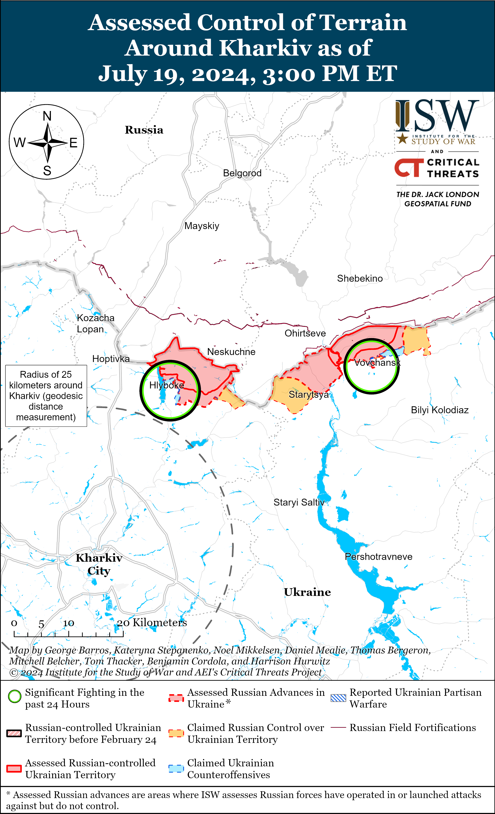
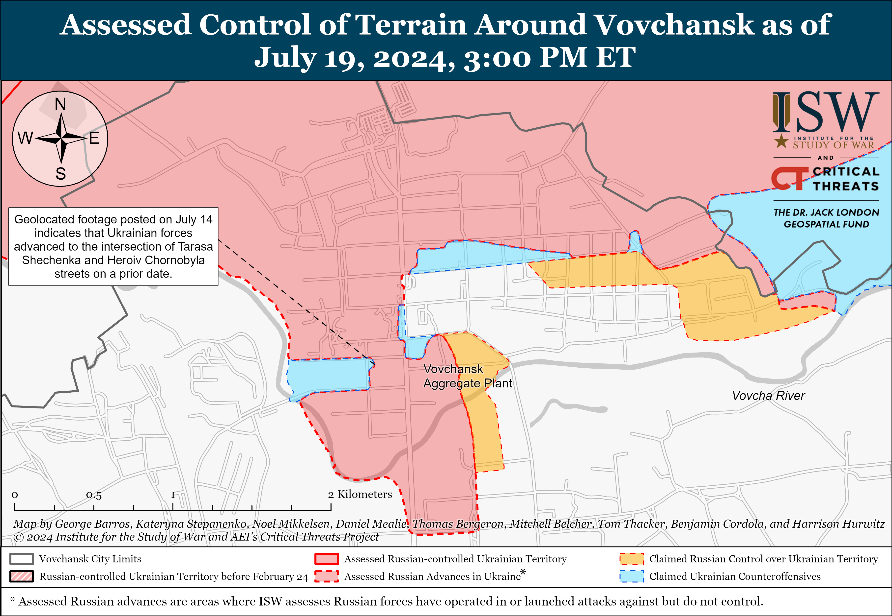
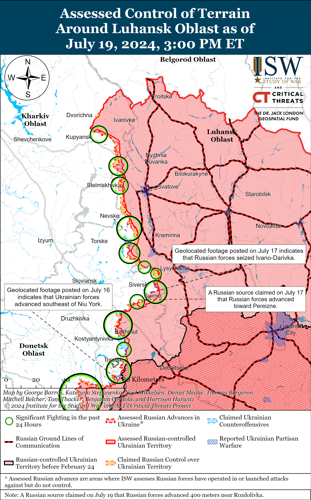
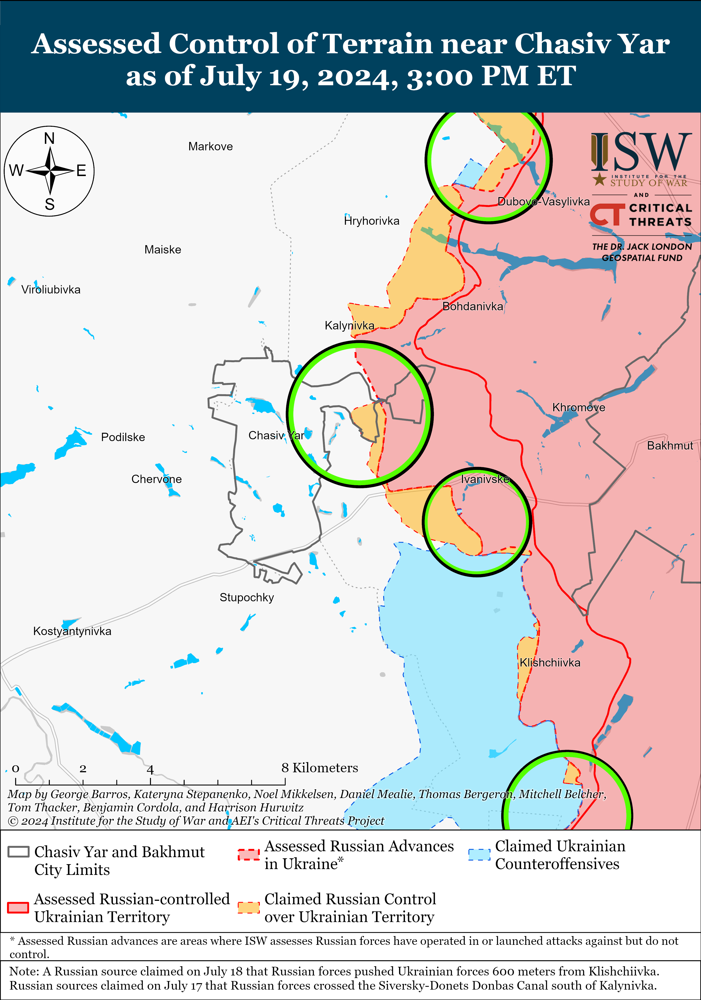
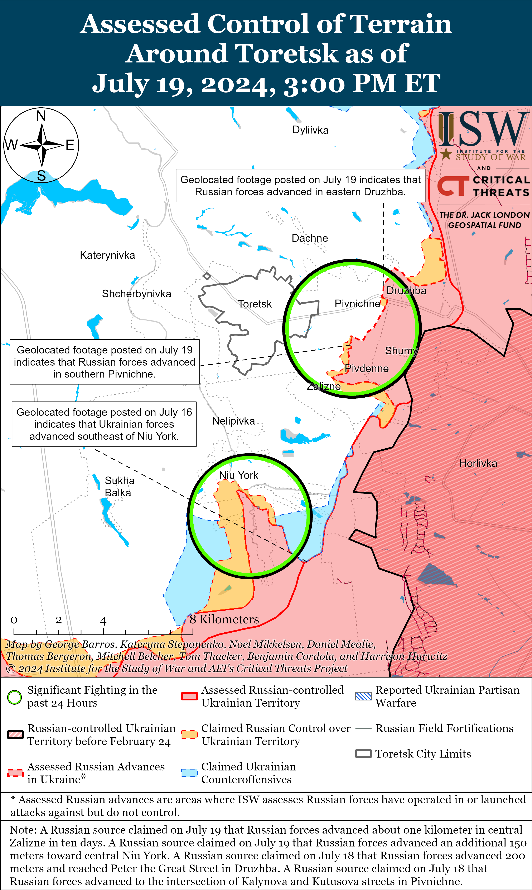
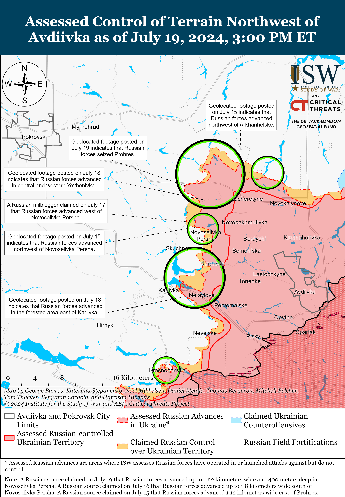
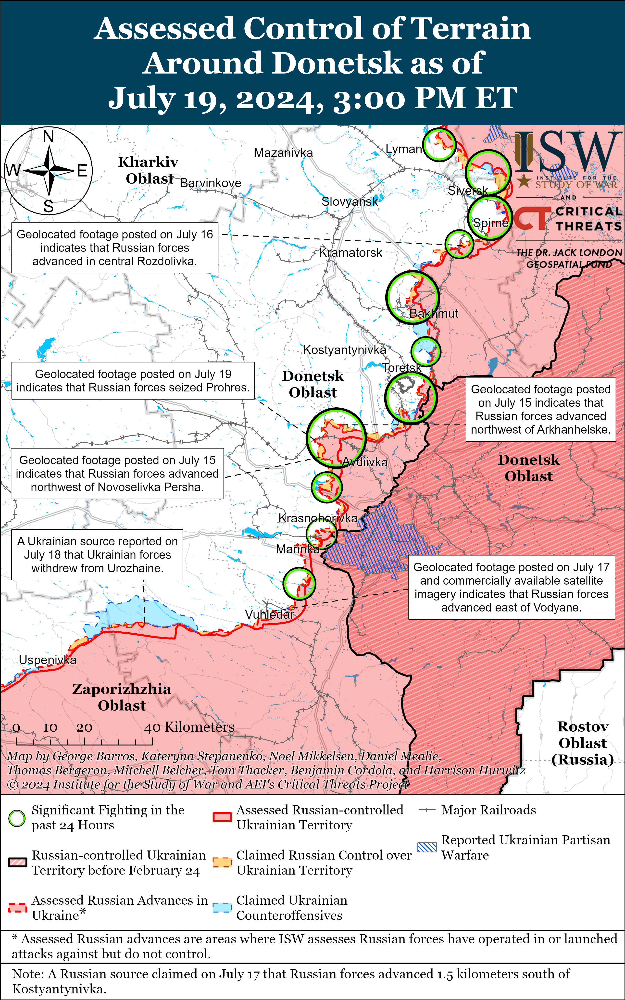
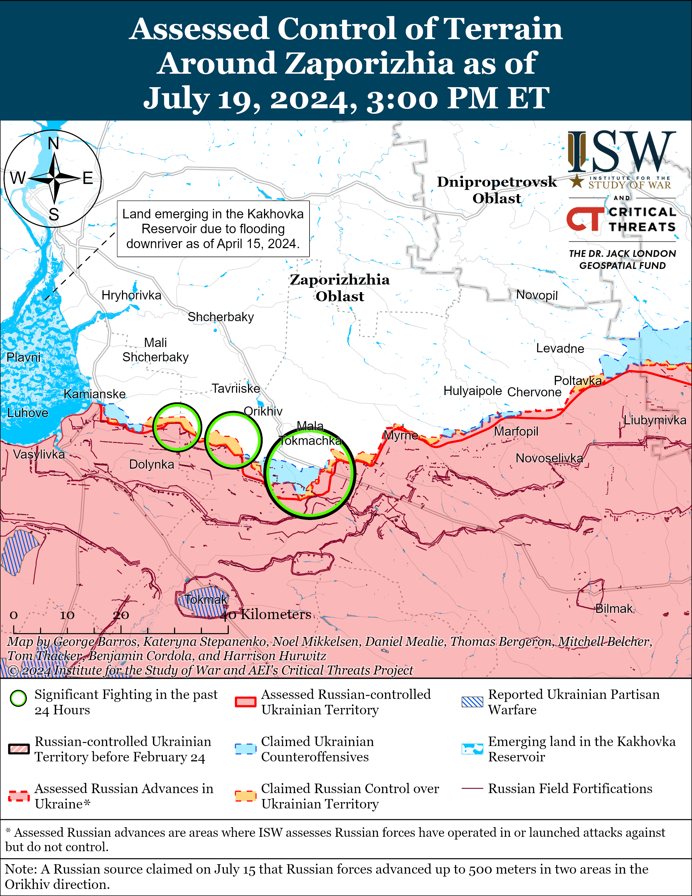
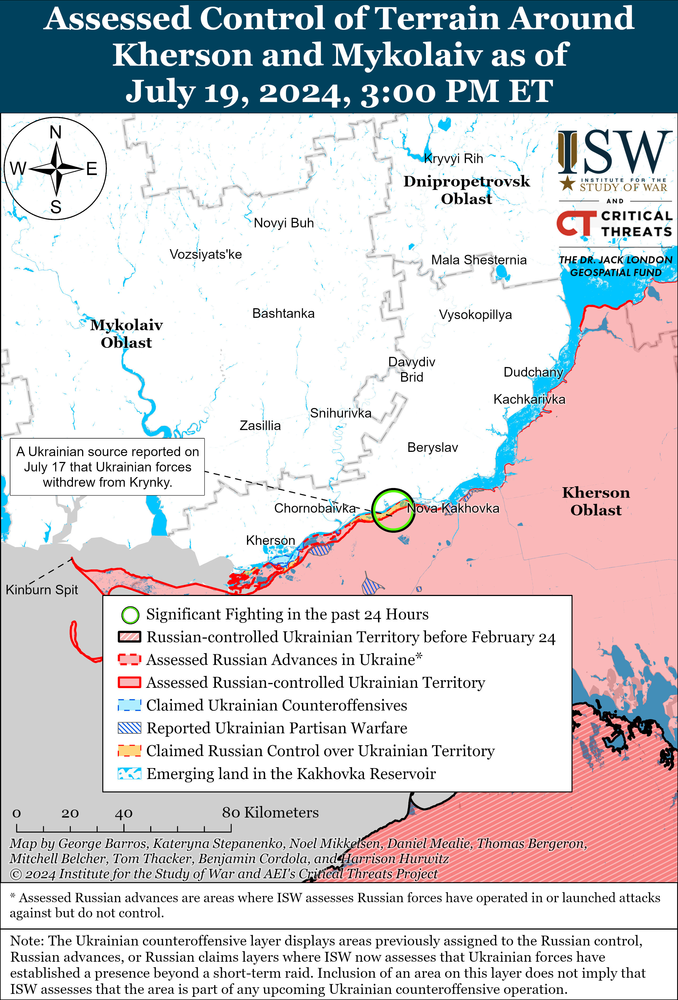

# Russian Offensive Campaign Assessment, July 19, 2024

**Angelica Evans, Christina Harward, Nicole Wolkov, Riley Bailey,  
Davit Gasparyan, and George Barros**

**July 19, 2024, 6:35pm ET**

**Click**[**here**](https://storymaps.arcgis.com/stories/36a7f6a6f5a9448496de641cf64bd375)**to see ISW’s interactive map of the Russian invasion of Ukraine. This map is updated daily alongside the static maps present in this report.**

**Click**[**here**](https://understandingwar.maps.arcgis.com/apps/instant/3dviewer/index.html?appid=1602762dbcde419bb957dea358449580)**to see ISW’s 3D control of terrain topographic map of Ukraine. Use of a computer (not a mobile device) is strongly recommended for using this data-heavy tool.**

**Click**[**here**](https://storymaps.arcgis.com/stories/733fe90805894bfc8562d90b106aa895)**to access ISW’s archive of interactive time-lapse maps of the Russian invasion of Ukraine. These maps complement the static control-of-terrain map that ISW produces daily by showing a dynamic frontline. ISW will update this time-lapse map archive monthly.**

**Note: The data cut-off for this product was 12pm ET on July 19. ISW will cover subsequent reports in the July 20 Russian Offensive Campaign Assessment.**

**Ukrainian President Volodymyr Zelensky reiterated the importance of developing an international consensus for pursuing peace negotiations to end the war in Ukraine.**Zelensky stated during an interview with the BBC published on July 18 that the world needs to develop a united consensus on a possible end state for the war in Ukraine and present this consensus to Russia in order to encourage Russia to come to the negotiating table.[1] Zelensky added that diplomacy will be an important element of restoring Ukraine’s territorial integrity and that Ukraine does not necessarily need to liberate all of its territory “by force” but must significantly weaken Russia’s battlefield position in order to develop a stronger negotiating position for future peace negotiations. Zelensky and other Ukrainian officials have consistently presented their vision for a negotiated settlement for the war in Ukraine, which includes the restoration of Ukraine’s territorial integrity and long-term security guarantees for Ukraine’s sovereignty and national security against future aggression.[2] Ukrainian officials have not articulated a willingness to concede territory to Russia in exchange for peace, and Zelensky’s statements are consistent with this position.[3] Ukrainian officials continue to signal their willingness to participate in good faith peace negotiations with Russian representatives based on Ukrainian sovereignty, territorial integrity, and international law, and Kremlin officials continue to frame such negotiations as outlandish and an “ultimatum” and call for a settlement tantamount to Ukrainian surrender.[4]

**Hungarian Prime Minister Viktor Orban appears to be augmenting several Russian information operations amid continued efforts to present himself as a possible future mediator between Russia and Ukraine.**Orban published a report on July 18 detailing his recent “peacekeeping mission” and visits to Ukraine, Russia, China, Turkey, and the United States.[5] Orban notably conceded that Russia, as a belligerent, is uninterested in a ceasefire or peace negotiations with Ukraine, an admission at odds with Kremlin officials’ efforts to pose Russia as amenable to peace negotiations. Kremlin officials have also undermined their efforts to sue for peace by repeatedly signaling an unwillingness to participate in negotiations based on anything less than complete Ukrainian capitulation.[6] Orban may have acknowledged Russia’s resistance to negotiations in order to appear impartial as he tries to present himself as a possible mediator. Orban simultaneously attempted to place the onus for negotiations on Ukraine and questioned the longevity of US and European support for Ukraine, both of which are consistent with ongoing Russian information operations intended to discourage Western support for Ukraine and absolve Russia of responsibility for an invasion that Russia started.[7] Orban also called for the European Union (EU) to normalize diplomatic relations and reopen lines of communication with Russia. The Kremlin is attempting to use diplomatic meetings, including meetings with Hungary, to create the impression that Russia is normalizing relations with the West and claim that there is limited Western support for Russia, and Orban’s recommendation would support this Kremlin effort and undermine several years of EU policy to address Russian war crimes and aggression towards Ukraine.[8] Orban stated on July 19 that his “peace mission” will continue despite recent criticism from EU leadership and efforts to demonstrate the EU’s non-alignment with Orban’s positions on Ukraine and peace negotiations.[9]

**New United Kingdom (UK) Defense Secretary John Healey stated on July 19 that Ukraine can use UK-provided weapons to strike military targets in Russia, despite previous reports that the UK had not permitted Ukraine to use UK-supplied Storm Shadow missiles to strike military targets within Russia.**Healey told *BBC*on July 19 that the UK is providing weapons to Ukraine to defend their sovereign country and that “does not preclude [UK-provided weapons] hitting targets in Russia.”[10] Healey also stated that Ukrainian forces can strike military targets in Russia with UK-provided weapons “within the parameters and the bounds of international humanitarian law.” Healey stated that he would not publicly discuss whether the UK is allowing Ukrainian forces to strike Russian missile launch sites in Russia with UK-provided weapons, however. Healey noted that the UK is “continuing very intense discussions” with Ukraine. Bloomberg reported on July 10 that new UK Prime Minister Keir Starmer stated that it is Ukraine’s decision how to deploy Storm Shadows missiles for defensive purposes.[11] Ukrainian President Volodymyr Zelensky stated in a July 19 meeting with the UK government that Ukraine could defend against Russian offensive operations and secure its forward positions and cities from Russian airstrikes if Ukrainian forces can strike “further than just the border, particularly Russian military airfields.”[12] Zelensky also asked the UK to show “leadership”‘ and convince other partners to remove limits on Ukraine using Western-provided weapons to strike legitimate military targets in Russia. The *Telegraph*reported on July 11 that unspecified sources in the UK government stated that the UK’s policy “had not changed,” however, and that the UK had not permitted Ukraine to use UK-provided Storm Shadow missiles to strike military targets within Russia.[13] The exact contours of the UK’s policy regarding Ukraine’s use of Storm Shadow cruise missiles and other UK-provided weapons remain unclear.

**The Kremlin is reportedly concerned about the long-term social and political implications of Russian veterans returning from the war in Ukraine.**Russian opposition outlet *Meduza* reported on July 19 that a source within the Kremlin and two sources who attended a July 2024 meeting stated that First Deputy Chief of Staff of the Russian Presidential Administration Sergey Kiriyenko stated during the meeting with Russian officials that Russian war veterans “adapt poorly” to civilian life after returning from Ukraine and that many convict recruits commit violent crimes after returning home.[14] One source who attended the meeting told*Meduza* that Kiriyenko made it clear that there will be “quite a lot” of veterans returning from the war in Ukraine and that increased crime committed by veterans could cause discontent, fear, or aggression towards veterans among Russian citizens.

Kiriyenko reportedly emphasized that the return of veterans from Ukraine will be very different than the period following the Soviet-Afghan war or the Second World War because the Soviet Union suffered fewer personnel losses in Afghanistan and because Soviet society was more widely mobilized and affected by the Second World War than the war in Ukraine. A source told*Meduza* that Kiriyenko characterized modern Russian society as only seeing the war in Ukraine “on TV” and being unprepared to “understand and accept” veterans. *Meduza*‘s source stated that Russian officials are expressing concern that returning veterans will form criminal gangs if they become disillusioned after returning from the frontline, but*Meduza*‘s source noted that Kiriyenko did not propose any specific solutions to address these issues. Kiriyenko claimed that the Kremlin’s new “Time of Heroes” program could provide a “buffer” between civilians and returning servicemen, but *Meduza* noted that this program only accepts roughly 100 officers per term and cannot support Russia’s wider veteran population.

*Meduza*‘s sources suggested that Kremlin officials do not yet fully understand the scale of the risk that returning veterans could pose to Russia’s internal stability, which supports ISW’s ongoing assessment that the Kremlin likely gave little consideration to the long-term social consequences of its full-scale invasion of Ukraine prior to February 2022.[15] The Kremlin already appears to be struggling to quell ongoing interethnic and interreligious conflict in Russia, and the June 2023 Wagner Group armed rebellion highlighted how discontent simmering among Russian military personnel can quickly become an immediate threat to regime stability.[16]

**The Russian government is reportedly considering stricter measures to directly censor critical voices on Russian social media.**Kremlin newswire *TASS*reported on July 19 that an unspecified source stated that Russian lawmakers are discussing legislation that would force social media account owners with at least 10,000 subscribers to transfer personal identification data to Russian federal censor Roskomnadzor and that would block the channel for noncompliance.[17] Roskomnadzor stated on July 11 that it may require social media account owners with a daily audience of over 1,000 people to provide identifying information and would prohibit Russian companies from advertising on pages whose owners do not provide such information.[18]

ISW previously assessed that Roskomnadzor’s proposal was part of wider Kremlin efforts to root out critical voices and consolidate control over the Russian information space. Roskomnadzor may have decided that the previous measures that aimed to push critical voices to self-deter out of fear of losing income from advertisements would not have guaranteed the Russian government’s ability to directly control the information space as channel administrators that do not rely on income from advertisements would have been able to continue to operate anonymously. The reported new proposals, however, will allow the Russian government to directly censor all larger critical channels that remain anonymous. Roskomnadzor’s proposals may be affecting the decision-making of Telegram’s administrators. Telegram founder Pavel Durov stated on July 19 that Telegram would begin displaying the month and country in which a channel registered but noted that this was part of efforts to combat scammers on the application.[19] Durov’s announcement, however, is notable as he has regularly advertised Telegram as a privacy-oriented, independent, and censored platform since its founding in 2013.[20]

**Russian authorities continue to propose stricter migration legislation as Russia’s ultranationalists continue to espouse xenophobic rhetoric and complain about the Russian government’s perceived lenient migration policy.**The Russian Investigative Committee stated on July 19 that it sent proposals to the Russian State Duma to more strictly regulate migrants in Russia and the methods for depriving naturalized citizens of their Russian citizenship.[21] The Investigative Committee called for Russian authorities to deprive naturalized citizens of their citizenship if they prepare, attempt, or commission any crimes classified as grave or especially grave. The Investigative Committee also called for increased measures to control foreigners in Russia, including biometric procedures, genomic registration, and fingerprinting, and called for newly naturalized Russian citizens to register for military service at the same time as they receive their Russian passports.

Russian State Duma deputy Mikhail Matveyev posted footage on July 18 allegedly showing him intervening in a fight between migrants in Samara and getting hit.[22] Russian authorities charged a citizen of Uzbekistan and Tajikistan and a resident of Samara on July 19 for attempting to murder Matveyev.[23] Russian ultranationalist milbloggers responded to the incident on July 19, complaining about the government’s insufficient actions to respond to migrant crimes and inadequate restrictions on the distribution of Russian passports to migrants.[24] The Russian Federal Security Service (FSB) claimed on July 19 that it prevented a terrorist attack in Essentuki, Stavropol Krai, and that Russian authorities arrested a citizen of Tajikistan for preparing the attack.[25] Russian ultranationalists responded to the alleged attack by calling for the Russian government, and specifically Russian Investigative Committee Head Alexander Bastrykin, to greatly restrict entry points into Russia for Central Asian migrants and claimed that Russia does not need migrant workers to supplement its workforce.[26] Bastrykin has notably recently positioned himself as a prominent figure in Russia’s ultranationalist community and specifically appeals to ultranationalist animus to migrants.[27]

ISW continues to assess that the Kremlin is struggling to reconcile its inconsistent policies that attempt to appease Russian ultranationalists’ anti-migration position while leveraging migrants to address domestic labor shortages and the Russian military’s force generation needs.[28]

**Key Takeaways:**

- **Ukrainian President Volodymyr Zelensky reiterated the importance of developing an international consensus for pursuing peace negotiations to end the war in Ukraine.**
- **Hungarian Prime Minister Viktor Orban appears to be augmenting several Russian information operations amid continued efforts to present himself as a possible future mediator between Russia and Ukraine.**
- **New United Kingdom (UK) Defense Secretary John Healey stated on July 19 that Ukraine can use UK-provided weapons to strike military targets in Russia, despite previous reports that the UK had not permitted Ukraine to use UK-supplied Storm Shadow missiles to strike military targets within Russia.**
- **The Kremlin is reportedly concerned about the long-term social and political implications of Russian veterans returning from the war in Ukraine.**
- **The Russian government is reportedly considering stricter measures to directly censor critical voices on Russian social media.**
- **Russian authorities continue to propose stricter migration legislation as Russia’s ultranationalists continue to espouse xenophobic rhetoric and complain about the Russian government’s perceived lenient migration policy.**
- **Russian forces recently advanced near Siversk, Toretsk, and Avdiivka.**
- **Disorganization continues to plague Russian efforts to integrate personnel who served in Russian proxy forces in occupied Ukraine into the Russian military bureaucracy.**

[****](https://understandingwar.org/wp-content/uploads/2025/05/DraftUkraineCOTJuly192C2024.png)

***We do not report in detail on Russian war crimes because these activities are well-covered in Western media and do not directly affect the military operations we are assessing and forecasting. We will continue to evaluate and report on the effects of these criminal activities on the Ukrainian military and the Ukrainian population and specifically on combat in Ukrainian urban areas. We utterly condemn Russian violations of the laws of armed conflict and the Geneva Conventions and crimes against humanity even though we do not describe them in these reports.***

- Russian Main Effort – Eastern Ukraine (comprised of three subordinate main efforts)
- Russian Subordinate Main Effort #1 – Push Ukrainian forces back from the international border with Belgorod Oblast and approach to within tube artillery range of Kharkiv City
- Russian Subordinate Main Effort #2 – Capture the remainder of Luhansk Oblast and push westward into eastern Kharkiv Oblast and encircle northern Donetsk Oblast
- Russian Subordinate Main Effort #3 – Capture the entirety of Donetsk Oblast
- Russian Supporting Effort – Southern Axis
- Russian Air, Missile, and Drone Campaign
- Russian Mobilization and Force Generation Efforts
- Russian Technological Adaptations
- Activities in Russian-occupied areas
- Ukrainian Defense Industrial Base Efforts
- Russian Information Operations and Narratives
- Significant Activity in Belarus

**Russian Main Effort – Eastern Ukraine**

**Russian Subordinate Main Effort #1 – Kharkiv Oblast****(Russian objective: Push Ukrainian forces back from the international border with Belgorod Oblast and approach to within tube artillery range of Kharkiv City)**

Russian forces continued offensive operations north of Kharkiv City near Hlyboke and northeast of Kharkiv City near Vovchansk on July 18 and 19, but there were no confirmed changes to the frontline.[29] The Ukrainian Kharkiv Group of Forces reported that elements of the Russian 155th Naval Infantry Brigade (Pacific Fleet, Eastern Military District [EMD]) and the 18th Motorized Rifle Division (11th Army Corps [AC], Baltic Fleet) are regrouping near Hlyboke and that the Russian military command is preparing to deploy assault groups of the Russian 128th Motorized Rifle Regiment (6th Combined Arms Army [CAA], Leningrad Military District [LMD]) into combat near Vovchansk.[30] A Russian milblogger claimed that Russian electronic warfare (EW) systems are successfully defending against Ukrainian drones in the Kharkiv direction.[31] Russian milbloggers claimed that Ukrainian forces are counterattacking north of Kharkiv City near Hlyboke and northeast of Kharkiv City near Starytsya, Vovchansk, Tykhe, and Vovchanskyi-Khutory.[32]

**Russian Subordinate Main Effort #2 – Luhansk Oblast****(Russian objective: Capture the remainder of Luhansk Oblast and push westward into eastern Kharkiv Oblast and northern Donetsk Oblast)**

Russian forces continued ground attacks along the Kupyansk-Svatove-Kreminna line on July 19, but there were no confirmed changes to the frontline. A Russian milblogger claimed that Russian forces advanced east of Nevske (northwest of Kreminna), but ISW has not observed visual confirmation of this claim.[33] Fighting continued northeast of Kupyansk near Synkivka; east of Kupyansk near Petropavlivka; southeast of Kupyansk near Berestove, Stelmakhivka, Pishchane, and in the direction of Novoosynove; northwest of Kreminna near Hrekivka, Makiivka, Nevske, and Terny; west of Kreminna near Torske; and southwest of Kreminna in the Serebryanske forest area on July 18 and 19.[34] Elements of the Russian 272nd Motorized Rifle Regiment (47th Tank Division, 1st Guards Tank Army [GTA], Moscow Military District [MMD]) reportedly continue operating in the Kupyansk direction.[35]

Ukrainian forces reportedly conducted an ATAMCS missile strike against Luhansk City on July 19. Kremlin newswire *TASS*and Russian milbloggers claimed that Ukrainian forces launched three ATACMS missiles against Luhansk City.[36] Geolocated footage published on July 19 shows the remains of a likely ATACMS missile near the former Luhansk Higher Military Aviation School.[37] Ukrainian Luhansk Oblast Military Administration Head Artem Lysohor and Russian opposition outlet *Astra*amplified footage purportedly of a smoke plume in Luhansk City near the Aviation School.[38]

**Russian Subordinate Main Effort #3 – Donetsk Oblast****(Russian objective: Capture the entirety of Donetsk Oblast, the claimed territory of Russia’s proxies in Donbas)**

Russian forces recently advanced in the Siversk direction amid continued Russian offensive operations in the area on July 19. Geolocated footage published on July 17 shows elements of the Russian 123rd Motorized Rifle Brigade (2nd Luhansk People’s Republic Army Corps [LNR AC]) raising a Russian flag in Ivano-Darivka (southeast of Siversk) and indicates that Russian forces have seized the settlement as well as Spirne (east of Ivano-Darivka).[39] Russian forces did not make these advances in the previous 24 hours, and it is likely that Russian forces had previously advanced from Spirne towards Ivano-Darivka instead of making rapid tactical gains in the area. A Russian milblogger claimed that Russian forces are roughly eight to nine kilometers from Siversk, which is consistent with recently assessed Russian advances in the Ivano-Darivka area.[40] Russian forces continued offensive operations northeast of Siversk near Bilohorivka, east of Siversk near Verkhnokamyanske, southeast of Siversk near Vyimka, and south of Siversk near Pereizne on July 19.[41] Russian milbloggers claimed that Ukrainian forces south of Siversk destroyed a bridge between Pereizne and Fedorivka (south of Siversk) to slow Russian advances.[42] Elements of the Russian 106th Airborne (VDV) Division are reportedly operating near Rozdolivka (south of Siversk).[43]

Russian forces continued offensive operations near Chasiv Yar on July 19, but there were no confirmed changes to the frontline. A Russian milblogger claimed that elements of the Russian 200th Motorized Rifle Brigade (14th AC, Leningrad Military District [LMD]) crossed the Siverskyi-Donets Donbas Canal near Kalynivka (north of Chasiv Yar), although ISW has not seen confirmation of this claim or claims about Russian forces holding specific positions on the western side of the canal in the area.[44] Russian forces continued offensive operations near Chasiv Yar, north of Chasiv Yar in the direction of Novomarkove, east of Chasiv Yar near Ivanivske, and southeast of Chasiv Yar near Bila Hora on July 18 and 19.[45] Elements of the Russian 98th VDV Division and the Russian Volunteer Corps reportedly continue to operate near Kalynivka.[46]

Russian forces recently advanced east of Toretsk amid continued Russian offensive operations in the area on July 19. Geolocated footage published on July 19 indicates that Russian forces recently advanced westward along Petra Velykoho Street in eastern Druzhba (east of Toretsk).[47] Geolocated footage published on July 19 indicates that Russian forces also recently advanced within southern Pivnichne (east of Toretsk).[48] The Russian Ministry of Defense (MoD) claimed on July 19 that elements of the Russian Central Grouping of Forces seized Yurivka (south of Toretsk).[49] Russian milbloggers claimed on July 19 that Russian forces advanced within central and northeastern Zalizne (southeast of Toretsk) and within southwestern Niu York (south of Toretsk).[50] ISW has not observed confirmation of these Russian claims, however. Russian forces continued offensive operations near Toretsk, Pivnichne, Zalizne, and Niu York on July 19.[51]

Russian forces recently advanced northwest and west of Avdiivka and continued offensive operations in the area on July 19. Geolocated footage published on July 19 indicates that Russian forces recently advanced into Prohres (northwest of Avdiivka) and seized the entire settlement.[52] Geolocated footage published on July 18 indicates that Russian forces recently advanced along windbreaks immediately southeast of Karlivka (west of Avdiivka).[53] A Russian milblogger claimed that Russian forces advanced north and southeast of Lozuvatske (northwest of Avdiivka) and west of Yevhenivka (northwest of Avdiivka), although ISW has not observed confirmation of these claims.[54] A Russian milblogger claimed that Russian forces also advanced up to 1.22 kilometers wide and 400 meters deep within Novoselivka Persha (northwest of Avdiivka).[55] Russian forces continued offensive operations north of Avdiivka near Kalynove; northwest of Avdiivka near Vozdvyzhenka, Novooleksandrivka, Prohres, Yevhenivka, and Novoselivka Persha; and west of Avdiivka near Umanske, Yasnobrodivka, and Karlivka on July 18 and 19.[56] Russian milbloggers claimed that elements of the Russian 1st “Slavic” Motorized Rifle Brigade (1st Donetsk Peoples Republic [DNR] AC) were responsible for the seizure of Prohres.[57] Elements of the Russian 433rd Motorized Rifle Regiment (27th Motorized Rifle Division, 2nd Combined Arms Army [CAA], Central Military District [CMD]) are reportedly operating near Yevhenivka, and elements of the 74th Motorized Rifle Brigade (41st CAA, CMD) are reportedly operating in the Avdiivka area.[58]

Russian forces reportedly recently advanced southwest of Donetsk City, but there were no confirmed changes to the frontline in the area on July 19. Russian milbloggers claimed that Russian forces advanced west and northwest of Solodke (southwest of Donetsk City) towards Vodyane (southwest of Donetsk City) and the O-0532 highway and seized a forest area north of Mykilske (southwest of Donetsk City).[59] Russian milbloggers claimed that Russian forces are also advancing within Krasnohorivka (west of Donetsk City) and that Russian forces currently control 90 percent of the settlement.[60] ISW currently assesses that Russian forces control roughly 37 percent of Krasnohorivka, although Russian sources are likely referring to a smaller section of the settlement and not its administrative boundaries. Russian forces also continued assaults southwest of Donetsk City near Kostyantynivka and Paraskoviivka on July 18 and 19.[61] Elements of the Russian 238th Artillery Brigade (8th CAA, Southern Military District [SMD]) are reportedly operating in the Kurakhove direction (west and southwest of Donetsk City).[62]

Russian forces continued offensive operations in the Donetsk-Zaporizhia Oblast border area on July 19, but there were no confirmed changes to the frontline. A Kremlin-affiliated Russian milblogger claimed on July 18 that Russian forces advanced northeast and northwest of Staromayorske (south of Velyka Novoselika), but ISW has not observed visual confirmation of this claim.[63] Russian milbloggers credited elements of the Russian 1466th Motorized Rifle Regiment (5th CAA, Eastern Military District [EMD]), 40th Naval Infantry Brigade (Pacific Fleet, EMD), and 5th Tank Brigade (26th CAA, EMD) with the recent Russian seizure of Urozhaine (south of Velyka Novosilka).[64]

**Russian Supporting Effort – Southern Axis****(Russian objective: Maintain frontline positions and secure rear areas against Ukrainian strikes)**

Positional engagements continued in western Zaporizhia Oblast on July 19, but there were no confirmed changes to the frontline. Positional engagements occurred near Mala Tokmachka (northeast of Robotyne), Shcherbaky, Novoandriivka (both northwest of Robotyne), and Robotyne on July 18 and 19.[65] Tavriisk Group of Forces Spokesperson Captain Dmytro Lykhovyi stated that Russian infantry conducted assaults on motorcycles near Mala Tokmachka.[66] Elements of the Russian “Valkiriya” Special Detachment (4th Military Base, 58th Combined Arms Army, Southern Military District) are reportedly operating near Kamyanske (northwest of Robotyne).[67]

Positional engagements continued in east (left) bank Kherson Oblast, including near Krynky, on July 18 and July 19.[68] A Russian milblogger claimed that Russian forces advanced near Krynky.[69] A Russian source claimed that Russian forces do not have sufficient personnel in the Kherson direction to conduct tactical frontline rotations and that Russian forces fighting on the east bank and on islands in the Dnipro River Delta are fatigued. [70]

Russian forces reportedly repelled a Ukrainian drone strike targeting occupied Crimea. The Russian Ministry of Defense (MoD) claimed on July 19 that Russian forces destroyed five drones over the Black Sea and occupied Crimea.[71] Ukraine’s Main Military Intelligence Directorate (GUR) reported that Russian tourists are traveling on the Kerch Strait Bridge as Russian forces simultaneously use the bridge for military logistics purposes.[72]

**Russian Air, Missile, and Drone Campaign****(Russian Objective: Target Ukrainian military and civilian infrastructure in the rear and on the frontline)**

Russian forces conducted limited missile strikes against Ukraine on July 18 and 19. Ukrainian officials reported that Ukrainian forces shot down an Iskander ballistic missile that Russian forces launched from occupied Crimea targeting Odesa Oblast on July 18.[73] The Ukrainian General Staff reported on July 19 that Russian forces conducted two Iskander-M ballistic missile strikes against Chuhuiv, Kharkiv Oblast.[74]

Ukraine’s Khortytsia Group of Forces stated on July 19 that Ukrainian forces shot down a Russian Su-25 aircraft in the Pokrovsk (Avdiivka) direction.[75]

**Russian Mobilization and Force Generation Efforts****(Russian objective: Expand combat power without conducting general mobilization)**

Disorganization continues to plague Russian efforts to integrate personnel who served in Russian proxy forces in occupied Ukraine into the Russian military bureaucracy. A former Storm-Z military instructor and Russian milblogger amplified claims on July 18 that Luhansk and Donetsk People’s Republic (LNR/DNR) authorities have opened criminal cases against many Russian citizens who joined their proxy forces for “abandoning their units.”[76] The milblogger claimed that LNR/DNR authorities likely did not properly register military units and their personnel with the Russian Ministry of Defense (MoD) after the Russian military formalized LNR/DNR units and that Russian authorities listed some volunteers serving in these units as mobilized personnel and contract servicemen (*kontraktniki*). The milblogger claimed that many volunteers in LNR and DNR units did not know that LNR and DNR authorities opened criminal cases against them until they went on leave.

Russian milbloggers claimed on July 19 that the Russian Federal Agency for Technical Regulation and Metrology (Rosstandart), which operates under the Ministry of Industry and Trade, has failed to standardize defense production. A prominent Kremlin-affiliated Russian milblogger noted that the Russian defense industry relies on various regulatory acts and requirements to produce quality defense products and should be prioritizing adapting the standards of defense production to fit the military’s current needs.[77] The milblogger claimed that Russia has an “unsystematic” and “chaotic” process for implementing regulations in the defense industry, which the milblogger criticized as not properly supporting the “de facto mobilization of the [Russian] economy.” The milblogger also criticized former Minister of Industry and Trade Denis Manturov for failing to oversee Rosstandart’s efforts to develop standardization measures and regulation of technological and military products.[78] Russian milbloggers previously complained about the inconsistent amounts of gunpowder in Russian artillery shells, which may be a result of insufficient production standardization practices.[79]

Russian authorities continue to create Cossack organizations in occupied Ukraine, likely in order to build out Russian military reserves and paramilitary policing services from the populations in occupied Ukraine. Ukrainian Zaporizhia Oblast Military Administration Head Ivan Fedorov stated on July 18 that Zaporizhia Oblast occupation authorities announced the creation of “farm and urban Cossack societies” that will be responsible for “maintaining law and order.”[80] Ukrainian sources stated on July 8 that Russian occupation officials in occupied Kherson Oblast approved a plan to develop a “Cossack” cooperative that includes all male inhabitants of occupied Kherson Oblast.[81] Russian President Vladimir Putin notably signed a law in March 2024 authorized members of the All-Russian Cossack Society who are in the Russian military and security services reserves to join the mobilization reserve, and Putin transferred control of the Cossack Cadet Corps to the jurisdiction of the Russian Ministry of Defense (MoD) in June 2024.[82] ISW continues to assess that Cossack organizations in occupied Ukraine will also fall under the control of the MoD.[83]

**Russian Technological Adaptations****(Russian objective: Introduce technological innovations to optimize systems for use in Ukraine)**

Russian drone producer Stratim Design Bureau claimed on July 19 that its “Ivolga” drone with artificial intelligence (AI) that runs on a domestic microprocessor chip successfully passed flight tests.[84] Stratim Design Bureau claimed that the microprocessor allows the drone to use a neural network without having to use a ground station.

Russian forces continue to jerry-rig armored vehicles with anti-drone protection systems. Russian and Ukrainian sources posted footage reportedly of a Russian armored vehicle covered with metal spikes to protect against drone strikes.[85]

**Ukrainian Defense Industrial Efforts****(Ukrainian objective: Develop its defense industrial base to become more self-sufficient in cooperation with US, European, and international partners)**

*ISW is not publishing coverage of Ukrainian defense industrial efforts today.*

**Activities in Russian-occupied areas****(Russian objective: Consolidate administrative control of annexed areas; forcibly integrate Ukrainian citizens into Russian sociocultural, economic, military, and governance systems)**

The Russian government continues efforts to integrate occupied Ukraine into the Russian economy and to populate occupied areas with Russian citizens. Head of the Russian Federal Agency for Sea and Inland Water Transport (Rosmorrechflot) Andrei Tarasenko claimed on July 17 that ports in occupied eastern and southern Ukraine are fully integrated into the Russian transport system and that Russian authorities are building cargo-handling infrastructure.[86] Russian Prime Minister Mikhail Mishustin stated on July 18 that Russian authorities have allocated up to one billion rubles (about $11 million) in order to increase one-time payments to medical workers who come to occupied Ukraine from Russia.[87] Mishustin stated that Russian doctors will receive up to two million rubles (about $22,800) and Russian paramedics, nurses, and other mid-level medical specialists will receive up to one million rubles (about $11,400).

Russian authorities continue to illegally deport Ukrainian children to Russia and forcibly relocate Ukrainian children deeper into occupied Ukraine. Ukrainian Luhansk Oblast Head Artem Lysohor stated on July 18 that Russian occupation authorities sent 91 Ukrainian children from occupied Luhansk Oblast to a children’s camp in Volgograd Oblast where they will attend military training classes.[88] The Luhansk People’s Republic (LNR) People’s Militia claimed on July 19 that occupation authorities, with support from the Tatarstan Republic, deported 99 Ukrainian schoolchildren from occupied Luhansk and Donetsk oblasts to a children’s camp in occupied Crimea in July 2024 and previously deported 269 Ukrainian children to the camp in Summer 2024.[89] Ukrainian Verkhovna Rada Human Rights Ombudsman Dmytro Lubinets stated on July 18 that Ukrainian authorities have returned 758 out of roughly 20,000 Ukrainian children whom Russian authorities illegally deported and abducted since 2014.[90] Lubinets stated on July 19 that Ukrainian authorities returned 12 Ukrainian children and their families from occupied Donetsk, Zaporizhia, and Kherson oblasts to Ukrainian-controlled territory, and Ukrainian Kherson Oblast Military Administration Head Oleksandr Prokudin stated on July 19 that Ukrainian authorities returned four families, including four children, from occupied Kherson Oblast to Ukrainian-controlled territory.[91] The Ukrainian Ministry of Reintegration stated on July 17 that it returned two Ukrainian children from occupied Luhansk and Zaporizhia oblasts to Ukrainian-controlled territory.[92]

Russian authorities continue efforts to destroy Ukrainian history and identity. Russian occupation authorities reportedly tore down monuments to “Victims of Stalin’s Repressions” and “Victims of Holodomor” (Stalin’s man-made famine in Soviet Ukraine in the early 1930s as a result of Soviet agricultural collectivization) in occupied Luhansk Oblast.[93]

**Russian Information Operations and Narratives**

The Ukrainian Kharkiv Group of Forces reported on July 19 that Russian Telegram channels are falsely claiming that Ukrainian border guards are mining Ukraine’s border with Moldova in order to create domestic discontent in Ukraine towards Ukrainian officials and the Ukrainian military.[94] A Russian milblogger amplified footage attempting to feed into this narrative on July 18.[95]

The Russian and Belarusian ministries of foreign affairs (MFA) published a joint report on July 19 about alleged human rights violations in Spain in an attempt to deflect international attention from the Kremlin’s ongoing human rights violations and invasion of Ukraine. The Russian and Belarusian MFAs claimed that the Spanish government is violating the rights of migrants and Spanish citizens and is “Russophobic.”[96] The Russian and Belarusian MFAs recently accused Belgium, Canada, Switzerland, and Australia of similar human rights violations and “Russophobia.”[97]

**Significant activity in Belarus****(Russian efforts to increase its military presence in Belarus and further integrate Belarus into Russian-favorable frameworks and Wagner Group activity in Belarus)**

The Belarusian Ministry of Defense (MoD) reported on July 19 that Belarusian and Kazakh forces concluded the bilateral “Summit of Brotherhood 2024” tactical exercise at the Koktal Training Ground in Zhetysu Region, Kazakhstan.[98] Belarusian Chief of Staff and Spetsnaz First Deputy Commander Colonel Alexander Ilyukevich and Kazakh Airborne Assault Forces Commander Major General Almaz Dzhumakeev observed the exercise.

**Note: ISW does not receive any classified material from any source, uses only publicly available information, and draws extensively on Russian, Ukrainian, and Western reporting and social media as well as commercially available satellite imagery and other geospatial data as the basis for these reports. References to all sources used are provided in the endnotes of each update.**

---

[1] https://www.bbc.com/news/articles/cxe25prezgzo ; https://unn dot ua/en/news/zelensky-we-can-try-to-end-the-hot-stage-of-the-war-by-the-end-of-the-year ; https://www.bbc.com/ukrainian/articles/c4ng93y6eyjo

[2] https://isw.pub/UkrWar071124 ; https://isw.pub/UkrWar061624 ; https://isw.pub/UkrWar060424 ; https://isw.pub/UkrWar053124 ; https://isw.pub/UkrWar030924 ; https://www.president dot gov.ua/storage/j-files-storage/01/19/53/32af8d644e6cae41791548fc82ae2d8e\_1691483767.pdf

[3] https://www.president dot gov.ua/storage/j-files-storage/01/19/53/32af8d644e6cae41791548fc82ae2d8e\_1691483767.pdf

[4] https://isw.pub/UkrWar071224 ; https://isw.pub/UkrWar061524 ; https://isw.pub/UkrWar071524 ; https://isw.pub/UkrWar070524 ; https://isw.pub/UkrWar071124

[5] https://miniszterelnok dot hu/orban-viktor-magyarorszag-miniszterelnoke-jelentese-az-europai-tanacs-elnokenek/

[6] https://isw.pub/UkrWar071224 ; https://isw.pub/UkrWar070524 ; https://understandingwar.org/backgrounder/russian-offensive-campaign-assessment-june-26-2024

[7] https://isw.pub/UkrWar070524 ; https://isw.pub/UkrWar062024 ; https://isw.pub/UkrWar060724 ; https://understandingwar.org/backgrounder/russian-offensive-campaign-assessment-july-17-2024

[8] https://understandingwar.org/backgrounder/russian-offensive-campaign-assessment-july-17-2024 ; https://isw.pub/UkrWar071224

[9] https://www.bloomberg.com/news/articles/2024-07-19/orban-vows-to-continue-ukraine-peace-mission-after-criticism ; https://understandingwar.org/backgrounder/russian-offensive-campaign-assessment-july-17-2024 ; https://isw.pub/UkrWar071524

[10] https://www.telegraph.co.uk/politics/2024/07/19/defence-secretary-suggests-ukraine-can-use-storm-shadow-mis/ ; https://www.theguardian.com/politics/article/2024/jul/19/uk-will-not-help-ukraine-hit-targets-in-russia-defence-secretary-says ; https://www.bbc.com/news/articles/cm52jvn41l7o

[11] https://understandingwar.org/backgrounder/russian-offensive-campaign-assessment-july-12-2024 ; https://www.bloomberg.com/news/articles/2024-07-10/starmer-says-ukraine-can-use-uk-missiles-to-strike-inside-russia

[12] https://www.president.gov.ua/news/nam-potriben-cej-krok-krok-yakij-zmusit-rosiyu-shukati-miru-92297

[13] https://www.telegraph.co.uk/world-news/2024/07/11/starmer-ukraine-british-storm-shadow-missiles-russia/ ; https://understandingwar.org/backgrounder/russian-offensive-campaign-assessment-july-12-2024

[14] https://meduza dot io/feature/2024/07/19/v-kremle-schitayut-chto-uchastniki-voyny-ploho-adaptiruyutsya-k-mirnoy-zhizni-posle-vozvrascheniya-s-fronta-chinovniki-nazyvayut-ih-novymi-afgantsami-i-boyatsya-rosta-prestupnosti

[15] https://understandingwar.org/backgrounder/russian-offensive-campaign-assessment-november-22 ; https://isw.pub/UkrWar081223 ; https://isw.pub/UkrWar081023 ; https://isw.pub/UkrWar071624

[16] https://isw.pub/UkrWar050324 ; https://isw.pub/UkrWar041024 ; https://isw.pub/UkrWar071524 ; https://isw.pub/UkrWar062323 ; https://isw.pub/UkrWar062423

[17] https://tass dot ru/obschestvo/21399921

[18] https://isw.pub/UkrWar071124

[19] https://t.me/durov/336

[20] https://understandingwar.org/backgrounder/russian-offensive-campaign-assessment-april-17-2024

[21] https://sledcom dot ru/news/item/1900860/?type=main

[22] https://t.me/matveevkomment/8028; https://t.me/matveevkomment/8030

[23] https://t.me/sledcom\_press/14672

[24] https://t.me/dva\_majors/47575; https://t.me/vysokygovorit/16564

[25] https://t.me/tass\_agency/261568; https://t.me/tass\_agency/261467 ; https://t.me/tass\_agency/261472

[26] https://t.me/MedvedevVesti/18064 ; https://t.me/sashakots/47922 ; https://t.me/vysokygovorit/16570; https://t.me/inners\_of\_the\_politics/7 ; https://t.me/dva\_majors/47632

[27] https://isw.pub/UkrWar063024; https://understandingwar.org/backgrounder/russian-offensive-campaign-assessment-june-29-2024

[28] https://understandingwar.org/backgrounder/russian-offensive-campaign-assessment-december-24-2023 ; https://understandingwar.org/backgrounder/russian-offensive-campaign-assessment-november-26-2023 ; https://understandingwar.org/backgrounder/russian-offensive-campaign-assessment-december-4-2023 ; https://isw.pub/UkrWar121323 ; https://isw.pub/UkrWar121123; https://understandingwar.org/backgrounder/russian-offensive-campaign-assessment-july-17-2024

[29] https://www.facebook.com/GeneralStaff.ua/posts/pfbid0io6PsZZ4AKgPWk8LWPGNwBabbXfMoBm8UDALPg7EM9GzahnQuc21tM3j1nYqtLQXl ; https://www.facebook.com/GeneralStaff.ua/posts/pfbid0FaMQ3o73ekLqWEFxM1C93pdv54xP4k5NJuGeH36sPfs4o1cPAHyztbAPpVHWu1gyl ; https://www.facebook.com/GeneralStaff.ua/posts/pfbid0njzrEMUg2NkEvXd89buZWjL8iFBudVn9vGB4j3S73UWL9Tcrt3KdP1MLumdB15EDl ; https://t.me/wargonzo/21095 ; https://t.me/rybar/61902

[30] https://t.me/otukharkiv/295

[31] https://t.me/bayraktar1070/2427 ; https://t.me/vysokygovorit/16560

[32]https://t.me/rybar/61902 ; https://t.me/rybar/61906; https://t.me/dva\_majors/47584

[33] https://t.me/z\_arhiv/27322

[34] https://www.facebook.com/GeneralStaff.ua/posts/pfbid0io6PsZZ4AKgPWk8LWPGNwBabbXfMoBm8UDALPg7EM9GzahnQuc21tM3j1nYqtLQXl ; https://www.facebook.com/GeneralStaff.ua/posts/pfbid0FaMQ3o73ekLqWEFxM1C93pdv54xP4k5NJuGeH36sPfs4o1cPAHyztbAPpVHWu1gyl ; https://www.facebook.com/GeneralStaff.ua/posts/pfbid0njzrEMUg2NkEvXd89buZWjL8iFBudVn9vGB4j3S73UWL9Tcrt3KdP1MLumdB15EDl ; https://t.me/NgP\_raZVedka/18398 ; https://t.me/rybar/61906; https://t.me/dva\_majors/47584 ; https://t.me/notes\_veterans/18187

[35] https://t.me/belarusian\_silovik/37943

[36] https://t.me/tass\_agency/261462 ; https://t.me/tass\_agency/261469 ; https://t.me/DnevnikDesantnika/12857 ;

[37] https://x.com/bayraktar\_1love/status/1814190874663755799 ; https://t.me/kiber\_boroshno/9102

[38] https://t.me/luhanskaVTSA/20176 ; https://t.me/astrapress/59965

[39] https://t.me/creamy\_caprice/6105; https://t.me/BattalionSIGIRIYA/15 ; https://x.com/Bielitzling/status/1814079033434362200;

[40] https://t.me/DnevnikDesantnika/12866

[41] https://www.facebook.com/GeneralStaff.ua/posts/pfbid0io6PsZZ4AKgPWk8LWPGNwBabbXfMoBm8UDALPg7EM9GzahnQuc21tM3j1nYqtLQXl ;

[42] https://t.me/motopatriot/25069; https://t.me/rusich\_army/15900

[43] https://t.me/DnevnikDesantnika/12854

[44] https://t.me/RVvoenkor/72750

[45] https://www.facebook.com/GeneralStaff.ua/posts/pfbid0io6PsZZ4AKgPWk8LWPGNwBabbXfMoBm8UDALPg7EM9GzahnQuc21tM3j1nYqtLQXl ; https://www.facebook.com/GeneralStaff.ua/posts/pfbid0njzrEMUg2NkEvXd89buZWjL8iFBudVn9vGB4j3S73UWL9Tcrt3KdP1MLumdB15EDl

[46] https://t.me/RVvoenkor/72750

[47] https://t.me/creamy\_caprice/6111; https://www.facebook.com/watch/?v=782719370476211

[48] https://x.com/small10space/status/1814277747415400887; https://x.com/Bielitzling/status/1814295027390075246

[49] https://t.me/mod\_russia/41186

[50] https://t.me/rybar/61914 ; https://t.me/RVvoenkor/72774 ; https://t.me/rybar/61914 ;

[51] https://www.facebook.com/GeneralStaff.ua/posts/pfbid0io6PsZZ4AKgPWk8LWPGNwBabbXfMoBm8UDALPg7EM9GzahnQuc21tM3j1nYqtLQXl

[52] https://t.me/creamy\_caprice/6109; https://t.me/voenkorkhayrullin/2940

[53] https://x.com/giK1893/status/1814027271285383221; https://x.com/giK1893/status/1814027274104222060

[54] https://t [dot] me/rybar/61902

[55] https://t.me/RVvoenkor/72767

[56] https://www.facebook.com/GeneralStaff.ua/posts/pfbid0io6PsZZ4AKgPWk8LWPGNwBabbXfMoBm8UDALPg7EM9GzahnQuc21tM3j1nYqtLQXl ; https://www.facebook.com/GeneralStaff.ua/posts/pfbid0FaMQ3o73ekLqWEFxM1C93pdv54xP4k5NJuGeH36sPfs4o1cPAHyztbAPpVHWu1gyl ; https://www.facebook.com/GeneralStaff.ua/posts/pfbid0njzrEMUg2NkEvXd89buZWjL8iFBudVn9vGB4j3S73UWL9Tcrt3KdP1MLumdB15EDl ; https://t.me/NgP\_raZVedka/18410 ; https://t.me/DnevnikDesantnika/12841 ; https://t.me/wargonzo/21095 ; https://t.me/RVvoenkor/72787

[57] https://t.me/RVvoenkor/72787 ; https://t.me/z\_arhiv/27341 ;

[58] https://t.me/milinfolive/126346

[59] https://t.me/rybar/61902 ; https://t.me/motopatriot/25028

[60] https://t.me/RtrDonetsk/25811 ; https://t.me/sashakots/47925 ; https://t.me/dva\_majors/47584 ; https://t.me/wargonzo/21095

[61] https://www.facebook.com/GeneralStaff.ua/posts/pfbid0io6PsZZ4AKgPWk8LWPGNwBabbXfMoBm8UDALPg7EM9GzahnQuc21tM3j1nYqtLQXl

 ; https://www.facebook.com/GeneralStaff.ua/posts/pfbid0FaMQ3o73ekLqWEFxM1C93pdv54xP4k5NJuGeH36sPfs4o1cPAHyztbAPpVHWu1gyl ; https://www.facebook.com/GeneralStaff.ua/posts/pfbid0njzrEMUg2NkEvXd89buZWjL8iFBudVn9vGB4j3S73UWL9Tcrt3KdP1MLumdB15EDl

[62] https://t.me/nm\_dnr/12483

[63] https://t.me/rybar/61902

[64] https://t.me/voin\_dv/9824 ; https://t.me/grey\_zone/23621 ; https://t.me/TOF\_VMF/3497 ; https://t.me/voin\_dv/9821 ; https://t.me/voin\_dv/9819

[65] https://www.facebook.com/GeneralStaff.ua/posts/pfbid0io6PsZZ4AKgPWk8LWPGNwBabbXfMoBm8UDALPg7EM9GzahnQuc21tM3j1nYqtLQXl ; https://www.facebook.com/GeneralStaff.ua/posts/pfbid0FaMQ3o73ekLqWEFxM1C93pdv54xP4k5NJuGeH36sPfs4o1cPAHyztbAPpVHWu1gyl ; https://www.facebook.com/GeneralStaff.ua/posts/pfbid0njzrEMUg2NkEvXd89buZWjL8iFBudVn9vGB4j3S73UWL9Tcrt3KdP1MLumdB15EDl

[66] https://armyinform.com dot ua/2024/07/19/motoczykletna-ataka-rosiyan-zavershylasya-nevdacheyu-na-zaporizhzhi/

[67] https://t.me/RVvoenkor/72737

[68] https://www.facebook.com/GeneralStaff.ua/posts/pfbid0io6PsZZ4AKgPWk8LWPGNwBabbXfMoBm8UDALPg7EM9GzahnQuc21tM3j1nYqtLQXl ; https://www.facebook.com/GeneralStaff.ua/posts/pfbid0FaMQ3o73ekLqWEFxM1C93pdv54xP4k5NJuGeH36sPfs4o1cPAHyztbAPpVHWu1gyl ; https://www.facebook.com/GeneralStaff.ua/posts/pfbid0njzrEMUg2NkEvXd89buZWjL8iFBudVn9vGB4j3S73UWL9Tcrt3KdP1MLumdB15EDl

[69] https://t.me/z\_arhiv/27340

[70] https://t.me/dva\_majors/47650

[71] https://t.me/mod\_russia/41173

[72] https://gur.gov dot ua/content/kurortnyi-sezon-u-krymu-letyt-shkerebert-rosiiany-masovo-skasovuiut-tury.html ; https://t.me/DIUkraine/4123

[73] https://armyinform dot com.ua/2024/07/19/dmytro-pletenchuk-rozpoviv-pro-znakovu-podiyu-na-odeshhyni-yaka-stalasya-vchora/; https://t.me/SJTF\_Odes/10577

[74] https://www.facebook.com/GeneralStaff.ua/posts/pfbid0io6PsZZ4AKgPWk8LWPGNwBabbXfMoBm8UDALPg7EM9GzahnQuc21tM3j1nYqtLQXl

[75] https://t.me/Khortytsky\_wind/743

[76] https://t.me/philologist\_zov/1137; https://t.me/adirect/21410

[77] https://t.me/rybar/61910

[78] https://t.me/rybar/61922 ; https://t.me/rybar/61913; https://t.me/dva\_majors/47605

[79] https://understandingwar.org/backgrounder/russian-offensive-campaign-assessment-may-19-2024

[80] https://t.me/ivan\_fedorov\_zp/9543

[81] https://understandingwar.org/backgrounder/russian-offensive-campaign-assessment-july-8-2024

[82] https://understandingwar.org/sites/default/files/2024-03-24-PDF-Russian%20Offensive%20Campaign%20Assessment.pdf; https://understandingwar.org/backgrounder/russian-offensive-campaign-assessment-june-23-2024; https://ria dot ru/20240323/putin-1935354519.html

[83] https://understandingwar.org/backgrounder/russian-offensive-campaign-assessment-july-8-2024

[84] https://tass dot ru/armiya-i-opk/21399747

[85] https://t.me/exilenova\_plus/1062; https://x.com/bayraktar\_1love/status/1814243355548594630; https://t.me/ButusovPlus/11959

[86] https://tass dot ru/ekonomika/21381981

[87] https://tass dot ru/ekonomika/21395531

[88] https://t.me/luhanskaVTSA/20135

[89] https://t.me/sons\_fatherland/15685

[90] https://suspilne dot media/ternopil/793521-povernuli-z-rosii-758-ukrainskih-ditej-dmitro-lubiec-pid-cas-brifingu-v-ternopoli/

[91] https://t.me/olexandrprokudin/4056; https://t.me/dmytro\_lubinetzs/6201

[92] https://minre dot gov.ua/2024/07/17/prodovzhuyemo-povertaty-ukrayinskyh-ditej-iz-tymchasovo-okupovanyh-terytorij/

[93] https://t.me/astrapress/59889; https://t.me/ostorozhno\_novosti/27820

[94] https://t.me/otukharkiv/297

[95] https://t.me/notes\_veterans/18188

[96] https://t.me/MID\_Russia/43352

[97] https://mid dot ru/ru/foreign\_policy/humanitarian\_cooperation/1957839/#sel=518:1:x0f,618:24:gim ; https://understandingwar.org/backgrounder/russian-offensive-campaign-assessment-july-1-2024 ; https://understandingwar.org/backgrounder/russian-offensive-campaign-assessment-june-23-2024 ; https://understandingwar.org/backgrounder/russian-offensive-campaign-assessment-july-17-2024

[98] https://t.me/modmilby/40532; https://t.me/belta\_telegramm/259424
