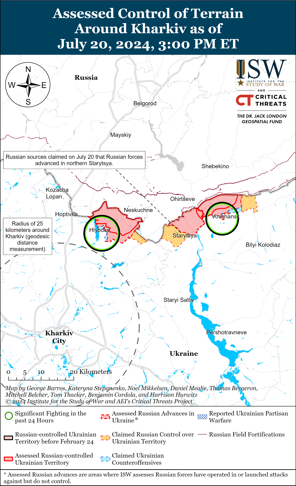
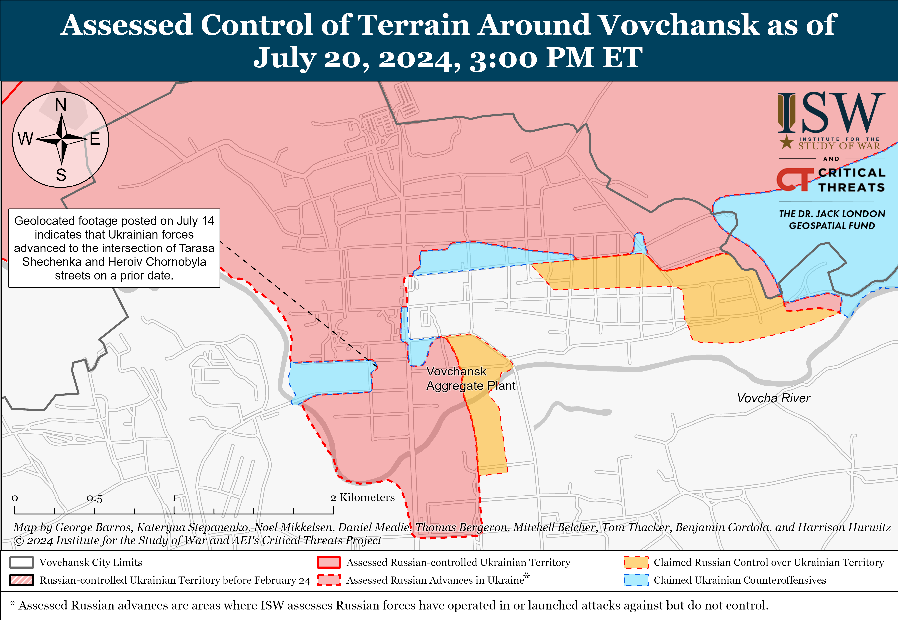
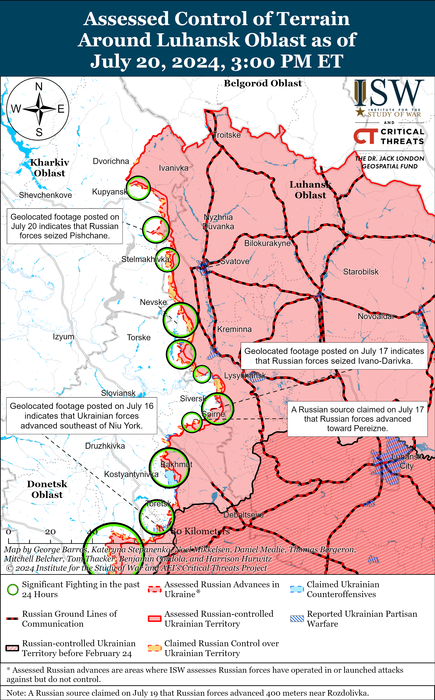
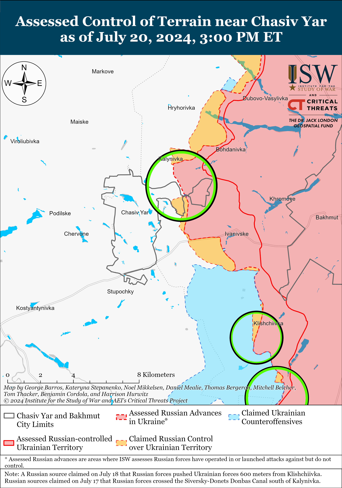
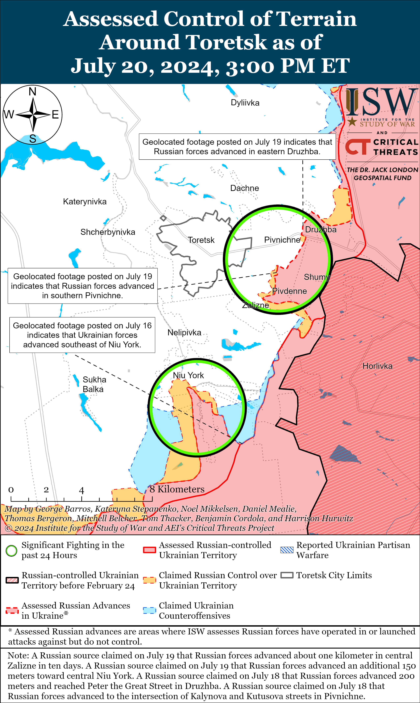
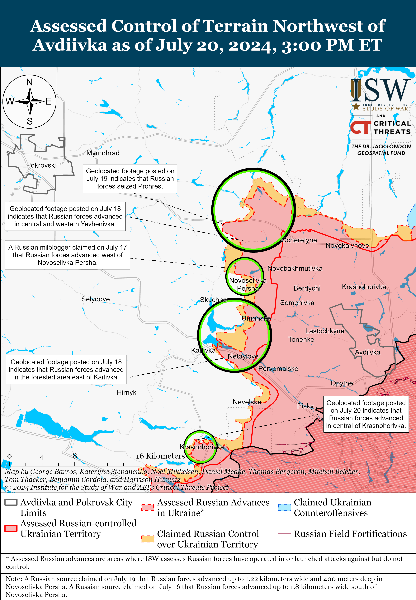
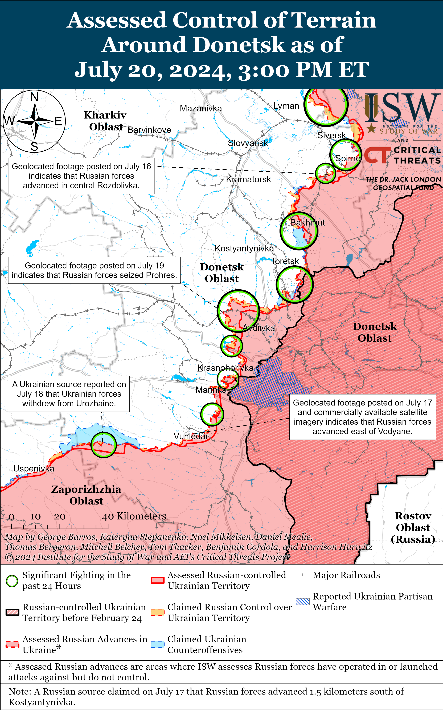
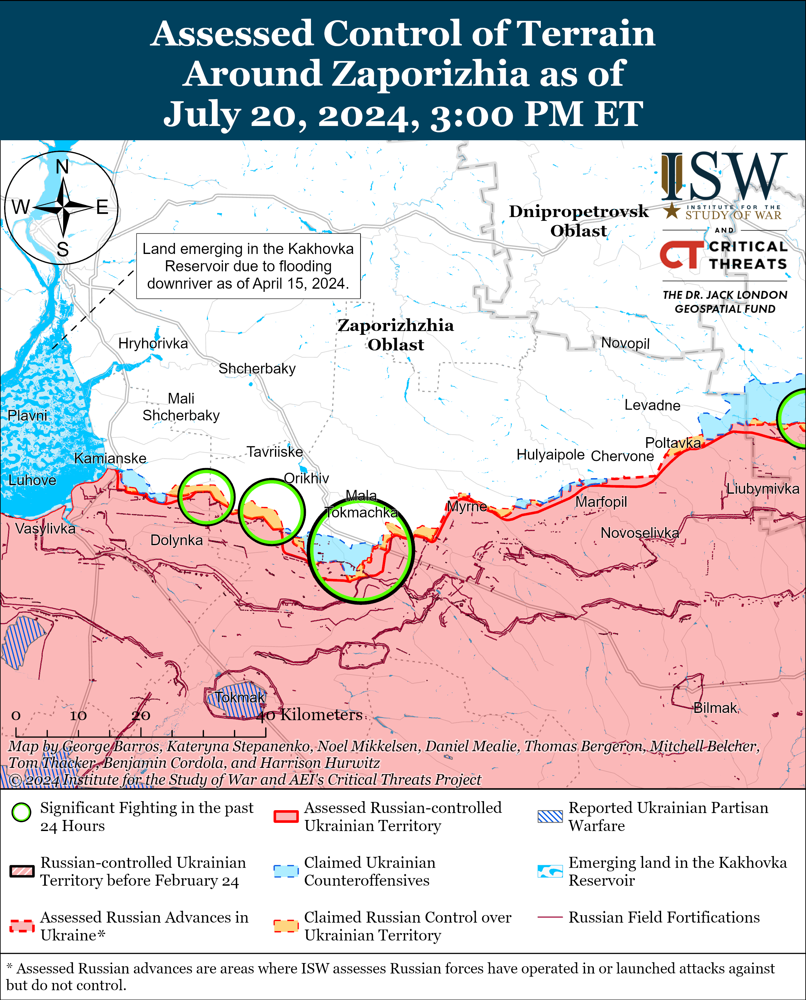
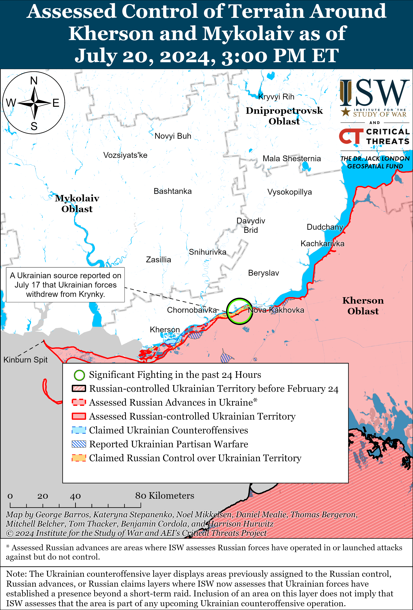

# Russian Offensive Campaign Assessment, July 20, 2024

**Christina Harward, Riley Bailey, Grace Mappes, Nicole Wolkov, and Frederick W. Kagan**

**July 20, 2024, 5:50pm ET**

**Click**[**here**](https://storymaps.arcgis.com/stories/36a7f6a6f5a9448496de641cf64bd375)**to see ISW’s interactive map of the Russian invasion of Ukraine. This map is updated daily alongside the static maps present in this report.**

**Click**[**here**](https://understandingwar.maps.arcgis.com/apps/instant/3dviewer/index.html?appid=1602762dbcde419bb957dea358449580)**to see ISW’s 3D control of terrain topographic map of Ukraine. Use of a computer (not a mobile device) is strongly recommended for using this data-heavy tool.**

**Click**[**here**](https://storymaps.arcgis.com/stories/733fe90805894bfc8562d90b106aa895)**to access ISW’s archive of interactive time-lapse maps of the Russian invasion of Ukraine. These maps complement the static control-of-terrain map that ISW produces daily by showing a dynamic frontline. ISW will update this time-lapse map archive monthly.**

**Note: The data cut-off for this product was 12pm ET on July 20. ISW will cover subsequent reports in the July 21 Russian Offensive Campaign Assessment.**

**Ukrainian President Volodymyr Zelensky spoke with former US President and Republican presidential nominee Donald Trump on July 19 and discussed an end-state to the war in Ukraine.** Zelensky stated thathe agreed to talk with Trump about steps that will produce a fair and truly lasting peace at a future personal meeting.[1]Trump stated that both Russia and Ukraine will be able to come together and negotiate a deal that ends the war.[2] The Kremlin continues to indicate that it is only interested in a negotiated settlement that results in Ukrainian capitulation and paves the way for Russia to destroy Ukrainian statehood, however.[3] Zelensky has recently stressed that Ukraine must significantly weaken Russia’s battlefield position in order to develop a stronger negotiating position for future peace negotiations, and Ukrainian leadership continues to call for the restoration of Ukraine’s territorial integrity and long-term security guarantees for Ukraine as part of any lasting peace.[4] Western security assistance that provides Ukrainian forces with the necessary equipment and weapons at the scale, timing, and regularity required for counteroffensive operations that liberate significant swaths of occupied Ukraine remains the only likely path for degrading Russia’s battlefield position and reducing Russian President Vladimir Putin’s current commitment to destroying Ukrainian statehood and identity.[5]

**Ukrainian drones struck a Russian airfield in Rostov Oblast on the night of July 19 to 20.** Russian sources claimed on July 20 that Ukrainian forces launched 30 drones against the Millerovo airfield in Rostov Oblast and that the strike caused damage to infrastructure and a fuel tank.[6] Geolocated footage shows a fire at the Millerovo airfield.[7] Rostov Oblast Governor Vasily Golubev claimed that Russian forces intercepted and destroyed 26 drones over Rostov Oblast on the night of July 19 to 20.[8] The Russian 31st Fighter Aviation Regiment (1st Composite Aviation Division) is reportedly based at the Millerovo airfield and has SU-30SM aircraft deployed to the airfield.[9]

**Russian Minister of Defense Andrei Belousov and the Russian Ministry of Defense (MoD) continue to use meetings with Kremlin-affiliated milbloggers to attempt to rehabilitate the MoD’s image among pro-war Russian ultranationalists and portray Belousov as an effective manager of the MoD.**Belousov met with a select group of Russian milbloggers and military commentators on June 10 and held another meeting with milbloggers on July 19.[10] Russian milbloggers who attended both meetings claimed that Belousov has already started to address many of their concerns and complaints about the conduct of the war in Ukraine and the MoD bureaucracy.[11] Russian milbloggers noted that Belousov acknowledged that the MoD has yet to find solutions to every issue that the milbloggers raised but stressed that Belousov is not ignoring issues.[12] A prominent Kremlin-affiliated milblogger expressed hope that Belousov and the MoD will eliminate all the “painful malfunctions” among Russian forces in Ukraine sooner or later.[13] Another prominent Kremlin-affiliated milblogger claimed that Belousov specifically promised to build shelters at military airfields to protect against Ukrainian drone strikes, a widespread point of neuralgia within the Russian pro-war ultranationalist community.[14] Both the Kremlin and the Russian MoD have a vested interest in appearing open to dialogue with milbloggers, who represent a major pro-war constituency, and the Kremlin is likely aiming to portray Belousov as more cognizant of this fact than his predecessor, Security Council Secretary Sergei Shoigu.

**Russian authorities are likely trying to strengthen coercive measures aimed at impressing migrants facing deportation into military service.**Kremlin newswire *TASS*reported on July 19 that the Russian State Duma will consider amendments that would allow Russian authorities to detain foreigners and stateless persons who are subject to expulsion from Russia, in “special institutions” for no more than 48 hours before their deportation.[15]  The amendments reportedly propose that officials from the Russian Ministry of Internal Affairs (MVD) or Federal Security Service (FSB) can request that a judge extend the period of detention from 48 hours to 90 days, however. Russian authorities are currently allowed to detain foreigners and stateless persons subject to deportation for a maximum of 90 days.[16] Russian authorities have increasingly been conducting raids against migrants and impressing migrants into signing military contracts by threatening migrants with deportation.[17] The amendments significantly shortening the period during which Russian authorities can detain people facing deportation are likely aimed in part at increasing pressure on migrants to join the military in lieu of deportation.

**Spanish authorities arrested three individuals accused of conducting cyberattacks as part of a prominent pro-Russian hacking group that consistently targets Ukraine and NATO states supporting Ukraine.**The Spanish Civil Guard announced on July 20 that it arrested three unspecified individuals in Manacor, Balearic Islands, and the province of Andalusia for conducting distributed denial-of-service (DDoS) attacks targeting state institutions and the strategic sectors of countries supporting Ukraine following the start of Russia’s full-scale invasion.[18] The Spanish Civil Guard noted that the hackers belong to the Russian “hacktivist” group “NoName057(16)” and that it continues to investigate several leads for identifying participants in the cyberattacks.[19] NoName057(16) is a pro-Russian cyber collective that emerged in March 2022 and initially targeted Ukrainian government and media sites but has since expanded to target Western government, economic, and logistical entities, including in NATO member states.”[20] NoName057(16) relies on volunteers to conduct its cyberattacks and previously published its own crowdsourced botnet, “DDoSia,” along with Russian and English language instructions for using DDoSia to conduct DDoS attacks.[21] NoName057(16) has repeatedly emphasized its willingness to cooperate with other cyber actors with which it shares “similar values” and has previously cooperated with other prominent Russian cyber actors “Killnet,” “XakNet Team,” and “CyberArmyofRussia\_Reborn.”[22] *Mandiant Intelligence* assessed with moderate confidence in an article published in September 2022 and updated in April 2024 that XakNet Team and CyberArmyofRussia\_Reborn are coordinating operations with the Russian Main Intelligence Directorate (GRU)-sponsored “Sandworm,” or Advanced Persistent Threat (APT) 44, and that Killnet also likely has “limited” links to the Russian GRU.[23]

**Key Takeaways:**

- **Ukrainian President Volodymyr Zelensky spoke with former US President and Republican presidential nominee Donald Trump on July 19 and discussed an end-state to the war in Ukraine.**
- **Ukrainian drones struck a Russian airfield in Rostov Oblast on the night of July 19 to 20.**
- **Russian Minister of Defense Andrei Belousov and the Russian Ministry of Defense (MoD) continue to use meetings with Kremlin-affiliated milbloggers to attempt to rehabilitate the MoD’s image among pro-war Russian ultranationalists and portray Belousov as an effective manager of the MoD.**
- **Russian authorities are likely trying to strengthen coercive measures aimed at impressing migrants facing deportation into military service.**
- **Spanish authorities arrested three individuals accused of conducting cyberattacks as part of a prominent pro-Russian hacking group that consistently targets Ukraine and NATO states supporting Ukraine.**
- **Russian forces recently advanced near Vovchansk, Svatove, and Donetsk City.**
- **Kremlin-affiliated business-focused outlet Kommersant reported on July 19 that low quality machine parts grounded five Russian Ministry of Defense (MoD) Il-76MD-90A transport aircraft.**

[****](https://understandingwar.org/wp-content/uploads/2025/05/DraftUkraineCoTJuly20202C202024.png)

***We do not report in detail on Russian war crimes because these activities are well-covered in Western media and do not directly affect the military operations we are assessing and forecasting. We will continue to evaluate and report on the effects of these criminal activities on the Ukrainian military and the Ukrainian population and specifically on combat in Ukrainian urban areas. We utterly condemn Russian violations of the laws of armed conflict and the Geneva Conventions and crimes against humanity even though we do not describe them in these reports.***

- Russian Main Effort – Eastern Ukraine (comprised of three subordinate main efforts)
- Russian Subordinate Main Effort #1 – Push Ukrainian forces back from the international border with Belgorod Oblast and approach to within tube artillery range of Kharkiv City
- Russian Subordinate Main Effort #2 – Capture the remainder of Luhansk Oblast and push westward into eastern Kharkiv Oblast and encircle northern Donetsk Oblast
- Russian Subordinate Main Effort #3 – Capture the entirety of Donetsk Oblast
- Russian Supporting Effort – Southern Axis
- Russian Air, Missile, and Drone Campaign
- Russian Mobilization and Force Generation Efforts
- Russian Technological Adaptations
- Activities in Russian-occupied areas
- Ukrainian Defense Industrial Base Efforts
- Russian Information Operations and Narratives
- Significant Activity in Belarus

**Russian Main Effort – Eastern Ukraine**

**Russian Subordinate Main Effort #1 – Kharkiv Oblast****(Russian objective: Push Ukrainian forces back from the international border with Belgorod Oblast and approach to within tube artillery range of Kharkiv City)**

Russian forces recently advanced northeast of Kharkiv City amid continued fighting in northern Kharkiv Oblast on July 20. Geolocated footage published on July 18 indicates that Russian forces recently advanced within western Starytsya (northeast of Kharkiv City).[24] Russian milbloggers claimed that Russian forces pushed Ukrainian forces out of positions north of Hlyboke (north of Kharkiv City) and back 200 meters within northeastern Hlyboke, although ISW has not observed confirmation of these claims.[25] Russian forces continued offensive operations north of Kharkiv City near Hlyboke and northeast of Kharkiv City near Vovchansk on July 19 and 20.[26] Russian milbloggers claimed that Ukrainian forces counterattacked near Starytsya, Hlyboke, and Lyptsi (north of Kharkiv City).[27] A Russian source claimed that Russian forces conducted a glide bomb strike against a bridge along Soborna Street over the Vovcha River within Vovchansk.[28] The Ukrainian Kharkiv Group of Forces reported that Russian forces formed and transferred additional assault groups of the 155th Naval Infantry Brigade (Pacific Fleet, Eastern Military District [EMD]) and the 18th Motorized Rifle Division (11th Army Corps [AC], Baltic Fleet) near Hlyboke in order to prepare for the resumption of offensive operations.[29] The Ukrainian Kharkiv Group of Forces also reported that Russian forces regrouped elements of the Russian 138th Motorized Rifle Brigade (6th Combined Arms Army [CAA], Leningrad Military District [LMD]), 1008th Motorized Rifle Regiment (6th Motorized Rifle Division, 3rd AC), and 128th Motorized Rifle Brigade (44th Army Corps, LMD) near central and eastern Vovchansk to resume assault operations.

**Russian Subordinate Main Effort #2 – Luhansk Oblast****(Russian objective: Capture the remainder of Luhansk Oblast and push westward into eastern Kharkiv Oblast and northern Donetsk Oblast)**

Russian forces recently advanced northwest of Svatove amid continued Russian offensive operations along the Kupyansk-Svatove-Kreminna line. Geolocated footage published on July 20 shows Russian forces raising a Russian flag in central Pishchane and indicates that Russian forces have seized the settlement.[30] Several Russian milbloggers claimed that elements of the Russian 1st Guards Tank Army (Moscow Military District [MMD]) completed clearing Pishchane on July 20.[31] Russian milbloggers claimed on July 19 and 20 that Russian forces completely seized Andriivka (west of Svatove) and recently advanced up 400 meters northwest of Kyslivka (northeast of Kupyansk) and up to two kilometers near Nevske (northwest of Kreminna).[32] Russian forces continued offensive operations northeast of Kupyansk near Synkivka; northwest of Svatove near Hlushkivka, Novoosynove, Pishchane, and Stelmakhivka; west of Svatove near Lozova; northwest of Kreminna near Makiivka, Nevske, Hrekivka, and Novosadove; west of Kreminna near Terny; and south of Kreminna near the Serebryanske forest area on July 19 and 20.[33]

[****](https://understandingwar.org/wp-content/uploads/2025/05/Luhansk20Battle20Map20Draft20July20202C202024.png)

**Russian Subordinate Main Effort #3 – Donetsk Oblast****(Russian objective: Capture the entirety of Donetsk Oblast, the claimed territory of Russia’s proxies in Donbas)**

Russian forces continued offensive operations in the Siversk direction on July 20 but did not make confirmed advances. Russian forces continued attacking northeast of Siversk near Bilohorivka, east of Siversk near Verkhnokamyanske, southeast of Siversk near Vyimka, and south of Siversk near Pereizne on July 19 and 20.[34] Elements of the Russian 2nd Artillery Brigade (2nd Luhansk People’s Republic [LNR] Army Corps) reportedly continue to operate in the Siversk direction.[35]

Russian forces continued ground attacks near Chasiv Yar on July 20 but did not make confirmed advances. Russian forces continued attacking within Chasiv Yar, north of Chasiv Yar near Kalynivka and Hryhorivka, southeast of Chasiv Yar near Klishchiivka, and south of Chasiv Yar near Bila Hora on July 19 and 20.[36] Elements of the Russian 98th Airborne (VDV) Division are reportedly fighting south of Kalynikva, and elements of the “Sever-V” Volunteer Brigade (Volunteer Corps) are reportedly fighting near Hryhorivka.[37] The United Kingdom Ministry of Defense (UK MoD) assessed that Russian forces near Chasiv Yar are likely conducting a tactical pause while conducting probing attacks and reconnaissance operations.[38]

[****](https://understandingwar.org/wp-content/uploads/2025/05/Chasiv20Yar20Battle20Map20Draft20July20202C202024.png)

Russian forces did not make confirmed advances amid continued fighting near Toretsk on July 20. Russian forces continued attacks near Toretsk, Zalizne (southeast of Toretsk), and Niu York (south of Toretsk) on July 19 and 20.[39] Russian milbloggers claimed that Russian forces advanced in fields south of Oleksandropil (southwest of Toretsk) and advanced up to 500 meters deep within central Zalizne, but ISW has not observed confirmation of these claims.[40] Elements of the Russian 9th Motorized Rifle Brigade (1st Donetsk People’s Republic [DNR] AC) are reportedly fighting within Niu York.[41]

Russian forces did not make confirmed advances amid continued offensive operations northwest and west of Avdiivka on July 20. Russian milbloggers claimed that Russian forces are advancing within central Novoselivka Persha (northwest of Avdiivka) and that Ukrainian forces have begun to withdraw from Novoselivka Persha, but one milblogger claimed that Ukrainian forces are not withdrawing but only conducting rotations and still maintaining positions in southern Novoselivka Persha.[42] Russian forces also continued attacks northwest of Avdiivka near Vozdvyzhenka, Novooleksandrivka, Prohres, Kalynove, Arkhanhelske, and Skuchne, and west of Avdiivka near Yasnobrodivka and Karlivka on July 19 and 20.[43]

Russian forces recently marginally advanced west of Donetsk City amid continued fighting in the area on July 20. Geolocated footage published on July 20 shows that Russian forces advanced in fields south of Heorhiivka and within central Krasnohorivka (both west of Donetsk City).[44] Russian milbloggers additionally claimed that Russian forces advanced further within central Krasnohorivka, but ISW has not observed confirmation of this extent of Russian advances.[45] Russian forces also attacked southwest of Donetsk City near Kostyantynivka, Paraskoviivka, and Vodyane on July 19 and 20.[46] Elements of the Russian 57th Motorized Rifle Brigade (5th Combined Arms Army [CAA], Eastern Military District [EMD]) reportedly continue to operate in the Vuhledar direction.[47]

Russian forces continued limited attacks in the Donetsk-Zaporizhia Oblast border area near Staromayorske (south of Velyka Novosilka) on July 19 and 20 but did not make any confirmed advances.[48]

[****](https://understandingwar.org/wp-content/uploads/2025/05/Donetsk20Battle20Map20Draft20July20202C202024.png)

**Russian Supporting Effort – Southern Axis****(Russian objective: Maintain frontline positions and secure rear areas against Ukrainian strikes)**

Positional engagements continued in western Zaporizhia Oblast on July 20, but there were no confirmed changes to the frontline. Fighting continued near Robotyne; east of Robotyne near Verbove; northeast of Robotyne near Mala Tokmachka; north of Robotyne near Novodanylivka; and northwest of Robotyne near Novoandriivka and Shcherbaky on July 19 and 20.[49]

Fighting continued in the east (left) bank of Kherson Oblast, including near Krynky, on July 20, but there were no confirmed changes to the frontline.[50] A Russian milblogger claimed that Russian forces maintain positions on the islands in the Dnipro River Delta.[51] Elements of the Russian 25th Spetsnaz Regiment (General Staff of the Armed Forces of the Russian Federation [GRU]) are reportedly operating in the Kherson direction.[52]

Satellite imagery published on July 20 confirms that Ukrainian forces successfully struck a Russian Coast Guard base on Lake Donuzlav in occupied Crimea on the night of July 17 to 18.[53] Ukrainian outlet *Suspilne* reported on July 18 that sources in Ukrainian law enforcement stated that Ukraine’s Security Service (SBU) conducted a naval and aerial drone strike against the Russian Coast Guard base and damaged and disabled a headquarters with a control point, a warehouse with ammunition and equipment, an electric substation, technical facilities, and Russian firing positions.[54]

**Russian Air, Missile, and Drone Campaign****(Russian Objective: Target Ukrainian military and civilian infrastructure in the rear and on the frontline)**

Russian forces conducted limited missile and drone strikes against targets in Ukraine on the evening of July 19 and on the night of July 19 to 20. Ukrainian Air Force Commander Lieutenant General Mykola Oleshchuk reported that Russian forces launched three Iskander-M ballistic missiles from Voronezh Oblast and one Iskander-K cruise missile and 16 Shahed-136/131 drones from Kursk Oblast.[55] Oleshchuk reported that Ukrainian forces downed 13 Shaheds and another unspecified type of drone and that Russian forces targeted Kharkiv, Poltava, Chernihiv, and Kyiv oblasts.[56] A Russian milblogger suggested that the unknown drone was a new Russian drone that followed below a Shahed drone at an altitude of 20 to 30 meters, although ISW has not observed confirmation of this speculation.[57] Ukrainian state electricity transmission operator Ukrenergo stated that Russian forces attacked energy facilities in Poltava, Sumy, and Chernihiv oblasts, and Ukrainian Northern Operational Command reported that a Russian Shahed strike damaged a critical infrastructure facility in Nizhyn, Chernihiv Oblast.[58] Ukrainian President Volodymyr Zelensky reported that Russian forces struck residential areas in Mykolaiv City on the evening of July 19 with an unspecified number and type of missile.[59]

**Russian Mobilization and Force Generation Efforts****(Russian objective: Expand combat power without conducting general mobilization)**

Kremlin-affiliated business-focused outlet *Kommersant*reported on July 19 that low quality machine parts grounded five Russian Ministry of Defense (MoD) Il-76MD-90A transport aircraft.[60] *Kommersant*reported that the Russian Investigative Commitee’s Main Investigative Directorate opened a criminal case against unspecified managers at the Balashikha Foundry and Mechanical Plant (BLMZ) after BLMZ supplied low quality Il-76 bearings causing the Russian MoD to suspend its operation of five Il-76MD-90A aircraft. *Kommersant*reported that the investigation found that BLMZ purchased bearings accompanied by forged documents from an unknown supplier from 2017 to 2022. Russian opposition outlet*Vazhnye Istorii* reported, citing unspecified open-source data, that the Russian MoD had a total of 18 Il-76MD-90A aircraft at the end of 2023.[61] Corruption and limitations due to Western sanctions may be affecting the Russian MoD’s ability to access quality machine parts in a timely manner to repair aircraft.

The Russian military reportedly continues to recruit Cuban citizens to fight in Ukraine. *Bloomberg*reported on July 19, citing a source familiar with the matter, that Cuban nationals continue to travel to Russia to fight in Ukraine despite the Cuban government’s efforts to crack down against Russian military recruitment. The source stated that the number of Cubans fighting in the Russian military is likely in the “low hundreds.” ISW previously observed reports that Cuban nationals are serving in airborne (VDV) formations, including the 106th VDV Division.[62]

**Russian Technological Adaptations****(Russian objective: Introduce technological innovations to optimize systems for use in Ukraine)**

Nothing significant to report.

**Ukrainian Defense Industrial Efforts****(Ukrainian objective: Develop its defense industrial base to become more self-sufficient in cooperation with US, European, and international partners)**

*ISW is not publishing coverage of Ukrainian defense industrial efforts today.*

**Activities in Russian-occupied areas****(Russian objective: Consolidate administrative control of annexed areas; forcibly integrate Ukrainian citizens into Russian sociocultural, economic, military, and governance systems)**

*ISW is not publishing coverage of activities in Russian-occupied areas today.*

**Russian Information Operations and Narratives**

The Ataman of the All-Russian Cossack Society, Vitaly Kuznetsov, promoted narratives about Russia’s alleged “holy war” in Ukraine that ignore Russia’s religious persecution campaign in occupied Ukraine. Kuznetsov claimed on July 20 that Cossacks fighting in the Russian military in Ukraine are “defending the canonical territory of the Russian Orthodox Church and strengthening the Orthodox faith” by constructing religious sites. Kuznetsov also claimed that Russia’s war in Ukraine is a metaphysical spiritual battle with schismatics, Satanists, neo-pagans, and other enemies of Orthodoxy.[63] Russian authorities have recently taken steps to integrate Cossack organizations, including the All-Russian Cossack Society, into the Russian military.[64] The Kremlin-controlled Russian Orthodox Church Moscow Patriarchate approved an ideological and policy document in March 2024 casting Russia’s war in Ukraine as an existential and civilizational “holy war.”[65] ISW has previously reported about Russia’s religious persecution campaign in occupied Ukraine, including against the Autocephalous Orthodox Church of Ukraine, which Moscow views as schismatic despite the decision by the Ecumenical Patriarch of Constantinople in 2019 granting the Ukrainian Orthodox Church its independence from the Moscow Patriarchate.[66]

The Russian and Belarusian ministries of foreign affairs (MFA) published a joint report on July 20 about alleged human rights violations in Italy in an attempt to deflect international attention from the Kremlin’s ongoing human rights violations and invasion of Ukraine. The Russian and Belarusian MFAs claimed that the Italian government is violating the rights of migrants and Italian citizens and is “Russophobic” and neofascist.[67] The Russian and Belarusian MFAs have recently lobbied similar accusations against Belgium, Canada, Switzerland, Australia, and Spain. [68]

Russian officials continue to frame NATO member states’ defensive actions in response to Russian aggression as provocative. Russian Foreign Ministry Spokesperson Maria Zakharova claimed on July 20 that NATO is creating a fortified “outpost” in northern Norway on the border with Russia and that this is provoking an escalation.[69]

Russian sources seized on the murder of former Ukrainian Verkhovna Rada Deputy Iryna Farion on July 19 in order to spread divisions in Ukrainian society and narratives about “Nazism” in Ukraine.[70]

**Significant activity in Belarus****(Russian efforts to increase its military presence in Belarus and further integrate Belarus into Russian-favorable frameworks and Wagner Group activity in Belarus)**

Nothing significant to report.

**Note: ISW does not receive any classified material from any source, uses only publicly available information, and draws extensively on Russian, Ukrainian, and Western reporting and social media as well as commercially available satellite imagery and other geospatial data as the basis for these reports. References to all sources used are provided in the endnotes of each update.**

****

---

[1] https://twitter.com/ZelenskyyUa/status/1814424885164421439

[2] https://truthsocial.com/@realDonaldTrump/posts/112815440435929028

[3] https://isw.pub/UkrWar070524

[4] https://isw.pub/UkrWar071924 ; https://isw.pub/UkrWar071124 ; https://isw.pub/UkrWar061624 ; https://isw.pub/UkrWar060424 ; https://isw.pub/UkrWar053124 ; https://isw.pub/UkrWar030924 ; https://www.president dot gov.ua/storage/j-files-storage/01/19/53/32af8d644e6cae41791548fc82ae2d8e\_1691483767.pdf

[5] https://understandingwar.org/backgrounder/russian-offensive-campaign-assessment-june-30-2024

[6] https://t.me/boris\_rozhin/130601; https://t.me/rybar/61946

[7] https://t.me/kiber\_boroshno/9108?single; https://t.me/etorostov/59748; https://x.com/666\_mancer/status/1814530231706751310;

[8] https://t.me/tass\_agency/261647; https://t.me/golubev\_vu/1447

[9] https://www.ukrinform dot net/rubric-ato/3887173-explosions-near-military-airfield-and-oil-depot-in-rostov-region-social-networks.html; https://mil.in dot ua/en/news/in-the-rostov-region-drones-hit-the-millerovo-air-base/ ; https://t.me/army\_tv/4467

[10] https://isw.pub/UkrWar061024 ; https://t.me/wargonzo/21109 ; https://t.me/Sladkov\_plus/11029 ; https://t.me/milinfolive/126385 ; https://t.me/sashakots/47931

[11] https://t.me/wargonzo/21109 ; https://t.me/sashakots/47931

[12] https://t.me/wargonzo/21109 ; https://t.me/sashakots/47931

[13] https://t.me/wargonzo/21109

[14] https://www.kp dot ru/daily/27610.5/4961320/

[15] https://tass dot ru/obschestvo/21407189

[16] http://www.kremlin dot ru/acts/bank/50195

[17] https://understandingwar.org/backgrounder/russian-offensive-campaign-assessment-october-26-2023; https://isw.pub/UkrWar102423 ; https://isw.pub/UkrWar102623 ; https://isw.pub/UkrWar112423 ; https://understandingwar.org/backgrounder/russian-offensive-campaign-assessment-november-28-2023

[18] https://www.europapress dot es/sociedad/sucesos-00649/noticia-guardia-civil-detiene-tres-personas-baleares-andalucia-delitos-danos-informaticos-fines-terroristas-20240720091552.html; https://x.com/guardiacivil/status/1814570945270718964; https://www.youtube.com/watch?v=QRW8mwVf2YQ

[19] https://www.europapress dot es/sociedad/sucesos-00649/noticia-guardia-civil-detiene-tres-personas-baleares-andalucia-delitos-danos-informaticos-fines-terroristas-20240720091552.html; https://x.com/guardiacivil/status/1814570945270718964; https://www.youtube.com/watch?v=QRW8mwVf2YQ

[20] https://labs.yarix.com/2022/10/analysis-of-the-russian-speaking-threat-actor-noname-05716/; https://t.me/noname05716/527; https://www.csoonline.com/article/1270051/how-russias-noname05716-could-be-a-new-model-for-hacking-groups.html

[21] https://cybernews.com/cyber-war/new-undercover-intel-noname-russian-hacktivist-operations/; https://t.me/noname05716eng/2583

[22] https://labs.yarix.com/2022/10/analysis-of-the-russian-speaking-threat-actor-noname-05716/; https://t.me/noname05716eng/2347; https://t.me/noname05716/504; https://t.me/noname05716/4772; https://t.me/noname05716/308; https://t.me/noname05716/298; https://t.me/noname05716/218

[23] https://cloud.google.com/blog/topics/threat-intelligence/gru-rise-telegram-minions/

[24] https://x.com/blinzka/status/1814701375806128343; https://x.com/blinzka/status/1814701373012725876; https://www.facebook.com/153opbr/videos/3408384029454122/

[25] https://t.me/motopatriot/25134; https://t.me/DnevnikDesantnika/12897

[26] https://www.facebook.com/GeneralStaff.ua/posts/pfbid0236wiKLUrY8LZaNvoW1cRThdhGwe41pHYf5obqbnddQ6utxEzSpMvTz7xqDbpNnJFl; https://www.facebook.com/GeneralStaff.ua/posts/pfbid0236wiKLUrY8LZaNvoW1cRThdhGwe41pHYf5obqbnddQ6utxEzSpMvTz7xqDbpNnJFl ; https://www.facebook.com/GeneralStaff.ua/posts/pfbid02NeKvVrm2zhCocYCGhLtrABk2XSsyQmpyHshpJuVmpuqjbLRcAkYVVBDyve3rvCawl; https://t.me/dva\_majors/47677 ; https://t.me/wargonzo/21113

[27] https://t.me/dva\_majors/47677; https://t.me/wargonzo/21113  ; https://t.me/Sladkov\_plus/11034; https://t.me/DnevnikDesantnika/12897

[28] https://t.me/DnevnikDesantnika/12885

[29] https://t.me/otukharkiv/301

[30] https://t.me/creamy\_caprice/6122?single; https://t.me/operational\_space/767

[31] https://t.me/boris\_rozhin/130618; https://t.me/DnevnikDesantnika/12900; https://t.me/z\_arhiv/27349; https://t.me/z\_arhiv/27349

[32] https://t.me/RVvoenkor/72809 ; https://t.me/DnevnikDesantnika/12900

[33] https://www.facebook.com/GeneralStaff.ua/posts/pfbid02pkxkcfBLZ6SKmeDpxn22D87ym7Xh4Ltp3tcXTj3dm8ptmUKbnxP2RG98h3xx5jCyl ; https://www.facebook.com/GeneralStaff.ua/posts/pfbid0236wiKLUrY8LZaNvoW1cRThdhGwe41pHYf5obqbnddQ6utxEzSpMvTz7xqDbpNnJFl ; https://www.facebook.com/GeneralStaff.ua/posts/pfbid02NeKvVrm2zhCocYCGhLtrABk2XSsyQmpyHshpJuVmpuqjbLRcAkYVVBDyve3rvCawl

[34] https://www.facebook.com/GeneralStaff.ua/posts/pfbid02pkxkcfBLZ6SKmeDpxn22D87ym7Xh4Ltp3tcXTj3dm8ptmUKbnxP2RG98h3xx5jCyl; https://www.facebook.com/GeneralStaff.ua/posts/pfbid0236wiKLUrY8LZaNvoW1cRThdhGwe41pHYf5obqbnddQ6utxEzSpMvTz7xqDbpNnJFl; https://www.facebook.com/GeneralStaff.ua/posts/pfbid02NeKvVrm2zhCocYCGhLtrABk2XSsyQmpyHshpJuVmpuqjbLRcAkYVVBDyve3rvCawl

[35] https://t.me/sons\_fatherland/15707

[36] https://www.facebook.com/GeneralStaff.ua/posts/pfbid02NeKvVrm2zhCocYCGhLtrABk2XSsyQmpyHshpJuVmpuqjbLRcAkYVVBDyve3rvCawl; https://www.facebook.com/GeneralStaff.ua/posts/pfbid0236wiKLUrY8LZaNvoW1cRThdhGwe41pHYf5obqbnddQ6utxEzSpMvTz7xqDbpNnJFl; https://www.facebook.com/GeneralStaff.ua/posts/pfbid02pkxkcfBLZ6SKmeDpxn22D87ym7Xh4Ltp3tcXTj3dm8ptmUKbnxP2RG98h3xx5jCyl; https://t.me/boris\_rozhin/130582

[37] https://t.me/DnevnikDesantnika/12875; https://t.me/boris\_rozhin/130582

[38] https://x.com/DefenceHQ/status/1814575522459824173

[39] https://www.facebook.com/GeneralStaff.ua/posts/pfbid02pkxkcfBLZ6SKmeDpxn22D87ym7Xh4Ltp3tcXTj3dm8ptmUKbnxP2RG98h3xx5jCyl; https://www.facebook.com/GeneralStaff.ua/posts/pfbid0236wiKLUrY8LZaNvoW1cRThdhGwe41pHYf5obqbnddQ6utxEzSpMvTz7xqDbpNnJFl; https://www.facebook.com/GeneralStaff.ua/posts/pfbid02NeKvVrm2zhCocYCGhLtrABk2XSsyQmpyHshpJuVmpuqjbLRcAkYVVBDyve3rvCawl

[40] https://t.me/boris\_rozhin/130592; https://t.me/dva\_majors/47677; https://t.me/motopatriot/25095

[41] ttps://t.me/wargonzo/21107

[42] https://t.me/boris\_rozhin/130592?single; https://t.me/RVvoenkor/72827; https://t.me/dva\_majors/47677; https://t.me/NgP\_raZVedka/18419

[43] https://www.facebook.com/GeneralStaff.ua/posts/pfbid02pkxkcfBLZ6SKmeDpxn22D87ym7Xh4Ltp3tcXTj3dm8ptmUKbnxP2RG98h3xx5jCyl; https://www.facebook.com/GeneralStaff.ua/posts/pfbid0236wiKLUrY8LZaNvoW1cRThdhGwe41pHYf5obqbnddQ6utxEzSpMvTz7xqDbpNnJFl; https://www.facebook.com/GeneralStaff.ua/posts/pfbid02NeKvVrm2zhCocYCGhLtrABk2XSsyQmpyHshpJuVmpuqjbLRcAkYVVBDyve3rvCawl; https://www.facebook.com/GeneralStaff.ua/posts/pfbid02NeKvVrm2zhCocYCGhLtrABk2XSsyQmpyHshpJuVmpuqjbLRcAkYVVBDyve3rvCawl; https://t.me/wargonzo/21113; https://t.me/boris\_rozhin/130592?single

[44] https://t.me/oaembr46/914; https://t.me/creamy\_caprice/6118; https://t.me/IronHelmets/3286; https://t.me/creamy\_caprice/6119

[45] https://t.me/motopatriot/25126; https://t.me/z\_arhiv/27345 ; https://t.me/boris\_rozhin/130621; https://t.me/voin\_dv/9844; https://t.me/NgP\_raZVedka/18420

[46] https://www.facebook.com/GeneralStaff.ua/posts/pfbid0236wiKLUrY8LZaNvoW1cRThdhGwe41pHYf5obqbnddQ6utxEzSpMvTz7xqDbpNnJFl; https://www.facebook.com/GeneralStaff.ua/posts/pfbid0236wiKLUrY8LZaNvoW1cRThdhGwe41pHYf5obqbnddQ6utxEzSpMvTz7xqDbpNnJFl; https://www.facebook.com/GeneralStaff.ua/posts/pfbid02NeKvVrm2zhCocYCGhLtrABk2XSsyQmpyHshpJuVmpuqjbLRcAkYVVBDyve3rvCawl

[47] https://t.me/voin\_dv/9836

[48] tps://www.facebook.com/GeneralStaff.ua/posts/pfbid02pkxkcfBLZ6SKmeDpxn22D87ym7Xh4Ltp3tcXTj3dm8ptmUKbnxP2RG98h3xx5jCyl

[49] https://www.facebook.com/GeneralStaff.ua/posts/pfbid02pkxkcfBLZ6SKmeDpxn22D87ym7Xh4Ltp3tcXTj3dm8ptmUKbnxP2RG98h3xx5jCyl ; https://www.facebook.com/GeneralStaff.ua/posts/pfbid0236wiKLUrY8LZaNvoW1cRThdhGwe41pHYf5obqbnddQ6utxEzSpMvTz7xqDbpNnJFl ; https://www.facebook.com/GeneralStaff.ua/posts/pfbid02NeKvVrm2zhCocYCGhLtrABk2XSsyQmpyHshpJuVmpuqjbLRcAkYVVBDyve3rvCawl ; https://t.me/wargonzo/21113 ;

[50] https://www.facebook.com/GeneralStaff.ua/posts/pfbid02pkxkcfBLZ6SKmeDpxn22D87ym7Xh4Ltp3tcXTj3dm8ptmUKbnxP2RG98h3xx5jCyl ; https://www.facebook.com/GeneralStaff.ua/posts/pfbid0236wiKLUrY8LZaNvoW1cRThdhGwe41pHYf5obqbnddQ6utxEzSpMvTz7xqDbpNnJFl ; https://www.facebook.com/GeneralStaff.ua/posts/pfbid02NeKvVrm2zhCocYCGhLtrABk2XSsyQmpyHshpJuVmpuqjbLRcAkYVVBDyve3rvCawl

[51] https://t.me/dva\_majors/47677

[52] https://t.me/dva\_majors/47668

[53] https://t.me/radiosvoboda/65155 ; https://t.me/krymrealii/30060

[54] https://suspilne dot media/793437-droni-sbu-urazili-bazu-beregovoi-ohoroni-na-ozeri-donuzlav-u-krimu-dzerela/

[55] https://t.me/ComAFUA/351; https://www.facebook.com/GeneralStaff.ua/posts/pfbid02h72G5aYNtjMMM9GA1MGN4PgJT4nDf6yoWDRtr16etjEsyanm6oNoqvPHTw6kFWJRl

[56] https://t.me/ComAFUA/351; https://www.facebook.com/GeneralStaff.ua/posts/pfbid02h72G5aYNtjMMM9GA1MGN4PgJT4nDf6yoWDRtr16etjEsyanm6oNoqvPHTw6kFWJRl

[57] https://t.me/RVvoenkor/72855

[58] https://t.me/ok\_pivnich1/9663 ; https://armyinform.com dot ua/2024/07/20/vorog-bombyt-infrastrukturu-j-energetyku-na-pivnochi/ ; https://t.me/Ukrenergo/3074

[59] https://t.me/V\_Zelenskiy\_official/11182 ; https://t.me/mykolaivskaODA/10651

[60] https://www.kommersant dot ru/doc/6843843

[61] https://t.me/istories\_media/6914

[62] https://understandingwar.org/backgrounder/russian-offensive-campaign-assessment-january-9-2024

[63] https://m.lenta dot ru/news/2024/07/20/ataman/; https://iarex dot ru/news/135101.html

[64] https://understandingwar.org/sites/default/files/2024-03-24-PDF-Russian%20Offensive%20Campaign%20Assessment.pdf; https://understandingwar.org/backgrounder/russian-offensive-campaign-assessment-june-23-2024; https://ria dot ru/20240323/putin-1935354519.html; https://understandingwar.org/backgrounder/russian-offensive-campaign-assessment-july-19-2024

[65] https://understandingwar.org/backgrounder/russian-orthodox-church-declares-%E2%80%9Choly-war%E2%80%9D-against-ukraine-and-articulates-tenets

[66] https://understandingwar.org/backgrounder/russian-offensive-campaign-assessment-april-9-2023

[67] https://t.me/MID\_Russia/43369; https://mid dot ru/ru/foreign\_policy/humanitarian\_cooperation/1957839/#\_Toc166858702

[68] https://mid dot ru/ru/foreign\_policy/humanitarian\_cooperation/1957839/#sel=518:1:x0f,618:24:gim ; https://understandingwar.org/backgrounder/russian-offensive-campaign-assessment-july-1-2024 ; https://understandingwar.org/backgrounder/russian-offensive-campaign-assessment-june-23-2024 ; https://understandingwar.org/backgrounder/russian-offensive-campaign-assessment-july-17-2024; https://understandingwar.org/backgrounder/russian-offensive-campaign-assessment-july-19-2024

[69] https://t.me/MID\_Russia/43374

[70] https://t.me/RVvoenkor/72801; https://t.me/dva\_majors/47662 ; https://t.me/dva\_majors/47705; https://t.me/inners\_of\_the\_politics/8; https://t.me/voenkorKotenok/57658 ; https://t.me/vysokygovorit/16578; https://t.me/sashakots/47935; https://t.me/NeoficialniyBeZsonoV/37820
