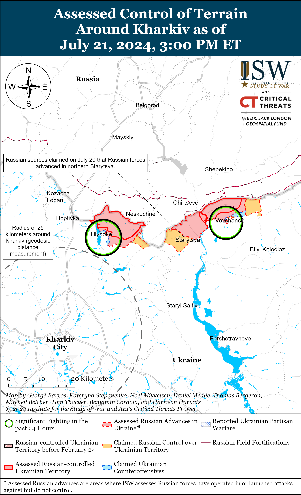
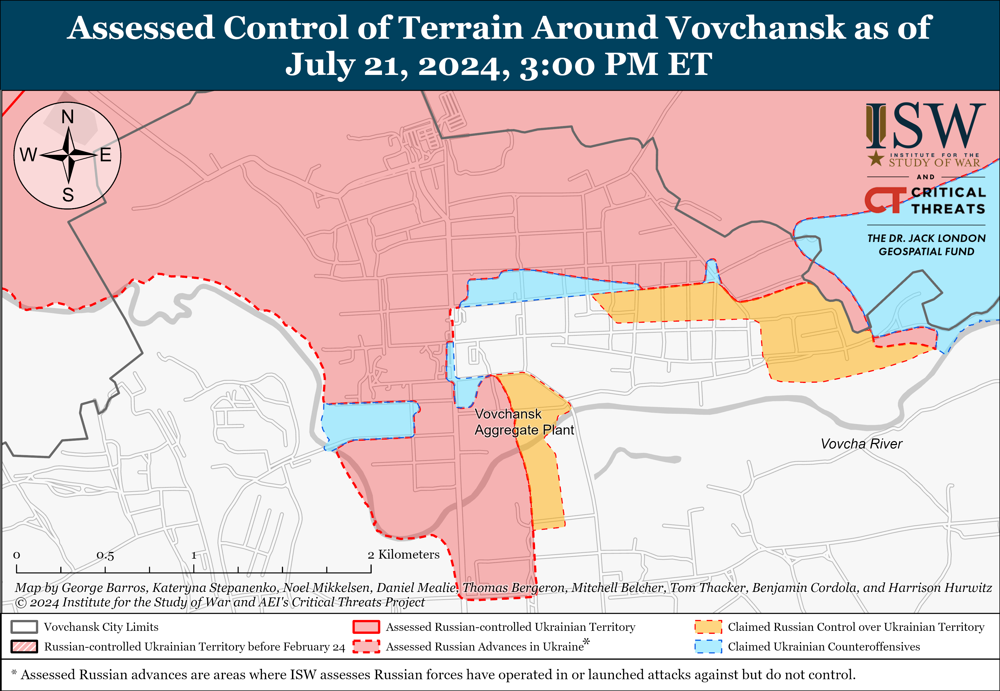
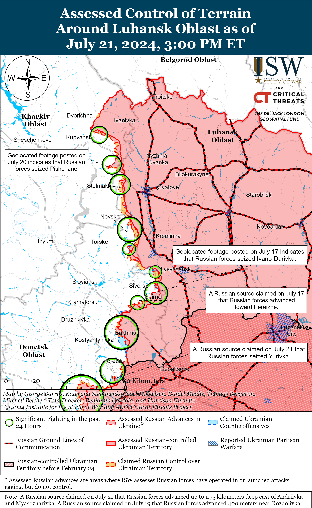
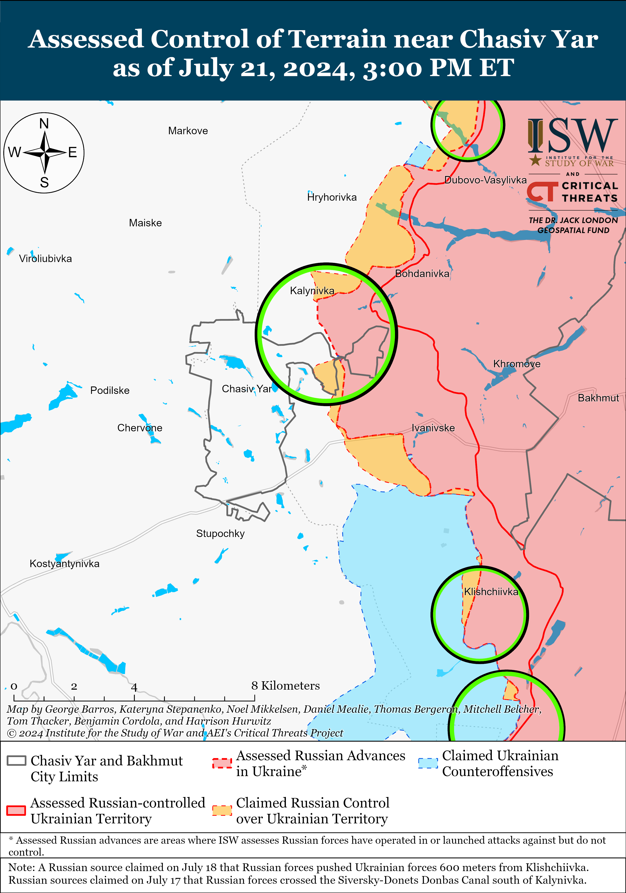
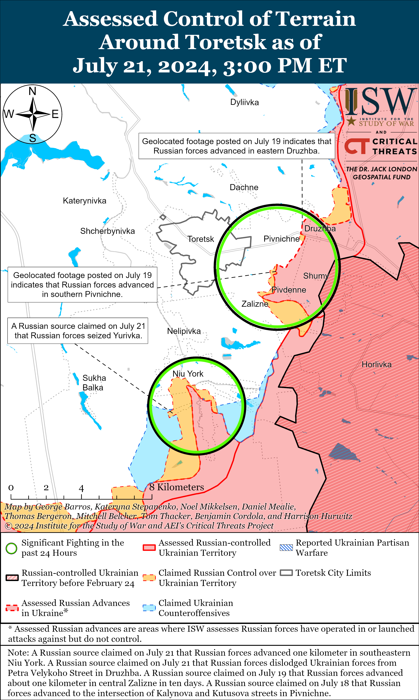
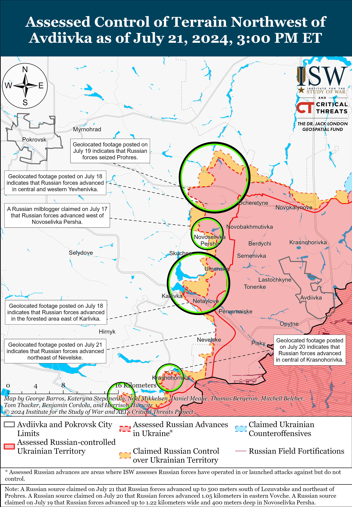
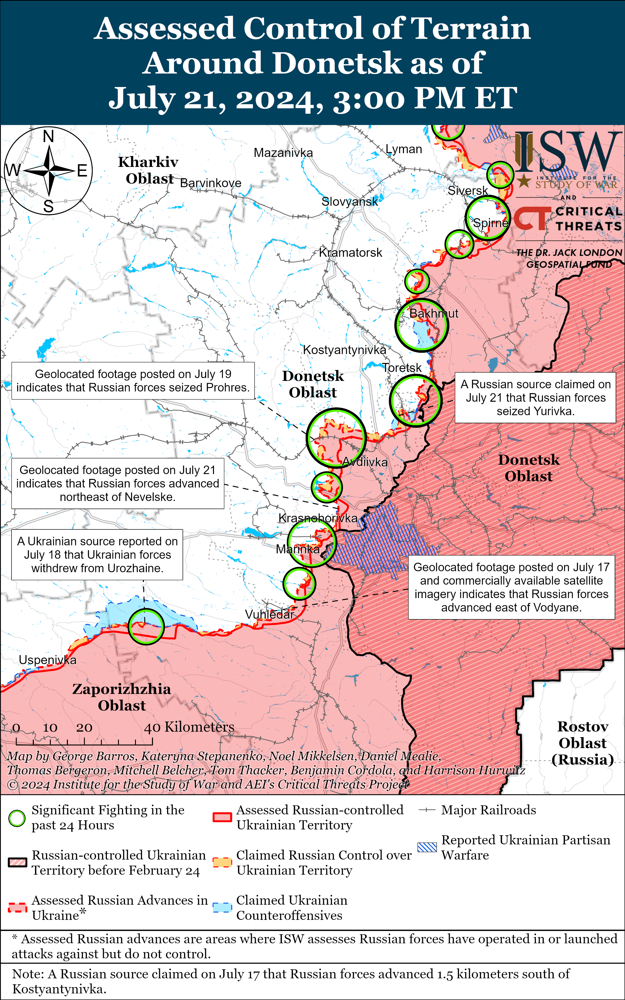
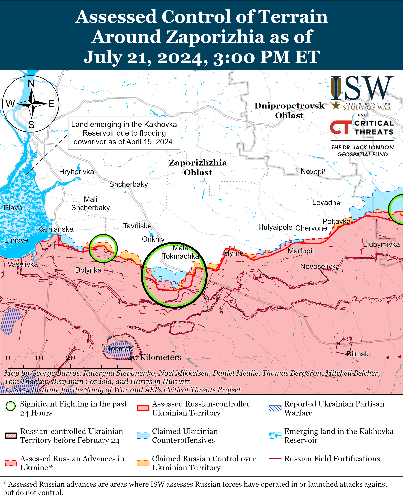
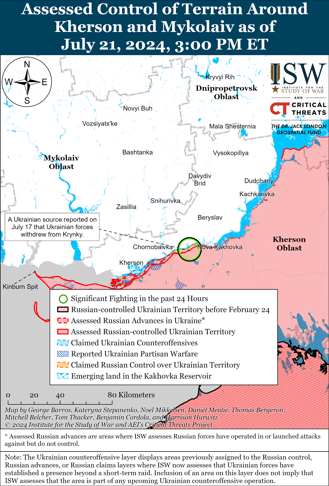

# Russian Offensive Campaign Assessment, July 21, 2024

**Nicole Wolkov, Christina Harward, Grace Mappes, Kateryna Stepanenko, and George Barros**

**July 21, 2024, 5:45pm ET**

**Click**[**here**](https://storymaps.arcgis.com/stories/36a7f6a6f5a9448496de641cf64bd375)**to see ISW’s interactive map of the Russian invasion of Ukraine. This map is updated daily alongside the static maps present in this report.**

**Click**[**here**](https://understandingwar.maps.arcgis.com/apps/instant/3dviewer/index.html?appid=1602762dbcde419bb957dea358449580)**to see ISW’s 3D control of terrain topographic map of Ukraine. Use of a computer (not a mobile device) is strongly recommended for using this data-heavy tool.**

**Click**[**here**](https://storymaps.arcgis.com/stories/733fe90805894bfc8562d90b106aa895)**to access ISW’s archive of interactive time-lapse maps of the Russian invasion of Ukraine. These maps complement the static control-of-terrain map that ISW produces daily by showing a dynamic frontline. ISW will update this time-lapse map archive monthly.**

**Note: The data cut-off for this product was 12:30pm ET on July 21. ISW will cover subsequent reports in the July 22 Russian Offensive Campaign Assessment.**

**Russian State Duma Chairperson Vyacheslav Volodin recently visited Nicaragua and Cuba, likely as part of ongoing Kremlin efforts to project its influence in the Western hemisphere and rally states against the US and the West.**Volodin met with Nicaraguan President Daniel Ortega and Vice President Rosario Murillo in Managua, Nicaragua on July 20 and relayed a message from Russian President Vladimir Putin stating that Russo-Nicaraguan relations are “developing dynamically” and that the two states’ coordination efforts in international affairs are “yielding good results.”[1] Ortega condemned Western sanctions against Russia and reiterated Kremlin narratives claiming that NATO support for Ukraine is aggravating the war. Volodin met with Cuban President Miguel Diaz-Canel in Havana, Cuba on July 21 and relayed a similar message from Putin that Russo-Cuban relations are “developing dynamically.”[2] Diaz-Canel thanked Russia for its support to end the US blockade against Cuba.[3] Volodin told journalists on July 21 that the Russian State Duma will send observers to the Venezuelan presidential election on July 28.[4] Russia has increasingly been trying to demonstrate its influence in the Western hemisphere, including by signing a memorandum of understanding with Venezuela aimed at countering “coercive measures” and conducting naval exercises near and port calls to Cuba and Venezuela in June 2024.[5] Cuba and Nicaragua were also notably among the eight Russian “ally” states that voted against a recent United Nations (UN) General Assembly resolution demanding that Russia withdraw its forces from the occupied Zaporizhzhia Nuclear Power Plant (ZNPP) and return the plant to full Ukrainian control.[6] Cuba, Nicaragua, and Venezuela have recently expressed interest in joining BRICS, and Putin has recently identified BRICS as a pillar of his envisioned “Eurasian security architecture” that is aimed at undermining NATO.[7]

**Volodin’s visits to Nicaragua and Cuba immediately followed Belarusian Prime Minister Roman Golovchenko’s visits to Venezuela, Cuba, and Nicaragua, during which Golovchenko signed multiple bilateral economic and trade agreements, possibly as part of Russian schemes that use Belarus to help Russia evade Western sanctions.** Golovchenko visited Venezuela from July 14 to 16 and met with Venezuelan officials, including Venezuelan President Nicolas Maduro.[8] Golovchenko stated that his visit aimed to discuss trade and the economic sphere and expressed Belarus’ unwavering support for Maduro.[9] Golovechenko also visited Cuba from July 16 to 17, during which he signed contracts worth “millions of dollars” to supply unspecified Belarusian goods to Cuba in exchange for Cuban exports to Belarus.[10] Golovchenko visited Nicaragua from July 18 to 19 and signed contracts worth $85 million aimed at bilateral economic cooperation, including the Belarusian Development Bank’s agreement to finance the delivery of more than 700 pieces of unspecified equipment to Nicaragua.[11] Belarus may provide goods, equipment, or technology to Nicaragua, Venezuela, and Cuba in exchange for goods that Belarus and/or Russia cannot themselves acquire due to Western sanctions.

**The Georgian State Security Service (SUS or SSSG) reportedly recently summoned several Georgian citizens who had served as volunteers alongside Ukrainian forces for questioning on charges of “conspiracy to overthrow the government” and “terrorism.”***Radio Free Europe/Radio Liberty’s* Georgian service *Ekho Kavkaza* reported on July 20 that the SUS summoned a Georgian activist and former volunteer in Ukraine, Lasha Chigladze, for questioning in the presence of a Tbilisi City Court judge on July 19.[12] Pro-ruling party Georgian Dream media outlet*Imedi TV* reported that Georgian authorities charged Chigladze with conspiracy to overthrow the government and “preparing [acts of] terrorism.”[13] Chigladze’s lawyer told Georgian opposition outlet *Mtavari TV*that he assessed that Georgian authorities summoned Chigladze because he fought in Ukraine against Russia.[14] Another Georgian citizen who volunteered alongside Ukrainian forces, Nadim Khmaladze, stated on his Facebook page on July 20 that the SUS had summoned him for questioning on charges of planning a “coup d’etat” and “terrorism.”[15] Khmaladze told Georgian outlet *Batumelebi*that the SUS summoned a third Georgian citizen who volunteered with Ukrainian forces for questioning.[16] Article 410 of Georgia’s criminal code forbids mercenarism, but Georgian authorities notably did not charge these former volunteers under that article, nor hundreds of other Georgian volunteers who have fought in support of Ukraine since 2014.[17]

The SUS previously employed standard Kremlin information operations against Georgians protesting Georgia’s Russian-style “foreign agents” bill in May 2024 and particularly blamed Georgians living abroad and fighting in Ukraine, and other perceived opposition actors for provocations and inciting protests.[18] The SUS also claimed in September 2023 that former Georgian officials, Ukrainian military intelligence officials of Georgian descent, and Georgians fighting with Ukrainian forces in Ukraine were plotting a violent coup.[19] The Kremlin routinely uses the narrative of a “violent coup” in Ukraine to misrepresent Ukraine’s Revolution of Dignity and protests for Ukrainian European integration, and the SUS’ activities increasingly mirror Kremlin rhetoric. Georgian authorities and the SUS’ decision to question and charge its citizens who have fought in Ukraine indicate that the Georgian Dream ruling party likely intends to purposefully derail long-term Georgian efforts for Euro-Atlantic integration, which plays into continued Russian hybrid operations to divide, destabilize, and weaken Georgia. A recent Caucasus Barometer (a network of affiliated research centers in Armenia, Azerbaijan, and Georgia) poll of Georgian citizens, however, indicates that 69 percent of respondents identify Russia as Georgia’s “main enemy,” and a National Democratic Institute poll of Georgian citizens published in February 2023 found that 81 percent of respondents support Georgia’s membership in the European Union (EU) and 73 percent of respondents support Georgia’s membership in NATO.[20]

**Geolocated imagery confirms that a Ukrainian drone strike damaged infrastructure at the Millerovo Airbase in Rostov Oblast overnight from July 19 to 20.****[21]**Geolocated satellite imagery collected on July 21 shows that Ukrainian strikes destroyed the Millerovo Airbase’s maintenance hangar, damaged a fuel depot, and sparked a fire in a nearby field.[22] It is unclear whether the Ukrainian drone strike damaged Russian aircraft at the Millerovo Airbase.

**Key Takeaways:**

- **Russian State Duma Chairperson Vyacheslav Volodin recently visited Nicaragua and Cuba, likely as part of ongoing Kremlin efforts to project its influence in the Western hemisphere and rally states against the US and the West.**
- **The Georgian State Security Service (SUS or SSSG) reportedly recently summoned several Georgian citizens, who had served as volunteers alongside Ukrainian forces, for questioning on charges of “conspiracy to overthrow the government” and “terrorism.”**
- **Geolocated imagery confirms that a Ukrainian drone strike damaged infrastructure at the Millerovo Airbase in Rostov Oblast overnight on July 19 to 20.**
- **Russian forces recently advanced near Avdiivka.**
- **Russian forces conducted missile and drone strikes against Ukraine overnight on July 20 to 21.**
- **Russian federal subjects are intensifying non-standard monetary incentives for contract service with the Russian military.**

[****](https://understandingwar.org/wp-content/uploads/2025/05/DraftUkraineCOTJuly212C2024.png)

***We do not report in detail on Russian war crimes because these activities are well-covered in Western media and do not directly affect the military operations we are assessing and forecasting. We will continue to evaluate and report on the effects of these criminal activities on the Ukrainian military and the Ukrainian population and specifically on combat in Ukrainian urban areas. We utterly condemn Russian violations of the laws of armed conflict and the Geneva Conventions and crimes against humanity even though we do not describe them in these reports.***

- Russian Main Effort – Eastern Ukraine (comprised of three subordinate main efforts)
- Russian Subordinate Main Effort #1 – Push Ukrainian forces back from the international border with Belgorod Oblast and approach to within tube artillery range of Kharkiv City
- Russian Subordinate Main Effort #2 – Capture the remainder of Luhansk Oblast and push westward into eastern Kharkiv Oblast and encircle northern Donetsk Oblast
- Russian Subordinate Main Effort #3 – Capture the entirety of Donetsk Oblast
- Russian Supporting Effort – Southern Axis
- Russian Air, Missile, and Drone Campaign
- Russian Mobilization and Force Generation Efforts
- Russian Technological Adaptations
- Activities in Russian-occupied areas
- Ukrainian Defense Industrial Base Efforts
- Russian Information Operations and Narratives
- Significant Activity in Belarus

**Russian Main Effort – Eastern Ukraine**

**Russian Subordinate Main Effort #1 – Kharkiv Oblast****(Russian objective: Push Ukrainian forces back from the international border with Belgorod Oblast and approach to within tube artillery range of Kharkiv City)**

Russian forces continued localized offensive operations north and northeast of Kharkiv City on July 20 and 21 but did not advance. Russian forces reportedly attacked north of Kharkiv City near Hlyboke and northeast of Kharkiv City in Vovchansk, and Ukrainian forces reportedly counterattacked near Hlyboke on July 20 and 21.[23] A Russian milblogger claimed that Russian forces are attempting to prevent Ukrainian forces from crossing the Travyanske Reservoir (northwest of Lyptsi).[24]

The Russian military command continues to reinforce Russian forces near Hlyboke and Vovchansk to sustain offensive operations in the Kharkiv direction. The Ukrainian Kharkiv Operational-Tactical Group of Forces (GoF) reported on July 21 that the Russian military command deployed additional assault groups of the 155th Naval Infantry Brigade (Pacific Fleet, Eastern Military District [EMD]) and 18th Motorized Rifle Division (11th Army Corps [AC], Baltic Fleet, Leningrad Military District [LMD]) near Hlyboke.[25] The Ukrainian Kharkiv GoF added that the Russian military command is regrouping assault groups of the Russian 41st Motorized Regiment (72nd Motorized Rifle Division, 44th AC, LMD), 1009th Motorized Rifle Regiment (6th Combined Arms Army [CAA], LMD), and 128th Separate Motorized Rifle Brigade (44th AC) to continue assaults in central and eastern Vovchansk. The Ukrainian Kharkiv GoF added that Russian forces withdrew the Russian 153rd Tank Regiment (47th Tank Division, 1st Guards Tank Army [GTA], Moscow Military District [MMD]) for reconstitution and that elements of the 128th Separate Motorized Rifle Brigade and the Chechen “Akhmat” Spetsnaz detachment assumed the regiment’s positions. The Ukrainian Kharkiv GoF reported on July 13 that the Russian command was preparing elements of the Russian 153rd Tank Regiment to launch attacks within Vovchansk.[26] A deputy commander of a Ukrainian brigade operating in the Kharkiv direction reported that Russian servicemen train for two to six weeks before deploying to the Kharkiv frontline and do not receive accurate information about the real situation on this frontline before fighting as part of the Russian assault groups.[27] A Ukrainian official amplified a screenshot of a complaint from the wife of a Russian servicemember from the 79th Motorized Rifle Regiment (18th Motorized Rifle Division), claiming that her husband is currently fighting in the Lyptsi area (north of Kharkiv City) without water and food.[28]

[](https://understandingwar.org/wp-content/uploads/2025/05/Kharkiv20Battle20Map20Draft20July20212C2024.png)

[](https://understandingwar.org/wp-content/uploads/2025/05/Vovchansk20Battle20Map20July20212C202024.png)

**Russian Subordinate Main Effort #2 – Luhansk Oblast****(Russian objective: Capture the remainder of Luhansk Oblast and push westward into eastern Kharkiv Oblast and northern Donetsk Oblast)**

Russian forces reportedly advanced along the Kupyansk-Svatove-Kreminna line, but there were no confirmed changes to the frontline in this area on July 21. The Russian Ministry of Defense (MoD) claimed that Russian forces seized Andriivka (west of Svatove) and Pishchane (northwest of Svatove).[29] ISW previously assessed on July 20 that geolocated footage indicated that Russian forces recently seized Pishchane.[30] A prominent Russian milblogger claimed on July 21, however, that Russian forces do not fully control Pishchane and that Russian forces’ presence in Andriivka is unconfirmed.[31] Russian milbloggers claimed that Russian forces also advanced further west of Pishchane, towards Stepova Novoselivka (southeast of Kupyansk), and up to 1.75 kilometers east of Andriivka and Myasozharivka (west of Svatove).[32] ISW has not observed confirmation of these Russian claims, however. Russian forces continued offensive operations northeast of Kupyansk near Synkivka; northwest of Svatove near Stelmakhivka, Hlushkivka, Pishchane, and Berestove; and west of Svatove Andriivka on July 20 and 21.[33] Elements of a Russian reconnaissance company of the 347th Motorized Rifle Regiment (47th Tank Division, 1st Guards Tank Army [GTA], Moscow Military District [MMD]) are reportedly operating in the Kupyansk direction.[34]

[](https://understandingwar.org/wp-content/uploads/2025/05/Luhansk20Battle20Map20Draft20July20212C202024.png)

**Russian Subordinate Main Effort #3 – Donetsk Oblast****(Russian objective: Capture the entirety of Donetsk Oblast, the claimed territory of Russia’s proxies in Donbas)**

Russian forces continued ground attacks in the Siversk direction on July 21 but did not make any confirmed advances in the area. The Ukrainian General Staff reported that Russian forces attacked northeast of Siversk near Bilohorivka; east of Siversk near Verkhnokamyanske; southeast of Siversk near Vyimka and Spirne; and south of Siversk near Pereizne on July 20 and 21.[35]

Russian forces continued offensive operations near Chasiv Yar on July 21, but there were no confirmed changes to the frontline. A Russian milblogger claimed that there are reports that Russian forces crossed the Siverskyi Donets-Donbas Canal on an unspecified flank of Chasiv Yar, although ISW currently assesses that Russian forces have not established enduring positions on the west side of the canal in or near Chasiv Yar.[36] Fighting continued near Chasiv Yar; north of Chasiv Yar near Novomarkove and Kalynivka; southeast of Chasiv Yar near Klishchiivka and Andriivka, and south of Chasiv Yar near Stupochky on July 20 and 21.[37] Assault elements of the Russian 88th “Hispaniola” Volunteer Brigade (Russian Volunteer Corps) claimed that they are conducting assaults near Chasiv Yar on motorcycles.[38] Elements of the Russian 98th Airborne (VDV) Division reportedly continue operating near Chasiv Yar.[39]

[](https://understandingwar.org/wp-content/uploads/2025/05/Chasiv20Yar20Battle20Map20Draft20July20212C202024.png)

Russian forces continued ground attacks near Toretsk on July 21 but did not make any confirmed advances. A prominent Kremlin-affiliated Russian milblogger claimed that Russian forces advanced south of Pivdenne Mine and Poltavska Street east of Zalizne (southeast of Toretsk), although ISW has not observed visual confirmation of these claims.[40] Another Russian milblogger claimed that Russian forces advanced up to one kilometer deep in Niu York (south of Toretsk).[41] Fighting continued east of Toretsk near Pivnichne and Druzhba; southeast of Toretsk near Zalizne and Pivdenne; and south of Toretsk near Niu York on July 20 and 21.[42]

[](https://understandingwar.org/wp-content/uploads/2025/05/Toretsk20Battle20Map20Draft20July20212C202024.png)

Russian forces recently advanced southwest of Avdiivka amid continued Russian offensive operations west of Avdiivka on July 21. Geolocated footage published on July 21 indicates that Russian forces recently advanced northeast of Nevelske (southwest of Avdiivka).[43] Russian milbloggers claimed that Russian forces advanced north of Prohres and south and up to 500 meters west of Lozuvatske (both northwest of Avdiivka), although ISW has not observed visual confirmation of these claims.[44]  Russian milbloggers claimed that Russian forces advanced in eastern Vovche and seized Novoselivka Persha (both northwest of Avdiivka), but one milblogger continued to claim that Ukrainian forces still maintain positions on the outskirts of Novoselivka Persha.[45] Fighting continued north of Avdiivka near Kalynove; northwest of Avdiivka near Vozdvyzhenka, Lozuvatske, Novooleksandrivka, Prohres, and Novoselivka Persha; and west of Avdiivka near Umanske, Yasnobrodivka, and Karlivka on July 20 and 21.[46] Elements of the Russian 1st detachment of the “Wolves” Sabotage and Reconnaissance Brigade, Vostok-V Volunteer Reconnaissance-Assault Brigade (Rosgvardia), and 116th Separate Rifle Regiment (1st Donetsk People’s Republic Army Corps [DNR AC]) are reportedly operating near Ocheretyne (northwest of Avdiivka).[47] Elements of the Russian “Black Hussars” detachment (15th Motorized Rifle Brigade, 2nd Combined Arms Army [CAA], Central Military District [CMD]), 30th Motorized Rifle Brigade (2nd AC, CMD), 27th Motorized Rifle Division (2nd CAA, CMD), and 1st “Slavic” Motorized Rifle Brigade (1st DNR AC) are reportedly operating near Prohres.[48]

[](https://understandingwar.org/wp-content/uploads/2025/05/West20of20Avdiivka20Battle20Map20Draft20July20212C202024.png)

Russian forces continued Russian offensive operations west and southwest of Donetsk City on July 21 but did not make any confirmed advances. Russian milbloggers claimed that Russian forces advanced north along Vidrodzhennya, Michurina, and Haharina streets in central Krasnohorivka (west of Donetsk City).[49] Geolocated footage published on July 21 shows Ukrainian forces repelling a Russian roughly reinforced platoon-sized mechanized assault south of Kostyantynivka (southwest of Donetsk City).[50] Fighting continued west of Donetsk City near Krasnohorivka and southwest of Donetsk City near Heorhiivka, Paraskoviivka, and Kostyantynivka on July 20 and 21.[51] Elements of the Russian 238th Artillery Brigade (8th CAA, Southern Military District [SMD]), “Grachi” Spetsnaz detachment, and 5th and 110th motorized rifle brigades (both of the 1st DNR AC) are reportedly operating near Krasnohorivka.[52] Drone operators of the Russian 39th Motorized Rifle Brigade (68th AC, Eastern Military District [EMD]) are reportedly operating near Kostyantynivka, and elements of the Russian 57th Motorized Rifle Brigade (5th CAA, EMD) are reportedly operating in the Vuheldar direction.[53]

Russian forces continued ground attacks in the Donetsk-Zaporizhia Oblast border area on July 21. The Ukrainian General Staff reported that Russian forces attacked near Staromayorske (south of Velyka Novosilka) on July 20 and 21.[54]

[](https://understandingwar.org/wp-content/uploads/2025/05/Donetsk20Battle20Map20Draft20July20212C202024.png)

**Russian Supporting Effort – Southern Axis****(Russian objective: Maintain frontline positions and secure rear areas against Ukrainian strikes)**

Positional engagements continued in western Zaporizhia Oblast near Robotyne, northeast of Robotyne near Mala Tokmachka, north of Robotyne near Novodanylivka, and northwest of Robotyne near Shcherbaky on July 20 and 21.[55]

Positional engagements continued in east (left) bank Kherson Oblast, including near Krynky and Kozachi Laheri, on July 20 and 21.[56] Russian milbloggers claimed that Russian forces are clearing unspecified islands in the Dnipro River Delta and that Ukrainian forces maintain positions near Kruhlyk Lake (west of Oleshky).[57]

[](https://understandingwar.org/wp-content/uploads/2025/05/Kherson-Mykolaiv20Battle20Map20Draft20July20212C202024.png)

Russian sources claimed that Ukrainian forces conducted a drone and ATACMS strikes against occupied Crimea on the night of July 20 to 21 and on the morning of July 21. The Russian Ministry of Defense (MoD) claimed that Russian forces destroyed five drones over the Black Sea, and Kherson Oblast occupation head Vladimir Saldo claimed that Russian forces intercepted two ATACMS missiles flying towards occupied Crimea on the morning of July 21.[58]

**Russian Air, Missile, and Drone Campaign****(Russian Objective: Target Ukrainian military and civilian infrastructure in the rear and on the frontline)**

Russian forces conducted missile and drone strikes against Ukraine overnight on July 20 to 21. Ukrainian Air Force Commander Lieutenant General Mykola Oleshchuk stated that Russian forces launched 39 Shahed 136/131 drones from the Kursk, Primorsko-Akhtarsk, and occupied Crimea directions and three Iskander-M ballistic missiles and two Kh-59/69 cruise missiles from Kursk Oblast overnight.[59] Oleshchuk stated that Ukrainian forces shot down 35 Shaheds and that unspecified Ukrainian countermeasures, likely referring to electronic warfare (EW), prevented the Kh-59/69 missiles from striking their targets.[60] The Sumy Oblast Military Administration reported that a Russian missile strike damaged critical infrastructure in Shostkynskyi Raion, Sumy Oblast, and the Mykolaiv Oblast Military Administration reported that a Russian missile strike started a fire at an agricultural infrastructure object in Bashtanskyi Raion, Mykolaiv Oblast.[61] Kyiv City Military Administration reported that Russian forces targeted Kyiv for the fifth time over the past two weeks but that Ukrainian forces shot down all drones on the approaches to the city.[62]

Ukrainian sources reported that Russian forces used a new type of strike drone in strikes against Ukraine overnight on July 19 to 20. Ukrainian media outlets circulated imagery of drone wreckage and claimed that this is the unspecified strike drone that Ukrainian officials reported on July 20.[63] Ukrainian media cited unspecified sources as saying this drone flew at a low altitude of only 20-30 meters and speculated that the drone resembles the Russian ZALA 421-20 reconnaissance drone.[64] One Ukrainian source claimed that this new Russian drone contains both Russian and Chinese-produced parts.[65] ISW remains unable to verify any of these reports, however.

**Russian Mobilization and Force Generation Efforts****(Russian objective: Expand combat power without conducting general mobilization)**

Russian federal subjects are intensifying non-standard monetary incentives for contract service with the Russian military. Yaroslavl Oblast Head Mikhail Yevraev announced on July 16 a new initiative offering 100,000 rubles (about $1,150) to any person who brings a friend to a military registration and recruitment center if the friend signs a contract with the Russian Ministry of Defense (MoD) for military service.[66] The Republic of Tatarstan also started a similar initiative as of July 11.[67] Russian State Duma Committee on State Construction and Legislation Deputy Chairperson Yuri Sinelshchikov stated that this new recruitment mechanism is risky and that Russians can abuse this system, especially if other federal subjects adopt similar mechanisms.[68] Sinelshchikov called for this mechanism to be codified in Russian legal regulations and expressed concern about whether Russian federal subjects can sustain funding for such initiatives. Russian opposition source*Cherta*reported that some Russians are signing contracts to earn money to pay off gambling debts after interviewing several gamblers and their families.[69]

Russian forces are reportedly developing and formalizing a military motorcycle specialty, likely in response to increased Ukrainian drone strikes and aerial reconnaissance forcing Russian forces to use small and fast vehicles for frontline logistics and transport. A Russian milblogger claimed on July 21 that the Russian 5th Motorized Rifle Brigade (1st Donetsk People’s Republic Army Corps [DNR AC]) is establishing its own military motorcycle school and that other Russian brigades are similarly handling this issue “at a high level.”[70] The milblogger claimed that Russian forces also plan to introduce a military motorcycle specialty and that the Russian Volunteer Society for Assistance to the Army, Aviation, and Navy of Russia (DOSAAF) will begin training motorcycle specialists on October 1.[71]

**Russian Technological Adaptations****(Russian objective: Introduce technological innovations to optimize systems for use in Ukraine)** 

Tikhiye Krylya (Quiet Wings) Group, a subsidiary of Russian joint-stock arms manufacturing company Kalashnikov Concern, claimed on July 17 that it successfully tested the “Legionnaire E33k” unmanned aircraft that can deliver cargo.[72] The Legionnaire E33k reportedly weighs 29.9 kilograms, has a wingspan of four meters, has a range of 200 kilometers with a payload of three kilograms and 50 kilometers with a payload of 10 kilograms, and can fly for up to 150 minutes (2 and a half hours).

**Ukrainian Defense Industrial Efforts (Ukrainian objective: Develop its defense industrial base to become more self-sufficient in cooperation with US, European, and international partners)**

*ISW is not publishing coverage of Ukrainian defense industrial efforts today.*

**Activities in Russian-occupied areas****(Russian objective: Consolidate administrative control of annexed areas; forcibly integrate Ukrainian citizens into Russian sociocultural, economic, military, and governance systems)**

*ISW is not publishing coverage of activities in Russian-occupied areas today.*

**Russian Information Operations and Narratives**

Ukrainian broadcaster *Suspilne* and Russian online technology outlet *Kod Durova* reported on July 21 that unknown hackers distributed an identical message with pro-Kremlin narratives and a call for Ukrainian forces to lay down their arms across 273 prominent Ukrainian Telegram channels.[73] The message accused Ukrainian President Volodymyr Zelensky of starting the war with Russia and re-amplified a false Russian narrative that Ukraine’s First Lady Olena Zelenska purchased a luxury sports car. The message called on Ukrainians to “lay down [their] arms” and “choose the path of dialogue and understanding.” Ukrainian media consultant Igor Palchikovsky told *Suspilne* that the message appeared on several prominent Ukrainian Telegram channels with over one million followers each and on Ukrainian regional Telegram channels. Palchikovsky added that this message appeared across 1,964 Telegram channels, most of which were Russian Telegram channels, but that the affected Ukrainian channels had large followings while the affected Russian channels had small audiences. *Kod Durova*found that the message largely targeted Ukrainian Telegram channels, however.[74] An official Telegram channel of the Russian Airborne (VDV) and Spetsnaz forces (1.1 million followers) claimed that hackers posted the same message on their page via the Russian “FleepBot” and “Crosser Bot” Telegram bots, which are used for auto-posting and audience interaction analysis, respectively.[75] The Ukrainian State Service of Special Communications and Information Protection announced that hackers used the FleepBot function and advised Ukrainian Telegram channels to remove the bot.[76] FleepBot representatives claimed that the incident was the result of “unauthorized access” and promised to contact law enforcement.[77] *Kod Durova*reported that a similar incident occurred in March 2022 with Crosser Bot.

Russian state media is likely attempting to establish a network of claimed pro-Russian voices in Ukraine to erode public trust in the Ukrainian government and demoralize Ukrainian society. Kremlin newswire *TASS* interviewed an alleged member of the pro-Russian underground movement in Ukraine who amplified several false Kremlin claims, such as the presence of Western mercenaries in different Ukrainian regions, ungrounded accusations of Ukrainian forces committing crimes against civilians, and narratives about domestic and mobilization problems.[78] The Kremlin may be attempting to infiltrate the Ukrainian information space with such claimed Ukrainian, pro-Russian narratives.

Kremlin state media continues to deliberately misrepresent Zelensky’s discussions about the second Global Peace Summit and possible talks with Russia on the condition of the Kremlin’s serious considerations of Ukrainian demands as a violation of Ukrainian laws against talks with Russia.[79] *TASS*claimed that Zelensky stated in a *BBC* interview that Ukraine could negotiate with Russia and claimed that a Ukrainian decree previously banned such negotiations. The Kremlin state media is deliberately misrepresenting Zelensky and the Ukrainian government’s statements to suggest that the Ukrainian government is violating Ukrainian laws and the will of the Ukrainian people.

**Significant activity in Belarus****(Russian efforts to increase its military presence in Belarus and further integrate Belarus into Russian-favorable frameworks and Wagner Group activity in Belarus)**

Nothing significant to report.

**Note: ISW does not receive any classified material from any source, uses only publicly available information, and draws extensively on Russian, Ukrainian, and Western reporting and social media as well as commercially available satellite imagery and other geospatial data as the basis for these reports. References to all sources used are provided in the endnotes of each update.**

---

[1] https://t.me/MID\_Russia/43382

[2] https://t.me/MID\_Russia/43388; https://tass dot ru/politika/21412007

[3] https://t.me/MID\_Russia/43388

[4] https://www.interfax dot ru/world/971759

[5] https://isw.pub/UkrWar062524; ] https://understandingwar.org/backgrounder/russian-offensive-campaign-assessment-june-6-2024; https://abcnews.go.com/Business/wireStory/russian-warships-leave-havanas-port-after-5-day-111192438

[6] https://isw.pub/UkrWar071224

[7] https://tass dot ru/mezhdunarodnaya-panorama/21078215 ; https://ria dot ru/20240607/nikaragua-1951373387.html ; https://tass dot ru/mezhdunarodnaya-panorama/20878267; https://understandingwar.org/backgrounder/russian-offensive-campaign-assessment-june-21-2024 ; https://understandingwar.org/backgrounder/russian-offensive-campaign-assessment-july-3-2024   ; https://understandingwar.org/backgrounder/russian-offensive-campaign-assessment-june-14-2024

[8] https://www.belta dot by/society/view/golovchenko-na-vstreche-s-ministrom-inostrannyh-del-venesuely-etot-vizit-dlja-nas-osobennyj-647801-2024/; https://www.belta dot by/society/view/golovchenko-belarus-i-venesuela-ne-tolko-realizujut-prezhnie-dogovorennosti-no-i-vyjdut-na-novye-648122-2024/; https://www.belta dot by/politics/view/golovchenko-pribyl-v-venesuelu-647774-2024/ ; https://www.belta dot by/society/view/golovchenko-obsudil-s-prezidentom-venesuely-razvitie-stran-v-uslovijah-sektsionnogo-davlenija-648099-2024/

[9] https://www.belta dot by/society/view/golovchenko-na-vstreche-s-ministrom-inostrannyh-del-venesuely-etot-vizit-dlja-nas-osobennyj-647801-2024/

[10] https://belta dot by/society/view/golovchenko-pribyl-s-ofitsialnym-vizitom-na-kubu-648360-2024/; https://www.belta dot by/economics/view/golovchenko-nesmotrja-na-slozhnosti-izyskali-vozmozhnosti-dlja-postavok-belorusskoj-produktsii-na-kubu-649435-2024/

[11] https://belta dot by/economics/view/kontrakty-na-85-mln-podpisany-vo-vremja-vizita-golovchenko-v-nikaragua-648961-2024/; https://belta dot by/society/view/golovchenko-pribyl-s-ofitsialnym-vizitom-v-nikaragua-648680-2024

[12] https://www.ekhokavkaza dot com/a/sgb-nachala-vyzyvatj-na-oprosy-gruzinskih-dobrovoljtsev-voevavshih-v-ukraine/33044220.html

[13] https://www.facebook.com/watch/?v=1698943197592613 ; https://www.ekhokavkaza dot com/a/sgb-nachala-vyzyvatj-na-oprosy-gruzinskih-dobrovoljtsev-voevavshih-v-ukraine/33044220.html

[14] https://mtavari dot tv/news/161459-zedapiruli-kitkhvebi-iqo-tvalshi-vechkhirebit ; https://www.ekhokavkaza dot com/a/sgb-nachala-vyzyvatj-na-oprosy-gruzinskih-dobrovoljtsev-voevavshih-v-ukraine/33044220.html

[15] https://www.facebook.com/N.D.khmala/posts/pfbid02qTojnTT3mHpLq7nzK6sqeeDYp31tHm9LtbqZ4AkT7imYMggFNhHQks24DTnFB3c9l ; https://www.ekhokavkaza dot com/a/sgb-nachala-vyzyvatj-na-oprosy-gruzinskih-dobrovoljtsev-voevavshih-v-ukraine/33044220.html

[16] https://batumelebi dot netgazeti.ge/slideshow/536072/

[17] https://matsne.gov dot ge/en/document/view/16426?publication=262

[18] https://www.facebook.com/sssgeo/posts/pfbid02pprPC9JTY6t2ATZYxGRVTyRNh9RxPtHp4qmo4nhM6ywKeec48DUxNYxBXtveMX2cl ; https://www.ekhokavkaza dot com/a/32937747.html ; https://understandingwar.org/backgrounder/russian-offensive-campaign-assessment-may-8-2024

[19] https://www.radiotavisupleba dot ge/a/32597360.html ; https://understandingwar.org/backgrounder/russian-offensive-campaign-assessment-may-8-2024

[20] https://www.caucasusbarometer.org/en/cb2024ge/MAINENEM/ ; https://www.svoboda dot org/a/opros-pochti-70-gruzin-nazvali-rossiyu-vragom-svoey-strany-/33044801.html ; https://www.ndi.org/publications/ndi-poll-eu-membership-support-increases-indicating-georgians-unwavering-support

[21] https://x.com/kromark/status/1815026901510946821; https://x.com/kromark/status/1814912166589304847; https://understandingwar.org/backgrounder/russian-offensive-campaign-assessment-july-20-2024

[22] https://x.com/kromark/status/1815026901510946821; https://x.com/kromark/status/1814912166589304847

[23] https://www.facebook.com/GeneralStaff.ua/posts/pfbid0Au5MU5GB6eLZN2ziHC9JgUoXNmeTUVVEaFhDMkjD3LKyDdC8WC4DgVR476PX9jVSl; https://www.facebook.com/GeneralStaff.ua/posts/pfbid0QdYaG8YXhNo1njMSmQ13roUimEkqybycqqDtXoVErkMesDhfzGhvdstrTekjTMkQl https://t.me/synegubov/10444; https://www.facebook.com/GeneralStaff.ua/posts/pfbid0zrSQjcrNpEKV1gn7HWpxqKCVQi3GmhAt9e9pUG4vB2efSctBRpagi1f11wkvYwCZl; https://t.me/wargonzo/21128; https://t.me/DnevnikDesantnika/12931 ; https://t.me/RVvoenkor/72890

[24] https://t.me/DnevnikDesantnika/12931

[25] https://t.me/otukharkiv/310

[26] https://understandingwar.org/backgrounder/russian-offensive-campaign-assessment-july-13-2024

[27] https://armyinform dot com.ua/2024/07/21/zastupnyk-komandyra-3-yi-shturmovoyi-rozpoviv-hto-proty-nyh-voyuye-na-harkivskomu-napryamku/

[28] https://t.me/andriyshTime/24896?single

[29] https://t.me/mod\_russia/41241

[30] https://understandingwar.org/backgrounder/russian-offensive-campaign-assessment-july-20-2024

[31] https://t.me/rybar/61960

[32] https://t.me/RVvoenkor/72890; https://t.me/motopatriot/25187

[33] https://www.facebook.com/GeneralStaff.ua/posts/pfbid0Au5MU5GB6eLZN2ziHC9JgUoXNmeTUVVEaFhDMkjD3LKyDdC8WC4DgVR476PX9jVSl; https://www.facebook.com/GeneralStaff.ua/posts/pfbid0QdYaG8YXhNo1njMSmQ13roUimEkqybycqqDtXoVErkMesDhfzGhvdstrTekjTMkQl; https://www.facebook.com/GeneralStaff.ua/posts/pfbid0zrSQjcrNpEKV1gn7HWpxqKCVQi3GmhAt9e9pUG4vB2efSctBRpagi1f11wkvYwCZl; https://t.me/rybar/61960

[34] https://t.me/belarusian\_silovik/38021; https://t.me/dva\_majors/47737 ; https://t.me/boris\_rozhin/130719; https://t.me/epoddubny/20456 ; https://t.me/brussinf/7790

[35] https://www.facebook.com/GeneralStaff.ua/posts/pfbid0Au5MU5GB6eLZN2ziHC9JgUoXNmeTUVVEaFhDMkjD3LKyDdC8WC4DgVR476PX9jVSl ; https://www.facebook.com/GeneralStaff.ua/posts/pfbid0QdYaG8YXhNo1njMSmQ13roUimEkqybycqqDtXoVErkMesDhfzGhvdstrTekjTMkQl ; https://www.facebook.com/GeneralStaff.ua/posts/pfbid0zrSQjcrNpEKV1gn7HWpxqKCVQi3GmhAt9e9pUG4vB2efSctBRpagi1f11wkvYwCZl

[36] https://t.me/motopatriot/25177

[37] https://www.facebook.com/GeneralStaff.ua/posts/pfbid0Au5MU5GB6eLZN2ziHC9JgUoXNmeTUVVEaFhDMkjD3LKyDdC8WC4DgVR476PX9jVSl ; https://www.facebook.com/GeneralStaff.ua/posts/pfbid0QdYaG8YXhNo1njMSmQ13roUimEkqybycqqDtXoVErkMesDhfzGhvdstrTekjTMkQl ; https://www.facebook.com/GeneralStaff.ua/posts/pfbid0zrSQjcrNpEKV1gn7HWpxqKCVQi3GmhAt9e9pUG4vB2efSctBRpagi1f11wkvYwCZl ; https://t.me/RVvoenkor/72876 ;

[38] https://t.me/spainrus/1463 ; https://x.com/666\_mancer/status/1815018565793206450

[39] https://t.me/rusich\_army/15943 ; https://t.me/DnevnikDesantnika/12916 ; https://t.me/motopatriot/25173 ; https://t.me/EnotHersonVDV/3334

[40] https://t.me/rybar/61968

[41] https://t.me/DnevnikDesantnika/12929

[42] https://www.facebook.com/GeneralStaff.ua/posts/pfbid0Au5MU5GB6eLZN2ziHC9JgUoXNmeTUVVEaFhDMkjD3LKyDdC8WC4DgVR476PX9jVSl ; https://www.facebook.com/GeneralStaff.ua/posts/pfbid0QdYaG8YXhNo1njMSmQ13roUimEkqybycqqDtXoVErkMesDhfzGhvdstrTekjTMkQl ; https://www.facebook.com/GeneralStaff.ua/posts/pfbid0zrSQjcrNpEKV1gn7HWpxqKCVQi3GmhAt9e9pUG4vB2efSctBRpagi1f11wkvYwCZl ; https://t.me/RVvoenkor/72870 ; https://t.me/wargonzo/21128

[43] https://t.me/creamy\_caprice/6128; https://t.me/Khortytsky\_wind/754

[44] https://t.me/z\_arhiv/27352 ; https://t.me/RVvoenkor/72890

[45] https://t.me/RVvoenkor/72868 ; https://t.me/wargonzo/21128 ; https://t.me/voenkorKotenok/57670 ; https://t.me/NgP\_raZVedka/18426 ; https://t.me/NgP\_raZVedka/18423

[46] https://www.facebook.com/GeneralStaff.ua/posts/pfbid0Au5MU5GB6eLZN2ziHC9JgUoXNmeTUVVEaFhDMkjD3LKyDdC8WC4DgVR476PX9jVSl ; https://www.facebook.com/GeneralStaff.ua/posts/pfbid0QdYaG8YXhNo1njMSmQ13roUimEkqybycqqDtXoVErkMesDhfzGhvdstrTekjTMkQl ; https://www.facebook.com/GeneralStaff.ua/posts/pfbid0zrSQjcrNpEKV1gn7HWpxqKCVQi3GmhAt9e9pUG4vB2efSctBRpagi1f11wkvYwCZl ; https://t.me/DnevnikDesantnika/12930 ; https://t.me/wargonzo/21128 ; https://t.me/voenkorKotenok/57670

[47] https://t.me/boris\_rozhin/130698

[48] https://t.me/motopatriot/25159 ; https://t.me/voenkorkhayrullin/2950 ; https://t.me/motopatriot/25184 ; https://t.me/NgP\_raZVedka/18424

[49] https://t.me/rybar/61954 ; https://t.me/RVvoenkor/72874 ; https://t.me/RVvoenkor/72890 ; https://t.me/wargonzo/21128

[50] https://x.com/klinger66/status/1814997212335604019; https://x.com/PuenteUribarri/status/1814989050501042438

[51] https://www.facebook.com/GeneralStaff.ua/posts/pfbid0Au5MU5GB6eLZN2ziHC9JgUoXNmeTUVVEaFhDMkjD3LKyDdC8WC4DgVR476PX9jVSl ; https://www.facebook.com/GeneralStaff.ua/posts/pfbid0QdYaG8YXhNo1njMSmQ13roUimEkqybycqqDtXoVErkMesDhfzGhvdstrTekjTMkQl ; https://www.facebook.com/GeneralStaff.ua/posts/pfbid0zrSQjcrNpEKV1gn7HWpxqKCVQi3GmhAt9e9pUG4vB2efSctBRpagi1f11wkvYwCZl ; https://t.me/rybar/61954

[52] https://t.me/boris\_rozhin/130682 ; https://t.me/Sladkov\_plus/11035

[53] https://t.me/voin\_dv/9853 ; https://t.me/voin\_dv/9858

[54] https://www.facebook.com/GeneralStaff.ua/posts/pfbid0zrSQjcrNpEKV1gn7HWpxqKCVQi3GmhAt9e9pUG4vB2efSctBRpagi1f11wkvYwCZl ; https://www.facebook.com/GeneralStaff.ua/posts/pfbid0QdYaG8YXhNo1njMSmQ13roUimEkqybycqqDtXoVErkMesDhfzGhvdstrTekjTMkQl

[55] https://www.facebook.com/GeneralStaff.ua/posts/pfbid0Au5MU5GB6eLZN2ziHC9JgUoXNmeTUVVEaFhDMkjD3LKyDdC8WC4DgVR476PX9jVSl; https://www.facebook.com/GeneralStaff.ua/posts/pfbid0QdYaG8YXhNo1njMSmQ13roUimEkqybycqqDtXoVErkMesDhfzGhvdstrTekjTMkQl ; https://www.facebook.com/GeneralStaff.ua/posts/pfbid0zrSQjcrNpEKV1gn7HWpxqKCVQi3GmhAt9e9pUG4vB2efSctBRpagi1f11wkvYwCZl

[56] https://www.facebook.com/GeneralStaff.ua/posts/pfbid0QdYaG8YXhNo1njMSmQ13roUimEkqybycqqDtXoVErkMesDhfzGhvdstrTekjTMkQl; https://www.facebook.com/GeneralStaff.ua/posts/pfbid0zrSQjcrNpEKV1gn7HWpxqKCVQi3GmhAt9e9pUG4vB2efSctBRpagi1f11wkvYwCZl; https://t.me/SJTF\_Odes/10604

[57] https://t.me/motopatriot/25142; https://t.me/motopatriot/25151; https://t.me/russian\_airborne/6533 ; https://t.me/voin\_dv/9846; https://t.me/DnevnikDesantnika/12920

[58] https://t.me/mod\_russia/41228; https://t.me/SALDO\_VGA/3825

[59] https://t.me/ComAFUA/352 ; https://armyinform dot com.ua/2024/07/21/syly-ppo-zbyly-vnochi-35-shahediv/ ; https://www.facebook.com/GeneralStaff.ua/posts/pfbid0igDR4VvZBzJyE3mW7nsPJ6ty6rXYpuoGZtx4dAcqkTmb1QRLc5edjuuozGn3nNz8l ;

[60] https://t.me/ComAFUA/352 ; https://armyinform dot com.ua/2024/07/21/syly-ppo-zbyly-vnochi-35-shahediv/ ; https://www.facebook.com/GeneralStaff.ua/posts/pfbid0igDR4VvZBzJyE3mW7nsPJ6ty6rXYpuoGZtx4dAcqkTmb1QRLc5edjuuozGn3nNz8l ;

[61] https://t.me/mykolaivskaODA/10664; https://t.me/mykolaivskaODA/10664

[62] https://t.me/VA\_Kyiv/7008 ; https://armyinform dot com.ua/2024/07/21/vorog-vnochi-atakuvav-kyyiv-udarnymy-bpla-vsi-zbyti-na-pidstupah-do-stolyczi/; https://t.me/kyivoda/18819

[63] https://t.me/bbcrussian/68000 ; https://t.me/defenseexpress\_ua/7730; https://t.me/war\_home/2032; https://mil.in dot ua/uk/news/na-kyyivshhyni-zbyly-udarnyj-dron-novogo-typu/

[64] https://t.me/bbcrussian/68000 ; https://t.me/defenseexpress\_ua/7730; https://t.me/war\_home/2032; https://mil.in dot ua/uk/news/na-kyyivshhyni-zbyly-udarnyj-dron-novogo-typu/

[65] https://t.me/war\_home/2032;

[66] https://sevastopol dot su/news/gubernator-poobeschal-platit-za-privlechenie-kontraktnikov-100-tysyach-rubley

[67] https://understandingwar.org/backgrounder/russian-offensive-campaign-assessment-july-11-2024; https://www.marimedia dot ru/news/army/item/175258/; https://pg12 dot ru/news/83469

[68] https://www.penzainform dot ru/news/global/2024/07/12/v\_gosdume\_ukazali\_na\_risk\_v\_idee\_viplat\_za\_privedennih\_v\_voenkomat\_blizkih.html

[69] https://t.me/mobilizationnews/19500

[70] https://t.me/Sladkov\_plus/11036

[71] https://t.me/Sladkov\_plus/11036

[72] https://kalashnikovgroup dot ru/news/kalashnikov-\_provel\_pokazatelnye\_polety\_samoleta\_-legioner\_e33k

[73] https://suspilne dot media/795165-ataka-na-ukrainski-energoobekti-svitlo-vidklucatimut-vprodovz-dobi-878-den-vijni-onlajn/?anchor=live\_1721559282&utm\_source=copylink&utm\_medium=ps; https://suspilne dot media/kharkiv/795365-zaklik-sklasti-zbrou-nizku-ukrainskih-telegram-kanaliv-zlamali-ekspert-poasniv-ak-ce-stalosa/; https://meduza dot io/news/2024/07/21/hakery-poluchili-dostup-k-sotnyam-ukrainskih-telegram-kanalov-i-opublikovali-soobscheniya-s-prizyvom-slozhit-oruzhie ; https://t.me/sotaproject/83777; https://t.me/astrapress/60116

[74] https://t.me/d\_code/19711

[75] https://t.me/rusich\_army/15939

[76] https://www.facebook.com/dsszzi/posts/pfbid02mF4rMWjD8PhpYgErTrsZSLLtbJz3s5smqqJXMEzzVEe93BvbdMsE3RiLYMgYBPuKl

[77] https://t.me/fleepnews/313

[78] https://t.me/tass\_agency/261738; https://t.me/tass\_agency/261744; https://t.me/tass\_agency/261747; https://t.me/tass\_agency/261755 

[79] https://t.me/tass\_agency/261785
