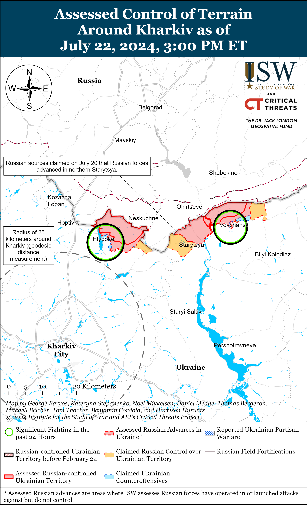
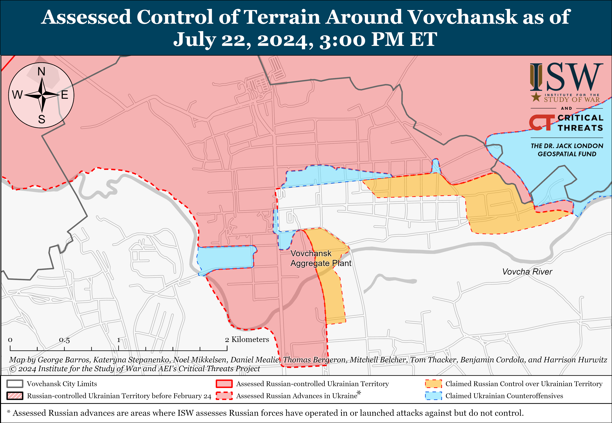
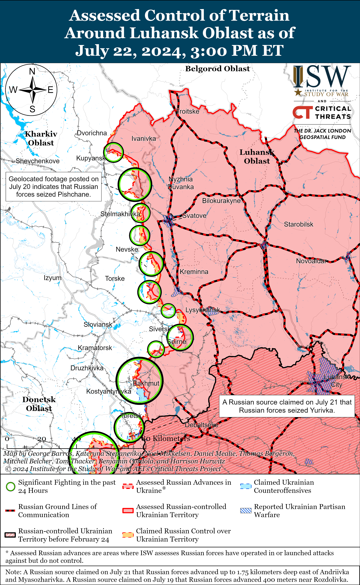
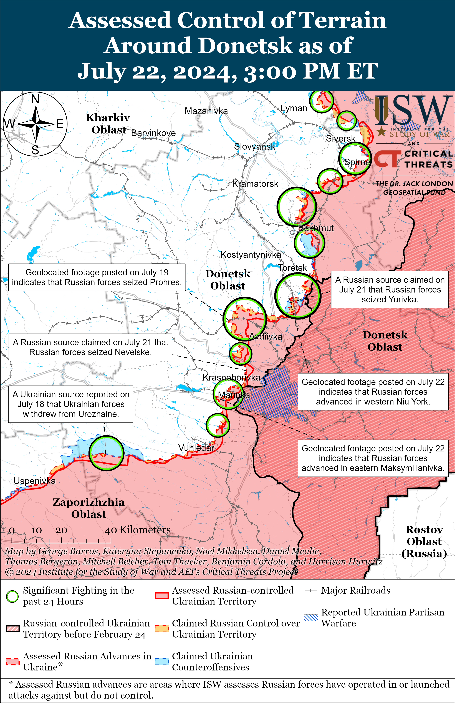
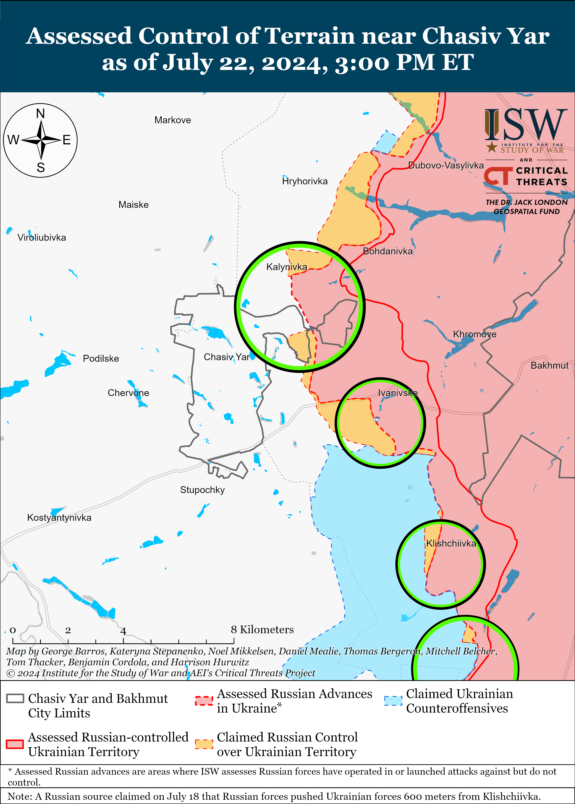
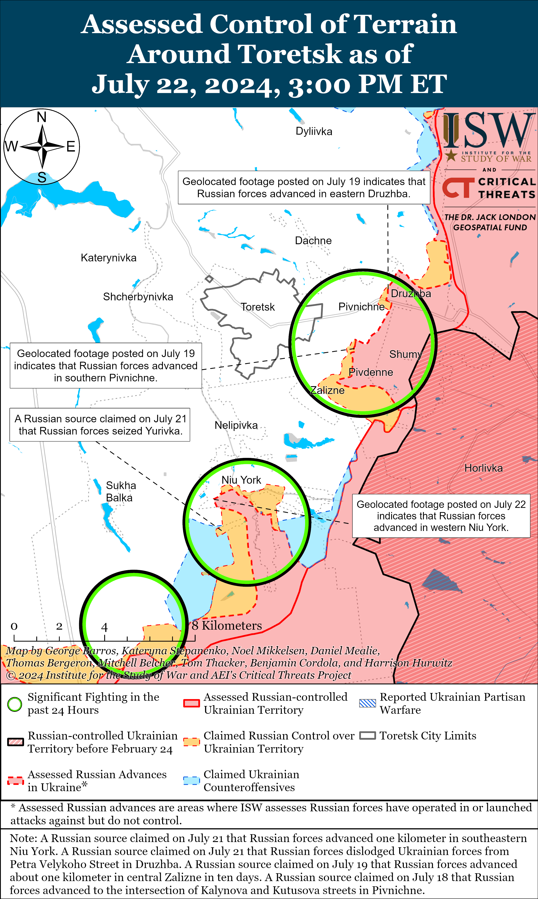
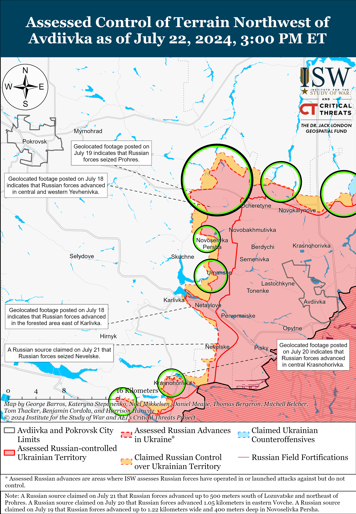
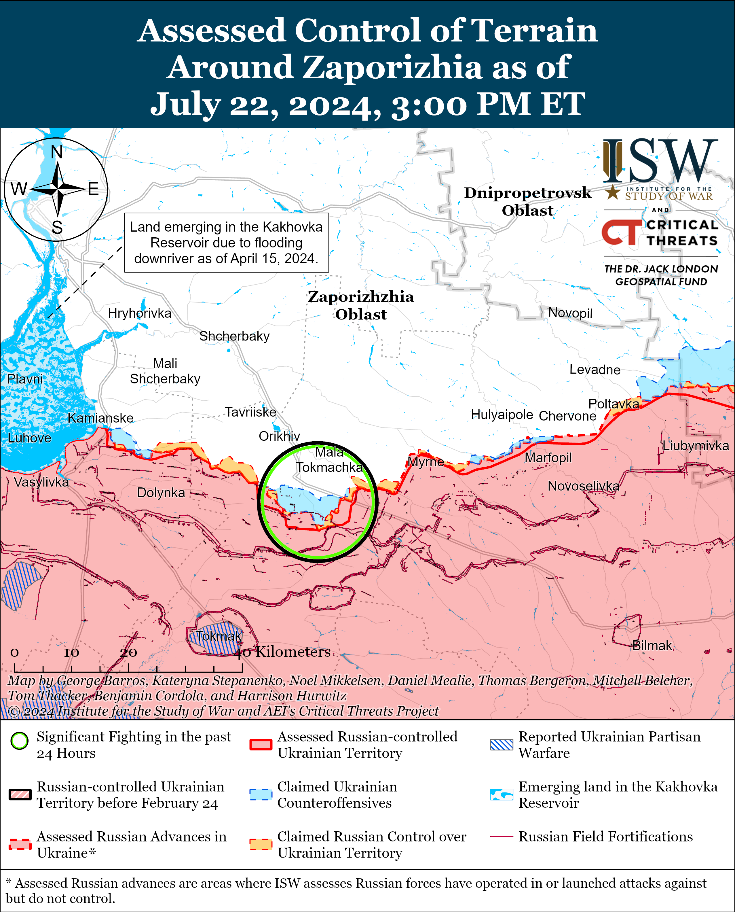
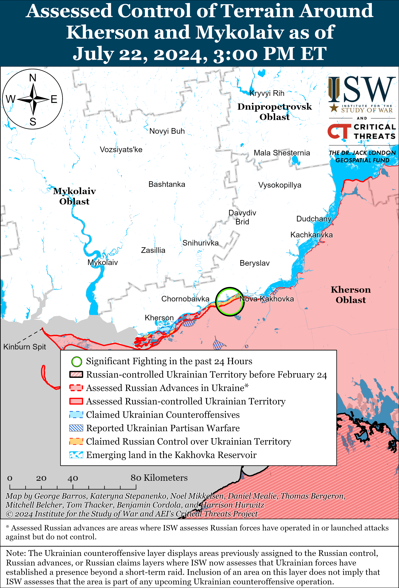

# Russian Offensive Campaign Assessment, July 22, 2024

**Grace Mappes, Karolina Hird, Christina Harward, Nicole Wolkov, Davit Gasparyan, and George Barros**

**July 22, 2024, 7:30pm ET**

**Click**[**here**](https://storymaps.arcgis.com/stories/36a7f6a6f5a9448496de641cf64bd375)**to see ISW’s interactive map of the Russian invasion of Ukraine. This map is updated daily alongside the static maps present in this report.**

**Click**[**here**](https://understandingwar.maps.arcgis.com/apps/instant/3dviewer/index.html?appid=1602762dbcde419bb957dea358449580)**to see ISW’s 3D control of terrain topographic map of Ukraine. Use of a computer (not a****mobile device) is strongly recommended for using this data-heavy tool.**

**Click**[**here**](https://storymaps.arcgis.com/stories/733fe90805894bfc8562d90b106aa895)**to access ISW’s archive of interactive time-lapse maps of the Russian invasion of Ukraine. These maps complement the static control-of-terrain map that ISW produces daily by showing a dynamic frontline. ISW will update this time-lapse map archive monthly.**

**Note: The data cut-off for this product was 1:30pm ET on July 22. ISW will cover subsequent reports in the July 23 Russian Offensive Campaign Assessment.**

**Russia and North Korea are pursuing increased cooperation in the judicial sphere.**Russian Prosecutor General Igor Krasnov arrived in Pyongyang, North Korea and met with his North Korean counterpart Kim Chol Won on July 22, marking the first time that a Russian Prosecutor General has visited North Korea.[1] Krasnov and Kim reportedly discussed avenues for continued cooperation and signed an agreement for joint work between the Russian and North Korean prosecutor generals’ offices for 2024–2026.[2] The Russian and North Korean prosecutor general’s offices have notably maintained dialogue since 2010 through a separate cooperation agreement, but the new agreement will likely be much more focused in scope, reflecting intensified Russo–North Korean cooperation over the past year.[3] Krasnov emphasized the importance of “establishing a regular exchange of legislative acts” between Russia and North Korea and noted that Russia is ready to share its own experience in developing judicial practice with North Korea while also learning about North Korean judicial practice, particularly in the spheres of communication and information technology.[4] Both countries have pursued increased military, political, diplomatic, and economic cooperation over the past year, as ISW has reported, but the apparent desire to align judicial and prosecutorial agendas is particularly noteworthy.[5] ISW previously noted that the Russian Prosecutor General’s Office weaponizes administrative laws to strengthen the judicial system’s control over Russian society, and Krasnov’s recent foreign engagements (including with Iraqi and Central African Republic officials) likely aim in part to share such judicial control and law enforcement tactics with friendly states in exchange for increasing Russia’s own arsenal of domestic control methods.[6] Russia’s interest in North Korean judicial expertise in communications and information technologies is likely a reflection of the Kremlin’s desire to consolidate control over the Russian information space, including via messaging platforms and virtual private network (VPN) services.[7]

**Russia is taking steps to codify terms broadly expanding the Russian official definition of prosecutable extremism as part of its ongoing effort to criminally prosecute and stymie domestic opposition to the Kremlin and its war in Ukraine.**The Russian Ministry of Internal Affairs (MVD) published on July 22 the draft of a new Russian counterterrorism strategy, which establishes legal definitions for “Russophobia” and “xenophobia” and modifies the definitions of “radicalism,” “countering extremism,” and “subjects of countering extremism.”[8] These newly modified legal definitions significantly expand the Kremlin’s ability to criminally prosecute anyone who opposes the Kremlin by classifying domestic opposition under a number of nebulous and broad definitions that are linked to existing Russian information operations that both aim to discredit international actors and promote self-censorship domestically. The new strategy defines “Russophobia” as the “manifestation of hatred, hostility, or hostile attitude to citizens of Russia, Russian language and culture” through “aggressive attitudes and actions” from “individual representatives and political forces as well as discriminatory actions on the part of authorities of states unfriendly to Russia.”[9] The new strategy defines “xenophobia” as a “manifestation of hatred, hostility, or intolerance towards certain social groups and communicates of people;” and defines “radicalism” as “adherence to an ideology of violence characterized by the desire for a decisive and radical change in the foundations of the constitutional system of the Russian Federation [and] the violation of the unity and territorial integrity of the Russian Federation.”[10] These definitions, particularly the provision defining supporting change to the Russian Constitution as “radicalism,” seek to informationally link and even define opposition to the Russian government’s current actions and structure as ethnic intolerance against the Russians who do support the Kremlin’s policies and war in Ukraine, a hatred of Russian culture and history, and supportive of states “unfriendly” to Russia in the minds of Russians. The Kremlin also likely seeks to use these definitions and subsequent prosecutions to curry favor with Russian ultranationalists, as the Kremlin has recently been cracking down on illegal migration amid ethnic tensions under the guise of counter-extremism while failing to adequately address the threat of Islamic extremism within Russia.[11]

The Kremlin’s recent efforts to expand the prosecutable definition of extremism and information space crackdowns have likely aimed to promote self-censorship among dissident Russians, and the new draft counterterrorism strategy likely also seeks to convince Russians that opposition to the Kremlin’s policies and war are instead opposition to broader Russian society, culture, and ideals.[12] The explanatory note of the draft counterterrorism strategy states that the “solution” to domestic extremism requires modifications in “all areas of state policy, including national, migration, youth, cultural, and informational [policy].”[13] The note also emphasizes the importance of “strengthening traditional Russian legal and moral values” while countering the spread of “radical nationalism and neo-Nazism in the context of the special military operation [war in Ukraine] and the inclusion of new territories [illegally-occupied Ukrainian lands].”[14] The Kremlin will likely lean into narratives and ideologies promoting domestic nationalism to set informational conditions for its prolonged war effort in Ukraine and its future hostility towards other states the Kremlin deems hostile under the “Russophobic” and other extremist labels.

**Kursk Oblast officials appointed a critical Russian milblogger to an advisory role within the regional government, likely as part of wider Kremlin efforts to appease critical commentators by granting them certain reputational concessions in exchange for their increased informational loyalty.**Acting Kursk Oblast Governor Alexei Smirnov announced that he appointed Russian milblogger Roman Alekhin as one of his volunteer advisors.[15]Alekhin claimed on July 22 during his announcement of his position that he would now be able to implement “all of his ideas” about security and the development of the area.[16] Alekhin also implied that his appointment demonstrates that he is taking responsibility for and acting upon his previous criticisms of the Kursk Oblast government. Alekhin notably rhetorically attacked Smirnov on July 21 for reportedly accusing a rural official in Kursk Oblast of discrediting the Russian military after the official spoke about Ukrainian strikes in the area.[17] Alekhin was born in Kursk Oblast and claimed in 2022 that Kursk Oblast authorities mobilized him after he criticized the regional authorities, despite the fact that Alekhin is over the age limit for mobilization and has a severe spinal injury.[18] The Kremlin has co-opted Russian milbloggers who have voiced criticisms before by promoting and rewarding them. Such milbloggers include Alexander “Sasha” Kots, who became a member of the Russian Presidential Council for Civil Society and Human Rights in 2022; and Mikhail Zvinchuk, whom Russian President Vladimir Putin and the Russian Ministry of Defense (MoD) awarded in November and December 2023.[19]

**Ukrainian forces conducted drone strikes against Russian oil infrastructure in Krasnodar Krai and a military air base in Rostov Oblast on July 22.** Ukrainian outlet *Suspilne*reported on July 22 that sources in Ukraine’s Main Military Intelligence Directorate (GUR) stated that Ukrainian forces conducted a drone strike against an oil refinery in Tuapse, Krasnodar Krai and damaged refinery infrastructure.[20] Footage published on July 22 reportedly shows a fire at the Tuapse oil refinery.[21] Tuapse Raion Head Sergei Boyko claimed on July 22 that falling drone debris damaged infrastructure at the oil refinery.[22] Russian milbloggers responded to the Tuapse strike and complained about the Russian government’s inability to sufficiently protect critical infrastructure facilities from Ukrainian strikes.[23] Geolocated footage published on July 22 shows a drone strike against Morozovsk Air Base in Rostov Oblast.[24] A Russian source claimed that Ukrainian forces launched at least ten drones targeting the Morozovsk Air Base and damaged infrastructure facilities.[25] Rostov Oblast Governor Vasily Golubev claimed that falling drone debris caused a fire in northern Rostov Oblast.[26] The Russian Ministry of Defense claimed that Russian forces destroyed 47 drones over Rostov Oblast and eight drones over Krasnodar Krai.[27]

**Georgian authorities reportedly placed roughly 300 Georgian citizens who have served as volunteers in the Georgian Legion alongside Ukrainian forces on Georgia’s wanted list.**Georgian Legion Commander Mamuka Mamulashvili told Russian-language investigative outlet the *Insider* on July 21 that Georgian authorities placed roughly 300 volunteers affiliated with the Georgian Legion, most of whom are currently in Ukraine, on Georgia’s wanted list.[28] Mamulashvili did not state what alleged crimes the Georgian government charged the volunteers with. Mamulashvili noted that he did not know the two Georgian volunteers that Georgia’s State Security Service (SUS or SSSG) reportedly recently summoned for questioning on charges of “conspiracy to overthrow the government” and “terrorism.”[29] The Russian Ministry of Internal Affairs (MVD) charged over 70 volunteers in the Georgian Legion, including Mamulashvili, *in absentia* with “recruiting and participating military operations of mercenaries on the side of Ukrainian forces” in July 2023 and put Mamulashvili on Russia’s wanted list in October 2023.[30] Mamulashvili claimed that the Russian government placed Georgian Legion volunteers on its wanted list so that the Georgian government would have grounds to arrest them and reported that Georgian special services have advised many Georgian Legion volunteers returning to Georgia from Ukraine to leave Georgia.[31] The SUS blamed Georgian volunteers serving alongside Ukrainian forces, among other perceived opposition actors, for plotting a violent coup in October 2023 and for inciting protests against Georgia’s Russian-style “foreign agents” bill in May 2024.[32] The Kremlin has routinely used the narrative of a “violent coup” in Ukraine to misrepresent Ukraine’s 2014 Revolution of Dignity and protests for Ukrainian European Union integration and blames external actors for domestic protests, and the SUS’ statements increasingly mirror Kremlin rhetoric. Increasingly overt efforts to censor pro-Western and pro-Ukraine voices in Georgia suggests that the Georgian Dream ruling party intends to purposefully derail long-term Georgian efforts for Euro-Atlantic integration, which plays into continued Russian hybrid operations to divide, destabilize, and weaken Georgia.

**Key Takeaways:**

- **Russia and North Korea are pursuing increased cooperation in the judicial sphere.**
- **Russia is taking steps to codify terms broadly expanding the Russian official definition of prosecutable extremism as part of its ongoing effort to criminally prosecute and stymie domestic opposition to the Kremlin and its war in Ukraine.**
- **Kursk Oblast officials appointed a critical Russian milblogger to an advisory role within the regional government, likely as part of wider Kremlin efforts to appease critical commentators by granting them certain reputational concessions in exchange for their increased informational loyalty.**
- **Ukrainian forces conducted drone strikes against Russian oil infrastructure in Krasnodar Krai and a military air base in Rostov Oblast on July 22.**
- **Georgian authorities reportedly placed roughly 300 Georgian citizens who have served as volunteers in the Georgian Legion alongside Ukrainian forces on Georgia’s wanted list.**
- **Russian forces recently advanced near Vovchansk, Siversk, Toretsk, and Donetsk City.**

***We do not report in detail on Russian war crimes because these activities are well-covered in Western media and do not directly affect the military operations we are assessing and forecasting. We will continue to evaluate and report on the effects of these criminal activities on the Ukrainian military and the Ukrainian population and specifically on combat in Ukrainian urban areas. We utterly condemn Russian violations of the laws of armed conflict and the Geneva Conventions and crimes against humanity even though we do not describe them in these reports.***

- Russian Main Effort – Eastern Ukraine (comprised of three subordinate main efforts)
- Russian Subordinate Main Effort #1 – Push Ukrainian forces back from the international border with Belgorod Oblast and approach to within tube artillery range of Kharkiv City
- Russian Subordinate Main Effort #2 – Capture the remainder of Luhansk Oblast and push westward into eastern Kharkiv Oblast and encircle northern Donetsk Oblast
- Russian Subordinate Main Effort #3 – Capture the entirety of Donetsk Oblast
- Russian Supporting Effort – Southern Axis
- Russian Air, Missile, and Drone Campaign
- Russian Mobilization and Force Generation Efforts
- Russian Technological Adaptations
- Activities in Russian-occupied areas
- Ukrainian Defense Industrial Base Efforts
- Russian Information Operations and Narratives
- Significant Activity in Belarus

**Russian Main Effort – Eastern Ukraine**

**Russian Subordinate Main Effort #1 – Kharkiv Oblast****(Russian objective: Push Ukrainian forces back from the international border with Belgorod Oblast and approach to within tube artillery range of Kharkiv City)**

Russian forces recently advanced northeast of Kharkiv City amid continued fighting north and northeast of Kharkiv City on July 22. Geolocated footage published on July 22 indicates that Russian forces recently marginally advanced within Vovchansk (northeast of Kharkiv City).[33] Russian milbloggers claimed that Russian forces advanced further within Vovchansk, up to 100 meters in the forest area west of Synelnykove (northeast of Kharkiv City and southwest of Vovchansk), and north of Starytsya (north of Kharkiv City), but ISW has not observed confirmation of these claims.[34] Ukrainian military observer Kostyantyn Mashovets stated that Russian forces only maintain control of the northern part of Hlyboke, although a Russian source claimed that Russian forces drove Ukrainian forces out of northern Hlyboke (north of Kharkiv City) and regained control over most of the settlement.[35] Another Russian source claimed that Hlyboke is a contested “gray zone.”[36] Mashovets stated that a Russian assault group maintains positions in the Aggregate Plant within central Vovchansk.[37] Russian forces continued offensive operations near Hlyboke and Vovchansk on July 21 and 22.[38] Russian milbloggers claimed that Ukrainian forces counterattacked near Hlyboke and within Vovchansk.[39] Ukraine’s Kharkiv Group of Forces reported that Russian forces are regrouping personnel and conducting drone reconnaissance near Hlyboke and Vovchansk to prepare for future offensive operations.[40] Ukraine’s Kharkiv Group of Forces also reported that Russian forces are now on the defensive near Lukyantsi (north of Kharkiv City). Mashovets stated that elements of the Russian 138th Motorized Rifle Brigade (6th Combined Arms Army, Leningrad Military District [LMD]), 128th Motorized Rifle Brigade (44th Army Corps, LMD), and an unspecified number of combined tactical detachments from the 2nd Spetsnaz Brigade (Russian General Staff’s Main Directorate [GUR]) are operating within Vovchansk.[41] Mashovets stated that elements of up to three battalions of the 47th Tank Division (1st Guards Tank Army, Moscow Military District [MMD]) are operating in the Vovchansk direction and that one of these three battalions is uncommitted to battle and currently located in Shebekino, Belgorod Oblast.

**Russian Subordinate Main Effort #2 – Luhansk Oblast****(Russian objective: Capture the remainder of Luhansk Oblast and push westward into eastern Kharkiv Oblast and northern Donetsk Oblast)**

Russian forces continued ground attacks along the Kupyansk-Svatove-Kreminna line on July 22 but did not make confirmed advances. Russian milbloggers claimed that Russian forces are conducting clearing operations on the outskirts of Pishchane (southeast of Kupyansk) and advanced north and west of the settlement.[42] Russian forces continued ground attacks northeast of Kupyansk near Synkivka; southeast of Kupyansk near Hlushkivka, Kolisnykivka, Berestove, and Stelmakhivka; northwest of Kreminna near Novoserhiivka, Makiivka, Nevske, and Terny; west of Kreminna near Torske; and southwest of Kreminna near the Serebryanske forest area.[43]

**Russian Subordinate Main Effort #3 – Donetsk Oblast****(Russian objective: Capture the entirety of Donetsk Oblast, the claimed territory of Russia’s proxies in Donbas)**

Russian forces recently marginally advanced south of Siversk. Geolocated footage published on July 19 indicates that Russian forces have made gains along Nezalezhnosti Street in central Rozdolivka (south of Siversk).[44] Ukrainian and Russian sources reported that Russian forces conducted ground attacks east of Siversk near Verkhnokamyanske; southeast of Siversk near Ivano-Darivka, Vyimka and Spirne; and south of Siversk near Rozdolivka and Pereizne on July 22.[45] Elements of the Russian 106th Airborne (VDV) Division and 2nd Artillery Brigade (2nd Luhansk People’s Republic Army Corps [LNR AC]) reportedly continue operating in the Siversk direction.[46]

Russian forces continued offensive operations near Chasiv Yar on July 22 but did not make any confirmed advances. Russian milbloggers continued to claim that Russian forces have advanced in the Siversky Donets-Donbas Canal area near Kalynivka (north of Chasiv Yar), but ISW has not yet observed visual evidence of Russian forces operating on the opposing (west) bank of the canal.[47] The Ukrainian General Staff reported a relatively higher number of attacks in the area north and northeast of Chasiv Yar, particularly near Bohdanivka, Minkivka, Vasyukivka, and Hryhorivka, as of 1600 local time on July 22, suggesting that Russian forces may have intensified localized ground attacks in this area.[48] Elements of the Russian 98th VDV Division reportedly continue operating near Kalynivka.[49]

Russian forces recently made significant tactical advances within Niu York (south of Toretsk). Geolocated footage published on July 22 shows that Russian forces have advanced in southwestern Niu York up to Yesenina Street along Dekabrystiv and Lva Tolstoho streets.[50] Russian milbloggers claimed that Russian forces have advanced within central Niu York as far north as Horlivska Street, although ISW has not yet observed visual confirmation of Russian forces operating this deep into central Niu York.[51] Russian milbloggers also claimed that Russian forces have advanced southwestward in Zalizne and within Pivnichne (both just southeast of Niu York), but ISW has also not observed visual confirmation of this claim.[52] The commander of a Ukrainian brigade operating near Toretsk noted that Russian forces typically attack in squad-sized assault groups of about 10 soldiers and that they conduct between five and seven squad-sized attacks per day.[53] The Ukrainian General Staff reported that Russian forces attacked near Toretsk, Niu York, Pivnichne, and Zalizne.[54]

Russian forces reportedly made marginal gains northwest and southwest of Avdiivka and continued offensive operations on this axis on July 22. Russian milbloggers claimed that Russian forces advanced in fields north of Novooleksandrivka, on the northern and western outskirts of Prohres, and in fields east of Vovche (all northwest of Avdiivka), although ISW has not yet observed visual confirmation of these claims.[55] One milblogger noted that Russia forces are trying to even the frontline between Prohres and Lozuvatske (northeast of Prohres) to prevent a Russian salient in the area.[56] A Russian milblogger claimed that Russian forces also recently seized Nevelske (southwest of Avdiivka), but ISW has not seen visual evidence that Russian forces control the whole settlement.[57] The Ukrainian General Staff reported that Russian forces conducted ground attacks north of Avdiivka near Kalynove and Panteleymonivka and northwest of Avdiivka near Vozdvyzhenka, Novoselivka Persha, Lozuvatske, Prohres, Umanske, and Tymofiivka.[58] Elements of the Russian 1st “Slavic” Motorized Rifle Brigade (1st Donetsk People’s Republic [DNR] AC) and the 30th Motorized Rifle Brigade (2nd Combined Arms Army [CAA], Central Military District [CMD]) are reportedly fighting west of Prohres.[59]

Russian forces recently advanced west and southwest of Donetsk City. Geolocated footage published on July 22 shows that Russian forces have advanced along Slovyanska and Chkalova streets in western Krasnohorivka (west of Donetsk City).[60] Additional geolocated footage published on July 22 shows that Russian forces have advanced up to Tsentralna Street in eastern Maksymilyanivka (southwest of Donetsk City).[61] The Ukrainian General Staff reported that Russian forces conducted ground attacks near Krasnohorivka and southwest of Donetsk City near Heorhiivka and Paraskoviivka.[62] Elements of the Russian 238th Artillery Brigade (8th CAA, Southern Military District [SMD]) and 150th Motorized Rifle Division (8th CAA, SMD) reportedly continue operating southwest of Donetsk City near Kostyantynivka.[63]

Russian forces conducted limited ground attacks in the Donetsk-Zaporizhia Oblast border area on July 22 and are reportedly heavily bombing the frontline in this area.[64] Drone operators of the Russian 57th Motorized Rifle Brigade (5th CAA, Eastern Military District [EMD]) are reportedly operating east of Velyka Novosilka.[65]

**Russian Supporting Effort – Southern Axis****(Russian objective: Maintain frontline positions and secure rear areas against Ukrainian strikes)**

Positional engagements continued in western Zaporizhia Oblast on July 22, but there were no confirmed changes to the frontline. Fighting continued near Robotyne; east of Robotyne near Verbove; north of Robotyne near Novodanylivka; and northeast of Robotyne near Mala Tokmachka on July 21 and 22.[66] Elements of the Russian “Valkiriya” Special Detachment (4th Military Base, 58th Combined Arms Army [CAA], Southern Military District [SMD]) are reportedly operating near Kamyanske (northwest of Robotyne); and elements of the Russian 247th Airborne (VDV) Regiment (7th VDV Division) reportedly continue operating near Verbove.[67]

Positional engagements continued in east (left) bank Kherson Oblast on July 21 and 22, including near Krynky, but there were no confirmed changes to the frontline.[68] A Russian source claimed that Russian forces are clearing the islands near Krynky and already control “some percentage” of them, but did not specify which islands Russian forces are currently operating on. [69] A Russian milblogger amplified a complaint from a subscriber who is reportedly fighting in the Kherson direction claiming that Russian units face issues like delayed evacuations, low discipline, and water and equipment shortages.[70] The subscriber noted that Russian soldiers are afraid to speak out to their commanders during inspections.

Russian opposition outlet *ASTRA*reported that the July 20-21 Ukrainian drone and ATACMS strike against occupied Novostepove, Crimea damaged unknown Russian military equipment, which Russian forces are currently trying to repair. [71] *ASTRA* claimed that Ukrainian forces used four ATACMS in the strike.

**Russian Air, Missile, and Drone Campaign****(Russian Objective: Target Ukrainian military and civilian infrastructure in the rear and on the frontline)**

Odesa Oblast Military Administration Head Oleh Kiper stated that Russian forces conducted a missile strike against a civilian object in Odesa Oblast on July 22. [72]

**Russian Mobilization and Force Generation Efforts****(Russian objective: Expand combat power without conducting general mobilization)**

Nothing significant to report.

**Russian Technological Adaptations****(Russian objective: Introduce technological innovations to optimize systems for use in Ukraine)**

Russian forces appear to be improving their capability to use first-person view (FPV) drones to intercept Ukrainian remote mining and bombardier drones mid-air. Russian milbloggers posted footage on July 22 purportedly of Russian FPV drones intercepting a Ukrainian baba yaga drone mid-flight in unspecified areas of the frontline.[73] Russian forces appear to be improving their capability to use FPV drones to intercept other drones at the tactical level evidenced by select instances of Russian FPV drones intercepting heavier, larger, and slower-moving Ukrainian munition-dropping and longer-range reconnaissance drones. ISW recently assessed that Ukrainian drone operators appear to be improving their capabilities to interdict longer-range Russian drones in mid-air.[74] Ukrainian Commander-in-Chief Colonel General Oleksandr Syrskyi stated on July 22 that Ukrainian forces are mastering new methods of destroying Russian reconnaissance drones using only FPV drones and electronic warfare (EW) systems.[75] Russian forces are likely experimenting and innovating to adapt to successful Ukrainian drone usage against Russian FPV drones and some longer-range drones.

**Ukrainian Defense Industrial Efforts (Ukrainian objective: Develop its defense industrial base to become more self-sufficient in cooperation with US, European, and international partners)**

Ukraine’s partners continue to sign bilateral security agreements with Ukraine and provide Ukraine with military assistance. Ukrainian Prime Minister Denys Shmyhal stated on July 16 that the first 50,000 artillery shells from the Czech-led artillery ammunition initiative have arrived in Ukraine and that some have reached the frontlines.[76] Czech Foreign Minister Jan Lipavsky announced on July 22 that Czechia intends to deliver 100,000 shells to Ukraine through the initiative in July and August 2024, and Danish Prime Minister Mette Frederiksen stated on July 18 that the Czech-led shell initiative aims to deliver nearly 500,000 artillery rounds to Ukraine by the end of 2024.[77] Latvian Defense Minister Andris Spruds stated on July 22 that a package of over 500 drones is *en route* to Ukraine as part of the Latvian and UK-led drone coalition for Ukraine.[78]

Ukraine continues to build out its domestic defense capabilities and sign joint production agreements with defense companies in partner countries. The Ukrainian Defense Procurement Agency announced on July 18 that it has signed over 20 contracts with leading international defense manufacturers, and Ukrainian Deputy Defense Minister Dmytro Klimenkov noted that Ukraine needs to diversify its weapons suppliers.[79] Ukrainian state-owned defense firm Ukroboronprom signed cooperation agreements with two Czech companies on July 16 on the supply of goods and services to construct a new small arms ammunition production factory in Ukraine.[80] Ukrainian Defense Minister Rustem Umerov and UK Defense Minister John Healey signed an agreement on July 19 on the provision of a two-billion-pound (about $2.58 billion) loan to strengthen Ukraine’s defensive capabilities, including purchasing new weapons.[81]

**Activities in Russian-occupied areas****(Russian objective: Consolidate administrative control of annexed areas; forcibly integrate Ukrainian citizens into Russian sociocultural, economic, military, and governance systems)**

*ISW is not publishing coverage of activities in Russian-occupied areas today.*

**Russian Information Operations and Narratives**

Ukraine’s Center for Strategic Communications released on July 22 a list of the top five most prevalent Russian information operations of the past week.[82] All five information operations are clearly intended to cause domestic discontent within Ukraine and drive a wedge between Ukraine and its Western partners.

The Russian and Belarusian ministries of foreign affairs (MFA) continue to publish joint reports alleging human rights violations committed by Ukraine’s international coalition of partners likely to draw attention away from Russia’s and Belarus’ well-documented human rights violations. The Russian and Belarusian MFAs July 22 reports accused both Germany and Denmark of various human rights violations and “Russophobia.”[83] Russia and Belarus have lobbed similar accusations at Spain, Italy, Belgium, Canada, Switzerland, and Australia in recent weeks.[84]

**Significant activity in Belarus****(Russian efforts to increase its military presence in Belarus and further integrate Belarus into Russian-favorable frameworks and Wagner Group activity in Belarus)**

Nothing significant to report.

**Note: ISW does not receive any classified material from any source, uses only publicly available information, and draws extensively on Russian, Ukrainian, and Western reporting and social media as well as commercially available satellite imagery and other geospatial data as the basis for these reports. References to all sources used are provided in the endnotes of each update.**

---

[1] https://t.me/tass\_agency/261937; https://t.me/tass\_agency/261847

[2] https://t.me/tass\_agency/261937; https://www.rbc dot ru/rbcfreenews/669dfb529a794763534ace0f; https://epp.genproc dot gov.ru/web/gprf/mass-media/news?item=96516687

[3] https://www.rbc dot ru/rbcfreenews/669dfb529a794763534ace0f

[4] https://t.me/genprocrf/3941; https://t.me/genprocrf/3949

[5] https://isw.pub/UkrWar091223; https://isw.pub/UkrWar091623; https://isw.pub/UkrWar052524; https://isw.pub/UkrWar042624; https://isw.pub/UkrWar06272024; https://understandingwar.org/backgrounder/russian-offensive-campaign-assessment-june-26-2024; https://understandingwar.org/backgrounder/russian-offensive-campaign-assessment-june-19-2024

[6] https://understandingwar.org/backgrounder/iran-update-february-21-2024; https://t.me/MID\_Russia/42780

[7] https://isw.pub/UkrWar111223; https://understandingwar.org/backgrounder/russian-offensive-campaign-assessment-july-12-2024

[8] https://tass dot ru/obschestvo/21420895; https://regulation.gov dot ru/Regulation/Npa/PublicView?npaID=149268

[9] https://tass dot ru/obschestvo/21420895; https://regulation.gov dot ru/Regulation/Npa/PublicView?npaID=149268

[10] https://tass dot ru/obschestvo/21420895; https://regulation.gov dot ru/Regulation/Npa/PublicView?npaID=149268

[11] https://isw.pub/UkrWar070124; https://isw.pub/UkrWar063024; https://understandingwar.org/backgrounder/russian-offensive-campaign-assessment-july-2-2024

[12] https://understandingwar.org/backgrounder/russian-offensive-campaign-assessment-june-7-2024; https://understandingwar.org/backgrounder/russian-offensive-campaign-assessment-june-16-2024; https://understandingwar.org/backgrounder/russian-offensive-campaign-assessment-july-17-2024; https://understandingwar.org/backgrounder/russian-offensive-campaign-assessment-july-2-2024; https://isw.pub/UkrWar070124;

[13] https://tass dot ru/obschestvo/21420895; https://regulation.gov dot ru/Regulation/Npa/PublicView?npaID=149268

[14] https://tass dot ru/obschestvo/21420895; https://regulation.gov dot ru/Regulation/Npa/PublicView?npaID=149268

[15] https://www.kommersant dot ru/doc/6850147; https://kursk-news dot net/society/2024/07/22/353782.html; https://kursk-news dot net/society/2024/07/22/353778.html; https://riakursk dot ru/u-vrio-gubernatora-kurskoy-oblasti-poyavilis-2-novykh-sovetnika/

[16] https://t.me/Alekhin\_Telega/10930

[17] https://t.me/Alekhin\_Telega/10924

[18] https://www.rbc dot ru/rbcfreenews/63636ac29a7947136124bf05; https://rtvi dot com/stories/volonterskaya-rabota-derzhitsya-na-tom-u-kogo-est-zhelanie-pobedit-kurskij-biznesmen-roman-alehin-o-pomoshhi-frontu-otnosheniyah-s-vlastyami-i-svoej-mobilizaczii/

[19] https://isw.pub/UkrWar111722; https://understandingwar.org/backgrounder/russian-offensive-campaign-assessment-november-16-2023; https://isw.pub/UkrWar122823

[20] https://suspilne dot media/795609-bajden-vijsov-z-prezidentskih-peregoniv-do-ukraini-pribuv-se-odin-kompleks-patriot-879-den-vijni-onlajn/?anchor=live\_1721628953&utm\_source=copylink&utm\_medium=p

[21] https://x.com/WarSvitla/status/1815234230600733003

[22] https://t.me/glavatuapseregion/1679

[23] https://t.me/dva\_majors/47847; https://t.me/voenacher/69032; https://t.me/dva\_majors/47848

[24] https://x.com/kromark/status/1815301590514839969

[25] https://t.me/dva\_majors/47816

[26] https://t.me/golubev\_vu/1448

[27] https://t.me/mod\_russia/41266

[28] https://theins dot ru/news/273258 ; https://x.com/georgian\_legion/status/1815462946203701360

[29] https://understandingwar.org/backgrounder/russian-offensive-campaign-assessment-july-21-2024

[30] https://tass dot ru/proisshestviya/18906387

[31] https://theins dot ru/news/273258

[32] ] https://www.facebook.com/sssgeo/posts/pfbid02pprPC9JTY6t2ATZYxGRVTyRNh9RxPtHp4qmo4nhM6ywKeec48DUxNYxBXtveMX2cl ; https://www.ekhokavkaza dot com/a/32937747.html ; ttps://www.radiotavisupleba dot ge/a/32597360.html

[33] https://x.com/AudaxonX/status/1815390208818372680; https://t.me/warriorofnorth/1661

[34] https://t.me/dva\_majors/47816; https://t.me/voenkorKotenok/57701; https://t.me/DnevnikDesantnika/12963

[35] https://t.me/zvizdecmanhustu/2048; https://t.me/voenkorKotenok/57701

[36] https://t.me/motopatriot/25207

[37] https://t.me/zvizdecmanhustu/2048

[38] https://www.facebook.com/GeneralStaff.ua/posts/pfbid02QhNG4ULgSNJ1E3rnJUsGbXsk49P1FoDeNjAJ8WznWbSe7FtmoD8qgZ5RoyCTJHJGl; https://www.facebook.com/GeneralStaff.ua/posts/pfbid0UpYASJUBAH7ozTc26HyuNmHwFxLdsiirDFLBPn1AeL1BniHVveTksus86WvzWm8xl; https://www.facebook.com/GeneralStaff.ua/posts/pfbid0FBrevzBsmAwWn1bjqNCsnP8munLuobqcqPTTE8u4zLwFxEnQ8eN3MpVCHU7sZYDnl; https://t.me/Sladkov\_plus/11045;

[39] https://t.me/RVvoenkor/72928; https://t.me/dva\_majors/47816 ; https://t.me/wargonzo/21139

[40] https://t.me/otukharkiv/315

[41] https://t.me/zvizdecmanhustu/2048

[42] https://t.me/DnevnikDesantnika/12957 ; https://t.me/z\_arhiv/27367

[43] https://www.facebook.com/GeneralStaff.ua/posts/pfbid02QhNG4ULgSNJ1E3rnJUsGbXsk49P1FoDeNjAJ8WznWbSe7FtmoD8qgZ5RoyCTJHJGl ; https://www.facebook.com/GeneralStaff.ua/posts/pfbid0UpYASJUBAH7ozTc26HyuNmHwFxLdsiirDFLBPn1AeL1BniHVveTksus86WvzWm8xl ; https://www.facebook.com/GeneralStaff.ua/posts/pfbid0FBrevzBsmAwWn1bjqNCsnP8munLuobqcqPTTE8u4zLwFxEnQ8eN3MpVCHU7sZYDnl ; https://t.me/dva\_majors/47816 ; https://t.me/DnevnikDesantnika/12957 ; https://t.me/voenkorKotenok/57701 ; https://t.me/notes\_veterans/18246

[44] https://x.com/JohnH105/status/1815166241465614459; https://t.me/vremjazov/872

[45] https://www.facebook.com/GeneralStaff.ua/posts/pfbid02QhNG4ULgSNJ1E3rnJUsGbXsk49P1FoDeNjAJ8WznWbSe7FtmoD8qgZ5RoyCTJHJGl ; https://t.me/voenkorKotenok/57701

[46] https://t.me/dva\_majors/47851; https://t.me/ZSU\_Hunter\_2\_0/2661; https://t.me/boris\_rozhin/130791; https://t.me/sons\_fatherland/15741

[47] https://t.me/DnevnikDesantnika/12955; https://t.me/voenkorKotenok/57701

[48] https://www.facebook.com/GeneralStaff.ua/posts/pfbid02QhNG4ULgSNJ1E3rnJUsGbXsk49P1FoDeNjAJ8WznWbSe7FtmoD8qgZ5RoyCTJHJGl

[49] https://t.me/DnevnikDesantnika/12955

[50] https://x.com/moklasen/status/1815424767081455705 ; https://x.com/moklasen/status/1815424910019142074 ; https://x.com/moklasen/status/1815425894418370843 ; https://t.me/skalabatalion/196

[51] https://t.me/dva\_majors/47820; https://t.me/RVvoenkor/72944; https://t.me/motopatriot/25217; https://t.me/z\_arhiv/27362; https://t.me/boris\_rozhin/130818; https://t.me/voenkorKotenok/57701

[52] https://t.me/z\_arhiv/27365; https://t.me/dva\_majors/47816; https://t.me/voenkorKotenok/57701

[53] https://armyinform dot com.ua/2024/07/22/bytva-za-toreczk-poliski-desantnyky-rozpovily-yak-peremelyuyut-okupantiv/; https://t.me/ua\_dshv/3285

[54] https://www.facebook.com/GeneralStaff.ua/posts/pfbid02QhNG4ULgSNJ1E3rnJUsGbXsk49P1FoDeNjAJ8WznWbSe7FtmoD8qgZ5RoyCTJHJGl; https://www.facebook.com/GeneralStaff.ua/posts/pfbid0FBrevzBsmAwWn1bjqNCsnP8munLuobqcqPTTE8u4zLwFxEnQ8eN3MpVCHU7sZYDnl

[55] https://t.me/boris\_rozhin/130818; https://t.me/rybar/61992; https://t.me/RVvoenkor/72944; https://t.me/motopatriot/25202

[56] https://t.me/RVvoenkor/72944

[57] ttps://t.me/voenkorKotenok/57681

[58] https://www.facebook.com/GeneralStaff.ua/posts/pfbid02QhNG4ULgSNJ1E3rnJUsGbXsk49P1FoDeNjAJ8WznWbSe7FtmoD8qgZ5RoyCTJHJGl ; https://www.facebook.com/GeneralStaff.ua/posts/pfbid0UpYASJUBAH7ozTc26HyuNmHwFxLdsiirDFLBPn1AeL1BniHVveTksus86WvzWm8xl

[59] https://t.me/motopatriot/25202

[60] https://x.com/Bielitzling/status/1815398327464124527; https://x.com/strategicbakery/status/1815405770856382745; https://x.com/Bielitzling/status/1815398331100586301; https://t.me/smertvorogy/919

[61] https://t.me/zluki\_bobry/53; https://t.me/creamy\_caprice/6135

[62] https://www.facebook.com/GeneralStaff.ua/posts/pfbid02QhNG4ULgSNJ1E3rnJUsGbXsk49P1FoDeNjAJ8WznWbSe7FtmoD8qgZ5RoyCTJHJGl; https://www.facebook.com/GeneralStaff.ua/posts/pfbid0UpYASJUBAH7ozTc26HyuNmHwFxLdsiirDFLBPn1AeL1BniHVveTksus86WvzWm8xl

[63] https://t.me/nm\_dnr/12490

[64] https://www.facebook.com/GeneralStaff.ua/posts/pfbid0UpYASJUBAH7ozTc26HyuNmHwFxLdsiirDFLBPn1AeL1BniHVveTksus86WvzWm8xl

[65] https://t.me/voin\_dv/9885

[66] https://www.facebook.com/GeneralStaff.ua/posts/pfbid02QhNG4ULgSNJ1E3rnJUsGbXsk49P1FoDeNjAJ8WznWbSe7FtmoD8qgZ5RoyCTJHJGl ; https://www.facebook.com/GeneralStaff.ua/posts/pfbid0UpYASJUBAH7ozTc26HyuNmHwFxLdsiirDFLBPn1AeL1BniHVveTksus86WvzWm8xl ; https://www.facebook.com/GeneralStaff.ua/posts/pfbid0FBrevzBsmAwWn1bjqNCsnP8munLuobqcqPTTE8u4zLwFxEnQ8eN3MpVCHU7sZYDnl ; https://t.me/voenkorKotenok/57701 ; https://t.me/dva\_majors/47816

[67] https://t.me/RVvoenkor/72962 ; https://t.me/motopatriot/25223

[68]https://www.facebook.com/GeneralStaff.ua/posts/pfbid02QhNG4ULgSNJ1E3rnJUsGbXsk49P1FoDeNjAJ8WznWbSe7FtmoD8qgZ5RoyCTJHJGl; https://www.facebook.com/GeneralStaff.ua/posts/pfbid0UpYASJUBAH7ozTc26HyuNmHwFxLdsiirDFLBPn1AeL1BniHVveTksus86WvzWm8xl ; https://www.facebook.com/GeneralStaff.ua/posts/pfbid0FBrevzBsmAwWn1bjqNCsnP8munLuobqcqPTTE8u4zLwFxEnQ8eN3MpVCHU7sZYDnl

[69] https://t.me/motopatriot/25220

[70] https://t.me/dva\_majors/47806

[71] https://t.me/astrapress/60196; https://understandingwar.org/backgrounder/russian-offensive-campaign-assessment-july-21-2024

[72] https://t.me/odeskaODA/6067

[73] https://t.me/RVvoenkor/72953 ; https://t.me/vysokygovorit/16596

[74] https://understandingwar.org/backgrounder/russian-offensive-campaign-assessment-july-7-2024

[75] https://t.me/osirskiy/774

[76] https://armyinform.com dot ua/2024/07/16/cheski-snaryady-vzhe-vbyvayut-okupantiv/

[77] https://www.ceskenoviny dot cz/zpravy/lipavsky-na-ukrajinu-bude-dodano-100000-kusu-munice/2546117; https://ruski.radio dot cz/blagodarya-cheshskoy-iniciative-v-techenie-iyulya-i-avgusta-v-ukrainu-budet-8823455; https://suspilne dot media/793503-premerka-danii-skazala-so-do-kinca-roku-ukraini-maut-prijti-piv-miljona-snaradiv-ceskoi-iniciativi/

[78] https://x.com/AndrisSpruds/status/1815358957080158547

[79] https://armyinform dot com.ua/2024/07/18/agencziya-oboronnyh-zakupivel-minoborony-uklala-ponad-20-pryamyh-kontraktiv-zi-svitovymy-vyrobnykamy-ozbroyennya/

[80] https://www.kmu.gov dot ua/news/boieprypasy-ta-striletska-zbroia-ukroboronprom-domovyvsia-pro-spivpratsiu-z-dvoma-cheskymy-kompaniiamy ; https://armyinform.com dot ua/2024/07/16/ukroboronprom-domovyvsya-pro-spivpraczyu-z-dvoma-cheskymy-kompaniyamy/ ; https://ukroboronprom.com dot ua/news/ukroboronprom-u-partnerstvi-z-ceskimi-zbroyarami-rozvivaje-vitciznyane-virobnictvo-bojepripasiv-i-strileckoyi-zbroyi

[81] https://armyinform dot com.ua/2024/07/19/velyka-brytaniya-dast-v-kredyt-2-mlrd-funtiv-na-oboronu-ukrayiny/

[82] https://t.me/spravdi/40309

[83] https://t.me/MID\_Russia/43397; https://t.me/MID\_Russia/43404

[84] https://understandingwar.org/backgrounder/russian-offensive-campaign-assessment-july-17-2024; https://understandingwar.org/backgrounder/russian-offensive-campaign-assessment-july-1-2024 ; https://understandingwar.org/backgrounder/russian-offensive-campaign-assessment-june-23-2024 ; https://mid dot ru/ru/foreign\_policy/humanitarian\_cooperation/1957839/#\_Toc166858728; https://understandingwar.org/backgrounder/russian-offensive-campaign-assessment-july-20-2024 ; https://understandingwar.org/backgrounder/russian-offensive-campaign-assessment-july-19-2024
