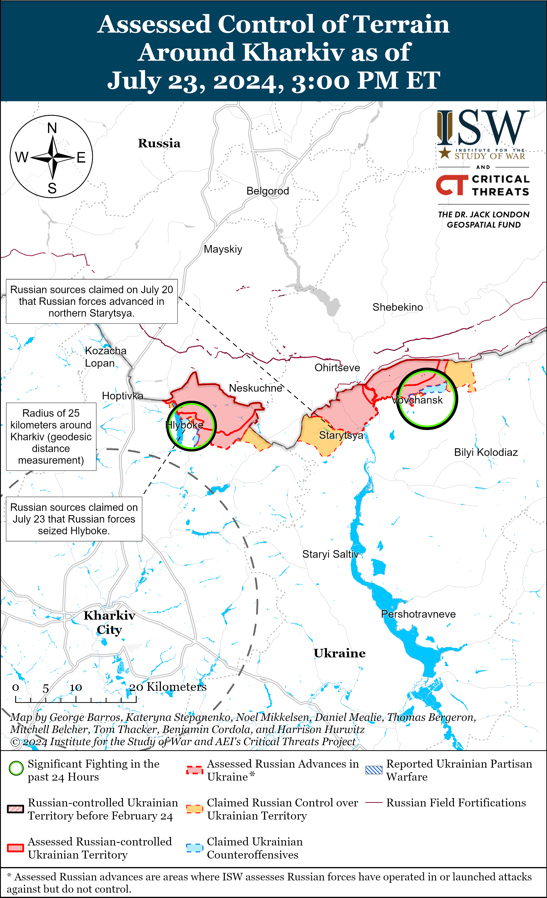
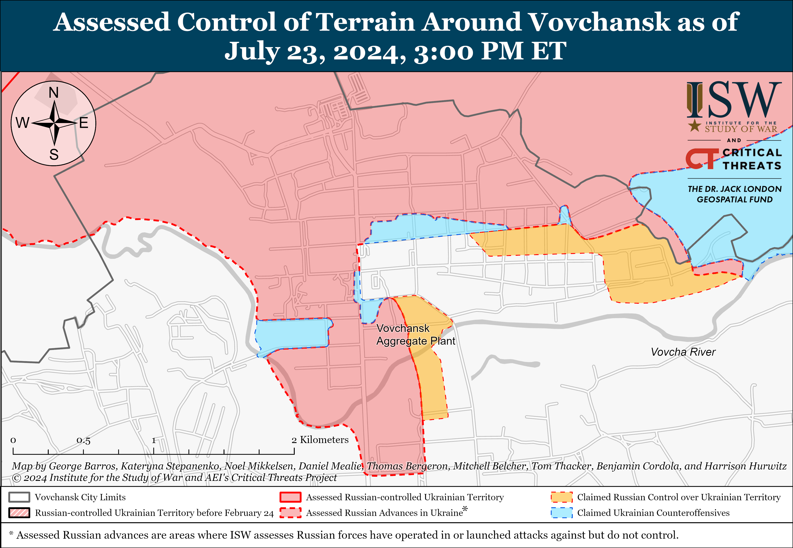
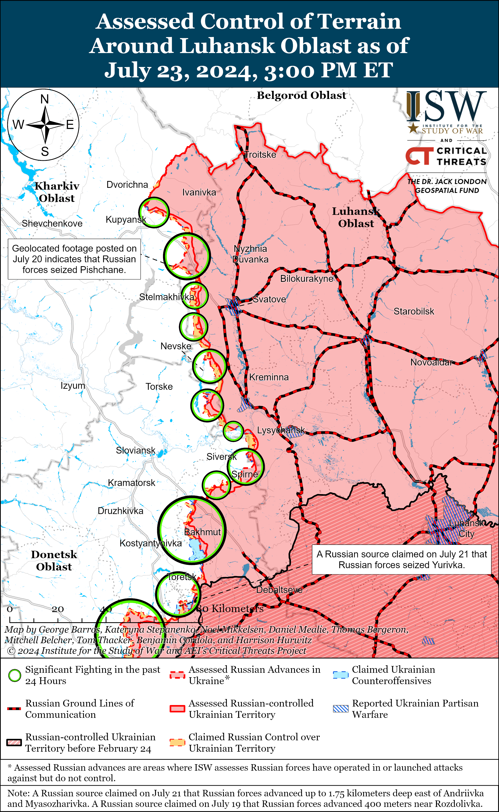
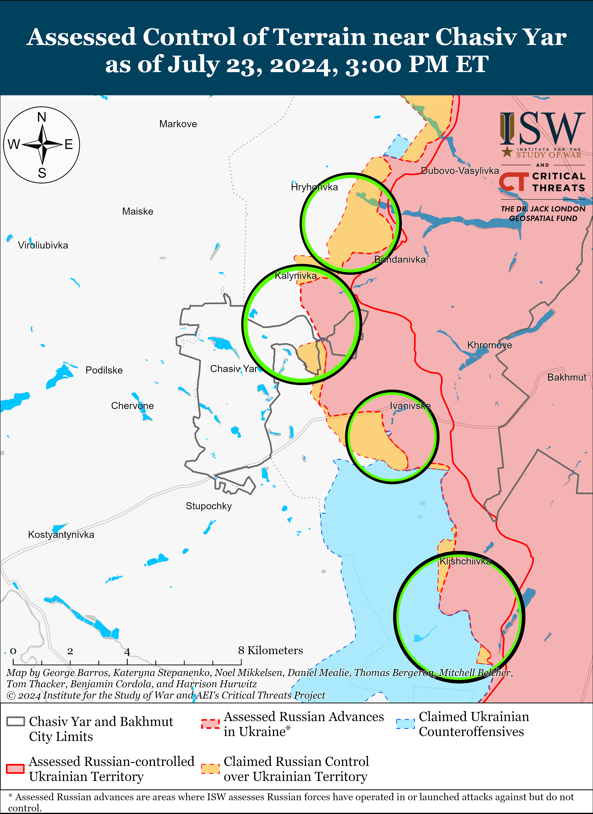
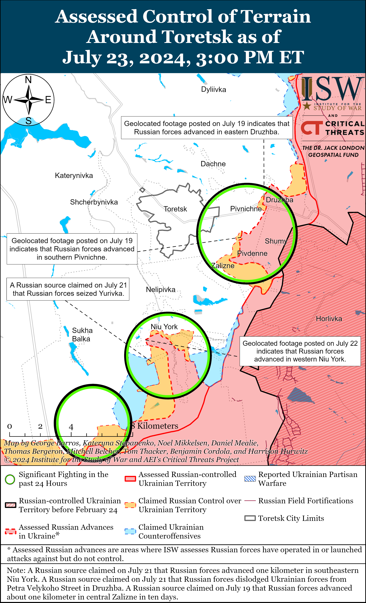
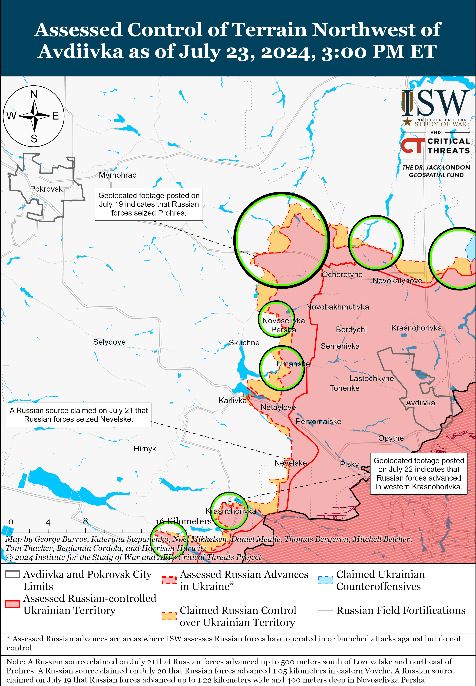
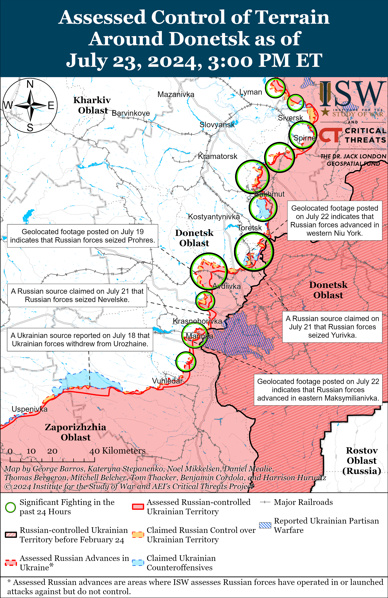
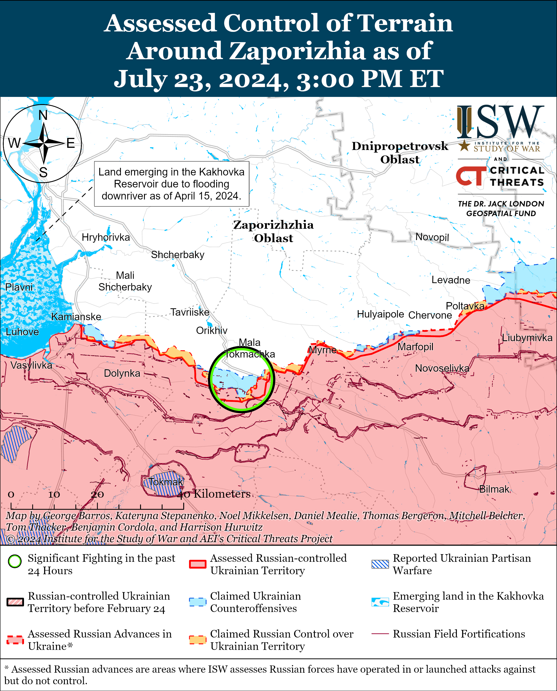
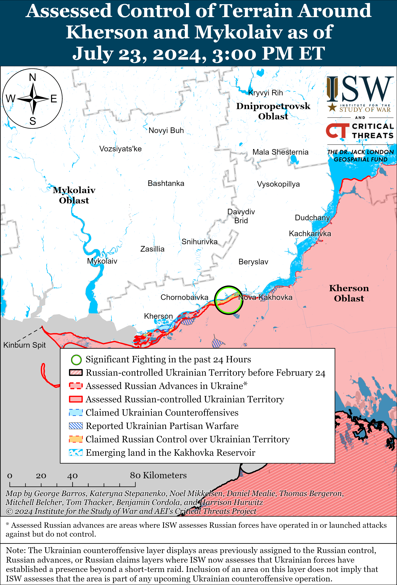

# Russian Offensive Campaign Assessment, July 23, 2024

**Angelica Evans, Riley Bailey, Nicole Wolkov, Kateryna Stepanenko, Davit Gasparyan, Karolina Hird, and George Barros**

**July 23, 2024, 7pm ET**

**Click**[**here**](https://storymaps.arcgis.com/stories/36a7f6a6f5a9448496de641cf64bd375)**to see ISW’s interactive map of the Russian invasion of Ukraine. This map is updated daily alongside the static maps present in this report.**

**Click**[**here**](https://understandingwar.maps.arcgis.com/apps/instant/3dviewer/index.html?appid=1602762dbcde419bb957dea358449580)**to see ISW’s 3D control of terrain topographic map of Ukraine. Use of a computer (not a mobile device) is strongly recommended for using this data-heavy tool.**

**Click**[**here**](https://storymaps.arcgis.com/stories/733fe90805894bfc8562d90b106aa895)**to access ISW’s archive of interactive time-lapse maps of the Russian invasion of Ukraine. These maps complement the static control-of-terrain map that ISW produces daily by showing a dynamic frontline. ISW will update this time-lapse map archive monthly.**

**Note: The data cut-off for this product was 12:30pm ET on July 23. ISW will cover subsequent reports in the July 24 Russian Offensive Campaign Assessment.**

**The Russian State Duma proposed an amendment that would allow commanders to punish subordinates for using personal communications and navigation devices at the frontline, prompting significant milblogger backlash and highlighting how Russian forces continue to struggle with command and control (C2) issues and overreliance on insecure technologies to conduct combat operations in Ukraine.**The Russian State Duma Defense Committee announced its support on July 23 for an amendment that will make wearing “gadgets” (personal phones and electronic devices) in the combat zone a “gross disciplinary offense” and will allow Russian commanders to arrest servicemembers in violation of such offenses without a court order and detain violating servicemembers for up to 10 days.[1] Russian State Duma Defense Committee Chairman Andrei Kartapolov claimed that punishments would not be applicable to servicemembers using devices for combat operations and noted that the amendment is based on a previous bill that generally banned the use of private devices in Ukraine.[2] Kartapolov claimed that the main goal of this amendment is to protect Russian servicemembers against security risks associated with improper cell phone usage.[3]

Russian milbloggers widely criticized this amendment and claimed that punishing soldiers for using personal devices will significantly complicate Russian logistics, C2, and operations in general. Russian milbloggers claimed that Russian servicemembers significantly rely on their personal devices to transmit target coordinates to call for fire from Russian artillerymen and drone operators, to navigate frontline areas, and to coordinate between units.[4] A prominent Russian milblogger published a formal appeal to Kartapolov and claimed that the amendment would result in the “paralysis” of the Russian military’s C2 bodies and called on the Russian Duma Defense Committee to amend the bill to cohere more realistically with how Russian forces use personal devices in Ukraine.[5] Several Russian milbloggers called on the Russian government to provide secure communications and navigation devices to Russian servicemembers before instituting punishment for the ad hoc use of personal devices and criticized Russian Duma deputies for being out of touch with frontline realities.[6] Russian milbloggers also called on Duma deputies to work with the Russian Armed Forces on the proposed amendments and future legislation in order to ensure that laws are in accordance with frontline realities and urged deputies to visit the frontline in Ukraine.[7] One critical Russian milblogger accused Kartapolov and his team of committing treason and pursuing this policy in order to help Ukraine win the war.[8]

**It remains unclear if the Russian military command will be able or willing to enforce punishment for the use of personal devices in Ukraine, however, emphasizing the Russian military’s high level of dependency on insecure communications systems.** Russian milbloggers questioned how Russian officials intend to differentiate between devices that are and are not used for combat operations and sarcastically noted that Russian officials may intend to implement a complicated (and likely ineffective or unenforceable) bureaucratic system to differential between devices.[9] One Russian milblogger claimed that either the Russian military command will attempt to make commanders enforce the unpopular ban or commanders and their subordinates will pretend to follow the ban while continuing to use their personal devices.[10] Another Russian milblogger complained that the amendment would be another arbitrary rule that commanders can use to justify punishing careless conscripts or disliked subordinates.[11] The Russian Ministry of Defense (MoD) previously attempted to restrict the use of personal devices in the combat zone in Ukraine following a Ukrainian strike on Russian barracks in Makiivka, Donetsk Oblast (which Ukrainian forces were able to target by tracking Russian cell phone signals) and was met with similar criticism in January 2023.[12] The Russian MoD is unlikely to be significantly more successful at this time given that the MoD has failed to address Russian forces’ dependency on insecure personal devices for communication and navigation and provide secure alternatives. The Russian military will likely find it extremely difficult to remove its dependence on insecure personal devices for a large suite of ordinary frontline tasks.

**Ukrainian forces reportedly conducted drone strikes against a ferry crossing in Kavkaz, Krasnodar Krai on the night of July 22 to 23.**Krasnodar Krai officials claimed that Ukrainian drones struck a ferry in the port of Kavkaz, causing a temporary fire.[13] The ferry crossing in Kavkaz is roughly 15 kilometers from occupied Kerch, Crimea across the Kerch Strait, and Russian forces routinely use ferries in the area to relieve pressures on the Russian ground line of communication (GLOC) connecting Krasnodar Krai and occupied Crimea across the Kerch Strait Bridge.[14]

**Russian President Vladimir Putin appointed a new Deputy Head of the Russian Ministry of Emergency Services on July 22, and there were several personnel changes within the Russian State Duma on July 23.**Putin appointed former Moscow Oblast Roszdravnadzor (Federal Healthcare Surveillance Service) Head Roman Kurynin as Deputy Head of the Russian Ministry of Emergency Services, replacing Lieutenant General Alexei Serko, who held the position since 2018.[15] The Russian State Duma dismissed Duma Deputy Speaker Sergei Neverov, Pavel Zavalny, and Dmitri Svishchev as heads of the Duma committees on energy and physical education and sports, respectively, on July 23.[16] Russian State Duma Chairperson Vyacheslav Volodin stated that the Duma will also consider proposals for the heads of the Duma’s culture and nationalities committees.[17] A prominent Russian insider source claimed that Neverov’s dismissal suggests that Volodin may be losing some of his control over the State Duma.[18]

**Key Takeaways:**

- **The Russian State Duma proposed an amendment that would allow commanders to punish subordinates for using personal communications and navigation devices at the frontline, prompting significant milblogger backlash and highlighting how Russian forces continue to struggle with command and control (C2) issues and overreliance on insecure technologies to conduct combat operations in Ukraine.**
- **Ukrainian forces reportedly conducted drone strikes against a ferry crossing in Kavkaz, Krasnodar Krai on the night of July 22 to 23.**
- **Russian President Vladimir Putin appointed a new Deputy Head of the Russian Ministry of Emergency Services on July 22, and there were several personnel changes within the Russian State Duma on July 23.**
- **Russian forces recently marginally advanced near Siversk, Avdiivka, and Donetsk City.**
- **Russian regional officials are continuing to increase financial incentives to entice more men to fight in Ukraine.**
- **Russian occupation officials continue to rely on Russian security organs for law enforcement and filtration functions in occupied Ukraine aimed at degrading pro-Ukrainian sentiment.**

[****](https://understandingwar.org/wp-content/uploads/2025/05/DraftUkraineCOTJuly232C2024.png)

***We do not report in detail on Russian war crimes because these activities are well-covered in Western media and do not directly affect the military operations we are assessing and forecasting. We will continue to evaluate and report on the effects of these criminal activities on the Ukrainian military and the Ukrainian population and specifically on combat in Ukrainian urban areas. We utterly condemn Russian violations of the laws of armed conflict and the Geneva Conventions and crimes against humanity even though we do not describe them in these reports.***

- Russian Main Effort – Eastern Ukraine (comprised of three subordinate main efforts)
- Russian Subordinate Main Effort #1 – Push Ukrainian forces back from the international border with Belgorod Oblast and approach to within tube artillery range of Kharkiv City
- Russian Subordinate Main Effort #2 – Capture the remainder of Luhansk Oblast and push westward into eastern Kharkiv Oblast and encircle northern Donetsk Oblast
- Russian Subordinate Main Effort #3 – Capture the entirety of Donetsk Oblast
- Russian Supporting Effort – Southern Axis
- Russian Air, Missile, and Drone Campaign
- Russian Mobilization and Force Generation Efforts
- Russian Technological Adaptations
- Activities in Russian-occupied areas
- Ukrainian Defense Industrial Base Efforts
- Russian Information Operations and Narratives
- Significant Activity in Belarus

**Russian Main Effort – Eastern Ukraine**

**Russian Subordinate Main Effort #1 – Kharkiv Oblast****(Russian objective: Push Ukrainian forces back from the international border with Belgorod Oblast and approach to within tube artillery range of Kharkiv City)**

Russian forces continued localized offensive operations north and northeast of Kharkiv City on July 22 and 23. Russian sources claimed that Russian forces have pushed Ukrainian forces completely out of Hlyboke (north of Kharkiv City) and back by up to one kilometer, although ISW has not yet observed visual evidence confirming that Russian forces control all of Hlyboke.[19] A Russian milblogger claimed that Russian forces conducted airstrikes between Lyptsi and Hlyboke, causing Ukrainian forces to pull back and replenish reserves.[20] A Russian milblogger claimed that Russian artillery and first-person view (FPV) drone strikes repelled several attempted Ukrainian counterattacks in the Hlyboke area.[21] The Russian Aerospace Forces (VKS) reportedly conducted an ODAB-1500 volumetric detonating aerial bomb strike against Ukrainian forces near Borshchova (north of Kharkiv City and south of Hlyboke).[22] Positional fighting continued near Hlyboke, Vovchansk (northeast of Kharkiv City), Vovchanski Khutory, and Tykhe (both just east of Vovchansk) on July 22 and 23.[23]  A Russian milblogger claimed that Ukrainian forces are becoming more active near Starytsya (southwest of Vovchansk).[24] Ukrainian Kharkiv Oblast Group of Forces Spokesperson Colonel Vitaliy Sarantsev stated on July 23 that Russian forces are concentrating their main efforts near Hlyboke and Vovchansk and that Russian forces continue to regroup to conduct assaults but are not preparing for a new offensive operation.[25] The Kharkiv Oblast Group of Forces stated that elements of the 7th Motorized Rifle Regiment (11th Army Corps [AC], Leningrad Military District [LMD]) are preparing to resume offensive operations near Lukyantsi (north of Kharkiv City).[26] Elements of the 128th Motorized Brigade (44th AC, LMD), 138th Motorized Rifle Brigade (6th Combined Arms Army [CAA], LMD), 18th Motorized Rifle Division (11th AC, Baltic Sea Fleet), and the 155th Naval Infantry Brigade (Pacific Fleet) of the Russian forces are operating in the Kharkiv direction.[27]

**Russian Subordinate Main Effort #2 – Luhansk Oblast****(Russian objective: Capture the remainder of Luhansk Oblast and push westward into eastern Kharkiv Oblast and northern Donetsk Oblast)**

Russian forces continued ground assaults along the Kupyansk-Svatove-Kreminna line on July 23, but there were no confirmed changes to the frontline. Russian milbloggers claimed that Russian forces recently seized positions on the northwestern outskirts of Synkivka (northeast of Kupyansk) but denied claims that Russian forces are operating within central Synkivka.[28] Russian milbloggers also claimed that Russian forces advanced over 800 meters within Pishchane (southeast of Kupyansk), northwest of Kreminna near Nevske, and west of Kreminna near Terny and Yampolivka.[29] Russian forces continued assaults northwest of Kupyansk near Kindrashivka; southeast of Kupyansk near Petropavlivka, Hlushkivka, Kolisnykivka, Berestove, and Stelmakhivka; west of Svatove near Andriivka; southwest of Svatove near Makiivka and Novoserhiivka; and southwest of Kreminna in the Serebryanske forest area on July 22 and 23.[30]

[****](https://understandingwar.org/wp-content/uploads/2025/05/Luhansk20Battle20Map20Draft20July20232C202024.png)

**Russian Subordinate Main Effort #3 – Donetsk Oblast****(Russian objective: Capture the entirety of Donetsk Oblast, the claimed territory of Russia’s proxies in Donbas)**

Russian forces recently advanced in the Siversk direction amid continued Russian ground attacks in the area on July 23. Geolocated footage published on July 22 indicates that Russian forces recently advanced northeast of Rozdolivka (south of Siversk).[31] Russian forces conducted ground attacks east of Siversk near Verkhnokamyanske; southeast of Siversk near Spirne and Vyimka; and south of Siversk near Pereizne on July 22 and 23.[32] A Ukrainian battalion commander operating in the Siversk direction stated on July 22 that Russian and Ukrainian forces have been using more drones and less artillery in the area, but that Ukrainian forces currently have the advantage in drone improvements and adaptations.[33] The battalion commander also reported that Russian forces operate large electronic warfare (EW) systems roughly 10 kilometers from the frontline and activate them when Russian forces conduct assaults to interfere with Ukrainian drones. Elements of the Russian 106th Airborne (VDV) Division reportedly continue operating near Pereizne; and elements of the Russian 123rd Motorized Rifle Brigade (2nd Luhansk People’s Republic Army Corps [LNR AC]) reportedly continue operating in the Siversk direction.[34]

Russian forces continued offensive operations near Chasiv Yar on July 23 but did not make any confirmed advances. Russian milbloggers claimed that Russian forces marginally advanced north of Kalynivka and near Hryhorivka (both north of Chasiv Yar), although ISW has not observed visual confirmation of these claims.[35] The Ukrainian General Staff continued to report a higher number of Russian attacks in the Chasiv Yar direction as of 0800 local time on July 23, particularly north of Chasiv Yar near Vasyukivka, Minkivka, Orikhovo-Vasylivka, Hryhorivka, Kalynivka, and Bohdanivka,.[36] Fighting also continued north of Chasiv Yar near Novomarkove and southwest of Chasiv Yar near Ivanivske, Klishchiivka, Andriivka, and Bila Hora on July 22 and 23.[37] Ukrainian Khortytsia Group of Forces Spokesperson Lieutenant Colonel Nazar Voloshyn stated on July 23 that elements of the Russian 132nd Motorized Rifle Brigade (1st Donetsk People’s Republic [DNR] AC) are operating near Chasiv Yar, suggesting that the Russian command has committed elements of the 132nd Motorized Rifle Brigade to combat operations in both the Chasiv Yar and Toretsk directions.[38] Voloshyn also reported that Russian forces plan to strengthen units operating in the Chasiv Yar direction with elements of two additional unspecified brigades.

Russian forces continued offensive operations in the Toretsk direction on July 23 but did not make any confirmed advances. Russian milbloggers claimed that Russian forces advanced in Zalizne (southeast of Toretsk) and in central Niu York (south of Toretsk), but ISW has not observed visual evidence of these claims.[39] Fighting continued near Toretsk; southeast of Toretsk near Pivnichne and Zalizne; and south of Toretsk near Niu York and Panteleymonivka on July 22 and 23.[40]

Russian forces recently advanced west of Avdiivka on July 23 amid continued Russian offensive operations in the area. Geolocated footage published on July 23 indicates that Russian forces recently advanced to Molodizhna Street in southwestern Novoselivka Persha (northwest of Avdiivka).[41] Ukrainian military observer Yuriy Butusov stated on July 23 that Russian forces have advanced up to six kilometers within the past week in the Myrnohrad-Pokrovsk direction (northwest of Avdiivka) and noted that Russian forces are 14 kilometers away from Myrnohrad, consistent with ISW’s assessment of Russian advances in the area.[42] Butusov stated that Ukrainian forces are in a “critically difficult” situation in the Pokrovsk (Avdiivka) direction and noted that Russian forces are attempting to attack the most degraded Ukrainian units in the area instead of targeting the weakest defensive positions. Butusov also stated that Russian forces are conducting small infantry-led frontal assaults in the Avdiivka direction. Russian milbloggers claimed that Russian forces advanced to the outskirts of Vovche (northwest of Avdiivka) and on the northern and southern banks of the Karlivske Reservoir (west of Avdiivka), although ISW has not seen visual evidence of Russian gains in these areas.[43] Fighting continued north of Avdiivka near Kalynove; northwest of Avdiivka near Vozdvyzhenka, Novooleksandrivka, Ivanivka, Tymofiivka, Lozuvatske, Prohres, Novoselivka Persha, and Vovche; and west of Avdiivka near Yasnobrodivka, Umanske, and Karlivka on July 22 and 23.[44] Ukrainian military sources published footage on July 23 showing Ukrainian forces shooting down a Russian Su-25 attack aircraft in the Pokrovsk direction.[45]

Russian forces recently advanced west of Donetsk City amid continued Russian offensive operations west and southwest of Donetsk City on July 23. Geolocated footage published on July 22 indicates that Russian forces recently marginally advanced to Slovyanska Street in Krasnohorivka (west of Donetsk City).[46] A Ukrainian source published footage on July 22 showing Ukrainian forces repelling part of a reportedly roughly reinforced company-sized Russian mechanized assault in an unspecified location in the Donetsk direction on an unspecified date.[47] Russian milbloggers claimed that Russian forces marginally advanced southeast of Vodyane (southwest of Donetsk City) and advanced up to 3.1 kilometers in central and eastern Maksymilyanivka (southwest of Donetsk City).[48] Fighting continued west of Donetsk City near Krasnohorivka, and southwest of Donetsk City near Heorhiivka, Paraskoviivka, and Kostyantynivka on July 22 and 23.[49] Elements of the Russian 238th Artillery Brigade (8th Combined Arms Army [CAA], Southern Military District [SMD]), “Grachi” Spetsnaz detachment, and 5th Motorized Rifle Brigade (1st DNR AC) reportedly continue operating near Krasnohorivka.[50]

Russian milbloggers claimed on July 23 that Russian forces are conducting assaults in the direction of Makarivka and Blahodatne (both south of Velyka Novosilka) in the Donetsk-Zaporizhia Oblast border area.[51] The Russian Ministry of Defense (MoD) claimed that elements of the Russian Eastern Grouping of Forces with tank support recently advanced near Vremivka (just southwest of Velyka Novoselika).[52] The Russian MoD claimed that Russian forces were using buggies and dirt bikes to attack Ukrainian positions near Urozhaine (south of Velyka Novosilka).[53]

**Russian Supporting Effort – Southern Axis****(Russian objective: Maintain frontline positions and secure rear areas against Ukrainian strikes)**

Positional fighting continued in western Zaporizhia Oblast near Robotyne, east of Robotyne near Verbove, and northeast of Robotyne near Mala Tokmachka on July 22 and 23.[54] Elements of the Russian 71st Motorized Rifle Regiment (42nd Motorized Rifle Division, 58th Combined Arms Army [CAA], Southern Military District [SMD]) are reportedly operating near Robotyne.[55] Elements of the Russian 76th Airborne (VDV) Division, the 503rd Motorized Rifle Regiment (19th Motorized Rifle Division, 58th CAA, SMD), and the 89th Separate Rifle Regiment (likely a reformed Soviet-era unit) are reportedly operating in the Zaporizhia direction.[56]

Positional fighting continued in the east (left) bank of Kherson Oblast on July 22 and 23, but there were no confirmed changes to the frontline.[57] A Russian milblogger claimed on July 23 that fighting continued on islands in the Dnipro River and that Ukrainian drones continue to pose a significant threat to Russian forces in the area.[58]

Russian sources claimed that Ukrainian forces targeted occupied Crimea on the night of July 22 to 23. The Russian Ministry of Defense (MoD) reported that Russian forces destroyed 21 Ukrainian drones over occupied Crimea and the Black Sea, and a Russian milblogger claimed that Russian forces destroyed 15 of the Ukrainian drones near occupied Sevastopol.[59] Russian opposition outlet *Astra*reported that a Ukrainian drone struck a Russian Main Directorate of the Russian General Staff (GRU) radio station near Sevastopol, although ISW cannot confirm this report.[60]

**Russian Air, Missile, and Drone Campaign****(Russian Objective: Target Ukrainian military and civilian infrastructure in the rear and on the frontline)**

Russian forces conducted a limited series of drone and missile strikes against Ukraine on the night of July 22 to 23. Ukrainian Air Force Commander Lieutenant General Mykola Oleshchuk reported that Russian forces launched a Kh-69 cruise missile and eight Shahed-136/131 drones from Kursk Oblast at targets in Sumy Oblast.[61] Oleshchuk reported that Ukrainian mobile fire groups and electronic warfare (EW) units downed seven Shahed drones and that Ukrainian “active countermeasures” prevented the Kh-69 missile from striking its target. The Sumy Oblast Military Administration reported that Russian forces conducted an air strike against critical infrastructure facilities in Shostka Hromada.[62] Ukraine’s Southern Operational Command reported that Russian forces launched a missile, likely an Iskander-M ballistic missile, from occupied Crimea and struck Odesa Oblast on July 22.[63]

**Russian Mobilization and Force Generation Efforts****(Russian objective: Expand combat power without conducting general mobilization)**

Russian regional officials are continuing to increase financial incentives to entice more men to fight in Ukraine. Moscow Mayor Sergey Sobyanin signed a bill on July 23 offering recruits from Moscow a one-time enlistment bonus of 1.9 million rubles (about $21,600) if they sign a contract with the Russian Ministry of Defense (MoD) for one year of military service.[64] Sobyanin’s press service reported that Russian contract servicemen will receive 5.2 million rubles (about $59,150) during the first year of military service.[65] ISW continues to assess that such high financial incentives will continue to generate sufficient manpower to sustain Russia’s current offensive tempo but are likely to impose high long-term costs on Russia’s regional and federal budgets. Russian ultranationalist recruitment network the Union of Donbas Volunteers also announced the recruitment of volunteers into the 7th “Saint Grigoriy” Assault Brigade (Redut private military company [PMC]).[66]

The Russian government is also attempting to incentivize military service by removing the eligibility requirements for Russian servicemen and Ukrainian residents of occupied territories to receive veteran status. The Russian State Duma approved in the first reading a law on July 23 that will grant combat veteran status to Russian servicemen and Ukrainian residents fighting in occupied Kherson and Zaporizhia oblasts if they have resided and fought in southern Ukraine with Russian forces since Russia’s illegal annexation of these oblasts on September 30, 2022.[67] A Russian deputy defense minister claimed that this provision would not require additional expenditures from the budget, despite the fact that the expansion of veteran statuses to more servicemen commits Russia to long-term expenditures such as military pensions, medical support, and other social benefits.

A close affiliate of arrested Russian ultranationalist Igor Girkin amplified a post on July 22 recounting complaints from Russian service members and their relatives about the Russian MoD failing to pay them and mislabeling active personnel as missing.[68] The post outlined the experience of a drone operator of the 138th Separate Motorized Rifle Brigade (6th Combined Arms Army [CAA], Leningrad Military District [LMD]), who volunteered to fight in Ukraine in November 2023 and deployed to the Vovchansk direction (northeast of Kharkiv City) as part of the 69th Motorized Rifle Division (6th CAA) and the Northern Grouping of Forces (GoF) in May 2024. The post noted that the drone operator stopped receiving his monthly salary in March 2024 and began receiving only 30,000 to 50,000 rubles ($340 to $570) alongside his fellow service members. The post noted that Russian military authorities listed the drone operator and other frontline troops as missing and that the Russian MoD owed the drone operator 600,000 rubles ($6,800) for his service. The drone operator’s relatives reportedly issued several appeals to the Russian government, resulting in the drone operator receiving a portion of the promised compensation from a different Russian military unit than the one he serves in. The post noted that similar problems are impacting many Russian service members and their families and demonstrates the persistent Russian issues with military bureaucracy and compensation.

The Russian State Duma adopted several other bills regarding force generation and military service benefits. The Russian State Duma adopted in the second and third reading a bill allowing employers to transfer information about employees liable for military service to military enlistment centers, which will likely support efforts to improve Russia’s reserve call-up system.[69] The Russian State Duma adopted a law in the second and third readings that will ban Russian officials from collecting bankruptcy payments from Russian servicemen fighting in Ukraine.[70]

**Russian Technological Adaptations****(Russian objective: Introduce technological innovations to optimize systems for use in Ukraine)**

A Russian aviation expert published an essay on July 22 arguing that the widespread use of drones in the war in Ukraine prompted Ukrainian forces to start using what the expert classified as “small air defense aircraft,” but that Russian forces have yet to field this adaptation due to administrative hurdles with the Russian military bureaucracy.[71] The expert claimed that Ukrainian forces pioneered the use of light aircraft to repel drones after they shot down a Russian “Orlan-10” reconnaissance drone with a Ukrainian two-seater Yakovlev Yak-52 trainer aircraft over Odesa Oblast in April 2024. The expert argued that Ukrainian forces continued to use “small air defense aircraft” against Russian drones and are also using Ukrainian Aeroprakt A-22 Foxbat two-seat ultralight aircraft for this purpose. The expert claimed that Russian forces have not yet used small aviation for air defense purposes and that Russia lacks the necessary aircraft of this class for such operations. The expert noted that civilian aviators train on the Diamond DA40 four-seat light aircraft, the design of which prevents Russian forces from using these planes to intercept drones. The expert added that Russian cadets train on the L-39 trainer jets, which he characterized as unsuitable to match Ukrainian capabilities. The expert noted that the Russian Volunteer Society for Assistance to the Army, Aviation, and Navy of Russia (DOSAAF) and its private owners have around 25 Yak-52 aircraft and that Russia’s aviation sector has approximately the same amount of A-22s and the A-32 variant. The expert noted that Russia has problems with maintaining the A-32 aircraft because it is a Ukrainian product and that Russia would need to seize aircraft from private owners under mobilization law to maintain such aircraft. The expert added that Russian private owners and DOSAAF also have approximately 250 various Cessna class two-seat training aircraft and that Russia has at most a dozen Yak-12 aircraft that can intercept drones, but that Russia’s Yak-18T aircraft is not suitable for such operations due to its structure.

A Russian serviceperson reportedly revealed to a Russian milblogger on July 22 that his regiment is using Russian Rex-1 anti-drone guns, but that this gun is unable to disrupt targets that operate at frequencies below 2.4 GHz.[72]

**Ukrainian Defense Industrial Efforts (Ukrainian objective: Develop its defense industrial base to become more self-sufficient in cooperation with US, European, and international partners)**

*ISW is not publishing coverage of Ukrainian defense industrial efforts today.*

**Activities in Russian-occupied areas****(Russian objective: Consolidate administrative control of annexed areas; forcibly integrate Ukrainian citizens into Russian sociocultural, economic, military, and governance systems)**

Russian occupation officials continue to rely on Russian security organs for law enforcement and filtration functions in occupied Ukraine aimed at degrading pro-Ukrainian sentiment. The Kherson Oblast occupation administration warned residents of occupied Kherson Oblast that FSB border guard elements are working a security checkpoint to conduct “special control methods” for those planning to fly out of occupied Kherson Oblast.[73] These control methods include document checks and verbal interviews and will take longer for those with Ukrainian citizenship. Russian occupation security structures frequently use such “special control measures” to carry out filtration practices aimed at identifying, detaining, and prosecuting people deemed to be pro-Ukrainian or a threat to the occupation regime.[74] Other Russian security structures, such as Rosgvardia, have become increasingly active in occupied Ukraine for similar reasons.[75]

Russia continues to pursue infrastructure projects in occupied Ukraine aimed at increasing connectivity and economic integration between Russia and occupied Ukraine. The Ukrainian media project Center for Journalistic Investigations published a report on July 19 detailing how Russia is constructing two parallel pipelines running from Taganrog, Rostov Oblast through occupied Mariupol, Berdyansk, and Melitopol.[76] The Center for Journalistic Investigations analyzed open-source data showing the gradual construction of the pipelines since 2022 and speculated that Russian officials plan to use gas distribution stations in occupied Mariupol to act as central supply nodes for the pipelines. Regardless of whether the pipelines will be used for gas, water, or fuel, they will further increase occupied Ukraine’s reliance on supplies from Russia, further integrating occupied Ukraine into the Russian economy and generating long-term dependencies on the Russian system.

Russian federal subjects (regions) continue to sponsor the forced relocation of Ukrainian children. The Luhansk Oblast occupation Ministry of Health reported on July 19 that Russia’s Ulyanovsk Oblast Administration organized a “holiday” for 300 children from occupied Luhansk Oblast at the “Gagarin” children’s camp in occupied Crimea.[77] The “Gagarin” camp is located in occupied Yevpatoria, Crimea, and runs the “Avangrad” center for youth military-patriotic education.[78] Ukrainian Ombudsman Dmytro Lubinets warned in October 2023 that Russian authorities are forcibly re-educating Ukrainian children at the “Gagarin” camp.[79] Russian regions frequently sponsor relocation and deportation programs—ISW previously reported on July 19 that Tatarstan provided support to the Luhansk Oblast occupation administration in relocating 99 children from occupied Donetsk and Luhansk oblasts to a children’s camp in Crimea in the first two weeks of July alone.[80]

**Russian Information Operations and Narratives**

Russian investigative outlet *Dossier Center*reported on July 23 that internal documents show that the head of the Presidential Administration’s department for public projects, Sergei Novikov, developed a new cultural policy at the end of 2023 that aims to make the war in Ukraine a central theme in Russian art and popular media in order to increase domestic support for the war.[81] Novikov and members of the Presidential Administration reportedly expressed concern about decreasing domestic support for the war in Ukraine at the time, specifically among middle-class urban youth.[82] *Dossier Center*reported that Russian Orthodox Church Metropolitan Tikhon Shevkunov, Deputy Minister of Culture Andrei Malyshev, and Deputy General Director of Russian State news station *Channel One* Andrei Pisarev are responsible for “ideological control” of the Kremlin’s cultural management program, which aims to promote pro-war themes through federal grants.[83] The Presidential Administration reportedly attempts to promote pro-war themes through grants connected to the Presidential Fund for Cultural Initiatives, the Russian Federal Agency of Youth Affairs (Rosmolodezh), the Institute for Internet Development, the Cinema Fund, the Regional Cinema Development Fund, the Ministry of Culture, and the Ministry of Education.[84] At least half of all grants earmarked for 2024 to 2025 reportedly must sponsor works that promote traditional values and the war in Ukraine.[85] The Russian Presidential Administration also reportedly plans to form a literary magazine for Russian writers who travel to occupied Ukraine and write about Kremlin narratives concerning the war.[86] The Ukrainian Resistance Center similarly reported on July 23 that the Russian public non-profit “Znanie” held propaganda lectures to promote Kremlin narratives about occupied Ukraine from July 19 to 22.[87] “Znanie” notably offers educational programs to Russian writers.

Russian milbloggers seized on former Ukrainian Command-in-Chief and Ukrainian Ambassador to the United Kingdom General Valerii Zaluzhnyi’s statements at the Royal United Services Institute (RUSI) Land War Conference 2024 on July 22 to reiterate ongoing Russian information operations intended to discourage Western support for Ukraine. Zaluzhnyi stated during the RUSI conference that the West can achieve technological breakthroughs by combining Ukraine’s battlefield experience with the West’s resources and by “test[ing]” new weapons in Ukraine.[88] Russian milbloggers attempted to manipulate Zaluzhnyi’s statement to claim that Western companies are only interested in supporting Ukraine because it offers a “testing ground” for weapons and invoked an ongoing, absurd Russian information operation that the United States is sponsoring biological weapons laboratories in Ukraine.[89]

**Significant activity in Belarus****(Russian efforts to increase its military presence in Belarus and further integrate Belarus into Russian-favorable frameworks and Wagner Group activity in Belarus)**

Nothing significant to report.

**Note: ISW does not receive any classified material from any source, uses only publicly available information, and draws extensively on Russian, Ukrainian, and Western reporting and social media as well as commercially available satellite imagery and other geospatial data as the basis for these reports. References to all sources used are provided in the endnotes of each update.**

****

---

[1] https://t.me/tass\_agency/261998 ; https://sozd.duma.gov dot ru/bill/289614-8 ; https://meduza dot io/news/2024/07/23/v-gosdume-predlozhili-bez-suda-otpravlyat-voennyh-na-gauptvahtu-za-ispolzovanie-smartfona

[2] https://t.me/tass\_agency/262067 ; https://t.me/bbbreaking/186624 ; https://t.me/rian\_ru/25432 ; https://t.me/gazetaru/39050

[3] https://t.me/gazetaru/39050

[4] https://t.me/MedvedevVesti/18102 ; https://t.me/RVvoenkor/72997 ; https://t.me/RVvoenkor/72997  ; https://t.me/warhistoryalconafter/175240  ; https://t.me/dva\_majors/47884 ; https://t.me/DnevnikDesantnika/12984 ; https://t.me/rogozin\_do/6131 ; https://t.me/dva\_majors/47887 ; https://t.me/belarusian\_silovik/38102 ; https://t.me/Alekhin\_Telega/10939 ; https://t.me/Mestb\_Dobroj\_Voli/11927 ; https://t.me/Sladkov\_plus/11049 ; https://t.me/dva\_majors/47923  ; https://t.me/dva\_majors/47936

[5] https://t.me/dva\_majors/47885

[6] https://t.me/warhistoryalconafter/175240  ; https://t.me/dva\_majors/47884 ; https://t.me/DnevnikDesantnika/12984 ; https://t.me/rogozin\_do/6131 ; https://t.me/dva\_majors/47887 ; https://t.me/Alekhin\_Telega/10939 ; https://t.me/Mestb\_Dobroj\_Voli/11927 ; https://t.me/notes\_veterans/18261 ; https://t.me/rusich\_army/15987 ; https://t.me/rusich\_army/15991 ; https://t.me/aleksandr\_skif/3255  ; https://t.me/dva\_majors/47928

[7] https://t.me/zhivoff/15814 ; https://t.me/dva\_majors/47905 ; https://t.me/frontbird/11611 ; https://t.me/dva\_majors/47910 ; https://t.me/t3mny/2107; https://t.me/philologist\_zov/1144 ; https://t.me/dva\_majors/47913 ; https://t.me/designersmil/8542 ; https://t.me/dva\_majors/47892

[8] https://t.me/Alekhin\_Telega/10939

[9] https://t.me/MedvedevVesti/18102  ; https://t.me/rogozin\_do/6135 ; https://t.me/dva\_majors/47915

[10] https://t.me/vysokygovorit/16612

[11] https://t.me/milinfolive/126562

[12] https://isw.pub/UkrWar011723 ; https://isw.pub/UkrWar011823

[13] https://t.me/tass\_agency/262038 ; https://t.me/tass\_agency/262041 ; https://t.me/tass\_agency/262057 ; https://t.me/tass\_agency/262116

[14] https://isw.pub/UkrWar061024

[15] https://www.rbc dot ru/rbcfreenews/669eb6059a79470a9fb5b603

[16] https://t.me/tass\_agency/262063 ; https://t.me/tass\_agency/262064

[17] https://t.me/tass\_agency/262066

[18] https://t.me/kremlin\_sekret/15605

[19] https://t.me/RVvoenkor/72999 ; https://t.me/boris\_rozhin/130936

[20] https://t.me/DnevnikDesantnika/12986

[21] https://t.me/DnevnikDesantnika/12986

[22] https://t.me/DnevnikDesantnika/12986

[23]https://www.facebook.com/GeneralStaff.ua/posts/pfbid0Wbk24HyQ9dELv4DHfZZdd6xwdM6bMQWaPkorVNV8SM8i3NTsCzzpyffCYR4Tj6uWl; https://www.facebook.com/GeneralStaff.ua/posts/pfbid0aTx6xNSi69zwL3py4tWtErZm1b6igcJEcRdYRw5iADWxhxu2Ws8NuzTQ4CK3n9Qtl; https://www.facebook.com/GeneralStaff.ua/posts/pfbid0MZruJrsQvEodAyeNbeK4xZJmT5K9rKzKxugpy5xWaEHhXcXXrKRVz6CTiPs4UMbol; https://t.me/wargonzo/21161 ; https://t.me/rybar/62019

[24] https://t.me/DnevnikDesantnika/12990

[25] https://armyinform.com dot ua/2024/07/23/otu-harkiv-nemaye-informacziyi-pro-pidgotovku-vorogom-novogo-nastupu/

[26] https://t.me/otukharkiv/321

[27] https://t.me/otukharkiv/321; https://armyinform.com dot ua/2024/07/23/otu-harkiv-nemaye-informacziyi-pro-pidgotovku-vorogom-novogo-nastupu/

[28] https://t.me/NgP\_raZVedka/18445  ; https://t.me/rybar/62019 ; https://t.me/motopatriot/25254 ; https://t.me/motopatriot/25255

[29] https://t.me/RVvoenkor/72999 ; https://t.me/motopatriot/25266  ; https://t.me/DnevnikDesantnika/12970

[30] https://www.facebook.com/GeneralStaff.ua/posts/pfbid0Wbk24HyQ9dELv4DHfZZdd6xwdM6bMQWaPkorVNV8SM8i3NTsCzzpyffCYR4Tj6uWl ; https://www.facebook.com/GeneralStaff.ua/posts/pfbid0aTx6xNSi69zwL3py4tWtErZm1b6igcJEcRdYRw5iADWxhxu2Ws8NuzTQ4CK3n9Qtl ; https://www.facebook.com/GeneralStaff.ua/posts/pfbid0MZruJrsQvEodAyeNbeK4xZJmT5K9rKzKxugpy5xWaEHhXcXXrKRVz6CTiPs4UMbol ; https://t.me/RVvoenkor/72999

[31] https://t.me/rian\_ru/254288; https://t.me/creamy\_caprice/6138

[32] https://www.facebook.com/GeneralStaff.ua/posts/pfbid0Wbk24HyQ9dELv4DHfZZdd6xwdM6bMQWaPkorVNV8SM8i3NTsCzzpyffCYR4Tj6uWl ; https://www.facebook.com/GeneralStaff.ua/posts/pfbid0aTx6xNSi69zwL3py4tWtErZm1b6igcJEcRdYRw5iADWxhxu2Ws8NuzTQ4CK3n9Qtl ; https://www.facebook.com/GeneralStaff.ua/posts/pfbid0MZruJrsQvEodAyeNbeK4xZJmT5K9rKzKxugpy5xWaEHhXcXXrKRVz6CTiPs4UMbol

[33] https://armyinform.com dot ua/2024/07/22/na-siverskomu-napryamku-stalo-menshe-vorozhoyi-artyleriyi-ale-bilshe-droniv/

[34] https://t.me/mod\_russia/41314 ; https://t.me/sons\_fatherland/15756

[35] https://t.me/RVvoenkor/72999 ; https://t.me/DnevnikDesantnika/12981

[36] https://www.facebook.com/GeneralStaff.ua/posts/pfbid0aTx6xNSi69zwL3py4tWtErZm1b6igcJEcRdYRw5iADWxhxu2Ws8NuzTQ4CK3n9Qtl

[37] https://www.facebook.com/GeneralStaff.ua/posts/pfbid0MZruJrsQvEodAyeNbeK4xZJmT5K9rKzKxugpy5xWaEHhXcXXrKRVz6CTiPs4UMbol ; https://www.facebook.com/GeneralStaff.ua/posts/pfbid0Wbk24HyQ9dELv4DHfZZdd6xwdM6bMQWaPkorVNV8SM8i3NTsCzzpyffCYR4Tj6uWl ; https://t.me/wargonzo/21161

[38] https://armyinform.com dot ua/2024/07/23/u-dyversijno-rozviduvalnyh-grupah-okupantiv-prysutni-zhinky/ ; https://understandingwar.org/backgrounder/russian-offensive-campaign-assessment-july-16-2024 ; https://understandingwar.org/backgrounder/russian-offensive-campaign-assessment-july-11-2024 ; https://understandingwar.org/backgrounder/russian-offensive-campaign-assessment-july-10-2024

[39] https://t.me/RVvoenkor/72977 ; https://t.me/rybar/62019 ; https://t.me/dva\_majors/47883 ; https://t.me/wargonzo/21161

[40] https://www.facebook.com/GeneralStaff.ua/posts/pfbid0Wbk24HyQ9dELv4DHfZZdd6xwdM6bMQWaPkorVNV8SM8i3NTsCzzpyffCYR4Tj6uWl ; https://www.facebook.com/GeneralStaff.ua/posts/pfbid0aTx6xNSi69zwL3py4tWtErZm1b6igcJEcRdYRw5iADWxhxu2Ws8NuzTQ4CK3n9Qtl ; https://www.facebook.com/GeneralStaff.ua/posts/pfbid0MZruJrsQvEodAyeNbeK4xZJmT5K9rKzKxugpy5xWaEHhXcXXrKRVz6CTiPs4UMbol

[41] https://t.me/creamy\_caprice/6142 ; https://x.com/Bielitzling/status/1815734122507088182

[42] https://www.facebook.com/butusov.yuriy/posts/pfbid02bReTHGpWHbw8VWzJSeQfhYdHRLnk1AT1QkgzR2LYzXJQ9CDBnKktiAquFL2KaLcxl

[43] https://t.me/NgP\_raZVedka/18442 ; https://t.me/motopatriot/25342 ; https://t.me/DnevnikDesantnika/12982

[44] https://www.facebook.com/GeneralStaff.ua/posts/pfbid0Wbk24HyQ9dELv4DHfZZdd6xwdM6bMQWaPkorVNV8SM8i3NTsCzzpyffCYR4Tj6uWl ; https://www.facebook.com/GeneralStaff.ua/posts/pfbid0aTx6xNSi69zwL3py4tWtErZm1b6igcJEcRdYRw5iADWxhxu2Ws8NuzTQ4CK3n9Qtl ; https://www.facebook.com/GeneralStaff.ua/posts/pfbid0MZruJrsQvEodAyeNbeK4xZJmT5K9rKzKxugpy5xWaEHhXcXXrKRVz6CTiPs4UMbol ; https://t.me/NgP\_raZVedka/18437 ; https://t.me/NgP\_raZVedka/18442 ; https://t.me/DnevnikDesantnika/12982 ; https://t.me/wargonzo/21161

[45] https://t.me/Khortytsky\_wind/772 ; https://www.facebook.com/watch/?v=1054699299551430

[46] https://t.me/smertvorogy/919; https://t.me/creamy\_caprice/6137

[47] https://armyinform.com dot ua/2024/07/22/na-doneczkomu-napryamku-vidbyly-velykyj-vorozhyj-shturm/

[48] https://t.me/boris\_rozhin/130937 ; https://t.me/RVvoenkor/73021 ; https://t.me/NgP\_raZVedka/18443

[49] https://www.facebook.com/GeneralStaff.ua/posts/pfbid0Wbk24HyQ9dELv4DHfZZdd6xwdM6bMQWaPkorVNV8SM8i3NTsCzzpyffCYR4Tj6uWl ; https://www.facebook.com/GeneralStaff.ua/posts/pfbid0aTx6xNSi69zwL3py4tWtErZm1b6igcJEcRdYRw5iADWxhxu2Ws8NuzTQ4CK3n9Qtl ; https://www.facebook.com/GeneralStaff.ua/posts/pfbid0MZruJrsQvEodAyeNbeK4xZJmT5K9rKzKxugpy5xWaEHhXcXXrKRVz6CTiPs4UMbol ; https://t.me/wargonzo/21161 ; https://t.me/dva\_majors/47883 ; https://t.me/NgP\_raZVedka/18446 ; https://t.me/DnevnikDesantnika/12993

[50] https://t.me/nm\_dnr/12498 ; https://t.me/RVvoenkor/73022

[51] https://t.me/rybar/62019 ; https://t.me/dva\_majors/47883

[52] https://t.me/mod\_russia/41301

[53] https://t.me/mod\_russia/41282

[54] https://t.me/wargonzo/21161  ; https://www.facebook.com/GeneralStaff.ua/posts/pfbid0aTx6xNSi69zwL3py4tWtErZm1b6igcJEcRdYRw5iADWxhxu2Ws8NuzTQ4CK3n9Qtl ; https://www.facebook.com/GeneralStaff.ua/posts/pfbid0Wbk24HyQ9dELv4DHfZZdd6xwdM6bMQWaPkorVNV8SM8i3NTsCzzpyffCYR4Tj6uWl ; https://www.facebook.com/GeneralStaff.ua/posts/pfbid0MZruJrsQvEodAyeNbeK4xZJmT5K9rKzKxugpy5xWaEHhXcXXrKRVz6CTiPs4UMbol

[55] https://t.me/RVvoenkor/73025

[56] https://t.me/dva\_majors/47871 ; https://t.me/dva\_majors/47904  ; https://t.me/dva\_majors/47918

[57] https://www.facebook.com/GeneralStaff.ua/posts/pfbid0MZruJrsQvEodAyeNbeK4xZJmT5K9rKzKxugpy5xWaEHhXcXXrKRVz6CTiPs4UMbol ; https://www.facebook.com/GeneralStaff.ua/posts/pfbid0MZruJrsQvEodAyeNbeK4xZJmT5K9rKzKxugpy5xWaEHhXcXXrKRVz6CTiPs4UMbol ;

[58] https://t.me/rybar/62019 ; https://t.me/dva\_majors/47883

[59] https://t.me/rybar/62019 ; https://t.me/dva\_majors/47883 ; https://t.me/mod\_russia/41290

[60] https://t.me/astrapress/60245

[61] https://t.me/ComAFUA/354

[62] https://t.me/Sumy\_news\_ODA/28383

[63] https://t.me/SJTF\_Odes/10634

[64] https://t.me/tass\_agency/262085 ; https://t.me/rsotmdivision/18221 ; https://t.me/NeoficialniyBeZsonoV/37942 ; https://www.mos dot ru/mayor/themes/1299/11512050/ ; https://t.me/sotaproject/83874 ; https://t.me/bbcrussian/68092 ; https://t.me/astrapress/60255 ; https://t.me/mobilizationnews/19526

[65] https://t.me/tass\_agency/262089

[66] https://t.me/wargonzo/21155; https://t.me/sddonbassa/32396

[67] https://life dot ru/p/1674419; https://iz dot ru/export/google/amp/1731737

[68] https://t.me/soldat\_prav/5673

[69] https://t.me/tass\_agency/262113

[70] https://tass dot ru/ekonomika/21429753

[71] https://telegra dot ph/Malaya-aviaciya–aviaciya-PVO–malaya-aviaciya-PVO-07-22

[72] https://t.me/DnevnikDesantnika/12966

[73] https://t.me/VGA\_Kherson/23587

[74] https://www.state.gov/russias-filtration-operations-and-forced-relocations/; https://isw.pub/UkrWar052123; https://isw.pub/RusCampaignJune26; https://isw.pub/RusCampaignAugust21; https://isw.pub/RusCampaignSept10

[75] https://understandingwar.org/backgrounder/russian-offensive-campaign-assessment-july-9-2024

[76] https://investigator.org.ua/ua/publication/south-articles/268470/

[77] https://t.me/sons\_fatherland/15694

[78] https://www.evpat dot ru/detskij-otdykh-detskie-lagerya-detskie-sanatorii/detskij-lager-gagarin.html; https://t.me/demidova\_evp/3414 ; https://tass dot ru/obschestvo/18887679

[79] https://t.me/dmytro\_lubinetzs/3912

[80] https://understandingwar.org/backgrounder/russian-offensive-campaign-assessment-july-19-2024

[81] https://dossier dot center/svo-culture/

[82] https://dossier dot center/svo-culture/

[83] https://dossier dot center/svo-culture/

[84] https://dossier dot center/svo-culture/

[85] https://dossier dot center/svo-culture/

[86] https://dossier dot center/svo-culture/

[87] https://znanierussia dot ru/ ; https://sprotyv dot mod.gov.ua/rosiyany-gotuyut-novyh-lektoriv-dlya-promyvannya-mizkiv-meshkantsyam-tot/

[88] https://www.telegraph.co.uk/world-news/2024/07/22/west-third-world-war-world-improves-weapons-ukraine-general/ ; https://archive dot is/nN4Ai#selection-2749.58-2749.115 ; https://english.nv dot ua/nation/ex-ukrainian-commander-in-chief-urges-comprehensive-war-preparation-at-london-conference-50436801.html ; https://meduza dot io/en/feature/2024/07/23/wake-up

[89] https://t.me/rybar/62028 ; https://t.me/sashakots/47979 ; https://understandingwar.org/backgrounder/russian-offensive-campaign-assessment-march-25-2024 ; https://understandingwar.org/backgrounder/russian-offensive-campaign-assessment-july-9-2024
