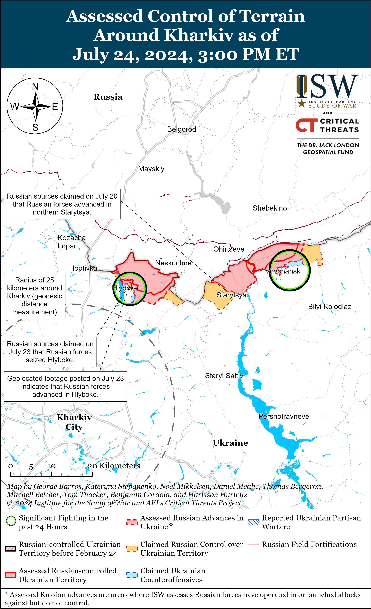
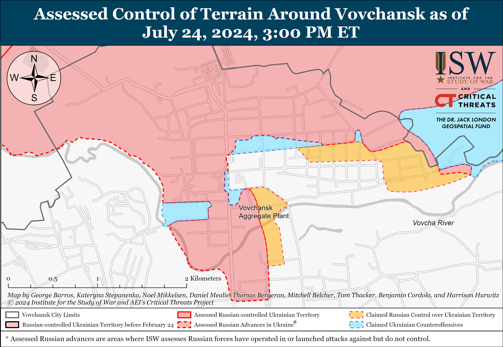
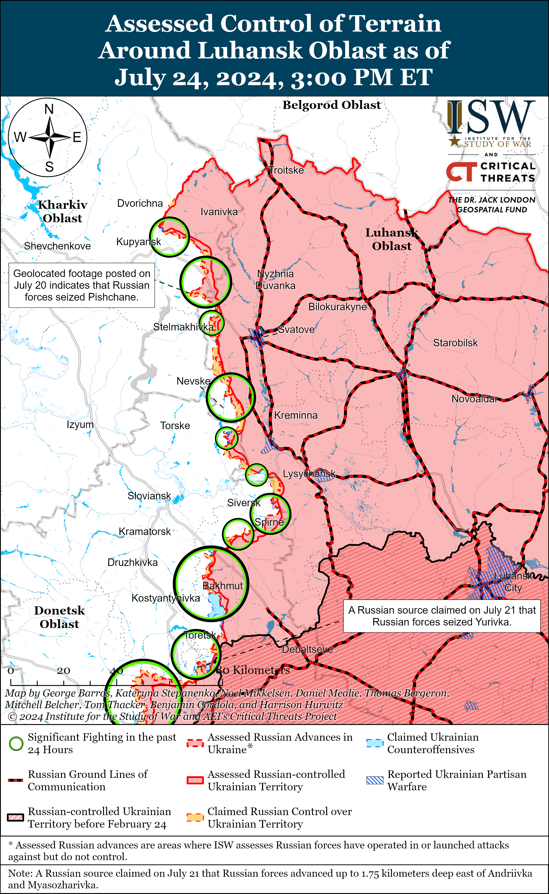
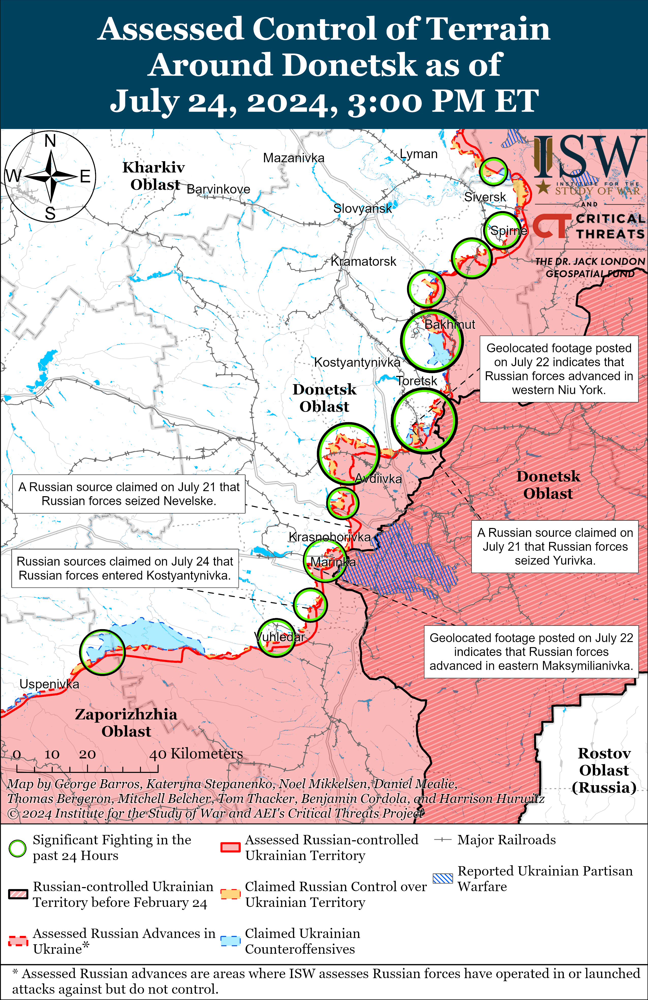
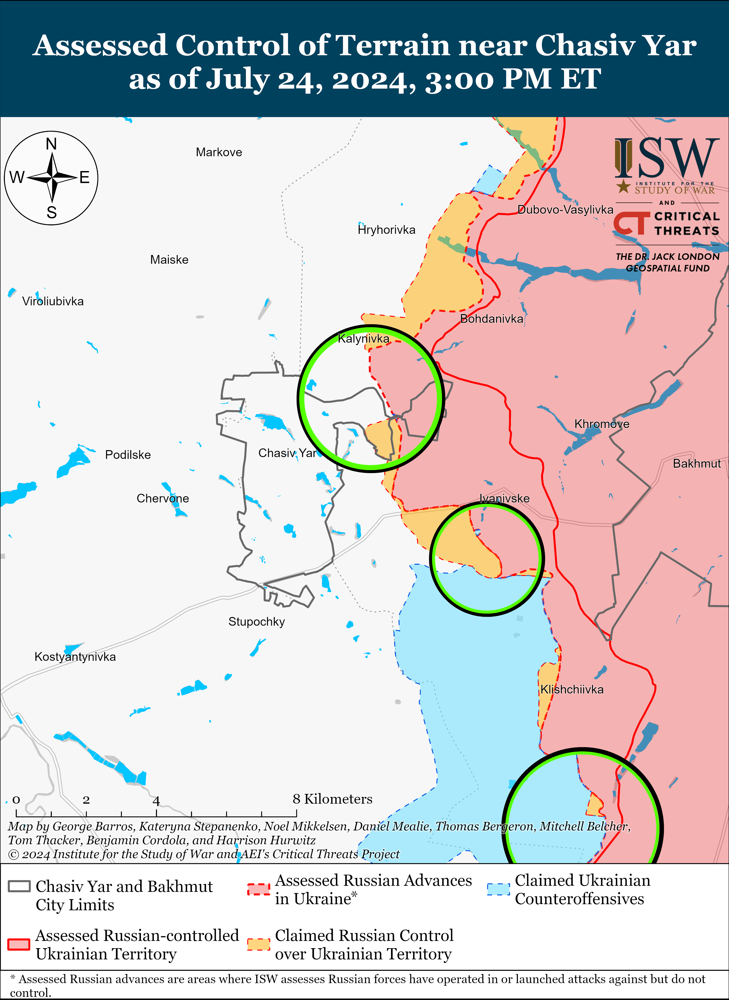
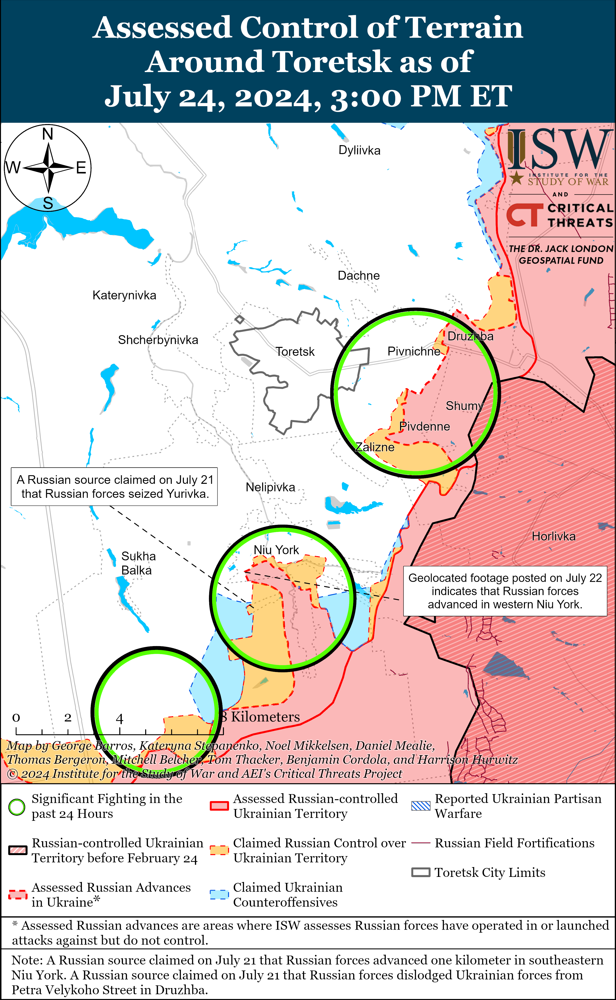
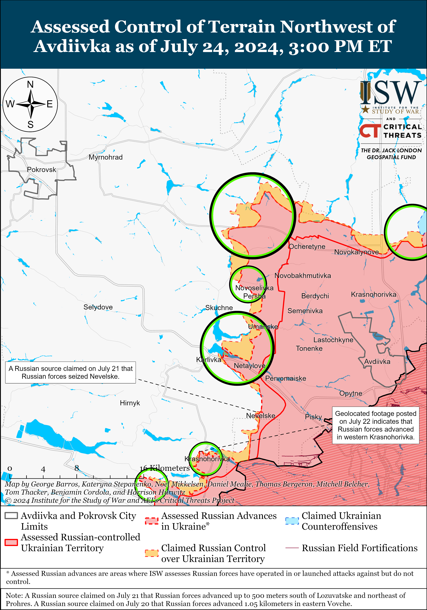
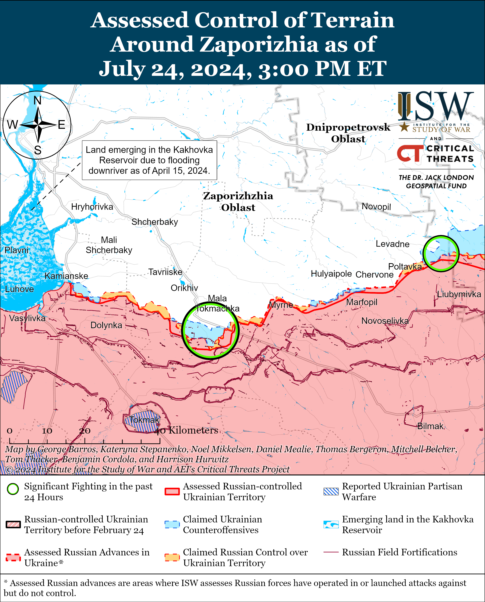
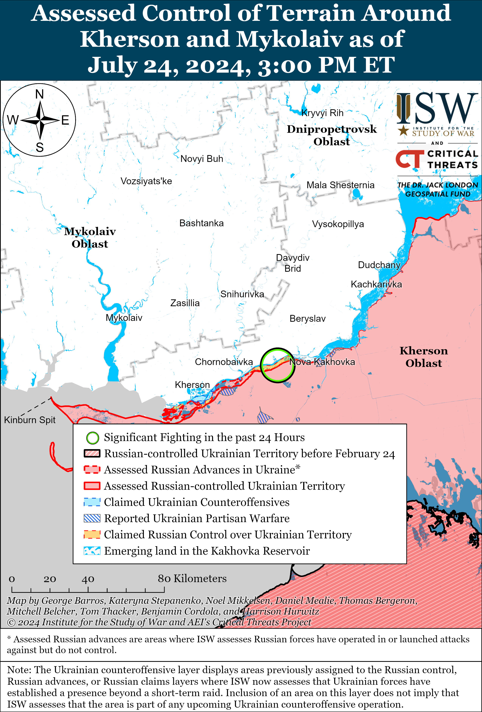

# Russian Offensive Campaign Assessment, July 24, 2024

**Angelica Evans, Nicole Wolkov, Riley Bailey, Grace Mappes, Davit Gasparyan, Karolina Hird, and George Barros**

**July 24, 2024, 6:45pm ET**

**Click**[**here**](https://storymaps.arcgis.com/stories/36a7f6a6f5a9448496de641cf64bd375)**to see ISW’s interactive map of the Russian invasion of Ukraine. This map is updated daily alongside the static maps present in this report.**

**Click**[**here**](https://understandingwar.maps.arcgis.com/apps/instant/3dviewer/index.html?appid=1602762dbcde419bb957dea358449580)**to see ISW’s 3D control of terrain topographic map of Ukraine. Use of a computer (not a mobile device) is strongly recommended for using this data-heavy tool.**

**Click**[**here**](https://storymaps.arcgis.com/stories/733fe90805894bfc8562d90b106aa895)**to access ISW’s archive of interactive time-lapse maps of the Russian invasion of Ukraine. These maps complement the static control-of-terrain map that ISW produces daily by showing a dynamic frontline. ISW will update this time-lapse map archive monthly.**

**Note: The data cut-off for this product was 12:30pm ET on July 24. ISW will cover subsequent reports in the July 25 Russian Offensive Campaign Assessment.**

**Ukrainian Commander-in-Chief Colonel General Oleksandr Syrskyi stated that the Russian military has significantly increased its manpower and materiel commitments to the war in Ukraine over the last two and a half years, but Syrskyi’s statement is not indicative of a sudden increase in the Russian military’s presence in Ukraine and is instead representative of the manpower and material disadvantage that Ukrainian forces have faced for over two years.**Syrskyi told UK outlet *The Guardian* in an interview published on July 24 that Russian forces currently have 520,000 personnel committed to the war in Ukraine and that the Russian military aims to have 690,000 personnel committed to the war by the end of 2024.[1] Syrskyi noted that fighting is ongoing along 977 kilometers of the 3,700-kilometer-long frontline and reiterated that the Russian military command continues to pursue tactical gains regardless of significant manpower losses, while Ukrainian forces are attempting to safeguard the lives of Ukrainian troops. Syrskyi stated that Russian forces currently have a two-to-one or three-to-one equipment advantage over Ukrainian forces and that Russian forces have doubled the number of Russian tanks and armored personnel carriers and tripled the number of artillery systems in Ukraine since 2022. Syrskyi’s comparison of the current Russian military contingent committed to Ukraine with the initial invasion force underscores the difference between the military force that Russia has gradually staffed and supplied over two and half years for a long war effort and the initial and ill-prepared invasion force that the Kremlin wrongly assessed could quickly depose the Ukrainian government in February 2022. Syrskyi noted that the Ukrainian military command is focused on addressing supply challenges in order to defend against ongoing Russian offensive operations and highlighted the fact that Ukrainian forces are successfully conducting defensive operations despite the materiel disparity between Russian and Ukrainian forces.

Russia’s ability to continue gradually expanding the amount of manpower and materiel it has committed to Ukraine faces significant constraints in the medium to long term. The Russian military has extensively relied on refurbishing stocks of Soviet-era weapons and military equipment to sustain the tempo of its offensive operations in Ukraine in order to avoid fully mobilizing the Russian economy and society to a war-time footing, and Ukrainian authorities have noted that Russia is currently not producing enough to cover its current equipment losses in Ukraine.[2] The British International Institute for Strategic Studies (IISS) think tank reported in February 2024 that Russia will likely be able to sustain losing over 3,000 armored fighting vehicles annually for at least two or three more years (until about 2026–2027) by refurbishing Soviet-era vehicles in storage.[3] The Russian government will likely have to further mobilize the Russian economy and defense industry if the Russian military intends to sustain its current tempo of operations in the medium- to long-term as Russia depletes its finite Soviet stockpiles, but it is unclear if the Russian defense industry will be able to produce enough vehicles to sustain a high level of equipment losses even with further economic mobilization. Further economic mobilization will likely be deeply unpopular among Russians who are largely apathetic towards the war so long as it does not impact their daily life, and the policy change could strain domestic support for the war.[4]

Russia’s ongoing force-generation efforts have allowed Russian forces to sustain their current tempo of offensive operations and maintain their current personnel replacement rate in Ukraine. Russian force-generation efforts so far have not enabled Russian forces to build up a significantly larger force in Ukraine and the Russian military remains incapable of conducting significantly intensified large-scale Russian offensive operations.[5] Russian President Vladimir Putin stated in December 2023 that there were 617,000 Russian personnel in the “combat zone,” likely referring to all Russian military personnel in the zone of the “special military operation,” which includes rear areas and staging areas in Russia’s border areas neighboring Ukraine.[6] Putin stated in June 2024 that there are almost 700,000 Russian personnel in the “special military operation zone.”[7] Ukrainian Ground Forces Commander Lieutenant General Oleksandr Pavlyuk stated that as of May 3 there were roughly between 510,000 and 515,000 Russian personnel deployed to Ukraine.[8] It is unclear how long Russia will be able to sustain its current force generation rates, and Pavlyuk’s and Syrskyi’s statements further indicate that Russia’s force generation efforts are generating roughly enough personnel to maintain Russia’s current replacement rate but not significantly increase the number of Russian personnel in Ukraine. Syrskyi’s statements highlight that Ukrainian forces have successfully defended and liberated territory in the face of a Russian military with significant manpower and material advantages over the past two and a half years, and ISW continues to assess that Ukrainian forces can contest the battlefield initiative and eventually set conditions to conduct both limited and large-scale counteroffensive operations with timely and appropriate Western security assistance.[9]

**Ukrainian Foreign Minister Dmytro Kuleba met with People’s Republic of China (PRC) Foreign Minister Wang Yi in Guangzhou on July 24 and discussed the war in Ukraine and the PRC’s potential role in a future negotiated settlement of the war.**[10]Both sides offered slightly divergent interpretations of the talks — Kuleba emphasized that a just peace in Ukraine is in the PRC’s strategic interests and that while Ukraine remains ready to negotiate with Russia “at a certain stage,” Russia is not yet displaying the readiness to reciprocate.[11] By contrast, Wang emphasized that *both* Ukraine and Russia have signaled their willingness to negotiate “to varying degrees,” but that “conditions and timing are not yet ripe.”[12] Wang also stressed the PRC’s desire to act as a mediator and highlighted the recent Chinese-Brazilian six-point peace plan that calls for a peace conference on the war that includes both Russia and Ukraine.[13] Wang’s suggestion that both Russia and Ukraine are ready to consider some sort of negotiations reflects the PRC’s general diplomatic and rhetorical alignment with Russia on the topic of negotiations and helps further the Russian narrative that Ukraine is the party refusing negotiations, whereas ISW has frequently assessed that it is Rus sia that has no interest in good-faith negotiations with Ukraine on any terms but the Kremlin’s demands for Ukrainian capitulation.[14] Western sources have also noted that the PRC has attempted to undermine Ukraine’s ability to secure an international coalition of supporters, further emphasizing the rift between desired outcomes for the PRC, Russia, and Ukraine.[15]

**The Russian State Duma adopted an amendment on July 24 that will allow Russian commanders to punish subordinates for using personal communication and navigation devices at the frontline, drawing continued backlash from Russian ultranationalists as well as other Duma deputies.**[16]Several Russian Duma deputies explicitly opposed the bill and called for Russian officials to allow frontline Russian commanders to inform military policy.[17] Russian ultranationalist milbloggers widely continued to criticize the amendment and expressed concerns that Russian military officials intend to use punishments for personal device usage to settle personal conflicts and censor legitimate complaints from Russian servicemembers, who often use personal devices to record and disseminate complaints.[18] Russian ultranationalists continued to lament the potential impacts of the amendment on the frontline, where Russian forces rely on insecure devices to organize command and control (C2), logistics, and combat operations.[19] Russian-backed former Ukrainian separatist politician Oleg Tsaryov pointedly stated that the amendment will be a serious blow to Russian Defense Minister Andrei Belousov’s image and claimed that the amendment is clearly the Russian Ministry of Defense’s (MoD) initiative.[20] Other Russian ultranationalists focused their outrage on Russian Duma deputies, particularly on the State Duma Defense Committee and its head Andrei Kartapolov, accusing the deputies of being out of touch with the realities of the war in Ukraine and expressing an animus towards the State Duma that ultranationalists usually reserve for the Russian MoD.[21] It remains unclear if the Russian military command will be able or willing to enforce punishment for the use of personal devices in Ukraine, and the Russian military will likely find it extremely difficult to eliminate its dependence on insecure personal devices for many frontline tasks.[22]

**The Georgian State Security Service (SUS or SSSG) reiterated standard Kremlin information operations targeting former Georgian opposition figures and former Ukrainian law enforcement officials.** The SUS announced on July 24 that it is investigating “former senior Georgian government officials” and “former employees of Ukrainian law enforcement agencies” for organizing and financing attempts to overthrow the government by violent means and terrorist acts, including “preparations to murder [Georgian Dream Party founder and former Georgian Prime Minister] Bidzina Ivanishvili.”[23] The SUS recently charged several Georgian volunteers who have served alongside Ukrainian forces with “conspiracy to overthrow the government” and “terrorism.”[24] Georgian Legion Commander Mamuka Mamulashvili stated that Georgian authorities placed roughly 300 Georgian citizens who served as volunteers in the Georgian Legion on Georgia’s wanted list, although did not specify with which alleged crimes the Georgian Legion volunteers were charged.[25] The SUS blamed Georgians living abroad and fighting in Ukraine and other perceived opposition actors for inciting protests against Georgia’s Russian-style “foreign agents” bill in May 2024.[26] The SUS also made unsubstantiated claims in September 2023 that former Georgian officials, Ukrainian military intelligence officials of Georgian descent, and Georgians fighting with Ukrainian forces in Ukraine were plotting a violent coup.[27] The Kremlin has routinely used the narrative of a “violent coup” in Ukraine to misrepresent Ukraine’s 2014 Revolution of Dignity and protests for Ukrainian European Union integration and blames external actors for domestic protests, and the SUS’ statements increasingly mirror Kremlin rhetoric.

The SUS’ ongoing information operation alleging that Georgian opposition figures and Ukrainian actors are implicated in a conspiracy to violently overthrow the Georgian government not only advances Kremlin information operations but also aims to grant the Georgian Dream Party carte blanche justifications to suppress domestic political opposition within Georgia in the future. The Georgian Dream Party may seek to implicate Russian actors in such allegations in the future in order to justify authoritarian censorship bills that mirror Russian censorship laws while pandering to the Georgian public, which widely distrusts Russia given Russia’s occupation of parts of Georgia among other factors. The Georgian Dream Party may be purposefully centering its information operations around a coup attempt since Georgian Dream could plausibly accuse Russian actors of trying to organize such attempts. The degree of coordination between the Kremlin and the Georgian government on their increasingly similar rhetoric is unclear, although Ivanishvili very likely has ties to the Kremlin.[28] Kremlin actors will seize on Georgian Dream’s authoritarian impulses to purposefully derail Georgia’s long-term efforts for Euro-Atlantic integration and advance Russian hybrid operations to divide, destabilize, and weaken Georgia regardless of whether Georgian Dream is directly coordinating with the Kremlin.

**An assassination attempt injured a reported senior Russian military intelligence officer in Moscow City on July 24.**Russian officials claimed on July 24 that Russian citizen Yevgeny Serebryakov attached an improvised explosive device (IED) to car at about 0230 local time on July 24 and that the IED detonated at about 0630 local time when a man and his wife started the car, severely injuring them.[29] Russian sources reported that the attack injured Andrey Torgashev, allegedly a senior officer of the Russian Main Military Intelligence Directorate (GRU) who previously served with GRU Unit 45807, a psychological operations unit reportedly directly subordinate to the head of the GRU.[30] Russian sources initially misidentified the victim as another Andrey Torgashev, the Deputy Commander of the 89th Satellite Communications Center (Strategic Missile Forces Central Communications Center), who made a statement to Russian state media that he was not involved or injured in the explosion.[31] Serebryakov fled to Turkey and arrived around 0930 on July 24, upon which Turkish authorities later detained him and are preparing to extradite him to Russia.[32] A Russian court charged Serebryakov with two counts of attempted murder, and Russian media reported that Russian authorities are investigating the involvement of Ukrainian special services in the assassination attempt and that prosecutors may change Serebryakov’s charges to terrorism.[33]

**Key Takeaways:**

- Ukrainian Commander-in-Chief Colonel General Oleksandr Syrskyi stated that the Russian military has significantly increased its manpower and materiel commitments to the war in Ukraine over the last two and a half years, but Syrskyi’s statement is not indicative of a sudden increase in the Russian military’s presence in Ukraine and is instead representative of the manpower and material disadvantage that Ukrainian forces have faced for over two years.
- Ukrainian Foreign Minister Dmytro Kuleba met with People’s Republic of China (PRC) Foreign Minister Wang Yi in Guangzhou on July 24 and discussed the war in Ukraine and the PRC’s potential role in a future negotiated settlement of the war.
- The Russian State Duma adopted an amendment on July 24 that will allow Russian commanders to punish subordinates for using personal communication and navigation devices at the frontline, drawing continued backlash from Russian ultranationalists as well as other Duma deputies.
- The Georgian State Security Service (SUS or SSSG) reiterated standard Kremlin information operations targeting former Georgian opposition figures and former Ukrainian law enforcement officials.
- An assassination attempt injured a reported senior Russian military intelligence officer in Moscow City on July 24.
- Russian forces recently marginally advanced north of Kharkiv City and near Avdiivka and Donetsk City.
- Russian officials continue efforts to entice Russians into military service with monetary incentives.

***We do not report in detail on Russian war crimes because these activities are well-covered in Western media and do not directly affect the military operations we are assessing and forecasting. We will continue to evaluate and report on the effects of these criminal activities on the Ukrainian military and the Ukrainian population and specifically on combat in Ukrainian urban areas. We utterly condemn Russian violations of the laws of armed conflict and the Geneva Conventions and crimes against humanity even though we do not describe them in these reports.***

- Russian Main Effort – Eastern Ukraine (comprised of three subordinate main efforts)
- Russian Subordinate Main Effort #1 – Push Ukrainian forces back from the international border with Belgorod Oblast and approach to within tube artillery range of Kharkiv City
- Russian Subordinate Main Effort #2 – Capture the remainder of Luhansk Oblast and push westward into eastern Kharkiv Oblast and encircle northern Donetsk Oblast
- Russian Subordinate Main Effort #3 – Capture the entirety of Donetsk Oblast
- Russian Supporting Effort – Southern Axis
- Russian Air, Missile, and Drone Campaign
- Russian Mobilization and Force Generation Efforts
- Russian Technological Adaptations
- Activities in Russian-occupied areas
- Ukrainian Defense Industrial Base Efforts
- Russian Information Operations and Narratives
- Significant Activity in Belarus

**Russian Main Effort – Eastern Ukraine**

**Russian Subordinate Main Effort #1 – Kharkiv Oblast****(Russian objective: Push Ukrainian forces back from the international border with Belgorod Oblast and approach to within tube artillery range of Kharkiv City)**

Russian forces conducted a limited cross-border attack northwest of Kharkiv City on July 24. The Ukrainian General Staff reported that Russian forces conducted a ground attack near Sotnytskyi Kozachok (northwest of Kharkiv City directly on the border with Belgorod Oblast).[34] ISW has not observed visual evidence confirming that Russian forces gained positions in Sotnytskyi Kozachok as a result of the raid, however, and continues to assess that Russian forces do not have an enduring presence in the settlement.

Russian forces recently advanced north of Kharkiv City amid continued positional fighting in northern Kharkiv Oblast on July 24. Geolocated footage published on July 23 indicates that Russian forces recently advanced westward to Polova Street in western Hlyboke (north of Kharkiv City).[35] Russian sources continue to claim that Russian forces have captured all or nearly all of Hlyboke despite Ukrainian counterattacks, generally consistent with evidence of Russian advances up to Polova Street.[36] Positional fighting continued near Hlyboke, Vovchansk (northeast of Kharkiv City), Tykhe (just east of Vovchansk), and Starytsya (southwest of Vovchansk) July 23 and 24.[37] A Russian milblogger claimed that Ukrainian forces are counterattacking near Starytsya and that there are small arms battles within Vovchansk near high-rise buildings.[38] A Russian milblogger claimed that the Russian 155th Naval Infantry Brigade (Pacific Fleet) are operating in the Kharkiv direction.[39]

**Russian Subordinate Main Effort #2 – Luhansk Oblast****(Russian objective: Capture the remainder of Luhansk Oblast and push westward into eastern Kharkiv Oblast and northern Donetsk Oblast)**

Russian forces reportedly continued to advance southeast of Kupyansk on July 24, but there were no confirmed changes to the frontline. Russian milbloggers claimed on July 24 that Russian forces advanced in fields south and west of Pishchane (southeast of Kupyansk), although ISW has not observed visual confirmation of these claims.[40] Another milblogger reiterated claims that Russian forces advanced 800 meters deep within Pishchane and assessed that Russian forces will use positions in this area to intensify attacks westward towards the Oskil River, which is currently about nine kilometers away from the furthest extent of ISW’s assessment of Russian forces’ forward line of own troops in the area.[41] Russian Defense Minister Andrei Belousov credited the Russian 15th Motorized Rifle Regiment (2nd Motorized Rifle Division, 1st Guards Tank Army [GTA], Moscow Military District [MMD]) for the seizure of Pishchane and the 13th Tank Regiment (4th Guards Tank Division, 1st GTA, MMD) for the seizure of Andriivka (just west of Svatove), although ISW has not observed visual evidence suggesting that Russian forces are operating in Andriivka at this time.[42] Russian and Ukrainian sources reported continued fighting northeast of Kupyansk near Synkivka; southeast of Kupyansk near Petropavlivka, Pishchane, Kolesnykivka, and Hlushkivka; northwest of Svatove near Stelmakhivka; west of Svatove near Andriivka; northwest of Kreminna near Makiivka, Nevske, and Terny; and southwest of Kreminna in the Serebryanske forest area.[43] Elements of the 144th Motorized Rifle Division (20th Combined Arms Army [CAA], MMD) are reportedly operating near Nevske.[44]

**Russian Subordinate Main Effort #3 – Donetsk Oblast****(Russian objective: Capture the entirety of Donetsk Oblast, the claimed territory of Russia’s proxies in Donbas)**

Russian forces reportedly recently advanced amid continued offensive operations in the Siversk direction on July 24. The Ukrainian General Staff reported on July 24 that Russian forces recently achieved some tactical success south of Siversk near Vyimka and Pereizne.[45] A Russian milblogger claimed that Russian forces advanced 400 meters westward along a windbreak north of Rozdolivka (south of Siversk) and that Russian forces are clearing Ivano-Darivka (southeast of Siversk) and attacking to the north.[46] Russian forces also continued attacks east of Siversk near Verkhnokamyanske and southeast of Siversk near Spirne on July 23 and 24.[47] Elements of the Russian 106th Airborne (VDV) Division, including its 55th VDV Regiment, are reportedly fighting near Vyimka and Pereizne and elements of the 2nd Artillery Brigade (2nd Luhansk People’s Republic Army Corps [LNR AC]) are reportedly operating in the Siversk direction.[48]

Russian forces did not make confirmed advances amid continued offensive operations near Chasiv Yar on July 24. Russian forces continued ground attacks within eastern Chasiv Yar; north of Chasiv Yar near Kalynikva, Novomarkove, and Orikhovo-Vasylivka; east of Chasiv Year near Ivanivske; southeast of Chasiv Yar near Klishchiivka and Andriivka; and south of Chasiv Yar near Bila Hora and Stupochky on July 23 and 24.[49] A Russian milblogger claimed that Ukrainian forces are conducting counterattacks south of Kalynivka from positions in a series of windbreaks in the area.[50]

Russian forces reportedly recently advanced south of Toretsk amid continued offensive operations near Toretsk on July 24. Russian milbloggers claimed on July 23 and 24 that Russian forces advanced in fields both north and south of Yurivka (south of Toretsk) and that Russian forces also achieved tactical successes within Niu York (south of Toretsk and north of Yurivka) and in fields east of Niu York.[51] Russian forces also continued ground attacks near Toretsk; north of Toretsk near Dyliivka; east of Toretsk near Pivnichne; southeast of Toretsk near Zalizne; and southwest of Toretsk near Panteleymonivka on July 23 and 24.[52] The Ukrainian General Staff reported on July 24 that Russian forces conducted about 80 percent of their attacks in this direction near Pivnichne and Zalizne.[53] Russian milbloggers published footage on July 23 of a Russian Kh-38 missile strike against a bridge near Shcherbynivka (west of Toretsk) on an unspecified date.[54]

Russian forces recently made a confirmed advance northwest of Avdiivka amid continued ground attacks in the Avdiivka direction on July 24. Geolocated footage published on July 24 shows that elements of the Russian 114th Motorized Rifle Brigade (1st Donetsk People’s Republic Army Corps [DNR AC]) have advanced into central and western Novoselivka Persha (northwest of Avdiivka) from the southeast.[55] A Russian milblogger claimed that Russian Aerospace Forces (VKS) conducted heavy airstrikes against Ukrainian near-rear areas in Novoselivka Persha and Zhelanne (west of Novoselivka Persha across the Vovcha River) overnight on July 23 to 24, after which Russian forces broke through Ukrainian defensive lines within central and southern Novoselivka Persha and seized most of the settlement except for two streets within western Novoselivka Persha.[56] Some Russian milbloggers claimed that Russian forces seized the entirety of Novoselivka Persha, advanced in fields west of Prohres and Lozuvatske, and entered northern Vovche (all northwest of Novoselivka Persha) but ISW has not observed confirmation of these claims.[57] Some milbloggers claimed that Ukrainian forces are beginning to withdraw from Vovche and near Prohres to avoid a Russian tactical encirclement.[58] Russian forces also continued attacks northwest of Avdiivka near Vozdvyzhenka and Novooleksandrivka, west of Avdiivka near Umanske and Yasnobrodivka, and southwest of Avdiivka near Karlivka on July 23 and 24.[59]

Russian forces reportedly advanced southwest of Donetsk City on July 24, but there were no confirmed changes to the frontline. Russian milbloggers claimed that Russian forces broke through Ukrainian defenses and reached the eastern outskirts of Kostyantynivka (southwest of Donetsk City) and that Russian forces have also established fire (artillery) control over the T0524 Kostyantynivka-Vuhledar road.[60] One Russian milblogger claimed that Ukrainian sources have confirmed that Russian forces entered Kostyantynivka, but ISW has not yet observed visual confirmation of Russian forces operating on the outskirts of this settlement.[61] Milbloggers additionally claimed that Russian forces are advancing in Krasnohorivka (west of Donetsk City), with one milblogger claiming that Russian forces advanced up to 800 meters within the settlement and are 500 meters from Krasnohorivka’s western entrance.[62] The Ukrainian General Staff reported that Ukrainian forces repelled Russian attacks west of Donetsk City near Krasnohorivka and Heorhiivka and southwest of Donetsk City near Paraskoviivka, Kostyantynivka, Vodyane, and Vuhledar.[63] Elements of the 238th Artillery Brigade (8th Combined Arms Army [CAA], Southern Military District [SMD]) and 110th and 5th motorized rifle brigades (both of the 1st DNR AC) are reportedly operating in Krasnohorivka.[64]

Russian forces continued limited offensive operations in the Donetsk-Zaporizhia Oblast border area on July 24 but did not make any confirmed advances. The Ukrainian General Staff reported that Russian forces attacked near Novodarivka (southwest of Velyka Novosilka).[65] Ukrainian military observer Kostyantyn Mashovets reported that elements of the Russian 37th Motorized Brigade (36th CAA, Eastern Military District [EMD]), 5th Tank Brigade (36th CAA, EMD), and 40th Naval Infantry Brigade (Pacific Fleet) are attacking from positions along the Mokryi Yaly River towards Urozhaine and Blahodatne (all south of Velyka Novosilka), while elements of the 394th and 144th motorized rifle regiments and 218th Tank Regiment (all of the 127th Motorized Rifle Division, 5th CAA, EMD) are trying to break through from Staromayorske towards Makarivka (also south of Velyka Novosilka).[66] Elements of the 60th Motorized Rifle Brigade (5th CAA, EMD) are also reportedly operating near Urozhaine, while elements of the 14th Spetsnaz Brigade (Russian General Staff’s Main Intelligence Directorate [GRU]) are operating in an unspecified area of the southern Donetsk Oblast direction (generally the Donetsk-Zaporizhia Oblast border area).[67]

Geolocated footage published on July 23 shows a Ukrainian HIMARS strike against a Russian “Yastreb-AV” counterbattery radar station northeast of Zuhres (east of Donetsk City).[68]

**Russian Supporting Effort – Southern Axis****(Russian objective: Maintain frontline positions and secure rear areas against Ukrainian strikes)**

Russian forces continued ground assaults in western Zaporizhia Oblast northeast of Robotyne near Mala Tokmachka on July 24, but there were no confirmed changes to the frontline.[69]

Russian forces continued assaults in east (left) bank Kherson Oblast, including near Krynky and on the islands of the Dnipro River delta, on July 24.[70] Elements of the Russian 80th Arctic Brigade (14th Army Corps [AC], Leningrad Military District [LMD]) are reportedly operating in the Kherson direction.[71]

The Ukrainian General Staff reported on July 23 that Ukrainian forces damaged the “Slavyanin” ferry at the port of Kavkaz, Krasnodar Krai during a drone strike on the night of July 22 to 23.[72] The Ukrainian General Staff specified that Russian forces used the ferry to transport railway cars, vehicles, and containers for military purposes and that this was the last functioning ferry of three ferries that Russian forces used in the area to cross the Kerch Strait. Russian forces routinely use ferries in the area to relieve pressures on the Russian ground line of communication (GLOC) connecting Krasnodar Krai and occupied Crimea across the Kerch Strait Bridge.[73]

**Russian Air, Missile, and Drone Campaign****(Russian Objective: Target Ukrainian military and civilian infrastructure in the rear and on the frontline)**

Russian forces launched missile and drone strikes against Ukraine on the night of July 23 to 24. Ukrainian Air Force Commander Lieutenant General Mykola Oleshchuk reported that Russian forces launched an Iskander-M ballistic missile and a missile of an unknown type at Kharkiv Oblast from Belgorod Oblast and 23 Shahed-136/131 drones from Primorsko-Akhtarsk, Krasnodar Krai and occupied Crimea.[74] Oleshchuk reported that Ukrainian forces downed 17 Shahed drones, mostly over Odesa Oblast. Ukraine’s Kharkiv Group of Forces reported that a Russian missile strike against Kharkiv City damaged the office of the Swiss Foundation for Mine Action in Nemyshlyanskyi Raion.[75] Odesa Oblast Military Administration Head Oleh Kiper stated that Russian drone strikes damaged port infrastructure in Izmailskyi Raion on July 24.[76]

The Russian Ministry of Defense (MoD) posted footage on July 24 purportedly showing Russian forces conducting an Iskander-M ballistic missile strike against a Ukrainian command post near Lyman, Donetsk Oblast.[77] ISW has not observed any independent confirmation of this alleged strike.

**Russian Mobilization and Force Generation Efforts****(Russian objective: Expand combat power without conducting general mobilization)**

Russian officials continue efforts to entice Russians into military service with monetary incentives. A Russian Telegram channel dedicated to military recruitment in St. Petersburg published a recruitment ad for the Russian 76th Guards Airborne Assault (VDV) Division and the 44th “Leningrad” Brigade (likely a reformed Soviet-era unit) and claimed that recruits can receive a one-time payment of 1.7 million rubles (roughly $19,700) and a monthly salary beginning at 210,000 rubles (roughly $2,400) for signing a military service contract with these formations.[78] The channel claimed that recruits can receive an additional 50,000 rubles (roughly $580) for each destroyed piece of Ukrainian military equipment or each kilometer that the servicemember’s unit advances on the frontline. The channel noted that recruits and their families will receive benefits and social support and that recruits will receive an additional 15 days of leave.

**Russian Technological Adaptations****(Russian objective: Introduce technological innovations to optimize systems for use in Ukraine)**

Nothing significant to report.

**Ukrainian Defense Industrial Efforts (Ukrainian objective: Develop its defense industrial base to become more self-sufficient in cooperation with US, European, and international partners)**

*ISW is not publishing coverage of Ukrainian defense industrial efforts today.*

**Activities in Russian-occupied areas****(Russian objective: Consolidate administrative control of annexed areas; forcibly integrate Ukrainian citizens into Russian sociocultural, economic, military, and governance systems)**

*ISW is not publishing coverage of Russian-occupied areas of Ukraine today.*

**Russian Information Operations and Narratives**

The Russian Ministry of Defense (MoD) claimed on July 24 that Russian forces prevented United Kingdom (UK) Royal Air Force (RAF) aircraft from entering Russian “airspace” over the Black Sea, likely to support information operations threatening escalation with the West over Western support for Ukraine.[79] The Russian MoD claimed that Russian forces sortied a Su-27 fixed-wing aircraft after identifying two RAF aircraft approaching Russian airspace over the Black Sea and that the two RAF aircraft then turned around.[80] Kremlin newswire *TASS*editorialized the Russian MoD’s claims and alleged that the Su-27 escorted the two RAF aircraft away from Russian airspace.[81] Russian sources did not specify where the incident occurred, but Russian claims about violations of airspace over the Black Sea likely also intend to legitimize Russia’s illegal occupation of Crimea and the associated (and illegal) expanded Russian claims to airspace over the Black Sea.

Russian sources amplified a Ukrainian official’s criticisms of Ukrainian Commander-in-Chief Colonel General Oleksandr Syrskyi on July 24 in order to weaken Ukrainian trust in Ukrainian military leadership.[82]

Russian Ministry of Foreign Affairs (MFA) Spokesperson Maria Zakharova continues to use rhetorical allusions to Ukraine to threaten Moldova. Zakharova claimed on July 24 that Moldovan authorities are pursuing a policy of “Romanianization” and “Ukrainization” under the guise of European integration and accused Moldovan President Maia Sandu of promoting anti-Russian sentiments.[83] Kremlin officials routinely allege that Moldova’s aspirations for European integration will lead to the erasure of Moldovan identity as part of the Kremlin’s ongoing efforts to destabilize Moldova and prevent Moldova’s European Union (EU) accession.[84]

**Significant activity in Belarus****(Russian efforts to increase its military presence in Belarus and further integrate Belarus into Russian-favorable frameworks and Wagner Group activity in Belarus)**

Nothing significant to report.

**Note: ISW does not receive any classified material from any source, uses only publicly available information, and draws extensively on Russian, Ukrainian, and Western reporting and social media as well as commercially available satellite imagery and other geospatial data as the basis for these reports. References to all sources used are provided in the endnotes of each update.**

---

[1] https://www.theguardian.com/world/article/2024/jul/24/i-know-we-will-win-and-how-ukraines-top-general-on-turning-the-tables-against-russia

[2] https://understandingwar.org/backgrounder/russian-offensive-campaign-assessment-july-10-2024 ; https://www.wsj.com/world/russia-is-pumping-out-weaponsbut-can-it-keep-it-up-ba30bb04 ; https://isw.pub/UkrWar040524 ; https://understandingwar.org/backgrounder/russian-offensive-campaign-assessment-march-9-2024 ; https://understandingwar.org/backgrounder/russian-offensive-campaign-assessment-february-13-2024 ; https://understandingwar.org/backgrounder/russian-offensive-campaign-assessment-june-7-2024

[3] https://isw.pub/UkrWar050824

[4] https://isw.pub/UkrWar070524 ; https://isw.pub/UkrWar040424 ; https://isw.pub/UkrWar022424 ; https://isw.pub/UkrWar021624

[5] https://understandingwar.org/backgrounder/russian-offensive-campaign-assessment-june-6-2024 ; https://understandingwar.org/backgrounder/how-delays-western-aid-gave-russia-initiative-ukrainian-counteroffensive-kharkiv ; https://isw.pub/UkrWar060724 ; https://isw.pub/UkrWar050324

[6] http://kremlin dot ru/events/president/news/6784 ; https://understandingwar.org/backgrounder/russian-offensive-campaign-assessment-december-14-2023

[7] https://understandingwar.org/backgrounder/russian-offensive-campaign-assessment-june-14-2024

[8] ; https://isw.pub/UkrWar060524

[9] https://isw.pub/UkrWar070324 ; https://isw.pub/UkrWar042024 ; https://isw.pub/UkrWar071224

[10] https://mfa.gov dot ua/news/dmitro-kuleba-spravedlivij-mir-v-ukrayini-vidpovidaye-strategichnim-interesam-kitayu; https://www.fmprc.gov dot cn/wjbzhd/202407/t20240724\_11459443.shtml; https://www.reuters.com/world/ukraines-top-diplomat-meets-chinas-wang-yi-talks-guangzhou-2024-07-24/

[11] https://mfa.gov dot ua/news/dmitro-kuleba-spravedlivij-mir-v-ukrayini-vidpovidaye-strategichnim-interesam-kitayu

[12] https://www.fmprc dot gov.cn/wjbzhd/202407/t20240724\_11459443.shtml

[13] https://www.mfa dot gov.cn/eng/zxxx\_662805/202405/t20240523\_11310698.html; https://www.reuters.com/world/china-pushes-rival-ukraine-peace-plan-before-swiss-summit-diplomats-say-2024-06-13/; https://www.gov dot br/planalto/en/latest-news/2024/05/brazil-and-china-present-joint-proposal-for-peace-negotiations-with-the-participation-of-russia-and-ukraine

[14] https://isw.pub/UkrWar071924; https://isw.pub/UkrWar071524; https://isw.pub/UkrWar071224

[15] https://www.ft.com/content/f7a34e3e-bce9-4db9-ac49-a092f382c526; https://www.reuters.com/world/china-pushes-rival-ukraine-peace-plan-before-swiss-summit-diplomats-say-2024-06-13

[16] https://t.me/tass\_agency/262279 ; https://sozd.duma dot gov.ru/bill/289614-8

[17] https://t.me/deputatdvkuznetsov/2230 ; https://www.gazeta dot ru/army/news/2024/07/23/23519845.shtml

[18] https://t.me/dva\_majors/47994; https://t.me/zhivoff/15855; https://t.me/mig41/35454; https://t.me/AlexCarrier/8025; https://t.me/dva\_majors/47987; https://t.me/olegtsarov/14172; https://t.me/dva\_majors/47991; https://t.me/dva\_majors/47982; https://t.me/dva\_majors/48002; https://t.me/epoddubny/20488; https://t.me/dva\_majors/48003; https://t.me/dva\_majors/48004; https://t.me/dva\_majors/48005; https://t.me/dva\_majors/48008 ; https://t.me/dva\_majors/48010; https://t.me/belarusian\_silovik/38170; https://t.me/dva\_majors/48011; https://t.me/dva\_mjors\_kOrtiZoL/119 ; https://t.me/wargonzo/21190 ; https://t.me/philologist\_zov/1145 ; https://t.me/sashakots/47997 ; https://t.me/epoddubny/20488 ; https://t.me/epoddubny/20490 ; https://t.me/epoddubny/20492; https://t.me/sashakots/48000

[19] https://understandingwar.org/backgrounder/russian-offensive-campaign-assessment-july-23-2024 ; https://t.me/wargonzo/21190 ; https://t.me/dva\_majors/48001; https://t.me/MedvedevVesti/18118 ; https://t.me/milinfolive/126692 ; https://t.me/sashakots/47997 ;

[20] https://t.me/olegtsarov/14173

[21] https://t.me/rusengineer/4693 ; https://t.me/rybar/62049 ; https://t.me/philologist\_zov/1145 ; https://t.me/sashakots/47997 ; https://t.me/vrogov/16709; https://t.me/yurasumy/16553 ; https://t.me/NgP\_raZVedka/18457

[22] https://isw.pub/UkrWar072324

[23] https://www.facebook.com/sssgeo/posts/pfbid02Z5gSZRTJ9VGLAXYsENzqu8M6hHdYXy9EpFLeKzWE5q4rqmmoK2bQmRMiyPJmVNPDl ; https://agenda dot ge/en/news/2024/39957

[24] https://understandingwar.org/backgrounder/russian-offensive-campaign-assessment-july-21-2024

[25] ; https://understandingwar.org/backgrounder/russian-offensive-campaign-assessment-july-22-2024

[26] https://www.facebook.com/sssgeo/posts/pfbid02pprPC9JTY6t2ATZYxGRVTyRNh9RxPtHp4qmo4nhM6ywKeec48DUxNYxBXtveMX2cl ; https://www.ekhokavkaza dot com/a/32937747.html ; https://understandingwar.org/backgrounder/russian-offensive-campaign-assessment-may-8-2024

[27] https://www.radiotavisupleba dot ge/a/32597360.html ; https://understandingwar.org/backgrounder/russian-offensive-campaign-assessment-may-8-2024

[28] https://ecfr dot eu/publication/broken-dream-the-oligarch-russia-and-georgias-drift-from-europe/ ; https://www.cfr.org/article/dangers-democratic-backsliding-georgia ; https://www.politico.eu/article/who-is-running-georgia-tbilisi-ukraine-russia-war-vladimir-putin-sanctions-georgian-dream/ ; https://www.europarl.europa.eu/doceo/document/TA-9-2022-0239\_EN.pdf

[29] https://t.me/tass\_agency/262208 ; https://t.me/severrealii/26251 ; https://t.me/sotaproject/83911 ; https://t.me/bbcrussian/68125; https://t.me/tass\_agency/262208 ; https://t.me/severrealii/26251 ; https://t.me/sotaproject/83911 ; https://t.me/bbcrussian/68125

[30] https://t.me/agentstvonews/6680; https://meduza dot io/feature/2024/07/24/v-moskve-vzorvali-mashinu-ofitsera-gru-sledstvie-ischet-ukrainskiy-sled-kiev-svoyu-prichastnost-otritsaet; https://www.kommersant dot ru/doc/6851186; https://meduza dot io/en/feature/2018/09/23/yeah-it-s-the-gru-hq-so-what; https://t.me/astrapress/60345

[31] https://t.me/astrapress/60307 ; https://t.me/dva\_majors/47972; https://meduza dot io/feature/2024/07/24/v-moskve-vzorvali-mashinu-ofitsera-gru-sledstvie-ischet-ukrainskiy-sled-kiev-svoyu-prichastnost-otritsaet; https://ria dot ru/20240724/torgashov-1961665681.html; https://t.me/rt\_russian/209803; https://www.kommersant dot ru/doc/6851351; https://theins dot ru/news/273312

[32] https://t.me/tass\_agency/262315 ; https://t.me/tass\_agency/262316 ; https://t.me/wargonzo/21187; https://t.me/breakingmash/56079; https://t.me/tass\_agency/262315 ; https://t.me/tass\_agency/262316 ; https://t.me/wargonzo/21187; https://t.me/breakingmash/56079; https://x.com/AliYerlikaya/status/1816121276148187158; https://x.com/AliYerlikaya/status/1816121276148187158

[33] https://www.kommersant dot ru/doc/6851186

[34]https://www.facebook.com/GeneralStaff.ua/posts/pfbid0ciEp5PUwUYsPkhypWh1mGUsJa57teGCvQRRdWkK48nXGkHQggFyUwro2UWoEUvCHl

[35] https://t [dot] me/Assault\_Battalion\_1/160; https://x.com/AudaxonX/status/1816148227051139077; https://x.com/AudaxonX/status/1816147755393298913; https://x.com/AudaxonX/status/1816147319747658037

[36] https://t.me/NgP\_raZVedka/18448; https://t.me/motopatriot/25373; https://t.me/motopatriot/25374; https://t.me/motopatriot/25375; https://t.me/motopatriot/25374

[37]https://www.facebook.com/GeneralStaff.ua/posts/pfbid0ciEp5PUwUYsPkhypWh1mGUsJa57teGCvQRRdWkK48nXGkHQggFyUwro2UWoEUvCHl; https://www.facebook.com/GeneralStaff.ua/posts/pfbid0zCet2SGkxT4Ei2x7dstUwjENZvjhUTdMX33288ZJKMsS1m5kKLiVMVQEJrX2atuNl ; https://www.facebook.com/GeneralStaff.ua/posts/pfbid02RDWYasvgM1JDfmRx1Ttiqe6eSXwCR2Bp337t5W2428v5YvjDPWcx9Yr4oQRFrbHVl ; https://t.me/dva\_majors/47961

[38] https://t.me/DnevnikDesantnika/13026

[39] https://t.me/NgP\_raZVedka/18448;

[40] https://t.me/z\_arhiv/27377; https://t.me/motopatriot/25364

[41] https://t.me/dva\_majors/47961

[42] https://t.me/mod\_russia/41320

[43] https://www.facebook.com/GeneralStaff.ua/posts/pfbid0ciEp5PUwUYsPkhypWh1mGUsJa57teGCvQRRdWkK48nXGkHQggFyUwro2UWoEUvCHl; https://www.facebook.com/GeneralStaff.ua/posts/pfbid0zCet2SGkxT4Ei2x7dstUwjENZvjhUTdMX33288ZJKMsS1m5kKLiVMVQEJrX2atuNl; https://t.me/DnevnikDesantnika/13011 ; https://t.me/DnevnikDesantnika/13013;

https://t.me/rusich\_army/16008

[44] https://t.me/vysokygovorit/16629

[45] https://www.facebook.com/GeneralStaff.ua/posts/pfbid0zCet2SGkxT4Ei2x7dstUwjENZvjhUTdMX33288ZJKMsS1m5kKLiVMVQEJrX2atuNl

[46] https://t.me/dva\_majors/47961

[47] https://www.facebook.com/GeneralStaff.ua/posts/pfbid0ciEp5PUwUYsPkhypWh1mGUsJa57teGCvQRRdWkK48nXGkHQggFyUwro2UWoEUvCHl; https://www.facebook.com/GeneralStaff.ua/posts/pfbid0zCet2SGkxT4Ei2x7dstUwjENZvjhUTdMX33288ZJKMsS1m5kKLiVMVQEJrX2atuNl; https://www.facebook.com/GeneralStaff.ua/posts/pfbid02RDWYasvgM1JDfmRx1Ttiqe6eSXwCR2Bp337t5W2428v5YvjDPWcx9Yr4oQRFrbHVl

[48] https://t.me/motopatriot/25369; https://t.me/RtrDonetsk/25908 ; https://t.me/NeoficialniyBeZsonoV/37976; https://t.me/DnevnikDesantnika/13027; https://t.me/DnevnikDesantnika/13027

[49] https://www.facebook.com/GeneralStaff.ua/posts/pfbid0ciEp5PUwUYsPkhypWh1mGUsJa57teGCvQRRdWkK48nXGkHQggFyUwro2UWoEUvCHl; https://www.facebook.com/GeneralStaff.ua/posts/pfbid0ciEp5PUwUYsPkhypWh1mGUsJa57teGCvQRRdWkK48nXGkHQggFyUwro2UWoEUvCHl; https://www.facebook.com/GeneralStaff.ua/posts/pfbid0ciEp5PUwUYsPkhypWh1mGUsJa57teGCvQRRdWkK48nXGkHQggFyUwro2UWoEUvCHl; https://www.facebook.com/GeneralStaff.ua/posts/pfbid0ciEp5PUwUYsPkhypWh1mGUsJa57teGCvQRRdWkK48nXGkHQggFyUwro2UWoEUvCHl; https://t.me/project\_nd/126 ; https://t.me/boris\_rozhin/131089; https://t.me/motopatriot/25368

[50] https://t.me/project\_nd/126 ; https://t.me/boris\_rozhin/131089

[51] https://t.me/DnevnikDesantnika/12994; https://t.me/wargonzo/21179; https://t.me/z\_arhiv/27375;

[52] https://www.facebook.com/GeneralStaff.ua/posts/pfbid0zCet2SGkxT4Ei2x7dstUwjENZvjhUTdMX33288ZJKMsS1m5kKLiVMVQEJrX2atuNl; https://www.facebook.com/GeneralStaff.ua/posts/pfbid0ciEp5PUwUYsPkhypWh1mGUsJa57teGCvQRRdWkK48nXGkHQggFyUwro2UWoEUvCHl; https://t.me/RVvoenkor/73071; https://t.me/DnevnikDesantnika/12994

[53] https://www.facebook.com/GeneralStaff.ua/posts/pfbid0zCet2SGkxT4Ei2x7dstUwjENZvjhUTdMX33288ZJKMsS1m5kKLiVMVQEJrX2atuNl

[54] https://t.me/boris\_rozhin/131059; https://t.me/voenkorKotenok/57726

[55] https://t.me/VoZmezdie2022/23317; https://t.me/creamy\_caprice/6144

[56] https://t.me/NgP\_raZVedka/18455; https://t.me/dva\_majors/48007

[57] https://t.me/DnevnikDesantnika/13021; https://t.me/motopatriot/25393 ; https://t.me/motopatriot/25395; https://t.me/motopatriot/25393 ; https://t.me/motopatriot/25395; https://t.me/RVvoenkor/73048; https://t.me/DnevnikDesantnika/13021; https://t.me/motopatriot/25385; https://t.me/boris\_rozhin/131042; https://t.me/NgP\_raZVedka/18456

[58] https://t.me/boris\_rozhin/131063; https://t.me/RVvoenkor/73069; https://t.me/RVvoenkor/73071

[59] https://www.facebook.com/GeneralStaff.ua/posts/pfbid0ciEp5PUwUYsPkhypWh1mGUsJa57teGCvQRRdWkK48nXGkHQggFyUwro2UWoEUvCHl; https://www.facebook.com/GeneralStaff.ua/posts/pfbid0zCet2SGkxT4Ei2x7dstUwjENZvjhUTdMX33288ZJKMsS1m5kKLiVMVQEJrX2atuNl; https://www.facebook.com/GeneralStaff.ua/posts/pfbid02RDWYasvgM1JDfmRx1Ttiqe6eSXwCR2Bp337t5W2428v5YvjDPWcx9Yr4oQRFrbHVl

[60] https://t.me/NgP\_raZVedka/18453; https://t.me/motopatriot/25388; https://t.me/NgP\_raZVedka/18454

[61] https://t.me/NgP\_raZVedka/18454

[62] https://t.me/NeoficialniyBeZsonoV/37972; https://t.me/dva\_majors/47961; https://t.me/wargonzo/21179

[63] https://www.facebook.com/GeneralStaff.ua/posts/pfbid0ciEp5PUwUYsPkhypWh1mGUsJa57teGCvQRRdWkK48nXGkHQggFyUwro2UWoEUvCHl; https://www.facebook.com/GeneralStaff.ua/posts/pfbid0zCet2SGkxT4Ei2x7dstUwjENZvjhUTdMX33288ZJKMsS1m5kKLiVMVQEJrX2atuNl

[64] https://t.me/NeoficialniyBeZsonoV/37972; https://t.me/nm\_dnr/12500

[65] https://www.facebook.com/GeneralStaff.ua/posts/pfbid0ciEp5PUwUYsPkhypWh1mGUsJa57teGCvQRRdWkK48nXGkHQggFyUwro2UWoEUvCHl

[66] https://t.me/zvizdecmanhustu/2051 ; https://www.facebook.com/pashtetof/posts/pfbid0SJXRw3JoSyuyS5SMuYG6tCihF22U8ptNzEngHxGyTCwWjDuV2sid6frxMgBPvX9Gl

[67] https://t.me/voin\_dv/9913 (Urozhaine); https://t.me/voin\_dv/9916 (border area)

[68] https://t.me/ermaka2022/5052; https://x.com/666\_mancer/status/1815740052405624882; https://x.com/666\_mancer/status/1815792378009080309;

[69] https://www.facebook.com/GeneralStaff.ua/posts/pfbid0ciEp5PUwUYsPkhypWh1mGUsJa57teGCvQRRdWkK48nXGkHQggFyUwro2UWoEUvCHl ; https://www.facebook.com/GeneralStaff.ua/posts/pfbid0zCet2SGkxT4Ei2x7dstUwjENZvjhUTdMX33288ZJKMsS1m5kKLiVMVQEJrX2atuNl ; https://t.me/SJTF\_Odes/10652

[70] https://t.me/dva\_majors/47961 ; https://t.me/SJTF\_Odes/10652 ; https://www.facebook.com/GeneralStaff.ua/posts/pfbid0ciEp5PUwUYsPkhypWh1mGUsJa57teGCvQRRdWkK48nXGkHQggFyUwro2UWoEUvCHl ; https://www.facebook.com/GeneralStaff.ua/posts/pfbid0zCet2SGkxT4Ei2x7dstUwjENZvjhUTdMX33288ZJKMsS1m5kKLiVMVQEJrX2atuNl

[71] https://t.me/Ratnik2nd/5630 ; https://t.me/NeoficialniyBeZsonoV/37957

[72] https://t.me/GeneralStaffZSU/16318

[73] https://isw.pub/UkrWar061024 ; https://understandingwar.org/backgrounder/russian-offensive-campaign-assessment-july-23-2024

[74] https://t.me/ComAFUA/355

[75] https://t.me/otukharkiv/349

[76] https://t.me/odeskaODA/6080

[77] https://t.me/mod\_russia/41333

[78] https://t.me/basurin\_e/12888 ; https://t.me/budni\_voennogo/59

[79] https://t.me/mod\_russia/41337

[80] https://t.me/mod\_russia/41337

[81] https://t.me/tass\_agency/262318

[82] https://t.me/RVvoenkor/73091 ; https://t.me/marybezuhla/1860 ; https://t.me/rusich\_army/16016

[83] https://t.me/tass\_agency/262264 ; https://t.me/MID\_Russia/43465

[84] https://isw.pub/UkrWar060524 ; https://isw.pub/UkrWar061424
