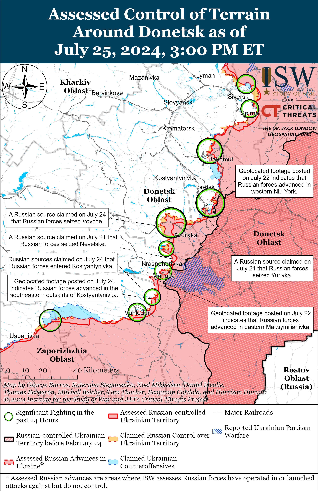
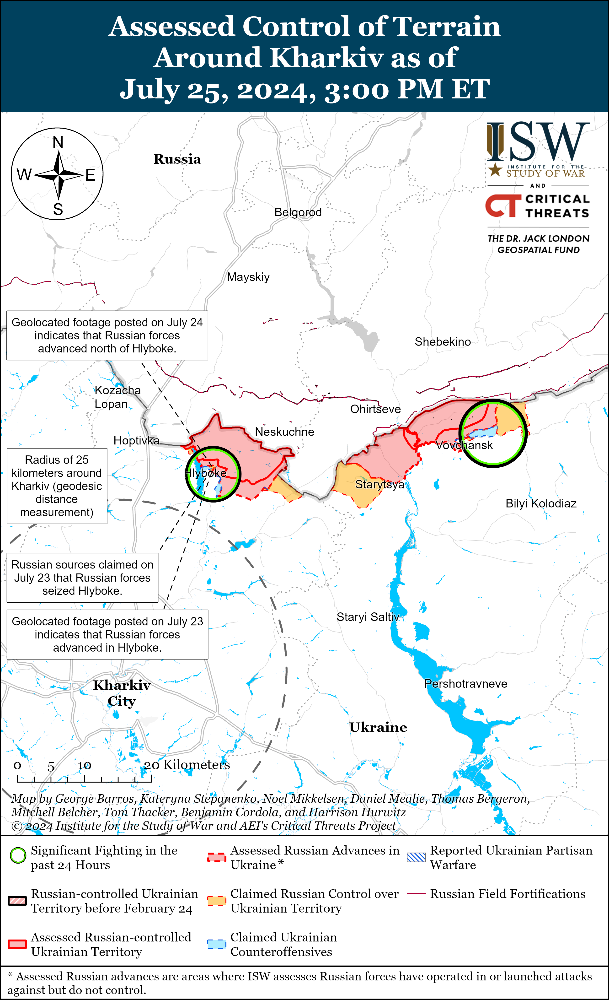
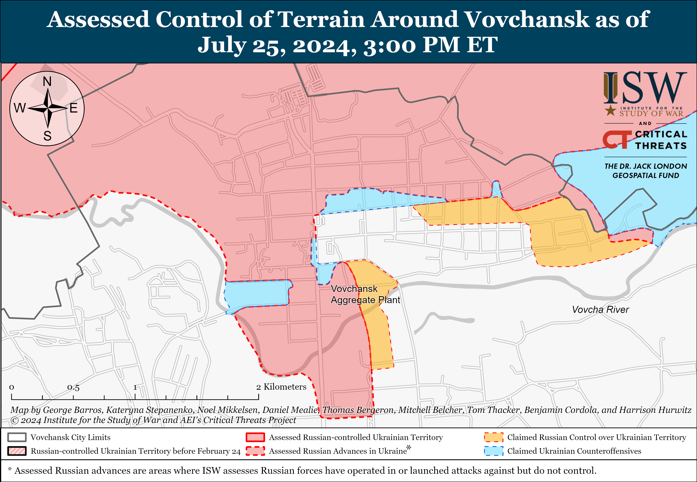
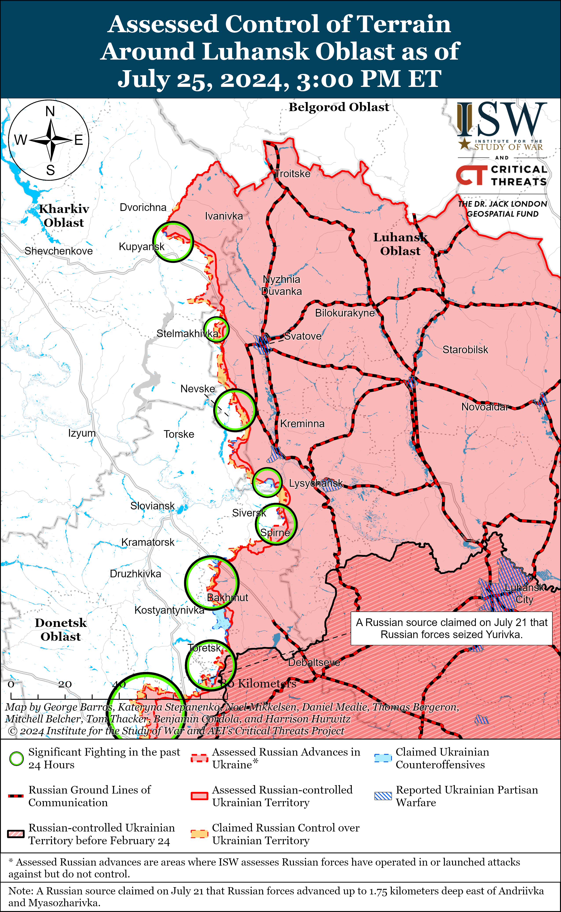
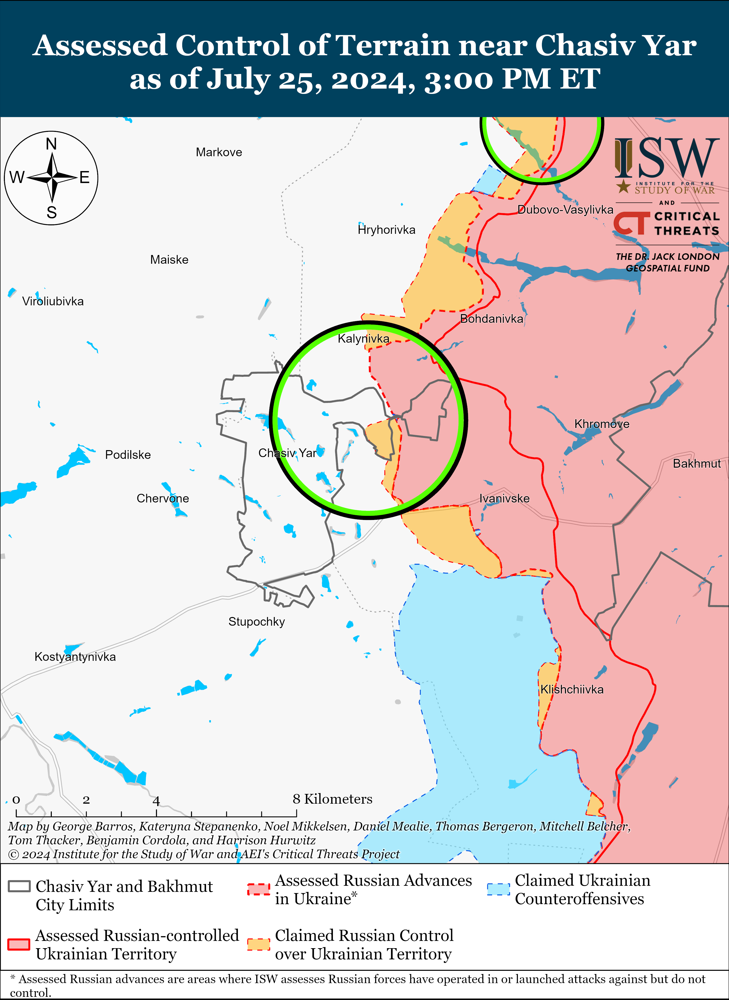
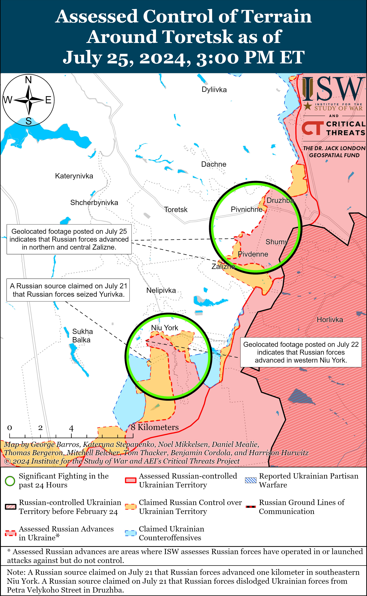
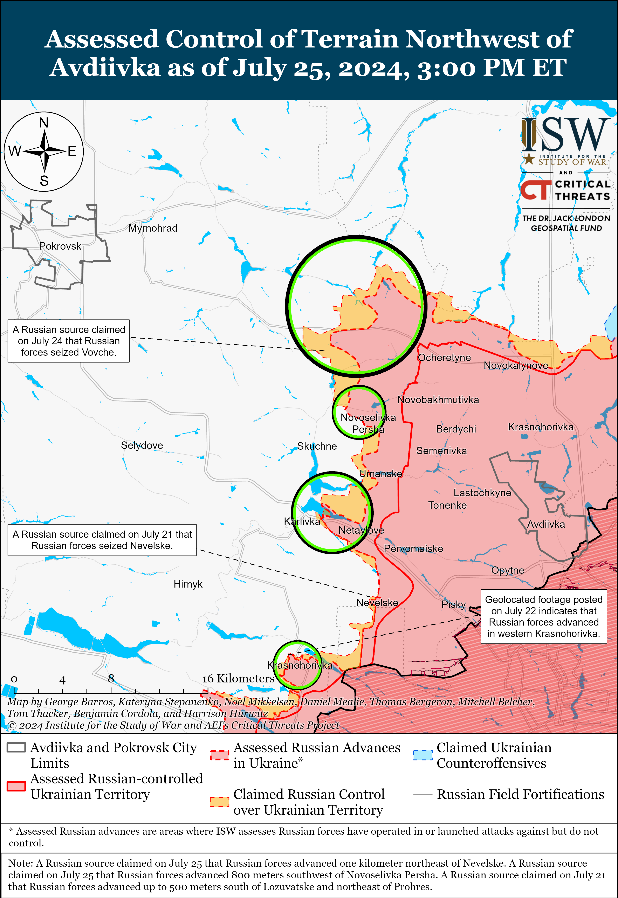
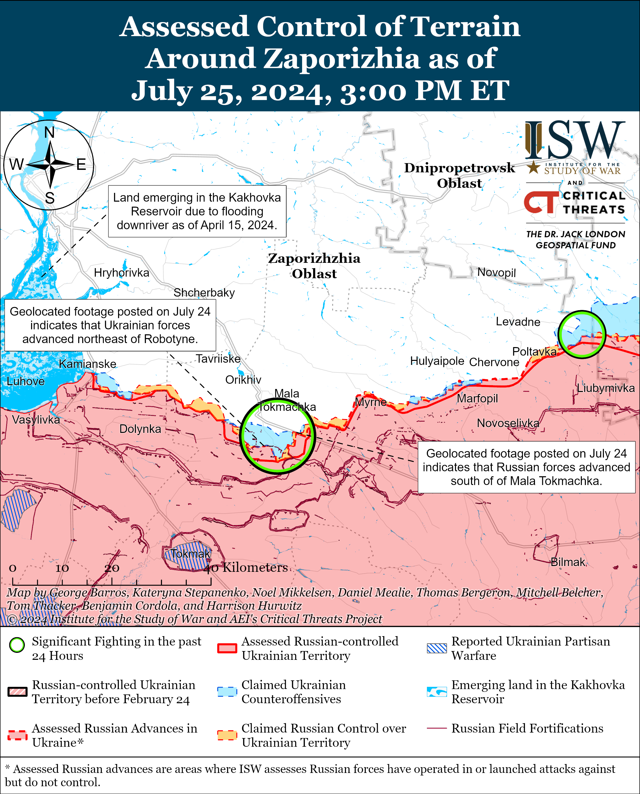
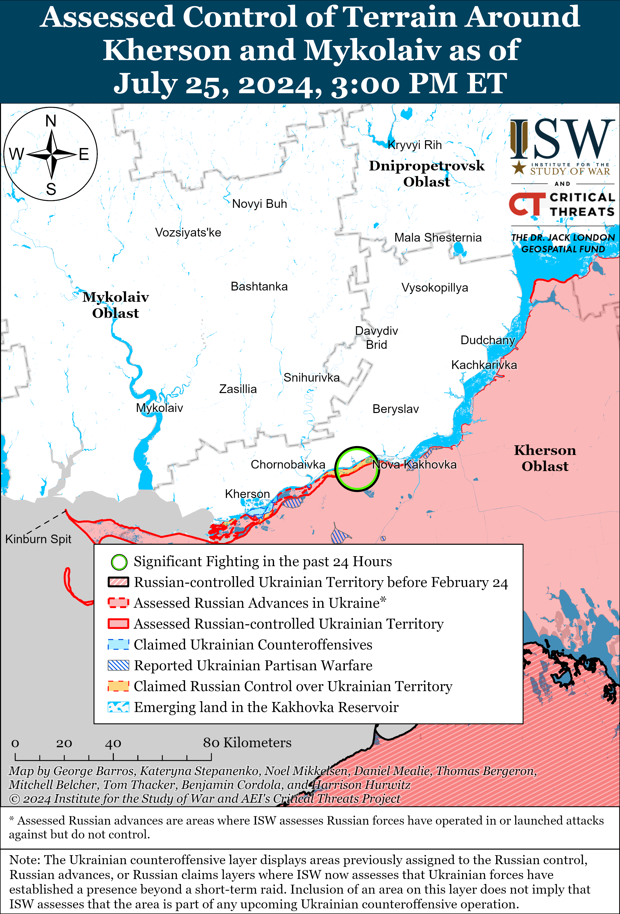

# Russian Offensive Campaign Assessment, July 25, 2024

**Angelica Evans, Riley Bailey, Christina Harward, Grace Mappes, Davit Gasparyan, Andie Parry, and George Barros**

**July 25, 2024, 7:30pm ET**

**Click**[**here**](https://storymaps.arcgis.com/stories/36a7f6a6f5a9448496de641cf64bd375)**to see ISW’s interactive map of the Russian invasion of Ukraine. This map is updated daily alongside the static maps present in this report.**

**Click**[**here**](https://understandingwar.maps.arcgis.com/apps/instant/3dviewer/index.html?appid=1602762dbcde419bb957dea358449580)**to see ISW’s 3D control of terrain topographic map of Ukraine. Use of a computer (not a mobile device) is strongly recommended for using this data-heavy tool.**

**Click**[**here**](https://storymaps.arcgis.com/stories/733fe90805894bfc8562d90b106aa895)**to access ISW’s archive of interactive time-lapse maps of the Russian invasion of Ukraine. These maps complement the static control-of-terrain map that ISW produces daily by showing a dynamic frontline. ISW will update this time-lapse map archive monthly.**

**Note: The data cut-off for this product was 12:00pm ET on July 25. ISW will cover subsequent reports in the July 26 Russian Offensive Campaign Assessment.**

**Ukrainian forces blunted one of the largest Russian mechanized assaults in Ukraine since October 2023 in western Donetsk Oblast on July 24.**Geolocated footage published on July 24 shows that Ukrainian forces stopped a reinforced battalion size Russian mechanized assault near Kostyantynivka (southwest of Donetsk City) after Russian forces advanced up to the southeastern outskirts of the settlement.[1] A Ukrainian brigade operating in the Kurakhove direction reported that Russian forces attacked simultaneously with 11 tanks, 45 armored combat vehicles, a rare “Terminator” armored fighting vehicle (of which Russia has reportedly manufactured only 23 as of December 2023), 12 motorcycles, and roughly 200 personnel from several tactical directions at dawn on July 24.[2] The brigade reported that Ukrainian aerial reconnaissance identified the mechanized columns from a distance and that Ukrainian forces used artillery, drones, and minefields to blunt the Russian assault. The brigade reported that Ukrainian forces damaged or destroyed six Russian tanks, seven armored combat vehicles, and all 12 motorcycles and that Russian forces retreated after Ukrainian forces destroyed the first wave of vehicles. ISW last observed Russian forces conduct a battalion-sized mechanized attack in Donetsk Oblast in March 2024. Russian forces have not conducted larger mechanized assaults in Ukraine since the first days of Russia’s four-month long operation to seize Avdiivka in October 2023.[3] Russian forces likely intended to advance further into Kostyantynivka as part of their efforts to seize the settlement and cut the Vuhledar-Kostyantynivka T-0524 highway. Russian sources have long identified interdicting the T-0524 highway and disrupting Ukrainian ground lines of communication (GLOCs) into Vuhledar as a primary tactical objective in this direction. Russian milblogger recently suggested that Russian forces would intensify operations south of Kostyantynivka in support of this objective and force Ukrainian forces to retreat from positions in and around Vuhledar.[4] Russian forces likely will not make operationally significant advances in this area of the frontline in the near term even if they achieve tactically significant advances and prompt Ukrainian forces to retreat from nearby positions, as the surrounding area has no operationally significant objectives and is largely comprised of fields and isolated, small settlements and no significant nearby tactical heights.

[****](https://understandingwar.org/wp-content/uploads/2025/05/Donetsk20Battle20Map20Draft20July20252C202024.png)

**The Russian military command’s willingness to expend a large number of armored vehicles on limited tactical objectives reflects poor longer-term operational foresight, and constraints on Russian equipment in the medium- to long-term will make such failed mechanized assaults costlier with time**. The Russian military has extensively relied on refurbishing stocks of Soviet-era weapons and military equipment, particularly armored vehicles, to sustain the tempo of its offensive operations in Ukraine.[5] The Russian government will likely have to further mobilize the Russian economy and defense industry if the Russian military intends to sustain its current tempo of operations in the medium- to long-term as Russia depletes its finite Soviet stockpiles, but it is unclear if the Russian defense industry will be able to produce enough vehicles to sustain a high level of equipment losses even with further economic mobilization.[6] Ukraine-based open-source organization *Frontelligence Insight* stated on July 25 that it observed Russian forces moving hundreds of pieces of equipment, primarily restored old, armored vehicles such as T-62 and T-55 tanks, to the front in June and early July 2024.[7] *Frontelligence Insight*noted that these restored vehicles have yet to appear on the battlefield and assessed that Russia may be preparing to use them in later 2024. *Frontelligence Insight* reported that internal Russia documents show that Russian tanks damaged within the past six months (since about January 2024) are widely waiting for replacement parts and that widespread engine shortages have led to the increasing cannibalization of more modern T-80 tanks to conduct repairs. Russia currently has enough armored vehicles to conduct periodic company-sized and larger mechanized assaults throughout the frontline for the foreseeable future, however. The Russian military command’s continued willingness to suffer high armored vehicle losses for minor tactical gains instead of conserving armored vehicles for operations that pursue operationally significant objectives will impose increasingly significant costs on Russian forces as the Russian military’s equipment constraints worsen over the coming years. The Russian military may be attempting to restore maneuver to the battlefield and pursue rapid gains through mechanized maneuver, although continued large scale frontal mechanized assaults indicate that the Russian military command has not fully internalized lessons about the difficulties of mechanized maneuver in the nearly transparent battlespace in Ukraine.[8]

**The Russian Ministry of Defense (MoD) indicated that Lieutenant General Sergey Kobylash has become Deputy Commander of the Russian Aerospace Forces (VKS).**The Russian MoD updated its list of VKS leadership as of July 24 to include Kobylash as the Deputy Commander-in-Chief of the Russian Aerospace Forces.[9] Kobylash previously served as the Commander of the VKS Long-Range Aviation before his recent appointment.[10] The International Criminal Court (ICC) issued an arrest warrant against Kobylash in March 2024 for war crimes perpetuated during Russian rear-area strike campaigns in Ukraine from October 2022 to at least March 2023.[11] Major General Sergey Kuvaldin replaced Kobylash as Commander of the VKS Long Range Aviation.[12]

**Kremlin Spokesperson Dmitri Peskov attempted to frame Ukraine as unwilling to negotiate, while demonstrating the Kremlin’s own unwillingness to engage in good faith negotiations by reinvigorating Russian information operations falsely portraying Ukrainian President Volodymyr Zelensky as an “illegitimate” leader of Ukraine.**Peskov claimed on July 25 that Russia “is open to achieving [its] goals through negotiations” but that there are obstacles to negotiations, including the false assertion that Zelensky is an illegitimate president and that Ukraine imposed a “de facto legislative ban on any contacts and negotiations with the Russian side.”[13] Peskov claimed that Russia needs to understand “how ready Ukraine is, the government of the country, the Ukrainian side, and how much permission [Ukraine] has for [negotiations] from its curators” and that Ukraine has been offering “very different statements” on these issues.[14]

Ukraine has clearly presented its plan for a lasting peace based on international law as part of preparations for eventual negotiations with Russia, and Ukrainian officials have openly invited a Russian representative to attend Ukraine’s second peace summit later in 2024.[15] The Kremlin, on the other hand, has repeatedly falsely claimed that it is open to negotiations while simultaneously indicating that it is only interested in a negotiated settlement that results in complete Ukrainian capitulation.[16] Peskov’s statements, contrary to inaccurate reporting by select Western outlets, did not indicate that Russia is ready to negotiate with Zelensky, but rather that the Kremlin remains committed to its false narrative that Russia cannot negotiate with Zelensky, as Zelensky is supposedly Ukraine’s “illegitimate” president.[17] ISW has extensively detailed how the Kremlin has been misrepresenting the Ukrainian Constitution and Ukrainian laws to support these Russian narratives about Zelensky’s illegitimacy.[18] Peskov also misrepresented the Ukrainian law concerning negotiations with Russia. Zelensky signed a decree in October 2022 that stated that negotiations with Russian President Vladimir Putin are “impossible” but did not outright ban “any contacts and negotiations with the Russian side,” as Peskov claimed.[19]

**The Kremlin continues to strengthen its ties with the People’s Republic of China (PRC) and the Association of Southeast Asian Nations (ASEAN) member states.**Russian Foreign Minister Sergei Lavrov arrived at the ASEAN summit in Laos on July 25 and held a series of bilateral meetings with delegations from East Timor, Indonesia, Cambodia, Brunei, Laos, and the PRC.[20] Lavrov and PRC Foreign Minister Wang Yi emphasized the importance of Russia’s and China’s role in developing ASEAN and defending southeast Asia from “interference” by “extra-regional forces.”[21] Russia and China may be posturing themselves as “defenders” of ASEAN member states in order to encourage deeper cooperation and dependence. Russian Prosecutor General Igor Krasnor and PRC Prosecutor General Ying Yong also signed a cooperation agreement at a Shanghai Cooperation Organization (SCO) meeting on July 25, which will increase Russian-PRC judicial cooperation.[22] Krasnov characterized the agreement as part of Russia and the PRC’s efforts to improve the “fight against transnational crime.” Russia recently signed a similar agreement with North Korea, and ISW noted that the Kremlin may be interested in further consolidating control over the Russian information space and implementing measures similar to the North Korean and PRC governments.[23]

**The Ukrainian Security Service (SBU) and National Police announced that they neutralized a group connected to the Russian Federal Security Service (FSB) that had been preparing to commit arson against civilian objects in Ukraine and elsewhere in Europe.[24]**Ukrainian authorities stated on July 25 that law enforcement detained 19 individuals based throughout Ukraine who had been preparing to commit arson against places of mass gatherings — including shopping centers, gas stations, pharmacies, and markets — in Ukraine, Poland, and the Baltic states.[25] Ukrainian authorities stated that the Russian FSB recruited the group with promises of monetary rewards, coordinated the group’s activities remotely, and planned to transport group members to European Union (EU) member states with fake documents.[26] Ukrainian authorities stated that the FSB instructed the group to film the attacks for the FSB to use as propaganda to destabilize the social and political situation within the EU.[27] Russian actors and proxies have been intensifying hybrid military operations against NATO states to deter and disrupt Western military assistance to Ukraine, and these reported plans to commit arson against civilian objects may be in part to discourage Western states from providing Ukraine with further assistance.[28]

**Select Russian officials continue to call for measures targeting diaspora groups while the Russian government continues efforts to extend its control over migrants in Russia.**Russian State Duma Deputy Mikhail Matveyev submitted a draft bill to the Russian State Duma on July 24 that seeks to limit the “political influence” of minority and diaspora communities in Russia by amending Russia’s law on “national-cultural autonomies.”[29] The current law provides for “certain ethnic communities” in Russia to organize public organizations that address issues of preserving a community’s culture and identity, “harmonizing” the community with Russian society, and helping migrants adapt and integrate into Russian society.[30] Matveyev claimed that Russian “national-cultural autonomies” have an outsized influence on the Russian government and that the law deprives ethnic Russians of the right to form similar organizations.[31] Matveyev’s draft bill proposes a series of amendments that would limit the rights and powers of the cultural organizations, including prohibiting these organizations from “interfere[ing]” in government policy. Alexander Dyukov, a member of the Commission for Monitoring and Resolving Conflict Situations in the Sphere of Interethnic Relations on Russian President Vladimir Putin’s Council on Interethnic Relations, declared his support for Matveyev’s bill on July 25 and echoed Matveyev’s concerns about the outsized influence of “diasporas” on the Russian government.[32] Dyukov blamed deceased Communist Party General Secretary Mikhail Gorbachev for implementing problematic migration policies and for leaving future generations to solve these issues. Matveyev recently placed himself at the center of scandal intended to stir up anti-migrant sentiments among Russian ultranationalists and appears to be now turning his attention to limiting the rights of Russia’s minority groups.[33]

The Russian Investigative Committee announced a proposal on July 24 to create a unified interdepartmental database for registering migrants and foreign citizens coming into Russia and a “roadmap” for replacing Russia’s dependence on labor migrants with jobs for Russian citizens.[34] The Russian Investigative Committee also proposed requiring migrants to obtain Russian SIM cards upon entering Russia and use the associated phone number to register with the Russian government. Several Russian federal subjects (regions) have recently barred migrants from working in the food service and transportation industries, and these initiatives likely intend to discourage migration into Russia by making daily life more difficult for migrants despite Russia’s evidenced dependence on migrant labor to address its labor and force generation shortages.[35]

**Syrian President Bashar al Assad met with Russian President Vladimir Putin in Moscow on July 24.**[36] ***[NOTE: A version of this text appears in ISW-CTP’s [July 25 Iran Update](https://understandingwar.org/backgrounder/iran-update-july-25-2024)]*** Assad and Putin discussed escalating tensions in the Middle East, including in Syria.[37] The leaders also discussed improving bilateral economic relations.[38] Assad last met with Putin in Russia in March 2023 during which they reached over 40 agreements on promoting economic cooperation.[39] It remains unclear if Syria and Russia have advanced the 2023 agreements since then.

**Key Takeaways:**

- **Ukrainian forces blunted one of the largest Russian mechanized assaults in Ukraine since October 2023 in western Donetsk Oblast on July 24.**
- **The Russian military command’s willingness to expend a large number of armored vehicles on limited tactical objectives reflects poor longer-term operational foresight, and constraints on Russian equipment in the medium- to long-term will make such failed mechanized assaults costlier with time**.
- **The Russian Ministry of Defense (MoD) indicated that Lieutenant General Sergey Kobylash has become Deputy Commander of the Russian Aerospace Forces (VKS).**
- **Kremlin Spokesperson Dmitri Peskov attempted to frame Ukraine as unwilling to negotiate, while demonstrating the Kremlin’s own unwillingness to engage in good faith negotiations by reinvigorating Russian information operations falsely portraying Ukrainian President Volodymyr Zelensky as an “illegitimate” leader of Ukraine.**
- **The Kremlin continues to strengthen its ties with the People’s Republic of China (PRC) and Association of Southeast Asian Nations (ASEAN) member states.**
- **The Ukrainian Security Service (SBU) and National Police announced that they neutralized a group connected to the Russian Federal Security Service (FSB) that had been preparing to commit arson against civilian objects in Ukraine and elsewhere in Europe.**
- **Select Russian officials continue to call for measures targeting diaspora groups while the Russian government continues efforts to extend its control over migrants in Russia.**
- **Syrian President Bashar al Assad met with Russian President Vladmir Putin in Moscow on July 24.**
- **Ukrainian forces recently advanced near Robotyne, and Russian forces recently marginally advanced north of Kharkiv City and near Toretsk, Donetsk City, and Robotyne.**
- **Russian President Vladimir Putin signed a law on July 24 granting deferments from military conscription to employees of the Russian Prosecutor General’s Office and Investigative Committee who have higher education and special ranks starting in September 2024.**

[****](https://understandingwar.org/wp-content/uploads/2025/05/DraftUkraineCoT20July20252C202024.png)

***We do not report in detail on Russian war crimes because these activities are well-covered in Western media and do not directly affect the military operations we are assessing and forecasting. We will continue to evaluate and report on the effects of these criminal activities on the Ukrainian military and the Ukrainian population and specifically on combat in Ukrainian urban areas. We utterly condemn Russian violations of the laws of armed conflict and the Geneva Conventions and crimes against humanity even though we do not describe them in these reports.***

- Russian Main Effort – Eastern Ukraine (comprised of three subordinate main efforts)
- Russian Subordinate Main Effort #1 – Push Ukrainian forces back from the international border with Belgorod Oblast and approach to within tube artillery range of Kharkiv City
- Russian Subordinate Main Effort #2 – Capture the remainder of Luhansk Oblast and push westward into eastern Kharkiv Oblast and encircle northern Donetsk Oblast
- Russian Subordinate Main Effort #3 – Capture the entirety of Donetsk Oblast
- Russian Supporting Effort – Southern Axis
- Russian Air, Missile, and Drone Campaign
- Russian Mobilization and Force Generation Efforts
- Russian Technological Adaptations
- Activities in Russian-occupied areas
- Ukrainian Defense Industrial Base Efforts
- Russian Information Operations and Narratives
- Significant Activity in Belarus

**Russian Main Effort – Eastern Ukraine**

**Russian Subordinate Main Effort #1 – Kharkiv Oblast (Russian objective: Push Ukrainian forces back from the international border with Belgorod Oblast and approach to within tube artillery range of Kharkiv City)**

The Ukrainian General Staff reported on July 24 and 25 that Russian forces attacked near Sotnytskyi Kozachok (northwest of Kharkiv City and on the border with Belgorod Oblast).[40] Russian sabotage and reconnaissance groups have recently operated within Sotnytskyi Kozachok, but ISW assessed as of July 17 that Russian forces no longer maintained a presence in the border settlement.[41]

[****](https://understandingwar.org/wp-content/uploads/2025/05/Kharkiv20Battle20Map20Draft20July20252C202024.png)

Russian forces recently marginally advanced north of Kharkiv City amid continued assaults north and northeast of Kharkiv City on July 25. Geolocated footage published on July 24 indicates that Russian forces recently marginally advanced north of Hlyboke (north of Kharkiv City).[42] A Russian milblogger claimed that Russian forces seized all of Hlyboke over the last 24 hours, but ISW has not observed confirmation of Russian forces operating in the western part of the settlement.[43] Russian and Ukrainian sources stated that fighting is ongoing north of Kharkiv City near Hlyboke and northeast of Kharkiv City within Vovchansk and near Starytsya and Tykhe.[44] The Ukrainian General Staff reported that Russian forces launched 28 glide bombs at targets north of Kharkiv City near Ruska Lozova, Pytomnik, Vesele, Lyptsi, and Hlyboke and northeast of Kharkiv City near Starytsya and Vovchanski Khutory over the last day.[45]

**Russian Subordinate Main Effort #2 – Luhansk Oblast (Russian objective: Capture the remainder of Luhansk Oblast and push westward into eastern Kharkiv Oblast and northern Donetsk Oblast)**

Russian forces continued offensive operations along the Kupyansk-Svatove-Kreminna line on July 24 and 25, but there were no confirmed changes to the frontline. Russian forces continued offensive operations northeast of Kupyansk near Synkivka; southeast of Kupyansk near Stepova Novoselivka, Stelmakhivka and Petropavlivka; northwest of Kreminna near Makiivka and Nevske; and southwest of Kreminna in the Serebryanske forest area on July 24 and 25.[46] Elements of the Russian 144th Motorized Rifle Division (20th Combined Arms Army [CAA], Moscow Military District [MMD]) reportedly continue to operate near Nevske.[47]

**Russian Subordinate Main Effort #3 – Donetsk Oblast (Russian objective: Capture the entirety of Donetsk Oblast, the claimed territory of Russia’s proxies in Donbas)**

Russian forces continued offensive operations in the Siversk direction on July 25, but there were no confirmed changes to the frontline. Russian milbloggers claimed that Russian forces advanced north of Rozdolivka towards Pereizne (both south of Siversk), although ISW has not observed confirmation of these claims.[48] Russian forces continued offensive operations east of Siversk near Verkhnokamyanske, southeast of Siversk near Spirne and Ivano-Dariivka, and south of Siversk near Mykolaivka on July 24 and 25.[49] Elements of the Russian 7th Motorized Rifle Brigade (2nd Luhansk People’s Republic [LNR] Army Corps [AC]) are reportedly operating near Hryhorivka (northeast of Siversk).[50]

Russian forces continued offensive operations near Chasiv Yar on July 25 but did not make any confirmed gains. Russian forces continued assaults near Chasiv Yar and Novyi Microraion in eastern Chasiv Yar; north of Chasiv Yar near Kalynivka, Mayske, Hryhorivka, and Novomarkove; and east of Chasiv Yar near Ivanivske on July 24 and 25.[51] Elements of the Russian “Hispaniola” Volunteer Brigade (Russian Volunteer Corps) are reportedly operating near Novyi Microraion, and elements of the 98th Airborne (VDV) Division, 4th Motorized Rifle Brigade (2nd LNR AC), and “Sever-V” Brigade (Russian Volunteer Corps) are operating near Chasiv Yar.[52]

Russian forces recently advanced near Toretsk and continued offensive operations in the area on July 25. Geolocated footage published on July 25 indicates that Russian forces recently advanced along Slavna Street within northern Zalizne (southeast of Toretsk) and along Zaporizka Street in central Zalizne.[53] Russian forces continued offensive operations north of Toretsk near Dachne; east of Toretsk near Pivnichne and Druzhba; southeast of Toretsk near Zalizne; and south of Toretsk near Niu York on July 24 and 25.[54]

[****](https://understandingwar.org/wp-content/uploads/2025/05/Toretsk20Battle20Map20Draft20July20252C202024.png)

Russian forces reportedly continued to advance northwest of Avdiivka on July 25, but there were no confirmed changes in the area. Russian milbloggers claimed that elements of the Russian 15th Motorized Rifle Brigade (2nd Combined Arms Army [CAA], Central Military District [CMD]) seized Vovche (northwest of Avdiivka) and advanced further north and west of Prohres (immediately north of Vovche).[55] Russian milbloggers also claimed that Russian forces advanced north and south of Lozuvatske (northwest of Avdiivka), within southwestern Novoselivka Persha (northwest of Avdiivka), and northeast of Nevelske (southwest of Avdiivka).[56] Russian forces continued offensive operations northwest of Avdiivka near Novooleksandrivka, Vesele, Ivanivka, Novoselivka Persha, Vozdvyzhenka, and Vovche; west of Avdiivka near Yasnobrodivka and Novozhelanne; and southwest of Avdiivka near Karlivka on July 24 and 25.[57]

Russian forces recently advanced during a reinforced battalion-size mechanized assault southwest of Donetsk City and continued offensive operations west and southwest of Donetsk City on July 25. Geolocated footage published on July 24 indicates that Russian forces advanced up to the southeastern outskirts of Kostyantynivka (southwest of Donetsk City) during a reinforced battalion-size mechanized assault.[58] Russian forces continued offensive operations west of Donetsk City near Krasnohorivka and southwest of Donetsk City near Kostyantynivka, Paraskoviivka, and Vodyane on July 24 and 25.[59] Elements of the Russian 5th Motorized Rifle Brigade (1st Donetsk People’s Republic [DNR] AC]) are reportedly operating within Krasnohorivka.[60]

Positional fighting continued in the Donetsk-Zaporizhia Oblast border area on July 25. The commander of a Russian assault detachment claimed on July 24 that Russian forces seized several Ukrainian positions north of Staromayorske (south of Velyka Novosilka), but ISW has not observed confirmation of this claim.[61] Russian forces also conducted ground assaults near Novodarivka on July 25 (southwest of Velyka Novosilka).[62]

**Russian Supporting Effort – Southern Axis (Russian objective: Maintain frontline positions and secure rear areas against Ukrainian strikes)**

Russian and Ukrainian forces recently marginally advanced amid continued positional fighting in western Zaporizhia Oblast on July 25. Geolocated footage published on July 24 shows that Ukrainian forces marginally advanced northeast of Robotyne and that Russian forces marginally advanced south of Mala Tokmachka (northeast of Robotyne).[63] A Russian milblogger claimed that Russian forces advanced in fields even further south of Mala Tokmachka and pushed Ukrainian forces away from the H-08 Orikhiv-Polohy highway, but ISW has not observed confirmation of this claim.[64] Russian forces continued ground attacks near Robotyne, near Mala Tokmachka, and northwest of Robotyne near Yurkivka, Novoandriivka, and Shcherbaky on July 24 and 25.[65] Ukrainian Tavriisk Group of Forces Spokesperson Captain Dmytro Lykhovyi stated on July 24 that Russian forces have accumulated 90,000 personnel total between different operational directions and throughout the entire operational depth of Russian defenses in Zaporizhia Oblast.[66] Lykhovyi emphasized that Ukrainian forces have not observed Russian forces forming an offensive group in Zaporizhia Oblast. Elements of the Russian 7th Airborne (VDV) Division are reportedly fighting southwest of Novopokrovka (northeast of Robotyne), and elements of the Russian 1429th and 1430th motorized rifle regiments (58th Combined Arms Army [CAA], Southern Military District [SMD]) are reportedly operating near Robotyne.[67]

Positional fighting continued in the east (left) bank of Kherson Oblast near Krynky on July 25, but there were no confirmed changes to the frontline.[68] Elements of the Russian 25th Spetsnaz Regiment (Russian General Staff Main Directorate [GRU]) reportedly continue to operate in the Kherson direction.[69]

**Russian Air, Missile, and Drone Campaign (Russian Objective: Target Ukrainian military and civilian infrastructure in the rear and on the frontline)**

Russian forces conducted a series of drone and missile strikes against Ukraine on the night of July 24 to 25. Ukrainian Air Force Commander Lieutenant General Mykola Oleshchuk reported that Russian forces launched 38 Shahed-136/131 drones from Primorsko-Akhtarsk, Krasnodar Krai and occupied Cape Chauda, Crimea and targeted critical infrastructure in Odesa Oblast and central Ukraine on the night of July 24 to 25.[70] Oleshchuk stated that Ukrainian forces downed 25 Shahed drones and that three Shahed drones were “lost” when the drones entered Romanian airspace. The Romanian Ministry of Defense (MoD) reported that Romanian authorities discovered the remains of a Russian Shahed drone near Plauru (along the Romanian-Ukrainian border across from Izmail, Odesa Oblast).[71] Odesa Oblast Military Administration Head Oleh Kiper stated that Russian drones damaged an administrative building in Izmail Raion, Odesa Oblast, and the Izmail Raion Military Administration reported that 11 Russian drones struck port infrastructure and a home near Vylkove.[72] Ukraine’s State Emergency Service reported that debris from Russian Shahed drones damaged infrastructure in Zhytomyr Oblast.[73] The Russian MoD claimed that Russian forces struck a Ukrainian military concentration area and the Kharkiv Armored Plant, which produces tanks and armored vehicles, in Kharkiv City with an unspecified number of Iskander-M ballistic missiles on July 25.[74]

**Russian Mobilization and Force Generation Efforts (Russian objective: Expand combat power without conducting general mobilization)**

Russian President Vladimir Putin signed a law on July 24 granting deferments from military conscription to employees of the Russian Prosecutor General’s Office and Investigative Committee who have higher education and special ranks starting in September 2024.[75] The law also allows the Russian military to dismiss Russian contract servicemembers (*kontraktniki*) early if they transfer to working in the Prosecutor General’s Office or the Investigative Committee. The Russian government has previously issued deferments to employees with higher education and special ranks who work in Rosgvardia, the State Fire Service, agencies of the Ministry of Internal Affairs (MVD), and penal colony and customs agencies.[76]

The Russian State Duma adopted a bill on July 24 in its second and third readings that allows for the transfer of confiscated civilian weapons and ammunition cartridges to Rosgvardia, the Ministry of Defense (MoD), or other state paramilitary organizations operating in Ukraine.[77]

**Russian Technological Adaptations (Russian objective: Introduce technological innovations to optimize systems for use in Ukraine)**

A prominent Russian milblogger claimed that Russian forces must overcome organization and guidance issues before fielding small aircraft or training aircraft equipped with small arms to intercept Ukrainian drones within Russia.[78] The milblogger claimed that these changes are necessary to prevent Russian air defense from shooting down Russian aircraft in friendly fire incidents and to ensure Russian pilots can accurately target enemy drones. A Russian aviation expert claimed on July 22 that Ukrainian forces started using “small air defense aircraft” to combat Russian drones but that Russian forces have yet to field this adaptation due to administrative hurdles within the Russian military bureaucracy.[79]

**Ukrainian Defense Industrial Efforts (Ukrainian objective: Develop its defense industrial base to become more self-sufficient in cooperation with US, European, and international partners)**

*ISW is not publishing coverage of Ukrainian defense industrial efforts today.*

**Activities in Russian-occupied areas (Russian objective: Consolidate administrative control of annexed areas; forcibly integrate Ukrainian citizens into Russian sociocultural, economic, military, and governance systems)**

*ISW is not publishing coverage of Russian-occupied areas of Ukraine today.*

**Russian Information Operations and Narratives**

Russian officials continue to threaten former Soviet states as Russian ultranationalists continue to criticize these countries for forming relations with the West. Kremlin Spokesperson Dmitry Peskov stated on July 24 in response to the European Union (EU) military assistance to Armenia that Armenia is a brotherly country to Russia and that Russia hopes that Armenia will not follow the “path of Ukraine” in its search for international partners.[80] Peskov’s statement is an implied threat to Armenia against pursuing additional ties with Western partners and pulling away from Russia. A prominent Russian milblogger continued to criticize Armenia as weak and claimed that Armenian Prime Minister Nikol Pashinyan is attempting to degrade Armenia’s military capabilities.[81] The milblogger also dismissed reports of Armenian-Iranian military cooperation.[82] The milblogger also criticized a Kazakh effort to establish new national values and symbology as pulling away from its historical ties to the Russian Empire and Soviet Union.[83]

Russian officials continue to exert authority over other sovereign states through criminal proceedings. The Russian Investigative Committee sent materials to a Russian court on July 25 to support the conviction of a former Ukrainian diplomat in absentia for statements against Russia.[84]

**Significant activity in Belarus (Russian efforts to increase its military presence in Belarus and further integrate Belarus into Russian-favorable frameworks and Wagner Group activity in Belarus)**

Russian President Vladimir Putin met with Belarusian President Alexander Lukashenko on Valaam Island, Republic of Karelia on July 25 to discuss the development of the Russian-Belarusian Union State and regional security issues.[85] Lukashenko also met with St. Petersburg Oblast Governor Alexander Beglov in St. Petersburg on July 25 and reportedly discussed trade and cooperation between St. Petersburg and Belarus.[86]

Belarusian Foreign Minister Maxim Ryzhenkov met with North Korean Prime Minister Kim Tok Hun on July 25 in Pyongyang and discussed intensifying bilateral cooperation in education, healthcare, and agriculture, and foreign policy.[87]

**Note: ISW does not receive any classified material from any source, uses only publicly available information, and draws extensively on Russian, Ukrainian, and Western reporting and social media as well as commercially available satellite imagery and other geospatial data as the basis for these reports. References to all sources used are provided in the endnotes of each update.**

****

---

[1] https://t.me/creamy\_caprice/6151; https://t.me/odshbr79/244

[2] https://t.me/odshbr79/244

[3] https://understandingwar.org/backgrounder/russian-offensive-campaign-assessment-march-31-2024 ; https://isw.pub/UkrWar101223 ; https://isw.pub/UkrWar101323 ; https://isw.pub/UkrWar102023 ; https://isw.pub/UkrWar102123 ; https://isw.pub/UkrWar102223

[4] https://understandingwar.org/backgrounder/russian-offensive-campaign-assessment-july-17-2024 ; https://understandingwar.org/backgrounder/russian-offensive-campaign-assessment-august-18

[5] https://understandingwar.org/backgrounder/russian-offensive-campaign-assessment-july-10-2024 ; https://www.wsj.com/world/russia-is-pumping-out-weapons but-can-it-keep-it-up-ba30bb04 ; https://isw.pub/UkrWar040524 ; https://understandingwar.org/backgrounder/russian-offensive-campaign-assessment-march-9-2024 ; https://understandingwar.org/backgrounder/russian-offensive-campaign-assessment-february-13-2024 ; https://understandingwar.org/backgrounder/russian-offensive-campaign-assessment-june-7-2024

[6] https://understandingwar.org/backgrounder/russian-offensive-campaign-assessment-july-24-2024

[7] https://frontelligence.substack dot com/p/summer-2024-frontline-dynamics-overview

[8] https://isw.pub/UkrWar042624 ; https://isw.pub/UkrWar041524 ; https://isw.pub/UkrWar110623 ; https://isw.pub/UkrWar110123

[9] https://t.me/tass\_agency/262364; https://t.me/tass\_agency/262365; https://t.me/tass\_agency/262366; https://kommersant [dot] ru/doc/6851769

[10] https://www.icc-cpi.int/news/situation-ukraine-icc-judges-issue-arrest-warrants-against-sergei-ivanovich-kobylash-and

[11] https://www.icc-cpi.int/news/situation-ukraine-icc-judges-issue-arrest-warrants-against-sergei-ivanovich-kobylash-and

[12] https://kommersant dot ru/doc/6851769

[13] https://tass dot ru/politika/21448527; https://tass dot ru/politika/21448959; https://www.interfax dot ru/russia/972433; https://ria dot ru/20240725/peregovory-1961921129.html

[14] https://www.interfax dot ru/russia/972433

[15] https://isw.pub/UkrWar071524; https://isw.pub/UkrWar061524; https://isw.pub/UkrWar061624

[16] https://understandingwar.org/backgrounder/russian-offensive-campaign-assessment-july-5-2024; https://isw.pub/UkrWar071224 ; https://isw.pub/UkrWar070524; https://understandingwar.org/backgrounder/russian-offensive-campaign-assessment-july-11-2024 ; https://understandingwar.org/backgrounder/russian-offensive-campaign-assessment-july-10-2024 ; https://understandingwar.org/backgrounder/russian-offensive-campaign-assessment-july-4-2024

[17] https://www.reuters.com/world/europe/kremlin-says-russia-is-open-talks-with-ukraine-while-zelenskiy-is-power-needs-2024-07-25/

[18] https://isw.pub/UkrWar052824

[19] https://www.president dot gov.ua/documents/6792022-44249; https://www.pravda dot com.ua/news/2022/10/4/7370293/

[20] https://t.me/MID\_Russia/43501 ; https://t.me/MID\_Russia/43502 ; https://t.me/MID\_Russia/43504 ; https://t.me/MID\_Russia/43505 ; https://t.me/MID\_Russia/43507 ; https://t.me/MID\_Russia/43510 ; https://t.me/MID\_Russia/43511

[21] https://t.me/tass\_agency/262478 ; https://t.me/MID\_Russia/43510 ; https://t.me/tass\_agency/262483 ; https://t.me/MID\_Russia/43516

[22] https://tass dot ru/politika/21445637 ; https://t.me/tass\_agency/262401

[23] https://isw.pub/UkrWar072224

[24] https://ssu.gov dot ua/novyny/sbu-i-natspolitsiia-zneshkodyly-ahenturnu-hrupu-fsb-yaka-hotuvala-pidpaly-torhovykh-tsentriv-u-yevrosoiuzi-video

[25] https://ssu.gov dot ua/novyny/sbu-i-natspolitsiia-zneshkodyly-ahenturnu-hrupu-fsb-yaka-hotuvala-pidpaly-torhovykh-tsentriv-u-yevrosoiuzi-video

[26] https://ssu.gov dot ua/novyny/sbu-i-natspolitsiia-zneshkodyly-ahenturnu-hrupu-fsb-yaka-hotuvala-pidpaly-torhovykh-tsentriv-u-yevrosoiuzi-video

[27] https://ssu.gov dot ua/novyny/sbu-i-natspolitsiia-zneshkodyly-ahenturnu-hrupu-fsb-yaka-hotuvala-pidpaly-torhovykh-tsentriv-u-yevrosoiuzi-video

[28] https://isw.pub/UkrWar071124; https://understandingwar.org/backgrounder/russian-offensive-campaign-assessment-july-10-2024; https://isw.pub/UkrWar070124; https://isw.pub/UkrWar052724

[29] https://t.me/matveevkomment/8136 ; https://sozd dot duma.gov.ru/bill/680189-8

[30] https://base dot garant.ru/135765/1cafb24d049dcd1e7707a22d98e9858f/#friends

[31] https://t.me/matveevkomment/8136

[32] https://t.me/historiographe/14477

[33] https://understandingwar.org/backgrounder/russian-offensive-campaign-assessment-july-19-2024

[34] https://t.me/sledcom\_press/14769 ; https://t.me/sledcom\_press/14768 ; https://tass dot ru/obschestvo/21443153 ; https://t.me/tass\_agency/262346 ; https://t.me/RVvoenkor/73156

[35] https://isw.pub/UkrWar072024 ; https://understandingwar.org/backgrounder/russian-offensive-campaign-assessment-july-2-2024 ; https://ria dot ru/20240718/oblast-1960413042.html ; https://tlt dot ru/region/v-samarskoj-oblasti-vvodyat-novye-zaprety-na-rabotu-migrantov/2238013/ ; https://www.gazeta dot ru/social/news/2024/04/27/22884889.shtml

[36] https://apnews.com/article/russia-putin-assad-syria-e0e411c100d70862dfea3528c3a1c6bb ; http://kremlin dot ru/events/president/news/74637; https://www.sana dot sy/?p=2118363

[37] https://t.me/tass\_agency/262408

[38] http://kremlin dot ru/events/president/news/74637

[39] https://english.enabbaladi dot net/archives/2023/03/al-assad-offers-putin-what-left-of-syria/ ; https://www.syria dot tv/%D8%A8%D8%B4%D8%A7%D8%B1-%D8%A7%D9%84%D8%A3%D8%B3%D8%AF-%D8%B1%D9%88%D8%B3%D9%8A%D8%A7-%D9%88%D8%B3%D9%88%D8%B1%D9%8A%D8%A7-%D8%AA%D8%AE%D8%B7%D8%B7%D8%A7%D9%86-%D9%84%D8%A3%D8%B1%D8%A8%D8%B9%D9%8A%D9%86-%D9%85%D8%B4%D8%B1%D9%88%D8%B9%D8%A7%D9%8B-%D8%A7%D8%B3%D8%AA%D8%AB%D9%85%D8%A7%D8%B1%D9%8A%D8%A7%D9%8B-%D9%81%D9%8A%D8%AF%D9%8A%D9%88 ;

[40] https://www.facebook.com/GeneralStaff.ua/posts/pfbid02zcThSdYZkWRaKCp3MZijo8xe5XP3bMMcSjaq8RQZh6XwMp5nQaBttsLL5iEbNChfl ; https://www.facebook.com/GeneralStaff.ua/posts/pfbid0zYRPkMX4q9zgko6AwyHZJTyvb96VcReHyNEq2wCVobgW5BgLCEwRtY2DXCWaescNl

[41] https://understandingwar.org/backgrounder/russian-offensive-campaign-assessment-july-17-2024

[42] https://t.me/creamy\_caprice/6152; https://t.me/ASPIDGroup/107

[43] https://t.me/dva\_majors/48036; https://t.me/rybar/62082

[44] https://www.facebook.com/GeneralStaff.ua/posts/pfbid02jm7zhRbBYE3oHBXWUzu6Y22jDuFgidkbt9mB7V3JH3dU76rayco7y7B6Q7J97fhtl ; https://www.facebook.com/GeneralStaff.ua/posts/pfbid0zYRPkMX4q9zgko6AwyHZJTyvb96VcReHyNEq2wCVobgW5BgLCEwRtY2DXCWaescNl; https://www.facebook.com/GeneralStaff.ua/posts/pfbid02zcThSdYZkWRaKCp3MZijo8xe5XP3bMMcSjaq8RQZh6XwMp5nQaBttsLL5iEbNChfl ; https://t.me/dva\_majors/48036; https://t.me/rybar/62082 ; https://t.me/wargonzo/21199 ; https://t.me/DnevnikDesantnika/13068

[45] https://www.facebook.com/GeneralStaff.ua/posts/pfbid02jm7zhRbBYE3oHBXWUzu6Y22jDuFgidkbt9mB7V3JH3dU76rayco7y7B6Q7J97fhtl

[46]https://www.facebook.com/GeneralStaff.ua/posts/pfbid02jm7zhRbBYE3oHBXWUzu6Y22jDuFgidkbt9mB7V3JH3dU76rayco7y7B6Q7J97fhtl; https://www.facebook.com/GeneralStaff.ua/posts/pfbid0zYRPkMX4q9zgko6AwyHZJTyvb96VcReHyNEq2wCVobgW5BgLCEwRtY2DXCWaescNl; https://www.facebook.com/GeneralStaff.ua/posts/pfbid02zcThSdYZkWRaKCp3MZijo8xe5XP3bMMcSjaq8RQZh6XwMp5nQaBttsLL5iEbNChfl; https://t.me/motopatriot/25416; https://t.me/luhanskaVTSA/20285; https://www.facebook.com/GeneralStaff.ua/posts/pfbid02jm7zhRbBYE3oHBXWUzu6Y22jDuFgidkbt9mB7V3JH3dU76rayco7y7B6Q7J97fhtl; https://www.facebook.com/GeneralStaff.ua/posts/pfbid0zYRPkMX4q9zgko6AwyHZJTyvb96VcReHyNEq2wCVobgW5BgLCEwRtY2DXCWaescNl; https://www.facebook.com/GeneralStaff.ua/posts/pfbid02zcThSdYZkWRaKCp3MZijo8xe5XP3bMMcSjaq8RQZh6XwMp5nQaBttsLL5iEbNChfl; https://t.me/rusich\_army/16026

[47] https://t.me/vysokygovorit/16634

[48] https://t.me/motopatriot/25406 ; https://t.me/DnevnikDesantnika/13058

[49] https://www.facebook.com/GeneralStaff.ua/posts/pfbid02jm7zhRbBYE3oHBXWUzu6Y22jDuFgidkbt9mB7V3JH3dU76rayco7y7B6Q7J97fhtl ; https://www.facebook.com/GeneralStaff.ua/posts/pfbid0zYRPkMX4q9zgko6AwyHZJTyvb96VcReHyNEq2wCVobgW5BgLCEwRtY2DXCWaescNl ; https://www.facebook.com/GeneralStaff.ua/posts/pfbid02zcThSdYZkWRaKCp3MZijo8xe5XP3bMMcSjaq8RQZh6XwMp5nQaBttsLL5iEbNChfl

[50] https://t.me/boris\_rozhin/131209

[51] https://www.facebook.com/GeneralStaff.ua/posts/pfbid02jm7zhRbBYE3oHBXWUzu6Y22jDuFgidkbt9mB7V3JH3dU76rayco7y7B6Q7J97fhtl ; https://www.facebook.com/GeneralStaff.ua/posts/pfbid0zYRPkMX4q9zgko6AwyHZJTyvb96VcReHyNEq2wCVobgW5BgLCEwRtY2DXCWaescNl ; https://www.facebook.com/GeneralStaff.ua/posts/pfbid02zcThSdYZkWRaKCp3MZijo8xe5XP3bMMcSjaq8RQZh6XwMp5nQaBttsLL5iEbNChfl ; https://t.me/dva\_majors/48036; https://t.me/rybar/62082 ; https://t.me/wargonzo/21199

[52] https://t.me/voin\_dv/9917 ; https://t.me/boris\_rozhin/131166 ; https://t.me/modeatti/28 ; https://t.me/motopatriot/25410 ; https://t.me/RVvoenkor/73204

[53] https://t.me/creamy\_caprice/6156; https://t.me/voron1OO/40

[54] https://www.facebook.com/GeneralStaff.ua/posts/pfbid02jm7zhRbBYE3oHBXWUzu6Y22jDuFgidkbt9mB7V3JH3dU76rayco7y7B6Q7J97fhtl ; https://www.facebook.com/GeneralStaff.ua/posts/pfbid0zYRPkMX4q9zgko6AwyHZJTyvb96VcReHyNEq2wCVobgW5BgLCEwRtY2DXCWaescNl ; https://www.facebook.com/GeneralStaff.ua/posts/pfbid02zcThSdYZkWRaKCp3MZijo8xe5XP3bMMcSjaq8RQZh6XwMp5nQaBttsLL5iEbNChfl ; https://t.me/dva\_majors/48036; https://t.me/rybar/62082 ; https://t.me/wargonzo/21199

[55] https://t.me/NgP\_raZVedka/18459; https://t.me/z\_arhiv/27391 ; https://t.me/RVvoenkor/73139

[56] https://t.me/DnevnikDesantnika/13063 ; https://t.me/DnevnikDesantnika/13065 ; https://t.me/dva\_majors/48036; https://t.me/rybar/62082

[57] https://www.facebook.com/GeneralStaff.ua/posts/pfbid02jm7zhRbBYE3oHBXWUzu6Y22jDuFgidkbt9mB7V3JH3dU76rayco7y7B6Q7J97fhtl ; https://www.facebook.com/GeneralStaff.ua/posts/pfbid0zYRPkMX4q9zgko6AwyHZJTyvb96VcReHyNEq2wCVobgW5BgLCEwRtY2DXCWaescNl ; https://www.facebook.com/GeneralStaff.ua/posts/pfbid02zcThSdYZkWRaKCp3MZijo8xe5XP3bMMcSjaq8RQZh6XwMp5nQaBttsLL5iEbNChfl

[58] https://t.me/creamy\_caprice/6151; https://t.me/odshbr79/244

[59] https://www.facebook.com/GeneralStaff.ua/posts/pfbid02jm7zhRbBYE3oHBXWUzu6Y22jDuFgidkbt9mB7V3JH3dU76rayco7y7B6Q7J97fhtl ; https://www.facebook.com/GeneralStaff.ua/posts/pfbid0zYRPkMX4q9zgko6AwyHZJTyvb96VcReHyNEq2wCVobgW5BgLCEwRtY2DXCWaescNl ; https://www.facebook.com/GeneralStaff.ua/posts/pfbid02zcThSdYZkWRaKCp3MZijo8xe5XP3bMMcSjaq8RQZh6XwMp5nQaBttsLL5iEbNChfl ; https://t.me/dva\_majors/48036; https://t.me/rybar/62082

[60] https://t.me/RVvoenkor/73165

[61] https://t.me/mod\_russia/41347

[62] https://www.facebook.com/GeneralStaff.ua/posts/pfbid02jm7zhRbBYE3oHBXWUzu6Y22jDuFgidkbt9mB7V3JH3dU76rayco7y7B6Q7J97fhtl

[63] https://t.me/creamy\_caprice/6153; https://t.me/Centr\_omega\_NGU/3689; https://x.com/moklasen/status/181622191066702652 ; https://x.com/moklasen/status/1816222182068142409; https://t.me/polk1430\_1429/4536

[64] https://t.me/rybar/62101

[65] https://www.facebook.com/GeneralStaff.ua/posts/pfbid02jm7zhRbBYE3oHBXWUzu6Y22jDuFgidkbt9mB7V3JH3dU76rayco7y7B6Q7J97fhtl ; https://www.facebook.com/GeneralStaff.ua/posts/pfbid0zYRPkMX4q9zgko6AwyHZJTyvb96VcReHyNEq2wCVobgW5BgLCEwRtY2DXCWaescNl; https://www.facebook.com/GeneralStaff.ua/posts/pfbid02zcThSdYZkWRaKCp3MZijo8xe5XP3bMMcSjaq8RQZh6XwMp5nQaBttsLL5iEbNChfl

[66] https://armyinform.com dot ua/2024/07/25/u-sylah-oborony-rozpovily-chy-gotuyut-rosiyany-nastupalne-ugrupovannya-na-zaporizhzhi/

[67] https://t.me/motopatriot/25418; https://x.com/moklasen/status/1816222182068142409; https://t.me/polk1430\_1429/4536

[68] https://www.facebook.com/GeneralStaff.ua/posts/pfbid02jm7zhRbBYE3oHBXWUzu6Y22jDuFgidkbt9mB7V3JH3dU76rayco7y7B6Q7J97fhtl; https://www.facebook.com/GeneralStaff.ua/posts/pfbid0zYRPkMX4q9zgko6AwyHZJTyvb96VcReHyNEq2wCVobgW5BgLCEwRtY2DXCWaescNl; https://www.facebook.com/GeneralStaff.ua/posts/pfbid02zcThSdYZkWRaKCp3MZijo8xe5XP3bMMcSjaq8RQZh6XwMp5nQaBttsLL5iEbNChfl; https://t.me/SJTF\_Odes/10662

[69] https://t.me/dva\_majors/48032

[70] https://t.me/ComAFUA/356

[71] https://www.digi24 dot ro/stiri/actualitate/seful-fortelor-aeriene-ucrainene-afirma-ca-trei-drone-rusesti-au-trecut-frontiera-de-stat-in-romania-2872043 ; https://twitter.com/Odobes1Luminita/status/1816411760229843383

[72] https://t.me/odeskaODA/6095 ; https://www.facebook.com/izmail.rda/posts/pfbid0EghXTpETFJTV87QfjAqS6WzkKayS51HAazpygywo7dbBvbbjkD1XPKWDJUAnREwgl?locale=uk\_UA

[73] https://t.me/dsns\_telegram/30579

[74] https://t.me/mod\_russia/41366 ; https://t.me/mod\_russia/41363

[75] http://kremlin dot ru/acts/news/74641

[76] https://www.vedomosti dot ru/politics/news/2024/07/24/1051949-putin-podpisal-zakon

[77] https://t.me/Hinshtein/7265 ; https://tass dot ru/obschestvo/21437637

[78] https://t.me/rybar/62094

[79] https://understandingwar.org/backgrounder/russian-offensive-campaign-assessment-july-23-2024

[80] https://t.me/tass\_agency/262352 ; https://ria dot ru/20240724/peskov-1961805436.html?in=t; https://ria dot ru/20240724/armenija-1961804729.html

[81] https://t.me/rybar/62086

[82] https://t.me/rybar/62093

[83] https://t.me/rybar/62067

[84] https://t.me/tass\_agency/262434 ; https://tass dot ru/proisshestviya/21447251

[85] https://t.me/pul\_1/13147 ; https://t.me/tass\_agency/262497 ; https://t.me/tass\_agency/262420; https://t.me/tass\_agency/262421 ; https://president.gov dot by/ru/events/posesenie-valaama

[86] https://t.me/pul\_1/13144 ; https://78 dot ru/news/2024-07-25/lukashenko-priletel-v-peterburg-na-vstrechu-s-putinim; https://president dot gov.by/ru/events/rabocij-vizit-v-rossijskuu-federaciu

[87] https://t.me/belta\_telegramm/260379 ; https://www.belta dot by/politics/view/glava-mid-belarusi-vstretilsja-s-premjer-ministrom-kndr-650252-2024/
