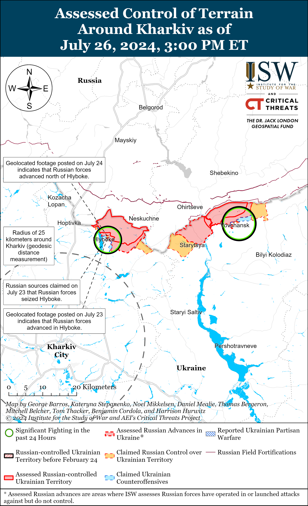
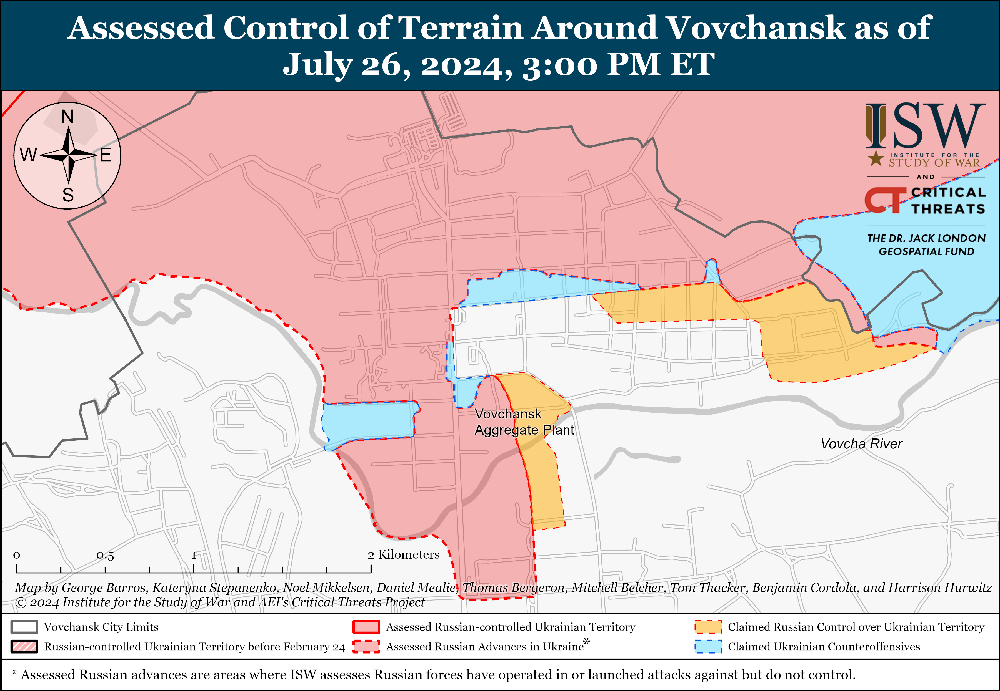
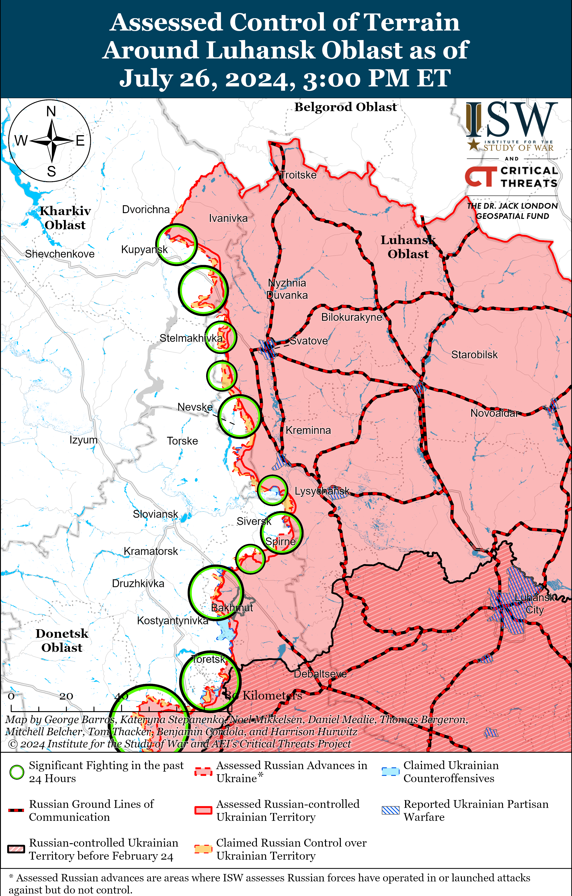
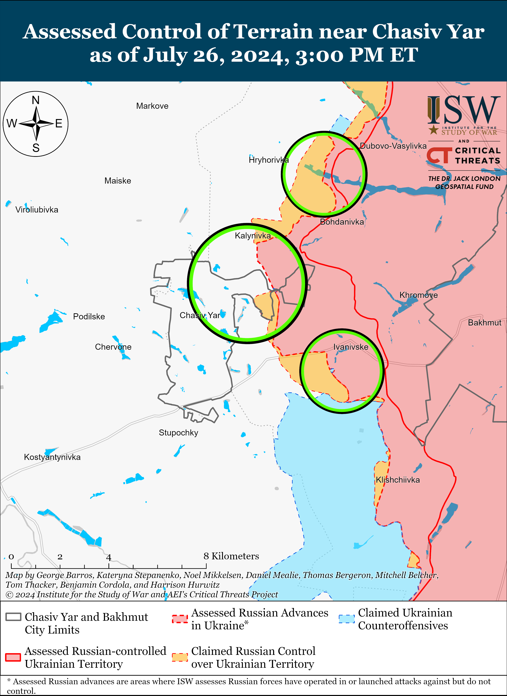
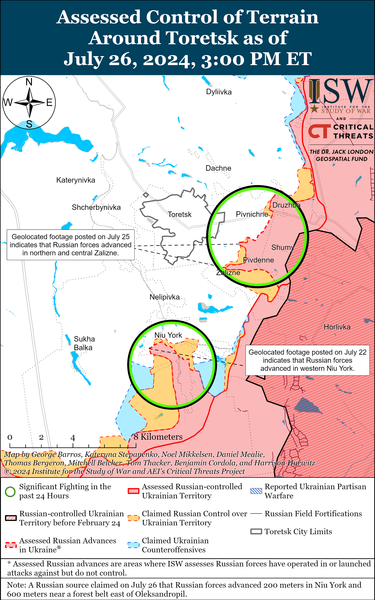
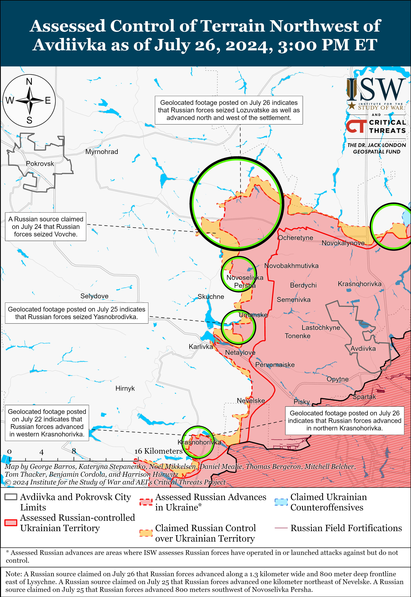
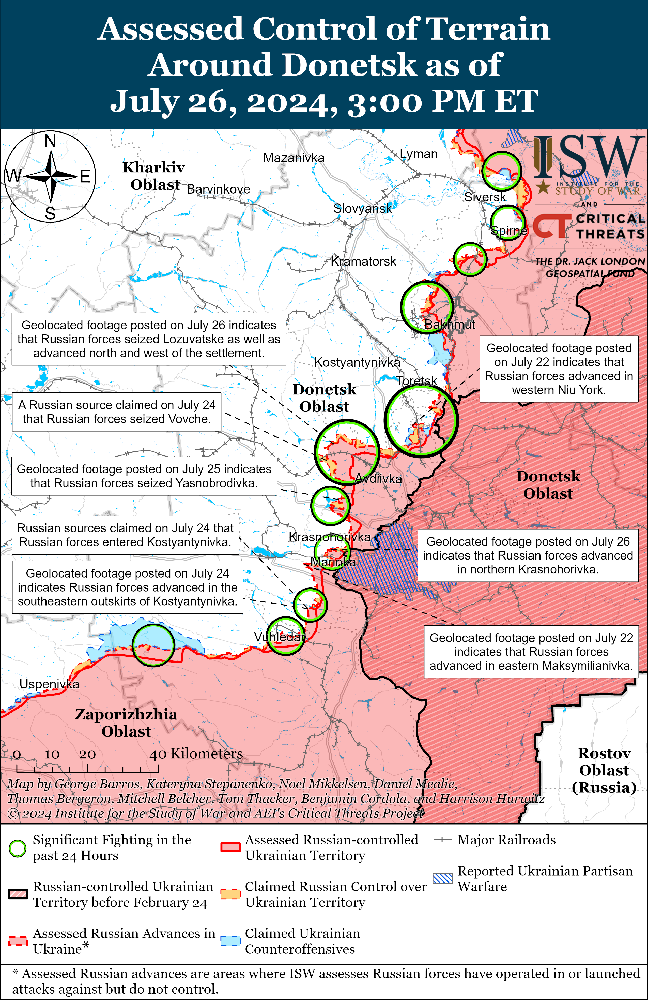
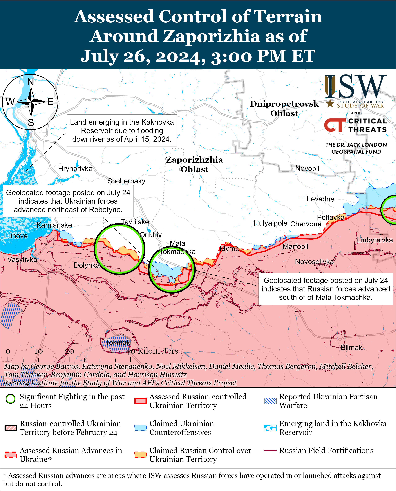
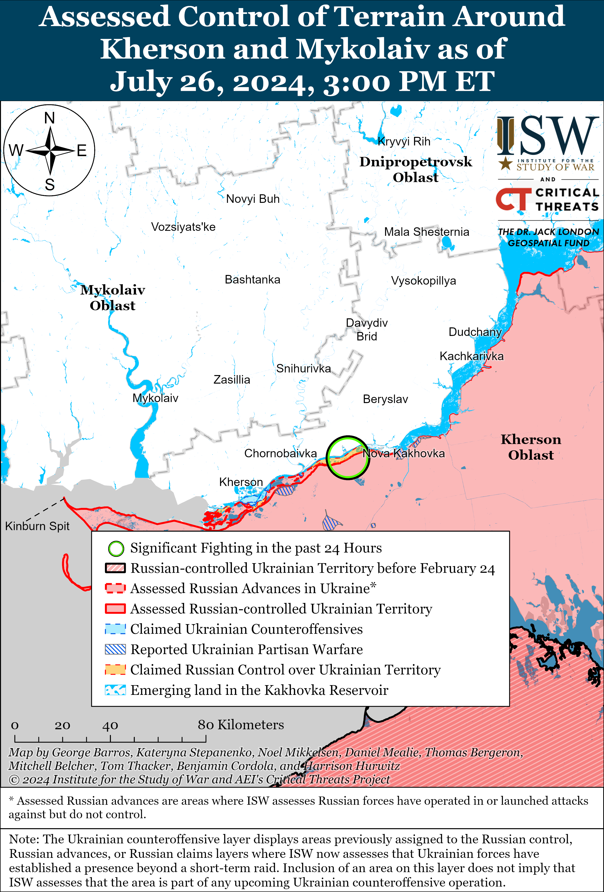

# Russian Offensive Campaign Assessment, July 26, 2024

**Riley Bailey, Christina Harward, Grace Mappes, Angelica Evans,  
Davit Gasparyan, and George Barros**

**July 26, 2024, 6:45pm ET**

**Click**[**here**](https://storymaps.arcgis.com/stories/36a7f6a6f5a9448496de641cf64bd375)**to see ISW’s interactive map of the Russian invasion of Ukraine. This map is updated daily alongside the static maps present in this report.**

**Click**[**here**](https://understandingwar.maps.arcgis.com/apps/instant/3dviewer/index.html?appid=1602762dbcde419bb957dea358449580)**to see ISW’s 3D control of terrain topographic map of Ukraine. Use of a computer (not a mobile device) is strongly recommended for using this data-heavy tool.**

**Click**[**here**](https://storymaps.arcgis.com/stories/733fe90805894bfc8562d90b106aa895)**to access ISW’s archive of interactive time-lapse maps of the Russian invasion of Ukraine. These maps complement the static control-of-terrain map that ISW produces daily by showing a dynamic frontline. ISW will update this time-lapse map archive monthly.**

**Note: The data cut-off for this product was 12:10pm ET on July 26. ISW will cover subsequent reports in the July 27 Russian Offensive Campaign Assessment.**

**The Russian military has recently expanded the Russian Central Grouping of Forces’ area of responsibility (AOR) in Donetsk Oblast, suggesting that the Russian military command has deprioritized the grouping’s previous task to act solely as an operational maneuver force in the Avdiivka direction. The Russian military command may instead be tasking the Central Grouping of Forces with overseeing the bulk of Russia’s main offensive efforts in Donetsk Oblast.**Russian forces transferred the Central Grouping of Forces from the Kreminna area to the Avdiivka direction ahead of the Russian offensive operation to seize Avdiivka from October 2023 to February 2024 and proceeded to concentrate almost all Central Military District (CMD) elements deployed to Ukraine in the area during the offensive operation.[1] The Russian military command established the Central Grouping of Forces as an operational maneuver force along a narrow front in the Avdiivka area following the seizure of Avdiivka in February 2024 and tasked CMD elements with exploiting Russian tactical advances and pushing as far west as possible before Ukrainian forces established more cohesive and harder-to-penetrate defensive lines in the area.[2] The Russian Central Grouping of Forces made a notable tactical breakthrough northwest of Avdiivka in mid-April 2024 and achieved significant tactical gains in the area, largely due to Ukrainian materiel constraints caused by delays in Western security assistance.[3] Ukrainian forces have since stabilized the front in the area and slowed the rate of Russian advance, and the Russian Central Grouping of Forces is now advancing at a relatively similar pace as Russian forces elsewhere in Ukraine.

Russian forces began an offensive operation towards Toretsk in mid-June 2024 and also tasked the Central Grouping of Forces with the effort, and the Central Grouping of Forces redeployed the majority of the CMD’s 27th Motorized Rifle Division from the Avdiivka area to Niu York (south of Toretsk).[4] Responsibility for the Toretsk effort has roughly doubled the length of the Central Grouping of Forces’ AOR and has already drawn notable manpower away from the Avdiivka effort. Ukrainian military observer Kostyantyn Mashovets stated on July 26 that elements of the CMD’s 90th Tank Division (41st Combined Arms Army [CAA]) conducted the Russian reinforced battalion-size mechanized assault southwest of Donetsk City on July 24, although ISW has yet to observe wider reports attributing the attack to the 90th Tank Division.[5] Elements of the Russian Eastern and Southern groupings of forces have previously conducted offensive operations west and southwest of Donetsk City, and the commitment of CMD elements to the area in one of the largest mechanized assaults since Fall 2023 is a notable inflection.[6] The Central Grouping of Forces previously used elements of the 90th Tank Division as an operational reserve and committed those elements to intensify the Russian offensive effort near Avdiivka in March 2024, during which elements of the 90th Tank Division conducted the last observed battalion-size mechanized assault in Ukraine.[7] The reported commitment of elements of the 90th Tank Division to the area southwest of Donetsk City suggests that the Central Grouping of Forces’ AOR may be expanding southward as well, although the exact contours of the grouping’s responsibilities are unclear. The commitment of elements of the 90th Tank Division to the area would also indicate that the Central Grouping of Forces is willing to allocate considerable manpower and equipment to other tactical and operational objectives outside of its existing operational focus on pursuing tactically significant gains in the Avdiivka area.

**The expansion of the Central Grouping of Forces’ AOR indicates that the Russian military command may assess that rapid tactical gains in the Avdiivka area are unlikely.**Whether this possible assessment is based on waning Ukrainian materiel and manpower constraints or specifically based on an assessment of the Central Grouping of Forces’ failure to achieve its assigned tasks is unclear. An AOR that stretches from southwest of Donetsk City to Toretsk will draw available Russian manpower and materiel away from the existing effort to make tactically significant advances northwest and west of Avdiivka. The Central Grouping of Forces likely lacks the reserves necessary to intensify operations in the Avdiivka area to the degree that would facilitate relatively rapid gains while maintaining offensive pressure in the Toretsk and Donetsk City directions. The Russian military command is currently attempting to maintain consistent offensive pressure throughout the front to prevent Ukraine from contesting the battlefield initiative, and tasking the Central Grouping of Forces with grinding offensive operations along a longer front is more in line with this effort than tasking the grouping with achieving tactically significant gains through relatively rapid maneuver.[8]

**Ukrainian forces reportedly conducted an ATACMS strike against Saky Airbase in occupied Crimea on the night of July 25 to 26.**The Ukrainian General Staff reported on July 26 that Ukrainian forces conducted a missile strike against Saky Airbase in occupied Crimea on the night of July 25 to 26.[9] The Ukrainian General Staff noted that it was clarifying the consequences of the strikes but that Russian air defense systems protecting the airbase failed to repel the strike. Russian opposition outlet *Astra*reported on July 26 that unspecified sources stated that Ukrainian forces launched four ATACMS against occupied Crimea and that Russian forces shot down two of the missiles.[10] *Astra*reported that Ukrainian ATACMS struck an ammunition depot at Saky Airbase and destroyed a radar station at an air defense deployment site five kilometers from occupied Shelkovychne (northwest of Saky Airbase). A Crimea-based Telegram channel also reported that Ukrainian forces struck an ammunition depot at the airbase.[11]

**The Russian Federal Security Service (FSB) arrested former Russian Deputy Defense Minister Army General Dmitri Bulgakov on corruption charges on July 26 – the latest in a concerted Kremlin effort to remove senior Russian defense officials since April 2024.**[12] Russian state news agency *RIA Novosti*reported that a source in Russian law enforcement stated that Bulgakov used his position in the Russian Ministry of Defense (MoD) to lobby for the Gryazinsky Food Plant, which the source claimed won catering contracts with the MoD and supplied low-quality food at high prices to the Russian military.[13] Russian authorities arrested top managers of the Gryazinsky Food Plant for embezzling funds from MoD contracts in April 2024, and Kremlin newswire TASSstated on July 26 that Bulgakov’s case materials indicate that Bulgakov is a suspect in the same case.[14] Bulgakov oversaw Russian military logistics as Deputy Defense Minister from 2008 to 2022, and the Kremlin awarded Bulgakov the Hero of Russia award in 2016.[15] The Russian MoD relieved Bulgakov of his post in September 2022 and stated that he had been transferred to another, unspecified position.[16] A Russian insider source claimed that Russian authorities have been investigating Bulgakov since 2022 and have previously summoned Bulgakov as a witness in an unspecified number of MoD corruption cases.[17] A prominent Russian milblogger claimed that there had been talk “in narrow circles” about investigations into Bulgakov since May 2024.[18] Another Russian insider source claimed that Bulgakov was not closely connected to former Russian Defense Minister and current Security Council Secretary Sergei Shoigu.[19] Russian milbloggers celebrated Bulgakov’s arrest, who they claimed was responsible for systemic logistics issues at the start of Russia’s full-scale invasion of Ukraine in 2022 that are still affecting the Russian military today.[20]

**The European Union (EU) transferred the first tranche of proceeds from frozen Russian assets to Ukraine.**European Commission President Ursula von Der Leyen announced on July 26 that the EU transferred 1.5 billion euros (about $1.6 billion) from frozen Russian assets to Ukraine as a part of its support for Ukraine’s defense capabilities and reconstruction.[21] Kremlin Spokesperson Dmitry Peskov responded on July 26, claiming that Russia will not leave the European Commission’s actions unanswered.[22]

**The Kremlin continues intensifying efforts to control Russians’ internet activities and to create a culture of self-censorship within Russia.**Russian authorities are increasingly signaling their intent to eventually block YouTube within Russia and will likely compel Russians to use social media platforms influenced or controlled by the Kremlin. Russian federal censor Roskomnadzor accused YouTube of “numerous violations” of Russian legislation and “disrespect” for Russia and its citizens and warned that these acts are grounds for “taking action” against YouTube.[23] Russian State Duma Committee on Information Policy Head Alexander Khinshtein stated that YouTube will load up to 40 percent slower in the coming days because Russian data centers cooperating with Google under unspecified “gray [area] schemes” intend to stop these schemes, a shift from Russian telecom giant Rostelecom’s recent statement that slow YouTube load times within Russia are due to a lack of Russian servers hosting YouTube.[24] Russian internet authorities will likely throttle YouTube within Russia. Russian opposition outlet *Verstka*reported on July 26 citing a source within the Russian presidential administration that Russia aims to replace YouTube with *Vkontakte’s* (VK) Video service and aims to download all Russian-language videos from YouTube to the VK service by Fall 2024.[25] VK is a Russian social media service currently headed by Vladimir Kiriyenko, the son of Russian Presidential Administration Deputy Head Sergei Kiriyenko. Sergei Kiriyenko oversees multiple information operations targeting Russia’s domestic information space, Ukraine, and the West.[26]

The Kremlin appears to be attempting to create a culture of compliance with the Kremlin’s censorship requirements, including only using Kremlin-approved programs and self-censoring opposition or other content unfavorable to the Kremlin’s aims. The Russian Cabinet of Ministers approved a list of Russian software programs that Russian technology manufacturers must pre-install on smartphones, tablets, computers, smart televisions, and similar devices.[27] Kremlin Spokesperson Dmitry Peskov stated in reference to Russian censorship laws against “discrediting” Russian civil servants and the military that legislation should apply to both “ordinary life” and the internet and that Russian legislation is “expanding” accordingly, which is odd because Russia has prosecuted or otherwise censored many information space voices based on text or footage published online.[28]

**Russian security forces reportedly detained several unknown actors threatening to blow up an apartment building in the Republic of Dagestan on July 25.**Dagestan’s security forces told Kremlin newswire *TASS* that security forces evacuated an apartment building in Kaspiysk and detained an unspecified number of people intending to detonate an improvised explosive device (IED) in the building.[29] Dagestan’s Ministry of Internal Affairs (MVD) Spokesperson Gayana Gariyeva later announced that security forces completed their operation and that there is no remaining threat to the public.[30] The Russian government appears to be struggling with isolated terrorist activity following several significant terrorist attacks in recent months, including the March 2024 Crocus City Hall attack and the June 2024 shootings in Dagestan.[31]

**Key Takeaways:**

- **The Russian military has recently expanded the Russian Central Grouping of Forces’ area of responsibility (AOR) in Donetsk Oblast, suggesting that the Russian military command has deprioritized the grouping’s previous task to act solely as an operational maneuver force in the Avdiivka direction. The Russian military command may instead be tasking the Central Grouping of Forces with overseeing the bulk of Russia’s main offensive efforts in Donetsk Oblast.**
- **The expansion of the Central Grouping of Forces’ AOR indicates that the Russian military command may assess that rapid tactical gains in the Avdiivka area are unlikely.**
- **Ukrainian forces reportedly conducted an ATACMS strike against Saky Airbase in occupied Crimea on the night of July 25 to 26.**
- **The Russian Federal Security Service (FSB) arrested former Russian Deputy Defense Minister Army General Dmitri Bulgakov on corruption charges on July 26 – the latest in a concerted Kremlin effort to remove senior Russian defense officials since April 2024.**
- **The European Union (EU) transferred the first tranche of proceeds from frozen Russian assets to Ukraine.**
- **The Kremlin continues intensifying efforts to control Russians’ internet activities and to create a culture of self-censorship within Russia.**
- **Russian security forces reportedly detained several unknown actors threatening to blow up an apartment building in the Republic of Dagestan on July 25.**
- **Russian forces recently marginally advanced near Svatove, Avdiivka, and Donetsk City.**
- **The Royal United Services Institute (RUSI) reported on July 22 that the Russian intelligence services appear to have further integrated Russian forces’ cyber and conventional capabilities.**

***We do not report in detail on Russian war crimes because these activities are well-covered in Western media and do not directly affect the military operations we are assessing and forecasting. We will continue to evaluate and report on the effects of these criminal activities on the Ukrainian military and the Ukrainian population and specifically on combat in Ukrainian urban areas. We utterly condemn Russian violations of the laws of armed conflict and the Geneva Conventions and crimes against humanity even though we do not describe them in these reports.***

- Russian Main Effort – Eastern Ukraine (comprised of three subordinate main efforts)
- Russian Subordinate Main Effort #1 – Push Ukrainian forces back from the international border with Belgorod Oblast and approach to within tube artillery range of Kharkiv City
- Russian Subordinate Main Effort #2 – Capture the remainder of Luhansk Oblast and push westward into eastern Kharkiv Oblast and encircle northern Donetsk Oblast
- Russian Subordinate Main Effort #3 – Capture the entirety of Donetsk Oblast
- Russian Supporting Effort – Southern Axis
- Russian Air, Missile, and Drone Campaign
- Russian Mobilization and Force Generation Efforts
- Russian Technological Adaptations
- Activities in Russian-occupied areas
- Ukrainian Defense Industrial Base Efforts
- Russian Information Operations and Narratives
- Significant Activity in Belarus

**Russian Main Effort – Eastern Ukraine**

**Russian Subordinate Main Effort #1 – Kharkiv Oblast (Russian objective: Push Ukrainian forces back from the international border with Belgorod Oblast and approach to within tube artillery range of Kharkiv City)**

Russian milbloggers continued to claim that Russian forces are operating in Sotnytskyi Kozachok (northwest of Kharkiv City and on the border with Belgorod Oblast). A Russian milblogger claimed on July 25 that Russian forces conducted a cross-border assault and entered Sotnytskyi Kozachok.[32] ISW has not observed recent visual evidence of Russian forces operating in Sotnytskyi Kozachok and continues to assess that Russian forces do not have an enduring presence in the settlement.[33] Another Russian milblogger amplified footage on July 26 purportedly showing four Russian glide bombs striking a Ukrainian military warehouse near Bilopillya, Sumy Oblast.[34]

Fighting continued north and northeast of Kharkiv City on July 25 and 26, but there were no confirmed changes to the frontline. A Russian source reiterated claims that Russian forces have completely seized Hlyboke (north of Kharkiv City) although ISW has not observed visual evidence confirming that Russian forces are operating in western Hlyboke.[35] Positional fighting continued near Hlyboke and northeast of Kharkiv City near Vovchansk, Vovchanski Khutory, and Tykhe on July 25 and 26.[36] Russian sources claimed that Ukrainian forces conducted unsuccessful counterattacks north of Lyptsi (north of Kharkiv City) and near Hlyboke and Tykhe on July 25 and 26.[37] The Ukrainian General Staff reported that Russian forces conducted glide bomb strikes near Lyptsi, Hlyboke, Vovchansk, Vovchanski Khutory, and Tykhe on July 26.[38] Elements of the 11th Separate Guards Engineering Brigade’s (Southern Military District [SMD]) “Pheonix” Special Mining Battalion are purportedly operating in the Kharkiv direction.[39]

**Russian Subordinate Main Effort #2 – Luhansk Oblast (Russian objective: Capture the remainder of Luhansk Oblast and push westward into eastern Kharkiv Oblast and northern Donetsk Oblast)**

Russian forces recently advanced near Svatove and reportedly made further advances along the Kupyansk-Svatove-Kreminna line on July 26. Geolocated footage published on July 25 indicates that Russian forces recently advanced east of Andriivka (west of Svatove).[40] Russian milbloggers claimed that Russian forces northwest of Svatove advanced south of Berestove, north of Pishchane, towards Hlushkivka, and into central Stelmakhivka.[41] A Russian milblogger claimed that elements of the Russian 4th Tank Division (1st Guards Tank Army [GTA], Moscow Military District [MMD]) broke through Ukrainian defenses near Stelmakhivka and are preparing to conduct mechanized assaults in the area.[42] ISW has not observed confirmation of these claims, however. Russian forces continued offensive operations northeast of Kupyansk near Synkivka; east of Kupyansk near Petropavlivka; northwest of Svatove near Stepova Novoselivka, Tabaivka, Pishchane; and Stelmakhivka; northwest of Kreminna near Makiivka, Nevske, and Ploshchanka; and south of Kreminna near the Serebryanske forest area on July 25 and 26.[43]

**Russian Subordinate Main Effort #3 – Donetsk Oblast (Russian objective: Capture the entirety of Donetsk Oblast, the claimed territory of Russia’s proxies in Donbas)**

Russian forces continued offensive operations near Siversk on July 26, but there were no confirmed changes to the frontline in this area. Russian forces continued offensive operations east of Siversk near Verkhnokamyanske, southeast of Siversk near Spirne and Ivano-Darivka, and south of Siversk near Mykolaivka on July 25 and 26.[44] Elements of the Russian 106th Airborne (VDV) Division are reportedly operating on the outskirts of Pereizne (south of Siversk), drone operators of the 123rd Motorized Rifle Brigade (2nd Luhansk People’s Republic [LNR] Army Corps [AC]) are reportedly operating near Ivano-Darivka, and elements of the “Sumrak” Battalion are reportedly operating in the Siversk direction.[45]

Russian forces continued offensive operations near Chasiv Yar on July 26, but there were no confirmed changes to the frontline in this area. Russian forces continued offensive operations north of Chasiv Yar near Hryhorivka, northwest of Chasiv Yar near Mayske, northeast of Chasiv Yar near Kalynivka, east of Chasiv Yar near Ivanivske, and near Chasiv Yar itself on July 25 and 26.[46] Russian sources claimed that Ukrainian forces are counterattacking near unspecified areas of the Siverskyi-Donets Donbas Canal.[47] A Russian milblogger claimed that Russian forces recently crossed the Siverskyi-Donets Donbas Canal near Kalynivka but that it is unknown if Russian forces consolidated these positions.[48]

Russian forces reportedly advanced near Toretsk on July 26, but there were no confirmed changes to the frontline in this area. Russian milbloggers claimed that Russian forces advanced up to 200 meters within Niu York (south of Toretsk), up to 600 meters towards Oleksandropil (southwest of Toretsk), southwest of Yurivka (south of Toretsk), and within Pivnichne and Zalizne (both east of Toretsk).[49] ISW has not observed confirmation of these Russian claims, however. Russian forces continued offensive operations east of Toretsk near Pivnichne and Druzhba, southeast of Toretsk near Zalizne, and south of Toretsk near Niu York on July 25 and 26.[50]

Russian forces recently advanced near Avdiivka amid continued Russian offensive operations in the area on July 26. Geolocated footage published on July 25 shows elements of the Russian 1453rd Motorized Rifle Regiment (1st Donetsk People’s Republic [DNR] AC) raising a Russian flag in eastern Yasnobrodivka (west of Avdiivka), indicating that Russian forces have most likely seized all of Yasnobrodivka.[51] Additional geolocated footage published on July 26 indicates that Russian forces advanced near Prohres and Lozuvatske (both northwest of Avdiivka), indicating that Russian forces likely recently seized Lozuvatske.[52] Russian milbloggers claimed that Russian forces advanced up to 1.3 kilometers wide and 800 meters deep east of Lysychne (northwest of Avdiivka and west of Lozuvatske), up to 1.12 kilometers wide and 700 meters deep east of Vesele (northwest of Avdiivka and west of Prohres), and within Vovche (northwest of Avdiivka and south of Prohres) and Novoselivka Persha (northwest of Avdiivka).[53] Russian forces also continued offensive operations northwest of Avdiivka near Kalynove, Novooleksandrivka, Vozdvyzhenka, Tymofiivka, and Novozhelanne and west of Avdiivka near Karlivka on July 25 and 26.[54] Elements of the Russian 15th Motorized Rifle Brigade (2nd Combined Arms Army [CAA], Central Military District [CMD]) are reportedly operating near Vovche.[55]

Russian forces recently advanced west of Donetsk City amid continued Russian offensive operations west and southwest of Donetsk City on July 26. Geolocated footage published on July 26 indicates that Russian forces recently advanced within northern Krasnohorivka (west of Donetsk City).[56] Russian milbloggers claimed that Russian forces advanced further within northern Krasnohorivka and up to 700 meters in eastern Kostyantynivka (southwest of Donetsk City), but ISW has not observed confirmation of these claims.[57] Russian forces continued offensive operations west of Donetsk City near Krasnohorivka and southwest of Donetsk City near Kostyantynivka, Paraskoviivka, and Vodyane on July 25 and 26.[58] Elements of the Russian 57th Motorized Rifle Regiment (6th Motorized Rifle Division, 3rd AC, Moscow Military District [MMD]) are reportedly operating near Paraskoviivka, and elements of the 238th Artillery Brigade (8th CAA, Southern Military District [SMD]) and 5th Motorized Rifle Brigade (1st DNR AC) are reportedly operating near Krasnohorivka.[59]

Russian forces reportedly conducted another mechanized assault in the Kurakhove direction (west and southwest of Donetsk City) on July 25, following the reinforced battalion-sized Russian mechanized assault on July 24 near Kostyantynivka that resulted in significant vehicle losses. The Ukrainian brigade that defended against the July 24 attack later stated that Russian forces conducted a reinforced company-size mechanized assault on July 25 with three tanks, 13 armored combat vehicles, 12 motorcycles, and roughly 200 personnel in the Kurakhove direction and that Ukrainian forces destroyed one tank and two armored combat vehicles.[60] ISW continues to assess that the Russian military command’s willingness to expend a large number of armored vehicles on limited tactical objectives reflects poor longer-term operational foresight and that constraints on Russian equipment in the medium- to long-term will make such failed mechanized assaults costlier with time.[61]

Positional engagements continued in the Donetsk-Zaporizhia Oblast border area on July 26 near Velyka Novosilka and Rozdolne (northeast of Velyka Novosilka), but there were no confirmed changes to the frontline.[62]

**Russian Supporting Effort – Southern Axis (Russian objective: Maintain frontline positions and secure rear areas against Ukrainian strikes)**

Russian forces continued ground attacks in western Zaporizhia Oblast on July 26 but there were no confirmed changes to the frontline. Fighting continued near Robotyne; north of Robotyne near Novoandriivka; northwest of Robotyne near Shcherbaky and Yurkivka; and northeast of Robotyne near Mala Tokmachka on July 25 and 26.[63] Reconnaissance elements of the Russian 4th Military Base, (58th Combined Arms Army [CAA], Southern Military District [SMD]), including its “Valkyria” drone detachment, are reportedly fighting near Kamyanske (northwest of Robotyne).[64]

Positional fighting continued in east (left) bank Kherson Oblast near Krynky on July 26, but there were no confirmed changes to the frontline.[65] Elements of the Russian 18th CAA (SMD) reportedly continue operating in the Kherson direction.[66]

**Russian Air, Missile, and Drone Campaign (Russian Objective: Target Ukrainian military and civilian infrastructure in the rear and on the frontline)**

Russian forces conducted a limited number of missile and drone strikes targeting Ukraine on the night of July 25 to 26. Ukrainian Air Force Commander Lieutenant General Mykola Oleshchuk reported that Russian forces launched an Iskander-M ballistic missile from Rostov Oblast and 22 Shahed-136/131 drones from occupied Cape Chauda, Crimea and Kursk Oblast.[67] Oleshchuk reported that Ukrainian forces shot down 20 Shahed drones over Kherson, Sumy, Zhytomyr, and Chernihiv oblasts.[68] Ukrainian state electricity transmission operator Ukrenergo reported on July 26 that Russian forces struck Ukrenergo energy facilities in Zhytomyr and Chernihiv oblasts and damaged equipment.[69] Nizhyn Mayor Oleksandr Kodola stated that Russian forces also struck a hostel in Nizhyn, Chernihiv Oblast with a Shahed drone.[70] The Russian Ministry of Defense (MoD) published footage on July 26 purporting to show Russian forces striking a Ukrainian ammunition depot in Kramatorsk, Donetsk Oblast with an Iskander-M ballistic missile, and Ukrainian Kramatorsk Military Administration Head Oleksandr Honcharenko reported that Russian forces struck industrial facilities within Kramatorsk.[71]

**Russian Mobilization and Force Generation Efforts (Russian objective: Expand combat power without conducting general mobilization)**

The Royal United Services Institute (RUSI) reported on July 22 that the Russian intelligence services appear to have further integrated Russian forces’ cyber and conventional capabilities. RUSI reported that Russian cyber units have begun prioritizing targeting Ukrainian mobile devices in frontline areas in order to disrupt tactical logistics and operations and have shifted away from targeting Ukrainian civilian targets.[72] RUSI reported that Russian cyber units are attempting to access Ukrainian military devices through malware disguised as official military applications or messages or by hacking encrypted messaging applications (EMAs) like Telegram, Signal, and WhatsApp by siphoning messages and other files from these applications. RUSI assessed that Russian intelligence services likely intend to sabotage Ukrainian critical infrastructure in the future but are currently focused on disrupting tactical-level Ukrainian capabilities.

The Russian Ministry of Defense (MoD) appears to be cooperating with Rosgvardia to expand and improve medical services available to Russian servicemembers within Russia. The Russian MoD claimed on July 26 that Russian Defense Minister Andrei Belousov and Rosgvardia Head Viktor Zolotov signed an agreement allowing military and Rosgvardia personnel to seek medical attention and undergo medical examinations for military medical commissions at both MoD and Rosgvardia medical facilities in Russia.[73] Belousov thanked Zolotov for helping to expand medical services for Russian personnel and claimed that this would improve medical treatment for personnel fighting in Ukraine. Russian deputy defense ministers Pavel Fradkov and Anna Tsivileva also visited a Southern Military District (SMD) military hospital on July 26 and noted that the Russian MoD is preparing to complete construction on the hospital in February 2025.[74] Fradkov emphasized that the Russian MoD views medical infrastructure as “extremely important.” The Russian MoD may be concerned about its ability to provide adequate medical treatment to the increasing number of wounded personnel in and returning from Ukraine. Russian military officials, including Tsivileva, have recently tried to portray themselves as providing adequate medical care to Russian soldiers who fought in Ukraine after outrage about the Russian military command reportedly sending injured soldiers to fight on the frontline.[75]

The Russian MoD continues efforts to improve training capacity for servicemembers. Belousov inspected a training center in the Leningrad Military District (LMD) on July 26, and Russian Deputy Defense Minister Yunus-Bek Yevkurov reported that instructors who served in Ukraine are conducting all the training exercises at the training grounds of the LMD.[76] Belousov also discussed further improving training programs for Russian servicemembers and constructing additional training grounds in the LMD.

Russian federal subjects continue to offer monetary incentives to entice Russians into military service. Rostov Oblast Head Vasily Golubev announced on July 26 that the Rostov Oblast government is increasing its one-time payment to Russian military recruits to 1.2 million rubles ($13,900) if recruits sign a military service contract between July 27 and August 31.[77] Golubev clarified that the Rostov Oblast government will pay the one-time bonus to Rostov Oblast residents and residents of other Russian federal subjects who travel to and sign military service contracts in Rostov Oblast. Other Russian oblasts have recently announced similar monetary incentives for contract military service.[78]

Russian outlet *Vedomosti* reported on July 26 that some banks in the People’s Republic of China (PRC) have begun to unofficially label Chinese yuan notes that have been used in transactions with Russian companies as “dirty.”[79] A member of the General Council of Delovaya Rossiya, a Russian business association, told *Vedomosti* that many PRC banks are unwilling to accept yuan with “Russian traces” and that one PRC bank refused to accept yuan notes purchased on the Moscow Exchange. PRC banks previously expressed concern about interactions with Russian entities and entities with ties to the Russian defense industry following the US authorization of secondary sanctions against financial institutes that facilitate Russian sanctions evasion.[80]

**Russian Technological Adaptations (Russian objective: Introduce technological innovations to optimize systems for use in Ukraine)**

Russian defense manufacturer “Laboratory 13” claimed on July 22 that it created the “Karman” miniature drone suppressor and is testing the portable anti-drone device among Russian forces in Ukraine.[81] “Laboratory 13” claimed that the device can operate autonomously by receiving signals from Laboratory 13’s “Oko-P” drone detection devices.[82]

Russian drone manufacturer MiS Design Bureau claimed on July 25 that it has started serial production of an analog of the Ukrainian remote mining and bombardier “Baba Yaga” drone.[83] MiS Design Bureau claimed that it will serially produce the MiS-35 strike and reconnaissance hexacopter drone and that the drone will have a maximum payload capacity of 4.5 kilograms and a maximum range of nine kilometers.[84]

**Ukrainian Defense Industrial Efforts (Ukrainian objective: Develop its defense industrial base to become more self-sufficient in cooperation with US, European, and international partners)**

*ISW is not publishing coverage of Ukrainian defense industrial efforts today.*

**Activities in Russian-occupied areas (Russian objective: Consolidate administrative control of annexed areas; forcibly integrate Ukrainian citizens into Russian sociocultural, economic, military, and governance systems)**

Russian officials continue efforts to forcibly integrate occupied Ukraine into Russian structures through economic, infrastructure, and social programs. Russian President Vladimir Putin claimed on July 24 that Russia allocated more than 1.26 billion rubles (about $14.6 million) to socioeconomic programs in occupied Ukraine in 2023 involving 26 state-owned companies and 82 federal subjects with patronage over occupied areas.[85] Putin claimed that Russia built more than 19,000 new infrastructure objects, 200 medical sites, 1,300 educational institutions, and 8,000 kilometers of roads in 2023.

Kremlin officials continue efforts to distance themselves from their roles in the forced deportation and Russification of Ukrainian children. Russian Children’s Rights Commissioner Maria Lvova-Belova met with Turkish Ambassador to Russia Tanju Bilgic on July 23 and claimed that they discussed reuniting Ukrainian children with their parents in Russia and Ukraine and that Bilgic agreed to maintain contact regarding this issue.[86] Ukrainian Luhansk Oblast Military Administration Head Artem Lysohor stated on July 25 that occupation officials sent an unspecified number of Ukrainian children from Luhansk Oblast to a tent camp in Novosibirsk Oblast.[87]

**Russian Information Operations and Narratives**

Nothing significant to report.

**Significant activity in Belarus (Russian efforts to increase its military presence in Belarus and further integrate Belarus into Russian-favorable frameworks and Wagner Group activity in Belarus)**

Russian President Vladimir Putin and Belarusian President Alexander Lukashenko continued their meeting on Valaam Island, Republic of Karelia on July 26.[88]

**Note: ISW does not receive any classified material from any source, uses only publicly available information, and draws extensively on Russian, Ukrainian, and Western reporting and social media as well as commercially available satellite imagery and other geospatial data as the basis for these reports. References to all sources used are provided in the endnotes of each update.**

---

[1] https://understandingwar.org/backgrounder/how-delays-western-aid-gave-russia-initiative-ukrainian-counteroffensive-kharkiv

[2] https://understandingwar.org/backgrounder/how-delays-western-aid-gave-russia-initiative-ukrainian-counteroffensive-kharkiv

[3] https://understandingwar.org/backgrounder/how-delays-western-aid-gave-russia-initiative-ukrainian-counteroffensive-kharkiv

[4] https://isw.pub/UkrWar06272024 ; https://understandingwar.org/backgrounder/russian-offensive-campaign-assessment-july-2-2024 ;

[5] https://understandingwar.org/backgrounder/russian-offensive-campaign-assessment-july-25-2024 ; https://t.me/zvizdecmanhustu/2063

[6] https://isw.pub/UkrWar022724

[7] https://understandingwar.org/backgrounder/russian-offensive-campaign-assessment-march-31-2024

[8] https://understandingwar.org/backgrounder/russian-offensive-campaign-assessment-july-10-2024 ; https://isw.pub/UkrWar063024 ; https://isw.pub/UkrWar060724

[9] https://www.facebook.com/GeneralStaff.ua/posts/pfbid01HtV1USdbU2dkJJDmSPiH9YzZFwFR7dT8PpJqYJr7GkmU7STUtVXrufL9EHsw44vl

[10] https://t.me/astrapress/60447

[11] https://t.me/Crimeanwind/64456

[12] https://www.interfax dot ru/russia/972628; https://ria dot ru/20240726/istochnik-1962196087.html ; https://isw.pub/UkrWar052324 ; https://isw.pub/UkrWar042424; https://isw.pub/UkrWar051624; https://understandingwar.org/backgrounder/russian-offensive-campaign-assessment-may-15-2024; https://isw.pub/UkrWar052124; https://www.bbc.com/russian/articles/cg3jx593p0xo

[13] https://ria dot ru/20240726/istochnik-1962196087.html

[14] https://tass dot ru/proisshestviya/20604725; https://tass dot ru/proisshestviya/21459387

[15] https://t.me/tass\_agency/262646

[16] https://www.kommersant dot ru/doc/6862341

[17] https://t.me/rusbrief/253305

[18] https://t.me/rybar/62132

[19] https://t.me/kremlin\_sekret/15638

[20] https://t.me/boris\_rozhin/131309; https://t.me/milinfolive/126837 ; https://t.me/dva\_majors/3465; https://t.me/treugolniklpr/47500 ;

[21] https://twitter.com/vonderleyen/status/1816761973574353200?ref\_src=twsrc%5Etfw%7Ctwcamp%5Etweetembed%7Ctwterm%5E1816761973574353200%7Ctwgr%5E6cfd4c60441d2ac75720ed29309ae058d9477297%7Ctwcon%5Es1\_&ref\_url=https%3A%2F%2Fsuspilne.media%2F799301-es-pererahue-ukraini-15-milarda-evro-vid-zamorozenih-aktiviv-rosii-evrokomisia%2F; https://ec.europa.eu/commission/presscorner/detail/en/ip\_24\_4029

[22] https://t.me/tass\_agency/262636

[23] https://tass dot ru/ekonomika/21460069

[24] https://tass dot ru/obschestvo/21459685; https://isw.pub/UkrWar071224; https://tass dot ru/ekonomika/21460069

[25] https://t.me/svobodnieslova/5343

[26] https://understandingwar.org/backgrounder/russian-offensive-campaign-assessment-march-28-2024; https://understandingwar.org/backgrounder/russian-offensive-campaign-assessment-february-18-2024 ; https://understandingwar.org/backgrounder/russian-offensive-campaign-assessment-march-1-2024 ; https://understandingwar.org/backgrounder/russian-offensive-campaign-assessment-february-20-2024 ; https://understandingwar.org/backgrounder/russian-offensive-campaign-assessment-february-29-2024 ; https://isw.pub/UkrWar123023

[27] https://www.vedomosti dot ru/technology/news/2024/07/26/1052193-utverdil-spisok-programm

[28] https://tass dot ru/obschestvo/21455877; https://www.ifj.org/media-centre/news/detail/category/press-releases/article/russia-journalist-sentenced-to-six-years-in-prison-for-telegram-post; https://www.rferl.org/a/russia-bogdanova-vchk-ogpu-foeign-agent/33034773.html; https://www.nuj.org.uk/resource/russia-journalist-sentenced-to-six-years-in-prison-over-telegram-post.html; https://www.npr.org/2024/07/23/nx-s1-5049473/russian-american-journalist-convicted-in-secret-trial; https://www.reuters.com/world/russian-prosecutor-seeks-18-year-sentence-us-journalist-gershkovich-agencies-2024-07-19/; https://www.rferl.org/a/russia-girkin-putin-critic-prison/32791526.html; https://meduza dot io/en/news/2023/08/31/blogger-andrey-kurshin-arrested-in-moscow-on-suspicion-of-spreading-fakes-about-russian-army

[29] https://t.me/tass\_agency/262527 ; https://t.me/tass\_agency/262530

[30] https://t.me/tass\_agency/262537

[31] https://understandingwar.org/backgrounder/russian-offensive-campaign-assessment-june-26-2024 ; https://isw.pub/UkrWar062324 ; https://isw.pub/UkrWar032224 ; https://isw.pub/UkrWar032324

[32] https://t.me/DnevnikDesantnika/13072

[33] https://understandingwar.org/backgrounder/russian-offensive-campaign-assessment-july-25-2024 ; https://understandingwar.org/backgrounder/russian-offensive-campaign-assessment-july-17-2024

[34] https://t.me/dva\_majors/48174; https://t.me/control\_sigma/32192

[35] https://t.me/basurin\_e/12942 ; https://t.me/ugra\_ryadom/1941

[36]https://www.facebook.com/GeneralStaff.ua/posts/pfbid0XrogtpT2b2EwXGuKdKXRFkXxnpXnMmKoz48g9WPdikw4caqckqGioCEoCRxK1WLZl ; https://www.facebook.com/GeneralStaff.ua/posts/pfbid0e5CUiPSCNAswcagEQY4ytdLSnQBSiENewZqwcSW1bTA1rM6EuoDHr6gUSfjoj3rJl ; https://t.me/otukharkiv/372 ; https://t.me/rybar/62115 ; https://t.me/dva\_majors/48116 ; https://t.me/RVvoenkor/73278 ; https://t.me/DnevnikDesantnika/13100 ; https://t.me/voenkorKotenok/57773 ;

[37] https://t.me/wargonzo/21211 ; https://t.me/RVvoenkor/73251 ; https://t.me/rybar/62115; https://t.me/dva\_majors/48116

[38]https://www.facebook.com/GeneralStaff.ua/posts/pfbid0mTQr8HPcLoiTSapskx9eHdZgppR6nksqvVu2fqk7NnJx9HByNQJZ6bLvD8aCRbxzl

[39] https://t.me/wargonzo/21223 ; https://www.kp dot ru/daily/27571.5/4894639/

[40] https://x.com/blinzka/status/1816625278258676071; https://x.com/blinzka/status/1816625281664450859; https://www.facebook.com/watch/?v=488318913784598

[41] https://t.me/motopatriot/25446 ; https://t.me/motopatriot/25455 ; https://t.me/NgP\_raZVedka/18479 ; https://t.me/motopatriot/25454 ; https://t.me/DnevnikDesantnika/13096 ; https://t.me/RVvoenkor/73278

[42] https://t.me/NgP\_raZVedka/18479

[43] https://www.facebook.com/GeneralStaff.ua/posts/pfbid0mTQr8HPcLoiTSapskx9eHdZgppR6nksqvVu2fqk7NnJx9HByNQJZ6bLvD8aCRbxzl ; https://www.facebook.com/GeneralStaff.ua/posts/pfbid0XrogtpT2b2EwXGuKdKXRFkXxnpXnMmKoz48g9WPdikw4caqckqGioCEoCRxK1WLZl ; https://www.facebook.com/GeneralStaff.ua/posts/pfbid0e5CUiPSCNAswcagEQY4ytdLSnQBSiENewZqwcSW1bTA1rM6EuoDHr6gUSfjoj3rJl ; https://t.me/DnevnikDesantnika/13096 ; https://t.me/RVvoenkor/73278 ; https://t.me/DnevnikDesantnika/13101

[44] https://www.facebook.com/GeneralStaff.ua/posts/pfbid0mTQr8HPcLoiTSapskx9eHdZgppR6nksqvVu2fqk7NnJx9HByNQJZ6bLvD8aCRbxzl; https://www.facebook.com/GeneralStaff.ua/posts/pfbid0XrogtpT2b2EwXGuKdKXRFkXxnpXnMmKoz48g9WPdikw4caqckqGioCEoCRxK1WLZl ; https://www.facebook.com/GeneralStaff.ua/posts/pfbid0e5CUiPSCNAswcagEQY4ytdLSnQBSiENewZqwcSW1bTA1rM6EuoDHr6gUSfjoj3rJl

[45] https://t.me/rusich\_army/16054; https://x.com/Bielitzling/status/1816537932247003212; https://t.me/BattalionSIGIRIYA/26 ; https://t.me/wargonzo/21218

[46] https://www.facebook.com/GeneralStaff.ua/posts/pfbid0mTQr8HPcLoiTSapskx9eHdZgppR6nksqvVu2fqk7NnJx9HByNQJZ6bLvD8aCRbxzl; https://www.facebook.com/GeneralStaff.ua/posts/pfbid0XrogtpT2b2EwXGuKdKXRFkXxnpXnMmKoz48g9WPdikw4caqckqGioCEoCRxK1WLZl ; https://www.facebook.com/GeneralStaff.ua/posts/pfbid0e5CUiPSCNAswcagEQY4ytdLSnQBSiENewZqwcSW1bTA1rM6EuoDHr6gUSfjoj3rJl ; https://t.me/wargonzo/21211; https://t.me/rusich\_army/16051

[47] https://t.me/project\_nd/127 ; https://t.me/boris\_rozhin/131288; https://t.me/rusich\_army/16051

[48] https://t.me/DnevnikDesantnika/13074

[49] https://t.me/dva\_majors/48116; https://t.me/NgP\_raZVedka/18470; https://t.me/z\_arhiv/27396; https://t.me/z\_arhiv/27400; https://t.me/wargonzo/21211

[50] https://www.facebook.com/GeneralStaff.ua/posts/pfbid0mTQr8HPcLoiTSapskx9eHdZgppR6nksqvVu2fqk7NnJx9HByNQJZ6bLvD8aCRbxzl; https://www.facebook.com/GeneralStaff.ua/posts/pfbid0XrogtpT2b2EwXGuKdKXRFkXxnpXnMmKoz48g9WPdikw4caqckqGioCEoCRxK1WLZl ; https://www.facebook.com/GeneralStaff.ua/posts/pfbid0e5CUiPSCNAswcagEQY4ytdLSnQBSiENewZqwcSW1bTA1rM6EuoDHr6gUSfjoj3rJl ; https://t.me/NgP\_raZVedka/18470; https://t.me/RVvoenkor/73254; https://t.me/RVvoenkor/73278

[51] https://x.com/DefMon3/status/1816622324021621043/history; https://x.com/99Dominik\_/status/1816781858220196212; https://t.me/RVvoenkor/73276; https://t.me/creamy\_caprice/6162;

[52] https://x.com/moklasen/status/1816859176087273503; https://www.facebook.com/watch/?v=470081665665454;

[53] https://t.me/DnevnikDesantnika/13081; https://t.me/wargonzo/21211; https://t.me/RVvoenkor/73278; https://t.me/voenkorKotenok/57778

[54] https://www.facebook.com/GeneralStaff.ua/posts/pfbid0mTQr8HPcLoiTSapskx9eHdZgppR6nksqvVu2fqk7NnJx9HByNQJZ6bLvD8aCRbxzl; https://www.facebook.com/GeneralStaff.ua/posts/pfbid0XrogtpT2b2EwXGuKdKXRFkXxnpXnMmKoz48g9WPdikw4caqckqGioCEoCRxK1WLZl ; https://www.facebook.com/GeneralStaff.ua/posts/pfbid0e5CUiPSCNAswcagEQY4ytdLSnQBSiENewZqwcSW1bTA1rM6EuoDHr6gUSfjoj3rJl ; https://t.me/wargonzo/21211; https://t.me/RVvoenkor/73278; https://t.me/smotri\_z/32831

[55] https://t.me/NgP\_raZVedka/18468

[56] https://t.me/creamy\_caprice/6166; https://t.me/Khortytsky\_wind/791

[57] https://t.me/motopatriot/25444; https://t.me/DnevnikDesantnika/13103

[58] https://www.facebook.com/GeneralStaff.ua/posts/pfbid0mTQr8HPcLoiTSapskx9eHdZgppR6nksqvVu2fqk7NnJx9HByNQJZ6bLvD8aCRbxzl; https://www.facebook.com/GeneralStaff.ua/posts/pfbid0XrogtpT2b2EwXGuKdKXRFkXxnpXnMmKoz48g9WPdikw4caqckqGioCEoCRxK1WLZl ; https://www.facebook.com/GeneralStaff.ua/posts/pfbid0e5CUiPSCNAswcagEQY4ytdLSnQBSiENewZqwcSW1bTA1rM6EuoDHr6gUSfjoj3rJl ; https://t.me/wargonzo/21211 ; https://t.me/RVvoenkor/73246

[59] https://t.me/RVvoenkor/73246; https://t.me/nm\_dnr/12516

[60] https://t.me/ButusovPlus/12109 ; https://t.me/odshbr79/245

[61] https://isw.pub/UkrWar072524

[62] https://www.facebook.com/GeneralStaff.ua/posts/pfbid0XrogtpT2b2EwXGuKdKXRFkXxnpXnMmKoz48g9WPdikw4caqckqGioCEoCRxK1WLZl https://www.facebook.com/GeneralStaff.ua/posts/pfbid0e5CUiPSCNAswcagEQY4ytdLSnQBSiENewZqwcSW1bTA1rM6EuoDHr6gUSfjoj3rJl

[63] https://www.facebook.com/GeneralStaff.ua/posts/pfbid0mTQr8HPcLoiTSapskx9eHdZgppR6nksqvVu2fqk7NnJx9HByNQJZ6bLvD8aCRbxzl; https://www.facebook.com/GeneralStaff.ua/posts/pfbid0XrogtpT2b2EwXGuKdKXRFkXxnpXnMmKoz48g9WPdikw4caqckqGioCEoCRxK1WLZl; https://www.facebook.com/GeneralStaff.ua/posts/pfbid0e5CUiPSCNAswcagEQY4ytdLSnQBSiENewZqwcSW1bTA1rM6EuoDHr6gUSfjoj3rJl; https://www.facebook.com/permalink.php?story\_fbid=pfbid0iAx15bVZRcToHfFNBFPen1bVDgZjvEig4TNyvzjio95eBFGreAmgkGQJSPqZV9HUl&id=61558717479769; https://armyinform dot com.ua/2024/07/26/na-pivdennomu-napryamku-zafiksuvaly-prolit-ponad-320-rozviduvalnyh-droniv-protyvnyka/

[64] https://t.me/boris\_rozhin/131265

[65] https://www.facebook.com/GeneralStaff.ua/posts/pfbid0e5CUiPSCNAswcagEQY4ytdLSnQBSiENewZqwcSW1bTA1rM6EuoDHr6gUSfjoj3rJl ; https://www.facebook.com/GeneralStaff.ua/posts/pfbid0XrogtpT2b2EwXGuKdKXRFkXxnpXnMmKoz48g9WPdikw4caqckqGioCEoCRxK1WLZl; https://www.facebook.com/OperationalCommandSouth/posts/pfbid035QBZMFUYS9np91QF5aQ5TpYsa2xRkonNbf6wKEs614Rq6Gb5cYURWkSnfqvgFSSBl ; https://t.me/SJTF\_Odes/10672; https://www.facebook.com/permalink.php?story\_fbid=pfbid0iAx15bVZRcToHfFNBFPen1bVDgZjvEig4TNyvzjio95eBFGreAmgkGQJSPqZV9HUl&id=61558717479769; https://armyinform dot com.ua/2024/07/26/na-pivdennomu-napryamku-zafiksuvaly-prolit-ponad-320-rozviduvalnyh-droniv-protyvnyka/

[66] https://t.me/DnevnikDesantnika/13083

[67] https://t.me/kpszsu/16957

[68] https://t.me/kpszsu/16957

[69] https://www.facebook.com/npcukrenergo/posts/pfbid034BdhVZZEYXxfL3ATTMwdFNuL783sGcu2eLrRDvuBVmViWS3kjoexj1sRLSkA3gyZl?ref=embed\_post

[70] https://suspilne dot media/799013-zelenskij-obicae-novi-dani-sodo-vbivstva-farion-u-nato-pidtverdili-padinna-v-rumunii-drona-rf-883-den-vijni-onlajn/

[71] https://t.me/mod\_russia/41409 ; https://www.facebook.com/alexander.vasilyevich.goncharenko/posts/pfbid02PAFfS32zFK9HiV9gu4CAyWw9GqCDnTRAxrJwBTLhk8xyBg9enTYqsPu78iTkACbql

[72] https://rusi.org/explore-our-research/publications/commentary/russias-cyber-campaign-shifts-ukraines-frontlines

[73] https://t.me/mod\_russia/41413

[74] https://t.me/mod\_russia/41393

[75] https://understandingwar.org/backgrounder/russian-offensive-campaign-assessment-july-5-2024 ; https://understandingwar.org/backgrounder/russian-offensive-campaign-assessment-july-11-2024

[76] https://t.me/mod\_russia/41405

[77] https://t.me/golubev\_vu/1460

[78] https://understandingwar.org/backgrounder/russian-offensive-campaign-assessment-july-24-2024 ; https://understandingwar.org/backgrounder/russian-offensive-campaign-assessment-july-21-2024

[79] https://www.vedomosti dot ru/finance/articles/2024/07/26/1052157-kitaiskie-banki-otkazivayutsya-prinimat-gryaznie-yuani-iz-rossii

[80] https://isw.pub/UkrWar011624

[81] https://lenta dot ru/news/2024/07/22/v-rossii-sozdali-miniatyurnyy-podavitel-dronov-karman/ ; https://rg dot ru/2024/07/22/miniatiurnyj-podavitel-dronov-karman-sozdali-v-rossii.html ; https://www.gazeta dot ru/army/news/2024/07/22/23509033.shtml

[82] https://lenta dot ru/news/2024/07/22/v-rossii-sozdali-miniatyurnyy-podavitel-dronov-karman/ ; https://rg dot ru/2024/07/22/miniatiurnyj-podavitel-dronov-karman-sozdali-v-rossii.html ; https://www.gazeta dot ru/army/news/2024/07/22/23509033.shtml

[83] https://iz dot ru/1732631/2024-07-25/v-rossii-nachalos-seriinoe-proizvodstvo-geksakoptera-mis-35

[84] https://iz dot ru/1732631/2024-07-25/v-rossii-nachalos-seriinoe-proizvodstvo-geksakoptera-mis-35

[85] http://kremlin dot ru/events/president/news/74634

[86] https://t.me/malvovabelova/3652

[87] https://t.me/luhanskaVTSA/20285

[88] https://t.me/tass\_agency/262661; https://t.me/pul\_1/13151 ; https://t.me/pul\_1/13152
