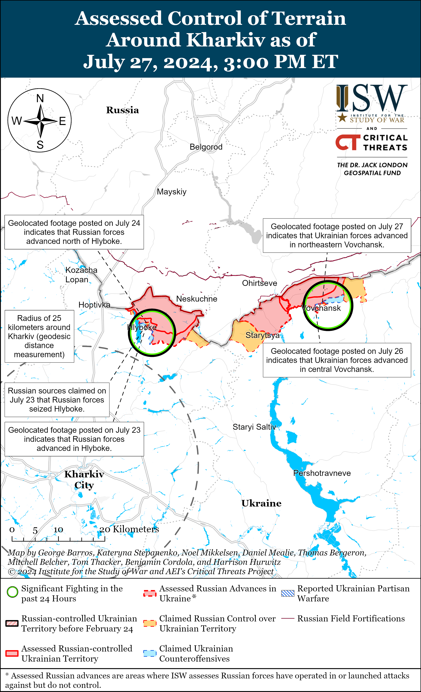
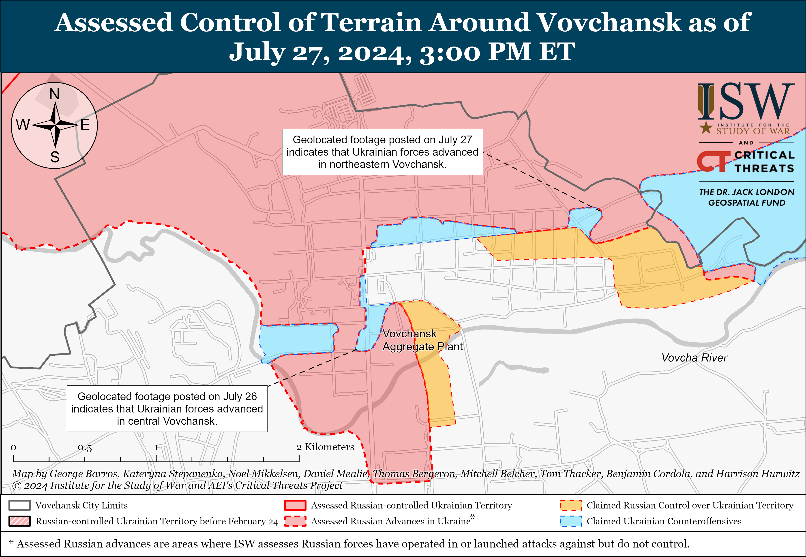
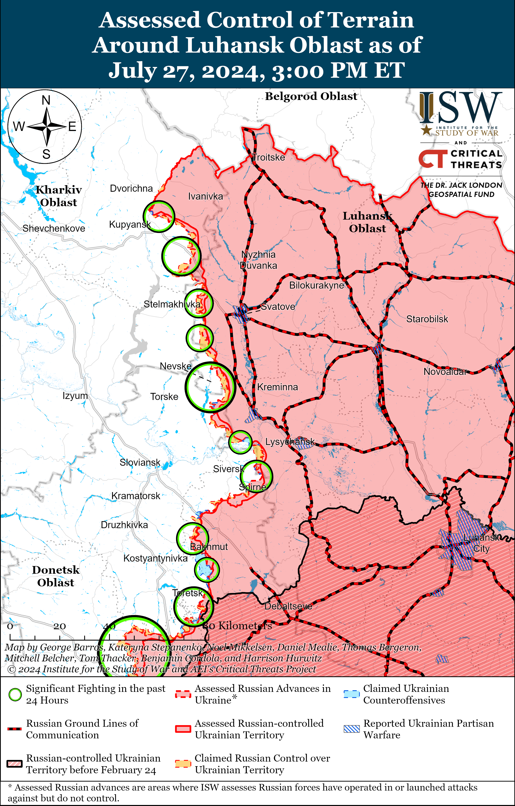
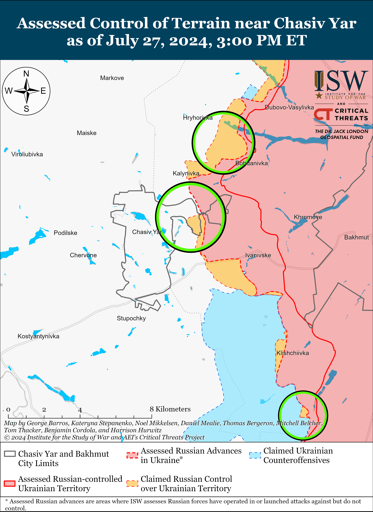
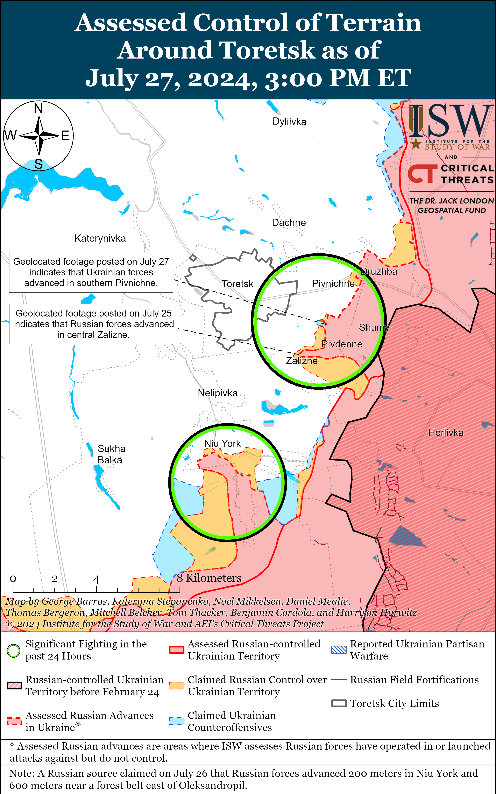
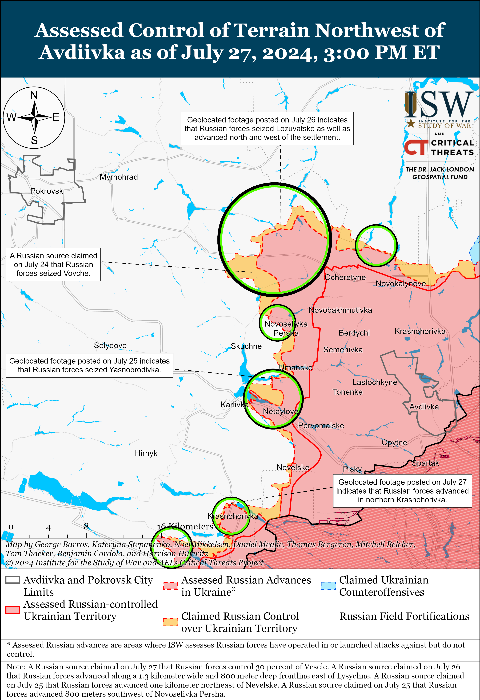
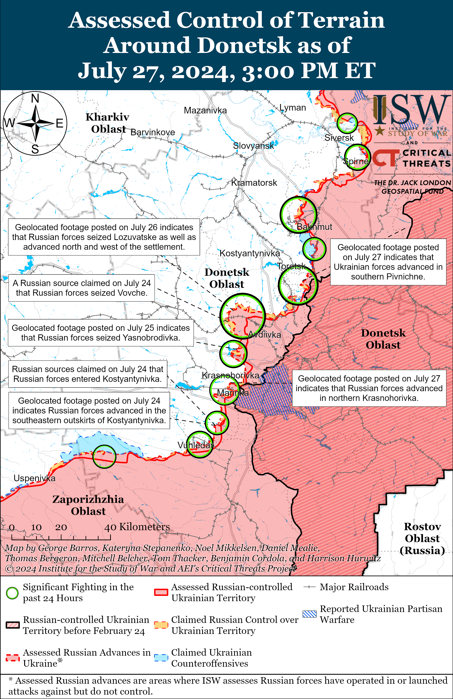
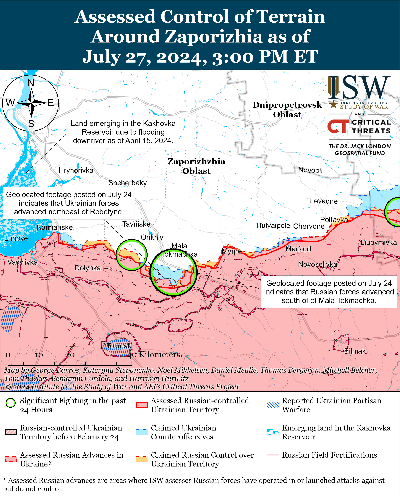
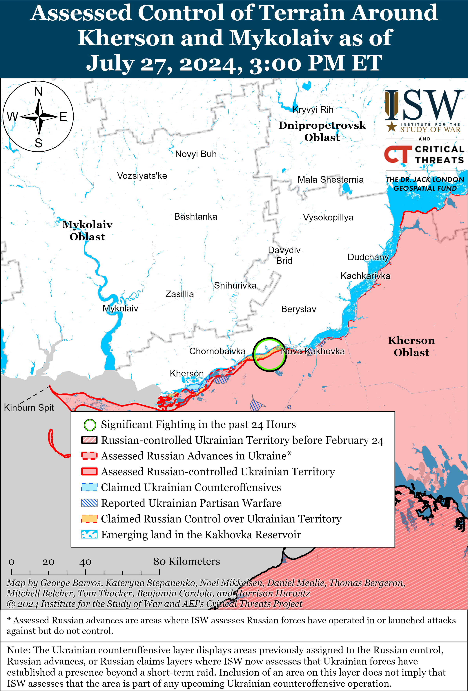

# Russian Offensive Campaign Assessment, July 27, 2024

**Angelica Evans, Christina Harward, Riley Bailey, Nicole Wolkov, and Frederick W. Kagan**

**July 27, 2024, 3:00pm ET**

**Click**[**here**](https://storymaps.arcgis.com/stories/36a7f6a6f5a9448496de641cf64bd375)**to see ISW’s interactive map of the Russian invasion of Ukraine. This map is updated daily alongside the static maps present in this report.**

**Click**[**here**](https://understandingwar.maps.arcgis.com/apps/instant/3dviewer/index.html?appid=1602762dbcde419bb957dea358449580)**to see ISW’s 3D control of terrain topographic map of Ukraine. Use of a computer (not a mobile device) is strongly recommended for using this data-heavy tool.**

**Click**[**here**](https://storymaps.arcgis.com/stories/733fe90805894bfc8562d90b106aa895)**to access ISW’s archive of interactive time-lapse maps of the Russian invasion of Ukraine. These maps complement the static control-of-terrain map that ISW produces daily by showing a dynamic frontline. ISW will update this time-lapse map archive monthly.**

**Note: The data cut-off for this product was 11:30pm ET on July 27. ISW will cover subsequent reports in the July 28 Russian Offensive Campaign Assessment.**

**Ukrainian forces reportedly conducted successful drone strikes against an oil refinery and Russian military airfields in Saratov, Ryazan, and Murmansk oblasts on the night of July 26 to 27.**Sources with Ukrainian special services told Ukrainian mediathat Ukraine’s Main Military Intelligence Directorate (GUR) struck Russian military airfields in Engles, Saratov Oblast; the Dyaghilev Airfield and an oil refinery in Ryazan Oblast; and the Olenya Airfield in Murmansk Oblast with drones.[1] *Suspilne*‘*s* sources reported that Russian forces base an unspecified number of Tu-95, Tu-22, Tu-134, and Il-78 (tanker) aircraft at the Dyaghilev Airfield and that the GUR drones damaged a TU-22M3 strategic bomber at the Olenya Airfield. Russian officials, including the Russian Ministry of Defense (MoD), claimed that Russian air defenses destroyed an unspecified number of drones over Saratov and Ryazan oblasts, although Russian sources published footage of Ukrainian drones operating over Ryazan City.[2] Additional sources told *Suspilne*that GUR “sabotage activities” damaged an Mi-28 and a Ka-226 helicopter at an aircraft construction enterprise in Moscow Oblast on July 21 and destroyed another Mi-8 helicopter at the Kryazh Airfield in Samara Oblast on July 24.[3] Ukrainian Commander-in-Chief Colonel General Oleksandr Syrskyi stated during an interview with UK outlet *The Guardian* published on July 24 that Ukrainian drones had targeted around 200 critical infrastructure sites connected to military logistics in rear areas of Russia since the start of the full-scale invasion.[4]

**Russia continues to deepen bilateral relations with Iran and North Korea in exchange for the provision of lethal aid to the Russian military for use in Ukraine.**Iranian state-affiliated media outlet *Mehr News Agency* reported on July 23 that Iran will launch its “Hod Hod” and “Kosar” satellites into low earth orbit from an unspecified Russian station in October 2024.[5] *Bloomberg*reported on July 25 that South Korea’s Bank of Korea estimated that North Korea’s gross domestic product (GDP) grew 3.1 percent in 2023 compared to 2022 after annual contractions since 2019.[6] The Bank of Korea estimated that North Korea’s heavy and chemical industries, particularly the production of iron, steel, copper, nickel, and aluminum, grew the most in 2023 by 8.1 percent. South Korean Defense Minister Shin Wonsik previously stated that Russia’s provision of food to North Korea in exchange for weapons helped North Korea stabilize prices and likely boosted North Korean domestic manufacturing.[7] North Korea has reportedly transferred as many as 4.8 million artillery shells to Russia, and Iran has supplied Shahed-136/131 drones and components to Russia.[8]

**Key Takeaways:**

- **Ukrainian forces reportedly conducted successful drone strikes against an oil refinery and Russian military airfields in Saratov, Ryazan, and Murmansk oblasts on the night of July 26 to 27.**
- **Russia continues to deepen bilateral relations with Iran and North Korea in exchange for the provision of lethal aid to the Russian military for use in Ukraine.**
- **Ukrainian forces recently regained positions near Toretsk, and Russian forces recently advanced west and southwest of Donetsk City, and Ukrainian forces recently advanced in Vovchansk.**
- **The Russian government continues efforts to use the “Time of Heroes” program to integrate Russian veterans into society.**

[****](https://understandingwar.org/wp-content/uploads/2025/05/DraftUkraineCOTJuly272C2024.png)

***We do not report in detail on Russian war crimes because these activities are well-covered in Western media and do not directly affect the military operations we are assessing and forecasting. We will continue to evaluate and report on the effects of these criminal activities on the Ukrainian military and the Ukrainian population and specifically on combat in Ukrainian urban areas. We utterly condemn Russian violations of the laws of armed conflict and the Geneva Conventions and crimes against humanity even though we do not describe them in these reports.***

- Russian Main Effort – Eastern Ukraine (comprised of three subordinate main efforts)
- Russian Subordinate Main Effort #1 – Push Ukrainian forces back from the international border with Belgorod Oblast and approach to within tube artillery range of Kharkiv City
- Russian Subordinate Main Effort #2 – Capture the remainder of Luhansk Oblast and push westward into eastern Kharkiv Oblast and encircle northern Donetsk Oblast
- Russian Subordinate Main Effort #3 – Capture the entirety of Donetsk Oblast
- Russian Supporting Effort – Southern Axis
- Russian Air, Missile, and Drone Campaign
- Russian Mobilization and Force Generation Efforts
- Russian Technological Adaptations
- Activities in Russian-occupied areas
- Ukrainian Defense Industrial Base Efforts
- Russian Information Operations and Narratives
- Significant Activity in Belarus

**Russian Main Effort – Eastern Ukraine**

**Russian Subordinate Main Effort #1 – Kharkiv Oblast (Russian objective: Push Ukrainian forces back from the international border with Belgorod Oblast and approach to within tube artillery range of Kharkiv City)**

Ukrainian forces recently advanced within Vovchansk (northeast of Kharkiv City) amid continued Russian ground attacks in northern Kharkiv Oblast on July 27. Geolocated footage published on July 26 and 27 indicates that Ukrainian forces recently advanced further along Soborna Street in central Vovchansk and Stepova Street in northeastern Vovchansk.[9] A Russian milblogger claimed that Ukrainian forces counterattacked near Starytsya (northeast of Kharkiv City).[10] Russian forces continued assaults north of Kharkiv City near Hlyboke and Slobozhanske and northeast of Kharkiv City near Vovchansk and Tykhe.[11] The Ukrainian Kharkiv Group of Forces reported that Russian forces transferred several groups from the Sotnytskyi Kozachok area to forward positions, likely in another area of frontline in the Kharkiv direction.[12]

**Russian Subordinate Main Effort #2 – Luhansk Oblast (Russian objective: Capture the remainder of Luhansk Oblast and push westward into eastern Kharkiv Oblast and northern Donetsk Oblast)**

Russian forces continued offensive operations along the Kupyansk-Svatove-Kreminna line on July 27, but there were no changes to the frontline. Russian milbloggers claimed that Russian forces advanced southeast of Kupyansk near Hlushkivka and north of Pishchane and in the forest area west of Kreminna, but ISW has not observed confirmation of these claims.[13] Russian forces continued assaults northeast of Kupyansk near Synkivka; southeast of Kupyansk near Tabaivka, Novoselivske, and Stelmakhivka; southwest of Svatove near Novoyehorivka, Makiivka, Nevske, and Novoserhiivka; west of Kreminna near Terny; and southwest of Kreminna near the Serebryanske forest area.[14]

**Russian Subordinate Main Effort #3 – Donetsk Oblast (Russian objective: Capture the entirety of Donetsk Oblast, the claimed territory of Russia’s proxies in Donbas)**

Russian forces continued offensive operations in the Siversk direction on July 27 but did not make confirmed gains in the area. Russian forces continued offensive operations east of Siversk near Verkhnokamyanske and southeast of Siversk near Spirne and Ivano-Dariivka on July 26 and 27.[15] A Russian milblogger claimed that elements of the Russian 106th Airborne (VDV) Division are consolidating positions on the outskirts of Pereizne (south of Siversk).[16] Elements of the Russian 1st Detachment of the “Wolves” Sabotage and Reconnaissance Brigade are reportedly operating near Soledar (south of Siversk), and elements of the 2nd Artillery Brigade (2nd Luhansk People’s Republic Army Corps [LNR AC]) are reportedly continuing to operate in the Siversk direction.[17]

Russian forces continued offensive operations near Chasiv Yar on July 27, but there were no confirmed changes to the frontline. Russian milbloggers claimed that Russian forces continue to advance west of Kalynivka (north of Chasiv Yar), although ISW has yet to observe confirmation of Russian forces operating west of the Siverskyi-Donets Donbas Canal within the settlement or the nearby area.[18] Russian forces continued offensive operations near Chasiv Yar, north of Chasiv Yar near Hryhorivka, and southeast of Chasiv Yar near Andriivka on July 26 and 27.[19]

Ukrainian forces recently regained lost positions near Toretsk amid continued Russian offensive operations in the area on July 27. Geolocated footage published on July 27 indicates that Ukrainian forces recently regained lost positions in northern Pivdenne (southeast of Toretsk).[20] Russian milbloggers claimed that Russian forces advanced further within central Zalizne (southeast of Toretsk) and in Pivnichne (east of Toretsk), but ISW has not observed confirmation of these claims.[21] Russian forces continued offensive operations near Toretsk, Pivnichne, Zalizne, and south of Toretsk near Niu York on July 26 and 27.[22]

Russian forces reportedly advanced northwest of Avdiivka on July 27, but there were no confirmed changes to the frontline in the area. The Russian MoD claimed that elements of the Russian Central Grouping of Forces seized Lozuvatske (northwest of Avdiivka), consistent with ISW’s assessment of Russian advances in the area.[23] Russian milbloggers claimed that Russian forces advanced to the eastern outskirts of Vesele (northwest of Avdiivka), entered the settlement, and seized up to roughly a third of Vesele, although ISW has not observed confirmation of these claims.[24] Russian milbloggers claimed that Russian forces northwest of Avdiivka also advanced near Vovche and Prohres and in the direction of Ivanivka.[25] Russian forces continued offensive operations north of Avdiivka near Kalynove; northwest of Avdiivka near Vozdvyzhenka, Novooleksandrivka, Vesele, Serhiivka, Tymofiivka, Novoselivka Persha, Vovche, Zhelanne, Mezhove, and Lysychne; west of Avdiivka near Yasnobrodivka; and southwest of Avdiivka near Karlivka and Netaylove on July 26 and 27.[26] Elements of the 41st Combined Arms Army [CAA] (Central Military District [CMD]) are reportedly operating within Lozuvatske.[27]

Russian forces recently advanced west and southwest of Donetsk City amid continued offensive operations in the area on July 27. Geolocated footage published on July 26 showing Russian forces raising a Russian flag in northern Krasnohorivka (west of Donetsk City) indicates that Russian forces recently advanced in the settlement, and Russian milbloggers claimed that Russian forces also advanced in western Krasnohorivka.[28] Geolocated published on July 27 indicates that Russian forces advanced further south of Kostyantynivka (southwest of Donetsk City) during the roughly reinforced battalion-size mechanized assault that Russian forces conducted in the area on July 24.[29] Russian forces continued offensive operations west of Donetsk City near Heorhiivka and Krasnohorivka and southwest of Donetsk City near Kostyantynivka, Paraskoviivka, and Vodyane on July 26 and 27.[30] Elements of the Russian 242nd Motorized Rifle Regiment (20th Separate Guards Motorized Rifle Division, 8th CAA, Southern Military District [SMD]) are reportedly operating near Kostyantynivka, and elements of the Russian 5th and 110th motorized rifle brigades (1st Donetsk People’s Republic [DNR] AC) are reportedly operating within Krasnohorivka.[31]

Positional fighting continued south of Velyka Novosilka, including near Urozhaine, in the Donetsk-Zaporizhia Oblast border area on July 26 and 27.[32] Elements of the Russian 40th Naval Infantry Brigade (Pacific Fleet) are reportedly operating in the south Donetsk direction and elements of the Russian 5th Tank Brigade (36th Combined Arms Army [CAA], Eastern Military District [EMD]) are reportedly operating in the Vremivka direction.[33]

**Russian Supporting Effort – Southern Axis (Russian objective: Maintain frontline positions and secure rear areas against Ukrainian strikes)**

Fighting continued in western Zaporizhia Oblast on July 27 but there were no confirmed changes to the frontline. Fighting continued near Robotyne, east of Robotyne near Verbove, northeast of Robotyne near Mala Tokmachka, and northwest of Robotyne near Novoandriivka on July 26 and 27.[34] Ukrainian Tavriisk Group of Forces Spokesperson Captain Dmytro Lykhovyi stated on July 26 that Russian forces are conducting small infantry-led assaults on Ukrainian positions near Mala Tokmachka.[35] Lykhovyi also reiterated that Ukrainian forces have not observed Russian forces transferring reserves to Zaporizhia Oblast or concentrating forces for an offensive operation in the Zaporizhia direction. Elements of the Russian 64th Motorized Rifle Brigade (35th Combined Arms Army [CAA], Eastern Military District [EMD]) and “Valkyria” detachment (4th Military Base, 58th Combined Arms Army [CAA], Southern Military District [SMD]) drone operators are reportedly operating in the Zaporizhia direction.[36]

The Ukrainian General Staff reported on July 27 that Russian forces conducted one unsuccessful assault in an unspecified area in the Dnipro direction (Kherson Oblast).[37] A Russian milblogger claimed that the Russian military is struggling to supply newly created units operating in the Kherson direction with first-person view (FPV) drones and thermal imagers.[38] Elements of the Russian 25th Spetsnaz Regiment (Russian General Staff Main Directorate [GRU]) reportedly continue operating in the Kherson direction.[39]

**Russian Air, Missile, and Drone Campaign (Russian Objective: Target Ukrainian military and civilian infrastructure in the rear and on the frontline)**

Russian forces launched limited missile and drone strikes against Ukraine on the night of July 26 to 27. Ukrainian Air Force Commander Lieutenant General Mykola Oleshchuk reported that Russian forces launched a Kh-59/69 cruise missile from occupied Zaporizhia Oblast and four Shahed-136/131 drones from Primorsko-Akhtarsk, Krasnodar Krai and that Ukrainian forces shot down the missile and drones over Dnipropetrovsk, Poltava, Kharkiv, and Kyiv oblasts.[40] Poltava Oblast Military Administration Head Filip Pronin stated that a Russian drone damaged an industrial facility in Poltava Oblast.[41]

Ukraine’s Main Military Intelligence Directorate (GUR) Spokesperson Andriy Chernyak told *Reuters* in a July 26 article that Russian forces have launched cheap drones made of Styrofoam and plywood in the last two-to-three weeks as a part of five long-range strike series.[42] Chernyak stated that two of these cheap Russian drones had cameras and SIM cards that transmitted data to Russian forces. Chernyak reported that Russian forces are attempting to locate Ukrainian mobile fire groups and air defense systems with these new drones.

**Russian Mobilization and Force Generation Efforts (Russian objective: Expand combat power without conducting general mobilization)**

The Russian government continues efforts to use the “Time of Heroes” program to integrate Russian veterans into society. Kursk Oblast Acting Governor Alexei Smirnov nominated Russian servicemember Colonel Alexei Kondratyev to run for Kursk Oblast senator in the Russian Federation Council.[43] Kondratyev is the commander of the “St. Prince Vladimir” Brigade (Russian Volunteer Corps) and a participant in the “Time of Heroes” program. The Kremlin is reportedly concerned about the long-term social and political implications of Russian veterans returning from the war in Ukraine and trying to use the “Time of Heroes” program to provide a “buffer” between civilians and returning servicemembers.[44]

Ukrainian outlet *Suspilne*reported on July 27 that it viewed an internal Russian Investigative Committee resolution that found that commanders and deputy commanders of the Russian 6th Motorized Rifle Division (3rd Army Corps, Moscow Military District [MMD]) ordered Russian servicemembers to imprison, torture, and kill other servicemembers in Ukraine in 2023.[45] *Suspilne*reported that representatives of the Russian MoD inspected the division, after which the division’s commanders and deputy commanders continued and tried to conceal these practices.

**Russian Technological Adaptations (Russian objective: Introduce technological innovations to optimize systems for use in Ukraine)**

Nothing significant to report.

**Ukrainian Defense Industrial Efforts (Ukrainian objective: Develop its defense industrial base to become more self-sufficient in cooperation with US, European, and international partners)**

*ISW is not publishing coverage of Ukrainian defense industrial efforts today.*

**Activities in Russian-occupied areas (Russian objective: Consolidate administrative control of annexed areas; forcibly integrate Ukrainian citizens into Russian sociocultural, economic, military, and governance systems)**

*ISW is not publishing coverage of Russian-occupied areas of Ukraine today.*

**Russian Information Operations and Narratives**

Nothing significant to report.

**Significant activity in Belarus (Russian efforts to increase its military presence in Belarus and further integrate Belarus into Russian-favorable frameworks and Wagner Group activity in Belarus)**

Nothing significant to report.

**Note: ISW does not receive any classified material from any source, uses only publicly available information, and draws extensively on Russian, Ukrainian, and Western reporting and social media as well as commercially available satellite imagery and other geospatial data as the basis for these reports. References to all sources used are provided in the endnotes of each update.**

****

---

[1] https://suspiln dot media/800159-droni-gur-atakuvali-npz-vijskovi-aerodromi-rf-i-poskodili-nadzvukovij-bombarduvalnik-dzerela/ ; https://armyinform.com dot ua/2024/07/27/chorni-dni-rosijskoyi-aviacziyi-detali-atak-na-obyekty-v-tylu-rf/

[2] https://t.me/mod\_russia/41433 ; https://t.me/mod\_russia/41436 ;https://t.me/mod\_russia/41434 ; https://t.me/mod\_russia/41436 ; https://t.me/tass\_agency/262783 ; https://t.me/pavelmalkov\_official/3137 ; https://t.me/breakingmash/56167 ; https://x.com/GirkinGirkin/status/1817089065742725188 ; https://x.com/99Dominik\_/status/1817107072372068378

[3] https://suspilne dot media/800219-gur-urazilo-tri-vertoloti-na-teritorii-rosii-dzerela/ ; https://gur dot gov.ua/content/odyn-u-samari-dva-pid-moskvoiu-na-rosii-zghorilo-try-helikoptery.html

[4] https://www.theguardian.com/world/article/2024/jul/24/i-know-we-will-win-and-how-ukraines-top-general-on-turning-the-tables-against-russia

[5] https://en.mehrnews dot com/news/218238/Iran-s-Hod-Hod-Kosar-satellites-to-be-launched-into-LEO

[6] https://www.bloomberg.com/news/articles/2024-07-26/north-korea-s-economy-rebounds-as-kim-putin-ties-fuel-arms-trade

[7] https://www.bloomberg.com/news/articles/2024-06-30/north-korea-fires-missile-in-show-of-force-after-putin-visit; https://www.bloomberg.com/news/articles/2024-07-26/north-korea-s-economy-rebounds-as-kim-putin-ties-fuel-arms-trade

[8] https://isw.pub/UkrWar062324; https://isw.pub/UkrWar080123 ; https://isw.pub/UkrWar081723; https://isw.pub/UkrWar110623

[9] https://t.me/URUKHAIFPV/63 ; https://x.com/Bielitzling/status/1816930805509488678 ; https://x.com/foosint/status/1817242724736618846 ; https://t.me/ZA\_FROHT/31534

[10] https://t.me/dva\_majors/48211

[11] https://www.facebook.com/GeneralStaff.ua/posts/pfbid0yvPBjBNjzEHLeveEJiQXQiWPULkPvezUverU7SFidSnC4oHEghZTBsx9YxdcwwLnl ; https://www.facebook.com/GeneralStaff.ua/posts/pfbid02ArnUSUdYtS7rcNg919yGjAGDfSDPxSa911puUVnjGtzpbxFAQjQdrfdhwpfLGa6zl ; https://www.facebook.com/GeneralStaff.ua/posts/pfbid0umnyQhhEnth1kpoUyAn9ieqTG1UB6fCYRq3yKyWihop5piP5dtSD99LY659L3Atql ; https://t.me/otukharkiv/399 ; https://t.me/dva\_majors/48211

[12] https://t.me/otukharkiv/399

[13] https://t.me/motopatriot/25469 ; https://t.me/DnevnikDesantnika/13113 ; https://t.me/RVvoenkor/73344

[14] https://www.facebook.com/GeneralStaff.ua/posts/pfbid0yvPBjBNjzEHLeveEJiQXQiWPULkPvezUverU7SFidSnC4oHEghZTBsx9YxdcwwLnl  ; https://www.facebook.com/GeneralStaff.ua/posts/pfbid02ArnUSUdYtS7rcNg919yGjAGDfSDPxSa911puUVnjGtzpbxFAQjQdrfdhwpfLGa6zl; https://www.facebook.com/GeneralStaff.ua/posts/pfbid0umnyQhhEnth1kpoUyAn9ieqTG1UB6fCYRq3yKyWihop5piP5dtSD99LY659L3Atql ; https://t.me/DnevnikDesantnika/13113 ;

[15] https://www.facebook.com/GeneralStaff.ua/posts/pfbid0yvPBjBNjzEHLeveEJiQXQiWPULkPvezUverU7SFidSnC4oHEghZTBsx9YxdcwwLnl ; https://www.facebook.com/GeneralStaff.ua/posts/pfbid02ArnUSUdYtS7rcNg919yGjAGDfSDPxSa911puUVnjGtzpbxFAQjQdrfdhwpfLGa6zl ;   https://www.facebook.com/GeneralStaff.ua/posts/pfbid0umnyQhhEnth1kpoUyAn9ieqTG1UB6fCYRq3yKyWihop5piP5dtSD99LY659L3Atql

[16] https://t.me/rusich\_army/16067

[17] https://t.me/sons\_fatherland/15835 ; https://t.me/philologist\_zov/1159

[18] https://t.me/dva\_majors/48211 ; https://t.me/wargonzo/21227

[19] https://www.facebook.com/GeneralStaff.ua/posts/pfbid0yvPBjBNjzEHLeveEJiQXQiWPULkPvezUverU7SFidSnC4oHEghZTBsx9YxdcwwLnl ; https://www.facebook.com/GeneralStaff.ua/posts/pfbid02ArnUSUdYtS7rcNg919yGjAGDfSDPxSa911puUVnjGtzpbxFAQjQdrfdhwpfLGa6zl ;   https://www.facebook.com/GeneralStaff.ua/posts/pfbid0umnyQhhEnth1kpoUyAn9ieqTG1UB6fCYRq3yKyWihop5piP5dtSD99LY659L3Atql

[20] https://t.me/operativnoZSU/152618; https://x.com/moklasen/status/1817240782958403609

[21] https://t.me/DnevnikDesantnika/13132 ; https://t.me/dva\_majors/48211

[22] https://www.facebook.com/GeneralStaff.ua/posts/pfbid0yvPBjBNjzEHLeveEJiQXQiWPULkPvezUverU7SFidSnC4oHEghZTBsx9YxdcwwLnl ; https://www.facebook.com/GeneralStaff.ua/posts/pfbid02ArnUSUdYtS7rcNg919yGjAGDfSDPxSa911puUVnjGtzpbxFAQjQdrfdhwpfLGa6zl ; https://www.facebook.com/GeneralStaff.ua/posts/pfbid0umnyQhhEnth1kpoUyAn9ieqTG1UB6fCYRq3yKyWihop5piP5dtSD99LY659L3Atql

[23] https://t.me/mod\_russia/41442

[24] https://t.me/motopatriot/25462; https://t.me/z\_arhiv/27405; https://t.me/NgP\_raZVedka/18485

[25] https://t.me/z\_arhiv/27405 ; https://t.me/DnevnikDesantnika/13113 ; https://t.me/DnevnikDesantnika/13133 ; https://t.me/RVvoenkor/73326

[26] https://www.facebook.com/GeneralStaff.ua/posts/pfbid0yvPBjBNjzEHLeveEJiQXQiWPULkPvezUverU7SFidSnC4oHEghZTBsx9YxdcwwLnl ; https://www.facebook.com/GeneralStaff.ua/posts/pfbid02ArnUSUdYtS7rcNg919yGjAGDfSDPxSa911puUVnjGtzpbxFAQjQdrfdhwpfLGa6zl ;   https://www.facebook.com/GeneralStaff.ua/posts/pfbid0umnyQhhEnth1kpoUyAn9ieqTG1UB6fCYRq3yKyWihop5piP5dtSD99LY659L3Atql ; https://t.me/dva\_majors/48211 ; https://t.me/wargonzo/21227 ; https://t.me/RVvoenkor/73326 ; https://t.me/DnevnikDesantnika/13138

[27] https://t.me/RVvoenkor/73363

[28] https://t.me/creamy\_caprice/6173; https://t.me/filatovcorr/3622 ; https://x.com/Bielitzling/status/1817171227976343884; https://t.me/z\_arhiv/27409; https://t.me/motopatriot/25458; https://t.me/z\_arhiv/27407

[29] https://x.com/Ukraine\_Twi/status/1817165586297757910; https://x.com/klinger66/status/1817179436954914849; https://t.me/opforukraine/18; https://t.me/opforukraine/18

[30] https://www.facebook.com/GeneralStaff.ua/posts/pfbid0yvPBjBNjzEHLeveEJiQXQiWPULkPvezUverU7SFidSnC4oHEghZTBsx9YxdcwwLnl ; https://www.facebook.com/GeneralStaff.ua/posts/pfbid02ArnUSUdYtS7rcNg919yGjAGDfSDPxSa911puUVnjGtzpbxFAQjQdrfdhwpfLGa6zl ;   https://www.facebook.com/GeneralStaff.ua/posts/pfbid0umnyQhhEnth1kpoUyAn9ieqTG1UB6fCYRq3yKyWihop5piP5dtSD99LY659L3Atql ; https://t.me/dva\_majors/48211 ; https://t.me/DnevnikDesantnika/13113 ; https://t.me/motopatriot/25458 ;

[31] https://t.me/RVvoenkor/73353 ; https://t.me/RVvoenkor/73325

[32] https://www.facebook.com/GeneralStaff.ua/posts/pfbid0umnyQhhEnth1kpoUyAn9ieqTG1UB6fCYRq3yKyWihop5piP5dtSD99LY659L3Atql ; https://www.facebook.com/GeneralStaff.ua/posts/pfbid02ArnUSUdYtS7rcNg919yGjAGDfSDPxSa911puUVnjGtzpbxFAQjQdrfdhwpfLGa6zl

[33] https://t.me/milinfolive/126894 (south Donetsk); https://t.me/voin\_dv/9959 (Vremivka)

[34] https://www.facebook.com/GeneralStaff.ua/posts/pfbid0yvPBjBNjzEHLeveEJiQXQiWPULkPvezUverU7SFidSnC4oHEghZTBsx9YxdcwwLnl ; https://www.facebook.com/GeneralStaff.ua/posts/pfbid0umnyQhhEnth1kpoUyAn9ieqTG1UB6fCYRq3yKyWihop5piP5dtSD99LY659L3Atql ; https://www.facebook.com/GeneralStaff.ua/posts/pfbid0umnyQhhEnth1kpoUyAn9ieqTG1UB6fCYRq3yKyWihop5piP5dtSD99LY659L3Atql ; https://t.me/wargonzo/21227 ; https://t.me/DnevnikDesantnika/13136

[35] https://armyinform.com dot ua/2024/07/26/v-sylah-oborony-rozpovily-pro-taktyku-malyh-ukusiv-rf-na-pivdni/

[36] https://t.me/voin\_dv/9957 ; https://t.me/RVvoenkor/73371

[37] https://www.facebook.com/GeneralStaff.ua/posts/pfbid0yvPBjBNjzEHLeveEJiQXQiWPULkPvezUverU7SFidSnC4oHEghZTBsx9YxdcwwLnl

[38] https://t.me/dva\_majors/48211

[39] https://t.me/dva\_majors/48206

[40] https://t.me/ComAFUA/358

[41] https://t.me/poltavskaOVA/16340

[42] https://www.reuters.com/world/europe/russia-deploys-cheap-drones-locate-ukraines-air-defences-2024-07-26/

[43] https://t.me/rusich\_army/16057 ; https://kpravda dot ru/2024/07/24/senatorom-ot-kurskoj-oblasti-mozhet-stat-byvshij-specznazovecz/ ; https://riakursk dot ru/stali-izvestny-imena-vozmozhnykh-senatorov-ot-kurskoy-oblasti/

[44] https://isw.pub/UkrWar071924

[45] https://suspilne dot media/800213-to-blow-shoot-burn-russians-kill-fellow-servicemen-front-ukraine/
