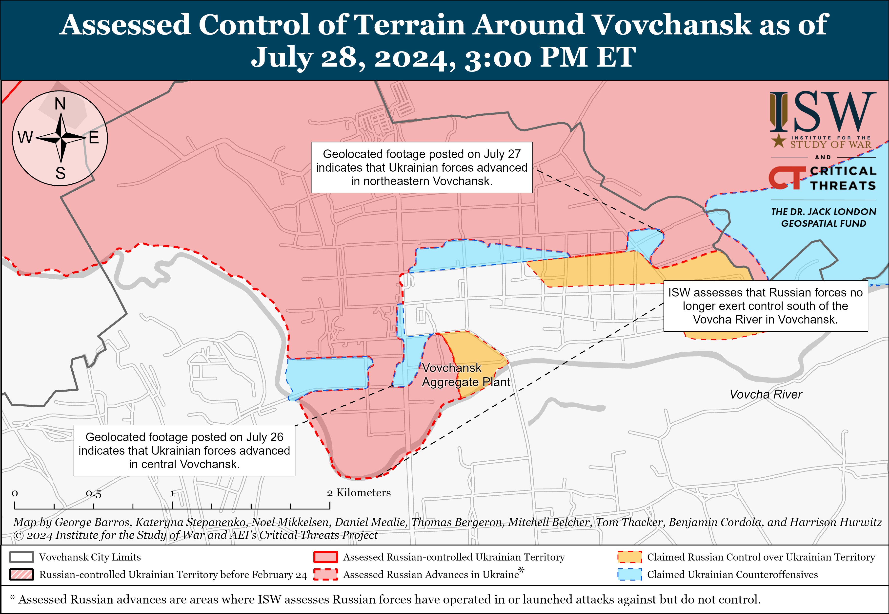
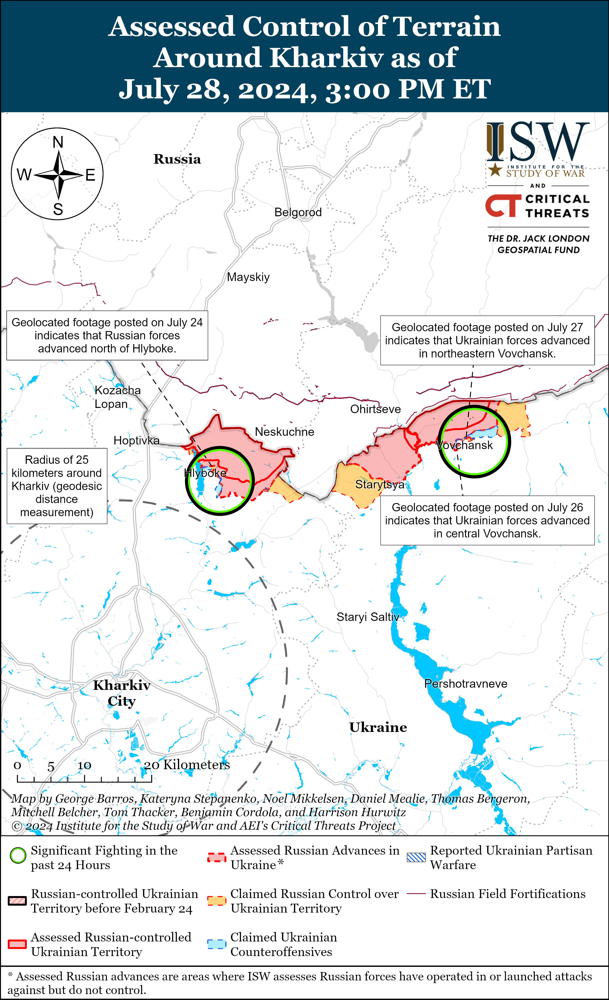
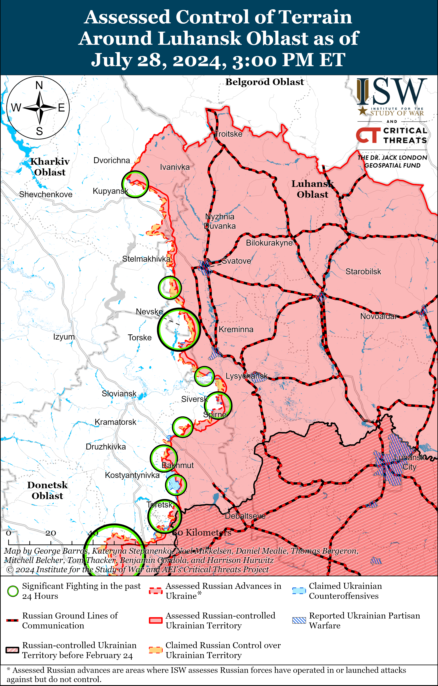
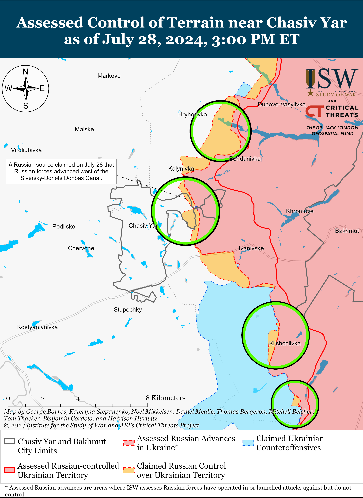
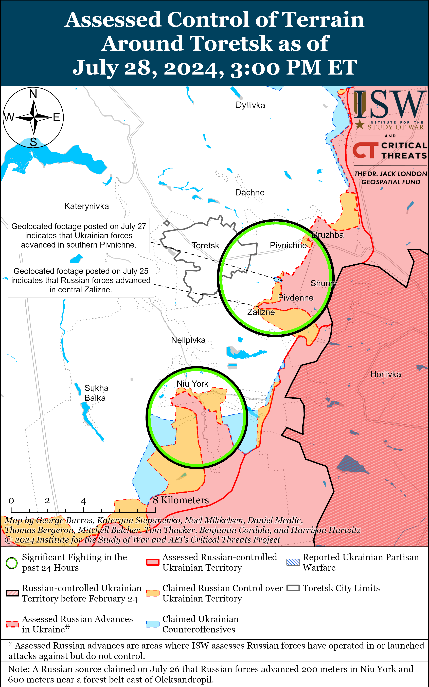
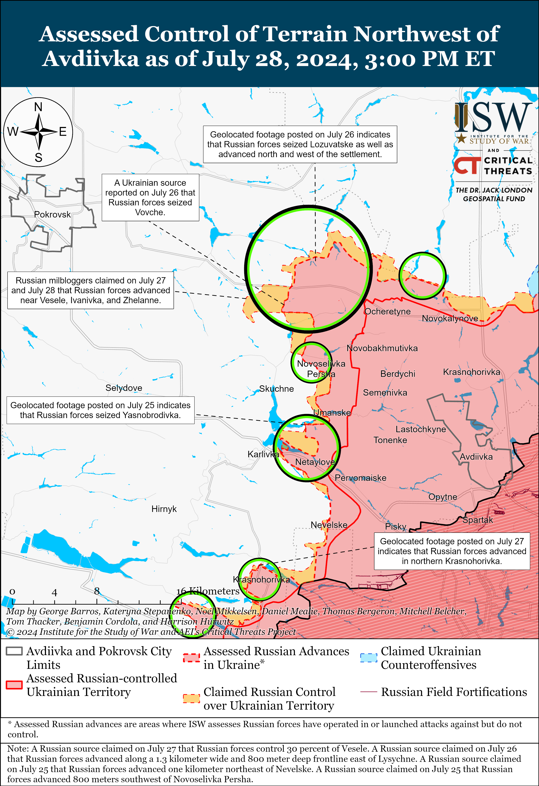
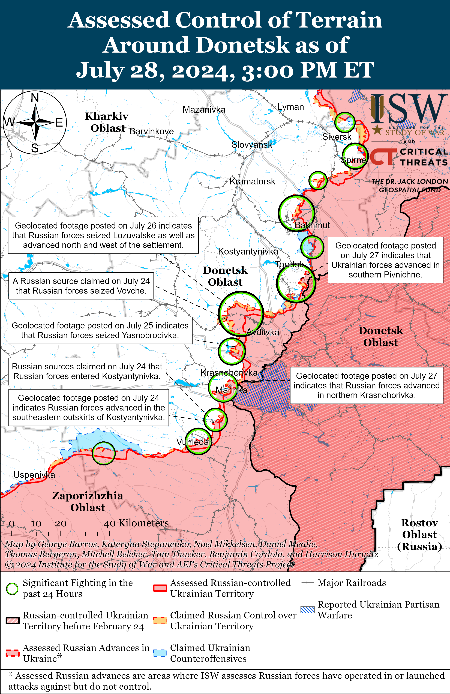
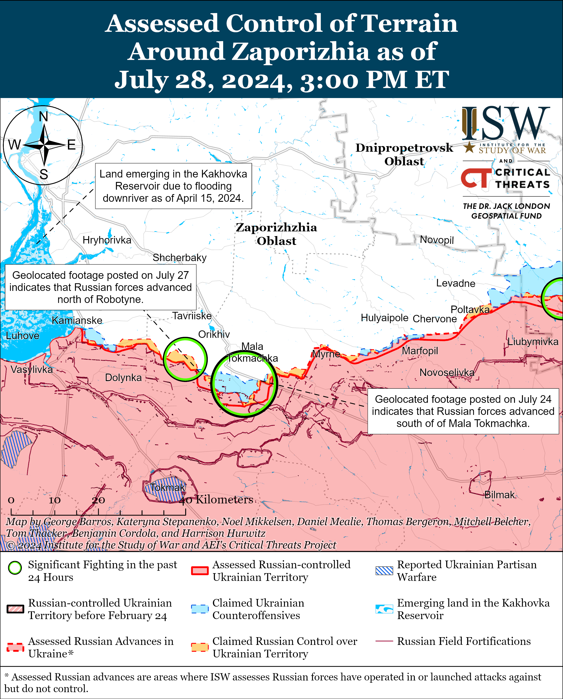
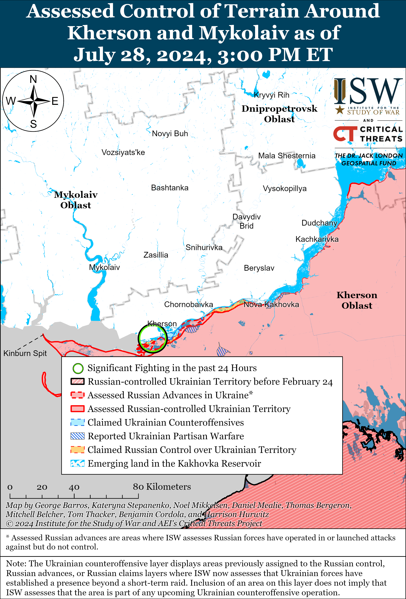

# Russian Offensive Campaign Assessment, July 28, 2024

**Christina Harward, Nicole Wolkov, Kateryna Stepanenko, Riley Bailey, and Frederick W. Kagan**

**July 28, 2024, 6:15pm ET**

**Click**[**here**](https://storymaps.arcgis.com/stories/36a7f6a6f5a9448496de641cf64bd375)**to see ISW’s interactive map of the Russian invasion of Ukraine. This map is updated daily alongside the static maps present in this report.**

**Click**[**here**](https://understandingwar.maps.arcgis.com/apps/instant/3dviewer/index.html?appid=1602762dbcde419bb957dea358449580)**to see ISW’s 3D control of terrain topographic map of Ukraine. Use of a computer (not a mobile device) is strongly recommended for using this data-heavy tool.**

**Click**[**here**](https://storymaps.arcgis.com/stories/733fe90805894bfc8562d90b106aa895)**to access ISW’s archive of interactive time-lapse maps of the Russian invasion of Ukraine. These maps complement the static control-of-terrain map that ISW produces daily by showing a dynamic frontline. ISW will update this time-lapse map archive monthly.**

**Note: The data cut-off for this product was 12:15pm ET on July 28. ISW will cover subsequent reports in the July 29 Russian Offensive Campaign Assessment.**

**Russian President Vladimir Putin continues to use nuclear saber-rattling to target Western decision-making and promote Western self-deterrence.**Putin spoke at the Main Naval Parade in St. Petersburg on July 28 and claimed that if the US deploys long-range missile systems in Germany in 2026, the flight time to Russian industrial and defense targets will be about 10 minutes.[1] Putin also commented on US deployments of Typhon Mid-Range Capability (MRC) missile systems to Denmark and the Philippines for joint exercises. Putin threatened that if the US implements plans to deploy missile systems to these countries, Russia will no longer be bound by the Intermediate-Range Nuclear Forces (INF) Treaty and will take “mirror measures” to deploy unspecified systems that are currently in the final stages of development to unspecified locations. Putin claimed that Russian strategic missile carriers stopped conducting air patrols after the end of the Cold War but resumed these flights in 2007 in response to increased US strategic and reconnaissance aviation activity in areas of the world that are “sensitive to Russia” and in order to “ensure security in the Asia-Pacific region.” The US and Germany announced in June 2024 that the US will begin “episodic deployments” of long-range fire capabilities, including Standard Missile 6 (SM-6) and Tomahawk Land Attack Missiles, in Germany starting in 2026 in order to demonstrate US commitment to NATO.[2] The US Army Pacific stated in April 2024 that it deployed the MRC missile system that can fire SM-6 and Tomahawk missiles to the Philippines as part of exercises, and the US Navy announced in May 2024 that it conducted containerized missile launcher rehearsals with the Danish military on Bornholm Island, Denmark.[3] The current location of the MRC systems is unclear, but the US has not announced that it is deploying the systems to Denmark and the Philippines for purposes beyond the previous exercises. Putin officially suspended Russia’s participation in the INF Treaty that banned ground-launched ballistic and cruise missiles with ranges of 500 to 5,500 kilometers, in March 2019, but Russia has already permanently deployed nuclear capable Iskander-M ballistic missiles, with a reported range of up to 500 kilometers, in Kaliningrad Oblast since 2018.[4] Putin is falsely trying to present the Russian deployment of missiles previously banned under the INF Treaty as an inflection, likely as part of his repeated efforts to use nuclear saber-rattling to push the West to self-deter.[5]

**Russia used Navy Day celebrations to showcase Russia’s relations with a number of non-Western states as part of efforts to create a supposed Russian-led group of states to rally against the West.**Ships from the Chinese, Algerian, and Indian navies participated in the Main Naval Parade in St. Petersburg, and representatives from 31 states, including Azerbaijan, Venezuela, Vietnam, Cuba, Libya, Myanmar, Syria, Qatar, the United Arab Emirates, and South Africa, took part in events in St. Petersburg; the Russian naval base in Tartus, Syria; and the Baltic, Caspian, and North seas.[6] Russian Deputy Defense Minister Alexander Fomin met with Commander of the PLA Navy Hu Zhongming and discussed cooperation between Russia and the People’s Republic of China (PRC) in the naval sphere.[7] Fomin also met with Myanmar’s Navy Commander Win Htein to discuss further naval cooperation between Myanmar and Russia.[8] Russian Foreign Minister Sergei Lavrov also met with Malaysian Foreign Minister Mohamad Hasan in Kuala Lampur on July 28 and agreed to increase Russian–Malaysian diplomatic contacts.[9] Russia has recently increased its cooperation with a number of these states, including Venezuela, Cuba, India, and Vietnam.[10]

**Ukrainian forces conducted a drone strike against a Russian oil depot in Polevaya, Kursk Oblast on the night of July 27 to 28.**The Ukrainian General Staff reported that Ukraine’s Security Service (SBU) and other Ukrainian forces struck Polevaya oil depot, causing an explosion and fire.[11] The Ukrainian General Staff reported that the Polevaya oil depot consists of 11 tanks with a total volume of 7,000 cubic meters and supplied oil to the Russian military. The Ukrainian General Staff stated that an explosion also occurred at an electrical substation in Kursk Oblast but that it is still clarifying details about the damage to the oil depot and substation. Kursk Oblast Governor Alexei Smirnov claimed that Ukrainian drones struck the oil depot causing three fuel tanks to catch fire.[12] Footage published on July 28 purportedly shows a fire at the Polevaya oil depot.[13] The Russian Ministry of Defense (MoD) claimed that Russian forces downed two Ukrainian drones over Kursk Oblast.[14]

**A rebel coalition in Mali reportedly killed and wounded dozens of Russian servicemen and Wagner Group mercenaries as well as a prominent Wagner-affiliated milblogger on the Mali-Algeria border on July 27.[15]**The Permanent Strategic Framework for Peace, Security and Development (CSP-PSD) rebel movement claimed that it “routed the entire column of Malian army and Russian mercenaries,” and the Critical Threats Project’s (CTP) Africa File will cover the situation in northern Mali in its upcoming update.[16] Social media footage reportedly showed numerous killed Wagner and Malian personnel — including the body of the administrator of the “Grey Zone” Telegram channel Nikita Fedyanin, who routinely covered Russia’s full-scale invasion of Ukraine and harshly criticized the Russian Ministry of Defense (MoD).[17] Sources within Fedyanin’s close circle confirmed Fedyanin’s death to Russian state newswire *TASS*on July 28.[18] A Russian insider source claimed that Wagner losses amounted to 33 killed and 18 wounded, and various Russian sources claimed that CSP-PSD captured several prisoners — with some speculating that Wagner commander Anton Yelizarov (known under the alias “Lotos”) was captured.[19] Russian sources claimed that the Russian MoD’s Africa Corps successfully mediated a prisoner exchange with CSP-PSD.[20] One Russian milblogger claimed that the Russian MoD paid ransoms for every captured Wagner mercenary except for Yelizarov, and several other milbloggers claimed that Yelizarov died in the ambush.[21] ISW cannot independently verify whether Yelizarov is captured or dead. ISW previously reported that Yelizarov overestimated his ability to convince former Wagner personnel to join Rosgvardia during his efforts to maintain a Wagner contingent and avoid joining the Russian MoD.[22]

**Primorsky Krai Governor Oleg Kozhemyako recently announced the creation of an independent volunteer unit to police migrants as the Russian government continues efforts to expand its control over migrants in Russia.**Kozhemyako announced on July 25 the formation of the “Tiger-Law and Order Squad,” consisting of 300 veterans of the Russian war in Ukraine, that will “ensure public safety” and “put [newcomers] in their place” in Vladivostok.[23] Kozhemyako stated that the Tiger-Law and Order Squad will coordinate with Rosgvardia and the Ministry of Internal Affairs (MVD) and intends to expand patrols to other cities in Primorsky Krai after the squad recruits more personnel. Kuzhemyako claimed that the Tiger-Law and Order Squad will eventually be equipped with a patrol bus and a vehicle equipped with both communications and a drone-aerial surveillance system. ISW has previously observed local Russian officials enacting harsher measures against migrants as Russian government officials attempt to enact more restrictive policies at a national level.[24] The formation of a squad dedicated to policing migrants indicates that at least some local Russian government officials have likely caved to Russian ultranationalist demands to heavily restrict migrant activity in Russia despite Russian government efforts to utilize migrants to offset domestic labor shortages. The decision to use veterans of the war in Ukraine to staff these anti-migrant law enforcement units may be part of an effort to capitalize on the combat skillset and nationalist ideology of Russian veterans to integrate them into Russian society, especially as the Kremlin is reportedly concerned about the long-term social and political implications of Russian veterans returning from the war in Ukraine.[25]

**Key Takeaways:**

- **Russian President Vladimir Putin continues to use nuclear saber-rattling to target Western decision-making and promote Western self-deterrence.**
- **Russia used Navy Day celebrations to showcase Russia’s relations with a number of non-Western states as part of efforts to create a supposed Russian-led group of states to rally against the West.**
- **Ukrainian forces conducted a drone strike against a Russian oil depot in Polevaya, Kursk Oblast on the night of July 27 to 28.**
- **A rebel coalition in Mali reportedly killed and wounded dozens of Russian servicemen and Wagner Group mercenaries as well as a prominent Wagner-affiliated milblogger on the Mali-Algeria border on July 27.**
- **Primorsky Krai Governor Oleg Kozhemyako recently announced the creation of an independent volunteer unit to police migrants as the Russian government continues efforts to expand its control over migrants in Russia.**
- **Russian forces recently advanced northwest of Avdiivka, west of Donetsk City, and in western Zaporizhia Oblast, and Ukrainian forces recently regained lost positions in the Siversk direction.**
- **Ukrainian military observer Kostyantyn Mashovets assessed that the Russian military may need to accumulate up to 320,000 additional personnel in Ukraine in order to achieve its reported plans to deploy 690,000 troops in Ukraine.**

****

***We do not report in detail on Russian war crimes because these activities are well-covered in Western media and do not directly affect the military operations we are assessing and forecasting. We will continue to evaluate and report on the effects of these criminal activities on the Ukrainian military and the Ukrainian population and specifically on combat in Ukrainian urban areas. We utterly condemn Russian violations of the laws of armed conflict and the Geneva Conventions and crimes against humanity even though we do not describe them in these reports.***

- Russian Main Effort – Eastern Ukraine (comprised of three subordinate main efforts)
- Russian Subordinate Main Effort #1 – Push Ukrainian forces back from the international border with Belgorod Oblast and approach to within tube artillery range of Kharkiv City
- Russian Subordinate Main Effort #2 – Capture the remainder of Luhansk Oblast and push westward into eastern Kharkiv Oblast and encircle northern Donetsk Oblast
- Russian Subordinate Main Effort #3 – Capture the entirety of Donetsk Oblast
- Russian Supporting Effort – Southern Axis
- Russian Air, Missile, and Drone Campaign
- Russian Mobilization and Force Generation Efforts
- Russian Technological Adaptations
- Activities in Russian-occupied areas
- Ukrainian Defense Industrial Base Efforts
- Russian Information Operations and Narratives
- Significant Activity in Belarus

**Russian Main Effort – Eastern Ukraine**

**Russian Subordinate Main Effort #1 – Kharkiv Oblast****(Russian objective: Push Ukrainian forces back from the international border with Belgorod Oblast and approach to within tube artillery range of Kharkiv City)**

Ukrainian State Border Service Spokesperson Andriy Demchenko stated on July 28 that Russian reconnaissance and sabotage activity along the border in Sumy Oblast has decreased but has not stopped.[26]

Russian forces likely no longer retain positions on the south (left) bank of the Vovcha River within Vovchansk (northeast of Kharkiv City) amid continued fighting north and northeast of Kharkiv City on July 28. Russian and Ukrainian sources have stopped reporting on Russian offensive activities on the southern side of the Vovcha River within Vovchansk since ISW observed Russian forces operating in the area on July 10.[27] Several Russian sources claimed that Russian forces no longer maintain position on the south bank of the Vovcha River and Ukrainian positions in central Vovchansk suggest that Russian positions on the north (right) bank of the Vovcha River are likely not secure enough to support enduring positions across the river.[28] A Russian milblogger claimed that Russian forces only control the western part of the Aggregate Plant within central Vovchansk.[29] Russian forces continued offensive operations north of Kharkiv City near Hlyboke and northeast of Kharkiv City near Vovchansk, Tykhe, and Starytsya on July 27 and 28.[30] Russian sources claimed that Ukrainian forces counterattacked within Vovchansk and near Hlyboke.[31] Ukrainian Kharkiv Group of Forces Spokesperson Colonel Vitaly Sarantsev stated that Russian forces are suffering from significant losses and are exhausting their limited reserves.[32] Sarantsev also stated that Russian forces are using different tactics in the Kharkiv direction, sometimes attacking in small group with artillery support and attacking in larger groups at other times. Sarantsev reported that Russian forces in the Kharkiv direction are almost exclusively transporting personnel and ammunition and conducting artillery fire from within Russian territory and not within northern Kharkiv Oblast due to Ukrainian strikes.[33]

[****](https://understandingwar.org/wp-content/uploads/2025/05/Kharkiv20Battle20Map20Draft20Kharkiv20July20282C202024.png)

**Russian Subordinate Main Effort #2 – Luhansk Oblast****(Russian objective: Capture the remainder of Luhansk Oblast and push westward into eastern Kharkiv Oblast and northern Donetsk Oblast)**

Russian forces continued offensive operations along the Kupyansk-Svatove-Kreminna line on July 28 but did not make any confirmed advances. The Ukrainian General Staff reported that Russian forces unsuccessfully attacked northeast of Kupyansk near Synkivka; southeast of Kupyansk near Novoosynove; and southwest of Svatove near Novoserhiivka; northwest of Kreminna near Makiivka, Nevske, and Novosadove; and west of Kreminna near Terny and Torske.[34] The Russian Ministry of Defense (MoD) claimed that Russian forces repelled a Ukrainian assault near Torske.[35] Elements of the Russian 27th Motorized Rifle Brigade (1st Guards Tank Army [GTA], Moscow Military District [MMD]) reportedly continue operating in the Kupyansk direction.[36]

A Russian insider source claimed on July 28 that Ukrainian forces conducted an ATACMS missile strike against an unspecified Russian training ground in occupied Luhansk Oblast, killing and wounding 90 personnel in the 228th Motorized Rifle Regiment (90th Tank Division, Central Military District [CMD]) whom the Russian military command intended to deploy to forward positions near Ocheretyne (northwest of Avdiivka).[37] ISW has not observed independent confirmation of the strike or other Russian milblogger claims of the strike.

**Russian Subordinate Main Effort #3 – Donetsk Oblast****(Russian objective: Capture the entirety of Donetsk Oblast, the claimed territory of Russia’s proxies in Donbas)**

Ukrainian forces recently regained lost positions in the Siversk direction amid ongoing Russian offensive operations in the area on July 28. Geolocated footage published on July 27 indicates that Ukrainian forces recently regained lost positions in western Ivano-Dariivka (southeast of Siversk).[38] Russian forces continued offensive operations east of Siversk near Verkhnokamyanske and southeast of Siversk near Spirne and Ivano-Dariivka on July 27 and 28.[39] Elements of the Russian 106th Airborne (VDV) Division are reportedly operating near Pereizne (south of Siversk).[40]

Russian forces continued offensive operations near Chasiv Yar on July 28, but there were no confirmed changes to the frontline. A Russian milblogger claimed that elements of the 98th VDV Division advanced further in eastern Chasiv Yar and entered the outskirts of Zhovetnevyi Microraion and northern Novyi Microraion, although ISW has not observed confirmation of Russian forces operating on the western side of the Siverskyi-Donets Donbas Canal within Chasiv Yar or its outskirts.[41] Russian milbloggers claimed that Russian forces repelled Ukrainian counterattacks west of Klishchiivka (southeast of Chasiv Yar) and proceeded to seize heights in the area.[42] Russian forces continued offensive operations near Chasiv Yar; north of Chasiv Yar near Vasyukivka, Hryhorivka, and Kalynivka; east of Chasiv Yar near Ivanivske; and southeast of Chasiv Yar near Andriivka and Klishchiivka on July 27 and 28.[43]

Russian forces continued offensive operations near Toretsk on July 28 but did not make any confirmed gains. Russian milbloggers claimed that Russian forces continued to advance within northern Zalizne (southeast of Toretsk) and in Pivnichne (east of Toretsk), although ISW has not observed confirmation of these claims.[44] Russian forces continued offensive operations near Toretsk, Pivnichne, Zalizne, and south of Toretsk near Niu York on July 27 and 28.[45]

Russian forces recently made gains northwest of Avdiivka and reportedly continued to advance in the area on July 27 and 28. The commander of a Ukrainian brigade operating in the Avdiivka direction acknowledged on July 26 that Russian forces recently seized Prohres and Vovche (both northwest of Avdiivka).[46]  Russian milbloggers claimed that Russian forces northwest of Avdiivka advanced closer to northeastern Zhelanne along the railway line in the area and seized the remainder of Novoselivka Persha.[47] Russian milbloggers claimed that Russian forces northwest of Avdiivka advanced towards Ivanivka and up to the eastern outskirts of Vesele, with select milbloggers continuing to claim that Russian forces have advanced into Vesele.[48] Russian milbloggers claimed that Russian forces advanced between Novoselivka Persha and Umanske (west of Avdiivka) after Ukrainian forces withdrew from the area and advanced 550 meters up to the Karlivske Reservoir near Yasnobrodivka (west of Avdiivka).[49] Russian forces continued offensive operations north of Avdiivka near Kalynove; northwest of Avdiivka near Vozdvyzhenka, Novooleksandrivka, Zelene Pole, Tymofiivka, Serhiivka, Vesele, Zhelanne, and Novoselivka Persha; and west of Avdiivka near Yasnobrodivka on July 27 and 28.[50]

Russian forces may be attempting to achieve a limited tactical encirclement of Ukrainian forces northwest of Avdiivka but are unlikely to make the rapid gains required for such an encirclement. Russian advances along the T0511 (Ocheretyne-Myrnohrad) highway and the nearby railway line to the south may aim to create conditions to envelop Ukrainian forces currently defending against Russian offensive operations east of the Hrodivka-Novohrodivka-Selydove line. The Russian military command may envision that Russian forces can relatively rapidly advance towards Hrodivka and southwestward along the railway line towards Novohrodivka and Selydove to envelop Ukrainian positions in the smaller settlements, surrounding fields, and windbreaks to the east. The Russian military command may hope that simultaneous advances westward of the Karlivske Reservoir from Yasnobrodivka and Karlivka would allow Russian forces to encircle Ukrainian forces east of the Hrodivka-Novohrodivka-Selydove line. Russian forces are not making relatively rapid tactical gains in the Avdiivka area, however, and the ongoing gradual pace of Russian advance in the area is unlikely to achieve a tactical encirclement. Russian advances towards the Hrodivka-Novohrodivka-Selydove line may pressure Ukrainian forces to gradually withdraw from positions on the east side of the Vovcha River and the Karlivske Reservoir. The pace of Russian advances has previously slowed after Russian forces have approached water features and subsequent lines of settlements in the Avdiivka area, and Russian forces may struggle to maintain even their current gradual pace of advance when trying to advance westward of the Vovcha River and Karlivske Reservoir.[51]

Russian forces recently advanced west of Donetsk City amid continued Russian offensive operations west and southwest of Donetsk City on July 28. Geolocated footage published on July 27 indicates that Russian forces recently advanced within southwestern Krasnohorivka (west of Donetsk City), and Russian milbloggers claimed that Russian forces continued to advance in northwestern Krasnohorivka and have seized the majority of urban Krasnohorivka.[52] Russian milbloggers claimed that Ukrainian forces maintain positions in semi-urban and rural areas in Krasnohorivka’s northwestern outskirts.[53] Geolocated footage published on July 27 indicates that Russian forces also recently advanced along windbreaks southeast of Vodyane (southwest of Donetsk City).[54] Russian forces continued offensive operations west of Donetsk City near Krasnohorivka and Heorhiivka and southwest of Donetsk City near Paraskoviivka and Vodyane on July 27 and 28.[55] A Ukrainian brigade operating in the Kurakhove direction (west and southwest of Donetsk City) published footage of its personnel recently repelling a Russian roughly reinforced platoon-sized mechanized assault in the area.[56] A Russian milblogger lamented that Russian forces are continuing to conduct “thoughtless” mechanized assaults southwest of Donetsk City, likely referring to the July 24 Russian reinforced battalion-size mechanized assault against Kostyantynivka (southwest of Donetsk City) and claimed that Russian forces launched these assaults without electronic warfare (EW) coverage to protect against Ukrainian first person-view (FPV) drones.[57] Elements of the Russian 5th and 110th motorized rifle brigades (1st Donetsk People’s Republic [DNR] Army Corps [AC]) are reportedly operating within Krasnohorivka, and elements of the 57th Motorized Rifle Regiment (6th Motorized Rifle Division, 3rd AC) and the 150th Motorized Rifle Division (8th Combined Arms Army [CAA], Southern Military District [SMD]) are reportedly operating near Kostyantynivka.[58]

Positional fighting continued in the Donetsk-Zaporizhia Oblast border area on July 28. Positional engagements continued in the direction of Rozdolne (northeast of Velyka Novosilka) on July 27 and 28.[59] Elements of the Russian 11th Air Force and Air Defense Army (Russian Aerospace Forces [VKS] and Eastern Military District [EMD]) are reportedly operating near Velyka Novosilka.[60]

**Russian Supporting Effort – Southern Axis****(Russian objective: Maintain frontline positions and secure rear areas against Ukrainian strikes)**

Russian forces recently advanced in western Zaporizhia Oblast amid continued positional engagements in the area on July 28. Geolocated footage published on July 27 indicates that Russian forces recently advanced north of Robotyne and seized all of Robotyne.[61] A Russian milblogger claimed that Russian forces also advanced near Mala Tokmachka (northeast of Robotyne), but ISW has not observed confirmation of this claim.[62] Positional engagements continued northeast of Robotyne near Hulyaipole, and Mala Tokmachka, east of Robotyne near Verbove, and northwest of Robotyne near Novoandriivka on July 28.[63] Elements of the Russian 42nd Motorized Rifle Division (58th Combined Arms Army [CAA], Southern Military District [SMD]) are reportedly operating near Robotyne, and elements of the Russian 11th Air Force and Air Defense Army (Russian Aerospace Forces [VKS] and Eastern Military District [EMD]) are reportedly operating near Hulyaipole.[64]

Positional engagements continued in the Dnipro direction (Kherson Oblast), including near Krynky and on the islands of the Dnipro River Delta, on July 27 and 28.[65] A Russian milblogger claimed that two groups of three personnel each from a Spetsnaz company of the Russian 154th Communications Battalion (likely a reformed Soviet-era unit) advanced about one kilometer on the islands near Krynky.[66] ISW has not observed confirmation of this claim, however.

Ukrainian aerial and naval drone strikes are reportedly affecting Russian naval and naval aviation operations. Ukrainian Naval Spokesperson Captain Third Rank Dmytro Pletenchuk stated on July 28 that there are no aircraft at two of the five airfields that Russian naval aviation use for operations presumably over the Black Sea due to the threat of Ukrainian aerial drone strikes.[67] Pletenchuk also stated that the Russian Navy has moved many Black Sea Fleet (BSF) ships from occupied Crimea to Novorossiysk, Krasnodar Krai to protect against Ukrainian naval drone strikes but that the port in Novorossiysk has insufficient space to moor and maneuver all the BSF ships.[68]

**Russian Air, Missile, and Drone Campaign****(Russian Objective: Target Ukrainian military and civilian infrastructure in the rear and on the frontline)**

Russian forces launched a limited series of missile and drone strikes against Ukraine on the night of July 27 to 28. Ukrainian Air Force Commander Lieutenant General Mykola Oleshchuk reported that Russian forces launched one Kh-59 cruise missile from over the Black Sea and eight Shahed-136/131 drones from occupied Cape Chauda, Crimea and that Ukrainian forces destroyed the Kh-59 missile and seven drones mostly over Odesa Oblast.[69] Ukrainian officials stated that Russian forces launched two missiles, either Kh-35 anti-ship missiles or Kh-59 cruise missiles, against Kharkiv City and targeted a transport company in Slobidskyi Raion.[70]

Ukrainian President Volodymyr Zelensky stated on July 28 that Russian forces launched roughly 700 KAB guided glide bombs and more than 100 Shahed drones against Ukraine from July 20 to 27.[71] Ukrainian Ground Forces Commander Lieutenant General Oleksandr Pavlyuk stated on July 28 that Ukrainian forces destroyed 110 Russian aerial reconnaissance and strikes means from July 20 to 27, including one Su-25 aircraft and 21 Shahed drones.[72]

**Russian Mobilization and Force Generation Efforts****(Russian objective: Expand combat power without conducting general mobilization)**

Ukrainian military observer Kostyantyn Mashovets assessed that the Russian military may need to accumulate up to 320,000 additional personnel in Ukraine in order to achieve its reported plans to deploy 690,000 troops in Ukraine.[73] Ukrainian Commander-in-Chief Colonel General Oleksandr Syrskyi stated on July 24 that Russian forces currently have 520,000 personnel committed to the war in Ukraine and that the Russian military aims to have 690,000 personnel committed to the war by the end of 2024 — meaning that Russia needs around 170,000 troops to reach this goal.[74] Mashovets argued that Russia, in actuality, likely needs around 300,000 to 320,000 troops to reach the desired 690,000 deployed personnel. Mashovets reflected that Russia needed to carry out covert mobilization and operational deployment of its troops before launching a full-scale invasion on February 24, 2022, but failed to do so because the Kremlin was overly confident in its ability to achieve a quick victory in Ukraine. Mashovets noted that Russia realized in Fall 2022 that it needed to mobilize and operationally deploy troops, after which the Russian strategic grouping of forces in Ukraine began to expand. Mashovets assessed that Russia will be unlikely able to dramatically increase the number of troops in Ukraine with its current crypto-mobilization campaign, which relies on persuading and tricking Russians into signing military service contracts with the Russian Ministry of Defense (MoD) and coercing migrants to fight in Ukraine.

Mashovets also discussed problems with Russia’s “permanent mobilization” strategy, which some analysts believe Russia uses to grow its strategic grouping of forces in Ukraine. Mashovets noted that many Ukrainian experts believe that Russia is using the strategy of “permanent mobilization” — a system pioneered by Soviet military theorist Alexander Svechin.[75] Mashovets noted that this system prepares in advance a schedule for gradual and continuous mobilization of certain parts of the population, and that the state must create the mechanism for continuous mobilization ahead of a long war with a strong enemy to compensate for losses and expand Russia’s strategic grouping of forces. Mashovets said that many Ukrainian analysts believe that the current Russian force generation approach and focus on expanding the Russian strategic grouping of forces in Ukraine indicate that Russians seek to defeat Ukraine via a “permanent mobilization” strategy. Mashovets raised three problems with the “permanent mobilization” strategy, noting that Russia lacks a prepared mobilization reserve, a mechanism for uninterrupted processing of reservists, and training capabilities to support the strategy.[76] Mashovets added that Russia could find itself at a breaking point where the system of permanent mobilization will simply not be able to compensate, especially due to the Russian command’s desire to continue grinding attacks and its inability to learn from past mistakes. Mashovets lastly noted that the Russian military command needs to intelligently decide where to deploy the extra troops. Mashovets attributed the buildup of the Russian strategic grouping of forces to the desire to create an immediate and decisive manpower advantage that could support resumed maneuver warfare, rather than the Russian command’s commitment to Svechin’s strategy of “permanent mobilization.”[77]

Russian local and opposition media reported on July 28 that nine Russian convicts who had signed military service contracts escaped from a Russian training ground in Korozhanskiy Raion, Belgorod Oblast on July 26 and 27.[78]

**Russian Technological Adaptations****(Russian objective: Introduce technological innovations to optimize systems for use in Ukraine)**

The Russian Ministry of Defense (MoD) and state media claimed that Russian forces developed and are using several new drones in Ukraine. The Russian MoD announced on July 26 that Russian naval infantry elements started using the “Molniya-1” drones in Ukraine, and Russian state media claimed that these drones have artificial intelligence (AI) capabilities that allow Russian forces to detect and strike Ukrainian military equipment.[79] The Russian MoD claimed that the ”Molniya-1” is a fixed-wing attack drone with an improved battery that allows it to strike the enemy at a distance of up 30 kilometers and that AI helps the drone to overcome radio interference.[80] A Kremlin-affiliated milblogger claimed that Russian first-person view (FPV) drones are now able to operate at a distance of 15 kilometers.[81] The milblogger added that Russian and Ukrainian forces are conducting pseudo-drone swarm strikes and assessed that soon both sides will be using AI-powered drones to launch full-fledged drone swarms.

A former Russian commander of a signals unit known under the alias “Kalina” claimed that Russian forces began intercepting video signals from Ukrainian drones using electronic warfare (EW) systems.[82] “Kalina” did not offer any visual proof of this claim, however.

**Ukrainian Defense Industrial Efforts (Ukrainian objective: Develop its defense industrial base to become more self-sufficient in cooperation with US, European, and international partners)**

*ISW is not publishing coverage of Ukrainian defense industrial efforts today.*

**Activities in Russian-occupied areas****(Russian objective: Consolidate administrative control of annexed areas; forcibly integrate Ukrainian citizens into Russian sociocultural, economic, military, and governance systems)**

*ISW is not publishing coverage of Russian-occupied areas of Ukraine today.*

**Russian Information Operations and Narratives**

Senior Russian officials continue to claim that a temporary ceasefire would benefit Ukraine more than Russia, although ISW continues to assess the contrary. Russian Presidential Aide and former Security Council Secretary Nikolai Patrushev reiterated Russian President Vladimir Putin’s claim that Russia is not interested in negotiating with Ukraine since a ceasefire would allow Ukraine to reconstitute its forces.[83] Patrushev, like Putin, notably did not address the near-certainty that Russian forces would take advantage of a potential ceasefire in exactly such a way, and ISW continues to assess that Russia would use the respite of a ceasefire to reconstitute and expand its forces and to further mobilize its defense industrial base (DIB) for future aggression against Ukraine.[84]

Kremlin newswire *TASS*reported on July 28 that the “Society of Russian-speaking Residents of Finland” filed a complaint with the European Commission and a petition with the European Parliament over the Finnish government’s closure of the Finnish-Russian border, likely as part of ongoing Russian hybrid operations against Finland.[85] The Society of Russian-speaking Residents of Finland claimed in May 2024 that the Finnish Supreme Administrative Court refused to consider the society’s case challenging the border closure.[86] The Finnish government closed Finland’s border with Russia after Russia manufactured migrant crises on the Russian-Finnish border in November 2023 as part of a hybrid operation aimed at generating internal conflict within Finland and NATO.[87]

Head of the Kremlin-controlled Russian Orthodox Church Moscow Patriarchate (ROC MP) Patriarch Kirill highlighted the Russian government and ROC’s joint efforts to indoctrinate Russian youth with pro-Kremlin ideology on July 28.[88] Patriarch Kirill claimed that the Russian government and ROC MP are jointly “strengthening traditional spiritual and moral values” of Russian society and called Eastern Orthodoxy the foundation of Russian statehood and East Slavic civilization. ISW has long assessed the Kremlin is using “traditional values” as an ideological basis to instill nationalist and pro-Kremlin ideology among the Russian populace and remedy Russian demographic issues.[89] Patriarch Kirill is also attempting to rhetorically leverage Ukraine’s and Russia’s shared majority Eastern Orthodox faith to deny Ukraine’s distinct nationhood and sovereignty apart from Russia.

Ukraine’s Kharkiv Group of Forces warned on July 28 that Russian actors have intensified efforts to spread the false claim that a “large group of foreign mercenaries” from NATO member states arrived in Kharkiv Oblast in order to justify Russian strikes against civilian infrastructure.[90]

**Significant activity in Belarus****(Russian efforts to increase its military presence in Belarus and further integrate Belarus into Russian-favorable frameworks and Wagner Group activity in Belarus)**

Nothing significant to report.

**Note: ISW does not receive any classified material from any source, uses only publicly available information, and draws extensively on Russian, Ukrainian, and Western reporting and social media as well as commercially available satellite imagery and other geospatial data as the basis for these reports. References to all sources used are provided in the endnotes of each update.**

****

---

[1] http://kremlin dot ru/events/president/news/74651

[2] https://www.whitehouse.gov/briefing-room/statements-releases/2024/07/10/joint-statement-from-united-states-and-germany-on-long-range-fires-deployment-in-germany/

[3] https://www.c6f.navy.mil/Press-Room/News/Article/3768263/us-naval-forces-europe-and-us-sixth-fleet-conduct-containerized-missile-launche/; https://www.usarpac.army.mil/Our-Story/Our-News/Article-Display/Article/3740807/us-armys-mid-range-capability-makes-its-first-deployment-in-the-philippines-for/

[4] https://www.rferl.org/a/putin-officially-suspends-russia-s-participation-in-inf-treaty-with-u-s-/29802816.html; https://www.armscontrol.org/factsheets/intermediate-range-nuclear-forces-inf-treaty-glance ;  https://missilethreat.csis.org/russia-deploys-iskander-missiles-kaliningrad-2/ ; https://missilethreat.csis.org/missile/ss-26-2/ ; https://missilethreat.csis.org/missile/ss-26-2/

[5] https://understandingwar.org/backgrounder/russian-offensive-campaign-assessment-june-6-2024 ; https://isw.pub/UkrWar052124 ; https://understandingwar.org/backgrounder/russian-offensive-campaign-assessment-may-6-2024 ; https://isw.pub/UkrWar030924 ; https://understandingwar.org/backgrounder/russian-offensive-campaign-assessment-october-7-2023 ; https://isw.pub/UkrWar022123 ; https://isw.pub/UkrWar020724 ; https://isw.pub/UkrWar030624 ; https://isw.pub/UkrWar022924 ; https://isw.pub/UkrWar040423

[6] https://t.me/MID\_Russia/43624; https://ria dot ru/20240728/vladivostok-1962468372.html ; https://aif dot ru/politics/russia/ne-odna-na-prostorah-okeana-v-parade-vmf-prinyali-uchastie-druzya-rossii

[7] https://t.me/mod\_russia/41453

[8] https://t.me/mod\_russia/41455

[9] https://t.me/tass\_agency/262876

[10] https://isw.pub/UkrWar072124; https://understandingwar.org/backgrounder/russian-offensive-campaign-assessment-june-12-2024 ; https://isw.pub/UkrWar062024; https://isw.pub/UkrWar070924

[11] https://t.me/GeneralStaffZSU/16391 ; https://www.facebook.com/GeneralStaff.ua/posts/pfbid03iSez1hsvfmxiuqa2PZSKFuXc62sdhx4UrTrUPQazjMjy794vjGUsPvi7MaTA5xJl

[12] https://t.me/gubernator\_46/7024

[13] https://t.me/milinfolive/126995

[14] https://t.me/mod\_russia/41466

[15] https://meduza dot io/news/2024/07/28/v-mali-povstantsy-zayavili-o-razgrome-kolonny-pravitelstvennyh-voysk-i-chvk-vagnera-soobschaetsya-chto-sredi-ubityh-avtor-svyazannogo-s-naemnikami-telegram-kanala-grey-zone; https://www.reuters.com/world/africa/mali-rebels-say-they-killed-injured-dozens-soldiers-wagner-mercenaries-fighting-2024-07-27/; https://www.voanews.com/a/mali-army-russian-allies-suffer-heavy-losses-in-country-s-north-sources-say-/7715520.html ; https://tass dot ru/proisshestviya/21471601; https://t.me/rybar/62175 ; https://t.me/dva\_majors/48290 ; https://t.me/RVvoenkor/73402 ; \*\*\*Grahpic\*\*\* https://t.me/RVvoenkor/73413 ; \*\*Graphic\*\* https://t.me/andriyshTime/25167; https://t.me/MiliTJournal/16314; https://t.me/MiliTJournal/16317; https://t.me/wargonzo/21242; https://x.com/GirkinGirkin/status/1817435854735868162; https://t.me/andriyshTime/25185; https://x.com/abdalaag2022/status/1817352691363856469

[16] https://apnews.com/article/mali-tuareg-violence-c0b85f6ab284b5d22268605a88a6d034

[17] \*Graphic\* https://t.me/andriyshTime/25167; https://t.me/RVvoenkor/73413; https://t.me/MiliTJournal/16314; https://t.me/MiliTJournal/16317; https://t.me/ButusovPlus/12156; https://t.me/ButusovPlus/12147; https://t.me/ButusovPlus/12158

[18] https://tass dot ru/proisshestviya/21471601

[19] https://t.me/vchkogpu/49498; https://t.me/rybar/62175 ; https://t.me/dva\_majors/48290 ; https://t.me/RVvoenkor/73402; https://t.me/andriyshTime/25185; https://x.com/abdalaag2022/status/1817352691363856469; https://t.me/arbat/1838; https://t.me/boris\_rozhin/131474; https://t.me/vchkogpu/49483 ; https://t.me/vchkogpu/49488; https://t.me/dshrg2/2109 ; https://x.com/666\_mancer/status/1817494427138400460

[20] https://t.me/milinfolive/127014; https://t.me/rybar/62175

[21] https://t.me/zemlyanika\_zov/573; https://t.me/svyatosha\_info/7957**;** https://t.me/ButusovPlus/12162;

[22] https://understandingwar.org/wp-content/uploads/2024/07/March201620Russian20Offensive20Campaign20Assessment20PDF.pdf; https://understandingwar.org/backgrounder/russian-offensive-campaign-assessment-march-5-2024

[23] https://t.me/kozhemiakoofficial/1863 ; https://meduza dot io/news/2024/07/26/gubernator-primorya-ob-yavil-o-sozdanii-otryada-iz-uchastnikov-voyny-chtoby-stavit-na-mesto-priezzhih-grazhdan-ego-vozglavil-politseyskiy-kotorogo-obvinyali-v-pytkah ; https://istories dot media/news/2024/07/26/nachalnik-samogo-odioznogo-pitochnogo-otdela-politsii-vo-vladivostoke-vozglavil-primorskii-vooruzhennikh-otryad-iz-veteranov-svo/

[24] https://isw.pub/UkrWar120823 ; https://isw.pub/UkrWar111823

[25] https://understandingwar.org/backgrounder/russian-offensive-campaign-assessment-july-19-2024

[26] https://armyinform dot com.ua/2024/07/28/na-kordoni-sumshhyny-zmenshylas-aktyvnist-vorozhyh-drg/; https://www.youtube.com/watch?v=JFvyCBahZ\_k

[27] https://understandingwar.org/backgrounder/russian-offensive-campaign-assessment-july-10-2024

[28] https://t.me/motopatriot/25479; https://t.me/rybar/62165

[29] https://t.me/rybar/62165

[30] https://www.facebook.com/GeneralStaff.ua/posts/pfbid0cmQengD1SBNG3kgXZy8kCwnpnzMiyiz1ZEYSHEd8712cNcvogYUeFm1n3z3EmLy2l  ; https://www.facebook.com/GeneralStaff.ua/posts/pfbid02tRNzXCXzdTzUtS5PQAsArMycz2qP4gQB6WXzctWcTDE3p5AkaAGsVJfC2xKhG963l ; https://www.facebook.com/GeneralStaff.ua/posts/pfbid035d56G76MLa5BUYgPz68u1gWLoVi8H6jS2q9MQV4srVhWdswrw5Zz4M16kHuoU3T3l ; https://t.me/otukharkiv/427; https://t.me/rybar/62165; https://t.me/wargonzo/21244

[31] https://t.me/rybar/62165; https://t.me/mod\_russia/41478; https://t.me/wargonzo/21244; https://t.me/DnevnikDesantnika/13143; https://t.me/boris\_rozhin/131460

[32] https://armyinform dot com.ua/2024/07/28/okupanty-kompensuyut-vtraty-shlyahom-pryskorenogo-likuvannya-poranenyh/; https://www.youtube.com/watch?v=JFvyCBahZ\_k

[33] https://armyinform dot com.ua/2024/07/28/pishaky-zalyshylys-bez-sloniv-ta-ferziv-na-harkivshhyni-okupanty-voyuyut-bez-pidtrymky-bronetehniky/

[34] https://www.facebook.com/GeneralStaff.ua/posts/pfbid0cmQengD1SBNG3kgXZy8kCwnpnzMiyiz1ZEYSHEd8712cNcvogYUeFm1n3z3EmLy2l ; https://www.facebook.com/GeneralStaff.ua/posts/pfbid02tRNzXCXzdTzUtS5PQAsArMycz2qP4gQB6WXzctWcTDE3p5AkaAGsVJfC2xKhG963l ; https://www.facebook.com/GeneralStaff.ua/posts/pfbid035d56G76MLa5BUYgPz68u1gWLoVi8H6jS2q9MQV4srVhWdswrw5Zz4M16kHuoU3T3l

[35] https://t.me/mod\_russia/41478

[36] https://t.me/milinfolive/126978

[37] https://t.me/dosye\_shpiona/567 ; https://x.com/bayraktar\_1love/status/181753774692517908 ; https://x.com/GirkinGirkin/status/1817535116735844827 ; https://x.com/666\_mancer/status/1817545103243686352

[38] https://t.me/BattalionSIGIRIYA/29; https://x.com/Bielitzling/status/1817270428529807700

[39] day https://www.facebook.com/GeneralStaff.ua/posts/pfbid0cmQengD1SBNG3kgXZy8kCwnpnzMiyiz1ZEYSHEd8712cNcvogYUeFm1n3z3EmLy2l ; https://www.facebook.com/GeneralStaff.ua/posts/pfbid02tRNzXCXzdTzUtS5PQAsArMycz2qP4gQB6WXzctWcTDE3p5AkaAGsVJfC2xKhG963l ; https://www.facebook.com/GeneralStaff.ua/posts/pfbid035d56G76MLa5BUYgPz68u1gWLoVi8H6jS2q9MQV4srVhWdswrw5Zz4M16kHuoU3T3l

[40] https://t.me/RVvoenkor/73444

[41] https://t.me/motopatriot/25509 ; https://t.me/motopatriot/25515 ; https://t.me/motopatriot/25516

[42] https://t.me/DnevnikDesantnika/13161 ; https://t.me/motopatriot/25487

[43] https://www.facebook.com/GeneralStaff.ua/posts/pfbid0cmQengD1SBNG3kgXZy8kCwnpnzMiyiz1ZEYSHEd8712cNcvogYUeFm1n3z3EmLy2l ; https://www.facebook.com/GeneralStaff.ua/posts/pfbid02tRNzXCXzdTzUtS5PQAsArMycz2qP4gQB6WXzctWcTDE3p5AkaAGsVJfC2xKhG963l ; https://www.facebook.com/GeneralStaff.ua/posts/pfbid035d56G76MLa5BUYgPz68u1gWLoVi8H6jS2q9MQV4srVhWdswrw5Zz4M16kHuoU3T3l ; https://t.me/dva\_majors/48255 ; https://t.me/wargonzo/21244 ;

[44] https://t.me/DnevnikDesantnika/13158 ; https://t.me/z\_arhiv/27428

[45] https://www.facebook.com/GeneralStaff.ua/posts/pfbid0cmQengD1SBNG3kgXZy8kCwnpnzMiyiz1ZEYSHEd8712cNcvogYUeFm1n3z3EmLy2l ; https://www.facebook.com/GeneralStaff.ua/posts/pfbid02tRNzXCXzdTzUtS5PQAsArMycz2qP4gQB6WXzctWcTDE3p5AkaAGsVJfC2xKhG963l ; https://www.facebook.com/GeneralStaff.ua/posts/pfbid035d56G76MLa5BUYgPz68u1gWLoVi8H6jS2q9MQV4srVhWdswrw5Zz4M16kHuoU3T3l ; https://t.me/DnevnikDesantnika/13143 ; https://t.me/DnevnikDesantnika/13158 ; https://t.me/dva\_majors/48255

[46] https://news.liga dot net/en/politics/news/47th-brigade-says-prohres-and-vovche-no-longer-ours-zsu-says-fighting-continues

[47] https://t.me/rybar/62178 ; https://t.me/z\_arhiv/27424 ; https://t.me/z\_arhiv/27427 ; https://t.me/motopatriot/25488 ; https://t.me/RVvoenkor/73436

[48] https://t.me/wargonzo/21244 ; https://t.me/DnevnikDesantnika/13169 ; https://t.me/RVvoenkor/73436 ; https://t.me/DnevnikDesantnika/13143 ; https://t.me/NgP\_raZVedka/18496 ; https://t.me/rybar/62178

[49] https://t.me/RVvoenkor/73436 ; https://t.me/rybar/62178 ; https://t.me/motopatriot/25496

[50] https://www.facebook.com/GeneralStaff.ua/posts/pfbid0cmQengD1SBNG3kgXZy8kCwnpnzMiyiz1ZEYSHEd8712cNcvogYUeFm1n3z3EmLy2l ; https://www.facebook.com/GeneralStaff.ua/posts/pfbid02tRNzXCXzdTzUtS5PQAsArMycz2qP4gQB6WXzctWcTDE3p5AkaAGsVJfC2xKhG963l ; https://www.facebook.com/GeneralStaff.ua/posts/pfbid035d56G76MLa5BUYgPz68u1gWLoVi8H6jS2q9MQV4srVhWdswrw5Zz4M16kHuoU3T3l ; https://t.me/wargonzo/21244 ; https://t.me/DnevnikDesantnika/13169 ; https://t.me/RVvoenkor/73436 ; https://t.me/DnevnikDesantnika/13143 ; https://t.me/NgP\_raZVedka/18496 ; https://t.me/rybar/62178

[51] https://isw.pub/UkrWar022724 ; https://isw.pub/UkrWar032824

[52] https://t.me/pidrozdilshadowoficial/583; https://t.me/WarArchive\_ua/17701; https://x.com/bayraktar\_1love/status/1817277540282851744; https://x.com/moklasen/status/1817279276732801417; https://t.me/rybar/62158  ; https://t.me/DnevnikDesantnika/13141 ; https://t.me/RVvoenkor/73398

[53] https://t.me/rybar/62158 ; https://t.me/RVvoenkor/73398

[54] https://t.me/voin\_dv/9962;  https://t.me/creamy\_caprice/6176

[55] https://www.facebook.com/GeneralStaff.ua/posts/pfbid0cmQengD1SBNG3kgXZy8kCwnpnzMiyiz1ZEYSHEd8712cNcvogYUeFm1n3z3EmLy2l ; https://www.facebook.com/GeneralStaff.ua/posts/pfbid02tRNzXCXzdTzUtS5PQAsArMycz2qP4gQB6WXzctWcTDE3p5AkaAGsVJfC2xKhG963l ; https://www.facebook.com/GeneralStaff.ua/posts/pfbid035d56G76MLa5BUYgPz68u1gWLoVi8H6jS2q9MQV4srVhWdswrw5Zz4M16kHuoU3T3l ;

[56] https://t.me/odshbr79/253; https://t.me/ButusovPlus/12168

[57] https://t.me/milinfolive/127021; https://t.me/filatovcorr/3631

[58] https://t.me/nm\_dnr/12519 ; https://t.me/boris\_rozhin/131518 ; https://t.me/RVvoenkor/73398 ;

[59] https://www.facebook.com/GeneralStaff.ua/posts/pfbid02tRNzXCXzdTzUtS5PQAsArMycz2qP4gQB6WXzctWcTDE3p5AkaAGsVJfC2xKhG963l; https://www.facebook.com/GeneralStaff.ua/posts/pfbid035d56G76MLa5BUYgPz68u1gWLoVi8H6jS2q9MQV4srVhWdswrw5Zz4M16kHuoU3T3l

[60] https://t.me/voin\_dv/9974; https://t.me/boris\_rozhin/131510

[61] https://t.me/creamy\_caprice/6175; https://t.me/RUBAK\_65/190

[62] https://t.me/DnevnikDesantnika/13143

[63] https://www.facebook.com/GeneralStaff.ua/posts/pfbid0cmQengD1SBNG3kgXZy8kCwnpnzMiyiz1ZEYSHEd8712cNcvogYUeFm1n3z3EmLy2l; https://www.facebook.com/GeneralStaff.ua/posts/pfbid02tRNzXCXzdTzUtS5PQAsArMycz2qP4gQB6WXzctWcTDE3p5AkaAGsVJfC2xKhG963l; https://t.me/wargonzo/21244

[64] https://t.me/RVvoenkor/73424; https://t.me/DnevnikDesantnika/13163 ; https://t.me/RVvoenkor/73440 ; https://t.me/voin\_dv/9978 ; https://t.me/boris\_rozhin/131534

[65] https://www.facebook.com/GeneralStaff.ua/posts/pfbid02tRNzXCXzdTzUtS5PQAsArMycz2qP4gQB6WXzctWcTDE3p5AkaAGsVJfC2xKhG963l; https://www.facebook.com/GeneralStaff.ua/posts/pfbid035d56G76MLa5BUYgPz68u1gWLoVi8H6jS2q9MQV4srVhWdswrw5Zz4M16kHuoU3T3l; https://t.me/SJTF\_Odes/10704; https://t.me/SJTF\_Odes/10704

[66] https://t.me/wargonzo/21254

[67] https://armyinform dot com.ua/2024/07/28/sumni-perspektyvy-rosijskogo-flotu-mozhna-pobachyty-na-gugl-meps-dmytro-pletenchuk/; https://www.youtube.com/watch?v=WY8sDvZdWEA

[68] https://armyinform dot com.ua/2024/07/28/u-vms-zsu-rozpovily-yak-vorozhi-korabli-hovayutsya-v-odnomu-portu-i-vzhe-led-tam-pomishhayutsya/

[69] https://t.me/ComAFUA/360

[70] https://armyinform dot com.ua/2024/07/28/vijska-rf-u-nedilyu-zavdaly-raketnyh-udariv-po-harkovu-ta-oblasti/  ; https://t.me/UA\_National\_Police/25999 ; https://t.me/prokuratura\_kharkiv/17829; https://t.me/ihor\_terekhov/1551

[71] https://armyinform dot com.ua/2024/07/28/czogo-tyzhnya-rosiya-zastosuvala-proty-ukrayincziv-blyzko-700-kabiv-ta-ponad-100-shahediv/; https://www.facebook.com/zelenskyy.official/videos/851986663076221/

[72] https://t.me/Pavliuk\_KSV/5547

[73] https://t.me/zvizdecmanhustu/2067

[74] https://understandingwar.org/backgrounder/russian-offensive-campaign-assessment-july-24-2024

[75] https://t.me/zvizdecmanhustu/2068

[76] https://t.me/zvizdecmanhustu/2069

[77] https://t.me/zvizdecmanhustu/2070

[78] https://t.me/severrealii/26341 ; https://t.me/astrapress/60648

[79] https://t.me/mod\_russia/41417; https://rg dot ru/2024/07/26/morpehi-primenili-v-zone-svo-novejshij-bespilotnik-samoletnogo-tipa-molniia.html; https://t.me/boris\_rozhin/131485

[80] https://t.me/mod\_russia/41417

[81] https://t.me/vysokygovorit/16676

[82] https://tass dot ru/armiya-i-opk/21468105

[83] https://www.rbc dot ru/rbcfreenews/66a5fe1e9a79472cb1811b3d

[84] https://understandingwar.org/backgrounder/russian-offensive-campaign-assessment-july-4-2024

[85] https://tass dot ru/obschestvo/21470733 ; https://t.me/rajaauki/224

[86] https://understandingwar.org/backgrounder/russian-offensive-campaign-assessment-may-1-2024

[87] https://isw.pub/UkrWar042224 ; https://isw.pub/UkrWar121523 ; https://isw.pub/UkrWar112723 ; https://isw.pub/UkrWar112023

[88] https://tass dot ru/obschestvo/21468677

[89] https://isw.pub/UkrWar022924

[90] https://t.me/otukharkiv/430
