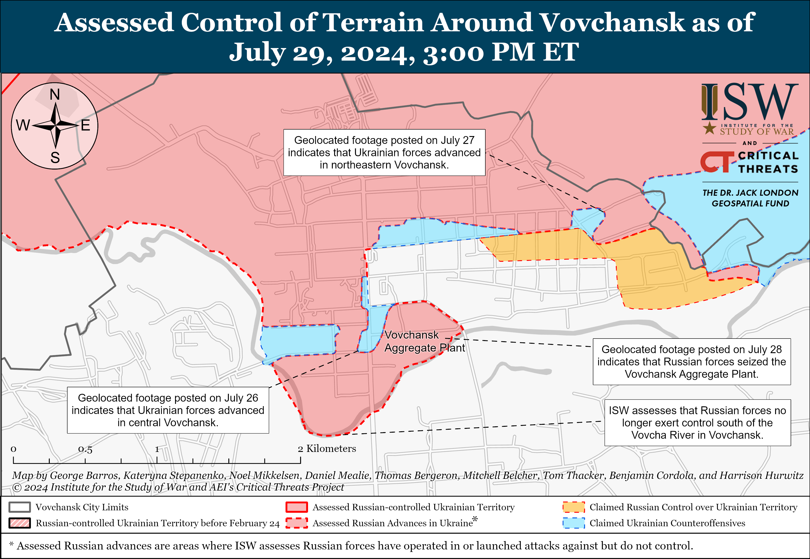
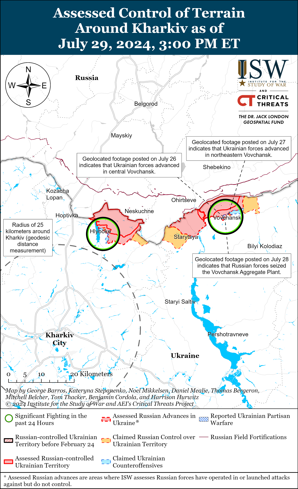
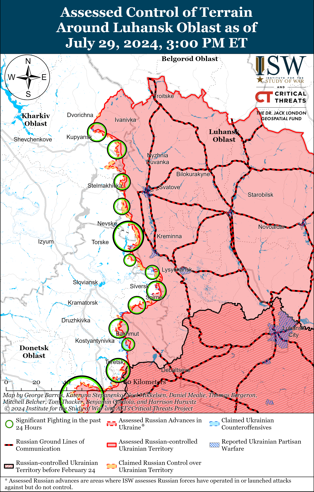
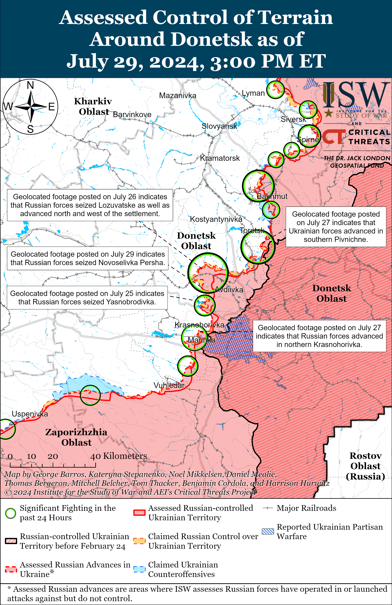
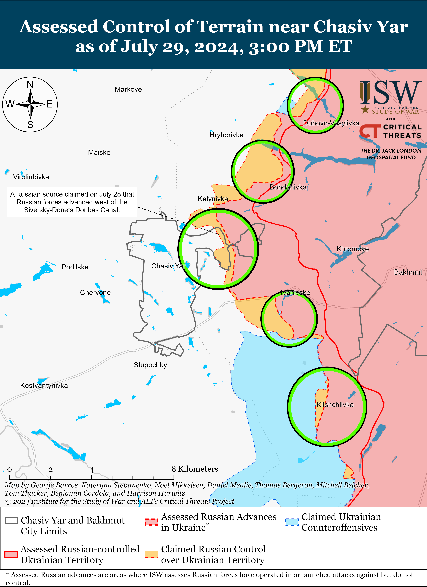
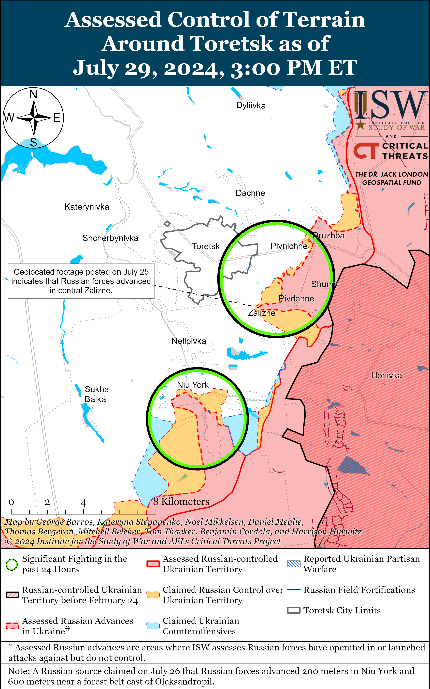
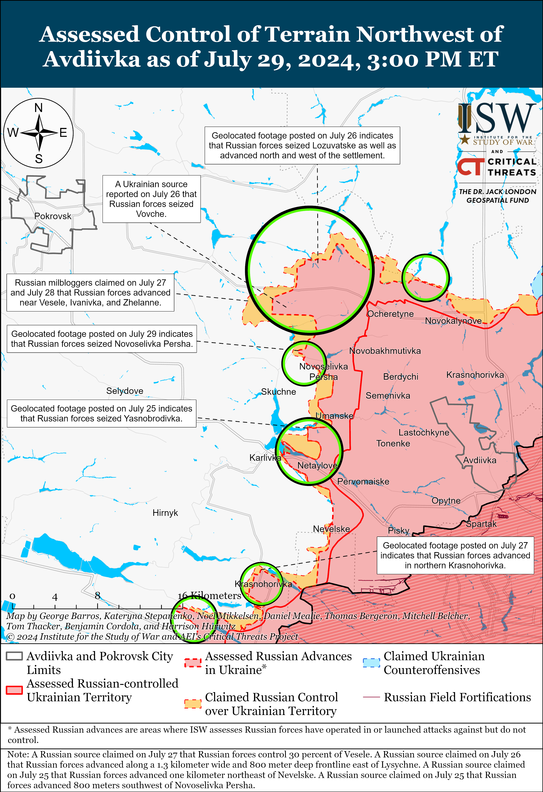
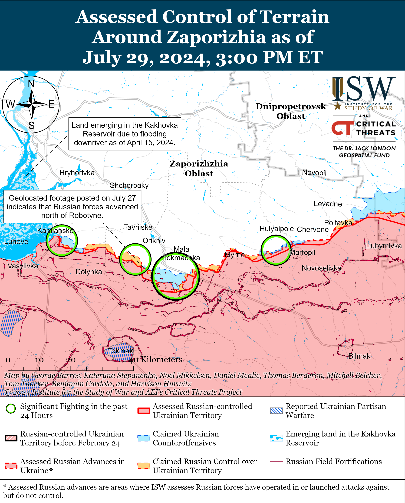
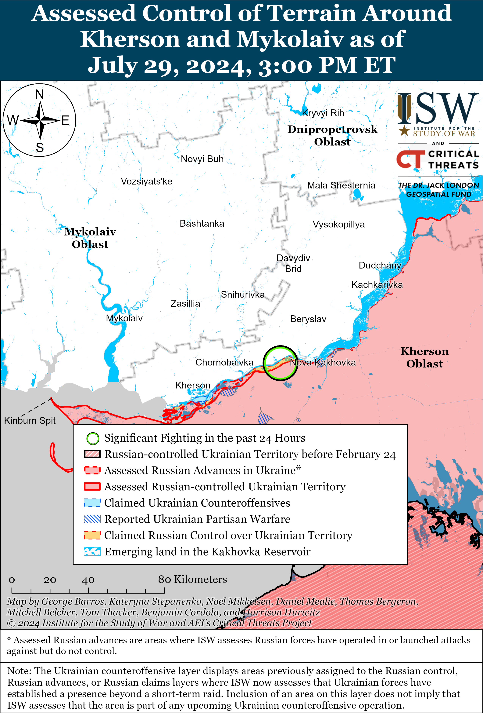

# Russian Offensive Campaign Assessment, July 29, 2024

**Grace Mappes, Nicole Wolkov, Christina Harward, Davit Gasparyan, Karolina Hird, and Frederick W. Kagan**

**July 29, 2024, 8pm ET**

**Click**[**here**](https://storymaps.arcgis.com/stories/36a7f6a6f5a9448496de641cf64bd375)**to see ISW’s interactive map of the Russian invasion of Ukraine. This map is updated daily alongside the static maps present in this report.**

**Click**[**here**](https://understandingwar.maps.arcgis.com/apps/instant/3dviewer/index.html?appid=1602762dbcde419bb957dea358449580)**to see ISW’s 3D control of terrain topographic map of Ukraine. Use of a computer (not a mobile device) is strongly recommended for using this data-heavy tool.**

**Click**[**here**](https://storymaps.arcgis.com/stories/733fe90805894bfc8562d90b106aa895)**to access ISW’s archive of interactive time-lapse maps of the Russian invasion of Ukraine. These maps complement the static control-of-terrain map that ISW produces daily by showing a dynamic frontline. ISW will update this time-lapse map archive monthly.**

**Note: The data cut-off for this product was 1pm ET on July 29. ISW will cover subsequent reports in the July 30 Russian Offensive Campaign Assessment.**

**The US Department of Defense (DoD) announced on July 29 the provision of security assistance to Ukraine worth $200 million from the authorization of a Presidential Drawdown Authority (PDA) package and an additional package worth $1.5 billion in Ukraine Security Assistance Initiative (USAI) funds.****[1]**The DoD stated that the PDA package will include air defense interceptors, munitions for rocket and artillery systems, and anti-tank weapons. The DoD reported that the USAI package includes munitions for National Advanced Surface-to-Air Missile Systems (NASAMS), short- and medium-range air defense munitions, RIM-7 air defense missiles, ammunition for High Mobility Artillery Rocket Systems (HIMARS), Tube-Launched, Optically-Tracked, Wire-Guided (TOW) missiles, Javelin and AT-4 anti-armor systems, 155mm and 105mm shells, 120mm mortar rounds, and other munitions and equipment. The DoD noted that this is the Biden administration’s 20th USAI package and 62nd tranche of equipment provided to Ukraine since August 2021.

**The Kremlin is intensifying its efforts to codify desired behavioral norms within Russia by cracking down against undesirable behavior in the Russian information space and within migrant communities.**The Russian State Duma Committee on Information Policy approved amendments to the law “On Communications” on July 29 that would allow the Russian president to impose restrictions on information to protect the “foundations of [Russian] constitutional order, morality, rights and legitimate interests of others” and to “ensure [Russia’s] defense and state security.”[2] Current Russian legislation allocates this power to federal, and not executive, laws.[3] The approved amendments to “On Communications” would also give Russian federal censor Roskomnadzor the right to manage communications networks and remove “prohibited” information at the request of the Russian Prosecutor General and deputy prosecutors general.[4] If approved by the wider Russian State Duma and then further passed through the Russian legislature, these amendments would establish Russian President Vladimir Putin as the direct arbiter of which behavior and ideals are allowed and prohibited in the Russian information space. These amendments set conditions for the Kremlin to intensify ongoing crackdowns against undesirable rhetoric in the Russian information space under the guise of vague labels intended to classify communities or behaviors that are as undesirable and anti-Russian, as is the current case with Russian legal definitions of extremism. The Duma Information Policy Committee also supported a recently proposed amendment that would require the administrators of channels with more than 10,000 followers on social media sites, including YouTube, to provide their personal information to Roskomnadzor.[5]

Russian authorities are beginning to link their efforts to crack down on the information space to efforts to control migrant behavior, establishing a standard for acceptable behavior that appeals directly to Russian ultranationalists. Russian Liberal Democratic Party Head Leonid Slutsky proposed on July 29 that Russia establish a “Migrant Code” obliging migrants to integrate into Russian cultural, linguistic, legal, and behavioral norms.[6] State Duma Deputy Speaker Irina Yarovaya stated that a Duma commission has completed its new migration policy proposals that aim to crack down against illegal immigration and false documentation and has submitted these proposals to the Cabinet of Ministers and the Supreme Court.[7] The bill that would require the deanonymization of social media channels with more than 10,000 subscribers also contains a separate provision that would limit migrants’ ability to purchase more than 10 SIM cards per person, limiting the ability for migrant communities to obtain mobile phone numbers that help illegal migrants obtain certain jobs in Russia.[8]

**The Kremlin is likely attempting to establish prominent standards of acceptable and unacceptable behavior among populations within Russia whose behavior has recently threatened the Kremlin**.[9] Many facets of the Russian ultranationalist information space supported then-Wagner Group financier Yevgeny Prigozhin’s June 2023 rebellion following months of online complaints against the Russian Ministry of Defense (MoD)’s conduct of the war in Ukraine, prompting the MoD to crack down against prominent complainants and promote self-censorship among milbloggers.[10] Russian opposition groups voice their opposition to the Kremlin, its wars, and other policies online, and the Russian Federal Financial Monitoring Service (Rosfinmonitoring) designated 55 of these organizations, including regional organizations advocating for ethnic minorities, as “extremist” organizations on July 29 in an effort to stifle them.[11] Russian ultranationalists have levied widespread complaints against migrants following multiple high-profile terrorist attacks, and the Kremlin is undertaking surface-level measures that largely appease the ultranationalist community and provide further mechanisms through which the MoD can coerce migrants into military service while broadly failing to address the rising threat of Islamic extremism in Russia.[12]

**Much of the Russian information space response to the recent Tuareg insurgent ambush of a Wagner Group in northern Mali coalesced around the suggestion that the Russian MoD will seek to benefit from Wagner losses, highlighting the continued distrust between the Russian MoD and both the Wagner Group in the Sahel and pro-Wagner commentators.** Several prominent critical milbloggers claimed that the Russian MoD is “gloating” over losses the Wagner Group reportedly suffered during the attack and suggested that Russian military authorities will use this incident as a reason to end the deployment of Wagner personnel to the Sahel and completely supplant them with units of the Russian MoD’s Africa Corps.[13] Some Russian milbloggers quoted an unidentified source within the Russian Presidential Administration as saying that Africa Corps personnel will replace Wagner troops in the entire “Sahelian Three” (Mali, Burkina Faso, and Niger).[14] Other milbloggers blamed the Wagner command for incompetence and attempts to sabotage the arrival of Africa Corps personnel, highlighting the persistent information space divides between Wagner and Africa Corps–affiliated commentators.[15] Another Russian-veteran-community-linked milblogger more broadly called for Russia to learn from the incident, strongly emphasizing that Russian forces operating abroad should not expect to face “safe” adversaries and that Russia needs to commit more heavily to foreign operations to ensure sufficient personnel and equipment levels for Russian contingents abroad.[16]

The Africa Corps, notably, likely lacks the current capacity to properly supplant Wagner operations, particularly in Mali, as Africa Corps elements have recently deployed to Ukraine to aid Russian offensive efforts in northern Kharkiv Oblast.[17] Supplanting Wagner at scale following losses such as those accrued in the recent ambush would likely involve re-deploying some Africa Corps fighters to Mali away from the frontline in Ukraine, and the Russian military command likely does not see completely supplanting Wagner in Mali or elsewhere in the Sahel as a priority effort at this time.

**Ukrainian drones struck Russian energy and utility infrastructure in Oryol, Voronezh, and Belgorod oblasts on the night of July 28 to 29.**Oryol Oblast Governor Andrei Klychkov claimed that Russian forces shot down two drones in Glazunovsky Raion on the night of July 28 to 29 and that falling debris damaged a power plant.[18] Voronezh Oblast Governor Alexander Gusev claimed that Russian forces suppressed a drone and that falling debris landed on a utility infrastructure facility in Gazoprovod.[19] Local Russian sources and Russian opposition media reported that Ukrainian drones struck a power substation in Tomarovka, Belgorod Oblast and started a fire.[20] The Russian Ministry of Defense (MoD) claimed that Russian forces destroyed nine drones over Belgorod Oblast and three drones over Voronezh Oblast overnight.[21] Ukraine’s Main Military Intelligence Directorate (GUR) Spokesperson Andriy Yusov stated on July 29 that the Ukrainian drone strike against the Olenya Airfield in Murmansk Oblast on the night of July 26 to 27 damaged a Russian strategic bomber.[22] Ukrainian outlet *Suspilne*reported on July 27 that sources stated that GUR drones damaged a Tu-22M3 strategic bomber at the airfield.[23]

**Key Takeaways:**

- **The US Department of Defense (DoD) announced on July 29 the provision of security assistance to Ukraine worth $200 million from the authorization of a Presidential Drawdown Authority (PDA) package and an additional package worth $1.5 billion in Ukraine Security Assistance Initiative (USAI) funds.**
- **The Kremlin is intensifying its efforts to codify desired behavioral norms within Russia by cracking down against undesirable behavior in the Russian information space and within migrant communities.**
- **The Kremlin is likely attempting to establish prominent standards of acceptable and unacceptable behavior among populations within Russia whose behavior has recently threatened the Kremlin**.
- **Much of the Russian information space response to the recent Tuareg insurgent ambush of a Wagner Group in northern Mali coalesced around the suggestion that the Russian MoD will seek to benefit from Wagner losses, highlighting the continued distrust between the Russian MoD and both the Wagner Group in the Sahel and pro-Wagner commentators.**
- **Ukrainian drones struck Russian energy and utility infrastructure in Oryol, Voronezh, and Belgorod oblasts on the night of July 28 to 29.**
- **Russian forces recently made confirmed advances northeast of Kharkiv City, in Vovchansk, near Avdiivka, and southwest of Donetsk City.**
- **The Russian government continues to take legislative steps to use migrants and newly naturalized citizens to fulfill Russian military personnel needs.**

[](https://understandingwar.org/wp-content/uploads/2025/05/DraftUkraineCoT20July20292C202024.png)

***We do not report in detail on Russian war crimes because these activities are well-covered in Western media and do not directly affect the military operations we are assessing and forecasting. We will continue to evaluate and report on the effects of these criminal activities on the Ukrainian military and the Ukrainian population and specifically on combat in Ukrainian urban areas. We utterly condemn Russian violations of the laws of armed conflict and the Geneva Conventions and crimes against humanity even though we do not describe them in these reports.***

- Russian Main Effort – Eastern Ukraine (comprised of three subordinate main efforts)
- Russian Subordinate Main Effort #1 – Push Ukrainian forces back from the international border with Belgorod Oblast and approach to within tube artillery range of Kharkiv City
- Russian Subordinate Main Effort #2 – Capture the remainder of Luhansk Oblast and push westward into eastern Kharkiv Oblast and encircle northern Donetsk Oblast
- Russian Subordinate Main Effort #3 – Capture the entirety of Donetsk Oblast
- Russian Supporting Effort – Southern Axis
- Russian Air, Missile, and Drone Campaign
- Russian Mobilization and Force Generation Efforts
- Russian Technological Adaptations
- Activities in Russian-occupied areas
- Ukrainian Defense Industrial Base Efforts
- Russian Information Operations and Narratives
- Significant Activity in Belarus

**Russian Main Effort – Eastern Ukraine**

**Russian Subordinate Main Effort #1 – Kharkiv Oblast****(Russian objective: Push Ukrainian forces back from the international border with Belgorod Oblast and approach to within tube artillery range of Kharkiv City)**

Russian forces have likely seized the entire Vovchansk Aggregate Plant in Vovchansk (northeast of Kharkiv City) and continued ground attacks in northern Kharkiv Oblast on July 29. Geolocated footage published on July 28 shows Ukrainian forces conducting a drone strike against a large pile of ordinance in the eastern part of the Vovchansk Aggregate Plant in central Vovchansk, indicating that Russian forces have likely seized the entirety of the plant.[24] It is unclear when Russian forces seized the plant, however. Fighting also continued near Hlyboke (north of Kharkiv City) and elsewhere within Vovchansk on July 28 and 29, and a Russian milblogger claimed that Ukrainian forces also conducted four counterattacks near Starytsya (northeast of Kharkiv City and southwest of Vovchansk).[25]

[](https://understandingwar.org/wp-content/uploads/2025/05/Vovchansk20Battle20Map20Draft20July20292C202024.png)

[](https://understandingwar.org/wp-content/uploads/2025/05/Kharkiv20Battle20Map20Draft20July20292C202024.png)

**Russian Subordinate Main Effort #2 – Luhansk Oblast****(Russian objective: Capture the remainder of Luhansk Oblast and push westward into eastern Kharkiv Oblast and northern Donetsk Oblast)**

Fighting continued along the Kupyansk-Svatove-Kreminna line on July 29, but there were no confirmed changes to the frontline. The Ukrainian General Staff reported that Russian forces attacked northeast of Kupyansk near Synkivka; southeast of Kupyansk near Novoosynove; northwest of Svatove near Pishchane; west of Svatove near Stelmakhivka; southwest of Svatove near Novoserhiivka; northwest of Kreminna near Makiivka, Nevske, and Novosadove; and west of Kreminna near Terny and Torske on July 28 and 29.[26] A Russian milblogger claimed that fighting along the Kupyansk-Svatove line is currently mostly of a positional nature following increased Russian offensive operations in this direction at the start of July 2024.[27] Elements of the Russian 375th Separate Anti-Tank Artillery Battalion (47th Tank Division, 1st Guards Tank Army [GTA], Moscow Military District [MMD]) are reportedly operating in the Kupyansk direction.[28]

[](https://understandingwar.org/wp-content/uploads/2025/05/Luhansk20Battle20Map20Draft20July20292C202024.png)

**Russian Subordinate Main Effort #3 – Donetsk Oblast****(Russian objective: Capture the entirety of Donetsk Oblast, the claimed territory of Russia’s proxies in Donbas)**

Russian forces continued limited offensive operations in the Siversk direction on July 29 but did not make any claimed or confirmed advances. The Ukrainian General Staff reported that Russian forces unsuccessfully attacked east of Siversk near Verkhnokamyanske; southeast of Siversk near Spirne and Ivano-Darivka; and south of Siversk near Pereizne.[29] Drone operators of the BARS-31 (Russian Combat Army Reserve) unit and elements of the 2nd Artillery Brigade and 123rd Motorized Rifle Brigade (both of the 2nd Luhansk People’s Republic Army Corps [LNR AC]) are reportedly operating in the Siversk direction.[30]

[](https://understandingwar.org/wp-content/uploads/2025/05/Donetsk20Battle20Map20Draft20July20292C202024.png)

Russian milbloggers continued to claim that Russian forces are advancing within eastern Chasiv Yar. Several Russian sources claimed that Russian forces, particularly elements of the 98th Airborne (VDV) Division, broke through parts of the Ukrainian defensive line along the Siverskyi-Donets Donbas Canal that runs through eastern Chasiv Yar and have entered and are consolidating new positions in the Novyi and Zhovtnevyi microraions (both in eastern Chasiv Yar and west of the canal).[31] One milblogger claimed that Russian forces have pushed Ukrainian troops out of their positions in the Orlovo forest area (just north of the Zhovtnevyi Microraion), although ISW has not yet observed visual confirmation of Russian forces operating in this forested area.[32] Another milblogger posted maps suggesting that Russian forces control most of the Orlovo forest area but noted that Russian forces have not yet crossed the water area of the Siverskyi-Donets Donbas Canal and have only traversed into eastern Chasiv Yar in areas where the canal runs underground.[33] The Ukrainian General Staff reported that Russian forces conducted ground attacks northeast of Chasiv Yar near Vasyukivka, Hryhorivka, Bohdanivka, and Dubovo-Vasylivka; east of Chasiv Yar near Ivanivske; and southeast of Chasiv Yar near Klishchiivka.[34] Elements of the Russian 11th VDV Brigade are reportedly operating alongside the 98th VDV Division in eastern Chasiv Yar.[35]

[](https://understandingwar.org/wp-content/uploads/2025/05/Chasiv20Yar20Battle20Map20Draft20July20292C202024.png)

Russian forces maintained a high rate of attacks in the Toretsk direction on July 29 and reportedly advanced in some areas. Russian milbloggers claimed that Russian forces continue attacking and advancing within southwestern Niu York (south of Toretsk), southwest of Yurivka (just south of Niu York), and in Zalizne and Pivnichne (both just southeast of Toretsk).[36] The Ukrainian General Staff reported that Russian forces attacked near Toretsk, Niu York, Pivnichne, and Zalizne and noted that Russian forces are striking Toretsk with guided glide bombs.[37]

[](https://understandingwar.org/wp-content/uploads/2025/05/Toretsk20Battle20Map20Draft20July20292C202024.png)

Russian forces have recently made significant tactical advances northwest of Avdiivka amid continued intensive efforts to advance and conduct a limited tactical encirclement of Ukrainian forces in the Pokrovsk direction (west of Avdiivka) on July 29. Geolocated footage published on July 29 shows that Russian forces hold positions in western Novoselivka Persha (northwest of Avdiivka), confirming that Russian forces recently seized the entire settlement.[38] Additional geolocated footage published on July 29 shows that Russian forces recently advanced up to a windbreak west of Vovche (also northwest of Avdiivka and northwest of Novoselivka Persha); west of Lozuvatske (north of Vovche); and south of Netaylove (southwest of Avdiivka).[39] The Russian Ministry of Defense (MoD) claimed that elements of the Russian Central Grouping of Forces have seized Vovche, which is consistent with ISW’s control of terrain assessment in this area.[40] Several Russian sources claimed that Russian forces have seized over half of Vesele (northwest of Avdiivka and just west of Vovche) and are moving towards Novohrodivka and Selydove (larger and more fortified settlements about 12 kilometers west of the current frontline).[41] The Ukrainian General Staff reported a continued high rate of Russian attacks in areas northwest, west, and southwest of Avdiivka and noted that Russian forces were especially active northwest of Avdiivka near Prohres, Novooleksandrivka, Tymofiivka, and Zhelanne.[42] Elements of the Russian 433rd Motorized Rifle Regiment (27th Motorized Rifle Division, 2nd Combined Arms Army [CAA], Central Military District [CMD]) reportedly recently seized Yevhenivka (northwest of Avdiivka).[43]

[](https://understandingwar.org/wp-content/uploads/2025/05/West20of20Avdiivka20Battle20Map20Draft20July20292C202024.png)

Russian forces recently advanced southwest of Donetsk City amid continued offensive operations west and southwest of Donetsk City on July 29. Geolocated footage published on July 28 shows that Russian forces have advanced to a windbreak in fields south of Kostyantynivka (southwest of Donetsk City).[44] Russian milbloggers additionally claimed that Russian forces advanced to the western outskirts of and within northern Krasnohorivka (west of Donetsk City), although ISW has not yet observed Russian forces operating this far within western or northern Krasnohorivka.[45] The Ukrainian General Staff reported continued unsuccessful Russian attacks west of Donetsk City near Krasnohorivka and Heorhiivka and southwest of Donetsk City near Paraskoviivka, Kostyantynivka, and Vodyane and in the direction of Antonivka.[46] Elements of the Russian 110th and 5th motorized rifle brigades (both of the 1st Donetsk People’s Republic [DNR] AC) are reportedly operating within Krasnohorivka, while elements of the 238th Artillery Brigade and 150th Motorized Rifle Division (both of the 8th CAA, Southern Military District [SMD]) and the 57th Motorized Rifle Regiment (6th Motorized Rifle Division, 3rd AC) are reportedly operating near Kostyantynivka.[47]

Russian forces continued limited offensive operations in the Donetsk-Zaporizhia Oblast border area on July 29 but did not make any confirmed advances. The Ukrainian General Staff reported that Ukrainian forces repelled ground attacks near Velyka Novosilka.[48] Elements of the Russian 60th Motorized Rifle Brigade (5th CAA, Eastern Military District [EMD]) and 1472nd Motorized Rifle Regiment (68th AC, EMD) are reportedly operating in this direction.[49]

**Russian Supporting Effort – Southern Axis****(Russian objective: Maintain frontline positions and secure rear areas against Ukrainian strikes)**

Positional engagements continued in western Zaporizhia Oblast on July 29, but there were no confirmed changes to the frontline. Positional engagements continued near Robotyne; northeast of Robotyne near Hulyaipole and Mala Tokmachka; east of Robotyne near Verbove; north of Robotyne near Novodanylivka; and northwest of Robotyne near Novoandriivka on July 28 and 29.[50] Elements of the Russian 70th Motorized Rifle Regiment (42nd Motorized Rifle Division, 58th Combined Arms Army [CAA], Southern Military District [SMD]) are reportedly operating near Robotyne, and reconnaissance elements of the 4th Military Base (58th CAA), including its “Valkyria” drone detachment, are reportedly operating near Kamyanske (northwest of Robotyne).[51]

[](https://understandingwar.org/wp-content/uploads/2025/05/Zaporizhia20Battle20Map20Draft20July20292C202024.png)

Positional engagements continued in east (left) bank Kherson Oblast and on the islands of the Dnipro River Delta on July 28 and 29.[52]

[](https://understandingwar.org/wp-content/uploads/2025/05/Kherson-Mykolaiv20Battle20Map20Draft20July20292C202024.png)

**Russian Air, Missile, and Drone Campaign****(Russian Objective: Target Ukrainian military and civilian infrastructure in the rear and on the frontline)**

Russian forces conducted limited drone and missile strikes against Ukraine overnight on July 28 to 29. Ukrainian Air Force Commander Lieutenant General Mykola Oleshchuk reported that Russian forces launched a Kh-59/69 missile from occupied Donetsk Oblast and 10 Shahed 136/131 drones from occupied Cape Chauda, Crimea overnight and that Ukrainian forces shot down the Kh-59/69 missile and 9 of the 10 Shaheds.[53]

Russian and Ukrainian sources reported that the new cheaply made foam and plywood Russian drones are “Gerbera” drones produced in the Alabuga Special Economic Zone (SEZ) in the Republic of Tatarstan. Russian opposition outlet *Astra*reported on July 28 that Russian channels began posting advertisements for the “Gerbera” drone shortly after Ukraine’s Main Military Intelligence Directorate (GUR) Spokesperson Andriy Chernyak told *Reuters*about the drones in a July 26 article.[54] These “Gerbera” drones closely resemble the Iranian Shahed drones and are likely meant to act as false targets to distract Ukrainian air defenses while simultaneously transmitting details on Ukrainian air defenses back to Russian forces.[55]

**Russian Mobilization and Force Generation Efforts****(Russian objective: Expand combat power without conducting general mobilization)**

The Russian government continues to take legislative steps to use migrants and newly naturalized citizens to fulfill Russian military personnel needs. State Duma Chairperson Vyacheslav Volodin proposed on July 29 that Duma deputies prepare an initiative that would require newly naturalized Russian citizens to register for military service upon their receipt of a Russian passport.[56] The Duma will also consider amendments to increase the term of military service for newly naturalized Russian citizens from one year to two and to raise the draft age an unspecified amount. Russian opposition outlet *Okno*reported on July 29 that Russian authorities are illegally detaining migrants without food and water and physically abusing them in order to coerce the migrants into signing military contracts.[57] Russian lawyers and human rights activists stated that almost all detained migrants agree to sign military contracts and that Russian authorities are both threatening to strip naturalized citizens of their Russian citizenship and promising migrants citizenship in exchange for agreeing to join the military. *Okno* stated that raids on migrants have become more frequent since the Crocus City Hall terrorist attack in March 2024.

Russian federal subjects (regions) continue to increase monetary incentives to boost force generation efforts. Russian opposition media reported on July 29 that at least nine federal subjects — Voronezh, Yaroslav, Arkhanhelsk, Kaluga, and Ivanova oblasts; the Sakha, Tatarstan, and Mordovia republics; and the Yamalo-Nenets Autonomous Okrug — have launched referral programs that offer money awards ranging from 5,000 to 100,000 rubles (about $58 to $1,160) to anyone who brings a friend to a military registration and recruitment office to sign a military contract.[58] Similar systems reportedly may begin in the Udmurt Republic and Bryansk Oblast.

**Russian Technological Adaptations****(Russian objective: Introduce technological innovations to optimize systems for use in Ukraine)**

Nothing significant to report.

**Ukrainian Defense Industrial Efforts (Ukrainian objective: Develop its defense industrial base to become more self-sufficient in cooperation with US, European, and international partners)**

Ukraine continues to expand its domestic defense industrial base (DIB) independently and with the assistance of Western partners. Ukrainian President Volodymyr Zelensky discussed the development of Ukraine’s domestic missile program on July 23 and noted that Ukraine is gradually approaching the possibility of deploying domestically produced missiles to avoid solely relying on missile supplies from Ukraine’s allies.[59] US company Boeing announced on July 23 that it signed a memorandum of understanding with Ukrainian defense enterprise Antonov for cooperation in defense-related projects including those related to drones.[60]

Western countries continue to provide Ukraine with military assistance. German arms manufacturer Rheinmetall announced on July 23 that the Ukrainian government issued an order for Rheinmetall’s construction of an ammunition factory in Ukraine, which Rheinmetall and Ukraine first announced in February 2024.[61] Czech Prime Minister Petr Fiala stated on July 24 that Ukraine will receive roughly 500,000 155mm artillery shells through the Czech-led artillery initiative by the end of 2024.[62] Czech Defense Minister Jana Cernochova announced on July 24 that Czechia is starting a second project to purchase ammunition for Ukraine called “Initiative-2025.”[63] The United Kingdom (UK) Ministry of Defense (MoD) announced on July 24 that it will provide 176 million pounds (about $226 million) worth of military equipment to Ukraine, including a significant number of Lightweight Multirole Missiles (LMM).[64] The Spanish MoD stated on July 24 that Spain will provide Ukraine with a Hawk air defense battery in September 2024.[65] The Dutch MoD announced on July 25 that the Netherlands and Denmark will jointly send 14 Leopard 2A4 tanks to Ukraine in Summer 2024.[66] The Dutch MoD stated that the last two Leopard tanks were undergoing tests on July 23 and 24 and the rest are ready for delivery to Ukraine. The German MoD announced on July 29 that Germany and Denmark will jointly supply Ukraine with eight Leopard 1A5 tanks.[67] Germany will also provide Ukraine with 21,000 rounds of ammunition for Gepard self-propelled anti-aircraft guns and 10 unmanned surface vessels.[68]

**Activities in Russian-occupied areas****(Russian objective: Consolidate administrative control of annexed areas; forcibly integrate Ukrainian citizens into Russian sociocultural, economic, military, and governance systems)**

*ISW is not publishing coverage of Russian-occupied areas of Ukraine today.*

**Russian Information Operations and Narratives**

Ukraine’s Strategic Command reported on July 28 that Russian sources in the past week promoted false narratives intended to create discontent among Ukrainians about mobilization, discredit the Orthodox Church of Ukraine and Ukrainian authorities, and demoralize Ukrainians.[69]

Russian independent outlet *Mozhem Obyasnit* (We Can Explain) reported on July 29 that sources in the Russian media stated that First Deputy Chief of Staff of the Russian Presidential Administration Alexei Gromov instructed pro-Kremlin media to criticize the Olympic Games in Paris.[70]

**Significant activity in Belarus****(Russian efforts to increase its military presence in Belarus and further integrate Belarus into Russian-favorable frameworks and Wagner Group activity in Belarus)**

Belarus and Russia continue to pursue Union State integration efforts. Russian President Vladimir Putin ordered on July 29 that Russia and Belarus sign a treaty on the formation of a unified electrical energy market.[71] Belarusian President Alexander Lukashenko addressed various economic development projects that he claimed are important to Union State integration, including microelectronics and aircraft manufacturing.[72] Belarusian media also reported that Lukashenko and Putin have agreed to find solutions to Union State integration challenges before the next Union State meeting this fall, including the issue of creating a Union State media holding.[73]

**Note: ISW does not receive any classified material from any source, uses only publicly available information, and draws extensively on Russian, Ukrainian, and Western reporting and social media as well as commercially available satellite imagery and other geospatial data as the basis for these reports. References to all sources used are provided in the endnotes of each update.**

---

[1] https://www.defense.gov/News/Releases/Release/Article/3852671/biden-administration-announces-additional-security-assistance-for-ukraine/

[2] https://tass dot ru/obschestvo/21480219; https://t.me/tass\_agency/263154

[3] https://tass dot ru/obschestvo/21480219; https://t.me/tass\_agency/263154

[4] https://tass dot ru/obschestvo/21480195; https://t.me/tass\_agency/263151

[5] https://t.me/tass\_agency/263049; https://t.me/tass\_agency/263102

[6] https://ria dot ru/20240729/migranty-1962721503.html

[7] https://tass dot ru/politika/21478693

[8] https://tass dot ru/ekonomika/21476779

[9] https://isw.pub/UkrWar072524; https://isw.pub/UkrWar071924

[10] https://understandingwar.org/backgrounder/russian-offensive-campaign-assessment-june-23-2023; https://understandingwar.org/backgrounder/russian-offensive-campaign-assessment-june-24-2023; https://understandingwar.org/backgrounder/russian-offensive-campaign-assessment-june-25-2023; https://understandingwar.org/wp-content/uploads/2024/07/July202120Russian20Offensive20Campaign20Assessment20PDF.pdf; https://understandingwar.org/backgrounder/russian-offensive-campaign-assessment-april-20-2024; https://understandingwar.org/backgrounder/russian-offensive-campaign-assessment-july-22-2024; https://understandingwar.org/backgrounder/russian-offensive-campaign-assessment-july-26-2024; https://understandingwar.org/backgrounder/russian-offensive-campaign-assessment-september-28-2023; https://understandingwar.org/backgrounder/russian-offensive-campaign-assessment-october-29-2023

[11] https://tass dot ru/obschestvo/21479611

[12] https://understandingwar.org/backgrounder/russian-offensive-campaign-assessment-july-22-2024; https://understandingwar.org/backgrounder/russian-offensive-campaign-assessment-july-2-2024; https://understandingwar.org/backgrounder/russian-offensive-campaign-assessment-june-27-2024; https://understandingwar.org/backgrounder/russian-offensive-campaign-assessment-april-1-2024

[13] https://t.me/rybar/62210; https://t.me/rqnst/5591; https://t.me/knyaz\_cherkasky/2481

[14] https://t.me/africaninitiative/4439; https://t.me/knyaz\_cherkasky/2481; https://t.me/svarschiki/9877; https://t.me/dva\_majors/48359

[15] https://t.me/dva\_majors/48359; https://t.me/dva\_majors/48316; https://t.me/akashevarova/7429

[16] https://t.me/notes\_veterans/18376

[17] https://understandingwar.org/backgrounder/russian-offensive-campaign-assessment-may-21-2024; https://understandingwar.org/backgrounder/russian-offensive-campaign-assessment-july-9-2024; https://understandingwar.org/backgrounder/russian-offensive-campaign-assessment-may-6-2024; https://t.me/rybar/59081; https://static.rusi.org/SR-Russian-Unconventional-Weapons-final-web.pdf

[18] https://t.me/Klychkov\_Andrey/3809

[19] https://t.me/gusev\_36/2536

[20] https://t.me/belpepel/6964; https://t.me/astrapress/60672

[21] https://t.me/mod\_russia/41516

[22] https://armyinform dot com.ua/2024/07/29/gur-pidtverdylo-poshkodzhennya-litaka-tu-22m3-na-rosijskomu-aerodromi/

[23] https://understandingwar.org/backgrounder/russian-offensive-campaign-assessment-july-27-2024

[24] https://armyinform dot com.ua/2024/07/29/odyn-nazemnyj-dron-200-kg-plastydu-i-rosiyanczi-startuvaly-do-kosmosu-z-vovchanska/; https://t.me/DeepStateUA/19985

[25] https://www.facebook.com/GeneralStaff.ua/posts/pfbid02oFi2yYpcs2JzpHqvwuXAGrVMnn2UKNvh7ujJDQc7sVq5fnRp7QHX3EKbCoq2Eabkl; https://www.facebook.com/GeneralStaff.ua/posts/pfbid02FPYbmoSc4bCt1geVSQ2SKorQ3ZH5XScpNuvovuq4ViBmg9a2vNqf6ZJwCbeb6abDl; https://www.facebook.com/GeneralStaff.ua/posts/pfbid0WEEMh1mW8vsWmbeH3b3j3rB1VE7VP9od3CgcBQEWFkvi9MbnYmsBAN9iT1L2HdAcl; https://t.me/otukharkiv/436; https://t.me/otukharkiv/435; https://t.me/dva\_majors/48329; https://t.me/DnevnikDesantnika/13181; https://t.me/wargonzo/21260

[26]https://www.facebook.com/GeneralStaff.ua/posts/pfbid02oFi2yYpcs2JzpHqvwuXAGrVMnn2UKNvh7ujJDQc7sVq5fnRp7QHX3EKbCoq2Eabkl ; https://www.facebook.com/GeneralStaff.ua/posts/pfbid02FPYbmoSc4bCt1geVSQ2SKorQ3ZH5XScpNuvovuq4ViBmg9a2vNqf6ZJwCbeb6abDl ; https://www.facebook.com/GeneralStaff.ua/posts/pfbid0WEEMh1mW8vsWmbeH3b3j3rB1VE7VP9od3CgcBQEWFkvi9MbnYmsBAN9iT1L2HdAcl

[27] https://t.me/rybar/62201

[28] https://t.me/sashakots/48083 ; https://t.me/brussinf/7827 ; https://t.me/vysokygovorit/16689

[29] https://www.facebook.com/GeneralStaff.ua/posts/pfbid02oFi2yYpcs2JzpHqvwuXAGrVMnn2UKNvh7ujJDQc7sVq5fnRp7QHX3EKbCoq2Eabkl; https://www.facebook.com/GeneralStaff.ua/posts/pfbid02FPYbmoSc4bCt1geVSQ2SKorQ3ZH5XScpNuvovuq4ViBmg9a2vNqf6ZJwCbeb6abDl; https://www.facebook.com/GeneralStaff.ua/posts/pfbid0WEEMh1mW8vsWmbeH3b3j3rB1VE7VP9od3CgcBQEWFkvi9MbnYmsBAN9iT1L2HdAcl

[30] https://t.me/boris\_rozhin/131670; https://t.me/boris\_rozhin/131625; https://t.me/sons\_fatherland/15872

[31] https://t.me/RVvoenkor/73473; https://t.me/wargonzo/21260; https://t.me/DnevnikDesantnika/13174; https://t.me/boris\_rozhin/131558; https://t.me/boris\_rozhin/131644; https://t.me/boris\_rozhin/131668 ; https://t.me/rusich\_army/16097

[32] https://t.me/DnevnikDesantnika/13174

[33] https://t.me/motopatriot/25531 ; https://t.me/motopatriot/25534; https://t.me/motopatriot/25533

[34] https://www.facebook.com/GeneralStaff.ua/posts/pfbid02oFi2yYpcs2JzpHqvwuXAGrVMnn2UKNvh7ujJDQc7sVq5fnRp7QHX3EKbCoq2Eabkl; https://www.facebook.com/GeneralStaff.ua/posts/pfbid02FPYbmoSc4bCt1geVSQ2SKorQ3ZH5XScpNuvovuq4ViBmg9a2vNqf6ZJwCbeb6abDl

[35] https://t.me/boris\_rozhin/13166

[36] https://t.me/dva\_majors/48329; https://t.me/rybar/62202; https://t.me/motopatriot/25526; https://t.me/wargonzo/21267

[37] https://www.facebook.com/GeneralStaff.ua/posts/pfbid02oFi2yYpcs2JzpHqvwuXAGrVMnn2UKNvh7ujJDQc7sVq5fnRp7QHX3EKbCoq2Eabkl; https://www.facebook.com/GeneralStaff.ua/posts/pfbid02FPYbmoSc4bCt1geVSQ2SKorQ3ZH5XScpNuvovuq4ViBmg9a2vNqf6ZJwCbeb6abDl

[38] https://t.me/RtrDonetsk/25940; https://t.me/creamy\_caprice/6187; https://x.com/GeoConfirmed/status/1817873604211568781

[39] https://t.me/rubpak/155; https://t.me/creamy\_caprice/6189; https://www.facebook.com/151OMBr/videos/1874378916388485/?mibextid=rS40aB7S9Ucbxw6v; https://t.me/creamy\_caprice/6186; https://x.com/PuenteUribarri/status/1817872317214568461; https://x.com/MikiValbuena/status/1817886813312209179

[40] https://t.me/mod\_russia/41523

[41] https://t.me/RVvoenkor/73469; https://t.me/RVvoenkor/73485; https://t.me/wargonzo/21260; https://t.me/z\_arhiv/27433; https://t.me/epoddubny/20552; https://t.me/epoddubny/20550https://t.me/voenkorKotenok/57815

[42] https://www.facebook.com/GeneralStaff.ua/posts/pfbid02oFi2yYpcs2JzpHqvwuXAGrVMnn2UKNvh7ujJDQc7sVq5fnRp7QHX3EKbCoq2Eabkl; https://www.facebook.com/GeneralStaff.ua/posts/pfbid02FPYbmoSc4bCt1geVSQ2SKorQ3ZH5XScpNuvovuq4ViBmg9a2vNqf6ZJwCbeb6abDl

[43] https://t.me/RVvoenkor/73474

[44] https://t.me/Fab\_1500/117; https://t .me/creamy\_caprice/6184

[45] https://t.me/RVvoenkor/73498; https://t.me/z\_arhiv/27436; https://t.me/milinfolive/127118; https://t.me/boris\_rozhin/131642

[46] https://www.facebook.com/GeneralStaff.ua/posts/pfbid02oFi2yYpcs2JzpHqvwuXAGrVMnn2UKNvh7ujJDQc7sVq5fnRp7QHX3EKbCoq2Eabkl; https://www.facebook.com/GeneralStaff.ua/posts/pfbid02FPYbmoSc4bCt1geVSQ2SKorQ3ZH5XScpNuvovuq4ViBmg9a2vNqf6ZJwCbeb6abDl

[47] https://t.me/RVvoenkor/73498; https://t.me/RVvoenkor/73520; https://t.me/boris\_rozhin/131559; https://t.me/boris\_rozhin/131636; https://t.me/nm\_dnr/12523

[48] https://www.facebook.com/GeneralStaff.ua/posts/pfbid02oFi2yYpcs2JzpHqvwuXAGrVMnn2UKNvh7ujJDQc7sVq5fnRp7QHX3EKbCoq2Eabkl; https://www.facebook.com/GeneralStaff.ua/posts/pfbid02FPYbmoSc4bCt1geVSQ2SKorQ3ZH5XScpNuvovuq4ViBmg9a2vNqf6ZJwCbeb6abDl

[49] https://t.me/voin\_dv/10012; https://t.me/voin\_dv/10009; https://t.me/voin\_dv/9997

[50] https://www.facebook.com/GeneralStaff.ua/posts/pfbid02oFi2yYpcs2JzpHqvwuXAGrVMnn2UKNvh7ujJDQc7sVq5fnRp7QHX3EKbCoq2Eabkl; https://www.facebook.com/GeneralStaff.ua/posts/pfbid02FPYbmoSc4bCt1geVSQ2SKorQ3ZH5XScpNuvovuq4ViBmg9a2vNqf6ZJwCbeb6abDl; https://www.facebook.com/GeneralStaff.ua/posts/pfbid0WEEMh1mW8vsWmbeH3b3j3rB1VE7VP9od3CgcBQEWFkvi9MbnYmsBAN9iT1L2HdAcl; https://t.me/wargonzo/21260

[51] https://t.me/RVvoenkor/73464; https://t.me/voin\_dv/10008 ; https://t.me/boris\_rozhin/131550

[52] https://www.facebook.com/GeneralStaff.ua/posts/pfbid02FPYbmoSc4bCt1geVSQ2SKorQ3ZH5XScpNuvovuq4ViBmg9a2vNqf6ZJwCbeb6abDl; https://www.facebook.com/GeneralStaff.ua/posts/pfbid0WEEMh1mW8vsWmbeH3b3j3rB1VE7VP9od3CgcBQEWFkvi9MbnYmsBAN9iT1L2HdAcl; https://t.me/DnevnikDesantnika/13189

[53] https://t.me/ComAFUA/361; https://t.me/kpszsu/17072; https://armyinform dot com.ua/2024/07/29/syly-ppo-zbyly-aviaczijnu-raketu-ta-9-udarnyh-bpla/; https://suspilne dot media/800977-sili-ppo-zbili-raketu-h-59-i-9-sahediv/

[54] https://understandingwar.org/backgrounder/russian-offensive-campaign-assessment-july-27-2024; https://t.me/astrapress/60665; https://t.me/astrapress/60141

[55] https://t.me/astrapress/60665; https://www.reuters.com/world/europe/russia-deploys-cheap-drones-locate-ukraines-air-defences-2024-07-26/; https://understandingwar.org/backgrounder/russian-offensive-campaign-assessment-july-27-2024

[56] https://tass dot ru/obschestvo/21479869; https://t.me/duma\_gov\_ru/4213

[57] https://okno dot group/migranti-voina/; https://www.severreal.org/a/pytki-shokerom-i-obezvozhivaniem-kak-v-rossii-verbuyut-na-voynu-migrantov/33053227.html

[58] https://t.me/svobodnieslova/5353; https://t.me/sotaproject/84195

[59] https://mil.in dot ua/uk/news/ukrayina-nablyzhayetsya-do-zastosuvannya-vitchyznyanyh-raket-zelenskyj/

[60] https://boeing.mediaroom.com/news-releases-statements?item=131463#assets\_all

[61] https://www.rheinmetall.com/en/media/news-watch/news/2024/07/2024-07-24-rheinmetall-supplies-equipment-for-ammunition-factory-in-ukraine

[62] https://www.ukrinform dot ua/rubric-world/3888391-petr-fiala-premerministr-ceskoi-respubliki.html ; https://english.nv dot ua/nation/czech-pm-fiala-said-that-500-000-ammunition-rounds-will-be-delivered-to-ukraine-by-the-end-of-year-50437217.html

[63] https://ruski.radio dot cz/chehiya-zapuskaet-vtoroy-proekt-po-zakupke-snaryadov-dlya-ukrainy-8823672 ; https://suspilne dot media/797847-cehia-zapuskae-drugij-proekt-iz-zakupivli-boepripasiv-dla-ukraini/

[64] https://www.gov.uk/government/news/new-order-of-missiles-secures-future-supply-for-uk-armed-forces

[65] https://www.defensa.gob dot es/gabinete/notasPrensa/2024/07/DGC-240724-vtc-ministro-ucrania.html

[66] https://www.defensie dot nl/actueel/nieuws/2024/07/25/toegezegde-leopard-2-tanks-naar-oekraine

[67] https://www.bundesregierung dot de/breg-en/news/military-support-ukraine-2054992

[68] https://www.bundesregierung dot de/breg-en/news/military-support-ukraine-2054992

[69] https://t.me/spravdi/40435

[70] https://t.me/sotaproject/84194; https://t.me/mozhemobyasnit/18510

[71] https://t.me/MID\_Russia/43659; https://t.me/tass\_agency/263134; https://t.me/belta\_telegramm/261005 ; https://www.belta dot by/society/view/putin-rasporjadilsja-podpisat-dogovor-ob-objedinennom-energorynke-rossii-i-belarusi-651017-2024/

[72] https://t.me/pul\_1/13166

[73] https://t.me/belta\_telegramm/260926 ; https://www.belta dot by/president/view/lukashenko-i-putin-dogovorilis-k-zasedaniju-vgs-zakryt-vse-problemnye-voprosy-po-linii-sovbezov-i-650896-2024/; https://t.me/pul\_1/13161
