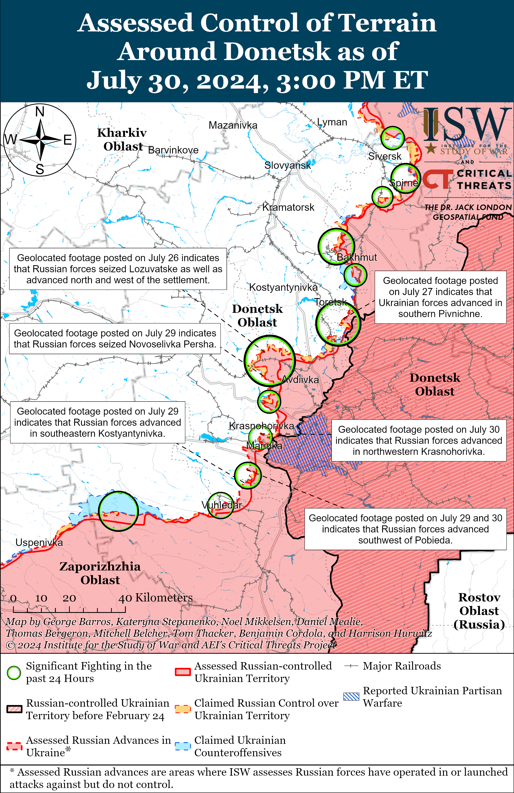
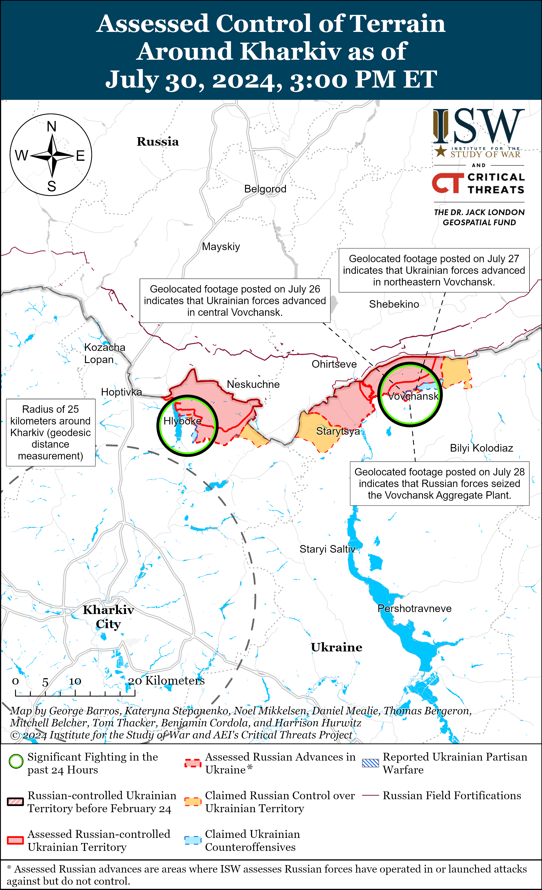
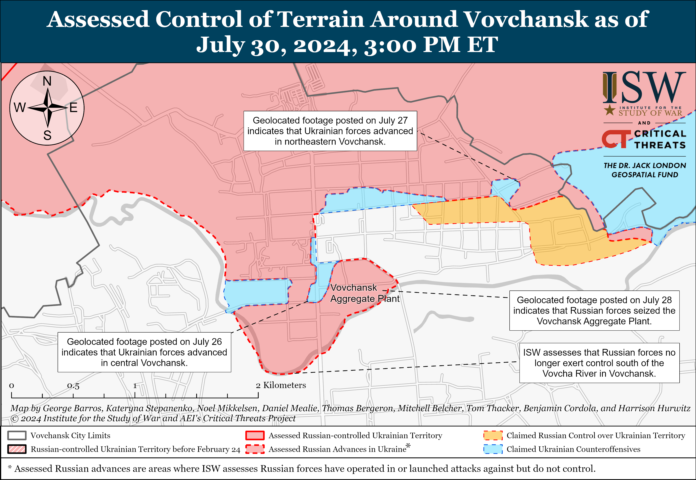
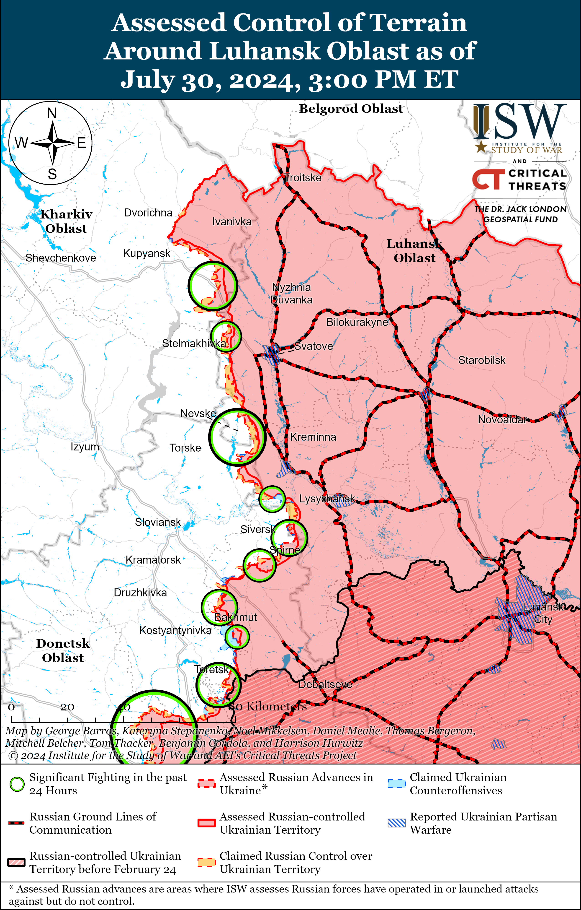
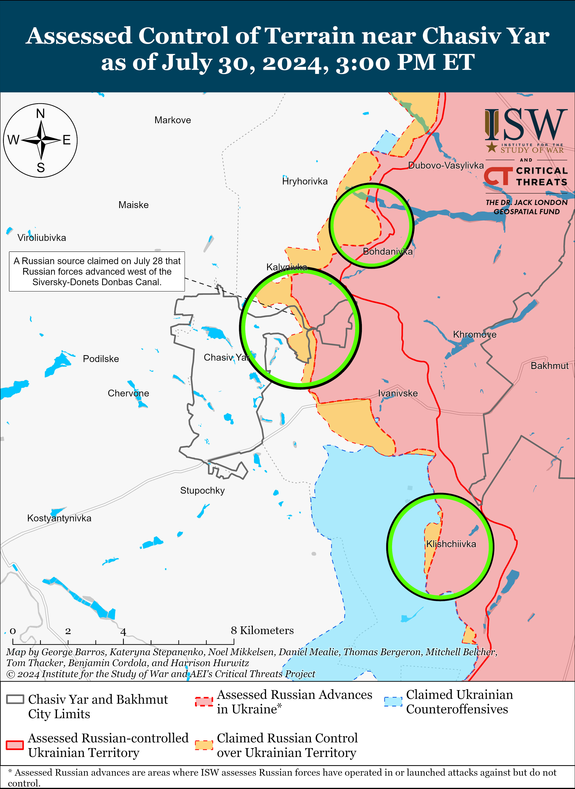
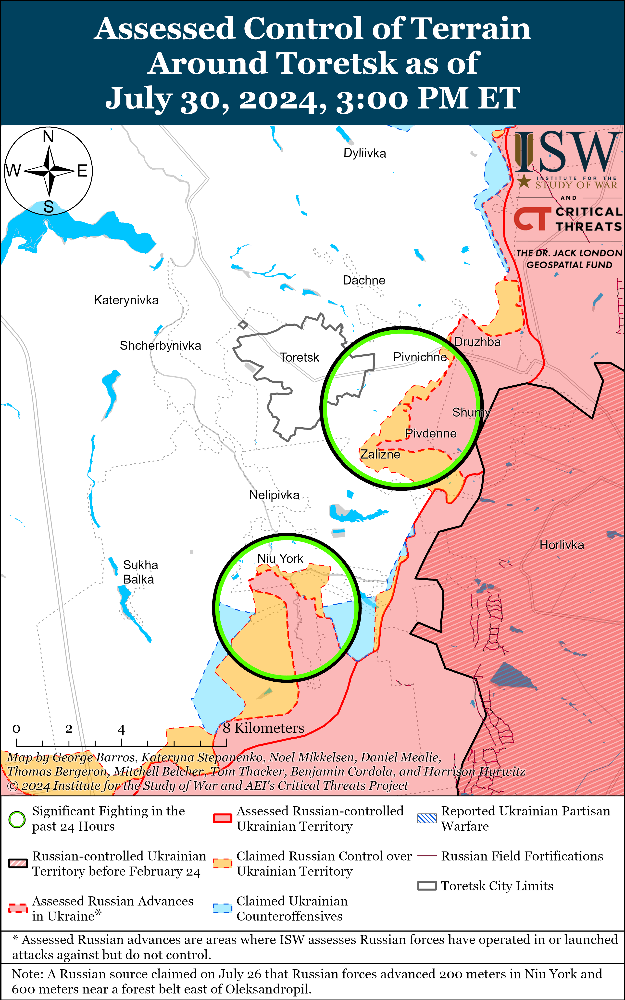
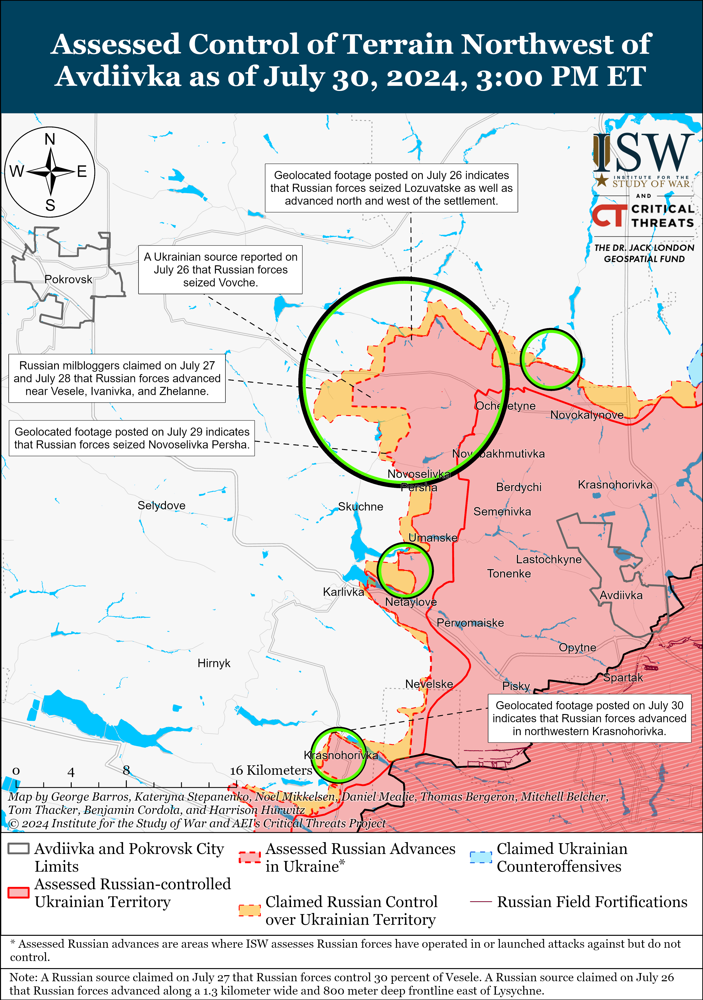
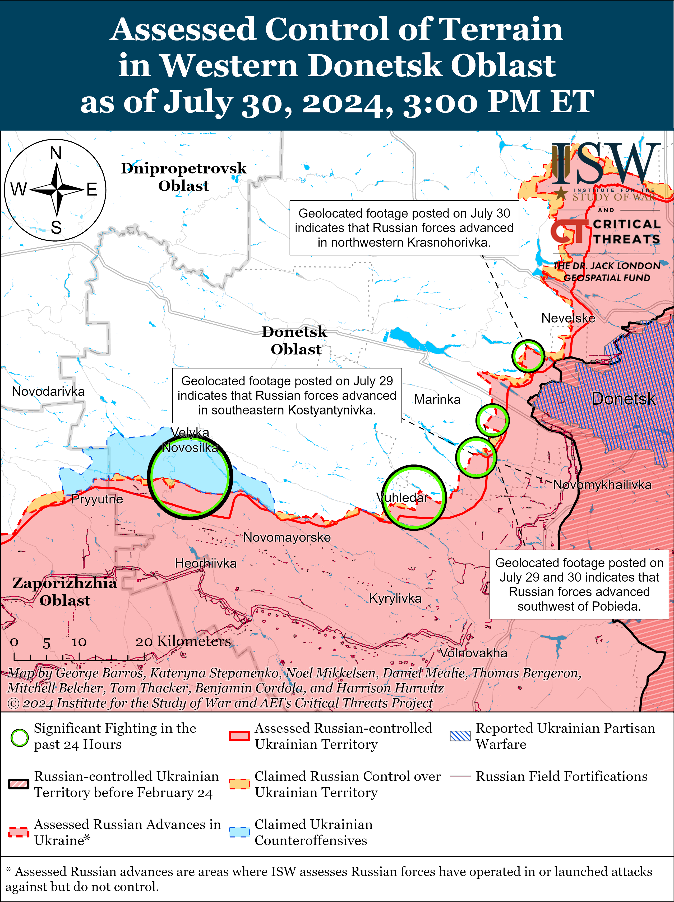
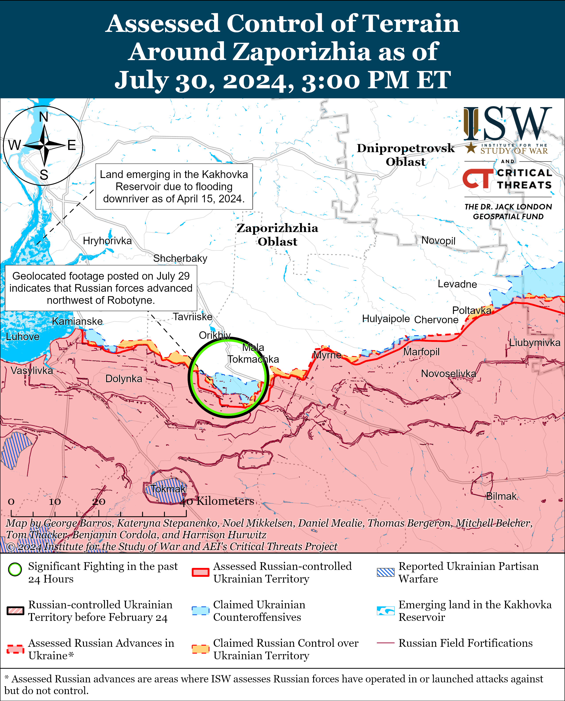
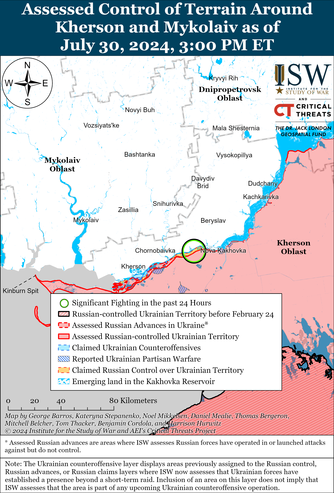

# Russian Offensive Campaign Assessment, July 30, 2024

**Angelica Evans, Nicole Wolkov, Grace Mappes, Karolina Hird, and Frederick W. Kagan**

**July 30, 2024, 7:15pm ET**

**Click**[**here**](https://storymaps.arcgis.com/stories/36a7f6a6f5a9448496de641cf64bd375)**to see ISW’s interactive map of the Russian invasion of Ukraine. This map is updated daily alongside the static maps present in this report.**

**Click**[**here**](https://understandingwar.maps.arcgis.com/apps/instant/3dviewer/index.html?appid=1602762dbcde419bb957dea358449580)**to see ISW’s 3D control of terrain topographic map of Ukraine. Use of a computer (not a mobile device) is strongly recommended for using this data-heavy tool.**

**Click**[**here**](https://storymaps.arcgis.com/stories/733fe90805894bfc8562d90b106aa895)**to access ISW’s archive of interactive time-lapse maps of the Russian invasion of Ukraine. These maps complement the static control-of-terrain map that ISW produces daily by showing a dynamic frontline. ISW will update this time-lapse map archive monthly.**

**Note: The data cut-off for this product was 12:30pm ET on July 30. ISW will cover subsequent reports in the July 31 Russian Offensive Campaign Assessment.**

**Russian forces conducted five platoon- to battalion-sized mechanized assaults in western Donetsk Oblast on July 29 and 30. Such localized mechanized pushes are likely the manifestation of Russia’s forecasted summer offensive—Russian forces likely lack the wider operational capacity to mount a separate renewed offensive operation in Donetsk Oblast or elsewhere on the front this summer.** Geolocated footage published on July 29 indicates that Russian forces marginally advanced on the southwestern outskirts of Kostyantynivka (southwest of Donetsk City) during a reinforced-battalion sized mechanized assault.[1] The same Ukrainian brigade that repelled the July 24 reinforced-battalion sized mechanized assault near Kostyantynivka reported that Russian forces committed 10 tanks, 47 armored fighting vehicles, 10 motorcycles, and a “buggy” to the July 29 assault and that Ukrainian forces struck eight tanks, 12 armored fighting vehicles, nine motorcycles, and the buggy.[2] Additional geolocated footage and Ukrainian reporting indicate that Russian forces conducted an unsuccessful reduced-company sized mechanized assault southwest of Pobieda (southwest of Donetsk City) on the morning of July 29 and that Russian forces marginally advanced southwest of the settlement during a separate reinforced-platoon sized mechanized assault on July 30.[3] Ukrainian sources published footage and reported on July 29 that Russian forces also conducted an unsuccessful reinforced-company sized mechanized assault in an unspecified area of the Kurakhove direction (west of Marinka) and an unsuccessful reinforced-platoon sized mechanized assault near Krasnohorivka (west of Donetsk City).[4] Ukrainian forces previously blunted a reinforced-battalion sized Russian mechanized assault near Kostyantynivka on July 24 and a reinforced-company sized assault near the settlement on July 25.[5] ISW previously assessed that Russian forces are likely attempting to seize Kostyantynivka and cut the Vuhledar-Kostyantynivka T-0524 highway, forcing Ukrainians to retreat from the area.[6]

**Periodic and pulsating Russian mechanized assaults likely represent the extent of Russia’s current offensive capacity, and Russia is unlikely to mount a distinct new summer offensive operation due to material and manpower constraints.** ISW previously noted that Russian forces have struggled to conduct simultaneous large-scale offensive operations throughout the war but are prone to conducting offensive operations in “pulses” along different sectors of the front, with one sector decreasing in intensity as another sector increases.[7] Russian forces have conducted periodic platoon and company-sized mechanized assaults in the Lyman, Chasiv Yar, and Avdiivka directions in Donetsk Oblast throughout the summer, and have more recently intensified assaults west and southwest of Donetsk City.[8] Russian forces also reportedly recommitted elements of the Central Military District’s (CMD) 90th Tank Division (41st Combined Arms Army [CAA]) from Avdiivka to southwest of Donetsk City, suggesting that the Russian military command may assess that Russian forces are unlikely to make rapid tactical gains near Avdiivka and are re-prioritizing the Donetsk City area.[9] Russian forces are likely to commit additional mechanized forces to the area in order to exploit weak spots in the Ukrainian line and achieve some territorial advances, however limited, during the summer of 2024.

The Russian military command may assess that these periodic, pulsating mechanized assaults are either sufficient to accomplish the command’s revised, more limited objectives for the summer of 2024 or that these assaults are the extent of Russian forces’ current capabilities. Western media, citing unspecified Ukrainian sources, reported in December 2023 and January 2024 that Russian forces planned to seize the remaining territory of Luhansk, Donetsk, Kherson, and Zaporizhia oblasts during a large-scale offensive operation in the summer of 2024, but Russian forces likely revised those plans following the passage of US military assistance to Ukraine in April 2024.[10] The Kremlin, including Russian President Vladimir Putin, has also previously tried to oversell the seizure of tiny frontline settlements west of Avdiivka as major battlefield victories for informational purposes.[11] The Russian military command may intend to present limited tactical advances in western Donetsk Oblast (an area of Ukraine whose geography the average Russian has no familiarity with), including cutting the Vuhledar-Kostyantynivka highway, as a major victory to the Russian people. The Russian military command may also be trying to push degraded Russian forces in the area to advance as far as possible before their combat capabilities culminate, regardless of the losses those forces take in the process.

**The Russian military command’s willingness to accept costly armored vehicle losses without conducting a large-scale, multi-directional offensive operation or making operationally significant advances in western Donetsk Oblast will likely burden the Russian military in the long-term.**[12] Russian forces currently appear to have enough armored vehicles to conduct periodic company-sized and larger mechanized assaults throughout the frontline in the near- to medium-term. It is unclear, however, if Russian forces have the necessary armored vehicle reserves to conduct simultaneous large-scale offensive operations in several sectors of the front and to replace increased armored vehicle losses that would result from intensified mechanized operations. The Russian military command’s willingness to pursue limited tactical advances in exchange for significant armored vehicle losses will become increasingly costly as Russian forces burn through finite Soviet-era weapons and equipment stocks in the coming years.[13] The cost of this approach will continue to be high if the Russian military command continues to fail to internalize lessons learned about the difficulties of mechanized maneuver on a nearly transparent battlefield in Ukraine and if the Russian government remains averse to further mobilizing the Russian defense industry.[14]

**The ongoing Russian offensive operations are also costly for Ukrainian defenders and are likely meant to degrade Ukrainian capabilities through attrition whether or not they gain much ground.**This attritional approach is consistent with Putin’s overall strategy for Ukraine that relies on the assumption that Russia will be able to hold any ground Russian forces take and that Russia will win by outlasting Western support for Ukraine.[15]

**Russian milbloggers have been uncharacteristically quiet about recent Russian mechanized assaults in western Donetsk Oblast.**Many Russian milbloggers who usually flout Russian advances and criticize perceived and actual ineptitudes in Russian offensive operations were notably silent about the reinforced-battalion sized Russian mechanized assault on July 24 and several reinforced-battalion sized and smaller mechanized assaults on July 29 and 30. A Russian milblogger claimed on July 29 that Russian forces are suffering high losses near Donetsk City, suggesting that Russian milbloggers may be purposefully self-censoring commentary about heavily attritional Russian assaults to avoid damaging Russian morale and drawing increased potential censorship measures from the Russian Ministry of Defense (MoD) and Kremlin.[16] The Russian MoD has been promoting self-censorship among Russian milbloggers since Wagner Group financier Yevgeny Prigozhin’s June 2023 rebellion and has been attempting to co-opt Russian milbloggers to create a cadre of loyal military commentators, so the majority of milbloggers’ silence could be due to overt state- and self-censorship efforts.[17] A prominent Kremlin-awarded milblogger was one of the first milbloggers to comment on the recent Russian mechanized assaults near Donetsk City on July 30.[18] Other less prominent and well-connected milbloggers may assess that it is safe to discuss the July 29 and 30 Russian mechanized assaults after a more authoritative source indicated the permissibility of discussing the topic.

**North Korea may be expanding the volume and variety of weapons it is providing to Russia.**A Ukrainian battalion operating in the Ukraine-Belgorod Oblast border area reported on July 30 that Russian forces northwest of Shebekino, Belgorod Oblast are fielding a North Korean provided Bulsae-4 anti-tank guided missile system mounted on a North Korean-M2010 wheeled armored personnel carrier (APC).[19] Several Russian milbloggers cautiously amplified the Ukrainian report but questioned its veracity.[20] ISW cannot independently confirm if Russian forces in Belgorod Oblast are using a North Korean-provided system, but if confirmed, this report would indicate a step up in the types of weapons that North Korea has been providing to Russia. North Korea-focused outlet *NK Pro* reported on July 26 that satellite imagery indicates that North Korea is intensifying its production of anti-tank missiles, likely due to growing Russian interest in procuring North Korean munitions.[21] *NK Pro* found that North Korea started building a large production facility at the Sinuiju Measuring Instrument Factory in May 2024 and began upgrading several production facilities at the Taegwan Glass Factory in June 2024, both of which produce anti-tank missiles. The increase in volume and variety of North Korean weapons provisions to Russia is likely a stipulation of the comprehensive strategic partnership agreement that Russian President Vladimir Putin and North Korean dictator Kim Jong Un signed during Putin’s visit to Pyongyang in June 2024.[22]

**The Kremlin is likely attempting to corral Russian information space actors onto social media sites that the Kremlin can more directly influence to directly control their rhetoric, prompting some backlash from Russian ultranationalist milbloggers and opposition journalists.**The Russian State Duma approved a series of bills on July 30, including one that requires administrators of social media accounts with more than 10,000 subscribers to submit their personal identification information to Russian federal censor Roskomnadzor and requires owners of social media sites with more than 500,000 users to provide users’ personal data to Roskomnadzor or the Russian Federal Security Service (FSB) starting on November 1.[23] Duma Information Policy Committee Head Alexander Khinshtein, who spearheaded the bills, noted that the change about administrators’ personal data will create a closed register of approved social media channels, provide approved channels with a visual designator to mark them as approved to social media users, and that Russian channels not registered with Roskomnadzor will be prohibited from publishing advertisements or soliciting donations on their channels.[24] Russian milbloggers largely rely on income from advertisements to sustain their channels documenting the war in Ukraine, and the Kremlin has previously restricted Russian businesses’ abilities to advertise on channels owned by those designated as “foreign agents.”[25] Some prominent Russian ultranationalist voices criticized this measure, expressing concerns that providing their personal data to Roskomnazdor may compromise their personal safety if malign actors obtain that data.[26] Russian-backed former Ukrainian separatist politician Oleg Tsaryov, who previously accused the Russian MoD of spearheading the milblogger deanonymization bill, expressed concern about how Russian social media networks will implement these measures and collaborate with the Russian government.[27] Russian opposition journalists and media outlets have also expressed concern that ongoing Russian censorship measures will impact their ability to operate safely within Russia.[28] The Kremlin has also recently been attempting to set conditions to compel Russians to stop using YouTube and pivot to Russian state-controlled alternatives by throttling streaming speeds.[29] A prominent, Kremlin-affiliated Russian milblogger similarly criticized these slowdowns, noting that the Russian government has not improved the speed and infrastructure of Kremlin-affiliated Vkontakte (VK), whose video service has been floated as a likely replacement for YouTube in the coming months.[30]

**Ukrainian forces struck a Russian oil depot in Vozy, Kursk Oblast on the night of July 29 to 30.**The Ukrainian General Staff reported that Ukraine’s Security Service (SBU) and other Ukrainian forces struck the oil depot in Vozy causing a fire and noted that the Ukrainian forces are still confirming the damage to the oil depot.[31] Kursk Oblast Governor Alexei Smirnov claimed that a Ukrainian drone strike caused a fire at three fuel tanks at an oil depot in Kursk Oblast.[32] Smirnov also claimed that Russian forces destroyed four Ukrainian missiles over Oktyabrsky and Kurchatovsky raions on the night of July 29 to 30.[33]

**The Russian government continues to support educational programs on “information and hybrid warfare” aimed at training Russians to conduct and counter information operations, use open-source research methodology, and to effectively analyze and counter hybrid threats for the Kremlin.**An ultranationalist Russian milblogger and journalist advertised on July 30 applications to a six-month professional training program at the Alter Academy of Political Science in Moscow that will teach Russian professionals to defend against and conduct information and hybrid operations.[34] The Russian milblogger who advertised this course on information and hybrid warfare is one of the several Russian military-focused journalists listed as teachers of the program.[35] The Alter Academy of Political Science stated that it created this course and several others on “proxy intelligence and intelligence support for information operations” and “proxy intelligence for non-governmental organizations (NGOs)” in accordance with the February 28, 2024, Russian Presidential Decree to improve Russia’s scientific and technological development.[36] These programs feature experts who are current and former employees of Russian state security organs, including the Russian Federal Security Service (FSB) and Rosgvardia. The Russian government has previously tried to promote similar educational programs on conducting information and hybrid warfare at Moscow State University (MGU), although the university reportedly disbanded its master’s program in information and hybrid warfare in December 2023 due to student concerns over job prospects and faculty problems.[37] The Russian government will likely continue attempts to expand its educational programs on information and hybrid warfare to grow the cadre of civilian Russian youth and professionals interested and capable of conducting information, influence, and hybrid operations against Russia’s enemies and allies.

**Russian officials and Russian Orthodox Church (ROC) representatives are advocating for the Kremlin to codify a state ideology premised on the idea that the sovereign Ukrainian state should not exist, into Russian federal law.**The Second All-Russian Forum of the “Russian World” (Russkiy Mir) World Russian People’s Council occurred in occupied Sevastopol, Crimea, on July 29.[38] The main objective of the forum was to “discuss and develop mechanisms for the political, scientific, and legal recognition and consolidation of the doctrine of the trinity of the Russian people.”[39] Russian officials, including Russian President Vladimir Putin and Investigative Committee Head Alexander Bastrykin, have frequently invoked the “trinity doctrine,” or the ideological concept suggesting that Russians, Belarusians, and Ukrainians are a “triune” and forcibly separated people, to make the claim that Ukrainians are not a sovereign people, with the implication that Ukraine has no right to be a sovereign state.[40] The Second All-Russian Forum sought to codify this ideology and submitted a resolution and draft regulatory acts entitled “On the Trinity of the Russian People” and “On the Fundamentals of the State Policy of the Russian Federation for the Protection, Preservation, and Strengthening of the Trinity of Russian People” to Russian legislative and executive bodies following the forum. These draft laws seek to make real the fallacy that Ukraine and its people are ideologically inextricable from Russia and privilege the idea of “reunification” of Ukrainians with Russia as the core of the ideology supporting Russia’s occupation of Ukraine. If these laws should pass, they may allow Russian authorities an even more extensive legal framework on which to legislate the occupation of Ukraine by codifying the definition of Ukrainians living in occupied Ukraine as “Russians” who must be reunited with their “homeland.” Codifying an ideology into Russian law would legally require an amendment to the Russian Constitution, as Article 13 forbids Russia from proclaiming a state ideology and commits the Russian state to recognizing ideological diversity.[41]

**Key Takeaways:**

- **Russian forces conducted five platoon- to battalion-sized mechanized assaults in western Donetsk Oblast on July 29 and 30. Such localized mechanized pushes are likely the manifestation of Russia’s forecasted summer offensive—Russian forces likely lack the wider operational capacity to mount a separate renewed offensive operation in Donetsk Oblast or elsewhere on the front this summer.**
- **The Russian military command’s willingness to accept costly armored vehicle losses without conducting a large-scale, multi-directional offensive operation or making operationally significant advances in western Donetsk Oblast will likely burden the Russian military in the long-term. The ongoing Russian offensive operations are also costly for Ukrainian defenders and are likely meant to degrade Ukrainian capabilities through attrition whether or not they gain much ground.**
- **North Korea may be expanding the volume and variety of weapons it is providing to Russia.**
- **The Kremlin is likely attempting to corral Russian information space actors onto social media sites that the Kremlin can more directly influence to directly control their rhetoric, prompting some backlash from Russian ultranationalist milbloggers and opposition journalists.**
- **Ukrainian forces struck a Russian oil depot in Vozy, Kursk Oblast on the night of July 29 to 30.**
- **The Russian government continues to support educational programs on “information and hybrid warfare” aimed at training Russians to conduct and counter information operations, use open-source research methodology, and to effectively analyze and counter hybrid threats for the Kremlin.**
- **Russian officials and Russian Orthodox Church (ROC) representatives are advocating for the Kremlin to codify a state ideology premised on the idea that the sovereign Ukrainian state should not exist, into Russian federal law.**
- **Russian forces recently advanced near Chasiv Yar and southwest of Donetsk City.**
- **Authorities in St. Petersburg have joined other Russian regional authorities in increasing financial incentives for recruits to sign military service contracts.**
- **UK newspaper*The Times* published a story on July 29 detailing how Russian authorities are indoctrinating deported Ukrainian children through military-patriotic education programs.**

[****](https://understandingwar.org/wp-content/uploads/2025/05/DraftUkraineCoT20July20302C202024.png)

***We do not report in detail on Russian war crimes because these activities are well-covered in Western media and do not directly affect the military operations we are assessing and forecasting. We will continue to evaluate and report on the effects of these criminal activities on the Ukrainian military and the Ukrainian population and specifically on combat in Ukrainian urban areas. We utterly condemn Russian violations of the laws of armed conflict and the Geneva Conventions and crimes against humanity even though we do not describe them in these reports.***

- Russian Main Effort – Eastern Ukraine (comprised of three subordinate main efforts)
- Russian Subordinate Main Effort #1 – Push Ukrainian forces back from the international border with Belgorod Oblast and approach to within tube artillery range of Kharkiv City
- Russian Subordinate Main Effort #2 – Capture the remainder of Luhansk Oblast and push westward into eastern Kharkiv Oblast and encircle northern Donetsk Oblast
- Russian Subordinate Main Effort #3 – Capture the entirety of Donetsk Oblast
- Russian Supporting Effort – Southern Axis
- Russian Air, Missile, and Drone Campaign
- Russian Mobilization and Force Generation Efforts
- Russian Technological Adaptations
- Activities in Russian-occupied areas
- Ukrainian Defense Industrial Base Efforts
- Russian Information Operations and Narratives
- Significant Activity in Belarus

**Russian Main Effort – Eastern Ukraine**

**Russian Subordinate Main Effort #1 – Kharkiv Oblast (Russian objective: Push Ukrainian forces back from the international border with Belgorod Oblast and approach to within tube artillery range of Kharkiv City)**

Russian forces continued offensive operations north of Kharkiv City near Hlyboke and northeast of Kharkiv City near Vovchansk on July 29 and 30, but there were no confirmed changes in the area.[42] The Ukrainian Kharkiv Group of Forces reported that Russian forces are using hunting rifles to counter Ukrainian drones near Hlyboke.[43] Russian milbloggers claimed that Ukrainian forces unsuccessfully counterattacked near Hlyboke and northeast of Kharkiv City within Vovchansk and near Starytsya.[44] Russian milbloggers claimed that Russian forces conducted FAB-250 high-explosive air-dropped bomb strikes against Ukrainian positions near Vovchansk and targeted the northeastern outskirts of Lyptsi (north of Kharkiv City) with a FAB-3000 three-ton glide bomb.[45]

**Russian Subordinate Main Effort #2 – Luhansk Oblast (Russian objective: Capture the remainder of Luhansk Oblast and push westward into eastern Kharkiv Oblast and northern Donetsk Oblast)**

Russian forces continued ground attacks along the Kupyansk-Svatove-Kreminna line on July 30 but did not make any confirmed advances. Russian forces attacked southeast of Kupyansk near Pishchane, Novoosynove, and Stelmakhivka; northwest of Kreminna near Makiivka, Nevske, and Terny; and southwest of Kreminna in the Serebryanske forest area on July 29 and 30.[46] Elements of the Russian 144th Motorized Rifle Division (20th Combined Arms Army [CAA], Moscow Military District [MMD]) reportedly continue operating in the Terny-Nevske area.[47]

**Russian Subordinate Main Effort #3 – Donetsk Oblast (Russian objective: Capture the entirety of Donetsk Oblast, the claimed territory of Russia’s proxies in Donbas)**

Russian forces continued offensive operations in the Siversk direction on July 30 but did not make confirmed advances. Russian forces continued ground attacks east of Siversk near Verkhnokamyanske; southeast of Siversk near Spirne, Vyimka, and Ivano-Darivka; and south of Siversk near Pereizne on July 29 and 30.[48] Russian milbloggers claimed that Russian forces advanced up to two kilometers towards Pereizne and reached its southern outskirts, but ISW has not observed confirmation of these claims.[49]

Russian forces recently marginally advanced near Chasiv Yar amid continued fighting in the area on July 30. Geolocated footage published on July 30 shows that a Russian armored vehicle marginally advanced across the Siverskyi-Donets Donbas Canal in the area where it runs underground north of Chasiv Yar, but Ukrainian forces struck the vehicle before it advanced further on the west bank of the canal.[50] Russian milblogger continued to claim that Russian forces advanced west of the Siverskyi Donets Donbas Canal north of Chasiv Yar along a narrow route and established positions in Novyi and Zhovtneve microraions (eastern Chasiv Yar) on the west bank.[51] Russian forces also continued ground attacks north of Chasiv Yar near Hryhorivka and Kalynivka, northeast of Chasiv Yar near Bohdanivka, and southeast of Chasiv Yar near Klishchiivka on July 29 and 30.[52]

Russian forces reportedly advanced near Toretsk amid continued offensive operations in the area on July 30. The Russian MoD claimed that Russian forces seized Pivdenne (southeast of Toretsk), and Russian milbloggers claimed that Russian forces also advanced within Niu York (south of Toretsk) and near Druzbha (east of Toretsk) and Zalizne and Pivnichne (southeast of Toretsk).[53] ISW has not observed confirmation of these claims, however. Russian forces continued ground attacks near Druzhba, Pivnichne, Zalizne, Niu York, and Toretsk on July 29 and 30.[54]

Russian forces reportedly advanced near Avdiivka amid continued offensive operations in the area on July 30. Russian milbloggers claimed that Russian forces broke through Ukrainian defenses near Vesele (northwest of Avdiivka), seized positions in eastern Vesele and advanced into central Vesele; advanced up to 1.3km west of Lozuvatske (northwest of Avdiivka and northeast of Vesele); consolidated positions on the eastern outskirts of Tymofiivka (northwest of Avdiivka and immediately northwest of Lozuvatske); advanced in fields east of Ivanivka (northwest of Avdiivka); and advanced from Yasnobrodivka towards the Karlivske Reservoir (both west of Avdiivka).[55] ISW has not observed confirmation of these claims. Fighting also continued northwest of Avdiivka near Zelene Pole, Kalynove, Vozdvyzhenka, Novooleksandrivka, Serhiivja, Lysychne, Zhelanne, and Prohres on July 29 and 30.[56]

Russian forces tactically advanced west of Donetsk City separate from the mechanized assaults in this area detailed in topline text. Geolocated footage published on July 30 also shows that Russian forces marginally advanced northwest of Marinka (southwest of Donetsk City).[57] Russian forces also continued attacks southwest of Donetsk City near Paraskoviivka on July 29 and 30.[58] Elements of the Russian 57th Motorized Rifle Brigade (6th Motorized Rifle Division, 3rd Army Corps [AC]) are reportedly firing on Ukrainian forces along the Kostyantynivka-Vuhledar highway, and drone elements of the 255th Motorized Rifle Regiment (20th Motorized Rifle Division, 8th Combined Arms Army [CAA], Southern Military District [SMD]) are reportedly operating near Pobieda.[59]

Russian forces continued limited ground attacks in the Donetsk-Zaporizhia Oblast border area near Velyka Novosilka and Urozhaine (south of Velyka Novosilka) on July 29 and 30, but there were no confirmed changes to the frontline in this area.[60] Despite recent Western reporting characterizing advances near Staromayorske and Urozhaine as a serious “blow[s]” to Ukrainian forces, ISW currently assesses that the recent Russian seizure of Staromayorske (south of Velyka Novosilka) and Urozhaine is not operationally significant because these settlements are relatively small and Russian forces are not able to threaten any operationally significant locations from these positions.[61] In addition, Russian forces currently appear unable to merge offensive operations in the Donetsk-Zaporizhia Oblast border area with larger and more operationally significant operations in the Donetsk City area, further limiting the operational importance of advances in this border area. Elements of the Russian 5th Tank Brigade (36th Combined Arms Army [CAA], Eastern Military District [EMD] are reportedly operating near Urozhaine.[62]

**Russian Supporting Effort – Southern Axis (Russian objective: Maintain frontline positions and secure rear areas against Ukrainian strikes)**

Russian forces recently advanced in western Zaporizhia Oblast amid continued fighting in the area on July 30. Geolocated footage published on July 29 indicates that Russian forces recently advanced northwest of Robotyne.[63] Fighting continued near Robotyne and northeast of Robotyne near Mala Tokmachka on July 29 and 30.[64] Elements of the Russian 50th Self-Propelled Artillery Regiment (42nd Motorized Rifle Division, 58th Combined Arms Army [CAA], Southern Military District [SMD]) are reportedly operating near Robotyne.[65]

Positional engagement continued in east (left) bank Kherson Oblast, including on islands in the Dnipro River Delta, on July 30.[66]

Ukrainian Naval Spokesperson Captain Third Rank Dmytro Pletenchuk reported on July 30 that Russian vessels are turning off their automatic identification system (AIS) to hide their movement in the Black Sea and the transit of stolen goods from occupied Ukraine.[67] The disabling of AIS is in most cases a violation of the International Convention for the Safety of Life at Sea.[68]

**Russian Air, Missile, and Drone Campaign (Russian Objective: Target Ukrainian military and civilian infrastructure in the rear and on the frontline)**

Ukrainian Zaporizhia Oblast Military Administration Head Ivan Fedorov reported on July 30 that Russian forces struck Zaporizhzhia City with an unspecified missile on July 29.[69]

**Russian Mobilization and Force Generation Efforts (Russian objective: Expand combat power without conducting general mobilization)**

Authorities in St. Petersburg have joined other Russian regional authorities in increasing financial incentives for recruits to sign military service contracts. St. Petersburg’s Krasnogvardeisky District posted a recruitment advertisement on July 29 stating that the one-time payment for signing a military contract has risen from 1.3 million rubles ($15,160) to 1.8 million rubles ($21,000) and emphasizing that St. Petersburg recruits receive the highest salaries for the first year of service in all of Russia.[70] Chukotka Autonomous Okrug Head Vladislav Kuznetsov also stated on July 29 that his administration is raising the one-time payment for contract servicemembers from 400,000 rubles ($4,700) to 500,000 rubles ($5,830).[71] The financial disparity between St. Petersburg, one of the richest locations within Russia, and a more remote autonomous okrug, is unsurprising but still noteworthy. ISW has recently documented an increase in one-time contract service payments amongst other Russian federal subjects (regions), including Rostov, Voronezh, Yaroslavl, Arkhangelsk, Kaluga, and Ivanovo oblasts; the Sakha, Tatarstan, and Mordovia republics; and the Yamalo-Nenets Autonomous Okrug.[72]

The Russian Navy began routine and scheduled naval exercises on July 30.[73] The Russian MoD announced that about 300 surface vessels, submarines, and other support vessels, 50 aircraft, 200 units of special military equipment, and 20,000 military and civilian personnel began training exercises in the operational zones of the Northern, Pacific, and Baltic fleets and the Caspian Flotilla. These exercises are reportedly intended to check the readiness of naval command bodies and crews and will last for several days. Ukrainian Naval Spokesperson Captain Third Rank Dmytro Pletenchuk noted on July 30 that Ukraine is monitoring Russian naval personnel and practical shooting exercises in the Black Sea.[74]

**Russian Technological Adaptations (Russian objective: Introduce technological innovations to optimize systems for use in Ukraine)**

Russian forces continue to struggle with the proper integration of drones into ground assault operations despite Russia’s efforts to portray the manufacturing of unmanned systems as a priority effort. A Russian milblogger posted a survey to their channel on July 25 asking how many of their subscribers who are in combat roles in Ukraine use drones for reconnaissance purposes during ground assaults and later reported on July 29 that the results of the survey show that 52 percent of respondents have never been part of assault operations that involve “monitoring and adjusting the work of assault troops from low altitude” with drones.[75] The milblogger noted that 34 percent of respondents “occasionally” have observed this type of drone reconnaissance but that this is likely due to individual field commanders who are being especially proactive. Another milblogger, who is a former Storm-Z unit instructor, responded to the survey and noted that Russian forces are facing a fundamental challenge in systematizing the use of reconnaissance drones in assault actions.[76] The former Storm-Z instructor also noted that this issue is exacerbated by shortages of reconnaissance drones and emphasized that proper integration of reconnaissance drones into assault actions increases the effectiveness of attacks and decreases casualties. Russian Defense Minister Andrei Belousov claimed on July 30 that Russia is producing up to 4,000 first person view (FPV) drones per day (amounting to nearly 1.5 million FPV drones per year) — highlighting that Russia views the production of unmanned systems as a priority on the strategic level, but is struggling to actually integrate such technologies at scale on the tactical to operational level in Ukraine.[77]

Russian state-owned defense conglomerate Rostec Head Sergey Chemezov told Kremlin newswire TASS on July 30 that Russian forces are in the process of testing a wheeled robotic vehicle that will deliver ammunition to frontline troops.[78] Chemezov also claimed that Russian forces are using a loitering munition (colloquially referred to as kamikaze) version of SuperCam reconnaissance drones in an attack capacity in Ukraine.[79]

**Ukrainian Defense Industrial Efforts (Ukrainian objective: Develop its defense industrial base to become more self-sufficient in cooperation with US, European, and international partners)**

*ISW is not publishing coverage of Ukrainian defense industrial efforts today.*

**Activities in Russian-occupied areas (Russian objective: Consolidate administrative control of annexed areas; forcibly integrate Ukrainian citizens into Russian sociocultural, economic, military, and governance systems)**

UK newspaper*The Times* published a story on July 29 detailing how Russian authorities are indoctrinating deported Ukrainian children through military-patriotic education programs.[80] *The Times*reported that “hundreds” of Ukrainian children, whom Russian authorities deported from their homes in Ukraine to Russia, are facing indoctrination at Kremlin-backed military-patriotic education camps. *The Times* found that over 330 children from occupied Ukraine are currently at a children’s camp run by the Kremlin-linked “Times for Young Heroes” program in Volgograd Oblast, where they learn how to assemble and shoot assault rifles, fly drones, and complete other military tasks. Ukrainian Ombudsman Dmytro Lubinets told *The Times* that “the Kremlin is forcibly forming a generation of Ukrainian children that are taught hatred and violence against everything Ukrainian” via such military re-education programs. ISW continues to report on Russian efforts to use military-patriotic education classes to indoctrinate Ukrainian children and youth and potentially prepare them for future military service against their home country in an apparent violation of international law.[81]

Russian occupation officials are establishing restrictions on movement in occupied Ukraine in order to coerce passportization. Kherson Oblast occupation head Vladimir Saldo stated on July 30 that starting on August 1, residents of occupied Kherson Oblast who do not have Russian citizenship will have to submit an application to receive a pass to access territory within a 15-kilometer zone from the Dnipro River.[82] The implication of this seemingly benign bureaucratic process is that it creates a stratification between Russian citizens (Russian passport holders) and non-Russian citizens in occupied Kherson Oblast wherein Russian citizens have special freedom of movement that is not afforded to those without passports. These controls on movement are also likely in part intended to encourage passportization — if a resident of occupied Kherson Oblast has family that lives within the 15-kilometer zone, they may feel coerced to obtain a passport in order to visit their family without having to apply for a pass. Notably, even the practice of applying for an access pass likely allows the occupation administration to collect personal data on those who lack Russian citizenship.

**Russian Information Operations and Narratives**

Western officials remain concerned about Russian efforts to influence the US presidential election. *The Associated Press* (*AP*) reported on July 29 that an official from the Office of the Director of National Intelligence (ODNI) warned that Russian actors are trying to use unwitting US citizens and Russian commercial public relations (PR) firms to spread propaganda and disinformation about the US presidential election.[83] The official warned that Americans should consider that any online content, especially on social media, could be foreign propaganda. Kremlin Spokesperson Dmitri Peskov denied US reporting about Russian influence operations targeting the presidential election on July 30.[84]

The Ukrainian Kharkiv Group of Forces warned on July 30 that Russian actors and the Russian Federal Security Service (FSB) are increasingly attempting to co-opt Ukrainian citizens to spy on Ukrainian forces and conduct sabotage activities in Ukraine.[85] Russian milbloggers recently amplified footage claiming to show unspecified actors setting fire to the vehicles of Ukrainian regional recruiting center officials and claimed that the arson cases are especially prevalent in Odesa City, Odesa Oblast.[86] Russian opposition outlet *Vazhnye Istorii* reported on July 10 that Russian darknet sites are advertising contract sabotage jobs to burn Ukrainian military jeeps and other military vehicles in Ukraine for $1,500 to $2,000.[87] The Kremlin has long been working to develop capabilities to foment violent protests and anti-government activities in Ukraine through informational efforts.[88]

**Significant activity in Belarus (Russian efforts to increase its military presence in Belarus and further integrate Belarus into Russian-favorable frameworks and Wagner Group activity in Belarus)**

Nothing significant to report.

**Note: ISW does not receive any classified material from any source, uses only publicly available information, and draws extensively on Russian, Ukrainian, and Western reporting and social media as well as commercially available satellite imagery and other geospatial data as the basis for these reports. References to all sources used are provided in the endnotes of each update.**

****

---

[1] https://t.me/kyianyn204/1388; https://x.com/moklasen/status/1818006759354814956 ;https://x.com/moklasen/status/1818006762693263783 ;https://x.com/moklasen/status/1818006986098884994 ;https://x.com/moklasen/status/1818014214709199306; https://t.me/creamy\_caprice/6193 ; https://t.me/odshbr79/256 ; https://www.facebook.com/uaairborne/videos/2775261345967311/?rdid=6Tx0FvIODZF3j0do; https://armyinform.com dot ua/2024/07/30/masovanyj-rosijskyj-shturm-zaznav-fiasko-kadry-vidbyttya-nastupu-57-tankiv-i-bbm/ ; https://mil dot in.ua/uk/news/zsu-vidbyly-masovanyj-shturm-na-selo-kostyantynivka/#google\_vignette ; https://armyinform.com dot ua/2024/07/30/bilorusy-zupynyly-rosijskyj-shturm-79-brygada-masovo-nyshhyt-voroga-strim-iz-pryfrontovogo-mista/

[2] https://t.me/odshbr79/256 ; https://understandingwar.org/backgrounder/russian-offensive-campaign-assessment-july-25-2024

[3] https://t.me/creamy\_caprice/6192; https://t.me/mechanized33/224; https://armyinform.com dot ua/2024/07/30/bilorusy-zupynyly-rosijskyj-shturm-79-brygada-masovo-nyshhyt-voroga-strim-iz-pryfrontovogo-mista/ ; https://armyinform.com dot ua/2024/07/30/bilorusy-zupynyly-rosijskyj-shturm-79-brygada-masovo-nyshhyt-voroga-strim-iz-pryfrontovogo-mista/ ; https://t.me/mechanized33/225; https://t.me/creamy\_caprice/6200

[4] https://armyinform dot com.ua/2024/07/29/chorni-zaporozhczi-z-pobratymamy-vlashtuvaly-rosiyanam-chornyj-den-na-kurahivskomu-napryamku/; https://t.me/ok\_pivnich1/9775 ; https://armyinform dot com.ua/2024/07/29/syly-oborony-na-druzky-rozbyly-kolonu-rosiyan-pid-krasnogorivkoyu/; https://t.me/pidrozdilshadowoficial/583

[5] https://understandingwar.org/backgrounder/russian-offensive-campaign-assessment-july-25-2024 ; https://understandingwar.org/backgrounder/russian-offensive-campaign-assessment-july-26-2024

[6] https://understandingwar.org/backgrounder/russian-offensive-campaign-assessment-july-25-2024

[7] https://isw.pub/UkrWar051824 ; https://isw.pub/UkrWar051724 ; https://isw.pub/UkrWar042724

[8] https://understandingwar.org/backgrounder/russian-offensive-campaign-assessment-june-25-2024 ; https://understandingwar.org/2024/06/russian-offensive-campaign-assessment\_20.html; https://understandingwar.org/backgrounder/russian-offensive-campaign-assessment-may-18-2024 ; https://understandingwar.org/backgrounder/russian-offensive-campaign-assessment-may-28-2024 ; https://understandingwar.org/backgrounder/russian-offensive-campaign-assessment-july-23-2024 ; https://understandingwar.org/backgrounder/russian-offensive-campaign-assessment-may-28-2024 ; https://understandingwar.org/backgrounder/russian-offensive-campaign-assessment-july-21-2024

[9] https://understandingwar.org/backgrounder/russian-offensive-campaign-assessment-july-26-2024

[10] https://isw.pub/UkrWar011924 ; https://www.ft.com/content/d2f3b209-22a1-4fb1-bdfe-0ccf7fb0e5fa ; https://isw.pub/UkrWar121523 ; https://isw.pub/UkrWar042624

[11] https://understandingwar.org/backgrounder/russian-offensive-campaign-assessment-july-25-2024 ; https://isw.pub/UkrWar050924 ;

[12] https://understandingwar.org/backgrounder/russian-offensive-campaign-assessment-july-25-2024

[13] https://understandingwar.org/backgrounder/russian-offensive-campaign-assessment-july-25-2024

[14] https://isw.pub/UkrWar070524 ; https://isw.pub/UkrWar040424 ; https://isw.pub/UkrWar022424 ; https://isw.pub/UkrWar021624 ; https://isw.pub/UkrWar042624 ; https://isw.pub/UkrWar041524 ; https://isw.pub/UkrWar110623 ; https://isw.pub/UkrWar110123

[15] https://understandingwar.org/backgrounder/russian-offensive-campaign-assessment-july-10-2024

[16] https://t.me/voenkorKotenok/57820; https://t.me/voenkorKotenok/57821; https://t.me/voenkorKotenok/57822; https://t.me/voenkorKotenok/57823; https://t.me/voenkorKotenok/57824; https://t.me/voenkorKotenok/57825; https://t.me/voenkorKotenok/57826

[17] https://understandingwar.org/backgrounder/russian-offensive-campaign-assessment-july-29-2024 ; https://isw.pub/UkrWar061024

[18] https://t.me/rybar/62260

[19] https://t.me/ceroki24/373

[20] https://t.me/sashakots/48114 ; https://t.me/vysokygovorit/16697 ; https://t.me/milinfolive/127163; https://t.me/milinfolive/127160

[21] https://www.nknews.org/pro/north-korea-expands-factories-making-anti-tank-missiles-russia-reportedly-wants/

[22] https://understandingwar.org/backgrounder/russian-offensive-campaign-assessment-june-19-2024

[23] https://t.me/tass\_agency/263267 ; https://t.me/idelrealii/36704; https://t.me/bbcrussian/68375 ; https://t.me/severrealii/26368 ; https://meduza dot io/news/2024/07/30/gosduma-prinyala-popravki-kotorye-obyazyvayut-blogerov-i-telegram-kanaly-s-auditoriey-bolee-10-tysyach-podpischikov-peredavat-dannye-o-sebe-v-roskomnadzor; https://tass dot ru/obschestvo/21486959; https://t.me/astrapress/60731 ; https://t.me/astrapress/60773 ; https://t.me/sotaproject/84233 ;

[24] https://m.business-gazeta dot ru/news/642866; https://www.rbc dot ru/politics/30/07/2024/66a8a0bc9a794718a35f8c0d;

[25] https://understandingwar.org/backgrounder/russian-offensive-campaign-assessment-february-10-2024; https://understandingwar.org/backgrounder/russian-offensive-campaign-assessment-february-28-2024

[26] https://t.me/rusich\_army/16122; https://t.me/dva\_majors/48435

[27] https://t.me/olegtsarov/14368

[28] https://meduza dot io/feature/2024/07/29/perehodit-na-rossiyskie-ploschadki-net-nikakogo-smysla

[29] https://isw.pub/UkrWar072624; https://isw.pub/UkrWar072924; https://isw.pub/UkrWar071224

[30] https://t.me/rybar/62258

[31] https://t.me/GeneralStaffZSU/16428

[32] https://t.me/gubernator\_46/7054

[33] https://t.me/gubernator\_46/7053

[34] https://t.me/boris\_rozhin/131755

[35] https://inftech.alter dot academy/

[36] https://inftech.alter dot academy/

[37] https://understandingwar.org/backgrounder/russian-offensive-campaign-assessment-december-20-2023

[38] https://russkoe-edinstvo dot com/news/1004-vtoroj-vserossijskij-forum-vsemirnogo-russkogo-narodnogo-sobora-russkij-mir

[39] https://russkoe-edinstvo dot com/news/1004-vtoroj-vserossijskij-forum-vsemirnogo-russkogo-narodnogo-sobora-russkij-mir

[40] https://isw.pub/UkrWar112823; http://kremlin dot ru/events/president/news/72863; https://vrns dot ru/forumy/rezolyutsiya-vserossiyskogo-ideologicheskogo-foruma-vsemirnogo-russkogo-narodnogo-sobora-v-sankt-pet/

[41] ttps://rm.coe.int/constitution-of-the-russian-federation-en/1680a1a237; https://understandingwar.org/backgrounder/russian-offensive-campaign-assessment-november-22-2023; https://understandingwar.org/backgrounder/russian-offensive-campaign-assessment-december-11-2023

[42] https://www.facebook.com/GeneralStaff.ua/posts/pfbid0CmRARwdp7kYEySX5aFAn2LsuaJUUqH2XUvX7Jp9huSm5r7rFr6vARVWqpp5rDqQFl ; https://www.facebook.com/GeneralStaff.ua/posts/pfbid0ho7K8UPEngRs5RYbUmmyZHv8SWKHekCM6y9D9Agy7aZDa4Y2VCtjB4YaxQzijzy9l ; https://www.facebook.com/GeneralStaff.ua/posts/pfbid02TN1iToSZQPUiJBtZzamJW5hotqL6tPdrJbyNKz39rHzJXjh4GAXX2uvLqdMbgSzul ; https://t.me/otukharkiv/470 ;

[43] https://t.me/otukharkiv/470

[44] https://t.me/dva\_majors/48390 ; https://t.me/wargonzo/21279 ; https://t.me/DnevnikDesantnika/13206 ; https://t.me/boris\_rozhin/131777

[45] https://t.me/DnevnikDesantnika/13206 ; https://t.me/frontbird/11812 ; https://t.me/dva\_majors/48434

[46] https://www.facebook.com/GeneralStaff.ua/posts/pfbid0CmRARwdp7kYEySX5aFAn2LsuaJUUqH2XUvX7Jp9huSm5r7rFr6vARVWqpp5rDqQFl ; https://www.facebook.com/GeneralStaff.ua/posts/pfbid0ho7K8UPEngRs5RYbUmmyZHv8SWKHekCM6y9D9Agy7aZDa4Y2VCtjB4YaxQzijzy9l ; https://www.facebook.com/GeneralStaff.ua/posts/pfbid02TN1iToSZQPUiJBtZzamJW5hotqL6tPdrJbyNKz39rHzJXjh4GAXX2uvLqdMbgSzul ; https://t.me/dva\_majors/48390 ; https://t.me/DnevnikDesantnika/13206

[47] https://t.me/vysokygovorit/16695

[48] https://www.facebook.com/GeneralStaff.ua/posts/pfbid0ho7K8UPEngRs5RYbUmmyZHv8SWKHekCM6y9D9Agy7aZDa4Y2VCtjB4YaxQzijzy9l; https://www.facebook.com/GeneralStaff.ua/posts/pfbid02TN1iToSZQPUiJBtZzamJW5hotqL6tPdrJbyNKz39rHzJXjh4GAXX2uvLqdMbgSzul; https://www.facebook.com/GeneralStaff.ua/posts/pfbid0CmRARwdp7kYEySX5aFAn2LsuaJUUqH2XUvX7Jp9huSm5r7rFr6vARVWqpp5rDqQFl

[49] https://t.me/RVvoenkor/73550; https://t.me/boris\_rozhin/131715

[50] https://x.com/blinzka/status/1818327670750400809; https://x.com/small10space/status/1818233631086666050

[51] https://t.me/dva\_majors/48390; https://t.me/DnevnikDesantnika/13209; https://t.me/wargonzo/21279

[52] https://www.facebook.com/GeneralStaff.ua/posts/pfbid0CmRARwdp7kYEySX5aFAn2LsuaJUUqH2XUvX7Jp9huSm5r7rFr6vARVWqpp5rDqQFl; https://www.facebook.com/GeneralStaff.ua/posts/pfbid0ho7K8UPEngRs5RYbUmmyZHv8SWKHekCM6y9D9Agy7aZDa4Y2VCtjB4YaxQzijzy9l; https://www.facebook.com/GeneralStaff.ua/posts/pfbid02TN1iToSZQPUiJBtZzamJW5hotqL6tPdrJbyNKz39rHzJXjh4GAXX2uvLqdMbgSzul; https://t.me/mod\_russia/41548

[53] https://t.me/mod\_russia/41549; https://t.me/dva\_majors/48390; https://t.me/RVvoenkor/73539; https://t.me/DnevnikDesantnika/13212; https://t.me/wargonzo/21279; https://t.me/z\_arhiv/27451;

[54] https://www.facebook.com/GeneralStaff.ua/posts/pfbid0CmRARwdp7kYEySX5aFAn2LsuaJUUqH2XUvX7Jp9huSm5r7rFr6vARVWqpp5rDqQFl; https://www.facebook.com/GeneralStaff.ua/posts/pfbid0ho7K8UPEngRs5RYbUmmyZHv8SWKHekCM6y9D9Agy7aZDa4Y2VCtjB4YaxQzijzy9l; https://www.facebook.com/GeneralStaff.ua/posts/pfbid02TN1iToSZQPUiJBtZzamJW5hotqL6tPdrJbyNKz39rHzJXjh4GAXX2uvLqdMbgSzul

[55] https://t.me/dva\_majors/48390; https://t.me/dva\_majors/48391; https://t.me/RVvoenkor/73550; https://t.me/DnevnikDesantnika/13216; https://t.me/wargonzo/21279; https://t.me/z\_arhiv/27447; https://t.me/boris\_rozhin/131711; https://t.me/boris\_rozhin/131715; https://t.me/z\_arhiv/27447

[56] https://www.facebook.com/GeneralStaff.ua/posts/pfbid02TN1iToSZQPUiJBtZzamJW5hotqL6tPdrJbyNKz39rHzJXjh4GAXX2uvLqdMbgSzul; https://www.facebook.com/GeneralStaff.ua/posts/pfbid0ho7K8UPEngRs5RYbUmmyZHv8SWKHekCM6y9D9Agy7aZDa4Y2VCtjB4YaxQzijzy9l; https://www.facebook.com/GeneralStaff.ua/posts/pfbid0ho7K8UPEngRs5RYbUmmyZHv8SWKHekCM6y9D9Agy7aZDa4Y2VCtjB4YaxQzijzy9l

[57] https://t.me/ssternenko/31731; https://x.com/GermanObserver1/status/1818350259049046335

[58] https://www.facebook.com/GeneralStaff.ua/posts/pfbid0CmRARwdp7kYEySX5aFAn2LsuaJUUqH2XUvX7Jp9huSm5r7rFr6vARVWqpp5rDqQFl; https://www.facebook.com/GeneralStaff.ua/posts/pfbid0ho7K8UPEngRs5RYbUmmyZHv8SWKHekCM6y9D9Agy7aZDa4Y2VCtjB4YaxQzijzy9lo; https://www.facebook.com/GeneralStaff.ua/posts/pfbid02TN1iToSZQPUiJBtZzamJW5hotqL6tPdrJbyNKz39rHzJXjh4GAXX2uvLqdMbgSzul

[59] https://t.me/voin\_dv/10022; https://t.me/creamy\_caprice/6195; https://t.me/ZParaBellumMD/9645

[60] https://www.facebook.com/GeneralStaff.ua/posts/pfbid0CmRARwdp7kYEySX5aFAn2LsuaJUUqH2XUvX7Jp9huSm5r7rFr6vARVWqpp5rDqQFl ; https://www.facebook.com/GeneralStaff.ua/posts/pfbid0ho7K8UPEngRs5RYbUmmyZHv8SWKHekCM6y9D9Agy7aZDa4Y2VCtjB4YaxQzijzy9l ; https://www.facebook.com/GeneralStaff.ua/posts/pfbid02TN1iToSZQPUiJBtZzamJW5hotqL6tPdrJbyNKz39rHzJXjh4GAXX2uvLqdMbgSzul ; https://t.me/z\_arhiv/27457

[61] https://www.nytimes.com/2024/07/30/world/europe/russia-urozhaine-staromaiorske-ukraine.html

[62] https://t.me/voin\_dv/10028

[63] https://x.com/giK1893/status/1818081914957541406 ; https://x.com/giK1893/status/1818081918102958227 ; https://t.me/windwest/9; https://t.me/creamy\_caprice/6194

[64] https://www.facebook.com/GeneralStaff.ua/posts/pfbid0CmRARwdp7kYEySX5aFAn2LsuaJUUqH2XUvX7Jp9huSm5r7rFr6vARVWqpp5rDqQFl ; https://www.facebook.com/GeneralStaff.ua/posts/pfbid0ho7K8UPEngRs5RYbUmmyZHv8SWKHekCM6y9D9Agy7aZDa4Y2VCtjB4YaxQzijzy9l ; https://www.facebook.com/GeneralStaff.ua/posts/pfbid02TN1iToSZQPUiJBtZzamJW5hotqL6tPdrJbyNKz39rHzJXjh4GAXX2uvLqdMbgSzul ; https://t.me/DnevnikDesantnika/13222 ; https://t.me/wargonzo/21279

[65] https://t.me/RVvoenkor/73533

[66] https://www.facebook.com/GeneralStaff.ua/posts/pfbid0ho7K8UPEngRs5RYbUmmyZHv8SWKHekCM6y9D9Agy7aZDa4Y2VCtjB4YaxQzijzy9l ; https://www.facebook.com/GeneralStaff.ua/posts/pfbid02TN1iToSZQPUiJBtZzamJW5hotqL6tPdrJbyNKz39rHzJXjh4GAXX2uvLqdMbgSzul ; https://t.me/DnevnikDesantnika/13206 ; https://t.me/rusich\_army/16112

[67] https://armyinform dot com.ua/2024/07/30/u-vms-rozpovily-shho-pryhovuyut-rosiyany-pid-chas-vymknennya-systemy-avtomatychnoyi-identyfikacziyi-suden/

[68] https://shipping.nato.int/nsc/operations/news/2021/ais-automatic-identification-system-overview

[69] https://t.me/ivan\_fedorov\_zp/9872 ; https://t.me/zoda\_gov\_ua/31690

[70] https://vk dot link/krgv\_work; https://t.me/krgv\_live/23956

[71] https://t.me/vladislav\_kuznecov/1768

[72] https://understandingwar.org/backgrounder/russian-offensive-campaign-assessment-july-29-2024; https://understandingwar.org/backgrounder/russian-offensive-campaign-assessment-july-26-2024; https://understandingwar.org/backgrounder/russian-offensive-campaign-assessment-july-24-2024; https://understandingwar.org/backgrounder/russian-offensive-campaign-assessment-july-6-2024

[73] https://t.me/mod\_russia/41543; https://t.me/bbcrussian/68371

[74] https://www.pravda dot com.ua/rus/news/2024/07/30/7468071/; https://t.me/bbcrussian/68371

[75] https://t.me/zhivoff/15915

[76] https://t.me/philologist\_zov/1169

[77] https://www.kommersant dot ru/amp/6864529; https://t.me/mod\_russia/41558

[78] https://t.me/tass\_agency/263257

[79] https://t.me/tass\_agency/263261

[80] https://www.thetimes.com/world/russia-ukraine-war/article/ukrainian-children-given-assault-rifles-at-russian-heroes-camp-p9mwb2wtr#:~:text=Hundreds%20of%20Ukrainian%20children%20from,automatic%20weapons%20and%20operate%20drones

[81] https://understandingwar.org/backgrounder/russian-offensive-campaign-assessment-july-23-2024; https://understandingwar.org/backgrounder/russian-offensive-campaign-assessment-june-2-2024; https://understandingwar.org/backgrounder/russian-offensive-campaign-assessment-may-31-2024; https://understandingwar.org/backgrounder/russian-offensive-campaign-assessment-february-7-2024

[82] https://t.me/SALDO\_VGA/3909

[83] https://apnews.com/article/russia-trump-biden-harris-china-election-disinformation-54d7e44de370f016e87ab7df33fd11c8

[84] https://t.me/tass\_agency/263245 ; https://t.me/tass\_agency/263246

[85] https://t.me/otukharkiv/474

[86] https://t.me/DnevnikDesantnika/12798 ; https://t.me/dva\_majors/47468 ; https://t.me/belarusian\_silovik/37855 ; https://t.me/sashakots/47887 ; https://t.me/epoddubny/20417 ; https://understandingwar.org/backgrounder/russian-offensive-campaign-assessment-july-17-2024

[87] https://understandingwar.org/backgrounder/russian-offensive-campaign-assessment-july-10-2024 ; https://t.me/istories\_media/6843?single

[88] https://understandingwar.org/backgrounder/viral-disinformation-kremlin%E2%80%99s-coronavirus-information-operation-ukraine
