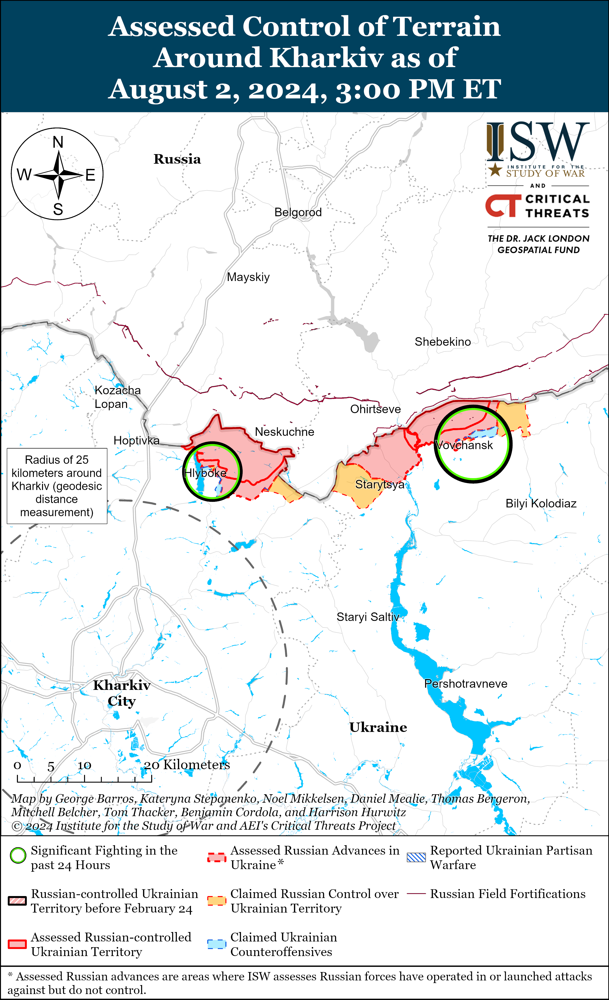
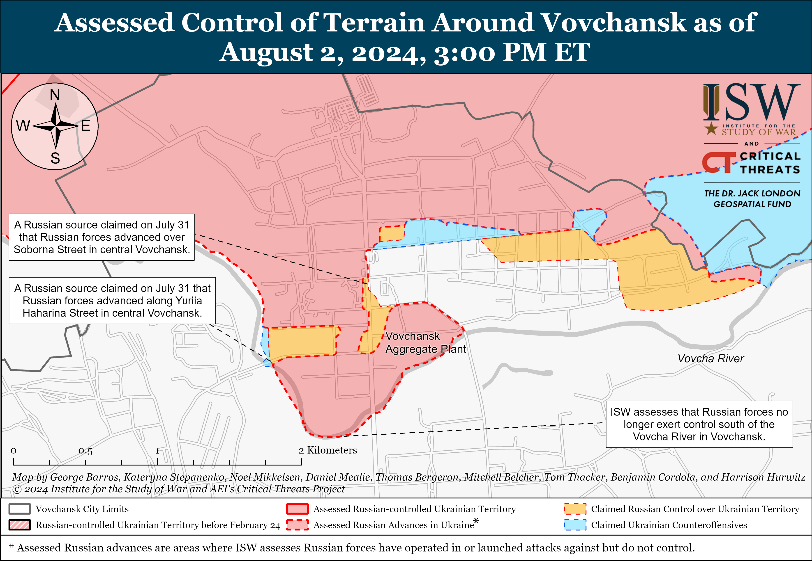
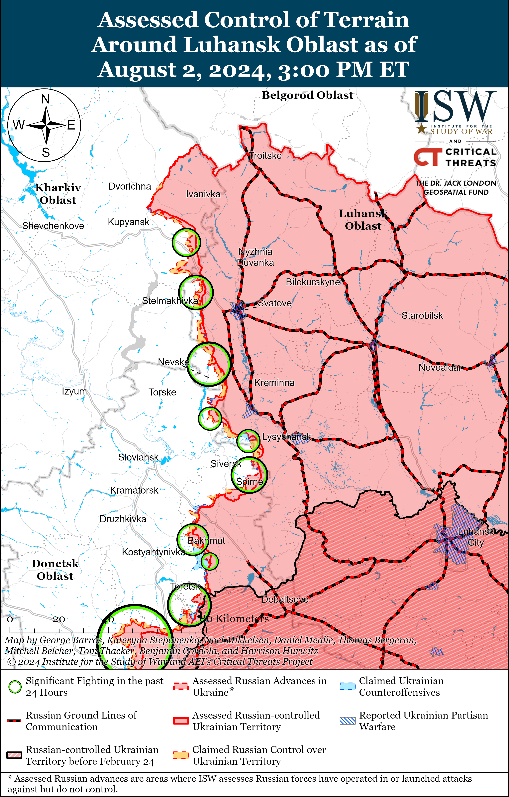
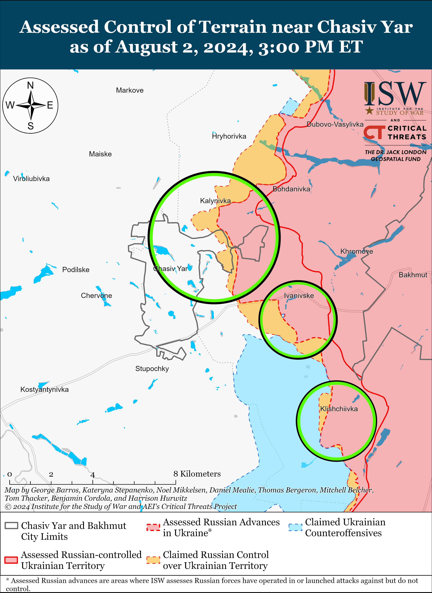
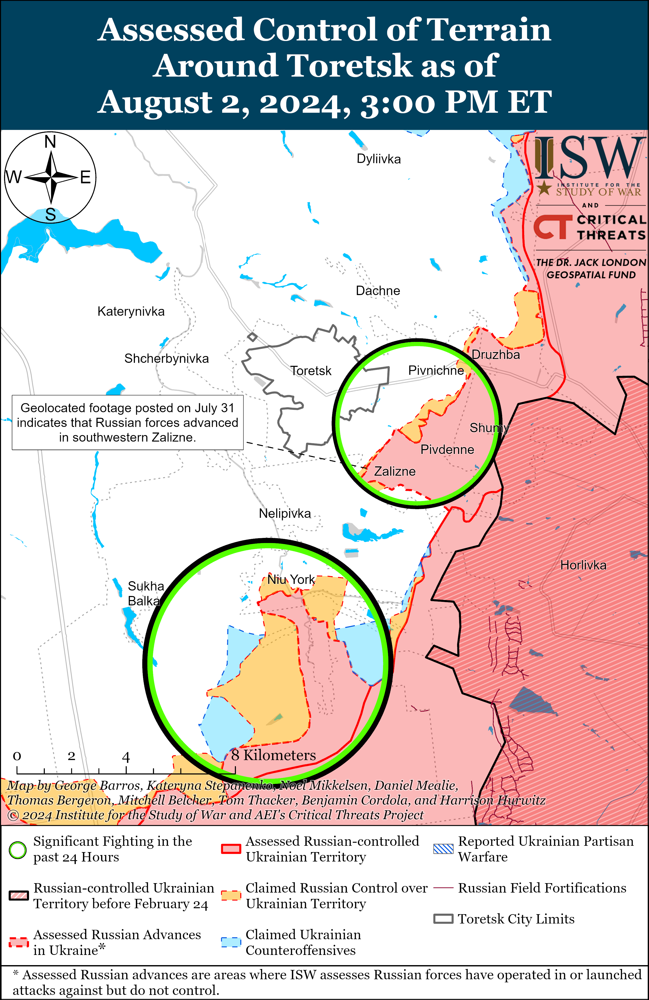
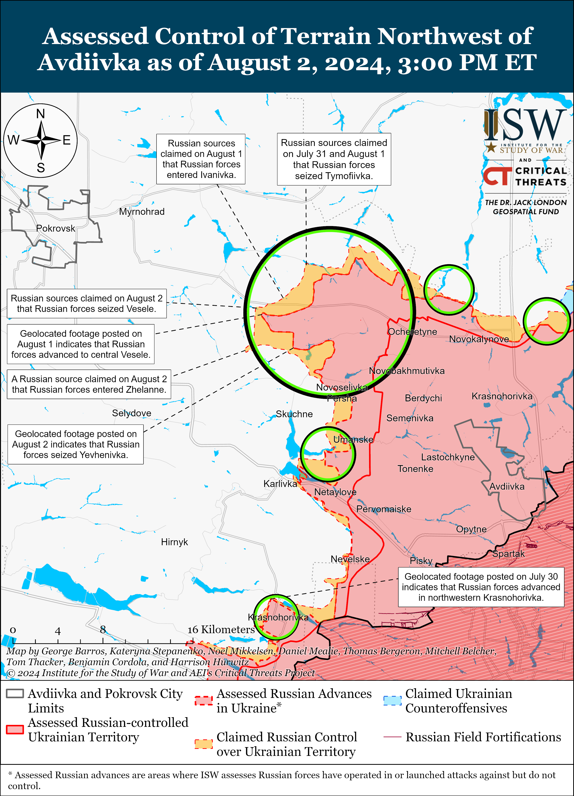
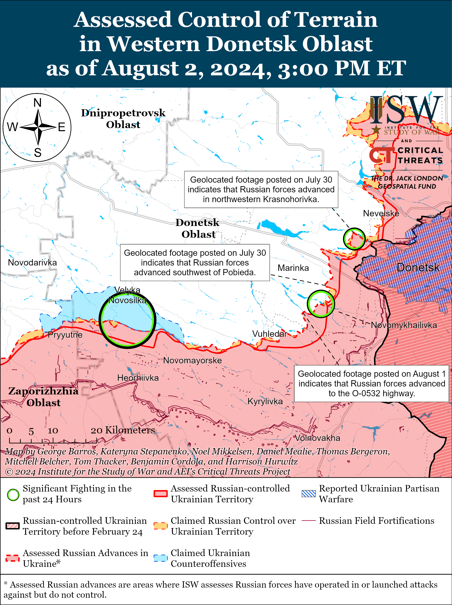
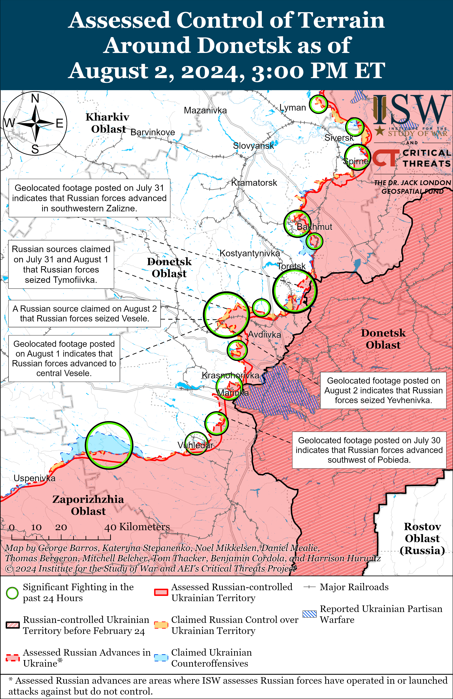
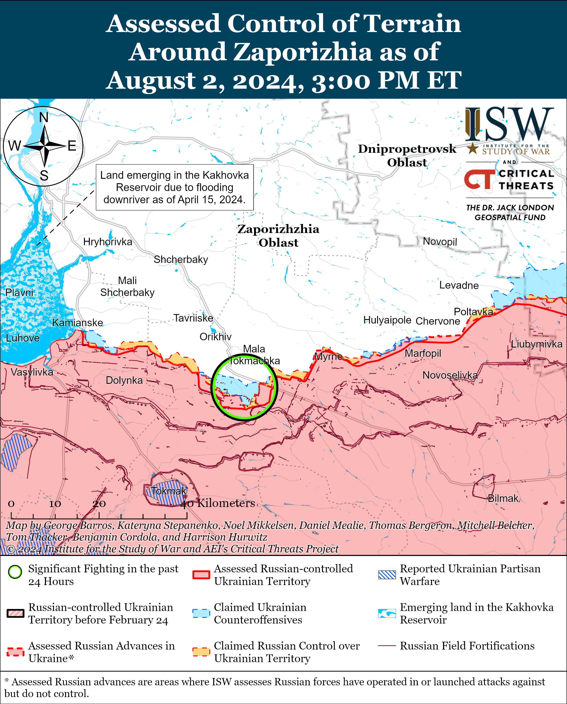
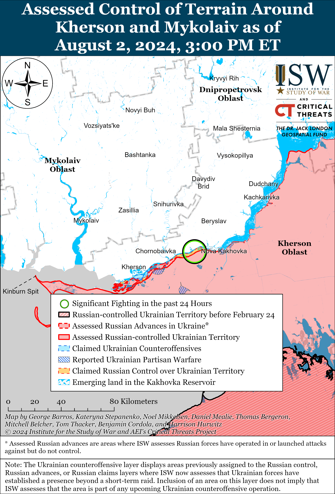

# Russian Offensive Campaign Assessment, August 2, 2024

**Angelica Evans, Riley Bailey, Karolina Hird, Davit Gasparyan, and Frederick W. Kagan**

**August 2, 2024, 5:55pm ET**

**Click**[**here**](https://storymaps.arcgis.com/stories/36a7f6a6f5a9448496de641cf64bd375)**to see ISW’s interactive map of the Russian invasion of Ukraine. This map is updated daily alongside the static maps present in this report.**

**Click**[**here**](https://understandingwar.maps.arcgis.com/apps/instant/3dviewer/index.html?appid=1602762dbcde419bb957dea358449580)**to see ISW’s 3D control of terrain topographic map of Ukraine. Use of a computer (not a mobile device) is strongly recommended for using this data-heavy tool.**

**Click**[**here**](https://storymaps.arcgis.com/stories/733fe90805894bfc8562d90b106aa895)**to access ISW’s archive of interactive time-lapse maps of the Russian invasion of Ukraine. These maps complement the static control-of-terrain map that ISW produces daily by showing a dynamic frontline. ISW will update this time-lapse map archive monthly.**

**Note: The data cut-off for this product was 12:00pm ET on August 2. ISW will cover subsequent reports in the August 3 Russian Offensive Campaign Assessment.**

**Ukrainian Joint Forces and Khortytsia Group of Forces Commander Brigadier General Andriy Hnatov stressed that Russia is pursuing an effort to force Ukraine to commit its available manpower to ongoing defensive operations in order to prevent the accumulation of Ukrainian resources for future counteroffensive operations.**Hnatov stated in an interview with Ukrainian outlet *Glavcom*published on August 2 that the Russian military command launched the offensive operation into northern Kharkiv Oblast in early May 2024 because it was concerned that Ukraine’s recent efforts to strengthen its force generation apparatus would allow Ukrainian forces to leverage newly generated manpower to stabilize the frontline and conduct counteroffensive operations.[1] Hnatov stated that Russian offensive operations in northern Kharkiv Oblast aimed to prevent Ukraine from building out reserves and addressing personnel shortages in already committed combat brigades by drawing Ukrainian forces to Kharkiv Oblast from elsewhere along the front, complicating rotations, and forcing Ukraine to commit newly generated forces to defensive operations in northern Kharkiv Oblast instead of offensive or defensive operations elsewhere in the theater.[2] Hnatov stated that Russia continues efforts to prevent Ukraine from accumulating the manpower necessary to conduct counteroffensive operations, consistent with ISW’s assessment that ongoing Russian offensive operations throughout eastern and northeastern Ukraine aim to degrade Ukraine’s ability to accumulate the manpower and materiel Ukraine requires to contest the battlefield initiative.[3] The Russian military command likely views retaining the theater-wide initiative as a strategic imperative and will continue efforts to sustain Russia’s current offensive tempo in Ukraine in order to constrain Ukraine’s ability to seize the initiative on select sectors of the frontline.[4]

**Russian Airborne (VDV) and “Dnepr” Group of Forces Commander Colonel General Mikhail Teplinsky addressed VDV forces in an article and recorded video on the 94th anniversary of the VDV’s formation on August 2, attempting to highlight the VDV’s performance in Ukraine as an elite professional force despite the fact that VDV elements are fighting essentially as understrength motorized rifle units in Ukraine.[5]**This is Teplinsky’s first appearance since Russian milbloggers began speculating that Teplinsky suffered serious injuries (or even may have died) in a Ukrainian strike on a Russian command post in occupied Kherson Oblast in late June. ISW remains unable to confirm whether Teplinsky was affected by the strike or even present when it occurred.[6] Teplinsky published an article in the Russian Ministry of Defense (MoD)’s official *Krasnaya Zvezda* newspaper, congratulating VDV forces on their 94th anniversary and for their role in the war in Ukraine, particularly emphasizing the VDV’s role in operations on the east (left) bank of the Dnipro River in Kherson Oblast.[7] Teplinsky also reported that during the war in Ukraine, 70 VDV personnel have received “Hero of Russia” awards; 71,000 VDV personnel have received state awards; and 32,000 VDV personnel have received departmental insignia. Russian military commanders will typically congratulate combat services on the anniversaries of their formations, but Teplinsky’s praise of the VDV is noteworthy after the VDV has suffered consistently high losses in Ukraine—the 83rd VDV Brigade recently sustained high casualties during offensive operations in northern Kharkiv Oblast, and the 104th VDV Division suffered substantial losses after its elements deployed to Krynky, Kherson Oblast in late 2023 with little to no training.[8] Over the course of the war, VDV forces have become so degraded that they are conducting the same attritional infantry-heavy frontal assault tactics as understrength motorized rifle units in Ukraine, despite the VDV’s prior reputation as an “elite force” before Russia’s full-scale invasion of Ukraine.[9] ISW previously assessed that the Russian military’s reliance on such assault tactics has largely eroded the distinctions between various Russian combat services and degraded the efficacy of Russian frontline troops, especially for once “elite” VDV forces.[10] Teplinsky’s speech and article emphasize that the Russian military command remains interested in preserving the VDV’s reputation as an elite fighting force.

**Russian authorities arrested the former deputy rear commander of the 144th Motorized Rifle Division (20th Combined Arms Army [CAA], Moscow Military District [MMD]) Colonel Dmitry Peshkov on August 2.**Russian state newswire TASS reported on August 2 that Russian law enforcement arrested and charged Peshkov for the embezzlement of food rations for Russian soldiers fighting in Ukraine, to which he pleaded not guilty.[11] Peshkov’s arrest is likely part of a concerted Kremlin effort to remove high-ranking Russian officials from the Russian Ministry of Defense (MoD), potentially to indirectly punish commanders for the failures of their troops or to maintain a cadre of loyal and compliant officers within the highest ranks of the Russian military.[12] Elements of the 144th Motorized Rifle Division have reportedly been conducting offensive operations in the Terny-Nevske area of Luhansk Oblast with limited success and have recently lost some territory to limited Ukrainian counterattacks in this area.[13]

**The Russian Federation Council passed an updated version of an amendment that will allow commanders to punish subordinates for “gross disciplinary offenses,” including the use of personal electronic devices, in frontline areas following significant backlash from Russian milbloggers.** The Russian Federation Council approved updated language on August 2 that clarifies that commanders cannot punish servicemembers for using personal devices to perform combat operations, such as using personal phones or tablets to operate reconnaissance or strike drones.[14] Russian milbloggers widely criticized the original version of the amendment for being out of touch with reality and failing to reflect Russian forces’ dependence on personal devices for command and control (C2) and drone operations, which prompted the Russian State Duma to revise the amendment.[15] It remains unclear if the Russian military command will be able or willing to enforce punishment for the use of personal devices for non-combat purposes in Ukraine, and the Russian military would likely find it extremely difficult to eliminate its dependence on insecure personal devices for many frontline tasks.[16]

**The Russian Federation Council also passed a series of bills strengthening the Russian government’s control over the Russian information space and further restricting the rights of migrants in Russia.**The Federation Council approved a series of bills on August 2, including bills requiring the owners of social media channels with over 10,000 subscribers to provide personally identifying information to Russian federal censor Roskomnadzor; limiting the number of SIM cards that foreigners can purchase; allowing the Russian government to terminate the naturalized citizenship of migrants who do not immediately register for military service; and further restricting migrants’ rights to open bank accounts, drive cars, get married, and purchase property in Russia.[17] ISW previously assessed that these proposed bills were intended to further Kremlin efforts to crack down against behavior in the Russian information space and within migrant communities that the Kremlin views as undesirable.[18]

**The pro-Kremlin Moldovan Victory opposition electoral bloc announced its candidate for the October 2024 Moldovan presidential election on August 2.**Victory bloc founder and US-sanctioned Moldovan politician Ilan Shor announced that the Victory bloc nominated Vasile Bolea to run in the Moldovan presidential election, and Bolea later announced that Shor-affiliated Moldovan parliament member Marina Tauber will be his Chief of Staff for the campaign.[19] The Victory bloc stated that Bolea’s election platform will prioritize restoring Moldova’s relations with Russia and the Russian-led Commonwealth of Independent States (CIS), ensuring Moldova’s accession to the Russian-led Eurasian Economic Union (EAEU) and BRICS, and increasing cooperation with the CIS and European Union (EU).[20] Bolea claimed that Moldova has more viable economic prospects and “a future” in its relationship with BRICS “unlike” its relationship with the EU and emphasized that his platform will promote “traditional values” and Eastern Orthodoxy.[21] Bolea is reportedly the elected chairperson of the Victory bloc’s parliamentary group and announced the creation of the bloc’s parliamentary group in May 2024.[22] Bolea has been a member of the Moldovan parliament since 2014 and was previously a member of Moldova’s Socialist and Revival parties.[23] Bolea appears to be running on a more openly pro-Russian platform than other Moldovan oppositionist presidential candidates, including former pro-Russian Moldovan president and current head of the Moldovan Socialist Party Igor Dodon’s candidate, former Moldovan Prosecutor General Alexandr Stoianoglo.[24] The Victory bloc’s decision to run its own presidential candidate suggests that Moldova’s pro-Russian opposition remain divided, which may challenge the Kremlin’s efforts to co-opt pro-Russian actors into its wider plans to destabilize Moldova and prevent Moldova’s accession to the EU.[25]

**Key Takeaways:**

- **Ukrainian Joint Forces and Khortytsia Group of Forces Commander Brigadier General Andriy Hnatov stressed that Russia is pursuing an effort to force Ukraine to commit its available manpower to ongoing defensive operations in order to prevent the accumulation of Ukrainian resources for future counteroffensive operations.**
- **Russian Airborne (VDV) and “Dnepr” Group of Forces Commander Colonel General Mikhail Teplinsky addressed VDV forces in an article and recorded video on the 94th anniversary of the VDV’s formation on August 2, attempting to highlight the VDV’s performance in Ukraine as an elite professional force despite the fact that VDV elements are fighting essentially as understrength motorized rifle units in Ukraine.**
- **Russian authorities arrested the former deputy rear commander of the 144th Motorized Rifle Division (20th Combined Arms Army [CAA], Moscow Military District [MMD]) Colonel Dmitry Peshkov on August 2.**
- **The Russian Federation Council passed an updated version of an amendment that will allow commanders to punish subordinates for “gross disciplinary offenses,” including the use of personal electronic devices, in frontline areas following significant backlash from Russian milbloggers.**
- **The Russian Federation Council also passed a series of bills strengthening the Russian government’s control over the Russian information space and further restricting the rights of migrants in Russia.**
- **The pro-Kremlin Moldovan Victory opposition electoral bloc announced its candidate for the October 2024 Moldovan presidential election on August 2.**
- **Russian forces recently advanced near Toretsk, Avdiivka, and Donetsk City.**
- **A Russian government official weighed in on ongoing milblogger criticism of Russia’s drone production industry.**
- **A delegation of Kremlin officials visited occupied Zaporizhia and Kherson oblasts on August 2 to highlight Russian efforts to integrate occupied Ukraine into the Russian Federation.**

***We do not report in detail on Russian war crimes because these activities are well-covered in Western media and do not directly affect the military operations we are assessing and forecasting. We will continue to evaluate and report on the effects of these criminal activities on the Ukrainian military and the Ukrainian population and specifically on combat in Ukrainian urban areas. We utterly condemn Russian violations of the laws of armed conflict and the Geneva Conventions and crimes against humanity even though we do not describe them in these reports.***

- Russian Main Effort – Eastern Ukraine (comprised of three subordinate main efforts)
- Russian Subordinate Main Effort #1 – Push Ukrainian forces back from the international border with Belgorod Oblast and approach to within tube artillery range of Kharkiv City
- Russian Subordinate Main Effort #2 – Capture the remainder of Luhansk Oblast and push westward into eastern Kharkiv Oblast and encircle northern Donetsk Oblast
- Russian Subordinate Main Effort #3 – Capture the entirety of Donetsk Oblast
- Russian Supporting Effort – Southern Axis
- Russian Air, Missile, and Drone Campaign
- Russian Mobilization and Force Generation Efforts
- Russian Technological Adaptations
- Activities in Russian-occupied areas
- Ukrainian Defense Industrial Base Efforts
- Russian Information Operations and Narratives
- Significant Activity in Belarus

**Russian Main Effort – Eastern Ukraine**

**Russian Subordinate Main Effort #1 – Kharkiv Oblast (Russian objective: Push Ukrainian forces back from the international border with Belgorod Oblast and approach to within tube artillery range of Kharkiv City)**

Fighting continued north of Kharkiv City near Hlyboke and Lyptsi and northeast of Kharkiv City near Vovchansk and Tykhe on August 1 and 2, but there were no confirmed changes to the frontline.[26] Russian milbloggers claimed that Ukrainian forces recently lost positions in Vovchansk and that Ukrainian forces are trying to reach the eastern edge of the Vovchansk Aggregate Plant and maintain positions in the western part of the facility.[27] The Ukrainian Kharkiv Group of Forces reported on August 2 that Russian forces are most active within Vovchansk and conducted evacuations and internal rotations at advanced positions in the settlement.[28] Elements of the Russian 83rd Airborne (VDV) Brigade are reportedly operating in northern Kharkiv Oblast.[29]

**Russian Subordinate Main Effort #2 – Luhansk Oblast (Russian objective: Capture the remainder of Luhansk Oblast and push westward into eastern Kharkiv Oblast and northern Donetsk Oblast)**

The Ukrainian General Staff reported that Russian forces continued offensive operations southeast of Kupyansk near Pishchane, Stelmakhivka, and Andriivka and northwest of Kreminna near Makiivka, Nevske, and Torske on August 1 and 2, but there were no confirmed changes to the frontline.[30] A Ukrainian battalion commander operating along the Kupyansk-Svatove-Kreminna line reported on August 2 that Russian forces have recently intensified assaults near Makiivka and are advancing in the area.[31] The battalion commander stated that the Russian military command may have recently transferred additional manpower and material to the area.

**Russian Subordinate Main Effort #3 – Donetsk Oblast (Russian objective: Capture the entirety of Donetsk Oblast, the claimed territory of Russia’s proxies in Donbas)**

Russian forces continued offensive operations in the Siversk direction east of Siversk near Verkhnokamyanske; southeast of Siversk near Ivano-Dariivka, Vyimka, and Spirne; and south of Siversk near Pereizne on August 1 and 2.[32] The Russian Ministry of Defense (MoD) posted footage on August 2 purporting to show elements of the Russian 106th Airborne (VDV) Division seizing several positions near Pereizne.[33]

Russian forces continued offensive operations near Chasiv Yar on August 2, but there were no confirmed changes to the frontline. A Russian milblogger claimed that Russian forces advanced northwest of Klishchiivka (southeast of Chasiv Yar), although ISW has not observed confirmation of this claim.[34] Russian forces continued offensive operations near Novyi and Zhovtnevyi microraions in eastern Chasiv Yar, north of Chasiv Yar in the direction of Hryhorivka, east of Chasiv Yar near Ivanivske, and southeast of Chasiv Yar near Klishchiivka and Andriivka on August 1 and 2.[35] Elements of the Russian “Burevestnik” volunteer detachment (Russian Volunteer Corps) are reportedly operating near Chasiv Yar.[36]

Russian forces recently advanced near Toretsk and continued offensive operations in the area on August 2. Geolocated footage published on August 1 indicates that Russian forces recently advanced in central Niu York (south of Toretsk), and a Russian milblogger claimed that Russian forces advanced further northward in the center of the settlement.[37] A Russian milblogger claimed that Ukrainian forces successfully counterattacked in central Niu York and captured an unspecified number of Russian personnel, although ISW has not observed wider reporting or confirmation of this claim.[38] Geolocated footage published on August 2 indicates that Russian forces recently advanced in southwestern Zalizne (southeast of Toretsk), and a Russian milblogger claimed that Russian forces advanced further towards the southwestern outskirts of the settlement.[39] Russian milbloggers claimed that Russian forces also advanced in Druzhba (east of Toretsk) and that Russian forces are attempting to encircle Ukrainian forces at limited positions between Niu York and Zalizne.[40] Russian advances in Zalizne and Russian advances in Niu York are roughly five kilometers apart and Russian forces will likely attempt to tactically encircle Ukrainian forces in the area. ISW is not assessing that an attempted Russian encirclement will necessarily succeed. Possible Russian advances southwest of Zalizne or north of Niu York may pressure Ukrainian forces to withdraw from positions between Zalizne and Toretsk. Russian forces also continued offensive operations east of Toretsk near Pivnichne and southwest of Toretsk near Panteleymonivka on August 1 and 2.[41] Elements of the Russian 9th Motorized Rifle Brigade (1st Donetsk People’s Republic [DNR] Army Corps [AC]) are reportedly operating near Niu York.[42]

Russian forces recently advanced northwest of Avdiivka and reportedly made additional gains in the area on August 2. Geolocated footage published on August 2 indicates that Russian forces advanced along windbreaks south of Vovche (northwest of Avdiivka), and Russian mibloggers claimed that Russian forces advanced in fields west of the settlement.[43] Russian milbloggers claimed that Russian forces operating northwest of Avdiivka advanced in fields southwest of Tymofiivka and Prohres and entered southeastern Ivanivka.[44] A Russian milblogger claimed that Russian forces also advanced into western Zhelanne (northwest of Avdiivka).[45] Russian forces continued offensive operations north of Avdiivka near Kalynove; northwest of Avdiivka near Vozdvyzhenka, Novooleksandrivka, Ivanivka, Zhelanne, Serhiivka, Svyrydonivka, Tymofiivka, Lysychne, Prohres, and Novoselivka Persha; and west of Avdiivka near Yasnobrodivka on August 1 and 2.[46] Elements of the Russian 27th Motorized Rifle Division (2nd Combined Arms Army [CAA], Central Military District [CMD]) are reportedly operating in the Pokrovsk direction (west of Avdiivka).[47]

Russian forces have achieved their longstanding tactical objective of reaching the O-0532 highway and cutting the Ukrainian ground line of communication (GLOC) connecting Vuhledar and Kostyantynivka (both southwest of Donetsk City), but Russian positions along the highway likely do not portend tactically significant or more rapid Russian gains in the area. Geolocated footage published on August 1 indicates that Russian forces recently advanced up to and seized a section of the O-0532 highway southwest of Kostyantynivka.[48] Russian milbloggers claimed that elements of the Russian 68th AC (Eastern Military District [EMD]) seized the positions along the highway and that elements of the Russian 57th Motorized Rifle Brigade (6th Motorized Rifle Division, 3rd AC) are approaching another section of the highway near Vodyane (southwest of Donetsk City).[49] Russian sources have long identified interdicting the highway and disrupting Ukrainian ground lines of communication (GLOCs) into Vuhledar as a primary tactical objective southwest of Donetsk City and have speculated that this would allow Russian forces to force Ukrainian forces to withdraw from positions in and around Vuhledar.[50] Russian forces have recently intensified offensive operations southwest of Donetsk City and have conducted several costly battalion-sized mechanized assaults in the area.[51] Russian advances up to the Vuhledar-Kostyantynivka highway are likely a result of this intensified Russian offensive effort, but Russian gains southwest of Donetsk City continue to be gradual. Ukrainian forces have other GLOCs leading into Vuhledar and the interdiction of the O-0532 highway does not decisively degrade Ukraine’s ability to maintain and supply positions in the immediate Vuhledar area.

Russian forces reportedly advanced elsewhere southwest of Donetsk City amid continued Russian offensive operations west and southwest of Donetsk City on August 2. A Russian milblogger claimed that Russian forces advanced in fields south of Pobieda (southwest of Donetsk City), although ISW has not observed confirmation of this claim. Russian forces continued offensive operations west of Donetsk City near Krasnohorivka and southwest of Donetsk City near Paraskoviivka and Kostyantynivka on August 1 and 2.[52]

Positional engagements continued in the direction of Velyka Novosilka in the Donetsk-Zaporizhia Oblast border area on August 2.[53] A Russian milblogger claimed that Russian forces recently advanced near Urozhaine (south of Velyka Novosilka), but ISW has not observed visual confirmation of this claim.[54] Elements of the Russian 394th Motorized Rifle Regiment (127th Motorized Rifle Division, 5th CAA, Southern Military District [SMD]) are reportedly operating in the south Donetsk direction (southwest of Donetsk City through the Donetsk-Zaporizhia Oblast border area).[55]

**Russian Supporting Effort – Southern Axis (Russian objective: Maintain frontline positions and secure rear areas against Ukrainian strikes)**

Limited positional engagements continued in western Zaporizhia Oblast near Robotyne, Mala Tokmachka (northeast of Robotyne), and Verbove (east of Robotyne) on August 1 and 2.[56] Some milbloggers claimed that Russian forces seized several Ukrainian positions near Robotyne and Mala Tokmachka, but ISW has not observed visual confirmation of Russian gains in either of these areas.[57]

Russian forces continued limited ground attacks in east (left) bank Kherson Oblast, including near Krynky, on August 2, but did not make any confirmed advances.[58] Personnel of the 24th Motorized Rifle Regiment (70th Motorized Rifle Division, 18th Combined Arms Army [CAA], Southern Military District [SMD]) are reportedly complaining about pervasive Ukrainian drone use in the Kherson direction.[59]

Russian sources claimed that Ukrainian forces conducted a likely MGM-140 ATACMS strike against occupied Sevastopol, Crimea, on August 2.[60] Sevastopol occupation governor Mikhail Razvozhaev claimed that Russian air defenses repelled a “massive” attack and shot down more than four missiles over Sevastopol.[61] Russian sources also claimed that an undetonated cluster munition from one of the downed missiles fell on a street in Sevastopol and reported that occupation law enforcement services are trying to detonate and destroy the munition.[62] NASA’s Fire Information for Resource Management (FIMRS) data shows two distinct heat signatures near the coast south of Sevastopol, where a Ukrainian source noted that a known Russian S-400 air defense battery is located.[63] ISW cannot independently confirm the alleged strike on the S-400 battery at this time.

**Russian Air, Missile, and Drone Campaign (Russian Objective: Target Ukrainian military and civilian infrastructure in the rear and on the frontline)**

Nothing significant to report.

**Russian Mobilization and Force Generation Efforts (Russian objective: Expand combat power without conducting general mobilization)**

A Russian government official addressed ongoing milblogger criticism of Russia’s drone production industry. Former Roscosmos (Russian space agency) head and Zaporizhia Oblast occupation senator Dmitri Rogozin claimed on August 1 that the Russian Ministry of Defense (MoD) should encourage greater competition and variety among drone production initiatives.[64] Russian milbloggers recently reiterated complaints about the Russian state “Sudoplatov” volunteer drone initiative for supposedly providing Russian forces with cheap and defective first-person view (FPV) drones.[65]

The Russian Federation Council approved a bill on August 2 allowing employers to directly transfer information about their employees who are eligible for military service to military registration and enlistment offices as part of ongoing efforts to address Russia’s manpower requirements.[66]

**Russian Technological Adaptations (Russian objective: Introduce technological innovations to optimize systems for use in Ukraine)**

The People’s Front’s “Kulibin Club” drone and electronic warfare (EW) production initiative told Kremlin newswire TASSon July 31 that the initiative delivered the first batch of “Varan” unmanned ground vehicles (UGVs) to Russian forces in Ukraine.[67] The “Varan” UGV can reportedly pull cargo weighing up to 1.5 tons and can evacuate wounded personnel from frontline areas. Russian forces can also equip the UGV with EW systems, machine guns, or mine-clearing equipment.

**Ukrainian Defense Industrial Efforts (Ukrainian objective: Develop its defense industrial base to become more self-sufficient in cooperation with US, European, and international partners)**

*ISW is not publishing coverage of Ukrainian defense industrial efforts today.*

**Activities in Russian-occupied areas (Russian objective: Consolidate administrative control of annexed areas; forcibly integrate Ukrainian citizens into Russian sociocultural, economic, military, and governance systems)**

A delegation of Kremlin officials visited occupied Zaporizhia and Kherson oblasts on August 2 to highlight Russian efforts to integrate occupied Ukraine into the Russian Federation. Russian First Deputy Head of the Presidential Administration Sergei Kiriyenko and Russian Health Minister Mikhail Murashko visited a hospital in occupied Oleshky, Kherson Oblast, on August 2 and spoke about Russian federal modernization efforts at the hospital.[68] Kiriyenko also met with Zaporizhia Oblast occupation head Yevgeny Balitsky in occupied Berdyansk and visited the “Mayak” education center.[69] ISW has previously observed that Kiriyenko appears to be one of the main Kremlin officials directly involved in administering the occupation of Ukraine and has personally spearheaded infrastructure and sociocultural projects throughout occupied territories.[70]

Russian occupation officials continue coercive passportization efforts in occupied Ukraine, including by withholding healthcare and other basic services. The Ukrainian Resistance Center reported on August 2 that Russian occupation authorities have introduced mandatory fluorography exams (chest x-rays, often used to diagnose tuberculosis) in some areas of occupied Ukraine but have made Russian passports and Russian health insurance requirements for receiving the mandatory health screenings.[71] Russian federal law requires documentation of Russian citizenship and Russian health insurance to receive a fluorography exam domestically, but the apparent application of this law to territories that Russia illegally occupies is a clear case of Russian occupation authorities using access to healthcare as a coercive device.[72] The Office of the Permanent Representative of the Ukrainian President’s Office in occupied Crimea noted on August 2 that Russian occupation authorities have been withholding access to basic services to residents of occupied Crimea without Russian passports for over a decade.[73] ISW has reported at length on Russian efforts to use access to healthcare, education, employment, and basic utilities to force residents of occupied Ukraine into getting Russian passports.[74]

**Russian Information Operations and Narratives**

Independent Ukrainian media organization *Texty.org.ua*published the results of an investigation on August 1 that found that over 2,000 TikTok accounts were participating in the propagation of a Russian information operation meant to discredit the Ukrainian government and military.[75] *Texty’s*research found that by the end of July, the hashtag “tsenemoyaukraina” (this is not my Ukraine) was one of the top three hashtags on Tiktok’s Creative Center for Ukraine, had been featured in over 41,000 posts, and had over 10 million views.[76]*Texty* noted that posts associated with this hashtag were spreading disinformation about Ukrainian regional mobilization processes and that bot accounts were disseminating all of the posts. Several Ukrainian and Western investigations in recent months have found that Kremlin-affiliated actors are increasingly using TikTok to spread information operations aimed at propagating pro-Russian narratives and discouraging support for Ukraine, both within Ukraine and in the West.[77]

A Russian milblogger deliberately misrepresented the results of a recent public opinion poll conducted by the Ukrainian National Democratic Institute and Kyiv International Institute of Sociology. The milblogger claimed that the results of the survey show that a majority (57 percent) of Ukrainians are in favor of starting negotiations with Russia and used this false presentation of the results of the survey to claim that the West is controlling Ukrainian decision-making in its favor.[78] The survey found that while 57 percent of respondents are in favor of Ukraine entering into negotiations with Russia, the majority of that 57 percent believe that Ukraine should enter into negotiations with clear conditions that Ukraine will not make any territorial concessions and will reject Russia’s demands for Ukraine to renounce its NATO or EU membership aspirations.[79] This survey is consistent with the results of a Ukrainian survey published on July 15, which found that Ukrainians widely reject Russia’s demands for Ukrainian capitulation.[80]

A prominent Kremin-affiliated miblogger amplified several Russian narratives on August 1 and 2 complaining about waning Russian influence in Central Asia and the Caucasus and alleged American efforts to co-opt countries in these regions.[81] The milblogger particularly derided the alleged declining prevalence and sociocultural influence of Russian-run “Slavic” universities in Armenia, Kyrgyzstan, and Tajikistan and claimed that this has allowed for the growth of “Russophobic” sentiments in these countries.[82]

**Significant activity in Belarus (Russian efforts to increase its military presence in Belarus and further integrate Belarus into Russian-favorable frameworks and Wagner Group activity in Belarus)**

Nothing significant to report.

**Note: ISW does not receive any classified material from any source, uses only publicly available information, and draws extensively on Russian, Ukrainian, and Western reporting and social media as well as commercially available satellite imagery and other geospatial data as the basis for these reports. References to all sources used are provided in the endnotes of each update.**

---

[1] https://glavcom dot ua/longreads/heneral-andrij-hnatov-pershe-intervju-komanduvacha-objednanimi-silami-zsu-1013191.html

[2] https://glavcom dot ua/longreads/heneral-andrij-hnatov-pershe-intervju-komanduvacha-objednanimi-silami-zsu-1013191.html

[3] https://glavcom dot ua/longreads/heneral-andrij-hnatov-pershe-intervju-komanduvacha-objednanimi-silami-zsu-1013191.html ; https://understandingwar.org/backgrounder/russian-offensive-campaign-assessment-june-7-2024 ; https://understandingwar.org/backgrounder/russian-offensive-campaign-assessment-june-30-2024

[4] https://understandingwar.org/backgrounder/russian-offensive-campaign-assessment-june-7-2024 ; https://understandingwar.org/backgrounder/russian-offensive-campaign-assessment-june-30-2024 ; https://understandingwar.org/backgrounder/how-delays-western-aid-gave-russia-initiative-ukrainian-counteroffensive-kharkiv

[5] https://tass dot ru/armiya-i-opk/21513369 ; https://t.me/tass\_agency/263945 ; http://redstar dot ru/voiny-desantniki-dorogie-veterany-vozdushno-desantnyh-vojsk/ ; https://news dot rambler.ru/army/53184680-za-vremya-svo-zvaniya-geroya-rossii-byli-udostoeny-70-voennosluzhaschih-vdv/ ; https://isw.pub/UkrWar063024; https://understandingwar.org/backgrounder/russia%E2%80%99s-military-restructuring-and-expansion-hindered-ukraine-war

[6] https://t.me/dosye\_shpiona/554; https://x.com/GirkinGirkin/status/1815995204270281001

[7] http://redstar dot ru/voiny-desantniki-dorogie-veterany-vozdushno-desantnyh-vojsk/

[8] https://understandingwar.org/backgrounder/russian-offensive-campaign-assessment-june-28-2024; https://www.forbes.com/sites/davidaxe/2024/06/27/the-russians-may-have-lost-an-entire-airborne-brigade-in-vovchansk/; https://isw.pub/UkrWar123123; https://isw.pub/UkrWar122323

[9] https://isw.pub/UkrWar062024; https://understandingwar.org/backgrounder/russian-offensive-campaign-assessment-september-28; https://understandingwar.org/backgrounder/russia%E2%80%99s-military-restructuring-and-expansion-hindered-ukraine-war

[10] https://isw.pub/UkrWar062024

[11] https://t.me/tass\_agency/264129 ; https://www.rbc dot ru/society/02/08/2024/66acfe319a79478127057353

[12] https://understandingwar.org/backgrounder/russian-offensive-campaign-assessment-july-26-2024 ; https://isw.pub/UkrWar052324 ; https://isw.pub/UkrWar042424; https://isw.pub/UkrWar051624; https://understandingwar.org/backgrounder/russian-offensive-campaign-assessment-may-15-2024; https://isw.pub/UkrWar052124

[13] https://understandingwar.org/backgrounder/russian-offensive-campaign-assessment-july-30-2024

[14] https://tass dot ru/obschestvo/21516279

[15] https://isw.pub/UkrWar072324 ; https://isw.pub/UkrWar072424 ; https://understandingwar.org/backgrounder/russian-offensive-campaign-assessment-july-31-2024

[16] https://understandingwar.org/backgrounder/russian-offensive-campaign-assessment-july-31-2024 ; https://isw.pub/UkrWar072324; https://isw.pub/UkrWar072424

[17] https://t.me/tass\_agency/264036 ; https://t.me/tass\_agency/264037 ; https://t.me/tass\_agency/264009  ; https://t.me/tass\_agency/264020

[18] https://isw.pub/UkrWar072924

[19] https://t.me/tass\_agency/263997 ; https://tass dot ru/mezhdunarodnaya-panorama/21514915 ; https://t.me/ilanshor/5157 ; https://www.ipn dot md/en/vasile-bolea-to-run-for-office-of-president-8013\_1106200.html ; https://t.me/ro\_newsmakerlive/50273

[20] https://t.me/victorie\_blocul/2653

[21] https://t.me/victorie\_blocul/2669 ; https://t.me/vasilebolea/1194 ; https://www.infotag dot md/politics-en/317999/

[22] https://canal5 dot md/ru/2024/05/16/frakcija-pds-v-parlamente-otkazalas-registrirovat-novyj-politicheskij-blok-victoria-pobeda-otvet-deputata-vasile-bolea-igorju-grosu-video/

[23] https://www.ipn dot md/en/vasile-bolea-portrait-of-candidate-for-mayor-of-chisinau-8012\_1100217.html ; https://newsmaker dot md/ro/socialistii-se-reinventeaza-dupa-discutiile-cu-ilan-sor-deputatii-vasile-bolea-si-alexandr-suhodolskii-au-aderat-la-partidul-renasterea/

[24] https://carnegieendowment.org/russia-eurasia/politika/2024/07/moldova-opposition-stoianoglo-sandu?lang=en ; https://moldova1 dot md/p/31755/ex-prosecutor-general-alexandr-stoianoglo-the-candidate-of-the-socialists-for-the-presidency

[25] https://understandingwar.org/backgrounder/russian-offensive-campaign-assessment-june-17-2024 ; https://isw.pub/UkrWar061424 ; https://isw.pub/UkrWar042724 ; https://isw.pub/UkrWar042124 ; https://isw.pub/UkrWar022724

[26]https://www.facebook.com/GeneralStaff.ua/posts/pfbid02AKE4rYzPTv3LkQPkTgadVMjCCJUxuwCEkySotgX9UhrmDRK4WhFpSjSUAQh2JGgil ; https://www.facebook.com/GeneralStaff.ua/posts/pfbid0N7eUMtp8zTr8ztixshxvC32jye6zriCsSug1jUJvCzMKw7NuJ3F8fgBVExzTuioAl ; https://t.me/Sladkov\_plus/11089

[27] https://t.me/wargonzo/21340 ; https://t.me/DnevnikDesantnika/13300

[28] https://t.me/otukharkiv/524

[29] https://t.me/rusich\_army/16204

[30] https://www.facebook.com/GeneralStaff.ua/posts/pfbid02AKE4rYzPTv3LkQPkTgadVMjCCJUxuwCEkySotgX9UhrmDRK4WhFpSjSUAQh2JGgil  ; https://www.facebook.com/GeneralStaff.ua/posts/pfbid02uV6zH1PmKf9sBvZLURpAWJP8RtTWEDarrBUQUk12ECJtMgtpvoPAzXrXBeqZAWzl ; https://www.facebook.com/GeneralStaff.ua/posts/pfbid0N7eUMtp8zTr8ztixshxvC32jye6zriCsSug1jUJvCzMKw7NuJ3F8fgBVExzTuioAl

[31] https://www.youtube.com/watch?v=cHpZglgu3PM ; https://focus dot ua/voennye-novosti/661071-okkupanty-nastupayut-na-flangah-i-imeyut-uspehi-vozle-makeevki-kombat-3-oshbr-video

[32] https://www.facebook.com/GeneralStaff.ua/posts/pfbid02uV6zH1PmKf9sBvZLURpAWJP8RtTWEDarrBUQUk12ECJtMgtpvoPAzXrXBeqZAWzl ; https://www.facebook.com/GeneralStaff.ua/posts/pfbid0N7eUMtp8zTr8ztixshxvC32jye6zriCsSug1jUJvCzMKw7NuJ3F8fgBVExzTuioAl

[33] https://t.me/mod\_russia/41665

[34] https://t.me/motopatriot/25769

[35] https://www.facebook.com/GeneralStaff.ua/posts/pfbid02AKE4rYzPTv3LkQPkTgadVMjCCJUxuwCEkySotgX9UhrmDRK4WhFpSjSUAQh2JGgil ; https://www.facebook.com/GeneralStaff.ua/posts/pfbid0N7eUMtp8zTr8ztixshxvC32jye6zriCsSug1jUJvCzMKw7NuJ3F8fgBVExzTuioAl ; https://www.facebook.com/GeneralStaff.ua/posts/pfbid02uV6zH1PmKf9sBvZLURpAWJP8RtTWEDarrBUQUk12ECJtMgtpvoPAzXrXBeqZAWzl ; https://t.me/rusich\_army/16175; https://t.me/rybar/62367

[36] https://t.me/wargonzo/21338

[37] https://t.me/WarArchive\_ua/17909; https://t.me/skalabatalion/215; https://t.me/motopatriot/25735

[38] https://t.me/motopatriot/25735

[39] https://x.com/giK1893/status/1819391798411677982; https://t.me/voron1OO/46; https://x.com/EerikMatero/status/1819394712014348536; https://t.me/creamy\_caprice/6229; https://t.me/creamy\_caprice/6228; https://t.me/z\_arhiv/27493

[40] https://t.me/milinfolive/127397 ; https://t.me/DnevnikDesantnika/13299

[41] https://www.facebook.com/GeneralStaff.ua/posts/pfbid02AKE4rYzPTv3LkQPkTgadVMjCCJUxuwCEkySotgX9UhrmDRK4WhFpSjSUAQh2JGgil ; https://www.facebook.com/GeneralStaff.ua/posts/pfbid0N7eUMtp8zTr8ztixshxvC32jye6zriCsSug1jUJvCzMKw7NuJ3F8fgBVExzTuioAl ; https://www.facebook.com/GeneralStaff.ua/posts/pfbid02uV6zH1PmKf9sBvZLURpAWJP8RtTWEDarrBUQUk12ECJtMgtpvoPAzXrXBeqZAWzl

[42] https://t.me/wargonzo/21353

[43] https://t.me/Khortytsky\_wind/834; https://t.me/creamy\_caprice/6227; https://t.me/rybar/62369; https://t.me/motopatriot/25764

[44] https://t.me/rybar/62369; https://t.me/motopatriot/25764

[45] http://t.me/z\_arhiv/27485

[46] https://www.facebook.com/GeneralStaff.ua/posts/pfbid02AKE4rYzPTv3LkQPkTgadVMjCCJUxuwCEkySotgX9UhrmDRK4WhFpSjSUAQh2JGgil ; https://www.facebook.com/GeneralStaff.ua/posts/pfbid0N7eUMtp8zTr8ztixshxvC32jye6zriCsSug1jUJvCzMKw7NuJ3F8fgBVExzTuioAl ; https://www.facebook.com/GeneralStaff.ua/posts/pfbid02uV6zH1PmKf9sBvZLURpAWJP8RtTWEDarrBUQUk12ECJtMgtpvoPAzXrXBeqZAWzl ; https://t.me/rybar/62369 ; https://t.me/dva\_majors/48615 ; https://t.me/milinfolive/127364

[47] https://t.me/motopatriot/25736

[48] https://x.com/creamy\_caprice/status/1819135784537968793; https://t.me/creamy\_caprice/6224; https://t.me/Fab\_1500/121

[49] https://t.me/z\_arhiv/27489 ; https://t.me/boris\_rozhin/132088 ; https://t.me/rybar/62373 ; https://t.me/voin\_dv/10068

[50] https://understandingwar.org/backgrounder/russian-offensive-campaign-assessment-july-25-2024

[51] https://understandingwar.org/backgrounder/russian-offensive-campaign-assessment-july-25-2024 ; https://isw.pub/UkrWar073024

[52] https://www.facebook.com/GeneralStaff.ua/posts/pfbid02AKE4rYzPTv3LkQPkTgadVMjCCJUxuwCEkySotgX9UhrmDRK4WhFpSjSUAQh2JGgil ; https://www.facebook.com/GeneralStaff.ua/posts/pfbid0N7eUMtp8zTr8ztixshxvC32jye6zriCsSug1jUJvCzMKw7NuJ3F8fgBVExzTuioAlV ; https://www.facebook.com/GeneralStaff.ua/posts/pfbid02uV6zH1PmKf9sBvZLURpAWJP8RtTWEDarrBUQUk12ECJtMgtpvoPAzXrXBeqZAWzl

[53] https://www.facebook.com/GeneralStaff.ua/posts/pfbid02AKE4rYzPTv3LkQPkTgadVMjCCJUxuwCEkySotgX9UhrmDRK4WhFpSjSUAQh2JGgil

[54] https://t.me/voin\_dv/10068

[55] https://t.me/voin\_dv/10070

[56] https://www.facebook.com/GeneralStaff.ua/posts/pfbid0N7eUMtp8zTr8ztixshxvC32jye6zriCsSug1jUJvCzMKw7NuJ3F8fgBVExzTuioAl; https://www.facebook.com/GeneralStaff.ua/posts/pfbid02uV6zH1PmKf9sBvZLURpAWJP8RtTWEDarrBUQUk12ECJtMgtpvoPAzXrXBeqZAWzl; https://t.me/wargonzo/21340

[57] https://t.me/dva\_majors/48615; https://t.me/DnevnikDesantnika/13317 ; https://t.me/dva\_majors/48638

[58] https://www.facebook.com/GeneralStaff.ua/posts/pfbid02AKE4rYzPTv3LkQPkTgadVMjCCJUxuwCEkySotgX9UhrmDRK4WhFpSjSUAQh2JGgil; https://www.facebook.com/GeneralStaff.ua/posts/pfbid0N7eUMtp8zTr8ztixshxvC32jye6zriCsSug1jUJvCzMKw7NuJ3F8fgBVExzTuioAl

[59] https://t.me/dva\_majors/48603

[60] ttps://t.me/tass\_agency/263956 ; https://t.me/tass\_agency/263957 ; https://t.me/tass\_agency/263958 ; https://t.me/tass\_agency/263963 ; https://t.me/tass\_agency/263964; https://t.me/tass\_agency/264027; https://t.me/RVvoenkor/73791; https://t.me/RVvoenkor/73790; https://t.me/RVvoenkor/73789; https://x.com/666\_mancer/status/1819337274640773537 ; https://t.me/dva\_majors/48615; https://t.me/razvozhaev/7505

[61] https://t.me/tass\_agency/263958

[62] https://t.me/tass\_agency/263971 ; https://t.me/razvozhaev/7504; https://t.me/tass\_agency/264026 ; https://t.me/bazabazon/29924; https://t.me/dva\_majors/48611 ; https://t.me/milinfolive/127361 ; https://t.me/milinfolive/127367

[63] https://firms.modaps.eosdis.nasa.gov/map/#d:24hrs;@33.63,44.55,10.96z; https://t.me/DniproOfficial/4087

[64] https://t.me/rogozin\_do/6206 ; https://t.me/dva\_majors/48600 ; https://t.me/notes\_veterans/18457

[65] https://t.me/romanov\_92/44931  ; https://t.me/notes\_veterans/18445 ; https://t.me/notes\_veterans/18451  ; https://t.me/philologist\_zov/1179  ; https://understandingwar.org/backgrounder/russian-offensive-campaign-assessment-april-22-2024

[66] https://t.me/tass\_agency/264024

[67] https://tass dot ru/armiya-i-opk/21493449

[68] https://t.me/VGA\_Kherson/23787; https://t.me/aakherson/1550

[69] https://t.me/BalitskyEV/3673

[70] https://understandingwar.org/backgrounder/russian-offensive-campaign-assessment-december-31-2023; https://understandingwar.org/backgrounder/russian-offensive-campaign-assessment-may-4; https://understandingwar.org/backgrounder/russian-offensive-campaign-assessment-march-12-2024; https://meduza dot io/en/feature/2022/06/10/the-viceroy

[71] https://sprotyv.mod dot gov.ua/okupanty-zaprovadyly-obov-yazkovu-flyuorografiyu-ale-za-umovy-nayavnosti-pasporta-rf/

[72] https://normativ.kontur dot ru/document?moduleId=1&documentId=381399; https://prav dot io/browse/questions/kak-proyti-flyuorografiyu-bez-pasporta-rekomendacii-dlya-podrostkov-i-vozmozhnosti-po-polisu

[73] https://www.facebook.com/ppu.gov.ua/posts/pfbid02EATAk3Jptib5tDKXnwyP57nz8EWJ75PXDHyUf1gmuVibs64a2okF2mKcnR1Jtafml

[74] https://understandingwar.org/wp-content/uploads/2024/08/24-210-0120ISW20Occupation20playbook.pdf; https://understandingwar.org/backgrounder/russian-offensive-campaign-assessment-july-12-2023; https://t.me/ ivan\_fedorov\_melitopol/2157; https://t.me/astrapress/34990; https://understandingwar.org/backgrounder/ russian-offensive-campaign-assessment-december-29-2023

[75] https://texty.org dot ua/articles/113070/cenemoyaukrayina/

[76] https://texty.org dot ua/articles/113070/cenemoyaukrayina/

[77] https://www.brookings.edu/articles/tracing-the-rise-of-russian-state-media-on-tiktok/; https://www.newsguardtech.com/special-reports/tiktok-content-farms-use-ai-voiceovers-to-mass-produce-political-misinformation/

[78] https://t.me/RVvoenkor/73820

[79] https://kiis.com dot ua/?lang=ukr&cat=reports&id=1422&page=1&fbclid=IwY2xjawEZWUtleHRuA2FlbQIxMAABHUGUX8CbLyHnxMMrOmfzJCj8bfScAVNILgoHVmo2gJHFzyH2rPJmzdoyYQ\_aem\_xC-wN5nYqE6nbHPkLMCUtA; https://kiis.com dot ua/materials/pr/20240801\_n/May%202024%20Opportunities%20and%20Challenges%20Facing%20Ukraine%E2%80%99s%20Democratic%20Transition%20%28Ukrainian%29.pdf; https://kiis.com.ua/materials/pr/20240801\_n/May%202024%20Opportunities%20and%20Challenges%20Facing%20Ukraine%E2%80%99s%20Democratic%20Transition%20%28English%29.pdf ; https://kiis.com dot ua/materials/pr/20240801\_n/May%202024%20Opportunities%20and%20Challenges%20Facing%20Ukraine%E2%80%99s%20Democratic%20Transition%20%28English%29.pdf

[80] https://isw.pub/UkrWar071524; https://zn dot ua/ukr/UKRAINE/44-ukrajintsiv-vvazhajut-shcho-nastav-chas-dlja-perehovoriv-z-rf-rezultati-sotsiolohichnoho-opituvannja-znua.html ; https://t.me/bbcrussian/67785

[81] https://t.me/rybar/62344; https://t.me/rybar/62363

[82] https://t.me/rybar/62344
