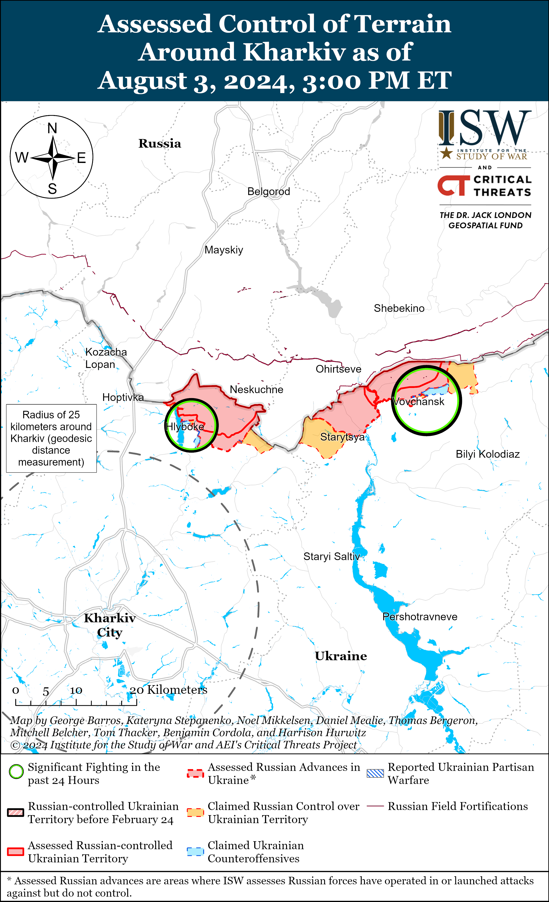
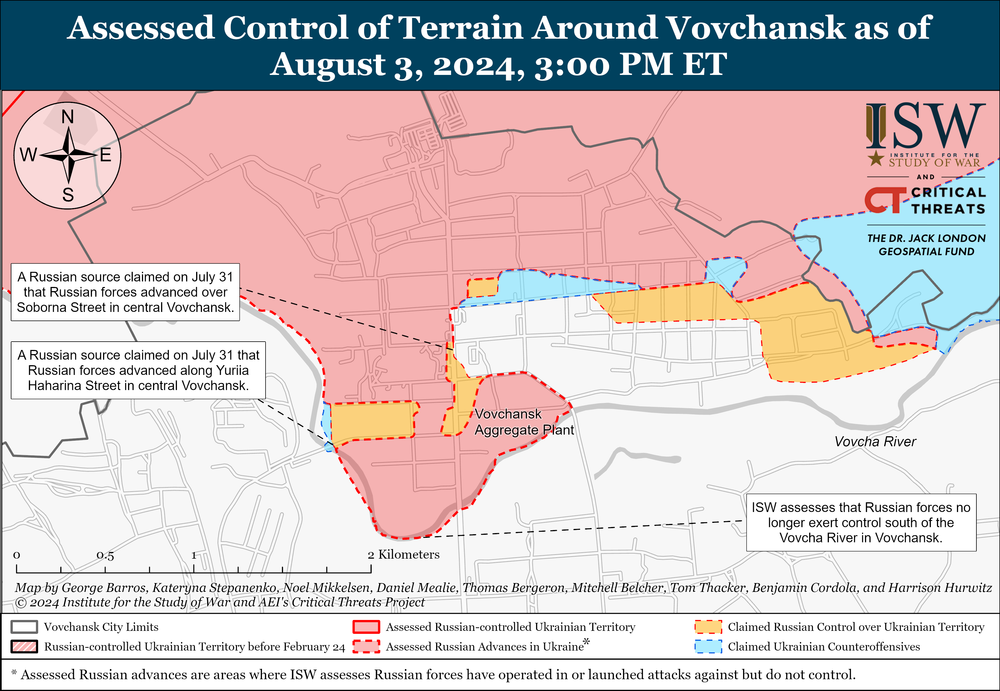
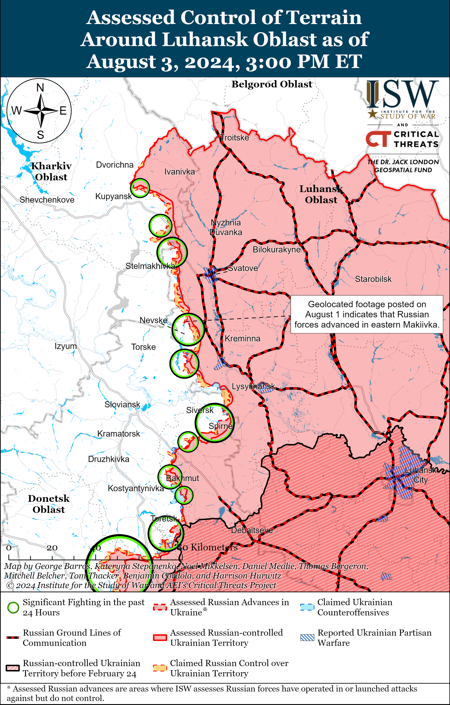
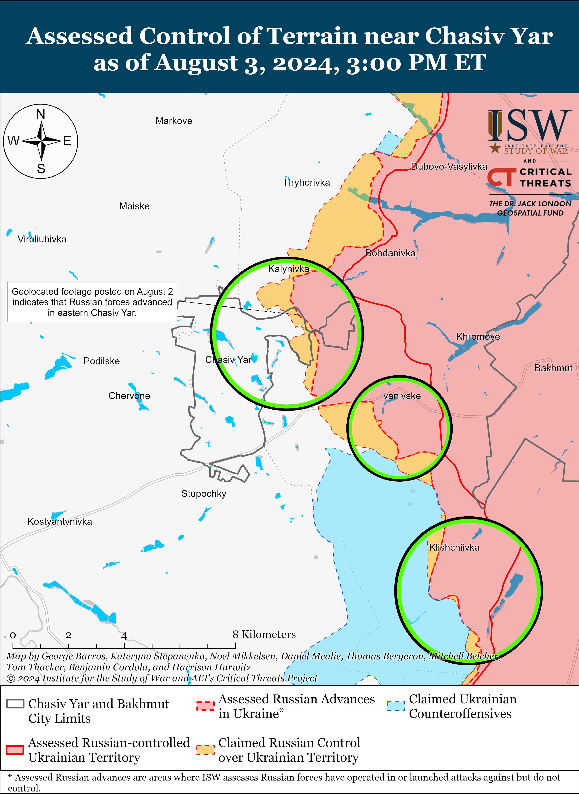
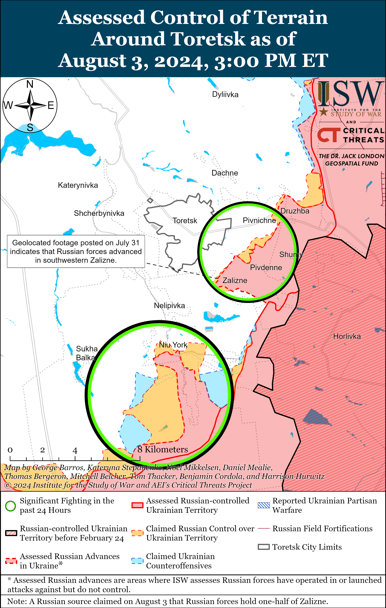
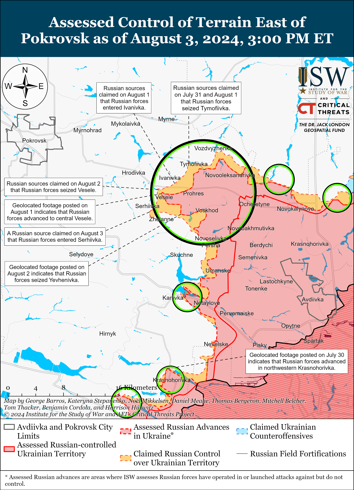
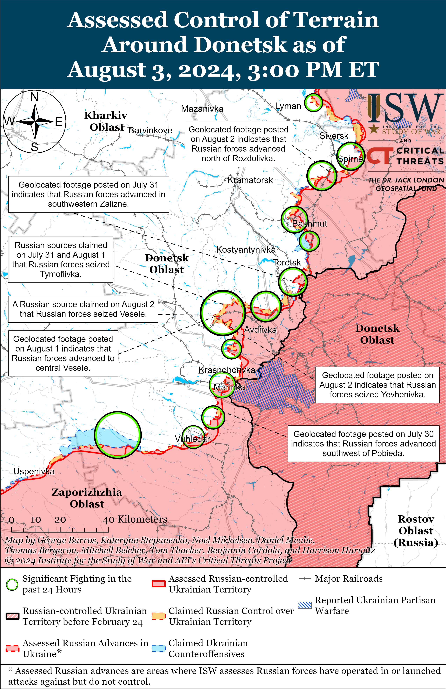
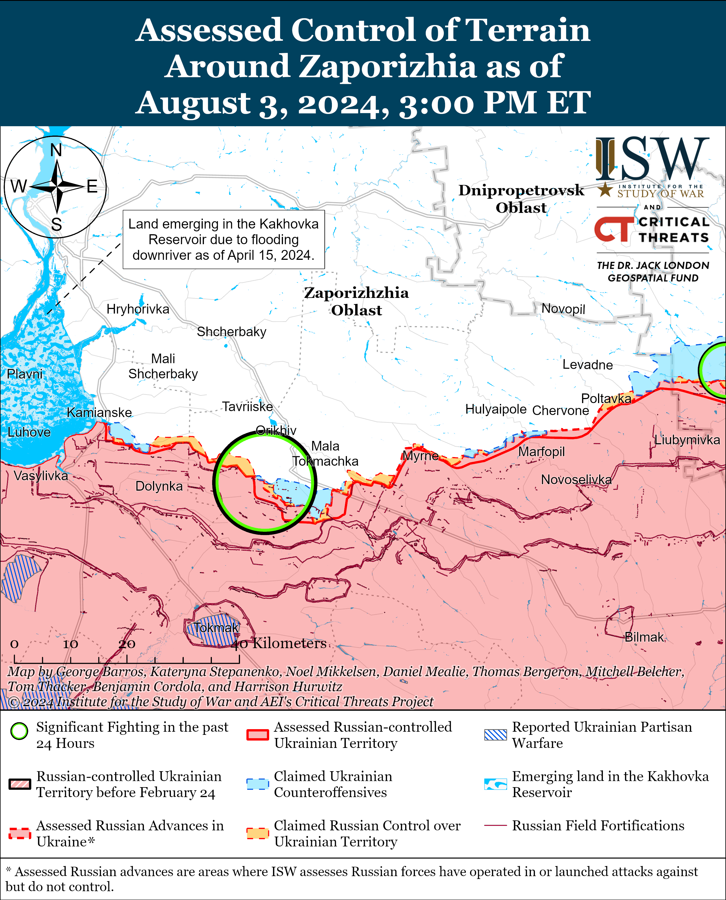
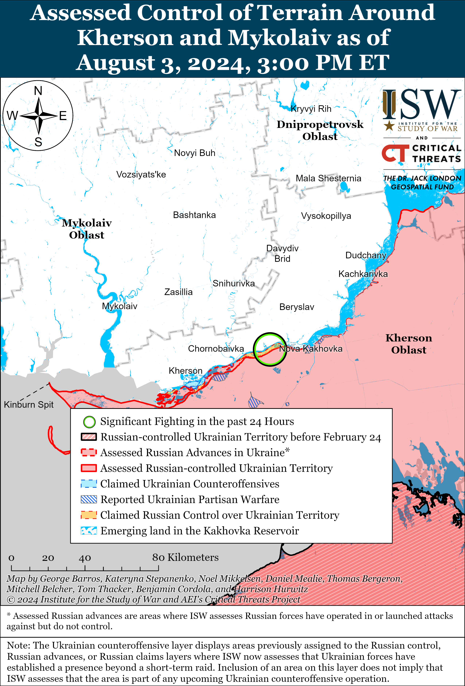

# Russian Offensive Campaign Assessment, August 3, 2024

**Nicole Wolkov, Angelica Evans, Riley Bailey, Davit Gasparyan, and Frederick W. Kagan**

**August 3, 2024, 4:45pm ET**

**Click**[**here**](https://storymaps.arcgis.com/stories/36a7f6a6f5a9448496de641cf64bd375)**to see ISW’s interactive map of the Russian invasion of Ukraine. This map is updated daily alongside the static maps present in this report.**

**Click**[**here**](https://understandingwar.maps.arcgis.com/apps/instant/3dviewer/index.html?appid=1602762dbcde419bb957dea358449580)**to see ISW’s 3D control of terrain topographic map of Ukraine. Use of a computer (not a mobile device) is strongly recommended for using this data-heavy tool.**

**Click**[**here**](https://storymaps.arcgis.com/stories/733fe90805894bfc8562d90b106aa895)**to access ISW’s archive of interactive time-lapse maps of the Russian invasion of Ukraine. These maps complement the static control-of-terrain map that ISW produces daily by showing a dynamic frontline. ISW will update this time-lapse map archive monthly.**

**Note: The data cut-off for this product was 12:00pm ET on August 3. ISW will cover subsequent reports in the August 4 Russian Offensive Campaign Assessment.**

**Ukrainian forces reportedly struck four Russian S-400 air defense missile launchers, an S-500 air defense system, and the Russian Black Sea Fleet’s (BSF) *Rostov-on-Don* Kilo-class submarine in occupied Crimea on August 2.**The Ukrainian General Staff reported on August 3 that the strikes significantly damaged four Russian S-400 missile launchers in unspecified areas in occupied Crimea.[1] Ukrainian Navy Spokesperson Captain Third Rank Dmytro Pletenchuk stated on August 3 that Ukrainian forces successfully destroyed a Russian S-400 and S-500 air defense system that the Russian military had deployed to protect the Kerch Strait Bridge.[2] ISW has not yet observed visual evidence of Ukrainian forces striking Russian air defense systems in occupied Crimea on August 2. The Ukrainian General Staff reported that the Ukrainian strike sank the *Rostov-on-Don* at the Sevastopol port.[3] Ukrainian forces previously struck and significantly damaged the submarine at the Sevastopol port in September 2023, after which it underwent repairs at the port.[4] Russian sources claimed that Russian forces repelled a Ukrainian MGM-140 ATACMS strike against occupied Sevastopol on August 2.[5] Satellite imagery captured on August 2 shows some damage to a structure purportedly protecting the *Rostov-on-Don* in the Sevastopol port, but ISW cannot yet independently verify reports that the Ukrainian strike destroyed the submarine.[6]

**Ukrainian forces also conducted a series of successful drone strikes against likely military targets in Rostov, Kursk, and Belgorod oblasts on August 3.**The Ukrainian General Staff reported that Ukraine’s Security Service (SBU) and Ukraine’s Main Military Intelligence Directorate (GUR) struck the Morozovsk Airfield and nearby ammunition and glide bomb storage facilities with an unspecified number of drones and that Ukrainian forces are conducting a battle damage assessment.[7] Footage published on August 3 shows secondary explosions near the Morozovsk Airfield consistent with strikes against an ammunition depot, and Russian sources claimed that Ukrainian forces launched roughly 55 drones at targets in Rostov Oblast.[8] The Ukrainian General Staff reported that the SBU and GUR also targeted a number of oil depots and fuel and lubricant storage facilities in Rostov, Kursk, and Belgorod oblasts.[9] Ukrainian outlet *Suspilne* reported that sources within Ukrainian special services stated that the GUR struck the Atlas oil refinery in Rostov Oblast with 15 drones and that Russian forces were using the Atlas oil refinery to fuel military equipment in occupied Luhansk and Donetsk oblasts.[10] Belgorod Oblast Governor Vyacheslav Gladkov claimed that Ukrainian drones also struck the Gubkinsky oil depot in Belgorod Oblast, which reportedly supplies motor fuels to the Russian military.[11] The Russian Ministry of Defense (MoD) claimed that Russian forces destroyed 75 drones over Russia and the Sea of Azov on the night of August 2 to 3.[12]

**The Kremlin reportedly planned to transfer unspecified missiles and other military equipment to the Houthis in Yemen but did not transfer the materiel following diplomatic pressure. Russia’s reported plan highlights its growing military partnership with Iran and suggests that Russia likely aims to leverage Iranian proxies to indirectly confront the West and shape Western decision making.***CNN*reported on August 2 that US officials and other sources familiar with the matter stated that Russia was preparing to deliver unspecified missiles and other military equipment to the Houthis in late July 2024 but backed down from the plan following US and Saudi diplomatic outreach.[13] US officials reportedly stated that they are unsure if Saudi protests were the determining factor for ending the planned transfer, however.[14] *CNN*‘s sources stated that at least three Russian military officials traveled to Yemen in late July 2024 to advise the Houthis and possibly assist the Houthis with live fire exercises, which the Houthis later cancelled.[15] US officials reportedly stated that Russia viewed arming and advising the Houthis as a retaliatory measure for lifting some US restrictions on Ukraine’s use of US-provided weapons for strikes within Russia.[16] Russian President Vladimir Putin claimed on June 6 that Russia would provide long-range strike capabilities to unspecified actors for strikes against the West as a “symmetrical response” to the lifting of some of these restrictions.[17] Russia’s reported plans to support the Houthis in order to indirectly confront the West and threaten further escalation cohere with several Russia information and hybrid operations that aim to encourage the West to self-deter from supporting Ukraine over fears of confrontation with Russia.[18]

**Putin’s willingness to consider supporting the Houthis as they attack Israel and international shipping is part of deepening Russian-Iranian military cooperation and Russia’s increasing reliance on Iran for high-precision weapons and components.[19]** Russia’s deepening partnership with Iran will likely encourage Russia to consider supporting other Iranian proxies and leveraging these groups in other indirect attempts to threaten the West with escalation. Increased Russian willingness to use Iran and its proxies to indirectly confront the West will disrupt Russian attempts to portray Russian foreign policy in the Middle East as balanced and may further complicate Russian relations with countries concerned about Russian-Iranian cooperation.

**Key Takeaways:**

- **Ukrainian forces reportedly struck four Russian S-400 air defense missile launchers, an S-500 air defense system, and the Russian Black Sea Fleet’s (BSF) Rostov-on-Don Kilo-class submarine in occupied Crimea on August 2.**
- **Ukrainian forces also conducted a series of successful drone strikes against likely military targets in Rostov, Kursk, and Belgorod oblasts on August 3.**
- **The Kremlin reportedly planned to transfer unspecified missiles and other military equipment to the Houthis in Yemen but did not transfer the materiel following diplomatic pressure. Russia’s reported plan highlights its growing military partnership with Iran and suggests that Russia likely aims to leverage Iranian proxies to indirectly confront the West and shape Western decision making.**
- **Putin’s willingness to consider supporting the Houthis as they attack Israel and international shipping is part of deepening Russian-Iranian military cooperation and Russia’s increasing reliance on Iran for high-precision weapons and components.**
- **Russian forces recently advanced near Kreminna, Siversk, and Chasiv Yar.**
- **Russian authorities continue efforts to financially incentivize Russian military service in Ukraine.**

***We do not report in detail on Russian war crimes because these activities are well-covered in Western media and do not directly affect the military operations we are assessing and forecasting. We will continue to evaluate and report on the effects of these criminal activities on the Ukrainian military and the Ukrainian population and specifically on combat in Ukrainian urban areas. We utterly condemn Russian violations of the laws of armed conflict and the Geneva Conventions and crimes against humanity even though we do not describe them in these reports.***

- Russian Main Effort – Eastern Ukraine (comprised of three subordinate main efforts)
- Russian Subordinate Main Effort #1 – Push Ukrainian forces back from the international border with Belgorod Oblast and approach to within tube artillery range of Kharkiv City
- Russian Subordinate Main Effort #2 – Capture the remainder of Luhansk Oblast and push westward into eastern Kharkiv Oblast and encircle northern Donetsk Oblast
- Russian Subordinate Main Effort #3 – Capture the entirety of Donetsk Oblast
- Russian Supporting Effort – Southern Axis
- Russian Air, Missile, and Drone Campaign
- Russian Mobilization and Force Generation Efforts
- Russian Technological Adaptations
- Activities in Russian-occupied areas
- Ukrainian Defense Industrial Base Efforts
- Russian Information Operations and Narratives
- Significant Activity in Belarus

**Russian Main Effort – Eastern Ukraine**

**Russian Subordinate Main Effort #1 – Kharkiv Oblast (Russian objective: Push Ukrainian forces back from the international border with Belgorod Oblast and approach to within tube artillery range of Kharkiv City)**

Russian forces continued offensive operations north of Kharkiv City near Hlyboke and northeast of Kharkiv City near Vovchansk and Tykhe on August 2 and 3, but there were no confirmed changes to the frontline.[20] Ukrainian Kharkiv Group of Forces Spokesperson Colonel Vitaly Sarantsev reported on August 3 that Russian forces are transferring forces from occupied Luhansk Oblast to the Starytsya (northeast of Kharkiv City and southwest of Vovchansk) area in preparation for future assaults in the area.[21] Elements of the Russian 83rd Airborne (VDV) Brigade are reportedly operating near Vovchansk.[22]

**Russian Subordinate Main Effort #2 – Luhansk Oblast (Russian objective: Capture the remainder of Luhansk Oblast and push westward into eastern Kharkiv Oblast and northern Donetsk Oblast)**

Russian forces recently advanced northwest of Kreminna amid continued Russian offensive operations along the Kupyansk-Svatove-Kreminna line on August 3. Geolocated footage published on August 1 indicates that Russian forces recently advanced further within southern Makiivka (northwest of Kreminna).[23] Russian forces continued offensive operations northeast of Kupyansk near Synkivka; northwest of Svatove near Kolisynkivka, Novoosynove, Hlushkivka, Andriivka, Berestove, and Stelmakhivka; northwest of Kreminna near Makiivka; and west of Kreminna near Terny and Torske on August 2 and 3.[24] Elements of the Russian 144th Motorized Rifle Division (20th Combined Arms Army [CAA], Moscow Military District [MMD]) are reportedly operating near Nevske (northwest of Kreminna).[25]

**Russian Subordinate Main Effort #3 – Donetsk Oblast (Russian objective: Capture the entirety of Donetsk Oblast, the claimed territory of Russia’s proxies in Donbas)**

Russian forces recently advanced in the Siversk direction amid continued Russian ground attacks in the area on August 3. Geolocated footage published on August 2 indicates that Russian forces recently advanced north of Rozdolivka (south of Siversk), confirming that Russian forces previously seized the settlement.[26] Fighting continued east of Siversk near Verkhnokamyanske; southeast of Siversk near Spirne, Ivano-Darivka, and Vyimka; and south of Siversk near Pereizne on August 2 and 3.[27] Elements of the Russian 123rd Motorized Rifle Brigade (2nd Luhansk People’s Republic Army Corps [LNR AC]) reportedly continue operating in the Siversk direction.[28]

Russian forces recently advanced within Chasiv Yar amid continued Russian offensive operations in the area on August 3. Geolocated footage published on August 2 indicates that Russian forces recently advanced further west of the Siverskyi-Donets Donbas Canal in northeastern Zhovtnevyi Microraion in eastern Chasiv Yar.[29] Russian forces continued ground attacks in Zhovtnevyi and Novyi microraions (eastern Chasiv Yar); near Chasiv Yar; east of Chasiv Yar near Ivanivske; and southeast of Chasiv Yar near Klishchiivka and Andriivka on August 2 and 3.[30] Elements of the Russian 98th Airborne (VDV) Division are reportedly conducting assaults near Zhovtnevyi and Novyi microraions, and elements of the 5th “Terek” Cossack Reconnaissance Brigade (reportedly of the volunteer Cossack Assault Corps) are reportedly operating in the Soledar-Bakhmut direction.[31]

Russian forces continued offensive operations in the Toretsk direction on August 3 but did not make any confirmed advances. Russian milbloggers continued to claim that Russian forces are advancing in Zalizne (southeast of Toretsk) and in central Niu York.[32] A Russian milblogger claimed that Russian forces may be 100 meters from Toretsk, although ISW assesses that Russian forces have only advanced as close as one kilometer from the administrative boundaries of Toretsk.[33] Fighting continued near Toretsk, east of Toretsk near Pivnichne, southeast of Troetsk near Zalizne, south of Toretsk near Niu York, and southwest of Toretsk near Panteleymonivka on August 2 and 3.[34] Elements of the Russian 9th Motorized Rifle Brigade (1st Donetsk People’s Republic [DNR] AC) reportedly continue operating in Niu York.[35]

[****](https://understandingwar.org/wp-content/uploads/2025/05/Toretsk20Battle20Map20Draft20August2032C202024.png)

Russian forces continued offensive operations in the Pokrovsk direction on August 3 but did not make any confirmed advances. An officer in a Ukrainian brigade operating in the Pokrovsk direction reported on August 3 that Ukrainian forces repelled a Russian platoon-sized mechanized assault in an unspecified area in the Pokrovsk direction on August 2.[36] The officer also stated that Russian forces are transferring all available reserves to the Pokrovsk direction, especially those from occupied Henichensk, Kherson Oblast, occupied Berdyansk, Zaporizhia Oblast, and occupied Mariupol, Donetsk Oblast. Russian milbloggers claimed that Russian forces advanced into southeastern Serhiivka and western Zhelanne (both southeast of Pokrovsk), although another Russian milblogger denied claims that Russian forces entered Zhelanne.[37] Fighting continued northeast of Pokrovsk near Kalynove; east of Pokrovsk near Vozdvyzhenka, Ivanivka, Tymofiivka, and Novooleksandrivka; and southeast of Pokrovsk near Novoselivka Persha, Zhelanne, Serhiivka, Mezhove, and Karlivka.[38] Elements of the Russian 24th Spetsnaz Brigade (Russian General Staff’s Main Directorate [GRU]) are reportedly operating near Zhelanne; and elements of the 15th Motorized Rifle Brigade (2nd Combined Arms Army [CAA], Central Military District [CMD]) are reportedly operating near Zhelanne and Ocheretyne. [39]

Russian forces continued offensive operations west of Donetsk City near Krasnohorivka and Heorhiivka and southwest of Donetsk City near Kostyantynivka and Paraskoviivka on August 2 and 3, but there were no changes to the frontline.[40] A Russian milblogger questioned if Russian forces are maintaining recently seized positions along sections of the O-0532 Vuhledar-Kostyantynivka highway (southwest of Donetsk City) southwest of Kostyantynivka.[41] Another Russian milblogger claimed that Russian forces are periodically using electric unicycles during assaults near Krasnohorivka.[42] Elements of the Russian 5th Motorized Rifle Brigade (1st DNR AC) are reportedly operating near Krasnohorivka and elements of the 238th Artillery Brigade (8th CAA, Southern Military District [SMD]) are reportedly operating in the Kurakhove direction (west and southwest of Donetsk City).

The Ukrainian General Staff reported that Russian forces continued ground attacks near Velyka Novosilka in the Donetsk-Zaporizhia Oblast border area on August 2 and 3, but there were no confirmed changes to the frontline.[43] Elements of the Russian 60th Motorized Rifle Brigade (5th CAA, Eastern Military District [EMD]) are reportedly operating in the south Donetsk direction (southwest of Donetsk City through the Donetsk-Zaporizhia Oblast border area).[44]

**Russian Supporting Effort – Southern Axis (Russian objective: Maintain frontline positions and secure rear areas against Ukrainian strikes)**

Positional fighting continued in western Zaporizhia Oblast on August 3 but there were no confirmed changes to the frontline. Ukrainian Tavriisk Group of Forces Spokesperson Captain Dmytro Lykhovyi stated that Russian forces, including elements of the 108th Airborne (VDV) Regiment (7th VDV Division), are actively attacking northeast of Robotyne near Mala Tokmachka.[45] Russian forces also conducted ground assaults near Robotyne, east of Robotyne near Verbove, north of Robotyne near Novodanylivka, and northwest of Robotyne near Novoandriivka on August 2 and 3.[46] Elements of the Russian 42nd Motorized Rifle Division (58th Combined Arms Army [CAA], Southern Military District [SMD]) reportedly continue to operate in the Zaporizhia direction.[47]

Fighting continued in the east (left) bank Kherson Oblast, including near Krynky, on August 2 and 3, but there were no confirmed changes to the frontline.[48] Elements of the Russian 80th Arctic Brigade (14th Army Corps [AC], Leningrad Military District [LMD]) reportedly continue to operate in the Kherson direction.[49]

**Russian Air, Missile, and Drone Campaign (Russian Objective: Target Ukrainian military and civilian infrastructure in the rear and on the frontline)**

Russian forces conducted limited missile and drone strikes against targets in Ukraine on the evening of August 2, on the night of August 2 to 3, and during the day on August 3. Ukrainian Southern Air Command reported that Russian forces struck targets near Odesa City with three likely Iskander-M ballistic missiles on the evening of August 2.[50] Ukrainian Air Force Commander Lieutenant General Mykola Oleshchuk reported that Russian forces launched two S-300 air defense missiles from occupied Donetsk Oblast, two Kh-31P anti-radar missiles from over the Black Sea, and 29 Shahed-136/131 drones from occupied Cape Chauda, Crimea and Primorsko-Akhtarsk, Krasnodar Krai on the night of August 2 to 3.[51] Oleshchuk reported that Ukrainian forces shot down 24 Shahed drones over Kherson, Odesa, Mykolaiv, Poltava, Sumy, Dnipropetrovsk, Vinnytsia, and Zhytomyr oblasts.[52] Vinnytsia Oblast Deputy Military Administration Head Natalya Zabolotna stated that Russian forces struck an infrastructure facility near Vinnytsia City with a drone, and Russian milbloggers posted footage purporting to show an oil depot on fire near the city.[53] Ukrainian Donetsk Oblast Police reported on August 3 that Russian forces struck residential areas in Pokrovsk and Myrnohrad, Donetsk Oblast with 11 missiles, seven of which were S-300 air defense missiles.[54] A Russian milblogger claimed that Russian forces turn off electronic warfare (EW) systems within Russia to create more secure flight paths for Shahed drones during strikes against Ukraine and that Ukrainian forces track these “corridors” to try to exploit them and conduct drone strikes against targets in Russia.[55]

**Russian Mobilization and Force Generation Efforts (Russian objective: Expand combat power without conducting general mobilization)**

Russian authorities continue efforts to financially incentivize Russian military service in Ukraine. Russian opposition mediareportedon August 3 that many Russians are receiving advertisements for military service contracts with the Russian MoD via text message promising one-time payments of 800,000 rubles (around $9,400) alongside other benefits.[56] Russian opposition outlet *Mediazona*, citing data from the Russian Central Bank, reported that Russian banks approved 45,800 new loan deferments for Russian servicemembers fighting in Ukraine between April and June 2024.[57] *Mediazona*reported that most of these loan deferments were likely filled out by recent recruits preparing to deploy to Ukraine.[58] A Russian milblogger claimed on August 3 that recent efforts to incentive military service, including offering large, one-time payments to recruits, demonstrate that Russian authorities want to avoid a second wave of general mobilization and mass discontent within the country.[59] Russian regional officials have recently announced increased financial incentives for recruits to entice more men to fight in Ukraine, and ISW continues to assess that financial incentives will generate sufficient manpower to sustain Russia’s current offensive tempo but will likely impose high long-term costs on Russia’s regional and federal budgets.[60]

Russian authorities appear to be deporting Ukrainian children from occupied territories to supplement Russia’s ongoing labor shortages. Sevastopol occupation governor Mikhail Razvozhaev claimed on August 3 that Russian authorities awarded children from occupied Sevastopol for being the hardest workers during a labor competition held in the Alabuga Special Economic Zone (SEZ), Republic of Tatarstan.[61] Razvozhaev claimed that a second group of students from occupied Sevastopol are in Tatarstan to participate in “labor project[s]” in the Alabuga SEZ.[62]The Alabuga SEZ is notably the hub of Russia’s Shahed-136/131 drone production initiative, and Russian authorities have previously compelled high-school and university-aged students to produce Shahed drones at the Alabuga Polytechnical College in the Republic of Tatarstan.[63] Russian authorities may also be forcing these Ukrainian children to produce Shahed drones.

North Korea appears to be converting a Russian-produced military transport aircraft into an airborne early warning platform to enhance its military capabilities following months of increased Russian-North Korean military cooperation. US-based North Korean monitoring publication affiliated with the Henry L. Stimson Center *38 North,* citing satellite imagery*,*reported on August 1 that North Korea appears to be converting an IL-76 military transport aircraft into an airborne early warning platform at the Pyongyang International Airport, which would enhance the North Korean military’s detection capabilities and supplement its ground-based radar.[64] *38 North* reported that the Soviet Union conducted similar conversions in the 1970s, but that it is unclear if Russian engineers are cooperating with or providing North Korea materials for the Il-76 conversion. Russian President Vladimir Putin and North Korean dictator Kim Jong Un signed a comprehensive strategic partnership agreement in June 2024 and recent reporting suggests that North Korea is continuing to expand the volume and variety of weapons it provides to Russia.[65]

**Russian Technological Adaptations (Russian objective: Introduce technological innovations to optimize systems for use in Ukraine)**

Russian Center for Integrated Unmanned Solutions (CID) Director General Dmitry Kuzyakin told Kremlin newswire *TASS*on August 3 that CID has created a “Doomsday” first-person view (FPV) drone that Russian forces can use to monitor radiation levels in the event of a nuclear strike and operate from inside a sealed armored vehicle.[66]

**Ukrainian Defense Industrial Efforts (Ukrainian objective: Develop its defense industrial base to become more self-sufficient in cooperation with US, European, and international partners)**

*ISW is not publishing coverage of Ukrainian defense industrial efforts today.*

**Activities in Russian-occupied areas (Russian objective: Consolidate administrative control of annexed areas; forcibly integrate Ukrainian citizens into Russian sociocultural, economic, military, and governance systems)**

*ISW is not publishing coverage of activities in Russian-occupied areas today.*

**Russian Information Operations and Narratives**

Nothing significant to report.

**Significant activity in Belarus (Russian efforts to increase its military presence in Belarus and further integrate Belarus into Russian-favorable frameworks and Wagner Group activity in Belarus)**

Nothing significant to report.

**Note: ISW does not receive any classified material from any source, uses only publicly available information, and draws extensively on Russian, Ukrainian, and Western reporting and social media as well as commercially available satellite imagery and other geospatial data as the basis for these reports. References to all sources used are provided in the endnotes of each update.**

****

---

[1] https://www.facebook.com/GeneralStaff.ua/posts/pfbid0Hck9iC2ko4yEaJophaRKLi1uw3B9uPGCrH2ZG2PqoBakrfVJfpZnMyDfhNTmXRrml

[2] https://armyinform.com dot ua/2024/08/03/u-vms-zsu-rozpovily-yak-krymskyj-mist-dopomagaye-utylizovuvaty-vorozhu-ppo/

[3] https://www.facebook.com/GeneralStaff.ua/posts/pfbid0Hck9iC2ko4yEaJophaRKLi1uw3B9uPGCrH2ZG2PqoBakrfVJfpZnMyDfhNTmXRrml

[4] https://understandingwar.org/backgrounder/russian-offensive-campaign-assessment-september-13-2023

[5] https://understandingwar.org/backgrounder/russian-offensive-campaign-assessment-august-2-2024

[6] https://t.me/Crimeanwind/64900 ; https://t.me/Crimeanwind/64890 ; https://x.com/JustAJaneJ/status/1819798224687055346 ;

[7] https://t.me/otukharkiv/538 ; https://www.facebook.com/GeneralStaff.ua/posts/pfbid02nhAbWZkPF6FiexPXiWst1mdPfvtCSL7QBebRoEkSZ7X9VJR85gmMACCYUc2mZjuEl ; https://t.me/DIUkraine/4190

[8] https://t.me/kiber\_boroshno/9281; https://t.me/DniproOfficial/4091; https://x.com/GeoConfirmed/status/1819706286289662405; https://x.com/Archer83Able/status/1819526496484315395; https://x.com/GirkinGirkin/status/1819525266437202062; https://t.me/ButusovPlus/12319 ; https://t.me/ButusovPlus/12320 ; https://t.me/RVvoenkor/73860 ; https://t.me/dva\_majors/48683 ; https://t.me/vrogov/16844 ; https://t.me/bazabazon/29959; https://t.me/golubev\_vu/1467;   https://t.me/tass\_agency/264180

[9] https://t.me/otukharkiv/538 ; https://www.facebook.com/GeneralStaff.ua/posts/pfbid02nhAbWZkPF6FiexPXiWst1mdPfvtCSL7QBebRoEkSZ7X9VJR85gmMACCYUc2mZjuEl ; https://t.me/DIUkraine/4190

[10] https://suspilne dot media/805425-droni-gur-pocilili-po-naftokombinatu-atlas-u-rosii/

[11] https://t.me/tass\_agency/264187 ; https://www.list-org dot com/company/857994

[12] https://t.me/mod\_russia/41742

[13] https://edition.cnn.com/2024/08/02/politics/russia-weapons-houthis-saudi-arabia?cid=ios\_app&fbclid=IwY2xjawEaOVpleHRuA2FlbQIxMAABHeG0-Ne0AhvaKtrd9roLe2bYqH7fVHi2-3n7Nq3Owj2foXHmSR1vJbZKCA\_aem\_VFNJdy\_BoanqWDuV4o-z6g

[14] https://edition.cnn.com/2024/08/02/politics/russia-weapons-houthis-saudi-arabia?cid=ios\_app&fbclid=IwY2xjawEaOVpleHRuA2FlbQIxMAABHeG0-Ne0AhvaKtrd9roLe2bYqH7fVHi2-3n7Nq3Owj2foXHmSR1vJbZKCA\_aem\_VFNJdy\_BoanqWDuV4o-z6g

[15] https://edition.cnn.com/2024/08/02/politics/russia-weapons-houthis-saudi-arabia?cid=ios\_app&fbclid=IwY2xjawEaOVpleHRuA2FlbQIxMAABHeG0-Ne0AhvaKtrd9roLe2bYqH7fVHi2-3n7Nq3Owj2foXHmSR1vJbZKCA\_aem\_VFNJdy\_BoanqWDuV4o-z6g

[16] https://edition.cnn.com/2024/08/02/politics/russia-weapons-houthis-saudi-arabia?cid=ios\_app&fbclid=IwY2xjawEaOVpleHRuA2FlbQIxMAABHeG0-Ne0AhvaKtrd9roLe2bYqH7fVHi2-3n7Nq3Owj2foXHmSR1vJbZKCA\_aem\_VFNJdy\_BoanqWDuV4o-z6g

[17] https://understandingwar.org/backgrounder/russian-offensive-campaign-assessment-june-6-2024

[18] https://understandingwar.org/backgrounder/russian-offensive-campaign-assessment-july-28-2024 ; https://isw.pub/UkrWar071124 ;

[19] https://isw.pub/UkrWar072724 ; https://isw.pub/UkrWar071324 ; https://isw.pub/UkrWar070924 ;

[20] https://www.facebook.com/GeneralStaff.ua/posts/pfbid02m8JZ1wotqixUd5zTiXD4LE5hF2kJ9hb9nst47azSn3od3APqHeFS1GM1FJMvzkA4l   ; https://www.facebook.com/GeneralStaff.ua/posts/pfbid02WFypPgRSS8UaZ9yGPGip3JY4jKGYLKFPAjPCLfSe6FpD12CC9DCCRUx4sdjL69wBl   ; https://www.facebook.com/GeneralStaff.ua/posts/pfbid02L8sES8y3XEnDvEBUAmzMyE1TswxKfeAq1G7UE7714PRGGg5fzDu9LD5h3y8WmqZSl; https://t.me/otukharkiv/536 ; https://t.me/wargonzo/21357 ; https://armyinform dot com.ua/2024/08/03/otu-harkiv-najbilsh-intensyvni-boyi-tryvayut-u-vovchansku/ ; https://www.youtube.com/watch?v=kA5EvhyCugE

[21] https://armyinform dot com.ua/2024/08/03/vorog-perekydaye-dodatkovi-syly-z-luganskoyi-oblasti-na-harkivshhynu/ ; https://www.youtube.com/watch?v=kA5EvhyCugE

[22] https://t.me/ButusovPlus/12308;

[23] https://t.me/OBTRO135/27; https://x.com/EjShahid/status/1819653421718532397

[24] https://www.facebook.com/GeneralStaff.ua/posts/pfbid02m8JZ1wotqixUd5zTiXD4LE5hF2kJ9hb9nst47azSn3od3APqHeFS1GM1FJMvzkA4l ; https://www.facebook.com/GeneralStaff.ua/posts/pfbid02WFypPgRSS8UaZ9yGPGip3JY4jKGYLKFPAjPCLfSe6FpD12CC9DCCRUx4sdjL69wBl ; https://www.facebook.com/GeneralStaff.ua/posts/pfbid02L8sES8y3XEnDvEBUAmzMyE1TswxKfeAq1G7UE7714PRGGg5fzDu9LD5h3y8WmqZSl ; https://t.me/DnevnikDesantnika/13329

[25] https://t.me/vysokygovorit/16747

[26] https://t.me/Khortytsky\_wind/841; https://t.me/creamy\_caprice/6238

[27] https://www.facebook.com/GeneralStaff.ua/posts/pfbid02m8JZ1wotqixUd5zTiXD4LE5hF2kJ9hb9nst47azSn3od3APqHeFS1GM1FJMvzkA4l ; https://www.facebook.com/GeneralStaff.ua/posts/pfbid02WFypPgRSS8UaZ9yGPGip3JY4jKGYLKFPAjPCLfSe6FpD12CC9DCCRUx4sdjL69wBl ; https://www.facebook.com/GeneralStaff.ua/posts/pfbid02L8sES8y3XEnDvEBUAmzMyE1TswxKfeAq1G7UE7714PRGGg5fzDu9LD5h3y8WmqZSl ; https://t.me/NgP\_raZVedka/18529 ; https://t.me/dva\_majors/48695

[28] https://t.me/sons\_fatherland/15985

[29] https://t.me/YasniOchiUa/55; https://t.me/creamy\_caprice/6234; https://x.com/klinger66/status/1819476652285743298

[30] https://www.facebook.com/GeneralStaff.ua/posts/pfbid02m8JZ1wotqixUd5zTiXD4LE5hF2kJ9hb9nst47azSn3od3APqHeFS1GM1FJMvzkA4l ; https://www.facebook.com/GeneralStaff.ua/posts/pfbid02L8sES8y3XEnDvEBUAmzMyE1TswxKfeAq1G7UE7714PRGGg5fzDu9LD5h3y8WmqZSl; https://t.me/RVvoenkor/73869 ; https://t.me/RVvoenkor/73869 ; https://t.me/wargonzo/21357

[31] ttps://t.me/RVvoenkor/73869 ; https://t.me/epoddubny/20606 ; https://t.me/vysokygovorit/16741

[32] https://t.me/RVvoenkor/73869 ; https://t.me/DnevnikDesantnika/13339 ; https://t.me/wargonzo/21357 ; https://t.me/rusich\_army/16221 ; https://t.me/DnevnikDesantnika/13342

[33] https://t.me/rusich\_army/16221

[34] https://www.facebook.com/GeneralStaff.ua/posts/pfbid02m8JZ1wotqixUd5zTiXD4LE5hF2kJ9hb9nst47azSn3od3APqHeFS1GM1FJMvzkA4l ; https://www.facebook.com/GeneralStaff.ua/posts/pfbid02WFypPgRSS8UaZ9yGPGip3JY4jKGYLKFPAjPCLfSe6FpD12CC9DCCRUx4sdjL69wBl ; https://www.facebook.com/GeneralStaff.ua/posts/pfbid02L8sES8y3XEnDvEBUAmzMyE1TswxKfeAq1G7UE7714PRGGg5fzDu9LD5h3y8WmqZSl ; https://t.me/rybar/62382

[35] https://t.me/wargonzo/21365

[36] https://suspilne dot media/donbas/805435-rosijski-vijska-staguut-vsi-rezervi-na-pokrovskij-napramok-59-ta-brigada/

[37] https://t.me/motopatriot/25789; https://t.me/z\_arhiv/27501; https://t.me/wargonzo/21357; https://t.me/epoddubny/20607 ; https://t.me/voenkorKotenok/57919 ; https://t.me/NgP\_raZVedka/18532

[38] https://www.facebook.com/GeneralStaff.ua/posts/pfbid02m8JZ1wotqixUd5zTiXD4LE5hF2kJ9hb9nst47azSn3od3APqHeFS1GM1FJMvzkA4l ; https://www.facebook.com/GeneralStaff.ua/posts/pfbid02L8sES8y3XEnDvEBUAmzMyE1TswxKfeAq1G7UE7714PRGGg5fzDu9LD5h3y8WmqZSl ; https://t.me/RVvoenkor/73846 ; https://t.me/DnevnikDesantnika/13331 ; https://t.me/DnevnikDesantnika/13335

[39] https://t.me/RVvoenkor/73851 ; https://t.me/RVvoenkor/73882 ; https://t.me/Alekhin\_Telega/11090 ; https://t.me/dva\_majors/48680

[40] https://www.facebook.com/GeneralStaff.ua/posts/pfbid02m8JZ1wotqixUd5zTiXD4LE5hF2kJ9hb9nst47azSn3od3APqHeFS1GM1FJMvzkA4l   ; https://www.facebook.com/GeneralStaff.ua/posts/pfbid02WFypPgRSS8UaZ9yGPGip3JY4jKGYLKFPAjPCLfSe6FpD12CC9DCCRUx4sdjL69wBl ; https://www.facebook.com/GeneralStaff.ua/posts/pfbid02L8sES8y3XEnDvEBUAmzMyE1TswxKfeAq1G7UE7714PRGGg5fzDu9LD5h3y8WmqZSl

[41] https://t.me/wargonzo/21357 ; https://understandingwar.org/backgrounder/russian-offensive-campaign-assessment-august-2-2024

[42] https://t.me/Sladkov\_plus/11093 ; https://t.me/Sladkov\_plus/11092

[43] https://www.facebook.com/GeneralStaff.ua/posts/pfbid02L8sES8y3XEnDvEBUAmzMyE1TswxKfeAq1G7UE7714PRGGg5fzDu9LD5h3y8WmqZSl ; https://www.facebook.com/GeneralStaff.ua/posts/pfbid02WFypPgRSS8UaZ9yGPGip3JY4jKGYLKFPAjPCLfSe6FpD12CC9DCCRUx4sdjL69wBl

[44] https://t.me/voin\_dv/10088

[45] https://armyinform dot com.ua/2024/08/03/na-robotynskomu-vystupi-vzyaly-u-polon-chotyroh-rosijskyh-desantnykiv/ ; https://www.youtube.com/watch?v=kA5EvhyCugE

[46] https://www.facebook.com/GeneralStaff.ua/posts/pfbid02m8JZ1wotqixUd5zTiXD4LE5hF2kJ9hb9nst47azSn3od3APqHeFS1GM1FJMvzkA4l  ; https://www.facebook.com/GeneralStaff.ua/posts/pfbid02WFypPgRSS8UaZ9yGPGip3JY4jKGYLKFPAjPCLfSe6FpD12CC9DCCRUx4sdjL69wBl   ; https://t.me/wargonzo/21357 ; https://www.facebook.com/GeneralStaff.ua/posts/pfbid02L8sES8y3XEnDvEBUAmzMyE1TswxKfeAq1G7UE7714PRGGg5fzDu9LD5h3y8WmqZSl   ;

[47] https://t.me/dva\_majors/48702

[48] https://t.me/SJTF\_Odes/10798 ; https://www.facebook.com/GeneralStaff.ua/posts/pfbid02L8sES8y3XEnDvEBUAmzMyE1TswxKfeAq1G7UE7714PRGGg5fzDu9LD5h3y8WmqZSl

[49] https://t.me/NeoficialniyBeZsonoV/38238

[50] https://www.facebook.com/PvKPivden/posts/pfbid0272SF6VU7c2qSgiD2JYsDKMH1kFmXWbezbmDuJxAzK19SDDvwLUnK1XqFy9jrTPSNl?locale=ru\_RU

[51] https://t.me/ComAFUA/367

[52] https://t.me/ComAFUA/367

[53] https://www.facebook.com/ZabolotNAtalia/posts/pfbid0xe1pxHA8Ko3SSum8hwSuvEu3SgPSga3PqYy1JiS3PRQWBPg4UWxZMzZzrkRFBW3kl?locale=uk\_UA ; https://suspilne dot media/vinnytsia/805325-vlucanna-v-obekt-infrastrukturi-na-vinniccini-so-vidomo-pro-ataku-rf/ ; https://t.me/RVvoenkor/73887 ; https://t.me/rybar/62404

[54] https://suspilne dot media/donbas/805373-armia-rf-vnoci-vipustila-11-raket-po-mirnogradu-ta-pokrovsku-so-vidomo/ ; https://dn.npu.gov dot ua/news/troie-zahyblykh-i-visim-poranenykh-zokrema-dvoie-ditei-politsiia-donechchyny-zadokumentuvala-zlochyny-rosii-proty-tsyvilnoho-naselennia

[55] https://t.me/boris\_rozhin/132221

[56] https://t.me/zatelecom/28550 ; https://meduza dot io/news/2024/08/03/v-rossii-nachali-massovo-rassylat-sms-so-slovami-zaklyuchay-kontrakt-s-minoborony-srazu-ot-800-tysyach-rubley-i-lgoty ; https://t.me/sotaproject/84596 ; https://t.me/mobilizationnews/19658 ; https://t.me/severrealii/26529 ; https://t.me/istories\_media/7114

[57] https://zona dot media/news/2024/08/03/dobrovol

[58] https://t.me/istories\_media/7113; https://zona dot media/news/2024/08/03/dobrovol

[59] https://t.me/dva\_majors/48711

[60] https://understandingwar.org/backgrounder/russian-offensive-campaign-assessment-july-23-2024 ; https://understandingwar.org/backgrounder/russian-offensive-campaign-assessment-august-1-2024 ; https://understandingwar.org/backgrounder/russian-offensive-campaign-assessment-july-31-2024

[61] https://t.me/razvozhaev/7544

[62] https://t.me/razvozhaev/7544

[63] https://understandingwar.org/backgrounder/russian-offensive-campaign-assessment-may-7-2024 ; https://understandingwar.org/backgrounder/russian-offensive-campaign-assessment-april-22-2024 ; https://understandingwar.org/backgrounder/russian-offensive-campaign-assessment-may-28-2024

[64] https://www.38north.org/2024/08/work-continues-on-apparent-airborne-early-warning-system/

[65] https://isw.pub/UkrWar073024 ; https://understandingwar.org/backgrounder/russian-offensive-campaign-assessment-june-19-2024

[66] https://t.me/tass\_agency/264181 ; https://tass dot ru/armiya-i-opk/21522313
