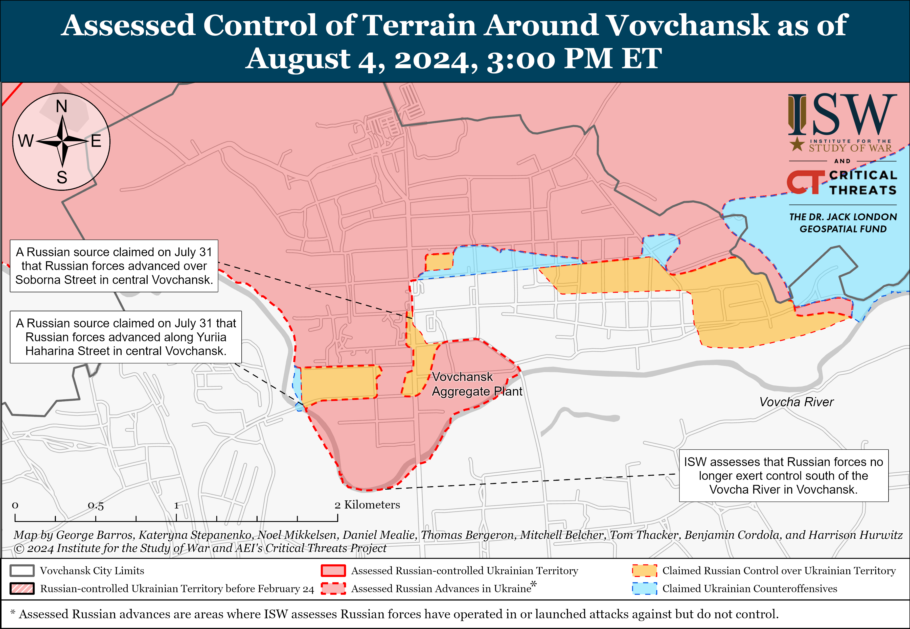
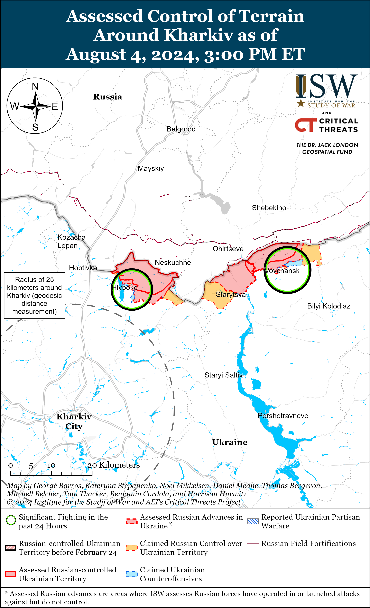
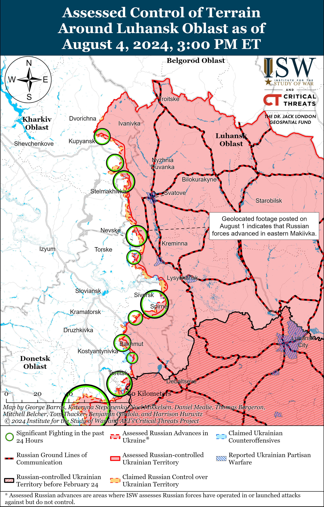
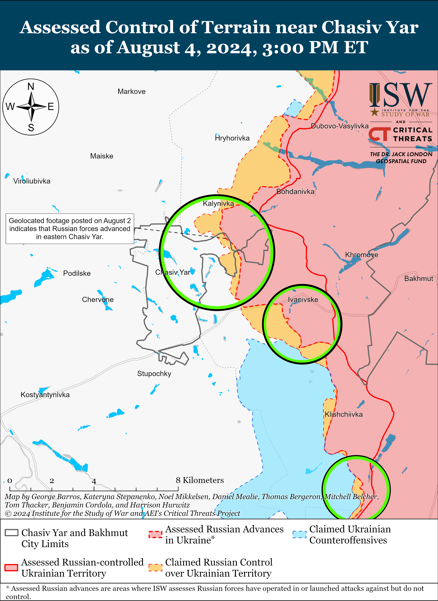
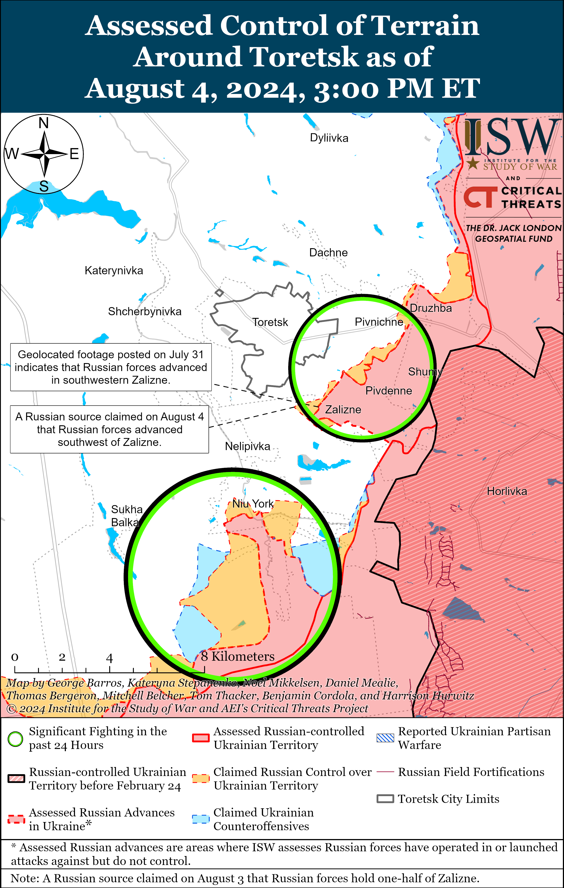
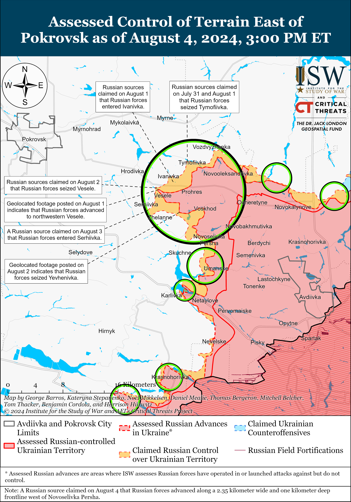
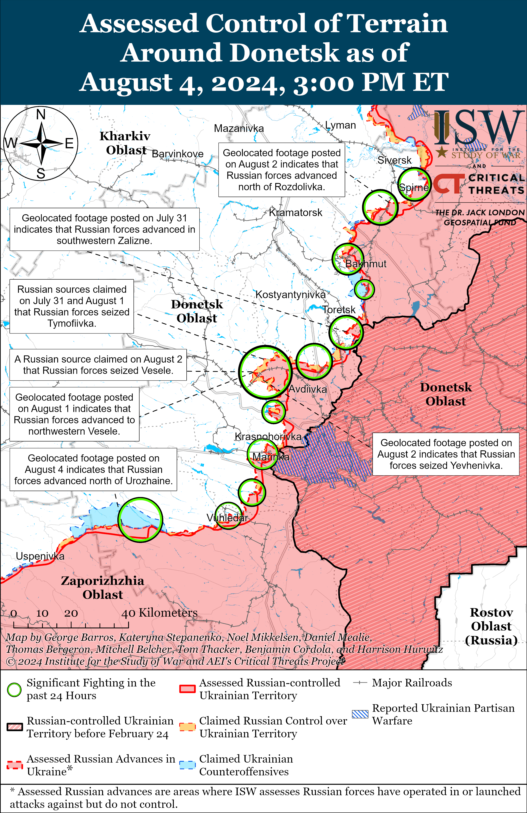
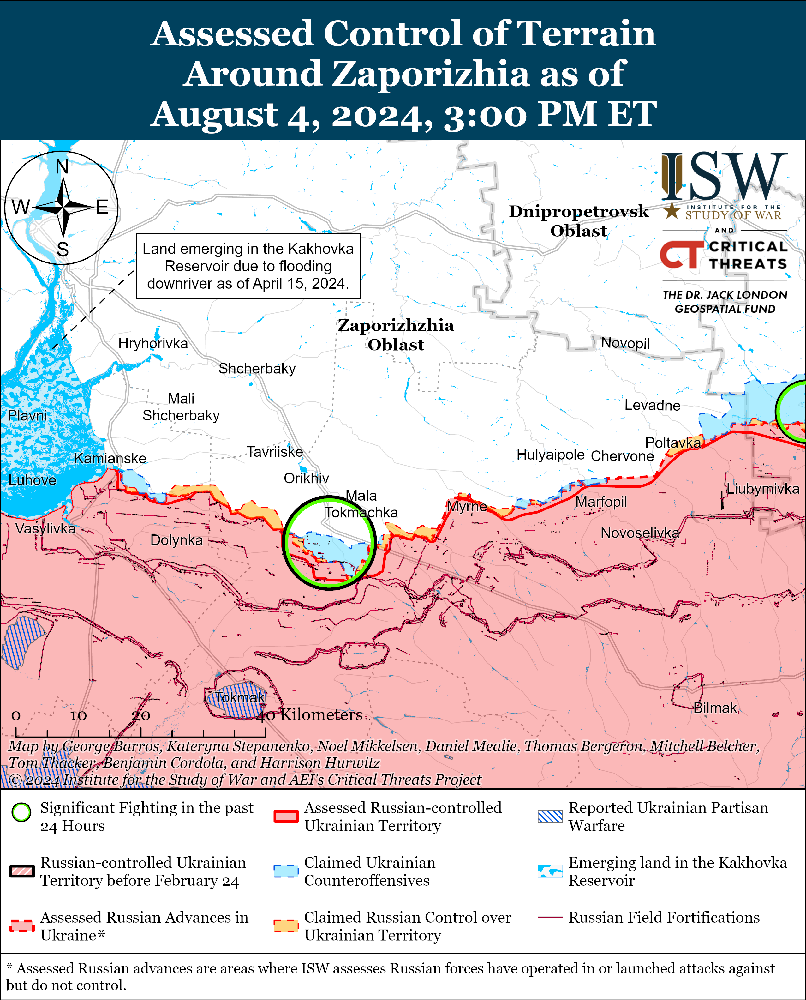
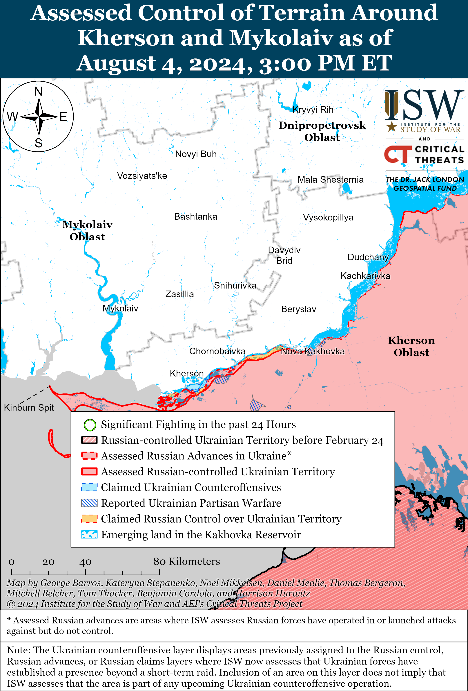

# Russian Offensive Campaign Assessment, August 4, 2024

**Nicole Wolkov, Riley Bailey, Davit Gasparyan, Karolina Hird, and Frederick W. Kagan**

**August 4, 2024, 3:30pm ET**

**Click** [**here**](https://storymaps.arcgis.com/stories/36a7f6a6f5a9448496de641cf64bd375) **to see ISW’s interactive map of the Russian invasion of Ukraine. This map is updated daily alongside the static maps present in this report.**

**Click** [**here**](https://understandingwar.maps.arcgis.com/apps/instant/3dviewer/index.html?appid=1602762dbcde419bb957dea358449580) **to see ISW’s 3D control of terrain topographic map of Ukraine. Use of a computer (not a mobile device) is strongly recommended for using this data-heavy tool.**

**Click** [**here**](https://storymaps.arcgis.com/stories/733fe90805894bfc8562d90b106aa895) **to access ISW’s archive of interactive time-lapse maps of the Russian invasion of Ukraine. These maps complement the static control-of-terrain map that ISW produces daily by showing a dynamic frontline. ISW will update this time-lapse map archive monthly.**

**Note: The data cut-off for this product was 11:30am ET on August 4. ISW will cover subsequent reports in the August 5 Russian Offensive Campaign Assessment.**

**Ukrainian forces reportedly conducted drone strikes against an oil depot in Rostov Oblast and missile strikes against fuel storage warehouses in occupied Luhansk City on August 4.** Russian opposition outlet *Astra* published footage and reported on August 4 that Ukrainian drones struck an oil depot in Azov, Rostov Oblast.[1] Rostov Oblast Governor Vasily Golubev announced on August 4 that fire fighters were extinguishing a large fire at a warehouse in Azov, but specifically noted that Russian authorities would establish the cause after extinguishing the fire.[2] Luhansk People’s Republic (LNR) Head Leonid Pasechnik claimed on August 4 that Ukrainian forces launched eight ATACMS missiles and four Storm Shadow missiles at Luhansk City.[3] Pasechnik claimed that Russian air defense shot down four missiles, that some missiles struck warehouses containing fuel storage, and that some falling missile debris caused dry grass to catch fire.[4] Footage published on August 4 purportedly shows two smoke plumes over Luhansk City.[5] Luhansk Oblast Military Administration Head Artem Lysohor reported fires at the Luhansk machine-building plant in Luhansk City, where Russian forces reportedly repair and store military equipment.[6] ISW cannot confirm what type of missiles Ukrainian forces used in the Luhansk City strike at this time.

**Ukraine confirmed that it has received the first batch of US-made F-16 fighter jets.** Ukrainian President Volodymyr Zelensky announced on August 4 that Ukraine received an unspecified number of F-16s from unspecified Western countries and specifically thanked Denmark, the Netherlands, and the US.[7] The *Economist* reported on August 4 that Ukraine has so far received 10 of the promised 79 jets and that Ukrainian forces should be able to fly 20 F-16s by the end of 2024.[8] ISW continues to assess that Ukraine will need a substantial number of F-16 jets in order to field them at the scale necessary for Ukraine to succeed in integrating fixed wing aircraft into its wider air defense umbrella.[9] Ukraine will also notably need to continue efforts to target Russian air defense assets within the Russian rear and in occupied Ukraine with Western-provided long-range weapons to enable its use of F-16 jets.

**Russian milbloggers responded to the arrival of F-16s by trying to downplay their potential battlefield effects—directly undermining Russian information operations intended to frame the delivery of F-16s and other Western weapons systems as an uncrossable “red line.”** Several Russian milbloggers claimed that Western and Ukrainian media are “overhyping” the arrival of F-16s in order to distract from battlefield failures, and many milbloggers turned to immediately discussing how Russian forces will begin targeting and destroying the aircraft.[10] Russian information space commentators and officials have frequently claimed that the delivery of Western weaponry to Ukraine constitutes a red line, that if crossed, will force Russia into an escalatory response.[11] Russia has repeatedly proven, however, that the invocation of supposed “red lines” is a reflexive control technique intended to force the West into self-deterring against providing Ukraine with additional military aid.[12] Western and Ukrainian policies have crossed Russia’s self-defined “red lines” multiple times since the beginning of the war without drawing a significant Russian reaction, which Russian milblogger comments suggest will prove to be the case with Russia’s response to F-16s.

**Key Takeaways:**

- **Ukrainian forces reportedly conducted drone strikes against an oil depot in Rostov Oblast and missile strikes against fuel storage warehouses in occupied Luhansk City on August 4.**
- **Ukraine confirmed that it has received the first batch of US-made F-16 fighter jets.**
- **Russian milbloggers responded to the arrival of F-16s by trying to downplay their potential battlefield effects—directly undermining Russian information operations intended to frame the delivery of F-16s and other Western weapons systems as an uncrossable “red line.”**
- **Russian forces recently made confirmed advances east of Pokrovsk, west of Donetsk City, and in the Donetsk-Zaporizhia Oblast border area.**
- **The Russian defense industry reportedly continues to produce missiles using Western-sourced components.**

****

***We do not report in detail on Russian war crimes because these activities are well-covered in Western media and do not directly affect the military operations we are assessing and forecasting. We will continue to evaluate and report on the effects of these criminal activities on the Ukrainian military and the Ukrainian population and specifically on combat in Ukrainian urban areas. We utterly condemn Russian violations of the laws of armed conflict and the Geneva Conventions and crimes against humanity even though we do not describe them in these reports.***

- Russian Main Effort – Eastern Ukraine (comprised of three subordinate main efforts)
- Russian Subordinate Main Effort #1 – Push Ukrainian forces back from the international border with Belgorod Oblast and approach to within tube artillery range of Kharkiv City
- Russian Subordinate Main Effort #2 – Capture the remainder of Luhansk Oblast and push westward into eastern Kharkiv Oblast and encircle northern Donetsk Oblast
- Russian Subordinate Main Effort #3 – Capture the entirety of Donetsk Oblast
- Russian Supporting Effort – Southern Axis
- Russian Air, Missile, and Drone Campaign
- Russian Mobilization and Force Generation Efforts
- Russian Technological Adaptations
- Activities in Russian-occupied areas
- Ukrainian Defense Industrial Base Efforts
- Russian Information Operations and Narratives
- Significant Activity in Belarus

**Russian Main Effort – Eastern Ukraine**

**Russian Subordinate Main Effort #1 – Kharkiv Oblast** **(Russian objective: Push Ukrainian forces back from the international border with Belgorod Oblast and approach to within tube artillery range of Kharkiv City)**

Positional engagements continued in northern Kharkiv Oblast on August 4, but there were no confirmed changes to the frontline. Ukrainian and Russian sources reported continued fighting north of Kharkiv City near Hlyboke and Lyptsi and northeast of Kharkiv City in and near Vovchansk and near Tykhe.[13] Some Russian milbloggers claimed that Ukrainian forces are transferring additional reserves to northern Kharkiv Oblast and conducting limited rotations near both Hlyboke and Vovchansk.[14] Ukraine’s Kharkiv Group of Forces reported on August 4 that the Russian military command has transferred responsibility for positions in northern Vovchansk from elements of the 4th Volunteer Assault Brigade to elements of the 153rd Tank Regiment (both of the 47th Tank Division, 1st Guards Tank Army, Moscow Military District [MMD]).[15]

[****](https://understandingwar.org/wp-content/uploads/2025/05/Vovchansk20Battle20Map20Draft20August2042C202024.png)

[****](https://understandingwar.org/wp-content/uploads/2025/05/Kharkiv20Battle20Map20Draft20August2042C202024.png)

**Russian Subordinate Main Effort #2 – Luhansk Oblast** **(Russian objective: Capture the remainder of Luhansk Oblast and push westward into eastern Kharkiv Oblast and northern Donetsk Oblast)**

Russian forces continued limited offensive operations along the Kupyansk-Svatove-Kreminna line on August 4 but did not make any confirmed advances. The Ukrainian General Staff reported unsuccessful Russian ground attacks northeast of Kupyansk near Synkivka; southeast of Kupyansk near Berestove, Kruhlyakivka, Petropavlivka, Kolisnykivka, Novoosynove, and Hlushkivka; northwest of Svatove near Stelmakhivka; west of Svatove near Andriivka; and northwest of Kreminna near Makiivka, Nevske, and Terny.[16] A Russian milblogger claimed that Russian forces are continuing to advance within central Makiivka.[17]

**Russian Subordinate Main Effort #3 – Donetsk Oblast** **(Russian objective: Capture the entirety of Donetsk Oblast, the claimed territory of Russia’s proxies in Donbas)**

Russian forces continued offensive operations in the Siversk direction east of Siversk near Verkhnokamyanske; southeast of Siversk near Ivano-Darivka, Vyimka, and Spirne; and south of Siversk near Pereizne on August 3 and 4.[18] Elements of the Russian 6th Motorized Rifle Brigade (2nd Army Corps [AC]) are reportedly approaching Verkhnokamyanske’s eastern outskirts.[19] The Luhansk People’s Republic (LNR) posted footage showing elements of the Russian 2nd Artillery Brigade (2nd Luhansk People’s Republic Army Corps [LNR AC]) operating in the Siversk direction.[20]

Russian forces continued offensive operations near Chasiv Yar on August 2, but there were no confirmed changes to the frontline. Russian sources continued to discuss Russian combat operations in Zhovtnevyi Microraion (eastern Chasiv Yar) and claimed that Russian forces are clearing newly seized positions in the area.[21] Russian milbloggers claimed that Russian forces advanced north of Chasiv Yar near Kalynivka and claimed that Russian forces seized a Ukrainian stronghold at a key height southeast of Chasiv Yar near Klishchiivka, although ISW has not observed confirmation of these claims.[22] Russian forces continued offensive operations near Kalynivka; northeast of Chasiv Yar near Vasyukivka; east of Chasiv Yar near Ivanivske; southeast of Chasiv Yar near Klishchiivka and Andriivka; and south of Chasiv Yar near Stupochky on August 3 and 4.[23] Chechen Republic Head Ramzan Kadyrov published footage purporting to show elements of the “Shustry” Detachment of Chechen “Akhmat” Spetsnaz and the Russian 4th Motorized Rifle Brigade (2nd LNR AC) operating in the Chasiv Yar direction.[24]

Russian forces reportedly advanced southeast of Toretsk but there were no confirmed changes to the frontline in the area on August 4. Russian milbloggers claimed that Russian forces advanced up to a kilometer west of southwestern Zalizne (southeast of Toretsk) and have entered the administrative boundaries of Toretsk, although ISW has not observed confirmation of these claims.[25] Russian forces continued offensive operations near Toretsk, east of Toretsk near Pivnichne, southeast of Toretsk near Zalizne, south of Toretsk near Niu York, and southwest of Toretsk near Panteleymonivka on August 3 and 4.[26]

****

***NOTE: ISW has begun orienting activities in the Pokrovsk (west of Avdiivka) direction in terms of their relationship to Pokrovsk to reflect recent Russian advances towards the settlement of Pokrovsk itself.***

Russian forces recently advanced east of Pokrovsk and reportedly made further gains in the area on August 4. Geolocated footage published on August 4 indicates that Russian forces recently advanced further within Vesele (east of Pokrovsk) and have seized most of the settlement.[27] The Russian Ministry of Defense (MoD) claimed on August 4 that elements of the Russian Central Grouping of Forces seized Novoselivka Persha (southeast of Pokrovsk), but ISW assessed that Russian forces seized the settlement as of July 29.[28] Russian milbloggers claimed that Russian forces advanced up to a kilometer in depth and 2.35 kilometers in width west of Novoselivka Persha towards Mezhove (southeast of Pokrovsk) and advanced further within Ivanivka (east of Pokrovsk).[29] A Russian milblogger claimed that Russian forces entered the northeastern outskirts of Zhelanne (southeast of Pokrovsk) and are approaching the northwestern outskirts of the settlement.[30] Russian forces continued offensive operations northeast of Pokrovsk near Vozdvyzhenka; east of Pokrovsk near Kalynove, Novooleksandrivka, Hrodivka, Vesele, Svyrydonivka, Tymofiivka, Lysychne, and Ivanivka; and southeast of Pokrovsk near Novohrodivka, Novoselivka Persha, Zhelanne, Serhiivka, Mezhove, Skuchne, Yasnobrodivka, and Karlivka on August 3 and 4.[31] The spokesperson for a Ukrainian brigade operating in the Pokrovsk direction stated that Russian forces rarely conduct mechanized assaults in the area and have been relying on infantry heavy tactics since June 2024.[32] Elements of the Russian 74th Motorized Rifle Brigade (41st Combined Arms Army [CAA], Central Military District [CMD]) are reportedly operating in the Pokrovsk direction.[33]

Russian forces recently advanced west of Donetsk City and continued offensive operations west and southwest of Donetsk City on August 4. Geolocated footage published on August 4 indicates that Russian forces recently advanced further within northern Krasnohorivka (west of Donetsk City) and within southeastern Kostyantynivka (southwest of Donetsk City).[34] Russian milbloggers claimed on August 3 and 4 that Russian forces advanced further on the northwestern outskirts of Krasnohorivka and have intensified assaults on Kostyantynivka following significant Russian artillery preparation in the area.[35] Russian forces continued offensive operations west of Donetsk City near Krasnohorivka and Heorhiivka and southwest of Donetsk City near Kostyantynivka, Paraskoviivka, and Vodyane on August 3 and 4.[36] Elements of the Russian 238th Artillery Brigade and 20th Motorized Rifle Division (both of the 8th CAA, Southern Military District [SMD]) are reportedly operating in the direction of Romanivka (southwest of Donetsk City).[37] Elements of the Russian 57th Motorized Rifle Brigade (6th Motorized Rifle Division, 3rd AC) are reportedly operating near Vuhledar (southwest of Donetsk City).[38]

Russian forces recently advanced in the Donetsk-Zaporizhia Oblast border area south of Velyka Novosilka and continued ground attacks in the area on August 4. Geolocated footage published on August 4 indicates that Russian forces recently advanced north of Urozhaine (south of Velyka Novosilka) during a roughly platoon-size mechanized assault on an unspecified date.[39] Russian forces continued offensive operations in the direction of Rozdolne (northeast of Velyka Novosilka) on August 4.[40] Elements of the Russian 394th Motorized Rifle Regiment (127th Motorized Rifle Division, 5th CAA, Eastern Military District [EMD]) are reportedly operating south of Velyka Novosilka near Urozhaine and Staromayorske, and elements of the “Kaira” detachment (39th Motorized Rifle Brigade, 68th AC, EMD) are reportedly operating in the south Donetsk direction (southwest of Donetsk City through the Donetsk-Zaporizhia Oblast border area).[41]

**Russian Supporting Effort – Southern Axis** **(Russian objective: Maintain frontline positions and secure rear areas against Ukrainian strikes)**

Russian forces continued ground attacks in western Zaporizhia Oblast on August 3 but did not make any confirmed advances. Russian forces attacked near Robotyne; north of Robotyne near Novodanylivka; and northeast of Robotyne near Mala Tokmachka on August 3 and 4.[42]

Neither Russian nor Ukrainian sources reported Russian ground attacks in the Kherson direction on August 4. The Russian Ministry of Defense (MoD) claimed that Russian forces maintain control over the islands in the Dnipro River Delta.[43] The Russian MOD claimed that heavy Ukrainian artillery fire and first-person view (FPV) drone strikes prevent the Russian military from delivering supplies to frontline positions in the Kherson direction via conventional transportation methods, so the Russian military uses heavy cargo quadcopter drones to deliver supplies to forward positions.[44]

Satellite imagery indicates that Ukrainian forces likely damaged one S-400 launcher and destroyed another S-400 launcher near occupied Kush-Kaya, Crimea in an August 2 missile strike.[45] A Crimea-focused Telegram channel claimed that the August 2 Ukrainian strikes against the Russian Black Sea Fleet’s *Rostov-on-Don* Kilo-class submarine at the Sevastopol port did not sink the submarine.[46] Commercially available satellite imagery via Planet Labs PBC captured on August 2 suggests that Ukrainian forces damaged the submarine, but ISW cannot yet independently verify reports that the Ukrainian strike destroyed the submarine, nor the extent of damage the strike inflicted.[47] Ukrainian Navy Spokesperson Captain Third Rank Dmytro Pletenchuk reported on August 4 that Russian forces are essentially no longer using two of the five Russian military airfields in occupied Crimea after recent Ukrainian strikes against the peninsula.[48]

**Russian Air, Missile, and Drone Campaign** **(Russian Objective: Target Ukrainian military and civilian infrastructure in the rear and on the frontline)**

Russian forces conducted limited drone and missile strikes against Ukraine on the night of August 3 to 4. Ukrainian Air Force Commander Lieutenant General Mykola Oleshchuk reported that Russian forces launched two S-300 air defense missiles at Kharkiv Oblast; two Kh-59 cruise missiles from Kursk Oblast at Poltava Oblast; and five Shahed-136/131 drones from Primorsko-Akhtarsk, Krasnodar Krai.[49] Oleshchuk reported that Ukrainian forces shot down all five Shaheds over Kherson, Dnipropetrovsk, Kirovohrad, and Zaporizhia oblasts. Russian Kh-59 cruise missiles struck and damaged residential and railway infrastructure in Myrhorod Raion, Poltava Oblast.[50] Ukraine’s Ministry of Internal Affairs also reported that Russian forces launched two UMPB D-30SN guided glide bombs at Pokrovsk, Donetsk Oblast, and damaged 91 civilian objects, including residential buildings, educational, medical, and administrative buildings.[51] Russian milbloggers continue to claim that Russian forces turn off electronic warfare (EW) systems within Russian border areas to create flight paths for Shahed drones and that Ukrainian forces try to exploit these “corridors” to conduct strikes into Russia.[52]

**Russian Mobilization and Force Generation Efforts** **(Russian objective: Expand combat power without conducting general mobilization)**

The Russian defense industry reportedly continues to produce missiles using Western-sourced components. Ukraine-based open-source organization Frontelligence Insight analyzed documents that the Ukrainian Cyber Resistance group obtained from a military base in Shaykovka, Kaluga Oblast, and found that Russian forces are using SN-99 navigation modules heavily comprised of Western components in Kh-32 cruise missiles.[53] Frontelligence Insight found that Russian forces have used SN-99 navigation modules produced in March 2023 in strikes against Ukraine and that the Russian cruise missile manufacturer Raduga Design Bureau is responsible for retrofitting modernized SN-99 modules onto Kh-32 missiles. Frontelligence Insight noted that it is unclear how Russian defense companies obtain Western components for SN-99 navigation modules. UK-based organization Conflict Armament Research previously published an investigation in September 2022 that found Western components in navigation systems in Kh-101 and Kh-59 cruise missiles.[54]

**Russian Technological Adaptations** **(Russian objective: Introduce technological innovations to optimize systems for use in Ukraine)**

Nothing significant to report.

**Ukrainian Defense Industrial Efforts** **(Ukrainian objective: Develop its defense industrial base to become more self-sufficient in cooperation with US, European, and international partners)**

*ISW is not publishing coverage of Ukrainian defense industrial efforts today.*

**Activities in Russian-occupied areas** **(Russian objective: Consolidate administrative control of annexed areas; forcibly integrate Ukrainian citizens into Russian sociocultural, economic, military, and governance systems)**

*ISW is not publishing coverage of activities in Russian-occupied areas today.*

**Russian Information Operations and Narratives**

Kremlin officials continue to use tired nuclear rhetoric aimed at encouraging Western self-deterrence. Russian Deputy Foreign Minister Sergei Rybakov claimed in an interview with Russian state television on August 4 that Russia will deploy nuclear-armed missiles to unspecified locations in response to unspecified Western actions if Russia President Vladimir Putin deems it necessary.[55] Rybakov threatened that the chances for nuclear confrontation are high.[56]

Russian milbloggers claimed on August 4 that anti-military sentiment in Ukraine is rapidly spreading. Russian milbloggers are particularly seizing on reports of alleged arson attacks against Ukrainian Territorial Recruitment Centers and military vehicles and infrastructure to claim that there is widespread discontent with the military in Ukraine.[57] Independent Ukrainian domestic polling from February 2024 indicates that the vast majority of Ukrainians trust Ukraine’s military-political leadership and support the Ukrainian military.[58]

**Significant activity in Belarus** **(Russian efforts to increase its military presence in Belarus and further integrate Belarus into Russian-favorable frameworks and Wagner Group activity in Belarus)**

Nothing significant to report.

**Note: ISW does not receive any classified material from any source, uses only publicly available information, and draws extensively on Russian, Ukrainian, and Western reporting and social media as well as commercially available satellite imagery and other geospatial data as the basis for these reports. References to all sources used are provided in the endnotes of each update.**

---

[1] https://t.me/astrapress/61170

[2] https://t.me/golubev\_vu/1471 ; https://t.me/golubev\_vu/1472

[3] https://t.me/glava\_lnr\_info/2720

[4] https://t.me/glava\_lnr\_info/2720

[5] https://t.me/rusich\_army/16242 ; https://x.com/666\_mancer/status/1820093998914007355 ; https://t.me/milinfolive/127536 ; https://t.me/RVvoenkor/73976

[6] https://t.me/luhanskaVTSA/20453

[7] https://t.me/V\_Zelenskiy\_official/11283;

[8] https://www.economist.com/europe/2024/08/04/how-much-of-a-difference-will-ukraines-new-f-16s-make https://t.me/V\_Zelenskiy\_official/11283; https://x.com/666\_mancer/status/1820103944435007620

[9] https://isw.pub/IranUpdate080122; https://isw.pub/UkrWar071624; https://isw.pub/UkrWar062224

[10] https://t.me/rybar/62428; https://t.me/fighter\_bomber/17621; https://t.me/sashakots/48196

[11] https://tass dot com/politics/1620545; https://www.politico.eu/article/russia-alexander-grushko-warns-west-f16-jets-ukraine-carries-enormous-risks-tass/

[12] https://isw.pub/UkrWar060724; https://understandingwar.org/backgrounder/russian-offensive-campaign-assessment-march-9-2024;

[13] https://www.facebook.com/GeneralStaff.ua/posts/pfbid02nDkmJAb9uJKoyHFY67Pd7sqsvuyvZWvwDgJGsDyztSqaNYFDpWcb33wV1kf2kiQgl; https://www.facebook.com/GeneralStaff.ua/posts/pfbid02Eptso5toCPnzwV2eRV96JdodRqrYwyxvRfrRarr8wjBTiUQBhwLML9RA5BztPtoql; https://t.me/otukharkiv/562; https://t.me/wargonzo/21370; https://t.me/DnevnikDesantnika/13347; https://t.me/Sladkov\_plus/11098; https://t.me/DnevnikDesantnika/13345; https://t.me/RVvoenkor/73947; https://t.me/Sladkov\_plus/11098

[14] https://t.me/wargonzo/21370 ; https://t.me/Sladkov\_plus/11098

[15] https://t.me/otukharkiv/562

[16] https://www.facebook.com/GeneralStaff.ua/posts/pfbid02nDkmJAb9uJKoyHFY67Pd7sqsvuyvZWvwDgJGsDyztSqaNYFDpWcb33wV1kf2kiQgl; https://www.facebook.com/GeneralStaff.ua/posts/pfbid02Eptso5toCPnzwV2eRV96JdodRqrYwyxvRfrRarr8wjBTiUQBhwLML9RA5BztPtoql

[17] https://t.me/RVvoenkor/73947

[18]https://www.facebook.com/GeneralStaff.ua/posts/pfbid02nDkmJAb9uJKoyHFY67Pd7sqsvuyvZWvwDgJGsDyztSqaNYFDpWcb33wV1kf2kiQgl; https://www.facebook.com/GeneralStaff.ua/posts/pfbid02Eptso5toCPnzwV2eRV96JdodRqrYwyxvRfrRarr8wjBTiUQBhwLML9RA5BztPtoql ; https://www.facebook.com/GeneralStaff.ua/posts/pfbid0U5WwSgcnVbyoWW6Be7iK2zHzuMeots5pUiGSoRizuKN4i4Y9XRQLvR3nZqJEqjcnl; https://t.me/rusich\_army/16235

[19] https://t.me/evgeniy\_lisitsyn/11206; https://t.me/sashakots/48195

[20] https://t.me/sons\_fatherland/16002

[21] https://t.me/rybar/62414; https://t.me/motopatriot/25821

[22] https://t.me/rybar/62414; https://t.me/DnevnikDesantnika/13366

[23]https://www.facebook.com/GeneralStaff.ua/posts/pfbid02nDkmJAb9uJKoyHFY67Pd7sqsvuyvZWvwDgJGsDyztSqaNYFDpWcb33wV1kf2kiQgl ; https://www.facebook.com/GeneralStaff.ua/posts/pfbid02Eptso5toCPnzwV2eRV96JdodRqrYwyxvRfrRarr8wjBTiUQBhwLML9RA5BztPtoql; https://www.facebook.com/GeneralStaff.ua/posts/pfbid0U5WwSgcnVbyoWW6Be7iK2zHzuMeots5pUiGSoRizuKN4i4Y9XRQLvR3nZqJEqjcnl; https://t.me/mod\_russia/41780; https://t.me/mod\_russia/41786; https://t.me/wargonzo/21370;

[24] https://t.me/RKadyrov\_95/4970

[25] https://t.me/creamy\_caprice/6246 ; https://t.me/z\_arhiv/27511

[26] https://www.facebook.com/GeneralStaff.ua/posts/pfbid02nDkmJAb9uJKoyHFY67Pd7sqsvuyvZWvwDgJGsDyztSqaNYFDpWcb33wV1kf2kiQgl ; https://www.facebook.com/GeneralStaff.ua/posts/pfbid02Eptso5toCPnzwV2eRV96JdodRqrYwyxvRfrRarr8wjBTiUQBhwLML9RA5BztPtoql ; https://www.facebook.com/GeneralStaff.ua/posts/pfbid0U5WwSgcnVbyoWW6Be7iK2zHzuMeots5pUiGSoRizuKN4i4Y9XRQLvR3nZqJEqjcnl ; https://t.me/wargonzo/21370

[27] https://t.me/creamy\_caprice/6247; https://t.me/Gvardeiskaia30OMSBR/177

[28] https://t.me/mod\_russia/41787 ; https://understandingwar.org/backgrounder/russian-offensive-campaign-assessment-july-29-2024

[29] https://t.me/RVvoenkor/73947 ; https://t.me/z\_arhiv/27509

[30] https://t.me/NgP\_raZVedka/18539

[31] https://www.facebook.com/GeneralStaff.ua/posts/pfbid02nDkmJAb9uJKoyHFY67Pd7sqsvuyvZWvwDgJGsDyztSqaNYFDpWcb33wV1kf2kiQgl ; https://www.facebook.com/GeneralStaff.ua/posts/pfbid02Eptso5toCPnzwV2eRV96JdodRqrYwyxvRfrRarr8wjBTiUQBhwLML9RA5BztPtoql ; https://www.facebook.com/GeneralStaff.ua/posts/pfbid0U5WwSgcnVbyoWW6Be7iK2zHzuMeots5pUiGSoRizuKN4i4Y9XRQLvR3nZqJEqjcnl ; https://t.me/NgP\_raZVedka/18539 ; https://t.me/wargonzo/21370 ;

[32] https://armyinform.com dot ua/2024/08/04/u-sylah-oborony-rozpovily-yak-pokrovskyj-napryamok-kyshyt-rosiyanamy/

[33] https://t.me/boris\_rozhin/132289

[34] https://t.me/Khortytsky\_wind/846 ; https://x.com/AF\_LABS1/status/1820050165706653725 ; https://t.me/creamy\_caprice/6253; https://t.me/odshbr79/261

[35] https://t.me/NgP\_raZVedka/18535 ; https://t.me/DnevnikDesantnika/13344 ; https://t.me/motopatriot/25812

[36] https://www.facebook.com/GeneralStaff.ua/posts/pfbid02nDkmJAb9uJKoyHFY67Pd7sqsvuyvZWvwDgJGsDyztSqaNYFDpWcb33wV1kf2kiQgl ; https://www.facebook.com/GeneralStaff.ua/posts/pfbid02Eptso5toCPnzwV2eRV96JdodRqrYwyxvRfrRarr8wjBTiUQBhwLML9RA5BztPtoql ; https://www.facebook.com/GeneralStaff.ua/posts/pfbid0U5WwSgcnVbyoWW6Be7iK2zHzuMeots5pUiGSoRizuKN4i4Y9XRQLvR3nZqJEqjcnl ; https://t.me/wargonzo/21370 ; https://t.me/NgP\_raZVedka/18535 ; https://t.me/DnevnikDesantnika/13344 ; https://t.me/motopatriot/25812

[37] https://t.me/nm\_dnr/12544

[38] https://t.me/RVvoenkor/73928

[39] https://t.me/creamy\_caprice/6254;

[40] https://www.facebook.com/GeneralStaff.ua/posts/pfbid02nDkmJAb9uJKoyHFY67Pd7sqsvuyvZWvwDgJGsDyztSqaNYFDpWcb33wV1kf2kiQgl

[41] https://t.me/voin\_dv/10103 ; https://t.me/voin\_dv/10101

[42] https://www.facebook.com/GeneralStaff.ua/posts/pfbid02nDkmJAb9uJKoyHFY67Pd7sqsvuyvZWvwDgJGsDyztSqaNYFDpWcb33wV1kf2kiQgl ; https://www.facebook.com/GeneralStaff.ua/posts/pfbid02Eptso5toCPnzwV2eRV96JdodRqrYwyxvRfrRarr8wjBTiUQBhwLML9RA5BztPtoql ; https://www.facebook.com/GeneralStaff.ua/posts/pfbid0U5WwSgcnVbyoWW6Be7iK2zHzuMeots5pUiGSoRizuKN4i4Y9XRQLvR3nZqJEqjcnl ; https://t.me/wargonzo/21370

[43] https://t.me/mod\_russia/41785

[44] https://t.me/mod\_russia/41768

[45] https://t.me/kiber\_boroshno/9308 ; https://t.me/Crimeanwind/64940

[46] https://t.me/Crimeanwind/64944

[47] Imagery Courtesy of Planet Labs PBC.

[48] https://armyinform.com dot ua/2024/08/04/u-krymu-na-dvoh-aerodromah-v-okupantiv-majzhe-ne-lyshylosya-litakiv/

[49] https://t.me/ComAFUA/368

[50] https://suspilne dot media/poltava/806009-u-mirgorodskij-tg-na-poltavsini-vnaslidok-obstrilu-poskodzeno-40-budinkiv/; https://t.me/UkrzalInfo/5932

[51] https://x.com/MVS\_UA/status/1820010455596700124; https://t.me/UA\_National\_Police/26233

[52] https://t.me/Mestb\_Dobroj\_Voli/12054 ; https://t.me/dva\_majors/48738

[53] https://frontelligence.substack.com/p/sanctions-and-reality-western-techs ; https://x.com/Tatarigami\_UA/status/1819960215514624483

[54] https://storymaps.arcgis.com/stories/239f756e2e6b49a5bec78f5c5248bf3d

[55] https://tass dot ru/politika/21526839 ; https://t.me/tass\_agency/264294

[56] https://t.me/tass\_agency/264295

[57] https://t.me/vysokygovorit/16752 ; https://t.me/boris\_rozhin/132316 ; https://t.me/svarschiki/9939 ; https://t.me/rybar/62423

[58] https://kiis.com.ua/?lang=eng&cat=reports&id=1368&page=8
