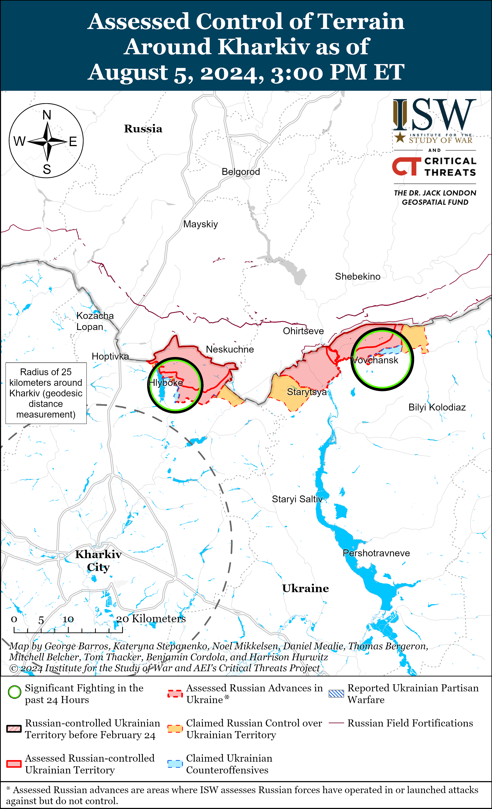
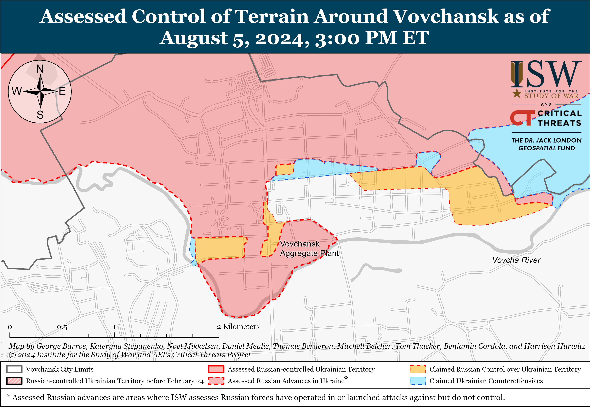
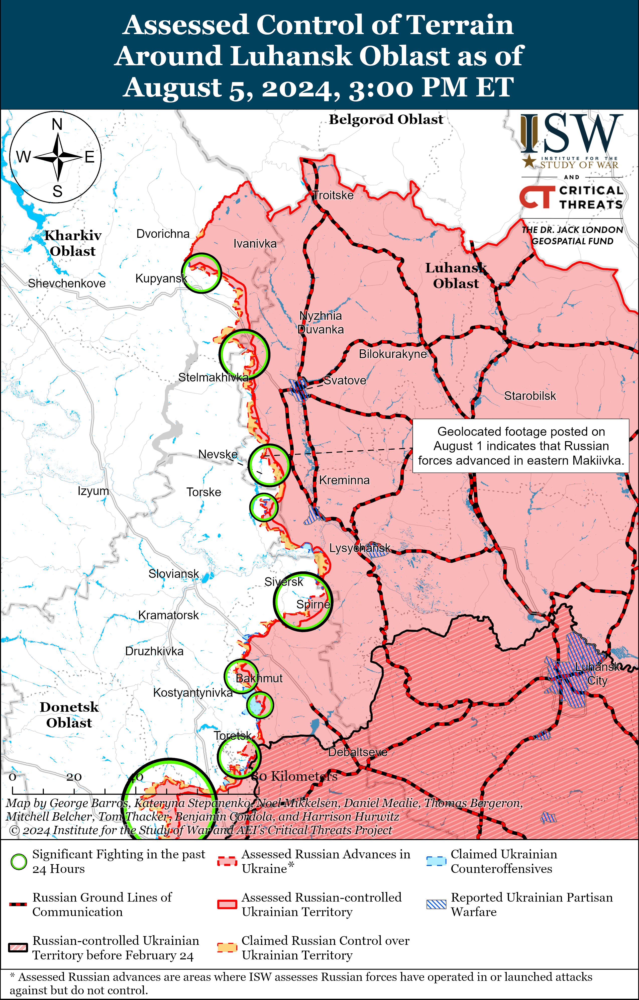
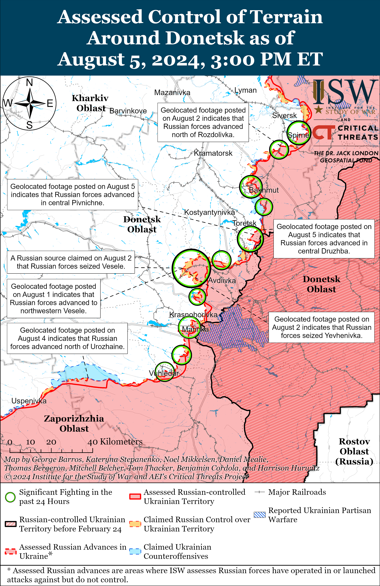
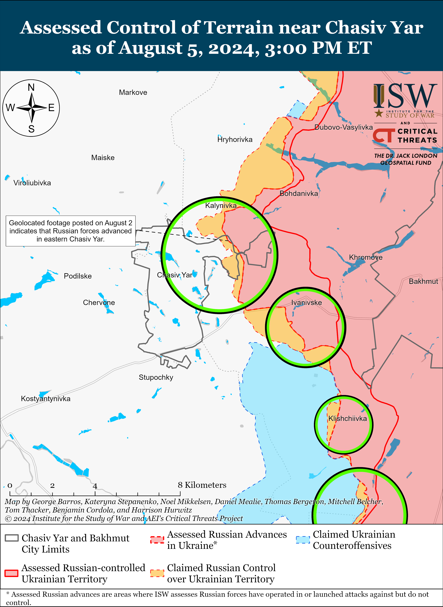
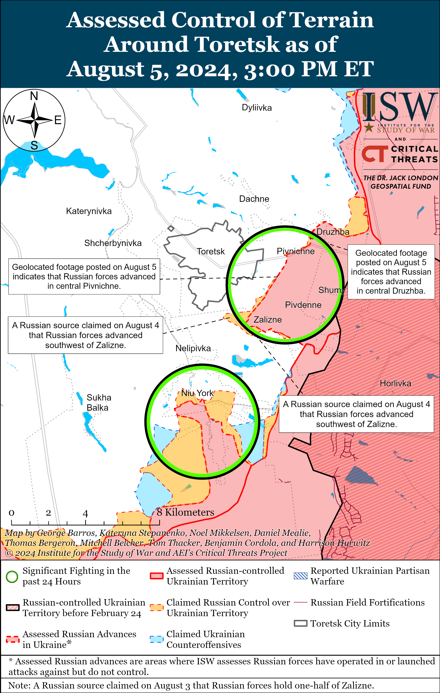
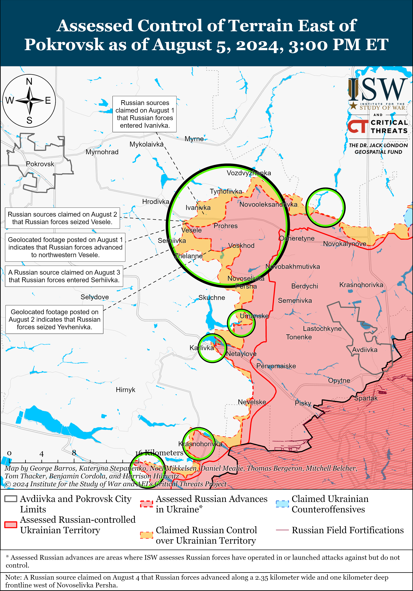
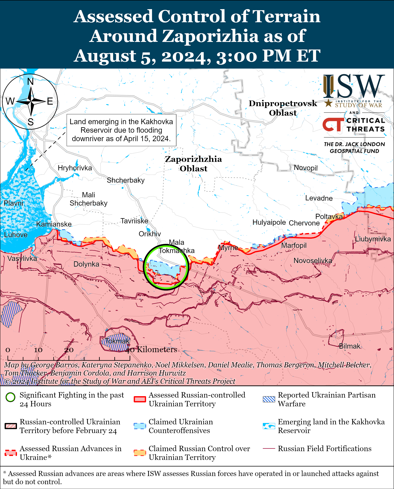
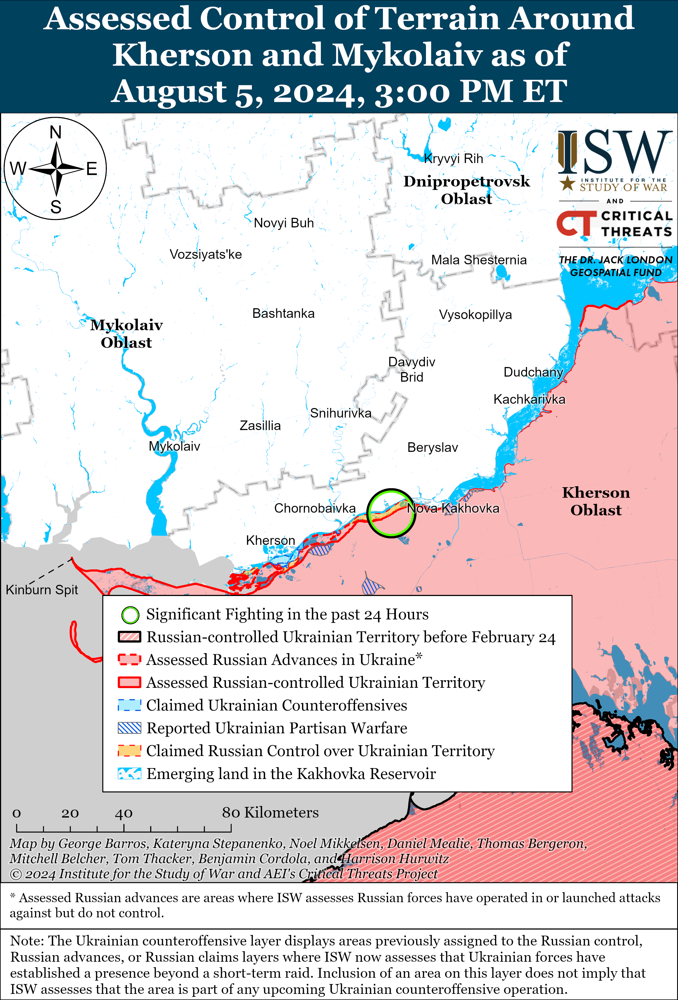

# Russian Offensive Campaign Assessment, August 5, 2024

**Angelica Evans, Nicole Wolkov, Davit Gasparyan, Karolina Hird, and Frederick W. Kagan**

**August 5, 2024, 5:40pm ET**

**Click**[**here**](https://storymaps.arcgis.com/stories/36a7f6a6f5a9448496de641cf64bd375)**to see ISW’s interactive map of the Russian invasion of Ukraine. This map is updated daily alongside the static maps present in this report.**

**Click**[**here**](https://understandingwar.maps.arcgis.com/apps/instant/3dviewer/index.html?appid=1602762dbcde419bb957dea358449580)**to see ISW’s 3D control of terrain topographic map of Ukraine. Use of a computer (not a mobile device) is strongly recommended for using this data-heavy tool.**

**Click**[**here**](https://storymaps.arcgis.com/stories/733fe90805894bfc8562d90b106aa895)**to access ISW’s archive of interactive time-lapse maps of the Russian invasion of Ukraine. These maps complement the static control-of-terrain map that ISW produces daily by showing a dynamic frontline. ISW will update this time-lapse map archive monthly.**

**Note: The data cut-off for this product was 12pm ET on August 5. ISW will cover subsequent reports in the August 6 Russian Offensive Campaign Assessment.**

**Russian authorities detained the head of the Russian Ministry of Defense’s (MoD) Patriot Park, Vyacheslav Akhmedov, and Deputy Head of the Russian MoD’s Directorate for Innovative Development Major General Vladimir Shesterov on suspicion of large-scale fraud as of August 5.[1]**Russian law enforcement told Kremlin newswire *TASS* that they suspect Akhmedov and Shesterov of embezzling over 40 million rubles (roughly $471,000) during public procurement for the park and warned that there may be additional defendants in the case.[2] Patriot Park was reportedly the personal project of former Russian Defense Minister and current Security Council Secretary Sergei Shoigu, and recently detained former Russian Deputy Defense Minister Timur Ivanov reportedly oversaw construction of the park.[3] A Russian milblogger who is particularly critical of the Russian military command praised Akhmedov’s and Shesterov’s arrests and claimed that Akhmedov and Shesterov were part of the “old team” that controlled the Russian MoD under Shoigu’s leadership, suggesting that their arrests are “indicative” of Shoigu’s diminishing influence.[4] A Russian insider source who has previously correctly predicted several command changes within the Russian MoD suggested that recently dismissed former Deputy Defense Minister Army General Pavel Popov, who is reportedly involved with Russia’s National Defense Control Center, could be the next high-ranking MoD official to be arrested.[5] Russian officials have arrested several senior Russian defense officials since April 2024 on similar corruption charges.[6] Russian milbloggers previously theorized that the arrests of Ivanov and other high-ranking defense officials affiliated with Shoigu could be indicative of Shoigu’s declining influence within the Kremlin, as well as the Kremlin’s desire to “clean house” of Shoigu’s old guard affiliates under the Russian MoD’s new leadership.[7]

**A Russian insider source who has previously correctly predicted several command changes within the Russian MoD claimed on August 5 that the Head of the Russian MoD’s Main Armored Directorate, Lieutenant General Alexander Shestakov, will leave his position in the near future.[8]** Russian President Vladimir Putin appointed Shestakov as head of the MoD’s Main Armored Directorate days before Russia’s full-scale invasion of Ukraine in February 2022, and Shestakov is responsible for the MoD’s efforts to plan and mobilize Russia’s production of armored vehicles.[9] ISW cannot confirm this potential command change at this time.

**Russian Security Council Secretary Sergei Shoigu met with various high-ranking Iranian officials in Tehran on August 5, including Iranian President Masoud Pezeshkian,** **Armed Forces General Staff Chief Major General Mohammad Bagheri, and Iranian Supreme National Security Council Secretary Ali Akhbar Ahmadian.[10]**CTP–ISW’s August 5 Iran Update will cover Shoigu’s meetings and their regional context in greater depth.

**Russia is tightening pre-departure standards for Tajik migrants hoping to work in Russia, likely as part of ongoing Russian efforts to address security threats from the Islamic State’s Afghan branch IS-Khorasan (IS-K) following the Crocus City Hall terrorist attack in March 2024.**The Tajik Ministry of Labor, Migration, and Employment reported on August 5 that it jointly launched a Russian passport and visa service representative office in Dushanbe with the Russian Ministry of Internal Affairs (MVD) in May 2024.[11] The representative office will conduct preliminary checks on Tajik citizens who want to work in Russia and will allow Tajik citizens to undergo fingerprinting registration and check bans on entry into Russia while remaining in Tajikistan. The Tajik Ministry of Labor, Migration, and Employment stated that it discussed pre-departure procedures for Tajik migrants heading to Russia and improvements in the “safe, legal, and orderly migration” of Tajik citizens to Russia with Russian authorities. Kremlin newswire *TASS*reported that new Russian procedures require Russian businesses to interview prospective employees from Tajikistan before they travel to Russia in order to ensure that the individual has all the necessary documents to work in Russia.[12] The Tajik Ministry of Labor, Migration, and Employment also announced that Tajikistan and Russia agreed to organize Russian language courses and Russian language, history, and law exams for Tajik citizens attempting to work in Russia. Russia intensified its engagement with Tajik authorities following the Crocus City Hall attack to strengthen security and has previously refused entry to migrants from Central Asian countries at airports and land border crossings.[13] Russia is also likely emphasizing efforts to test potential migrants’ knowledge of Russian language, cultural norms, and laws in order to placate the Russian ultranationalist community, which regularly levies xenophobic criticism against Central Asian migrants and advocates for Russia to issue them an ultimatum of assimilating fully to Russian culture or leaving Russia.[14]

**Ukraine’s Main Military Intelligence Directorate (GUR), citing satellite imagery, reported that Ukrainian drone strikes destroyed an Su-34 bomber aircraft and an ammunition warehouse at the Morozovsk Airfield in Rostov Oblast on August 3.[15]**The GUR reported on August 5 that the imagery shows that debris from falling Ukrainian drones also damaged two more aircraft, four “technical buildings,” and two hangars at the airfield. A Russian milblogger claimed on August 4 that 18 Ukrainian drones struck their targets and destroyed an Su-34 bomber aircraft and a warehouse with aviation weapons and damaged a flight control point and engineering equipment during the August 3 strike.[16] The Ukrainian General Staff reported that Ukrainian forces conducted a series of successful drone strikes against likely military targets in Rostov, Kursk, and Belgorod oblasts, including the Morozovsk Airfield, on August 3.[17]

**Key Takeaways:**

- **Russian authorities detained the head of the Russian Ministry of Defense’s (MoD) Patriot Park, Vyacheslav Akhmedov, and Deputy Head of the Russian MoD’s Directorate for Innovative Development Major General Vladimir Shesterov on suspicion of large-scale fraud as of August 5.**
- **A Russian insider source who has previously correctly predicted several command changes within the Russian MoD claimed on August 5 that the Head of the Russian MoD’s Main Armored Directorate, Lieutenant General Alexander Shestakov, will leave his position in the near future.**
- **Russian Security Council Secretary Sergei Shoigu met with various high-ranking Iranian officials, including Iranian President Masoud Pezeshkian,** **Armed Forces General Staff Chief Major General Mohammad Bagheri, and Iranian Supreme National Security Council Secretary Ali Akhbar Ahmadian in Tehran on August 5.**
- **Russia is tightening pre-departure standards for Tajik migrants hoping to work in Russia, likely as part of ongoing Russian efforts to address security threats from the Islamic State’s Afghan branch IS-Khorasan (IS-K) following the Crocus City Hall terrorist attack in March 2024.**
- **Ukraine’s Main Military Intelligence Directorate (GUR), citing satellite imagery, reported that Ukrainian drone strikes destroyed an Su-34 bomber aircraft and an ammunition warehouse at the Morozovsk Airfield in Rostov Oblast on August 3.**
- **Russian forces advanced east of Toretsk and Pokrovsk and near Donetsk City and Robotyne.**
- **The Kremlin continues efforts to position Russian veterans who have fought in Ukraine in domestic political roles.**

***We do not report in detail on Russian war crimes because these activities are well-covered in Western media and do not directly affect the military operations we are assessing and forecasting. We will continue to evaluate and report on the effects of these criminal activities on the Ukrainian military and the Ukrainian population and specifically on combat in Ukrainian urban areas. We utterly condemn Russian violations of the laws of armed conflict and the Geneva Conventions and crimes against humanity even though we do not describe them in these reports.***

- Russian Main Effort – Eastern Ukraine (comprised of three subordinate main efforts)
- Russian Subordinate Main Effort #1 – Push Ukrainian forces back from the international border with Belgorod Oblast and approach to within tube artillery range of Kharkiv City
- Russian Subordinate Main Effort #2 – Capture the remainder of Luhansk Oblast and push westward into eastern Kharkiv Oblast and encircle northern Donetsk Oblast
- Russian Subordinate Main Effort #3 – Capture the entirety of Donetsk Oblast
- Russian Supporting Effort – Southern Axis
- Russian Air, Missile, and Drone Campaign
- Russian Mobilization and Force Generation Efforts
- Russian Technological Adaptations
- Activities in Russian-occupied areas
- Ukrainian Defense Industrial Base Efforts
- Russian Information Operations and Narratives
- Significant Activity in Belarus

**Russian Main Effort – Eastern Ukraine**

**Russian Subordinate Main Effort #1 – Kharkiv Oblast (Russian objective: Push Ukrainian forces back from the international border with Belgorod Oblast and approach to within tube artillery range of Kharkiv City)**

Positional engagements continued in northern Kharkiv Oblast on August 5, but there were no confirmed changes to the frontline. Ukrainian and Russian sources reported continued fighting north of Kharkiv City near Hlyboke and Lyptsi and northeast of Kharkiv City in and near Vovchansk and Tykhe on August 4 and 5.[18] The Ukrainian Kharkiv Group of Forces reported on August 5 that elements of the Russian 79th Motorized Rifle Regiment (18th Motorized Rifle Division, 11th Army Corps [AC], Leningrad Military District [LMD]) and elements of the Russian 155th Naval Infantry Brigade (Pacific Fleet) are trying to coordinate with each other in Hlyboke.[19] Elements of the Russian 153rd Tank Regiment (47th Tank Division, 1st Guards Tank Army, Moscow Military District [MMD]) are operating in Vovchansk.[20]

**Russian Subordinate Main Effort #2 – Luhansk Oblast (Russian objective: Capture the remainder of Luhansk Oblast and push westward into eastern Kharkiv Oblast and northern Donetsk Oblast)**

Russian forces continued ground attacks along the Kupyansk-Svatove-Kreminna line on August 5 but did not make any confirmed advances. A Russian milblogger claimed that Russian forces seized several Ukrainian strongholds along the Berestove-Pishchane line (southeast of Kupyansk), although ISW has not observed visual confirmation of this claim.[21] Fighting continued east of Kupyansk near Petropavlivka; southeast of Kupyansk near Berestove, Pishchane, and Stelmakhivka; northwest of Kreminna near Makiivka, Nevske, and Terny; and southwest of Kreminna near Dibrova on August 4 and 5.[22]

**Russian Subordinate Main Effort #3 – Donetsk Oblast (Russian objective: Capture the entirety of Donetsk Oblast, the claimed territory of Russia’s proxies in Donbas)**

Russian forces continued limited offensive operations in the Siversk direction on August 5 but did not make any confirmed advances. A Russian milblogger claimed that Russian forces advanced 1.5 kilometers north of Rozdolivka towards Pereizne (both south of Siversk).[23] The Ukrainian General Staff reported that Russian forces unsuccessfully attacked east of Siversk near Verkhnokamyanske; southeast of Siversk near Ivano-Darivka, Spirne, and Vyimka; and south of Siversk near Pereizne on August 4 and 5.[24] Elements of the Russian 123rd Motorized Rifle Brigade (2nd Luhansk People’s Republic Army Corps [LNR AC]) reportedly continue to operate near Siversk.[25]

Russian forces continued offensive operations in the Chasiv Yar direction on August 5 but did not make any confirmed advances. Russian sources claimed that Russian forces, including airborne (VDV) elements, continue to improve their positions in the eastern part of Chasiv Yar and along the Siverskyi-Donets Donbas Canal.[26] The Ukrainian General Staff reported that Russian forces unsuccessfully attacked near Chasiv Yar, east of Chasiv Yar near Ivanivske, southeast of Chasiv Yar near Andriivka and Klishchiivka, and south of Chasiv Yar near Stupochky and Bila Hora.[27]

Russian forces have recently made significant tactical advances in the Toretsk direction. Geolocated footage published on August 5 shows that Russian forces advanced up to Kosmonavtiv Street in central Druzhba (east of Toretsk).[28] Additional geolocated footage published on August 4 shows that Russian forces have advanced westward across Shkilna Street towards and across Tsentralna Street in western Pivnichne (also east of Toretsk), and Russian milbloggers claimed that Russian forces made additional advances within central Pivnichne.[29] Russian milbloggers claimed that Russian forces are advancing within Zalizne (southeast of Toretsk) and near the Tsentralna electric substation just west of Zalizne, and are also trying to bypass the Phenol plant in central Niu York (south of Toretsk).[30] The Ukrainian General Staff reported Russian ground attacks near Toretsk itself and near Niu York, Zalizne, and Pivnichne on August 5.[31] Elements of the Russian 132nd Motorized Rifle Brigade and 3rd Motorized Rifle Brigade (both of the 1st Donetsk People’s Republic [DNR] AC) are reportedly operating south and southeast of Toretsk near Niu York and Horlivka.[32]

Russian forces reportedly continue to advance east of Pokrovsk on August 5, and Russian sources claimed that Russian forces are closer to completing a tactical encirclement of Ukrainian forces near the T-0511 (O-054) road southeast of Pokrovsk. The DNR Security Services told Kremlin newswire *TASS* on August 5 that Russian forces have encircled elements of three Ukrainian brigades near Zhelanne (on the T-0511 road southeast of Pokrovsk).[33] Several Russian sources claimed that Russian forces have made additional advances in fields west and east of Zhelanne, and some milbloggers claimed that Russian assault groups have even entered Zhelanne itself, although ISW has not yet observed visual confirmation of Russian troops operating within the settlement.[34] Russian milbloggers additionally claimed that Russian forces have advanced within Ivanivka (north of Zhelanne and east of Pokrovsk); west of Novoselivka Persha (just east of Zhelanne and southeast of Pokrovsk); near Mezhove (southeast of Zhelanne); and near Serhiivka (west of Zhelanne).[35] The Ukrainian General Staff reported continued fighting northeast of Pokrovsk near Kalynove and Vozdvyzhenka; east of Pokrovsk near Novooleksandrivka, Svyrydonivka, and Ivanivka; southeast of Pokrovsk near Zhelanne, Yasnobrodivka, and Karlivka on August 4 and 5.[36] Ukrainian military observer Kostyantyn Mashovets noted that several 1st DNR AC elements, including its 1st and 9th motorized rifle brigades are operating near Karlivka, southeast of Pokrovsk.[37]

Russian forces recently made a marginal advance west of Donetsk City amid continued offensive operations west and southwest of Donetsk City on August 5. Geolocated footage published on August 5 indicates that Russian forces have advanced west along Sedova Street in northwestern Krasnohorivka (west of Donetsk City), consistent with a Russian milblogger claim about Russian advances along Sedova Street on August 4.[38] Another Russian milblogger claimed that Russian forces have advanced northward along Chkalova Street in southeastern Kostyantynivka (southwest of Donetsk City).[39] Mashovets stated on August 5 that the majority of Russia’s 8th Combined Arms Army (Southern Military District [SMD]), including its 150th and 20th motorized rifle divisions; 1st DNR AC; and 68th Army Corps (Eastern Military District [EMD]); are committed in the Kurakhove direction (west and southwest of Donetsk City).[40] Mashovets specifically credited elements of the 150th Motorized Rifle Division and 110th Motorized Rifle Brigade (1st DNR AC) with conducting recent mechanized assaults in the Marinka-Maksymilyanivka (southwest of Donetsk City) area.[41] Mashovets also credited elements of the Russian 20th Motorized Rifle Division and the 39th Motorized Rifle Brigade (68th AC, Eastern Military District [EMD]) with recent Russian advances southwest of Donetsk City, including cutting the Vuhledar-Kostyantynivka O-0532 highway on August 2.[42]

A Russian milblogger claimed on August 4 that Russian forces advanced south of Urozhaine (south of Velyka Novosilka) in the Donetsk-Zaporizhia Oblast border area, but ISW has not observed visual confirmation of this claim.[43]

**Russian Supporting Effort – Southern Axis (Russian objective: Maintain frontline positions and secure rear areas against Ukrainian strikes)**

Russian forces marginally advanced northeast of Robotyne in western Zaporizhia Oblast amid continued ground attacks in the area on August 5. Geolocated footage published on July 26 indicates that elements of the Russian 136th Motorized Rifle Brigade (58th Combined Arms Army [CAA], Southern Military District [SMD]) marginally advanced northeast of Robotyne, but this advance is likely not recent.[44] Russian forces also conducted ground assaults near Robotyne itself, northeast of Robotyne near Mala Tokmachka, and northwest of Robotyne near Novodanylivka on August 4 and 5.[45] Elements of the Russian 247th Airborne (VDV) Regiment’s (7th VDV Division) 3rd Battalion are reportedly operating in the direction of Robotyne-Verbove and elements of the Russian 291st Motorized Rifle Regiment (42nd Motorized Rifle Division, 58th CAA, SMD) are reportedly operating in the Zaporizhia direction.[46]

Russian forces continued ground assaults in east (left) bank Kherson Oblast on August 4 and 5, including on the islands in the Dnipro River Delta, but there were no confirmed changes to the frontline.[47]

**Russian Air, Missile, and Drone Campaign (Russian Objective: Target Ukrainian military and civilian infrastructure in the rear and on the frontline)**

Russian forces conducted a series of drone strikes against Ukraine overnight on August 4 to 5 and a missile strike against Mykolaiv Oblast during the day on August 5. Ukrainian Air Force Commander Lieutenant General Mykola Oleshchuk reported that Russian forces launched 24 Shahed-136/131 drones from Primorsko-Akhtarsk, Krasnodar Krai and Kursk Oblast overnight on August 4 to 5 and that Ukrainian forces downed all of the drones over Kyiv, Vinnytsia, Kirovohrad, Kharkiv, Sumy, Poltava and Dnipropetrovsk oblasts.[48] Kyiv Oblast Military Administration Head Ruslan Kravchenko reported that drone debris fell in open areas and did not damage infrastructure.[49] Ukraine’s Southern Operational Command reported on August 5 that Russian forces launched an unspecified type of missile from occupied Kherson Oblast at Mykolaiv Oblast.[50]

The Russian Ministry of Defense (MoD) claimed that Russian forces conducted an Iskander-M ballistic missile strike against Balakliya, Kharkiv Oblast, although ISW has not observed independent confirmation of the strike.[51]

**Russian Mobilization and Force Generation Efforts (Russian objective: Expand combat power without conducting general mobilization)**

The Kremlin continues efforts to position Russian veterans who have fought in Ukraine in domestic political roles. Acting Secretary of Russia’s ruling United Russia political party, Vladimir Yakushev, stated on August 5 that United Russia has nominated 380 veterans of the war in Ukraine as candidates in various regional and federal elections.[52] Yakushev emphasized that supporting veterans of the war in Ukraine during the Fall 2024 election cycle is one of United Russia’s main priorities and claimed that all of Russia should support the veterans as “the entire country is counting on them” during the war. United Russia previously announced that some of the nominated veterans are part of the “Time of Heroes” program – an initiative that Russian President Vladimir Putin announced in April 2024 to train veterans of the war in Ukraine to assume positions in the Russian government.[53] ISW continues to assess that the “Time of Heroes” initiative may be part of ongoing Kremlin efforts to incentivize Russians to sign military service contracts in exchange for compensation and state benefits and to appease the growing veteran population by offering veterans official political roles.[54]

The Russian Ministry of Defense (MoD) continues efforts to expand and improve medical services available to a growing number of wounded Russian military personnel. The Russian MoD announced on August 5 that Russian Deputy Defense Minister Anna Tsivileva and Moscow Deputy Mayor Anastasia Rakova visited Moscow’s “Voronovskoye” Clinical Center for Infectious Diseases and inspected the hospital’s rehabilitation centers.[55] Tsivileva emphasized that the Russian MoD is working to help all Russian federal subjects (regions) develop high-quality medical centers and care facility for all servicemembers and veterans of the war in Ukraine. Russian military officials, including Tsivileva, have recently tried to portray themselves as providing adequate medical care to Russian soldiers who fought in Ukraine after outrage that the Russian military command was reportedly sending injured soldiers to fight on the frontline.[56]

Russian officials continue efforts to coerce Ukrainians in occupied territories and other foreign citizens into service in the Russian military. Kherson Oblast occupation governor Vladimir Saldo amplified a recruitment advertisement on August 5 for the Russian “Margolev” Volunteer Battalion, which is reportedly comprised of Ukrainian citizens living in occupied territories.[57] Ukrainian Kharkiv Group of Forces Spokesperson Colonel Vitaly Sarantsev stated that Russian officials are also recruiting citizens from Middle Eastern, Central Asian, and African countries to fight for the Russian military in Ukraine in exchange for Russian citizenship.[58] Sarantsev stated that Russian officials may also be blackmailing people or promising them large amounts of money in exchange for military service but are counting on the fact that the recruits will likely not survive the war.

**Russian Technological Adaptations (Russian objective: Introduce technological innovations to optimize systems for use in Ukraine)**

Russian milbloggers continue to express concern about the limitations imposed by state control over Russia’s drone production industry. A Russian milblogger claimed on August 4 that Russia is falling behind Ukraine in terms of drone innovations due to the fact that Russian government officials are much older than Ukrainian officials and because the Russian government has monopolized and standardized drone production to the detriment of industry output.[59] Another Russian milblogger claimed that he recently met with Former Roscosmos (Russian space agency) head and Zaporizhia Oblast occupation senator Dmitry Rogozin and discussed the need to integrate technical specialists into frontline units and transfer Russian drone assembly and testing facility to rear areas of occupied Ukraine in order to ensure that recently produced drones meet the actual needs of Russian units.[60] The milblogger noted that the Russian “Hispaniola” Volunteer Brigade (Russian Volunteer Corps) has already transferred its drone assembly and testing facilities to rear areas of occupied Ukraine and suggested that the brigade has successfully increased the effectiveness of its drones. Rogozin has recently engaged with ongoing milblogger criticism of the Russian state “Sudoplatov” drone initiative, which is reportedly supplying Russian units with cheap and defective first-person view (FPV) drones.[61]

Russian state defense conglomerate Rostec posted footage on August 5 showing Rostec subsidiary United Engine Corporation 3-D printing titanium and aluminum castings for aircraft engine body parts.[62] Rostec reported that 3-D printing these castings is part of Russia’s efforts to become self-sufficient and ease its dependencies on sanctioned foreign-produced aircraft parts.[63]

**Ukrainian Defense Industrial Efforts (Ukrainian objective: Develop its defense industrial base to become more self-sufficient in cooperation with US, European, and international partners)**

Ukraine continues to expand its domestic defense industrial base (DIB). Ukrainian Defense Minister Rustem Umerov stated on July 30 that the Ukrainian Ministry of Defense (MoD) signed two unspecified agreements with domestic DIB enterprises worth almost five billion hryvnias (about $121 million).[64] The Ukrainian MoD announced on August 1 that it signed agreements worth over 3.7 billion hryvnias (about $90 million) with domestic manufacturers to supply the Ukrainian military with ground-based strike drones.[65]

The Ukrainian military continues to streamline and simplify its mobilization and recruitment processes to improve ongoing force generation efforts. The Ukrainian General Staff announced on August 1 that it developed proposals to simplify mobilization, reduce the risks to mobilized personnel, allow commanders to select and recruit military personnel directly for service in their units, and allow recruits to choose vacant positions in military units.[66]

Ukraine’s Western partners continue to support Ukraine in building out its defense capabilities. Umerov and Ukraine’s First Lady Olena Zelenska visited Istanbul on August 2 to launch the*Hetman Ivan Vyhovskyi* Ada-class corvette.[67] Umerov stated that Ukraine and Turkey agreed to build the *Hetman Ivan Vyhovskyi* and *Hetman Ivan Mazepa* Ada-class corvettes in Turkey due to Russia’s invasion of Ukraine.

**Activities in Russian-occupied areas (Russian objective: Consolidate administrative control of annexed areas; forcibly integrate Ukrainian citizens into Russian sociocultural, economic, military, and governance systems)**

*ISW is not publishing coverage of activities in Russian-occupied areas today.*

**Russian Information Operations and Narratives**

Kremlin officials and the Russian information space reacted to ongoing right-wing anti-immigration riots in the UK, deliberately misrepresenting the protests and claiming that the response of UK authorities is inadequate and a sign of Western hypocrisy. Russian Foreign Ministry spokesperson Maria Zakharova criticized the UK and the West for “lecturing” Russia about its crackdown on protests while using unjustified force against right-wing anti-immigration protests that have been spreading in the UK.[68] The Russian information space has been sympathetic to the protesters and critical of UK authorities who they claim are siding with “violent migrants.” Russian sources amplified footage purportedly showing “migrant gangs” attacking innocent civilians and drew parallels between the situation in the UK and Russia, claiming that the incompetence of authorities contributes to the “Islamization” of both countries.[69] A Russian news outlet referred to the UK anti-immigration protests as a “Wahhabi uprising” and called for Russian authorities to introduce a visa regime with Central Asia and the South Caucasus alongside other similar measures curtailing the flow and rights of migrants in Russia.[70] These attitudes are not isolated informational frameworks in Russia as ISW continues to assess that Russian officials intensified xenophobic and Islamophobic rhetoric following recent terrorist attacks in Crocus City Hall and the Republic of Dagestan. Russian ultranationalist commentators are likely hoping to seize on the protests in the UK in order to further their own xenophobic and anti-migrant narratives while also fueling division within the West.

Russian media continues to accuse the West of attempting to isolate Russia from global sports competitions over the backdrop of the ongoing Summer Olympics. The Russian Foreign Intelligence Service (SVR) claimed on August 5 that the US is leading campaigns to isolate Russian athletes from competing in synchronized swimming, figure skating, and rhythmic gymnastics.[71] The SVR claimed that the US is collaborating with Grigory Rodchenkov, the former head of Russia’s national anti-doping laboratory, and Timofey Sobolevsky, the former deputy head of the Anti-Doping Laboratory, both of whom previously revealed Russia’s state-sponsored doping program and contributed to the ban of the Russian Olympic Team from the Olympic Games.[72] Rodchenkov and Sobolevsky fled Russia after speaking out about the state-sponsored doping program and are living in hiding.[73] Kremlin newswire *TASS*claimed on August 5 that Russian law enforcement added Rodchenkov and Sobolevsky to a Russian Ministry of Internal Affairs wanted list for reportedly interfering with a Russian athlete database..[74]

**Significant activity in Belarus (Russian efforts to increase its military presence in Belarus and further integrate Belarus into Russian-favorable frameworks and Wagner Group activity in Belarus)**

Belarusian Air Force and Air Defense Forces Deputy Commander Colonel Mikhail Matrosov stated on August 5 that Belarusian Air Force and Air Defense Forces will participate in military exercises at the Ashuluk training ground in Russia’s Astrakhan Oblast.[75]

**Note: ISW does not receive any classified material from any source, uses only publicly available information, and draws extensively on Russian, Ukrainian, and Western reporting and social media as well as commercially available satellite imagery and other geospatial data as the basis for these reports. References to all sources used are provided in the endnotes of each update.**

---

[1] https://t.me/tass\_agency/264457

[2] https://t.me/tass\_agency/264463 ; https://t.me/tass\_agency/264464 ; https://t.me/tass\_agency/264477 ; https://tass dot ru/proisshestviya/21533665

[3] https://www.bbc.com/russian/articles/ckgwwlk9e14o ; https://t.me/postnewsru/46947 ; https://theins dot ru/korrupciya/152511

[4] https://t.me/dva\_majors/48824; https://t.me/dva\_majors/48823

[5] https://t.me/arbat/1846

[6] https://isw.pub/UkrWar042424 ; https://isw.pub/UkrWar051324 ; https://isw.pub/UkrWar051424 ; https://understandingwar.org/backgrounder/russian-offensive-campaign-assessment-may-15-2024 ; https://isw.pub/UkrWar072624 ; https://understandingwar.org/backgrounder/russian-offensive-campaign-assessment-june-17-2024 ; https://isw.pub/UkrWar052324 ; https://isw.pub/UkrWar052124 ; https://understandingwar.org/backgrounder/russian-offensive-campaign-assessment-may-15-2024

[7] https://isw.pub/UkrWar042424 ; https://isw.pub/UkrWar051324 ; https://isw.pub/UkrWar051424 ; https://understandingwar.org/backgrounder/russian-offensive-campaign-assessment-may-15-2024 ; https://isw.pub/UkrWar072624 ; https://understandingwar.org/backgrounder/russian-offensive-campaign-assessment-june-17-2024 ; https://isw.pub/UkrWar052324 ; https://isw.pub/UkrWar052124 ; https://understandingwar.org/backgrounder/russian-offensive-campaign-assessment-may-15-2024

[8] https://t.me/arbat/1845

[9] https://1743 dot ru/news/56488 ; https://www.ural56 dot ru/news/675408/?\_\_cf\_chl\_tk=m7KOj6Fbt5GrguyNcCFILOpp3QBgB1zDqvNN0M1kZ38-1722887710-0.0.1.1-6633 ; https://structure dot mil.ru/structure/ministry\_of\_defence/details.htm?id=9742@egOrganization

[10] https://t.me/tass\_agency/264447 ; https://tass dot ru/politika/21532667 ; https://t.me/tass\_agency/264489

[11] https://mehnat dot tj/ru/news/dt/27992682-25a6-4248-93c1-563ec790053b

[12] https://tass dot ru/obschestvo/21534691

[13] https://isw.pub/UkrWar050324 ; https://rus.ozodi.org/a/v-aeroportu-sheremetjevo-okolo-50-grazhdanam-tadzhikistana-otkazali-vo-vezde-v-rossiyu-/33060957.html

[14] https://isw.pub/UkrWar040924 ; https://isw.pub/UkrWar032324 ; https://understandingwar.org/backgrounder/russian-offensive-campaign-assessment-january-17-2024

[15] https://understandingwar.org/backgrounder/russian-offensive-campaign-assessment-august-3-2024 ; https://gur.gov dot ua/content/znyshcheno-su-34-ta-sklad-bk-detali-bavovny-na-aerodromi-morozovsk.html

[16] https://t.me/dosye\_shpiona/578

[17] https://understandingwar.org/backgrounder/russian-offensive-campaign-assessment-august-3-2024

[18]https://www.facebook.com/GeneralStaff.ua/posts/pfbid02yvc6FBfLVFCs32EUcQ5nzrBJ7QCgzc2Jr7DX5nBtg5WgZ3aR8CPcYD9VroLkcJzvl ; https://www.facebook.com/GeneralStaff.ua/posts/pfbid02z6797agdR6FR7gNHcUgFYtSPrU9T1R3u3wXMo1EFBLJ41rn6HU39ErnQ2KyY4LXcl ; https://www.facebook.com/GeneralStaff.ua/posts/pfbid02JK9pBfJWNnDGBBvJ8niCXzeLZoArXkRQVFiD4RRYxb9hGL1JXWUBJgXewgNahsR5l ; https://t.me/mod\_russia/41813; https://t.me/dva\_majors/48789; https://t.me/wargonzo/21383

[19] https://t.me/otukharkiv/604

[20] https://t.me/otukharkiv/604

[21] https://t.me/dva\_majors/48789

[22] https://www.facebook.com/GeneralStaff.ua/posts/pfbid02yvc6FBfLVFCs32EUcQ5nzrBJ7QCgzc2Jr7DX5nBtg5WgZ3aR8CPcYD9VroLkcJzvl ; https://www.facebook.com/GeneralStaff.ua/posts/pfbid02z6797agdR6FR7gNHcUgFYtSPrU9T1R3u3wXMo1EFBLJ41rn6HU39ErnQ2KyY4LXcl ; https://www.facebook.com/GeneralStaff.ua/posts/pfbid02JK9pBfJWNnDGBBvJ8niCXzeLZoArXkRQVFiD4RRYxb9hGL1JXWUBJgXewgNahsR5l ; https://t.me/mod\_russia/41808

[23] https://t.me/DnevnikDesantnika/13401

[24] https://www.facebook.com/GeneralStaff.ua/posts/pfbid02yvc6FBfLVFCs32EUcQ5nzrBJ7QCgzc2Jr7DX5nBtg5WgZ3aR8CPcYD9VroLkcJzvl; https://www.facebook.com/GeneralStaff.ua/posts/pfbid02z6797agdR6FR7gNHcUgFYtSPrU9T1R3u3wXMo1EFBLJ41rn6HU39ErnQ2KyY4LXclhttps://www.facebook.com/GeneralStaff.ua/posts/pfbid02JK9pBfJWNnDGBBvJ8niCXzeLZoArXkRQVFiD4RRYxb9hGL1JXWUBJgXewgNahsR5l

[25] https://t.me/sons\_fatherland/16018

[26] https://t.me/RVvoenkor/74024;. https://t.me/wargonzo/21383; https://t.me/dva\_majors/48789; https://t.me/DnevnikDesantnika/13404; https://t.me/basurin\_e/13187

[27] https://www.facebook.com/GeneralStaff.ua/posts/pfbid02yvc6FBfLVFCs32EUcQ5nzrBJ7QCgzc2Jr7DX5nBtg5WgZ3aR8CPcYD9VroLkcJzvl; https://www.facebook.com/GeneralStaff.ua/posts/pfbid02z6797agdR6FR7gNHcUgFYtSPrU9T1R3u3wXMo1EFBLJ41rn6HU39ErnQ2KyY4LXcl

[28] https://t.me/ZSU\_32\_OMBR/69; https://t.me/creamy\_caprice/6260

[29] https://t.me/creamy\_caprice/6261; https://t.me/liut\_npu/451; https://t.me/RVvoenkor/73997; https://t.me/creamy\_caprice/6255; https://t.me/z\_arhiv/27530

[30] https://t.me/RVvoenkor/74006; https://t.me/dva\_majors/48789; https://t.me/boris\_rozhin/132433; https://t.me/RVvoenkor/74024

[31] https://www.facebook.com/GeneralStaff.ua/posts/pfbid02yvc6FBfLVFCs32EUcQ5nzrBJ7QCgzc2Jr7DX5nBtg5WgZ3aR8CPcYD9VroLkcJzvl; https://www.facebook.com/GeneralStaff.ua/posts/pfbid02z6797agdR6FR7gNHcUgFYtSPrU9T1R3u3wXMo1EFBLJ41rn6HU39ErnQ2KyY4LXcl

[32] https://t.me/ZaRodinyVmesteZOV/15681; https://t.me/wargonzo/21389; https://t.me/russianocontext/4195 ; https://x.com/666\_mancer/status/1820190176326377654

[33] https://t.me/tass\_agency/264409

[34] https://t.me/RVvoenkor/73998; https://t.me/z\_arhiv/27520; https://t. me/z\_arhiv/27515; https://t.me/motopatriot/25849; https://t.me/rybar/62443; https://t.me/dva\_majors/48789

[35] https://t.me/rybar/62443; https://t.me/RVvoenkor/73995; https://t.me/RVvoenkor/73998; https://t.me/wargonzo/21383; https://t.me/z\_arhiv/27515; https://t.me/z\_arhiv/27519; https://t.me/RVvoenkor/74024; https://t.me/dva\_majors/48792

[36] https://www.facebook.com/GeneralStaff.ua/posts/pfbid02yvc6FBfLVFCs32EUcQ5nzrBJ7QCgzc2Jr7DX5nBtg5WgZ3aR8CPcYD9VroLkcJzvl; https://www.facebook.com/GeneralStaff.ua/posts/pfbid02z6797agdR6FR7gNHcUgFYtSPrU9T1R3u3wXMo1EFBLJ41rn6HU39ErnQ2KyY4LXcl; https://www.facebook.com/GeneralStaff.ua/posts/pfbid02JK9pBfJWNnDGBBvJ8niCXzeLZoArXkRQVFiD4RRYxb9hGL1JXWUBJgXewgNahsR5l

[37] https://t.me/zvizdecmanhustu/2093

[38] https://x.com/Bielitzling/status/1820437252553535666; https://t.me/FilimonovGonor/201; https://t.me/DnevnikDesantnika/13380

[39] https://t.me/z\_arhiv/27517

[40] https://t.me/zvizdecmanhustu/2092 ; https://www.facebook.com/pashtetof/posts/pfbid07dpgLKTfBfqmum3tb9DxgJq1WQbTN71qKZnVY9hp7gTrb3s5F1LSc6jx9sKThpo8l

[41] https://t.me/zvizdecmanhustu/2093

[42] https://understandingwar.org/backgrounder/russian-offensive-campaign-assessment-august-2-2024 ; https://t.me/zvizdecmanhustu/2093 ; https://t.me/zvizdecmanhustu/2094

[43] https://t.me/z\_arhiv/27513

[44] https://x.com/moklasen/status/1820188881955787082; https://t.me/brigada0005/727; https://t.me/creamy\_caprice/6257

[45] https://www.facebook.com/GeneralStaff.ua/posts/pfbid02yvc6FBfLVFCs32EUcQ5nzrBJ7QCgzc2Jr7DX5nBtg5WgZ3aR8CPcYD9VroLkcJzvl ; https://www.facebook.com/GeneralStaff.ua/posts/pfbid02z6797agdR6FR7gNHcUgFYtSPrU9T1R3u3wXMo1EFBLJ41rn6HU39ErnQ2KyY4LXcl ; https://www.facebook.com/GeneralStaff.ua/posts/pfbid02JK9pBfJWNnDGBBvJ8niCXzeLZoArXkRQVFiD4RRYxb9hGL1JXWUBJgXewgNahsR5l ; https://t.me/dva\_majors/48789 ; https://t.me/z\_arhiv/27521 ; https://t.me/wargonzo/21383 ;

[46] https://t.me/motopatriot/25855; https://t.me/ZA\_FROHT/31813 (Robotyne-Verbove); https://t.me/dva\_majors/48820 (Zaporizhia direction )

[47] https://t.me/dva\_majors/48789 ; https://www.facebook.com/GeneralStaff.ua/posts/pfbid02JK9pBfJWNnDGBBvJ8niCXzeLZoArXkRQVFiD4RRYxb9hGL1JXWUBJgXewgNahsR5l ; https://www.facebook.com/GeneralStaff.ua/posts/pfbid02z6797agdR6FR7gNHcUgFYtSPrU9T1R3u3wXMo1EFBLJ41rn6HU39ErnQ2KyY4LXcl ; https://www.facebook.com/GeneralStaff.ua/posts/pfbid02yvc6FBfLVFCs32EUcQ5nzrBJ7QCgzc2Jr7DX5nBtg5WgZ3aR8CPcYD9VroLkcJzvl

[48] https://t.me/ComAFUA/374

[49] https://www.facebook.com/100091315017222/posts/422055247514972/?mibextid=WC7FNe&rdid=jBviXo6ZNCOSCjYp

[50] https://t.me/SJTF\_Odes/10818; https://t.me/SJTF\_Odes/10819

[51] https://t.me/tass\_agency/264361 ; https://t.me/mod\_russia/41808

[52] https://oblgazeta dot ru/society/elections/2024/08/60155/  ; https://t.me/RVvoenkor/74052 ; https://t.me/SolovievLive/272490

[53] https://understandingwar.org/backgrounder/russian-offensive-campaign-assessment-july-3-2024

[54] https://understandingwar.org/backgrounder/russian-offensive-campaign-assessment-july-3-2024 ; https://understandingwar.org/backgrounder/russian-offensive-campaign-assessment-march-18-2024 ; https://understandingwar.org/backgrounder/russian-offensive-campaign-assessment-june-15-2024

[55] https://t.me/mod\_russia/41800

[56] https://understandingwar.org/backgrounder/russian-offensive-campaign-assessment-july-26-2024 ; https://understandingwar.org/backgrounder/russian-offensive-campaign-assessment-july-5-2024 ; https://understandingwar.org/backgrounder/russian-offensive-campaign-assessment-july-11-2024

[57] https://t.me/SALDO\_VGA/3950 ; https://understandingwar.org/backgrounder/russian-offensive-campaign-assessment-july-29-2023

[58] https://armyinform dot com.ua/2024/08/05/v-otu-harkiv-rozpovily-yakyj-inozemnyj-kontyngent-vorog-zaluchaye-na-shturmy/

[59] https://t.me/xronikabpla/7479 ; https://t.me/notes\_veterans/18511

[60] https://t.me/zhivoff/16017 ; https://t.me/notes\_veterans/18521

[61] https://understandingwar.org/backgrounder/russian-offensive-campaign-assessment-august-2-2024

[62] https://3dtoday dot ru/blogs/news3dtoday/rostex-pokazal-3d-pecat-zagotovki-detali-aviacionnogo-dvigatelya ; https://www.aviaport dot ru/news/kak-izgotavlivayut-detali-dlya-aviadvigateley-metodom-3d-pechati/

[63] https://understandingwar.org/backgrounder/russian-offensive-campaign-assessment-august-23-2023

[64] https://armyinform dot com.ua/2024/07/30/rustem-umyerov-pidpysano-krytychno-vazhlyvi-dlya-zsu-ugody-z-pidpryyemstvamy-opk/

[65] https://www.mil.gov dot ua/news/2024/08/01/zbilshuemo-obsyagi-zakupivelnazemnih-droniv-kamikadze-vitchiznyanogo-virobnicztva-%E2%80%93-dmitro-klimenkov/; https://mil.in dot ua/uk/news/minoborony-uklalo-ugody-z-vyrobnykamy-nazemnyh-droniv-kamikadze-ta-boyeprypasiv-na-3-7-mlrd-gryven/

[66] https://www.facebook.com/GeneralStaff.ua/posts/pfbid0CyYJnugzqvn14RbAJ2T858KtkSSzU9jvBWBHptyT1zPV82T58hEyCjHen3epHNuhl

[67] https://www.facebook.com/rustemumerov.ua/posts/pfbid02q4Dx4SfLfkh39x1L7V9JZDuGcaYHFLzN2tTdMeYEVgRxjHdUuFF42boUTJn6uxsJl

[68] https://t.me/rybar/62463

[69] https://t.me/segodnia\_ru/3406;

[70] https://t.me/segodnia\_ru/3406

[71] https://t.me/tass\_agency/264384 ; https://t.me/tass\_agency/264385 ; https://t.me/tass\_agency/264388

[72] https://www.bbc.com/news/stories-53596997

[73] https://www.bbc.com/news/stories-53596997; https://tass dot com/sports/1825389

[74] https://t.me/tass\_agency/264405 ; https://t.me/tass\_agency/264407 ; https://t.me/tass\_agency/264426 ; https://meduza dot io/news/2024/08/05/byvshego-zamglavy-moskovskoy-antidopingovoy-laboratorii-ob-yavili-v-rozysk

[75] https://t.me/modmilby/40859
