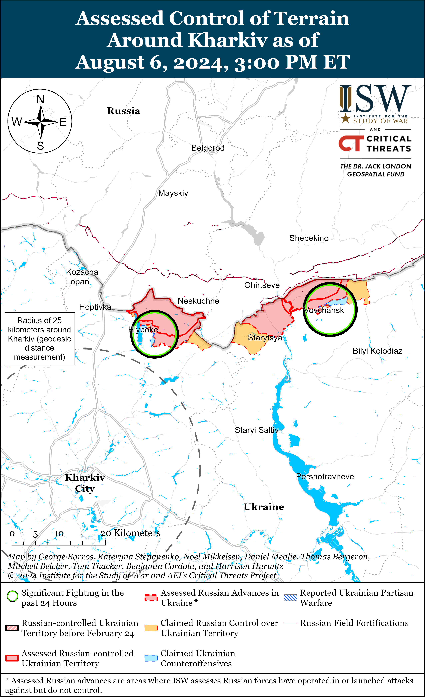
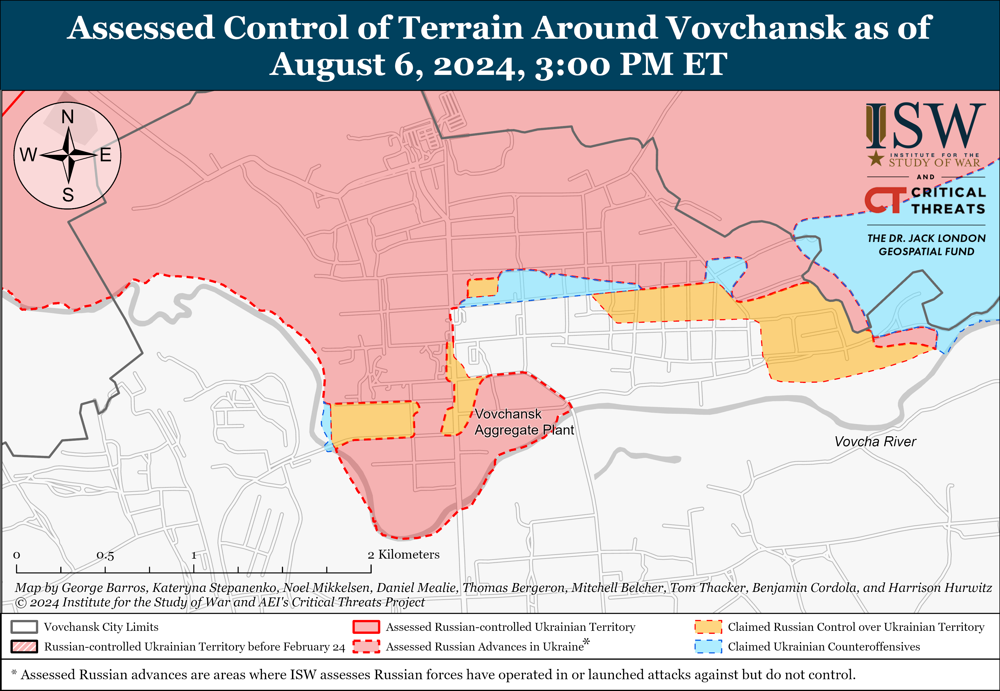
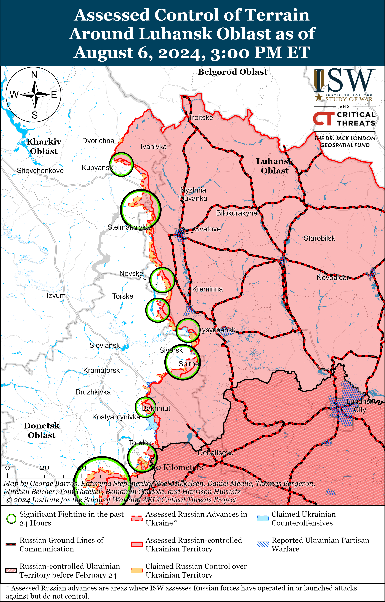
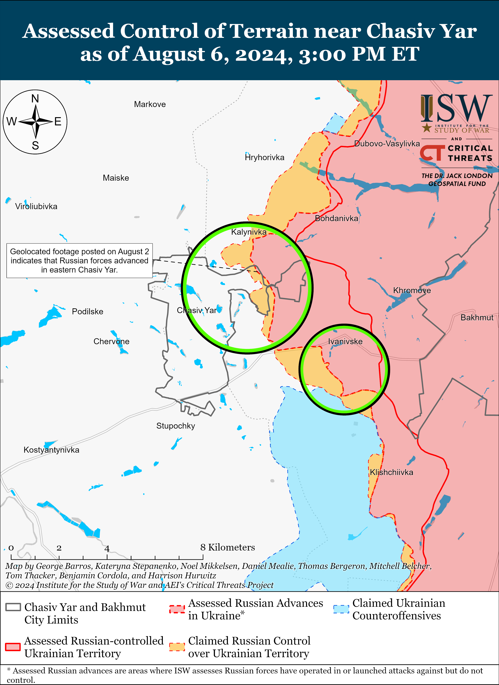
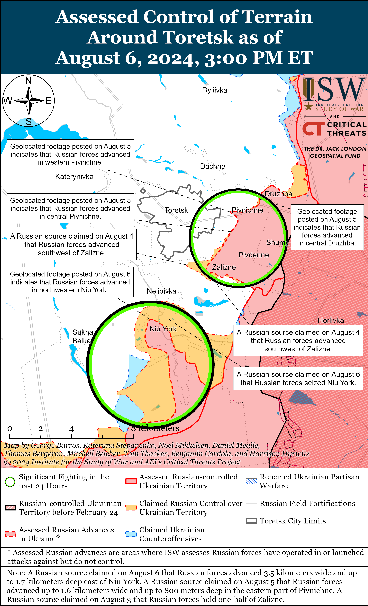
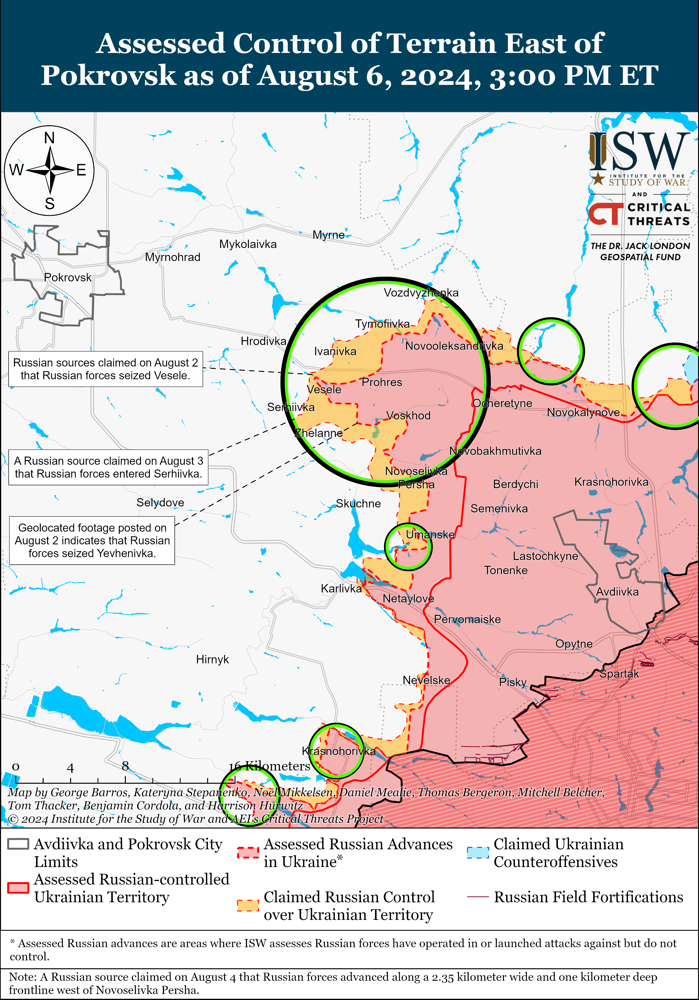
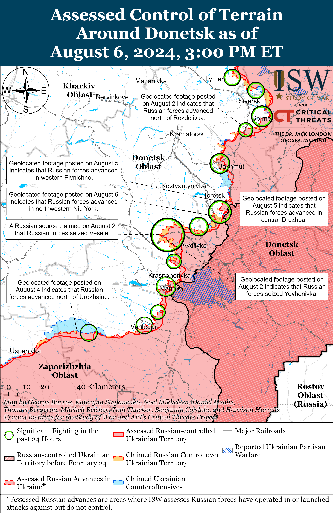
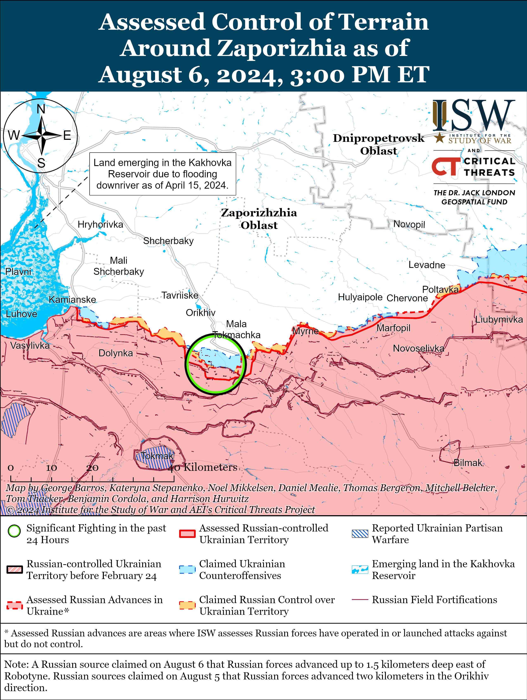
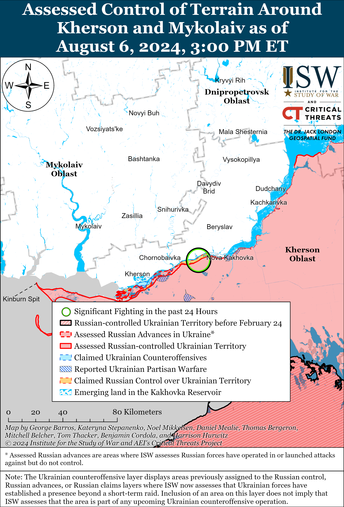

# Russian Offensive Campaign Assessment, August 6, 2024

**Angelica Evans, Grace Mappes, Davit Gasparyan, Nicole Wolkov, and Frederick W. Kagan**

**August 6, 2024, 6:40pm ET**

**Click**[**here**](https://storymaps.arcgis.com/stories/36a7f6a6f5a9448496de641cf64bd375)**to see ISW’s interactive map of the Russian invasion of Ukraine. This map is updated daily alongside the static maps present in this report.**

**Click**[**here**](https://understandingwar.maps.arcgis.com/apps/instant/3dviewer/index.html?appid=1602762dbcde419bb957dea358449580)**to see ISW’s 3D control of terrain topographic map of Ukraine. Use of a computer (not a mobile device) is strongly recommended for using this data-heavy tool.**

**Click**[**here**](https://storymaps.arcgis.com/stories/733fe90805894bfc8562d90b106aa895)**to access ISW’s archive of interactive time-lapse maps of the Russian invasion of Ukraine. These maps complement the static control-of-terrain map that ISW produces daily by showing a dynamic frontline. ISW will update this time-lapse map archive monthly.**

**Note: The data cut-off for this product was 1:10pm ET on August 6. ISW will cover subsequent reports in the August 7 Russian Offensive Campaign Assessment.**

**Russian sources claimed that Ukrainian forces conducted a series of cross border raids into Kursk Oblast on August 6.**The Russian Ministry of Defense (MoD) and Federal Security Service (FSB) claimed on August 6 that Russian border troops and FSB personnel repelled several raids by Ukrainian forces equipped with roughly a battalion’s worth of tanks and armored vehicles against Russian positions near Nikolayevo-Darino and Oleshnya, Kursk Oblast (northwest of Sumy City and along the Russia-Ukraine international border).[1] Geolocated footage published on August 6 shows damaged and abandoned armored vehicles roughly seven kilometers north of the international border west of Lyubimovka, Kursk Oblast; Russian sources claimed that the footage shows Ukrainian vehicles, but ISW cannot confirm whether these armored vehicles are Russian, Ukrainian, or both.[2] Russian milbloggers claimed that Ukrainian forces attacked from two directions: from the Sudzha checkpoint (on the border northeast of Sumy City along the H-07/R-200 highways) in the direction of Sudzha and Oleshnya; and from Novehke, Sumy Oblast (northeast of the Sudzha checkpoint and Sumy City) towards Nikolayevo-Darino, Kursk Oblast.[3] The Russian MoD claimed that Russian reserve forces also responded to the supposed Ukrainian raids, and a Russian insider source claimed that elements of the Chechen “Akhmat” Spetsnaz also responded to the raids, but ISW cannot verify these claims.[4] The Russian MoD claimed that Russian forces destroyed 16 Ukrainian armored vehicles during the supposed raids and that Russian forces conducted retaliatory strikes against Ukrainian positions in Sumy Oblast.[5] Russian milbloggers posted footage claiming to show the aftermath of the supposed Ukrainian raids, although most of the damage shown in the footage appears to be the result of routine Ukrainian shelling and does not indicate that there was ground activity in the area.[6] Acting Kursk Oblast Governor Alexei Smirnov and several Russian milbloggers warned that fighting is ongoing in the border areas of Kursk Oblast’s Sudzhansky and Korenevsky raions, contrary to the Russian MoD’s and FSB’s reporting.[7]

**Russian milbloggers largely dismissed the supposed Ukrainian raids into Kursk Oblast, and Ukrainian officials have largely yet to comment on the raids.**Russian sources claimed that Ukrainian military personnel and members of the all-Russian pro-Ukrainian Russian Volunteer Corps (RDK) were involved in the raids, but ISW has not observed confirmation of these claims.[8] Ukrainian outlet*New Voice of Ukraine re*ported that a source within Ukraine’s Main Military Intelligence Directorate (GUR) stated that RDK forces were “definitely not involved” in the raids but declined to comment further on the supposed raids.[9] Representatives of the all-Russian pro-Ukrainian Freedom of Russia Legion (LSR) also declined to comment on the raids.[10] Russian milbloggers largely dismissed the supposed raids as “unsuccessful” and a “media stunt.”[11] Several Russian milbloggers warned that there could be additional raids in the coming days and that Ukrainian forces may be trying to divert Russian manpower and material from ongoing Russian offensive operations in northern Kharkiv Oblast.[12]

**Russian Security Council Secretary and former Defense Minister Sergei Shoigu heavily overexaggerated Russian advances in Ukraine since mid-June 2024.**Shoigu stated on August 6 that Russian forces have seized 420 square kilometers of Ukrainian territory since June 14, 2024, when Russian President Vladimir Putin outlined his uncompromising demands for Ukraine’s capitulation as a prerequisite for “peace” negotiations in Ukraine.[13] ISW has observed evidence confirming that Russian forces have seized approximately 290 square kilometers since June 14. Russian forces increased the intensity of their assaults in the Toretsk direction on the night of June 18 after being generally inactive in this sector of the front throughout 2024.[14] ISW has not observed large or operationally significant Russian gains in the Toretsk or Avdiivka direction since July 14, although Russian forces have made tactical gains in these directions since July 14. The Russian military command has repeatedly exaggerated Russian territorial advances in Ukraine.[15]

**Russian officials continue coordination and military cooperation with Iran ahead of the Iranian retaliatory strike against Israel out of concern for Russian interests in the region. *NOTE: a version of this text appears in ISW-CTP’s August 6 Iran Update.****Reuters*reported that Russian President Vladimir Putin delivered a message via Russian Security Council Secretary Sergei Shoigu that Iran should act with restraint and avoid targeting civilians when retaliating against Israel.[16] An unspecified Iranian diplomat told *IranWire* that Russia is against Iranian strikes that could lead to the deaths of civilians due to the large number of Russian citizens who live in Israel.[17] The report did not specify how this Iranian diplomat has insight into the calculus behind the Russian decision making.

Russia is also reportedly assisting Iranian efforts to improve its air defenses against Israeli attacks. The*New York Times*(NYT), citing two unspecified Iranian officials including one Iranian Revolutionary Guards Corps (IRGC) official, reported on August 5 that Russia began delivering unspecified advanced radars and air defense systems to Iran.[18] The NYT noted that Iranian media has previously reported that Iran sought to acquire Russian air defense systems to improve Iran’s air defense network and defend against an Israeli strike. ISW-CTP continues to assess that Russia is increasing its cooperation with Iran, especially leaning into its growing military partnership, to shape Western decision-making into decisions favorable to Russia, particularly into pushing the West to self-deter against providing further military assistance to Ukraine.[19] Russia’s reported decision to provide Iran with radar and air defense systems, which could significantly benefit Russian forces on the ground if instead deployed to Ukraine, also underscores Russia’s ongoing reliance on Iran for other critical weapons, including high-precision weapons and weapons components.[20]

**Armenia continues to abstain from the Russia-led Collective Security Treaty Organization (CSTO).**Armenian and Russian sources stated on August 6 that Armenia will not participate in the upcoming CSTO exercises in Novosibirsk, Russia in mid-August 2024.[21] Armenia has de-facto frozen its CSTO membership by not participating in high-level meetings, military exercises, and other CSTO activities since mid-to-late March 2023.[22] Armenian authorities have repeatedly cited the CSTO’s failure to adequately address Armenia’s security needs as the reason that Armenia refuses to participate in the CSTO and have accused CSTO members like Belarus of helping Azerbaijan prepare for the 2020 Nagorno-Karabakh War.[23] A prominent Kremlin-affiliated Russian milblogger who routinely criticizes Armenia claimed that Armenia’s refusal to participate in the upcoming CSTO military exercises is predictable and that Armenia will soon withdraw from CSTO due to Armenia’s intensifying relations with the United States.[24] Armenian Prime Minister Nikol Pashinyan has previously stated that Armenia will decide “when to leave” the CSTO, but Armenian officials have yet to officially confirm Armenia’s intended timeline for withdrawing from the CSTO or suggest that enhanced security cooperation with the United States is a reason for Armenia’s withdrawal from the Russian-led security bloc.[25]

**Key Takeaways:**

- **Russian sources claimed that Ukrainian forces conducted a series of cross border raids into Kursk Oblast on August 6.**
- **Russian milbloggers largely dismissed the supposed Ukrainian raids into Kursk Oblast, and Ukrainian officials have largely yet to comment on the raids.**
- **Russian Security Council Secretary and former Defense Minister Sergei Shoigu heavily overexaggerated Russian advances in Ukraine since mid-June 2024.**
- **Russian officials continue coordination and military cooperation with Iran ahead of the Iranian retaliatory strike against Israel out of concern for Russian interests in the region. NOTE: a version of this text appears in ISW-CTP’s August 6 Iran Update.**
- **Armenia continues to abstain from the Russia-led Collective Security Treaty Organization (CSTO).**
- **Russian forces advanced east of Toretsk.**
- **The Russian Ministry of Defense (MoD) reportedly issued a formal reply denying a request from the wives of the mobilized Russian personnel to meet with Russian Defense Minister Andrei Belousov.**

[****](https://understandingwar.org/wp-content/uploads/2025/05/DraftUkraineCoT20August2062C202024.png)

***We do not report in detail on Russian war crimes because these activities are well-covered in Western media and do not directly affect the military operations we are assessing and forecasting. We will continue to evaluate and report on the effects of these criminal activities on the Ukrainian military and the Ukrainian population and specifically on combat in Ukrainian urban areas. We utterly condemn Russian violations of the laws of armed conflict and the Geneva Conventions and crimes against humanity even though we do not describe them in these reports.***

- Russian Main Effort – Eastern Ukraine (comprised of three subordinate main efforts)
- Russian Subordinate Main Effort #1 – Push Ukrainian forces back from the international border with Belgorod Oblast and approach to within tube artillery range of Kharkiv City
- Russian Subordinate Main Effort #2 – Capture the remainder of Luhansk Oblast and push westward into eastern Kharkiv Oblast and encircle northern Donetsk Oblast
- Russian Subordinate Main Effort #3 – Capture the entirety of Donetsk Oblast
- Russian Supporting Effort – Southern Axis
- Russian Air, Missile, and Drone Campaign
- Russian Mobilization and Force Generation Efforts
- Russian Technological Adaptations
- Activities in Russian-occupied areas
- Ukrainian Defense Industrial Base Efforts
- Russian Information Operations and Narratives
- Significant Activity in Belarus

**Russian Main Effort – Eastern Ukraine**

**Russian Subordinate Main Effort #1 – Kharkiv Oblast (Russian objective: Push Ukrainian forces back from the international border with Belgorod Oblast and approach to within tube artillery range of Kharkiv City)**

Fighting continued north and northeast of Kharkiv City on August 6, but there were no confirmed changes to the frontline. Russian forces continued attacks north of Kharkiv City near Lyptsi northeast of Kharkiv City near Tykhe and within Vovchansk on August 5 and 6.[26] A Russian milblogger claimed that Russian forces seized a height near Tykhe, but ISW has not observed visual confirmation of this claim.[27] The Ukrainian Kharkiv Group of Forces reported that assault groups of the Russian 11th Tank Regiment (18th Motorized Rifle Division, 11th Army Corps [AC], Leningrad Military District [LMD]) are operating near Hlyboke (north of Kharkiv City) and that elements of the 380th Motorized Rifle Regiment (47th Tank Division, 1st Guards Tank Army [GTA], Moscow Military District [MMD]) are fighting near Lukyantsi (north of Kharkiv City).[28]

**Russian Subordinate Main Effort #2 – Luhansk Oblast (Russian objective: Capture the remainder of Luhansk Oblast and push westward into eastern Kharkiv Oblast and northern Donetsk Oblast)**

Russian forces continued ground attacks along the Kupyansk-Svatove-Kreminna line on August 6 but did not make any confirmed advances. Fighting continued northeast of Kupyansk near Synkivka; east of Kupyansk near Petropavlivka; southeast of Kupyansk near Berestove, Pishchane, Tabaivka, Stelmakhivka, and Kolisnykivka; northwest of Kreminna near Makiivka, Nevske, and Terny; west of Kreminna near Torske; and southwest of Kreminna in the Serebryanske forest area on August 5 and 6.[29] Elements of the 144th Motorized Rifle Division (20th Combined Arms Army [CAA], Moscow Military District [MMD]) are operating near Nevske.[30]

**Russian Subordinate Main Effort #3 – Donetsk Oblast (Russian objective: Capture the entirety of Donetsk Oblast, the claimed territory of Russia’s proxies in Donbas)**

Russian forces continued ground attacks near Siversk on August 6, but there were no confirmed changes to the frontline.[31] A Ukrainian brigade operating in the Soledar direction reported on August 6 that Ukrainian forces destroyed two Russian tanks during a Russian assault on an unspecified echelon in this direction.[32] Russian forces continued ground attacks northeast of Siversk near Bilohorivka; east of Siversk near Verkhnokamyanske; southeast of Siversk near Ivano-Darivka, Spirne, and Vyimka; and south of Siversk near Pereizne on August 5 and 6.[33] Elements of the Russian 2nd Artillery Brigade (2nd Luhansk People’s Republic [LNR] Army Corps [AC] are reportedly operating in the Siversk direction.[34]

Russian forces continued offensive operations near Chasiv Yar itself, in the Novyi and Zhovtnevyi microraions in eastern Chasiv Yar, and east of Chasiv Yar near Ivanivske on August 5 and 6, but there were no confirmed changes to the frontline.[35] Elements of the Russian “Burevestnik” volunteer detachment (Russian Volunteer Corps) are reportedly operating near Chasiv Yar.[36]

Russian forces recently advanced near Toretsk amid continued offensive operations in the area on August 5. Geolocated footage published on August 5 indicates that Russian forces recently marginally advanced to Dostoyevskoho Street in northwestern Pivnichne (east of Toretsk).[37] Additional geolocated footage published on August 6 shows elements of the Russian 9th Motorized Rifle Brigade (1st Donetsk People’s Republic [DNR] AC) raising a flag over a building on Haharina Street in northwestern Niu York (south of Toretsk), indicating that Russian forces recently advanced further within the settlement.[38] Russian sources claimed that Russian forces advanced further within Niu York and seized the settlement, although ISW has not observed visual confirmation of this maximalist claim.[39] Russian milbloggers claimed that Russian forces advanced in an area 1.6 kilometers wide and up to 800 meters deep in eastern Pivnichne and also advanced in Druzhba (east of Toretsk) and Zalizne (southeast of Toretsk).[40] Some Russian sources reiterated claims that Russian forces may encircle Ukrainian forces in eastern Niu York, but one Russian milblogger denied these claims and claimed that Russian forces advanced too slowly in the area to encircle Ukrainian forces.[41] Russian forces also conducted assaults near Panteleymonivka (south of Toretsk) on August 5 and 6.[42] Elements of the Russian 132nd Motorized Rifle Brigade’s (1st DNR AC) “Lavina” Battalion are reportedly operating near Horlivka (east of Toretsk).[43]

Russian forces continued offensive operations east of Pokrovsk on August 6, but there were no confirmed changes to the frontline. Russian milbloggers claimed that Russian forces operating southeast of Pokrovsk advanced west of Vesele, east of Zhelanne, and south of Novoselivka Persha and that Russian forces advanced east of Pokrovsk near Lozuvatske.[44] Russian forces also conducted assaults east of Pokrovsk near Novooleksandrivka and Vozdvyzhenka and southeast of Pokrovsk near Serhiivka, Skuchne, Yasnobrodivka, Kalynove, and Kalynivka on August 5 and 6.[45] A Ukrainian brigade operating in the Pokrovsk direction posted footage on August 6 showing Ukrainian drones striking two Russian armored vehicles during a reduced platoon-sized Russian assault in the Pokrovsk direction.[46] Russian Defense Minister Andrei Belousov praised elements of the 6th Tank Regiment (90th Tank Division, CMD) and 114th Motorized Rifle Brigade (1st DNR AC) for participating in the seizure of Novoselivka Persha, which ISW assessed occurred as of July 29.[47]

Russian Chief of the General Staff Army General Valery Gerasimov visited the Central Grouping of Forces headquarters on August 6 and received reports from unit commanders operating in the Toretsk and Pokrovsk directions.[48] Gerasimov also met with Central Grouping of Forces and Central Military District (CMD) Commander Colonel General Andrey Mordvichev and presented state awards to Russian servicemembers. ISW previously noted that the Russian military command repeatedly highlighted Mordvichev in Spring 2024 and credited him with the seizure of Avdiivka in mid-February 2024.[49] Gerasimov previously visited the Pokrovsk direction several days after Russian forces seized Avdiivka.[50] Ukrainian President Volodymyr Zelensky identified the Pokrovsk direction as the Russian military’s current priority on August 1, and Gerasimov’s visit may be indicative of the Russian high military command’s prioritization of this direction.[51]

Russian forces continued offensive operations west and southwest of Donetsk City on August 6, but there were no confirmed changes to the frontline. A Ukrainian brigade operating in the Kurakhove direction (west and southwest of Donetsk City) posted footage and reported on August 5 that Ukrainian forces repelled a reinforced platoon-sized mechanized assault and a platoon-sized mechanized assault in unspecified areas of this direction.[52] The Ukrainian brigade reported that Ukrainian forces destroyed four armored fighting vehicles and a tank and damaged one armored fighting vehicle while repelling the assaults. Russian forces continued assaults west of Donetsk City near Krasnohorivka and Heorhiivka and southwest of Donetsk City near Pobieda, Kostyantynivka, Paraskoviivka, and Vodyane on August 5 and 6.[53]

Russian forces continued ground attacks near Rozdolne (northeast of Velyka Novosilka) in the Donetsk-Zaporizhia Oblast border area on August 5 and 6.[54] A Russian milblogger claimed that Russian forces cleared a windbreak near Urozhaine (south of Velyka Novosilka).[55] Elements of the Russian 37th Motorized Rifle Brigade (36th Combined Arms Army [CAA], Eastern Military District [EMD]) and 40th Naval Infantry Brigade (Pacific Fleet, EMD) are reportedly operating near Urozhaine, and drone operators of the 60th Motorized Rifle Brigade (5th CAA, EMD) are reportedly operating near Staromayorske (south of Velyka Novosilka) [56]

**Russian Supporting Effort – Southern Axis (Russian objective: Maintain frontline positions and secure rear areas against Ukrainian strikes)**

Russian forces continued ground attacks in western Zaporizhia Oblast on August 6 but did not make any confirmed advances. Russian milbloggers claimed that Russian forces advanced up to 1.5 kilometers east of Robotyne and seized unspecified Ukrainian positions northwest of Verbove (east of Robotyne).[57] Fighting continued near Robotyne on August 5 and 6.[58] Elements of the Russian 56th Airborne (VDV) Regiment (7th VDV Division) reportedly continue operating near Verbove.[59]

Positional engagements continued in east (left) bank Kherson Oblast, including on the Dnipro River Delta islands, on August 5 and 6.[60]

Kherson Oblast occupation administration head Vladimir Saldo and other Russian sources claimed on August 6 that Ukrainian forces conducted a raid on the occupied Tendrivska Spit in Kherson Oblast. Russian sources claimed that Russian naval infantry forces repelled 10 to 12 Ukrainian boats attempting to land on the split and destroyed several Ukrainian boats.[61] ISW has not observed confirmation of these claims.

**Russian Air, Missile, and Drone Campaign (Russian Objective: Target Ukrainian military and civilian infrastructure in the rear and on the frontline)**

Russian forces launched missile and drone strikes against Ukraine overnight on August 5 to 6 and on August 6. Ukrainian Air Force Commander Lieutenant General Mykola Oleshchuk reported on August 6 that Russia launched four Iskander-M/North Korean KN-23 ballistic missiles at Kyiv Oblast from Voronezh Oblast, two Kh-59 cruise missiles from the airspace over the Sea of Azov, and 16 Shahed-136/131 drones from occupied Cape Chauda, Crimea and Kursk Oblast and that Ukrainian forces repelled the air attack shooting down two Iskander-M/KN-23 ballistic missiles, two Kh-59 guided air missiles, and 15 attack UAVs in Kyiv, Kherson, Mykolaiv and Khmelnytskyi oblasts.[62] [63] A Ukrainian source noted that Russian forces used a North Korean KN-23 in a strike series against Ukraine for the first time in five months.[64] The Kyiv Oblast Military Administration reported that the missile and drone strikes damaged civilian infrastructure.[65] Kharkiv Oblast Head Oleh Synehubov reported on August 6 that Russian forces also struck Shevchenkiv Raion, Kharkiv City with an Iskander-M missile hitting a polyclinic and injuring civilians.[66] Sumy Oblast Military Administration reported that Russian forces conducted a missile strike against Sumy Oblast during the day on August 6.[67] Russian Ministry of Defense (MoD) published footage on August 6 purportedly showing an Iskander-M strike destroying the Ukrainian air defense system in Sumy Oblast.[68]

**Russian Mobilization and Force Generation Efforts (Russian objective: Expand combat power without conducting general mobilization)**

The Russian MoD reportedly issued a formal reply denying a request from the wives of the mobilized Russian personnel to meet with Russian Defense Minister Andrei Belousov. Russian opposition outlet *SOTA*published a photo purportedly of a Russian MoD response to the wives denying their request for a meeting with Belousov due to strict scheduling procedures.[69] The Russian government has frequently attempted to silence the relatives of mobilized soldiers who publicly call for the Russian MoD to send mobilized soldiers back to Russia.[70]

Russian government-linked milbloggers highlighted the Russian military’s need for more officers and military personnel with specialized skills. A prominent Kremlin-affiliated Russian milblogger argued on August 6 that Russia needs to open more military educational institutions in order to train more officers and other personnel with certain specialties, particularly artillery officers.[71] A Russian milblogger who previously advised Russian State Duma Speaker Vyacheslav Volodin claimed that the Russian military often transfers soldiers with scarce specialties – such as drone, rocket-propelled grenade (RPG), and tank operators – to assault groups due to personnel shortages.[72] The milblogger claimed that these personnel with scarce specialties often die in assaults due to the lack of proper training and that the Russian military cannot recruit adequate replacements to fulfill the personnel’s former roles in these specialties.

**Russian Technological Adaptations (Russian objective: Introduce technological innovations to optimize systems for use in Ukraine)**

Nothing significant to report.

**Ukrainian Defense Industrial Efforts (Ukrainian objective: Develop its defense industrial base to become more self-sufficient in cooperation with US, European, and international partners)**

*ISW is not publishing coverage of Ukrainian defense industrial efforts today.*

**Activities in Russian-occupied areas (Russian objective: Consolidate administrative control of annexed areas; forcibly integrate Ukrainian citizens into Russian sociocultural, economic, military, and governance systems)**

Russian authorities continue to forcibly deport Ukrainian children to Russia and continue other efforts to Russify Ukrainian youth. Russian Children’s Rights Commission Maria Lvova-Belova stated on August 1 that 100 Ukrainian minors from occupied Luhansk, Donetsk, Zaporizhia, and Kherson oblasts attended a Russian youth form at the Mastryukovsky Lakes in Samara Oblast.[73] Luhansk Oblast occupation officials also sent Ukrainian children to participate in programs in Rostov Oblast and Moscow, and Zaporizhia Oblast occupation head Yevgeny Balitsky reported that Russian occupation authorities sent more than 8,000 Ukrainian children from occupied Zaporizhia Oblast to health camps throughout Russia and that an additional 2,000 more will attend before September 1.[74] Ukrainian Luhansk Oblast Military Administration Head Artem Lysohor reported that Russian officials are incentivizing teachers in occupied Luhansk Oblast to teach Russian propaganda to Ukrainian children by promising annual state awards to the highest-performing teachers.[75] The Ukrainian Resistance Center reported that Kherson Oblast occupation officials are preparing a law that would codify Russian “patriotic education” in occupied areas and that Russian military veterans will teach the courses.[76]

**Russian Information Operations and Narratives**

Russian sources continue to downplay the impact of Ukrainian F-16 fighter jets on the battlefield, directly contradicting the Kremlin’s narrative establishing Ukraine’s use of F-16s as an uncrossable “red line.”[77] The Ukrainian Center for Countering Disinformation and the Romanian Ministry of Defense (MoD) reported on August 6 that Russian Telegram channels are spreading false reports that Ukrainian F-16 pilots training in Romania did not take their training seriously and behaved poorly.[78]

Senior Russian officials continue to indicate that the Kremlin is uninterested in any peace negotiations with Ukraine that do not amount to Ukraine’s full capitulation. Russian Ministry of Foreign Affairs (MFA) Spokesperson Maria Zakharova criticized a French offer to mediate just peace negotiations between Russia and Ukraine as failing to factor in Russia’s interests.[79] Russian Security Council Secretary Sergei Shoigu reiterated ongoing Kremlin narratives rejecting the Ukrainian Peace Plan, denying the legitimacy of Ukrainian President Volodymyr Zelensky, and doubling down on Russian President Vladimir Putin’s vague and maximalist demands that have largely remained unchanged since February 2022.[80] Kremlin officials have falsely portrayed Zelensky as an illegitimate negotiator and the Ukrainian Peace Plan as excluding Russia in order to justify the Kremlin’s continued refusal to engage in negotiations and undermine international support for Ukraine and its peace plan.

**Significant activity in Belarus (Russian efforts to increase its military presence in Belarus and further integrate Belarus into Russian-favorable frameworks and Wagner Group activity in Belarus)**

The Belarusian Ministry of Defense (MoD) reported on August 6 that Major General Andrei Zhuk resigned from his post as the Belarusian Deputy Defense Minister and that Major General Alexander Naumenko replaced him.[81]

**Note: ISW does not receive any classified material from any source, uses only publicly available information, and draws extensively on Russian, Ukrainian, and Western reporting and social media as well as commercially available satellite imagery and other geospatial data as the basis for these reports. References to all sources used are provided in the endnotes of each update.**

****

---

[1] https://t.me/mod\_russia/41857 ; https://t.me/tass\_agency/264646

[2] https://t.me/dva\_majors/48926 ; https://x.com/EjShahid/status/1820843569503953391; https://t.me/dva\_majors/48940;

[3] https://t.me/rybar/62487 ; https://t.me/dva\_majors/48885 ; https://t.me/wargonzo/21411

[4] https://t.me/vchkogpu/49650 ; https://t.me/mod\_russia/41857

[5] https://t.me/mod\_russia/41857 ; https://t.me/mod\_russia/41862 ; https://meduza dot io/news/2024/08/06/minoborony-rf-zayavilo-ob-otstuplenii-ukrainskogo-otryada-kotoryy-vel-boy-na-granitse-kurskoy-oblasti ; https://t.me/tass\_agency/264726 ; https://t.me/tass\_agency/264727

[6] https://t.me/RVvoenkor/74109 ; https://t.me/dva\_majors/48882 ; https://t.me/dva\_majors/48905

[7] https://t.me/tass\_agency/264722 ; https://t.me/tass\_agency/264589; https://t.me/gubernator\_46/7210 ; https://t.me/dva\_majors/48879 ; https://t.me/dva\_majors/48895 ; https://t.me/dva\_majors/48903 ; https://t.me/DnevnikDesantnika/13446

[8] https://t.me/rusich\_army/16284 ; https://t.me/dva\_majors/48889 ; https://t.me/breakingmash/56510 ; https://t.me/voin\_dv/10128

[9] https://nv dot ua/ukr/ukraine/events/nova-kurska-bitva-chi-diysno-ukrajinski-specpidrozdili-organizuvali-proriv-u-prikordonni-regioni-rf-50440618.html?utm\_source=telegram

[10] https://suspilne dot media/807139-gubernator-kurskoi-oblasti-zaaviv-so-zsu-namagalisa-prorvati-kordon/

[11] https://t.me/RVvoenkor/74140 ; https://t.me/rybar/62487 ; https://t.me/rybar/62496 ; https://t.me/dva\_majors/48937 ; https://t.me/RVvoenkor/74139 ; https://t.me/dva\_majors/48885 ; https://t.me/rusich\_army/16296 ; https://t.me/dva\_majors/48879 ; https://t.me/wargonzo/21411 ; https://t.me/wargonzo/21413 ; https://t.me/voin\_dv/10128

[12] https://t.me/rybar/62497 ; https://t.me/RVvoenkor/74140 ; https://t.me/dva\_majors/48878 ; https://t.me/Alekhin\_Telega/11119 ; https://t.me/dva\_majors/48881 ; https://t.me/sashakots/48225 ; https://t.me/vysokygovorit/16783

[13] https://understandingwar.org/backgrounder/russian-offensive-campaign-assessment-june-14-2024

[14] https://understandingwar.org/backgrounder/russian-offensive-campaign-assessment-june-19-2024 ; https://understandingwar.org/backgrounder/russian-offensive-campaign-assessment-june-27-2024

[15] https://isw.pub/UkrWar050324 ; https://isw.pub/UkrWar053124 ; https://isw.pub/UkrWar050324

[16] https://www.reuters.com/world/putin-asks-iran-avoid-civilian-casualties-israel-response-sources-say-2024-08-06/

[17] https://iranwire.com/en/news/132578-exclusive-russia-warns-iran-against-targeting-israel/#google\_vignette

[18] https://www.nytimes.com/live/2024/08/05/world/israel-iran-hezbollah-gaza/russian-emissary-visits-tehran-at-a-tense-moment-as-iran-asks-for-military-aid?smid=url-share

[19] https://understandingwar.org/backgrounder/iran-update-august-5-2024; https://isw.pub/UkrWar080324

[20] https://isw.pub/UkrWar080324; https://isw.pub/UkrWar072724 ; https://isw.pub/UkrWar071324 ; https://isw.pub/UkrWar070924 ;

[21] https://armenpress dot am/en/article/1197115; https://asbarez dot com/armenia-will-not-take-part-in-csto-military-exercises/

[22] https://understandingwar.org/backgrounder/russian-offensive-campaign-assessment-may-31-2024; https://www.rferl.org/a/armenia-csto-budget-russia-pashinian-putin/32938561.html

[23] https://understandingwar.org/backgrounder/russian-offensive-campaign-assessment-june-12-2024; https://understandingwar.org/backgrounder/russian-offensive-campaign-assessment-february-29-2024; https://understandingwar.org/backgrounder/russian-offensive-campaign-assessment-march-2-2024

[24] https://news dot am/rus/news/837072.html ; https://t.me/rybar/62493

[25] https://understandingwar.org/backgrounder/russian-offensive-campaign-assessment-june-12-2024

[26] https://www.facebook.com/GeneralStaff.ua/posts/pfbid02TKPtkpSmqnfHSdT8A2vDaH3sBNrRWk2EXKcNP1wBtPq8DsSGLxXK8dAvMggsQcWCl; https://www.facebook.com/GeneralStaff.ua/posts/pfbid02JSFZW4zxZcGbPmXfzZxxqPy1bJn1gbchMPiGLZ9hFUuFf1QRBnEW1qPN4JKL2htt; https://www.facebook.com/GeneralStaff.ua/posts/pfbid06m3LCYnfB5Ffc1tbHV5s6tTE4zTT8kd2yjrYRbahf8iFWdEhE3hn5eVn38noJyBnl; https://t.me/otukharkiv/636; https://t.me/synegubov/10631; https://t.me/dva\_majors/48877;

[27] https://t.me/DnevnikDesantnika/13470

[28] https://t.me/otukharkiv/636

[29]https://www.facebook.com/GeneralStaff.ua/posts/pfbid02TKPtkpSmqnfHSdT8A2vDaH3sBNrRWk2EXKcNP1wBtPq8DsSGLxXK8dAvMggsQcWCl ; https://www.facebook.com/GeneralStaff.ua/posts/pfbid02JSFZW4zxZcGbPmXfzZxxqPy1bJn1gbchMPiGLZ9hFUuFf1QRBnEW1qPN4JKL2httl; https://www.facebook.com/GeneralStaff.ua/posts/pfbid06m3LCYnfB5Ffc1tbHV5s6tTE4zTT8kd2yjrYRbahf8iFWdEhE3hn5eVn38noJyBnl; https://t.me/mod\_russia/41850 ; https://t.me/luhanskaVTSA/20486

[30] https://t.me/vysokygovorit/16781 ; https://t.me/boris\_rozhin/132536

[31]

[32] https://t.me/edelweiss10tg/1325; https://armyinform.com dot ua/2024/08/06/vognyane-shou-dlya-rosijskyh-tankiv-nevdalyj-shturm-okupantiv-na-soledarskomu-napryamku/

[33] https://www.facebook.com/GeneralStaff.ua/posts/pfbid02TKPtkpSmqnfHSdT8A2vDaH3sBNrRWk2EXKcNP1wBtPq8DsSGLxXK8dAvMggsQcWCl ; https://www.facebook.com/GeneralStaff.ua/posts/pfbid02JSFZW4zxZcGbPmXfzZxxqPy1bJn1gbchMPiGLZ9hFUuFf1QRBnEW1qPN4JKL2httl ; https://www.facebook.com/GeneralStaff.ua/posts/pfbid06m3LCYnfB5Ffc1tbHV5s6tTE4zTT8kd2yjrYRbahf8iFWdEhE3hn5eVn38noJyBnl

[34] https://t.me/sons\_fatherland/16033

[35] https://www.facebook.com/GeneralStaff.ua/posts/pfbid02TKPtkpSmqnfHSdT8A2vDaH3sBNrRWk2EXKcNP1wBtPq8DsSGLxXK8dAvMggsQcWCl ; https://www.facebook.com/GeneralStaff.ua/posts/pfbid02JSFZW4zxZcGbPmXfzZxxqPy1bJn1gbchMPiGLZ9hFUuFf1QRBnEW1qPN4JKL2httl ; https://www.facebook.com/GeneralStaff.ua/posts/pfbid06m3LCYnfB5Ffc1tbHV5s6tTE4zTT8kd2yjrYRbahf8iFWdEhE3hn5eVn38noJyBnl ; https://t.me/dva\_majors/48877 ; https://t.me/wargonzo/21405

[36] https://t.me/wargonzo/21404

[37] https://x.com/small10space/status/1820427295133143518; https://x.com/Bielitzling/status/1820556286498648487; https://x.com/Bielitzling/status/1820561770748031140; https://x.com/Bielitzling/status/1820567021752553522

[38] https://t.me/creamy\_caprice/6269; https://t.me/SolovievLive/272654; https://x.com/GirkinGirkin/status/1820854387495035386; https://x.com/justincbzz/status/1820857911427678462

[39] ; https://t.me/SolovievLive/272654 ; https://t.me/dva\_majors/48961 ; https://t.me/boris\_rozhin/132574 ; https://t.me/vysokygovorit/16791 ; https://t.me/epoddubny/20643 ; https://t.me/RVvoenkor/74146 ; https://t.me/dva\_majors/48877 ; https://t.me/z\_arhiv/27539 ;

[40] https://t.me/rybar/62468 ; https://t.me/RVvoenkor/74074 ; https://t.me/boris\_rozhin/132516

[41] https://t.me/tass\_agency/264569 ; https://t.me/RVvoenkor/74112 ; https://t.me/milinfolive/127692

[42] https://www.facebook.com/GeneralStaff.ua/posts/pfbid06m3LCYnfB5Ffc1tbHV5s6tTE4zTT8kd2yjrYRbahf8iFWdEhE3hn5eVn38noJyBnl; https://www.facebook.com/GeneralStaff.ua/posts/pfbid02JSFZW4zxZcGbPmXfzZxxqPy1bJn1gbchMPiGLZ9hFUuFf1QRBnEW1qPN4JKL2httl

[43] https://t.me/wargonzo/21403

[44] https://t.me/rybar/62472 ; https://t.me/z\_arhiv/27536 ; https://t.me/wargonzo/21405 ; https://t.me/voenkorKotenok/57984

[45] https://www.facebook.com/GeneralStaff.ua/posts/pfbid02TKPtkpSmqnfHSdT8A2vDaH3sBNrRWk2EXKcNP1wBtPq8DsSGLxXK8dAvMggsQcWCl ; https://www.facebook.com/GeneralStaff.ua/posts/pfbid02TKPtkpSmqnfHSdT8A2vDaH3sBNrRWk2EXKcNP1wBtPq8DsSGLxXK8dAvMggsQcWCl ; https://www.facebook.com/GeneralStaff.ua/posts/pfbid06m3LCYnfB5Ffc1tbHV5s6tTE4zTT8kd2yjrYRbahf8iFWdEhE3hn5eVn38noJyBnl ; https://t.me/dva\_majors/48877 ; https://t.me/wargonzo/21405 ; https://t.me/voenkorKotenok/57984

[46] https://armyinform dot com.ua/2024/08/06/dva-btr-poyihaly-na-shturm-odyn-btr-zgoriv-nashi-zahysnyky-rozpovily-okupantam-dytyachu-lichylku/; https://t.me/BUAR110ombr/362

[47] https://t.me/mod\_russia/41833 ; https://understandingwar.org/backgrounder/russian-offensive-campaign-assessment-august-4-2024

[48] https://t.me/mod\_russia/41848

[49] https://isw.pub/UkrWar050324

[50] https://isw.pub/UkrWarO22124

[51] https://isw.pub/IranUpdate080122

[52] https://t.me/odshbr79/263; https://armyinform.com dot ua/2024/08/05/spochatku-yidut-na-broni-potim-goryat-v-ruyinah-tavrijski-desantnyky-znyaly-zhyttyevyj-czykl-rosijskyh-shturmovykiv/

[53] https://t.me/voenkorKotenok/57984 ; https://t.me/DnevnikDesantnika/13456 ; https://t.me/wargonzo/21405 ; https://t.me/dva\_majors/48877 ; https://www.facebook.com/GeneralStaff.ua/posts/pfbid02TKPtkpSmqnfHSdT8A2vDaH3sBNrRWk2EXKcNP1wBtPq8DsSGLxXK8dAvMggsQcWCl

 ; https://www.facebook.com/GeneralStaff.ua/posts/pfbid02JSFZW4zxZcGbPmXfzZxxqPy1bJn1gbchMPiGLZ9hFUuFf1QRBnEW1qPN4JKL2httl ; https://www.facebook.com/GeneralStaff.ua/posts/pfbid06m3LCYnfB5Ffc1tbHV5s6tTE4zTT8kd2yjrYRbahf8iFWdEhE3hn5eVn38noJyBnl

[54] https://www.facebook.com/GeneralStaff.ua/posts/pfbid02JSFZW4zxZcGbPmXfzZxxqPy1bJn1gbchMPiGLZ9hFUuFf1QRBnEW1qPN4JKL2httl ; https://www.facebook.com/GeneralStaff.ua/posts/pfbid06m3LCYnfB5Ffc1tbHV5s6tTE4zTT8kd2yjrYRbahf8iFWdEhE3hn5eVn38noJyBnl

[55] https://t.me/voin\_dv/10128

[56] https://t.me/voin\_dv/10124

[57] https://t.me/wargonzo/21405 ; https://t.me/DnevnikDesantnika/13452 ; https://t.me/dva\_majors/48877

[58] https://www.facebook.com/GeneralStaff.ua/posts/pfbid02JSFZW4zxZcGbPmXfzZxxqPy1bJn1gbchMPiGLZ9hFUuFf1QRBnEW1qPN4JKL2httl ; https://www.facebook.com/GeneralStaff.ua/posts/pfbid06m3LCYnfB5Ffc1tbHV5s6tTE4zTT8kd2yjrYRbahf8iFWdEhE3hn5eVn38noJyBnl

[59] https://t.me/mod\_russia/41844

[60] https://t.me/dva\_majors/48877 ; https://www.facebook.com/GeneralStaff.ua/posts/pfbid02JSFZW4zxZcGbPmXfzZxxqPy1bJn1gbchMPiGLZ9hFUuFf1QRBnEW1qPN4JKL2httl ; https://www.facebook.com/GeneralStaff.ua/posts/pfbid06m3LCYnfB5Ffc1tbHV5s6tTE4zTT8kd2yjrYRbahf8iFWdEhE3hn5eVn38noJyBnl

[61] https://t.me/SALDO\_VGA/3959 ; https://t.me/rybar/62484 ; https://t.me/RVvoenkor/74111 ; https://t.me/rusich\_army/16295 ; https://t.me/osetin20/8935 ; https://t.me/dva\_majors/48894

[62] https://t.me/ComAFUA/375

[63] https://t.me/ComAFUA/375

[64] https://suspilne dot media/806903-rf-pisla-5-misacnoi-pauzi-znovu-bila-po-ukraini-pivnicnokorejskimi-raketami/; https://defence-ua dot com/news/rf\_pid\_chas\_udaru\_31\_lipnja\_vikoristala\_balistichnu\_raketu\_kn\_23\_z\_kndr\_jaka\_ne\_doletila\_do\_tsili-16218.html

[65] https://armyinform dot com.ua/2024/08/06/naslidky-raketnogo-udaru-rf-u-kyyivskij-oblasti-poshkodzheno-bagatopoverhivku-i-dvi-azs/; https://armyinform dot com.ua/2024/08/06/kmva-rosiyany-vnochi-atakuvaly-kyyiv-balistychnymy-raketamy/;

[66] https://armyinform dot com.ua/2024/08/06/p%ca%bcyat-postrazhdalyh-i-poshkodzhena-poliklinika-naslidky-rosijskogo-udaru-iskanderom-po-harkovu/; https://t.me/synegubov/10639 ; https://armyinform dot com.ua/2024/08/06/vijska-rosiyi-zavdaly-raketnogo-udaru-po-budivli-polikliniky-v-czentri-harkova/ ; https://t.me/synegubov/10638 ; https://t.me/ihor\_terekhov/1566

[67] https://armyinform dot com.ua/2024/08/06/okupanty-zavdaly-raketnogo-udaru-po-sumshhyni/; https://t.me/Sumy\_news\_ODA/28786

[68] https://t.me/mod\_russia/41861

[69] https://t.me/sotaproject/84724

[70] https://understandingwar.org/backgrounder/russian-offensive-campaign-assessment-october-4-2023 ; https://understandingwar.org/backgrounder/russian-offensive-campaign-assessment-december-7-2023

[71] https://t.me/rybar/62495

[72] https://t.me/akashevarova/7437 ; https://www.bbc.com/russian/articles/ce7j7r8ep61o

[73] https://t.me/malvovabelova/3700

[74] https://t.me/sons\_fatherland/16019; https://t.me/sons\_fatherland/16021; https://t.me/BalitskyEV/3695

[75] https://t.me/luhanskaVTSA/20486 ; https://t.me/luhanskaVTSA/20487

[76] https://t.me/sprotyv\_official/4935

[77] https://t.me/tass\_agency/264550; https://t.me/vrogov/16879 https://understandingwar.org/backgrounder/russian-offensive-campaign-assessment-august-4-2024

[78] https://armyinform dot com.ua/2024/08/05/v-peredchutti-bolyu-okupanty-staly-rozpovsyudzhuvaty-fejk-pro-pilotiv-f-16/; https://t.me/CenterCounteringDisinformation/11258; https://inforadar dot mapn.ro/71\_%C8%98tire-falsa-cu-privire-la-antrenamentul-pilo%C8%9Bilor-ucraineni

[79] https://tass dot ru/politika/21537899 ; https://www.ng dot ru/world/2024-07-31/1\_9061\_france.html ; https://t.me/tass\_agency/264586 ; https://t.me/MID\_Russia/43921

[80] https://lenta dot ru/news/2024/08/06/shoygu-zayavil-o-otsutstvii-reaktsii-kieva-na-usloviya-po-uregulirovaniyu-konflikta/; https://www.kommersant dot ru/doc/6878463; https://www.interfax dot ru/russia/975237

[81] https://t.me/modmilby/40866; https://t.me/modmilby/40873
