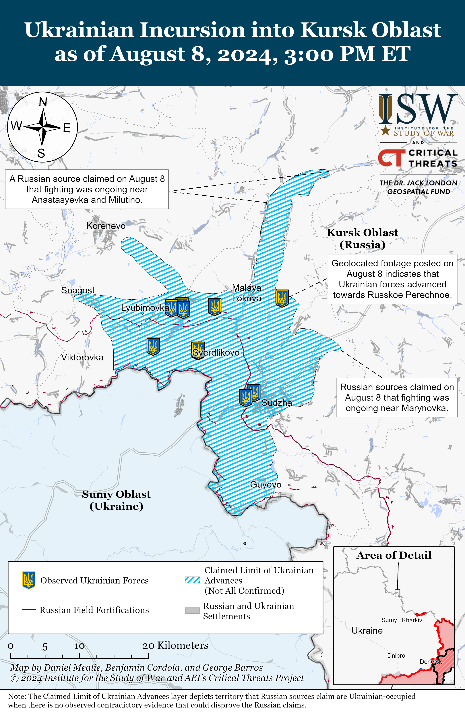
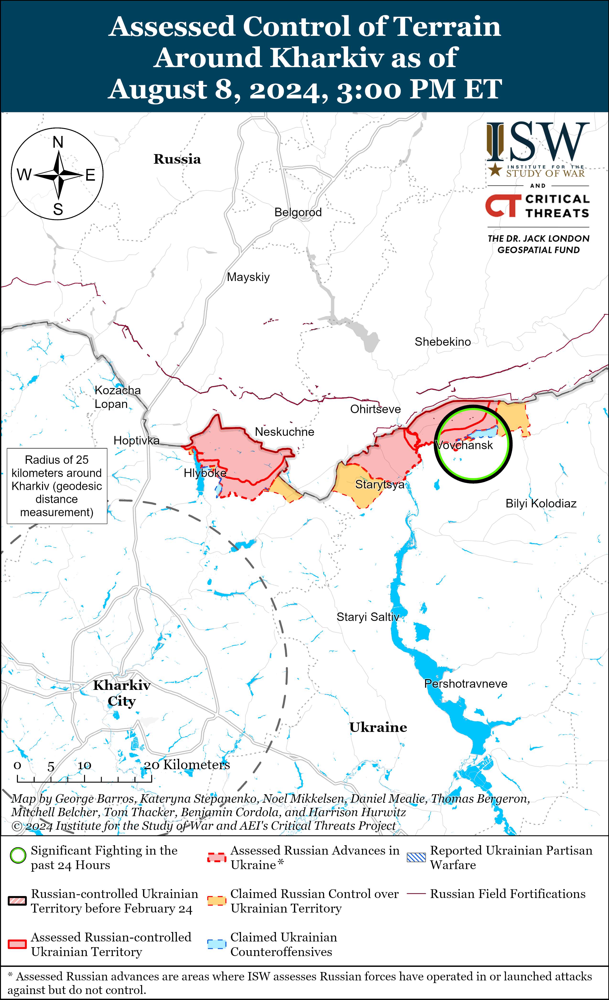
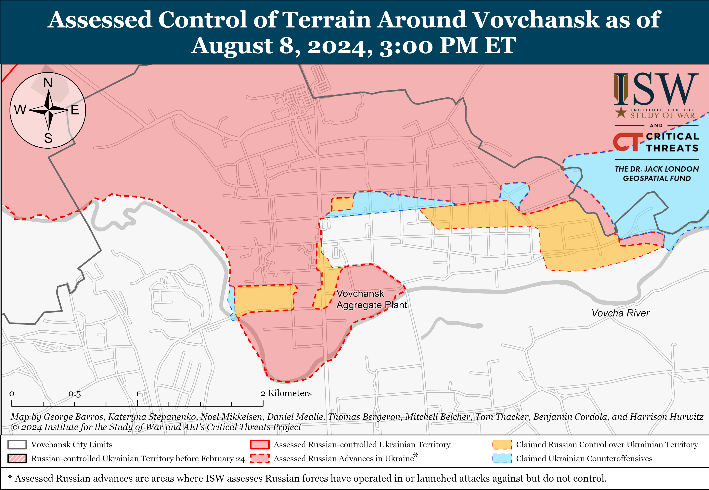
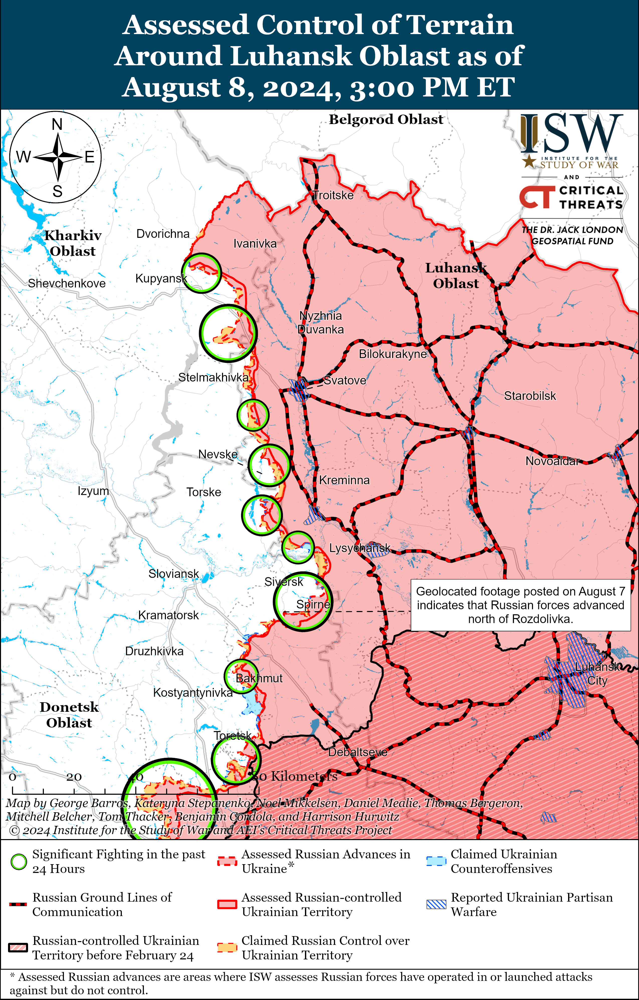
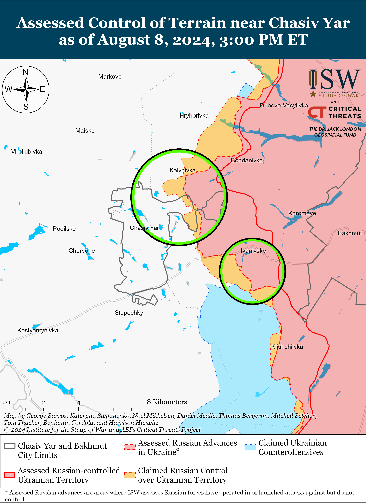
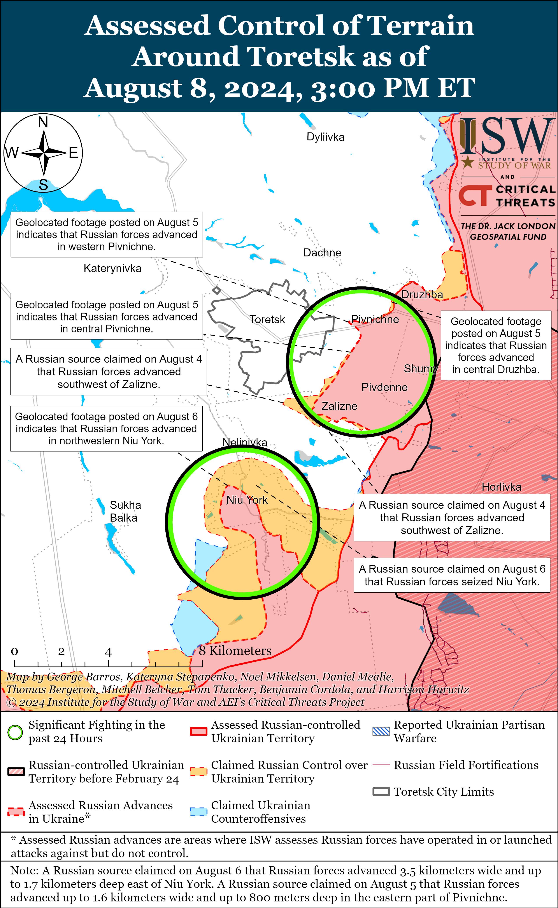
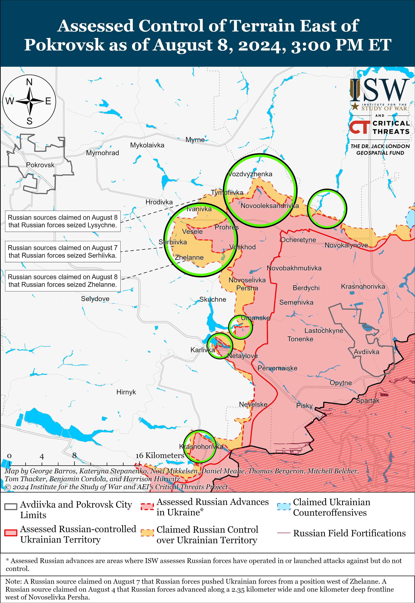
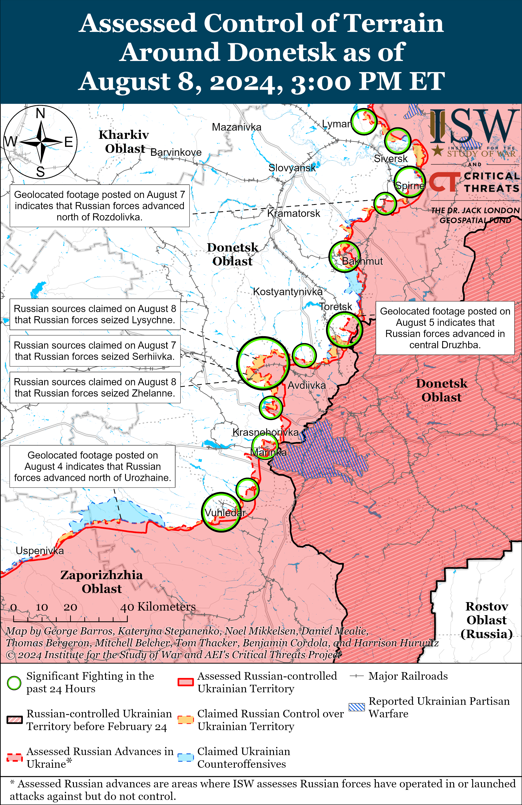
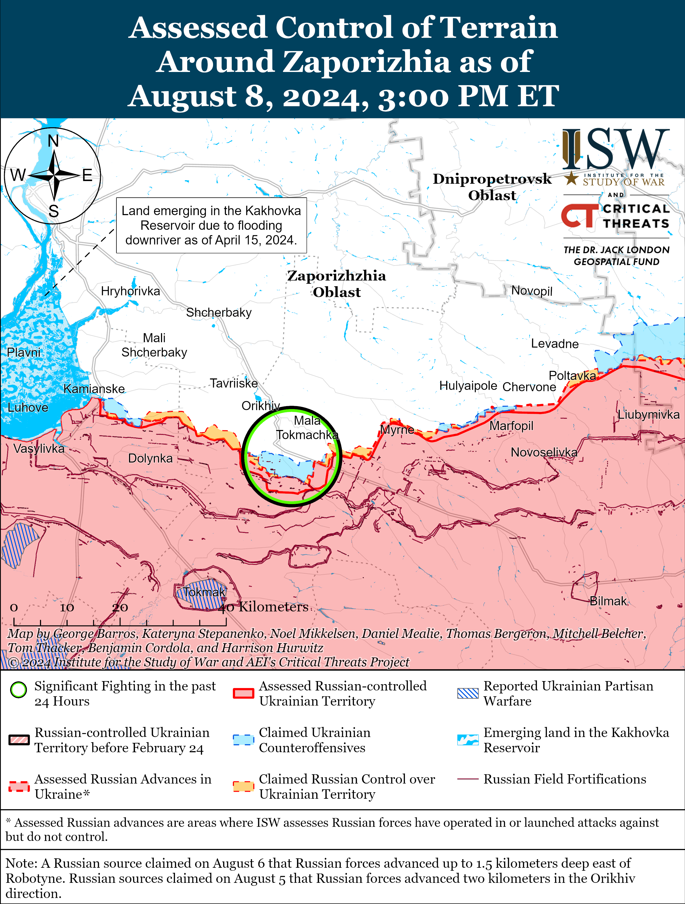
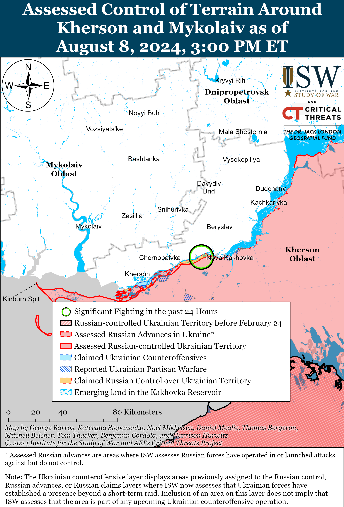

# Russian Offensive Campaign Assessment, August 8, 2024

**Riley Bailey, Angelica Evans, Christina Harward, Nicole Wolkov, and Frederick W. Kagan**

**August 8, 2024, 10pm ET**

**Click** [**here**](https://storymaps.arcgis.com/stories/36a7f6a6f5a9448496de641cf64bd375) **to see ISW’s interactive map of the Russian invasion of Ukraine. This map is updated daily alongside the static maps present in this report.**

**Click** [**here**](https://understandingwar.maps.arcgis.com/apps/instant/3dviewer/index.html?appid=1602762dbcde419bb957dea358449580) **to see ISW’s 3D control of terrain topographic map of Ukraine. Use of a computer (not a mobile device) is strongly recommended for using this data-heavy tool.**

**Click** [**here**](https://storymaps.arcgis.com/stories/733fe90805894bfc8562d90b106aa895) **to access ISW’s archive of interactive time-lapse maps of the Russian invasion of Ukraine. These maps complement the static control-of-terrain map that ISW produces daily by showing a dynamic frontline. ISW will update this time-lapse map archive monthly.**

**The data cut-off for this product was 2:45pm ET on August 8. ISW will cover subsequent reports in the August 9 Russian Offensive Campaign Assessment.**

**Note:** *Russian sources are currently shifting much of their reporting to cover the Ukrainian incursion into Kursk Oblast and as a result are not providing the same level of detail about the situation along the frontline in Ukraine.*

**Ukrainian cross-border mechanized offensive operations into Kursk Oblast that began on August 6 are continuing as part of a Ukrainian operational effort within Russian territory. ISW will not offer assessments about the intent of this Ukrainian operation in order to avoid compromising Ukrainian operational security.** ISW will not make forecasts about what Ukrainian forces might or might not do or where or when they might do it. ISW will continue to map, track, and evaluate operations as they unfold but will not offer insight into Ukrainian planning, tactics, or techniques. ISW is not prepared to map control of terrain within Russia at this time and will instead map observed events associated with the Ukrainian incursion into Russian territory as well the maximalist extent of claims and unverified reports about Ukrainian advances. Maximalist claims and unverified reports about Ukrainian advances within Russia do not represent territory that ISW assesses that Ukrainian forces have seized or control. **Inferring predictions about Ukrainian operations from ISW maps and assessments that do not explicitly offer such predictions is inappropriate and not in accord with their intended use.**

****

**Geolocated footage and Russian claims indicate that Ukrainian forces continued rapid advances further into Kursk Oblast on August 8, and Ukrainian forces are reportedly present in areas as far as 35 kilometers from the international border with Sumy Oblast. Ukrainian forces most certainly do not control all of the territory within the maximalist extent of Russian claims about Ukrainian advances in Kursk Oblast, however.** Russian milbloggers claimed that Ukrainian forces advanced as far as Kromskiye Byki and Molyutino (up to 35 kilometers from the international border and 17 kilometers southeast of Lgov) but noted that these are small groups not immediately trying to hold territory.[1] Russian milbloggers issued contradictory claims about Ukrainian positions in Sudzha (northeast of Sumy City and roughly 10 kilometers from the international border), with some milbloggers claiming that Ukrainian forces seized the settlement while other milbloggers claimed that Ukrainian forces only seized part of the settlement.[2] Geolocated footage published on August 8 indicates that Ukrainian forces likely advanced towards Russkoye Porechnoye (north of Sudzha), and Russian milbloggers claimed that Ukrainian forces also advanced further north of Sudzha along the 38K-024 highway near Anastasyevka.[3] Geolocated footage published on August 7 and 8 shows Ukrainian forces operating within Goncharovka (just west of Sudzha) and north of Zaoleshenka (northwest of Sudzha), and a Russian milblogger claimed that Ukrainian forces seized Goncharovka.[4] A geolocated photo shows Ukrainian forces operating within Novoivanovka (10km north of the international border and northwest of Sudzha), and Russian milbloggers also claimed that Ukrainian forces seized Novoivanovka and Bogdanovka (northwest of Sudzha).[5] Russian milbloggers claimed that Ukrainian forces also advanced northwest of Sudzha into Malaya Loknya and to the outskirts of Cherkasskoye Porechnoye; northeast of Sudzha near Kruglenkoye, Martynovka, and Bolshoye Soldatskoye; and east of Sudzha near Mirny, although two Russian milbloggers denied claims that Ukrainian forces are operating near and within Bolshoye Soldatskoye.[6] Russian milbloggers also claimed that Russian forces repelled a Ukrainian attack near Korenevo (north of Sumy City and roughly 23 kilometers north of the international border) and that Ukrainian forces attacked within Snagost (south of Korenevo) and near Olgovka (east of Korenevo).[7]

Russian milbloggers claimed that small Ukrainian armored groups are advancing further into the Russian rear and bypassing Russian fortifications before engaging Russian forces and then withdrawing from the engagements without attempting to consolidate control over their furthest advances.[8] Russian milbloggers noted that the prevalence of these armored groups is leading to conflicting reporting because Ukrainian forces are able to quickly engage Russian forces near a settlement and then withdraw from the area.[9] Ukrainian forces appear to be able to use these small armored groups to conduct assaults past the engagement line due to the low density of Russian personnel in the border areas of Kursk Oblast. Larger Ukrainian units are reportedly operating in areas of Kursk Oblast closer to the international border and are reportedly consolidating and fortifying some positions.[10]

**Russian milbloggers claimed that Ukrainian forces are successfully fielding novel and innovative tactics and technological capabilities during operations in Kursk Oblast.** Russian milbloggers have provided details on Ukrainian tactics and technological capabilities that they regard as innovative, but ISW will not describe such details at this time or point to specific sources in order to preserve Ukrainian operational security.

**The Kremlin will almost certainly endeavor to retake Russian territory in Kursk Oblast that Ukrainian forces have seized and stop Ukrainian activity further into Russia, as substantial Ukrainian advances within Russia would be a strategic blow to Russian President Vladimir Putin’s decades-long effort to cement a legacy of Russian stability, security, and geopolitical resurgence.** Putin held a virtual meeting with Kursk Oblast Acting Head Alexey Smirnov on August 8 about Ukraine’s operations into the oblast and stated that he “generally know[s] the situation” but still would like to hear Smirnov’s assessment of the situation.[11] Smirnov and Putin did not discuss Russian attempts to repel Ukrainian forces and portrayed the Russian government as effectively working to ensure civilian safety and social and monetary compensation. Russian milbloggers have highlighted concerns over the safety of Russian civilians and disorganized civilian evacuations.[12] Putin likely assesses that he must respond to the perceived threat to civilians in order to assure the Russian public that the situation is under control and avoid significant domestic discontent. Smirnov claimed on August 7 that the situation is “under [Putin’s] personal control,” directly linking Russian success in repelling Ukrainian forces in Kursk Oblast and mitigating related civilian issues to Putin.[13] The Kremlin previously has portrayed itself as capable of swiftly responding to pro-Ukrainian raids into Russia, and the Kremlin likely assesses that significant Ukrainian territorial gains in Russia would pose a threat to the Kremlin’s efforts to frame itself as a stable regime in control of the internal security situation within Russia and an effective manager of the war in Ukraine.[14]

**If Russian reporting on the situation in Kursk Oblast is accurate and if the Russian military command perceives the situation to be the same as Russian sources have described, then the Russian military command has an array of likely courses of action (COAs) it could pursue to respond to the Ukrainian operation in Kursk Oblast.** ISW is not prepared at this time to assess which of these possible COAs is most likely, and it is possible that the Russian military command may not rely on only one COA to respond to the Ukrainian incursion into Kursk Oblast. The Russian military command’s decision-making will be influenced by its perception of the size and capability of Ukrainian forces in the area, about which ISW makes no assessment. The following COAs are not presented in order of likelihood.

- **COA 1: The Russian military command may decide to use existing conscripts, Federal Security Service (FSB) border guards, Rosgvardia, and other irregular forces already deployed to the international border area to push Ukrainian forces back and defend against the Ukrainian operation in Kursk Oblast.** Russian authorities have repeatedly assured Russians that conscripts will not deploy to combat operations along the frontline in Ukraine, and instead, the Russian military command has relied on conscripts for staffing units in charge of border security functions along the international border with Ukraine.[15] Russian conscripts, FSB border guards, and elements of Chechen “Akhmat” units operating under the Russian Ministry of Defense (MoD) are reportedly currently operating in Kursk Oblast.[16] A Russian milblogger claimed on August 8 that Donetsk People’s Republic (DNR) irregular forces, including elements of the “Dikaya Division of Donbas,” the “Pyatnashka” Brigade, the “Arbat” Separate Guards Special Purpose Battalion, and the “Night Wolves” drone detachment, arrived in Kursk Oblast.[17] Elements of a battalion of the Russian 98th Airborne (VDV) Division’s 217th VDV Regiment were reportedly defending a section of the border in Kursk Oblast as of late May 2024, suggesting that there may be some relatively more combat effective forces in the area, but the majority of Russian reporting indicates that most Russian forces operating in Kursk Oblast are elements of less combat effective units.[18] The Russian military command may pursue this COA should it assess that lower quality forces that would likely be less well equipped could effectively stop Ukrainian forces that have been reportedly successfully employing innovative tactics and technological capabilities. All of these forces are operating in the area of responsibility (AOR) of Russia’s Northern Grouping of Forces, but it is unclear to what degree the Northern Grouping of Forces has authority over these elements’ border security functions.

- **COA 2: The Russian military command may decide to use the existing Northern Grouping of Forces deployed along the Russian-Ukrainian border to respond to the Ukrainian operation in Kursk Oblast.** The Russian Northern Grouping of Forces reportedly had roughly 35,000 personnel deployed to the border area in Kursk, Bryansk, and Belgorod oblasts as of early May 2024 and reportedly intended to establish a grouping in the area that is between 50,000 to 75,000 personnel in size.[19] The Northern Grouping of Forces likely launched the offensive operation into northern Kharkiv Oblast before it reached its reported planned end strength and has since suffered heavy casualties that have likely constrained Russian efforts to build out the grouping. The Russian military command reportedly transferred an unspecified number of forces to the international border area near Kharkiv Oblast in late May and early June 2024, but it was unclear if the Russian military command planned to immediately commit these redeployed forces to combat or use them to reinforce the Northern Grouping of Forces to bring it closer to its reported planned end strength.[20] Ukrainian military observer Kostyantyn Mashovets stated on August 8 that the Russian military command began to redeploy forces likely from the 18th Motorized Rifle Division (11th Army Corps [AC], Leningrad Military District [LMD]) and the 128th Motorized Rifle Brigade (44th AC, LMD) from the Belgorod group of the Northern Grouping of Forces operating in the Vovchansk direction northeast of Kharkiv City to the group defending the international border in Kursk Oblast.[21] Chief of the Russian General Staff Army General Valery Gerasimov attempted on August 7 to portray the Northern Grouping of Forces (as well as the FSB) as an effective defensive force, claiming that these forces stopped Ukraine’s advances in Kursk Oblast and inflicted significant casualties.[22] The Northern Grouping of Forces has failed to achieve even its limited tactical objectives in northern Kharkiv Oblast since early May 2024 and its ability to conduct effective defensive operations and significant counterattacks is unclear. The redeployment of significant elements of the Northern Grouping of Forces to focus on pushing back Ukrainian forces in Kursk Oblast would likely further stretch these elements and create vulnerabilities in Russian defenses elsewhere along the border. The Russian military command may also seek to pursue this COA should it deem the Northern Grouping of Forces’ offensive operations in northern Kharkiv Oblast to be less of a priority than defensive operations in Kursk Oblast.

- **COA 3: The Russian military command may choose to redeploy operational reserves that it accumulated for its planned Summer 2024 offensive effort and/or relatively better provisioned and more combat effective frontline units to Kursk Oblast from elsewhere in the theater.** The Russian military command may assess that it will need to deploy Russian units to Kursk Oblast that have more experience fighting in Ukraine, higher end strengths, more equipment, more effective fire and strike capabilities, and more advanced technology and tactics than the current Russian elements deployed along the border. The Northern Grouping of Forces could theoretically provide these forces, but the Russian military command may determine that the grouping lacks the available manpower and materiel to sustain the current Russian offensive operations north and northeast of Kharkiv City while also engaging in a large-scale defensive effort in Kursk Oblast. Russian forces gradually established operational reserves ahead of its planned Summer 2024 offensive effort and are currently relying on these reserves to maintain a consistent offensive tempo throughout eastern and northeastern Ukraine.[23] Russian forces still maintain significant operational reserves and could decide to commit these reserves to a large-scale defensive operation in Kursk Oblast. The Russian military command may determine that these operational reserves are critical for current Russian offensive operations, however, especially reserves intended to support the higher offensive tempo that Russian forces are attempting to maintain along much of the frontline in Donetsk Oblast.[24] The Russian military command may determine that maintaining Russia’s current offensive tempo in select sectors of the front is a greater priority than sustaining offensive operations in other sectors and could decide to preserve existing operational reserves intended for prioritized sectors of the front and instead redeploy frontline units from less prioritized sectors to Kursk Oblast. A Russian milblogger claimed that Russian forces are already redeploying elements of an operational reserve of the 20th Combined Arms Army (Moscow Military District), which has several units committed to offensive operations northwest and west of Kreminna, and unspecified Russian Spetsnaz (Main Intelligence Directorate of the Russian General Staff [GRU]) elements to areas southwest of Kursk City, although ISW has not observed wider reporting or confirmation of this claim.[25]

- **COA 4: The Russian military command may seek to maintain the forces it currently has committed to Kursk Oblast but could redeploy significant aviation and strike elements to the area in an effort to improve Russia’s ability to retake territory.** Russian aviation currently conducts routine sorties to strike frontline and rear Ukrainian positions throughout the frontline, and the Russian military command may seek to leverage available aviation assets should it determine that the current forces in Kursk Oblast are ill-fitted to retake territory while aiming to avoid redeployments from elsewhere in the theater. The Russian military command may envision that both rotary- and fixed-wing aviation operations at scale in airspace over Kursk Oblast would allow Russian forces to blunt Ukrainian maneuver and prevent Ukrainian forces from securely consolidating positions and thereby allow the current Russian forces deployed in the area to more effectively conduct counterattacks and defensive operations. It is unclear whether the current Russian forces deployed to Kursk Oblast would be able to exploit the effects of large-scale Russian aviation operations over Kursk Oblast, however. It is also unclear if large-scale aviation operations over Kursk Oblast would disrupt Russia’s ability to routinely use tactical aviation for glide bomb strikes throughout the frontline. Russian sources have indicated that Ukrainian forces in Kursk Oblast, including the “mobile groups” operating further into Russian territory, have significant air defense capabilities that would likely make large-scale Russian aviation operations in the area challenging.[26] A Russian milblogger claimed that Ukrainian forces are operating rotary-wing aircraft in certain areas of Kursk Oblast, which would suggest that current Russian air defense coverage in the area may be sparse and may facilitate even limited Ukrainian aviation operations that would further complicate the Russian military’s ability to field aviation at scale over Kursk Oblast.[27] ISW has not yet observed confirmation of reported Ukrainian air and air defense capabilities in Kursk Oblast. Russian forces could also deploy ground-based strike capabilities at scale to areas in and near Kursk Oblast to constrain Ukrainian advances and disrupt Ukrainian consolidation at positions within Russia, but Russian forces have generally proven incapable of using longer-range strike capabilities to set conditions for the type of ground maneuver needed to quickly retake territory in Kursk Oblast.

**The lack of a coherent Russian response to the Ukrainian incursion into Kursk Oblast and the reported rate of Ukrainian advance indicates that Ukrainian forces were able to achieve operational surprise along the border with Russia. Both Russian and Ukrainian forces have struggled to achieve operational surprise in the past year and a half of fighting due to the partially transparent battlefield in Ukraine. Ukraine’s ability to achieve operational surprise highlights that the widespread visual and sensor-based transparency that both sides have established does not translate into a fully transparent battlefield, however, and that the belligerents in Ukraine can leverage ambiguity around operational intent to achieve operational surprise.** One Russian milblogger criticized the Russian military command for failing to observe and react to Ukrainian forces allegedly massing on the border near Kursk Oblast.[28] A prominent Kremlin-affiliated Russian milblogger claimed that Russian forces continually warned the Russian high command about a massing of Ukrainian forces along the border near Kursk Oblast but that the Russian command failed to adequately prepare for potential Ukrainian offensive operations.[29] Ukrainian forces would have successfully concealed their operational intent in order to achieve operational surprise if milblogger claims that Russian forces observed a buildup of Ukrainian forces in border areas are accurate. ISW has previously assessed that Russian forces have failed to internalize lessons learned about the difficulties of mechanized maneuver on an assumed transparent battlefield in Ukraine.[30] Ukraine, however, appears to be learning and adapting to this aspect of the battlefield given its ability to achieve apparent operational surprise in this instance**.**

**Ukrainian officials have yet to comment directly on Ukraine’s ongoing operation into Kursk Oblast.** Ukrainian President Volodymyr Zelensky stated on August 8 that Russia “brought the war to Ukraine” and must “feel what it has done” in response.[31] Advisor to the Head of the Ukrainian President’s Office Mykhaylo Podolyak acknowledged the ongoing “events” in Kursk Oblast and noted that Russia is to blame for the situation, and an unnamed advisor to Zelensky also acknowledged the ongoing Ukrainian military operation into Kursk Oblast during an interview with the *Washington Post* on August 8.[32]

**US officials noted that Ukraine’s ongoing operation into Kursk Oblast is not a violation of US restrictions on Ukraine’s ability to strike military targets within Russia’s border areas.** Pentagon Press Secretary Sabrina Singh stated during a press briefing on August 8 that Ukraine’s operation into Kursk Oblast is consistent with US policy and that the US supports Ukraine’s right to defend itself against attacks across the international border.[33] White House Press Secretary Karine Jean-Pierre and State Department Spokesperson Matthew Miller also noted the Biden Administration’s support for Ukraine’s “common sense” and defensive actions on August 7.[34] Unnamed “US and Ukrainian officials” told *CNN* on August 8 that Ukrainian forces hope to disrupt and demoralize Russian forces and partially divert Russian forces from frontline areas in eastern Ukraine.[35]

**Russian-backed Abkhazian Foreign Minister Sergei Shamba told Kremlin newswire *TASS* on August 8 that there are no plans to construct a Russian naval base at the Ochamchire port in Russian-controlled Abkhazia, Georgia.[36]** Shamba noted that Russian forces have stationed border patrol boats at the port. Shamba stated in January 2024 that Russia was designing a permanent naval base in Abkhazia, however, and Russian-backed Abkhazian President Aslan Bzhania announced in October 2023 that he signed an agreement with Russian authorities to construct the base near Ochamchire.[37] *Naval News* reported in July 2024 that the Russian Project 22870 support ship, which had been previously docked at its home port in Novorossiysk, Krasnodar Krai, arrived at the Ochamchire port.[38] It is unclear why the Russian government would abandon its plans to construct a permanent naval base in Abkhazia, as Ukrainian strikes against Black Sea Fleet assets have largely rendered naval basing in occupied Sevastopol, Crimea useless and have forced Russia to seek a more permanent basing pattern in the eastern Black Sea.[39]

**Key Takeaways:**

- **Ukrainian cross-border mechanized offensive operations into Kursk Oblast that began on August 6 are continuing as part of a Ukrainian operational effort within Russian territory. ISW will not offer assessments about the intent of this Ukrainian operation in order to avoid compromising Ukrainian operational security.**
- **Geolocated footage and Russian claims indicate that Ukrainian forces continued rapid advances further into Kursk Oblast on August 8, and Ukrainian forces are reportedly present in areas as far as 35 kilometers from the international border with Sumy Oblast. Ukrainian forces most certainly do not control all of the territory within the maximalist extent of Russian claims about Ukrainian advances in Kursk Oblast, however.**
- **The Kremlin will almost certainly endeavor to retake Russian territory in Kursk Oblast that Ukrainian forces have seized and stop Ukrainian activity further into Russia, as substantial Ukrainian advances within Russia would be a strategic blow to Russian President Vladimir Putin’s decades-long effort to cement a legacy of Russian stability, security, and geopolitical resurgence.**
- **COA (Course of Action) 1: The Russian military command may decide to use existing conscripts, Federal Security Service (FSB) border guards, Rosgvardia, and other irregular forces already deployed to the international border area to push Ukrainian forces back and defend against the Ukrainian operation in Kursk Oblast.**
- **COA 2: The Russian military command may decide to use the existing Northern Grouping of Forces deployed along the Russian-Ukrainian border to respond to the Ukrainian offensive in Kursk Oblast.**
- **COA 3: The Russian military command may choose to redeploy operational reserves that it accumulated for its planned Summer 2024 offensive effort and/or relatively better provisioned and more combat effective frontline units to Kursk Oblast from elsewhere in the theater.**
- **COA 4: The Russian military command may seek to maintain the forces it currently has committed to Kursk Oblast but could redeploy significant aviation and strike elements to the area in an effort to improve Russia’s ability to retake territory.**
- **The lack of a coherent Russian response to the Ukrainian incursion into Kursk Oblast and the reported rate of Ukrainian advance indicates that Ukrainian forces were able to achieve operational surprise along the border with Russia.**
- **Ukrainian officials have yet to comment directly on Ukraine’s ongoing operation into Kursk Oblast.**
- **US officials noted that Ukraine’s ongoing operation into Kursk Oblast is not a violation of US restrictions on Ukraine’s ability to strike military targets within Russia’s border areas.**

****

***We do not report in detail on Russian war crimes because these activities are well-covered in Western media and do not directly affect the military operations we are assessing and forecasting. We will continue to evaluate and report on the effects of these criminal activities on the Ukrainian military and the Ukrainian population and specifically on combat in Ukrainian urban areas. We utterly condemn Russian violations of the laws of armed conflict and the Geneva Conventions and crimes against humanity even though we do not describe them in these reports.***

- Russian Main Effort – Eastern Ukraine (comprised of three subordinate main efforts)
- Russian Subordinate Main Effort #1 – Push Ukrainian forces back from the international border with Belgorod Oblast and approach to within tube artillery range of Kharkiv City
- Russian Subordinate Main Effort #2 – Capture the remainder of Luhansk Oblast and push westward into eastern Kharkiv Oblast and encircle northern Donetsk Oblast
- Russian Subordinate Main Effort #3 – Capture the entirety of Donetsk Oblast
- Russian Supporting Effort – Southern Axis
- Russian Air, Missile, and Drone Campaign
- Russian Mobilization and Force Generation Efforts
- Russian Technological Adaptations
- Activities in Russian-occupied areas
- Ukrainian Defense Industrial Base Efforts
- Russian Information Operations and Narratives
- Significant Activity in Belarus

**Russian Main Effort – Eastern Ukraine**

**Russian Subordinate Main Effort #1 – Kharkiv Oblast** **(Russian objective: Push Ukrainian forces back from the international border with Belgorod Oblast and approach to within tube artillery range of Kharkiv City)**

Russian forces continued offensive operations north of Kharkiv City near Hlyboke and northeast of Kharkiv City near Vovchansk and Tykhe on August 7 and 8, but there were no confirmed changes to the frontline.[40] The Ukrainian Kharkiv Group of Forces reported on August 8 that Russian forces recently transferred an unspecified unit from occupied Luhansk Oblast to the Vovchansk direction and that Russian forces did not use tactical aviation in the Kharkiv direction on August 8.[41] A Russian milblogger claimed that Ukrainian forces are counterattacking near Hlyboke.[42]

****

[****](https://understandingwar.org/wp-content/uploads/2025/05/Vovchansk20Battle20Map20Draft20August2082C202024.png)

**Russian Subordinate Main Effort #2 – Luhansk Oblast** **(Russian objective: Capture the remainder of Luhansk Oblast and push westward into eastern Kharkiv Oblast and northern Donetsk Oblast)**

Russian forces continued offensive operations along the Kupyansk-Svatove-Kreminna line on August 8, but there were no confirmed changes to the frontline. The Ukrainian General Staff reported that Russian forces attacked northeast of Kupyansk near Synkivka; east of Kupyansk near Petropavlivka; southeast of Kupyansk near Novoosynove and Kolisnykivka; northwest of Kreminna near Novoserhiivka, Nevske, and Makiivka; west of Kreminna near Terny; and southwest of Kreminna in the Serebryanske forest area on August 7 and 8.[43]

Ukrainian military observer Yuriy Butusov stated on August 8 that Ukrainian forces conducted a HIMARS strike on August 5 against a command post of the Russian 2nd Battalion of the 51st Airborne (VDV) Regiment (106th VDV Division) near occupied Bohdanivka, Luhansk Oblast, killing the battalion’s commander and several Russian officers.[44] ISW cannot independently confirm this report.

**Russian Subordinate Main Effort #3 – Donetsk Oblast** **(Russian objective: Capture the entirety of Donetsk Oblast, the claimed territory of Russia’s proxies in Donbas)**

Russian forces continued offensive operations in the Siversk direction east of Siversk near Verkhnokamyanske; southeast of Siversk near Ivano-Darivka, Spirne, and Vyimka; and south of Siversk near Pereizne on August 7 and 8.[45] Elements of the Russian 106th Airborne (VDV) Division are reportedly operating near Ivano-Darivka and Pereizne.[46]

Russian forces continued offensive operations near Chasiv Yar, north of Chasiv Yar near Kalynivka, and east of Chasiv Yar near Ivanivske on August 7 and 8.[47] Elements of the Russian 98th VDV Division reportedly continue to operate near Chasiv Yar.[48]

Russian forces continued offensive operations near Toretsk on August 8, but there were no confirmed changes to the frontline. Russian milbloggers claimed that Russian forces continued to advance within Niu York (south of Toretsk) and that Ukrainian forces unsuccessfully counterattacked in the area.[49] Russian forces also continued offensive operations near Toretsk, east of Toretsk near Pivnichne, and southeast of Toretsk near Zalizne on August 7 and 8.[50] Elements of the Russian 9th Motorized Rifle Brigade (1st Donetsk People’s Republic [DNR] Army Corps [AC]) are reportedly operating near Niu York.[51]

Russian forces reportedly advanced east of Pokrovsk on August 8, but there were no confirmed changes to the frontline. Russian milbloggers claimed that Russian forces operating east of Pokrovsk advanced up to the outskirts of Hrodivka and near Lysychne and Ivanivka.[52] Russian milbloggers also continued to claim that Russian forces seized Serhiivka (southeast of Pokrovsk).[53] ISW has not observed confirmation of these Russian claims, however. Russian forces continued offensive operations northeast of Pokrovsk near Vozdvyzhenka; east of Pokrovsk near Kalynove, Novooleksandrivka, Ivanivka, and Lysychne; and southeast of Pokrovsk near Zhelanne, Karlivka, and Yasnobrodivka on August 7 and 8.[54]

Russian forces reportedly advanced southwest of Donetsk City on August 8 but did not make confirmed gains in the area. Russian milbloggers claimed that Russian forces advanced southeast of Vodyane (southwest of Donetsk City), although ISW has not observed confirmation of this claim.[55] Russian forces continued offensive operations west of Donetsk City near Krasnohorivka and southwest of Donetsk City near Kostyantynivka, Paraskoviivka, Vodyane, Volodymyrivka, and Vuhledar on August 7 and 8.[56] Elements of the Russian 163rd Tank Regiment (150th Motorized Rifle Division, 8th Combined Arms Army [CAA], Southern Military District [SMD]) are reportedly operating in the Kurakhove direction (west and southwest of Donetsk City).[57]

Russian forces recently made marginal gains south of Velyka Novosilka in the Zaporizhia-Donetsk Oblast border area, but Russian and Ukrainian sources did not report fighting in the area on August 8. Geolocated footage published on August 8 indicates that Russian forces recently made marginal gains northeast of Urozhaine (south of Velyka Novosilka).[58]

**Russian Supporting Effort – Southern Axis** **(Russian objective: Maintain frontline positions and secure rear areas against Ukrainian strikes)**

Russian forces continued ground attacks near Robotyne and northeast of Robotyne near Mala Tokmachka in western Zaporizhia Oblast on August 7 and 8.[59]

The Ukrainian General Staff reported that Ukrainian forces repelled Russian attacks in the Dnipro direction (Kherson Oblast) on August 7 and 8.[60] Elements of the Russian 61st Naval Infantry Brigade (Leningrad Military District [LMD]) reportedly continue operating on the islands in the Dnipro River Delta.[61]

The Russian Ministry of Defense (MoD) claimed that Russian air defense systems shot down a Ukrainian drone over occupied Crimea on August 8.[62]

**Russian Air, Missile, and Drone Campaign** **(Russian Objective: Target Ukrainian military and civilian infrastructure in the rear and on the frontline)**

Russian forces conducted a limited series of missile and drone strikes against Ukraine on the night of August 7 to 8. Ukrainian Air Force Commander Lieutenant General Mykola Oleshchuk stated that Russian forces launched two Kh-59 cruise missiles from over the Sea of Azov, two Iskander-M ballistic missiles from Belgorod Oblast, and four Shahed-136/131 drones from Yeysk, Krasnodar Krai and that Ukrainian forces shot down two Kh-59 cruise missiles and four Shahed drones over Odesa, Kherson, and Kirovohrad oblasts.[63]

**Russian Mobilization and Force Generation Efforts** **(Russian objective: Expand combat power without conducting general mobilization)**

The Kremlin continues efforts to limit violations to Russian military operational security in Ukraine and control the distribution of information about the Russian military to the information space. Russian President Vladimir Putin approved a law on August 8 that makes the use of electronic “gadgets” (personal phones and electronic devices) by Russian military personnel in the combat zone in Ukraine to perform tasks that are not part of their official duties a disciplinary offense punishable by up to 10 days of arrest.[64] The law does not apply to military personnel using electronic “gadgets” to perform their official duties, however. The law also states that military personnel who distribute information about Russian military activities, unit deployments, or servicemembers’ families to the media or on the internet face the same punishment. Russian milbloggers previously widely criticized the State Duma proposals allowing for the punishment of servicemembers for using “gadgets” in the combat zone, claiming that this would significantly complicate Russian logistics, command and control, and operations in general, and the final law’s permission for Russian personnel to use these devices to perform their official tasks are likely in response to this backlash.[65]

**Russian Technological Adaptations** **(Russian objective: Introduce technological innovations to optimize systems for use in Ukraine)**

A Kremlin-affiliated Russian milblogger posted footage on August 8 purportedly showing elements of the Russian 242nd Motorized Rifle Regiment (20th Motorized Rifle Division, 8th Combined Arms Army [CAA], Southern Military District [SMD]) using unmanned ground vehicles (UGVs) to deliver ammunition and evacuate wounded personnel in frontline areas of eastern Ukraine.[66] The milblogger claimed that acting Moscow Oblast Governor Andrei Vorobyov supported the production of the UGVs and noted that the Russian Ministry of Defense’s (MoD) design bureau is testing several UGVs.

**Ukrainian Defense Industrial Efforts (Ukrainian objective: Develop its defense industrial base to become more self-sufficient in cooperation with US, European, and international partners)**

*ISW is not publishing coverage of Ukrainian defense industrial efforts today.*

**Activities in Russian-occupied areas** **(Russian objective: Consolidate administrative control of annexed areas; forcibly integrate Ukrainian citizens into Russian sociocultural, economic, military, and governance systems)**

*ISW is not publishing coverage of Russian-occupied areas of Ukraine today.*

**Russian Information Operations and Narratives**

Nothing significant to report.

**Significant activity in Belarus** **(Russian efforts to increase its military presence in Belarus and further integrate Belarus into Russian-favorable frameworks and Wagner Group activity in Belarus)**

Independent Belarusian monitoring group The Belarusian Hajun project reported on August 8 that at least nine Russian Shahed-136/131 drones flew into Belarusian airspace from July 11 to 31.[67] The Hajun project reported that one drone fell in Belarus, that seven flew to Ukrainian airspace, and that it is unclear what happened to one drone. Belarusian forces are reportedly taking measures to protect against Russian drones by flying Su-30SM aircraft in southern Belarus during Russian air strikes against Ukraine and redeploying Belarusian helicopters to the Babruysk Airbase to shorten the flight time to the Ukrainian-Belarusian border to intercept drones.

Belarusian and Russian officials took further steps to increase Belarusian-Russian cooperation through the Union State. Union State Secretary Dmitry Mezentsev and Belarusian Security Council State Secretary Alexander Volfovich met in Minsk on August 8 and discussed the final draft of the Union State’s Security Concept, which the Council of Ministers and the Supreme State Council of the Union State will reportedly consider in the near future.[68] Mezentsev and Volfovich reportedly discussed the Supreme State Council of the Union State’s programs to improve Belarusian and Russian forces’ infrastructure and rear facilities. Belarusian Foreign Minister Maxim Ryzhenkov and Russian Ambassador to Belarus Boris Gryzlov also met on August 8 in Minsk and reportedly discussed preparation for the signing of the Union State’s Security Concept.[69] The National Bank of Belarus and Central Bank of Russia signed an agreement on August 7 on cooperation and information exchanges related to the supervision and control of the financial market, implementing aspects of the Treaty of the Establishment of the Union State.

**Note: ISW does not receive any classified material from any source, uses only publicly available information, and draws extensively on Russian, Ukrainian, and Western reporting and social media as well as commercially available satellite imagery and other geospatial data as the basis for these reports. References to all sources used are provided in the endnotes of each update.**

---

[1] https://t.me/dva\_majors/49120 ; https://t.me/rybar/62567 ; https://t.me/RVvoenkor/74302  ; https://t.me/rusich\_army/16342 ; https://t.me/milinfolive/127888 ; https://t.me/motopatriot/25888

[2] https://t.me/notes\_veterans/18606 ; https://t.me/notes\_veterans/18628 ; https://t.me/motopatriot/25905 ; https://t.me/voenkorKotenok/58028 ; https://t.me/voenkorKotenok/58026 ; https://t.me/motopatriot/25900 ; https://t.me/RVvoenkor/74285  ; https://t.me/z\_arhiv/27567 ; https://t.me/milinfolive/127828 ; https://t.me/motopatriot/25902 ; https://t.me/rusich\_army/16342 ; https://t.me/voenkorKotenok/58037 ; https://t.me/RVvoenkor/74302  ; https://t.me/rybar/62567 ; https://t.me/rybar/62546

[3] https://t.me/creamy\_caprice/6299?single; https://t.me/warriorofnorth/1962 ; https://t.me/dva\_majors/49143 ; https://t.me/rybar/62561 ; https://t.me/dva\_majors/49120  ; https://t.me/mig41/35945 ; https://t.me/RVvoenkor/74283 ; https://t.me/RVvoenkor/74295  ; https://t.me/dva\_majors/49096

[4] https://x.com/giK1893/status/1821621690717085870; https://t.me/NeoficialniyBeZsonoV/38431 ; https://t.me/RVvoenkor/74252; https://t.me/kiber\_boroshno/9412; https://x.com/GeoConfirmed/status/1821345068885647545; https://x.com/EjShahid/status/1821311435131027729;  ; https://t.me/RVvoenkor/74302

[5] https://t.me/z\_arhiv/27567 ; https://t.me/DnevnikDesantnika/13548 ; https://t.me/milinfolive/127920 ; https://x.com/ian\_matveev/status/1821598298286731687; https://x.com/Militarylandnet/status/1821604070735614061; https://x.com/moklasen/status/1821597271206805989; https://t.me/readovkanews/84455 ; https://t.me/boris\_rozhin/132781

[6] https://t.me/dva\_majors/49120 ; https://t.me/rybar/62561 ; https://t.me/rybar/62576 ; https://t.me/milinfolive/127884 ; https://t.me/milinfolive/127830 ; https://t.me/motopatriot/25905 ; http://t.me/mig41/35981 ; https://t.me/rybar/62563 ; https://t.me/warriorofnorth/1958 ; https://t.me/RVvoenkor/74296 ; https://t.me/sashakots/48269 ; https://t.me/rybar/62576 ; https://t.me/milinfolive/127884 ; https://t.me/RVvoenkor/74302

; https://t.me/dva\_majors/49075 ; https://t.me/NgP\_raZVedka/18571 ; https://t.me/milinfolive/127888 ; https://t.me/motopatriot/25888 ; https://t.me/dva\_majors/49087 ; https://t.me/DnevnikDesantnika/13548 ; https://t.me/DnevnikDesantnika/13589

[7] https://t.me/voenkorKotenok/58037 ; https://t.me/rybar/62546 ; https://t.me/rybar/62561 ; https://t.me/rybar/62567 ; https://t.me/boris\_rozhin/132710 ; https://t.me/notes\_veterans/18601 ; https://t.me/motopatriot/25904 ; https://t.me/milinfolive/127828 ; https://t.me/boris\_rozhin/132741 ; https://t.me/mig41/35943 ; https://t.me/RVvoenkor/74267 ; https://t.me/RVvoenkor/74272 ; https://t.me/dva\_majors/49154 ; https://t.me/belarusian\_silovik/38853

[8] https://t.me/rybar/62567 ; https://t.me/DnevnikDesantnika/13527 ; https://t.me/boris\_rozhin/132810

[9] https://t.me/rybar/62580 ; https://t.me/boris\_rozhin/132810

[10] https://t.me/dva\_majors/49133 ; https://t.me/DnevnikDesantnika/13578 ; https://t.me/control\_sigma/32633; https://t.me/voenkorKotenok/58052

[11] http://www.kremlin dot ru/events/president/news/74725

[12] https://t.me/russianocontext/4252 ; https://t.me/rybar/62581 ; https://t.me/breakingmash/56581 ; https://t.me/rybar/62561 ; https://t.me/milinfolive/127884 ; https://t.me/motopatriot/25902 ; https://t.me/DnevnikDesantnika/13571

[13] https://t.me/tass\_agency/264864 ; https://t.me/tass\_agency/264865; https://t.me/tass\_agency/264868 ; https://understandingwar.org/backgrounder/russian-offensive-campaign-assessment-august-7-2024

[14] https://isw.pub/UkrWar031824 ; https://isw.pub/UkrWar031524 ; https://understandingwar.org/backgrounder/russian-offensive-campaign-assessment-march-14-2024 ; https://isw.pub/UkrWar060523 ; https://isw.pub/UkrWar060223

[15] https://understandingwar.org/backgrounder/russian-offensive-campaign-assessment-july-15-2024 ; https://understandingwar.org/backgrounder/russian-offensive-campaign-assessment-july-7-2024 ; https://understandingwar.org/backgrounder/russian-offensive-campaign-assessment-june-24-2024 ; https://understandingwar.org/backgrounder/russian-offensive-campaign-assessment-april-1-2024 ; https://understandingwar.org/backgrounder/russian-offensive-campaign-assessment-march-29-2024

[16] https://t.me/rybar/62546; ; https://t.me/ButusovPlus/12484; https://twitter.com/Tatarigami\_UA/status/1821300140755271836 ; https://t.me/vchkogpu/49735 ; https://t.me/voenkorKotenok/58023 ; https://t.me/mod\_russia/41905 ; https://t.me/ButusovPlus/12484 ; https://t.me/russianocontext/4248 ; https://t.me/mobilizationnews/19726 ; https://t.me/dva\_majors/49141; https://t.me/RVvoenkor/74281; https://t.me/dva\_majors/49098; https://t.me/dva\_majors/49158 ; https://t.me/belarusian\_silovik/38851

[17] https://t.me/motopatriot/25903; https://t.me/motopatriot/25902

[18] https://t.me/motopatriot/25902; https://understandingwar.org/backgrounder/russian-offensive-campaign-assessment-may-25-2024

[19] https://understandingwar.org/backgrounder/russian-offensive-campaign-assessment-may-11-2024

[20] https://isw.pub/UkrWar060824

[21] https://t.me/zvizdecmanhustu/2101

[22] https://isw.pub/UkrWar08072024

[23] https://understandingwar.org/backgrounder/russian-offensive-campaign-assessment-june-6-2024 ; https://isw.pub/UkrWar032224 ; https://understandingwar.org/backgrounder/russian-offensive-campaign-assessment-march-14-2024 ; https://isw.pub/UkrWar031324

[24] https://isw.pub/UkrWar072424 ; https://isw.pub/UkrWar062024 ; https://isw.pub/IranUpdate080122 ; https://isw.pub/UkrWar060824

[25] https://t.me/voenkorKotenok/58025

[26] https://t.me/dva\_majors/49083 ; https://t.me/DnevnikDesantnika/13542 ; https://t.me/DnevnikDesantnika/13537

[27] https://t.me/voenkorKotenok/58056 ; https://t.me/voenkorKotenok/58053

[28] https://t.me/vysokygovorit/16803

[29] https://t.me/rybar/62558 ; https://t.me/vysokygovorit/16803

[30] https://isw.pub/UkrWar073024

[31] https://www.president dot gov.ua/news/rosiya-prinesla-vijnu-na-nashu-zemlyu-j-povinna-vidchuvati-s-92549

[32] https://t.me/M\_Podolyak/273 ; https://t.me/M\_Podolyak/274 ; https://www.washingtonpost.com/world/2024/08/08/ukraine-kursk-russia-occupied-war/

[33] https://www.defense.gov/News/Transcripts/Transcript/Article/3867296/deputy-pentagon-press-secretary-sabrina-singh-holds-a-press-conference/

[34] https://www.whitehouse.gov/briefing-room/press-briefings/2024/08/07/press-briefing-by-press-secretary-karine-jean-pierre-66/ ; https://www.state.gov/briefings/department-press-briefing-august-7-2024/

[35] https://www.cnn.com/2024/08/08/europe/russia-ukrainian-incursion-intl/index.html

[36] https://t.me/tass\_agency/265131

[37] https://www.kommersant dot ru/doc/6452529 ; https://understandingwar.org/backgrounder/russian-offensive-campaign-assessment-october-5-2023

[38] https://understandingwar.org/backgrounder/russian-offensive-campaign-assessment-july-10-2024

[39] https://understandingwar.org/backgrounder/russian-offensive-campaign-assessment-july-10-2024 ; https://understandingwar.org/backgrounder/ukrainian-strikes-have-changed-russian-naval-operations-black-sea

[40] https://www.facebook.com/GeneralStaff.ua/posts/pfbid03zipYjkoquPgE64diY6wjN869ipSQVEwMC15DSpTXzu2UFvJ5z2ZRLRMHoQWg7C4l ; https://www.facebook.com/GeneralStaff.ua/posts/pfbid02KZ89CAEPXg2Wwk1WxVvwKtsa6pxp7dcRCrNos1xUYuYbjRFrhy2YhTp752Y8Vc14l ; https://www.facebook.com/GeneralStaff.ua/posts/pfbid02svE7QNyaWXNLksSMMjEXgLAXZEEXNVQt1cSYEd9mwk1dq9LZ85FA9TtqrGoshbZHl ; https://t.me/wargonzo/21452 ; https://t.me/DnevnikDesantnika/13524

[41] https://t.me/otukharkiv/670 ; https://armyinform.com dot ua/2024/08/08/vijska-rf-ne-vidhodyat-z-harkivshhyny-popry-boyi-u-kurskij-oblasti/

[42] https://t.me/DnevnikDesantnika/13524

[43] https://www.facebook.com/GeneralStaff.ua/posts/pfbid03zipYjkoquPgE64diY6wjN869ipSQVEwMC15DSpTXzu2UFvJ5z2ZRLRMHoQWg7C4l ; https://www.facebook.com/GeneralStaff.ua/posts/pfbid02KZ89CAEPXg2Wwk1WxVvwKtsa6pxp7dcRCrNos1xUYuYbjRFrhy2YhTp752Y8Vc14l ; https://www.facebook.com/GeneralStaff.ua/posts/pfbid02svE7QNyaWXNLksSMMjEXgLAXZEEXNVQt1cSYEd9mwk1dq9LZ85FA9TtqrGoshbZHl

[44] https://t.me/ButusovPlus/12504 ; https://t.me/pechalbeda200/101483

[45] https://www.facebook.com/GeneralStaff.ua/posts/pfbid03zipYjkoquPgE64diY6wjN869ipSQVEwMC15DSpTXzu2UFvJ5z2ZRLRMHoQWg7C4l ; https://www.facebook.com/GeneralStaff.ua/posts/pfbid02KZ89CAEPXg2Wwk1WxVvwKtsa6pxp7dcRCrNos1xUYuYbjRFrhy2YhTp752Y8Vc14l ; https://www.facebook.com/GeneralStaff.ua/posts/pfbid02svE7QNyaWXNLksSMMjEXgLAXZEEXNVQt1cSYEd9mwk1dq9LZ85FA9TtqrGoshbZHl

[46] https://t.me/rusich\_army/16341

[47] https://www.facebook.com/GeneralStaff.ua/posts/pfbid03zipYjkoquPgE64diY6wjN869ipSQVEwMC15DSpTXzu2UFvJ5z2ZRLRMHoQWg7C4l ; https://www.facebook.com/GeneralStaff.ua/posts/pfbid02KZ89CAEPXg2Wwk1WxVvwKtsa6pxp7dcRCrNos1xUYuYbjRFrhy2YhTp752Y8Vc14l ; https://www.facebook.com/GeneralStaff.ua/posts/pfbid02svE7QNyaWXNLksSMMjEXgLAXZEEXNVQt1cSYEd9mwk1dq9LZ85FA9TtqrGoshbZHl

[48] https://t.me/mod\_russia/41903

[49] https://t.me/wargonzo/21452 ; https://t.me/DnevnikDesantnika/13564 ; https://t.me/motopatriot/25879

[50] https://www.facebook.com/GeneralStaff.ua/posts/pfbid03zipYjkoquPgE64diY6wjN869ipSQVEwMC15DSpTXzu2UFvJ5z2ZRLRMHoQWg7C4l ; https://www.facebook.com/GeneralStaff.ua/posts/pfbid02KZ89CAEPXg2Wwk1WxVvwKtsa6pxp7dcRCrNos1xUYuYbjRFrhy2YhTp752Y8Vc14l ; https://www.facebook.com/GeneralStaff.ua/posts/pfbid02svE7QNyaWXNLksSMMjEXgLAXZEEXNVQt1cSYEd9mwk1dq9LZ85FA9TtqrGoshbZHl ;

[51] https://t.me/wargonzo/21459

[52] https://t.me/motopatriot/25873 ; https://t.me/motopatriot/25874 ; https://t.me/rybar/62568

[53] https://t.me/rybar/62568  ; https://t.me/motopatriot/25878 ; https://t.me/RVvoenkor/74303  ; https://t.me/boris\_rozhin/132772 ; https://t.me/wargonzo/21452

[54] https://www.facebook.com/GeneralStaff.ua/posts/pfbid03zipYjkoquPgE64diY6wjN869ipSQVEwMC15DSpTXzu2UFvJ5z2ZRLRMHoQWg7C4l ; https://www.facebook.com/GeneralStaff.ua/posts/pfbid02KZ89CAEPXg2Wwk1WxVvwKtsa6pxp7dcRCrNos1xUYuYbjRFrhy2YhTp752Y8Vc14l  ; https://www.facebook.com/GeneralStaff.ua/posts/pfbid02svE7QNyaWXNLksSMMjEXgLAXZEEXNVQt1cSYEd9mwk1dq9LZ85FA9TtqrGoshbZHl ; https://t.me/RVvoenkor/74246 ; https://t.me/rybar/62568 ; https://t.me/wargonzo/21452 ; https://t.me/boris\_rozhin/132717

[55] https://t.me/z\_arhiv/27564 ; https://t.me/boris\_rozhin/132772

[56] https://www.facebook.com/GeneralStaff.ua/posts/pfbid03zipYjkoquPgE64diY6wjN869ipSQVEwMC15DSpTXzu2UFvJ5z2ZRLRMHoQWg7C4l ; https://www.facebook.com/GeneralStaff.ua/posts/pfbid02KZ89CAEPXg2Wwk1WxVvwKtsa6pxp7dcRCrNos1xUYuYbjRFrhy2YhTp752Y8Vc14l ; https://www.facebook.com/GeneralStaff.ua/posts/pfbid02svE7QNyaWXNLksSMMjEXgLAXZEEXNVQt1cSYEd9mwk1dq9LZ85FA9TtqrGoshbZHl

[57] https://t.me/dva\_majors/49060

[58] https://t.me/WarArchive\_ua/18220; https://t.me/ukraine20obsp/770

[59] https://www.facebook.com/GeneralStaff.ua/posts/pfbid03zipYjkoquPgE64diY6wjN869ipSQVEwMC15DSpTXzu2UFvJ5z2ZRLRMHoQWg7C4l ; https://www.facebook.com/GeneralStaff.ua/posts/pfbid02KZ89CAEPXg2Wwk1WxVvwKtsa6pxp7dcRCrNos1xUYuYbjRFrhy2YhTp752Y8Vc14l ; https://www.facebook.com/GeneralStaff.ua/posts/pfbid02svE7QNyaWXNLksSMMjEXgLAXZEEXNVQt1cSYEd9mwk1dq9LZ85FA9TtqrGoshbZHl ; https://t.me/wargonzo/21452

[60] https://www.facebook.com/GeneralStaff.ua/posts/pfbid02KZ89CAEPXg2Wwk1WxVvwKtsa6pxp7dcRCrNos1xUYuYbjRFrhy2YhTp752Y8Vc14l ; https://www.facebook.com/GeneralStaff.ua/posts/pfbid02svE7QNyaWXNLksSMMjEXgLAXZEEXNVQt1cSYEd9mwk1dq9LZ85FA9TtqrGoshbZHl;

[61] https://t.me/wargonzo/21467

[62] https://t.me/mod\_russia/41921

[63] https://t.me/ComAFUA/377

[64] https://tass dot ru/obschestvo/21561113; http://publication dot pravo.gov.ru/document/0001202408080028

[65] https://isw.pub/UkrWar072324

[66] https://t.me/rybar/62562

[67] https://t.me/Hajun\_BY/8032

[68] https://www.belta dot by/society/view/zavershena-sovmestnaja-rabota-nad-proektom-kontseptsii-bezopasnosti-sojuznogo-gosudarstva-652996-2024/

[69] https://www.belta dot by/society/view/ryzhenkov-i-gryzlov-obsudili-podgotovku-proekta-belorussko-rossijskogo-dogovora-o-garantijah-653049-2024/; https://t.me/MID\_Russia/43980
