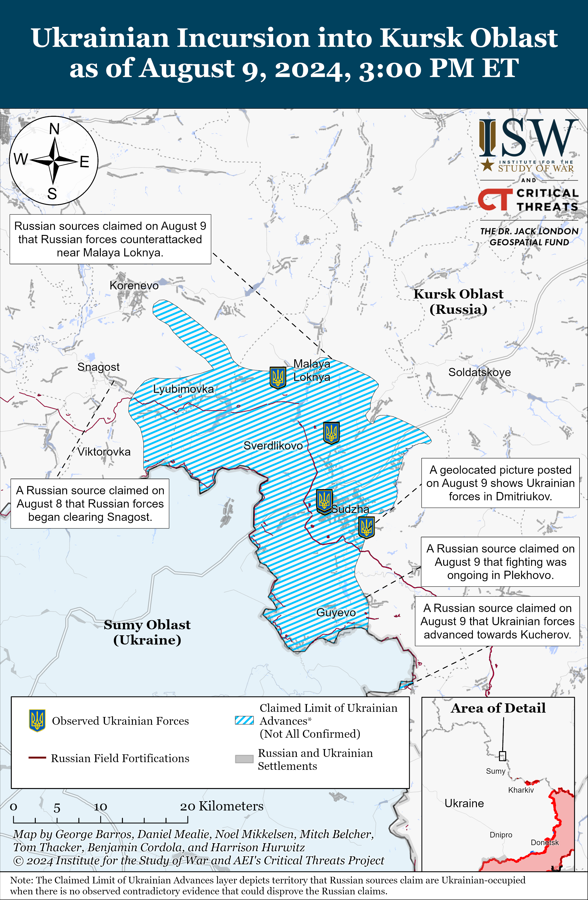
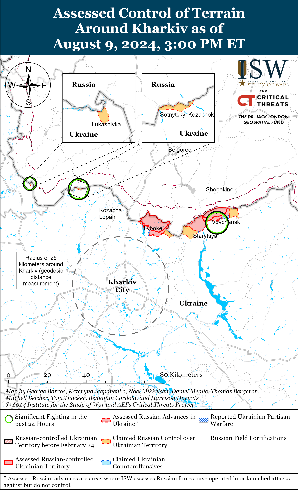
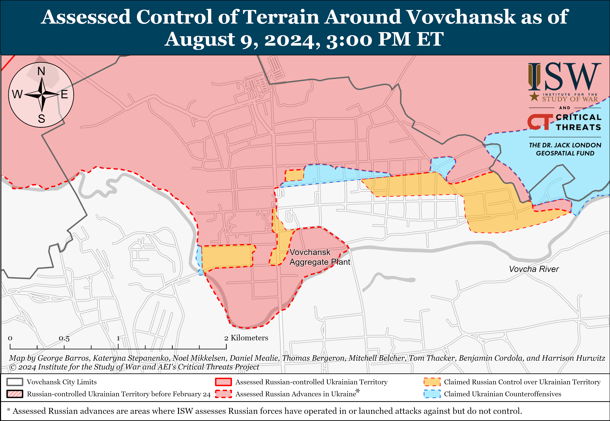
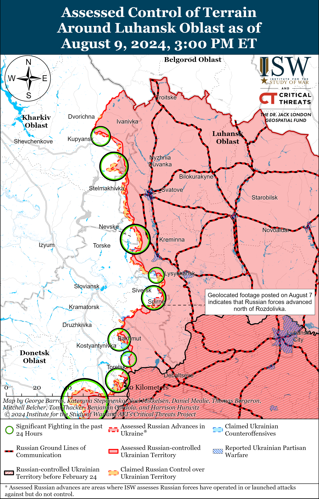
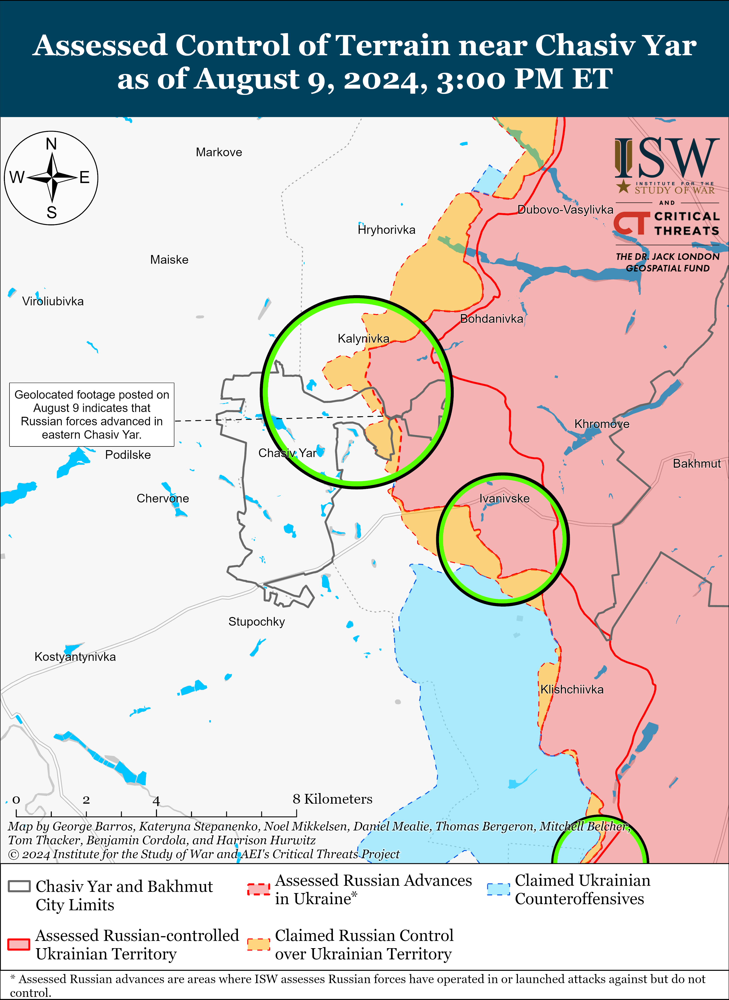
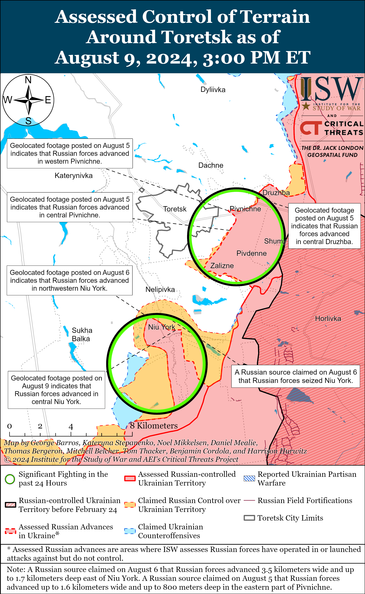
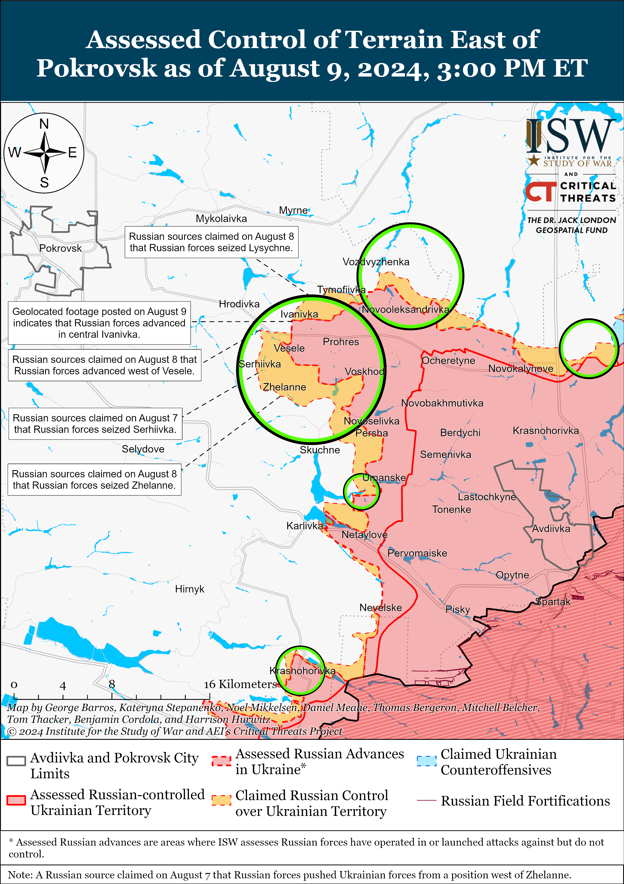
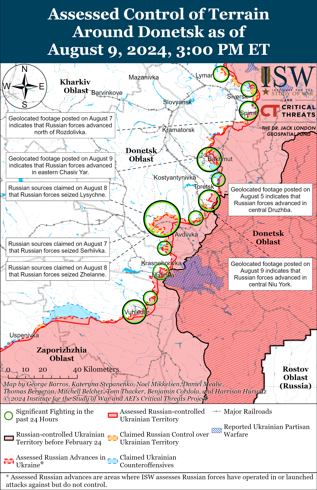
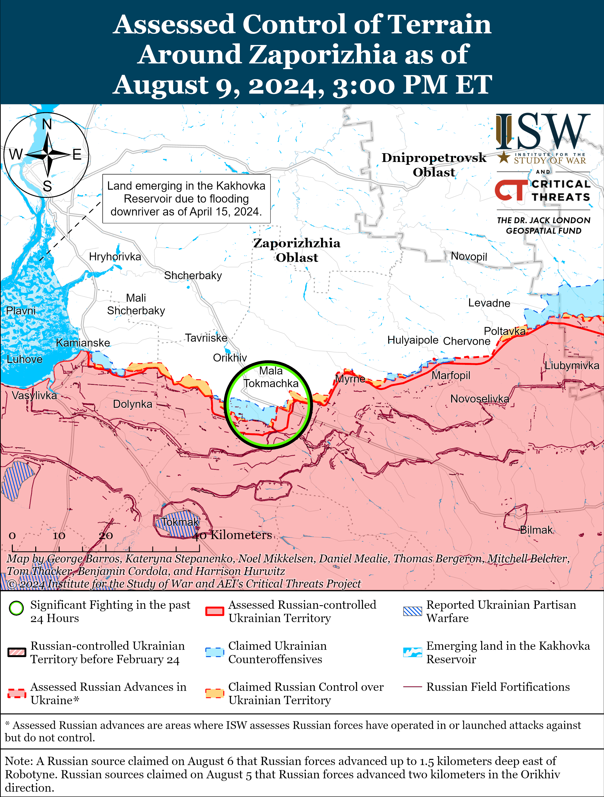

# Russian Offensive Campaign Assessment, August 9, 2024

**Angelica Evans, Christina Harward, Riley Bailey, Davit Gasparyan, Grace Mappes, and George Barros**

**August 9, 2024, 8:15pm ET**

**Click**[**here**](https://storymaps.arcgis.com/stories/36a7f6a6f5a9448496de641cf64bd375)**to see ISW’s interactive map of the Russian invasion of Ukraine. This map is updated daily alongside the static maps present in this report.**

**Click**[**here**](https://understandingwar.maps.arcgis.com/apps/instant/3dviewer/index.html?appid=1602762dbcde419bb957dea358449580)**to see ISW’s 3D control of terrain topographic map of Ukraine. Use of a computer (not a mobile device) is strongly recommended for using this data-heavy tool.**

**Click**[**here**](https://storymaps.arcgis.com/stories/733fe90805894bfc8562d90b106aa895)**to access ISW’s archive of interactive time-lapse maps of the Russian invasion of Ukraine. These maps complement the static control-of-terrain map that ISW produces daily by showing a dynamic frontline. ISW will update this time-lapse map archive monthly.**

**Note: The data cut-off for this product was 1:30pm ET on August 9. ISW will cover subsequent reports in the August 10 Russian Offensive Campaign Assessment.** [**NOTE:***Russian sources are currently shifting much of their reporting to cover the Ukrainian incursion into Kursk Oblast and as a result are not providing the same level of detail about the situation along the frontline in Ukraine.*]

**Russian sources claimed on August 9 that Ukrainian forces advanced further east in Kursk Oblast but are likely no longer operating as far north or as far west as Russian sources previously claimed on August 8.**A Russian milblogger claimed on August 9 that Ukrainian forces conducted another cross-border incursion northeast of Sumy City and advanced towards Kucherov (roughly one kilometer from the international border) but have not entered the settlement.[1] A Russian milblogger claimed that Ukrainian forces in Kursk Oblast advanced as far east as Plekhovo (southeast of Sudzha) on the left bank of the Psyol River.[2] ISW is recessing the claimed limit of Ukrainian advances up to Snagost (south of Korenevo), given that a Russian milblogger claimed on August 8 that Russian forces began clearing the settlement.[3] ISW is also recessing the claimed limit of Ukrainian advances to the northern outskirts of Malaya Loknya (northwest of Sudzha and roughly 13 kilometers from the international border) as Russian milbloggers claimed on August 9 that Russian forces counterattacked near the settlement.[4]

Geolocated footage published on August 9 indicates that Ukrainian forces were recently operating west of Sudzha, within the settlement, north of Sudzha near Kazachya Loknya, and northeast of Leonidovo (northwest of Sudzha and roughly 10 kilometers from the international border) and in Dmitriukov.[5] Russian milbloggers continued to issue contradictory statements about Ukrainian positions in Sudzha (northeast of Sumy City and roughly 10 kilometers from the international border), however. A Russian source claimed that Ukrainian forces are not operating within Sudzha, whereas another source claimed that Ukrainian forces are located in the settlement but cannot operate freely.[6] Other Russian milbloggers claimed that Ukrainian forces partially control Sudzha and that the town is a contested “gray zone.”[7] Russian milbloggers claimed that Ukrainian forces are also operating northeast of Sudzha near Martynovka; north of Sudzha near Vtoroy Knyazhiy, Ivnitsa, Zaoleshenka, Russkoye Porechnoye (16 kilometers from the international border); and west of Sudzha near Goncharovka.[8] A Russian milblogger claimed that Russian forces control the area near Korenevo (north of Sumy City and roughly 23 kilometers north of the international border) and denied reports of fighting on the settlement’s outskirts.[9] The Russian milblogger claimed on August 8 that Ukrainian forces control Novoivanovka (southeast of Korenevo) and Lyubimovka (southeast of Korenevo).[10] Another Russian source claimed on August 9, however, that Russian forces regained lost positions in Novoivanovka and Leonidovo.[11] A Russian source claimed that there is no confirmation of Ukrainian forces operating in Kromskiy Byki (30 kilometers from the international border and 13 kilometers south of Lgov), and the vast majority of Russian reporting about Kursk Oblast on August 9 is not consistent with previous claims that mobile Ukrainian groups were operating beyond 20 kilometers into Kursk Oblast.[12]

**Ukrainian forces reportedly struck a Russian military convoy east of Rylsk near Oktyabrskoye, Kursk Oblast.**Geolocated footage published on August 9 shows the aftermath of the strike and destroyed Russian trucks along the 38K-017 highway.[13] Russian and Ukrainian sources stated that there were 14 Ural and KAMAZ covered trucks carrying Russian reserves intended to reinforce Russian forces in Kursk Oblast and that the strike likely killed several Russian personnel traveling in the trucks.[14] Russian sources suggested that the column may have been transporting personnel from the Russian Northern Grouping of Forces’ 44th Army Corps (Leningrad Military District) or the “Pyatnashka” Brigade.[15] Russian milbloggers theorized about which weapons system Ukraine may have used to conduct this strike, althoughISW is not prepared to comment on which system Ukraine may have used during the strike.

**The Russian military command appears to be relying on existing units deployed to the international border area and readily available forces in the rear, most of which are units staffed with conscripts and irregular forces, to address the ongoing Ukrainian incursion into Kursk Oblast. These units would likely be the first to respond even if the Russian military command has decided to transfer additional, more experienced units from elsewhere in the theater. The Russian military command may currently be resisting operational pressures to redeploy forces from other operational directions to prevent the Ukrainian incursion from disrupting Russian offensive operations in eastern Ukraine.**The Russian Ministry of Defense (MoD) claimed on August 9 that it sent additional multiple launch rocket systems (MLRS), artillery, and heavy tracked vehicles to strengthen forces in Sudzha Raion, and Russian milbloggers amplified footage showing additional Russian forces arriving in Kursk Oblast.[16] Russian Minister of Emergency Situations Alexander Kurenkov ordered additional forces and resources from the Tula Oblast rescue center to deploy to Kursk Oblast to assist with de-mining and civilian evacuations.[17] Russian conscripts, FSB border guards, and elements of Chechen “Akhmat” Spetsnaz units operating under the Russian MoD were reportedly operating in Kursk Oblast as of the beginning of the Ukrainian incursion.[18] The Russian military command has reportedly transferred forces from unspecified operational reserves, additional units staffed by conscripts, Spetsnaz (Main Intelligence Directorate of the Russian General Staff [GRU]), Special Operations Forces (SSO), additional Chechen “Akhmat” Spetsnaz operating under the Russian MoD, and the 1st Donetsk People’s Republic Army Corps (DNR AC) and former Wagner Group personnel to unspecified areas of Kursk Oblast to defend against further Ukrainian advances and retake territory.[19] A Kremlin-affiliated Russian milblogger claimed that the Russian military command has tasked Russian Spetsnaz and SSO forces with “clearing” the breakthrough zone and pushing Ukrainian forces back across the international border, and several Russian milbloggers expressed confidence that Russian Spetsnaz forces are likely the most capable Russian forces to respond to Ukrainian mechanized maneuver.[20] The Kremlin-affiliated milblogger also claimed that the Russian military command has transferred reserves of the Russian Africa Corps to Kursk Oblast from Krasnodar Krai, though ISW is unable to verify this claim.

Other irregular Russian forces, including those previously deployed to other areas of the frontline, are also reportedly arriving in Kursk Oblast. Elements of the DNR’s irregular forces, including the “Dikaya Division of Donbas” and the “Pyatnashka” Brigade, reportedly arrived in Kursk Oblast following offensive operations in Donetsk Oblast.[21] The Wagner Group Commanders’ Council issued a statement on August 9 declaring Wagner’s willingness to deploy to the Kursk Oblast border area “at the first call,” and Russian milbloggers claimed that unspecified former Wagner personnel have begun to arrive in Kursk Oblast.[22] Russian milbloggers claimed that elements of the Chechen “Akhmat” Spetsnaz are operating throughout Kursk Oblast, including in Bolshoye Soldatskoye, and elements of the Chechen “Aida” Detachment are operating near Sudzha.[23] Elements of the Russian SSO are reportedly also operating throughout Kursk Oblast’s border areas, including near Sudzha.[24] Chechen “Akhmat” Spetsnaz Commander Apty Alaudinov is reportedly in Kursk Oblast to oversee the Chechen forces, and Alaudinov expressed confidence on August 9 that the Russian military has sufficient forces and resources to stop Ukrainian advances in Kursk Oblast, although it is unclear if the Russian military command intends to transfer additional, more combat effective and well-equipped forces to the border area.[25]

**The Russian military command may currently be transferring more experienced and better-provisioned frontline units from eastern or southern Ukraine to Kursk Oblast, but it would likely take additional time for such units to arrive in Kursk Oblast.**One Russian milblogger claimed on August 9 that elements of the Russian Northern Grouping of Force’s 44th Army Corps (Leningrad Military District) are operating near Rylsk, however, suggesting that the Russian military command may be transferring elements that the Northern Grouping of Forces accumulated for its offensive operation in northern Kharkiv Oblast to respond to the Ukrainian operation in Kursk Oblast.[26] This milblogger’s claim, if accurate, would suggest that the Russian military command is assessing Ukraine’s operation to be more significant. Significant redeployments of elements of the Northern Grouping of Forces to Kursk Oblast would suggest that the Russian military command has determined that disruptions to the offensive operation in northern Kharkiv Oblast is a necessary sacrifice to appropriately respond to the Ukrainian incursion while avoiding redeployments from more priority sectors of the frontline.[27] Larger Russian re-deployments from frontline areas will likely be slower, and more combat-effective frontline units could begin to arrive in Kursk Oblast in the coming days.

**Ukrainian forces conducted strikes against a Russian military airfield in Lipetsk Oblast and other Russian military targets in occupied Crimea and Donetsk Oblast on August 9.**The Ukrainian General Staff reported that Ukrainian forces struck warehouses storing glide bombs and other facilities at the Lipetsk military airfield near Lipetsk City.[28] Russian sources amplified footage of explosions at the airfield, and satellite imagery collected on August 9 shows that the Ukrainian strikes destroyed several ammunition warehouses at the airfield.[29] The Ukrainian General Staff noted that Russian forces base Russian Su-34, Su-35, and MiG-31 fixed-wing aircraft at the Lipetsk airfield, and Russian forces debated whether Russian aircraft preemptively took off to avoid the strikes or were present at the time of the Ukrainian strikes.[30] The Ukrainian General Staff reported that Ukrainian forces also targeted Russian anti-aircraft missile units in an unspecified location in occupied Donetsk Oblast and struck two radars for S-350 air defense systems and a radar for an S-300 air defense system.[31] The Ukrainian General Staff clarified that it confirmed the destruction of one radar for a Russian S-350 air defense system but is verifying the results of the strikes on the other two radars.[32] Russian sources, including Sevastopol occupation governor Mikhail Razvozhaev, claimed that the Russian force shot down a Ukrainian Neptune anti-ship missile and up to five aerial drones and destroyed seven naval drones targeting occupied Crimea, particularly near Sevastopol.[33]

**Russian forces are reportedly increasing the use of chemical agents in Ukraine in continued apparent violations of the Chemical Weapons Convention (CWC), to which Russia is a signatory.**The Ukrainian Support Forces Command reported on August 9 that Russian forces in Ukraine are increasing their use of chemical attacks and are largely using K-51 and RG-VO hand gas grenades with riot control agents (RCAS) that are prohibited by the Chemical Weapons Convention (CWC). Ukrainian officials reported that Russian forces used chemical agents and possibly weapons 358 times in July 2024 and 3570 times from February 15, 2023, to July 24, 2024.[34]

**The US Department of Defense (DoD) announced a new military assistance package worth $125 million for Ukraine on August 9.** The military assistance package is the 63rd tranche provided from DoD inventories for Ukraine since August 2021 and includes ammunition for HIMARS systems; 155mm and 105mm artillery ammunition; Stinger missiles; Javelin and AT-4 anti-tank systems; Tube-Launched, Optically-Tracked, Wire-Guided (TOW) anti-tank guided missiles; multi-purpose radars; HMMWV multi-purpose wheeled vehicles; small arms ammunition; explosive munitions; and additional equipment and munitions.[35]

**Russian authorities have passed several laws aimed at preventing Russians from using telecommunications services or anonymously operating prominent social media channels amid intensified efforts to coerce Russians away from Western social media platforms.**Russian President Vladimir Putin approved a law on August 8 compelling owners of social media channels with over 10,000 followers to register their personal details with Russian federal censor Roskomnadzor starting on November 1.[36] This law also contains a provision limiting the number of registered SIM cards per person to 20 for Russian citizens and 10 for foreigners and stateless persons as well as forbidding people in Russia to pay for communications services in cash or other untraceable methods.[37] These new laws are part of the Kremlin’s ongoing campaign to codify pro-Kremlin behavioral norms in the information space into Russian law and establish a standard for acceptable behavior among populations whose behavior has recently threatened the Kremlin, as ISW has previously reported.[38] Roskomnadzor announced on August 9 that it blocked the Signal encrypted messaging service for violating Russian law, and Russians are already reporting that they cannot access the service.[39] Russians are also increasingly reporting severe speed throttling and an inability to access YouTube following recent acknowledgments that the Russian government is throttling YouTube’s speeds, likely to push Russians to use deanonymized, Kremlin-controlled social media sites that the Kremlin can more easily exert influence.[40]

**Key Takeaways:**

- **Russian sources claimed on August 9 that Ukrainian forces advanced further east in Kursk Oblast but are likely no longer operating as far north or as far west as Russian sources previously claimed on August 8.**
- **Ukrainian forces reportedly struck a Russian military convoy east of Rylsk near Oktyabrskoye, Kursk Oblast.**
- **The Russian military command appears to be relying on existing units deployed to the international border area and readily available forces in the rear, most of which are units staffed with conscripts and irregular forces, to address the ongoing Ukrainian incursion into Kursk Oblast.**
- **These units would likely be the first to respond even if the Russian military command has decided to transfer additional, more experienced units from elsewhere in the theater.**
- **The Russian military command may currently be resisting operational pressures to redeploy forces from other operational directions to prevent the Ukrainian incursion from disrupting Russian offensive operations in eastern Ukraine.**
- **The Russian military command may currently be transferring more experienced and better-provisioned frontline units from eastern or southern Ukraine to Kursk Oblast, but it would likely take additional time for such units to arrive in Kursk Oblast.**
- **Ukrainian forces conducted strikes against a Russian military airfield in Lipetsk Oblast and other Russian military targets in occupied Crimea and Donetsk Oblast on August 9.**
- **Russian forces recently made confirmed advances near Chasiv Yar, Toretsk, and Pokrovsk.**
- **The Russian Ministry of Defense (MoD) continues to posture itself as providing sufficient medical care to Russian servicemembers.**

***We do not report in detail on Russian war crimes because these activities are well-covered in Western media and do not directly affect the military operations we are assessing and forecasting. We will continue to evaluate and report on the effects of these criminal activities on the Ukrainian military and the Ukrainian population and specifically on combat in Ukrainian urban areas. We utterly condemn Russian violations of the laws of armed conflict and the Geneva Conventions and crimes against humanity even though we do not describe them in these reports.***

- Russian Main Effort – Eastern Ukraine (comprised of three subordinate main efforts)
- Russian Subordinate Main Effort #1 – Push Ukrainian forces back from the international border with Belgorod Oblast and approach to within tube artillery range of Kharkiv City
- Russian Subordinate Main Effort #2 – Capture the remainder of Luhansk Oblast and push westward into eastern Kharkiv Oblast and encircle northern Donetsk Oblast
- Russian Subordinate Main Effort #3 – Capture the entirety of Donetsk Oblast
- Russian Supporting Effort – Southern Axis
- Russian Air, Missile, and Drone Campaign
- Russian Mobilization and Force Generation Efforts
- Russian Technological Adaptations
- Activities in Russian-occupied areas
- Ukrainian Defense Industrial Base Efforts
- Russian Information Operations and Narratives
- Significant Activity in Belarus

**Russian Main Effort – Eastern Ukraine**

**Russian Subordinate Main Effort #1 – Kharkiv Oblast (Russian objective: Push Ukrainian forces back from the international border with Belgorod Oblast and approach to within tube artillery range of Kharkiv City)**

Russian forces reportedly seized border settlements northwest of Kharkiv City in Sumy and Kharkiv oblasts on August 9, but ISW has yet to observe confirmation of Russian gains in these areas. Russian milbloggers claimed that Russian forces, including elements of the Chechen Akhmat “Aida” Spetsnaz detachment, conducted assaults near Sotnytskyi Kozachok, Kharkiv Oblast and seized the settlement and also pushed Ukrainian forces out of Lukashivka, Sumy Oblast.[41] Russian forces have recently conducted small sabotage and reconnaissance activities in border areas northwest of Kharkiv City in Kharkiv and Sumy oblasts, but Russian sources may be amplifying these reports to distract from the Ukrainian incursion into Kursk Oblast.[42]

Russian forces continued offensive operations north of Kharkiv City near Hlyboke and northeast of Kharkiv City near Vovchansk on August 8 and 9, but there were no confirmed changes to the frontline.[43] The Ukrainian Kharkiv Group of Forces reported on August 9 that elements of the Russian 153rd Tank Regiment (47th Tank Division, 1st Guards Tank Army [GTA], Moscow Military District [MMD]) are operating within Vovchansk and that elements of the 155th Naval Infantry Brigade (Pacific Fleet, Eastern Military District [EMD]) are operating near Hlyboke.[44]

[****](https://understandingwar.org/wp-content/uploads/2025/05/Kharkiv20Battle20Map20Draft20August2092C202024.png)

**Russian Subordinate Main Effort #2 – Luhansk Oblast (Russian objective: Capture the remainder of Luhansk Oblast and push westward into eastern Kharkiv Oblast and northern Donetsk Oblast)**

Russian forces continued offensive operations along the Kupyansk-Svatove-Kreminna line on August 9, but there were no confirmed changes to the frontline. The Ukrainian General Staff reported that Russian forces attacked northeast of Kupyansk near Synkivka; east of Kupyansk near Petropavlivka; southeast of Kupyansk near Tabaivka and in the direction of Hlushivka; northwest of Kreminna near Nevske, and Makiivka; west of Kreminna near Terny; and southwest of Kreminna in the Serebryanske forest area on August 8 and 9.[45]

**Russian Subordinate Main Effort #3 – Donetsk Oblast (Russian objective: Capture the entirety of Donetsk Oblast, the claimed territory of Russia’s proxies in Donbas)**

The Ukrainian General Staff reported on August 8 and 9 that Russian forces continued ground attacks northeast of Siversk near Bilohorivka; east of Siversk near Verkhnokamyanske; and southeast of Siversk near Spirne, Ivano-Darivka, and Vyimka.[46]

Russian forces recently marginally advanced in and near Chasiv Yar amid continued offensive operations in the area on August 9. Geolocated footage published on August 9 indicates that Russian forces recently marginally advanced along Lisova Street within Kalynivka (north of Chasiv Yar) and further west of the Siverskyi Donets-Donbas canal in Zhovtnevyi Microraion (eastern Chasiv Yar).[47] Russian forces continued offensive operations in Novyi Microraion in eastern Chasiv Yar; east of Chasiv Yar near Ivanivka; and south of Chasiv Yar near Stupochky, Bila Hora, and Dyliivka on August 8 and 9.[48]

Russian forces continued offensive operations near Toretsk on August 9, but there were no confirmed changes to the frontline. Geolocated footage published on August 9 indicates that Russian forces recently advanced to Horlivska Street in central Niu York (south of Toretsk).[49] Russian forces attacked east of Toretsk near Pivnichne and Zalizne and southwest of Toretsk near Panteleymonivka on August 8 and 9.[50]

Russian forces recently advanced east of Pokrovsk amid continued offensive operations in the area on August 9. Geolocated footage published on August 9 indicates that Russian forces recently advanced west of Novooleksandrivka and within Ivanivka (both east of Pokrovsk).[51] A Russian milblogger reiterated claims that Russian forces advanced north of Serhiivka (southeast of Pokrovsk) and entered the eastern outskirts of Hrodivka (east of Porkovsk), but ISW has not observed visual confirmation of these claims.[52] A Russian source claimed that Russian forces are operating 10 kilometers from Pokrovsk, but ISW has only observed evidence to confirm that Russian forces have advanced within 17 kilometers of Pokrovsk.[53] Russian forces also attacked east of Pokrovsk near Vozdvyzhenka, Lysychne, and Ivanivka and southeast of Pokrovsk near Zhelanne, Novoselivka Persha, Yasnobrodivka, and Karlivka on August 8 and 9.[54]

Russian forces continued offensive operations west of Donetsk City near Krasnohorivka and southwest of Donetsk City near Paraskoviivka, Kostyantynivka, and Vodyane on August 8 and 9, but there were no confirmed changes to the frontline.[55] Elements of the Russian 1st “Slavic” Motorized Rifle Brigade (1st Donetsk People’s Republic Army Corps [DNR AC]) are reportedly operating in the Donetsk direction (west and southwest of Donetsk City).[56]

Russian forces continued ground attacks in the Donetsk-Zaporizhia Oblast border area, including southeast of Velyka Novosilka near Vuhledar, on August 8 and 9.[57] A Russian milblogger claimed that Russian forces advanced several hundred meters north of Urozhaine (south of Velyka Novosilka), but ISW has not observed confirmation of this claim.[58]

**Russian Supporting Effort – Southern Axis (Russian objective: Maintain frontline positions and secure rear areas against Ukrainian strikes)**

Positional fighting continued in western Zaporizhia Oblast near Robotyne, east of Robotyne near Verbove, and northeast of Robotyne near Mala Tokmachka on August 8 and 9.[59]

Ukrainian forces landed on the Kinburn Spit and conducted a raid in the area on August 9. Ukraine’s Main Military Intelligence Directorate (GUR) reported that GUR units landed on the Kinburn Spit and destroyed six Russian armored vehicles and wounded and killed several dozen Russian personnel in the area.[60] GUR posted geolocated footage of GUR personnel raising a Ukrainian flag at a position on the Kinburn Spit, but it is unlikely that the GUR personnel have maintained an enduring presence at these positions given the GUR’s description of the landing as a raid.[61] Russian sources, including the Russian Ministry of Defense (MoD), claimed that up to 16 Ukrainian personnel conducted an unsuccessful landing near the Kinburn Spit with four watercraft and that Russian forces destroyed several of the watercraft and repelled Ukrainian forces from the Kinburn Spit following small arms engagements on land.[62]

**Russian Air, Missile, and Drone Campaign (Russian Objective: Target Ukrainian military and civilian infrastructure in the rear and on the frontline)**

Russian forces conducted a series of drone and missile strikes targeting Ukraine on the night of August 8 to 9. Ukrainian Air Force Commander Lieutenant General Mykola Oleshchuk reported that Russian forces launched 27 Shahed-136/131 drones from Primorsko-Akhtarsk, Krasnodar Krai and that Ukrainian forces shot down all the drones over Kyiv, Poltava, Sumy, Mykolaiv, Kherson, Donetsk, and Dnipropetrovsk oblasts.[63] Russian forces struck a supermarket in Kostyantynivka, Donetsk Oblast on August 9, reportedly with a Kh-38ML air-to-surface missile, and Ukrainian officials stated that the strike killed at least 11 people.[64] A Russian news outlet claimed that a Russian Iskander missile strike against a Ukrainian headquarters in northern Kharkiv Oblast killed several Ukrainian generals on the night of August 6 to 7, although ISW has not observed wider reporting or confirmation of this claim.[65]

**Russian Mobilization and Force Generation Efforts (Russian objective: Expand combat power without conducting general mobilization)**

The Russian Ministry of Defense (MoD) continues to posture itself as providing sufficient medical care to Russian servicemembers. Deputy Defense Minister Anna Tsivileva inspected the construction of a new hospital in Samara City on August 9.[66] The Russian MoD has repeatedly highlighted Tsivileva’s visits to medical institutions following complaints from Russian ultranationalists that the Russian MoD is providing inadequate medical care to injured soldiers and improperly returning injured personnel to service, including fighting on the frontline.[67]

Russian President Vladimir Putin signed a law on August 8 simplifying the process to transfer weapons that Russian law enforcement has confiscated to the Russian MoD, Rosgvardia, and other state paramilitary organizations for use in Ukraine.[68] Russian State Duma “Special Military Operation” Working Group Chairperson Andrei Turchak previously stated that 70,000 of the 250,000 seized firearms held at Russian Ministry of Internal Affairs (MVD) regional offices in Russia are functional.[69]

**Russian Technological Adaptations (Russian objective: Introduce technological innovations to optimize systems for use in Ukraine)**

Russian sources claimed on July 29 and 30 that Russian servicemembers fighting in Ukraine started using AGS-17 and AGS-30 automatic grenade launchers with the “DS-T4” sights that have ballistic computer support.[70] The sight reportedly includes a laser rangefinder and ballistic calculator that allows the grenade launcher to calculate trajectory and receive information about necessary corrections.

Russian aircraft manufacturer Yakovlev claimed on August 9 that it will begin flight tests of a Russian MS-21 airplane produced entirely with import substitution components before the end of 2024.[71]

**Ukrainian Defense Industrial Efforts (Ukrainian objective: Develop its defense industrial base to become more self-sufficient in cooperation with US, European, and international partners)**

*ISW is not publishing coverage of Ukrainian defense industrial efforts today.*

**Activities in Russian-occupied areas (Russian objective: Consolidate administrative control of annexed areas; forcibly integrate Ukrainian citizens into Russian sociocultural, economic, military, and governance systems)**

Russian authorities continue to detain Ukrainians in occupied Ukraine who then go missing. The Ukrainian global initiative Tribunal for Putin (T4P) has identified 5,340 victims of forced disappearance whom Russian authorities have detained and whose whereabouts are unknown in occupied Ukraine as of July 30.[72] T4P reported that Russian authorities have conducted two waves of forced disappearances in Ukraine. The first wave was immediately following the full-scale invasion where Russian authorities followed pre-drafted lists and detained Ukrainian politicians, volunteers, public figures, human rights advocates, journalists, and others who could oppose Russian occupation. Russian authorities conducted the second wave of forced disappearances based on individual reports of suspicion about specific individuals, such as suspecting residents of photographing Russian military equipment. T4P noted that these individuals may stay missing for years, as Russian authorities do not provide any information to relatives and do not include the missing persons in lists of prisoners or deceased. T4P noted that roughly four percent (about 160) of the forced disappearance cases involve Ukrainian children. Ukrainian Mariupol Mayoral Advisor Petro Andryushchenko reported on August 8 that Russian authorities have arrested at least 10,000 citizens of Mariupol since February 2022 and that up to 100 Ukrainians who express pro-Ukrainian sentiments disappear from occupied Mariupol per month during Russian detention.[73]

Russian authorities continue to Russify Ukrainian children and forcibly transport them to Russian territory under the guise of educational and other programs. The Russian Ministry of Culture reported on August 6 that more than 1,750 Ukrainian children from occupied Ukraine have visited Moscow as part of the “Cultural Map 4+85” cultural and educational program in Summer 2024.[74] The Russian Ministry of Culture noted that the “Cultural Map 4+8” program aims to host over 10,000 Ukrainian children at cultural and historical sites in cities across Russia and that Russian authorities will send more than 700 Ukrainian children to Moscow for this program in Summer 2024. Kherson Oblast occupation chairperson Andrey Alekseenko claimed on August 8 that roughly 2,100 Ukrainian children from occupied Kherson Oblast have gone to Russian children’s health camps throughout the country and that the occupation administration will send another 1,000 Ukrainian children to these camps by the end of 2024.[75]

**Russian Information Operations and Narratives**

Russian sources sought to reinforce the narrative that Russia is a global superpower and the dominant member of the Collective Security Treaty Organization (CSTO) amid the Ukrainian incursion into Kursk Oblast. The First Deputy Chairman of the Russian State Duma’s Committee on the Commonwealth of Independent States (CIS) Affairs Konstantin Zatulin stated on August 9 that Russia does not intend to seek help from partners in the CSTO following the Ukrainian incursion into Kursk Oblast because Russia is the dominant power in the CSTO and does not need assistance within its territory.[76] A Russian milblogger questioned the utility of the CSTO on August 7 claiming that Russia would not ask for assistance from partner states despite spending money and diplomatic resources on CSTO development.[77]

The Russian government continues to charge former Ukrainian officials in absentia on fabricated charges as part of its ongoing efforts to enforce Russian federal law outside of Russia’s jurisdiction and justify Russia’s full-scale invasion of Ukraine. The Russian Investigative Committee charged in absentia former Ukrainian National Guard First Deputy Commander Oleksandr Kryvenko and former Ukrainian Main Military Intelligence Directorate Head Yuriy Pavlov on August 9 for the deaths of civilians and destruction of infrastructure in occupied Donetsk and Luhansk oblasts from 2014-2015.[78]

**Significant activity in Belarus (Russian efforts to increase its military presence in Belarus and further integrate Belarus into Russian-favorable frameworks and Wagner Group activity in Belarus)**

Nothing significant to report.

**Note: ISW does not receive any classified material from any source, uses only publicly available information, and draws extensively on Russian, Ukrainian, and Western reporting and social media as well as commercially available satellite imagery and other geospatial data as the basis for these reports. References to all sources used are provided in the endnotes of each update.**

---

[1] https://t.me/rybar/62615

[2] https://t.me/rybar/62607

[3] https://t.me/rybar/62587

[4] https://t.me/motopatriot/25917; https://t.me/rybar/62607; https://t.me/DnevnikDesantnika/13607

[5] https://x.com/cyber\_boroshno/status/1821965584625549487; https://t.me/kiber\_boroshno/9474; https://t.me/WarArchive\_ua/18296 ; https://t.me/WarArchive\_ua/18284; https://t.me/BRAVO\_Team\_chanel/55; https://x.com/WarVehicle/status/1821895478906126646; https://t.me/kiber\_boroshno/9454;https://x.com/Archer83Able/status/1821756856731132346; https://t.me/izvestia/181336; https://x.com/giK1893/status/1821872903484264915; https://t.me/dva\_majors/49245; https://x.com/giK1893/status/1821872906105716909; https://x.com/GeoConfirmed/status/1821970356799930427; https://x.com/EuromaidanPR/status/1822008702616138209 ; https://x.com/EuromaidanPR/status/1822008702616138209

[6] https://t.me/rybar/62615; https://t.me/rybar/62607; https://t.me/DnevnikDesantnika/13611;

[7] https://t.me/Sladkov\_plus/11130; https://t.me/RVvoenkor/74369 ; https://t.me/motopatriot/25949

[8] https://t.me/rybar/62615; https://t.me/rybar/62607; https://t.me/DnevnikDesantnika/13611; https://t.me/rybar/62607; https://t.me/DnevnikDesantnika/13613 ; https://t.me/DnevnikDesantnika/13645; https://t.me/rybar/62598 ; https://t.me/dva\_majors/49255; https://t.me/DnevnikDesantnika/13628; https://t.me/voenkorKotenok/58078

[9] https://t.me/rybar/62615; https://t.me/rybar/62607

[10] https://t.me/rybar/62587

[11] https://t.me/motopatriot/25917; https://t.me/motopatriot/25923

[12] https://t.me/DnevnikDesantnika/13629

[13] https://x.com/99Dominik\_/status/1821821166274625804; https://x.com/Dmojavensis/status/1821807957014696145; https://x.com/NOELreports/status/1821801493554499730;

[14] https://t.me/arrowsmap/5175 ; https://t.me/ButusovPlus/12533 ; https://t.me/milinfolive/127952 ; https://x.com/bayraktar\_1love/status/1821808200565363071; https://x.com/bayraktar\_1love/status/1821811639760392473; https://suspilne dot media/809885-u-voxcheck-pidtverdili-znisenna-rosijskoi-tehniki-u-kurskij-oblasti/

[15] https://t.me/akashevarova/7448 ; https://meduza dot io/feature/2024/08/09/voenkomaty-otvechayut-vy-gluposti-govorite-ih-tam-net ;

[16] https://t.me/tass\_agency/265369 ; https://t.me/rybar/62608 ; https://t.me/milinfolive/127965 ; https://t.me/dva\_majors/49246 ; https://t.me/RVvoenkor/74366 ; https://t.me/philologist\_zov/1195

[17] https://t.me/mchs\_official/21107

[18] https://t.me/rybar/62546; ; https://t.me/ButusovPlus/12484; https://twitter.com/Tatarigami\_UA/status/1821300140755271836 ; https://t.me/vchkogpu/49735 ; https://t.me/voenkorKotenok/58023 ; https://t.me/mod\_russia/41905 ; https://t.me/ButusovPlus/12484 ; https://t.me/russianocontext/4248 ; https://t.me/mobilizationnews/19726 ; https://t.me/dva\_majors/49141; https://t.me/RVvoenkor/74281; https://t.me/dva\_majors/49098; https://t.me/dva\_majors/49158 ; https://t.me/belarusian\_silovik/38851 ; https://understandingwar.org/backgrounder/russian-offensive-campaign-assessment-august-7-2024 ; https://understandingwar.org/backgrounder/russian-offensive-campaign-assessment-august-6-2024

[19] https://t.me/DnevnikDesantnika/13640 ; https://t.me/dva\_majors/49255 ; https://t.me/DnevnikDesantnika/13589 ; https://t.me/notes\_veterans/18640 ; https://t.me/voenkorKotenok/58063 ; https://t.me/wargonzo/21480 ; https://t.me/dva\_majors/49169 ; https://t.me/wargonzo/21478 ; https://t.me/dva\_majors/49169 ; https://t.me/Tsaplienko/58212; https://x.com/666\_mancer/status/1821628693216924022

[20] https://t.me/rybar/62587 ; https://t.me/dva\_majors/49167 ; https://t.me/rybar/62592

 ; https://t.me/rybar/62613

[21] https://t.me/dva\_majors/49169 ; https://t.me/wargonzo/21478 ; https://t.me/notes\_veterans/18640; https://www.mk dot ru/politics/2024/08/09/strashnee-yadernoy-bomby-vsu-v-kurskoy-oblasti-zapanikovali-ot-vagnerov.html  ; https://t.me/motopatriot/25907 ; https://t.me/RVvoenkor/74319 ; https://t.me/ButusovPlus/12523

[22] https://t.me/RVvoenkor/74362 ; https://t.me/NeoficialniyBeZsonoV/38451 ; ; https://t.me/razgruzka\_vagnera/594 ; https://meduza dot io/news/2024/08/09/chvk-vagnera-predlozhila-otpravitsya-v-kurskuyu-oblast-i-razvernutsya-v-boevye-poryadki ;https://t.me/boris\_rozhin/132925 ; https://t.me/dva\_majors/49169 ; https://www.mk dot ru/politics/2024/08/09/strashnee-yadernoy-bomby-vsu-v-kurskoy-oblasti-zapanikovali-ot-vagnerov.html

[23] https://t.me/tass\_agency/265322 ; https://t.me/DnevnikDesantnika/13589 ; https://t.me/voenkorKotenok/58063 ; https://t.me/wargonzo/21480 ; https://t.me/notes\_veterans/18654 ; https://t.me/boris\_rozhin/132919 ; https://t.me/rusich\_army/16371 ; https://t.me/DnevnikDesantnika/13606 ; https://t.me/dva\_majors/49169

[24] https://t.me/notes\_veterans/18654 ; https://t.me/z\_arhiv/27574; https://t.me/heads\_hunters/5567

[25] https://t.me/tass\_agency/265322

[26] https://t.me/akashevarova/7448

[27] https://understandingwar.org/backgrounder/russian-offensive-campaign-assessment-august-8-2024

[28] https://www.facebook.com/GeneralStaff.ua/posts/pfbid0HKVXGpG4zFF85a2ta5zhZrDXgHywq7iExehjKVACTEBsurP5Wms26bV4Jk8jnuDZl ; https://armyinform dot com.ua/2024/08/09/sylna-pozhezha-ta-bagatorazova-detonacziya-spilnymy-zusyllyamy-sklady-kabiv-znyshhyly-na-vorozhomu-letovyshhi-lipeczk/; https://t.me/GeneralStaffZSU/16555 ; https://suspilne dot media/809663-ukraina-vdarila-po-aerodromu-v-lipecku-rf-tam-buli-vinisuvaci-j-700-kabiv/

[29] https://x.com/bayraktar\_1love/status/1821791322698555624; https://x.com/bayraktar\_1love/status/1821794131158401159; https://x.com/bayraktar\_1love/status/1821792139384177035; https://x.com/GirkinGirkin/status/1821748674239545386 ; https://x.com/GirkinGirkin/status/1821753797061820822; https://t.me/sotaproject/84916 ; https://t.me/cxemu/4116; https://x.com/bayraktar\_1love/status/1821951283693006984; https://t.me/agentstvonews/6887 ; https://x.com/Tendar/status/1821967421919707406; https://x.com/Tendar/status/1821761032492073097 ; https://t.me/volodymyrzolkin/15134; https://t.me/astrapress/61493; https://t.me/astrapress/61501; https://firms.modaps.eosdis.nasa.gov/map/#d:today;@39.46,52.65,13.75z; https://x.com/666\_mancer/status/1821790208234266778; https://x.com/666\_mancer/status/1821785649260671111;

[30] https://www.facebook.com/GeneralStaff.ua/posts/pfbid0HKVXGpG4zFF85a2ta5zhZrDXgHywq7iExehjKVACTEBsurP5Wms26bV4Jk8jnuDZl ; https://armyinform dot com.ua/2024/08/09/sylna-pozhezha-ta-bagatorazova-detonacziya-spilnymy-zusyllyamy-sklady-kabiv-znyshhyly-na-vorozhomu-letovyshhi-lipeczk/; https://t.me/GeneralStaffZSU/16555 ; https://suspilne dot media/809663-ukraina-vdarila-po-aerodromu-v-lipecku-rf-tam-buli-vinisuvaci-j-700-kabiv/ ; https://x.com/666\_mancer/status/1821862653582520731; https://t.me/fighter\_bomber/17681; https://t.me/tactical\_13/5732;  https://t.me/vchkogpu/49745 ; https://t.me/agentstvonews/6887

[31] https://www.facebook.com/GeneralStaff.ua/posts/pfbid0HKVXGpG4zFF85a2ta5zhZrDXgHywq7iExehjKVACTEBsurP5Wms26bV4Jk8jnuDZl

[32] https://www.facebook.com/GeneralStaff.ua/posts/pfbid0HKVXGpG4zFF85a2ta5zhZrDXgHywq7iExehjKVACTEBsurP5Wms26bV4Jk8jnuDZl

[33] https://t.me/tass\_agency/265264 ; https://t.me/tass\_agency/265280 ; https://t.me/tass\_agency/265282 ; https://t.me/boris\_rozhin/132882 ; https://t.me/rybar/62610

[34]https://www.facebook.com/KSP.ZSU/posts/pfbid02PRzFpgsStJVtNL3fTxMxRALKrz7QccU5cK7hP9AhUCqiD8Pqhi5aPqFP8ww6hRMRl; https://armyinform dot com.ua/2024/08/09/zrostannya-dynamiky-vorozhyh-himichnyh-atak-fiksuyut-v-sylah-oborony/

[35] https://www.defense.gov/News/Releases/Release/Article/3868082/biden-administration-announces-additional-security-assistance-for-ukraine/; https://www.msn.com/en-us/news/world/us-sends-another-aid-package-to-ukraine-worth-us-125-million/ar-AA1oxtWJ?ocid=BingNewsVerp

[36] https://tass dot ru/obschestvo/21563713

[37] https://tass dot ru/obschestvo/21563723

[38] https://isw.pub/UkrWar072924; https://isw.pub/UkrWar072524

[39] https://t.me/istories\_media/7204 ; https://meduza dot io/news/2024/08/09/v-rossii-nachali-blokirovat-messendzher-signal; https://t.me/bazabazon/30143 ; https://t.me/sotaproject/84956; https://t.me/tass\_agency/265427 ; https://t.me/sotaproject/84978

[40] https://t.me/tass\_agency/265151; https://t.me/idelrealii/36902 ; https://t.me/severrealii/26589; https://t.me/bbcrussian/68795; https://t.me/bazabazon/30097 ; https://meduza dot io/news/2024/08/08/polzovateli-v-rossii-soobschili-chto-sayt-youtube-perestal-otkryvatsya ; https://t.me/idelrealii/36906; https://t.me/tass\_agency/264847;

[41] https://t.me/DnevnikDesantnika/13585 ; https://t.me/rusich\_army/16355; https://t.me/dva\_majors/49182 ; https://t.me/voenkorKotenok/58064

[42] https://understandingwar.org/backgrounder/russian-offensive-campaign-assessment-july-26-2024

[43]https://www.facebook.com/GeneralStaff.ua/posts/pfbid0t3SH1Sy4tm7UkgRydQDtKJ6d1PzscQUGNsr8qQyw1v4HoUwiQiJZFxvnbeJdw2p2l; https://www.facebook.com/GeneralStaff.ua/posts/pfbid02GJJPCDaG4VscEEEacorzTVM695b3SCEBtJDJZg7x8h5kpf3eMHzE6LpCxKDokMjjl; https://www.facebook.com/GeneralStaff.ua/posts/pfbid02kcAVQeyoVDzw8U16JKnh94TKqLoyc82CFVj4Yc25ReFEWNav6TNz8ruJoSqrdRrsl; https://t.me/wargonzo/21470

[44] https://t.me/otukharkiv/687

[45]https://www.facebook.com/GeneralStaff.ua/posts/pfbid0t3SH1Sy4tm7UkgRydQDtKJ6d1PzscQUGNsr8qQyw1v4HoUwiQiJZFxvnbeJdw2p2l; https://www.facebook.com/GeneralStaff.ua/posts/pfbid02GJJPCDaG4VscEEEacorzTVM695b3SCEBtJDJZg7x8h5kpf3eMHzE6LpCxKDokMjjl; https://www.facebook.com/GeneralStaff.ua/posts/pfbid02kcAVQeyoVDzw8U16JKnh94TKqLoyc82CFVj4Yc25ReFEWNav6TNz8ruJoSqrdRrsl

[46] https://www.facebook.com/GeneralStaff.ua/posts/pfbid0t3SH1Sy4tm7UkgRydQDtKJ6d1PzscQUGNsr8qQyw1v4HoUwiQiJZFxvnbeJdw2p2l ; https://www.facebook.com/GeneralStaff.ua/posts/pfbid02GJJPCDaG4VscEEEacorzTVM695b3SCEBtJDJZg7x8h5kpf3eMHzE6LpCxKDokMjjl ; https://www.facebook.com/GeneralStaff.ua/posts/pfbid02kcAVQeyoVDzw8U16JKnh94TKqLoyc82CFVj4Yc25ReFEWNav6TNz8ruJoSqrdRrsl

[47] https://x.com/moklasen/status/1821971165713420598; https://x.com/moklasen/status/1821971646821101952; https://t.me/sarmat21ompb3/257 ; https://t.me/pionergrupa/2877; https://t.me/creamy\_caprice/6308

[48] https://www.facebook.com/GeneralStaff.ua/posts/pfbid0t3SH1Sy4tm7UkgRydQDtKJ6d1PzscQUGNsr8qQyw1v4HoUwiQiJZFxvnbeJdw2p2l https://www.facebook.com/GeneralStaff.ua/posts/pfbid02kcAVQeyoVDzw8U16JKnh94TKqLoyc82CFVj4Yc25ReFEWNav6TNz8ruJoSqrdRrsl ; https://t.me/rusich\_army/16367

[49] https://t.me/skalabatalion/224; https://x.com/EjShahid/status/1821935744153231516; https://x.com/EjShahid/status/1821935868208119836;

[50] https://www.facebook.com/GeneralStaff.ua/posts/pfbid02GJJPCDaG4VscEEEacorzTVM695b3SCEBtJDJZg7x8h5kpf3eMHzE6LpCxKDokMjjl ; https://www.facebook.com/GeneralStaff.ua/posts/pfbid02kcAVQeyoVDzw8U16JKnh94TKqLoyc82CFVj4Yc25ReFEWNav6TNz8ruJoSqrdRrsl

[51] https://t.me/creamy\_caprice/6310; https://t.me/kokos\_group15/142 ; https://x.com/Bielitzling/status/1821931695039254723; https://x.com/Bielitzling/status/1821936671878779337; https://www.facebook.com/watch?v=808806147743025

[52] https://t.me/motopatriot/25906 ; https://t.me/motopatriot/25957

[53] https://t.me/tass\_agency/265426

[54] https://www.facebook.com/GeneralStaff.ua/posts/pfbid0t3SH1Sy4tm7UkgRydQDtKJ6d1PzscQUGNsr8qQyw1v4HoUwiQiJZFxvnbeJdw2p2l ; https://www.facebook.com/GeneralStaff.ua/posts/pfbid02GJJPCDaG4VscEEEacorzTVM695b3SCEBtJDJZg7x8h5kpf3eMHzE6LpCxKDokMjjl ; https://www.facebook.com/GeneralStaff.ua/posts/pfbid02kcAVQeyoVDzw8U16JKnh94TKqLoyc82CFVj4Yc25ReFEWNav6TNz8ruJoSqrdRrsl ; https://t.me/wargonzo/21470

[55] https://www.facebook.com/GeneralStaff.ua/posts/pfbid0t3SH1Sy4tm7UkgRydQDtKJ6d1PzscQUGNsr8qQyw1v4HoUwiQiJZFxvnbeJdw2p2l ; https://www.facebook.com/GeneralStaff.ua/posts/pfbid02GJJPCDaG4VscEEEacorzTVM695b3SCEBtJDJZg7x8h5kpf3eMHzE6LpCxKDokMjjl ; https://www.facebook.com/GeneralStaff.ua/posts/pfbid02kcAVQeyoVDzw8U16JKnh94TKqLoyc82CFVj4Yc25ReFEWNav6TNz8ruJoSqrdRrsl ; https://t.me/wargonzo/21470

[56] https://t.me/mod\_russia/41957

[57] https://www.facebook.com/GeneralStaff.ua/posts/pfbid02GJJPCDaG4VscEEEacorzTVM695b3SCEBtJDJZg7x8h5kpf3eMHzE6LpCxKDokMjjl ; https://www.facebook.com/GeneralStaff.ua/posts/pfbid02kcAVQeyoVDzw8U16JKnh94TKqLoyc82CFVj4Yc25ReFEWNav6TNz8ruJoSqrdRrsl

[58] https://t.me/tass\_agency/265372

[59] https://www.facebook.com/GeneralStaff.ua/posts/pfbid0t3SH1Sy4tm7UkgRydQDtKJ6d1PzscQUGNsr8qQyw1v4HoUwiQiJZFxvnbeJdw2p2l ; https://www.facebook.com/GeneralStaff.ua/posts/pfbid02GJJPCDaG4VscEEEacorzTVM695b3SCEBtJDJZg7x8h5kpf3eMHzE6LpCxKDokMjjl ; https://www.facebook.com/GeneralStaff.ua/posts/pfbid02kcAVQeyoVDzw8U16JKnh94TKqLoyc82CFVj4Yc25ReFEWNav6TNz8ruJoSqrdRrsl ; https://t.me/wargonzo/21470

[60] https://t.me/DIUkraine/4235

[61] https://x.com/GPaflagonya/status/1821937749269557422; https://t.me/DIUkraine/4235

[62] https://t.me/mod\_russia/41951 ; https://t.me/dva\_majors/49214 ; https://t.me/rybar/62603 ; https://t.me/rybar/62596 ; https://t.me/boris\_rozhin/132885 ; https://t.me/DnevnikDesantnika/13609; https://t.me/wargonzo/21470; https://t.me/boris\_rozhin/132896 ; https://t.me/voenkor\_vdv/2535; https://t.me/dva\_majors/49178

[63] https://t.me/ComAFUA/379

[64] https://www.facebook.com/vadym.filashkin/posts/pfbid0mny63ZMyo4SLMG54EEzLg5xaCxt1YGgsdhj6iwusFyEWwDP9yjEtNETNhzp8uvA7l ; https://www.facebook.com/vadym.filashkin/videos/456869047320397/ ; https://t.me/VadymFilashkin/3691 ; https://t.me/VadymFilashkin/3694; https://armyinform dot com.ua/2024/08/09/u-kostyantynivczi-zrosla-kilkist-zagyblyh-ta-poranenyh-pislya-udaru-rf/ ; https://t.me/pgo\_gov\_ua/25378 ; https://t.me/dsns\_telegram/31009

[65] https://t.me/breakingmash/56594; https://t.me/notes\_veterans/18634

[66] https://t.me/mod\_russia/41941

[67] https://understandingwar.org/backgrounder/russian-offensive-campaign-assessment-july-11-2024 ; https://understandingwar.org/backgrounder/russian-offensive-campaign-assessment-july-5-2024; https://understandingwar.org/backgrounder/russian-offensive-campaign-assessment-july-2-2024; https://understandingwar.org/backgrounder/russian-offensive-campaign-assessment-june-30-2024; https://understandingwar.org/backgrounder/russian-offensive-campaign-assessment-june-23-2024; https://understandingwar.org/backgrounder/russian-offensive-campaign-assessment-august-5-2024 ; https://understandingwar.org/backgrounder/russian-offensive-campaign-assessment-july-26-2024

[68] http://publication dot pravo.gov.ru/document/0001202408080095?index=1; https://ria dot ru/20240808/putin-1965052525.html

[69] https://understandingwar.org/backgrounder/russian-offensive-campaign-assessment-may-3-2024

[70] https://rg dot ru/2024/07/30/kompiuterizirovannye-pricely-dlia-ags-nachali-postavliat-v-vojska.html ; https://t.me/ramzayiegokomanda/14221

[71] https://tass dot ru/armiya-i-opk/21564703

[72] https://khpg dot org/1608813868; https://t.me/sotaproject/84875

[73] https://t.me/andriyshTime/25646

[74] https://culture.gov dot ru/press/news/s\_nachala\_leta\_bolee\_1750\_shkolnikov\_iz\_novykh\_regionov\_posetili\_moskvu/; https://t.me/sons\_fatherland/16040

[75] https://t.me/aakherson/1567

[76] https://www.gazeta dot ru/army/news/2024/08/08/23641411.shtml

[77] https://t.me/apwagner/26927

[78] https://tass dot ru/proisshestviya/21566531
