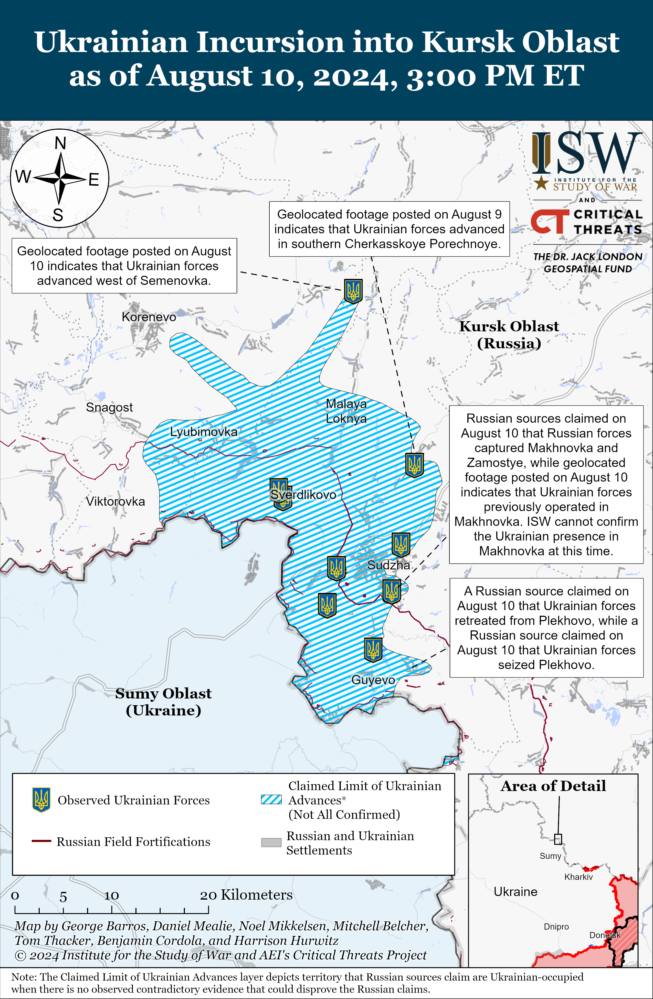
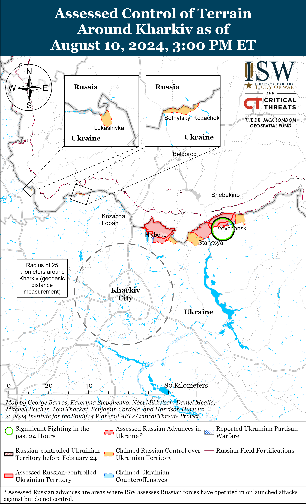
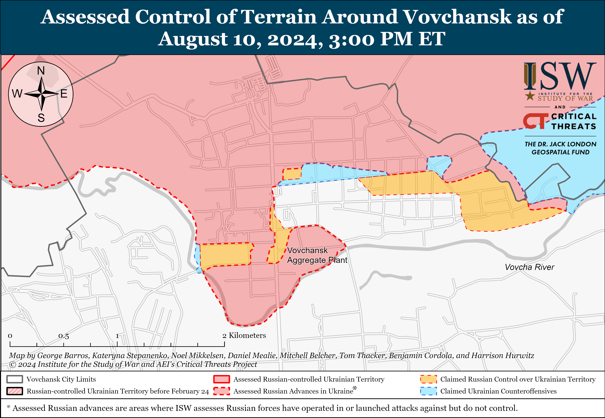
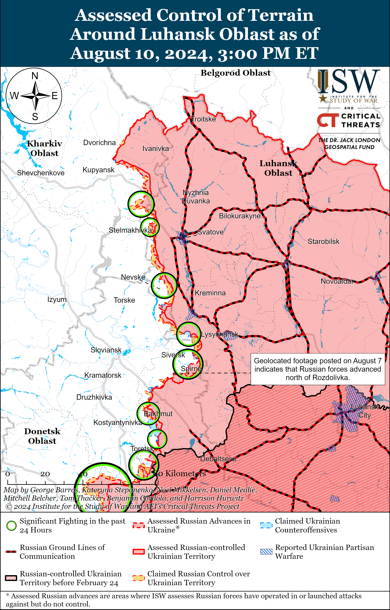
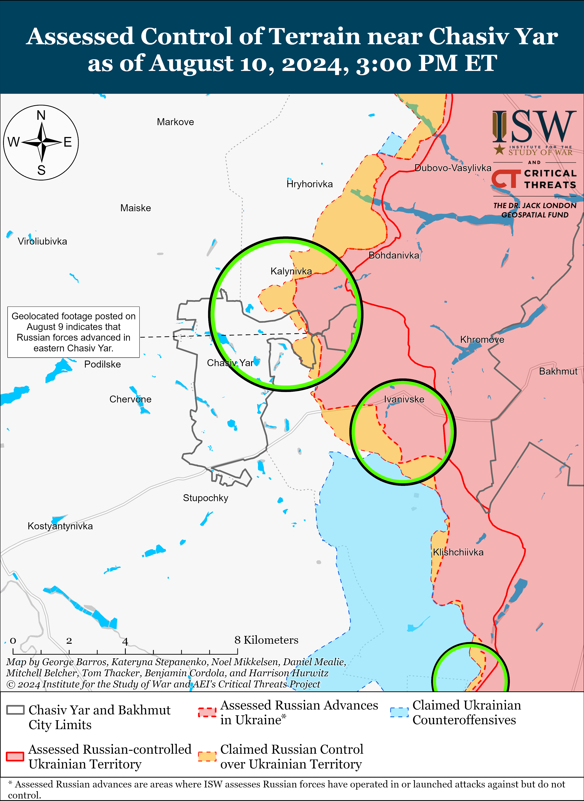
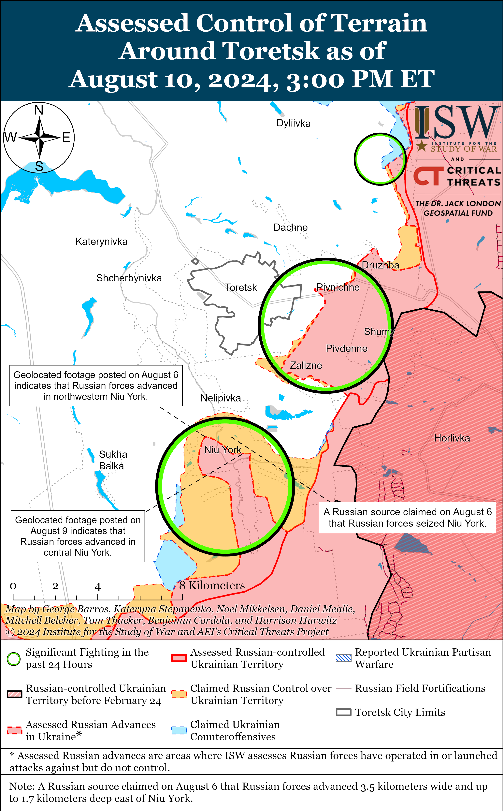
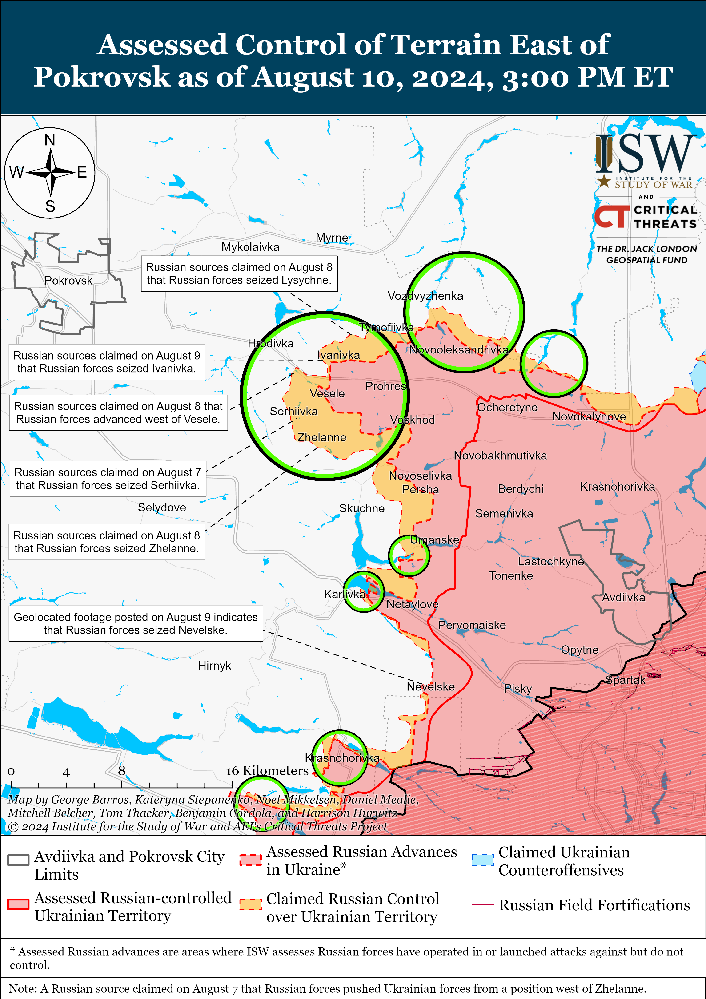
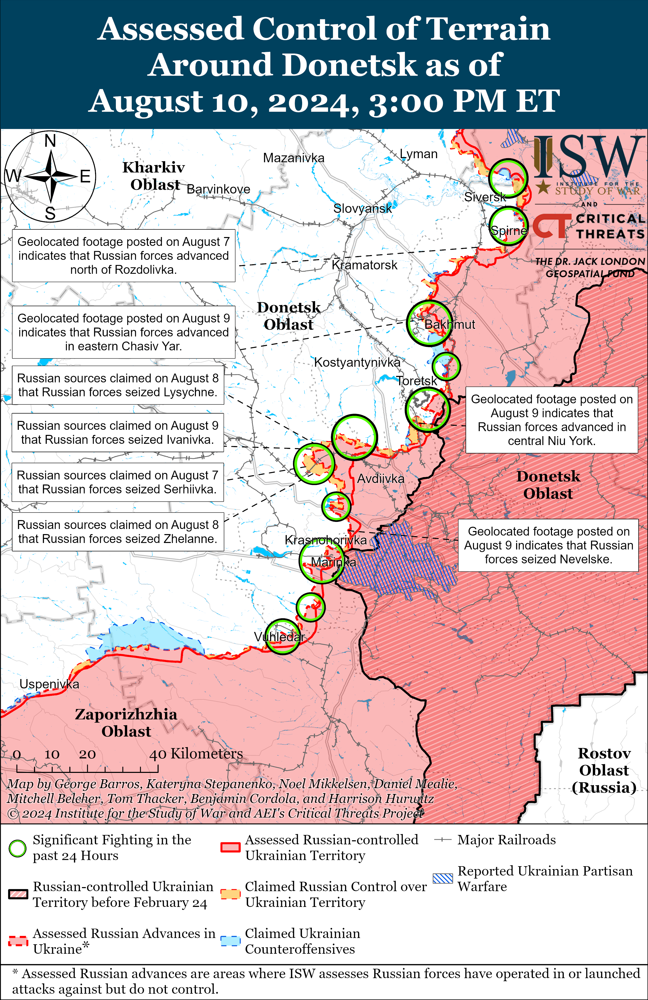
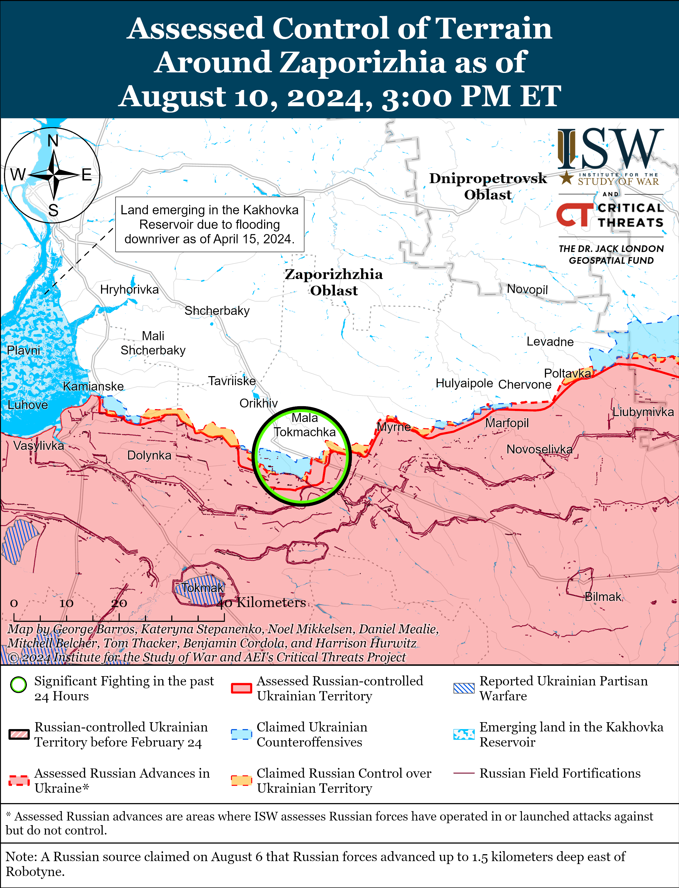
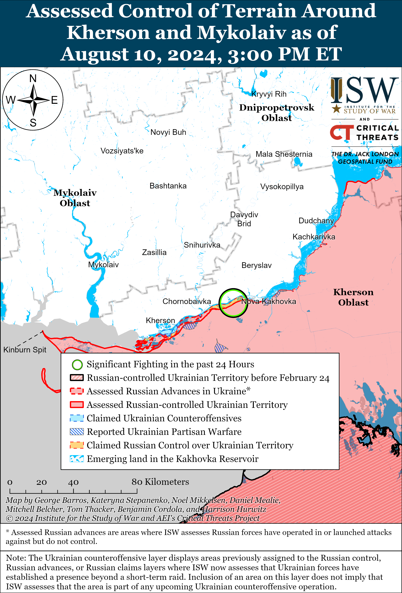

# Russian Offensive Campaign Assessment, August 10, 2024

**Christina Harward, Angelica Evans, Grace Mappes, Kateryna Stepanenko,**

**Davit Gasparyan, and George Barros**

**August 10, 2024, 8:35pm ET**

**Click**[**here**](https://storymaps.arcgis.com/stories/36a7f6a6f5a9448496de641cf64bd375)**to see ISW’s interactive map of the Russian invasion of Ukraine. This map is updated daily alongside the static maps present in this report.**

**Click**[**here**](https://understandingwar.maps.arcgis.com/apps/instant/3dviewer/index.html?appid=1602762dbcde419bb957dea358449580)**to see ISW’s 3D control of terrain topographic map of Ukraine. Use of a computer (not a mobile device) is strongly recommended for using this data-heavy tool.**

**Click**[**here**](https://storymaps.arcgis.com/stories/733fe90805894bfc8562d90b106aa895)**to access ISW’s archive of interactive time-lapse maps of the Russian invasion of Ukraine. These maps complement the static control-of-terrain map that ISW produces daily by showing a dynamic frontline. ISW will update this time-lapse map archive monthly.**

**Note: The data cut-off for this product was 12:30pm ET on August 10. ISW will cover subsequent reports in the August 11 Russian Offensive Campaign Assessment. [NOTE:***Russian sources are currently shifting much of their reporting to cover the Ukrainian incursion into Kursk Oblast and as a result are not providing the same level of detail about the situation along the frontline in Ukraine.***]**

**The Russian National Antiterrorism Committee announced a counterterrorism operation in Belgorod, Bryansk, and Kursk oblasts on August 9 in response to the Ukrainian incursion into Kursk Oblast.**The Federal Security Service (FSB) Head and National Antiterrorism Committee Chairperson Alexander Bortnikov announced counterterrorism operations in Belgorod, Bryansk, and Kursk oblasts in response to “sabotage and reconnaissance units” conducting “terrorist acts” in Russia and “units of the Ukrainian armed forces” conducting a “terrorist attack” in Kursk Oblast.[1] The counterterrorism operation allows Russian authorities to take a number of measures, including suspending or restricting communications services, monitoring telecommunication channels, confiscating vehicles, and entering private property.[2] Russian authorities previously announced a counterterrorism operation in Belgorod Oblast for one day in May 2023 in response to raids by all-Russian pro-Ukrainian elements.[3] The Kremlin notably did not elect to declare a formal state of war against Ukraine or martial law — more serious responses that would marshal greater Russian state resources through wider, and more domestically disruptive, mobilization.

[****](https://understandingwar.org/wp-content/uploads/2025/05/UAF20Kursk20Incursion20August20102C202024.png)

**The Kremlin likely decided to declare a counterterrorism operation — as opposed to a state of war or martial law — to downplay the scale of the Ukrainian incursion into Kursk Oblast and prevent domestic panic or backlash — demonstrating the Kremlin’s reluctance to take more drastic measures to respond to the situation.**Russian opposition outlet *Verstka*reported on August 8 that a source close to the Russian Federation Council’s defense committee stated that the Russian Presidential Administration recommended that Russian deputies and senators not comment on the events in Kursk Oblast “until further notice” or discuss it as briefly as possible and refer only to official statements.[4] Russian milbloggers have been suggesting that the Kremlin formally declare war against Ukraine and criticized the Kremlin for failing to declare martial law instead of the counterterrorism operation.[5] The declaration of martial law notably would have allowed Russian authorities to take more drastic measures, such as prohibiting rallies and demonstrations, enacting curfews, and organizing the production of defense articles for the military.[6] Russian President Vladimir Putin has refrained from officially declaring a state of war, has repeatedly demonstrated his unwillingness to transfer Russian society fully to a war-time footing, and has forgone declaring general mobilization as part of wider efforts to prevent domestic discontent that could threaten the stability of Putin’s regime.[7]

**Putin likely appointed Bortnikov as the head of the counterterrorist operation because Bortnikov had previously proven himself to be an effective manager during crises that threatened Russian domestic stability and the Kremlin regime.** Article 13 of the Russian federal law “On Countering Terrorism” states that “the person who made the decision to conduct a counterterrorism operation…is the head of the counterterrorism operation and bears personal responsibility for its conduct” — indicating that Bortnikov will head the counterterrorism operation.[8] Bortnikov reportedly secured security guarantees for now-deceased Wagner Group financier Yevgeny Prigozhin in negotiations to end Wagner’s June 24, 2023 rebellion, and Putin publicly praised the FSB for guaranteeing Russian security and sovereignty directly following his reelection in March 2024.[9] The declaration of the counterterrorism operation under Bortnikov suggests that Putin was dissatisfied with the Russian military command’s handling or ability to handle the situation in Kursk Oblast. Chief of the General Staff Army General Valery Gerasimov attempted to portray the Northern Grouping of Forces and FSB as effectively controlling the situation and stopping Ukrainian advances in Kursk Oblast during a meeting with Putin on August 7.[10] Putin led a meeting of the permanent members of the Security Council on August 9 that discussed “combatting terrorism” in Russia.[11] The Kremlin stated that Bortnikov gave a report during the meeting, and the Security Council likely discussed the counterterrorism operation in the border area. Gerasimov is notably not a permanent member of the Security Council and was not present at the meeting, but Russian Defense Minister Andrei Belousov is.

**A complicated command and control (C2) arrangement for the FSB-led counterterrorism operation under Bortnikov may degrade the effectiveness of the Russian response to Ukraine’s operation.** Article 9 of the law on counterterrorism operations states that “units and formations of the Russian Armed Forces are involved in the conduct of a counterterrorism operation by decision of the head of the counterterrorism operation.”[12] Rosgvardia stated on August 10 that elements from Rosgvardia, the FSB, and the Ministry of Internal Affairs (MVD) are participating in the counterterrorism operation in Belgorod, Bryansk, and Kursk oblasts.[13] The Belgorod, Bryansk, and Kursk oblasts border areas are within the area of responsibility (AOR) of the Russian Northern Grouping of Forces, and elements under the Russian Ministry of Defense (MoD) are likely the best equipped to push Ukrainian forces back in the area. It is unclear how the FSB and Bortnikov will establish a clear joint C2 organization among these disparate elements, and there will likely be friction and bureaucratic obstacles between the FSB and other structures that will reduce Russian forces’ overall combat effectiveness.

**The Russian MoD appears to be relying on a combination of Russian conscripts already operating in Kursk Oblast, elements of the Northern Grouping of Forces, and elements redeployed from lower-priority frontline areas in Ukraine to defend against the Ukrainian operation in Kursk Oblast, likely exacerbating the disorganization of Russia’s chosen response.**Russian milbloggers claimed on August 9 and 10 that Russian forces began laterally redeploying some units from elsewhere on the frontline and transferring reserves to defend in Kursk Oblast, with one milblogger claiming that Russian forces are redeploying up to nine unspecified brigades to Kursk Oblast.[14] A prominent Ukrainian Telegram channel statedon August 9 that Russian forces redeployed elements of the following units from frontline areas to defend in Kursk Oblast: two airborne (VDV) battalions and elements of the 810th Naval Infantry Brigade (Black Sea Fleet [BSF]) from the Kherson direction; elements of the 38th and 64th motorized rifle brigades (35th Combined Arms Army [CAA], Eastern Military District [EMD]) from the Zaporizhia direction; several unspecified infantry battalions from the Pokrovsk direction in Donetsk Oblast; “bearded” (*borodatie*) fighters from Luhansk Oblast (likely referring to Chechen Akhmat units); elements of the 1009th Motorized Rifle Regiment (6th CAA, Leningrad Military District [LMD]), 79th Motorized Rifle Regiment (18th Motorized Rifle Division, 11th Army Corps [AC], LMD), 272nd Motorized Rifle Regiment (47th Tank Division, 1st Guards Tank Army [GTA], Moscow Military District [MMD]), and 138th Motorized Rifle Brigade (6th CAA, LMD) from northern Kharkiv Oblast; an infantry battalion of the 488th Motorized Rifle Regiment (144th Motorized Rifle Division, 20th CAA, MMD) from the Kupyansk direction; a company of an unspecified motorized rifle brigade operating in Grayvoron Raion, Belgorod Oblast; and a motorized rifle regiment that was operating near Sotnytskyi Kozachok, Kharkiv Oblast.[15] The Russian military command appears to be avoiding redeploying significant elements of combat effective units from the Pokrovsk and Toretsk sectors — Russia‘s assessed priority sectors in eastern Ukraine**.**[16]

The Ukrainian source noted that these redeployments are a combination of frontline units, units with no combat experience, conscripts, and elements of Russia’s operational reserve.[17] ISW is unable to confirm the entirety of the Ukrainian source’s claims of Russian redeployments but has observed some corroborating reporting. Russian sources largely claimed and posted footage of elements of the Russian 810th Naval Infantry Brigade fighting near Sudzha and Martynovka on August 10.[18] Ukrainian forces reportedly took conscripts of the 488th Motorized Rifle Regiment and the 1428th Motorized Rifle Regiment (150th Motorized Rifle Division, 8th CAA, Southern Military District [SMD]) as prisoners of war (POWs) in Kursk Oblast.[19] ISW has also previously observed elements of the Chechen “Aida” detachment redeploying to Kursk Oblast and elements of the “Pyatnashka” volunteer brigade redeploying from Donetsk Oblast to Kursk Oblast.[20] A Ukrainian military expert assessed that elements of the Russian 155th Naval Infantry Brigade (BSF) may also be fighting in Kursk Oblast following recent reporting that the 155th Brigade was operating in northern Kharkiv Oblast.[21]

**Russian forces’ usage of conscripts and forces already in Kursk Oblast, nearby forces fighting in northern Kharkiv Oblast, and lateral redeployments across the theater to defend against the Ukrainian incursion is consistent with a number of likely Russian courses of action (COAs) that ISW forecasted**.[22] ISW forecasted four likely COAs involving the forces the Russian command could choose to defend against the Ukrainian incursion, including: COA 1, forecasting that the Russians could decide to use existing forces and conscripts already defending in the international border area; COA 2, forecasting that the Russian command could pull from the Northern Grouping of Forces within and nearby Kursk Oblast; and COA 3, forecasting that Russia could redeploy operational reserves or frontline units from elsewhere in the theater.[23] Redeployments of conscripts, elements of the Northern Grouping of Forces, and select units from frontline areas in Ukraine suggest that the Russian military command has determined that possible disruptions to the offensive operations in northern Kharkiv Oblast and other less-critical frontline areas are an acceptable risk to adequately respond to the Ukrainian incursion. The Kremlin has seemingly chosen to avoid redeployments from higher priority sectors on the frontline in Donetsk Oblast. A prominent Russian milblogger and former Storm-Z instructor assessed that these redeployments are weakening frontline units in other operational directions and demonstrate that Russia largely lacks operational reserves.[24] Should the Russian command choose to keep these redeployed reserves and frontline units in Kursk Oblast in the near- to medium-term, it will likely further exacerbate the C2 struggles in Kursk Oblast that will likely emerge from treating the Russian defense against Ukraine’s conventional military operation as a “counterterrorism operation” that is subordinated to the FSB and Bortnikov. These decisions can present vulnerabilities and opportunities that Ukrainian forces can exploit.

**The Russian MoD appears to be relying on select, battle-hardened units to conduct offensive and defensive operations in its most critical sectors of the front.**The Russian command has previously laterally redeployed elements of the 155th Naval Infantry Brigade, 810th Naval Infantry Brigade, the “Pyatnashka” volunteer brigade, and VDV units across multiple sectors of eastern and southern Ukraine to conduct offensive operations during intense Russian offensive efforts. The Russian 155th Naval Infantry Brigade most notably participated in the failed Russian push for Vuhledar in late 2022 to early 2023, then fought southwest of Donetsk City near Marinka, and deployed to participate in the Russian offensive north of Kharkiv City in May 2024 – largely without significant rest and reconstitution.[25] The Pyatnashka Brigade defended against the Ukrainian 2023 counteroffensive in southern Ukraine and fought for Avdiivka in the Spring of 2024.[26] The 810th Naval Infantry Brigade fought for Volnovakha and Mariupol, Donetsk Oblast, and defended against the Ukrainian effort in east (left) bank Kherson Oblast near Krynky.[27] Many of these units reportedly have been completely destroyed and reconstituted multiple times due to the Russian command’s reliance on them on the battlefield, and their redeployment to Kursk Oblast from elsewhere on the frontline could degrade Russian forces’ capabilities within Ukraine.

**Russian forces appear to be more adequately defending against Ukrainian assaults following the arrival of additional conscripts and more combat effective personnel from frontline areas in Ukraine.**Ukrainian forces’ rate of confirmed advances in Kursk Oblast has slowed following the reported introduction of various Russian military units in Kursk Oblast. Russian milbloggers claimed on August 10 that Russian forces, including elements of the Russian 810th Naval Infantry Brigade (Black Sea Fleet), repelled company-sized Ukrainian mechanized assaults in the directions of Korenevo (north of Sumy City and roughly 23 kilometers north of the international border), Snagost (south of Korenevo), Lgov, and Martynovka (northeast of Suzhda) on the night of August 9 and 10.[28] Elements of the 810th Naval Infantry Brigade were previously reported in both the Kharkiv and Kherson directions as of June 2024.[29] A Russian milblogger claimed that an unspecified “newly formed and untested” Russian unit repelled a Ukrainian armored assault near Korenevo on August 9.[30] Russian milbloggers claimed that Russian forces, particularly elements of the 810th Naval Infantry Brigade and the Chechen Akhmat Spetsnaz “Aida” Detachment, seized Martynovka and Zamostye (just south of Sudzha).[31] The “Aida” Detachment was reportedly operating in the vicinity of Vovchansk, Kharkiv Oblast as of mid-June 2024.[32] Russian milbloggers also claimed that Russian forces re-took Makhnovka (south of Sudzha), although geolocated footage published on August 10 indicates that Ukrainian forces maintain positions in the settlement, assuming the footage is recent.[33]

**Geolocated footage and Russian reporting from August 10 indicate that Ukrainian forces largely maintain previously reported positions in Kursk Oblast and have advanced slightly further than their previously confirmed positions.**A Kremlin-affiliated Russian milblogger claimed that Ukrainian forces are operating in a forest area north of Lyubimovka (south of Korenevo).[34] Russian milbloggers claimed that Ukrainian forces are also maintaining positions northwest of Sudzha near Kazachya Loknya and Yuzhny and west of Sudzha near Zaoleshenka and Goncharovka.[35] Additional geolocated footage published on August 10 indicates that Ukrainian forces previously held positions north of Sudzha near Cherkasskoye Porechnoye, though this footage is likely not from the past 24 hours.[36] Geolocated footage published on August 9 indicates that Ukrainian forces maintain positions north of Sverdilkovo (northwest of Sudzha) and within Rubanshchina (just west of Sudzha).[37] Additional geolocated footage published on August 10 indicates that Ukrainian forces maintain positions within northern Sudzha, and most Russian milbloggers claimed that Ukrainian forces are operating on the western outskirts of Sudzha.[38] Geolocated footage published on August 10 indicates that Ukrainian forces maintain positions south of Sudzha near Melovoi and Guyevo.[39] Russian milbloggers claimed that Ukrainian forces are continuing operations south of Sudzha along the Gornal-Guyevo-Plekhovo line, and one Russian milblogger claimed that Ukrainian forces seized Plekhovo.[40] Russian milbloggers claimed that Ukrainian forces also conducted isolated raids into Poroz and Mokraya Orlovka (west of Belgorod City and along the international border), Belgorod Oblast on August 10, but that Ukrainian forces do not maintain positions in these settlements.[41]

Russian sources claimed that they conducted a successful Iskander-M ballistic missile strike against Ukrainian forces in Kursk Oblast. The Russian MoD claimed on August 10 that Russian forces struck a command post of the Ukrainian forces near the Kursk Oblast border area.[42] Geolocated footage published on August 10 purportedly shows that Russian forces struck a position of the Ukrainian forces east of Sheptukhovka, Kursk Oblast.[43] An OSINT analyst on X reported on August 10 that the footage published by the Russian MoD indicates that the Russian forces missed nearby vehicles of the Ukrainian forces that they were aiming at.[44] Russian milbloggers claimed that Russian forces repelled a Ukrainian attack just north of Sheptukhovka near Kauchuk on the night of August 9 to 10.[45]

**Ukraine’s cross-border operation into Kursk Oblast threatens the Kremlin with a potential political crisis regarding causalities among Russian conscripts, whom the Kremlin has increasingly relied upon to defend the Russian state border with Ukraine.**Russian opposition and social media outlets began disseminating initial complaints from the family members of Russian conscripts on August 10 about the involvement of Russian conscripts in the Russian border defense operations.[46] Although these complaints are limited in number and have not resulted in a unified movement, the Kremlin has previously expressed grave concern over public responses to its illegal use of conscripts in combat operations. The Kremlin previously faced notable societal backlash in the spring of 2022 for illegally committing Russian conscripts to the frontlines in Ukraine and faced criticism for relying on conscripts to repel previous pro-Ukrainian border raids and respond to the Wagner Group mutiny in the summer of 2023.[47] Russian President Vladimir Putin notably attempted to appease Russian conscripts’ mothers by emphasizing on March 8, 2022, that Russia would not use conscripts in combat operations.[48] Putin, however, continued to institute contradictory policies that further involved conscripts in the defense of the Russian-Ukrainian international border, likely in an effort to shuffle conventional combat forces previously on border guard duty so they could be deployed for operations in Ukraine. Putin notably signed a bill in December 2023 allowing conscripts to serve in the Russian Federal Security Service (FSB) — the primary Russian service responsible for border security.[49] The Kremlin may need to justify its controversial reliance on conscripts in border security operations to appease Russian society, as Putin had done so following controversies in 2022 and 2023. Russian State Duma Deputy and former Deputy Commander of the Southern Military District (SMD) Lieutenant General Andrei Gurulev recently stated on Russian state television that conscripts’ participation in combat operations is normal given that Russia had previously used conscripts in theSoviet Union’s Afghan and Russia’s Chechen wars.[50] Several Russian conscripts are confirmed to have been taken prisoner in Kursk Oblast since August 6.[51]

**Ukrainian forces recently struck a Russian ship and a gas platform in the western Black Sea.** Ukraine’s Main Military Intelligence Directorate (GUR) reported on August 10 that the GUR’s “Group 13” unit struck a Russian “Tunets” KS-701 project high-speed patrol boat near occupied Chornomorske, Crimea on the night of August 8 to 9.[52] Geolocated footage published on August 10 shows a Ukrainian naval drone approaching the boat in Vuzka Bay, and the GUR reported that Ukrainian naval drones also damaged three other Russian watercraft, which the GUR is working to identify.[53] Geolocated footage published on August 10 indicates that Ukrainian forces conducted a strike on a Russian gas platform in the Black Sea.[54] Ukrainian Navy Spokesperson Captain Third Rank Dmytro Pletenchuk stated on August 10 that Russian forces stationed military personnel and equipment on the platform less than a day before the strike and were using the gas platform for GPS spoofing to endanger civilian shipping in the Black Sea, particularly to disrupt the Ukraine grain corridor.[55]

**Iran will reportedly deliver “hundreds” of ballistic missiles to Russia in the near future.** *Reuters,*citing multiple intelligence sources including two European intelligence sources,reported on August 9 that Russian MoD representatives signed a contract with Iran on December 13, 2023, for the delivery of Fath-360 close range ballistic missiles and that Iran will deliver these missiles at an unspecified “soon” time.[56] The Fath-360 missiles have a maximum range of 120 kilometers and a warhead weighing 150 kilograms. Multiple intelligence sources also told *Reuters*that dozens of Russian military personnel are currently training in Iran to operate Fath-360 missile systems. Western and Ukrainian sources have previously warned that Iran may be preparing to provide Russia with short range ballistic systems, including multiple systems with maximum ranges and payloads significantly greater than the limits imposed upon Russia under its Missile Technology Control Regime (MTCR) obligations.[57] These short-range ballistic missiles will likely allow Russian forces to strike Ukrainian near-rear targets while reserving its own missile stockpiles (such as Iskander missiles) for deep-rear Ukrainian targets.

**Key Takeaways:**

- **The Russian National Antiterrorism Committee announced a counterterrorism operation in Belgorod, Bryansk, and Kursk oblasts on August 9 in response to the Ukrainian incursion into Kursk Oblast.**
- **The Kremlin likely decided to declare a counterterrorism operation – as opposed to a state of war or martial law – to downplay the scale of the Ukrainian incursion into Kursk Oblast and prevent domestic panic or backlash – demonstrating the Kremlin’s reluctance to take more drastic measures to respond to the situation.**
- **Putin likely appointed Bortnikov as the head of the counterterrorist operation because Bortnikov has previously proven himself to be an effective manager during crises that threatened Russian domestic stability and the Kremlin regime.**
- **A complicated command and control (C2) arrangement for the FSB-led counterterrorism operation under Bortnikov may degrade the effectiveness of the Russian response to Ukraine’s operation.**
- **The Russian Ministry of Defense (MoD) appears to be relying on a combination of Russian conscripts already operating in Kursk Oblast, elements of the Northern Grouping of Forces, and elements redeployed from lower-priority frontline areas in Ukraine to defend against the Ukrainian operation in Kursk Oblast, likely exacerbating the disorganization of Russia’s chosen response.**
- **Russian forces’ usage of conscripts and forces already in Kursk Oblast, nearby forces fighting in northern Kharkiv Oblast, and lateral redeployments across the theater to defend against the Ukrainian incursion is consistent with a number of likely Russian courses of action (COAs) that ISW forecasted.**
- **The Russian MoD appears to be relying on select, battle-hardened units to conduct offensive and defensive operations in its most critical sectors of the front.**
- **Russian forces appear to be more adequately defending against Ukrainian assaults following the arrival of additional conscripts and more combat effective personnel from frontline areas in Ukraine.**
- **Geolocated footage and Russian reporting from August 10 indicates that Ukrainian forces largely maintain previously reported positions in Kursk Oblast and have advanced slightly further than their previously confirmed positions.**
- **Ukraine’s cross-border operation into Kursk Oblast threatens the Kremlin with a potential political crisis regarding causalities among Russian conscripts, whom the Kremlin has increasingly relied upon to defend the Russian state border with Ukraine.**
- **Ukrainian forces recently struck a Russian ship and a gas platform in the western Black Sea.**
- **Iran will reportedly deliver “hundreds” of ballistic missiles to Russia in the near future.**
- **Russian forces recently advanced near Kreminna, Toretsk, Pokrovsk, and Donetsk City.**
- **A Russian milblogger claimed that the Russian Ministry of Defense (MoD) has begun to form the “Black Raven” strike drone volunteer unit and asked readers to donate to the 16-million-ruble (about $184,324) goal to supply the unit with drones and equipment.**

[****](https://understandingwar.org/wp-content/uploads/2025/05/DraftUkraineCoT20August20102C202024.png)

***We do not report in detail on Russian war crimes because these activities are well-covered in Western media and do not directly affect the military operations we are assessing and forecasting. We will continue to evaluate and report on the effects of these criminal activities on the Ukrainian military and the Ukrainian population and specifically on combat in Ukrainian urban areas. We utterly condemn Russian violations of the laws of armed conflict and the Geneva Conventions and crimes against humanity even though we do not describe them in these reports.***

- Russian Main Effort – Eastern Ukraine (comprised of three subordinate main efforts)
- Russian Subordinate Main Effort #1 – Push Ukrainian forces back from the international border with Belgorod Oblast and approach to within tube artillery range of Kharkiv City
- Russian Subordinate Main Effort #2 – Capture the remainder of Luhansk Oblast and push westward into eastern Kharkiv Oblast and encircle northern Donetsk Oblast
- Russian Subordinate Main Effort #3 – Capture the entirety of Donetsk Oblast
- Russian Supporting Effort – Southern Axis
- Russian Air, Missile, and Drone Campaign
- Russian Mobilization and Force Generation Efforts
- Russian Technological Adaptations
- Activities in Russian-occupied areas
- Ukrainian Defense Industrial Base Efforts
- Russian Information Operations and Narratives
- Significant Activity in Belarus

**Russian Main Effort – Eastern Ukraine**

**Russian Subordinate Main Effort #1 – Kharkiv Oblast (Russian objective: Push Ukrainian forces back from the international border with Belgorod Oblast and approach to within tube artillery range of Kharkiv City)**

A prominent Russian milblogger denied on August 10 recent claims that Russian forces seized Lukashivka, Sumy Oblast, and Sotnytskyi Kozachok, Kharkiv Oblast, and claimed that these settlements have changed hands several times throughout the war as there are not adequate defensive positions in which either Russian or Ukrainian forces can establish enduring positions.[58]

Russian forces continued offensive operations in northern Kharkiv Oblast, but there were no confirmed changes to the frontline. Fighting continued north of Kharkiv City near Hlyboke and northeast of Kharkiv City near Vovchansk and Starytsya on August 9 and 10.[59] Ukraine’s Kharkiv Group of Forces stated on August 10 that Russian forces regrouped assault groups of the 153rd Tank Regiment (47th Tank Division, 1st Guards Tank Army [GTA], Moscow Military District [MMD]) in preparation for future assaults and rotated elements of the 138th Motorized Rifle Brigade (6th Combined Arms Army [CAA], Leningrad Military District [LMD]) within Vovchansk.[60]

**Russian Subordinate Main Effort #2 – Luhansk Oblast (Russian objective: Capture the remainder of Luhansk Oblast and push westward into eastern Kharkiv Oblast and northern Donetsk Oblast)**

Russian forces advanced near Kreminna on an unspecified date and continued offensive operations along the Kupyansk-Svatove-Kreminna line on August 10. Geolocated footage published on August 7 indicates that Russian forces advanced northwest of Zolotarivka (south of Kreminna), but this Russian advance likely did not occur recently.[61] A Russian milblogger claimed that Russian forces advanced west of Novoselivske (southeast of Kupyansk), but ISW has not observed confirmation of this claim. The Ukrainian General Staff reported that Russian forces conducted offensive operations southeast of Kupyansk near Stelmakhivka, Berestove, Kolisnykivka, and Tabaivka; northwest of Kreminna near Nevske and Makiivka; and southwest of Kreminna in the Serebryanske forest area on August 9 and 10.[62]

**Russian Subordinate Main Effort #3 – Donetsk Oblast (Russian objective: Capture the entirety of Donetsk Oblast, the claimed territory of Russia’s proxies in Donbas)**

Russian forces continued offensive operations around Siversk on August 9 and 10 but did not advance. The Ukrainian General Staff reported on August 9 and 10 that Russian forces attacked northeast of Siversk near Bilohorivka; east of Siversk near Verkhnokamyanske; and southeast of Siversk near Spirne, Ivano-Darivka, and Vyimka.[63]

Russian forces did not make confirmed advances in the Chasiv Yar direction on August 9 and 10. Russian forces continued offensive operations near Chasiv Yar; east of Chasiv Yar near Ivanivske; and south of Chasiv Yar near Stupochky and Bila Hora.[64] A Kremlin-affiliated milblogger claimed that Russian forces advanced in the Zhovtnevyi Microraion in Chasiv Yar, but ISW did not observe visual evidence confirming this claim.[65] Elements of the Russian 1194th Motorized Rifle Regiment (6th Motorized Rifle Division, 3rd Army Corps [AC]) are reportedly operating in the Oleksandro-Shultyne (southwest of Chasiv Yar) direction.[66]

Russian forces recently marginally advanced in the Toretsk direction and continued offensive operations in the area on August 9 and 10. Geolocated footage published on August 9 indicates that Russian forces advanced in northern Druzhba (east of Toretsk), and a Kremlin-affiliated milblogger claimed that Russian forces advanced in Druzhba and expanded their control area by 400 meters in Niu York (south of Toretsk).[67] Russian milbloggers also claimed that Russian forces advanced in the fields west of Ozaryanivka (northeast of Toretsk) and in the fields southwest of Yurivka (south of Toretsk), but ISW has not observed confirmation of these claims.[68] Russian forces continued offensive operations near Toretsk, Niu York, and Dyliivka (north of Toretsk).[69] A Russian milblogger claimed that the Russian Center Grouping of Forces (GoF) is fighting in the Toretsk direction and specified that elements of the newly reestablished 51st Army are operating in the Niu York area.[70] The milblogger noted that the 132nd Motorized Rifle Brigade, ”Sparta” Reconnaissance Battalion, and ”Somalia” Battalion (all part of the 1st Donetsk People’s Republic [DNR] AC) are now part of the 51st Army. Ukrainian officials previously reported that elements of the Russian 9th Motorized Rifle Brigade (1st DNR AC) were also operating as part of the 51st Army, which suggests that the Russian military likely reformed the Second World War-era 51st Army and formed it from DNR military units.[71] A Kremlin-affiliated milblogger specified that engineers of the ”Lavina” Battalion of the 132nd Motorized Rifle Brigade are operating in the Horlivka direction.[72]

Russian forces likely recently seized Nevelske (southeast of Pokrovsk). Geolocated footage published on August 9 shows Russian forces raising a Russian flag in northwestern Nevelske on the settlement’s westernmost administrative border, and Russian sources credited elements of the Russian 110th Motorized Rifle Brigade (1st DNR AC) with the seizure of the settlement.[73] Russian sources also claimed that Russian forces advanced northwest of Serhiivka (southeast of Pokrovsk) and in the field north of Lozuvatske (east of Pokrovsk), and seized Ivanivka (east of Pokrovsk).[74] ISW had not observed visual confirmation of these claims, however. Russian forces continued offensive operations east of Pokrovsk near Vozdvyzhenka, Novooleksandrivka, Zelene Pole, Hrodivka, Kalynove; and southeast of Pokrovsk near Zhelanne, Yasnobrodivka, and Karlivka on August 9 and 10.[75] The Ukrainian General Staff specified that Russian forces launched the most attacks against the Hrodivka and Zhelanne areas.[76] Elements of the Russian “Volga” Brigade are reportedly operating in Vesele (southeast of Pokrovsk).[77]

Russian forces recently advanced southwest of Donetsk City near Kostyantynivka. Geolocated footage published on August 10 shows that Russian forces advanced in southeastern and northeastern Kostyantynivka, and advanced in the fields southeast of Vodyane.[78] Russian forces continued attacks west of Donetsk City near Krasnohorivka and Heorhiivka; and southwest of Donetsk City near Paraskoviivka, Kostyantynivka, Vodyane, and Oleksandrivka.[79] Drone operators of the Russian “Kayra” detachment are reportedly operating in the Kostyantynivka area.[80]

Elements of the Russian 11th Air Force and Air Defense Army (Eastern Military District [EMD], and Russian Aerospace Forces [VKS]) continue to operate near Blahodatne (south of Velyka Novosilka).[81]

**Russian Supporting Effort – Southern Axis (Russian objective: Maintain frontline positions and secure rear areas against Ukrainian strikes)**

Positional fighting continued in western Zaporizhia Oblast near Mala Tokmachka (northeast of Robotyne) on August 9 and 10.[82] Elements of the Russian 429th Motorized Rifle Regiment (19th Motorized Rifle Division, 58th Combined Army Corps [CAA], Southern Military District [SMD]) are reportedly operating in the western Zaporizhia direction.[83]

The Ukrainian General Staff reported that Russian forces conducted attacks in the Dnipro direction (Kherson Oblast) on August 10.[84] Elements of the Russian 104th Guards Air Assault Regiment (76th Guards Air Assault Division, Russian Airborne Forces [VDV]) are reportedly operating in the Kherson direction.[85] Snipers of the Russian 80th Separate Arctic Motorized Rifle Brigade (14th Army Corps [AC], Leningrad Military District [LMD]) operating in the Kakhovka direction (in the east [left] bank Kherson Oblast).[86]

**Russian Air, Missile, and Drone Campaign (Russian Objective: Target Ukrainian military and civilian infrastructure in the rear and on the frontline)**

Donetsk Oblast Head Vadym Filashkin stated on August 10 that Russian forces struck critical infrastructure in Kramatorsk, Donetsk Oblast with an unspecified missile.[87]

**Russian Mobilization and Force Generation Efforts (Russian objective: Expand combat power without conducting general mobilization)**

A Russian milblogger claimed that the Russian MoD has begun to form the “Black Raven” strike drone volunteer unit and asked readers to donate to the 16-million-ruble (about $184,324) goal to supply the unit with drones and equipment.[88]

**Russian Technological Adaptations (Russian objective: Introduce technological innovations to optimize systems for use in Ukraine)**

The Kremlin continues various measures to bypass Western sanctions and mitigate their impacts on the Russian defense industrial base (DIB). The Russian United Aircraft Corporation stated on August 10 that it manufactured a new batch of Su-30SM2 fighter jets for the Russian MoD, and that the Su-30SM2 fighters contain Russian-produced components to replace foreign components in its predecessor, the Su-30SM.[89] A Russian milblogger claimed that Russian forces are using Iranian-produced 130mm OF-482M artillery shells on an unspecified area of the front line.[90]

**Ukrainian Defense Industrial Efforts (Ukrainian objective: Develop its defense industrial base to become more self-sufficient in cooperation with US, European, and international partners)**

*ISW is not publishing coverage of Ukrainian defense industrial efforts today.*

**Activities in Russian-occupied areas (Russian objective: Consolidate administrative control of annexed areas; forcibly integrate Ukrainian citizens into Russian sociocultural, economic, military, and governance systems)**

*ISW is not publishing coverage of activities in Russian-occupied areas today.*

**Russian Information Operations and Narratives**

Russian sources once again insinuated that Ukrainian forces are violating the Chemical Weapons Convention (CWC) by using grenades and ammunition equipped with hexachloroethane in Kursk Oblast, including near Sudzha.[91] Hexacholoethane is widely used in smoke-producing devices and is not banned by the CWC.[92] The Ukrainian Support Forces Command reported on August 9 that Russian forces in Ukraine are increasing their use of chemical attacks and are largely using K-51 and RG-VO hand gas grenades with riot control agents (RCAS) that are prohibited by the CWC.[93]

The Kremlin continues efforts to destabilize NATO-brokered peace efforts in the Balkans. Serbian President Alexander Vucic claimed on August 10 that Russian intelligence warned him that unspecified actors are preparing to conduct a group in Serbia with support from unspecified “Western powers.”[94]

The Kremlin continues efforts to cement its control over the Russian information space. Sources close to Kremlin-affiliated Vkontakte (VK) social media platform told Russian opposition outlet *Verstka*that VK plans to create a new “national messenger” in Russia to replace WhatsApp.[95] Russian officials previously announced that Russian federal censor Roskomnadzor will crack down against users registering for anonymous social media accounts by forcing applications, including Telegram and WhatsApp, to require phone numbers to register for an account and to establish communications with telecommunications companies to prevent Russians from registering accounts using gray market SIM cards.[96]

**Significant activity in Belarus (Russian efforts to increase its military presence in Belarus and further integrate Belarus into Russian-favorable frameworks and Wagner Group activity in Belarus)**

Belarusian officials announced on August 10 that Belarus will strengthen its force concentrations along the border with Ukraine in response to claims that Ukraine violated Belarusian airspace and the ongoing Ukrainian incursion into Kursk Oblast. Belarusian President Alexander Lukashenko announced that Belarus destroyed roughly a dozen Ukrainian drones over Belarus on the evening on August 9 and claimed that Ukraine’s supposed “provocations” will not go unanswered.[97] Belarusian Defense Minister Viktor Khrenin announced on August 10 that Belarus considers the violation of its airspace as a “provocation” and that Lukashenko ordered the Belarusian military to strengthen the groupings in the Gomel and Mozyr tactical directions.[98] A Kremlin-affiliated Russian milblogger called on the Belarusian government to act within the Union State framework and increase its support for Russia’s invasion of Ukraine.[99]

**Note: ISW does not receive any classified material from any source, uses only publicly available information, and draws extensively on Russian, Ukrainian, and Western reporting and social media as well as commercially available satellite imagery and other geospatial data as the basis for these reports. References to all sources used are provided in the endnotes of each update.**

---

[1] http://nac.gov dot ru/kontrterroristicheskie-operacii/na-territoriyah-belgorodskoy-bryanskoy-i-kurskoy.html

[2] https://www.rbc dot ru/politics/10/08/2024/66b695149a7947393ae67448

[3] https://isw.pub/UkrWar052223 ; https://isw.pub/UkrWar052323

[4] https://t.me/svobodnieslova/5422

[5] https://t.me/voenkorKotenok/58022 ; https://t.me/voenkorKotenok/58024; https://t.me/Alekhin\_Telega/11184

[6] http://www.kremlin dot ru/acts/bank/17804

[7] https://isw.pub/UkrWar072424 ; https://understandingwar.org/backgrounder/russian-offensive-campaign-assessment-may-15-2024 ; https://isw.pub/UkrWar040324 ; https://isw.pub/UkrWar040424https://isw.pub/UkrWar021424 ; https://isw.pub/UkrWar072424

[8] http://www.kremlin dot ru/acts/bank/23522/page/2

[9] https://understandingwar.org/backgrounder/russian-offensive-campaign-assessment-july-10-2023; https://isw.pub/UkrWar062723 ; https://understandingwar.org/backgrounder/russian-offensive-campaign-assessment-march-19-2024

[10] https://isw.pub/UkrWar08072024

[11] http://kremlin dot ru/events/president/news/74809

[12] http://www.kremlin dot ru/acts/bank/23522/page/2

[13] https://t.me/RosgvardOfficial/6734

[14] https://t.me/NgP\_raZVedka/18601; https://t.me/motopatriot/25990

[15] https://t.me/vanek\_nikolaev/25705; https://t.me/vanek\_nikolaev/25703

[16] https://isw.pub/UkrWar080824 ; https://isw.pub/IranUpdate080122

[17] https://t.me/vanek\_nikolaev/25705

[18] https://t.me/dva\_majors/49280 ; https://t.me/motopatriot/25982; https://t.me/voenkorKotenok/58107; https://t.me/warhistoryalconafter/178506 ; https://t.me/dva\_majors/49343 ; https://t.me/milinfolive/128032; https://t.me/NgP\_raZVedka/18596 ; https://t.me/notes\_veterans/18696; https://x.com/moklasen/status/1822208820728222040; https://t.me/voenacher/69936; https://t.me/romanov\_92/45011;

[19] https://x.com/Danspiun/status/1822317125114970377; https://t.me/poisk\_in\_ua/70626; https://t.me/poisk\_in\_ua/70625; https://x.com/Danspiun/status/1822320550858899887; https://x.com/Danspiun/status/1822311993660838238;

[20] https://euromaidanpress.com/2024/08/09/ukraines-surprise-kursk-incursion-lifting-spirits-or-stretching-resources/ ; https://x.com/Tatarigami\_UA/status/1821682251480072381; https://t.me/dva\_majors/49169; https://t.me/iamsniper/6201; https://t.me/dva\_majors/49177; https://t.me/astrapress/61557; https://x.com/666\_mancer/status/1821882973689377092; https://t.me/istories\_media/7173 ; https://t.me/dva\_majors/49098; https://understandingwar.org/backgrounder/russian-offensive-campaign-assessment-august-8-2024

[21] https://armyinform dot com.ua/2024/08/10/u-kursku-oblast-rosiyany-perekynuly-morski-motolygy-do-chogo-tut-harkiv/;

[22] https://understandingwar.org/backgrounder/russian-offensive-campaign-assessment-august-8-2024

[23] https://understandingwar.org/backgrounder/russian-offensive-campaign-assessment-august-8-2024

[24] https://t.me/philologist\_zov/1198

[25] https://nv dot ua/ukr/ukraine/events/viyna-v-ukrajini-10-naybilshih-peremog-ukrajini-za-rik-shcho-minuv-z-24-lyutogo-2022-50306472.html; https://www.bbc.co.uk/mediacentre/2023/bbc-eye-russian-marines-ukraine/; https://www.forbes.com/sites/davidaxe/2024/02/12/defeated-several-times-the-russian-155th-brigade-finally-captured-a-few-village-blocks-but-only-because-russian-snipers-forced-it-forward/?sh=3d30319b2187; https://www.forbes.com/sites/davidaxe/2023/02/08/smashed-by-ukrainian-mines-and-artillery-russias-winter-offensive-just-ground-to-a-halt-outside-vuhledar/; https://www.businessinsider.com/same-russian-brigade-destroyed-and-reformed-8-times-report-2023-3; https://understandingwar.org/backgrounder/russian-offensive-campaign-assessment-march-24-2023

[26] https://www.rferl.org/a/inside-avdiyivka-russia-occupation/32832165.html; https://www.rferl.org/a/ukraine-invasion-russia-soviet-symbols/32667534.html; https://understandingwar.org/backgrounder/russian-offensive-campaign-assessment-may-4-2024; https://www.newsweek.com/russia-black-sea-chemical-weapons-kherson-dnieper-river-ukraine-1855249

[27] https://warheroes dot ru/hero/hero.asp?Hero\_id=32111; https://web.archive.org/web/20220323105959/https://sevastopol.su/news/v-boyah-pod-mariupolem-pogib-komandir-810-y-brigady-chf-polkovnik-aleksey-sharov; https://www.forbes.com/sites/davidaxe/2024/01/31/the-ukrainian-marines-hit-the-russian-marines-so-hard-they-blew-the-russians-back-to-1980/

[28] https://t.me/warhistoryalconafter/178506 ; https://t.me/dva\_majors/49343 ; https://t.me/milinfolive/128032 ; https://t.me/vysokygovorit/16856 ; https://t.me/rybar/62638 ; https://t.me/wargonzo/21490 ; https://t.me/dva\_majors/49344

[29] https://understandingwar.org/backgrounder/russian-offensive-campaign-assessment-may-4-2024 ; https://understandingwar.org/backgrounder/russian-offensive-campaign-assessment-june-22-2024 ; https://x.com/OSINTua/status/1803094339687514293

[30] https://t.me/rybar/62633; https://t.me/bayraktar1070/2553

[31] https://t.me/rybar/62638 ; https://t.me/motopatriot/25982; https://t.me/voenkorKotenok/58107 ; https://t.me/warhistoryalconafter/178506 ; https://t.me/dva\_majors/49343 ; https://t.me/milinfolive/128032 ; https://t.me/NgP\_raZVedka/18596 ; https://t.me/notes\_veterans/18696 ; https://t.me/iamsniper/6218 ; https://t.me/dva\_majors/49356 ; https://t.me/dva\_majors/49333 ; https://t.me/dva\_majors/49334

[32] https://understandingwar.org/wp-content/uploads/2024/08/June20162C2020242C20Russian20Offensive20Campaign20Assessment20PDF.pdf

[33] https://t.me/DnevnikDesantnika/13689 ; https://t.me/mysiagin/30113; https://x.com/moklasen/status/1822309661996978361;

[34] https://t.me/rybar/62650

[35] https://t.me/RVvoenkor/74394 ; https://t.me/DnevnikDesantnika/13670 ; https://t.me/RVvoenkor/74380 ; https://t.me/DnevnikDesantnika/13689 ; https://t.me/DnevnikDesantnika/13666 ; https://t.me/dva\_majors/49328 ; https://t.me/motopatriot/26009

[36] https://t.me/lost\_warinua/85846; https://x.com/moklasen/status/1822291975900450884;

[37] https://x.com/franfran2424/status/1822046042109468755; https://t.me/warriorofnorth/1972 ; https://x.com/markito0171/status/1822216130607378827; https://x.com/Nero\_Express/status/1822245252121461222; https://x.com/klinger66/status/1822262989082288276

[38] https://x.com/EjShahid/status/1822199735244963997%20;%20https://t.me/dva\_majors/49334 ; https://t.me/boris\_rozhin/133079 ; https://t.me/DnevnikDesantnika/13670 ; https://t.me/rybar/62650 ; https://t.me/rybar/62638

[39] https://t.me/readovkanews/84611; https://x.com/foosint/status/1822231293171548412; https://t.me/tass\_agency/265524 ; https://t.me/kalashnikovnews/2421; https://x.com/klinger66/status/1822036131091034484; https://x.com/RALee85/status/1822026306520822231;

[40] https://t.me/dva\_majors/49280 ; https://t.me/rybar/62650 ; https://t.me/DnevnikDesantnika/13661 ; https://t.me/DnevnikDesantnika/13668; https://t.me/zovshkiper/582 ; https://t.me/dva\_majors/49329; https://t.me/DnevnikDesantnika/13690 ; https://t.me/voenkorKotenok/58121

[41] https://t.me/rybar/62647 ; https://t.me/notes\_veterans/18693 ; https://t.me/notes\_veterans/18694 ; https://t.me/dva\_majors/49355 ; https://t.me/motopatriot/25978; https://t.me/motopatriot/25980 ; https://t.me/motopatriot/25983 ; https://t.me/boris\_rozhin/133083 ; https://t.me/wargonzo/21488

[42] https://t.me/mod\_russia/41990

[43] https://t.me/epoddubny/20688; https://x.com/giK1893/status/1822217091262423316; https://x.com/giK1893/status/1822217087856652543

[44] https://x.com/Osinttechnical/status/1822230821379444864

[45] https://t.me/rybar/62638 ; https://t.me/motopatriot/25998

[46] https://okno dot group/srochniki-granica/; https://www.change dot org/p/%D0%BC%D0%B0%D1%82%D0%B5%D1%80%D0%B8-%D1%81%D1%80%D0%BE%D1%87%D0%BD%D0%B8%D0%BA%D0%BE%D0%B2-%D0%BF%D1%80%D0%B8%D0%B7%D1%8B%D0%B2%D0%B0-2023-2024-%D0%B3-%D0%BF%D1%80%D0%BE%D1%81%D0%B8%D0%BC-%D1%83%D0%B1%D1%80%D0%B0%D1%82%D1%8C-%D1%81%D1%80%D0%BE%D1%87%D0%BD%D0%B8%D0%BA%D0%BE%D0%B2-%D0%B8%D0%B7-%D0%BA%D1%83%D1%80%D1%81%D0%BA%D0%BE%D0%B9-%D0%BE%D0%B1%D0%BB%D0%B0%D1%81%D1%82%D0%B8?utm\_source=share\_petition&utm\_campaign=psf\_combo\_share\_initial&utm\_term=140c3b7ea57e409889c563878f194b2d&utm\_medium=vk

[47] https://understandingwar.org/backgrounder/russian-offensive-campaign-assessment-march-30-2023; https://understandingwar.org/backgrounder/russian-offensive-campaign-assessment-june-24-2024

[48] https://www.reuters.com/world/europe/putin-says-will-not-use-conscript-soldiers-ukraine-2022-03-07/

[49] https://understandingwar.org/backgrounder/russian-offensive-campaign-assessment-june-24-2024; https://understandingwar.org/backgrounder/russian-offensive-campaign-assessment-october-28-2023

[50] https://t.me/mobilizationnews/19770

[51] https://t.me/poisk\_in\_ua/70625; https://t.me/poisk\_in\_ua/70626

[52] https://gur dot gov.ua/content/hur-vpoliuvav-maguroiu-cherhovoho-rosiiskoho-tuntsia-u-krymu.html

[53] https://x.com/Dmojavensis/status/1822177466896584857; https://x.com/DI\_Ukraine/status/1822144410181673365; https://gur dot gov.ua/content/hur-vpoliuvav-maguroiu-cherhovoho-rosiiskoho-tuntsia-u-krymu.html ; https://twitter.com/666\_mancer/status/1822168016974467377 ; https://twitter.com/666\_mancer/status/1822223988350673155

 [54] https://x.com/sternenko/status/1822213554679742896; https://x.com/The\_Lookout\_N/status/1822219276486385877; https://suspilne dot media/810727-vms-zsu-ta-gur-vnoci-10-serpna-atakuvali-gazovu-vezu-u-cornomu-mori/; https://www.pravda dot com.ua/rus/news/2024/08/10/7469814/ ; https://t.me/bbcrussian/68901 ; https://suspilne dot media/810727-vms-zsu-ta-gur-vnoci-10-serpna-atakuvali-gazovu-vezu-u-cornomu-mori/

[55] https://www.pravda dot com.ua/rus/news/2024/08/10/7469814/ ; https://t.me/bbcrussian/68901 ; https://suspilne dot media/810727-vms-zsu-ta-gur-vnoci-10-serpna-atakuvali-gazovu-vezu-u-cornomu-mori/

[56] https://www.reuters.com/business/aerospace-defense/iran-deliver-hundreds-ballistic-missiles-russia-soon-intel-sources-say-2024-08-09/

[57] https://understandingwar.org/backgrounder/russian-offensive-campaign-assessment-november-1; https://understandingwar.org/backgrounder/iran-update-november-21-2023; https://understandingwar.org/backgrounder/iran-update-february-23-2024

[58] https://t.me/rybar/62647

[59] https://www.facebook.com/GeneralStaff.ua/posts/pfbid0hp6ffb8cuB3BxnAA7BoHkTSPTsGesJHp2eajuiF4eZXebhf9VnaoJwGQK1zQinbAl; https://www.facebook.com/GeneralStaff.ua/posts/pfbid0qNaRdJPkJReSSgEkBWhDfXzS6ZivzyT5s1ggaj1cqs5B9v3mjf1iTxT4133UbxQxl; https://www.facebook.com/GeneralStaff.ua/posts/pfbid0v5AaYPrKMP2G2QvoggacAkdpCF7Z4puY6keHLbAfKvtUYp2gbaajJKXvS5fzPvGil; https://t.me/rybar/62647

[60] https://t.me/otukharkiv/699

[61] https://www.facebook.com/watch/?v=824848103090531; https://x.com/blinzka/status/1822249166396879078; https://x.com/blinzka/status/1822249169819496931

[62] https://www.facebook.com/GeneralStaff.ua/posts/pfbid0hp6ffb8cuB3BxnAA7BoHkTSPTsGesJHp2eajuiF4eZXebhf9VnaoJwGQK1zQinbAl; https://www.facebook.com/GeneralStaff.ua/posts/pfbid0qNaRdJPkJReSSgEkBWhDfXzS6ZivzyT5s1ggaj1cqs5B9v3mjf1iTxT4133UbxQxl ; https://www.facebook.com/GeneralStaff.ua/posts/pfbid0v5AaYPrKMP2G2QvoggacAkdpCF7Z4puY6keHLbAfKvtUYp2gbaajJKXvS5fzPvGil

[63] https://www.facebook.com/GeneralStaff.ua/posts/pfbid0hp6ffb8cuB3BxnAA7BoHkTSPTsGesJHp2eajuiF4eZXebhf9VnaoJwGQK1zQinbAl; https://www.facebook.com/GeneralStaff.ua/posts/pfbid0qNaRdJPkJReSSgEkBWhDfXzS6ZivzyT5s1ggaj1cqs5B9v3mjf1iTxT4133UbxQxl; https://www.facebook.com/GeneralStaff.ua/posts/pfbid0v5AaYPrKMP2G2QvoggacAkdpCF7Z4puY6keHLbAfKvtUYp2gbaajJKXvS5fzPvGil

[64] https://www.facebook.com/GeneralStaff.ua/posts/pfbid0hp6ffb8cuB3BxnAA7BoHkTSPTsGesJHp2eajuiF4eZXebhf9VnaoJwGQK1zQinbAl; https://www.facebook.com/GeneralStaff.ua/posts/pfbid0qNaRdJPkJReSSgEkBWhDfXzS6ZivzyT5s1ggaj1cqs5B9v3mjf1iTxT4133UbxQxl; https://www.facebook.com/GeneralStaff.ua/posts/pfbid0v5AaYPrKMP2G2QvoggacAkdpCF7Z4puY6keHLbAfKvtUYp2gbaajJKXvS5fzPvGil

[65] https://t.me/rybar/62624

[66] https://t.me/boris\_rozhin/133011

[67] https://t.me/creamy\_caprice/6319; https://t.me/REVo28omBr/74; https://t.me/rybar/62624

[68] https://t.me/rybar/62624; https://t.me/z\_arhiv/27579; https://t.me/motopatriot/25963

[69] https://www.facebook.com/GeneralStaff.ua/posts/pfbid0hp6ffb8cuB3BxnAA7BoHkTSPTsGesJHp2eajuiF4eZXebhf9VnaoJwGQK1zQinbAl; https://www.facebook.com/GeneralStaff.ua/posts/pfbid0qNaRdJPkJReSSgEkBWhDfXzS6ZivzyT5s1ggaj1cqs5B9v3mjf1iTxT4133UbxQxl; https://www.facebook.com/GeneralStaff.ua/posts/pfbid0v5AaYPrKMP2G2QvoggacAkdpCF7Z4puY6keHLbAfKvtUYp2gbaajJKXvS5fzPvGil

[70] https://t.me/wargonzo/21484

[71] https://understandingwar.org/backgrounder/russian-offensive-campaign-assessment-june-25-2024

[72] https://t.me/wargonzo/21482

[73] https://t.me/RVvoenkor/74389 ; https://t.me/boris\_rozhin/132986; https://x.com/franfran2424/status/1822051147743395874; https://t.me/RVvoenkor/74389; https://x.com/creamy\_caprice/status/1822001811210834312; https://x.com/WarVehicle/status/1822061307442397284; https://t.me/creamy\_caprice/6313

[74] https://t.me/z\_arhiv/27581; https://t.me/z\_arhiv/27585; https://t.me/motopatriot/25976;

[75] https://www.facebook.com/GeneralStaff.ua/posts/pfbid0hp6ffb8cuB3BxnAA7BoHkTSPTsGesJHp2eajuiF4eZXebhf9VnaoJwGQK1zQinbAl ; https://www.facebook.com/GeneralStaff.ua/posts/pfbid0qNaRdJPkJReSSgEkBWhDfXzS6ZivzyT5s1ggaj1cqs5B9v3mjf1iTxT4133UbxQxl; https://www.facebook.com/GeneralStaff.ua/posts/pfbid0v5AaYPrKMP2G2QvoggacAkdpCF7Z4puY6keHLbAfKvtUYp2gbaajJKXvS5fzPvGil

[76] https://www.facebook.com/GeneralStaff.ua/posts/pfbid0qNaRdJPkJReSSgEkBWhDfXzS6ZivzyT5s1ggaj1cqs5B9v3mjf1iTxT4133UbxQxl

[77] https://t.me/motopatriot/26004

[78] https://t.me/creamy\_caprice/6320; https://t.me/Khortytsky\_wind/880; https://t.me/creamy\_caprice/6325; https://t.me/odshbr79/283; https://x.com/klinger66/status/1822298096874762393; https://t [dot] me/BULAVA72b/160; https://x.com/lost\_warinua/status/1822258308117418342

[79] https://www.facebook.com/GeneralStaff.ua/posts/pfbid0hp6ffb8cuB3BxnAA7BoHkTSPTsGesJHp2eajuiF4eZXebhf9VnaoJwGQK1zQinbAl; https://www.facebook.com/GeneralStaff.ua/posts/pfbid0v5AaYPrKMP2G2QvoggacAkdpCF7Z4puY6keHLbAfKvtUYp2gbaajJKXvS5fzPvGil; https://www.facebook.com/GeneralStaff.ua/posts/pfbid0qNaRdJPkJReSSgEkBWhDfXzS6ZivzyT5s1ggaj1cqs5B9v3mjf1iTxT4133UbxQxl

[80] https://t.me/voin\_dv/10195

[81] https://t.me/voin\_dv/10194

[82]https://www.facebook.com/GeneralStaff.ua/posts/pfbid0qNaRdJPkJReSSgEkBWhDfXzS6ZivzyT5s1ggaj1cqs5B9v3mjf1iTxT4133UbxQxl; https://www.facebook.com/GeneralStaff.ua/posts/pfbid0v5AaYPrKMP2G2QvoggacAkdpCF7Z4puY6keHLbAfKvtUYp2gbaajJKXvS5fzPvGil

[83] https://t.me/voin\_dv/10200

[84]https://www.facebook.com/GeneralStaff.ua/posts/pfbid0hp6ffb8cuB3BxnAA7BoHkTSPTsGesJHp2eajuiF4eZXebhf9VnaoJwGQK1zQinbAl; https://www.facebook.com/GeneralStaff.ua/posts/pfbid0qNaRdJPkJReSSgEkBWhDfXzS6ZivzyT5s1ggaj1cqs5B9v3mjf1iTxT4133UbxQxl

[85] https://t.me/rusich\_army/16386

[86] https://t.me/SALDO\_VGA/3986

https://armyinform dot com.ua/2024/08/10/u-kramatorsku-vorog-vluchyv-raketoyu-po-obyektu-krytychnoyi-infrastruktury/; https://t.me/VadymFilashkin/3705 ; https://suspilne dot media/donbas/810461-rosijska-armia-zranku-obstrilala-kramatorsk/

[87] https://armyinform

dot com.ua/2024/08/10/u-kramatorsku-vorog-vluchyv-raketoyu-po-obyektu-krytychnoyi-infrastruktury/;

https://t.me/VadymFilashkin/3705 ; https://suspilne dot media/donbas/810461-rosijska-armia-zranku-obstrilala-kramatorsk/

[88] https://t.me/notes\_veterans/18683

[89] https://t.me/milinfolive/128027; https://iz dot ru/1740783/2024-08-10/oak-peredala-minoborony-novye-su-30sm2; https://tass dot ru/armiya-i-opk/21385327

[90] https://t.me/milinfolive/128027

[91] https://t.me/voenkorKotenok/58120; https://t.me/rusich\_army/16408 ; https://t.me/DnevnikDesantnika/13695; https://t.me/DnevnikDesantnika/13697

[92] https://www.opcw.org/chemical-weapons-convention/annexes/annex-chemicals/annex-chemicals ; https://pubchem.ncbi.nlm.nih.gov/compound/Hexachloroethane

[93] https://www.facebook.com/KSP.ZSU/posts/pfbid02PRzFpgsStJVtNL3fTxMxRALKrz7QccU5cK7hP9AhUCqiD8Pqhi5aPqFP8ww6hRMRl; https://armyinform dot com.ua/2024/08/09/zrostannya-dynamiky-vorozhyh-himichnyh-atak-fiksuyut-v-sylah-oborony/

[94] https://www.aa.com dot tr/en/europe/serbian-president-said-russian-intelligence-warned-him-about-preparations-for-coup/3300023 ; https://t.me/tass\_agency/265445

[95] https://t.me/svobodnieslova/5425; https://t.me/idelrealii/36927

[96] https://isw.pub/UkrWar071224

[97] https://t.me/modmilby/40958; https://t.me/pul\_1/13301; https://t.me/modmilby/40959; https://t.me/modmilby/40960; https://t.me/modmilby/40961; https://t.me/belta\_telegramm/263068; https://t.me/belta\_telegramm/263060

[98] https://t.me/modmilby/40965; https://t.me/modmilby/40966 ; https://t.me/tass\_agency/265522

[99] https://t.me/belarusian\_silovik/38951 ; https://t.me/rybar/62644
