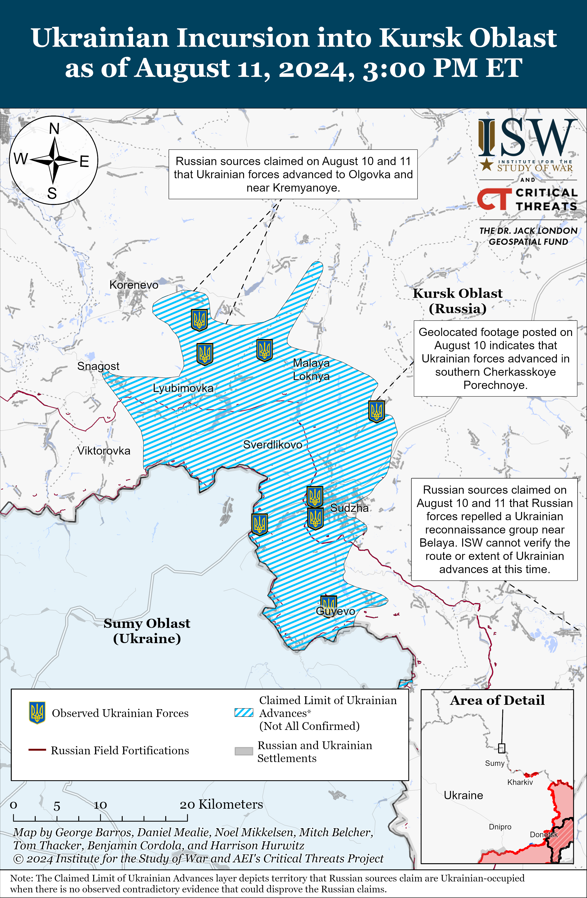
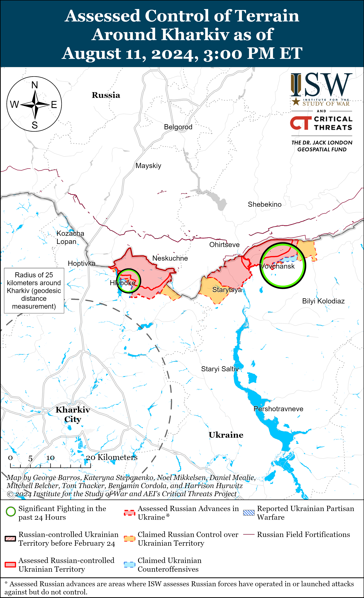
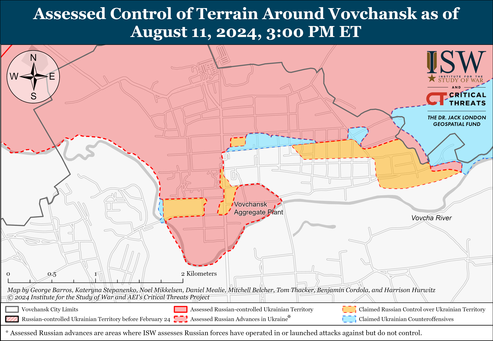
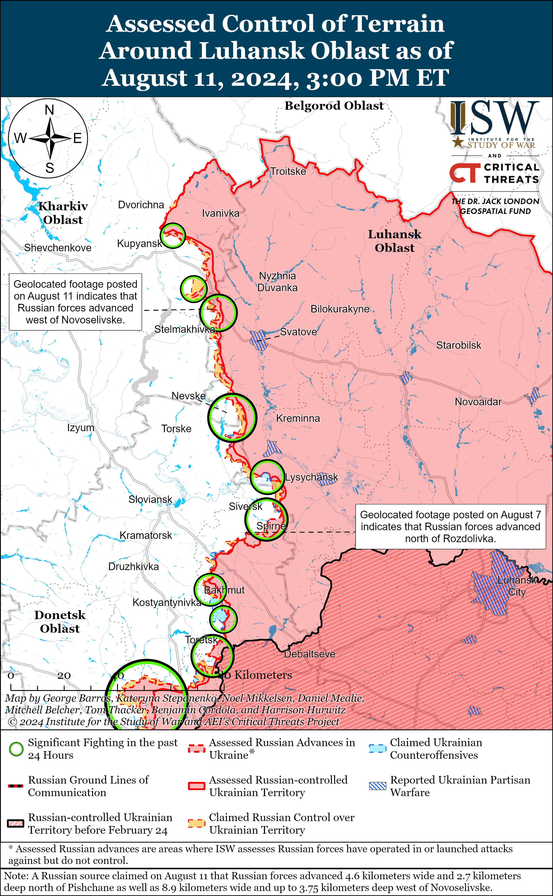
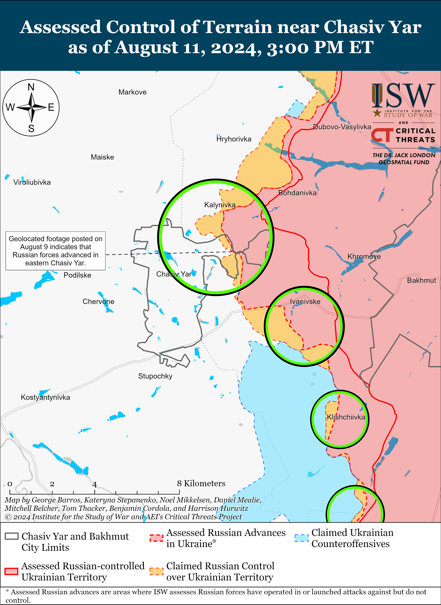
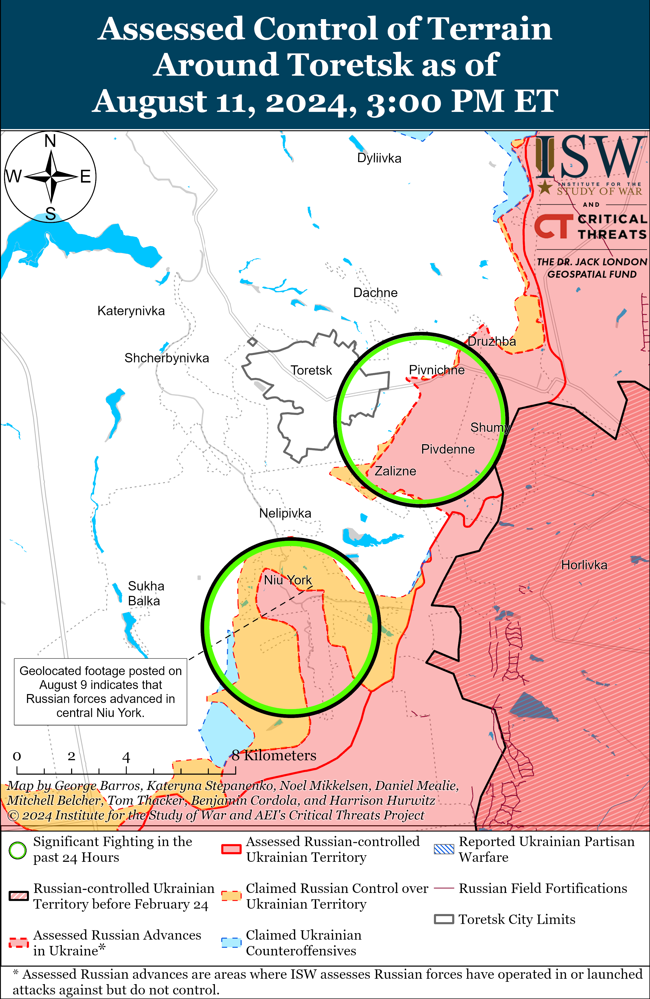
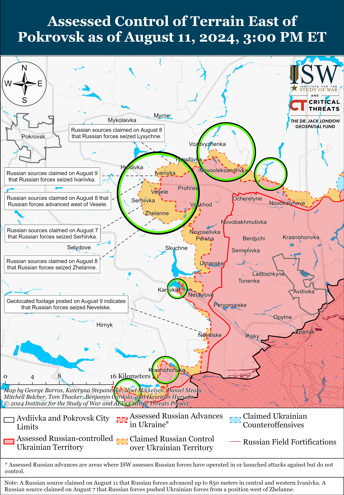
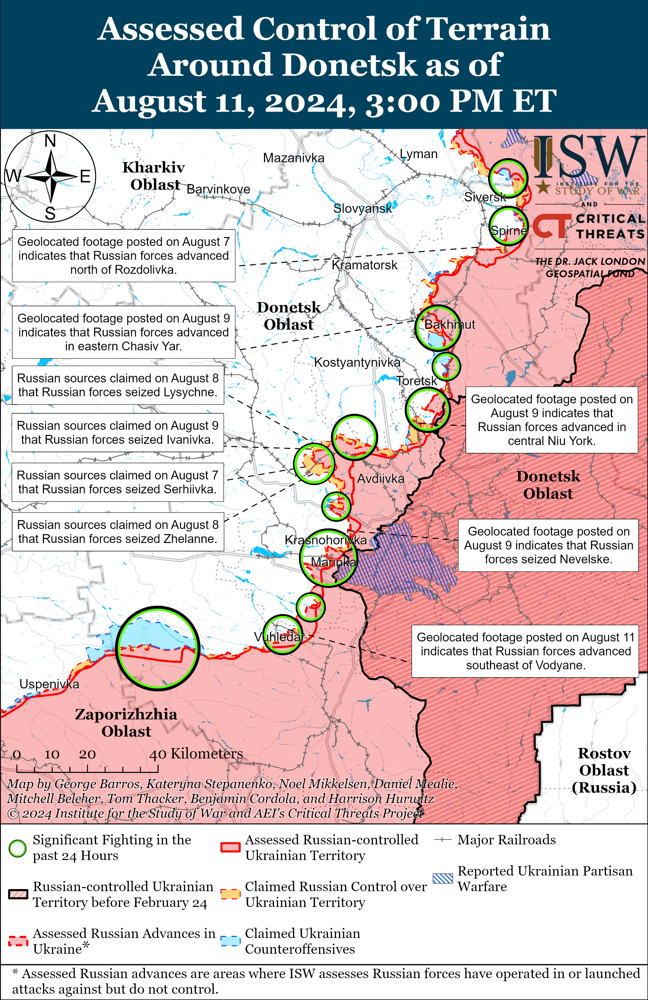
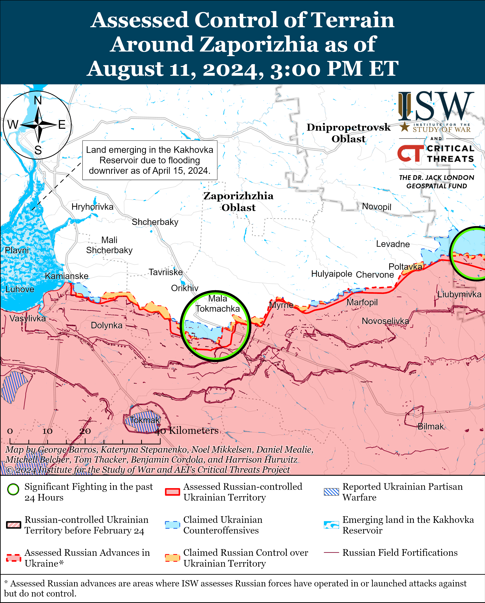
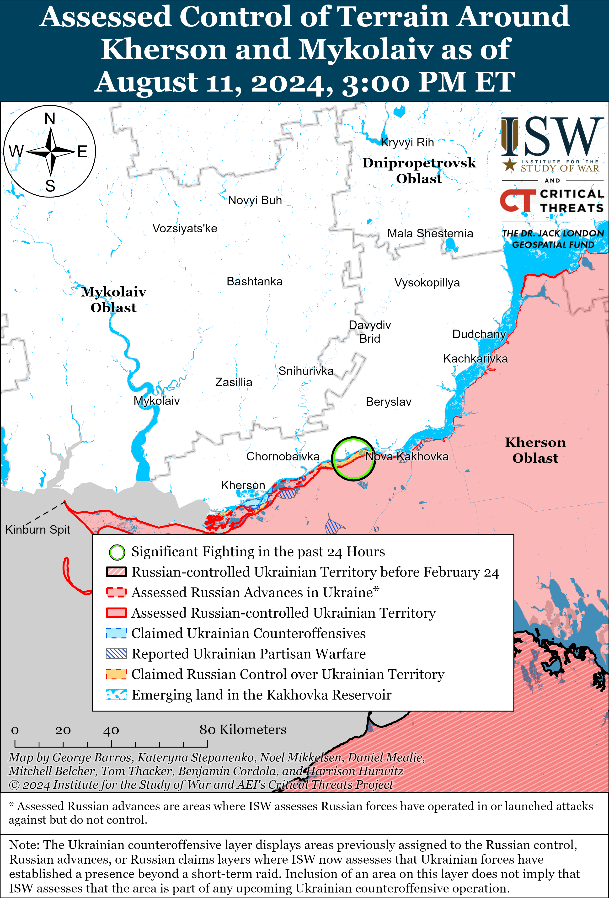

# Russian Offensive Campaign Assessment, August 11, 2024

**Riley Bailey, Grace Mappes, Christina Harward, Davit Gasparyan, and George Barros**

**August 11, 2024, 9:15pm ET**

**Click**[**here**](https://storymaps.arcgis.com/stories/36a7f6a6f5a9448496de641cf64bd375)**to see ISW’s interactive map of the Russian invasion of Ukraine. This map is updated daily alongside the static maps present in this report.**

**Click**[**here**](https://understandingwar.maps.arcgis.com/apps/instant/3dviewer/index.html?appid=1602762dbcde419bb957dea358449580)**to see ISW’s 3D control of terrain topographic map of Ukraine. Use of a computer (not a mobile device) is strongly recommended for using this data-heavy tool.**

**Click**[**here**](https://storymaps.arcgis.com/stories/733fe90805894bfc8562d90b106aa895)**to access ISW’s archive of interactive time-lapse maps of the Russian invasion of Ukraine. These maps complement the static control-of-terrain map that ISW produces daily by showing a dynamic frontline. ISW will update this time-lapse map archive monthly.**

**Note: The data cut-off for this product was 1pm ET on August 11. ISW will cover subsequent reports in the August 12 Russian Offensive Campaign Assessment.** [**NOTE:***Russian sources are currently shifting much of their reporting to cover the Ukrainian incursion into Kursk Oblast and as a result are not providing the same level of detail about the situation along the frontline in Ukraine.*]

**Ukraine’s operation in Kursk Oblast has allowed Ukrainian forces to at least temporarily seize the battlefield initiative in one area of the frontline and contest Russia’s theater-wide initiative.**Russia’s possession of the theater-wide initiative since November 2023 has allowed Russia to determine the location, time, scale, and requirements of fighting in Ukraine and forced Ukraine to expend materiel and manpower in reactive defensive operations.[1] The Ukrainian operation in Kursk Oblast, however, has forced the Kremlin and Russian military command to react and redeploy forces and means to the sector where Ukrainian forces have launched attacks. Russian forces, however, were notably not conducting active operations in Kursk Oblast. Russia has been leveraging its possession of the theater-wide initiative to pressure Ukraine and attempt to prevent Ukrainian forces from accumulating manpower and materiel for future counteroffensive operations while determining a tempo of fighting that would allow Russian forces to sustain consistent ongoing offensive operations.[2] Russian President Vladimir Putin and the Russian military command likely incorrectly assessed that Ukraine lacked the capability to contest the initiative, and Ukraine’s ability to achieve operational surprise and contest the theater-wide initiative is challenging the operational and strategic assumptions underpinning current Russian offensive efforts in Ukraine.

**The Ukrainian operation in Kursk Oblast and further possible Ukrainian cross-border incursions force a decision point on the Kremlin and the Russian military command about whether to view the thousand-kilometer-long international border with northeastern Ukraine as a legitimate frontline that Russia must defend instead of a dormant area of the theater as they have treated it since Fall 2022. Moscow’s response may require the Russian military command to consider the manpower and materiel requirements for defending the international border as part of its theater-wide campaign design and can therefore impose long-term operational planning constraints that Russia previously did not face.**TheRussianmilitary command has essentially treated the international border with northeastern Ukraine as the dormant front of the theater following the Russian withdrawal from Kyiv, Chernihiv, and Sumy oblasts in Spring 2022 and the Ukrainian liberation of significant territory in Kharkiv Oblast in Fall 2022. Russian and Ukrainian forces have conducted routine sabotage and reconnaissance activities, indirect fire, and cross-border strikes along the border since Fall 2022, but none of this routine activity has appeared to generate wider Russian operational concerns for defending Russian territory in the area. Russia has sought to use the threat of cross-border incursions to draw and fix Ukrainian forces along the border by concentrating rear elements in the border zone, but Ukrainian concentrations in the area do not appear to have generated such responses among Russian forces.[3] The Russian military activated part of this “dormant frontline” when it launched the offensive operation into northern Kharkiv Oblast in early May 2024 — a Russian effort to extend the frontline further into northeastern Ukraine to draw and fix Ukrainian forces along the border in hopes of weakening the overall Ukrainian frontline in aggregate.[4]

Previous notable incursions into Russia did not change the Kremlin’s perception of the international border area, but the Ukrainian operation in Kursk Oblast will force the Kremlin to make a decision. All Russian pro-Ukrainian forces have conducted several cross-border raids into Russia since Fall 2022, but the Kremlin and the Russian military command resisted calls for redeploying forces to protect the border at that time.[5] Russian President Vladimir Putin assessed at that time that those limited raids posed no medium- to long-term threat to Russian territory and that redeployments to the international border would be a less effective allocation of resources that could otherwise support large-scale defensive and offensive operations in Ukraine.[6] The current Ukrainian incursion, however, poses significant threats to Russian military operations in Ukraine and Putin’s regime stability and demands a response.[7] The Ukrainian operation in Kursk Oblast will likely expand the Kremlin’s consideration for what type of Ukrainian operations are possible along the border. Russia’s prolonged treatment of the international border area as a dormant frontline is a strategic failure in imagination.

Russia’s treatment of the international border area as a dormant front has given Russia more flexibility to accumulate and commit manpower and material to military operations in Ukraine. Russia has spent considerable resources to build fortifications along the international border area but has not allocated the manpower and materiel to significantly man and defend those fortifications.[8] Sparsely manned and equipped border fortifications proved insufficient at preventing Ukrainian gains at the outset of the Ukrainian incursion into Kursk Oblast, and the Russian military command will likely conclude that further manpower and equipment commitments to the international border will be required to effectively leverage fortified positions to prevent possible future Ukrainian cross-border incursions and deter larger Ukrainian incursion efforts in the long-term.[9] This conclusion will narrow the flexibility Russia has enjoyed in committing manpower and materiel to its ongoing offensive efforts in Ukraine, and the Russian military command will have to consider the requirements for border defense when determining what resources it can allocate to future large-scale offensive and defensive efforts in Ukraine.

**Geolocated footage and Russian and Ukrainian reporting from August 10 and 11 indicate that Ukrainian forces advanced westward and northwestward in Kursk Oblast, although Russian sources largely claimed that Russian forces have stabilized the situation.**Russian milbloggers claimed that Ukrainian offensive activity decreased in Kursk Oblast and that there were no significant changes to the frontline.[10] Russian sources claimed that Ukrainian forces advanced in Snagost (south of Korenevo), and Ukrainian military observer Kostyantyn Mashovets stated that Ukrainian forces advanced up to the settlement.[11] Geolocated footage published on August 11 indicates that Ukrainian forces were recently operating southeast of Korenevo.[12] Additional geolocated footage published on August 11 indicates that Ukrainian forces recently advanced near Kremyanoye (east of Korenevo).[13] One Russian milblogger claimed that Ukrainian forces seized Olgovka (east of Korenevo and west of Kremyanoye), whereas other Russian milbloggers claimed that Ukrainian forces only advanced near Olgovka and Kremyanoye.[14] Geolocated footage published on August 11 indicates that Ukrainian forces recently advanced in southern Cherkasskoye Porechnoye (north of Sudzha).[15] Further geolocated footage published on August 11 indicates that Ukrainian forces were recently operating west of Malaya Loknya (northwest of Sudzha).[16] Russian and Ukrainian sources offered contradictory statements about the status of Martynovka (northeast of Sudzha), with some Russian milbloggers claiming that Russian forces repelled Ukrainian attempts to retake the settlement, and other Russian sources and Mashovets stating that Ukrainian forces reentered and seized Martynovka.[17] Russian sources claimed that Ukrainian forces are present in western Sudzha and west of Sudzha in Goncharovka and Zaoleshenka, but that central and eastern Sudzha are contested “gray zones.”[18] Geolocated footage published on August 10 and 11 indicates that Ukrainian forces were recently operating near Zaoleshenka, southeast of Goncharovka, and southwest of Gogolevka (southwest of Sudzha).[19] A prominent Russian milblogger claimed that there are unconfirmed reports that Ukrainian forces are operating near Borki and Spalnoye (both southeast of Sudzha).[20] Additional geolocated footage published on August 11 indicates that Ukrainian forces were recently operating within Guevo (south of Sudzha).[21]

**The hastily assembled and disparate Russian force grouping responding to the Ukrainian incursion into Kursk Oblast is comprised of Russian units likely below their doctrinal end strength and ill-prepared to establish the joint command and control (C2) structures necessary to coordinate operations.**Ukrainian military observer Kostyantyn Mashovets reported on August 11 that Russian forces have thus far redeployed roughly 10 to 11 battalions from across the theater to Kursk Oblast but suggested that these battalion units are below their intended end strength, likely further exacerbating the disorganization of the Russian response.[22] Mashovets reported that Russian forces have deployed to defend in Kursk Oblast: a reinforced motorized rifle battalion of the 138th Motorized Rifle Brigade (6th Combined Arms Army [CAA], Leningrad Military District [LMD]) and up to three battalions from the 128th Motorized Rifle Brigade and 72nd Motorized Rifle Division (both of the 44th Army Corps [AC], LMD) from the Northern Grouping of Forces in northern Kharkiv Oblast; one motorized rifle battalion of the 272nd Motorized Rifle Regiment (47th Tank Division, 1st Guards Tank Army [GTA], Moscow Military District [MMD]) from the Kupyansk direction; up to two airborne (VDV) assault battalions of the 217th VDV Regiment (98th VDV Division) from within Kursk Oblast; units of an unspecified echelon of the 104th VDV Division from Kherson Oblast; one battalion possibly of the 810th Naval Infantry Brigade (Black Sea Fleet [BSF]) from the Kherson direction that Mashovets assessed is more likely of the 155th Naval Infantry Brigade (BSF) from northern Kharkiv Oblast; and additional battalions of the 38th and 64th motorized rifle brigades (both of the 35th CAA, Eastern Military District [EMD]), likely from the Zaporizhia direction.[23] Mashovets’ reporting largely coheres with a report from another Ukrainian source on August 9 and contradicts widespread Russian milblogger claims on August 10 and 11 that elements of the 810th Naval Infantry Brigade are fighting near Sudzha and Martynovka.[24]

**Russia’s redeployment of battalion and lower-level units rather than full brigades and regiments to defend in Kursk Oblast is likely contributing to Russian forces’ difficulty in quickly establishing effective C2 in the area**. Ukraine-based open-source intelligence organization Frontelligence Insight reported that both Russian and Ukrainian forces will redeploy battalions across the frontline and that these battalions are often at the strength of reinforced companies due to manpower and materiel shortages, including newly-created units that are not fully staffed.[25] Frontelligence Insight noted that drone units often deploy separately from their parent units due to their higher mobility and combat effectiveness**,** and so observing drone activities in any given area of the theater does not necessarily mean that the drone element’s parent unit is operating in the vicinity.[26] The disorganized nature of regular Russian battalions, combined with the Russian decision to assign the defense of Kursk Oblast to the Russian Federal Security Service (FSB) rather than to the Russian Ministry of Defense (MoD) as well as the integration of conscripts, FSB personnel, and Rosgvardia elements in combat, will hinder the Russian effort to establish effective C2. Mashovets assessed that Russian forces are likely attempting to buy time for further, more comprehensive force redeployments to defend in Kursk Oblast and focusing on minimizing the Ukrainian offensive effort rather than establishing a joint C2 structure.[27] A prominent, Kremlin-awarded, Russian milblogger claimed that Russian forces in Kursk Oblast are struggling to communicate with each other and often do not know the units operating on their flanks due to rapid redeployments of Russian units from different force groupings, ultimately undermining the integrity of the Russian defensive lines.[28]

**Confusion about the status of Russian conscripts fighting in Kursk Oblast is a consequence of ineffective C2 and will likely continue to further strain Russia’s C2 structures to respond to the Kursk operation.** Russian opposition outlet *Verstka*reported that conscripts serving in the Kursk Oblast border area at the start of the Ukrainian operation received no orders prior to the start of the operation and were unable to carry out an order to retreat due to Ukrainian mortar fire.[29] *Verstka*assessed that Russian forces are likely attempting to gather conscripts in Kursk Oblast to return them to their units and noted that one source stated that there were about 100 conscripts in the oblast on August 6 and that conscripts may be at up to 15 positions near Sudzha.[30] Russian opposition outlet*Agentstvo Novosti* reported, citing a source within a Russian legal aid organization and a mother of two Russian conscripts, that Russian forces are declaring conscripts fighting in Kursk Oblast to be part of combat units in order to keep them fighting rather than allowing them to transfer to rear areas.[31] The poor communication among units indicates that Russian forces will likely struggle to interact with units comprised of conscripts without pressing them into conventional Russian units that deployed to Ukraine and that are now fighting in the Kursk area. Some Russian milbloggers claimed that Russian forces are withdrawing conscripts from the frontline, however.[32] Should conscripts remain in combat in Kursk Oblast, it may risk a political crisis and the Kremlin may need to explain conscript causalities to Russian society, as ISW has recently assessed.[33]

**Russian officials acknowledged that Ukrainian mobile groups advanced upwards of 25 kilometers into Belovsky Raion, Kursk Oblast on the night of August 10 to 11, but there are no indications that these groups remain in the area or that Ukrainian forces are operating beyond the immediate border area in Belovsky Raion.**The Russian Ministry of Defense (MoD) claimed on August 11 that Russian forces repelled a Ukrainian “breakthrough attempt” in Belovsky Raion and that Russian aviation destroyed Ukrainian equipment near Ozerki (roughly 8 kilometers from the border with Sumy Oblast and 13 kilometers southwest of Belaya) and Ivanovsky (roughly 25 kilometers from the border with Sumy Oblast and three kilometers east of Belaya).[34] Kursk Oblast Acting Governor Alexei Smirnov claimed that Russian forces stabilized the situation after Ukrainian sabotage and reconnaissance groups entered Belovsky Raion and that there are no ongoing engagements in the area.[35] Several Russian milbloggers claimed that Ukrainian forces with a significant number of equipment and armored vehicles crossed the border with Sumy Oblast near Kucherovka and Goptarovka on the evening of August 10 and rapidly advanced to Belaya and the surrounding area.[36] Russian milbloggers described the event as a Ukrainian breakthrough and claimed that Ukrainian forces had rapidly seized tactically significant territory, although subsequent Russian claims suggest that the Ukrainian groups did not attempt to seize ground and that select Russian sources had initially exaggerated the size of the Ukrainian groups.[37] Russian milbloggers claimed that fighting was ongoing near Milyaevka and Goptarovka (within four kilometers of the border with Sumy Oblast) on the evening of August 10 but have yet to report fighting in the area on August 11.[38]

**The reported rapid Ukrainian maneuver in Belovsky Raion suggests that Russian forces along the international border remain poorly prepared to respond to further Ukrainian cross-border incursions.**SelectUkrainian mobile groups made rapid gains and similarly appeared not to attempt to hold territory in the first days of Ukraine’s incursion into Kursk Oblast.[39] The Russian military’s continued inability to prevent rapid Ukrainian maneuver following the operational surprise that Ukrainian forces achieved at the outset of the operation in Kursk Oblast indicates that there are enduring exploitable Russian vulnerabilities along the international border with Ukraine.[40] The Kremlin and the Russian military command currently appear to be concentrating redeployments to stabilize the immediate frontline near Korenevo and Sudzha, and reinforcing positions in other border areas in Kursk Oblast and elsewhere along the international border appears to be a lower priority.[41] Poorly manned Russian positions along the border in part facilitated Ukraine’s initial rapid gains in Kursk Oblast, and significant sectors of the border in Bryansk and Kursk oblasts and parts of Belgorod Oblast are likely sparsely manned.[42] The persisting issues with Russian C2 in Kursk Oblast will also further complicate Russia’s ability to prevent rapid Ukrainian maneuver and quickly respond to any other possible Ukrainian cross-border incursions. Poor Russian communication, unclear delineation of responsibilities, and subpar coordination for reconnaissance and fire between Russian units along the border will likely create gaps that highly maneuverable Ukrainian groups can exploit.

**Russian sources claimed on August 11 that small Ukrainian groups attempted unsuccessful limited cross-border incursions into western Belgorod Oblast.**Russian milbloggers claimed that squad-sized Ukrainian mechanized groups unsuccessfully attempted to cross the border near Bezymeno (nine kilometers south of Grayvoron) and posted footage purporting to show Russian forces striking Ukrainian equipment in the area.[43] Select Russian milbloggers claimed that Ukrainian forces conducted similar unsuccessful cross-border assaults near Kolotilovka (13 kilometers west of Krasnaya Yaruga), although the majority of Russian sources denied these claims.[44] ISW has yet to observe geolocated evidence of Ukrainian forces operating in Belgorod Oblast.

**Ukrainian President Volodymyr Zelensky officially acknowledged the Ukrainian cross-border incursion into Kursk Oblast for the first time on August 10.**Zelensky stated that he received reports from Ukrainian Commander-in-Chief Colonel General Oleksandr Syrskyi about the frontline situation and Ukrainian forces’ efforts to push the war onto Russian territory.[45] A Senior Ukrainian official reportedly told Agence-France-Presse (AFP)in an article published onAugust 11that “thousands” of Ukrainian soldiers are participating in Ukraine’s incursion into Kursk Oblast.[46] Russian Chief of the General Staff Army General Valery Gerasimov previously claimed on August 7 that about 1,000 Ukrainian soldiers attacked in Kursk Oblast.[47]

**A top Ukrainian defense official reportedly stated that** **Russian forces have somewhat reduced the intensity of assaults in eastern Ukraine but that otherwise the situation remains largely unchanged amid the Ukrainian operation in Kursk Oblast, which is consistent with ISW’s observations of Russian offensive tempo across the theater.[48]**The Ukrainian official told AFP that Russian forces continue to pressure Ukrainian forces in eastern Ukraine and that the Russian military command has not pulled back troops from eastern Ukraine.[49] Russian forces have maintained their tempo of offensive operations, particularly throughout Donetsk Oblast, since the start of the Ukrainian operation in Kursk Oblast and are maintaining a similar pace of advance in the Pokrovsk direction. Russian forces also continue significant mechanized assaults southwest of Donetsk City.

**Key Takeaways:**

- **Ukraine’s operation in Kursk Oblast has allowed Ukrainian forces to at least temporarily seize the battlefield initiative in one area of the frontline and contest Russia’s theater-wide initiative.**
- **The Ukrainian operation in Kursk Oblast and further possible Ukrainian cross-border incursions force a decision point on the Kremlin and the Russian military command about whether to view the thousand-kilometer-long international border with northeastern Ukraine as a legitimate frontline that Russia must defend instead of a dormant area of the theater as they have treated it since Fall 2022. Moscow’s response may require the Russian military command to consider the manpower and materiel requirements for defending the international border as part of its theater-wide campaign design and can therefore impose long-term operational planning constraints that Russia previously did not face.**
- **Geolocated footage and Russian and Ukrainian reporting from August 10 and 11 indicate that Ukrainian forces advanced westward and northwestward in Kursk Oblast, although Russian sources largely claimed that Russian forces have stabilized the situation.**
- **The hastily assembled and disparate Russian force grouping responding to the Ukrainian incursion into Kursk Oblast is comprised of Russian units likely below their doctrinal end-strength and ill-prepared to establish the joint command and control (C2) structures necessary to coordinate operations.**
- **Russia’s redeployment of battalion and lower-level units rather than full brigades and regiments to defend in Kursk Oblast is likely contributing to Russian forces’ difficulty in quickly establishing effective C2 in the area**.
- **Confusion about the status of Russian conscripts fighting in Kursk Oblast is a consequence of ineffective C2 and will likely continues to further strain Russia’ C2 structures to respond to the Kursk operation.**
- **Russian officials acknowledged that Ukrainian mobile groups advanced upwards of 25 kilometers into Belovsky Raion, Kursk Oblast on the night of August 10 to 11, but there are no indications that these groups remain in the area or that Ukrainian forces are operating beyond the immediate border area in Belovsky Raion.**
- **The reported rapid Ukrainian maneuver in Belovsky Raion suggests that Russian forces along the international border remain poorly prepared to respond to further Ukrainian cross-border incursions.**
- **Russian sources claimed on August 11 that small Ukrainian groups attempted unsuccessful limited cross-border incursions into western Belgorod Oblast.**
- **Ukrainian President Volodymyr Zelensky officially acknowledged the Ukrainian cross-border incursion into Kursk Oblast for the first time on August 10.**
- **A top Ukrainian defense official reportedly stated that** **Russian forces have somewhat reduced the intensity of assaults in eastern Ukraine but that otherwise the situation remains largely unchanged amid the Ukrainian operation in Kursk Oblast, which is consistent with ISW’s observations of Russian offensive tempo across the theater.**
- **Russian forces recently advanced near Kupyansk and Donetsk City.**
- **Russian propagandists are attempting to use the Ukrainian incursion into Kursk Oblast to promote Russian force generation efforts.**

***We do not report in detail on Russian war crimes because these activities are well-covered in Western media and do not directly affect the military operations we are assessing and forecasting. We will continue to evaluate and report on the effects of these criminal activities on the Ukrainian military and the Ukrainian population and specifically on combat in Ukrainian urban areas. We utterly condemn Russian violations of the laws of armed conflict and the Geneva Conventions and crimes against humanity even though we do not describe them in these reports.***

- Russian Main Effort – Eastern Ukraine (comprised of three subordinate main efforts)
- Russian Subordinate Main Effort #1 – Push Ukrainian forces back from the international border with Belgorod Oblast and approach to within tube artillery range of Kharkiv City
- Russian Subordinate Main Effort #2 – Capture the remainder of Luhansk Oblast and push westward into eastern Kharkiv Oblast and encircle northern Donetsk Oblast
- Russian Subordinate Main Effort #3 – Capture the entirety of Donetsk Oblast
- Russian Supporting Effort – Southern Axis
- Russian Air, Missile, and Drone Campaign
- Russian Mobilization and Force Generation Efforts
- Russian Technological Adaptations
- Activities in Russian-occupied areas
- Ukrainian Defense Industrial Base Efforts
- Russian Information Operations and Narratives
- Significant Activity in Belarus

**Russian Main Effort – Eastern Ukraine**

**Russian Subordinate Main Effort #1 – Kharkiv Oblast (Russian objective: Push Ukrainian forces back from the international border with Belgorod Oblast and approach to within tube artillery range of Kharkiv City)**

Ukrainian Northern Operational Command Spokesperson Vadym Mysnyk stated on August 11 that Russian sabotage and reconnaissance groups remain active in the border areas of Sumy and Chernihiv oblasts.[50]

Russian forces continued offensive operations in northern Kharkiv Oblast on August 11, but there were no confirmed changes to the frontline. Fighting continued north of Kharkiv City near Hlyboke and northeast of Kharkiv City near Vovchansk and Tykhe on August 10 and 11.[51] Ukraine’s Kharkiv Group of Forces stated on August 11 that elements of the Russian 153rd Tank Regiment (47th Tank Division, 1st Guards Tank Army [GTA], Moscow Military District [MMD]) and elements of the Russian 4th Volunteer Assault Brigade are operating within Vovchansk.[52]

**Russian Subordinate Main Effort #2 – Luhansk Oblast (Russian objective: Capture the remainder of Luhansk Oblast and push westward into eastern Kharkiv Oblast and northern Donetsk Oblast)**

Russian forces recently made confirmed advances near Kupyansk amid continued offensive operations along the Kupyansk-Svatove-Kreminna line on August 10 and 11. Geolocated footage published on August 11 indicates that Russian forces have advanced west of Novoselivske (southeast of Kupyansk).[53] Russian milbloggers claimed that Russian forces have advanced north of Pishchane, west of Tabaivka, and south of Berestove (all southeast of Kupyansk).[54] The Ukrainian General Staff reported that Russian forces attacked northeast of Kupyansk near Synkivka; southeast of Kupyansk near Berestove, Stelmakhivka, Hlushkivka, and Pishchane; northwest of Kreminna near Nevske, Novosadove, and Makiivka; west of Kreminna near Terny; and southwest of Kreminna in the Serebryanske forest area on August 10 and 11.[55] Elements of the Russian 144th Motorized Rifle Division (20th Combined Arms Army [CAA], Moscow Military District [MMD]) are reportedly operating near Nevske.[56]

**Russian Subordinate Main Effort #3 – Donetsk Oblast (Russian objective: Capture the entirety of Donetsk Oblast, the claimed territory of Russia’s proxies in Donbas)**

Russian forces continued offensive operations in the Siversk direction northeast of Siversk near Bilohorivka; east of Siversk near Verkhnokamyanske; and southeast of Siversk near Spirne, Ivano-Darivka, and Vyimka on August 10 and 11.[57]

Russian forces conducted offensive operations near Chasiv Yar on August 11, but there were no confirmed changes to the frontline. Russian forces continued offensive operations near Chasiv Yar, including in the Novyi and Zhovtnevyi microraions; east of Chasiv Yar near Ivanivske; southeast of Chasiv Yar near Klishchiivka; and south of Chasiv Yar near Bila Hora on August 10 and 11.[58] Elements of the Russian “Hispaniola” Volunteer Brigade (Russian Volunteer Corps) are reportedly operating within Novyi Microraion.[59]

Russian forces continued offensive operations near Toretsk on August 11, but there were no confirmed changes to the frontline. The Ukrainian General Staff reported that Russian forces conducted offensive operations near Toretsk, northeast of Toretsk near Druzhba, east of Toretsk near Pivnichne, southeast of Toretsk near Zalizne, and south of Toretsk near Niu York on August 10 and 11.[60] A Russian milblogger claimed that Russian forces advanced in northeastern Druzhba and southwestern Zalizne, but ISW has not observed confirmation of this claim.[61]

Russian forces reportedly advanced in the Pokrovsk direction on August 11, but there were no confirmed changes to the frontline. Russian milbloggers claimed that Russian forces advanced north and west of Nevelske (southeast of Pokrovsk) and up to 850 meters deep in central and western Ivanivka (east of Pokrovsk).[62] A Russian milblogger continued to claim that Russian forces have seized Zhelanne, Serhiivka (both southeast of Pokrovsk), and Ivanivka and have entered the eastern outskirts of Hrodivka (both east of Pokrovsk).[63] ISW has not observed confirmation of these Russian claims, however. Russian forces continued offensive operations east of Pokrovsk near Vozdvyzhenka, Novooleksandrivka, Kalynove, and Hrodivka and southeast of Pokrovsk near Novohrodivka, Zhelanne, Orlivka, Mykolaivka, and Karlivka on August 10 and 11.[64] Elements of the Russian 110th Motorized Rifle Brigade (1st Donetsk People’s Republic [DNR] Army Corps [AC]) are reportedly operating near Nevelske.

Russian forces conducted a roughly company-sized mechanized assault west of Donetsk City on August 11 and recently advanced southeast of Donetsk City. Geolocated footage published on August 11 indicates that Russian forces recently advanced southeast of Vodyane (southwest of Donetsk City).[65] Additional geolocated footage published on August 11 shows Ukrainian forces repelling a roughly company-sized Russian mechanized assault southeast of Heorhiivka (west of Donetsk City).[66] A Ukrainian brigade operating in the area reported that Russian forces attacked in two armored columns, the first composed of five armored vehicles and the second composed of three.[67] Ukrainian forces reportedly destroyed three vehicles, damaged two in the first column, and destroyed one in the second column, after which the remaining two vehicles retreated. Russian sources claimed that Russian forces advanced in northwestern Krasnohorivka (west of Donetsk City), within Kostyantynivka, and near Pobieda (both southwest of Donetsk City), but ISW has not observed confirmation of these claims.[68] Russian forces conducted offensive operations west of Donetsk City near Krasnohorivka and Heorhiivka and southwest of Donetsk City near Kostyantynivka, Paraskoviivka, and Vodyane on August 10 and 11.[69]

The Ukrainian General Staff reported that Russian forces conducted offensive operations from the area near Kermenchyk (southeast of Velyka Novosilka) on August 11.[70]

**Russian Supporting Effort – Southern Axis (Russian objective: Maintain frontline positions and secure rear areas against Ukrainian strikes)**

Positional fighting continued in western Zaporizhia Oblast near Robotyne, Novodanylivka (north of Robotyne), and Mala Tokmachka (northeast of Robotyne) on August 10 and 11, but there were no confirmed changes to the frontline.[71] Elements of the Russian 42nd Motorized Rifle Division (58th Combined Arms Army [CAA], Southern Military District [SMD]) reportedly continue to operate in the Zaporizhia direction.[72]

Russian authorities reportedly set a fire at the Zaporizhzhia Nuclear Power Plant (ZNPP) in occupied Enerhodar on August 11. Ukrainian officials published an image of the fire and a large black smoke plume at the ZNPP, and Nikopol Raion Head Yevgeny Yevtushenko stated that Russian authorities set fire to a large number of rubber tires at one of the ZNPP’s cooling towers.[73] Ukrainian officials emphasized that the ZNPP is currently operating normally and that there are no radiation leaks.[74] Zaporizhia Oblast occupation head Yevgeny Balitsky similarly stated that the ZNPP continues operating normally and that there are no radiation leaks, but Balitsky blamed alleged Ukrainian shelling for starting the fire.[75] Russian and occupation officials have consistently accused Ukrainian forces of endangering the ZNPP, particularly at key battlefield moments, despite Russia’s militarization of the ZNPP.[76] Russian authorities will likely use this fire to try to discredit Ukraine to the international community and falsely portray Russia as the only safe operator of the ZNPP.

Russian forces continued limited ground attacks in east (left) bank Kherson Oblast near Krynky on August 11, but there were no confirmed changes to the frontline.[77]

**Russian Air, Missile, and Drone Campaign (Russian Objective: Target Ukrainian military and civilian infrastructure in the rear and on the frontline)**

Russian forces conducted missile and drone strikes against Ukraine overnight on August 10 to 11. Ukrainian Air Force Commander Lieutenant General Mykola Oleshchuk reported that Russian forces launched four North Korean-provided KN-23 ballistic missiles from Voronezh Oblast, 57 Shahed drones from Primorsko-Akhtarsk and Yeysk, Krasnodar Krai, and Kursk City overnight on August 10 to 11.[78] Oleshchuk stated that Ukrainian forces shot down 53 Shaheds over Mykolaiv, Odesa, Cherkasy, Vinnytsia, Kirovohrad, Kherson, Kyiv, Zaporizhia, Sumy, and Rivne oblasts.[79] Russian forces reportedly targeted Kyiv City with the KN-23 ballistic missiles, and Oleshchuk and the Kyiv City Military Administration emphasized that none of the KN-23 missiles reached Kyiv City.[80] Ukrainian officials noted that falling missile fragments damaged a residential area in Brovary, Kyiv Oblast, killing two civilians.[81] Russian sources claimed that Russian forces struck a Ukrainian military storage facility on the outskirts of Poltava City overnight with unspecified munitions.[82]

**Russian Mobilization and Force Generation Efforts (Russian objective: Expand combat power without conducting general mobilization)**

Russian propagandists are attempting to use the Ukrainian incursion into Kursk Oblast to promote Russian force generation efforts. Russian propagandist Vladimir Solovyov visited the Unified Selection Point for Contract Military Service in Moscow on August 11 and claimed that the “events in Kursk” prompted more people, particularly those under 30, to express interest in becoming contract soldiers (*kontraktniki).*[83]ISW is unable to verify Solovyov’s claim, however.

The Sredna-Nevsky Shipyard announced that it launched the Project 12700 *Afanasy Ivannikov* minesweeper on August 9, and Commander-in-Chief of the Russian Navy Admiral Alexander Moiseyev*.* ***[84]***

**Russian Technological Adaptations (Russian objective: Introduce technological innovations to optimize systems for use in Ukraine)**

Nothing significant to report.

**Ukrainian Defense Industrial Efforts (Ukrainian objective: Develop its defense industrial base to become more self-sufficient in cooperation with US, European, and international partners)**

*ISW is not publishing coverage of Ukrainian defense industrial efforts today.*

**Activities in Russian-occupied areas (Russian objective: Consolidate administrative control of annexed areas; forcibly integrate Ukrainian citizens into Russian sociocultural, economic, military, and governance systems)**

*ISW is not publishing coverage of activities in Russian-occupied areas today.*

**Russian Information Operations and Narratives**

Nothing significant to report.

**Significant activity in Belarus (Russian efforts to increase its military presence in Belarus and further integrate Belarus into Russian-favorable frameworks and Wagner Group activity in Belarus)**

The Belarusian Ministry of Defense (MoD) announced on August 11 that elements of unspecified mechanized units deployed to the border with Ukraine in accord with Belarusian President Alexander Lukashenko’s August 10 request to strengthen the border grouping operating in the Gomel and Mozyr directions.[85] Lukashenko claimed on August 10 that Belarusian officials shot down roughly a dozen Ukrainian drones in Belarusian airspace overnight on August 9 to 10 and stated that Belarus would not allow such “provocations” to go unanswered.[86] The Belarusian Hajun Project reported on August 11 that it did not detect any Ukrainian drones in Belarusian airspace or any projectiles fired from responding Belarusian aircraft overnight on August 9 to 10.[87] The Belarusian Ministry of Foreign Affairs (MFA) summoned Ukrainian Charge d’Affaires to Belarus Olga Timush and “questioned the advisability of [the Ukrainian diplomatic mission’s] continued presence” in Minsk due to the drone incident.[88] Ukrainian State Border Service Spokesperson Andriy Demchenko stated on August 11 that the situation along the Ukrainian-Belarusian international border remains unchanged and that Ukrainian forces have not detected the movement of Belarusian troops or equipment near the border, but noted that Belarus is beginning to “inflame” the situation.[89]

**Note: ISW does not receive any classified material from any source, uses only publicly available information, and draws extensively on Russian, Ukrainian, and Western reporting and social media as well as commercially available satellite imagery and other geospatial data as the basis for these reports. References to all sources used are provided in the endnotes of each update.**

---

[1] https://understandingwar.org/backgrounder/russian-offensive-campaign-assessment-march-6-2024; https://understandingwar.org/backgrounder/russian-offensive-campaign-assessment-march-22-2024; https://understandingwar.org/backgrounder/russian-offensive-campaign-assessment-may-5-2024; https://understandingwar.org/backgrounder/russian-offensive-campaign-assessment-may-18-2024; https://isw.pub/UkrWar051124

[2] https://understandingwar.org/backgrounder/russian-offensive-campaign-assessment-june-7-2024

[3] https://understandingwar.org/backgrounder/russian-offensive-campaign-assessment-may-20-2024; https://understandingwar.org/backgrounder/russian-offensive-campaign-assessment-may-17-2024; https://understandingwar.org/backgrounder/russian-offensive-campaign-assessment-june-30-2024; https://understandingwar.org/backgrounder/russian-offensive-campaign-assessment-may-26-2024; https://understandingwar.org/backgrounder/russian-offensive-campaign-assessment-may-30-2024; https://understandingwar.org/backgrounder/how-delays-western-aid-gave-russia-initiative-ukrainian-counteroffensive-kharkiv

[4] https://understandingwar.org/backgrounder/russian-offensive-campaign-assessment-may-10-2024

[5] https://understandingwar.org/backgrounder/russian-offensive-campaign-assessment-march-12-2024; https://understandingwar.org/backgrounder/russian-offensive-campaign-assessment-march-13-2024; https://understandingwar.org/backgrounder/ukraine-conflicts-updates-january-2-may-31-2024; https://understandingwar.org/backgrounder/russian-offensive-campaign-assessment-march-14-2024; https://understandingwar.org/backgrounder/russian-offensive-campaign-assessment-march-18-2024; https://understandingwar.org/backgrounder/russian-offensive-campaign-assessment-may-23-2023; https://understandingwar.org/backgrounder/russian-offensive-campaign-assessment-may-22-2023; https://understandingwar.org/backgrounder/russian-offensive-campaign-assessment-june-5-2023;

[6] https://understandingwar.org/backgrounder/russian-offensive-campaign-assessment-march-15-2024; https://understandingwar.org/backgrounder/russian-offensive-campaign-assessment-march-18-2024; https://understandingwar.org/backgrounder/russian-offensive-campaign-assessment-march-14-2024

[7] https://understandingwar.org/backgrounder/russian-offensive-campaign-assessment-august-8-2024

[8] https://understandingwar.org/backgrounder/russian-offensive-campaign-assessment-june-4-2024; https://understandingwar.org/backgrounder/russian-offensive-campaign-assessment-march-10-2023; https://understandingwar.org/backgrounder/russian-offensive-campaign-assessment-april-8-2023; https://understandingwar.org/backgrounder/russian-offensive-campaign-assessment-may-15-2024; https://understandingwar.org/backgrounder/russian-offensive-campaign-assessment-april-8-2023; https://understandingwar.org/backgrounder/russian-offensive-campaign-assessment-may-22-2023

[9] https://isw.pub/UkrWar081024 ; https://isw.pub/UkrWar080924 ; https://isw.pub/UkrWar080824 ; https://isw.pub/UkrWar08072024 ;

[10] https://t.me/rybar/62656 ; https://t.me/rybar/62665 ; https://t.me/boris\_rozhin/133236 ; https://t.me/milinfolive/128083

[11] https://t.me/RVvoenkor/74458 ; https://t.me/rybar/62665 ; https://t.me/dva\_majors/49380 ; ; https://t.me/warhistoryalconafter/178603 ; https://t.me/motopatriot/26061 ; https://t.me/zvizdecmanhustu/2110

[12] https://t.me/creamy\_caprice/6344; https://t.me/vorposte/59605

[13] https://x.com/moklasen/status/1822578383542198360; https://x.com/RALee85/status/1822620595521040819; https://t.me/warriorofnorth/2018

[14] https://t.me/dva\_majors/49456 ; https://t.me/warhistoryalconafter/178693 ; https://t.me/RVvoenkor/74458 ; https://t.me/motopatriot/26047 ; https://t.me/motopatriot/26061

[15] https://t.me/creamy\_caprice/6341; https://t.me/zvezdanews/147645; https://x.com/GeoConfirmed/status/1822571218953765363; https://x.com/666\_mancer/status/1822553540037898495

[16] https://t.me/creamy\_caprice/6334; https://t.me/zvezdanews/147631

[17] https://t.me/rybar/62665 ; https://t.me/NgP\_raZVedka/18618 ; https://t.me/motopatriot/26035 ; https://t.me/dva\_majors/49430 ; https://t.me/yurasumy/16999 ; https://t.me/zvizdecmanhustu/2110

[18] https://t.me/rybar/62674 ; https://t.me/rybar/62656 ; https://t.me/dva\_majors/49380 ; https://t.me/warhistoryalconafter/178603; https://t.me/rybar/62665

[19] https://x.com/bayraktar\_1love/status/1822691454193463446; https://x.com/Noobieshunta\_/status/1822692786295976419; https://x.com/99Dominik\_/status/1822697040402436355; https://t.me/ButusovPlus/12638; https://t.me/WarArchive\_ua/18414; https://t.me/WarArchive\_ua/18378; https://www.tiktok.com/@vitaliypavlovskiy/video/7401491311041334533?\_r=1&\_t=8om5JGjdgxy

[20] https://t.me/rybar/62674 ; https://t.me/rybar/62665

[21] https://t.me/WarArchive\_ua/18392; https://x.com/99Dominik\_/status/1822537695731544256; https://t.me/svoiKR/33156; https://t.me/Donbas\_Operativnyi/86127

[22] https://t.me/zvizdecmanhustu/2111

[23] https://t.me/zvizdecmanhustu/2111

[24] https://understandingwar.org/backgrounder/russian-offensive-campaign-assessment-august-10-2024; https://t.me/vanek\_nikolaev/25705; https://t.me/vanek\_nikolaev/25703

[25] https://twitter.com/Tatarigami\_UA/status/1822628819057999964

[26] https://twitter.com/Tatarigami\_UA/status/1822628819057999964

[27] https://t.me/zvizdecmanhustu/2112

[28] https://t.me/rybar/62668

[29] https://t.me/svobodnieslova/5431;

[30] https://t.me/svobodnieslova/5431;

[31] https://www.agents dot media/komandiry-otkazalis-perevodit-v-tyl-srochnikov-v-kurskoj-oblasti/

[32] https://t.me/boris\_rozhin/133147; https://t.me/dontstopwar/15480

[33] https://understandingwar.org/backgrounder/russian-offensive-campaign-assessment-august-10-2024

[34] https://t.me/mod\_russia/42018

[35] https://t.me/gubernator\_46/7466

[36] https://t.me/mig41/36072 ; https://t.me/dva\_majors/49392 ; https://t.me/dva\_majors/49395 ; https://t.me/NgP\_raZVedka/18613 ; https://t.me/DnevnikDesantnika/13700 ; https://t.me/DnevnikDesantnika/13704 ; https://t.me/DnevnikDesantnika/13705 ; https://t.me/DnevnikDesantnika/13712 ; https://t.me/NgP\_raZVedka/18609

[37] https://t.me/RVvoenkor/74468 ; https://t.me/RVvoenkor/74464 ; https://t.me/bayraktar1070/2561 ; https://t.me/RVvoenkor/74476 ; https://t.me/rybar/62658 ; https://t.me/dva\_majors/49396 ; https://t.me/dva\_majors/49398 ; https://t.me/DnevnikDesantnika/13721 ; https://t.me/wargonzo/21498 ; https://t.me/notes\_veterans/18725

[38] https://t.me/rybar/62657; https://t.me/dva\_majors/49393 ; https://t.me/rybar/62658 ; https://t.me/dva\_majors/49396

[39] https://understandingwar.org/backgrounder/russian-offensive-campaign-assessment-august-8-2024

[40] https://understandingwar.org/backgrounder/russian-offensive-campaign-assessment-august-8-2024

[41] https://understandingwar.org/backgrounder/russian-offensive-campaign-assessment-august-8-2024

[42] https://isw.pub/UkrWar081024 ; https://isw.pub/UkrWar080924 ; https://isw.pub/UkrWar080824 ; https://isw.pub/UkrWar08072024 ;

[43] https://t.me/mig41/36096 ; https://t.me/RVvoenkor/74536 ; https://t.me/rusich\_army/16422 ;

[44] https://t.me/NeoficialniyBeZsonoV/38522 ; https://t.me/boris\_rozhin/133211 ; https://t.me/rusich\_army/16422 ; https://t.me/notes\_veterans/18713; https://t.me/notes\_veterans/18716; https://t.me/vysokygovorit/16864 ; https://t.me/mig41/36082

[45] https://t.me/V\_Zelenskiy\_official/11340; https://armyinform dot com.ua/2024/08/10/golovnokomanduvach-zsu-dopoviv-prezydentu-pro-vytyskannya-vijny-na-terytoriyu-agresora/

[46] https://www.france24 dot com/en/europe/20240811-thousands-of-troops-part-of-incursion-aiming-to-destabilise-russia-says-top-ukrainian-official-border-regions

[47] https://understandingwar.org/backgrounder/russian-offensive-campaign-assessment-august-7-2024

[48] https://www.france24 dot com/en/europe/20240811-thousands-of-troops-part-of-incursion-aiming-to-destabilise-russia-says-top-ukrainian-official-border-regions

[49] https://www.france24 dot com/en/europe/20240811-thousands-of-troops-part-of-incursion-aiming-to-destabilise-russia-says-top-ukrainian-official-border-regions

[50] https://armyinform dot com.ua/2024/08/11/u-zsu-rozpovily-pro-sytuacziyu-z-vorozhymy-drg-na-kordoni-sumskoyi-ta-chernigivskoyi-oblastej/

[51]https://www.facebook.com/GeneralStaff.ua/posts/pfbid025VmCuywRgWt7WdUd7acDkrU4Cs5eXA5kWW58QXU7a6Z2LUc9VNFEZsZX35TqZrMLl ; https://www.facebook.com/GeneralStaff.ua/posts/pfbid01Qzj2aw6a4cxmoy4u1HaqwKdJecaqdxKyZEVDubxEVBT48KXx2LLJfnvTBYUjTW6l; https://www.facebook.com/GeneralStaff.ua/posts/pfbid02yefUQEwwpjT8ikXQRX9r9WLcupk9Vue5J7cb2yXSLX9i4S62zKRwc9aqNc2EDhHal ; https://t.me/wargonzo/21507

[52] https://t.me/otukharkiv/705

[53] https://t.me/creamy\_caprice/6340; https://t.me/ssternenko/32230

[54] https://t.me/motopatriot/26053 ; https://t.me/RVvoenkor/74504

[55]https://www.facebook.com/GeneralStaff.ua/posts/pfbid02yefUQEwwpjT8ikXQRX9r9WLcupk9Vue5J7cb2yXSLX9i4S62zKRwc9aqNc2EDhHal; https://www.facebook.com/GeneralStaff.ua/posts/pfbid025VmCuywRgWt7WdUd7acDkrU4Cs5eXA5kWW58QXU7a6Z2LUc9VNFEZsZX35TqZrMLl ; https://www.facebook.com/GeneralStaff.ua/posts/pfbid01Qzj2aw6a4cxmoy4u1HaqwKdJecaqdxKyZEVDubxEVBT48KXx2LLJfnvTBYUjTW6l

[56] https://t.me/boris\_rozhin/133176

[57] https://www.facebook.com/GeneralStaff.ua/posts/pfbid025VmCuywRgWt7WdUd7acDkrU4Cs5eXA5kWW58QXU7a6Z2LUc9VNFEZsZX35TqZrMLl; https://www.facebook.com/GeneralStaff.ua/posts/pfbid01Qzj2aw6a4cxmoy4u1HaqwKdJecaqdxKyZEVDubxEVBT48KXx2LLJfnvTBYUjTW6l ; https://www.facebook.com/GeneralStaff.ua/posts/pfbid02yefUQEwwpjT8ikXQRX9r9WLcupk9Vue5J7cb2yXSLX9i4S62zKRwc9aqNc2EDhHal

[58] https://www.facebook.com/GeneralStaff.ua/posts/pfbid025VmCuywRgWt7WdUd7acDkrU4Cs5eXA5kWW58QXU7a6Z2LUc9VNFEZsZX35TqZrMLl; https://www.facebook.com/GeneralStaff.ua/posts/pfbid01Qzj2aw6a4cxmoy4u1HaqwKdJecaqdxKyZEVDubxEVBT48KXx2LLJfnvTBYUjTW6l ; https://www.facebook.com/GeneralStaff.ua/posts/pfbid02yefUQEwwpjT8ikXQRX9r9WLcupk9Vue5J7cb2yXSLX9i4S62zKRwc9aqNc2EDhHal; https://t.me/rusich\_army/16425

[59] https://t.me/spainrus/1532

[60] ttps://www.facebook.com/GeneralStaff.ua/posts/pfbid025VmCuywRgWt7WdUd7acDkrU4Cs5eXA5kWW58QXU7a6Z2LUc9VNFEZsZX35TqZrMLl; https://www.facebook.com/GeneralStaff.ua/posts/pfbid01Qzj2aw6a4cxmoy4u1HaqwKdJecaqdxKyZEVDubxEVBT48KXx2LLJfnvTBYUjTW6l ; https://www.facebook.com/GeneralStaff.ua/posts/pfbid02yefUQEwwpjT8ikXQRX9r9WLcupk9Vue5J7cb2yXSLX9i4S62zKRwc9aqNc2EDhHal;

[61] https://t.me/RVvoenkor/74505

[62] https://t.me/rybar/62654 ; https://t.me/RVvoenkor/74504

[63] https://t.me/voenkorKotenok/58138

[64] https://www.facebook.com/GeneralStaff.ua/posts/pfbid025VmCuywRgWt7WdUd7acDkrU4Cs5eXA5kWW58QXU7a6Z2LUc9VNFEZsZX35TqZrMLl; https://www.facebook.com/GeneralStaff.ua/posts/pfbid01Qzj2aw6a4cxmoy4u1HaqwKdJecaqdxKyZEVDubxEVBT48KXx2LLJfnvTBYUjTW6l ; https://www.facebook.com/GeneralStaff.ua/posts/pfbid02yefUQEwwpjT8ikXQRX9r9WLcupk9Vue5J7cb2yXSLX9i4S62zKRwc9aqNc2EDhHal ; https://t.me/voenkorKotenok/58138

[65] https://t.me/creamy\_caprice/6343; https://t.me/BULAVA72b/161

[66] https://x.com/PuenteUribarri/status/1822557362978173119; https://x.com/PuenteUribarri/status/1822551257103421561; https://x.com/klinger66/status/1822573706431836507; https://x.com/NOELreports/status/1822552277317550510;

[67] https://armyinform dot com.ua/2024/08/11/na-donechchyni-desantnyky-vidbyly-2-shturmy-j-urazyly-7-odynycz-vorozhoyi-bronetehniky/; https://www.facebook.com/oaembr46/videos/849532783797503

[68] https://t.me/voenkorKotenok/58138; https://t.me/rybar/62654

[69] https://www.facebook.com/GeneralStaff.ua/posts/pfbid025VmCuywRgWt7WdUd7acDkrU4Cs5eXA5kWW58QXU7a6Z2LUc9VNFEZsZX35TqZrMLl; https://www.facebook.com/GeneralStaff.ua/posts/pfbid01Qzj2aw6a4cxmoy4u1HaqwKdJecaqdxKyZEVDubxEVBT48KXx2LLJfnvTBYUjTW6l ; https://www.facebook.com/GeneralStaff.ua/posts/pfbid02yefUQEwwpjT8ikXQRX9r9WLcupk9Vue5J7cb2yXSLX9i4S62zKRwc9aqNc2EDhHal ; https://t.me/rybar/62654

[70] https://www.facebook.com/GeneralStaff.ua/posts/pfbid01Qzj2aw6a4cxmoy4u1HaqwKdJecaqdxKyZEVDubxEVBT48KXx2LLJfnvTBYUjTW6l

[71] https://armyinform dot com.ua/2024/08/11/na-pivdni-vorog-aktyvno-zastosovuye-boyeprypasy-z-otrujnymy-rechovynamy/; https://www.facebook.com/GeneralStaff.ua/posts/pfbid025VmCuywRgWt7WdUd7acDkrU4Cs5eXA5kWW58QXU7a6Z2LUc9VNFEZsZX35TqZrMLl; https://www.facebook.com/GeneralStaff.ua/posts/pfbid01Qzj2aw6a4cxmoy4u1HaqwKdJecaqdxKyZEVDubxEVBT48KXx2LLJfnvTBYUjTW6l

[72] https://t.me/dva\_majors/49419

[73] https://t.me/Yevtushenko\_E/33394

[74] https://t.me/Yevtushenko\_E/33394; https://t.me/V\_Zelenskiy\_official/11345

[75] https://t.me/rian\_ru/256918

[76] https://understandingwar.org/backgrounder/russian-offensive-campaign-assessment-may-2-2024; https://understandingwar.org/backgrounder/russian-offensive-campaign-assessment-july-12-2024; https://understandingwar.org/backgrounder/russian-offensive-campaign-assessment-april-9-2024; https://understandingwar.org/backgrounder/russian-offensive-campaign-assessment-march-5-2024; https://understandingwar.org/backgrounder/russian-offensive-campaign-assessment-november-21; https://understandingwar.org/backgrounder/russian-offensive-campaign-assessment-october-16

[77] https://www.facebook.com/GeneralStaff.ua/posts/pfbid025VmCuywRgWt7WdUd7acDkrU4Cs5eXA5kWW58QXU7a6Z2LUc9VNFEZsZX35TqZrMLl; https://www.facebook.com/GeneralStaff.ua/posts/pfbid01Qzj2aw6a4cxmoy4u1HaqwKdJecaqdxKyZEVDubxEVBT48KXx2LLJfnvTBYUjTW6l; https://www.facebook.com/GeneralStaff.ua/posts/pfbid02yefUQEwwpjT8ikXQRX9r9WLcupk9Vue5J7cb2yXSLX9i4S62zKRwc9aqNc2EDhHal; https://t.me/SJTF\_Odes/10891

[78] https://t.me/ComAFUA/380; https://armyinform dot com.ua/2024/08/11/vorog-udaryv-po-ukrayini-pivnichnokorejskymy-raketamy-povitryani-syly/

[79] https://t.me/ComAFUA/380; https://armyinform dot com.ua/2024/08/11/vorog-udaryv-po-ukrayini-pivnichnokorejskymy-raketamy-povitryani-syly/

[80] https://t.me/VA\_Kyiv/7281; https://t.me/ComAFUA/380

[81] https://t.me/dsns\_telegram/31055; https://t.me/ermaka2022/5133

[82] https://t.me/rybar/62666; https://t.me/tass\_agency/265632; https://t.me/tass\_agency/265633; https://t.me/tass\_agency/265640

[83] https://www.msk.kp dot ru/online/news/5940617/ ; https://t.me/mobilizationnews/19773

[84] https://flotprom dot ru/2024/%D0%A1%D0%BD%D1%81%D0%B78/

[85] https://t.me/modmilby/40968; https://t.me/modmilby/40961; https://understandingwar.org/backgrounder/russian-offensive-campaign-assessment-august-10-2024

[86] https://t.me/modmilby/40958; https://t.me/pul\_1/13301; https://t.me/modmilby/40959; https://t.me/modmilby/40960; https://t.me/modmilby/40961; https://t.me/belta\_telegramm/263068; https://t.me/belta\_telegramm/263060; https://understandingwar.org/backgrounder/russian-offensive-campaign-assessment-august-10-2024

[87] https://t.me/Hajun\_BY/8037

[88] https://www.belta dot by/society/view/belarus-mozhet-postavit-vopros-o-tselesoobraznosti-dalnejshego-prisutstvija-v-minske-653513-2024/

[89] https://armyinform dot com.ua/2024/08/11/na-kordoni-z-bilorussyu-peremishhennya-tehniky-chy-osobovogo-skladu-sylovykiv-ne-zafiksovani/
