# Russian Offensive Campaign Assessment, August 12, 2024

**Christina Harward, Angelica Evans, Nicole Wolkov, Davit Gasparyan, Grace Mappes, and Frederick W. Kagan**

**August 12, 2024, 8:30pm ET**

**Click**[**here**](https://storymaps.arcgis.com/stories/36a7f6a6f5a9448496de641cf64bd375)**to see ISW’s interactive map of the Russian invasion of Ukraine. This map is updated daily alongside the static maps present in this report.**

**Click**[**here**](https://understandingwar.maps.arcgis.com/apps/instant/3dviewer/index.html?appid=1602762dbcde419bb957dea358449580)**to see ISW’s 3D control of terrain topographic map of Ukraine. Use of a computer (not a mobile device) is strongly recommended for using this data-heavy tool.**

**Click**[**here**](https://storymaps.arcgis.com/stories/733fe90805894bfc8562d90b106aa895)**to access ISW’s archive of interactive time-lapse maps of the Russian invasion of Ukraine. These maps complement the static control-of-terrain map that ISW produces daily by showing a dynamic frontline. ISW will update this time-lapse map archive monthly.**

**Note: The data cut-off for this product was 1pm ET on August 12. ISW will cover subsequent reports in the August 13 Russian Offensive Campaign Assessment. [NOTE:***Russian sources are currently shifting much of their reporting to cover the Ukrainian incursion into Kursk Oblast and as a result are not providing the same level of detail about the situation along the frontline in Ukraine.***]**

**Russian President Vladimir Putin continues to portray himself as an effective and knowledgeable manager of the situation along the Ukrainian-Russian border and to shift responsibility for ongoing challenges in responding to the Ukrainian incursion in the area to other Russian military and government officials.**Putin held a meeting on August 12 with Russian military, security, and federal and regional government officials about the situation in Belgorod, Bryansk, and Kursk oblasts during which he assigned tasks to the Russian military and security structures in Kursk Oblast and offered his assessments of the political situation surrounding Ukraine’s incursion into Russia.[1] Putin chastised Kursk Oblast Acting Governor Alexei Smirnov for speaking about issues that Putin deemed to be solely under the Russian Ministry of Defense’s (MoD) purview and instructed Smirnov to only speak about the socio-economic situation in Kursk Oblast. Putin also responded to First Deputy Prime Minister Denis Manturov’s claim that “all other issues are under control,” noting that Manturov failed to speak about several key social issues. Belgorod Oblast Governor Vyacheslav Gladkov asked Putin directly to implement certain social policies to help civilians in Belgorod Oblast but Gladkov and Bryansk Oblast Governor Alexander Bogomaz both avoided Putin’s ire by not commenting on military issues. Putin’s assertion that each official has only one responsibility contrasts with his attempt to frame himself as capable of overseeing and competently understanding the political, socio-economic, and military situation along the international border. The Kremlin published footage and text of the Bryansk, Belgorod, and Kursk oblasts heads’ reports to Putin about the issues Russian regional authorities are currently facing — likely in order to publicly depict the regional heads as responsible for these issues and in need of Putin’s help. The Kremlin notably did not publish footage or text from the part of the meeting in which the Russian military and security officials likely reported to Putin.

**The Kremlin’s decision to publish footage showing Putin chastising senior Russian officials is likely a warning to other Russian officials to refrain from commenting about the Ukrainian incursion into Russia.**The Kremlin published a half-hour video of Putin meeting with senior Russian military, security, and government officials showing Putin reprimanding Russian federal and regional officials for their perceived effort to address matters outside of their designated responsibility and for their perceived failure to address civilian issues.[2] The Kremlin’s decision to publish a video of the meeting alongside a transcript of Putin’s meeting with Russian officials sends a clear message to other government officials to refrain from commenting on the Kremlin’s, the Russian military’s, and Russian security forces’ decision-making and operations to repel Ukrainian forces from Russia and mitigate related civilian issues. Russian opposition outlet *Verstka* reported on August 8 that a source close to the Russian Federation Council’s defense committee stated that the Russian Presidential Administration recommended that Russian deputies and senators not comment on the events in Kursk Oblast “until further notice” or discuss it as briefly as possible and refer only to official statements.[3] Putin and senior Russian military and security officials are likely attempting to control official narratives about the situation in Kursk Oblast and prevent domestic discontent that could threaten the Kremlin’s stability.

**Putin delegated overlapping tasks to the Russian Ministry of Defense (MoD), Federal Security Service (FSB), and Rosgvardia in the Ukrainian-Russian border area — further highlighting how the Russian force grouping in Kursk Oblast is struggling to establish the joint command and control (C2) structures necessary to coordinate operations.**Putin stated that the Russian MoD’s main task is to push Ukrainian forces out of Russian territory.[4] Putin tasked the Russian MoD and Border Service (subordinated to the FSB) to “ensure reliable coverage of the state border.” Putin stated that the FSB and Rosgvardia must “fight against [Ukrainian] sabotage and reconnaissance groups,” while Rosgvardia also conducts “its own combat missions.” Putin stated that the FSB and Rosgvardia must also ensure the counterterrorism operation regime and that the FSB, with Rosgvardia’s support, is standing up a “headquarters” — likely referring to a headquarters to manage the ongoing counterterrorism operation.[5] Kursk Oblast Acting Governor Alexei Smirnov claimed that Colonel General Yevgeny Nikiforov, who is reportedly the Chief of Staff of the Russian Ground Forces, arrived in Kursk Oblast and is coordinating “with all security forces.”[6] It is unclear at this time if the Kremlin has designated Nikiforov as an overall commander of Russian military and security forces in Kursk Oblast or if Nikiforov is operating within the FSB-led counterterrorism operation headquarters.

Smirnov claimed that Russian forces are having unspecified issues since there is “no clear front line” and it is unclear where the “military units” are located — likely referring to Ukrainian forces quickly engaging Russian forces near a settlement and then withdrawing from the area, which is reportedly leading to conflicting Russian reporting from the ground about Ukrainian advances in Kursk Oblast.[7] Putin appears to be tasking the FSB and Rosgvardia with countering Ukrainian “mobile groups” that have been operating deeper into Kursk Oblast, while simultaneously tasking the FSB, Rosgvardia, and Russian MoD with conducting defensive and offensive operations in the region. ISW continues to assess that the disparate Russian force grouping responding to the Ukrainian incursion is complicating Russia’s ability to establish the C2 structures necessary to coordinate operations.[8]

**Putin offered several assessments about Ukrainian operations in Kursk Oblast, including one that undermined a long-standing Kremlin information operation falsely portraying Ukraine as unwilling to engage in legitimate, good-faith negotiations and putting the onus for peace negotiations on Ukraine.**Putin claimed that Ukraine is “indiscriminately strik[ing] civilians, [striking] civilian infrastructure, and threaten[ing] nuclear power facilities” and implied that Russia cannot conduct good-faith negotiations with an actor who commits such actions.[9] Putin unironically but hypocritically accused Ukraine of striking civilians and endangering the nuclear power plants — actions that ISW has thoroughly documented Russia committing in Ukraine with strikes against civilian targets since the start of the full-scale invasion and the endangerment of the Zaporizhzhia Nuclear Power Plant (ZNPP) since the Russian military occupied it in March 2022.[10] Putin also claimed, however, that Ukraine may be conducting operations into Kursk Oblast in order to “improve its negotiating position in the future.”[11] Putin’s assessment inherently implies that Ukraine is interested in negotiations — undermining the Kremlin’s ongoing attempts to portray Ukraine as unwilling to negotiate. Putin also claimed that Ukraine may be conducting operations into Kursk Oblast to prevent Russian advances in eastern Ukraine and to destabilize the Russian domestic political situation. Putin notably did not present one assessment of Ukrainian operations in Kursk Oblast as more likely than another and did not present them as mutually exclusive. ISW will not offer assessments about the intent of Ukrainian operations in Kursk Oblast or Putin’s claims of Ukrainian intent.

**Ukrainian forces appear to be advancing further within Kursk Oblast despite recent milblogger claims that Russian forces were stabilizing the frontline in Kursk Oblast.**Russian milbloggers claimed on August 11 that Ukrainian offensive activity decreased in Kursk Oblast; however, a prominent Kremlin-affiliated milblogger refuted these claims on August 12 and noted that Russian forces are far from stabilizing the situation, in part due to poor C2.[12] Ukrainian forces reportedly launched new incursions into western Kursk Oblast near Slobodka-Ivanovka (northwest of Sumy City and two kilometers from the international border), Tetkino (south of Slobodka-Ivanovka along the international border), Gordeevka, Uspenka, and Viktorovka (all north of Sumy City along the international border and south of Korenevo).[13] Russian sources claimed that Ukrainian forces seized Slobodka-Ivanovka, Uspenivka, and Viktorovka.[14] Russian milbloggers claimed that fighting continued near Snagost (south of Korenevo) and Kremyanoye (east of Snagost) and that Ukrainian forces are attacking north and south of Korenevo in an attempt to bypass the settlement.[15] Geolocated footage indicates that Ukrainian forces recently advanced within Kremyanoye and east of Zhuravli (northeast of Korenevo), and a Kremlin-affiliated milblogger claimed that Ukrainian forces advanced north of Zhuravli towards Obshchy Kolodez (northeast of Korenevo and 30 kilometers from the international border).[16] Additional geolocated footage indicates that Ukrainian forces recently advanced in a forest area north and east of Semenovka (south of Lgov and roughly 24 kilometers from the international border) during a likely battalion-sized mechanized assault in the direction of Kauchuk (south of Lgov and 27 kilometers from the international border), although the exact contours of Ukraine’s advance are unclear.[17]

Geolocated footage published on August 12 indicates that Ukrainian forces were recently operating in Sudzha and northern Zaoleshenka (west of Sudzha), and Russian milbloggers claimed that Ukrainian forces have seized Sudzha and Spalnoye (southeast of Sudzha).[18] Additional geolocated footage published on August 12 shows Ukrainian vehicles operating in northern Giri (southeast of Sudzha and 13 kilometers from the international border) and Russian forces ambushing Ukrainian forces in central Giri, indicating that Ukrainian forces at least temporarily advanced into the settlement, although it is unclear if Ukrainian forces maintain positions in the area.[19] The Russian Ministry of Defense (MoD) claimed that Russian forces repelled a Ukrainian attack near Borki (southeast of Sudzha), suggesting that Ukrainian forces likely advanced into Giri from the west.[20] Geolocated footage published on August 12 indicates that Ukrainian forces were recently operating in Darino (northwest of Sudzha and three kilometers from the international border).[21] Russian sources claimed that Ukrainian forces also conducted cross-border incursions with armored vehicle support from Sumy Oblast northwest of Grayvoron, Belgorod Oblast near Kolotilovka and Prelesye and south of Grayvoron near Bezymeno.[22]

[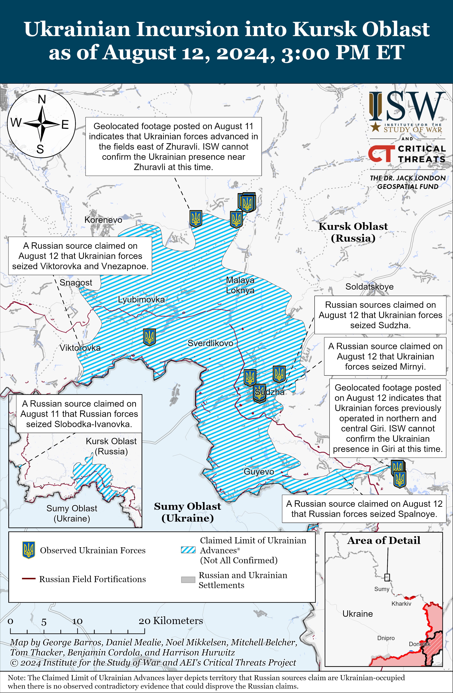](https://understandingwar.org/map/ukrainian-incursion-into-kursk-oblast-as-of-august-12-2024-300-pm-et/)

**Regional Russian officials appear to be offering notably frank assessments of the ongoing Ukrainian incursion.** Belgorod Oblast Governor Vyacheslav Gladkov expressed concern on August 12 about “alarming” Ukrainian activity along the border with Belgorod Oblast.[23] Kursk Oblast Governor Alexei Smirnov claimed on August 12 that Ukrainian forces have seized 28 settlements in Kursk Oblast and that Ukrainian forces have advanced roughly 12 kilometers deep along a 40-kilometer-long front into Kursk Oblast.[24] ISW has observed claims and geolocated footage indicating that Ukrainian forces are operating in or near 29 settlements in Kursk Oblast as of August 11 and 40 settlements as of August 12. ISW has observed geolocated footage indicating that Ukrainian forces have recently operated up to 24 kilometers from the international border, and Smirnov’s assessed width of the frontline appears to cohere with the area where the majority of fighting is ongoing between Snagost and Plekhovo.

**Senior Ukrainian officials provided updates about the ongoing Ukrainian incursion into Kursk Oblast and warned that Russian forces may stage war crimes in Kursk Oblast in order to discredit Ukraine and Western support for Ukraine.** Ukrainian Commander-in-Chief Colonel General Oleksandr Syrskyi stated on August 12 that Ukrainian force “control” roughly 1,000 square kilometers of Russian territory, presumably within Kursk Oblast.[25] ISW has observed claims that Ukrainian forces have advanced roughly 800 square kilometers as of August 12, although ISW does not assess that Ukrainian forces control all of the territory within the maximalist extent of claimed Ukrainian advances. ISW assesses that Russian forces occupied an additional 1,175 square kilometers of Ukrainian territory between January and July 2024, including areas seized both in the face of prepared Ukrainian defenses and during the Russian attack into northern Kharkiv Oblast. Syrskyi stated that Ukrainian forces are continuing offensive operations into Kursk Oblast, and Ukrainian President Volodymyr Zelensky acknowledged the ongoing Ukrainian operation.[26] Zelensky noted that the Ukrainian government is preparing a plan to address humanitarian issues in areas of Kursk Oblast where Ukrainian forces are operating. Ukraine’s Security Service (SBU) reported that Russian special services are seizing on the ongoing Ukrainian incursion in Kursk Oblast to falsely accuse Ukrainian forces of committing war crimes and warned that Russian special services may stage crimes against civilians in Kursk Oblast in order to further accuse Ukrainian forces of committing war crimes.[27]

**Ukrainian forces reportedly conducted a drone strike against a Russian airbase in Moscow Oblast on the night of August 11 to 12.**Russian opposition outlet *Astra*amplified footage on August 12 purportedly of Russian air defense systems intercepting Ukrainian drones over Shchyolkovo, Moscow Oblast near Chkalovsky Military Air Base.[28] *Astra*reported that unspecified pro-war Russian Telegram channels claimed that Russian forces successfully repelled a Ukrainian drone strike. No Russian official sources commented on the strike.

**Key Takeaways:**

- **Russian President Vladimir Putin continues to portray himself as an effective and knowledgeable manager of the situation along the Ukrainian-Russian border and to shift responsibility for ongoing challenges in responding to the Ukrainian incursion in the area to other Russian military and government officials.**
- **The Kremlin’s decision to publish footage showing Putin chastising senior Russian officials is likely a warning to other Russian officials to refrain from commenting about the Ukrainian incursion into Russia.**
- **Putin delegated overlapping tasks to the Russian Ministry of Defense (MoD), Federal Security Service (FSB), and Rosgvardia in the Ukrainian-Russian border area — further highlighting how the Russian force grouping in Kursk Oblast is struggling to establish the joint command and control (C2) structures necessary to coordinate operations.**
- **Putin offered several assessments about Ukrainian operations in Kursk Oblast, including one that undermined a long-standing Kremlin information operation falsely portraying Ukraine as unwilling to engage in legitimate, good-faith negotiations and putting the onus for peace negotiations on Ukraine.**
- **Ukrainian forces appear to be advancing further within Kursk Oblast despite recent milblogger claims that Russian forces were stabilizing the frontline in Kursk Oblast.**
- **Regional Russian officials appear to be offering notably frank assessments of the ongoing Ukrainian incursion.**
- **Senior Ukrainian officials provided updates about the ongoing Ukrainian incursion into Kursk Oblast and warned that Russian forces may stage war crimes in Kursk Oblast in order to discredit Ukraine and Western support for Ukraine.**
- **Ukrainian forces reportedly conducted a drone strike against a Russian airbase in Moscow Oblast on the night of August 11 to 12.**
- **Russian forces recently advanced near Vovchansk, Chasiv Yar, Toretsk, and Pokrovsk.**
- **Russian President Vladimir Putin and the Russian Ministry of Defense (MoD) emphasized Russia’s international defense ties at the Army-2024 International Military-Technical Forum in Moscow, likely in an effort to expand international military-technical cooperation and posture strong defense relations with Russia-friendly states**

[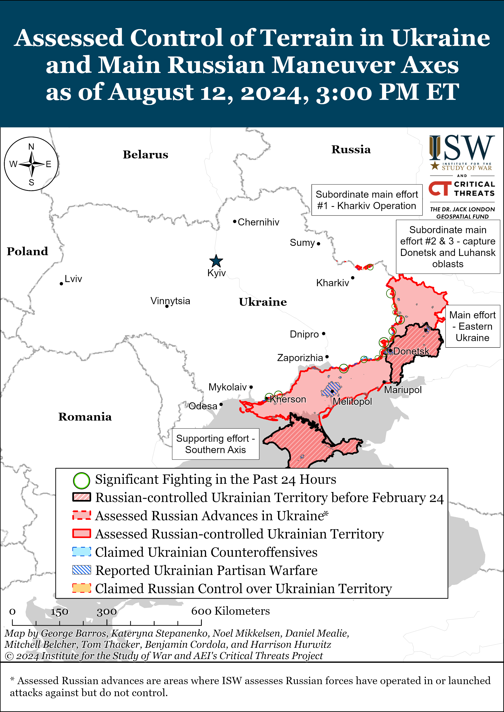](https://understandingwar.org/map/assessed-control-of-terrain-in-ukraine-and-main-russian-maneuver-axes-as-of-august-12-2024-300-pm-et/)

***We do not report in detail on Russian war crimes because these activities are well-covered in Western media and do not directly affect the military operations we are assessing and forecasting. We will continue to evaluate and report on the effects of these criminal activities on the Ukrainian military and the Ukrainian population and specifically on combat in Ukrainian urban areas. We utterly condemn Russian violations of the laws of armed conflict and the Geneva Conventions and crimes against humanity even though we do not describe them in these reports.***

- Russian Main Effort — Eastern Ukraine (comprised of three subordinate main efforts)
- Russian Subordinate Main Effort #1 — Push Ukrainian forces back from the international border with Belgorod Oblast and approach to within tube artillery range of Kharkiv City
- Russian Subordinate Main Effort #2 — Capture the remainder of Luhansk Oblast and push westward into eastern Kharkiv Oblast and encircle northern Donetsk Oblast
- Russian Subordinate Main Effort #3 — Capture the entirety of Donetsk Oblast
- Russian Supporting Effort — Southern Axis
- Russian Air, Missile, and Drone Campaign
- Russian Mobilization and Force Generation Efforts
- Russian Technological Adaptations
- Activities in Russian-occupied areas
- Ukrainian Defense Industrial Base Efforts
- Russian Information Operations and Narratives
- Significant Activity in Belarus

**Russian Main Effort — Eastern Ukraine**

**Russian Subordinate Main Effort #1 — Kharkiv Oblast (Russian objective: Push Ukrainian forces back from the international border with Belgorod Oblast and approach to within tube artillery range of Kharkiv City)**

Russian forces recently marginally advanced within Vovchansk amid continued fighting northeast of Kharkiv City on August 12. Geolocated footage published on August 9 shows that Russian forces have marginally advanced within central Vovchansk (northeast of Kharkiv City).[29] Fighting continued within Vovchansk and immediately east of Vovchansk near Tykhe on August 11 and 12.[30] A Russian milblogger claimed that Ukrainian forces are not conducting offensive operations north of Kharkiv City near Hlyboke or west of Vovchansk near Zelene and Starytsya but are heavily striking Russian forces with drones in those areas.[31] The Ukrainian Kharkiv Grouping of Forces reported that Russian forces near Vovchansk are attempting to improve their logistics and communications, likely to improve their overall command and control (C2) in the area, and that Russian forces northwest of Tykhe are fortifying their current positions.[32] Assault elements of the Russian 4th Volunteer Assault Brigade reportedly continue fighting within Vovchansk.[33]

[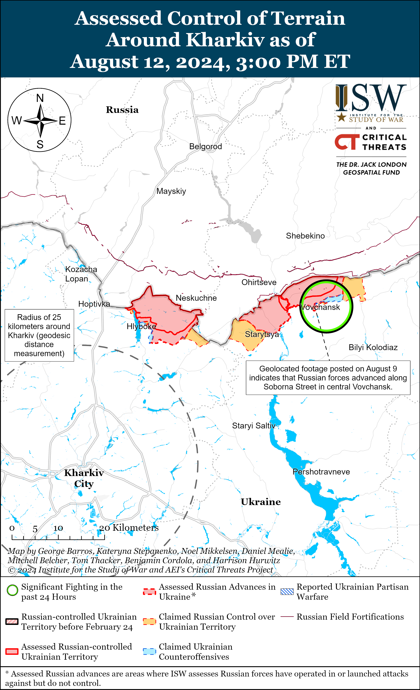](https://understandingwar.org/map/assessed-control-of-terrain-around-kharkiv-as-of-august-12-2024-300-pm-et/)

[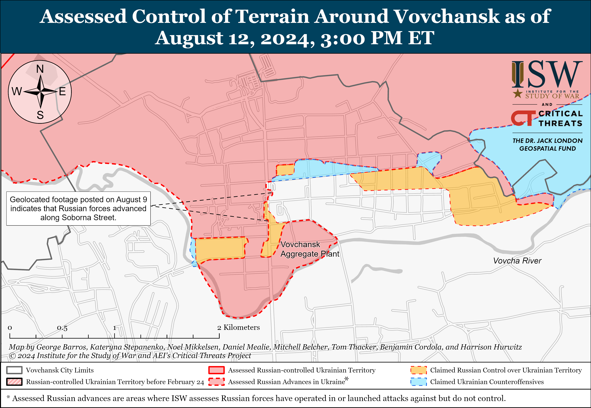](https://understandingwar.org/map/assessed-control-of-terrain-around-vovchansk-as-of-august-12-2024-300-pm-et/)

**Russian Subordinate Main Effort #2 — Luhansk Oblast (Russian objective: Capture the remainder of Luhansk Oblast and push westward into eastern Kharkiv Oblast and northern Donetsk Oblast)**

Russian forces reportedly advanced along the Kupyansk-Svatove-Kreminna line amid continued fighting on August 12. A Russian milblogger claimed that Russian forces pushed Ukrainian forces from several windbreaks south of Berestove (southeast of Kupyansk), advanced south of Novoselivske (southeast of Kupyansk), and that Russian forces are attacking in several directions towards the N-26 Kupyansk-Svatove highway.[34] The milblogger noted that fighting remains positional, however. Russian forces also attacked southeast of Kupyansk near Pishchane, Stelmakhivka, Hlushivka, and Novoosynove; northwest of Kreminna near Makiivka, Nevske, Novosadove, and Terny; west of Kreminna near Torske; and south of Kreminna in the Serebryanske forest area on August 11 and 12.[35]

[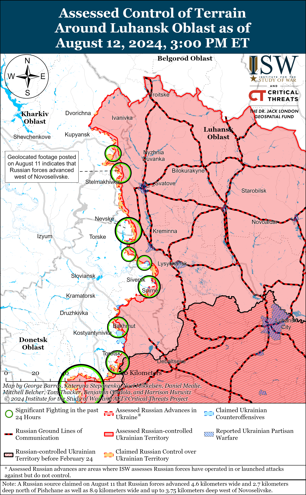](https://understandingwar.org/map/assessed-control-of-terrain-around-luhansk-oblast-as-of-august-12-2024-300-pm-et/)

**Russian Subordinate Main Effort #3 — Donetsk Oblast (Russian objective: Capture the entirety of Donetsk Oblast, the claimed territory of Russia’s proxies in Donbas)**

Ukrainian forces recently regained positions southeast of Siversk amid continued Russian assaults in the Siversk direction on August 12. Geolocated footage published on August 10 indicates that Ukrainian forces recently advanced south of Ivano-Darivka (southeast of Siversk).[36] Russian forces continued offensive operationsnortheast of Siversk near Bilohorivka; east of Siversk near Verkhnokamyanske; and southeast of Siversk near Spirne, Ivano-Darivka, and Vyimka on August 11 and 12.[37] Elements of the Russian 123rd Motorized Rifle Brigade (2nd Luhansk People’s Republic Army Corps [LNR AC]) reportedly continue to operate near Siversk.[38]

[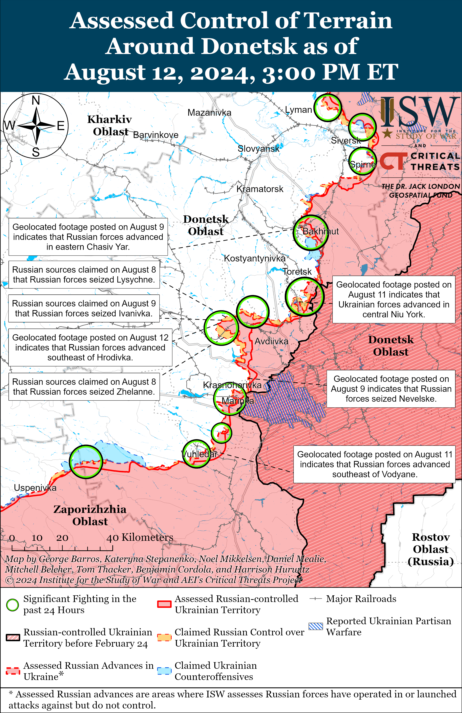](https://understandingwar.org/map/assessed-control-of-terrain-around-donetsk-as-of-august-12-2024-300-pm-et/)

Russian forces advanced north of Chasiv Yar amid continued fighting in the area on August 12. Geolocated footage published on August 5 indicates that Russian forces advanced southeast of Hryhorivka (north of Chasiv Yar).[39] Fighting continued near Chasiv Yar, north of Chasiv Yar near Kalynivka, northeast of Chasiv Yar near Bohdanivka, and southeast of Chasiv Yar near Ivanivske and Klishchiivka on August 11 and 12.[40]

[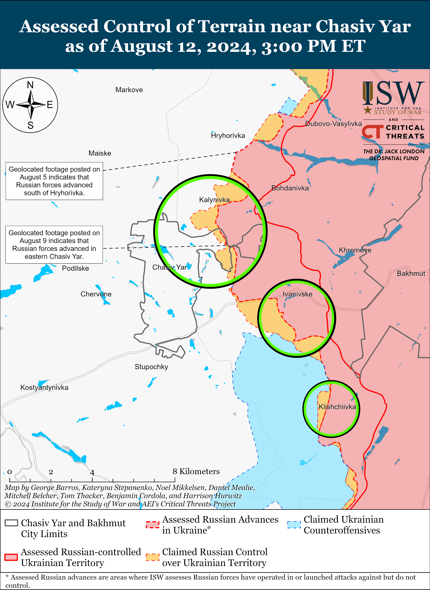](https://understandingwar.org/map/assessed-control-of-terrain-near-chasiv-yar-as-of-august-12-2024-300-pm-et/)

Russian forces recently advanced southeast of Toretsk and Ukrainian forces recently recaptured positions south of Toretsk amid continued Russian ground attacks in the area on August 12. Geolocated footage published on August 10 indicates that Russian forces recently marginally advanced in southwestern Zalizne (southeast of Toretsk).[41] Additional geolocated footage published on August 11 indicates that Ukrainian forces recently recaptured positions in western and central Niu York (south of Toretsk).[42] Russian milbloggers claimed that Russian forces advanced in central Druzhba (east of Toretsk), in western Pivnichne (east of Toretsk), and near Yurivka (south of Toretsk), although ISW has not observed visual confirmation of these claims.[43] Fighting continued near Toretsk, Druzhba, and Zalizne and south of Toretsk near Niu York, Nelipivka, and Sukha Balka on August 11 and 12.[44]

[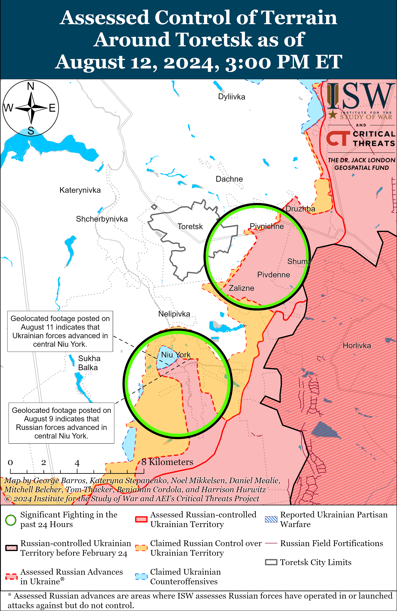](https://understandingwar.org/map/assessed-control-of-terrain-around-toretsk-as-of-august-12-2024-300-pm-et/)

Russian forces recently advanced east of Pokrovsk amid continued ground attacks east and southeast of Pokrovsk on August 12. Geolocated footage published on August 12 indicates that Russian forces advanced east of Pokrovsk within Ivanivka and southeast of Hrodivka.[45] The Russian Ministry of Defense and Russian milbloggers claimed on August 12 that Russian forces advanced in northern Karlivka and seized Lysychne (both east of Pokrovsk).[46] The spokesperson for a Ukrainian brigade operating in the Pokrovsk direction stated on August 12 that frontline Ukrainian forces have not observed a decrease in Russian activity in this direction following the beginning of Ukraine’s incursion into Kursk Oblast on August 6.[47] The spokesperson reported that Russian forces have not withdrawn any significant forces from this direction but noted that Russian forces appear to have limited their drone and armored vehicle use in the area. The spokesperson reported that Russian forces are attacking in small groups of two to three personnel through forest areas and that these tactics make it difficult for Ukrainian forces to track the groups. Russian forces continued offensive operations east of Pokrovsk near Vozdvyzhenka, Novooleksandrivka, Kalynove, Yelyzavetivka, and Hrodivka and southeast of Pokrovsk near Skuchne, Novohrodivka, Zhelanne, Orlivka, Mykolaivka, and Karlivka on August 11 and 12.[48]

[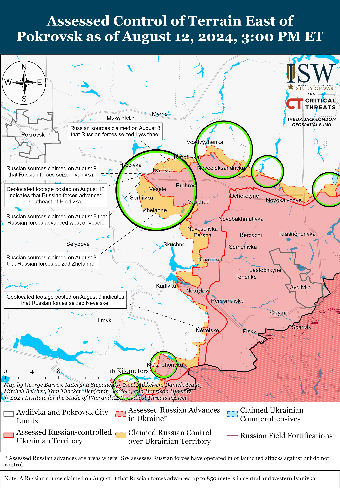](https://understandingwar.org/map/assessed-control-of-terrain-east-of-pokrovsk-as-of-august-12-2024-300-pm-et/)

Russian forces continued attacks west of Donetsk City near Krasnohorivka and Heorhiivka and southwest of Donetsk City near Kostyantynivka and Vodyane on August 11 and 12, but there were no confirmed changes to the frontline.[49]

Russia forces continued ground attacks in the Donetsk-Zaporizhia Oblast border area, including near Vuhledar (southeast of Velyka Novosilka), on August 11 and 12.[50] Elements of the Russian 5th Tank Brigade (36th Combined Arms Army [CAA], Eastern Military District [EMD]) are reportedly operating in the south Donetsk direction.[51]

**Russian Supporting Effort — Southern Axis (Russian objective: Maintain frontline positions and secure rear areas against Ukrainian strikes)**

Fighting continued in western Zaporizhia Oblast near Robotyne, Novodanylivka (north of Robotyne), Mala Tokmachka (northeast of Robotyne), Verbove (east of Robotyne), and Hulyaipole on August 11 and 12, but there were no confirmed changes to the frontline.[52] Elements of the Russian 22nd Spetsnaz Brigade (Russian General Staff Main Directorate [GRU]) reportedly continue to operate in the Zaporizhia direction.[53]

[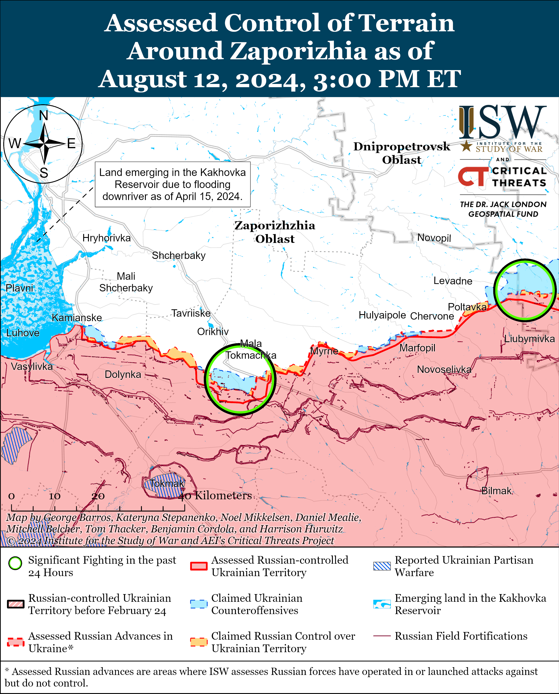](https://understandingwar.org/map/assessed-control-of-terrain-around-zaporizhia-as-of-august-12-2024-300-pm-et/)

Russian sources claimed on August 11 and 12 that Ukrainian forces conducted a drone strike against the Russian-occupied Zaporizhzhia Nuclear Power Plant (ZNPP) following the August 11 fire at the ZNPP.[54] Russian officials claimed that Ukraine is threatening “global energy security” and called on the International Atomic Energy Agency (IAEA) to condemn the strike.[55] The IAEA stated on August 12 that its experts witnessed the fire and confirmed that the fire caused no risk to the IAEA but called for the “reckless attacks” on the ZNPP to stop.[56] Ukrainian officials stated on August 11 that Russian authorities set fire to a large number of rubber tires at one of the ZNPP’s cooling towers.[57] Russian authorities are attempting to use this fire to discredit Ukraine in front of the international community and falsely portray Russia as the only safe operator of the ZNPP.

Russian forces continued ground attacks in east (left) bank Kherson Oblast, including near Krynky, on August 11 and 12, but there were no changes to the frontline.[58] Elements of the Russian 80th Arctic Motorized Rifle Brigade (14th Army Corps [AC], Leningrad Military District [LMD]), 25th Spetsnaz Regiment (Russian General Staff Main Directorate [GRU]), and unspecified airborne (VDV) elements are reportedly operating in the Kherson direction.[59]

[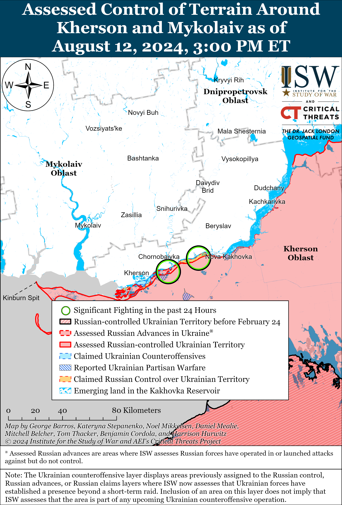](https://understandingwar.org/map/assessed-control-of-terrain-around-kherson-and-mykolaiv-as-of-august-12-2024-300-pm-et/)

**Russian Air, Missile, and Drone Campaign (Russian Objective: Target Ukrainian military and civilian infrastructure in the rear and on the frontline)**

Russian forces conducted limited missile strikes against Ukraine. Ukraine’s Southern Operational Command reported that Russian forces targeted Odesa and Mykolaiv oblasts with one Iskander-M ballistic missile each overnight on August 11 to 12, and Mykolaiv Oblast Military Administration Head Vitaly Kim stated that an Iskander-M in Mykolaiv Oblast landed in open fields and contained cluster munitions.[60] Russian sources claimed that Russian forces conducted a missile strike against an ammunition depot near Odesa City.[61]

Sumy Oblast officials reported that Russian forces increased the number of guided glide bomb strikes against Sumy Oblast border settlements to about 40-50 glide bombs per day and that Russian forces targeted unspecified infrastructure facilities in Sumy Oblast on August 11.[62]

**Russian Mobilization and Force Generation Efforts (Russian objective: Expand combat power without conducting general mobilization)**

Russian President Vladimir Putin and the Russian Ministry of Defense (MoD) emphasized Russia’s international defense ties at the Army-2024 International Military-Technical Forum in Moscow, likely in an effort to expand international military-technical cooperation and posture strong defense relations with Russia-friendly states.[63] Russian President Vladimir Putin opened the forum and claimed that foreign states desire to cooperate with the Russian defense industrial base (DIB) and that over 120 foreign companies will participate in the forum. The Russian MoD reported that over 1,000 domestic and foreign organizations will participate and present over 20 thousand military and dual-use products during the forum from August 12 to 14.[64] The MoD reported that delegations from 83 countries are attending the forum and that Belarus, Iran, the People’s Republic of China (PRC), and India will have formal representational stands.[65] The Russian MoD reported that Russian state arms exporter Rosoboronexport will sign international agreements with international companies present at the forum. The Russian MoD is likely attempting to use the Army-2024 Forum to reinforce defense cooperation with foreign countries as Russia has struggled to maintain weapons exports to perceived allies since the start of the full-scale invasion.[66]

Putin also called on the Russian DIB to work with small businesses and public and volunteer organizations and to prioritize the development of communications, protection and EW systems, drones, and AI.[67] Russian Defense Minister Andrei Belousov stated at the forum that Russian forces need high-precision weapons, new tactical methods to conduct military operations with unmanned systems and robotics, an effective management system that uses AI, and improved training for command staff.[68]

**Russian Technological Adaptations (Russian objective: Introduce technological innovations to optimize systems for use in Ukraine)**

Russia’s Army-2024 International Military-Technical Forum exhibited new and updated air defense systems and electronic warfare (EW) systems. Russian state-owned defense conglomerate Rostec developed a modified Pantsir-SMD-E air defense system that reportedly includes “mini missiles” to destroy drones.[69] The modified Pantsir system reportedly does not include cannon armament, unlike the Pantsit-S1. Rostec subsidiary Roselectronics reportedly developed the “Surikat-O/P” portable drone detection and EW system that can detect drones at a distance of at least a kilometer and suppress targets from a distance of at least 300 meters.[70]

**Ukrainian Defense Industrial Efforts (Ukrainian objective: Develop its defense industrial base to become more self-sufficient in cooperation with US, European, and international partners)**

*ISW is not publishing coverage of Ukrainian defense industrial efforts today.*

**Activities in Russian-occupied areas (Russian objective: Consolidate administrative control of annexed areas; forcibly integrate Ukrainian citizens into Russian sociocultural, economic, military, and governance systems)**

*ISW is not publishing coverage of activities in Russian-occupied areas today.*

**Russian Information Operations and Narratives**

Nothing significant to report.

**Significant activity in Belarus (Russian efforts to increase its military presence in Belarus and further integrate Belarus into Russian-favorable frameworks and Wagner Group activity in Belarus)**

The Belarusian Ministry of Defense (MoD) announced on August 12 that personnel of the Belarusian Air Force and Air Defense Forces departed Belarus for Russia to participate in a joint military exercise with Russian forces at the Ashuluk Training Ground in Russia’s Astrakhan Oblast.[71]

Belarus continues to deepen its defense cooperation with Russia. Belarusian Defense Minister Lieutenant General Viktor Khrenin met with Russian Defense Minister Andrei Belousov, Russian Federal Service for Military Technical Cooperation Head Dmitry Shugaev, and Russia’s state arms exporter Rosoboronexport Head Alexander Mikheev to discuss joint military technical cooperation on August 12 while in Moscow Oblast for the “Army 2024” military technical forum.[72] Khrenin stated that the current “complex military and political situation, global stability, and attempts of unprecedented pressure” allow Belarus to further pursue cooperation with its allies.[73]

**Note: ISW does not receive any classified material from any source, uses only publicly available information, and draws extensively on Russian, Ukrainian, and Western reporting and social media as well as commercially available satellite imagery and other geospatial data as the basis for these reports. References to all sources used are provided in the endnotes of each update.**

---

[1] http://kremlin dot ru/events/president/news/74856

[2] http://kremlin dot ru/events/president/news/74856

[3] https://t.me/svobodnieslova/5422 ; https://understandingwar.org/backgrounder/russian-offensive-campaign-assessment-august-10-2024

[4] http://kremlin dot ru/events/president/news/74856

[5] https://understandingwar.org/backgrounder/russian-offensive-campaign-assessment-august-10-2024; http://kremlin dot ru/events/president/news/74856

[6] http://kremlin dot ru/events/president/news/74856 ; https://understandingwar.org/backgrounder/russian-offensive-campaign-assessment-may-3-2024 ; https://t.me/arbat/1810

[7] https://isw.pub/UkrWar080824; http://kremlin dot ru/events/president/news/74856

[8] https://isw.pub/UkrWar081024; https://isw.pub/UkrWar081124

[9] http://kremlin dot ru/events/president/news/74856

[10] https://isw.pub/UkrWar111623 ; https://isw.pub/UkrWar030824 ; https://isw.pub/UkrWar021524 ; https://isw.pub/UkrWar070924 ; https://isw.pub/UkrWar070824

[11] http://kremlin dot ru/events/president/news/74856

[12] https://understandingwar.org/backgrounder/russian-offensive-campaign-assessment-august-11-2024 ; https://t.me/rybar/62688

[13] https://t.me/notes\_veterans/18746 ; https://t.me/SergeyKolyasnikov/61804 ; https://t.me/rusich\_army/16447 ; https://t.me/rusich\_army/16456 ; https://t.me/wargonzo/21517 ; https://t.me/yurasumy/17044 ; https://t.me/DnevnikDesantnika/13792 ; https://t.me/NgP\_raZVedka/18637

[14] https://t.me/yurasumy/17044; https://t.me/notes\_veterans/18746 ; https://t.me/SergeyKolyasnikov/61804

[15] https://t.me/rybar/62715 ; https://t.me/rusich\_army/16456 ; https://t.me/yurasumy/17044; https://t.me/DnevnikDesantnika/13768 ; https://t.me/motopatriot/26116 ; https://t.me/RVvoenkor/74562

[16] https://t.me/creamy\_caprice/6348; https://t.me/Tatarinov\_R/39456 ; https://t.me/creamy\_caprice/6350; https://t.me/control\_sigma/32959

[17] https://x.com/giK1893/status/1822778192794374330; https://x.com/giK1893/status/1822778195868885344; https://t.me/dva\_majors/49508; ; https://x.com/giK1893/status/1822715340507250989; https://t.me/warriorofnorth/2026; https://t.me/creamy\_caprice/6346 ; https://t.me/tass\_agency/265894 ; https://t.me/rybar/62715 ; https://t.me/mod\_russia/42053

[18] https://x.com/neonhandrail/status/1822856607509758299; https://x.com/GirkinGirkin/status/1822850917579808944; https://x.com/bayraktar\_1love/status/1823024181287526671; https://x.com/Grimm\_Intel/status/1823025089811562579; https://t.me/BRAVO\_Team\_chanel/63 ; https://t.me/WarArchive\_ua/18471; https://t.me/BRAVO\_Team\_chanel/62 ; https://t.me/astrapress/61819 ; https://t.me/WarArchive\_ua/18458; https://t.me/notes\_veterans/18754 ; https://t.me/rybar/62715

[19] https://t.me/creamy\_caprice/6354; https://t.me/readovkanews/84714; https://t.me/creamy\_caprice/6357; https://t.me/vorposte/59656; https://x.com/emilkastehelmi/status/1823005481410986248; https://t.me/divgen/52504; https://x.com/moklasen/status/1822998602664305122; https://t.me/rustroyka1945/17742; https://t.me/creamy\_caprice/6362; https://t.me/vorposte/59656; https://x.com/giK1893/status/1822947654663348371;

[20] https://t.me/mod\_russia/42053

[21] https://t.me/WarArchive\_ua/18470; https://www.tiktok.com/@slepokura/video/7402168814663634182?\_r=1&\_t=8ooNXy03Auc

[22] https://t.me/dva\_majors/49584 ; https://t.me/RVvoenkor/74622 ; https://t.me/boris\_rozhin/133252 ; https://t.me/rybar/62700 ; https://t.me/rybar/62679 ; https://t.me/dva\_majors/49582 ; https://t.me/sashakots/48337 ; https://t.me/rusich\_army/16444 ; https://t.me/dva\_majors/49515; https://t.me/Mestb\_Dobroj\_Voli/12149 ; https://t.me/rybar/62700 ; https://t.me/NgP\_raZVedka/18628 ; https://t.me/DnevnikDesantnika/13761

[23] https://t.me/tass\_agency/265763 ; https://t.me/tass\_agency/265765 ; https://t.me/tass\_agency/265766 ; https://t.me/tass\_agency/265778

[24] https://www.interfax dot ru/russia/976192 ; https://t.me/tass\_agency/265883

[25] https://t.me/V\_Zelenskiy\_official/11347 ; https://t.me/osirskiy/799 ; https://armyinform.com dot ua/2024/08/12/na-danyj-chas-pid-nashym-kontrolem-blyzko-tysyachi-kvadratnyh-kilometriv-rf-golovnokomanduvach-zsu/

[26] https://t.me/V\_Zelenskiy\_official/11347 ; https://t.me/osirskiy/799 ; https://armyinform.com dot ua/2024/08/12/na-danyj-chas-pid-nashym-kontrolem-blyzko-tysyachi-kvadratnyh-kilometriv-rf-golovnokomanduvach-zsu/

[27] https://t.me/SBUkr/12599 ; https://suspilne dot media/811353-pozeza-na-zaporizkij-aes-ta-raketna-ataka-na-kiivsinu-900-den-vijni-onlajn/?anchor=live\_1723479829&utm\_source=copylink&utm\_medium=ps

[28] https://t.me/astrapress/61780

[29] https://x.com/Bielitzling/status/1822784631730577765; https://x.com/Bielitzling/status/1822799920488722798; https://x.com/Bielitzling/status/1822784634490376702; https://www.youtube.com/watch?v=vgthnq-Ls7I&t=343s

[30] https://www.facebook.com/GeneralStaff.ua/posts/pfbid02pDjvBkWpE8jdSEi5r3uSiscqVzbb8kcA2iseMdKwCV5qUgcMN1537WftTMgWsJwxl; https://www.facebook.com/GeneralStaff.ua/posts/pfbid02w17f3m52DLRjWadVuSvFyMVaUZcjwwvHKtNSF4G3LEBHHASCe1aK9sAHuNgoHm6Ll; https://www.facebook.com/GeneralStaff.ua/posts/pfbid0nDeiJJVSxshJ4E2jj4WsqQUu1Wh2anFDpR36usDfcYqBN6bA2rvxn4PGNgfFzoecl; https://t.me/synegubov/10701

[31] https://t.me/rybar/62700

[32] https://t.me/DPSUkr/21466

[33] https://t.me/otukharkiv/721

[34] https://t.me/rybar/62711

[35] https://www.facebook.com/GeneralStaff.ua/posts/pfbid02w17f3m52DLRjWadVuSvFyMVaUZcjwwvHKtNSF4G3LEBHHASCe1aK9sAHuNgoHm6Ll; https://www.facebook.com/GeneralStaff.ua/posts/pfbid02pDjvBkWpE8jdSEi5r3uSiscqVzbb8kcA2iseMdKwCV5qUgcMN1537WftTMgWsJwxl; https://www.facebook.com/GeneralStaff.ua/posts/pfbid0nDeiJJVSxshJ4E2jj4WsqQUu1Wh2anFDpR36usDfcYqBN6bA2rvxn4PGNgfFzoecl

[36] https://x.com/AudaxonX/status/1822976518286385581; https://t.me/BattalionSIGIRIYA/54

[37]https://www.facebook.com/GeneralStaff.ua/posts/pfbid02pDjvBkWpE8jdSEi5r3uSiscqVzbb8kcA2iseMdKwCV5qUgcMN1537WftTMgWsJwxl ; https://www.facebook.com/GeneralStaff.ua/posts/pfbid02w17f3m52DLRjWadVuSvFyMVaUZcjwwvHKtNSF4G3LEBHHASCe1aK9sAHuNgoHm6Ll ; https://www.facebook.com/GeneralStaff.ua/posts/pfbid0nDeiJJVSxshJ4E2jj4WsqQUu1Wh2anFDpR36usDfcYqBN6bA2rvxn4PGNgfFzoecl

[38] https://x.com/AudaxonX/status/1822976518286385581; https://t.me/BattalionSIGIRIYA/54

[39] https://t [dot] me/creamy\_caprice/6361; https://t.me/kateniata56rubak/138

[40]https://www.facebook.com/GeneralStaff.ua/posts/pfbid02pDjvBkWpE8jdSEi5r3uSiscqVzbb8kcA2iseMdKwCV5qUgcMN1537WftTMgWsJwxl ; https://www.facebook.com/GeneralStaff.ua/posts/pfbid02w17f3m52DLRjWadVuSvFyMVaUZcjwwvHKtNSF4G3LEBHHASCe1aK9sAHuNgoHm6Ll ; https://www.facebook.com/GeneralStaff.ua/posts/pfbid0nDeiJJVSxshJ4E2jj4WsqQUu1Wh2anFDpR36usDfcYqBN6bA2rvxn4PGNgfFzoecl

[41] https://t.me/WarArchive\_ua/18456; https://t.me/voron1OO/49

[42] https://x.com/small10space/status/1822705864630845538; https://x.com/Bielitzling/status/1822709342619201573; https://x.com/Bielitzling/status/1822710889725972758

[43] https://t.me/z\_arhiv/27600 ; https://t.me/z\_arhiv/27597

[44]https://www.facebook.com/GeneralStaff.ua/posts/pfbid02pDjvBkWpE8jdSEi5r3uSiscqVzbb8kcA2iseMdKwCV5qUgcMN1537WftTMgWsJwxl ; https://www.facebook.com/GeneralStaff.ua/posts/pfbid02w17f3m52DLRjWadVuSvFyMVaUZcjwwvHKtNSF4G3LEBHHASCe1aK9sAHuNgoHm6Ll ; https://www.facebook.com/GeneralStaff.ua/posts/pfbid0nDeiJJVSxshJ4E2jj4WsqQUu1Wh2anFDpR36usDfcYqBN6bA2rvxn4PGNgfFzoecl

[45] https://t.me/creamy\_caprice/6364; https://www.facebook.com/35POLKNGU/videos/1258519201980598

[46] https://t.me/tass\_agency/265927; https://t.me/voenkorKotenok/58152 ; https://t.me/mod\_russia/42075

[47] https://suspilnedot media/811353-pozeza-na-zaporizkij-aes-ta-raketna-ataka-na-kiivsinu-900-den-vijni-onlajn/?anchor=live\_1723471487&utm\_source=copylink&utm\_medium=ps

[48]https://www.facebook.com/GeneralStaff.ua/posts/pfbid02pDjvBkWpE8jdSEi5r3uSiscqVzbb8kcA2iseMdKwCV5qUgcMN1537WftTMgWsJwxl ; https://www.facebook.com/GeneralStaff.ua/posts/pfbid02w17f3m52DLRjWadVuSvFyMVaUZcjwwvHKtNSF4G3LEBHHASCe1aK9sAHuNgoHm6Ll ; https://www.facebook.com/GeneralStaff.ua/posts/pfbid0nDeiJJVSxshJ4E2jj4WsqQUu1Wh2anFDpR36usDfcYqBN6bA2rvxn4PGNgfFzoecl

[49] https://www.facebook.com/GeneralStaff.ua/posts/pfbid02pDjvBkWpE8jdSEi5r3uSiscqVzbb8kcA2iseMdKwCV5qUgcMN1537WftTMgWsJwxl ; https://www.facebook.com/GeneralStaff.ua/posts/pfbid02w17f3m52DLRjWadVuSvFyMVaUZcjwwvHKtNSF4G3LEBHHASCe1aK9sAHuNgoHm6Ll ; https://www.facebook.com/GeneralStaff.ua/posts/pfbid0nDeiJJVSxshJ4E2jj4WsqQUu1Wh2anFDpR36usDfcYqBN6bA2rvxn4PGNgfFzoecl

[50] https://www.facebook.com/GeneralStaff.ua/posts/pfbid02pDjvBkWpE8jdSEi5r3uSiscqVzbb8kcA2iseMdKwCV5qUgcMN1537WftTMgWsJwxl ; https://www.facebook.com/GeneralStaff.ua/posts/pfbid02w17f3m52DLRjWadVuSvFyMVaUZcjwwvHKtNSF4G3LEBHHASCe1aK9sAHuNgoHm6Ll ; https://www.facebook.com/GeneralStaff.ua/posts/pfbid0nDeiJJVSxshJ4E2jj4WsqQUu1Wh2anFDpR36usDfcYqBN6bA2rvxn4PGNgfFzoecl

[51] https://t.me/boris\_rozhin/133342

[52] https://t.me/wargonzo/21520; https://www.facebook.com/OperationalCommandSouth/posts/pfbid0EnVqCCavbnr4ExzBNjqyXG1MsZRZLdCnZqJLUJL1nz7riEhmMw3cCSYF2P9Y8cjgl ; https://t.me/SJTF\_Odes/10901; https://t.me/wargonzo/21520

[53] https://t.me/voin\_dv/10228 ; https://t.me/ZSU\_Hunter\_2\_0/2697

[54] https://t.me/tass\_agency/265701 ; https://t.me/tass\_agency/265702 ; https://t.me/tass\_agency/265704 ; https://t.me/rybar/62682 ; https://t.me/tass\_agency/265708 ; https://t.me/tass\_agency/265709 ; https://t.me/bbcrussian/68944

[55] https://t.me/tass\_agency/265705 ; https://t.me/tass\_agency/265723 ; https://t.me/tass\_agency/265724 ; https://t.me/MID\_Russia/44069 ; https://t.me/tass\_agency/265812

[56] https://www.iaea.org/newscenter/pressreleases/update-242-iaea-director-general-statement-on-situation-in-ukraine

[57] https://understandingwar.org/backgrounder/russian-offensive-campaign-assessment-august-11-2024

[58] https://www.facebook.com/GeneralStaff.ua/posts/pfbid02pDjvBkWpE8jdSEi5r3uSiscqVzbb8kcA2iseMdKwCV5qUgcMN1537WftTMgWsJwxl; https://www.facebook.com/GeneralStaff.ua/posts/pfbid02w17f3m52DLRjWadVuSvFyMVaUZcjwwvHKtNSF4G3LEBHHASCe1aK9sAHuNgoHm6Ll; https://www.facebook.com/GeneralStaff.ua/posts/pfbid0nDeiJJVSxshJ4E2jj4WsqQUu1Wh2anFDpR36usDfcYqBN6bA2rvxn4PGNgfFzoecl; https://www.facebook.com/OperationalCommandSouth/posts/pfbid0EnVqCCavbnr4ExzBNjqyXG1MsZRZLdCnZqJLUJL1nz7riEhmMw3cCSYF2P9Y8cjgl ; https://t.me/SJTF\_Odes/10901

[59] https://t.me/NeoficialniyBeZsonoV/38557; https://t.me/NeoficialniyBeZsonoV/38552; https://t.me/dva\_majors/49502

[60] https://t.me/mykolaivskaODA/10949; https://armyinform.com dot ua/2024/08/12/protyvnyk-atakuvav-mykolayivshhynu-iskanderom/; https://t.me/SJTF\_Odes/10900

[61] https://t.me/tass\_agency/265694; https://t.me/voenkorKotenok/58149

[62] https://t.me/Sumy\_news\_ODA/28885; https://armyinform dot com.ua/2024/08/11/rosiyany-zavdaly-udaru-po-sumah/; https://armyinform dot com.ua/2024/08/12/do-50-kabiv-za-dobu-na-sumshhyni-suttyevo-zbilshylasya-kilkist-aviaudariv/

[63] https://t.me/mod\_russia/42034; https://t.me/mod\_russia/42035; https://t.me/mod\_russia/42037 ; https://t.me/tass\_agency/265777

[64] https://t.me/mod\_russia/42034; https://t.me/mod\_russia/42035; https://t.me/mod\_russia/42037 ; https://t.me/tass\_agency/265777

[65] https://t.me/mod\_russia/42041; https://t.me/mod\_russia/42040

[66] https://understandingwar.org/backgrounder/russian-offensive-campaign-assessment-march-23-2024

[67] https://t.me/mod\_russia/42045 ; https://t.me/tass\_agency/265791 ; https://t.me/RVvoenkor/74610 ; https://t.me/MID\_Russia/44070

[68] https://t.me/mod\_russia/42048 ; https://t.me/tass\_agency/265808 ; https://t.me/tass\_agency/265814

[69] https://tass dot ru/armiya-i-opk/21582043; https://t.me/tass\_agency/265779; https://www.vedomosti dot ru/technology/news/2024/08/12/1055247-rosteh-pokazal

[70] https://rostec dot ru/news/rostekh-sozdal-nosimyy-kompleks-reb-laquo-surikat-raquo-dlya-zashchity-lichnogo-sostava/

[71] https://t.me/modmilby/41008

[72] https://t.me/modmilby/40994; https://t.me/modmilby/41000; https://t.me/tass\_agency/265825 ; https://t.me/modmilby/4099

[73] https://t.me/modmilby/40997
