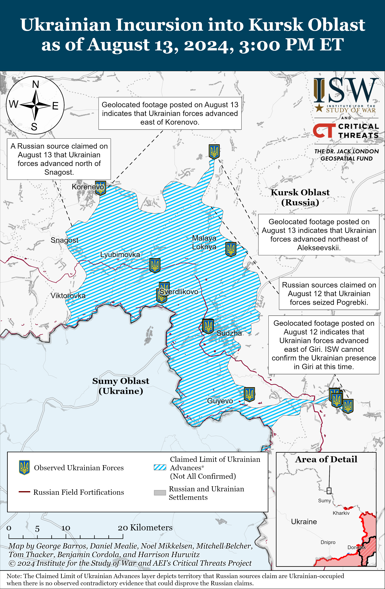
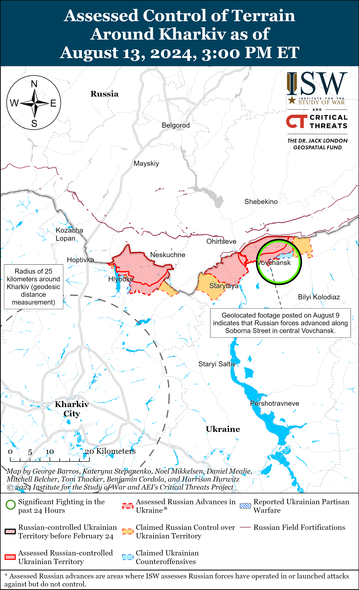
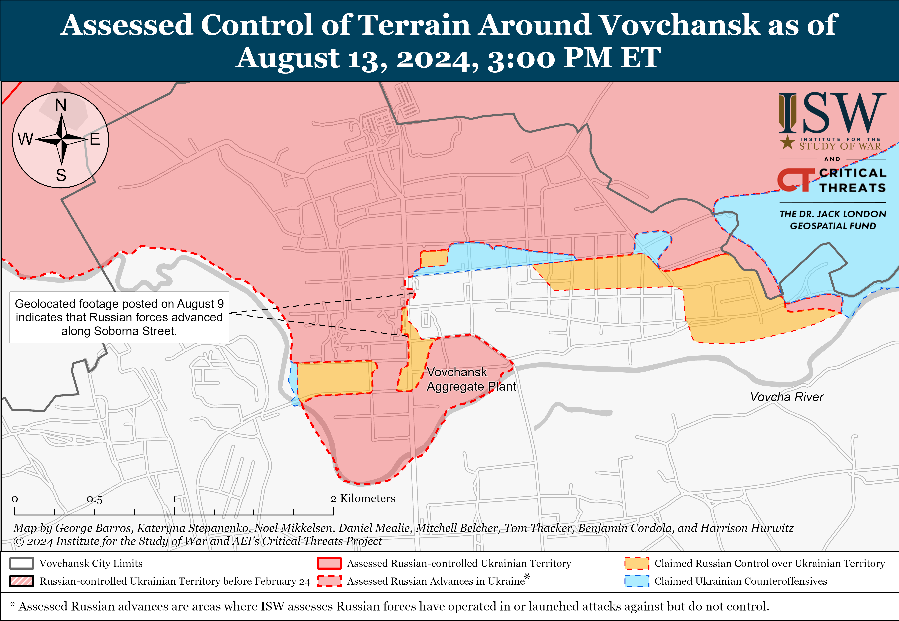
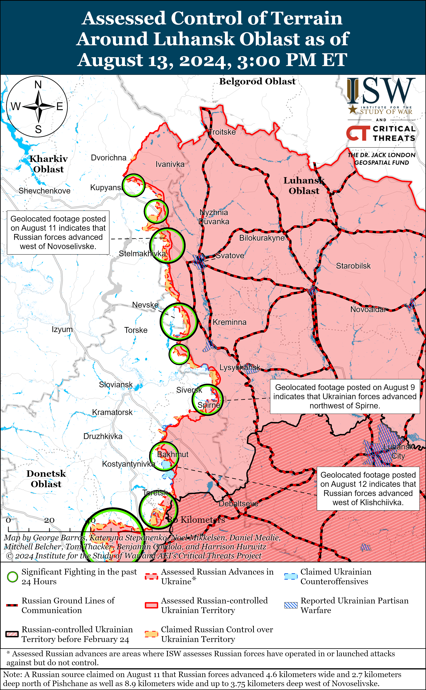
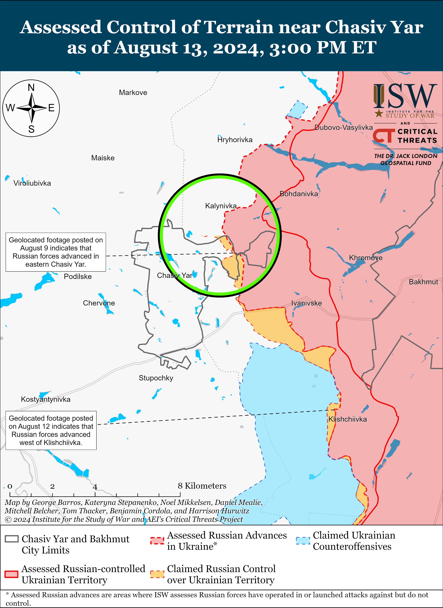
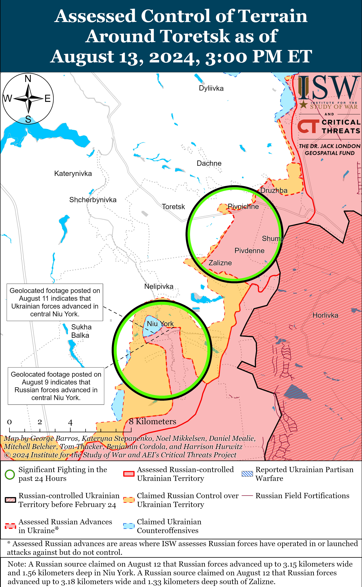
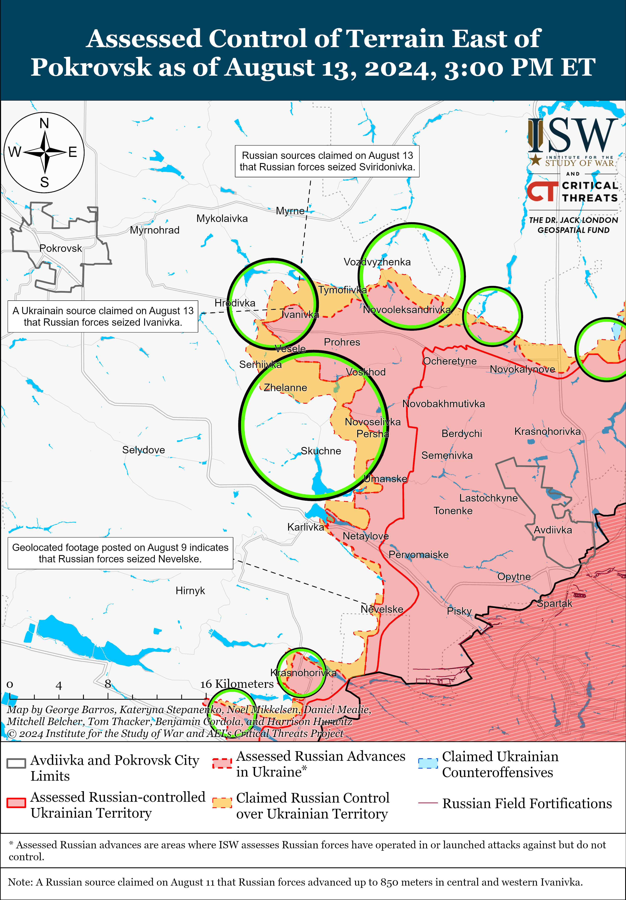
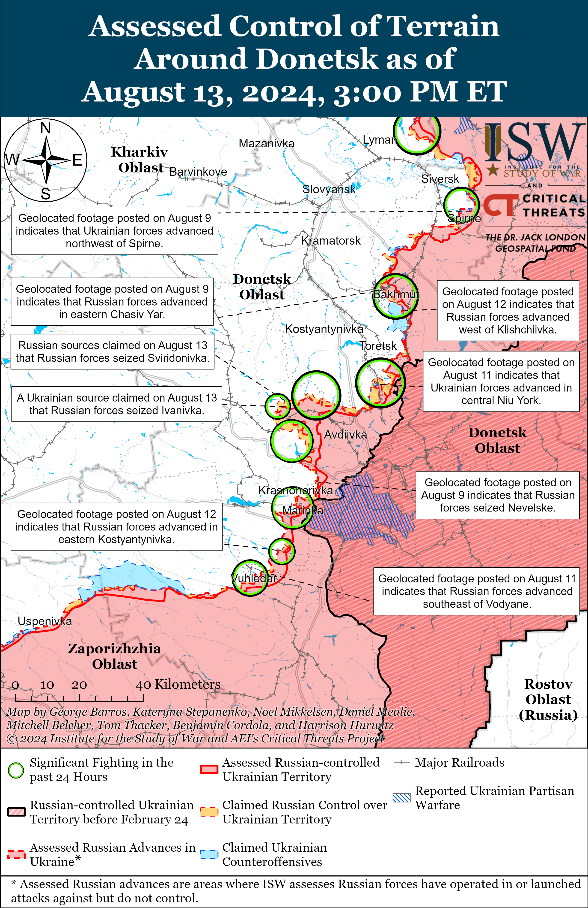
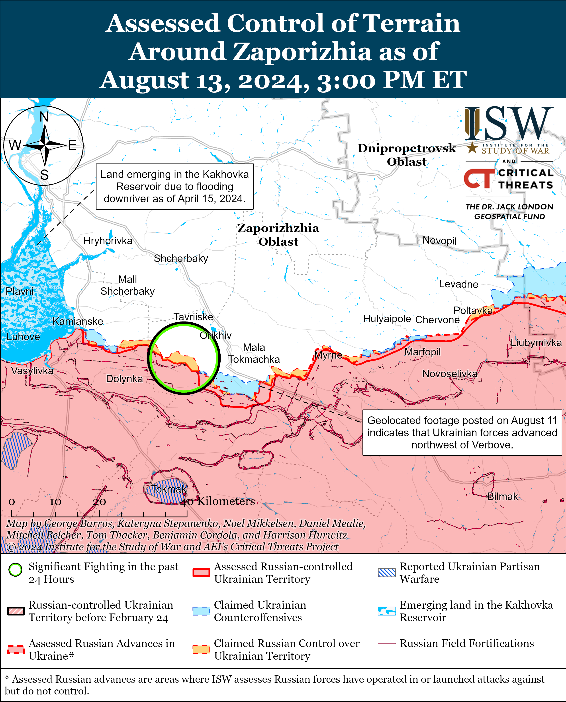
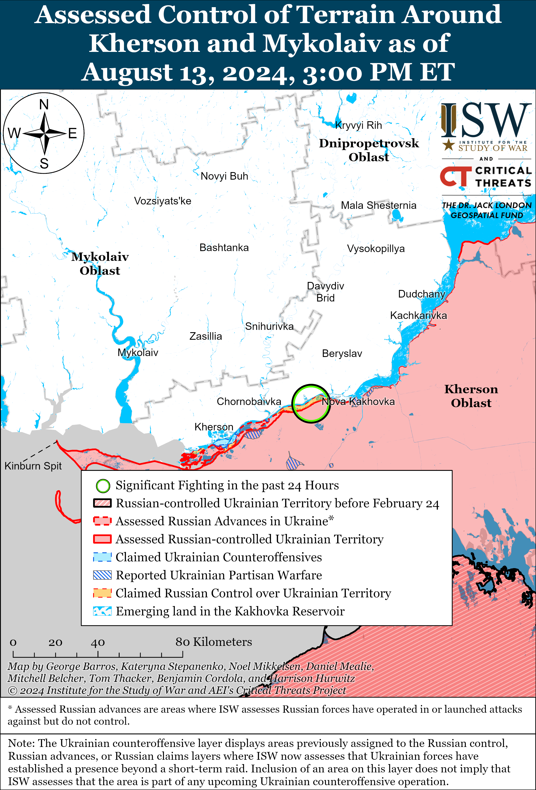

# Russian Offensive Campaign Assessment, August 13, 2024

**Angelica Evans, Nicole Wolkov, Kateryna Stepanenko, Davit Gasparyan, and Frederick W. Kagan**

**August 13, 2024, 9:30pm ET**

**Click**[**here**](https://storymaps.arcgis.com/stories/36a7f6a6f5a9448496de641cf64bd375)**to see ISW’s interactive map of the Russian invasion of Ukraine. This map is updated daily alongside the static maps present in this report.**

**Click**[**here**](https://understandingwar.maps.arcgis.com/apps/instant/3dviewer/index.html?appid=1602762dbcde419bb957dea358449580)**to see ISW’s 3D control of terrain topographic map of Ukraine. Use of a computer (not a mobile device) is strongly recommended for using this data-heavy tool.**

**Click**[**here**](https://storymaps.arcgis.com/stories/733fe90805894bfc8562d90b106aa895)**to access ISW’s archive of interactive time-lapse maps of the Russian invasion of Ukraine. These maps complement the static control-of-terrain map that ISW produces daily by showing a dynamic frontline. ISW will update this time-lapse map archive monthly.**

**Note: The data cut-off for this product was 1:30pm ET on August 13. ISW will cover subsequent reports in the August 14 Russian Offensive Campaign Assessment. [NOTE:***Russian sources are currently shifting much of their reporting to cover the Ukrainian incursion into Kursk Oblast and as a result are not providing the same level of detail about the situation along the frontline in Ukraine.***]**

**Ukrainian President Volodymyr Zelensky and other senior Ukrainian officials provided updates about the ongoing Ukrainian incursion into Kursk Oblast and outlined several Ukrainian objectives of the operations in the area.**Zelensky stated on August 3 that Ukrainian forces “control” 74 localities in Kursk Oblast.[1] It is unclear if Zelensky meant that Ukrainian forces are operating in 74 settlements or if he was referring to another type of geographic administrative units. ISW has observed claims and geolocated footage indicating that Ukrainian forces are operating in or near roughly 41 settlements in Kursk Oblast as of August 13, although there are many extremely small settlements and localities within this area that ISW has not included in this count. **Discrepancies between Ukrainian official reporting and ISW’s observed claims and geolocated footage are not a refutation of Ukrainian official reporting but rather are a result of the inherent limitations of ISW’s open-source methodology and commitment to using only publicly available information.**ISW does not assess that Ukrainian forces control all of the territory within the maximalist extent of claimed Ukrainian advances according to the definition of “control” that ISW uses. Zelensky also stated that Ukrainian forces continue to advance in Kursk Oblast and grow Ukraine’s “exchange fund,” likely referring to Russian military personnel taken as prisoners of war (POWs).[2] Zelensky stated that Russian forces had conducted almost 2,100 artillery strikes from Kursk Oblast against Sumy Oblast since June 1, 2024, and that Ukraine’s operations into Kursk Oblast are intended to secure Ukraine’s borders from the Russian military.[3] Ukrainian Ministry of Foreign Affairs (MFA) Spokesperson Heorhiy Tykhyi stated on August 13 that Ukraine is not interested in seizing territory in Kursk Oblast.[4] Tykhyi stated that Ukraine needs to protect itself from Russian strikes and push Russian forces away from Russian border areas that Russia uses to strike Ukraine. Tykhyi also noted that Ukrainian operations into Kursk Oblast prevent the Russian military from transferring additional military units to Donetsk Oblast and complicate Russian military logistics.

Tykhyi emphasized that Ukraine is not violating international law and is within its rights to defend itself from Russian aggression, and US officials reiterated a similar sentiment on August 12 and 13. US National Security Spokesperson John Kirby and US State Department Deputy Spokesperson Vedant Patel stated on August 12 and 13 in response to questions about Russia’s reactions to Ukrainian operations in Kursk Oblast that Russia is conducting a war of aggression against Ukraine and that a quick solution to the Ukrainian incursion into Russia would be for Russian forces to leave Ukraine.[5]

**Russian milbloggers claimed that Ukrainian forces continue to advance in Kursk Oblast amid Russian attempts to stabilize the frontline in the area.**Russian milbloggers claimed that Russian forces have not completely stabilized the situation in Kursk Oblast despite ongoing efforts to stabilize the frontline and repel Ukrainian attacks.[6] A Russian milblogger claimed that Ukrainian forces advanced in the fields north of Snagost (south of Korenovo), and geolocated footage published on August 13 indicates that Ukrainian forces recently advanced northeast of Korenovo.[7] The Russian Ministry of Defense (MoD) and other Russian sources claimed that Russian forces repelled Ukrainian attacks near Obshchy Kolodez (northeast of Korenevo and 30 kilometers from the international border) and Alekseevsky (northwest of Korenovo and 27km from the international border), and geolocated footage published on August 13 indicates that Ukrainian forces advanced northeast of Alekseevsky.[8] Russian milbloggers claimed that Ukrainian forces continue attacking Koronevo and Tolpino (just north of Koronevo).[9] Russian milbloggers also claimed that Ukrainian forces seized Pogrebki (north of Sudzha and 17km from the international border).[10] A Russian milblogger claimed that Ukrainian forces attempted to gain a foothold near Bolshoye Soldatskoye (northeast of Sudzha and 27km from the international border).[11] Geolocated footage published on August 12 shows Ukrainian forces operating in eastern Plekhovo (south of Sudzha), and Russian milbloggers claimed that fighting was ongoing in the settlement as of the evening of August 12, although a milblogger later claimed that Russian forces repelled Ukrainian forces from the settlement on August 13.[12] Geolocated footage published on August 12 indicates that Ukrainian forces advanced east of Giri (southwest of Sudzha), although ISW cannot confirm a Ukrainian presence in Giri at this time.[13] Russian milbloggers claimed that Russian forces repelled a Ukrainian attack in Giri, however.[14] Geolocated footage published on August 12 and 13 showing Ukrainian forces operating well within the maximalist claimed limit of Ukrainian advances indicates that Ukrainian forces continue operating closer to the international border in Kursk Oblast and within Sudzha.[15] Russian milbloggers claimed on August 13 that Russian forces continued to repel Ukrainian attempts to cross the Kolotilovka border checkpoint in Belgorod Oblast (on the international border southeast of Sudzha and northwest of Belgorod City).[16]

**The Russian military command may be pulling select elements of Russian irregular units from Donetsk Oblast to address the Ukrainian incursion in Kursk Oblast.** Russian sources claimed as of August 12 and 13 that elements of the Russian “Pyatnashka” Brigade’s “Sarmat” Battalion and the Russian Volunteer Crops recently transferred to Kursk Oblast.[17] ISW has recently observed claims that elements of the “Sarmat” Battalion and other elements of the “Pyatnashka” Brigade and Russian Volunteer Corps are operating in the Chasiv Yar, Toretsk, and Pokrovsk directions in Donetsk Oblast.[18] Russian milbloggers previously claimed that elements of the “Dikaya Division of Donbas,” the “Pyatnashka” Brigade, the “Arbat” Separate Guards Special Purpose Battalion, and the “Night Wolves” drone detachment responded to the incursion and quickly redeployed to Kursk Oblast, and ISW had previously observed these units purportedly operating throughout Donetsk Oblast.[19] Irregular battalions such as the “Sarmat” Battalion are almost never fully staffed to the doctrinal end strength and even when deployed in full are still largely comprised of relatively small units. Some elements of these irregular units likely remain in the Chasiv Yar, Toretsk, and Pokrovsk directions as these are the Russian military’s assessed priority sectors of the frontline in Ukraine and the Kremlin and Russian military command are unlikely to pull entire units actively engaged in combat operations from these priority sectors to address the Ukrainian incursion into Kursk Oblast.[20]

**The Russian military command could also be redeploying units that were previously intended to relieve or reinforce frontline units from rear areas in Donetsk Oblast to Kursk Oblast, and such a redeployment could affect the tempo of Russian offensive operations in the Russian military’s assessed priority sectors over time. ISW would likely not observe confirmation of such re-deployments in the open source and is not prepared to offer assessments about the tempo of Russian operations in those sectors at this time.** A prominent Russian milblogger and former Storm-Z instructor claimed on August 9 that the Russian military command is redeploying operational reserves from the Kharkiv direction and other unspecified directions where Russian forces have achieved “limited successes” in recent months.[21] The Russian military command may have re-deployed unspecified units that were previously intended to relieve or reinforce frontline Russian units from rear areas of the Chasiv Yar, Toretsk, or Pokrovsk directions, which could affect Russia’s ability to sustain the tempo of its offensive operations in western Donetsk Oblast in the medium-term. It is unlikely that such redeployments would immediately affect the tempo of Russian offensive operations, however, and recent reports that Russian forces are struggling to make further advances in the Chasiv Yar, Toretsk, and Pokrovsk directions are not likely indicative of such redeployments.[22] It is not uncommon for Russian offensive operations to stall in one sector before intensifying in another as Russian forces have historically struggled to conduct simultaneous large-scale offensive operations and are prone to conducting offensive operations in “pulses” along different sectors of the front.[23] Russian forces may be entering a brief lull before renewing offensive operations in one of these three sectors, and it would likely take several weeks to observe any possible impacts of such redeployments on Russian operations in Donetsk Oblast. Russian authorities will likely remain extremely averse to pulling Russian military units engaged in combat from the Chasiv Yar, Toretsk, or Pokrovsk directions and will likely continue deploying limited numbers of irregular forces to Kursk Oblast due to concerns about further slowing the tempo of Russian operations in these higher priority directions.

**Russian authorities appear to be largely relying on Russian conscripts, and elements of some regular and irregular military units pulled from less critical sectors of the frontline to address the ongoing Ukrainian incursion, however.** Russian milbloggers claimed that Russian Federal Security Service [FSB] border guards, Russian conscripts and reserves, and elements of the Chechen “Akhmat” Spetsnaz responded to the Ukrainian incursion on August 6 and 7, and Chechen “Akhmat” Spetsnaz forces, including elements of the “Aida” Battalion, have continued to engage Ukrainian forces in Kursk Oblast.[24] Elements of the Chechen “Akhmat” Spetsnaz are also reportedly operating throughout the frontline in Ukraine, including in Kharkiv, Luhansk, and Donetsk oblasts.[25] Elements of the Russian 810th Naval Infantry Brigade (Black Sea Fleet) and two unspecified airborne (VDV) battalions have also reportedly redeployed from the Kherson direction to Kursk Oblast, and ISW has also observed recent claims that elements of the 810th Naval Infantry Brigade were recently operating near Vovchansk, Kharkiv Oblast.[26] The Russian MoD confirmed on August 13 that artillery elements of the Russian Northern Grouping of Forces were redeployed from northern Kharkiv Oblast to Kursk Oblast following previous Russian and Ukrainian reporting about such redeployments.[27]

Two Ukrainian military observers recently stated that elements of the Russian 38th and 64th motorized rifle brigades (both of the 35th Combined Arms Army [CAA], Eastern Military District [EMD]) recently re-deployed to Kursk Oblast, and unspecified elements of the 38th and 64th motorized rifle brigade were recently reportedly operating near Hulyaipole (western Zaporizhia Oblast).[28] The Ukrainian military observers also stated that elements of the Russian 272nd Motorized Rifle Regiment (47th Tank Division, 1st Guards Tank Army [GTA], Moscow Military District [MMD]) and elements of the 488th Motorized Rifle Regiment (144th Motorized Rifle Division, 20th CAA, MMD) recently redeployed from the Kupyansk direction to Kursk Oblast, which is consistent with recent claims about these units’ locations.[29] Russian conscripts, including conscripts of the Russian 488th Motorized Rifle Regiment and the 1428th Motorized Rifle Regiment (150th Motorized Rifle Division, 8th CAA, Southern Military District [SMD]), have also reportedly engaged Ukrainian forces in Kursk Oblast.[30] ISW cannot independently verify any of these reports. Redeployments of conscripts, elements of the Northern Grouping of Forces, and select units from less critical frontline areas in Ukraine would suggest that the Russian military command has determined that possible disruptions to the offensive operations in northern Kharkiv Oblast and other less-critical frontline areas are an acceptable risk to adequately respond to the Ukrainian incursion in Kursk Oblast.

**Russian President Vladimir Putin reportedly appointed Russian Presidential Aid Aide Alexei Dyumin to supervise Russia’s “counterterrorism operation” in Kursk Oblast on August 12.[31]**Russian State Duma Deputy from Kursk Oblast Nikolai Ivanov claimed that his unnamed sources confirmed that Putin entrusted Dyumin with overseeing the counterterrorist operation in Kursk Oblast after inviting him for an evening meeting on August 12.[32] Dyumin was the only non-cabinet member not connected with the military or security services who was present at Putin‘s meeting with Russian military, security, and federal and regional government officials about the situation in Belgorod, Bryansk, and Kursk oblasts on August 12.[33] Kremlin-affiliated milbloggers and Russian insider sources similarly claimed that Dyumin assumed full powers to address the Ukrainian incursion into Kursk Oblast, but the Kremlin did not publish an official confirmation of Dyumin’s assignment.[34] One insider source claimed that Putin directed Dyumin to coordinate all agencies involved in repelling Ukrainian incursion in Kursk Oblast.[35]One Kremlin-affiliated milblogger claimed that he had seen a state media report announcing that Dyumin became the commander of the Russian Sever (northern) direction in Ukraine, but later claimed that he received information to the contrary.[36] Dyumin is a trusted official within Putin’s close circle who is Putin’s former bodyguard and former Tula Oblast governor and reportedly played a decisive role in negotiations to end the Wagner Group armed rebellion in June 2023.[37] Dyumin’s appointment is not inherently noteworthy as it is likely part of Putin’s efforts to ensure that his agencies are actively working in a coordinated fashion and under the direct control of his presidential administration to address the Ukrainian incursion into Kursk Oblast and that he remains apprised of the situation.

Dyumin’s alleged appointment sparked widespread speculation among Russian milbloggers and political commentators about Putin’s disappointment in Russian security agencies and speculations about an upcoming military-political reshuffling. Several Kremlin-affiliated milbloggers claimed that Dyumin’s appointment was a sign that “Putin’s team” was taking full control over the situation in Kursk Oblast after Russian security forces failed to resolve the situation without Moscow’s direct intervention over the past week.[38] Several milbloggers also suggested that Dyumin’s appointment means that Putin seeks to find out why and how he was deceived about the real situation in Kursk Oblast, and many speculated that Dyumin’s report will determine the fate of several high-ranking Russian officials and commanders.[39] Some milblogggers and political commentators continued to speculate that Dyumin is preparing to become the next defense minister.[40] This speculation is not new, however, given that some Russian milbloggers have long advocated for Dyumin’s to become defense minister.[41]

**Russian officials continue to undermine a long-standing Kremlin information operation that falsely portrays Ukraine as unwilling to engage in legitimate, good-faith negotiations and places the onus for peace negotiations on Ukraine.**Russian First Deputy Permanent Representative to the United Nations (UN) Dmitry Polyansky claimed on August 13 that Ukrainian authorities chose “escalation” and further military operations when Ukraine began its incursion into Kursk Oblast.[42] Polyansky claimed that Ukraine deserves nothing but “total defeat and unconditional capitulation” in response to its incursion. ISW continues to assess that the Kremlin is only interested in a negotiated settlement that results in complete Ukrainian capitulation and that any Russian statements to the contrary are intended to delude the West into making pre-emptive concessions on Ukraine’s sovereignty and territory integrity.[43]

**Russian authorities fined Telegram and WhatsApp four million rubles ($44,000) each for failing to remove “prohibited” content on August 13.[44]**Moscow’s Tagansky District Court fined Telegram four million rubles in November 2023 for failing to remove false information about the Russian Armed Forces and information aimed at destabilizing Russia.[45]ISW has previously observed reports that the Russian government is considering stricter measures to directly censor critical voices on Russian social media as part of its efforts to cement control over the Russian information space. This includes requiring applications such as Telegram to develop new rules for user verification and content moderation.[46]

**Key Takeaways:**

- **Ukrainian President Volodymyr Zelensky and other senior Ukrainian officials provided updates about the ongoing Ukrainian incursion into Kursk Oblast and outlined several Ukrainian objectives of the operations in the area.**
- **Russian milbloggers claimed that Ukrainian forces continue to advance in Kursk Oblast amid Russian attempts to stabilize the frontline in the area.**
- **The Russian military command may be pulling select elements of Russian irregular units from Donetsk Oblast to address the Ukrainian incursion in Kursk Oblast.**
- **Russian authorities appear to be largely relying on Russian conscripts, and elements of some regular and irregular military units pulled from less critical sectors of the frontline to address the ongoing Ukrainian incursion, however.**
- **Russian President Vladimir Putin reportedly appointed Russian Presidential Aid Aide Alexei Dyumin to supervise Russia’s “counterterrorism operation” in Kursk Oblast on August 12**
- **Russian officials continue to undermine a long-standing Kremlin information operation that falsely portrays Ukraine as unwilling to engage in legitimate, good-faith negotiations and places the onus for peace negotiations on Ukraine.**
- **Russian authorities fined Telegram and WhatsApp four million rubles ($44,000) each for failing to remove “prohibited” content on August 13.**
- **Russian forces recently advanced near Chasiv Yar and southwest of Donetsk City, and Ukrainian forces recently advanced in the Siversk direction and in western Zaporizhia Oblast.**
- **The Russian Ministry of Defense (MoD) continues to use the Army-2024 International Military-Technical Forum in Moscow to expand its international defense ties.**

[****](https://understandingwar.org/wp-content/uploads/2025/05/DraftUkraineCoT20August20132C202024.png)

***We do not report in detail on Russian war crimes because these activities are well-covered in Western media and do not directly affect the military operations we are assessing and forecasting. We will continue to evaluate and report on the effects of these criminal activities on the Ukrainian military and the Ukrainian population and specifically on combat in Ukrainian urban areas. We utterly condemn Russian violations of the laws of armed conflict and the Geneva Conventions and crimes against humanity even though we do not describe them in these reports.***

- Russian Main Effort – Eastern Ukraine (comprised of three subordinate main efforts)
- Russian Subordinate Main Effort #1 – Push Ukrainian forces back from the international border with Belgorod Oblast and approach to within tube artillery range of Kharkiv City
- Russian Subordinate Main Effort #2 – Capture the remainder of Luhansk Oblast and push westward into eastern Kharkiv Oblast and encircle northern Donetsk Oblast
- Russian Subordinate Main Effort #3 – Capture the entirety of Donetsk Oblast
- Russian Supporting Effort – Southern Axis
- Russian Air, Missile, and Drone Campaign
- Russian Mobilization and Force Generation Efforts
- Russian Technological Adaptations
- Activities in Russian-occupied areas
- Ukrainian Defense Industrial Base Efforts
- Russian Information Operations and Narratives
- Significant Activity in Belarus

**Russian Main Effort – Eastern Ukraine**

**Russian Subordinate Main Effort #1 – Kharkiv Oblast (Russian objective: Push Ukrainian forces back from the international border with Belgorod Oblast and approach to within tube artillery range of Kharkiv City)**

Russian forces continued offensive operations north and northeast of Kharkiv City on August 12 and August 13 but did not advance. The Ukrainian General Staff reported that battles continued north of Kharkiv City near Hlyboke and Lyptsi and northeast of Kharkiv City near Tykhe and Vovchansk on August 12 and 13.[47] The Ukrainian Kharkiv Group of Forces reported that Russian forces are committing elements of the 11th Tank Regiment (18th Motorized Rifle Division, 11th Army Corps [AC], Leningrad Military District [LMD]) to the Hlyboke area to replenish manpower losses.[48] The Kharkiv Group of Forces added that Russian forces replaced combat guards at Russian positions near Starytsya (west of Vovchansk) and carried out evacuations of personnel. The Kharkiv Group of Forces observed Russian forces setting up new evacuation points for elements of the Russian 138th Separate Motorized Rifle Brigade (6th Combined Arms Army [CAA], LMD) in Vovchank and noted that Russian forces continued assaults in the high-rise buildings area in Vovchansk.

**Russian Subordinate Main Effort #2 – Luhansk Oblast (Russian objective: Capture the remainder of Luhansk Oblast and push westward into eastern Kharkiv Oblast and northern Donetsk Oblast)**

Fighting continued along the Kupyansk-Svatove-Kreminna line on August 13, but there were no confirmed changes to the frontline. A Russian milblogger claimed that Russian forces advanced near Tabaivka (southeast of Kupyansk), but ISW has not observed confirmation of this claim.[49] The Ukrainian General Staff reported that Russian forces conducted attacks northeast of Kupyansk near Synkivka and Petropavlivka; southeast of Kupyansk near Andriivka, Kruhlyakivka, Stelmakhivka, Berestove, Tabaivka, Hlushivka, and Novoosynove; northwest of Kreminna near Makiivka, Druzhelyubivka, Novoyehorivka, Nevske, Novosadove, and Terny; west of Kreminna near Torske; and south of Kreminna in the Serebryanske forest area on August 12 and 13.[50]

[****](https://understandingwar.org/wp-content/uploads/2025/05/Luhansk20Battle20Map20Draft20August20132C202024.png)

**Russian Subordinate Main Effort #3 – Donetsk Oblast (Russian objective: Capture the entirety of Donetsk Oblast, the claimed territory of Russia’s proxies in Donbas)**

Ukrainian forces recently regained positions southeast of Siversk amid continued Russian assaults in the Siversk direction on August 13. Geolocated footage published on August 9 indicates that Ukrainian forces recently advanced west of Spirne (southeast of Siversk).[51] Russian forces continued offensive operations northeast of Siversk near Bilohorivka; east of Siversk near Verkhnokamyanske; and southeast of Siversk near Spirne on August 12 and 13.[52] Elements of the Russian 106th Guards Airborne (VDV) Division reportedly continue operating in the south of Siversk, in the Soledar direction.[53]

Russian forces recently made advances in the Chasiv Yar direction amid continued offensive operations on August 13. Geolocated footage published on August 12 indicates that Russian forces recently advanced near Klishchiivka (southeast of Chasiv Yar).[54] Fighting continued near Chasiv Yar, near Bohdanivka (northeast of Chasiv Yar) and Bila Hora (southwest of Chasiv Yar) on August 12 and 13.[55] Elements of the Russian 98th VDV Division reportedly continue operating in the Chasiv Yar direction.[56]

[****](https://understandingwar.org/wp-content/uploads/2025/05/Chasiv20Yar20Battle20Map20Draft20August20132C202024.png)

Russian forces continued offensive operations near Toretsk on August 11, but there were no confirmed changes to the frontline on August 13. Russian milbloggers claimed on August 12 and 13 that Russian forces advanced south of Zalizne (southeast of Toretsk), in Niu York (south of Toretsk), within Pivnichne (southeast of Toretsk); and southwest of Toretsk near Panteleymonivka.[57] Fighting continued near Toretsk, Zalizne, and near Niu York on August 12 and 13.[58] Ukrainian military observer Kostyantyn Mashovets stated that elements of the 74th Motorized Rifle Brigade (41st Combined Arms Army [CAA], Central Military District [CMD]) are operating near Pivnichne; elements of the Russian 132nd Motorized Rifle Brigade (1st Donetsk People’s Republic Army Corps [DNR AC]) and 35th Motorized Rifle Brigade (41st CAA, CMD) are operating in the direction of Niu York; and elements of the 132nd Motorized Rifle Brigade are also operating near Sukha Balka (southwest of Toretsk). [59]

Russian forces recently advanced east of Pokrovsk amid continued ground attacks on August 13. Mashovets and a Russian milblogger stated that Russian forces advanced in Ivanivka (east of Pokrovsk) on August 13, indicating that Russian forces likely seized the settlement.[60] Russian milboggers claimed on August 13 that Russian forces advanced near Hrodivka (northeast of Pokrovsk), Serhiivka (southeast of Pokrovsk), Zhelanne (southeast of Pokrovsk), and Svyrydonivka (east of Pokrovsk).[61] Russian forces continued offensive operations near Malynivka (northeast of Pokrovsk); near Vozdvyzhenka, Zelene Pole, Novooleksandrivka, Kalynove, Yelyzavetivka, and Hrodivka (all east of Pokrovsk); and near Novozhelanne, Skuchne, Ptyche, and Zhelanne (all southeast of Pokrovsk) on August 12 and 13.[62] Elements of the Russian 30th and 15th Motorized Rifle Brigade (2nd CAA, CMD) are operating near Ivanivka (east of Pokrovsk); elements of the Russian 27th Motorized Rifle Division (2nd CAA, CMD) and elements of the Russian 144th Motorized Rifle Brigade (40th Army Corps, 18th CAA, SMD) are operating near Novohrodivka (southeast of Pokrovsk)[63]

Russian forces recently advanced southwest of Donetsk City. Geolocated footage published on August 12 indicates that Russian forces recently advanced in eastern Kostyantynivka (southwest of Donetsk City).[64] Additional geolocated footage published on August 13 shows Ukrainian forces repelling a platoon-sized Russian mechanized assault south of Kostyantynivka.[65] A Russian milblogger claimed that fierce fighting is ongoing south of Vodyane (southwest of Donetsk City) near an unspecified section of the T-0524 Kostyantynivka-Vuhledar highway.[66] Russian forces conducted offensive operations near Kalynove (northeast of Donetsk City); near Krasnohorivka and Heorhiivka (both west of Donetsk City); and near Pobieda, Kostyantynivka, Paraskoviivka, and Vodyane (all southwest of Donetsk City) on August 12 and 13.[67] Drone operators of the Russian “Kaira” Detachment (39th Motorized Rifle Brigade, 68th AC, Eastern Military District [EMD]) are reportedly operating near Kostyantynivka.[68]

Russia forces continued ground attacks in the Donetsk-Zaporizhia Oblast border area, including near Vuhledar (southeast of Velyka Novosilka), on August 12 and 13.[69]

**Russian Supporting Effort – Southern Axis (Russian objective: Maintain frontline positions and secure rear areas against Ukrainian strikes)**

Ukrainian forces recently made marginal advances in western Zaporizhia Oblast amid continued fighting on August 13. Geolocated footage published on August 11 indicates that Ukrainian forces marginally advanced northwest of Verbove (east of Robotyne).[70] The Ukrainian General Staff reported that fighting continued near Novoandriivka (north of Robotyne) on August 12 and 13.[71] Elements of the Russian 247th Airborne (VDV) Regiment’s (7th VDV Division) 3rd Battalion are reportedly operating in the Orikhiv direction.[72]

The International Atomic Energy Agency (IAEA) stated on August 13 that it cannot confirm the cause of the August 11 fire at the Enerhodar and the Russian-occupied Zaporizhzhia Nuclear Power Plant (ZNPP).[73] Russian Acting Permanent Representative to the International Organizations in Vienna Roman Ustinov stated on August 13 that Russia is unsatisfied with the IAEA’s inability to provide a concrete assessment on the ZNPP fire and that he hopes that the IAEA will condemn Ukraine for allegedly causing the fire.[74] Russian sources claimed on August 11 and 12 that Ukrainian forces conducted a drone strike against the ZNPP’s cooling system and caused a fire at the plant on August 11.[75]

The Ukrainian General Staff reported that Ukrainian forces repelled Russian attacks in the east (left) bank Kherson Oblast on August 12 and 13.[76]

**Russian Air, Missile, and Drone Campaign (Russian Objective: Target Ukrainian military and civilian infrastructure in the rear and on the frontline)**

Russian forces launched a series of missile and drone strikes against Ukraine overnight on August 12 to 13. Ukraine’s Air Force reported that Russian forces launched two ballistic missiles of the Iskander-M or North Korean KN-23 type from Voronezh Oblast and 38 Shahed-136/131 drones from Kursk Oblast and Primorsko-Akhtarsk, Krasnodar Krai.[77] Ukraine’s Air Force reported that Ukrainian forces shot down 30 Shahed drones over Mykolaiv, Vinnytsia, Sumy, Kirovohrad, Kherson, Chernihiv, Dnipropetrovsk, and Cherkasy oblasts. Ukraine’s Southern Operational Command specified that Ukrainian forces shot down 15 Shahed drones over southern Ukraine.[78] The Sumy Oblast Military Administration reported that Russian forces launched an unspecified ”air missile strike” against infrastructure facilities in Sumy City on August 13.[79] The Russian MoD amplified footage purportedly showing the aftermath of the Russian Iskander missile strike against Myrhorod Air Base in Poltava Oblast, but ISW cannot independently verify the authenticity of this footage.[80] Kharkiv Oblast Prosecutor’s Office clarified those Russian forces used either a KN-23 or KN-24 missile (also known as Hwasong-11) in a missile strike on Bohodukhiv, Kharkiv Oblast on August 12.[81]

**Russian Mobilization and Force Generation Efforts (Russian objective: Expand combat power without conducting general mobilization)**

The Russian MoD continues to use the Army-2024 International Military-Technical Forum in Moscow to expand its international defense ties. Russian Defense Minister Andrei Belousov met with representatives from Vietnam, Laos, Mali, Myanmar, and the Central African Republic (CAR) at the forum on August 13 and signed a military cooperation agreement with Laos.[82] The Russian MoD claimed on August 12 that Russian state arms exporter Rosoboronexport will sign international agreements with international companies present at the forum.[83] Director of the Russian Federal Service for Military-Technical Cooperation (FSMTC) Dmitry Shugaev announced on the sidelines of the “Army-2024” forum that Russia is revoking licenses from foreign repair companies to repair Soviet military equipment.[84] Shugaev stated that this measure would help Russia counter the international transfer of Soviet equipment to Ukraine. A prominent Kremlin-affiliated Russian milblogger claimed that Russian defense industrial base (DIB) enterprises are working exclusively to fulfil the Russian government’s defense order to equip the Russian military in Ukraine and that output from increasing DIB production volumes will still go to the Russian military instead of foreign exports. The milblogger claimed that the Russian defense industry’s opportunities for earning money through foreign contracts are limited to maintaining and modernizing previously sold Russian and Soviet military equipment.[85]

The Russian government continues to propose new initiatives aimed at incentivizing volunteer recruitment among Russians facing criminal charges. The Russian Legal Information Agency (RAPSI) reported on August 13 that the Russian Supreme Court prepared a bill that will allow Russian officials to release individuals from criminal liability during a trial in the event that these individuals are called up for military service during mobilization or voluntarily sign contracts for military service in the Russian Armed Forces.[86] The Russian Supreme Court is considering extending a similar legal mechanism to convicts who were sentenced but did not have their sentences enter into the legal force – including at the appeal stage.

Russian federal subjects are reportedly struggling to meet recruitment rates to raise the necessary manpower to support Russia’s war effort in Ukraine. *Bloomberg*reported on August 13 that, according to three sources close to the Kremlin and Russian MoD, the Russian military is unable to maintain an even personnel replacement rate since Russian losses are at their highest since the start of the full-scale invasion.[87] An individual familiar with the matter told *Bloomberg*that Russian regional officials are, on average, unable to fill over a third of their recruitment quotas. Russian opposition outlet *Verstka*, citing a source in the Moscow Mayor’s Office, reported that Moscow recruited over 26,000 volunteers in 2024.[88] The source revealed that around 90 percent of volunteers who had signed contracts for military service in Ukraine with the Russian MoD have financial problems and that most recruits do not volunteer to fight out of ideological reasons. The source added that most of the recruits in Moscow are residents of other Russian regions and that Moscow and Moscow Oblast residents only make up 20 percent of all recruits. The source observed that 10 percent of new recruits are foreigners, mostly from Central Asian countries. The source noted that interest in voluntary military service decreased from over 3,000 recruits in Moscow in August 2023 to barely 1,000 interested recruits in June 2024.[89] Moscow Mayor Sergei Sobyanin claimed on August 13 that 43,000 Muscovites are currently fighting in Ukraine and that another 23,000 Muscovites will deploy to Ukraine as volunteers by the end of 2024.[90] Sobyanin claimed that tens of thousands of Muscovites have signed military service contracts with the Russian MoD or otherwise volunteered to fight in Ukraine and that Moscow Oblast has one of the largest groups of servicemembers fighting in Ukraine. Sobyanin claimed in July 2023 that 10,000 Muscovites were signed up for contract service with the Russian MoD and that another 20,000 were already fighting in Ukraine.[91]

Russian independent outlet *Mozhem Obyasnit* (We Can Explain), citing data published by the Russian Ministry of Internal Affairs (MVD), reported on August 13 that the number of bribery cases in Russia has increased 1.5 times since 2021 due to increases in corruption cases in the army and the Russian defense industrial base (DIB).[92] *Mozhem Obyasnit*compared registered bribery crimes data between January through June 2021, 2023, and 2024, and concluded that there were 55 percent more cases of someone accepting a bribe in the first half of 2024 than in 2021. *Mozhem Obyasnit*reported that there was a 51 percent increase in cases of individuals giving bribes over the same period. *Mozhem Obyasnit*cited a report by Transparency International – Russia, which concluded that corruption in the Russian defense sector is several times higher than in other fields.[93] *Mozhem Obyasnit*noted that corruption in the military and the DIB throughout Russia’s full-scale invasion of Ukraine are likely driving up corruption statistics in Russia. A Russian lawyer Vladimir Zherebenkov told *Mozhem Obyasnit*observed that these corruption cases may be explained by the ongoing Russian efforts to hold accountable corrupt officials, including recent arrests of senior Russian MoD officials.

The Russian Federal Security Service (FSB) reported on August 13 that it detained an unnamed Southern Military District (SMD) employee on suspicion of treason and transferring information to the Ukrainian military and published footage of her arrest.[94]

**Russian Technological Adaptations (Russian objective: Introduce technological innovations to optimize systems for use in Ukraine)**

A representative of the Tula Instrument Design Bureau (part of the Russian state-owned defense conglomerate Rostec’s High-Precision Complexes holding) announced during the “Army-2024” forum on August 13 that the bureau developed the “Kh-BPLA” (Kh-UAV) missile that can be launched from drones to destroy light armored vehicles.[95] The representative claimed that the missile has a range of four to eight kilometers and that the warhead weighs six kilograms. The representative clarified that Russian forces could aim the missile with a laser and illuminate the target using a mechanism that is similar to the Krasnopol semi-automatic laser guided artillery weapon system.

**Ukrainian Defense Industrial Efforts (Ukrainian objective: Develop its defense industrial base to become more self-sufficient in cooperation with US, European, and international partners)**

*ISW is not publishing coverage of Ukrainian defense industrial efforts today.*

**Activities in Russian-occupied areas (Russian objective: Consolidate administrative control of annexed areas; forcibly integrate Ukrainian citizens into Russian sociocultural, economic, military, and governance systems)**

*ISW is not publishing coverage of activities in Russian-occupied areas today.*

**Russian Information Operations and Narratives**

The Russian Foreign Intelligence Service (SVR) continued amplifying an information operation aimed at undermining the legitimacy of Ukrainian President Volodymyr Zelensky.[96] The SVR absurdly claimed on August 13 that “US elites” are scheming to replace Zelensky with a “more manageable” official and that former Ukrainian Minister of Interior Affairs Arsen Avakov is a suitable replacement for Zelensky. The SVR claimed that Zelensky’s replacement would allow the West to begin preparations for “peace” negotiations with Russia, despite the fact that Russian President Vladimir Putin stated on August 12 that Russia is not interested in good faith negotiations with Ukraine.[97] The SVR’s claims are in line with the Kremlin’s ongoing ”Maidan 3” information operation which seeks to portray the Ukrainian government as illegitimate.[98]

**Significant activity in Belarus (Russian efforts to increase its military presence in Belarus and further integrate Belarus into Russian-favorable frameworks and Wagner Group activity in Belarus)**

Head of the Belarusian Ministry of Defense’s (MoD) Main Directorate for Ideological Work, Major General Leonid Kasinsky, and Head of the Iranian General Staff’s Mass Media Department, Colonel Mojtaba Abdolmaleki, met on August 13 to discuss Belarusian-Iranian media cooperation.[99]

**Note: ISW does not receive any classified material from any source, uses only publicly available information, and draws extensively on Russian, Ukrainian, and Western reporting and social media as well as commercially available satellite imagery and other geospatial data as the basis for these reports. References to all sources used are provided in the endnotes of each update.**

---

[1] https://x.com/ZelenskyyUa/status/1823389309333819546 ; https://x.com/ZelenskyyUa/status/1823389316980121687

[2] https://x.com/ZelenskyyUa/status/1823389309333819546 ; https://x.com/ZelenskyyUa/status/1823389316980121687

[3] https://armyinform dot com.ua/2024/08/12/operacziya-na-kurshhyni-maye-zahystyty-sumshhynu-vid-obstriliv-rosijskoyi-armiyi-prezydent/; https://t.me/V\_Zelenskiy\_official/11349

[4] https://suspilne dot media/812559-mzs-ukraina-ne-zacikavlena-tomu-sob-zabrati-teritoriu-kurskoi-oblasti/

[5] https://www.whitehouse.gov/briefing-room/press-briefings/2024/08/12/on-the-record-press-gaggle-by-white-house-national-security-communications-advisor-john-kirby-21/ ; https://www.state.gov/briefings/department-press-briefing-august-12-2024/#post-578484-RUSSIAUKRAINE

[6] https://t.me/dva\_majors/49638 ; https://t.me/DnevnikDesantnika/13841

[7] https://t.me/motopatriot/26148 ; https://t.me/creamy\_caprice/6371; https://t.me/BOBRMORF/765

[8] https://x.com/seanders\_geo/status/1823347347599798618; https://x.com/99Dominik\_/status/1823354677099888792 ; https://t.me/warriorofnorth/2055 ; https://t.me/mod\_russia/42102

[9] https://t.me/wargonzo/21539 ; https://t.me/rybar/62724

[10] https://t.me/warhistoryalconafter/178992; https://t.me/dva\_majors/49604

[11] https://t.me/warhistoryalconafter/178992 ; https://t.me/dva\_majors/49604

[12] https://x.com/Bielitzling/status/1823128393275035697; https://t.me/zogrussia1/686 ; https://t.me/rybar/62724 ; https://t.me/rybar/62742 ; https://t.me/warhistoryalconafter/178992 ; https://t.me/dva\_majors/49604

[13] https://t.me/zogrussia1/686; https://t.me/creamy\_caprice/6369; https://x.com/GermanObserver1/status/1823196872896368642; https://x.com/GermanObserver1/status/1823196875895279737; https://x.com/GermanObserver1/status/1823196879523570140; https://x.com/GermanObserver1/status/1823196884497842350; https://x.com/GermanObserver1/status/1823196888444669996

[14] https://t.me/rybar/62723 ; https://t.me/rybar/62724 ; https://t.me/dva\_majors/49638 ; https://t.me/RVvoenkor/74642

[15] (Sudzha City) https://x.com/GeoConfirmed/status/1823283851344351561; https://x.com/Grimm\_Intel/status/1823234527738654879; https://x.com/PStyle0ne1/status/1823228500918043052; https://t.me/exilenova\_plus/1591

(Zaoloshenka) https://x.com/GirkinGirkin/status/1823305812418158690; https://www.tiktok.com/@ua\_sever\_ua/video/7402470554822774022

(Novoivanovka) https://x.com/DrazaM33/status/1823078882280628247; https://x.com/franfran2424/status/1823335867273842732; https://t.me/control\_sigma/33030

(Sverdlikovo) https://x.com/TOGAjano21/status/1823420107810377894; https://x.com/99Dominik\_/status/1823426220870021315 ; https://x.com/GeoConfirmed/status/1823404254083592413; https://x.com/Grimm\_Intel/status/1823324576811487368; https://x.com/GirkinGirkin/status/1823324377502433449; https://www.tiktok.com/@momento\_mori137/video/7402431452983364870

[16] https://t.me/Sladkov\_plus/11164 ; https://t.me/rusich\_army/16483 ; https://t.me/vchkogpu/49894

[17] https://t.me/sarmat\_pyatnashka/190 ; https://www.kp dot ru/daily/27620/4971345/ ; https://t.me/sashakots/48369 ; https://t.me/sashakots/48354

[18] https://understandingwar.org/backgrounder/russian-offensive-campaign-assessment-march-25-2024 ; https://understandingwar.org/backgrounder/russian-offensive-campaign-assessment-may-21-2024 ; https://understandingwar.org/backgrounder/russian-offensive-campaign-assessment-july-2-2024 ; https://understandingwar.org/backgrounder/russian-offensive-campaign-assessment-april-23-2024 ; https://understandingwar.org/backgrounder/russian-offensive-campaign-assessment-august-11-2024 ; https://understandingwar.org/backgrounder/russian-offensive-campaign-assessment-july-9-2024 ; https://understandingwar.org/backgrounder/russian-offensive-campaign-assessment-june-25-2024 ; https://understandingwar.org/backgrounder/russian-offensive-campaign-assessment-august-2-2024 ;

[19] https://isw.pub/UkrWar080824 ; https://t.me/sarmat\_pyatnashka/189 ; https://t.me/sarmat\_pyatnashka/185 ; https://understandingwar.org/backgrounder/russian-offensive-campaign-assessment-april-25-2024 ; https://understandingwar.org/backgrounder/russian-offensive-campaign-assessment-may-30-2024

[20] https://isw.pub/UkrWar081024

[21] https://t.me/philologist\_zov/1198

[22] https://t.me/zvizdecmanhustu/2118 ; https://t.me/rusich\_army/16476

[23] https://isw.pub/UkrWar073024 ; https://isw.pub/UkrWar051824 ; https://isw.pub/UkrWar051724 ; https://isw.pub/UkrWar042724

[24] https://isw.pub/UkrWar080624 ; https://isw.pub/UkrWar08072024 ; https://isw.pub/UkrWar080824 ; https://t.me/dva\_majors/49648

[25] https://understandingwar.org/backgrounder/russian-offensive-campaign-assessment-august-4-2024 ; https://understandingwar.org/2024/06/russian-offensive-campaign-assessment\_7.html ; https://understandingwar.org/backgrounder/russian-offensive-campaign-assessment-july-21-2024 ; https://understandingwar.org/backgrounder/russian-offensive-campaign-assessment-march-11-2024 ; https://understandingwar.org/backgrounder/russian-offensive-campaign-assessment-may-22-2024 ; https://understandingwar.org/backgrounder/russian-offensive-campaign-assessment-june-14-2024

[26] https://understandingwar.org/backgrounder/russian-offensive-campaign-assessment-june-22-2024 ; https://x.com/OSINTua/status/1803094339687514293 ; https://t.me/RVvoenkor/74655 ; https://armyinform dot com.ua/2024/08/13/rosijski-poloneni-z-kurshhyny-duzhe-prosyat-obminyaty-yih-na-azovcziv/ ; https://t.me/dva\_majors/49641 ; https://t.me/osetin20/9015 ; https://understandingwar.org/backgrounder/russian-offensive-campaign-assessment-august-10-2024

[27] https://t.me/mod\_russia/42120 ; https://isw.pub/UkrWar080924 ; https://isw.pub/UkrWar081024 ; https://isw.pub/UkrWar081124

[28] https://isw.pub/UkrWar081124 ; https://isw.pub/UkrWar081024 ; https://understandingwar.org/backgrounder/russian-offensive-campaign-assessment-may-15-2024 ; https://understandingwar.org/backgrounder/russian-offensive-campaign-assessment-july-10-2024 ; https://understandingwar.org/backgrounder/russian-offensive-campaign-assessment-april-25-2024 ; https://understandingwar.org/backgrounder/russian-offensive-campaign-assessment-may-3-2024

[29] https://understandingwar.org/backgrounder/russian-offensive-campaign-assessment-july-19-2024 ; https://understandingwar.org/backgrounder/russian-offensive-campaign-assessment-july-2-2024 ; https://understandingwar.org/backgrounder/russian-offensive-campaign-assessment-april-30-2024

[30] https://isw.pub/UkrWar081024 ; https://isw.pub/UkrWar080924

[31] https://rtvi dot com/news/v-gosdume-podtverdili-naznachenie-dyumina-kuratorom-kto-v-kurskoj-oblasti/; https://www.themoscowtimes dot com/2024/08/13/putin-appoints-ex-bodyguard-dyumin-to-oversee-defense-of-kursk-region-lawmaker-says-a86008; https://t.me/wargonzo/21539; https://t.me/rybar/62729 ; https://t.me/dva\_majors/49654 ; https://t.me/istories\_media/7255 ; https://t.me/milinfolive/128298; https://t.me/arbat/1861 ; https://t.me/dva\_majors/49659; https://t.me/dva\_majors/49628; https://t.me/Sladkov\_plus/11162 ; https://t.me/dva\_majors/49670; https://t.me/DnevnikDesantnika/13833 ; https://x.com/GirkinGirkin/status/1823194667178942603; https://t.me/wargonzo/21538; https://t.me/wargonzo/21542; https://t.me/zvizdecmanhustu/2121 ; https://www.facebook.com/pashtetof/posts/pfbid02DiaK7JPed4cSZzWcAVqBZMMjxCkEEDxnqN2WsRhTBp6S3j6WA7asweqZZyjFk1mGl; https://t.me/Sladkov\_plus/11154; https://t.me/Sladkov\_plus/11160; https://t.me/Alekhin\_Telega/11216

[32] https://rtvi dot com/news/v-gosdume-podtverdili-naznachenie-dyumina-kuratorom-kto-v-kurskoj-oblasti/

[33] http://en.kremlin dot ru/events/president/news/74856; https://www.themoscowtimes dot com/2024/08/13/putin-appoints-ex-bodyguard-dyumin-to-oversee-defense-of-kursk-region-lawmaker-says-a86008

[34] https://www.themoscowtimes dot com/2024/08/13/putin-appoints-ex-bodyguard-dyumin-to-oversee-defense-of-kursk-region-lawmaker-says-a86008; https://t.me/wargonzo/21539; https://t.me/rybar/62729 ; https://t.me/dva\_majors/49654 ; https://t.me/istories\_media/7255 ; https://t.me/milinfolive/128298; https://t.me/arbat/1861 ; https://t.me/dva\_majors/49659; https://t.me/dva\_majors/49628; https://t.me/Sladkov\_plus/11162 ; https://t.me/dva\_majors/49670; https://t.me/DnevnikDesantnika/13833 ; https://x.com/GirkinGirkin/status/1823194667178942603; https://t.me/wargonzo/21538; https://t.me/wargonzo/21542; https://t.me/zvizdecmanhustu/2121 ; https://www.facebook.com/pashtetof/posts/pfbid02DiaK7JPed4cSZzWcAVqBZMMjxCkEEDxnqN2WsRhTBp6S3j6WA7asweqZZyjFk1mGl; https://t.me/Sladkov\_plus/11154; https://t.me/Sladkov\_plus/11160; https://t.me/Alekhin\_Telega/11216

[35] https://www.themoscowtimes dot com/2024/08/13/putin-appoints-ex-bodyguard-dyumin-to-oversee-defense-of-kursk-region-lawmaker-says-a86008; https://t.me/satirkka/3901

[36] https://t.me/Sladkov\_plus/11154 ; https://t.me/Sladkov\_plus/11160; https://t.me/Sladkov\_plus/11162

[37] https://carnegieendowment.org/russia-eurasia/politika/2023/07/is-prigozhins-mutiny-the-nail-in-the-coffin-for-putins-golden-boy-dyumin?lang=en; https://www.russiamatters.org/analysis/world-according-dyumin-putins-former-bodyguard-and-his-potential-successor; https://www.rferl.org/a/russia-kremlin-dyumin-promotion/32970315.html; https://understandingwar.org/backgrounder/russian-offensive-campaign-assessment-may-2-2024

[38] https://t.me/rybar/62729 ; https://t.me/dva\_majors/49654 ; https://t.me/istories\_media/7255 ; https://t.me/milinfolive/128298; https://t.me/Sladkov\_plus/11154; https://t.me/vizioner\_rf/8972

[39] https://t.me/arbat/1861 ; https://t.me/dva\_majors/49659; https://t.me/wargonzo/21542; https://t.me/Sladkov\_plus/11154; https://t.me/Alekhin\_Telega/11216; https://t.me/vizioner\_rf/8972

[40] https://t.me/vizioner\_rf/8972; https://t.me/madam\_secretar/40288

[41] https://understandingwar.org/backgrounder/russian-offensive-campaign-assessment-august-25-2023; https://understandingwar.org/backgrounder/russian-offensive-campaign-assessment-august-21-2023; https://understandingwar.org/backgrounder/russian-offensive-campaign-assessment-may-12-2024

[42] https://tass dot ru/politika/21596155 ; https://www.kp dot ru/online/news/5944445/ ; https://t.me/tass\_agency/266106 ; https://t.me/tass\_agency/266109 ; https://t.me/tass\_agency/266114

[43] https://isw.pub/UkrWar072524 ; https://isw.pub/UkrWar072424 ; https://isw.pub/UkrWar071924

[44] https://t.me/tass\_agency/266032 ; https://t.me/moscowcourts/4290 ; https://www.vedomosti dot ru/media/news/2024/08/13/1055447-sud-oshtrafoval ; https://t.me/tass\_agency/266058

[45] https://t.me/moscowcourts/1912 ; https://www.vedomosti dot ru/society/news/2023/12/05/1009435-telegram-oshtrafovali-4-mln-rub ; https://understandingwar.org/backgrounder/russian-offensive-campaign-assessment-december-5-2023

[46] https://isw.pub/UkrWar071924 ; https://isw.pub/UkrWar071224 ; https://isw.pub/UkrWar032924

[47] https://www.facebook.com/GeneralStaff.ua/posts/pfbid01TcpX9xzNRPBv3WaazuB17cpvTymtMJSSFy85CLgKsvQeLJmpCyguf9nMyMsDyWEl; https://www.facebook.com/GeneralStaff.ua/posts/pfbid0S9N2XNBT8do7GXZR6xtkGDTVexBeFTSBFPfVr6AxNNmBAycexuhvFtqc3eAcjUopl; https://www.facebook.com/GeneralStaff.ua/posts/pfbid02HatjPacjVeNDYQk2MtdTiBvqv3DyArqqZGxKma6dVzZ7c8QQW3fXK9wkeUCid5u5l;

[48] https://t.me/otukharkiv/726

[49] https://t.me/DnevnikDesantnika/13829

[50]https://www.facebook.com/GeneralStaff.ua/posts/pfbid01TcpX9xzNRPBv3WaazuB17cpvTymtMJSSFy85CLgKsvQeLJmpCyguf9nMyMsDyWEl; https://www.facebook.com/GeneralStaff.ua/posts/pfbid0S9N2XNBT8do7GXZR6xtkGDTVexBeFTSBFPfVr6AxNNmBAycexuhvFtqc3eAcjUopl; https://www.facebook.com/GeneralStaff.ua/posts/pfbid02HatjPacjVeNDYQk2MtdTiBvqv3DyArqqZGxKma6dVzZ7c8QQW3fXK9wkeUCid5u5l; https://www.facebook.com/GeneralStaff.ua/posts/pfbid01TcpX9xzNRPBv3WaazuB17cpvTymtMJSSFy85CLgKsvQeLJmpCyguf9nMyMsDyWEl; https://www.facebook.com/GeneralStaff.ua/posts/pfbid0S9N2XNBT8do7GXZR6xtkGDTVexBeFTSBFPfVr6AxNNmBAycexuhvFtqc3eAcjUopl; https://www.facebook.com/GeneralStaff.ua/posts/pfbid02HatjPacjVeNDYQk2MtdTiBvqv3DyArqqZGxKma6dVzZ7c8QQW3fXK9wkeUCid5u5l

[51] https://t.me/gorb\_squad/177; https://x.com/Bielitzling/status/1823140534967284063

[52]https://www.facebook.com/GeneralStaff.ua/posts/pfbid01TcpX9xzNRPBv3WaazuB17cpvTymtMJSSFy85CLgKsvQeLJmpCyguf9nMyMsDyWEl ; https://www.facebook.com/GeneralStaff.ua/posts/pfbid0S9N2XNBT8do7GXZR6xtkGDTVexBeFTSBFPfVr6AxNNmBAycexuhvFtqc3eAcjUopl; https://www.facebook.com/GeneralStaff.ua/posts/pfbid02HatjPacjVeNDYQk2MtdTiBvqv3DyArqqZGxKma6dVzZ7c8QQW3fXK9wkeUCid5u5l

[53] https://t.me/mod\_russia/42080

[54] https://t.me/creamy\_caprice/6374; https://t.me/ptashkaDoDo/569

[55]https://www.facebook.com/GeneralStaff.ua/posts/pfbid01TcpX9xzNRPBv3WaazuB17cpvTymtMJSSFy85CLgKsvQeLJmpCyguf9nMyMsDyWEl ; https://www.facebook.com/GeneralStaff.ua/posts/pfbid0S9N2XNBT8do7GXZR6xtkGDTVexBeFTSBFPfVr6AxNNmBAycexuhvFtqc3eAcjUopl; https://www.facebook.com/GeneralStaff.ua/posts/pfbid02HatjPacjVeNDYQk2MtdTiBvqv3DyArqqZGxKma6dVzZ7c8QQW3fXK9wkeUCid5u5l

[56] https://t.me/ves\_rf/4360; https://t.me/rusich\_army/16477

[57] https://t.me/RVvoenkor/74628 ; https://t.me/boris\_rozhin/133476

[58]https://www.facebook.com/GeneralStaff.ua/posts/pfbid01TcpX9xzNRPBv3WaazuB17cpvTymtMJSSFy85CLgKsvQeLJmpCyguf9nMyMsDyWEl ; https://www.facebook.com/GeneralStaff.ua/posts/pfbid0S9N2XNBT8do7GXZR6xtkGDTVexBeFTSBFPfVr6AxNNmBAycexuhvFtqc3eAcjUopl; https://www.facebook.com/GeneralStaff.ua/posts/pfbid02HatjPacjVeNDYQk2MtdTiBvqv3DyArqqZGxKma6dVzZ7c8QQW3fXK9wkeUCid5u5l ; https://t.me/RVvoenkor/74677

[59]https://t.me/zvizdecmanhustu/2117; https://www.facebook.com/pashtetof/posts/pfbid02xt7DxVaJQeJEy3saqmjNv8SXJz5ot56aEim2TkPiJNnjrk1FmnjCMaZ9EGwPiZM5l

[60] https://t.me/RVvoenkor/74677; https://t.me/zvizdecmanhustu/2117

[61] https://t.me/RVvoenkor/74677; https://t.me/boris\_rozhin/133454; https://t. Me/voenkorKotenok/58193 ; https://t.me/RVvoenkor/74677; https://t.me/z\_arhiv/27612; https://t.me/RVvoenkor/74677 ; https://t.me/RVvoenkor/74677

[62]https://www.facebook.com/GeneralStaff.ua/posts/pfbid01TcpX9xzNRPBv3WaazuB17cpvTymtMJSSFy85CLgKsvQeLJmpCyguf9nMyMsDyWEl; https://www.facebook.com/GeneralStaff.ua/posts/pfbid0S9N2XNBT8do7GXZR6xtkGDTVexBeFTSBFPfVr6AxNNmBAycexuhvFtqc3eAcjUopl; https://www.facebook.com/GeneralStaff.ua/posts/pfbid02HatjPacjVeNDYQk2MtdTiBvqv3DyArqqZGxKma6dVzZ7c8QQW3fXK9wkeUCid5u5l

[63] https://t.me/zvizdecmanhustu/2117; https://www.facebook.com/pashtetof/posts/pfbid02xt7DxVaJQeJEy3saqmjNv8SXJz5ot56aEim2TkPiJNnjrk1FmnjCMaZ9EGwPiZM5l

[64] https://t.me/creamy\_caprice/6368; https://t.me/odshbr79/286

[65] https://x.com/GloOouD/status/1823336609405718929; https://x.com/Spider18Actual/status/1823349185917378695; https://x.com/Spider18Actual/status/1823352576881860672

[66] https://t.me/rybar/62739

[67]https://www.facebook.com/GeneralStaff.ua/posts/pfbid01TcpX9xzNRPBv3WaazuB17cpvTymtMJSSFy85CLgKsvQeLJmpCyguf9nMyMsDyWEl ; https://www.facebook.com/GeneralStaff.ua/posts/pfbid0S9N2XNBT8do7GXZR6xtkGDTVexBeFTSBFPfVr6AxNNmBAycexuhvFtqc3eAcjUopl; https://www.facebook.com/GeneralStaff.ua/posts/pfbid02HatjPacjVeNDYQk2MtdTiBvqv3DyArqqZGxKma6dVzZ7c8QQW3fXK9wkeUCid5u5l

[68] https://t.me/voin\_dv/10248

[69]https://www.facebook.com/GeneralStaff.ua/posts/pfbid0S9N2XNBT8do7GXZR6xtkGDTVexBeFTSBFPfVr6AxNNmBAycexuhvFtqc3eAcjUopl; https://www.facebook.com/GeneralStaff.ua/posts/pfbid02HatjPacjVeNDYQk2MtdTiBvqv3DyArqqZGxKma6dVzZ7c8QQW3fXK9wkeUCid5u5l

[70] https://x.com/moklasen/status/1823102080774488112; https://t.me/ZA\_FROHT/32030

[71]https://www.facebook.com/GeneralStaff.ua/posts/pfbid0S9N2XNBT8do7GXZR6xtkGDTVexBeFTSBFPfVr6AxNNmBAycexuhvFtqc3eAcjUopl

[72] https://x.com/moklasen/status/1823102080774488112; https://t.me/ZA\_FROHT/32030

[73] https://www.iaea.org/newscenter/pressreleases/update-243-iaea-director-general-statement-on-situation-in-ukraine

[74] https://t.me/MID\_Russia/44107

[75] https://understandingwar.org/backgrounder/russian-offensive-campaign-assessment-august-12-2024

[76]https://www.facebook.com/GeneralStaff.ua/posts/pfbid01TcpX9xzNRPBv3WaazuB17cpvTymtMJSSFy85CLgKsvQeLJmpCyguf9nMyMsDyWEl; https://www.facebook.com/GeneralStaff.ua/posts/pfbid0S9N2XNBT8do7GXZR6xtkGDTVexBeFTSBFPfVr6AxNNmBAycexuhvFtqc3eAcjUopl ; https://www.facebook.com/GeneralStaff.ua/posts/pfbid02HatjPacjVeNDYQk2MtdTiBvqv3DyArqqZGxKma6dVzZ7c8QQW3fXK9wkeUCid5u5l

[77] https://www.facebook.com/GeneralStaff.ua/posts/pfbid0F2hJPnLj8MuaTKSLpELF9hPB3xqUuLDKgkk8947GwKrc4FVEikFb1FnY77VVA6oRl ; https://t.me/ComAFUA/381 ; https://t.me/astrapress/61846

[78] https://t.me/SJTF\_Odes/10914

[79] https://armyinform dot com.ua/2024/08/13/rosiya-nanesla-raketno-aviaczijnyj-udar-po-sumah-poshkodzheno-infrastrukturu/; https://t.me/Sumy\_news\_ODA/28912

[80] https://t.me/mod\_russia/42101 ; https://t.me/dva\_majors/49667 ; https://t.me/epoddubny/20706

[81] https://t.me/prokuratura\_kharkiv/18051 ; https://armyinform dot com.ua/2024/08/13/rosiya-atakuvala-bogoduhiv-raketoyu-kndr-iz-semy-postrazhdalyh-chetvero-dity/

[82] https://t.me/tass\_agency/266125 ; https://t.me/tass\_agency/266126 ; https://t.me/tass\_agency/266128

[83] https://understandingwar.org/backgrounder/russian-offensive-campaign-assessment-august-12-2024

[84] https://www.gazeta dot ru/army/news/2024/08/13/23675845.shtml?updated

[85] https://t.me/rybar/62733

[86] https://www.rapsinews dot ru/legislation\_news/20240813/310164095.html; https://t.me/severrealii/26659 ; https://t.me/istories\_media/7254 ; https://t.me/sotaproject/85143 ; https://t.me/astrapress/61852

[87] https://www.bloomberg.com/news/articles/2024-08-13/ukraine-kursk-incursion-exposes-russia-troop-shortage

[88] https://t.me/svobodnieslova/5442

[89] https://t.me/svobodnieslova/5439

[90] https://www.gazeta dot ru/politics/2024/08/13/19564957.shtml ; https://t.me/RVvoenkor/74692 ; https://t.me/tass\_agency/266110

[91] https://understandingwar.org/backgrounder/russian-offensive-campaign-assessment-july-26-2023

[92] https://t.me/mozhemobyasnit/18636

[93] https://t.me/mozhemobyasnit/18636; https://ti-russia dot org/blog/war\_and\_corruption/

[94] https://t.me/tass\_agency/266022 ; https://t.me/tass\_agency/266036 ; https://t.me/tass\_agency/266026

[95] https://tass dot ru/armiya-i-opk/21589581

[96] https://t.me/tass\_agency/266003 ; https://t.me/tass\_agency/266005 ; https://t.me/tass\_agency/266006

[97] https://understandingwar.org/backgrounder/russian-offensive-campaign-assessment-august-12-2024

[98] https://understandingwar.org/backgrounder/russian-offensive-campaign-assessment-may-2-2024

[99] https://t.me/modmilby/41039
