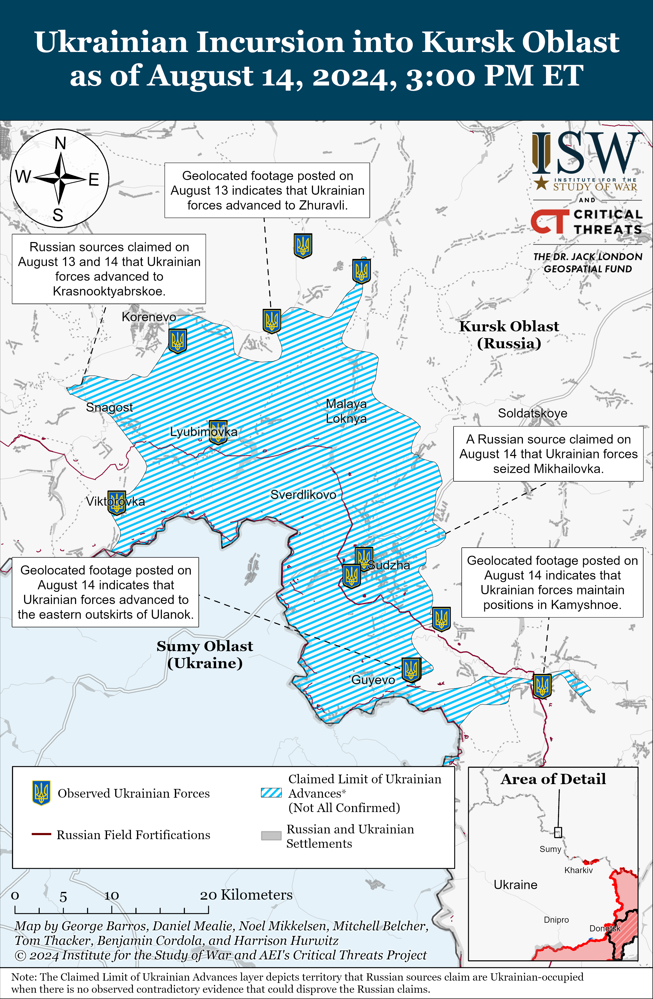
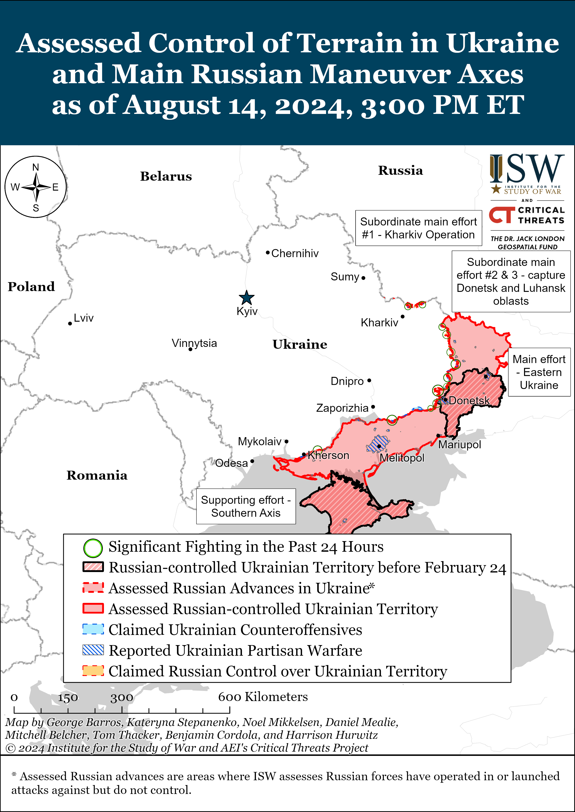
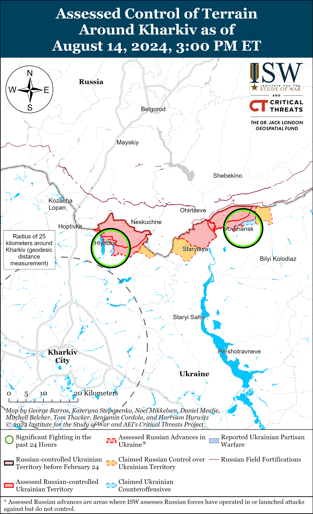
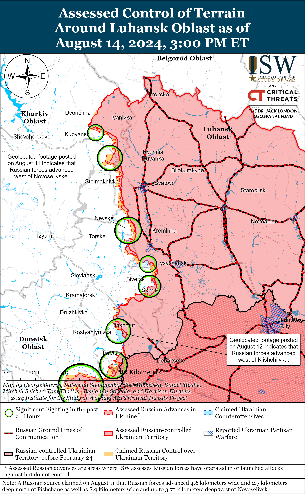
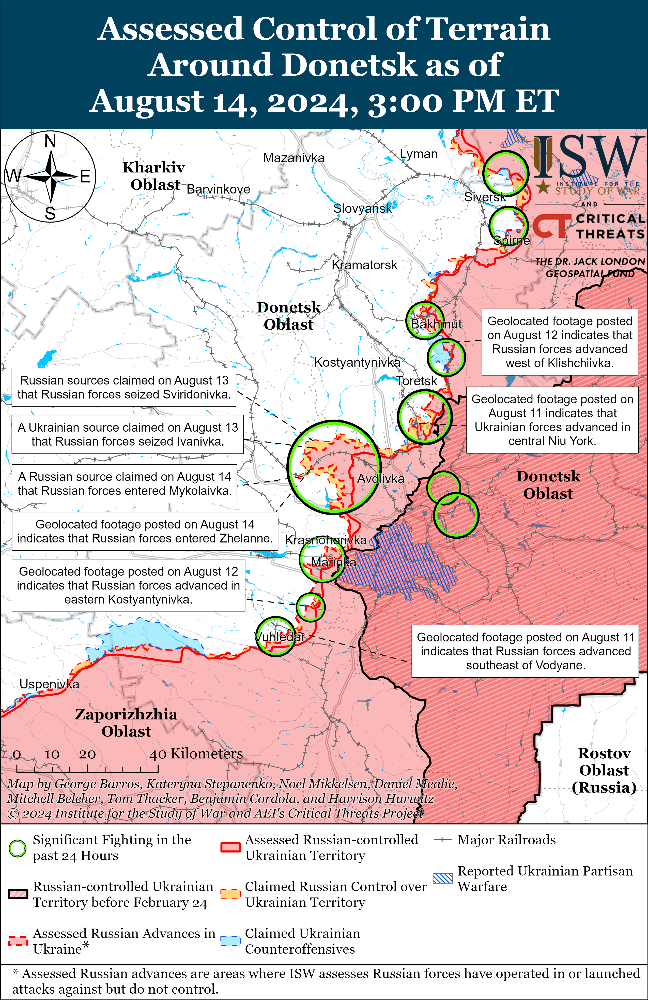
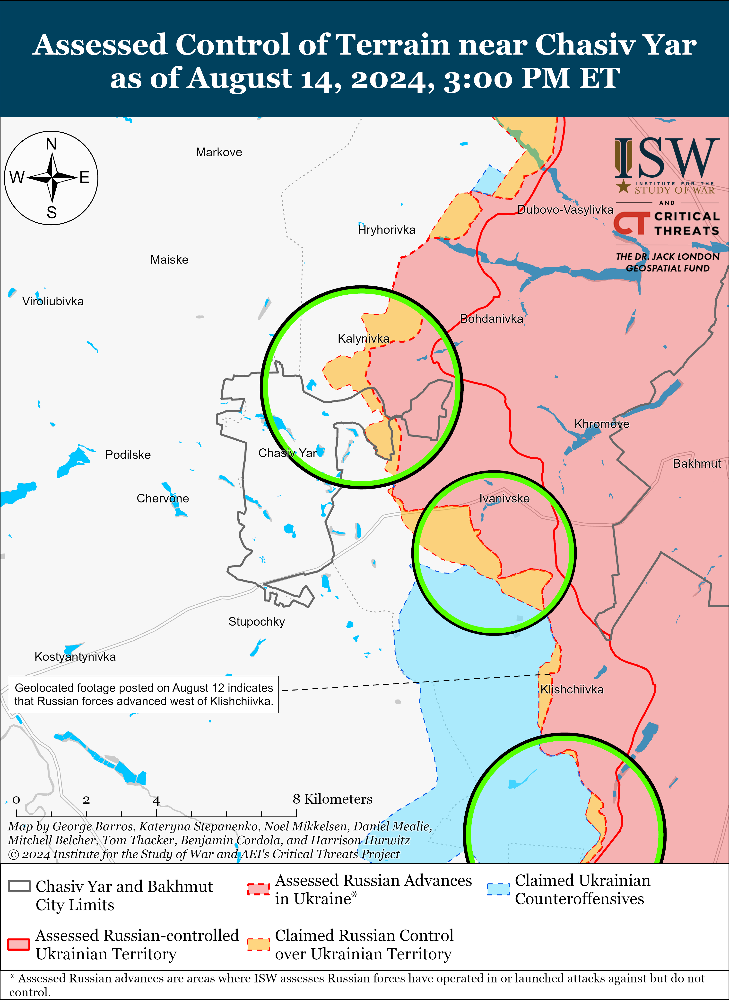
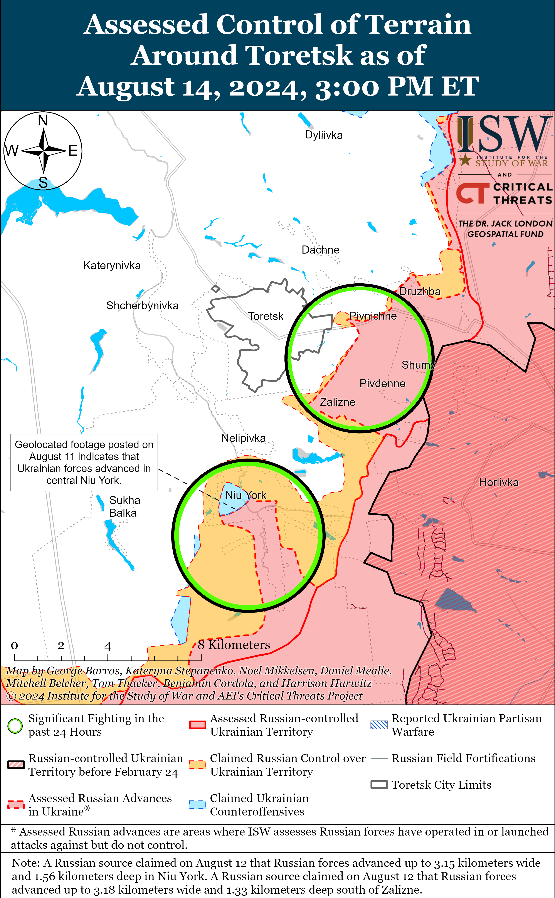
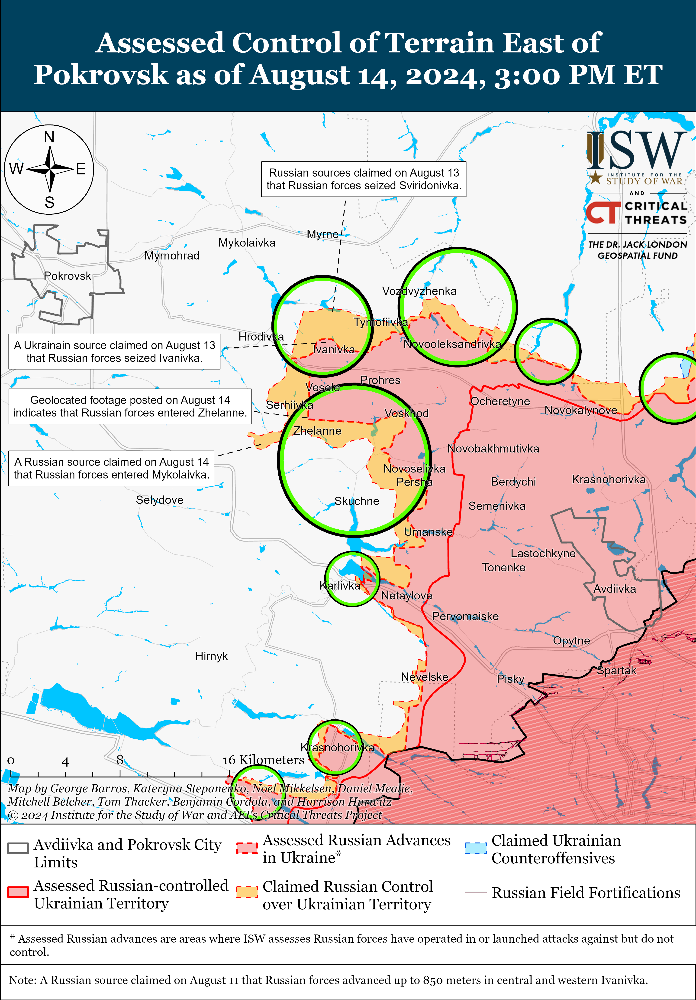
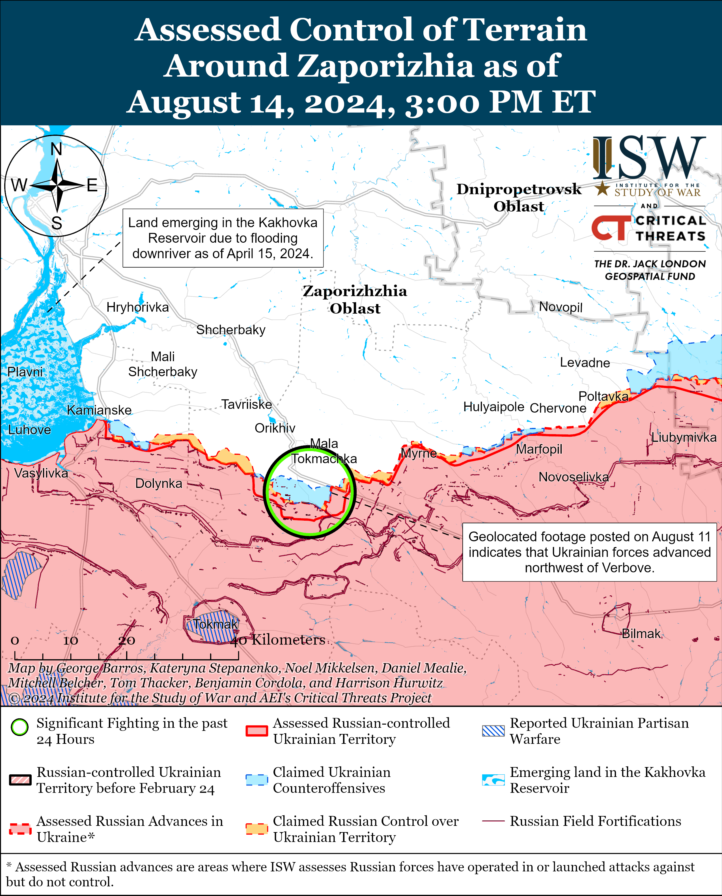
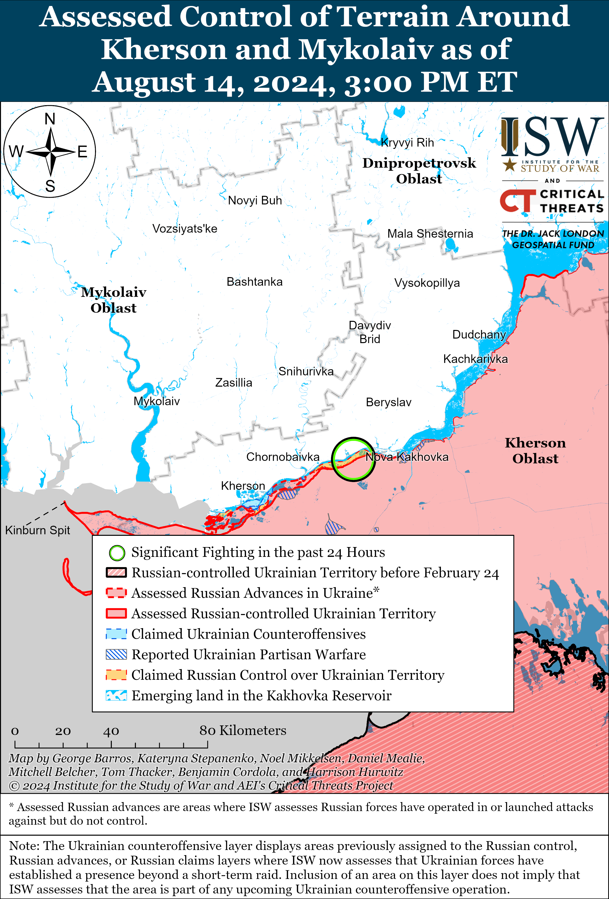

# Russian Offensive Campaign Assessment, August 14, 2024

**Nicole Wolkov, Karolina Hird, Grace Mappes, Davit Gasparyan, and George Barros**

**August 14, 2024, 8pm ET**

**Click**[**here**](https://storymaps.arcgis.com/stories/36a7f6a6f5a9448496de641cf64bd375)**to see ISW’s interactive map of the Russian invasion of Ukraine. This map is updated daily alongside the static maps present in this report.**

**Click**[**here**](https://understandingwar.maps.arcgis.com/apps/instant/3dviewer/index.html?appid=1602762dbcde419bb957dea358449580)**to see ISW’s 3D control of terrain topographic map of Ukraine. Use of a computer (not a mobile device) is strongly recommended for using this data-heavy tool.**

**Click**[**here**](https://storymaps.arcgis.com/stories/733fe90805894bfc8562d90b106aa895)**to access ISW’s archive of interactive time-lapse maps of the Russian invasion of Ukraine. These maps complement the static control-of-terrain map that ISW produces daily by showing a dynamic frontline. ISW will update this time-lapse map archive monthly.**

**Note: The data cut-off for this product was 2:00pm ET on August 14. ISW will cover subsequent reports in the August 15 Russian Offensive Campaign Assessment. [NOTE:***Russian sources are currently shifting much of their reporting to cover the Ukrainian incursion into Kursk Oblast and as a result are not providing the same level of detail about the situation along the frontline in Ukraine.***]**

**Russian milbloggers claimed that Ukrainian forces marginally advanced in Kursk Oblast amid a generally slower tempo of Ukrainian operations as Russian forces continue attempts to stabilize the frontline in the area.**Ukrainian outlet *Suspilne*reported on August 14 that its sources in the Ukrainian military stated that the tempo of Ukrainian advances in Kursk Oblast has slowed due to the increasing Russian resistance in the direction of Kursk City.[1] Russian milbloggers claimed that Russian forces are gradually stabilizing the frontline in Kursk Oblast and that unspecified Russian reinforcements are arriving from unspecified areas and are establishing communications with Russian units already in the area.[2] Russian milbloggers claimed that Ukrainian forces advanced into Krasnooktyabrskoye (southwest of Korenevo and 15km from the international border).[3] Geolocated footage published on August 13 shows Ukrainian forces operating in eastern Zhuravli (west of Korenevo and 20km from the international border), indicating that Ukrainian forces advanced in the eastern part of the settlement.[4] The Russian Ministry of Defense (MoD) and other Russian sources claimed that Russian forces repelled Ukrainian attacks near Skrylevka, Levshinka, Semenovka, and Alekseevsky (all northeast of Korenevo near Kauchuk, which is 27km from the international border).[5] Chechen Akhmat Spetsnaz Commander Apty Alaudinov claimed that Ukrainian forces do not control Sudzha, although several other Russian sources claimed that fighting is ongoing in and around Sudzha and that neither side fully controls the settlement.[6] Geolocated footage published on August 14 showing a Ukrainian journalist reporting from central Sudzha indicates that Ukrainian forces control at least part of the settlement and like parts of its surroundings.[7] *Suspilne’s* sources in the Ukrainian military stated that Ukrainian forces advanced beyond Martynovka (just northeast of Sudzha), although Russian milbloggers claimed that fighting is still ongoing in the settlement.[8] A prominent Kremlin-affiliated Russian milblogger claimed that Mikhailovka (also northeast of Sudzha) remains under Ukrainian control, implying that Ukrainian forces had seized Mikhailovka at an unspecified previous date.[9] Geolocated footage published on August 14 showing Ukrainian forces operating just northwest of Ulanok (southeast of Sudzha) indicates that Ukrainian forces recently advanced in the area.[10] Additional geolocated footage published on August 14 indicates that Ukrainian forces recently marginally advanced in western Kamyshnoye (southeast of Sudzha).[11] Geolocated footage published on August 13 shows a Russian journalist reporting from Giri and Ozerki (both southeast of Sudzha and just east of Kamyshnoye), although Russian sources later claimed on August 14 that Ukrainian forces began operating near Giri and Belitsa (just north of Giri), suggesting that Ukrainian forces may be contesting the area east of Kamyshnoye.[12] Geolocated footage published on August 13 and 14 showing Ukrainian forces operating well within the maximalist claimed limit of Ukrainian advances indicates that Ukrainian forces also continue operating closer to the international border within Kursk Oblast.[13] Russian milbloggers claimed on August 14 that Russian forces continued to repel Ukrainian attempts to cross the Kolotilovka border checkpoint in Belgorod Oblast (on the international border southeast of Sudzha and northwest of Belgorod City).[14]

**Ukrainian officials continue to discuss ongoing Ukrainian operations in Kursk Oblast and offer their interpretations of the political impact that Ukraine may aim to generate.**Ukrainian President Volodymyr Zelensky held a meeting with Ukrainian officials on August 14 to discuss security, humanitarian aid, and military aspects of “the situation in Kursk Oblast.”[15] Ukrainian Ombudsman Dmytro Lubinets participated in the meeting and stressed that Ukrainian forces formed a “buffer (sanitary) zone” in Kursk Oblast for self-defense purposes.[16] Zelensky similarly stated that that Ukraine is focusing on the Kursk Oblast border area to ensure the safety of Ukraine’s borders with Russia, echoing prior statements made by Ukrainian officials highlighting that Ukraine has the right to defend itself from Russian aggression.[17] Advisor to the Head of the Ukrainian President’s Office Mykhailo Podolyak emphasized in an interview with independent Russian-language outlet *Meduza*that Ukraine’s main political goals of the ongoing Kursk operation are to push Russian artillery away from areas from which Russian forces can target Ukrainian civilians; to interdict Russian logistics lines that allow Russian forces to supply reserves throughout the entire theater; to bring domestic and international attention to Russia’s civil and military leadership failures; and to bring the war directly to Russian territory.[18]

**Ongoing Ukrainian operations in Kursk Oblast are generating tangible defensive, logistical, and security impacts within Russia.**Commercially available satellite imagery collected by Maxar on August 12 shows a newly dug series of field fortifications, including trenches and anti-vehicle ditches southwest of Lgov along the E38 Lgov-Rylsk-Hlukhiv highway (northwest of Sudzha).[19] Additional satellite imagery published on August 13 and collected between August 6 and 11 shows the recent appearance of field fortifications near the 38K-024 highway just south of Lgov.[20] These new fortifications are about 17 kilometers north of the furthest claimed limit of Ukrainian advances in Kursk Oblast, which suggests that Russian forces are concerned about potential continued and rapid Ukrainian mechanized northward advances within Kursk Oblast. Russian forces appear particularly concerned about major highways and are likely trying to preemptively safeguard important ground lines of communication (GLOCs) to inhibit Ukrainian maneuver, particularly along the E38 and 38K routes. Ukrainian operations in Kursk Oblast are also reportedly impacting Russian railway logistics — the Belarusian Railway Workers Community claimed on August 13 that its internal sources are reporting that Russian state-owned railway company Russian Railways informed Belarusian state-owned railway company Belarusian Railways to stop directing trains from all Belarusian Railway stations to stations along the Oryol-Kursk branch of the Moscow Railway starting on August 12 due to a “large-scale operational transfer of troops in the direction of Kursk Oblast” and the movement of freight trains for military logistical purposes.[21] Belgorod Oblast Governor Vyacheslav Gladkov also announced a state of emergency in Belgorod Oblast on August 14, which will allow Belgorod Oblast authorities the power to restrict movement within emergency areas likely either to secure Russian logistical support for Belgorod Oblast border areas or Russian defensive measures within Kursk Oblast.[22]

**The Russian government continues recruitment efforts to support operations in Kursk Oblast.**Russian opposition outlet *Mobilization News*reported on August 14 that Russian forces will send conscripts of the spring draft class from Moscow, Leningrad, Kaliningrad, Sverdlovsk, Murmansk, and Samara Oblasts to aid Russian forces fighting in Kursk Oblast, drawing backlash from human rights activists and relatives who are protesting the use of conscripts in active combat.[23] Russian opposition outlets reported on August 14 that Russian forces are forcing conscripts who survived the initial Ukrainian incursion into Kursk Oblast to sign contracts with the Russian MoD return to the front in Kursk Oblast.[24]

**Chechen Akhmat Spetsnaz Commander Apty Alaudinov seems to be posturing himself as the spokesperson for the Russian defense in Kursk Oblast, but his claims have consistently been false and largely contradict claims made by relatively reliable Russian milbloggers.**Alaudinov has portrayed himself as a spokesperson for Russian forces defending Kursk Oblast since the start of the Ukrainian incursion on August 6, leveraging his position as a seasoned Chechen commander as well as the position of Chechen forces operating in the area to establish himself as an authority on the defense of Kursk Oblast to Russian state media.[25] Alaudinov has repeatedly claimed that Russian forces have stabilized the situation and achieved various victories in Kursk Oblast, and claimed on August 14 that Ukrainian forces do not control Sudzha and that Russian forces have “blocked” Ukrainian forces within Kursk Oblast – claims that are both demonstrably false given available visual evidence and which contradict the majority of Russian milblogger claims.[26] Many Russian milbloggers claimed that Ukrainian forces control either significant parts or all of Sudzha as of August 14 and have consistently claimed that Russian forces are struggling to respond to the Ukrainian incursion – very far from Alaudinov’s claims that Russian forces have completely stabilized the situation.[27] Alaudinov’s claims have focused on portraying Russian forces as a capable defensive force that is defeating inept Ukrainian forces and have therefore leaned on several Kremlin information operations to this effect.[28] Alaudinov’s framing of himself, and by extension of the Chechen forces under his command, as a capable defensive body is also dissonant with the widespread perception of the efficacy of Chechen forces within the wider Russian information space. Russian milbloggers have consistently criticized Chechen units operating in Ukraine and near the international border for avoiding combat missions and having poor discipline, and Russian sources made similar complaints about Chechen forces operating in Kursk Oblast following the start of the incursion.[29] Alaudinov may be attempting to rehabilitate the image of Chechen forces by portraying himself as a trustworthy source of information, but at his claims highlight the dissonance between the messaging of prominent Russian military commanders, the Russian information space, and the current battlefield reality in Kursk Oblast.

**Ukrainian forces conducted a large series of drone strikes against Russian air bases in Russia on the night of August 13 to 14, damaging several airfields.**Ukrainian President Volodymyr Zelensky thanked the Ukraine’s Security Service (SBU), Main Military Intelligence Directorate (GUR), and Ukrainian military on August 14 for conducting drone strikes against unspecified Russian air bases.[30] Ukrainian outlet *Suspilne*reported on August 14 that its sources in the SBU stated that the Ukrainian SBU, GUR, Special Operations Forces (SSO), and Unmanned Systems Forces conducted drone strikes against Russian military air bases in Kursk City, Voronezh City, Borisoglebsk in Voronezh Oblast, and Savasleyka in Nizhny Novgorod Oblast, and characterized the strike as the largest Ukrainian attack on Russian air bases since the start of the war.[31] The SBU sources also stated that Ukraine targeted these air bases to prevent Russian forces aircraft from using these bases to conduct glide bomb strikes against Ukrainian frontline forces and civilian areas. Geolocated footage published on August 13 demonstrates the sound of explosions resulting from Ukrainian strikes as heard from somewhere near Voronezh City, roughly 3.5 kilometers north of the Baltimor Air Base in Voronezh City.[32] Satellite imagery captured on August 14 of the Borisoglebsk Air Base indicates that Ukrainian strikes damaged several hangars, likely near the location aircraft repair and maintenance building, and may have damaged an aircraft.[33] Geolocated footage published on August 14 shows a drone striking the Savasleyka Air Base and the subsequent explosion, and a Ukrainian source speculated that the strike damaged a Russian MiG-31 supersonic interceptor aircraft, which can carry Kh-47M2 Kinzhal aeroballistic missiles.[34] ISW cannot independently verify the results of the Ukrainian strikes at this time.

**Georgia’s ruling Georgian Dream party furthered a narrative echoing a Kremlin information operation meant to justify Russia’s violence against the territorial integrity and sovereignty of states formerly colonized by the Soviet Union and Russian Empire.**The Georgian Dream party accused former Georgian president Mikhail Saakashvili on August 13 of provoking Russia’s war against Georgia in 2008 and the Kremlin’s subsequent illegal occupation of Abkhazia and South Ossetia at the behest of unspecified “external actors.”[35] Georgian Dream’s Political Council stated that it must conduct a “legal process” informing the Georgian public of Saakashvili’s and his United National Movement Party’s reportedly “treasonous actions.” Georgian Dream’s statements blame Saakashvili, not Russia, for the 2008 war and occupation of Georgian territory and instead justified Russia’s actions, which have been condemned by the international community.[36] The narrative of the Georgian Dream party closely echoes the Kremlin’s information operations regarding the Russo-Georgian war, wider information operations used to justify Russia‘s war against Ukraine, and increasing threats against Moldova’s sovereignty and territorial integrity.[37] Russia has repeatedly accused pro-Western and pro-democratic leaders in neighboring countries of cooperating with “external actors” at the detriment of Russian interests while simultaneously conducting lawfare to in an attempt to justify invasion, occupation, and hybrid operations against sovereign countries. A prominent Kremlin-affiliated Russian milblogger took note Georgian Dream’s statements and amplified the Kremlin’s previous accusations against Saakashvili and the West at large, suggesting that this narrative may gain traction in the wider information space.[38]

**Key Takeaways:**

- **Russian milbloggers claimed that Ukrainian forces marginally advanced in Kursk Oblast amid a generally slower tempo of Ukrainian operations as Russian forces continue attempts to stabilize the frontline in the area.**
- **Ukrainian officials continue to discuss ongoing Ukrainian operations in Kursk Oblast and offer their interpretations of the political impact that Ukraine may aim to generate.**
- **Ongoing Ukrainian operations in Kursk Oblast are generating tangible defensive, logistical, and security impacts within Russia.**
- **The Russian government continues recruitment efforts to support operations in Kursk Oblast.**
- **Chechen Akhmat Spetsnaz Commander Apty Alaudinov seems to be posturing himself as the spokesperson for the Russian defense in Kursk Oblast, but his claims have consistently been false and largely contradict claims made by relatively reliable Russian milbloggers.**
- **Ukrainian forces conducted a large series of drone strikes against Russian air bases in Russia on the night of August 13 to 14, damaging several airfields.**
- **Georgia’s ruling Georgian Dream party furthered a narrative echoing a Kremlin information operation meant to justify Russia’s violence against the territorial integrity and sovereignty of states formerly colonized by the Soviet Union and Russian Empire.**
- **Russian forces advanced north of Kharkiv City and southeast of Pokrovsk.**

***We do not report in detail on Russian war crimes because these activities are well-covered in Western media and do not directly affect the military operations we are assessing and forecasting. We will continue to evaluate and report on the effects of these criminal activities on the Ukrainian military and the Ukrainian population and specifically on combat in Ukrainian urban areas. We utterly condemn Russian violations of the laws of armed conflict and the Geneva Conventions and crimes against humanity even though we do not describe them in these reports.***

- Russian Main Effort – Eastern Ukraine (comprised of three subordinate main efforts)
- Russian Subordinate Main Effort #1 – Push Ukrainian forces back from the international border with Belgorod Oblast and approach to within tube artillery range of Kharkiv City
- Russian Subordinate Main Effort #2 – Capture the remainder of Luhansk Oblast and push westward into eastern Kharkiv Oblast and encircle northern Donetsk Oblast
- Russian Subordinate Main Effort #3 – Capture the entirety of Donetsk Oblast
- Russian Supporting Effort – Southern Axis
- Russian Air, Missile, and Drone Campaign
- Russian Mobilization and Force Generation Efforts
- Russian Technological Adaptations
- Activities in Russian-occupied areas
- Ukrainian Defense Industrial Base Efforts
- Russian Information Operations and Narratives
- Significant Activity in Belarus

**Russian Main Effort – Eastern Ukraine**

**Russian Subordinate Main Effort #1 – Kharkiv Oblast (Russian objective: Push Ukrainian forces back from the international border with Belgorod Oblast and approach to within tube artillery range of Kharkiv City)**

Russian forces recently made marginal advances north of Kharkiv City. Geolocated footage published on August 13 shows that Russian forces advanced near the eastern bank of the Travyanske Reservoir just west of Hlyboke (north of Kharkiv City).[39] Additional geolocated footage published on August 14 shows that Russian forces also advanced southward along a windbreak in a field southeast of Lukyantsi (north of Kharkiv City and southeast of Hlyboke).[40] Ukrainian sources reported that Russian forces attacked north of Kharkiv City near Hlyboke and Lyptsi and northeast of Kharkiv City near Vovchansk, Tykhe, and in the direction of Vovchanski Khutory.[41] Elements of the 153rd Tank Regiment and 4th Volunteer Assault Brigade (both of the 47th Tank Division, 1st Guards Tank Army, Moscow Military District [MMD]) reportedly continue to fight within central Vovchansk, while elements of the 83rd Airborne (VDV) Brigade are fighting east of Vovchansk near Tykhe.[42]

**Russian Subordinate Main Effort #2 – Luhansk Oblast (Russian objective: Capture the remainder of Luhansk Oblast and push westward into eastern Kharkiv Oblast and northern Donetsk Oblast)**

Positional fighting continued along the Kupyansk-Svatove-Kreminna line on August 14, but there were no confirmed changes to the frontline. The Ukrainian General Staff reported that Russian forces attacked northeast of Kupyansk near Synkivka; southeast of Kupyansk near Petropavlivka, Berestove, Novoosynove, and Kruhlyakivka; northwest of Kreminna near Makiivka, Nevske, and Terny; and southwest of Kreminna in the Serebryanske forest area.[43]

**Russian Subordinate Main Effort #3 – Donetsk Oblast (Russian objective: Capture the entirety of Donetsk Oblast, the claimed territory of Russia’s proxies in Donbas)**

Russian forces continued offensive operations near Siversk on August 14, but there were no confirmed changes to the frontline. Russian forces attacked northeast of Siversk near Bilohorivka; east of Siversk near Verkhnokamyanske; and southeast of Siversk near Spirne and Vyimka on August 13 and 14.[44] Elements of the Russian 106th Airborne (VDV) Division reportedly continue operating in the Siversk direction.[45]

Russian forces continued assault operations near Chasiv Yar; north of Chasiv Year near Bila Hora; east of Chasiv Year near Ivanivske; and southeast of Chasiv Yar near Andriivka on August 13 and 14, but there were no confirmed changes to the front.[46] A Russian milblogger claimed that Russian forces seized a height near Klishchiivka (southeast of Chasiv Yar), but ISW has not confirmed visual evidence of claimed Russian gains near Klishchiivka.[47]

Russian forces continued ground attacks near Toretsk; east of Toretsk near Pivnichne; southeast of Toretsk near Zalizne; south of Toretsk near Niu York; and southwest of Toretsk near Sukha Balka on August 13 and 14 but did not make confirmed advances.[48] Elements of the Russian 1st “Slovyansk” Motorized Rifle Brigade (1st Donetsk People’s Republic Army Corps [DNR AC]) are reportedly fighting near Zalizne, and elements of the 132nd Motorized Rifle Brigade (1st DNR AC) are reportedly operating in the Toretsk direction.[49]

Russian forces recently made confirmed advances in the Pokrovsk direction amid continued fighting on August 14. Geolocated footage published on August 13 and 14 shows that Russian forces advanced in fields north of Novoselivka Persha and into northwestern Zhelanne (both southeast of Pokrovsk), respectively.[50] A Russian milblogger claimed that Russian forces also advanced in fields west of Svyrydonivka and east of Hrodivka and Orlivka (all east of Pokrovsk) and entered Mykolaivka (southeast of Pokrovsk and southwest of Zhelanne), but ISW has not observed confirmation of these claims.[51] Russian forces also continued ground attacks northeast of Pokrovsk near Malynivka; east of Pokrovsk near Vozdvyzhenka, Novooleksandrivka, Zelene Pole, and Yelyzavetivka; and southeast of Pokrovsk near Kalynove, Vodyane, Skuchne, Karlivka, Ptychne on August 13 and 14.[52]

Russian forces continued ground attacks west of Donetsk City near Krasnohorivka and Heorhiivka and southwest of Donetsk City near Kostyantynivka, Vodyane, and Vuhledar on August 13 and 14, but did not make any confirmed advances.[53] Russian milbloggers claimed that Russian forces hold one-third of Kostyantynivka and are continuing to clear Krasnohorivka.[54] Elements of the Russian 5th and 110th motorized rifle brigades (both 1st DNR AC) reportedly continue to fight within Krasnohorivka.[55]

Russian and Ukrainian sources did not report on continued positional fighting in the Donetsk-Zaporizhia Oblast border area on August 14.

**Russian Supporting Effort – Southern Axis (Russian objective: Maintain frontline positions and secure rear areas against Ukrainian strikes)**

Positional engagements continued in western Zaporizhia Oblast on August 14, but there were no confirmed changes to the frontline. The Ukrainian General Staff reported that Russian forces unsuccessfully attacked near Robotyne, north of Robotyne near Novodanylivka, and northeast of Robotyne near Mala Tokmachka on August 13 and 14.[56]

Positional engagements continued in east (left) bank Kherson Oblast, including on islands in the Dnipro River Delta, on August 12 and 13.[57] Elements of the Russian 76th Airborne (VDV) Division reportedly continue operating in Kherson Oblast.[58]

**Russian Air, Missile, and Drone Campaign (Russian Objective: Target Ukrainian military and civilian infrastructure in the rear and on the frontline)**

Russian forces conducted a combined missile and drone strike against Ukraine on the night of August 13 to 14. Ukrainian Air Force Commander Lieutenant General Mykola Oleshchuk reported that Russian forces launched two Kh-59/69 cruise missiles from Belgorod Oblast and 23 Shahed drones from occupied Cape Chauda, Crimea, and Yeysk, Krasnodar Krai, and that Ukrainian forces shot down 17 Shaheds over Mykolaiv, Cherkasy, Kirovohrad, Kyiv, Zaporizhia, Sumy, Kharkiv, and Zhytomyr oblasts.[59] Ukraine’s Ministry of Internal Affairs reported damage to an infrastructure object in Zhytomyr Oblast during the strike, but did not specify if a missile, drone, or falling debris caused the damage.[60]

**Russian Mobilization and Force Generation Efforts (Russian objective: Expand combat power without conducting general mobilization)**

Russian officials highlighted the outcomes of the Army-2024 International Military-Technical Forum on its closing day on August 14. Head of the Main Directorate for Innovative Development of the Russian Ministry of Defense (MoD) Alexander Osadchuk claimed on August 14 that the Russian MoD signed government contracts worth more than 500 billion rubles during the forum and that as a result, Russian forces will receive over 500 pieces of basic weaponry and equipment and about 1 million weapons of various calibers.[61]

**Russian Technological Adaptations (Russian objective: Introduce technological innovations to optimize systems for use in Ukraine)**

Russian state newswire *TASS*reported on August 14 that Russian Federal Aviation Agency Rosaviatsiya issued a modification certificate for Russian Il-76 military transport aircraft that will reportedly enhance the aircraft’s export potential and flight performance characteristics.[62]

The Head of the Main Directorate of Armament of the Russian Armed Forces Anatoly Gulyaev reported on August 13 that the Russian Armed Forces has ordered the first batch of T-90M tanks equipped with “Arena-M” active protection systems. [63] The Arena-M system is designed to intercept missiles and other anti-tank munitions in the immediate vicinity of the tank by destroying them with counter-munitions. Gulyaev also stated that Russian forces are also receiving modernized TOS-1A thermobaric artillery systems.

Russian state arms exporter Rosoboronexport presented the “Lancet-E” loitering munition at the Army-2024 forum.[64] The “Lancet-E” is an export analogue of the base Lancet loitering munition model that incorporates the Z-16-E reconnaissance unmanned aerial vehicle with the “Izdelie 51-E” heavy guided munition, and the “Izdelie 52-E” light guided munition. [65] The “Lancet-E” loitering munition is designed for remote operations, enabling both aerial reconnaissance and precision strikes against stationary and moving targets in a variety of conditions, including day and night.[66] The system reportedly has a maximum range of 40 kilometers (25 miles) and a maximum takeoff weight of up to 12 kilograms (26 pounds).[67]

**Ukrainian Defense Industrial Efforts (Ukrainian objective: Develop its defense industrial base to become more self-sufficient in cooperation with US, European, and international partners)**

*ISW is not publishing coverage of Ukrainian defense industrial efforts today.*

**Activities in Russian-occupied areas (Russian objective: Consolidate administrative control of annexed areas; forcibly integrate Ukrainian citizens into Russian sociocultural, economic, military, and governance systems)**

*ISW is not publishing coverage of activities in Russian-occupied areas today.*

**Russian Information Operations and Narratives**

Nothing significant to report.

**Significant activity in Belarus (Russian efforts to increase its military presence in Belarus and further integrate Belarus into Russian-favorable frameworks and Wagner Group activity in Belarus)**

Nothing significant to report

**Note: ISW does not receive any classified material from any source, uses only publicly available information, and draws extensively on Russian, Ukrainian, and Western reporting and social media as well as commercially available satellite imagery and other geospatial data as the basis for these reports. References to all sources used are provided in the endnotes of each update.**

---

[1] https://suspilne dot media/812965-prosuvanna-na-kursini-spovilnilosa-zsu-buduvatimut-oboronu-dzerelo/

[2] https://t.me/rybar/62764 ; https://t.me/sashakots/48392

[3] https://t.me/DnevnikDesantnika/13909; https://t.me/rybar/62764; https://t.me/motopatriot/26177

[4] https://t.me/warriorofnorth/2057; https://t.me/mod\_russia/42147; https://t.me/creamy\_caprice/6387

[5] https://t.me/mod\_russia/42148 ; https://t.me/DnevnikDesantnika/13955 ; https://t.me/rybar/62769

[6] https://t.me/tass\_agency/266200 ; https://t.me/voenkorKotenok/58220 ; https://t.me/rybar/62764 ; https://t.me/rybar/62769 ; https://t.me/DnevnikDesantnika/13930 ; https://t.me/Alekhin\_Telega/11232

[7] https://www.youtube.com/watch?v=cmvMZsBjDd0 ; https://x.com/99Dominik\_/status/1823642150539600343 ; https://tsn dot ua/exclusive/zsu-kontrolyuyut-rosiysku-sudzhu-scho-vidbuvayetsya-u-misti-eksklyuzivniy-reportazh-tsn-2640243.html; https://detector dot media/infospace/article/230864/2024-08-14-zhurnalisty-tsn-zrobyly-syuzhet-v-sudzhi-kurskoi-oblasti/; https://glavcom dot ua/world/observe/ukrajinski-zhurnalisti-vpershe-prijikhali-v-kursku-oblast-reportazh-1015295.html

[8] https://suspilne dot media/812965-prosuvanna-na-kursini-spovilnilosa-zsu-buduvatimut-oboronu-dzerelo/ ; https://t.me/RVvoenkor/74716 ; https://t.me/warhistoryalconafter/179405; https://t.me/dva\_majors/49777 ; https://t.me/rybar/62769

[9] https://t.me/rybar/62769

[10] https://x.com/hizzo\_jay/status/1823733738335006767; https://t.me/ua\_regteam/112; https://x.com/giK1893/status/1823734527283618243

[11] https://t.me/dva\_majors/49730; https://t.me/kiber\_boroshno/9525; https://x.com/EjShahid/status/1823624439679893809

[12] (Geolocated) https://www.1tv [dot] ru/news/issue/2024-08-13/21:00#1; https://t.me/creamy\_caprice/6377

(Claims) https://t.me/RVvoenkor/74761 ; https://t.me/rybar/62764

[13] (Zaoloshenka) https://t.me/marshalvdv/23230; https://x.com/giK1893/status/1823686653514551453; https://t.me/andriyshTime/25990

(Plekhovo) https://x.com/foosint/status/1823442803978047967; https://t.me/marmuletik/26966; https://x.com/foosint/status/1823442807471923346; https://t.me/creamy\_caprice/6380 ; https://t.me/ukrbavovna/16421 ; https://x.com/GirkinGirkin/status/1823525367166206042; https://x.com/Grimm\_Intel/status/1823530960446488953 ; https://t.me/andriyshTime/25960 ; https://t.me/Airborne1126/16772

(Lyubimovka) https://x.com/Maks\_NAFO\_FELLA/status/1823752777606271185; https://x.com/99Dominik\_/status/1823757787102634208; https://t.me/dumky\_frontovyka/450

(Viktorovka) https://x.com/andynovy/status/1823761412013089162; https://t.me/byiuwiu

(Safonovka) https://t.me/lost\_warinua/86535; https://t.me/lost\_warinua/86530; https://x.com/giK1893/status/1823783559137501471; https://x.com/giK1893/status/1823783562417480049 ; https://t.me/lost\_warinua/86535; https://t.me/lost\_warinua/86530; https://x.com/giK1893/status/1823783559137501471; https://x.com/giK1893/status/1823783562417480049

(Goncharovka) https://t.me/defender\_skadovsk/40673; https://x.com/NOTINAFO/status/1823504493041918304; https://x.com/NOELreports/status/1823478869099520209; https://x.com/Militarylandnet/status/1823634152597406148; https://x.com/nevedimka123/status/1823590203824439462; https://x.com/front\_ukrainian/status/1823467441814667278; https://x.com/SergioCentaurus/status/1823552445810925850; https://x.com/GeoConfirmed/status/1823731451851907229

[14] https://t.me/RVvoenkor/74801 ; https://t.me/vchkogpu/49933 ;

[15] https://t.me/V\_Zelenskiy\_official/11367

[16] https://t.me/dmytro\_lubinetzs/6435

[17] https://t.me/V\_Zelenskiy\_official/11363; https://isw.pub/UkrWar081324

[18] https://meduza dot io/feature/2024/08/14/nastuplenie-vsu-v-kurskoy-oblasti-prodolzhaetsya-chego-zhe-vse-taki-dobivaetsya-ukraina-intervyu-mihaila-podolyaka-iz-ofisa-zelenskogo

[19] https://x.com/georgewbarros/status/1823753481360232457; https://x.com/RedIntelPanda/status/1823540711976816702

[20] https://x.com/RedIntelPanda/status/1823540711976816702

[21] https://belzhd dot link/news/operativno-rzhd-ogranichivaet-napravlenie-poezdov-bzhd-v-kurskuyu-oblast/

[22] https://suspilne dot media/813017-gubernator-belgorodskoi-oblasti-ogolosiv-nadzvicajnij-stan-u-regioni/; https://t.me/vvgladkov/9071; https://t.me/ves\_rf/4408

[23] https://t.me/mobilizationnews/19817; https://meduza dot io/news/2024/08/14/agentstvo-rossiyskih-srochnikov-zastavlyayut-podpisat-kontrakt-s-minoborony-zapugivaya-otpravkoy-v-kurskuyu-oblast ; https://t.me/mobilizationnews/19811

[24] https://t.me/astrapress/61921; https://t.me/mobilizationnews/19808

[25] https://t.me/tass\_agency/264731; https://t.me/tass\_agency/265322; https://t.me/tass\_agency/265496; https://t.me/tass\_agency/265436 ; https://t.me/tass\_agency/265450 ; https://tass dot ru/armiya-i-opk/21571507; https://t.me/tass\_agency/265665; https://t.me/tass\_agency/266189; https://t.me/tass\_agency/266223

[26] https://t.me/tass\_agency/266186; https://t.me/tass\_agency/266200;

[27] https://t.me/rybar/62769; https://t.me/voenkorKotenok/58220; https://t.me/DnevnikDesantnika/13930; https://t.me/Alekhin\_Telega/11232; https://t.me/dva\_majors/49750; https://t.me/control\_sigma/33114; https://t.me/dva\_majors/49732; https://t.me/rybar/62752

[28] https://t.me/tass\_agency/266007 ; https://t.me/tass\_agency/266008 ; https://t.me/tass\_agency/266010; https://t.me/tass\_agency/266038 ; https://t.me/tass\_agency/266039 ; https://t.me/tass\_agency/266040 ; https://t.me/vchkogpu/49893; https://t.me/tass\_agency/265665; https://t.me/tass\_agency/265436 ; https://t.me/tass\_agency/265450 ; https://tass dot ru/armiya-i-opk/21571507

[29] https://t.me/wind\_sower/6686 ; https://t.me/astrapress/61557; https://x.com/GirkinGirkin/status/1821881317413310483; https://t.me/andriyshTime/25559; https://t.me/ButusovPlus/12465; https://t.me/astrapress/61770; https://t.me/astrapress/61755 ; https://x.com/GirkinGirkin/status/1822690868920304070; https://x.com/666\_mancer/status/182272629610063053;

[30] https://t.me/V\_Zelenskiy\_official/11368

[31] https://suspilne dot media/813385-sbu-ta-sili-oboroni-ukraini-vdarili-po-4-aerodromah-rosii/

[32] https://t.me/mtv36/40794; https://t.me/kiber\_boroshno/9520

[33] https://x.com/KOvsianyi/status/1823709486420500666

[34] https://t.me/WarArchive\_ua/18609 ; https://t.me/DniproOfficial/4244

[35] https://civil dot ge/archives/620207 ; https://agenda dot ge/en/news/2024/40178#gsc.tab=0

[36] https://apnews.com/article/europe-georgia-salome-zurabishvili-moscow-russia-854c37a67adc9cda0920a00e931efc09

[37] https://apnews.com/article/moldova-russia-war-ukraine-transnistria-eu-6c14d96e8cdc0bc699f0315eecaab4f6 ; https://isw.pub/UkrWar021524 ; https://isw.pub/UkrWar012224

[38] https://t.me/rybar/62744

[39] https://t.me/khartiia/858; https://t.me/creamy\_caprice/6381 ; https://armyinform dot com.ua/2024/08/14/rosiyany-sprobuvaly-povtoryty-kursk-pid-harkovom-shho-z-togo-vyjshlo/

[40] https://t.me/khartiia/860; https://x.com/MikiValbuena

[41] https://www.facebook.com/GeneralStaff.ua/posts/pfbid021XmWU72TtmvzQvJZj6RPvduiy91ZqJhMjfo7nyaoE225SNaTh3CuNpZP2m81nPxEl; https://www.facebook.com/GeneralStaff.ua/posts/pfbid0mtYL3myHri59ZGmffcSrGDcvKvLwLcmxJg3A5uZNfbGkoqY7eeTgtEGXA9PUH2Djl; https://www.facebook.com/GeneralStaff.ua/posts/pfbid0ZhBnBruvy4DHJWfpWo8yG6JfsR4ydogGe1QFfSTbRUkYLUmF6FLTqnacepno7DiCl; https://t.me/otukharkiv/733

[42] https://t.me/otukharkiv/733

[43] https://www.facebook.com/GeneralStaff.ua/posts/pfbid021XmWU72TtmvzQvJZj6RPvduiy91ZqJhMjfo7nyaoE225SNaTh3CuNpZP2m81nPxEl; https://www.facebook.com/GeneralStaff.ua/posts/pfbid0mtYL3myHri59ZGmffcSrGDcvKvLwLcmxJg3A5uZNfbGkoqY7eeTgtEGXA9PUH2Djl;

[44] https://www.facebook.com/GeneralStaff.ua/posts/pfbid021XmWU72TtmvzQvJZj6RPvduiy91ZqJhMjfo7nyaoE225SNaTh3CuNpZP2m81nPxEl; https://www.facebook.com/GeneralStaff.ua/posts/pfbid0mtYL3myHri59ZGmffcSrGDcvKvLwLcmxJg3A5uZNfbGkoqY7eeTgtEGXA9PUH2Djl; https://www.facebook.com/GeneralStaff.ua/posts/pfbid0ZhBnBruvy4DHJWfpWo8yG6JfsR4ydogGe1QFfSTbRUkYLUmF6FLTqnacepno7DiCl

[45] https://t.me/boris\_rozhin/133514

[46] https://www.facebook.com/GeneralStaff.ua/posts/pfbid021XmWU72TtmvzQvJZj6RPvduiy91ZqJhMjfo7nyaoE225SNaTh3CuNpZP2m81nPxEl; https://www.facebook.com/GeneralStaff.ua/posts/pfbid0mtYL3myHri59ZGmffcSrGDcvKvLwLcmxJg3A5uZNfbGkoqY7eeTgtEGXA9PUH2Djl; https://www.facebook.com/GeneralStaff.ua/posts/pfbid0ZhBnBruvy4DHJWfpWo8yG6JfsR4ydogGe1QFfSTbRUkYLUmF6FLTqnacepno7DiC

[47] https://t.me/DnevnikDesantnika/13911

[48] https://www.facebook.com/GeneralStaff.ua/posts/pfbid021XmWU72TtmvzQvJZj6RPvduiy91ZqJhMjfo7nyaoE225SNaTh3CuNpZP2m81nPxEl; https://www.facebook.com/GeneralStaff.ua/posts/pfbid0mtYL3myHri59ZGmffcSrGDcvKvLwLcmxJg3A5uZNfbGkoqY7eeTgtEGXA9PUH2Djl; https://www.facebook.com/GeneralStaff.ua/posts/pfbid0ZhBnBruvy4DHJWfpWo8yG6JfsR4ydogGe1QFfSTbRUkYLUmF6FLTqnacepno7DiCl; https://t.me/RVvoenkor/74813; https://t.me/wargonzo/21553

[49] https://t.me/RVvoenkor/74813; https://t.me/nm\_dnr/12583 ; https://t.me/RVvoenkor/74776

[50] https://t.me/strikedronescompany/367; https://t.me/creamy\_caprice/6390; https://x.com/PuenteUribarri/status/1823603456235520116; https://x.com/MikiValbuena/status/1823608651208110152; https://t.me/ssternenko/32324; https://t.me/WarArchive\_ua/18604

[51] https://t.me/z\_arhiv/27614; https://t.me/z\_arhiv/27620

[52] https://www.facebook.com/GeneralStaff.ua/posts/pfbid021XmWU72TtmvzQvJZj6RPvduiy91ZqJhMjfo7nyaoE225SNaTh3CuNpZP2m81nPxEl; https://www.facebook.com/GeneralStaff.ua/posts/pfbid0mtYL3myHri59ZGmffcSrGDcvKvLwLcmxJg3A5uZNfbGkoqY7eeTgtEGXA9PUH2Djl; https://www.facebook.com/GeneralStaff.ua/posts/pfbid0ZhBnBruvy4DHJWfpWo8yG6JfsR4ydogGe1QFfSTbRUkYLUmF6FLTqnacepno7DiCl; https://t.me/wargonzo/21553

[53] https://www.facebook.com/GeneralStaff.ua/posts/pfbid021XmWU72TtmvzQvJZj6RPvduiy91ZqJhMjfo7nyaoE225SNaTh3CuNpZP2m81nPxEl; https://www.facebook.com/GeneralStaff.ua/posts/pfbid0mtYL3myHri59ZGmffcSrGDcvKvLwLcmxJg3A5uZNfbGkoqY7eeTgtEGXA9PUH2Djl; https://www.facebook.com/GeneralStaff.ua/posts/pfbid0ZhBnBruvy4DHJWfpWo8yG6JfsR4ydogGe1QFfSTbRUkYLUmF6FLTqnacepno7DiCl

[54] https://t.me/voenkorKotenok/58204; https://t.me/epoddubny/20714

[55] https://t.me/voenkorKotenok/58204

[56] https://www.facebook.com/GeneralStaff.ua/posts/pfbid021XmWU72TtmvzQvJZj6RPvduiy91ZqJhMjfo7nyaoE225SNaTh3CuNpZP2m81nPxEl ; https://www.facebook.com/GeneralStaff.ua/posts/pfbid0mtYL3myHri59ZGmffcSrGDcvKvLwLcmxJg3A5uZNfbGkoqY7eeTgtEGXA9PUH2Djl https://www.facebook.com/GeneralStaff.ua/posts/pfbid0ZhBnBruvy4DHJWfpWo8yG6JfsR4ydogGe1QFfSTbRUkYLUmF6FLTqnacepno7DiCl

[57] https://www.facebook.com/GeneralStaff.ua/posts/pfbid021XmWU72TtmvzQvJZj6RPvduiy91ZqJhMjfo7nyaoE225SNaTh3CuNpZP2m81nPxEl ; https://www.facebook.com/GeneralStaff.ua/posts/pfbid0mtYL3myHri59ZGmffcSrGDcvKvLwLcmxJg3A5uZNfbGkoqY7eeTgtEGXA9PUH2Djl ; https://www.facebook.com/GeneralStaff.ua/posts/pfbid0ZhBnBruvy4DHJWfpWo8yG6JfsR4ydogGe1QFfSTbRUkYLUmF6FLTqnacepno7DiCl ; https://t.me/rusich\_army/16533

[58] https://t.me/mod\_russia/42142

[59] https://t.me/ComAFUA/382; https://t.me/kpszsu/17730; https://armyinform dot com.ua/2024/08/14/nasha-ppo-zbyla-17-z-23-shahediv-yakymy-rosiya-atakuvala-ukrayinu/

[60] https://t.me/mvs\_ukraine/40721

[61] https://telegra dot ph/V-forume-Armiya-2024-prinyali-uchastie-delegacii-oboronnyh-vedomstv-bolee-80-inostrannyh-gosudarstv-08-14 ; https://t.me/mod\_russia/42146

[62] https://t.me/tass\_agency/266275

[63] https://mil.in dot ua/uk/news/t-90m-otrymayut-kompleks-aktyvnogo-zahystu-arena/ ; https://tass dot ru/armiya-i-opk/21592757

[64] https://mil.in dot ua/uk/news/u-rosiyi-predstavyly-udarnyj-kompleks-lantset-e/; https://rostec dot ru/news/laquo-rosoboroneksport-raquo-na-nbsp-laquo-armii-2024-raquo-vpervye-predstavil-kompleks-laquo-lantse/

[65] https://defence-blog.com/russia-promotes-lancet-e-suicide-drone-for-global-market/

[66] https://defence-blog.com/russia-promotes-lancet-e-suicide-drone-for-global-market/

[67] https://defence-blog.com/russia-promotes-lancet-e-suicide-drone-for-global-market/
