# Russian Offensive Campaign Assessment, August 15, 2024

**Karolina Hird, Christina Harward, Nicole Wolkov, Kateryna Stepanenko, Riley Bailey, and Frederick W. Kagan**

**August 15, 2024, 7:05pm ET**

**Click** [**here**](https://storymaps.arcgis.com/stories/36a7f6a6f5a9448496de641cf64bd375) **to see ISW’s interactive map of the Russian invasion of Ukraine. This map is updated daily alongside the static maps present in this report.**

**Click** [**here**](https://understandingwar.maps.arcgis.com/apps/instant/3dviewer/index.html?appid=1602762dbcde419bb957dea358449580) **to see ISW’s 3D control of terrain topographic map of Ukraine. Use of a computer (not a mobile device) is strongly recommended for using this data-heavy tool.**

**Click** [**here**](https://storymaps.arcgis.com/stories/733fe90805894bfc8562d90b106aa895) **to access ISW’s archive of interactive time-lapse maps of the Russian invasion of Ukraine. These maps complement the static control-of-terrain map that ISW produces daily by showing a dynamic frontline. ISW will update this time-lapse map archive monthly.**

**Note: The data cut-off for this product was 12:30pm ET on August 15. ISW will cover subsequent reports in the August 16 Russian Offensive Campaign Assessment.**

**Ukrainian officials are taking steps to consolidate and coordinate the management of ongoing Ukrainian operations in Kursk Oblast while continuing to highlight Ukrainian advances.** Ukrainian President Volodymyr Zelensky held a meeting with the Stavka (Ukrainian high command) on August 15 and heard reports from military leadership on the situation in Kursk Oblast.[1] Ukrainian Commander-in-Chief Colonel General Oleksandr Syrskyi announced to the Stavka that Ukraine has created a military commandant’s office in Kursk Oblast under the leadership of Major General Eduard Moskalyov to “maintain law and order and ensure the priority needs of the population.”[2] Ukrainian Ombudsman Dmytro Lubinets also stated on August 14 that Ukraine is prepared to coordinate prisoner of war (POW) exchanges with Russia and that he is communicating with his Russian counterpart about the possibility of exchanging “hundreds” of Russian POWs that Ukraine has reportedly captured since the beginning of the Kursk operation for Ukrainian POWs currently in Russian captivity.[3] Syrskyi also reported that since the beginning of the day on August 15, Ukrainian forces advanced between 500 meters and 1.5 kilometers in unspecified areas of Kursk Oblast and have advanced 35 kilometers deep since the beginning of the Ukrainian operation into Kursk Oblast on August 6.[4] ISW continues to assess that Ukrainian forces do not doctrinally *control* all the territory within the maximalist extent of claimed Ukrainian advances, but the creation of the commandant’s office will likely allow Ukrainian forces to coordinate military actions in the area that falls under maximal Ukrainian claims and safeguard the civilian population.[5]

[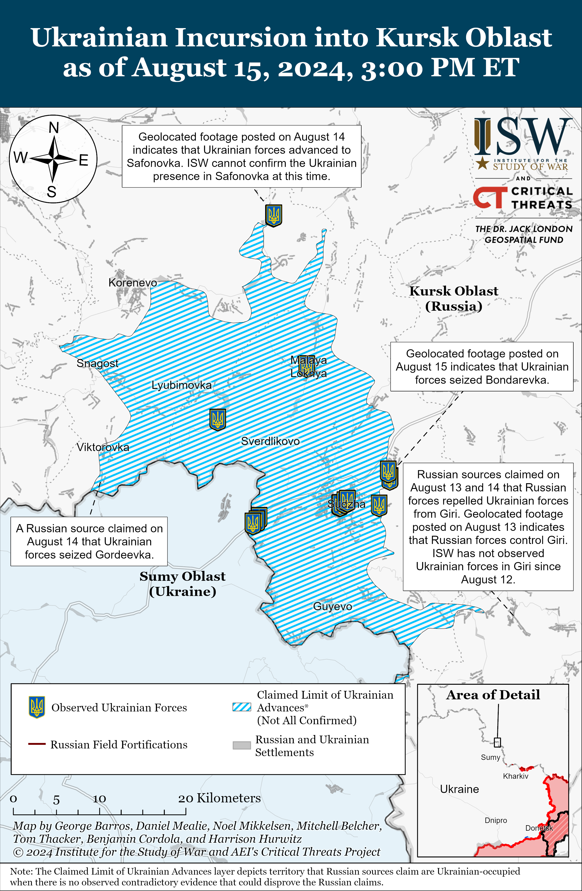](https://understandingwar.org/map/ukrainian-incursion-into-kursk-oblast-as-of-august-15-2024-300-pm-et/)

**Russian milbloggers claimed that Ukrainian forces continued advancing in some areas in Kursk Oblast amid a generally slower tempo of Ukrainian operations in the area.** A Russian milblogger claimed on August 14 that Ukrainian forces seized Gordeevka (just north of the international border and south of Korenevo).[6] Russian milbloggers claimed that fighting continued near Korenevo without any significant changes to the frontline.[7] Geolocated footage published on August 15 showing Ukrainian forces operating in Safonovka (northeast of Korenevo and 28km from the international border) indicates that Ukrainian forces recently advanced in the area.[8] The Russian Ministry of Defense (MoD) and other Russian sources claimed that Ukrainian forces continued attacking near Kauchuk (northeast of Korenevo and 27km from the international border).[9] Chechen Akhmat Spetsnaz Commander Apty Alaudinov claimed that Russian forces cleared Martynovka (just northeast of Sudzha) of Ukrainian forces, although Russian milbloggers claimed that fighting is ongoing near the settlement.[10] A prominent Kremlin-affiliated Russian milblogger claimed that Ukrainian forces seized Bondarevka (just east of Sudzha), and geolocated footage published on August 15 indicates that Ukrainian forces advanced within the settlement.[11] A prominent Kremlin-affiliated Russian milblogger claimed that Ukrainian forces advanced east of Plekhovo (south of Sudzha and 2km from the international border), and another Russian milblogger claimed that Ukrainian forces control the entire settlement.[12] Russian milbloggers claimed on August 13 and 14 that Russian forces repelled Ukrainian forces from Giri (southeast of Sudzha and 12km from the international border), and geolocated footage published on August 13 showing a Russian journalist reporting from the center of Giri indicates that Ukrainian forces likely withdrew from the settlement.[13] Geolocated footage published on August 14 and 15 showing Ukrainian forces operating well within the maximalist claimed limit of Ukrainian advances indicates that Ukrainian forces also continue operating closer to the international border within Kursk Oblast and within Sudzha.[14]

Several Ukrainian outlets reported on August 15 that sources within Ukraine’s Security Service (SBU) stated that Ukrainian forces took 102 Russian military personnel from the 488th Motorized Rifle Regiment (144th Motorized Rifle Division, 20th Combined Arms Army, Moscow Military District) and unspecified Chechen “Akhmat” units as prisoners of war in Kursk Oblast.[15] Elements of the Russian 200th Motorized Rifle Brigade (14th Army Corps, Leningrad Military District [LMD]) and “Grom-Kaskad” Unmanned Aerial Vehicle (UAV) Brigade, possibly Russia’s first-ever specialized drone brigade, are reportedly operating in Kursk Oblast.[16] Russian milbloggers also claimed that Ukrainian forces temporarily seized the Kolotilovka border checkpoint in Belgorod Oblast (on the international border southeast of Sudzha and northwest of Belgorod City) on the night of August 14 to 15 but that Russian forces swiftly responded and pushed Ukrainians back across the international border.[17] ISW has not observed visual evidence suggesting that Ukrainian forces have seized the Kolotilovka checkpoint.

**Russian forces are maintaining their relatively high offensive tempo in Donetsk Oblast, demonstrating that the Russian military command continues to prioritize advances in eastern Ukraine even as Ukraine is pressuring Russian forces within Kursk Oblast.** Russian forces are continuing to pursue a tactical encirclement of Ukrainian forces southeast of Pokrovsk.[18] Geolocated footage published on August 14 and 15 indicates that Russian forces recently advanced east of Pokrovsk within Hrodivka and southeast of Pokrovsk within Mykolaivka, Zhelanne, and Orlivka, and ISW assesses that Russian forces likely seized Orlivka and Zhelanne.[19] Russian forces have also continued mechanized assaults near Donetsk City over the past several weeks. Geolocated footage published on August 13 and 15 shows Ukrainian forces repelling a roughly company-sized Russian mechanized assault near Heorhiivka (west of Donetsk City) and a reduced company-sized Russian mechanized assault near Mykilske (southwest of Donetsk City).[20] Geolocated footage published on August 11 shows Russian forces conducting a roughly company-sized mechanized assault southeast of Heorhiivka.[21] Ukrainian Tavriisk Group of Forces Spokesperson Captain Dmytro Lykhovyi stated on August 15 that there have also been no significant changes to the Russian force grouping in southern Ukraine and that Russian forces are not decreasing their offensive operations in the area.[22]

Russia has begun moving certain elements from Ukraine to respond to the situation in Kursk Oblast, but the types of units that are redeploying, and where they are redeploying from, is a strong indicator that the Russian military command is still prioritizing ongoing offensive operations in eastern Ukraine. *CNN* reported on August 15 that two senior US officials stated that the Russian military command has redeployed multiple “brigade-sized” elements made up of at least 1,000 personnel each from unspecified areas to Kursk Oblast.[23] Two sources familiar with Western intelligence reportedly stated that the Russian military command is not moving larger and better-trained elements from unspecified areas of Ukraine to Kursk Oblast, with one source stating that the lack of substantial Russian redeployments may be because the Russian military command is just starting this process or because there are not enough forces to conduct redeployments. *CNN* also reported that US National Security Spokesperson John Kirby stated that Russia has not “given up” military operations in northeastern or southern Ukraine, where active fighting is ongoing. ISW has not observed reports in the open source that the Russian military command is redeploying entire brigades from Ukraine to Kursk Oblast but has observed reports of elements of Russian regiments redeploying to the area.[24] ISW continues to assess that the Russian military command is pulling select elements of Russian irregular units from Donetsk Oblast to address the Ukrainian incursion in Kursk Oblast but will likely be extremely averse to pulling Russian military units engaged in combat from priority sectors in Donetsk Oblast out of concerns about slowing the tempo of Russian operations in these areas.[25]

**The Kremlin and the Russian military command are creating a complicated, overlapping, and so far, ineffective command and control (C2) structure for the Russian response to the Ukrainian incursion in Kursk Oblast.** Russian Defense Minister Andrei Belousov announced on August 15 the creation of a “coordination council” within the Russian Ministry of Defense (MoD) for military and security issues in Belgorod, Bryansk, and Kursk oblasts.[26] Belousov stated that the coordination council aims to improve support for Russian forces covering the state border and will specifically oversee the effective provision of materiel and equipment to forces in the area, coordination between forces responding to threats along the state border, engineering development in the area, and military medical support.[27] Belousov added that the coordination council will assist civilian authorities with evacuations and take additional measures to protect civilians and infrastructure in Belgorod, Bryansk, and Kursk oblasts.[28] Belousov did not comment on how the coordination council will interact with the existing C2 structure that the Kremlin established when it tasked the Russian Federal Security Service (FSB) with conducting a counterterrorism operation in Belgorod, Bryansk, and Kursk oblasts on August 9.[29] The MoD’s coordination council and the FSB’s counterterrorism operation will likely generate continued confusion about what structures are responsible for what aspects of the Russian defensive operation in Kursk Oblast and will likely lead to friction between the FSB and the Russian military.[30] Russian President Vladimir Putin has provided overlapping tasks to the Russian MoD, FSB, and Rosgvardia in Kursk Oblast, and these entities have not yet taken visible steps to establish a clearer division of responsibilities.[31] Russian forces have reportedly redeployed up to 11 battalions from areas of Kursk Oblast and elsewhere in the theater to respond to the Ukrainian incursion, and this hastily assembled force grouping will likely struggle to coordinate combat operations given the Kremlin’s confused approach to C2 so far.[32]

**The delayed establishment of a complicated Russian C2 structure in Kursk Oblast continues to highlight the fact that the Kremlin failed to plan for the possibility of a significant Ukrainian incursion into Russia.** The Kremlin and the Russian military command have treated the Russian border with northeastern Ukraine as a dormant sector of the front since Fall 2022 and likely did not sufficiently plan contingencies for defending Russian territory.[33] The Kremlin and the Russian military command would likely have established a more cohesive and clearer C2 structure more quickly if they had had standing plans for defending against a Ukrainian incursion. Putin’s continued reluctance to declare martial law and acknowledge that Russia is in a state of war — as opposed to the “special military operation” he declared when he launched the full-scale invasion in February 2022 and has maintained in the subsequent two and a half years — has likely heavily shaped the contingencies that the Kremlin and the Russian military command assess Russia must plan for and what types of activities in Ukraine and Russia the Kremlin is willing to publicly acknowledge.[34] The Ukrainian incursion into Kursk Oblast will likely expand the Kremlin’s consideration for what type of Ukrainian operations are possible along the border and highlight that Putin and the Kremlin have suffered from a strategic failure of imagination.[35]

**The Kremlin appears to have a more coordinated approach to securing its control over the Russian information space than to addressing its military and C2 problems in Kursk Oblast.** Russian government officials and propagandists have seemingly begun a concerted campaign to discredit non-Kremlin affiliated milbloggers and social media sources that amplify information about the Ukrainian operations in Kursk Oblast in the immediate aftermath of the incursion.[36] Russian State Duma Deputy Dinar Gilmutdinov publicly accused Russian milbloggers and war correspondents (*voyenkory* in Russian) on August 15 of spreading “fake” information, likely as part of the Kremlin’s ongoing efforts to silence Russian milbloggers that it has not coopted.[37] Gilmutdinov called on the Russian Ministry of Defense (MoD), the Russian General Prosecutor’s Office, and the Federal Security Service (FSB) to harshly censor information appearing on social media, claiming that such information creates panic and is advantageous for Ukrainian forces. Gilmutdinov added that fellow State Duma Deputy Yevgeniy Revenko similarly expressed his concern that select Russian milbloggers are responsible for committing “information sabotage.” Russian propagandists and local officials have similarly been encouraging Russians not to trust social media reports about the situation in Kursk Oblast and have even accused some Russian milbloggers of deliberately spreading Ukrainian misinformation.[38] Some Russian milbloggers interpreted Gilmutdinov’s and Russian state media’s recent attacks on the broader milblogger community as an attempt to “jail bloggers and *voyenkory*” and censor accurate reporting about the situation in Kursk Oblast so that propagandists can claim that Russia repelled the Ukrainian incursion.[39] Some milbloggers pointed out that Russian milbloggers, such as imprisoned former Russian officer Igor Girkin, had long warned about the vulnerability of the Russian international border.[40]

**The Kremlin is likely trying to hastily create a new information space that predominantly features co-opted Russian milbloggers and established Russian state propagandists.** The Head of the United Russia Party’s Central Executive Committee, Alexander Sidyakin, called on Gilmutdinov to leave milbloggers alone and argued that some milbloggers routinely meet with Russian President Vladimir Putin and senior Russian MoD leadership.[41] Sidyakin claimed that Russian milbloggers also help Russia counter Ukrainian misinformation, although his defense of the Russian milblogger community likely aims to defend the credibility of a few Kremlin-affiliated milbloggers that the Russian government had successfully coopted since at the earliest late 2022. A Kremlin insider source claimed that the Kremlin had been working on co-opting Russian milbloggers and *voyenkory* who had previously disseminated alarmist messages about the Ukrainian incursion into Kursk Oblast.[42] A Kremlin-affiliated milblogger also claimed that Russian Defense Minister Andrei Belousov notably met with Kremlin-affiliated milbloggers during the “Army-2024” forum, which took place during the incursion.[43] Putin signed a law on August 8 that obliges all Russian milbloggers and social media users with over 10,000 followers to register with Russian state censor Roskomnadzor, and Russian military and political bloggers referenced the passage of this law in their responses to Gilmutdinov.[44] The Kremlin is likely attempting to expedite its long-term efforts to censor non-Kremlin affiliated milbloggers to prevent any political or social threats against Putin’s regime amidst the incursion, instead of focusing on committing necessary military means to address the incursion.

**Ukrainian forces are reportedly using Western-provided equipment in Kursk Oblast but remain limited in their ability to strike Russian military targets within Russia with Western-provided weapons.** The United Kingdom Ministry of Defense (UK MoD) stated on August 15 that Ukraine has the right to defend itself, including by conducting operations inside Russia, and can use British-provided equipment and weapons in line with international law to defend itself, but emphasized that restrictions on Ukraine’s use of British-provided Storm Shadow missiles to strike Russian territory remain in place.[45] *Reuters* and *BBC* reported that a British source stated that Ukrainian forces have used UK-provided Challenger 2 tanks during the incursion in Kursk Oblast.[46] *Politico* reported that an official in the Biden administration and two sources familiar with policy discussions stated that the White House is “open” to sending Joint Air-to-Surface Standoff Missiles (JASSM) to Ukraine but has not made a final decision.[47] The White House is reportedly working on the details of the possible transfer of sensitive technology to Ukraine, and the Pentagon is reportedly working with Ukraine to ensure that Ukrainian F-16 aircraft could launch the JASSM.

**Ukraine is organizing the creation of a humanitarian corridor through which to evacuate Russian civilians who are impacted by the ongoing Kursk operation, filling an apparent vacuum left by the Kursk Oblast administration and fulfilling international legal requirements for the evacuation of civilian populations.** Ukrainian Deputy Prime Minister and Minister of Reintegration of Temporarily Occupied Territories Iryna Vereshchuk announced on August 15 that Ukrainian officials are currently working with the Ukrainian military to create a possible humanitarian corridor to evacuate civilians from Kursk Oblast to Sumy Oblast.[48] Vereshchuk also noted that the Ukrainian Ministry of Reintegration is running a 24-hour hotline for Kursk Oblast residents who need humanitarian aid or want to evacuate to Ukraine.[49] Vereshchuk also emphasized that Russia has not yet made a request to Ukrainian authorities to open a humanitarian corridor running further into Russia (as opposed to into Ukraine), so Ukraine is currently unable to legally facilitate the creation of such an evacuation route.[50] Kursk Oblast authorities appear to be hesitant tofully respond to the situation, likely out of fear of reacting in a way that is dissonant with the Kremlin’s disjointed response to Ukrainian military operations within Russia.[51]

International humanitarian law holds certain legal requirements for the evacuation of civilian populations in specific conflict situations in order to safeguard civilian life, and Ukrainian authorities so far appear committed to fulfilling these requirements.[52] Protocol 4 of the Geneva Convention, which pertains to the protection of civilians during war, requires that the “occupying power” (in this case Ukraine, as Ukraine is exercising some extent of control over territories within Russia) “undertake total or partial evacuation” of an area if necessitated by the military situation in the area.[53] The Geneva Convention also requires that the occupying power does not remove civilians from the occupied territory unless it is “impossible to avoid such displacement.” Vereshchuk’s statements about the humanitarian corridor strongly suggest that Russian authorities are doing little to nothing to coordinate with Ukraine to enable civilian evacuations further into Russia, which means that some civilians may choose to go to Ukraine for safety in the absence of a viable alternative provided by Russian authorities. Ukrainian authorities also continue to emphasize that whether and where Russian civilians evacuate to is entirely a matter of personal choice — consistent with the international legal prohibition on forced population transfers.[54] ISW has long reported on Russia’s apparent violation of this legal stipulation in Ukraine and has detailed Russia’s forced population transfers of Ukrainian civilians since 2022.[55]

**The Ukrainian General Staff reported that Ukrainian forces successfully conducted drone strikes against Russian air bases in Russia on the night of August 13 to 14.[56]** The Ukrainian General Staff stated on August 14 that Ukraine’s Special Operations Forces (SSO), Air Force, Security Service (SBU), and Main Military Intelligence Directorate (GUR) conducted drone strikes against four Russian air bases: Khalino in Kursk City, Savasleyka in Nizhny Novgorod Oblast, and Borisoglebsk and Baltimor in Voronezh Oblast. The Ukrainian General Staff stated that the Russian military bases Su-34 fighter-bombers and Su-35 fighter aircraft at these airfields and that the strikes damaged fuel storage facilities and unspecified aviation weapons. *Radio Svoboda* published satellite imagery captured on August 14 indicating that Ukrainian strikes damaged a warehouse at the Savasleyka Air Base.[57]

**Key Takeaways:**

- **Ukrainian officials are taking steps to consolidate and coordinate the management of ongoing Ukrainian operations in Kursk Oblast while continuing to highlight Ukrainian advances.**
- **Russian milbloggers claimed that Ukrainian forces continued advancing in some areas in Kursk Oblast amid a generally slower tempo of Ukrainian operations in the area.**
- **Russian forces are maintaining their relatively high offensive tempo in Donetsk Oblast, demonstrating that the Russian military command continues to prioritize advances in eastern Ukraine even as Ukraine is pressuring Russian forces within Kursk Oblast.**
- **The Kremlin and the Russian military command are creating a complicated, overlapping, and so far, ineffective command and control (C2) structure for the Russian response to the Ukrainian incursion in Kursk Oblast.**
- **The delayed establishment of a complicated Russian C2 structure in Kursk Oblast continues to highlight the fact that the Kremlin failed to plan for the possibility of a significant Ukrainian incursion into Russia.**
- **The Kremlin appears to have a more coordinated approach to securing its control over the Russian information space than to addressing its military and C2 problems in Kursk Oblast.**
- **The Kremlin is likely trying to hastily create a new information space that predominantly features coopted Russian milbloggers and established Russian state propagandists.**
- **Ukrainian forces are reportedly using Western-provided equipment in Kursk Oblast but remain limited in their ability to strike Russian military targets within Russia with Western-provided weapons.**
- **Ukraine is organizing the creation of a humanitarian corridor through which to evacuate Russian civilians who are impacted by the ongoing Kursk operation, filling an apparent vacuum left by the Kursk Oblast administration and fulfilling international legal requirements for the evacuation of civilian populations.**
- **The Ukrainian General Staff reported that Ukrainian forces successfully conducted drone strikes against Russian air bases in Russia on the night of August 13 to 14.**
- **Russian forces recently made confirmed advances in the Pokrovsk and Toretsk directions.**
- **The Russian government submitted a bill on August 15 to lower the admission age for the Russian Volunteer Society for Assistance to the Army, Aviation, and Navy of Russia (DOSAAF) from 18 years of age to 14.**

**[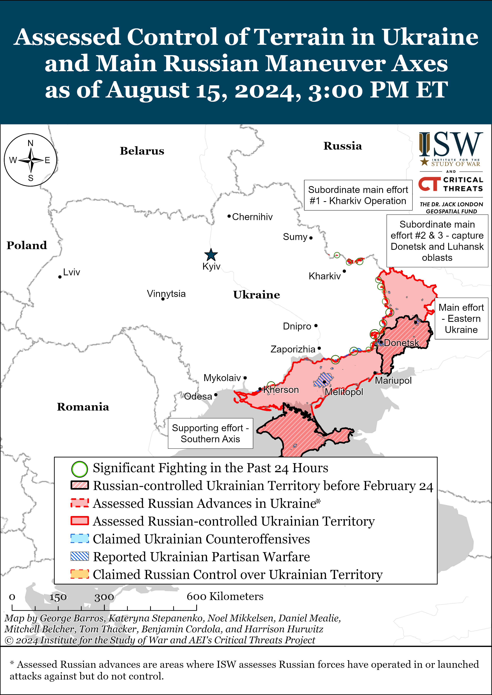](https://understandingwar.org/map/assessed-control-of-terrain-in-ukraine-and-main-russian-maneuver-axes-as-of-august-15-2024-300-pm-et/)**

***We do not report in detail on Russian war crimes because these activities are well-covered in Western media and do not directly affect the military operations we are assessing and forecasting. We will continue to evaluate and report on the effects of these criminal activities on the Ukrainian military and the Ukrainian population and specifically on combat in Ukrainian urban areas. We utterly condemn Russian violations of the laws of armed conflict and the Geneva Conventions and crimes against humanity even though we do not describe them in these reports.***

- Russian Main Effort – Eastern Ukraine (comprised of three subordinate main efforts)
- Russian Subordinate Main Effort #1 – Push Ukrainian forces back from the international border with Belgorod Oblast and approach to within tube artillery range of Kharkiv City
- Russian Subordinate Main Effort #2 – Capture the remainder of Luhansk Oblast and push westward into eastern Kharkiv Oblast and encircle northern Donetsk Oblast
- Russian Subordinate Main Effort #3 – Capture the entirety of Donetsk Oblast
- Russian Supporting Effort – Southern Axis
- Russian Air, Missile, and Drone Campaign
- Russian Mobilization and Force Generation Efforts
- Russian Technological Adaptations
- Activities in Russian-occupied areas
- Ukrainian Defense Industrial Base Efforts
- Russian Information Operations and Narratives
- Significant Activity in Belarus

**Russian Main Effort – Eastern Ukraine**

**Russian Subordinate Main Effort #1 – Kharkiv Oblast** **(Russian objective: Push Ukrainian forces back from the international border with Belgorod Oblast and approach to within tube artillery range of Kharkiv City)**

Russian forces continued ground assaults along the international border with Belgorod Oblast northwest of Kharkiv City near Sotnytskyi Kozachok on August 14 and 15.[58]

Russian forces continued ground assaults north of Kharkiv City near Lyptsi and Hlyboke and northeast of Kharkiv City near Starytsya and Vovchansk on August 14 and 15.[59] Russian milbloggers claimed that Russian forces advanced west of Hlyboke and near Lukyantsi (north of Kharkiv City) on August 15, but ISW has not observed confirmation of these claims.[60] Ukrainian Kharkiv Group of Forces Spokesperson Colonel Vitaly Sarantsev stated on August 15 that heavy Ukrainian electronic warfare (EW) coverage in northern Kharkiv Oblast forces small Russian assault groups to rely on wire connections for communications and that this is contributing to poor Russian communications for combat coordination.[61] Sarantsev added that poor Russian communications in northern Kharkiv Oblast have led to friendly fire incidents in which Russian artillery units have fired on Russian positions.[62] Ukraine’s Kharkiv Group of Forces reported that elements of the Russian 11th Tank Regiment (18th Motorized Rifle Division, 11th Army Corps [AC], Leningrad Military District [LMD]) are operating near Hlyboke, that elements of the 7th Motorized Rifle Regiment (11th AC, LMD) are operating near Lyptsi, and that elements of the 83rd Airborne (VDV) are operating near Tykhe (northeast of Kharkiv City).[63]

[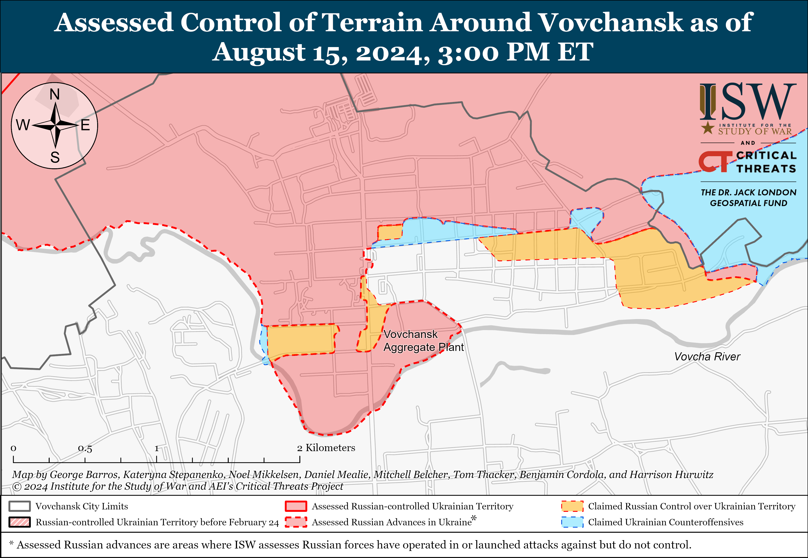](https://understandingwar.org/map/assessed-control-of-terrain-around-vovchansk-as-of-august-15-2024-300-pm-et/)

Russian aviation has reportedly significantly decreased activity in northern Kharkiv Oblast since Ukrainian forces launched their incursion into Kursk Oblast on August 6. Sarantsev stated on August 15 that Russian aircraft have recently launched two to four glide bombs against targets in Kharkiv Oblast daily whereas previously Russian aircraft launched 30 to 50 glide bombs against northern Kharkiv Oblast.[64] ISW cannot independently verify these figures. Sarantsev stated that there are several factors that explain the decrease in Russian aviation activity in northern Kharkiv Oblast, including Russian attention on more prioritized sectors of the frontline and recent Ukrainian strikes against Russian aviation assets within Russia.[65]

[**[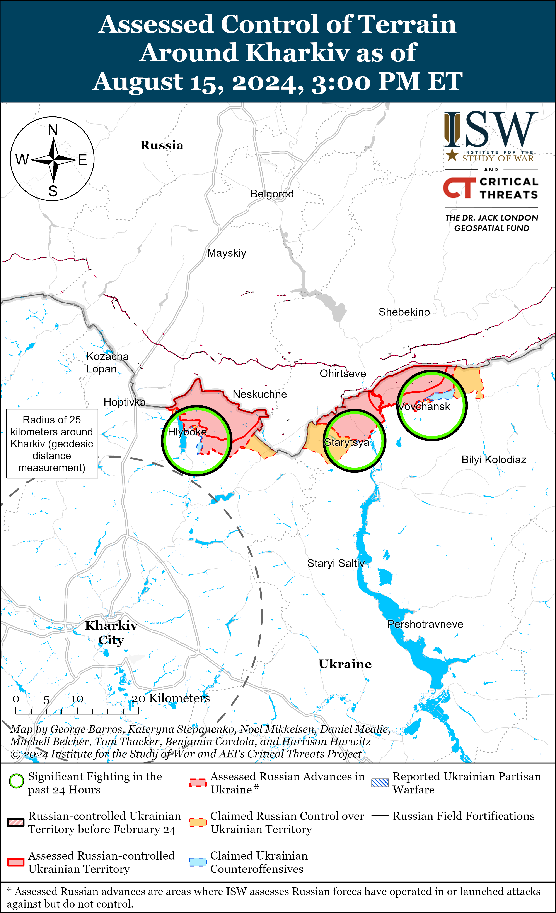](https://understandingwar.org/map/assessed-control-of-terrain-around-kharkiv-as-of-august-15-2024-300-pm-et/)**](https://understandingwar.org/wp-content/uploads/2025/05/Kharkiv20Battle20Map20Draft20August20152C202024.png)

**Russian Subordinate Main Effort #2 – Luhansk Oblast** **(Russian objective: Capture the remainder of Luhansk Oblast and push westward into eastern Kharkiv Oblast and northern Donetsk Oblast)**

Russian forces continued ground attacks along the Kupyansk-Svatove-Kreminna line on August 15, but there were no confirmed changes to the frontline. The Ukrainian General Staff reported that Russian forces attacked northeast of Kupyansk near Synkivka; east of Kupyansk near Petropavlivka; southeast of Kupyansk near Hlushkivka, Kruhlyakivka, Berestove, and Stelmakhivka; northwest of Kreminna near Makiivka and Nevske; and west of Kreminna near Terny on August 14 and 15.[66]

**[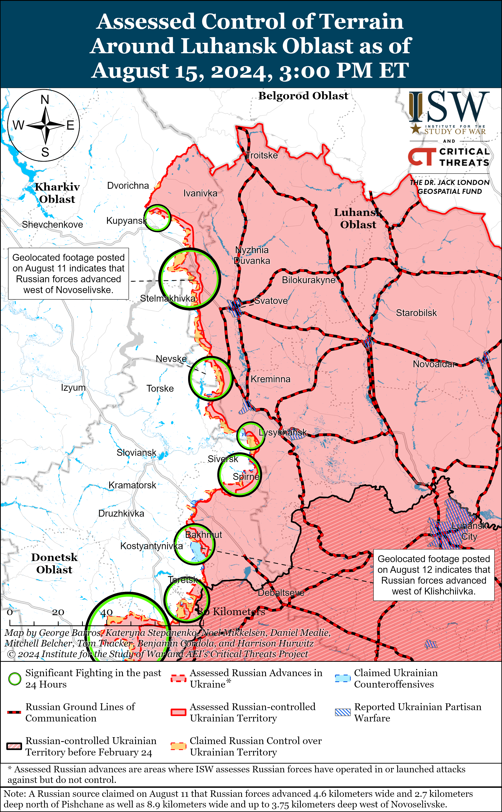](https://understandingwar.org/map/assessed-control-of-terrain-around-luhansk-oblast-as-of-august-15-2024-300-pm-et/)**

**Russian Subordinate Main Effort #3 – Donetsk Oblast** **(Russian objective: Capture the entirety of Donetsk Oblast, the claimed territory of Russia’s proxies in Donbas)**

The Ukrainian General Staff reported that Russian forces conducted offensive operations northeast of Siversk near Bilohorivka; east of Siversk near Verkhnokamyanske; southeast of Siversk near Spirne and Vyimka; and south of Siversk near Pereizne on August 14 and 15.[67]

Russian forces continued offensive operations near Chasiv Yar on August 15, but there were no confirmed changes to the frontline. The Ukrainian General Staff reported that Russian forces conducted offensive operations near Chasiv Yar and southeast of Chasiv Yar near Andriivka on August 14 and 15.[68] A Russian milblogger claimed that Russian forces advanced southwest of Klishchiivka (southeast of Chasiv Yar), but ISW has not observed confirmation of this claim.[69]

[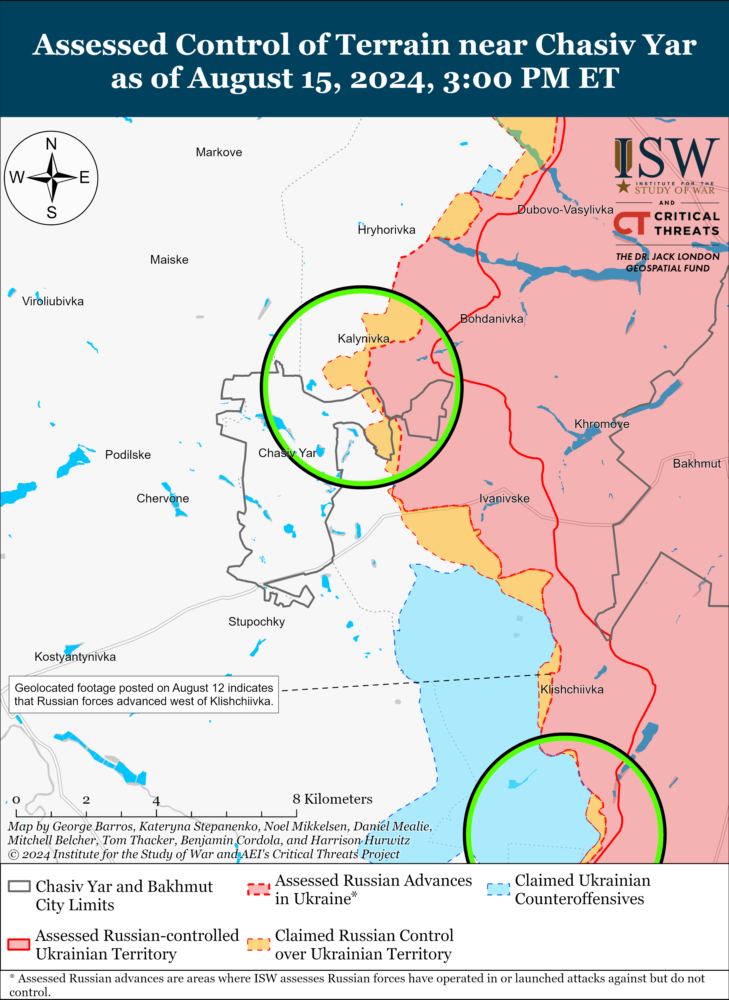](https://understandingwar.org/map/assessed-control-of-terrain-near-chasiv-yar-as-of-august-15-2024-300-pm-et/)

Russian forces reportedly advanced near Toretsk on August 15, but there were no confirmed changes to the frontline. Russian milbloggers claimed that elements of the Russian 109th Motorized Rifle Regiment (1st “Slovyansk” Motorized Rifle Brigade, 1st Donetsk People’s Republic [DNR] Army Corps [AC]) seized Zalizne (southeast of Toretsk).[70] Russian sources also claimed that Russian forces advanced within Pivnichne (northeast of Toretsk), near Niu York (south of Toretsk), towards Panteleymonivka (southwest of Toretsk), and up to 3.5 kilometers wide and 1.47 kilometers deep within Niu York.[71] ISW has not observed confirmation of these claims, however. Russian forces conducted offensive operations near Toretsk, northeast of Toretsk near Zalizne and Pivnichne, south of Toretsk near Niu York and Nelipivka, and southwest of Toretsk near Panteleymonivka on August 14 and 15.[72] A Russian milblogger claimed that Ukrainian forces unsuccessfully counterattacked within Pivnichne.[73]

[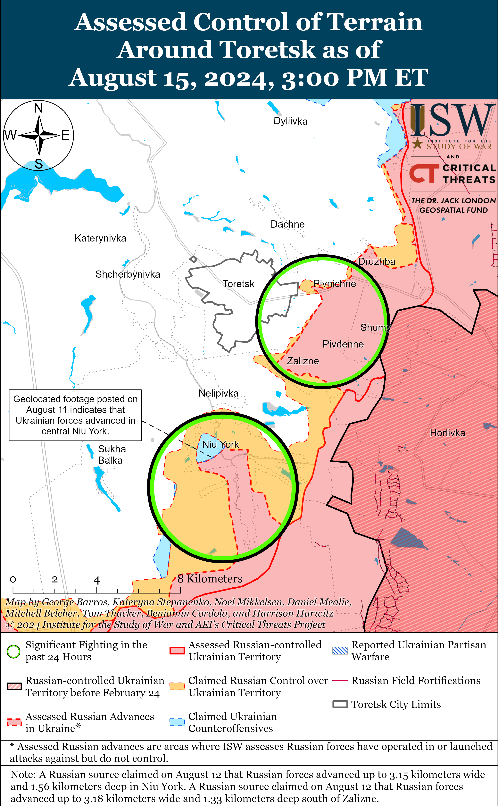](https://understandingwar.org/map/assessed-control-of-terrain-around-toretsk-as-of-august-15-2024-300-pm-et/)

Russian forces continue to pursue a tactical encirclement of Ukrainian forces southeast of Pokrovsk and recently made confirmed advances in the area. Geolocated footage published on August 14 and 15 indicates that Russian forces recently advanced within Hrodivka (east of Pokrovsk), Mykolaivka, Zhelanne, and Orlivka (all southeast of Pokrovsk) and likely seized Zhelanne and Orlivka.[74] Russian sources claimed that Russian forces advanced near and within Zhuravka (southeast of Pokrovsk) and advanced a total of 5.24 kilometers wide along a 2.2 kilometers deep front in the Zhuravka-Orlivka-Mykolaivka-Zhelanne area.[75] The Russian Ministry of Defense (MoD) claimed that Russian forces seized Ivanivka (east of Pokrovsk), and ISW assessed that Russian forces seized the settlement as of August 13[76] Russian sources claimed that Russian forces also advanced towards Novohrodivka (southeast of Pokrovsk) and seized Novotoretske (east of Pokrovsk).[77] Russian forces conducted offensive operations northeast of Pokrovsk near Zelene Pole; east of Pokrovsk near Vozdvyzhenka, Kalynove, Novotoretske, Mykolaivka, Yelyzavetivka, and Hrodivka; and southeast of Pokrovsk near Novohrodivka, Skuchne, Orlivka, Yasnobrodivka, Ptychne, and Zhelanne on August 14 and 15.[78] A Ukrainian soldier operating in the Pokrovsk direction stated on August 15 that Russian forces have a 10-to-1 infantry advantage in the area and conduct infantry-led assaults from just before sunrise to just after sunset each day.[79] Another Ukrainian soldier stated that Russian forces are fewer than six kilometers from Selydove (southeast of Pokrovsk), which is consistent with ISW’s assessment of Russian advances in the area.[80]

[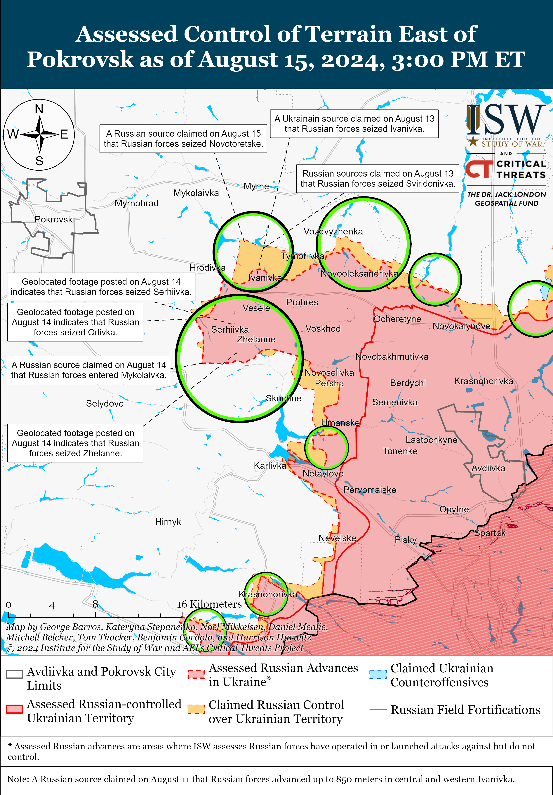](https://understandingwar.org/map/assessed-control-of-terrain-east-of-pokrovsk-as-of-august-15-2024-300-pm-et/)

Russian forces continued offensive operations west and southwest of Donetsk City on August 15 but did not make any confirmed advances. Geolocated footage published on August 15 shows Ukrainian forces repelling a roughly company-sized Russian mechanized assault along the H-15 highway into Heorhiivka (west of Donetsk City).[81] Additional geolocated footage published on August 13 shows Ukrainian forces repelling a reduced company-sized Russian mechanized assault near Mykilske (southwest of Donetsk City).[82] Russian milbloggers claimed that Russian forces advanced in northern Krasnohorivka (west of Donetsk City) and into central Kostyantynivka (southwest of Donetsk City).[83] Fighting continued west of Donetsk City near Krasnohorivka and Heorhiivka and southwest of Donetsk City near Kostyantynivka, Vodyane, and Vuhledar on August 14 and 15.[84] Elements of the Russian 5th Motorized Rifle Brigade (1st DNR AC) and 238th Artillery Brigade and 20th Motorized Rifle Division (both of the 8th CAA, Southern Military District [SMD]) reportedly continue operating in the Kurakhove direction (west and southwest of Donetsk City).[85] Elements of the Russian 103rd Motorized Rifle Regiment (150th Motorized Rifle Division, 8th CAA, SMD) reportedly continue operating near Maksymilyanivka; and drone operators of the Russian “Aleppo” unit are reportedly operating southwest of Donetsk City.[86]

[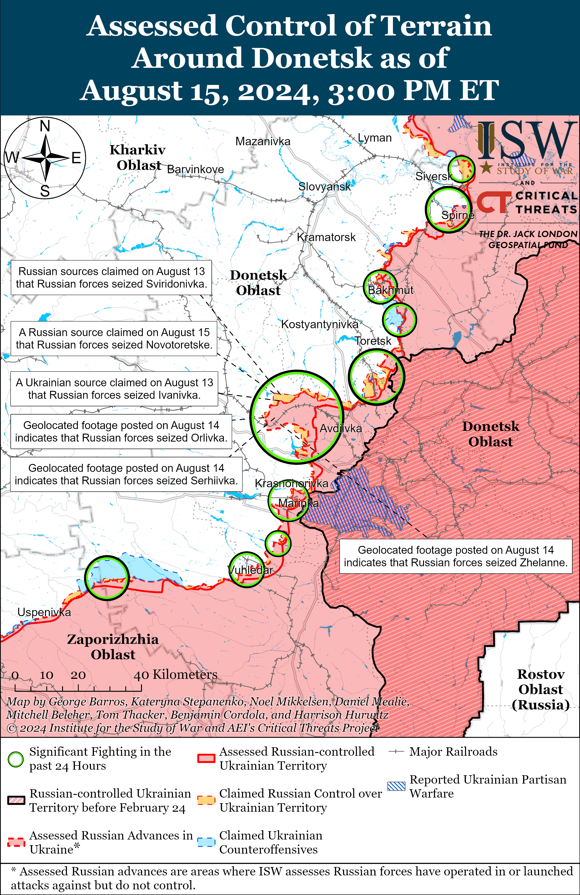](https://understandingwar.org/map/assessed-control-of-terrain-around-donetsk-as-of-august-15-2024-300-pm-et/)

Russian and Ukrainian sources did not report any fighting in the Donetsk-Zaporizhia Oblast border area on August 15.

**Russian Supporting Effort – Southern Axis** **(Russian objective: Maintain frontline positions and secure rear areas against Ukrainian strikes)**

Russian forces continued limited offensive operations in western Zaporizhia Oblast on August 15 but did not make any confirmed advances. The Ukrainian General Staff reported that Russian forces conducted ground attacks near Mala Tokmachka (northeast of Robotyne) and Novodanylivka (north of Robotyne).[87] Ukrainian Tavriisk Group of Forces Spokesperson Captain Dmytro Lykhovyi reported that a small Russian detachment unsuccessfully attacked near Robotyne on August 14 without armored vehicle support.[88] Lykhovyi noted that the entire Russian grouping deployed in the Zaporizhia direction, including frontline positions and throughout the rear, is comprised of about 75,000 personnel.[89] Elements of the Russian 42nd Motorized Rifle Division (58th Combined Arms Army [CAA], Southern Military District [SMD] reportedly continue to operate in the Orikhiv (western Zaporizhia) direction.[90]

[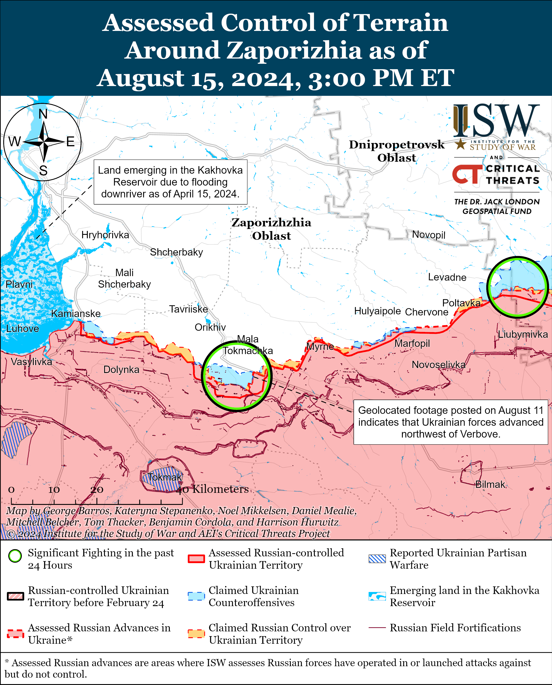](https://understandingwar.org/map/assessed-control-of-terrain-around-zaporizhia-as-of-august-15-2024-300-pm-et/)

Limited positional engagements continued in east (left) bank Kherson Oblast, including near Krynky, on August 15.[91] Lykhovyi stated that the battlefield situation just north of Krynky is very difficult and noted that Russian forces have intensified attacks near Krynky over the past week.[92] Elements of the Russian 31st Air Assault (VDV) Brigade and 76th VDV Division reportedly continue to operate in east bank Kherson Oblast.[93]

**[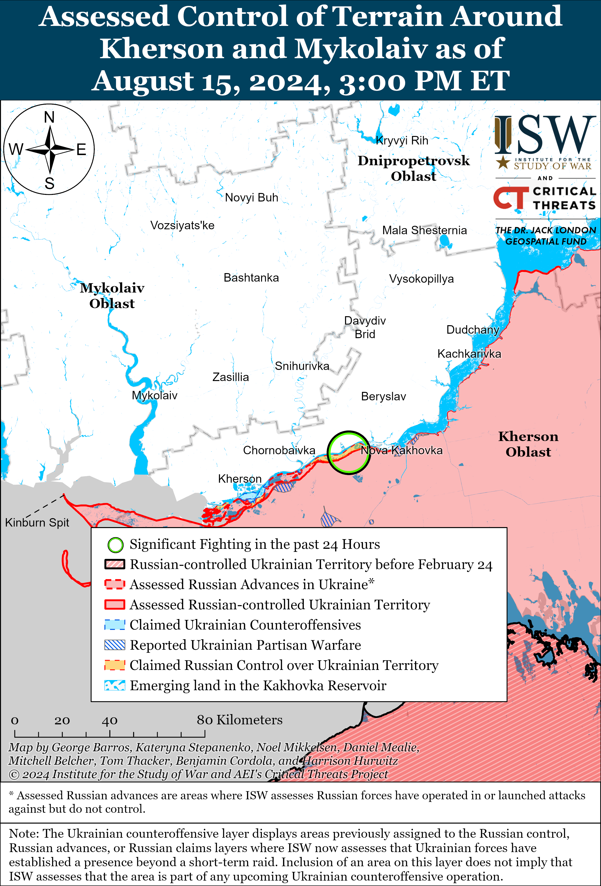](https://understandingwar.org/map/assessed-control-of-terrain-around-kherson-and-mykolaiv-as-of-august-15-2024-300-pm-et/)**

**Russian Air, Missile, and Drone Campaign** **(Russian Objective: Target Ukrainian military and civilian infrastructure in the rear and on the frontline)**

Russian forces conducted a combined series of missile and drone strikes against Ukraine on the night of August 14 to 15. Ukrainian Air Force Commander Lieutenant General Mykola Oleshchuk stated that Russian forces launched three Kh-59 cruise missiles from Kursk Oblast and 29 Shahed drones from Primorsko-Akhtarsk and Yeysk, Krasnodar Krai, and Kursk Oblast.[94] Oleshchuk reported that Ukrainian forces shot down all 29 Shaheds over Mykolaiv, Cherkasy, Kirovohrad, Kherson, Zaporizhia, Sumy, Chernihiv, and Kyiv oblasts. Ukraine’s Southern Operational Command reported that Russian forces struck port infrastructure in Odesa City, likely with an Iskander-M ballistic missile, on the night of August 14 and struck Kherson Oblast with air defense missiles on the morning of August 15.[95]

**Russian Mobilization and Force Generation Efforts** **(Russian objective: Expand combat power without conducting general mobilization)**

The Russian government submitted a bill on August 15 to lower the admission age for the Russian Volunteer Society for Assistance to the Army, Aviation, and Navy of Russia (DOSAAF) from 18 years of age to 14.[96] The proposed bill specified that Russian citizens who have reached the age of 14, as well as public associations and non-profit organizations (NGOs), will be able to join DOSAAF. DOSAAF defines itself as an organization that promotes patriotic and military education and defense training.[97] DOSAAF also focuses on training Russians who are in the Russian mobilization reserve (*zapas*). DOSAAF Chairperson Army General Alexander Dvornikov (former Southern Military District commander and failed Russian theater commander in Ukraine from April-May 2022) previously announced on May 13 that DOSAAF is lowering its membership age from 18 to 14.[98]

The Russian military is attempting to address low enrollment rates in Russian military command schools by recruiting Russian servicemen fighting in Ukraine to undergo junior officer training. A Kremlin-affiliated milblogger claimed that Russian regiment commanders began selecting distinguished sergeants and informal leaders among enlisted personnel to participate in the junior officer courses.[99] The milblogger added that some selected Russian soldiers are using the junior officer courses as a way to rest from combat operations and observed that participants who are older than 30 are seizing on this opportunity. The milblogger noted that Russians’ interest in attending military schools had notably decreased during Russia’s full-scale invasion of Ukraine and that the military needs to search for prospective candidates in schools, lyceums, and colleges. The milblogger claimed that there is a misconception that Russian military command schools are only searching for highly qualified candidates and that these schools should incentivize students from the entire country, including villages, to enroll. The milblogger’s observation highlights an ongoing trend in which the Russian military is increasingly abandoning efforts to professionalize its forces in support of the Russian war effort in Ukraine.

A Russian Eastern Military District (EMD) contingent arrived in Mongolia on August 15 to participate in the joint Russian-Mongolian “Selenga-2024” military exercises.[100] The Russian Ministry of Defense (MoD) claimed that Russian and Mongolian forces will conduct shooting exercises, perform unspecified tactical actions, and practice repelling an illegal armed formation. The Russian MoD added that Russian and Mongolian forces have been conducting the ”Selenga” exercises annually since 2008.

**Russian Technological Adaptations (Russian objective: Introduce technological innovations to optimize systems for use in Ukraine)**

Russian developers of the “Volnorez” electronic warfare (EW) radio jamming system presented a new Russian anti-drone EW system “Volnorez X” for helicopters at the “Army-2024” forum.[101] Ukrainian defense outlet *Militarnyi* reported that Russian developers adapted the ”Volnorez” system for installation in helicopters after a series of successful Ukrainian first-person view (FPV) drone strikes on Russian attack helicopters in Kursk Oblast.[102]

The Russian United Aircraft Corporation presented at the ”Army-2024” forum a new S-76 unmanned off-airfield transport system with vertical take-off and landing capabilities.[103] The S-76 unmanned system (UAV) reportedly will be able to transport cargo weighing up to 300 kilograms, have a maximum flight range of 1,000 kilometers, a flight altitude of up to four kilometers, and a maximum speed of 180 kilometers per hour.[104]

**Ukrainian Defense Industrial Efforts (Ukrainian objective: Develop its defense industrial base to become more self-sufficient in cooperation with US, European, and international partners)**

*ISW is suspending publishing coverage of Ukrainian defense industrial efforts until further notice.*

**Activities in Russian-occupied areas** **(Russian objective: Consolidate administrative control of annexed areas; forcibly integrate Ukrainian citizens into Russian sociocultural, economic, military, and governance systems)**

*ISW is not publishing coverage of activities in Russian-occupied areas today.*

**Russian Information Operations and Narratives**

Nothing significant to report.

**Significant activity in Belarus** **(Russian efforts to increase its military presence in Belarus and further integrate Belarus into Russian-favorable frameworks and Wagner Group activity in Belarus)**

Belarusian President Alexander Lukashenko amplified several common Kremlin information operations during an interview with Belarusian state media on August 15.[105] Lukashenko reiterated boilerplate nuclear threats and blamed the US and the collective West for starting and sustaining the war in Ukraine.

**Note: ISW does not receive any classified material from any source, uses only publicly available information, and draws extensively on Russian, Ukrainian, and Western reporting and social media as well as commercially available satellite imagery and other geospatial data as the basis for these reports. References to all sources used are provided in the endnotes of each update.**

---

[1] https://www.facebook.com/CinCAFofUkraine/videos/511656901246977 ; https://t.me/osirskiy/808

[2] https://suspilne dot media/814253-ukraina-stvorila-vijskovu-komendaturu-v-kurskij-oblasti-aku-ocoliv-general-moskalov/; https://www.facebook.com/watch/?v=512280678121564 ; https://armyinform dot com.ua/2024/08/15/prezydent-u-zvilnenij-sudzhi-stvoryuyetsya-ukrayinska-vijskova-komendatura/; https://www.facebook.com/CinCAFofUkraine/videos/511656901246977 ; https://t.me/osirskiy/808

[3] https://www.ft.com/content/e296128b-9f7b-4af5-9951-719cda4af3ba ; https://t.me/dmytro\_lubinetzs/6437

[4] https://www.facebook.com/CinCAFofUkraine/videos/511656901246977 ; https://t.me/osirskiy/808

[5] https://suspilne dot media/814253-ukraina-stvorila-vijskovu-komendaturu-v-kurskij-oblasti-aku-ocoliv-general-moskalov/; https://isw.pub/UkrWar081224

[6] https://t.me/milinfolive/128418

[7] https://t.me/dva\_majors/49833 ; https://t.me/rybar/62798 ; https://t.me/wargonzo/21570

[8] https://t.me/rusich\_army/16553; https://t.me/dva\_majors/49908; https://t.me/harry\_homolsky/6790; https://x.com/giK1893/status/1824089121234554914; https://x.com/giK1893/status/1824110630594334778; https://x.com/giK1893/status/1824110972761464960; https://x.com/giK1893/status/1824128386127810745; https://t.me/lost\_warinua/86535; https://t.me/lost\_warinua/86530; https://x.com/giK1893/status/1823783559137501471; https://x.com/giK1893/status/1823783562417480049

[9] https://t.me/mod\_russia/42191 ; https://t.me/DnevnikDesantnika/14015 ; https://t.me/wargonzo/21570

[10] https://t.me/tass\_agency/266392 ; https://t.me/rybar/62798 ; https://t.me/wargonzo/21570

[11] https://t.me/rybar/62798; https://t.me/creamy\_caprice/6399; https://t.me/warriorofnorth/2091; https://x.com/moklasen/status/1823987547149607380

[12] https://t.me/rybar/62798 ; https://t.me/DnevnikDesantnika/14015

[13] https://t.me/warhistoryalconafter/179405; https://t.me/rybar/62764; https://t.me/rybar/62752; https://t.me/creamy\_caprice/6377; https://www.1tv dot ru/news/issue/2024-08-13/21:00#1

[14] (Nizhny Klin) https://t.me/warriorofnorth/2069; https://x.com/seanders\_geo/status/1823794947704938870

(Mikhailovka) https://x.com/moklasen/status/1823999610240553462; https://x.com/moklasen/status/1824003080377024860; https://t.me/iamsniper/6320; https://t.me/creamy\_caprice/6399

(Sudzha) https://t.me/WarArchive\_ua/18698; https://www.youtube.com/watch?v=fHn4AAIGAjM

[15] https://www.pravda.com dot ua/news/2024/08/15/7470484/ ; https://t.me/uniannet/142104 ; https://hromadske dot ua/ru/voyna/229499-sbu-vzyala-v-plen-102-voennyh-rf-v-kurskoy-oblasti-eto-samoe-bolshoe-kolichestvo-plennyh-vzyatyh-za-raz

[16] https://x.com/GirkinGirkin/status/1824051013239599593 ; https://t.me/voin\_dv/10283 ; https://understandingwar.org/backgrounder/russian-offensive-campaign-assessment-march-9-2024

[17] https://t.me/rybar/62800 ; https://t.me/dva\_majors/49880 ; https://t.me/RVvoenkor/74884 ; https://t.me/boris\_rozhin/133609; https://t.me/boris\_rozhin/133706

[18] https://understandingwar.org/backgrounder/russian-offensive-campaign-assessment-august-1-2024; https://understandingwar.org/backgrounder/russian-offensive-campaign-assessment-august-5-2024 ; https://understandingwar.org/backgrounder/russian-offensive-campaign-assessment-july-29-2024 ; https://understandingwar.org/backgrounder/russian-offensive-campaign-assessment-july-28-2024

[19] https://t.me/strikedronescompany/368; https://t.me/creamy\_caprice/6405; https://www.facebook.com/151OMBr/videos/1468772243775836; https://t.me/creamy\_caprice/6404; https://x.com/PuenteUribarri/status/1823809116676219314;

[20] https://x.com/DefenceU/status/1824027203383828807; https://x.com/MikiValbuena/status/1824040370184851511; https://x.com/klinger66/status/1824057037568835858; https://x.com/MikiValbuena/status/1824071156715999259 ; https://x.com/PuenteUribarri/status/1824030682718355856; https://x.com/klinger66/status/1824043300396925383; https://x.com/klinger66/status/1824051203342291019; https://x.com/klinger66/status/1824045963129811083; https://armyinform dot com.ua/2024/08/15/desantnyky-vykryty-shovanku-15-odynycz-bojovoyi-tehniky-rf-j-zupynyly-3-vorozhyh-kolony/; https://t.me/oaembr46/963; https://x.com/666\_mancer/status/1823799889949495389 ; https://t.me/ombr72/10211

[21] https://understandingwar.org/backgrounder/russian-offensive-campaign-assessment-august-11-2024; https://understandingwar.org/backgrounder/russian-offensive-campaign-assessment-august-6-2024

[22] https://armyinform dot com.ua/2024/08/15/pomitnoyi-peredyslokacziyi-pidrozdiliv-voroga-z-okupovanogo-ukrayinskogo-pivdnya-ne-vidbulosya/; https://youtu.be/WY8sDvZdWEA

[23] https://www.cnn.com/2024/08/15/politics/russia-has-diverted-several-thousand-troops-from-occupied-ukraine-to-counter-kursk-offensive-us-officials-say/index.html

[24] https://isw.pub/UkrWar081324 ; https://isw.pub/UkrWar081124

[25] https://isw.pub/UkrWar081324; https://isw.pub/UkrWar081324; https://isw.pub/UkrWar081024

[26] https://t.me/mod\_russia/42200

[27] https://t.me/mod\_russia/42200

[28] https://t.me/mod\_russia/42200

[29] https://isw.pub/UkrWar081024

[30] https://isw.pub/UkrWar081024 ; https://isw.pub/UkrWar081224

[31] https://isw.pub/UkrWar081224

[32] https://isw.pub/UkrWar081124

[33] https://isw.pub/UkrWar081124

[34] https://isw.pub/UkrWar081024

[35] https://isw.pub/UkrWar081124

[36] https://www.1tv dot ru/shows/vremya-pokazhet/vypuski/vremya-pokazhet-chast-2-vypusk-ot-09-08-2024; https://t.me/zhivoff/16292 ; https://t.me/philologist\_zov/1219

[37] https://t.me/dva\_majors/49834

[38] https://eadaily dot com/ru/news/2024/08/10/mer-sudzhi-prizval-ne-verit-ukrainskoy-propagande; https://www.1tv dot ru/shows/vremya-pokazhet/vypuski/vremya-pokazhet-chast-2-vypusk-ot-09-08-2024; https://t.me/regnum\_na/61758 ; https://t.me/philologist\_zov/1220

[39] https://t.me/zhivoff/16292 ; https://t.me/philologist\_zov/1219

[40] https://t.me/zhivoff/16292 ; https://t.me/philologist\_zov/1219

[41] https://t.me/dva\_majors/49885

[42] https://t.me/kremlin\_sekret/15779

[43] https://t.me/Sladkov\_plus/11175

[44] https://t.me/SergeyKolyasnikov/61938; https://t.me/NeoficialnyBeZsonoV/38661; https://t.me/tgrussia/29335

[45] https://www.reuters.com/world/europe/britain-says-ukraine-can-use-donated-weapons-inside-russia-2024-08-15/; https://www.independent.co.uk/news/uk/mod-ministry-of-defence-russia-british-labour-b2596499.html; https://www.barrons.com/news/ukraine-using-uk-gifted-tanks-in-russia-offensive-reports-7130afc7?refsec=topics\_afp-news; https://www.bbc.com/news/articles/c5yp0w149w1o

[46] https://www.bbc.com/news/articles/c5yp0w149w1o; https://www.reuters.com/world/europe/britain-says-ukraine-can-use-donated-weapons-inside-russia-2024-08-15/

[47] https://www.politico.com/news/2024/08/15/biden-missiles-ukraine-russia-00174147

[48] https://t.me/vereshchuk\_iryna/2424; https://t.me/vereshchuk\_iryna/2425

[49] https://t.me/vereshchuk\_iryna/2423

[50] https://t.me/vereshchuk\_iryna/2424

[51] https://isw.pub/UkrWar081324

[52] https://casebook.icrc.org/a\_to\_z/glossary/evacuation; https://ihl-databases.icrc.org/en/ihl-treaties/gciv-1949/article-49?activeTab=1949GCs-APs-and-commentaries

[53] https://ihl-databases.icrc.org/en/ihl-treaties/gciv-1949/article-49?activeTab=1949GCs-APs-and-commentaries

[54]https://ihl-databases.icrc.org/en/ihl-treaties/gciv-1949/article-49?activeTab=1949GCs-APs-and-commentaries; https://casebook.icrc.org/a\_to\_z/glossary/evacuation

[55] https://isw.pub/RusCampaignOct13; https://understandingwar.org/wp-content/uploads/2024/08/24-210-0120ISW20Occupation20playbook.pdf

[56] https://www.facebook.com/GeneralStaff.ua/posts/pfbid05kqUx7YtawpKgMaGVGtfdxqbp8mtYKL6xS5rirdKFjpgvyzcaPoVWA5tVNj8sukXl

[57] https://t.me/svoboda\_radio/29303

[58] https://www.facebook.com/GeneralStaff.ua/posts/pfbid02YYMDsqkoDQZQZMq2DgFnmpcCcVRvzBHYkwv3C1jnz3GDP91KE5vTWQSNyB9d8LBwl ; https://www.facebook.com/GeneralStaff.ua/posts/pfbid0mdaa3FDGWTu5QSVeM6cY7PTts8p5pNK6w2eehB62w7yZ6AWRTVSLdKgbQKUY3G7Hl

[59] https://www.facebook.com/GeneralStaff.ua/posts/pfbid02FqmNerHqBVkwsLRZs7qRVEmfSQbDQKAVQt6xWAFQVcRHLou6dyKnNKobFLKgzs1Xl ; https://www.facebook.com/GeneralStaff.ua/posts/pfbid02YYMDsqkoDQZQZMq2DgFnmpcCcVRvzBHYkwv3C1jnz3GDP91KE5vTWQSNyB9d8LBwl ; https://www.facebook.com/GeneralStaff.ua/posts/pfbid0mdaa3FDGWTu5QSVeM6cY7PTts8p5pNK6w2eehB62w7yZ6AWRTVSLdKgbQKUY3G7Hl ; https://t.me/wargonzo/21570

[60] https://t.me/z\_arhiv/27638 ; https://t.me/motopatriot/26228

[61] https://armyinform dot com.ua/2024/08/15/drotovyj-zvyazok-zmusheni-vykorystovuvaty-shturmovyky-okupantiv-na-harkivshhyni/; https://youtu.be/WY8sDvZdWEA

[62] https://armyinform dot com.ua/2024/08/15/artyleriyi-na-harkivshhyni-u-voroga-ne-brakuye-ale-chasom-vin-bye-po-svoyih/; https://youtu.be/WY8sDvZdWEA

[63] https://t.me/otukharkiv/747

[64] https://armyinform dot com.ua/2024/08/15/zmenshennya-kilkosti-udariv-kabamy-po-harkivshhyni-poyasnyly-v-otu-harkiv/; https://youtu.be/WY8sDvZdWEA

[65] https://armyinform dot com.ua/2024/08/15/zmenshennya-kilkosti-udariv-kabamy-po-harkivshhyni-poyasnyly-v-otu-harkiv/; https://youtu.be/WY8sDvZdWEA

[66] https://www.facebook.com/GeneralStaff.ua/posts/pfbid02FqmNerHqBVkwsLRZs7qRVEmfSQbDQKAVQt6xWAFQVcRHLou6dyKnNKobFLKgzs1Xl ; https://www.facebook.com/GeneralStaff.ua/posts/pfbid02YYMDsqkoDQZQZMq2DgFnmpcCcVRvzBHYkwv3C1jnz3GDP91KE5vTWQSNyB9d8LBwl ; https://www.facebook.com/GeneralStaff.ua/posts/pfbid0mdaa3FDGWTu5QSVeM6cY7PTts8p5pNK6w2eehB62w7yZ6AWRTVSLdKgbQKUY3G7Hl

[67] https://www.facebook.com/GeneralStaff.ua/posts/pfbid0mdaa3FDGWTu5QSVeM6cY7PTts8p5pNK6w2eehB62w7yZ6AWRTVSLdKgbQKUY3G7Hl; https://www.facebook.com/GeneralStaff.ua/posts/pfbid02YYMDsqkoDQZQZMq2DgFnmpcCcVRvzBHYkwv3C1jnz3GDP91KE5vTWQSNyB9d8LBwl; https://www.facebook.com/GeneralStaff.ua/posts/pfbid02FqmNerHqBVkwsLRZs7qRVEmfSQbDQKAVQt6xWAFQVcRHLou6dyKnNKobFLKgzs1Xl

[68] https://www.facebook.com/GeneralStaff.ua/posts/pfbid02FqmNerHqBVkwsLRZs7qRVEmfSQbDQKAVQt6xWAFQVcRHLou6dyKnNKobFLKgzs1Xl; https://www.facebook.com/GeneralStaff.ua/posts/pfbid0mdaa3FDGWTu5QSVeM6cY7PTts8p5pNK6w2eehB62w7yZ6AWRTVSLdKgbQKUY3G7Hl; https://www.facebook.com/GeneralStaff.ua/posts/pfbid02YYMDsqkoDQZQZMq2DgFnmpcCcVRvzBHYkwv3C1jnz3GDP91KE5vTWQSNyB9d8LBwl

[69] https://t.me/DnevnikDesantnika/13996

[70] https://t.me/rybar/62804; https://t.me/NgP\_raZVedka/18670; https://t.me/NgP\_raZVedka/18668; https://t.me/DnevnikDesantnika/13971 ; https://t.me/RVvoenkor/74813 ; https://t.me/boris\_rozhin/133606

[71] https://t.me/rybar/62804; https://t.me/RVvoenkor/74853; https://t.me/dva\_majors/49836; https://t.me/z\_arhiv/27636; https://t.me/wargonzo/21570; https://t.me/boris\_rozhin/133661

[72] https://www.facebook.com/GeneralStaff.ua/posts/pfbid02FqmNerHqBVkwsLRZs7qRVEmfSQbDQKAVQt6xWAFQVcRHLou6dyKnNKobFLKgzs1Xl; https://www.facebook.com/GeneralStaff.ua/posts/pfbid02YYMDsqkoDQZQZMq2DgFnmpcCcVRvzBHYkwv3C1jnz3GDP91KE5vTWQSNyB9d8LBwl ; https://www.facebook.com/GeneralStaff.ua/posts/pfbid0mdaa3FDGWTu5QSVeM6cY7PTts8p5pNK6w2eehB62w7yZ6AWRTVSLdKgbQKUY3G7Hl ; https://t.me/rybar/62804

[73] https://t.me/rybar/62804

[74] https://t.me/strikedronescompany/368; https://t.me/creamy\_caprice/6405; https://www.facebook.com/151OMBr/videos/1468772243775836; https://t.me/creamy\_caprice/6404; https://x.com/PuenteUribarri/status/1823809116676219314; https://x.com/Bielitzling/status/1823845398928064873; https://t.me/creamy\_caprice/6398; https://t.me/Phantom\_25OPDBr/20; https://t.me/creamy\_caprice/6397

[75] https://t.me/RVvoenkor/74853; https://t.me/RVvoenkor/74836; https://t.me/dva\_majors/49836

[76] https://t.me/mod\_russia/42189; https://understandingwar.org/backgrounder/russian-offensive-campaign-assessment-august-13-2024

[77] https://t.me/z\_arhiv/27633; https://t.me/boris\_rozhin/133661; https://t.me/motopatriot/26232

[78] https://www.facebook.com/GeneralStaff.ua/posts/pfbid02FqmNerHqBVkwsLRZs7qRVEmfSQbDQKAVQt6xWAFQVcRHLou6dyKnNKobFLKgzs1Xl; https://www.facebook.com/GeneralStaff.ua/posts/pfbid02YYMDsqkoDQZQZMq2DgFnmpcCcVRvzBHYkwv3C1jnz3GDP91KE5vTWQSNyB9d8LBwl; https://t.me/RVvoenkor/74853

[79] https://t.me/stanislav\_osman/6808

[80] https://www.facebook.com/mykola.voroshnov/posts/pfbid0QzCXXxfA2Ti5meB8yVRdxB8FiDyBZP8dE3GDnyrsPbww26CfSzBFQHSrMxLBn615l ; https://t.me/ButusovPlus/12736

[81] https://x.com/DefenceU/status/1824027203383828807; https://x.com/MikiValbuena/status/1824040370184851511; https://x.com/klinger66/status/1824057037568835858; https://x.com/MikiValbuena/status/1824071156715999259 ; https://x.com/PuenteUribarri/status/1824030682718355856; https://x.com/klinger66/status/1824043300396925383; https://x.com/klinger66/status/1824051203342291019; https://x.com/klinger66/status/1824045963129811083; https://armyinform dot com.ua/2024/08/15/desantnyky-vykryty-shovanku-15-odynycz-bojovoyi-tehniky-rf-j-zupynyly-3-vorozhyh-kolony/; https://t.me/oaembr46/963

[82] https://x.com/666\_mancer/status/1823799889949495389 ; https://t.me/ombr72/10211

[83] https://t.me/dva\_majors/49836 ; https://t.me/wargonzo/21570 ; https://t.me/voenkorKotenok/58241

[84] https://www.facebook.com/GeneralStaff.ua/posts/pfbid02FqmNerHqBVkwsLRZs7qRVEmfSQbDQKAVQt6xWAFQVcRHLou6dyKnNKobFLKgzs1Xl ; https://www.facebook.com/GeneralStaff.ua/posts/pfbid02YYMDsqkoDQZQZMq2DgFnmpcCcVRvzBHYkwv3C1jnz3GDP91KE5vTWQSNyB9d8LBwl ; https://www.facebook.com/GeneralStaff.ua/posts/pfbid0mdaa3FDGWTu5QSVeM6cY7PTts8p5pNK6w2eehB62w7yZ6AWRTVSLdKgbQKUY3G7Hl ; https://t.me/voenkorKotenok/58241

[85] https://t.me/nm\_dnr/12584

[86] https://t.me/milinfolive/128446 ; https://t.me/voin\_dv/10293

[87] https://www.facebook.com/GeneralStaff.ua/posts/pfbid02FqmNerHqBVkwsLRZs7qRVEmfSQbDQKAVQt6xWAFQVcRHLou6dyKnNKobFLKgzs1Xl; https://www.facebook.com/GeneralStaff.ua/posts/pfbid0mdaa3FDGWTu5QSVeM6cY7PTts8p5pNK6w2eehB62w7yZ6AWRTVSLdKgbQKUY3G7Hl; https://www.facebook.com/GeneralStaff.ua/posts/pfbid02YYMDsqkoDQZQZMq2DgFnmpcCcVRvzBHYkwv3C1jnz3GDP91KE5vTWQSNyB9d8LBw

[88] https://armyinform dot com.ua/2024/08/15/robotynskyj-vystup-i-placzdarm-u-krynkah-najgaryachishi-tochky-na-pivdni-zahysnyky-vidbyly-10-atak/

[89] https://armyinform dot com.ua/2024/08/15/pomitnoyi-peredyslokacziyi-pidrozdiliv-voroga-z-okupovanogo-ukrayinskogo-pivdnya-ne-vidbulosya/; https://youtu.be/WY8sDvZdWEA

[90] https://t.me/dva\_majors/49899

[91] https://www.facebook.com/GeneralStaff.ua/posts/pfbid02FqmNerHqBVkwsLRZs7qRVEmfSQbDQKAVQt6xWAFQVcRHLou6dyKnNKobFLKgzs1Xl; https://www.facebook.com/GeneralStaff.ua/posts/pfbid02YYMDsqkoDQZQZMq2DgFnmpcCcVRvzBHYkwv3C1jnz3GDP91KE5vTWQSNyB9d8LBwl; https://t.me/SJTF\_Odes/10954

[92] https://armyinform dot com.ua/2024/08/15/robotynskyj-vystup-i-placzdarm-u-krynkah-najgaryachishi-tochky-na-pivdni-zahysnyky-vidbyly-10-atak/

[93] https://t.me/mod\_russia/42196; https://t.me/boris\_rozhin/133666

[94] https://t.me/kpszsu/17790; https://t.me/ComAFUA/383; https://armyinform dot com.ua/2024/08/15/29-z-29-pid-chas-nichnoyi-ataky-nasha-ppo-zbyla-vsi-shahedy/

[95] https://t.me/SJTF\_Odes/10943; https://t.me/odeskaODA/6283; https://armyinform dot com.ua/2024/08/14/vorog-vdaryv-po-pryportovij-infrastrukturi-odesy-balistychnoyu-raketoyu/; https://t.me/bbcrussian/69089

[96] https://www.kommersant dot ru/doc/6893404

[97] https://www.dosaaf dot ru/about/

[98] https://understandingwar.org/backgrounder/russian-offensive-campaign-assessment-may-13-2024

[99] https://t.me/Sladkov\_plus/11179

[100] https://t.me/mod\_russia/42182

[101] https://mil dot in.ua/uk/news/v-rf-predstavyly-kompleks-reb-dlya-gelikopteriv/; https://t.me/btvt2019/14144?single

[102] https://mil.in dot ua/uk/news/v-rf-predstavyly-kompleks-reb-dlya-gelikopteriv/

[103] https://t.me/milinfolive/128439

[104] https://t.me/milinfolive/128439

[105] https://t.me/tass\_agency/266448; https://t.me/tass\_agency/266453 ; https://t.me/pul\_1/13347; https://t.me/belta\_telegramm/263753 ; https://t.me/sotaproject/85297 ; https://meduza dot io/news/2024/08/15/davayte-syadem-za-stol-peregovorov-i-zakonchim-etu-drachku-lukashenko-o-voyne-v-ukraine; https://t.me/istories\_media/7283 ; https://t.me/astrapress/62013
