# Russian Offensive Campaign Assessment, August 16, 2024

**Kateryna Stepanenko, Christina Harward, Riley Bailey, Angelica Evans,  
and Frederick W. Kagan**

**August 16, 2024, 7:10pm ET**

**Click**[**here**](https://storymaps.arcgis.com/stories/36a7f6a6f5a9448496de641cf64bd375)**to see ISW’s interactive map of the Russian invasion of Ukraine. This map is updated daily alongside the static maps present in this report.**

**Click**[**here**](https://understandingwar.maps.arcgis.com/apps/instant/3dviewer/index.html?appid=1602762dbcde419bb957dea358449580)**to see ISW’s 3D control of terrain topographic map of Ukraine. Use of a computer (not a mobile device) is strongly recommended for using this data-heavy tool.**

**Click**[**here**](https://storymaps.arcgis.com/stories/733fe90805894bfc8562d90b106aa895)**to access ISW’s archive of interactive time-lapse maps of the Russian invasion of Ukraine. These maps complement the static control-of-terrain map that ISW produces daily by showing a dynamic frontline. ISW will update this time-lapse map archive monthly.**

**Note: The data cut-off for this product was 1pm ET on August 16. ISW will cover subsequent reports in the August 17 Russian Offensive Campaign Assessment.**

**Ukrainian forces continued to marginally advance southeast of Sudzha on August 16 amid continued Ukrainian operations in Kursk Oblast.**Russian milbloggers claimed that Ukrainian forces advanced east of Mirny and south of Spalnoye (both southeast of Sudzha), and geolocated imagery published on August 15 indicates that Ukrainian forces recently operated within Borki (southeast of Sudzha).[1] Russian milbloggers claimed that fighting continued north of Sudzha near Russkoye Porechnoye, east of Sudzha near Agronom, and southeast of Sudzha along the Giri-Kamyshnoye-Krupets-Spalnoye line.[2] Russian milbloggers noted that small Ukrainian mobile groups continued limited assaults behind the existing line of contact in Kursk Oblast and that Ukrainian forces continued assaults near Korenevo and west of Snagost (south of Korenevo).[3] The Russian Ministry of Defense (MoD) claimed that Russian forces repelled a Ukrainian armored assault in the Gordeevka direction (south of Korenevo) and Ukrainian attacks west of Anastasyevka and southeast of Kauchuk (both northeast of Korenevo and roughly 27km from the international border).[4] Russian milbloggers also claimed that Russian forces struck Ukrainian forces operating near Otruba (southwest of Korenevo and along the international border).[5] Geolocated footage published on August 15 and 16 indicates that Ukrainian forces continue to operate throughout the maximalist claimed limit of Ukrainian advances within Kursk Oblast, including near Sudzha.[6]

**Ukrainian strikes reportedly destroyed two bridges in Glushkovo Raion, Kursk Oblast.**Russian sources claimed on August 16 that Ukrainian HIMARS strikes destroyed bridges in Glushkovo and Zvannoye (both southeast of Korenevo).[7] Geolocated footage published on August 16 shows that the bridge in Glushkovo collapsed following the strike.[8] Russian milbloggers claimed that the destruction of the bridge will complicate Russian ground lines of communication (GLOCs) in the area.[9]

[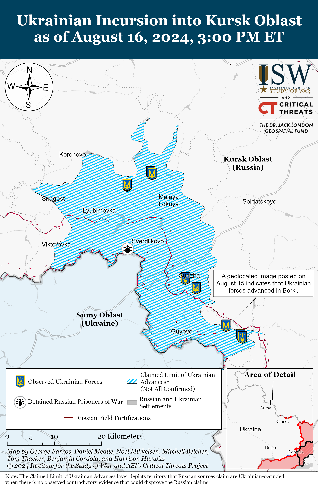](https://understandingwar.org/map/ukrainian-incursion-into-kursk-oblast-as-of-august-16-2024-300-pm-et/)

**Ukrainian forces reportedly advanced further into western Belgorod Oblast during recent cross-border assaults than previously reported, but available open-source reporting and evidence indicates that Ukrainian forces no longer maintain positions within Belgorod Oblast as of August 16.**The *Washington Post*reported on August 15 that Ukrainian personnel who participated in cross-border assaults into Belgorod Oblast stated that Ukrainian groups conducted mechanized assaults near the Kolotilovka border checkpoint (on the international border northwest of Belgorod City) on August 11 and advanced up to roughly 10 kilometers in the area.[10] Russian sources claimed that Ukrainian forces repeatedly attacked near Kolotilovka in recent days and temporarily seized the Kolotilovka checkpoint on August 15 but did not claim that Ukrainian forces advanced anywhere close to 10 kilometers beyond the checkpoint.[11] The *Washington Post*reported that Ukrainian forces held positions within Belgorod Oblast while under heavy Russian airstrikes and artillery fire and that Ukrainian armored vehicles crossed into Belgorod Oblast to evacuate remaining Ukrainian personnel from these positions on August 15.[12] ISW has not observed any Russian claims or evidence suggesting that Ukrainian forces remain in Belgorod Oblast as of August 16. Ukrainian soldiers told the *Washington Post*that Russian forces in Belgorod Oblast were more prepared to repel cross-border Ukrainian assaults than Russian forces in Kursk Oblast and that Russian forces had established an extensive array of “dragon’s teeth” anti-tank fortifications along the border and heavily mined the area.[13] The Ukrainian soldiers reportedly stated that Russian artillery units, drone operators, and aircraft almost immediately began striking Ukrainian forces as they attempted to cross the border into Belgorod Oblast on August 11.[14] The Ukrainian soldiers’ description of the Russian response suggests that the operational surprise, which Ukrainian forces achieved on August 6 when launching the incursion into Kursk Oblast, had largely dissipated by August 11 and that Russian forces in Belgorod Oblast had prepared to repel Ukrainian cross-border assaults.[15] Ukrainian forces have made subsequent rapid advances across other sections of the border with Kursk Oblast since starting the incursion on August 6, however, and it is likely that Russian forces are more heavily defending some sections of the border than others.[16]

**Ukrainian officials reported that Ukrainian forces continued to advance in Kursk Oblast and suggested that the incursion has forced Russia to more readily consider prisoner-of-war (POW) exchanges.**Ukrainian Commander-in-Chief Colonel General Oleksandr Syrskyi stated on August 16 that Ukrainian forces advanced between one and three kilometers in unspecified areas of Kursk Oblast.[17] Syrskyi also stated that Major General Eduard Moskalyov has begun heading the newly created military commandant’s office in Kursk Oblast.[18] Ukrainian Ombudsman Dmytro Lubinets stated on August 14 that Kremlin-appointed Russian Commissioner for Human Rights Tatiana Moskalkova initiated a conversation about prisoner of war (POW) exchanges and that Ukrainian forces have taken 2,000 Russian personnel prisoners in the last two weeks, including conscripts, border guards from the Russian Federal Security Service (FSB), and personnel from Chechen “Akhmat” units.[19] This was reportedly the first time Russia has initiated discussions about a possible POW exchange. Ukrainian officials have previously reported that Russian officials have rebuffed Ukrainian overtures for POW exchanges in the past.[20] Ukraine’s Main Military Intelligence Directorate Kyrylo Budanov stated on August 15 that Ukraine will prioritize the return of the seriously wounded and ill, women, and those who have been in Russian captivity the longest.[21] Budanov stated that Ukraine will also try to return civilian prisoners, especially those whom Russian forces have held in captivity since 2014. A Ukrainian officer from the Military Law and Order Service reported on August 15 that 80 percent of the more than 200 Russian POWs located in one Ukrainian POW detention facility are conscripts.[22] The Ukrainian incursion into Kursk Oblast threatens Russian President Vladimir Putin’s efforts to maintain support for the war and his regime, and the Kremlin may be highly attuned to the political impacts of large numbers of Russian POWs being captured on Russian territory, particularly conscripts.[23]

**The Office of the United Nations High Commissioner for Human Rights Office (UN OHCHR) requested that Russian authorities allow UN representatives to visit Bryansk, Kursk, and Belgorod oblasts as part of a human rights monitoring mission.[24]**UN OHCHR Spokesperson Liz Throssell confirmed the request on August 15 and noted that the office previously asked Russian authorities for access to areas in Russia and occupied Ukraine “to no avail.”

**US officials reiterated that US policy on Ukraine’s ability to use US-provided weapons to conduct long-range strikes against Russian military targets has not changed amid the ongoing Ukrainian incursion into Kursk Oblast.**Pentagon Press Secretary Sabrina Singh stated during a press briefing on August 15 that Ukraine’s incursion into Kursk Oblast has not changed the type or volume of weapons that the US will provide to Ukraine and that the parameters of the US policy regarding long-range Ukrainian strikes against military targets in Russia with US-provided weapons have also not changed.[25] The Biden Administration reportedly approved a policy change in May 2024 allowing Ukraine to use US-provided weapons for “counter-fire purposes” against the Russian forces conducting assaults into northern Kharkiv Oblast and preparing to conduct assaults from other Russian oblasts immediately bordering Ukraine.[26] Singh reiterated that the United States supports Ukraine’s right to defend itself against Russia’s illegal invasion.

**The Kremlin reportedly fired former Defense Minister Sergei Shoigu’s advisor on information policy Andrei Ilnitsky possibly as part of an ongoing effort to shift control of Russia’s wartime information policy from the Ministry of Defense (MoD) to the Russian Presidential Administration.**Russian state media outlets observed that Kremlin newswire *TASS*promptly issued a correction to a report on August 15 stating that Ilnitsky is a former advisor to the MoD.[27] Russian state media outlets reported that Ilnitsky’s title change indicates that he was recently fired and observed that Russian President Vladimir Putin fired several of Shoigu’s deputies in mid-June, although the Russian MoD did not officially announce Ilnitsky’s dismissal.[28] Ilnitsky’s dismissal also appears to be relatively recent since many Russian outlets referred to him by his MoD title at least as of July 2024.[29] One Russian source claimed that Ilnitsky resigned after Shoigu’s dismissal, however.[30] Russian media claimed that Ilnitsky may have been the creator of the ”Z” symbol that Russian forces have used during the full-scale invasion of Ukraine and noted that he had advised the Russian MoD since 2015.[31] A prominent Russian social media propagandist reacted to the news by accusing Ilnitsky of creating a harmful and confusing information policy at the Russian MoD and recalled an instance in which Ilnitsky attempted to teach him how to wage ”information war” in April 2022.[32] Some Russian milbloggers implied that Ilnitsky advocated against daily war coverage and blamed Ilnitsky for misleading Russian state coverage of the war in Ukraine.[33]

One critical Russian milblogger condemned Ilnitsky’s dismissal, noting that his removal indicates that the Kremlin is advancing its efforts to transfer the control of Russia’s wartime information policy from the MoD’s Department of Information and Mass Communications to the Russian Presidential Administration.[34] The milblogger noted that members of the Presidential Administration attended the first meeting of newly appointed Russian Defense Minister Andrei Belousov and Russian milbloggers on June 10 and that this was the first indicator of the expansion of the administration’s control over the entire Russian media infrastructure. The milblogger claimed that the Presidential Administration’s apparent consolidation of two separate information mechanisms – the domestic propaganda machine aimed at ensuring political stability in Russia and external information warfare mechanisms – is a dangerous undertaking for Putin during a period of information war since simplified media control systems are more susceptible to external influence. ISW has consistently observed reports that First Deputy Chief of the Russian Presidential Administration Sergei Kiriyenko has been increasingly expanding the administration’s control over the Russian information space and policy since at least the Wagner Group mutiny in June 2023.[35] ISW also assessed on August 15 that the Kremlin appears to be trying to hastily create a new information space that predominantly features Kremlin-affiliated sources in response to the Ukrainian incursion into Kursk Oblast, and the Russian government continued to blacklist select Russian milbloggers, political commentators, and other Russian internet personalities on August 15 and 16.[36]

**Key Takeaways:**

- **Ukrainian forces continued to marginally advance southeast of Sudzha on August 16 amid continued Ukrainian operations in Kursk Oblast.**
- **Ukrainian strikes reportedly destroyed two bridges in Glushkovo Raion, Kursk Oblast.**
- **Ukrainian forces reportedly advanced further into western Belgorod Oblast during recent cross-border assaults than previously reported, but available open-source reporting and evidence indicate that Ukrainian forces no longer maintain positions within Belgorod Oblast as of August 16.**
- **Ukrainian officials reported that Ukrainian forces continued to advance in Kursk Oblast and suggested that the incursion has forced Russia to more readily consider prisoner-of-war (POW) exchanges.**
- **The Office of the United Nations High Commissioner for Human Rights Office (UN OHCHR) requested that Russian authorities allow UN representatives to visit Bryansk, Kursk, and Belgorod oblasts as part of a human rights monitoring mission.**
- **US officials reiterated that US policy on Ukraine’s ability to use US-provided weapons to conduct long-range strikes against Russian military targets has not changed amid the ongoing Ukrainian incursion into Kursk Oblast.**
- **The Kremlin reportedly fired former Defense Minister Sergei Shoigu’s advisor on information policy Andrei Ilnitsky possibly as part of an ongoing effort to shift control of Russia’s wartime information policy from the Ministry of Defense (MoD) to the Russian Presidential Administration.**
- **Russian forces recently advanced near Chasiv Yar, Toretsk, and Pokrovsk.**
- **Russian milbloggers claimed on August 16 that Russian drone operators are limiting their use of Mavic drones amid claims that Russian commanders are forcing operators to either personally pay to replace drones lost outside of combat or risk being sent to an infantry assault unit as punishment for losing a drone.**

[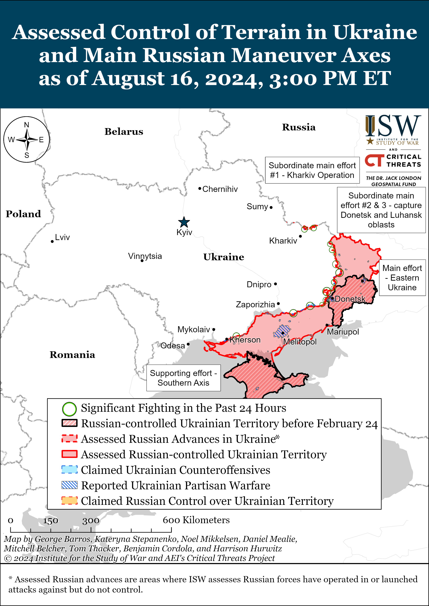](https://understandingwar.org/map/assessed-control-of-terrain-in-ukraine-and-main-russian-maneuver-axes-as-of-august-16-2024-300-pm-et/)

***We do not report in detail on Russian war crimes because these activities are well-covered in Western media and do not directly affect the military operations we are assessing and forecasting. We will continue to evaluate and report on the effects of these criminal activities on the Ukrainian military and the Ukrainian population and specifically on combat in Ukrainian urban areas. We utterly condemn Russian violations of the laws of armed conflict and the Geneva Conventions and crimes against humanity even though we do not describe them in these reports.***

- Russian Main Effort – Eastern Ukraine (comprised of three subordinate main efforts)
- Russian Subordinate Main Effort #1 – Push Ukrainian forces back from the international border with Belgorod Oblast and approach to within tube artillery range of Kharkiv City
- Russian Subordinate Main Effort #2 – Capture the remainder of Luhansk Oblast and push westward into eastern Kharkiv Oblast and encircle northern Donetsk Oblast
- Russian Subordinate Main Effort #3 – Capture the entirety of Donetsk Oblast
- Russian Supporting Effort – Southern Axis
- Russian Air, Missile, and Drone Campaign
- Russian Mobilization and Force Generation Efforts
- Russian Technological Adaptations
- Activities in Russian-occupied areas
- Ukrainian Defense Industrial Base Efforts
- Russian Information Operations and Narratives
- Significant Activity in Belarus

**Russian Main Effort – Eastern Ukraine**

**Russian Subordinate Main Effort #1 – Kharkiv Oblast (Russian objective: Push Ukrainian forces back from the international border with Belgorod Oblast and approach to within tube artillery range of Kharkiv City)**

Russian forces continued offensive operations north of Kharkiv City near Lyptsi and northeast of Kharkiv City near Starytsya and Vovchansk on August 15 and 16 but did not make confirmed advances.[37] Ukraine’s Kharkiv Group of Forces reported that the frontline in the Kharkiv direction had not changed and that Russian forces are evacuating wounded personnel in Hlyboke (immediately north of Lyptsi).[38] The Kharkiv Group of Forces added that Russian forces regrouped personnel and are trying to expand communication systems in the Lyptsi area; are deploying unspecified personnel operating on motorcycles near Ohirtseve (northwest of Vovchansk); and are regrouping units of the Russian 4th Volunteer Assault Brigade and the 82nd Motorized Rifle Regiment (69th Motorized Rifle Division, 6th Combined Arms Army [CAA], Leningrad Military District [LMD]) in the central part of Vovchansk. Ukrainian Kharkiv Group of Forces Spokesperson Colonel Vitaly Sarantsev stated on August 16 that only Russian infantry elements are able to deliver weapons and supplies to Russian forward positions in Vovchansk.[39] Sarantsev added that Russian forces are only able to use automobiles for logistics in northern Vovchansk and are currently experimenting with using unmanned aerial vehicles (UAVs) for logistics support. Elements of the Russian 83rd Separate Guards Airborne (VDV) Brigade are continuing to operate in the Kharkiv direction.[40]

[**[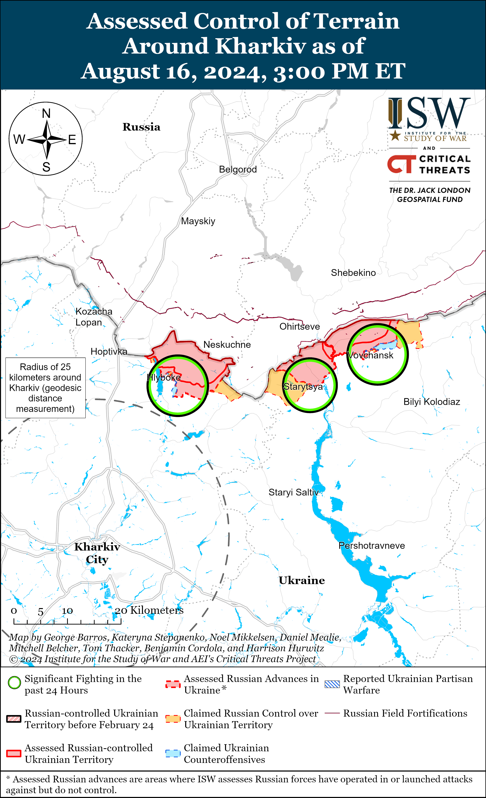](https://understandingwar.org/map/assessed-control-of-terrain-around-kharkiv-as-of-august-16-2024-300-pm-et/)**](https://understandingwar.org/wp-content/uploads/2025/05/Kharkiv20Battle20Map20Draft20August20162C202024.png)

[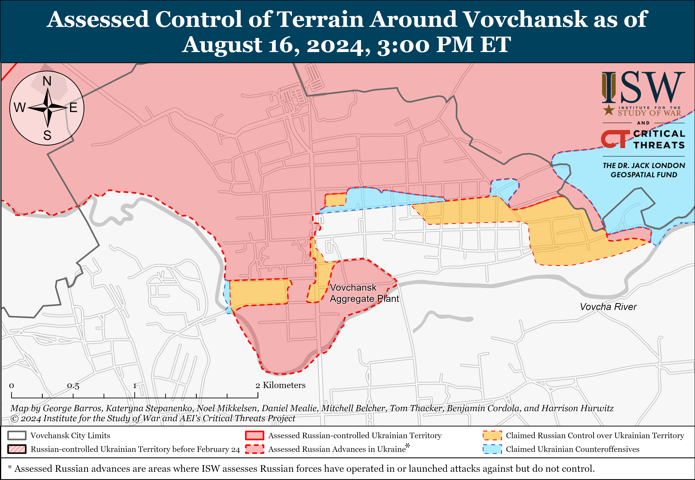](https://understandingwar.org/map/assessed-control-of-terrain-around-vovchansk-as-of-august-16-2024-300-pm-et/)

**Russian Subordinate Main Effort #2 – Luhansk Oblast (Russian objective: Capture the remainder of Luhansk Oblast and push westward into eastern Kharkiv Oblast and northern Donetsk Oblast)**

Russian sources claimed on August 16 that Russian forces advanced on a sector up to 3.6 kilometers wide north of Pishchane (southeast of Kupyansk), but ISW has not observed visual evidence confirming these claims.[41] Russian forces continued offensive operations northeast of Kupyansk near Synkivka; southeast of Kupyansk near Hlushkivka, Kruhlyakivka, Kolisnykivka, Berestove, Stelmakhivka, and Andriivka, and towards Lozova; northwest of Kreminna near Makiivka and Nevske; and west of Kreminna near Torske and Terny.[42] Kupyansk Raion Administration Head Andriy Kanashevych stated that Russian forces repeatedly strike Ukrainian crossings over the Oskil River and are pressuring areas near Pishchane, Berestove, and Synkivka.[43]

[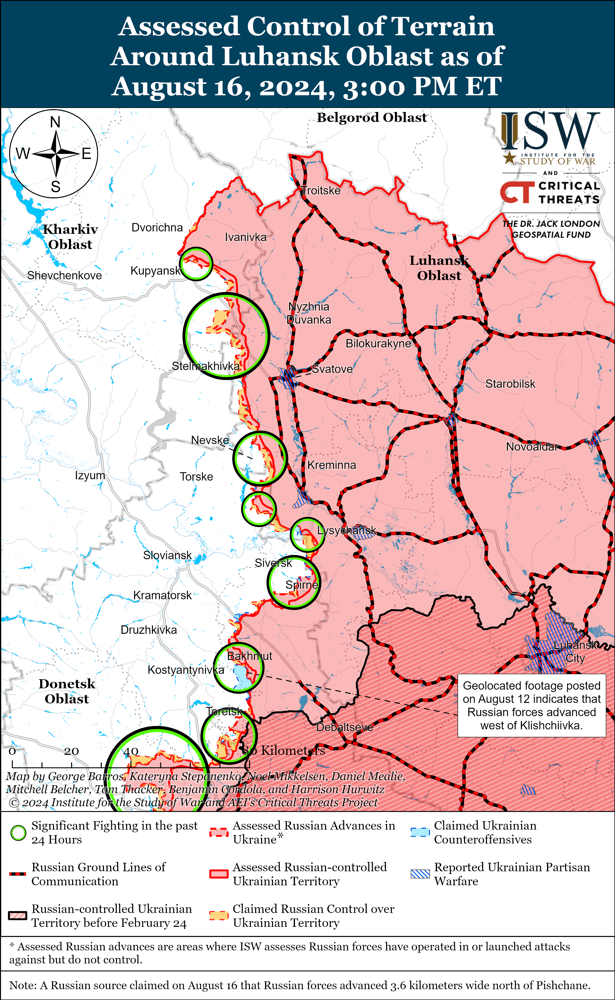](https://understandingwar.org/map/assessed-control-of-terrain-around-luhansk-oblast-as-of-august-16-2024-300-pm-et/)

**Russian Subordinate Main Effort #3 – Donetsk Oblast (Russian objective: Capture the entirety of Donetsk Oblast, the claimed territory of Russia’s proxies in Donbas)**

Russian forces continued offensive operations northeast of Siversk near Bilohorivka, east of Siversk near Verkhnokamyanske, southeast of Siversk near Spirne and Vyimka, and south of Siversk near Pereizne on August 15 and 16.[44] Elements of the Russian 106th Airborne [VDV] Division’s 173rd Reconnaissance Battalion are reportedly operating near Fedorivka (south of Siversk).[45]

Russian forces recently advanced southeast of Chasiv Yar and continued offensive operations near Chasiv Yar on August 16. Geolocated footage published on August 15 indicates that Russian forces recently advanced across the Siverskyi Donets Donbas Canal north of Ozaryanivka (southeast of Chasiv Yar).[46] A Russian milblogger claimed that elements of the Russian 1307th Motorized Rifle Regiment (6th Motorized Rifle Division, 3rd Army Corps [AC]) recently completed clearing Klishchiivka (southeast of Chasiv Yar).[47] Russian forces continued offensive operations near Chasiv Yar, north of Chasiv Yar near Hryhorivka, and near Klishchiivka on August 15 and 16.[48] Elements of the Russian 1442nd Motorized Rifle Regiment (6th Motorized Rifle Division, 3rd AC) are reportedly operating in the Bakhmut direction (Chasiv Yar area).[49]

[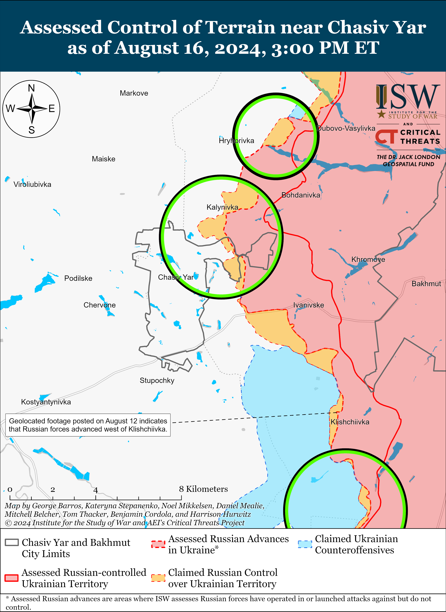](https://understandingwar.org/map/assessed-control-of-terrain-near-chasiv-yar-as-of-august-16-2024-300-pm-et/)

Russian forces recently advanced near Toretsk amid continued Russian offensive operations in the area on August 16. Geolocated footage published on August 16 indicates that Russian forces recently advanced southwest of Zalizne (southeast of Toretsk).[50] A Russian milblogger claimed that Russian forces advanced to the mine waste heap on the southwestern outskirts of Pivnichne (east of Toretsk), which is consistent with ISW’s assessed Russian advances in the area.[51] Ukrainian Toretsk City Military Administration Head Vasyl Chynyk stated that Russian sabotage and reconnaissance groups are attempting to enter Toretsk itself and that Ukrainian forces are actively repelling these groups.[52] Russian forces continued offensive operations near Toretsk, northeast of Toretsk near Bila Hora, east of Toretsk near Pivnichne, southeast of Toretsk near Zalizne, south of Toretsk near Niu York and Nelipivka, and southwest of Toretsk near Sukha Balka and Panteleymonivka on August 15 and 16.[53]

[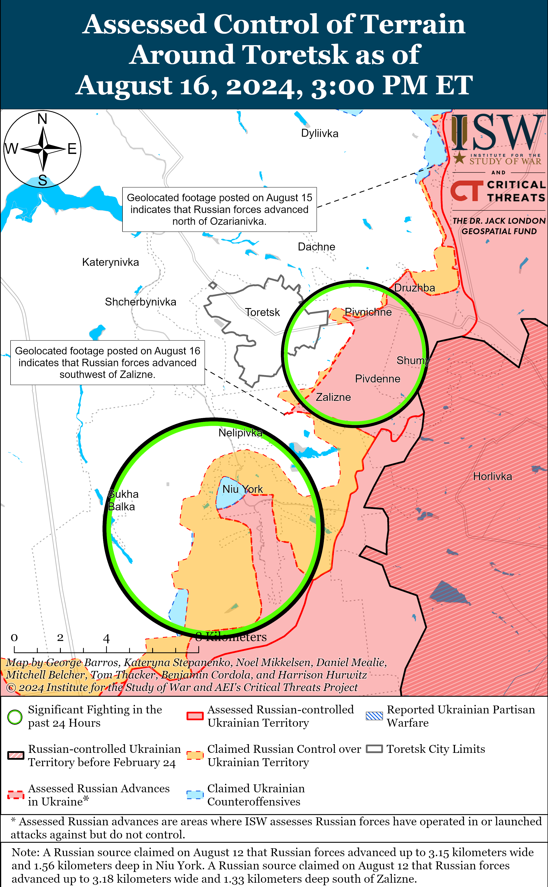](https://understandingwar.org/map/assessed-control-of-terrain-around-toretsk-as-of-august-16-2024-300-pm-et/)

Russian forces recently advanced east of Pokrovsk amid continued Russian efforts to tactically encircle Ukrainian forces southeast of Pokrovsk on August 16. Geolocated footage published on August 16 indicates that Russian forces recently advanced further within southeastern Hrodivka (east of Pokrovsk).[54] Russian milbloggers claimed on August 15 and 16 that Russian forces operating east of Pokrovsk advanced south of Vozdvyzhenka, east of Svyridonivka, west of Novotoretske, and east of Hordivka.[55] Russian milbloggers claimed on August 16 that Russian forces operating southeast of Pokrovsk advanced southeast of Zhelanne and seized Mykolaivka.[56] A Russian milblogger also claimed that Ukrainian forces are withdrawing from positions near Karlivka (southeast of Pokrovsk).[57] ISW has not observed confirmation of these Russian claims, however. Ukrainian Pokrovsk Military Administration Head Serhiy Dobryak stated that Russian forces are a little more than 10 kilometers from Pokrovsk, and ISW currently assesses that Russian forces are roughly 14 kilometers from the city.[58] Russian milbloggers claimed that Russian forces are currently six kilometers from Myrnohrad, although ISW currently assesses that Russian forces are roughly eight kilometers from the town.[59] Russian forces continued offensive operations northeast of Pokrovsk near Zelene Pole; east of Pokrovsk near Vozdvyzhenka, Hrodivka, Kalynove, and Novotoretske; and southeast of Pokrovsk near Novohrodivka, Novozhelanne, Skuchne, Ptyche, Zhelanne, Mykolaivka, and Karlivka on August 15 and 16.[60] Russian Defense Minister Andrei Belousov credited on August 15 elements of the 75th Motorized Rifle Brigade (41st Combined Arms Army [CAA], Central Military District [CMD]) for seizing Ivanivka (east of Pokrovsk).[61]

[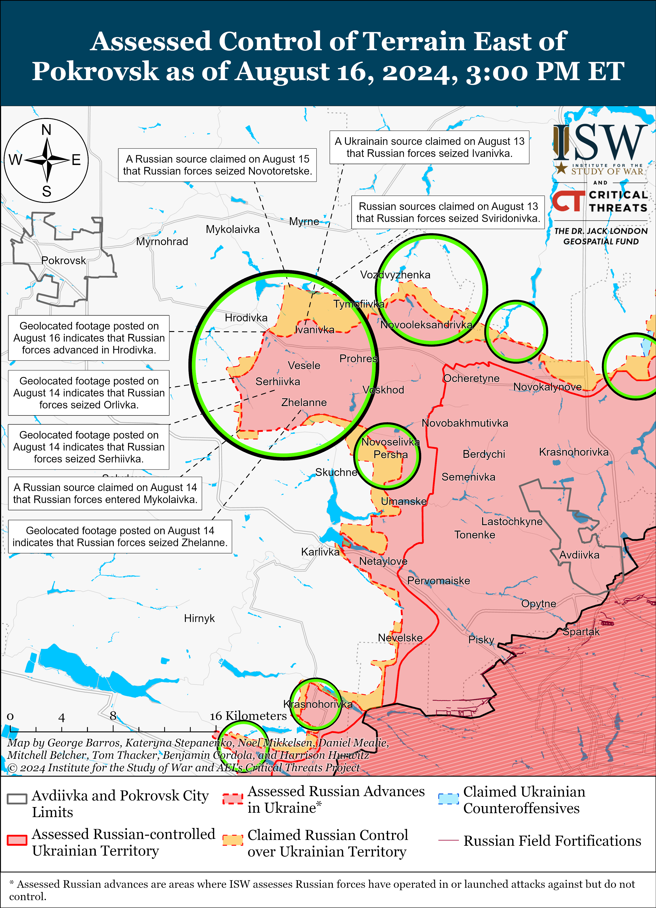](https://understandingwar.org/map/assessed-control-of-terrain-east-of-pokrovsk-as-of-august-16-2024-300-pm-et/)

Russian forces continued offensive operations west of Donetsk City near Heorhiivka, Krasnohorivka, and Oleksandrivka and southwest of Donetsk City near Paraskoviivka, Kostyantynivka, and Vodyane on August 15 and 16.[62] Russian sources claimed on August 15 and 16 that Russian forces advanced up to 400 meters within Kostyantynivka and reached the center of the settlement.[63]

[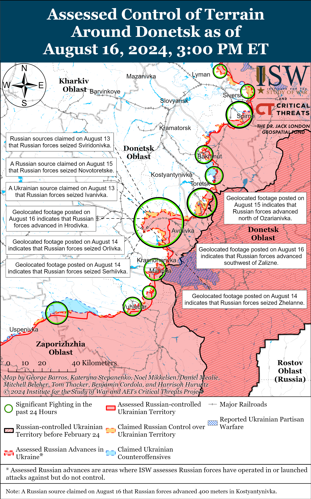](https://understandingwar.org/map/assessed-control-of-terrain-around-donetsk-as-of-august-16-2024-300-pm-et/)

The Ukrainian General Staff reported that Russian forces operating in the Donetsk-Zaporizhia Oblast border area conducted ground assaults near Rivnopil (southwest of Velyka Novosilka) on August 15.[64]

**Russian Supporting Effort – Southern Axis (Russian objective: Maintain frontline positions and secure rear areas against Ukrainian strikes)**

The Ukrainian General Staff reported that Russian forces continued limited offensive operations in western Zaporizhia Oblast northeast of Robotyne near Mala Tokmachka on August 15 and 16.[65]

[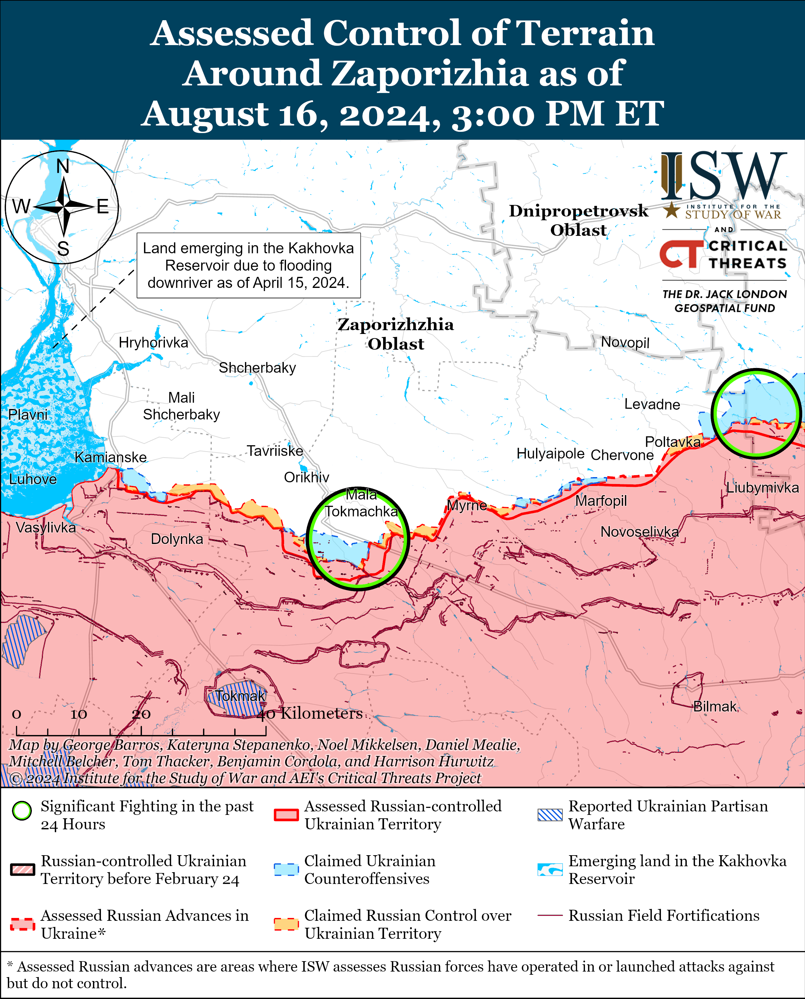](https://understandingwar.org/map/assessed-control-of-terrain-around-zaporizhia-as-of-august-16-2024-300-pm-et/)

Positional engagements continued in east (left) bank Kherson Oblast on August 15 and 16.[66] Ukrainian Tavriisk Group of Forces Spokesperson Captain Dmytro Lykhovyi stated on August 16 that two-thirds of all Russian assaults in the Dnipro direction take place north of Krynky, where Ukrainian bridgeheads are located.[67] Lykhovyi stated that Russian forces conducted 10 of their 13 assaults north of Krynky on August 15 near Kozachi Laheri. The Russian Ministry of Defense (MoD) claimed on August 16 that elements of the Russian 31st Airborne (VDV) Brigade are operating in the Kherson direction.[68]

[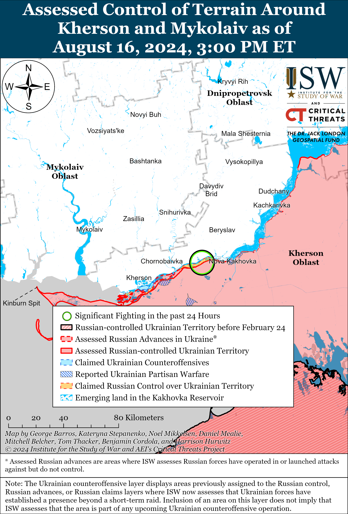](https://understandingwar.org/map/assessed-control-of-terrain-around-kherson-and-mykolaiv-as-of-august-16-2024-300-pm-et/)

Russian sources claimed that Ukrainian forces conducted a series of missile and drone strikes against occupied Crimea on the night of August 15 to 16. The Russian MoD claimed that Russian forces destroyed two naval drones heading towards occupied Crimea and five aerial drones over the Black Sea.[69] The Russian MoD also claimed that Russian forces shot down 12 Ukrainian ATACMS missiles targeting the Kerch Strait Bridge overnight.[70] A prominent Russian milblogger claimed that Russian forces destroyed five naval drones and one aerial drone in Yarylhachska Bay near occupied Mizhvodne, Crimea and destroyed three naval drones and four aerial drones approaching occupied Sevastopol.[71] The milblogger claimed that cluster munitions damaged the road surface of the Kerch Strait Bridge but not the support structures.

Russian forces reportedly continue to alter their behavior in the Black Sea due to Ukrainian strikes. The commander of a unit in Ukraine’s Main Military Intelligence Directorate (GUR) stated on August 16 that Ukrainian Magura V5 naval drones have struck 18 Black Sea Fleet (BSF) ships in the past year and a half (roughly since February 2023).[72] Ukrainian Navy Spokesperson Captain Third Rank Dmytro Pletenchuk stated on August 16 that Russian forces have almost stopped mining the Black Sea after Ukrainian forces destroyed a Russian Su-24 aircraft that was remotely mining the area.[73] Pletenchuk also suggested on August 16 that Russian forces are trying to deceive Ukrainian forces by making a model of the *Rostov-on-Don* *Kilo*-class submarine in occupied Crimea after creating a silhouette of the submarine at the pier in Novorossiysk, Krasnodar Krai. Ukrainian officials stated that Ukrainian forces struck and significantly damaged the *Rostov-on-Don*in September 2023, after which it underwent repairs, and the Ukrainian General Staff reported on August 3, 2024 that another Ukrainian strike sunk the submarine.[74]

**Russian Air, Missile, and Drone Campaign (Russian Objective: Target Ukrainian military and civilian infrastructure in the rear and on the frontline)**

Russian forces conducted a series of missile and drone strikes against Ukraine on the night of August 15 to 16. Ukrainian Air Force Commander Lieutenant General Mykola Oleshchuk stated that Russian forces launched three Iskander-M ballistic missiles, three Shahed-136/131 drones, and two drones of an unknown type from Kursk Oblast overnight on August 15 to 16 and that Ukrainian forces shot down all of the drones over Poltava, Zhytomyr, Kirovohrad, Odesa, and Mykolaiv oblasts.[75] Ukraine’s Kharkiv Group of Forces reported on August 16 that in the past day, Russian forces launched two missile strikes with an unspecified number of Kh-59 guided air missiles and S-300 air defense missiles against unspecified areas within the Kharkiv Group of Forces’ area of responsibility.[76] Russian sources, including the Russian Ministry of Defense (MoD), claimed that Russian forces destroyed two Ukrainian HIMARS launchers near Myropillya, Sumy Oblast with Iskander missiles.[77]

**Russian Mobilization and Force Generation Efforts (Russian objective: Expand combat power without conducting general mobilization)**

Russian milbloggers claimed on August 16 that Russian drone operators are limiting their use of Mavic drones amid claims that Russian commanders are forcing operators to either personally pay to replace drones lost outside of combat or risk being sent to an infantry assault unit as punishment for losing a drone. Russian milbloggers claimed that one Mavic drone costs 400,000 rubles (about $4,475) to replace and that Russian commanders are particularly concerned about losing Mavic drones compared to other equipment due to frontline drone shortages.[78] Russian milbloggers noted that losing drones is unavoidable but recommended that Russian drone operators do everything within their power – from writing their name on the drone to equipping the drone with a separate GPS beacon – to find their drones and avoid punishment.[79]

Kherson Oblast occupation head Vladimir Saldo and occupation senator Konstantin Basyuk visited servicemembers of the Russian 33rd “Margelov” Volunteer Detachment at a training ground in occupied Kherson Oblast on August 16 and personally delivered drones to the servicemembers.[80]

**Russian Technological Adaptations (Russian objective: Introduce technological innovations to optimize systems for use in Ukraine)**

Nothing significant to report.

**Ukrainian Defense Industrial Efforts (Ukrainian objective: Develop its defense industrial base to become more self-sufficient in cooperation with US, European, and international partners)**

*ISW is suspending publishing coverage of Ukrainian defense industrial efforts until further notice.*

**Activities in Russian-occupied areas (Russian objective: Consolidate administrative control of annexed areas; forcibly integrate Ukrainian citizens into Russian sociocultural, economic, military, and governance systems)**

*ISW is not publishing coverage of activities in Russian-occupied areas today.*

**Russian Information Operations and Narratives**

Nothing significant to report.

**Significant activity in Belarus (Russian efforts to increase its military presence in Belarus and further integrate Belarus into Russian-favorable frameworks and Wagner Group activity in Belarus)**

Belarusian officials continue to posture military strength amid the ongoing Ukrainian incursion into Kursk Oblast, Russia. Belarusian Defense Minister Lieutenant General Viktor Khrenin and Belarusian Chief of the General Staff Major General Pavel Muraveiko claimed on August 16 that there is a “high probability” that Ukraine may conduct armed provocations against Belarus and warned that Belarus is prepared to respond to any supposed Ukrainian provocations.[81] Belarusian President Alexander Lukashenko claimed that Belarus has everything necessary to counter threats and repel unspecified “indiscretions” along its borders.[82]

**Note: ISW does not receive any classified material from any source, uses only publicly available information, and draws extensively on Russian, Ukrainian, and Western reporting and social media as well as commercially available satellite imagery and other geospatial data as the basis for these reports. References to all sources used are provided in the endnotes of each update.**

---

[1] https://t.me/rybar/62840 ; https://t.me/dva\_majors/49979; https://t.me/warhistoryalconafter/179763 ; https://x.com/Grimm\_Intel/status/1824216033189827034; https://t.me/WarZoneInc/87058?single; https://x.com/GirkinGirkin/status/1824294313712312762

[2] https://t.me/rybar/62840 ; https://t.me/rybar/62833 ; https://t.me/rybar/62814 ; https://t.me/dva\_majors/49979; https://t.me/warhistoryalconafter/179763 ; https://t.me/rusich\_army/16558

[3] https://t.me/wargonzo/21592 ; https://t.me/DnevnikDesantnika/14101 ; https://t.me/rusich\_army/16577 ; https://t.me/rybar/62840

[4] https://t.me/mod\_russia/42220

[5] https://t.me/dva\_majors/49981; https://t.me/DnevnikDesantnika/14092 ; https://t.me/control\_sigma/33320

[6] https://x.com/andynovy/status/1824450173189206118; https://t.me/warhistoryalconafter/179793 ; https://x.com/victoriaslog/status/1824503524576620592; https://x.com/Grimm\_Intel/status/1824509940503023741 ; https://x.com/alexskichambe/status/1824174842683461952; https://t.me/warriorofnorth/2110; https://x.com/moklasen/status/1824177664535515613; https://t.me/creamy\_caprice/6409 ; https://x.com/moklasen/status/1824171513085644971; https://t.me/dva\_majors/49922 ; https://x.com/giK1893/status/1824184240394891411; https://x.com/Danspiun/status/1824007007092818351/history; https://t.me/ukrbavovna/16498; https://x.com/giK1893/status/1824189624664936931; https://t.me/GeneralStaffZSU/16708; https://x.com/giK1893/status/1824352896051265553 https://x.com/giK1893/status/1824352898836242871

[7] https://t.me/rybar/62814; https://t.me/wargonzo/21603; https://t.me/RVvoenkor/74954; https://t.me/readovkanews/85039; https://t.me/DnevnikDesantnika/14097; https://t.me/motopatriot/26243 ; https://t.me/Alekhin\_Telega/11258 ; https://t.me/dva\_majors/49995 ; https://t.me/tass\_agency/266740

[8] https://x.com/markito0171/status/1824393609749151924; https://x.com/markito0171/status/1824456276908159137; https://x.com/JonHallin/status/1824459196710129771

[9] https://t.me/dva\_majors/49927 ; https://t.me/wargonzo/21592 ; https://t.me/RVvoenkor/74954

[10] https://www.washingtonpost.com/world/2024/08/15/russia-ukraine-kursk-captured-soldiers/

[11] https://understandingwar.org/backgrounder/russian-offensive-campaign-assessment-august-15-2024 ; https://isw.pub/UkrWar081424 ; https://isw.pub/UkrWar081324 ; https://isw.pub/UkrWar081224 ; https://isw.pub/UkrWar081124

[12] https://www.washingtonpost.com/world/2024/08/15/russia-ukraine-kursk-captured-soldiers/

[13] https://www.washingtonpost.com/world/2024/08/15/russia-ukraine-kursk-captured-soldiers/

[14] https://www.washingtonpost.com/world/2024/08/15/russia-ukraine-kursk-captured-soldiers/

[15] https://isw.pub/UkrWar080824

[16] https://isw.pub/UkrWar081124

[17] https://suspilne dot media/814561-linia-frontu-nablizilas-do-pokrovska-stvorenna-vijskovoi-komendaturi-v-kurskij-oblasti-904-den-vijni-onlajn/?anchor=live\_1723825374&utm\_source=copylink&utm\_medium=ps; https://t.me/V\_Zelenskiy\_official/11373

[18] https://understandingwar.org/backgrounder/russian-offensive-campaign-assessment-august-15-2024; https://suspilne dot media/814561-linia-frontu-nablizilas-do-pokrovska-stvorenna-vijskovoi-komendaturi-v-kurskij-oblasti-904-den-vijni-onlajn/?anchor=live\_1723825374&utm\_source=copylink&utm\_medium=ps; https://t.me/V\_Zelenskiy\_official/11373

[19] https://t.me/spravdi/40862; https://www.ukrinform dot ua/rubric-ato/3895264-rosia-gotova-minati-polonenih-z-kurskoi-oblasti-lubinec-pogovoriv-iz-moskalkovou.html

[20] https://understandingwar.org/backgrounder/russian-offensive-campaign-assessment-may-29-2024; https://understandingwar.org/backgrounder/russian-offensive-campaign-assessment-january-3-2024; https://understandingwar.org/wp-content/uploads/2024/08/Nov201820Russian20Offensive20Campaign20Assessment20PDF.pdf

[21] https://suspilne dot media/814649-kogo-peredusim-ukraina-staratimetsa-povernuti-z-polonu-rf-rozpoviv-budanov/

[22] https://armyinform dot com.ua/2024/08/15/mama-ya-tebe-lyublyu-zi-mnoyu-vse-dobre-ya-sytyj-i-odyagnutyj-rosijskyj-strokovyk-v-ukrayinskomu-poloni/

[23] https://isw.pub/UkrWar080924 ; https://isw.pub/UkrWar080824

[24] https://www.themoscowtimes.com/2024/08/15/un-asks-moscow-for-access-to-embroiled-border-regions-a86031 ; https://www.theguardian.com/world/article/2024/aug/16/ukraine-war-briefing-russia-hiring-trench-diggers-after-kursk-invasion ; https://www.kyivpost.com/post/37444

[25] https://www.defense.gov/News/Transcripts/Transcript/Article/3875565/deputy-pentagon-press-secretary-sabrina-singh-holds-a-press-briefing/

[26] https://understandingwar.org/backgrounder/russian-offensive-campaign-assessment-may-30-2024 ; https://isw.pub/UkrWar060924 ; https://isw.pub/UkrWar061324 ; https://isw.pub/UkrWar061424

[27] https://russian dot rt.com/russia/news/1355723-ilnickii-uvolen-minoborony; https://lenta dot ru/news/2024/08/16/byvshiy-sovetnik-shoygu-uvolen-iz-minoborony-ego-schitayut-avtorom-glavnogo-simvola-svo/; https://tass dot ru/armiya-i-opk/21612791?utm\_source=yxnews&utm\_medium=desktop; https://www.gazeta dot ru/army/news/2024/08/16/23705503.shtml?updated

[28] https://russian dot rt.com/russia/news/1355723-ilnickii-uvolen-minoborony; https://lenta dot ru/news/2024/08/16/byvshiy-sovetnik-shoygu-uvolen-iz-minoborony-ego-schitayut-avtorom-glavnogo-simvola-svo/; https://www.gazeta dot ru/army/news/2024/08/16/23705503.shtml?updated

[29] https://understandingwar.org/backgrounder/russian-offensive-campaign-assessment-august-15-2024; https://www.youtube.com/live/wghXn3BxHsk?app=desktop&t=65s; https://vz dot ru/news/2024/8/15/1282314.html

[30] https://t.me/rusbrief/259911

[31] https://russian dot rt.com/russia/news/1355723-ilnickii-uvolen-minoborony; https://lenta dot ru/news/2024/08/16/byvshiy-sovetnik-shoygu-uvolen-iz-minoborony-ego-schitayut-avtorom-glavnogo-simvola-svo/; https://www.gazeta dot ru/army/news/2024/08/16/23705503.shtml?updated; https://t.me/rusbrief/259911

[32] https://t.me/yurasumy/17155; https://t.me/dva\_majors/49944; https://t.me/dva\_majors/49947 ; https://t.me/designersmil/8747 ; https://t.me/kontext\_channel/40022

[33] https://t.me/yurasumy/17155; https://t.me/dva\_majors/49944; https://t.me/dva\_majors/49947 ; https://t.me/designersmil/8747 ; https://t.me/kontext\_channel/40022; https://t.me/milinfolive/128566

[34] https://t.me/Alekhin\_Telega/11250

[35] https://understandingwar.org/backgrounder/russian-offensive-campaign-assessment-july-26-2024; https://understandingwar.org/backgrounder/russian-offensive-campaign-assessment-march-28-2024; https://understandingwar.org/backgrounder/russian-offensive-campaign-assessment-february-20-2024; https://understandingwar.org/backgrounder/russian-offensive-campaign-assessment-august-10-2023; https://understandingwar.org/backgrounder/russian-offensive-campaign-assessment-august-29-2023; https://understandingwar.org/backgrounder/russian-offensive-campaign-assessment-september-30-2023; https://understandingwar.org/wp-content/uploads/2024/08/July201220Russian20Offensive20Campaign20Assessment20PDF.pdf

[36] https://t.me/tass\_agency/266720 ; https://t.me/boris\_rozhin/133848 ; https://t.me/idelrealii/37048 ; https://t.me/bazabazon/30355; https://t.me/severrealii/26754 ; https://t.me/astrapress/62092; https://t.me/severrealii/26754  ; https://t.me/sotaproject/85308 ; https://t.me/horizontal\_russia/39128 ; https://t.me/severrealii/26747; https://t.me/severrealii26733; https://t.me/severrealii/26747 ; https://t.me/sotaproject/85310 ; https://t.me/roskomsvoboda/12786; https://t.me/sotaproject/85324; https://t.me/severrealii/26740

[37] https://www.facebook.com/GeneralStaff.ua/posts/pfbid08Ygo8wM67N5Mmh7sNwUD4XTKB4T6pk1a18hvU5LPCRPE14tjBpgakhS58E2sA48rl; https://www.facebook.com/GeneralStaff.ua/posts/pfbid02zsysREGUvkATYHJHqoAgEstEKAujpEaGXnsjKEMbCywz9MBrVSASCcxjLcgfLzTSl; https://www.facebook.com/GeneralStaff.ua/posts/pfbid02s3zgXyUTXnAyrt5UGuo7fgBPZE4tb8WcqNvhkHbUG7b2iu7pDtAoFiUwe3tnU32Bl; https://t.me/otukharkiv/767

[38] https://t.me/otukharkiv/767

[39] https://armyinform dot com.ua/2024/08/15/dvonogoyu-stala-logistyka-rosiyan-na-harkivshhyni/; https://youtu.be/WY8sDvZdWEA

[40] https://t.me/rusich\_army/16573

[41] https://t.me/RVvoenkor/74920; https://t.me/z\_arhiv/27649

[42] https://www.facebook.com/GeneralStaff.ua/posts/pfbid08Ygo8wM67N5Mmh7sNwUD4XTKB4T6pk1a18hvU5LPCRPE14tjBpgakhS58E2sA48rl; https://www.facebook.com/GeneralStaff.ua/posts/pfbid02zsysREGUvkATYHJHqoAgEstEKAujpEaGXnsjKEMbCywz9MBrVSASCcxjLcgfLzTSl ; https://www.facebook.com/GeneralStaff.ua/posts/pfbid02s3zgXyUTXnAyrt5UGuo7fgBPZE4tb8WcqNvhkHbUG7b2iu7pDtAoFiUwe3tnU32Bl

[43] https://suspilne dot media/kharkiv/814933-z-livoberezza-kupansini-pocali-castise-evakuuvatisa-ludi-kanasevic/

[44] https://www.facebook.com/GeneralStaff.ua/posts/pfbid08Ygo8wM67N5Mmh7sNwUD4XTKB4T6pk1a18hvU5LPCRPE14tjBpgakhS58E2sA48rl ; https://www.facebook.com/GeneralStaff.ua/posts/pfbid02zsysREGUvkATYHJHqoAgEstEKAujpEaGXnsjKEMbCywz9MBrVSASCcxjLcgfLzTSl ; https://www.facebook.com/GeneralStaff.ua/posts/pfbid02s3zgXyUTXnAyrt5UGuo7fgBPZE4tb8WcqNvhkHbUG7b2iu7pDtAoFiUwe3tnU32Bl

[45] https://t.me/voin\_dv/10298; https://t.me/stepnoy\_veter/11195

[46] https://x.com/IAPonomarenko/status/1824157137435869214; https://x.com/AudaxonX/status/1824205838526955863; https://t.me/ombr\_28/1227

[47] https://t.me/philologist\_zov/1224; https://t.me/MSP1307/185

[48] https://www.facebook.com/GeneralStaff.ua/posts/pfbid08Ygo8wM67N5Mmh7sNwUD4XTKB4T6pk1a18hvU5LPCRPE14tjBpgakhS58E2sA48rl ; https://www.facebook.com/GeneralStaff.ua/posts/pfbid02zsysREGUvkATYHJHqoAgEstEKAujpEaGXnsjKEMbCywz9MBrVSASCcxjLcgfLzTSl ; https://www.facebook.com/GeneralStaff.ua/posts/pfbid02s3zgXyUTXnAyrt5UGuo7fgBPZE4tb8WcqNvhkHbUG7b2iu7pDtAoFiUwe3tnU32Bl ; https://t.me/RVvoenkor/74920

[49] https://t.me/philologist\_zov/1221; https://t.me/philologist\_zov/1222

[50] https://t,me/creamy\_caprice/6412; https://t.me/voron1OO/53

[51] https://t.me/DnevnikDesantnika/14104

[52] https://armyinform dot com.ua/2024/08/16/drg-namagayutsya-pronyknuty-v-toreczk-u-misti-zalyshylos-2500-myrnyh-meshkancziv/; https://www.youtube.com/watch?v=bs91z5\_W3vg

[53] https://www.facebook.com/GeneralStaff.ua/posts/pfbid08Ygo8wM67N5Mmh7sNwUD4XTKB4T6pk1a18hvU5LPCRPE14tjBpgakhS58E2sA48rl ; https://www.facebook.com/GeneralStaff.ua/posts/pfbid02zsysREGUvkATYHJHqoAgEstEKAujpEaGXnsjKEMbCywz9MBrVSASCcxjLcgfLzTSl ; https://www.facebook.com/GeneralStaff.ua/posts/pfbid02s3zgXyUTXnAyrt5UGuo7fgBPZE4tb8WcqNvhkHbUG7b2iu7pDtAoFiUwe3tnU32Bl

[54] https://www.facebook.com/151OMBr/videos/476213475208455; https://t.me/creamy\_caprice/6411; https://t.me/motopatriot/26238

[55] https://t.me/rybar/62816 ; https://t.me/motopatriot/26238 ; https://t.me/RVvoenkor/74920 ;

[56] https://t.me/z\_arhiv/27651 ; https://t.me/motopatriot/26241 ; https://t.me/z\_arhiv/27649 ; https://t.me/boris\_rozhin/133738

[57] https://t.me/wargonzo/21592

[58] https://suspilne dot media/donbas/815025-mi-cuemo-front-ak-zminuetsa-situacia-v-pokrovsku-cerez-nablizenna-rosijskoi-armii-do-mista/

[59] https://t.me/DnevnikDesantnika/14096 ; https://t.me/motopatriot/26238

[60] https://www.facebook.com/GeneralStaff.ua/posts/pfbid08Ygo8wM67N5Mmh7sNwUD4XTKB4T6pk1a18hvU5LPCRPE14tjBpgakhS58E2sA48rl ; https://www.facebook.com/GeneralStaff.ua/posts/pfbid02zsysREGUvkATYHJHqoAgEstEKAujpEaGXnsjKEMbCywz9MBrVSASCcxjLcgfLzTSl ; https://www.facebook.com/GeneralStaff.ua/posts/pfbid02s3zgXyUTXnAyrt5UGuo7fgBPZE4tb8WcqNvhkHbUG7b2iu7pDtAoFiUwe3tnU32Bl ; https://t.me/wargonzo/21592

[61] https://t.me/mod\_russia/42205

[62] https://www.facebook.com/GeneralStaff.ua/posts/pfbid08Ygo8wM67N5Mmh7sNwUD4XTKB4T6pk1a18hvU5LPCRPE14tjBpgakhS58E2sA48rl ; https://www.facebook.com/GeneralStaff.ua/posts/pfbid02zsysREGUvkATYHJHqoAgEstEKAujpEaGXnsjKEMbCywz9MBrVSASCcxjLcgfLzTSl ; https://www.facebook.com/GeneralStaff.ua/posts/pfbid02s3zgXyUTXnAyrt5UGuo7fgBPZE4tb8WcqNvhkHbUG7b2iu7pDtAoFiUwe3tnU32Bl

[63] https://t.me/wargonzo/21592 ; https://t.me/voenkorKotenok/58261 ; https://t.me/DnevnikDesantnika/14103

[64] https://www.facebook.com/GeneralStaff.ua/posts/pfbid02s3zgXyUTXnAyrt5UGuo7fgBPZE4tb8WcqNvhkHbUG7b2iu7pDtAoFiUwe3tnU32Bl

[65] https://www.facebook.com/GeneralStaff.ua/posts/pfbid08Ygo8wM67N5Mmh7sNwUD4XTKB4T6pk1a18hvU5LPCRPE14tjBpgakhS58E2sA48rl; https://www.facebook.com/GeneralStaff.ua/posts/pfbid02zsysREGUvkATYHJHqoAgEstEKAujpEaGXnsjKEMbCywz9MBrVSASCcxjLcgfLzTSl ; https://www.facebook.com/GeneralStaff.ua/posts/pfbid02s3zgXyUTXnAyrt5UGuo7fgBPZE4tb8WcqNvhkHbUG7b2iu7pDtAoFiUwe3tnU32Bl

[66] https://www.facebook.com/GeneralStaff.ua/posts/pfbid08Ygo8wM67N5Mmh7sNwUD4XTKB4T6pk1a18hvU5LPCRPE14tjBpgakhS58E2sA48rl; https://www.facebook.com/GeneralStaff.ua/posts/pfbid02zsysREGUvkATYHJHqoAgEstEKAujpEaGXnsjKEMbCywz9MBrVSASCcxjLcgfLzTSl ; https://www.facebook.com/GeneralStaff.ua/posts/pfbid02s3zgXyUTXnAyrt5UGuo7fgBPZE4tb8WcqNvhkHbUG7b2iu7pDtAoFiUwe3tnU32Bl

[67] https://armyinform dot com.ua/2024/08/16/na-pivdni-bilshist-shturmiv-vorog-provodyt-pivnichnishe-sela-krynky/ ; https://www.youtube.com/watch?v=j5TqaWCCdUg

[68] https://t.me/mod\_russia/42227

[69] https://t.me/mod\_russia/42208

[70] https://t.me/mod\_russia/42218

[71] https://t.me/rybar/62837

[72] https://www.facebook.com/share/v/ECEoCDHbErGGP7L9/; https://armyinform dot com.ua/2024/08/16/gur-drony-magura-v5-vrazyly-18-suden-rf-u-chornomu-mori-za-pivtora-roku/

[73] https://armyinform dot com.ua/2024/08/16/vms-zsu-vorog-majzhe-prypynyv-minuvaty-chorne-more-zavdyaky-zusyllyam-syl-oborony/

[74] https://understandingwar.org/backgrounder/russian-offensive-campaign-assessment-august-3-2024; https://understandingwar.org/backgrounder/russian-offensive-campaign-assessment-september-13-2023

[75] https://t.me/ComAFUA/384 ; https://armyinform dot com.ua/2024/08/16/minus-shahedy-ta-drony-nevstanovlenogo-typu-syly-ppo-vidbyly-nichnu-ataku-rf/

[76] https://t.me/otukharkiv/767

[77] https://t.me/RVvoenkor/74930; https://t.me/milinfolive/128562 ; https://t.me/rybar/62833; https://t.me/RVvoenkor/74930 ; https://t.me/mod\_russia/42213

[78] https://t.me/philologist\_zov/1226 ; https://t.me/nwindpro/562

[79] https://t.me/philologist\_zov/1227 ; https://t.me/nwindpro/563

[80] https://t.me/SALDO\_VGA/4032 ; https://t.me/tavria\_kherson/30827

[81] https://t.me/tass\_agency/266608 ; https://t.me/tass\_agency/266633 ; https://t.me/modmilby/41093 ; https://t.me/modmilby/41094

[82] https://t.me/tass\_agency/266613 ; https://t.me/pul\_1/13357
