# Russian Offensive Campaign Assessment, August 17, 2024

**Riley Bailey, Christina Harward, Angelica Evans, Grace Mappes, Davit Gasparyan, and Frederick W. Kagan**

**August 17, 2024, 10:50pm ET**

**Click** [**here**](https://storymaps.arcgis.com/stories/36a7f6a6f5a9448496de641cf64bd375) **to see ISW’s interactive map of the Russian invasion of Ukraine. This map is updated daily alongside the static maps present in this report.**

**Click** [**here**](https://understandingwar.maps.arcgis.com/apps/instant/3dviewer/index.html?appid=1602762dbcde419bb957dea358449580) **to see ISW’s 3D control of terrain topographic map of Ukraine. Use of a computer (not a mobile device) is strongly recommended for using this data-heavy tool.**

**Click** [**here**](https://storymaps.arcgis.com/stories/733fe90805894bfc8562d90b106aa895) **to access ISW’s archive of interactive time-lapse maps of the Russian invasion of Ukraine. These maps complement the static control-of-terrain map that ISW produces daily by showing a dynamic frontline. ISW will update this time-lapse map archive monthly.**

**Note: The data cut-off for this product was 1pm ET on August 17. ISW will cover subsequent reports in the August 18 Russian Offensive Campaign Assessment.**

**The Ukrainian incursion into Kursk Oblast and Russian offensive operations in eastern Ukraine are not in themselves decisive military operations that will win the war. Both Russian and Ukrainian forces lack the capability to conduct individual decisive war-winning operations and must instead conduct multiple successive operations with limited operational objectives that are far short of victory, but that in aggregate can achieve strategic objectives. It is too early to assess the outcomes and operational significance of the Ukrainian incursion into Russia and the ongoing Russian offensive effort in eastern Ukraine. The significance of these operations will not emerge in isolation, moreover, but they will matter in so far as they relate to a series of subsequent Russian and Ukrainian campaigns over time.**

**The scale of the war in Ukraine prevents either side from resolving the war in a single decisive campaign.** ISW recently published “Ukraine and the Problem of Restoring Maneuver in Contemporary War,” wherein Dr. Frederick W. Kagan and Dr. Kimberly Kagan noted that Ukraine and Russia both have the ability to establish deep defensive positions and reserves that will prevent any single campaign from achieving strategic war aims before it culminates.[1] Russia’s and Ukraine’s ability to generate enough combat power to man continuous defensive positions with no open flanks and establish tactical depth at significant points along the frontline has forced both sides to attempt penetration battles that are so costly that subsequent exploitation is often not feasible.[2] (Ukraine, in fact, took advantage of a flank the Russians had left open in Kursk Oblast, but Russia has enough combat power to cover its frontiers if it so chooses at the cost of pursuing other objectives). Russia and Ukraine can usually establish defensive positions at some distance in the rear and sufficiently stabilize the frontline even in the event of a successful penetration and exploitation.[3] Effective Ukrainian and Russian campaign design therefore requires forethought and planning for multiple successive operations that each set conditions for the subsequent operation.[4] Rarely has either side been able to conduct successive operations without interruption, however, since operational pauses or decreased operational tempo have offered the other belligerent the opportunity to contest and seize the initiative.[5]

**Russian President Vladimir Putin and the Russian military command likely view maintaining the theater-wide initiative as a strategic imperative to win a war of attrition against Ukraine, and both the Ukrainian incursion in Kursk Oblast and the Russian offensive effort in eastern Ukraine will impact whether Russian forces can retain the initiative in the short-term.** Russian forces seized the theater-wide initiative in November 2023 and have since conducted consistent offensive operations throughout eastern and northeastern Ukraine as part of a campaign designed to stretch Ukrainian forces and prevent Ukraine from accumulating the resources necessary to contest the initiative.[6] The Russian military has not pursued a new large-scale offensive operation in recent months in order to maintain a consistent offensive tempo in Ukraine, particularly in Donetsk Oblast, and Putin and the Russian military command have accepted that months of fighting will continue to result in marginal tactical gains.[7] Putin has expressed a theory of victory in Ukraine that posits that Russian forces will be able to continue these gradual creeping advances indefinitely, however, while preventing Ukraine from conducting successful operationally significant counteroffensive operations.[8] Putin likely assesses that as long as Russia can retain the initiative and prevent Ukraine from conducting operationally significant counteroffensive operations, Russia can inflict decisive losses on Ukraine over the long-term while outlasting Western security assistance to Ukraine and Ukrainian efforts to mobilize more of Ukraine’s economy and population for the war effort.[9]

The Ukrainian incursion into Kursk Oblast has temporarily allowed Ukrainian forces to seize the battlefield initiative on one sector of the frontline and begin contesting Russia’s theater-wide initiative.[10] The Russian military appears to be attempting to maintain its offensive pressure in Donetsk Oblast, especially its offensive operation to seize Pokrovsk, and likely hopes that sustained offensive tempo in Donetsk Oblast will draw enough Ukrainian resources to defensive operations in the area to prevent Ukraine from contesting the battlefield initiative elsewhere by exploiting the theater-wide impacts of the incursion into Kursk Oblast.[11] Just because Russian forces are prioritizing the offensive operation on Pokrovsk does not mean that Ukraine must decide to prioritize the defense of Pokrovsk over efforts elsewhere, however.

**Putin and the Russian military command appear to measure success in eastern Ukraine in explicitly territorial terms and have likely pursued efforts to create wider operational pressures solely to support efforts to achieve stated territorial objectives.** Russian forces currently aim to seize all of Donetsk and Luhansk oblasts, and the Russian military likely measures the success of Russian offensive operations in eastern Ukraine by how much closer they bring Russian forces to this goal. ISW has long assessed that the Russian efforts to seize Chasiv Yar or push Ukrainian forces off the east bank of the Oskil River in Kharkiv Oblast are pursuing operationally significant objectives, but Russian forces have instead increasingly prioritized the efforts to seize Pokrovsk and advance west and southwest of Donetsk City, an objective that is of relatively less operational significance.[12] Russian forces may be focusing on advancing in these areas because these sectors of the front provide opportunities for greater territorial gains and because these areas allow Russian forces to advance closer to the borders of Donetsk Oblast. Russian forces have sought to create theater-wide pressures on Ukrainian forces similar to the ones that Ukraine is now inflicting on Russia with the incursion in Kursk Oblast, but Putin and the Russian military command have only sought to leverage these pressures to pursue limited territorial objectives and have forgone pursuing more operationally significant objectives or wider attempts to generate more significant theater-wide effects.

**Ukrainian officials have indicated that Ukraine’s operation in Kursk Oblast does not have long-term territorial objectives but instead aims to generate theater-wide operational and strategic pressures on Russian forces.** Ukrainian officials have publicly stated that Ukraine is not interested in holding territory in Kursk Oblast over the long term and aims in part to protect itself from Russian strikes while forcing Russian forces to redeploy forces from elsewhere in the theater and complicating Russian logistics.[13] There are no discernable operationally significant territorial objectives in the area where Ukraine launched the incursion into Kursk Oblast, and Ukraine has not committed the resources to the operation necessary to pursue actual operationally significant territorial objectives further into Kursk Oblast, such as seizing Kursk City. The success of the Ukrainian incursion should thus not be evaluated in terms of Russian territory seized by Ukrainian forces.

**The Ukrainian operation in Kursk Oblast has already generated theater-wide operational and strategic pressures on Russian forces, and subsequent phases of fighting within Russia will likely generate even greater pressures on Putin and the Russian military.** The Ukrainian incursion into Kursk Oblast has prompted the Russian military to redeploy up to 11 battalions from within Kursk Oblast and four Russian force groupings elsewhere in the theater to the frontline in Kursk Oblast so far.[14] US officials reportedly told the *New York Times* in an article published on August 15 that Russia has committed reserves to Kursk Oblast that it otherwise would have committed to grinding offensive operations in eastern Ukraine in the coming months.[15] The redeployment of Russian forces and the commitment of elements of operational reserves has allowed Russian forces to slow initially rapid Ukrainian gains in Kursk Oblast and start containing the extent of the Ukrainian incursion.[16] Containment is only the first and likely least resource-intensive phase of the Russian response in Kursk Oblast, however. Putin and the Kremlin will almost certainly endeavor to retake Russian territory in Kursk Oblast that Ukrainian forces have seized, as persisting Ukrainian occupation of Russian territory would be a strategic blow to Putin’s decades-long effort to cement a legacy of Russian stability, security, and geopolitical resurgence.[17]

A Russian counteroffensive operation to retake territory seized by Ukrainian forces in Kursk Oblast will very likely require even more manpower, equipment, and materiel. Russian sources have claimed that Ukrainian forces are consolidating their positions within Kursk Oblast and building fortifications, although it is too early to assess how hard Ukraine forces will defend occupied positions within Russia against likely Russian counteroffensive operations.[18] It is also too early to assess when Russian forces will stop Ukrainian advances in Kursk Oblast completely and seize the battlefield initiative to launch a larger counteroffensive operation. Russian forces have expended considerable combat power on the effort to seize Pokrovsk, which they began in mid-February 2024 after seizing Avdiivka, and have since advanced roughly 23 kilometers in the area over six months of the most intense fighting in Ukraine in 2024.[19] The current Ukrainian salient in Kursk Oblast appears to be roughly 56 kilometers wide and up to 28 kilometers deep, although the area where Ukrainian forces are consolidating positions is likely smaller in size. Russian forces will likely have to conduct a prolonged counteroffensive effort to retake all of the territory seized by Ukrainian forces in Kursk Oblast unless they bring overwhelming force to bear, and the Russian military command will likely have to commit additional operational reserves and newly generated forces to sustain the effort.

The Ukrainian operation in Kursk Oblast has also forced a decision point on Putin about the long-term strategic requirements of defending the thousand-kilometer-long international border with northeastern Ukraine, and it is unlikely that Russia will conduct intensive counteroffensive operations to push Ukrainian forces back across the border only to neglect the international border area once again and leave it vulnerable to future Ukrainian incursions.[20] Putin will likely order the Russian military command to consider the manpower and materiel requirements for defending the international border, although it is unclear how he will weigh these requirements against Russian military requirements in Ukraine. The Russian military will have to consider manpower and materiel requirements for defending the international border as part of its theater-wide campaign design, which will impose long-term operational planning constraints that Russia previously did not face.[21]

**[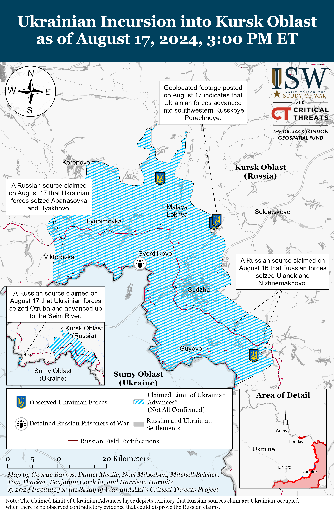](https://understandingwar.org/map/ukrainian-incursion-into-kursk-oblast-as-of-august-17-2024-300-pm-et/)**

**Russian forces will not be able to retain the initiative throughout eastern Ukraine indefinitely, and the culmination of Russian offensive operations will present Ukrainian forces with opportunities to contest the initiative further.** Russia’s possession of the theater-wide initiative has allowed Russia to determine the location, time, intensity, and requirements of fighting in Ukraine, and Russian forces have leveraged these benefits to determine an offensive tempo in Ukraine that has allowed the Russian military to conduct more sustainable offensive efforts and largely avoid culmination.[22] Russian forces pursued a prolonged effort to establish strategic and operational reserves ahead of Summer 2024 to support ongoing offensive efforts, and the Russian military has likely expended and committed many of these reserves to offensive operations throughout eastern and northeastern Ukraine in Spring 2024 and over the course of this summer.[23] The Ukrainian incursion in Kursk Oblast and the heightened Russian priority of maintaining the tempo of offensive operations in Donetsk Oblast will likely place greater strain on Russia’s remaining operational reserves and likely begin to impact Russia’s ability to sustain consistent offensive operations throughout the theater. Further Russian redeployments to Kursk Oblast would also further weaken Russia’s ability to sustain offensive operations in northeastern and eastern Ukraine, although Russian forces are more likely to begin decreasing offensive activity on lower-priority sectors of the front than to do so equally throughout the frontline.

**The Russian offensive operation to seize Pokrovsk is emblematic of the Russian approach to the war in Ukraine that embraces positional warfare for gradual creeping advances and seeks to win a war of attrition.** The Russian military command tasked the Central Grouping of Forces with identifying and exploiting weaknesses in Ukraine’s defensive line following the Russian seizure of Avdiivka in mid-February 2024.[24] Mechanized elements of the Central Grouping of Forces achieved a notable tactical breakthrough northwest of Avdiivka in mid-April 2024 by exploiting exhausted and poorly equipped Ukrainian forces, and the Russian military command continued to invest additional manpower from Russia’s operational reserves to prevent offensive operations east of Pokrovsk from culminating for several months.[25] Russian forces applied consistently intense offensive pressure all along the front east and southeast of Pokrovsk and opportunistically exploited weaknesses in Ukraine’s defenses to advance in this direction, and the Russian military command has tolerated significant manpower losses in exchange for advancing roughly two square kilometers per day (roughly 406 square kilometers in total) in Pokrovsk Raion over the last six months. Russian forces in the Pokrovsk direction have focused on frontal infantry assaults from small village to small village in their gradual advance to Pokrovsk and have spent weeks at times trying to seize small villages in the area without attempting advance by maneuver.

The Russian military command appears to have abandoned its efforts to make rapid tactical gains in the Pokrovsk direction and embraced positional warfare.[26] Putin’s calculus that Russia can continue gradual creeping advances indefinitely during a prolonged state of positional warfare is predicated on Russia’s manpower and materiel advantage.[27] Russia’s ongoing force generation rates have allowed Russian forces to sustain their current tempo of offensive operations throughout the frontline by generating roughly as many new forces as the Russian military loses in a given period.[28] Russia’s defense industry is reportedly capable of producing or refurbishing enough armored vehicles to sustain Russia’s current rate of armored vehicle losses in Ukraine for at least two or three years.[29] Putin’s theory of victory rests on the assumption that Ukrainian forces cannot acquire and sustain the manpower and material required to prevent indefinite, gradual Russian advances or contest the initiative, and Ukrainian forces appear to be actively challenging this assumption in Kursk Oblast.[30]

**Ukraine’s incursion into Kursk Oblast illustrates how Ukrainian forces can use maneuver warfare to offset Russian manpower and materiel advantages.** Russian forces have overall occupied 1,175 square kilometers of territory throughout the entire Ukrainian theater in the seven months from January and July 2024, as ISW recently assessed.[31] In stark contrast, ISW has observed claims that Ukraine’s operation in Kursk Oblast advanced roughly 800 square kilometers over six days from August 6 to 12 and advanced roughly 28 kilometers deep as of August 17.[32] Again, the size of the area seized by Ukrainian forces is not an indicator of the success of that operation–it is offered here to show that restoring maneuver can produce much more rapid advances than positional warfare. The initial Ukrainian incursion into Kursk Oblast attacked largely unprepared, unequipped, and unmanned Russian defensive positions along the border, but Ukraine has continued to leverage maneuver to make rapid advances in Kursk Oblast following the deployment of Russian reinforcements to the area.[33] Ukraine’s use of maneuver in Kursk Oblast serves as an example of how Ukrainian maneuver, coupled with operational surprise, can result in comparably sized gains in significantly shorter periods of time with less manpower and materiel. Prolonged positional warfare, in contrast, will only make Ukraine’s resource disadvantages more pronounced and protracted war will increase the costs to Ukraine and its partners.[34] Drs. Frederick and Kimberly Kagan noted that the challenge of restoring operational maneuver to the war remains the central problem for both sides at the operational level of war, and Ukraine’s ability to achieve rapid maneuver in Kursk Oblast suggests that Ukrainian forces have internalized lessons from the past months of positional warfare that may help Ukraine leverage maneuver warfare in the future.[35]

**It is simply too early to draw dispositive conclusions about the lasting effects that the two very different Russian and Ukrainian efforts will have on the course of the war.** ISW will continue to refrain from commenting on Ukrainian operational intent in Kursk Oblast or elsewhere in the theater beyond what Ukrainian officials themselves have said in order to protect Ukrainian operational security, but it is safe to conclude that the operational significance of the incursion in Kursk Oblast will depend on how Ukrainian forces leverage the theater-wide pressures the operation has created in subsequent operations that pursue operationally significant objectives. ISW also considers assessments about the operational significance of the possible Russian seizure of Pokrovsk to be premature given the possibility that Russian offensive operations throughout Donetsk Oblast will culminate in the coming weeks and months at yet-to-be-determined positions. The operational significance of Pokrovsk will likely depend on Russia’s ability to leverage the seizure of the city in wider maneuver in Donetsk Oblast, which will be extremely difficult for Russian forces if offensive operations elsewhere in Donetsk Oblast culminate and in the absence of large operational reserves. It also remains unclear if Russian forces will be able to seize Pokrovsk before Russian forces culminate on this sector of the front.

**ISW offers these observations about the Ukrainian incursion in Kursk Oblast and the months-long Russian offensive effort in eastern Ukraine to provide a balanced framework for assessing the significance of the current Russian and Ukrainian operations on the course of the entire war, which will remain uncertain for the foreseeable future.**

**Russia and Ukraine were reportedly planning to meet in Qatar in August 2024 to discuss a possible moratorium on Ukrainian and Russian strikes on energy infrastructure, but Russia temporarily postponed the summit after the start of the Ukrainian operation in Kursk Oblast.** The *Washington Post* reported on August 17 that unspecified officials and diplomats familiar with the matter stated that Ukraine and Russia were planning to send delegations to Doha in August 2024 to attend Qatari-mediated discussions about the proposed moratorium.[36] An unspecified diplomat reportedly told the *Washington Post* that Russia postponed the meetings following Ukraine’s incursion into Kursk Oblast but did not call off the talks entirely. The *Washington Post* reported that two sources familiar with the talks stated that unspecified senior Ukrainian officials believed that the summit had a 20 percent or less chance of succeeding even if Ukrainian forces had not conducted the operation into Kursk Oblast. Russia and Ukraine have reportedly been discussing such a moratorium since June 2024 following Qatari proposals to both Ukraine and Russia. The *Washington Post’s* diplomatic source stated that after Russia postponed its participation in the talks, Ukraine wanted to hold bilateral meetings with Qatar, but that Qatar did not view one-sided meetings as beneficial. The *Washington Post* reported that the Ukrainian presidential office stated that the meetings in Qatar were postponed “due to the situation in the Middle East” and that the discussions would take place via videoconference on August 22. It is unclear if the discussions on August 22 will include the Russian delegation or not.

**Russia remains uninterested in any broader, meaningful negotiations regardless of Russia’s willingness to entertain or agree to a possible moratorium on energy infrastructure strikes.** The *Washington Post* reported that unspecified officials stated that some people involved in the negotiations hoped that discussions in Qatar could lead to a more comprehensive agreement to end the war.[37] A source identified only as a Russian academic with close ties to unspecified senior Russian diplomats reportedly stated that the Kremlin would be less motivated to agree to the moratorium on energy infrastructure strikes since Russia assesses it can more significantly damage Ukraine’s energy infrastructure than Ukraine can damage Russian oil refineries. The Russian academic reportedly stated, however, that Russia may be more willing to consider the energy strike moratorium to push Ukraine to engage in negotiations on a broader ceasefire.

ISW has repeatedly assessed that despite the Kremlin’s longstanding information operations feigning interest in meaningful negotiations, Russia is not interested in good-faith negotiations with Ukraine to end the war.[38] Putin and the Kremlin have notably intensified their expansionist rhetoric about Ukraine since December 2023 and have increasingly indicated that Russia intends to conquer more territory in Ukraine and is committed to destroying Ukrainian statehood and identity.[39] Russia has been preparing for a possible conventional war with NATO in the future, and the Kremlin likely views anything short of Ukrainian capitulation as an unacceptable threat to Russia’s ability to fight such a war.[40] Putin outlined uncompromising demands on June 14 for Ukrainian capitulation as prerequisites for any “peace” negotiations, including Ukraine’s recognition of Russian control over the entirety of Luhansk, Donetsk, Zaporizhia, and Kherson oblasts – including the areas of these oblasts that Russian forces currently do not occupy.[41] Putin outright rejected any negotiated ceasefire during a press conference with Hungarian Prime Minister Viktor Orban on July 5, claiming that a ceasefire would allow Ukraine to regroup and rearm.[42] Putin stated that Russia instead favors a “complete” and “final” end to the war. Putin continued to demonstrate his unwillingness to negotiate with Ukraine during a meeting on August 12, during which he portrayed Ukraine as an actor with whom Russia is not interested in negotiating.[43]

**Russia would likely continue strikes against deep-rear military objects and industrial enterprises in Ukraine even if it were to agree to a moratorium on strikes against energy infrastructure.** The Russian strike campaign targeting Ukrainian energy infrastructure is at least in part meant to constrain Ukraine’s defense industrial production capacity and degrade Ukraine’s ability to defend against Russian aggression.[44] Russia would likely continue to pursue this objective even if it were to agree to the moratorium on strikes on Ukrainian energy infrastructure and may resort to striking Ukrainian defense industrial enterprises more directly to achieve the same effect. Russia would likely also continue its large-scale strike series to force Ukraine to use a considerable portion of its air defense missile stockpile and fix limited air defense systems away from frontline areas to protect Ukrainian cities in the rear, allowing Russian aviation to more securely strike Ukrainian frontline forces.[45]

**Russia is almost certainly only considering a possible moratorium on energy strikes due to Ukraine’s months-long strike campaign against Russian oil refineries — demonstrating a secondary effect of Ukraine’s strike campaign.** The *Washington Post* noted that Ukraine was open to the moratorium discussions because Kyiv viewed such discussions as part of Ukraine’s 10-point peace plan, which includes calls for Russia to stop striking Ukrainian civilian and energy infrastructure.[46] The *Washington Post*, however, did not offer an explanation for Russia’s interest in the discussions. Ukraine has been conducting a strike campaign against Russian oil refineries since at least late January 2024.[47] Russia’s reported temporary postponement — as opposed to complete cancellation — of the discussions in Qatar demonstrates that Russia is likely still interested in the possible moratorium and that the Kremlin views the Ukrainian strikes against Russian oil infrastructure as significant and distressing.

**Russia has pulled out of past wartime agreements with Ukraine, and Ukraine is reportedly planning to create conditions to prevent Russia from terminating another Ukrainian-Russian agreement.** A Ukrainian official familiar with the potential moratorium agreement reportedly stated that Ukraine would “talk with [its] partners to be sure that the deal will work” and would not only speak “one-to-one with Russia.”[48] Ukraine’s efforts to include unspecified partners to enforce the deal are likely aimed at preventing Russia from using false justifications to terminate any future agreement – as Russia has done in the past. Russia refused to renew the Black Sea Grain Initiative in July 2023, but Ukraine has been able to continue exports through its grain corridor due to Ukraine’s missile and drone campaign targeting Black Sea Fleet (BSF) assets and vessels and inhibiting Russia’s ability to halt maritime activity in the western Black Sea.[49] The *Washington Post* noted that Russia attempted to justify its suspension of the grain deal with claims that only a small percentage of the exported grain went to the states that needed it the most – despite data from the United Nations (UN) to the contrary.[50]

**Ukrainian forces continue to marginally advance in Kursk Oblast amid ongoing Russian efforts to stop further Ukrainian advances and begin to push Ukrainian forces back across the international border.** Russian milbloggers claimed on August 17 that Russian forces destroyed several bridges across the Seim River in Tetkino and Popovo-Lezhachi (both southwest of Korenevo and along the international border) in order to stop Ukrainian forces advancing from the international border and that Ukrainian forces have consolidated positions in Otruba and up to the west bank of the river.[51] A prominent Kremlin propagandist claimed that Ukrainian forces continued unspecified activity near Tetkino, suggesting that Ukrainian forces may have been operating in the Tetkino area previously, and several Russian milbloggers claimed that Russian forces maintain positions in Tetkino itself.[52] The propagandist claimed that Ukrainian forces are conducting an offensive operation from the international border towards Troitskoye (south of Korenevo and one kilometer from the international border) and that Ukrainian forces advanced west and south of Snagost (south of Korenevo).[53] The Russian Ministry of Defense (MoD) and Russian milbloggers claimed that Ukrainian forces are also conducting assaults northeast of Korenevo, including near Kauchuk and Alekseyevsky, but the exact contours of Ukrainian operations in this area remain unclear.[54] Geolocated footage published on August 17 indicates that Ukrainian forces continue to operate in western Russkoye Porechnoye (north of Sudzha).[55] Russian milbloggers also claimed that Ukranian forces recently advanced northeast of Sudzha in Mykhailovka and southeast of Sudzha in Ulanok and Nizhnemakhovo and that fighting is ongoing southeast of Sudzha along the Kamyshnoye-Krupets-Giri line.[56] Russian milbloggers suggested that Russian forces operating southeast of Sudzha may have recently retaken Ozerki, Kamyshnoye, and Giri.[57]

**The United Kingdom (UK) is reportedly waiting for US approval before greenlighting Ukrainian forces to use UK-provided Storm Shadow missiles for long-range strikes against military targets in Russia.** UK outlet *The Times* reported on August 16 that an unnamed source within the UK government stated that the UK submitted a request for US approval over a month ago (roughly mid-July 2024) and is still waiting for a response from the Biden Administration.[58] A second source within the UK government told *The Times* that discussions about Storm Shadows are “ongoing” with the UK’s allies, and a third source described the approval process as “routine.” *The Times* stated that the UK, US, France, and another unspecified NATO ally must unanimously approve the policy change. The UK’s policy on Ukraine’s ability to use Storm Shadow missiles to strike military targets in Russia has grown increasingly unclear in recent months following several contradictory statements by UK officials.[59]

**The Kremlin has revived its absurd information operation claiming that Ukrainian forces are preparing false-flag attacks, potentially with “dirty bombs,” against Russia’s Kursk Nuclear Power Plant (KNPP) and the occupied Zaporizhzhia Nuclear Power Plant (ZNPP), likely to undermine broader Western support of Ukraine amid Russian battlefield setbacks in Kursk Oblast.** Several prominent Russian authorities, including the Russian Ministry of Defense (MoD), nuclear energy operator Rosatom, Russian diplomats, and occupation authorities claimed on August 17 that Ukrainian authorities are preparing a false-flag attack against the KNPP and ZNPP.[60] Russian state news outlet *RIA Novosti* claimed, citing a source in Russian law enforcement, that Ukrainian forces are planning to conduct this attack with warheads containing radioactive material, and several Russian milbloggers and prominent Kremlin mouthpieces broadly amplified this “dirty-bomb” narrative.[61] Russian authorities, most notably then-Defense Minister Sergei Shoigu, last pushed the dirty bomb narrative at this scale in October 2022 amid Ukraine’s ongoing counteroffensive efforts in southern Ukraine and just weeks before those efforts forced Russian forces to withdraw from west (right) bank Kherson Oblast.[62] Shoigu’s October 2022 statements also intended to scare Western officials into withholding support from Ukraine amid Russian battlefield setbacks, and this objective remains unchanged.

**The Russian false-flag information operation rests on assumptions that contradict or undermine this narrative and ignores the fact that Russia has proven itself an unsafe operator of the ZNPP.** Ukrainian forces have consistently demonstrated their ability to conduct rear area strikes within Russia and occupied Ukraine at distances farther than the roughly 60 kilometers between the KNPP and the international border or the roughly 30-40 kilometers from the current limit of claimed Ukrainian advances within Kursk Oblast with their current capabilities.[63] Prominent Kremlin-affiliated milbloggers undermined this information operation, noting that Ukrainian forces have the capability to strike at this distance already and assessing that a dirty bomb would be “too complicated.”[64] The Kremlin is also trying to turn legitimate complaints about Russia’s militarization of the ZNPP back against Ukraine. Russian forces fired at the ZNPP during their seizure of the plant in March 2022 and since occupying the plant have stored and operated military equipment within the ZNPP.[65] Russian forces reportedly recently set a tire fire at one of the ZNPP’s cooling tower in an apparent attempt to intimidate Ukraine following the start of the incursion into Kursk Oblast.[66]

**Russian forces continue to commit war crimes against Ukrainian soldiers.** Ukrainian Ombudsman Dmytro Lubinets stated on August 16 that he has appealed to the United Nations and the International Committee of the Red Cross (ICRC) concerning a Russian video of a Russian serviceman demonstratively displaying the desecrated body of a Ukrainian servicemember.[67] Lubinets called the desecration of the Ukrainian’s body a violation of international humanitarian law and stated that Russian forces often record and spread such videos to intimidate and demoralize Ukrainians. The Ukrainian Prosecutor’s Office announced on August 17 that it has opened an investigation into the case and that Ukrainian law enforcement are in the process of authenticating the video and the circumstances surrounding it.[68] A Ukrainian source claimed on August 16 that Russian forces recorded the video at the Kolotilovka border checkpoint in Belgorod Oblast on August 12 and that the video has the logo of the Russian 155th Naval Infantry Brigade (Pacific Fleet) elements of which have previously operated in Bucha.[69] It is unclear whether this soldier was a Ukrainian prisoner of war (POW), and ISW is unable to verify the Ukrainian source’s claims.

**Russian President Vladimir Putin promoted his “niece” (first cousin once removed) Anna Tsivileva to the position of State Secretary and Deputy Defense Minister.**[70]Putin signed the decree on August 17 relieving Tsivileva of her former Deputy Defense Minister post. Tsivileva’s new position is likely a promotion. Independent Russian-language outlet *Meduza* noted on August 17 that each Russian federal agency has several deputies but only one State Secretary. Tsivileva will be responsible for the Ministry of Defense’s (MoD) communication with parliament, other governmental agencies, and public organizations.[71] Tsivileva’s promotion is the latest in Putin’s recent efforts to place his relatives and the children of other senior Russian officials in Russian government positions.[72]

**Key Takeaways:**

- **The Ukrainian incursion into Kursk Oblast and Russian offensive operations in eastern Ukraine are not in themselves decisive military operations that will win the war. Both Russian and Ukrainian forces lack the capability to conduct individual decisive war-winning operations and must instead conduct multiple successive operations with limited operational objectives that are far short of victory, but that in aggregate can achieve strategic objectives.**
- **It is too early to assess the outcomes and operational significance of the Ukrainian incursion into Russia and the ongoing Russian offensive effort in eastern Ukraine. The significance of these operations will not emerge in isolation, moreover, but they will matter in so far as they relate to a series of subsequent Russian and Ukrainian campaigns over time.**
- **Russian President Vladimir Putin and the Russian military command likely view maintaining the theater-wide initiative as a strategic imperative to win a war of attrition against Ukraine, and both the Ukrainian incursion in Kursk Oblast and the Russian offensive effort in eastern Ukraine will impact whether Russian forces can retain the initiative in the short-term.**
- **Ukrainian officials have indicated that Ukraine’s operation in Kursk Oblast does not have long-term territorial objectives but instead aims to generate theater-wide operational and strategic pressures on Russian forces.**
- **The Ukrainian operation in Kursk Oblast has already generated theater-wide operational and strategic pressures on Russian forces, and subsequent phases of fighting within Russia will likely generate even greater pressures on Putin and the Russian military.**
- **Russian forces will not be able to retain the initiative throughout eastern Ukraine indefinitely, and the culmination of Russian offensive operations will present Ukrainian forces with opportunities to contest the initiative further.**
- **The Russian offensive operation to seize Pokrovsk is emblematic of the Russian approach to the war in Ukraine that embraces positional warfare for gradual creeping advances and seeks to win a war of attrition.**
- **Ukraine’s incursion into Kursk Oblast illustrates how Ukrainian forces can use maneuver warfare to offset Russian manpower and materiel advantages.**
- **It is simply too early to draw dispositive conclusions about the lasting effects that the two very different Russian and Ukrainian efforts will have on the course of the war.**
- **ISW offers these observations about the Ukrainian incursion in Kursk Oblast and the months-long Russian offensive effort in eastern Ukraine to provide a balanced framework for assessing the significance of the current Russian and Ukrainian operations on the course of the entire war, which will remain uncertain for the foreseeable future.**
- **Russia and Ukraine were reportedly planning to meet in Qatar in August 2024 to discuss a possible moratorium on Ukrainian and Russian strikes on energy infrastructure, but Russia temporarily postponed the summit after the start of the Ukrainian operation in Kursk Oblast.**
- **Russia remains uninterested in any broader, meaningful negotiations regardless of Russia’s willingness to entertain or agree to a possible moratorium on energy infrastructure strikes.**
- **Russia is almost certainly only considering a possible moratorium on energy strikes due to Ukraine’s months-long strike campaign against Russian oil refineries — demonstrating a secondary effect of Ukraine’s strike campaign.**
- **Ukrainian forces advanced within Chasiv Yar, and Russian forces recently marginally advanced near Kreminna, Pokrovsk, and Donetsk City.**
- **The Russian government continues efforts to use the “Time of Heroes” program to integrate trusted Russian military veterans into Russian government roles.**

**[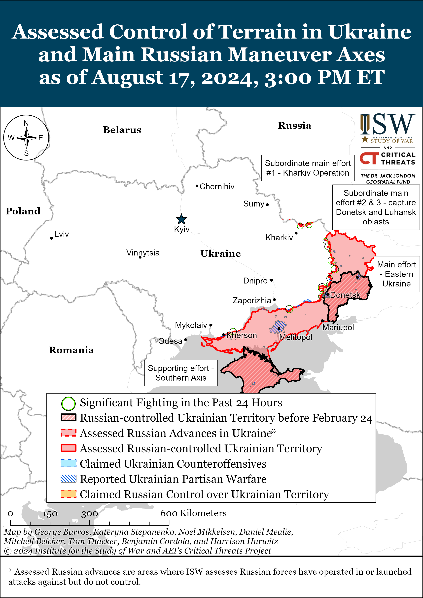](https://understandingwar.org/map/assessed-control-of-terrain-in-ukraine-and-main-russian-maneuver-axes-as-of-august-17-2024-300-pm-et/)**

***We do not report in detail on Russian war crimes because these activities are well-covered in Western media and do not directly affect the military operations we are assessing and forecasting. We will continue to evaluate and report on the effects of these criminal activities on the Ukrainian military and the Ukrainian population and specifically on combat in Ukrainian urban areas. We utterly condemn Russian violations of the laws of armed conflict and the Geneva Conventions and crimes against humanity even though we do not describe them in these reports.***

- Russian Main Effort – Eastern Ukraine (comprised of three subordinate main efforts)
- Russian Subordinate Main Effort #1 – Push Ukrainian forces back from the international border with Belgorod Oblast and approach to within tube artillery range of Kharkiv City
- Russian Subordinate Main Effort #2 – Capture the remainder of Luhansk Oblast and push westward into eastern Kharkiv Oblast and encircle northern Donetsk Oblast
- Russian Subordinate Main Effort #3 – Capture the entirety of Donetsk Oblast
- Russian Supporting Effort – Southern Axis
- Russian Air, Missile, and Drone Campaign
- Russian Mobilization and Force Generation Efforts
- Russian Technological Adaptations
- Activities in Russian-occupied areas
- Ukrainian Defense Industrial Base Efforts
- Russian Information Operations and Narratives
- Significant Activity in Belarus

**Russian Main Effort – Eastern Ukraine**

**Russian Subordinate Main Effort #1 – Kharkiv Oblast** **(Russian objective: Push Ukrainian forces back from the international border with Belgorod Oblast and approach to within tube artillery range of Kharkiv City)**

Russian forces continued ground assaults north of Kharkiv City near Lyptsi and Hlyboke and northeast of Kharkiv City near Vovchansk on August 16 and 17.[73] Ukraine’s Kharkiv Group of Forces reported on August 17 that Russian forces are reinforcing assault groups of the Russian 7th Motorized Rifle Regiment (11th Army Corps [AC], Leningrad Military District [LMD]) near Lyptsi and that elements of the Russian 4th Volunteer Assault Brigade and 1009th Motorized Rifle Regiment (6th Combined Arms Army [CAA], LMD) are coordinating operations in Vovchansk.[74]

**[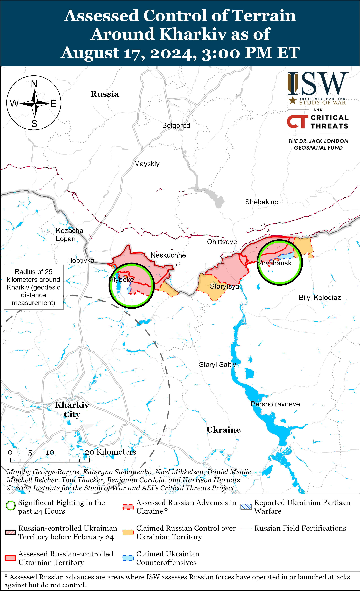](https://understandingwar.org/map/assessed-control-of-terrain-around-kharkiv-as-of-august-17-2024-300-pm-et/)**

[**[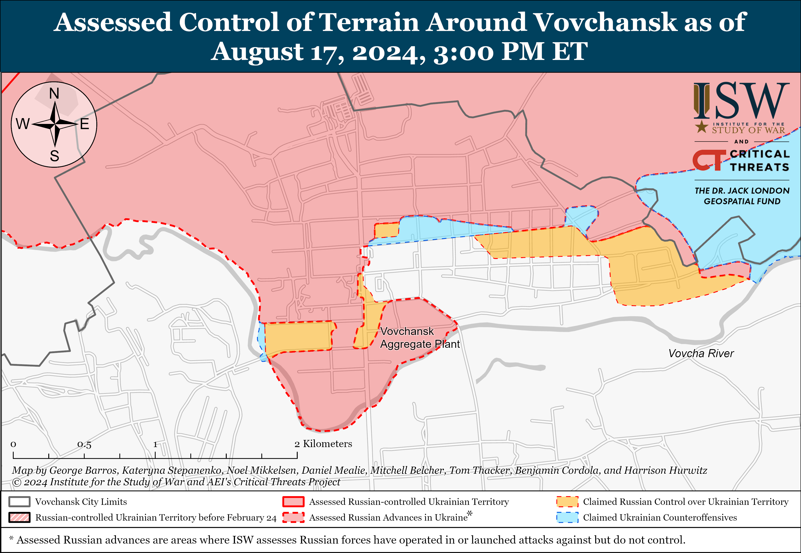](https://understandingwar.org/map/assessed-control-of-terrain-around-vovchansk-as-of-august-17-2024-300-pm-et/)**](https://understandingwar.org/wp-content/uploads/2025/05/Vovchansk20Battle20Map20Draft20August20172C202024.png)

**Russian Subordinate Main Effort #2 – Luhansk Oblast** **(Russian objective: Capture the remainder of Luhansk Oblast and push westward into eastern Kharkiv Oblast and northern Donetsk Oblast)**

Russian forces made marginal advances near Kreminna amid continued fighting along the Kupyansk-Svatove-Kreminna line on August 17. Geolocated footage published on August 17 indicates that Russian forces marginally advanced within northeastern Makiivka (northwest of Kreminna).[75] Russian forces attacked southeast of Kupyansk near Hlushkivka, Kruhlyakivka, Berestove, and Stelmakhivka; northwest of Kreminna near Makiivka, Hrekivka, Nevske, and Novoyehorivka; west of Kreminna near Terny and Torske; and southwest of Kreminna near Dibrova on August 16 and 17.[76] Elements of the Russian 375th Anti-Tank Artillery Battalion (47th Tank Division, 1st Guards Tank Army [GTA], Moscow Military District [MMD]) are reportedly operating in the Kupyansk direction, and elements of the Russian 3rd Motorized Rifle Division (20th CAA, MMD) are reportedly fighting near Makiivka.[77]

**[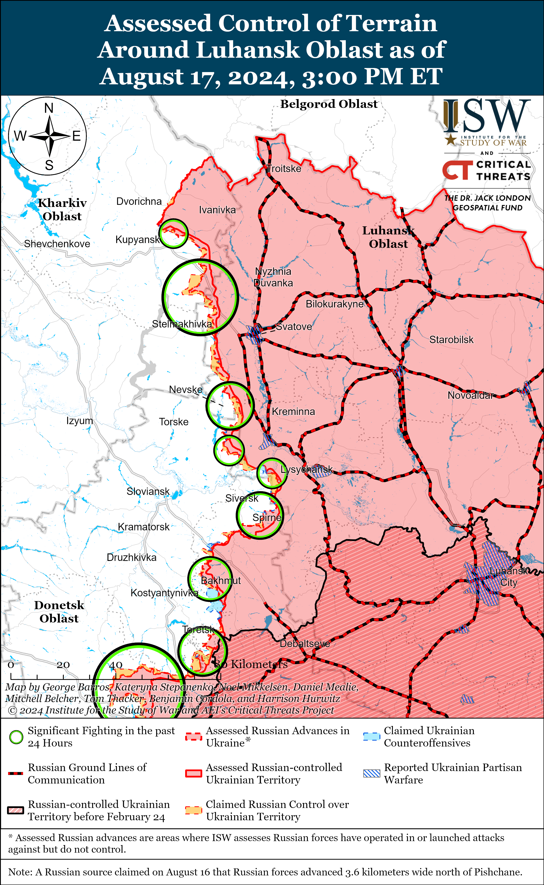](https://understandingwar.org/map/assessed-control-of-terrain-around-luhansk-oblast-as-of-august-17-2024-300-pm-et/)**

**Russian Subordinate Main Effort #3 – Donetsk Oblast** **(Russian objective: Capture the entirety of Donetsk Oblast, the claimed territory of Russia’s proxies in Donbas)**

Russian forces continued ground attacks in the Siversk direction on August 17, but there were no confirmed changes to the frontline. Russian forces continued assaults northeast of Siversk near Bilohorivka, east of Siversk near Verkhnokamyanske, southeast of Siversk near Spirne and Vyimka, and south of Siversk near Pereizne on August 16 and 17.[78] Assault units of the Russian 106th Airborne (VDV) Division are reportedly operating near Pereizne.[79]

Ukrainian forces marginally advanced within eastern Chasiv Yar amid continued Russian assaults in the area on August 17. Geolocated footage published on August 17 indicates that Ukrainian forces marginally advanced on the west (right) bank of the Siverskyi-Donets Donbas Canal in Chasiv Yar.[80] A Russian milblogger claimed that Ukrainian forces are also trying to retake positions in a forest area west of Klishchiivka (southeast of Chasiv Yar).[81] Another Russian milblogger claimed that Russian forces are also advancing in Chasiv Yar’s Zhovtnevyi Microraion, but ISW has not observed visual confirmation of this claim.[82] Russian forces also continued offensive operations north of Chasiv Yar near Hryhorivka on August 16 and 17.[83]

[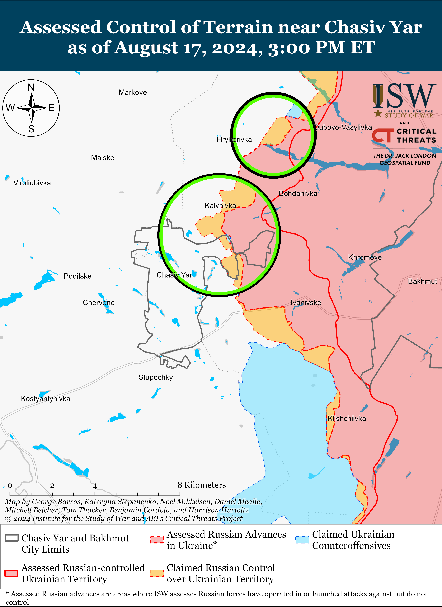](https://understandingwar.org/map/assessed-control-of-terrain-near-chasiv-yar-as-of-august-17-2024-300-pm-et/)

Russian forces continued offensive operations in the Toretsk direction on August 17, but there were no confirmed changes to the frontline. Russian milbloggers claimed that Russian forces advanced further along Tsentralna Street towards Toretsk from western Pivnichne (east of Toretsk) and further towards Nelipivka (south of Toretsk) from Zalizne (southeast of Toretsk).[84] A Russian milblogger claimed that Russian forces are advancing in Niu York (south of Toretsk) and control roughly 80 percent of the settlement, although ISW has not observed confirmation of this claim.[85] The Ukrainian General Staff reported that Russian forces also continued assaults north of Toretsk near Bila Hora and Dyliivka and south of Toretsk near Panteleymonivka on August 16 and 17.[86] Elements of the Russian 9th Motorized Rifle Brigade (1st Donetsk People’s Republic [DNR] Army Corps [AC]) reportedly continue to operate near Niu York.[87]

[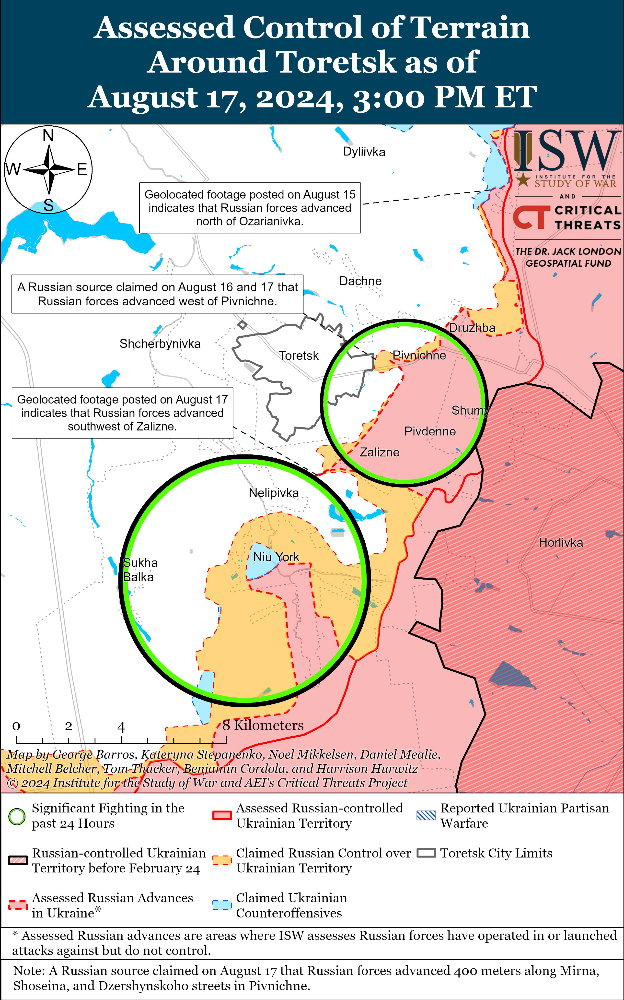](https://understandingwar.org/map/assessed-control-of-terrain-around-toretsk-as-of-august-17-2024-300-pm-et/)

Russian forces recently advanced southeast of Pokrovsk amid continued fighting east and southeast of the settlement on August 17. Geolocated footage published on August 17 indicates that Russian forces recently marginally advanced southeast of Zhelanne (southeast of Pokrovsk).[88] Additional geolocated footage published on August 17 shows Ukrainian forces repelling an unsuccessful reinforced platoon-sized Russian mechanized assault southeast of Lozuvatske (east of Pokrovsk) on the night of August 16 to 17, and Russian forces did not make confirmed advances during this assault.[89] Russian milbloggers claimed that Russian forces seized Novozhelanne (east of Pokrovsk) and that Russian forces are also advancing east of Pokrovsk into Krutyi Yar and further into Hrodivka and southeast of Pokrovsk towards Novohrodivka.[90] ISW has not observed confirmation of these claims, however. A Ukrainian brigade operating in the Pokrovsk direction reported that the Russian military command has not transferred forces *en masse* from the Pokrovsk direction and that Russia’s main force concentrations remain in eastern Ukraine.[91] Russian forces also continued offensive operations east of Pokrovsk near Vozdvyzhenka, Myrolyubivka, and Mykolaivka and towards Zelene Pole and southeast of Pokrovsk near Zhuravka, Zavitne, and Ptyche on August 16 and 17.[92]

[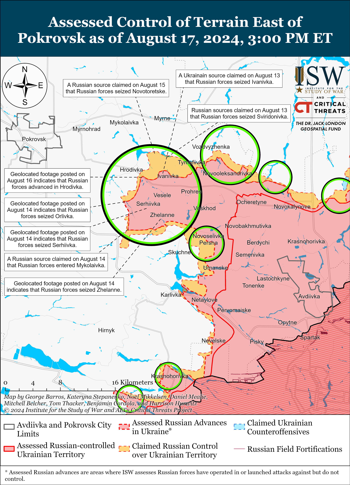](https://understandingwar.org/map/assessed-control-of-terrain-east-of-pokrovsk-as-of-august-17-2024-300-pm-et/)

Russian forces marginally advanced during a mechanized assault southwest of Donetsk City amid additional mechanized assaults and offensive operations in the area on August 16 and 17. Geolocated footage published on August 16 indicates that Russian forces marginally advanced during a reinforced platoon-sized mechanized assault northwest of Pobieda (southwest of Donetsk City).[93] A Ukrainian brigade operating in the Kurakhove direction (west and southwest of Donetsk City) published footage on August 16 showing Ukrainian forces repelling a reduced battalion-sized Russian mechanized assault in an unspecified area of the Kurakhove direction on the night of August 15 to 16.[94] The brigade reported that Russian forces attacked with three tanks, 25 armored vehicles, and a buggy and that Ukrainian forces struck one tank, five armored vehicles, and the buggy before Russian forces retreated from the area. Russian forces have previously taken higher armored vehicle losses during recent roughly battalion-sized mechanized assaults, and the Russian military command seems to have called off this assault before risking similar losses.[95] Russian forces also continued offensive operations west of Donetsk City near Krasnohorivka and Heorhiivka and southwest of Donetsk City near Kostyantynivka on August 16 and 17.[96] Unspecified elements of the Russian 18th Combined Arms Army (CAA) (Southern Military District [SMD]) are reportedly operating near Mykilske (southwest of Donetsk City).[97] ISW has previously only observed elements of the 18th CAA operating in the Kherson direction.[98]

[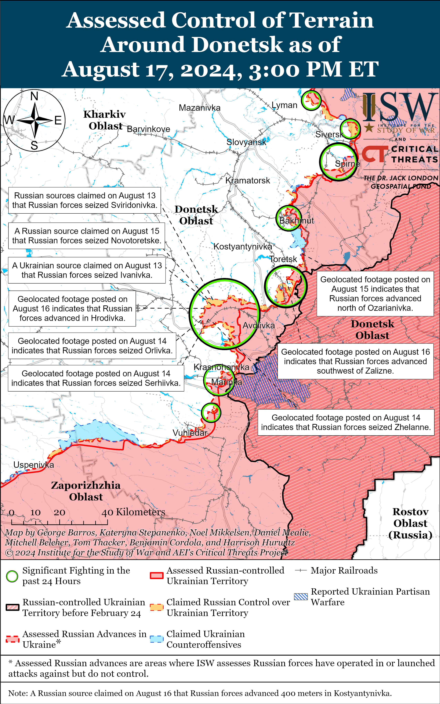](https://understandingwar.org/map/assessed-control-of-terrain-around-donetsk-as-of-august-17-2024-300-pm-et/)

Russian and Ukrainian sources did not comment on the situation in the Donetsk-Zaporizhia Oblast border area on August 17.

**Russian Supporting Effort – Southern Axis** **(Russian objective: Maintain frontline positions and secure rear areas against Ukrainian strikes)**

Positional fighting continued in western Zaporizhia Oblast near Mala Tokmachka (northeast of Robotyne) on August 16 and 17, but there were no confirmed changes to the frontline.[99] Ukrainian Tavriisk Group of Forces Spokesperson Captain Dmytro Lykhovyi stated on August 17 that Russian forces have conducted “some movement” at the brigade or lower unit level but that Russian forces in southern Ukraine have not redeployed to Kursk Oblast *en masse*.[100] Lykhovyi noted that there are about 75,000-90,000 Russian troops in occupied Zaporizhia Oblast and that about 1,000-2,000 Russian soldiers from Zaporizhia Oblast have redeployed to defend in Kursk Oblast. Elements of the Russian 42nd Motorized Rifle Division (58th Combined Arms Army [CAA], Southern Military District [SMD]) reportedly continue operating in the Zaporizhia direction.[101]

[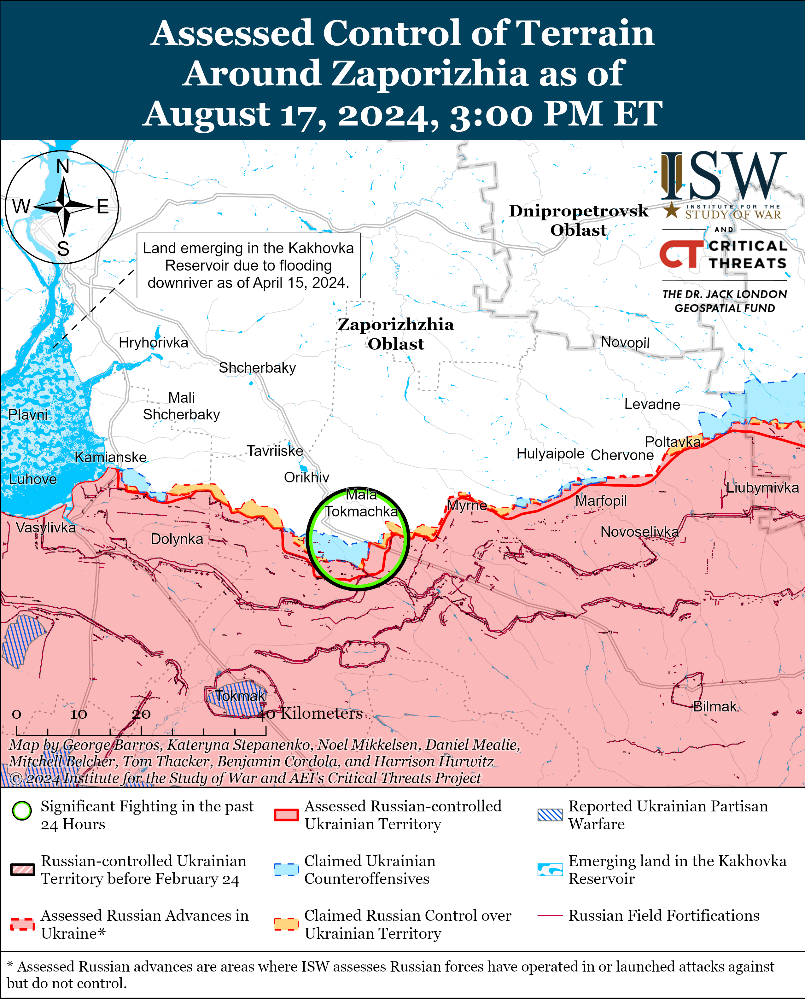](https://understandingwar.org/map/assessed-control-of-terrain-around-zaporizhia-as-of-august-17-2024-300-pm-et/)

Russian forces continued attacks in east (left) bank Kherson Oblast on August 16 and 17 but did not make confirmed advances.[102] Lykhovyi indicated that elements of the Russian 28th Motorized Rifle Regiment (70th Motorized Rifle Division, 18th CAA, SMD) are fighting near Krynky, and elements of the Russian 337th Airborne (VDV) Regiment (104th VDV Division) are reportedly fighting near islands in the Dnipro River delta.[103]

[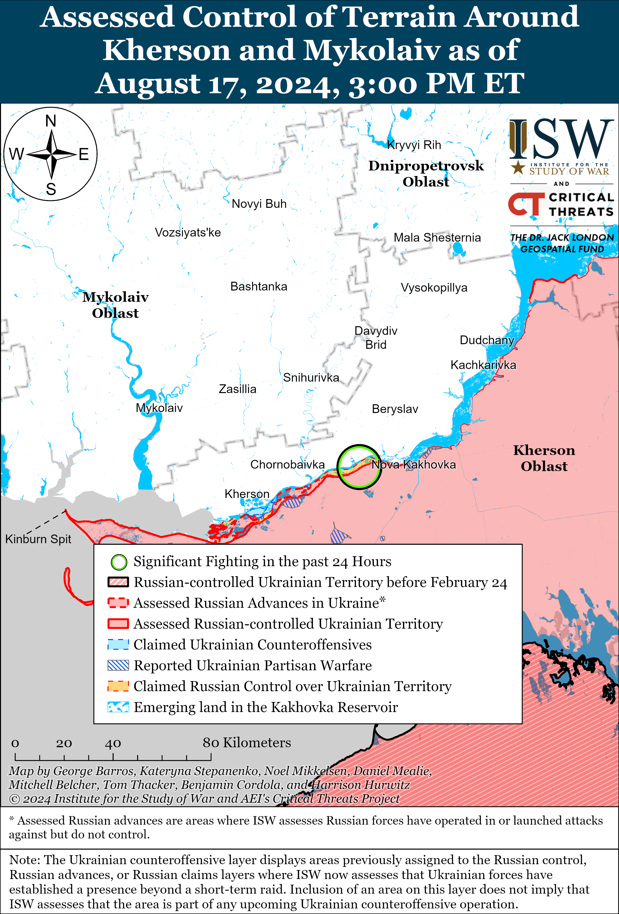](https://understandingwar.org/map/assessed-control-of-terrain-around-kherson-and-mykolaiv-as-of-august-17-2024-300-pm-et/)

The Russian Ministry of Defense (MoD) claimed on August 17 that elements of the Russian Black Sea Fleet (BSF) destroyed two Ukrainian naval drones, likely near occupied Crimea.[104]

**Russian Air, Missile, and Drone Campaign** **(Russian Objective: Target Ukrainian military and civilian infrastructure in the rear and on the frontline)**

Russian forces conducted missile and drone strikes against rear areas of Ukraine overnight on August 16 to 17. Ukrainian Air Force Commander Lieutenant General Mykola Oleshchuk reported that Russian forces targeted Sumy City with an Iskander-K cruise missile launched from Voronezh Oblast and broader Ukraine with 14 Shahed-136/131 drones from Primorsko-Akhtarsk and Yeysk, Krasnodar Krai and Kursk Oblast.[105] Oleshchuk stated that Ukrainian forces downed all 14 Shahed drones in Mykolaiv, Cherkasy, Poltava, Dnipropetrovsk, Zaporizhia, and Kyiv oblasts. Sumy Oblast officials reported that the Russian Iskander-K missile struck a civilian object within Sumy City.[106] Russian sources claimed that Russian forces struck a Ukrainian multiple launch rocket system (MLRS) or an IRIS-T air defense system in Sumy Oblast.[107] Russian sources claimed that Russian forces conducted missile strikes against Ukrainian Patriot air defense systems, a Ukrainian Su-24 aircraft, and ammunition depots in Dnipropetrovsk Oblast on August 16.[108]

**Russian Mobilization and Force Generation Efforts** **(Russian objective: Expand combat power without conducting general mobilization)**

The Russian government continues efforts to use the “Time of Heroes” program to integrate trusted Russian military veterans into Russian government roles. Kremlin newswire *TASS* reported on August 16 that Russian Prime Minister Mikhail Mishustin signed a decree allocating more than 562 million rubles (over $6 million) to the Russian Presidential Academy of National Economy and Public Administration (RANEPA) and the Russian Federal Agency of Youth Affairs (Rosmolodezh) for the Time of Heroes program in 2025.[109] The Time of Heroes program began in April 2024 and aims to train Russian military veterans to hold positions in the Russian government.[110] Russian President Vladimir Putin has previously promoted the Time of Heroes program and likely aims to leverage this program to appease Russian military personnel and domestic supporters of the war in Ukraine.[111]

The Russian Ministry of Defense (MoD) continues to posture itself as providing sufficient training and social benefits for Russian soldiers. Newly appointed Russian State Secretary-Deputy Defense Minister Anna Tsivileva visited personnel of the Russian Southern Military District (SMD) in Stavropol Krai, including a Russian military camp, family members of servicemembers, a military hospital, and a military-patriotic education center that offers military training to Russian students, contract personnel, and reservists.[112] Tsivileva noted that the Russian MoD will renovate the Stavropol military hospital by January 1, 2025 and that the MoD is working to improve housing allotments for Russian servicemembers.

**Russian Technological Adaptations (Russian objective: Introduce technological innovations to optimize systems for use in Ukraine)**

Nothing significant to report.

**Ukrainian Defense Industrial Efforts (Ukrainian objective: Develop its defense industrial base to become more self-sufficient in cooperation with US, European, and international partners)**

*ISW is suspending publishing coverage of Ukrainian defense industrial efforts until further notice.*

**Activities in Russian-occupied areas** **(Russian objective: Consolidate administrative control of annexed areas; forcibly integrate Ukrainian citizens into Russian sociocultural, economic, military, and governance systems)**

*ISW is not publishing coverage of activities in Russian-occupied areas today.*

**Russian Information Operations and Narratives**

Russian authorities are likely attempting to tie the West directly to the Ukrainian incursion into Kursk Oblast to undermine ongoing Western military support for Ukraine. The Russian Ministry of Foreign Affairs (MFA) summoned the Italian ambassador on August 16 in response to Italian journalists covering the Ukrainian incursion into Kursk Oblast from within Sudzha, and Russian authorities opened a criminal investigation on August 17 regarding the Italian journalists’ presence in Kursk Oblast.[113] A formal Ukrainian military escort accompanied the Italian journalists within Sudzha.[114] The Kremlin is likely grasping at excuses to formally present alleged Western connections to the Ukrainian incursion.

The Ukrainian Center for Strategic Communications warned on August 17 that Russian propagandists are running an information operation designed to portray Ukraine as a failed state and undermine Western confidence in the Ukrainian government.[115]

**Significant activity in Belarus** **(Russian efforts to increase its military presence in Belarus and further integrate Belarus into Russian-favorable frameworks and Wagner Group activity in Belarus)**

Russia is reportedly using aspects of the Belarusian defense industrial base (DIB) to camouflage Iranian-produced Shahed-136/131 drones with black paint due to insufficient Russian domestic capabilities. The Ukrainian Resistance Center reported on August 17 that an unspecified Belarusian DIB plant in Gomel City has begun camouflaging Russian Shahed drones with black paint in order to disguise nighttime launches and to avoid overwhelming the Yelabuga production facility where Russia assembles Shahed drones.[116]

The Russian Ministry of Foreign Affairs (MFA) reported on August 17 that Russian Deputy Foreign Minister Mikhail Galuzin met with Belarusian Ambassador to Russia Alexander Rogozhnik on August 15 to discuss implementing bilateral agreements, drafting additional agreements through the Union State framework, and scheduling further diplomatic meetings.[117]

**Note: ISW does not receive any classified material from any source, uses only publicly available information, and draws extensively on Russian, Ukrainian, and Western reporting and social media as well as commercially available satellite imagery and other geospatial data as the basis for these reports. References to all sources used are provided in the endnotes of each update.**

---

[1] https://understandingwar.org/backgrounder/ukraine-and-problem-restoring-maneuver-contemporary-war ; https://understandingwar.org/wp-content/uploads/2024/08/Ukraine20and20the20Problem20of20Restoring20Maneuver20in20Contemporary20War\_final.pdf

[2] https://understandingwar.org/backgrounder/ukraine-and-problem-restoring-maneuver-contemporary-war ; https://understandingwar.org/wp-content/uploads/2024/08/Ukraine20and20the20Problem20of20Restoring20Maneuver20in20Contemporary20War\_final.pdf

[3] https://understandingwar.org/backgrounder/ukraine-and-problem-restoring-maneuver-contemporary-war ; https://understandingwar.org/wp-content/uploads/2024/08/Ukraine20and20the20Problem20of20Restoring20Maneuver20in20Contemporary20War\_final.pdf

[4] https://understandingwar.org/backgrounder/ukraine-and-problem-restoring-maneuver-contemporary-war ; https://understandingwar.org/wp-content/uploads/2024/08/Ukraine20and20the20Problem20of20Restoring20Maneuver20in20Contemporary20War\_final.pdf

[5] https://understandingwar.org/backgrounder/ukraine-and-problem-restoring-maneuver-contemporary-war ; https://understandingwar.org/wp-content/uploads/2024/08/Ukraine20and20the20Problem20of20Restoring20Maneuver20in20Contemporary20War\_final.pdf

[6] https://understandingwar.org/backgrounder/how-delays-western-aid-gave-russia-initiative-ukrainian-counteroffensive-kharkiv

[7] https://understandingwar.org/backgrounder/how-delays-western-aid-gave-russia-initiative-ukrainian-counteroffensive-kharkiv

[8] https://isw.pub/UkrWar060724

[9] https://isw.pub/UkrWar060724

[10] https://isw.pub/UkrWar081124

[11] https://understandingwar.org/backgrounder/russian-offensive-campaign-assessment-august-15-2024

[12] https://understandingwar.org/backgrounder/how-delays-western-aid-gave-russia-initiative-ukrainian-counteroffensive-kharkiv ; https://understandingwar.org/backgrounder/russian-winter-spring-2024-offensive-operation-kharkiv-luhansk-axis

[13] https://isw.pub/UkrWar081324 ;

[14] https://isw.pub/UkrWar081124

[15] https://www.nytimes.com/2024/08/15/us/politics/ukraine-incursion-russia-kursk.html

[16] https://isw.pub/UkrWar081624 ; https://understandingwar.org/backgrounder/russian-offensive-campaign-assessment-august-15-2024 ; https://isw.pub/UkrWar081424 ; https://isw.pub/UkrWar081324 ; https://isw.pub/UkrWar081224

[17] https://isw.pub/UkrWar080824

[18] https://isw.pub/UkrWar080824

[19] https://understandingwar.org/backgrounder/how-delays-western-aid-gave-russia-initiative-ukrainian-counteroffensive-kharkiv

[20] https://isw.pub/UkrWar081124

[21] https://isw.pub/UkrWar081124

[22] https://understandingwar.org/backgrounder/how-delays-western-aid-gave-russia-initiative-ukrainian-counteroffensive-kharkiv

[23] https://isw.pub/UkrWar060824 ; https://understandingwar.org/backgrounder/russian-offensive-campaign-assessment-june-6-2024 ; https://isw.pub/UkrWar032224 ; https://isw.pub/UkrWar032124 ; https://understandingwar.org/backgrounder/russian-offensive-campaign-assessment-march-14-2024 ; https://isw.pub/UkrWar020424 ; https://isw.pub/UkrWar011924

[24] https://isw.pub/UkrWar031324 ; https://understandingwar.org/backgrounder/how-delays-western-aid-gave-russia-initiative-ukrainian-counteroffensive-kharkiv

[25] https://isw.pub/UkrWar031324 ; https://understandingwar.org/backgrounder/how-delays-western-aid-gave-russia-initiative-ukrainian-counteroffensive-kharkiv

[26] https://isw.pub/UkrWar072624

[27] https://isw.pub/UkrWar060724

[28] https://isw.pub/UkrWar072424

[29] https://isw.pub/UkrWar021324

[30] https://isw.pub/UkrWar060724

[31] https://isw.pub/UkrWar081224

[32] https://isw.pub/UkrWar081224

[33] https://understandingwar.org/backgrounder/russian-offensive-campaign-assessment-august-7-2024; https://understandingwar.org/backgrounder/russian-offensive-campaign-assessment-august-15-2024 ; https://isw.pub/UkrWar081324

[34] https://understandingwar.org/wp-content/uploads/2024/08/Ukraine20and20the20Problem20of20Restoring20Maneuver20in20Contemporary20War\_final.pdf

[35] https://understandingwar.org/wp-content/uploads/2024/08/Ukraine20and20the20Problem20of20Restoring20Maneuver20in20Contemporary20War\_final.pdf

[36] https://www.washingtonpost.com/world/2024/08/17/kursk-ukraine-russia-energy-ceasefire/

[37] https://www.washingtonpost.com/world/2024/08/17/kursk-ukraine-russia-energy-ceasefire/

[38] https://understandingwar.org/backgrounder/why-putin-remains-uninterested-meaningful-negotiations-ukraine; https://isw.pub/UkrWar040424 ; https://isw.pub/UkrWar021024 ; https://isw.pub/UkrWar020824

[39] https://isw.pub/UkrWar112823 ; https://isw.pub/UkrWar120123 ; https://isw.pub/UkrWar120823 ; https://isw.pub/UkrWar121023 ; https://isw.pub/UkrWar121323 ; https://isw.pub/UkrWar121423 ; https://isw.pub/UkrWar121723 ; https://isw.pub/UkrWar121923 ; https://isw.pub/UkrWar010224 ; https://isw.pub/UkrWar012724; https://understandingwar.org/backgrounder/why-putin-remains-uninterested-meaningful-negotiations-ukraine

[40] https://understandingwar.org/backgrounder/why-putin-remains-uninterested-meaningful-negotiations-ukraine

[41] https://understandingwar.org/backgrounder/russian-offensive-campaign-assessment-june-14-2024

[42] https://understandingwar.org/backgrounder/russian-offensive-campaign-assessment-july-5-2024

[43] https://isw.pub/UkrWar081224

[44] https://understandingwar.org/backgrounder/special-report-russian-strikes-more-effective-ukraine-exhausts-defenses ; https://understandingwar.org/backgrounder/russian-offensive-campaign-assessment-april-12-2024

[45] https://understandingwar.org/backgrounder/special-report-russian-strikes-more-effective-ukraine-exhausts-defenses

[46] https://www.president dot gov.ua/storage/j-files-storage/01/19/53/32af8d644e6cae41791548fc82ae2d8e\_1691483767.pdf; https://www.washingtonpost.com/world/2024/08/17/kursk-ukraine-russia-energy-ceasefire/

[47] https://isw.pub/UkrWar012524; https://isw.pub/UkrWar020324; https://isw.pub/UkrWar031324 ; https://isw.pub/UkrWar031524; https://isw.pub/UkrWar031624 ; https://isw.pub/UkrWar031724; https://isw.pub/UkrWar032324 ; https://isw.pub/UkrWar040224; https://isw.pub/UkrWar042724 ; https://isw.pub/UkrWar050124; https://isw.pub/UkrWar050924 ; https://isw.pub/UkrWar051024; https://isw.pub/UkrWar051024 ; https://isw.pub/UkrWar051124; https://understandingwar.org/backgrounder/russian-offensive-campaign-assessment-may-12-2024; https://isw.pub/UkrWar051924 ; https://understandingwar.org/backgrounder/russian-offensive-campaign-assessment-june-6-2024; https://isw.pub/UkrWar062024; https://isw.pub/UkrWar070524 ; https://isw.pub/UkrWar072224  ; https://isw.pub/UkrWar072724; https://isw.pub/UkrWar080324

[48] https://www.washingtonpost.com/world/2024/08/17/kursk-ukraine-russia-energy-ceasefire/

[49] https://understandingwar.org/backgrounder/ukrainian-strikes-have-changed-russian-naval-operations-black-sea

[50] https://www.washingtonpost.com/world/2024/08/17/kursk-ukraine-russia-energy-ceasefire/

[51] https://t.me/divgen/52849 ; https://t.me/boris\_rozhin/133956 ; https://x.com/GirkinGirkin/status/1824769383907864880; https://t.me/Sladkov\_plus/11196; https://t.me/alehingennadiy ; https://t.me/milinfolive/128668

[52] https://t.me/wargonzo/21615; https://t.me/wargonzo/21616; https://t.me/mig41/36255 ; https://t.me/yurasumy/17190

[53] https://t.me/yurasumy/17190

[54] https://t.me/yurasumy/17190  ; https://x.com/GirkinGirkin/status/1824723375035465846; https://t.me/rusich\_army/16594 ; https://t.me/rybar/62863 ; https://t.me/mod\_russia/42269  ; https://t.me/rybar/62852 ; https://t.me/RVvoenkor/74994

[55] https://t.me/creamy\_caprice/6421; https://t.me/iamsniper/6369;https://x.com/GeoConfirmed/status/1824782731718353087; https://x.com/alexskichambe/status/1824606808880947250; https://x.com/alexskichambe/status/1824605627093750265 ; https://t.me/rybar/62855

[56] https://t.me/rybar/62863 ; https://t.me/rybar/62855 ; https://t.me/RVvoenkor/74994 ; https://t.me/yurasumy/17177

[57] https://t.me/rybar/62863 ; https://t.me/rybar/62855 ; https://t.me/RVvoenkor/74994

[58] https://www.thetimes.com/world/russia-ukraine-war/article/us-blocks-ukraine-from-firing-british-missiles-into-russia-9wq6td2pw

[59] https://understandingwar.org/backgrounder/russian-offensive-campaign-assessment-august-15-2024 ; https://isw.pub/UkrWar071924 ; https://isw.pub/UkrWar071224 ; https://understandingwar.org/backgrounder/russian-offensive-campaign-assessment-july-10-2024 ; https://understandingwar.org/backgrounder/russian-offensive-campaign-assessment-june-6-2024 ; https://isw.pub/UkrWar050324

[60] https://iz dot ru/1744065/2024-08-16/kharkovskaia-vga-zaiavila-o-planakh-kieva-nanesti-udary-po-kurskoi-i-zaporozhskoi-aes; https://t.me/tass\_agency/266770; https://t.me/tass\_agency/266773; https://t.me/tass\_agency/266855; https://t.me/tass\_agency/266856; https://t.me/tass\_agency/266862; https://t.me/tass\_agency/266863 ; https://t.me/mod\_russia/42267

[61] https://ria dot ru/20240816/vedomstvo-1966702970.html; https://t.me/RVvoenkor/74977; https://t.me/tass\_agency/266780; https://t.me/dva\_majors/50017; https://t.me/rogozin\_do/6310; https://t.me/dva\_majors/50018; https://t.me/dva\_majors/50022;

[62] https://understandingwar.org/backgrounder/russian-offensive-campaign-assessment-october-23

[63] https://understandingwar.org/backgrounder/russian-offensive-campaign-assessment-august-15-2024; https://understandingwar.org/backgrounder/russian-offensive-campaign-assessment-july-27-2024; https://understandingwar.org/backgrounder/russian-offensive-campaign-assessment-july-14-2024; https://understandingwar.org/backgrounder/russian-offensive-campaign-assessment-july-16-2024; https://understandingwar.org/backgrounder/russian-offensive-campaign-assessment-may-19-2024; https://understandingwar.org/backgrounder/russian-offensive-campaign-assessment-may-31-2024; https://understandingwar.org/backgrounder/russian-offensive-campaign-assessment-april-5-2024; https://understandingwar.org/backgrounder/russian-offensive-campaign-assessment-march-9-2024;

[64] https://t.me/rybar/62848; https://t.me/dva\_majors/50021

[65] https://www.washingtonpost.com/outlook/2022/03/04/russia-ukraine-zaporizhzhia-nuclear/; https://isw.pub/UkrWar120223; https://isw.pub/UkrWar111623; https://isw.pub/UkrWar070423; https://isw.pub/UkrWar120822; https://isw.pub/RusCampaignSept4; https://isw.pub/RusCampaignAugust25; https://isw.pub/UkrWar120822; https://isw.pub/RusCampaignJuly12; https://isw.pub/RusCampaignJuly21; https://isw.pub/RusCampaignAugust3; http://isw.pub/RusCampaignAugust6

[66] https://www.ukrinform dot net/rubric-economy/3895017-iaea-experts-denied-access-inside-russian occupied-znpps-cooling-tower-energy-ministry.html

[67] https://t.me/dmytro\_lubinetzs/6472 ; https://suspilne dot media/815427-v-merezi-zavilos-video-z-vidrizanou-golovou-nibito-ukrainskogo-vijskovogo-lubinec-vidreaguvav/ ; https://t.me/sotaproject/85386

[68]https://www.facebook.com/pgo.gov.ua/posts/pfbid062ZgP19jnokiN7HZQYsXbLXBYxNX4YfYnce2aQipczeCEKXqHcEXkvSn3ym8n4wfl ; https://suspilne dot media/815665-prokuratura-vidkrila-spravu-cerez-video-z-obezgolovlennam-jmovirno-ukrainskogo-vijskovogo/; https://t.me/bbcrussian/69192

[69] https://t.me/sotaproject/85386 ; https://www.businessinsider.com/russia-155th-brigade-destroyed-ukraine-poor-reinforcements-vuhledar-bucha-pavlika-2023-3

[70] https://www.rbc dot ru/politics/17/08/2024/66c0a6cc9a7947242ec83ab5; https://t.me/tass\_agency/266883 ; https://t.me/mod\_russia/42276 ; https://t.me/sotaproject/85413; https://t.me/bbcrussian/69197

[71] https://meduza dot io/news/2024/08/17/putin-povysil-svoyu-plemyannitsu-annu-tsivilevu-do-stats-sekretarya-do-etogo-ona-byla-obychnym-zamministra-oborony

[72] https://understandingwar.org/backgrounder/russian-offensive-campaign-assessment-june-17-2024; https://isw.pub/UkrWar060724

[73]https://www.facebook.com/GeneralStaff.ua/posts/pfbid02qiM5MsrhToH94sTzWuoVhV7WiSXtWLUcgh1qZ3EDiQ2Rr9g2tGqKbn42Hek1bKnul; https://www.facebook.com/GeneralStaff.ua/posts/pfbid02CTQZEvZFerTCcT5QepADiJxNW2wM96QyUizSS5GKNzj4CBDdRupW2tkmnr3mA1cRl; https://www.facebook.com/GeneralStaff.ua/posts/pfbid07qdC5Cr2ipZWNgG2FViGdQ7PbWrqGhkErFrNBKNMPikfkc1yceRGk1hQtMerbJhsl; https://t.me/wargonzo/21607

[74] https://t.me/otukharkiv/777

[75] https://t.me/ZSU\_115OMBr/395; https://t.me/creamy\_caprice/6428

[76]https://www.facebook.com/GeneralStaff.ua/posts/pfbid02qiM5MsrhToH94sTzWuoVhV7WiSXtWLUcgh1qZ3EDiQ2Rr9g2tGqKbn42Hek1bKnul; https://www.facebook.com/GeneralStaff.ua/posts/pfbid02CTQZEvZFerTCcT5QepADiJxNW2wM96QyUizSS5GKNzj4CBDdRupW2tkmnr3mA1cRl; https://www.facebook.com/GeneralStaff.ua/posts/pfbid07qdC5Cr2ipZWNgG2FViGdQ7PbWrqGhkErFrNBKNMPikfkc1yceRGk1hQtMerbJhsl

[77] https://t.me/epoddubny/20741; https://t.me/rusich\_army/16592

[78] https://www.facebook.com/GeneralStaff.ua/posts/pfbid02qiM5MsrhToH94sTzWuoVhV7WiSXtWLUcgh1qZ3EDiQ2Rr9g2tGqKbn42Hek1bKnul  ; https://www.facebook.com/GeneralStaff.ua/posts/pfbid02CTQZEvZFerTCcT5QepADiJxNW2wM96QyUizSS5GKNzj4CBDdRupW2tkmnr3mA1cRl  ; https://www.facebook.com/GeneralStaff.ua/posts/pfbid07qdC5Cr2ipZWNgG2FViGdQ7PbWrqGhkErFrNBKNMPikfkc1yceRGk1hQtMerbJhsl  ; https://t.me/rusich\_army/16593

[79] https://t.me/rusich\_army/16593

[80] https://x.com/Map\_Hargoo/status/1824726723407032506; https://t.me/rusich\_army/16593; https://x.com/GeoConfirmed/status/1824784219156947095

[81] https://t.me/DnevnikDesantnika/14151

[82] https://t.me/RVvoenkor/74997

[83] https://www.facebook.com/GeneralStaff.ua/posts/pfbid02CTQZEvZFerTCcT5QepADiJxNW2wM96QyUizSS5GKNzj4CBDdRupW2tkmnr3mA1cRl  ; https://www.facebook.com/GeneralStaff.ua/posts/pfbid07qdC5Cr2ipZWNgG2FViGdQ7PbWrqGhkErFrNBKNMPikfkc1yceRGk1hQtMerbJhsl

[84] https://t.me/z\_arhiv/27659?single ; https://t.me/z\_arhiv/27664?single ; https://t.me/RVvoenkor/74997

[85] https://t.me/wargonzo/21612 ; https://t.me/wargonzo/21607

[86] https://www.facebook.com/GeneralStaff.ua/posts/pfbid02qiM5MsrhToH94sTzWuoVhV7WiSXtWLUcgh1qZ3EDiQ2Rr9g2tGqKbn42Hek1bKnul  ; https://www.facebook.com/GeneralStaff.ua/posts/pfbid02CTQZEvZFerTCcT5QepADiJxNW2wM96QyUizSS5GKNzj4CBDdRupW2tkmnr3mA1cRl  ; https://www.facebook.com/GeneralStaff.ua/posts/pfbid07qdC5Cr2ipZWNgG2FViGdQ7PbWrqGhkErFrNBKNMPikfkc1yceRGk1hQtMerbJhsl

[87] https://t.me/wargonzo/21612

[88] https://t.me/creamy\_caprice/6429; https://t.me/brygada47/978

[89] https://t.me/rubpak/177 ; https://x.com/666\_mancer/status/1824808010436506028 ; https://x.com/666\_mancer/status/1824847361061106063

[90] https://t.me/wargonzo/21607 ; https://t.me/DnevnikDesantnika/14106 ; https://t.me/z\_arhiv/27653  ; https://t.me/boris\_rozhin/133930 ; https://t.me/z\_arhiv/27668 ; https://t.me/motopatriot/26262

[91] https://www.facebook.com/watch/?v=1233711057980426 ; https://armyinform dot com.ua/2024/08/17/bradley-ryatuye-vykosyv-posadku-z-okupantamy-i-vyviz-bijcziv-47-brygady/

[92] https://www.facebook.com/GeneralStaff.ua/posts/pfbid02qiM5MsrhToH94sTzWuoVhV7WiSXtWLUcgh1qZ3EDiQ2Rr9g2tGqKbn42Hek1bKnul  ; https://www.facebook.com/GeneralStaff.ua/posts/pfbid02CTQZEvZFerTCcT5QepADiJxNW2wM96QyUizSS5GKNzj4CBDdRupW2tkmnr3mA1cRl  ; https://t.me/DnevnikDesantnika/14106 ; https://t.me/RVvoenkor/74997

[93] https://x.com/PuenteUribarri/status/1824549678567862455; https://x.com/klinger66/status/1824632625396420834; https://x.com/klinger66/status/1824621668758614408 ; https://www.facebook.com/watch/?v=1964355087348615

[94] https://www.facebook.com/watch/?v=842431041292361 ; https://suspilne dot media/815435-zsu-prosuvautsa-v-kurskij-oblasti-u-rosii-zaavili-nibito-ukraina-gotue-udari-po-aes-905-den-vijni-onlajn/

[95] https://isw.pub/UkrWar073024

[96] https://www.facebook.com/GeneralStaff.ua/posts/pfbid02qiM5MsrhToH94sTzWuoVhV7WiSXtWLUcgh1qZ3EDiQ2Rr9g2tGqKbn42Hek1bKnul  ; https://www.facebook.com/GeneralStaff.ua/posts/pfbid02CTQZEvZFerTCcT5QepADiJxNW2wM96QyUizSS5GKNzj4CBDdRupW2tkmnr3mA1cRl  ; https://www.facebook.com/GeneralStaff.ua/posts/pfbid07qdC5Cr2ipZWNgG2FViGdQ7PbWrqGhkErFrNBKNMPikfkc1yceRGk1hQtMerbJhsl

[97] https://t.me/boris\_rozhin/133994

[98] https://understandingwar.org/backgrounder/russian-offensive-campaign-assessment-april-14-2024 ; https://understandingwar.org/backgrounder/russian-offensive-campaign-assessment-february-18-2024 ; https://understandingwar.org/backgrounder/russian-offensive-campaign-assessment-july-15-2024

[99] https://www.facebook.com/GeneralStaff.ua/posts/pfbid02CTQZEvZFerTCcT5QepADiJxNW2wM96QyUizSS5GKNzj4CBDdRupW2tkmnr3mA1cRl; https://www.facebook.com/GeneralStaff.ua/posts/pfbid02CTQZEvZFerTCcT5QepADiJxNW2wM96QyUizSS5GKNzj4CBDdRupW2tkmnr3mA1cRl; https://t.me/SJTF\_Odes/10976

[100] https://www.youtube.com/watch?v=j5TqaWCCdUg ; https://armyinform dot com.ua/2024/08/17/na-pivdni-nemaye-masshtabnogo-vidvedennya-vorozhyh-vijsk-ouv-tavriya/

[101] https://t.me/dva\_majors/50037

[102] https://www.facebook.com/GeneralStaff.ua/posts/pfbid02qiM5MsrhToH94sTzWuoVhV7WiSXtWLUcgh1qZ3EDiQ2Rr9g2tGqKbn42Hek1bKnul; https://www.facebook.com/GeneralStaff.ua/posts/pfbid02CTQZEvZFerTCcT5QepADiJxNW2wM96QyUizSS5GKNzj4CBDdRupW2tkmnr3mA1cRl; https://www.facebook.com/GeneralStaff.ua/posts/pfbid07qdC5Cr2ipZWNgG2FViGdQ7PbWrqGhkErFrNBKNMPikfkc1yceRGk1hQtMerbJhsl

[103] https://armyinform.com dot ua/2024/08/17/u-sylah-oborony-rozpovily-pro-ridkisnyj-vypadok-poblyzu-krynkiv/; https://t.me/dva\_majors/50063

[104] https://t.me/mod\_russia/42266; ttps://t.me/boris\_rozhin/133965; https://t.me/voenkorKotenok/58315

[105] https://t.me/kpszsu/17883 ; https://t.me/GeneralStaffZSU/16729 ; https://suspilne dot media/815499-povitrani-sili-vnoci-zbili-14-sahediv-po-sumah-rf-udarila-raketou/ ; https://www.facebook.com/GeneralStaff.ua/posts/pfbid0kKF2L3w1FtonxEyfnCbq33tUn2fj9DYVuVoPQ6iViziTsZdzZDtTQpY33xsc9XfYl

[106] https://t.me/insiderUKR/81026; https://t.me/drozdenko\_sumy/1217; https://t.me/bbcrussian/69178

[107] https://t.me/RVvoenkor/74978 ; https://t.me/boris\_rozhin/133894 ; https://t.me/mod\_russia/42250; https://t.me/mod\_russia/42280; https://t.me/z\_arhiv/27657

[108] https://t.me/mod\_russia/42248 ; https://t.me/mod\_russia/42252; https://t.me/rybar/62841; https://t.me/tass\_agency/266749; https://t.me/tass\_agency/266750 ; https://t.me/mod\_russia/42241; https://t.me/rybar/62846; https://t.me/mod\_russia/42248 ; https://t.me/mod\_russia/42252

[109] https://tass dot ru/obschestvo/21623057; https://t.me/tass\_agency/266752

[110] https://understandingwar.org/backgrounder/russian-offensive-campaign-assessment-july-27-2024

[111] https://understandingwar.org/backgrounder/russian-offensive-campaign-assessment-june-15-2024

[112] https://t.me/mod\_russia/42228 ; https://t.me/mod\_russia/42237 ; https://t.me/mod\_russia/42238 ; https://t.me/mod\_russia/42239 ; https://t.me/mod\_russia/42240

[113] https://t.me/tass\_agency/266763; https://t.me/tass\_agency/266764; https://t.me/dva\_majors/50011; https://t.me/MID\_Russia/44202 ; https://meduza dot io/news/2024/08/16/mid-rossii-vyzval-posla-italii-iz-za-reportazha-italyanskogo-telekanala-snyatogo-v-sudzhe-kurskoy-oblasti; https://t.me/tass\_agency/266891; https://t.me/sotaproject/85416

[114] https://www.reuters.com/world/europe/italian-reporters-return-after-russian-anger-kursk-report-2024-08-17/; https://www.rainews dot it/video/2024/08/lavanzata-di-kiev-verso-la-russia-linviata-del-tg1-con-lesercito-ucraino-in-viaggio-verso-sudzha-6dfe7cc8-4f72-421e-a32a-6b81596de311.html

[115] https://t.me/spravdi/40872 ; https://suspilne dot media/815525-rospropaganda-posirue-fejk-so-ssa-nibito-hocut-usunuti-zelenskogo-na-tli-kurskoi-operacii-spravdi/

[116] https://sprotyv.mod dot gov.ua/bilorus-dopomagaye-rf-modernizovuvaty-iranski-bezpilotnyky/

[117] https://t.me/MID\_Russia/44208
