# Russian Offensive Campaign Assessment, August 18, 2024

**Christina Harward, Riley Bailey, Grace Mappes, Nicole Wolkov, Davit Gasparyan, and Frederick W. Kagan**

**August 18, 2024, 5:10pm ET**

**Click** [**here**](https://storymaps.arcgis.com/stories/36a7f6a6f5a9448496de641cf64bd375) **to see ISW’s interactive map of the Russian invasion of Ukraine. This map is updated daily alongside the static maps present in this report.**

**Click** [**here**](https://understandingwar.maps.arcgis.com/apps/instant/3dviewer/index.html?appid=1602762dbcde419bb957dea358449580) **to see ISW’s 3D control of terrain topographic map of Ukraine. Use of a computer (not a mobile device) is strongly recommended for using this data-heavy tool.**

**Click** [**here**](https://storymaps.arcgis.com/stories/733fe90805894bfc8562d90b106aa895) **to access ISW’s archive of interactive time-lapse maps of the Russian invasion of Ukraine. These maps complement the static control-of-terrain map that ISW produces daily by showing a dynamic frontline. ISW will update this time-lapse map archive monthly.**

**Note: The data cut-off for this product was 12:15pm ET on August 18. ISW will cover subsequent reports in the August 19 Russian Offensive Campaign Assessment.**

**Ukrainian forces continued assaults throughout their salient in Kursk Oblast on August 18 and marginally advanced southeast of Sudzha.** Geolocated footage published on August 17 shows Russian forces striking a Ukrainian armored vehicle in northern Martynovka (northeast of Sudzha), indicating that Ukrainian forces recently advanced into northern Martynovka.[1] A Russian milblogger claimed on August 18 that Ukrainian forces seized Troitskoye (south of Korenevo and roughly two kilometers from the international border) and advanced to Semenovka (north of Sudzha and roughly 24 kilometers from the international border).[2] The Russian Ministry of Defense (MoD) and Russian milbloggers claimed that Ukrainian forces conducted assaults on the outskirts of Korenevo, southwest of Korenevo near Komarovka; east of Korenevo near Olgovka; northeast of Korenevo near Alekseevsky, Safonovka, Kromskiiye Byki, Kauchuk, and Sheptukhovka; north of Sudzha near Cherkasskoye Porechnoye and Russkoye Porechnoye; and southeast of Sudzha near Ozerka, Giri, and Borki.[3] Geolocated footage published on August 17 and 18 indicates that Ukrainian forces continue to operate throughout the maximalist claimed limit of Ukrainian advances within Kursk Oblast.[4]

A prominent Russian milblogger claimed that there are unconfirmed reports that Ukrainian forces entered Otruba (north of Tetkino and on the west [right] bank of the Seim River), and another Russian milblogger claimed that Ukrainian forces are operating near Tetkino.[5] Ukrainian Air Force Commander Lieutenant General Mykola Oleshchuk posted geolocated footage on August 18 showing Ukrainian forces conducting an airstrike against a bridge across the Seim River in Zvannoye (southeast of Korenevo), creating a large hole along the roadway.[6] Russian milbloggers and opposition media disagreed about the impact of the damage on Russian logistics, with some sources claiming that the strike only partially damaged the bridge, while others claimed that the strike rendered the bridge unpassable and that there is only one other usable bridge left in the area near Karyzh (west of Zvannoye).[7] Ukrainian forces destroyed a bridge across the Seim River in Glushkovo (southeast of Zvannoye) and reportedly struck but did not destroy the Zvannoye bridge on August 16.[8]

**The Ukrainian incursion into Kursk Oblast continues to force Russia to redeploy forces from elsewhere in the theater, and likely subsequent phases of fighting within Russia will require more Russian manpower and materiel commitments to the area.** The *Wall Street Journal* (WSJ) reported on August 17 that a source familiar with the Ukrainian operation in Kursk Oblast stated that Russian forces had redeployed “several” understrength brigades totaling 5,000 personnel from elsewhere in Ukraine to Kursk Oblast by midweek from August 6 to 13.[9] WSJ’ssource stated that Russian forces redeployed an understrength brigade from Donetsk Oblast, possibly referring to elements of the Donetsk People’s Republic [DNR] “Pyatnashka” Brigade, which ISW observed arriving in Kursk Oblast around August 8 alongside other smaller Russian irregular units from Donetsk Oblast.[10] Elements of the Russian 200th Motorized Rifle Brigade (14th Army Corps, Leningrad Military District [LMD]) also arrived in Kursk Oblast as of August 15, and ISW has observed elements of the brigade fighting near Chasiv Yar, Donetsk Oblast in recent months.[11] The WSJ’sreport of 5,000 Russian personnel partially coheres with a report that Russian forces had redeployed up to 11 battalions to the frontline in Kursk Oblast as of August 11.[12] The Russian “Tigr” Battalion of the 155th Naval Infantry Brigade (Pacific Fleet, Eastern Military District [EMD]) announced on August 17 that elements of the battalion are deploying to Kursk Oblast, and ISW observed elements of the “Tigr” Battalion operating near Vovchansk, Kharkiv Oblast as of July 31.[13] Russian forces have redeployed additional forces to Kursk Oblast since the first week of the Ukrainian incursion and have likely redeployed more than 5,000 personnel to Kursk Oblast over all.

Russian redeployments have allowed Russian forces to slow initially rapid Ukrainian gains in Kursk Oblast and start containing the extent of the Ukrainian incursion, but containment is only the first and likely least resource-intensive phase of the Russian response in Kursk Oblast.[14] Russian forces will likely launch a concerted counteroffensive effort to retake territory in Kursk Oblast that Ukrainian forces have seized, although it is too early to assess when Russian forces will stop Ukrainian advances in Kursk Oblast completely and seize the battlefield initiative to launch such an effort.[15] This likely future Russian counteroffensive effort will very likely require Russia to commit even more manpower, equipment, and materiel to Kursk Oblast.[16] WSJreported that its source familiar with the Ukrainian operation stated that Ukrainian forces have up to 6,000 personnel within Kursk Oblast and that Russian forces will need substantially more personnel, possibly 20,000, to retake territory in the area.[17] The exact amount of manpower and materiel Russia will need to bring to bear in Kursk Oblast to conduct sustained counteroffensive operations that push Ukrainian forces back across the border will depend on how heavily Ukrainian forces defend occupied positions within Russia.[18]

**Ukrainian forces struck a Russian oil depot in Rostov Oblast that supplies oil to the Russian military on the night of August 17 to 18.** The Ukrainian General Staff reported that the Ukrainian military and Ukraine’s Main Military Intelligence Directorate (GUR) struck the “Kavkaz” oil depot in Proletarsk, Rostov Oblast, causing at least two explosions at the facility.[19] Geolocated footage published on August 18 shows two large smoke plumes near the “Kavkaz” oil depot.[20] Rostov Oblast Governor Vasily Golubev claimed that Russian air defenses intercepted a Ukrainian drone and that falling debris caused a fuel storage facility at an industrial warehouse in Proletarsk to catch fire.[21] A Russian milblogger responded to Golubev on August 18 by criticizing all Russian regional officials who claim that “falling debris” causes fires instead of acknowledging successful Ukrainian drone strikes and calling these officials “clowns.”[22]

**Russian Ministry of Foreign Affairs (MFA) Spokesperson Maria Zakharova denied that Russia planned to engage in reported negotiations with Ukraine and Qatar on a moratorium on strikes against energy infrastructure.** Zakharova, responding to a recent *Washington Post* article about Russia’s temporary postponement of discussions with Ukraine in Qatar about a moratorium on strikes against energy infrastructure, claimed that there was no disruption to talks because “there was nothing to disrupt” and that Ukraine and Russia have not been conducting direct or indirect negotiations regarding a possible moratorium of strikes on energy infrastructure.[23] The *Washington Post* reported on August 17 that the Ukrainian operation into Kursk Oblast prompted Russian authorities to postpone these moratorium discussions that had been scheduled for August 2024 in Doha.[24]

**Key Takeaways:**

- **Ukrainian forces continued assaults throughout their salient in Kursk Oblast on August 18 and marginally advanced southeast of Sudzha.**
- **The Ukrainian incursion into Kursk Oblast continues to force Russia to redeploy forces from elsewhere in the theater, and likely subsequent phases of fighting within Russia will require more Russian manpower and materiel commitments to the area.**
- **Ukrainian forces struck a Russian oil depot in Rostov Oblast that supplies oil to the Russian military on the night of August 17 to 18.**
- **Russian Ministry of Foreign Affairs (MFA) Spokesperson Maria Zakharova denied that Russia planned to engage in reported negotiations with Ukraine and Qatar on a moratorium on strikes against energy infrastructure.**
- **Russian forces recently advanced near Kreminna and Donetsk City. Ukrainian forces regained previously lost positions near Siversk.**

**[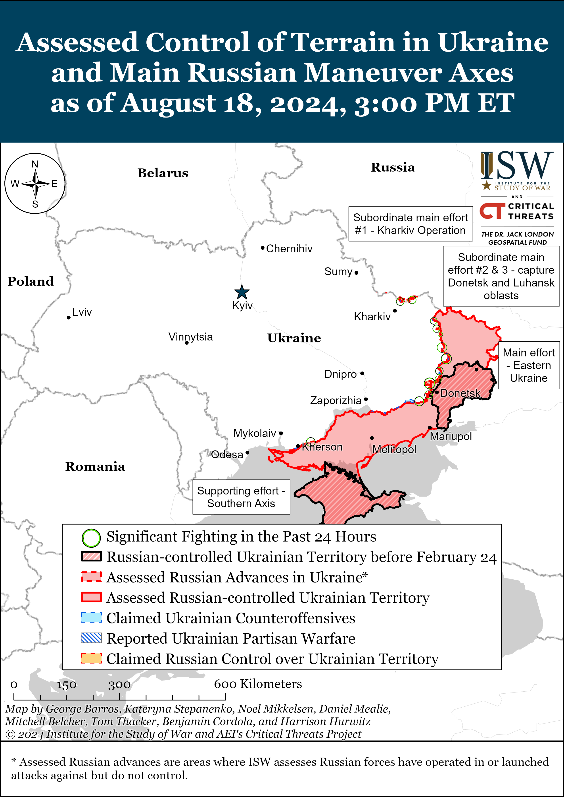](https://understandingwar.org/map/assessed-control-of-terrain-in-ukraine-and-main-russian-maneuver-axes-as-of-august-18-2024-300-pm-et/)**

***We do not report in detail on Russian war crimes because these activities are well-covered in Western media and do not directly affect the military operations we are assessing and forecasting. We will continue to evaluate and report on the effects of these criminal activities on the Ukrainian military and the Ukrainian population and specifically on combat in Ukrainian urban areas. We utterly condemn Russian violations of the laws of armed conflict and the Geneva Conventions and crimes against humanity even though we do not describe them in these reports.***

- Russian Main Effort – Eastern Ukraine (comprised of three subordinate main efforts)
- Russian Subordinate Main Effort #1 – Push Ukrainian forces back from the international border with Belgorod Oblast and approach to within tube artillery range of Kharkiv City
- Russian Subordinate Main Effort #2 – Capture the remainder of Luhansk Oblast and push westward into eastern Kharkiv Oblast and encircle northern Donetsk Oblast
- Russian Subordinate Main Effort #3 – Capture the entirety of Donetsk Oblast
- Russian Supporting Effort – Southern Axis
- Russian Air, Missile, and Drone Campaign
- Russian Mobilization and Force Generation Efforts
- Russian Technological Adaptations
- Activities in Russian-occupied areas
- Ukrainian Defense Industrial Base Efforts
- Russian Information Operations and Narratives
- Significant Activity in Belarus

**Russian Main Effort – Eastern Ukraine**

**Russian Subordinate Main Effort #1 – Kharkiv Oblast** **(Russian objective: Push Ukrainian forces back from the international border with Belgorod Oblast and approach to within tube artillery range of Kharkiv City)**

Russian forces continued ground attacks north of Kharkiv City near Lyptsi and Hlyboke and northeast of Kharkiv City near Vovchansk on August 18 but did not make any confirmed gains.[25] The Ukrainian Kharkiv Group of Forces reported that Russian assault groups are regrouping near Hlyboke and that the tempo of Russian attacks has decreased near Starytsya (southwest of Vovchansk) and that Russian forces are attempting to fortify positions in the area.[26] The Ukrainian Kharkiv Group of Forces also stated that elements of the Russian 4th Volunteer Reconnaissance and Assault Brigade and 1009th Motorized Rifle Regiment (6th Combined Arms Army [CAA], Leningrad Military District [LMD]) continue to operate near Vovchansk.[27]

[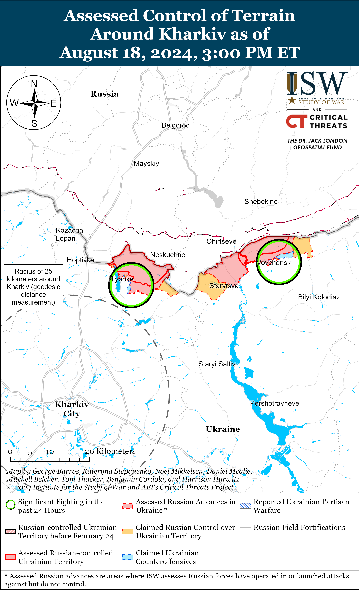](https://understandingwar.org/map/assessed-control-of-terrain-around-kharkiv-as-of-august-18-2024-300-pm-et/)

[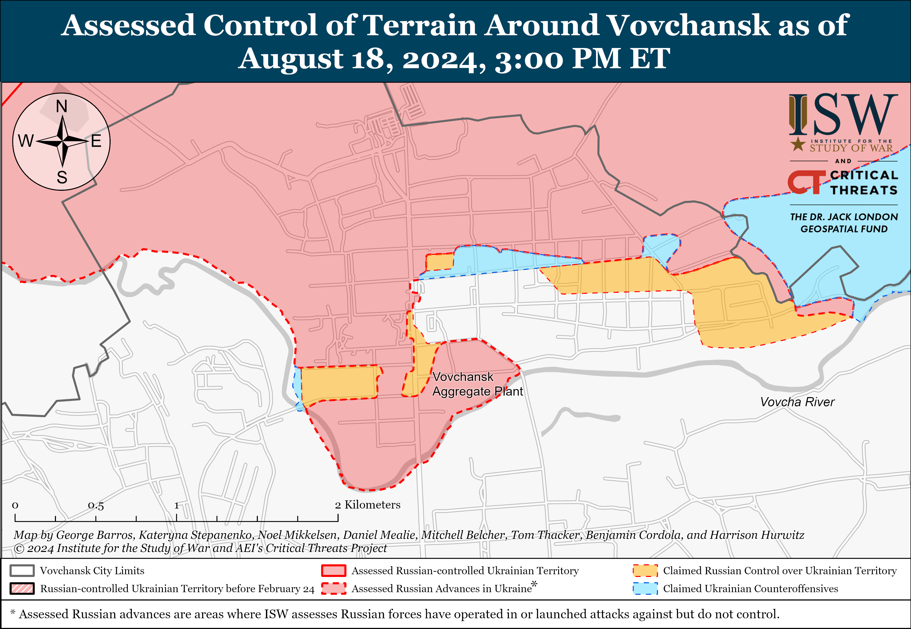](https://understandingwar.org/map/assessed-control-of-terrain-around-vovchansk-as-of-august-18-2024-300-pm-et/)

Ukrainian Kharkiv Group of Forces Spokesperson Colonel Vitaly Sarantsev reported on August 18 that Russian forces conducted 30 to 40 strikes per day in the Kharkiv direction a few weeks ago but have decreased the number of glide bomb strikes to roughly one to four strikes per day in the past several days.[28] Sarantsev stated that Russian forces may be conducting fewer glide bomb strikes to prioritize aviation operations in the Pokrovsk, Kursk, and Sumy directions or because of Ukrainian strikes against Russian rear areas. Data available from NASA FIRMS may partially corroborate Sarantsev’s statements.

[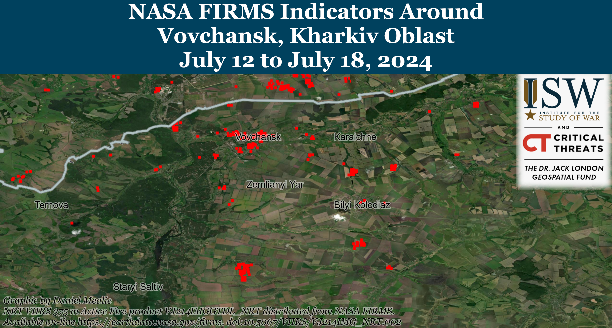](https://understandingwar.org/map/nasa-firms-indicators-around-vovchansk-kharkiv-oblast-july-12-to-july-18-2024/)

[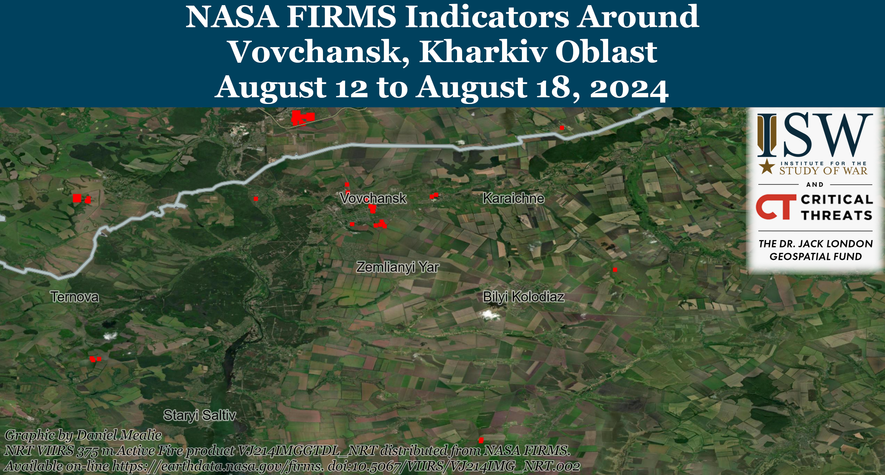](https://understandingwar.org/map/nasa-firms-indicators-around-vovchansk-kharkiv-oblast-august-12-to-august-18-2024/)

**Russian Subordinate Main Effort #2 – Luhansk Oblast** **(Russian objective: Capture the remainder of Luhansk Oblast and push westward into eastern Kharkiv Oblast and northern Donetsk Oblast)**

Russian forces recently advanced near Kreminna amid continued offensive operations along the Kupyansk-Svatove-Kreminna line on August 18. Geolocated footage published on August 17 indicates that Russian forces recently advanced to northern Makiivka (northwest of Kreminna).[29] Russian forces attacked southeast of Kupyansk near Hlushkivka, Berestove, and Stelmakhivka; northwest of Kreminna near Makiivka, Hrekivka, Nevske, Novosadove, and Novoyehorivka; west of Kreminna near Terny and Torske; and southwest of Kreminna near Dibrova on August 17 and 18.[30]  
[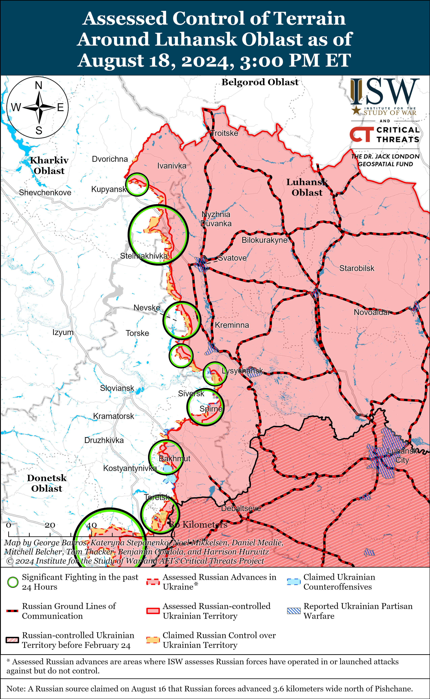](https://understandingwar.org/map/assessed-control-of-terrain-around-luhansk-oblast-as-of-august-18-2024-300-pm-et/)

**Russian Subordinate Main Effort #3 – Donetsk Oblast** **(Russian objective: Capture the entirety of Donetsk Oblast, the claimed territory of Russia’s proxies in Donbas)**

Ukrainian forces recently recaptured some positions in the Siversk direction amid continued fighting in the area on August 18. Geolocated footage published on August 17 indicates that Ukrainian forces have recently recaptured some positions on the eastern outskirts of Ivano-Darivka (southeast of Siversk), and additional recent Ukrainian advances near Ivano-Darivka suggest that Russian control of the settlement may be tenuous.[31] Russian forces continued ground attacks east of Siversk near Verkhnokamyanske, southeast of Siversk near Spirne and Vyimka, and south of Siversk near Pereizne on August 17 and 18.[32] Elements of the Russian 6th Motorized Rifle Brigade (2nd Luhansk People’s Republic Army Corps [LNR AC]) are reportedly operating near Verknokamyanske, and elements of the Russian 123rd Motorized Rifle Brigade (2nd LNR AC) are reportedly operating in the Siversk direction.[33]

Russian forces did not make confirmed advances amid continued offensive operations near Chasiv Yar. Russian forces continued offensive operations near Chasiv Yar, north of Chasiv Yar near Kalynivka and Hryhorivka, east of Chasiv Yar near Ivanivske, southeast of Chasiv Yar near Klishchiivka, and south of Chasiv Yar near Predtechyne on August 17 and 18.[34] Russian milbloggers claimed that Russian forces marginally advanced near Hryhorivka, Kalynivka, and Ivanivske, but ISW has not observed visual confirmation of these claims.[35]

[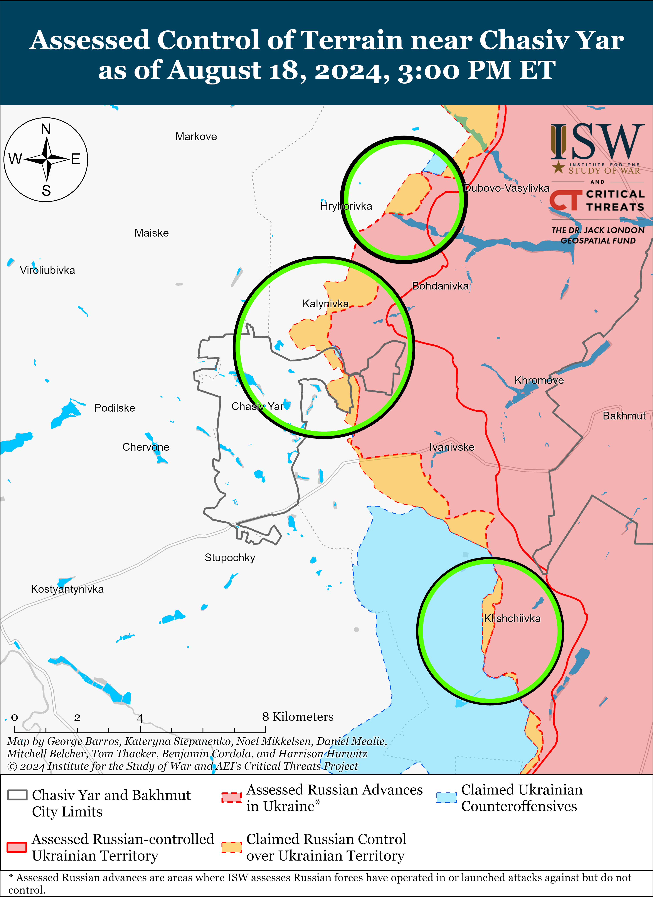](https://understandingwar.org/map/assessed-control-of-terrain-near-chasiv-yar-as-of-august-18-2024-300-pm-et/)

Russian forces reportedly advanced amid continued offensive operations in the Toretsk direction on August 18. Russian milbloggers claimed on August 18 that Russian forces control most of Niu York (south of Toretsk) and may have seized the settlement.[36] Russian milbloggers also claimed that Russian forces seized a waste heap west of Pivnichne (east of Toretsk), pushed Ukrainian forces from a pocket south of Zalizne (south of Toretsk), advanced within northwestern Zalizne and within eastern Toretsk, and entered the outskirts of Nelipivka from the east (south of Toretsk and southwest of Zalizne).[37] ISW has not observed confirmation of these claims, however. The Ukrainian General Staff reported that Russian forces attempted a reinforced company-sized mechanized assault with 12 armored vehicles near Pivnichne and Zalizne on the morning of August 18 and that Ukrainian forces repelled the attack, destroying 10 armored vehicles.[38] Russian forces have not conducted significant mechanized assaults in the area since launching their offensive effort on the Toretsk sector in mid-June, 2024. Russian forces also continued ground attacks near Toretsk and Dyliivka (north of Toretsk) on August 17 and 18.[39] Elements of the Russian 1st “Slovyansk” Motorized Rifle Brigade (1st Donetsk People’s Republic [DNR] AC) are reportedly fighting near Zalizne.[40]

[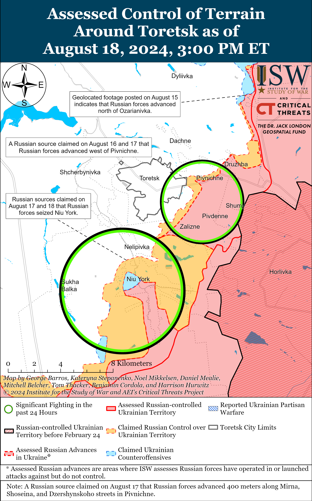](https://understandingwar.org/map/assessed-control-of-terrain-around-toretsk-as-of-august-18-2024-300-pm-et/)

Russian forces recently reportedly seized multiple settlements in the Pokrovsk direction. The Russian Ministry of Defense (MoD) claimed on August 18 that Russian forces seized Svyrydonivka (east of Pokrovsk), and Russian milbloggers claimed Russian forces seized Zavitne, Mezhove, and Skuchne (all southeast of Pokrovsk).[41] Russian milbloggers also claimed that Russian forces advanced north of Zhuravka, west of Mykolaivka, and east of Zhelanne (all southeast of Pokrovsk).[42] ISW has not observed visual confirmation of any of these claims, however. Russian forces also continued assaults east of Pokrovsk near Vozdvyzhenka, Kalynove, Zelene Pole, Myrolyubivka, Novotoretske, Novohrodivka, and Mykhailivka and southwest of Pokrovsk near Hrodivka, Mykolaivka, Ptyche, and Novohrodivka on August 17 and 18.[43] Elements of the 3rd Battalion of the Russian 228th Motorized Rifle Regiment (90th Tank Division, 41st Combined Arms Army [CAA], Central Military District [CMD]) are reportedly operating within Novozhelanne and Zavitne.[44]

[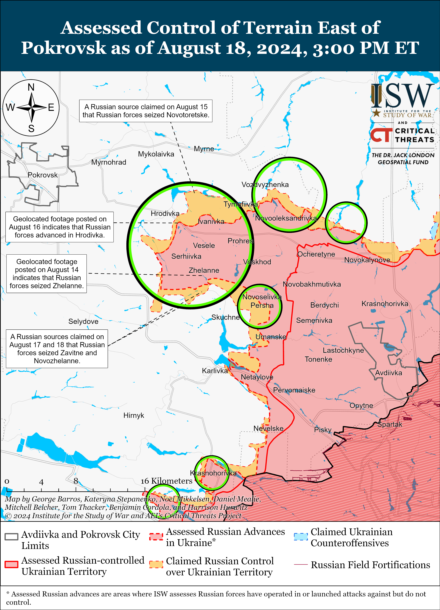](https://understandingwar.org/map/assessed-control-of-terrain-east-of-pokrovsk-as-of-august-18-2024-300-pm-et/)

Russian forces reportedly advanced southwest of Donetsk City on August 18, but there were no confirmed changes to the frontline in the area. Russian milbloggers claimed that Russian forces seized the ventilation shaft of the Pivdennodonbaska No. 1 Mine (east of Vuhledar) and advanced in an area up to 3.53 kilometers wide and 2.12 kilometers deep near the mine shaft.[45] A Russian milblogger claimed that Russian forces also advanced south of Kostyantynivka (southwest of Donetsk City).[46] ISW has not observed confirmation of these claims, however. Russian forces continued offensive operations west of Donetsk City near Krasnohorivka and southwest of Donetsk City near Paraskoviivka, Kostyantynivka, Vodyane, and Vuhledar on August 17 and 18.[47] Elements of the Russian 5th Motorized Rifle Brigade (1st DNR AC) are reportedly operating near Krasnohorivka.[48]

[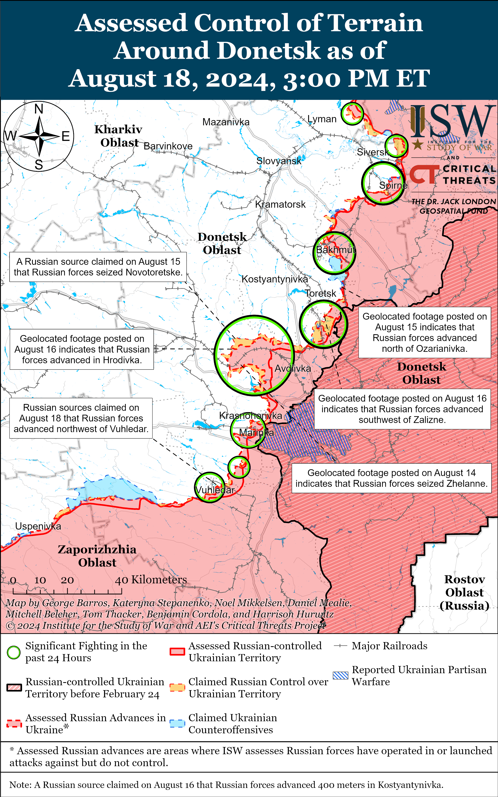](https://understandingwar.org/map/assessed-control-of-terrain-around-donetsk-as-of-august-18-2024-300-pm-et/)

The Ukrainian General Staff reported that Russian forces conducted offensive operations in the Donetsk-Zaporizhia Oblast border area near Rozdolne (northeast of Velyka Novosilka) on August 18.[49]

**Russian Supporting Effort – Southern Axis** **(Russian objective: Maintain frontline positions and secure rear areas against Ukrainian strikes)**

Russian and Ukrainian sources did not report any fighting in western Zaporizhia Oblast on August 18.

**[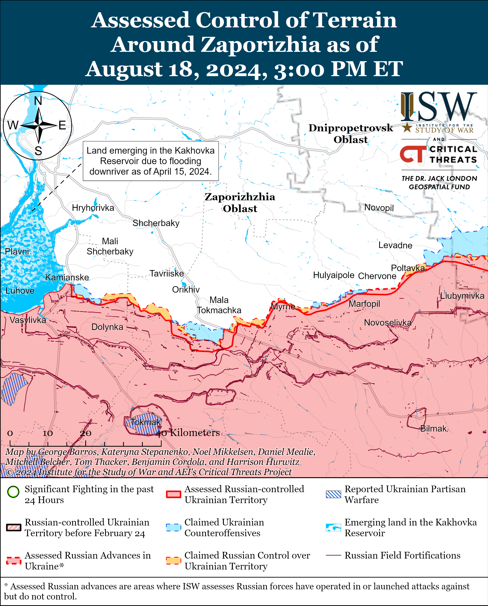](https://understandingwar.org/map/assessed-control-of-terrain-around-zaporizhia-as-of-august-18-2024-300-pm-et/)**

The Ukrainian General Staff reported that Russian forces conducted attacks in the Dnipro direction (east [left] bank Kherson Oblast and Dnipro River delta islands) on August 17 and 18.[50] Elements of the Russian 81st Self-Propelled Artillery Regiment (70th Motorized Rifle Division, 18th Combined Arms Army [CAA], Southern Military District [SMD]) are reportedly operating in the Kherson direction, and elements of the Russian 31st Guards Airborne (VDV) Brigade are reportedly operating in east bank Kherson Oblast.[51]

[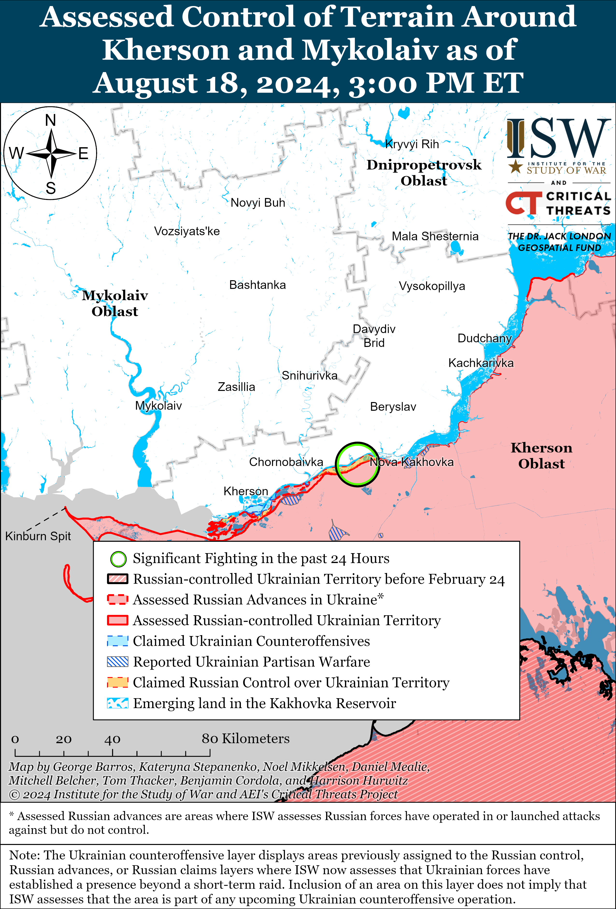](https://understandingwar.org/map/assessed-control-of-terrain-around-kherson-and-mykolaiv-as-of-august-18-2024-300-pm-et/)

**Russian Air, Missile, and Drone Campaign** **(Russian Objective: Target Ukrainian military and civilian infrastructure in the rear and on the frontline)**

Russian forces conducted a series of missile and drone strikes against Ukraine on the night of August 17 to 18. Ukrainian Air Force Commander Lieutenant General Mykola Oleshchuk reported that Russian forces launched one Iskander-M ballistic missile, two North Korean KN-23 ballistic missiles, two Kh-59 cruise missiles, three cruise missiles of an unspecified type from Kursk and Voronezh oblasts and eight Shahed-136/131 drones from Kursk Oblast.[52] Oleshchuk stated that Ukrainian forces shot down both of the KN-23 missiles, all three of the unspecified cruise missiles, and all eight drones. Ukraine’s Ministery of Energy stated on August 18 that a Russian drone strike caused a fire at an electrical substation in Dnipropetrovsk Oblast.[53] Kyiv Oblast Military Administration Head Ruslan Kravchenko stated that debris of unspecified downed missiles fell on homes in Kyiv Oblast.[54]

Ukrainian President Volodymyr Zelensky stated on August 18 that Russian forces launched more than 40 missiles, 750 glide bombs, and 200 drones against Ukraine in the past week.[55]

**Russian Mobilization and Force Generation Efforts** **(Russian objective: Expand combat power without conducting general mobilization)**

Nothing significant to report.

**Russian Technological Adaptations (Russian objective: Introduce technological innovations to optimize systems for use in Ukraine)**

A prominent Kremlin-affiliated Russian milblogger claimed that Russian forces are increasingly using drones to intercept Ukrainian first-person view (FPV) and hexacopter “Baba Yaga” drones, but noted that Russian forces must rely on more expensive commercially available Mavic drones to intercept cheaper Ukrainian drones.[56] The Russian milblogger pointed to ongoing Russian efforts to develop drone deployed anti-drone nets as a way to offset the cost disparity for using more expensive drones to intercept cheaper Ukrainian drones.[57  
  
 **Ukrainian Defense Industrial Efforts (Ukrainian objective: Develop its defense industrial base to become more self-sufficient in cooperation with US, European, and international partners)**

*ISW is suspending publishing coverage of Ukrainian defense industrial efforts until further notice.*

**Activities in Russian-occupied areas** **(Russian objective: Consolidate administrative control of annexed areas; forcibly integrate Ukrainian citizens into Russian sociocultural, economic, military, and governance systems)**

*ISW is not publishing coverage of activities in Russian-occupied areas today.*

**Russian Information Operations and Narratives**

Russian milbloggers claimed that Ukrainian forces are detaining male civilians in southern Goncharovka (west of Sudzha), but cited geolocated footage published on August 18 that appears to show Ukrainian forces detaining Russian military conscripts who reportedly changed into civilian clothing to avoid capture.[58]

Russian officials reiterated claims that Ukrainian forces are endangering Russian-controlled nuclear facilities to create the specter of a radiological incident in an effort to scare the West into withholding support for Ukraine. Rosatom Director General Alexei Likhachev claimed that Ukrainian forces may be preparing to conduct provocations at the Kursk and Russian-occupied Zaporizhzhia nuclear power plants (KNPP/ZNPP) in an August 17 phone call with International Atomic Energy Association (IAEA) Director General Rafael Grossi.[59] ISW has not observed Ukrainian forces operating near the Kursk NPP, and Russian forces have routinely endangered the ZNPP since their occupation of the ZNPP in March 2022.[60]

**Significant activity in Belarus** **(Russian efforts to increase its military presence in Belarus and further integrate Belarus into Russian-favorable frameworks and Wagner Group activity in Belarus)**

Belarusian President Alexander Lukashenko continues to claim that Belarus will strengthen its force concentrations along the border with Ukraine amid the Ukrainian incursion into Russia and following Belarusian accusations that Ukraine violated Belarusian airspace. Lukashenko stated that he plans for over 20 Belarusian battalion tactical groups to operate along the border with Ukraine by an unspecified date and claimed that Ukrainian provocations forced Belarus to transfer a third of its army to the southern border.[61] ISW has yet to observe this alleged significant Belarusian deployment to the border with Ukraine, however. Lukashenko reiterated rhetoric meant to support Kremlin information operations threatening escalation after Ukraine’s incursion into Kursk Oblast while attempting to posture Belarus as a sovereign state.[62] Russian and Belarusian officials have previously conducted information operations suggesting that Belarusian forces might escalate along the border with Ukraine in order to draw and fix Ukrainian forces to the Belarusian border, but Belarus will almost certainly not directly enter the war in Ukraine.[63]

**Note: ISW does not receive any classified material from any source, uses only publicly available information, and draws extensively on Russian, Ukrainian, and Western reporting and social media as well as commercially available satellite imagery and other geospatial data as the basis for these reports. References to all sources used are provided in the endnotes of each update.**

---

[1] https://t.me/AptiAlaudinovAKHMAT/5322; https://x.com/moklasen/status/1824923456976105533; https://t.me/creamy\_caprice/6431

[2] https://t.me/motopatriot/26288; https://t.me/motopatriot/26267

[3] https://t.me/mod\_russia/42304; https://t.me/DnevnikDesantnika/14165; https://t.me/motopatriot/26267; https://t.me/rusich\_army/16606; https://t.me/rusich\_army/16613; https://t.me/warriorofnorth/2155; https://t.me/RVvoenkor/75036 ; https://t.me/NeoficialniyBeZsonoV/38781; https://x.com/TuiteroMartin/status/1825181167685104051; https://x.com/TuiteroMartin/status/1825184146387276048; https://t.me/mod\_russia/42310

[4] https://t.me/control\_sigma/33460; https://x.com/EjShahid/status/1825117227831468075; https://x.com/EjShahid/status/1825117494731784214; https://x.com/bayraktar\_1love/status/1824801791159980077; https://x.com/EjShahid/status/1824892889286975679; https://x.com/MilitarySummary/status/1825047676368392392; https://x.com/franfran2424/status/1825107970868330868; https://t.me/labppsh/1295; https://t.me/GloOouDy/3789; https://x.com/EjShahid/status/1825203883125141612; https://x.com/EjShahid/status/1825204240551137367; https://x.com/MilitarySummary/status/1824436317662445763; https://t.me/warriorofnorth/2117; https://x.com/franfran2424/status/1825137128830865773; https://x.com/GeoConfirmed/status/1825099089584730247; https://x.com/PStyle0ne1/status/1824880375413485984; https://t.me/milinfolive/128697

[5] https://t.me/rybar/62868; https://t.me/RVvoenkor/75045

[6] https://t.me/WarArchive\_ua/18855; https://t.me/ComAFUA/388 ; https://t.me/ButusovPlus/12839; https://t.me/astrapress/62178

[7] https://t.me/rybar/62874; https://t.me/mash/56815; https://t.me/motopatriot/26273; https://t.me/milinfolive/128705; https://t.me/severrealii/26775; https://t.me/astrapress/62178; https://t.me/RVvoenkor/75045

[8] https://isw.pub/UkrWar081624

[9] https://www.wsj.com/world/behind-ukraines-russia-invasion-secrecy-speed-and-electronic-jamming-188fcc22?page=1

[10] https://isw.pub/UkrWar080824 ; https://www.wsj.com/world/behind-ukraines-russia-invasion-secrecy-speed-and-electronic-jamming-188fcc22?page=1 ; https://isw.pub/UkrWar080924

[11] https://understandingwar.org/backgrounder/russian-offensive-campaign-assessment-august-15-2024 ; https://understandingwar.org/backgrounder/russian-offensive-campaign-assessment-june-3-2024

[12] https://www.wsj.com/world/behind-ukraines-russia-invasion-secrecy-speed-and-electronic-jamming-188fcc22?page=1 ; https://isw.pub/UkrWar081124

[13] https://understandingwar.org/backgrounder/russian-offensive-campaign-assessment-july-31-2024 ; https://t.me/pomoch\_tigram/425

[14] https://understandingwar.org/backgrounder/russian-offensive-campaign-assessment-august-17-2024

[15] https://understandingwar.org/backgrounder/russian-offensive-campaign-assessment-august-17-2024

[16] https://understandingwar.org/backgrounder/russian-offensive-campaign-assessment-august-17-2024

[17] https://www.wsj.com/world/behind-ukraines-russia-invasion-secrecy-speed-and-electronic-jamming-188fcc22?page=1

[18] https://understandingwar.org/backgrounder/russian-offensive-campaign-assessment-august-17-2024

[19] https://www.facebook.com/GeneralStaff.ua/posts/pfbid0317XMkq8jiwPPfMJiJhwgetSrYa1i8BHTdh4z7CgdyxdD5epxvZ3GrSxSRWgrPnqBl

[20] https://x.com/neonhandrail/status/1825036396433711489; https://x.com/GirkinGirkin/status/1825011114385559964; https://x.com/neonhandrail/status/1825022095534797228; https://x.com/GirkinGirkin/status/1825006414076477829;

[21] https://t.me/tass\_agency/266926

[22] https://t.me/Hard\_Blog\_Line/9704 ; https://t.me/notes\_veterans/47

[23] https://t.me/MID\_Russia/44232 ; https://meduza dot io/news/2024/08/18/v-mid-rf-zayavili-chto-operatsiya-vsu-v-kurskoy-oblasti-ne-sorvala-podgotovku-k-peregovoram-moskvy-i-kieva-sryvat-bylo-nechego; https://www.washingtonpost.com/world/2024/08/17/kursk-ukraine-russia-energy-ceasefire/

[24] https://www.washingtonpost.com/world/2024/08/17/kursk-ukraine-russia-energy-ceasefire/

[25] https://www.facebook.com/GeneralStaff.ua/posts/pfbid08osKepB4g3JfvymBRr8nkvPZ7nNJfs2SH39dWqKZoLPbcD7qoSzmiuqdLSR7pHrXl https://www.facebook.com/GeneralStaff.ua/posts/pfbid0CyzDL8RQsGSZmq1EYb95PMx2SKQbppzvvyAmV6JVSXbXvpgLreU7Lzh2etk7UEPJl ; https://www.facebook.com/GeneralStaff.ua/posts/pfbid0SbgiPcujua8msND92R85TY43y52G6anZNnAZTLCL9aZLwWQeKTMXS3e55oC9oLmql ; https://t.me/Sladkov\_plus/11203; https://t.me/alehingennadiy ; https://t.me/wargonzo/21621

[26] https://t.me/otukharkiv/782

[27] https://t.me/otukharkiv/782

[28] https://armyinform dot com.ua/2024/08/18/promaczaty-ukrayinsku-oboronu-shho-namagayetsya-robyty-vorog-na-harkivskomu-napryamku-rozpovily-v-zsu/

[29] https://t.me/creamy\_caprice/6430; https://t.me/ZSU\_115OMBr/397; https://t.me/z\_arhiv/27673; https://t.me/rybar/62877

[30]https://www.facebook.com/GeneralStaff.ua/posts/pfbid08osKepB4g3JfvymBRr8nkvPZ7nNJfs2SH39dWqKZoLPbcD7qoSzmiuqdLSR7pHrXl; https://www.facebook.com/GeneralStaff.ua/posts/pfbid0CyzDL8RQsGSZmq1EYb95PMx2SKQbppzvvyAmV6JVSXbXvpgLreU7Lzh2etk7UEPJl; https://www.facebook.com/GeneralStaff.ua/posts/pfbid0SbgiPcujua8msND92R85TY43y52G6anZNnAZTLCL9aZLwWQeKTMXS3e55oC9oLmql

[31] https://x.com/Bielitzling/status/1825134943216804330; https://t.me/BattalionSIGIRIYA/66; https://understandingwar.org/backgrounder/russian-offensive-campaign-assessment-august-12-2024

[32] https://www.facebook.com/GeneralStaff.ua/posts/pfbid08osKepB4g3JfvymBRr8nkvPZ7nNJfs2SH39dWqKZoLPbcD7qoSzmiuqdLSR7pHrXl; https://www.facebook.com/GeneralStaff.ua/posts/pfbid0CyzDL8RQsGSZmq1EYb95PMx2SKQbppzvvyAmV6JVSXbXvpgLreU7Lzh2etk7UEPJl; https://www.facebook.com/GeneralStaff.ua/posts/pfbid0SbgiPcujua8msND92R85TY43y52G6anZNnAZTLCL9aZLwWQeKTMXS3e55oC9oLmql

[33] https://t.me/voin\_dv/10336; https://t.me/boris\_rozhin/134099

[34] https://www.facebook.com/GeneralStaff.ua/posts/pfbid08osKepB4g3JfvymBRr8nkvPZ7nNJfs2SH39dWqKZoLPbcD7qoSzmiuqdLSR7pHrXl; https://www.facebook.com/GeneralStaff.ua/posts/pfbid0CyzDL8RQsGSZmq1EYb95PMx2SKQbppzvvyAmV6JVSXbXvpgLreU7Lzh2etk7UEPJl: https://www.facebook.com/GeneralStaff.ua/posts/pfbid0SbgiPcujua8msND92R85TY43y52G6anZNnAZTLCL9aZLwWQeKTMXS3e55oC9oLmql

[35] https://t.me/DnevnikDesantnika/14171; https://t.me/motopatriot/26290

[36] https://t.me/milinfolive/128753; https://t.me/boris\_rozhin/134100

[37] https://t.me/milinfolive/128753; https://t.me/motopatriot/26305; https://t.me/boris\_rozhin/134084; https://t.me/z\_arhiv/27683; https://t.me/RVvoenkor/75066; https://t.me/z\_arhiv/27685

[38] https://www.facebook.com/GeneralStaff.ua/posts/pfbid02zpAFKqmfx4fB1JvqAZ8iBnfshryUHo5hY7EWFdNdJJbFkrR8BPkJyHFacUtQYhdMl

[39] https://www.facebook.com/GeneralStaff.ua/posts/pfbid08osKepB4g3JfvymBRr8nkvPZ7nNJfs2SH39dWqKZoLPbcD7qoSzmiuqdLSR7pHrXl; https://www.facebook.com/GeneralStaff.ua/posts/pfbid0CyzDL8RQsGSZmq1EYb95PMx2SKQbppzvvyAmV6JVSXbXvpgLreU7Lzh2etk7UEPJl; https://www.facebook.com/GeneralStaff.ua/posts/pfbid0SbgiPcujua8msND92R85TY43y52G6anZNnAZTLCL9aZLwWQeKTMXS3e55oC9oLmql

[40] https://t.me/z\_arhiv/27683

[41] https://t.me/mod\_russia/42302; https://t.me/RVvoenkor/75089; https://t.me/RVvoenkor/75046; https://t.me/z\_arhiv/27676; https://t.me/motopatriot/26266; https://t.me/z\_arhiv/27686

[42] https://t.me/z\_arhiv/27686; https://t.me/motopatriot/26283; https://t.me/z\_arhiv/27676; https://t.me/motopatriot/26266; https://t.me/RVvoenkor/75046

[43] https://www.facebook.com/GeneralStaff.ua/posts/pfbid0SbgiPcujua8msND92R85TY43y52G6anZNnAZTLCL9aZLwWQeKTMXS3e55oC9oLmql; https://www.facebook.com/GeneralStaff.ua/posts/pfbid08osKepB4g3JfvymBRr8nkvPZ7nNJfs2SH39dWqKZoLPbcD7qoSzmiuqdLSR7pHrXl; https://www.facebook.com/GeneralStaff.ua/posts/pfbid0CyzDL8RQsGSZmq1EYb95PMx2SKQbppzvvyAmV6JVSXbXvpgLreU7Lzh2etk7UEPJl

[44] https://t.me/rusich\_army/16610

[45] https://t.me/RVvoenkor/75062; https://t.me/z\_arhiv/27674 ; https://t.me/motopatriot/26269

[46] https://t.me/z\_arhiv/27674

[47] https://www.facebook.com/GeneralStaff.ua/posts/pfbid08osKepB4g3JfvymBRr8nkvPZ7nNJfs2SH39dWqKZoLPbcD7qoSzmiuqdLSR7pHrXl; https://www.facebook.com/GeneralStaff.ua/posts/pfbid0CyzDL8RQsGSZmq1EYb95PMx2SKQbppzvvyAmV6JVSXbXvpgLreU7Lzh2etk7UEPJl; https://www.facebook.com/GeneralStaff.ua/posts/pfbid0SbgiPcujua8msND92R85TY43y52G6anZNnAZTLCL9aZLwWQeKTMXS3e55oC9oLmql; https://t.me/wargonzo/21621

[48] https://t.me/Sladkov\_plus/11201

[49] https://www.facebook.com/GeneralStaff.ua/posts/pfbid08osKepB4g3JfvymBRr8nkvPZ7nNJfs2SH39dWqKZoLPbcD7qoSzmiuqdLSR7pHrXl

[50]https://www.facebook.com/GeneralStaff.ua/posts/pfbid08osKepB4g3JfvymBRr8nkvPZ7nNJfs2SH39dWqKZoLPbcD7qoSzmiuqdLSR7pHrXl; https://www.facebook.com/GeneralStaff.ua/posts/pfbid0CyzDL8RQsGSZmq1EYb95PMx2SKQbppzvvyAmV6JVSXbXvpgLreU7Lzh2etk7UEPJl; https://www.facebook.com/GeneralStaff.ua/posts/pfbid0SbgiPcujua8msND92R85TY43y52G6anZNnAZTLCL9aZLwWQeKTMXS3e55oC9oLmql; https://www.facebook.com/OperationalCommandSouth/posts/pfbid08Bq1thULUHYrfPeVc3idwbSyovqae6bYT16AKYxz5q3Bqqi1wS3PcdpgWVmYEd8El ; https://t.me/SJTF\_Odes/10998

[51] https://t.me/dva\_majors/50081; https://t.me/mod\_russia/42297; https://t.me/zvizdecmanhustu/1393

[52] https://t.me/ComAFUA/387

[53] https://t.me/astrapress/62191; https://t.me/energyofukraine/2757

[54] https://www.facebook.com/story.php?story\_fbid=430461760007654&id=100091315017222&mibextid=WC7FNe&rdid=QwDLhqEJIlG4rkf3; https://armyinform dot com.ua/2024/08/18/ryatuvalnyky-pokazaly-naslidky-padinnya-ulamkiv-rosijskyh-raket-na-kyyivshhyni/

[55] https://suspilne dot media/816013-za-tizden-rf-vipustila-po-ukraini-ponad-40-raket-750-kabiv-ta-200-droniv-zelenskij/; https://t.me/V\_Zelenskiy\_official/11383

[56] https://t.me/rybar/62866

[57] https://t.me/rybar/62866

[58] https://x.com/GeoConfirmed/status/1825099089584730247; https://x.com/PStyle0ne1/status/1824880375413485984 ; https://t.me/RVvoenkor/75039 ; https://t.me/milinfolive/128697 ; https://t.me/boris\_rozhin/134028 ; https://t.me/rybar/62871

[59] https://t.me/MID\_Russia/44228

[60] https://understandingwar.org/backgrounder/russian-offensive-campaign-assessment-june-23-2024

[61] https://president.gov dot by/ru/events/interv-u-telekanalu-rossia; https://t.me/severrealii/26776; https://t.me/astrapress/62190; https://t.me/bbcrussian/69217

[62] https://president.gov dot by/ru/events/interv-u-telekanalu-rossia; https://t.me/severrealii/26776; https://t.me/astrapress/62190; https://t.me/bbcrussian/69217

[63] https://understandingwar.org/backgrounder/russian-offensive-campaign-assessment-december-11
