# Russian Offensive Campaign Assessment, August 19, 2024

**Christina Harward, Nicole Wolkov, Grace Mappes, Davit Gasparyan, Karolina Hird, and George Barros**

**August 19, 2024, 7pm ET**

**Click**[**here**](https://storymaps.arcgis.com/stories/36a7f6a6f5a9448496de641cf64bd375)**to see ISW’s interactive map of the Russian invasion of Ukraine. This map is updated daily alongside the static maps present in this report.**

**Click**[**here**](https://understandingwar.maps.arcgis.com/apps/instant/3dviewer/index.html?appid=1602762dbcde419bb957dea358449580)**to see ISW’s 3D control of terrain topographic map of Ukraine. Use of a computer (not a mobile device) is strongly recommended for using this data-heavy tool.**

**Click**[**here**](https://storymaps.arcgis.com/stories/733fe90805894bfc8562d90b106aa895)**to access ISW’s archive of interactive time-lapse maps of the Russian invasion of Ukraine. These maps complement the static control-of-terrain map that ISW produces daily by showing a dynamic frontline. ISW will update this time-lapse map archive monthly.**

**Note: The data cut-off for this product was 12:45pm ET on August 18. ISW will cover subsequent reports in the August 20 Russian Offensive Campaign Assessment.**

**Ukrainian forces continued to marginally advance in Kursk Oblast on August 19 amid continued fighting throughout the Ukrainian salient in the area.** Geolocated footage published on August 19 indicates that Ukrainian forces advanced in Vishnevka (southwest of Koronevo and 14km from the international border).[1] The Russian Ministry of Defense (MoD) claimed that Russian aviation and artillery struck Ukrainian forces operating near Vishnevka, potentially tacitly acknowledging that Ukrainian forces advanced in the area.[2] A prominent Kremlin-affiliated Russian milblogger claimed that Ukrainian forces also advanced within Russkoye Porechnoye (northeast of Sudzha and 17km from the international border), east of Agronom (just east of Sudzha and 15km from the international border), and east of Spalnoye (southeast of Sudzha and 5km from the international border).[3] The Russian MoD claimed that Russian forces repelled Ukrainian sabotage and reconnaissance attempts south of Skrylevka and Sheptukhova (both northeast of Korenevo and 22km from the international border), and other Russian sources claimed that fighting continued near Korenevo, Olgovka (just east of Korenevo), western Sudzha, and Martynovka (just northeast of Sudzha).[4] Russian milbloggers also claimed that clashes continued along the international border near Tetkino.[5] Elements of the Russian 810th Naval Infantry Brigade (Black Sea Fleet [BSF]) are reportedly operating near Olgovka; elements of the “Aida” Chechen Akhmat Spetsnaz group are reportedly operating in Sudzha; and the “Varangian” Reconnaissance-Strike Company of the 155th Naval Infantry Brigade (Pacific Fleet, Eastern Military District [EMD]) is reportedly operating in Kursk Oblast.[6] Elements of the Russian “Feniks” Mining Battalion, which were reportedly operating in the Chasiv Yar area as of late May 2024, are reportedly operating near Martynovka.[7]

Russian milbloggers claimed that Ukrainian forces conducted an airstrike that destroyed a bridge over the Seim River in Karyzh (southwest of Korenevo) — the third and last bridge over the Seim River in Glushkovo Raion, Kursk Oblast.[8] ISW has not yet observed evidence of a strike against a bridge near Karyzh, however. Geolocated footage published on August 16 and 18 showed Ukrainian strikes respectively destroying a bridge across the Seim River in Glushkovo and damaging a bridge across the Seim River in Zvannoye (southwest of Korenevo).[9]

[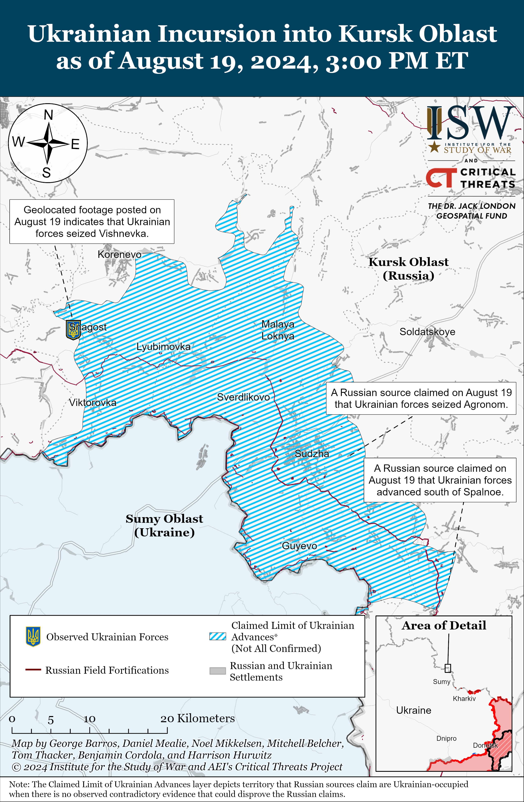](https://understandingwar.org/map/ukrainian-incursion-into-kursk-oblast-as-of-august-19-2024-300-pm-et/)

**Chechen Akhmat Spetsnaz Commander Apty Alaudinov aggravated a situation that the Kremlin has historically treated with extreme caution by calling for conscripts to participate in combat operations in Kursk Oblast and dismissing concerns from relatives of conscripts.**Alaudinov responded in a video message on August 19 to the “sobs and outbursts” about Russian conscripts fighting in Kursk Oblast, complaining that parents of conscripts are treating 18-year-olds as children.[10] Alaudinov claimed that Russian conscripts are employees of the Russian Ministry of Defense (MoD) and must defend Russia. Alaudinov complained that conscripts are just “eat[ing] the state’s bread for free … and then go home.” Alaudinov responded to complaints that conscripts are paid little, calling on conscripts to sign a contract with the MoD if they want to receive higher salaries. Alaudinov called for all Russians young and old to “stand in formation” since “the enemy has come to [Russia], stating that “no one will die who is not destined to die, but if you die defending [Russia] and your faith in God, you will go to heaven.” A Telegram channel associated with the Akhmat “Aida” group also claimed on August 19 that the conscripts they have encountered in Sudzha, Kursk Oblast are not 18-year-olds, but 21-to-25-year-olds.[11] The “Aida”-affiliated channel suggested that the fact that Ukrainian forces are on Russian territory is more important than any discussions about casualties among Russian conscripts.

Family members of Russian conscripts have recently complained about the involvement of Russian conscripts in Russian border-defense operations.[12] The Kremlin has shown great concern about societal backlash regarding issues concerning conscripts, and Russian President Vladimir Putin has previously taken action to appease the complaints of conscripts’ relatives. The continued presence of Russian conscripts in the border areas during the Ukrainian incursion threatens the Kremlin with a potential political crisis regarding casualties among Russian conscripts. Alaudinov has postured himself as a spokesperson for the Russian defense in Kursk Oblast, and Russian newswire*TASS*has repeatedly amplified his statements following the Ukrainian incursion.[13] Blatant calls from Alaudinov — a widely promoted Russian authority — for conscripts’ relatives to stop complaining, for conscripts to participate in combat operations in Russia’s border area, and for Russian citizens to embrace casualties among conscripts and other servicemembers may exacerbate tensions in Russian society and potentially threaten the stability of Putin’s regime. Chechen Republic Head Ramzan Kadyrov has notably made only limited public statements about the Ukrainian incursion in Kursk Oblast, despite Alaudinov’s and Akhmat Spetsnaz’s pronounced roles in the Russian response.[14]

**Russian President Vladimir Putin visited Azerbaijan on August 18, likely in an effort to shift focus away from the Ukrainian incursion into Kursk Oblast and present himself as a continually effective diplomat.**Putin arrived in Baku on August 18 with a Russian delegation, including Foreign Minister Sergei Lavrov, for a two-day visit to meet Azerbaijani President Ilham Aliyev to discuss Russian–Azerbaijani bilateral relations.[15] The delegations reportedly discussed bilateral energy ties, Russian-language initiatives in Azerbaijan, and Russia’s willingness to mediate a peace deal between Armenia and Azerbaijan.[16] The timing of this visit is noteworthy given the ongoing situation in Kursk Oblast and the Kremlin’s continued efforts to downplay the Ukrainian incursion’s magnitude and impact. Russian state media focused on Putin’s trip to Azerbaijan, amplifying minute details, likely in part to divert attention from the uncomfortable situation in Russia by saturating the information space with a showcase of the Kremlin’s global diplomatic engagement and alleged successes.

**The Kremlin’s response to Ukraine’s incursion into Kursk Oblast has emphasized how the Kremlin’s internal priorities have increasingly oriented towards regime stability, especially over the past year.**Russian opposition outlet *Vazhnye Istorii*reported on August 19 that Russian President Vladimir Putin’s reaction to the “Kursk situation” has exposed certain shifts within the Kremlin’s power vertical, many of which have been underway over the last several months.[17] Putin appointed Presidential Aide Alexei Dyumin to supervise the ongoing “counterterrorism” operation against Ukrainian activities in Kursk Oblast, which *Vazhnye Istorii* noted means that Putin distrusts the Russian General Staff and the Russian Ministry of Defense (which would be the bodies theoretically in charge of defensive military activities) and relies on individuals that he personally trusts. An insider source reportedly told *Vazhnye Istorii*that Dyumin is now in conflict with representatives of the Russian Presidential Administration, further suggesting that Putin continues to align himself with those who have his personal favor at the expense of officials better technically suited for certain positions. *Vazhnye Istorii* also cited sources familiar with the Russian security services as claiming that Federal Security Service (FSB) Head Alexander Bortnikov will “leave his post this year” and theorizing that his potential replacement may be Vladislav Menshchikov, head of the FSB’scounterintelligence service, or Sergei Korolev, Bortnikov’s first deputy. Russian investigative journalist Andrei Soldatov noted that the FSB has generally shifted its mandate away from controlling Russian oligarchs and towards controlling Russia’s military and Russia’s military-industrial complex as well as countering “saboteurs and terrorists,” and *Vazhnye Istorii* reported that several long-time Russian economic oligarchs are also gradually losing their influence within the Kremlin’s wider power vertical.[18]

*Vazhnye Istorii’*s reporting strongly suggests that the Kremlin has increasingly oriented its main priorities towards regime stability. ISW has reported at length on Putin’s efforts to maintain a core cadre of loyal *siloviki* (Russian strongmen with political influence) within the Russian power vertical, particularly since the risks to Putin’s regime first introduced by the Wagner Group’s armed rebellion in June 2023.[19] The Kremlin’s general shift towards *siloviki*such as Dyumin, whom Putin personally trusts, and security officials with strong and well-documented reputations in counterterrorism and counterintelligence, suggests that the Kremlin is increasingly looking towards such individuals as regime safeguards. Ukraine’s operation into Kursk Oblast has particularly exposed this dynamic, and the Kremlin’s continued response to the incursion further emphasizes the ever-increasing reliance on security officials and structures over more politically or economically focused internal structures.

**Russian President Vladimir Putin signed a decree on August 19 further codifying a vague Russian state ideology into Russian law without concretely modifying the Russian Constitution.**Putin’s decree allows foreigners and stateless persons “who share traditional Russian spiritual and moral values”; have expressed interest in moving to Russia permanently; and disagree with their home state’s policies “that impose destructive neoliberal, ideological guidelines” to apply for a temporary Russian residence permit without meeting the Russian language, legal, and cultural knowledge requirements.[20] Putin instructed the Russian Ministry of Foreign Affairs (MFA) to create a list of countries allegedly “imposing [these] neoliberal values.”[21] The Kremlin has recently intensified efforts to codify a state ideology based on vague Russian “traditional values” while bypassing the Russian Constitution, which notably forbids Russia from establishing a state ideology and requires the Russian state to recognize ideological diversity.[22] This new policy favoring increased migration of certain “traditionally and ideologically aligned” individuals to Russia is contrary to recent Russian state efforts to crack down against illegal migration into Russia and coerce migrants into military service, both of which likely undermine any Russian efforts to attract more migrants to settle in Russia.[23]

**Putin’s effort to codify a specific ideology may be intended to counter the Russian ultranationalist community’s own efforts to establish an accepted national ideology.**Russian ultranationalist voices have largely criticized Russian migration policy for being too lenient and have fervently called for Russian authorities to tighten immigration requirements, especially for migrants to learn the Russian language, culture, and law to better integrate into Russian society — requirements that Putin’s decree allows select migrants to bypass.[24] Many ultranationalist voices have also been hypercritical of the Kremlin and Russian defense officials for perceived wartime and ideological failures, and some even directly opposed Putin either politically, as was the case with imprisoned ardent nationalist Igor Girkin, or militarily, like deceased Wagner Group financier Yevgeny Prigozhin.[25] The Kremlin has been cracking down on these milbloggers by creating a cadre of milbloggers loyal to the Kremlin, creating an environment of self-censorship, and directly censoring certain commentators as necessary.[26] Putin’s effort to establish himself as the sole arbiter of the accepted Russian national ideology may aim to counter Russian milbloggers who disagree with him and eliminate possible domestic threats to his regime, especially as the Kremlin has sought to portray Russians who oppose the war in Ukraine and Putin himself as “extremist,” unpatriotic, and enemies of the state.[27]

**Russian officials continued attempts to falsely frame Ukraine as responsible for the lack of negotiations to end the war.**Russian Presidential Aide Yuri Ushakov responded to a question about possible negotiations with Ukraine on August 19, claiming that Russia will not talk to Ukraine given Ukraine’s “adventure” with its incursion into Russia.[28] Ushakov claimed that Russian President Vladimir Putin’s proposals — which called for Ukraine to surrender territory that Russian forces currently do not occupy — still stand but that it would be “inappropriate” for negotiations to take place at the moment.[29] Russian Foreign Minister Sergei Lavrov reiterated on August 19 Putin’s statement from August 12 that there can be no talk of negotiations after the Ukrainian incursion and claimed that Putin said that Russia “will certainly give an assessment of this situation a little later.”[30] Lavrov also dismissed a recent *Washington Post* article about Russia’s temporary postponement of discussions with Ukraine in Qatar about a moratorium on strikes against energy infrastructure as “rumors.”[31] ISW continues to assess that Russia is and has been uninterested in meaningful negotiations with Ukraine and that the Kremlin has attempted to portray Ukraine — and not Russia — as preventing negotiations.[32]

**Key Takeaways:**

- **Ukrainian forces continued to marginally advance in Kursk Oblast on August 19 amid continued fighting throughout the Ukrainian salient in the area.**
- **Chechen Akhmat Spetsnaz Commander Apty Alaudinov aggravated a situation that the Kremlin has historically treated with extreme caution by calling for conscripts to participate in combat operations in Kursk Oblast and dismissing concerns from relatives of conscripts.**
- **Russian President Vladimir Putin visited Azerbaijan on August 18, likely in an effort to shift focus away from the Ukrainian incursion into Kursk Oblast and present himself as a continually effective diplomat.**
- **The Kremlin’s response to Ukraine’s incursion into Kursk Oblast has emphasized how the Kremlin’s internal priorities have increasingly oriented towards regime stability, especially over the past year.**
- **Russian President Vladimir Putin signed a decree on August 19 further codifying a vague Russian state ideology into Russian law without concretely modifying the Russian Constitution. Putin’s effort to codify a specific ideology may be intended to counter the Russian ultranationalist community’s own efforts to establish an accepted national ideology.**
- **Russian officials continued attempts to falsely frame Ukraine as responsible for the lack of negotiations to end the war.**
- **Russian forces recently advanced near Kupyansk, Svatove, Pokrovsk, and Vuhledar.**
- **Local Sakhalin Oblast media outlet *Sakhalin Media* reported on August 19 that the Russian Federal Security Service (FSB) Border Service in Sakhalin Oblast and other federal subjects within the Russian Far East, Northwestern, and North Caucasian federal okrugs has resumed conscription for the first time in an unspecified “long” length of time.**

[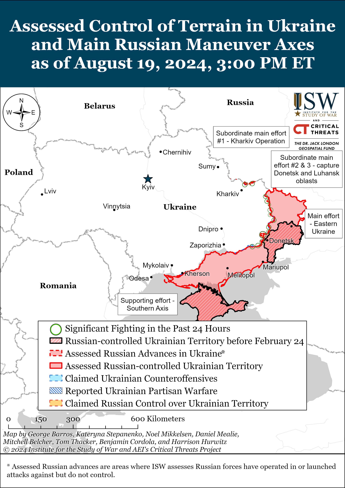](https://understandingwar.org/map/assessed-control-of-terrain-in-ukraine-and-main-russian-maneuver-axes-as-of-august-19-2024-300-pm-et/)

***We do not report in detail on Russian war crimes because these activities are well-covered in Western media and do not directly affect the military operations we are assessing and forecasting. We will continue to evaluate and report on the effects of these criminal activities on the Ukrainian military and the Ukrainian population and specifically on combat in Ukrainian urban areas. We utterly condemn Russian violations of the laws of armed conflict and the Geneva Conventions and crimes against humanity even though we do not describe them in these reports.***

- Russian Main Effort — Eastern Ukraine (comprised of three subordinate main efforts)
- Russian Subordinate Main Effort #1 — Push Ukrainian forces back from the international border with Belgorod Oblast and approach to within tube artillery range of Kharkiv City
- Russian Subordinate Main Effort #2 — Capture the remainder of Luhansk Oblast and push westward into eastern Kharkiv Oblast and encircle northern Donetsk Oblast
- Russian Subordinate Main Effort #3 — Capture the entirety of Donetsk Oblast
- Russian Supporting Effort — Southern Axis
- Russian Air, Missile, and Drone Campaign
- Russian Mobilization and Force Generation Efforts
- Russian Technological Adaptations
- Activities in Russian-occupied areas
- Ukrainian Defense Industrial Base Efforts
- Russian Information Operations and Narratives
- Significant Activity in Belarus

**Russian Main Effort — Eastern Ukraine**

**Russian Subordinate Main Effort #1 — Kharkiv Oblast (Russian objective: Push Ukrainian forces back from the international border with Belgorod Oblast and approach to within tube artillery range of Kharkiv City)**

Russian forces reportedly advanced north of Kharkiv City. A Russian milblogger claimed on August 18 that Russian forces advanced south of Hlyboke (north of Kharkiv City), but ISW has not observed confirmation of this claim.[33] Russian forces continued offensive operations north of Kharkiv City near Lyptsi and Hlyboke and northeast of Kharkiv City near Vovchansk on August 18 and 19.[34] Ukraine’s Kharkiv Group of Forces reported on August 19 that Russian forces continue to regroup and rotate personnel north and northeast of Kharkiv City.[35] A Ukrainian special forces battalion commander stated in an interview on August 19 that former Wagner Group elements and unspecified Russian naval infantry elements previously deployed in Donetsk Oblast were previously operating near Hlyboke.[36] ISW has observed elements of the Russian 155th Naval Infantry Brigade fighting in northern Kharkiv Oblast prior to the redeployment of elements of the brigade and the reported redeployment of elements of the 810th Naval Infantry Brigade to support Russian defensive operations in Kursk Oblast.[37]

[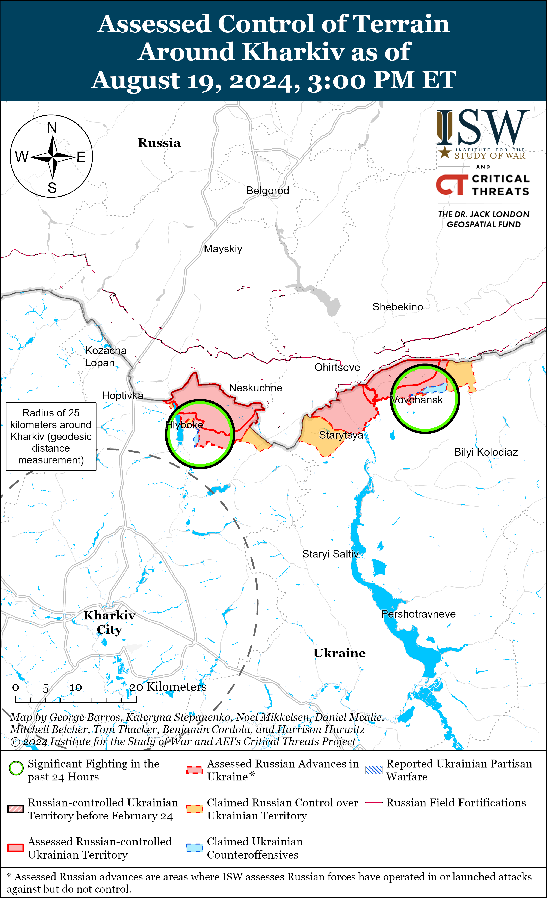](https://understandingwar.org/map/assessed-control-of-terrain-around-kharkiv-as-of-august-19-2024-300-pm-et/)

[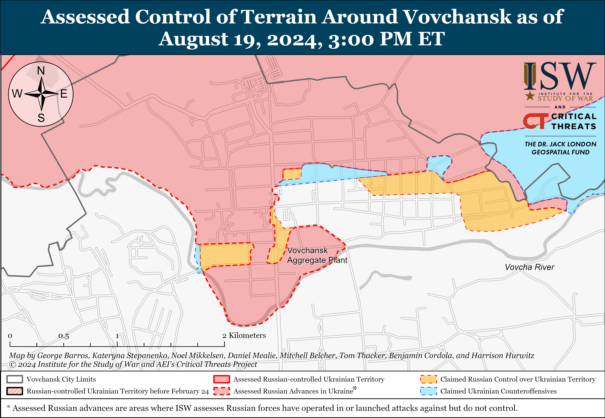](https://understandingwar.org/map/assessed-control-of-terrain-around-vovchansk-as-of-august-19-2024-300-pm-et/)

**Russian Subordinate Main Effort #2 — Luhansk Oblast (Russian objective: Capture the remainder of Luhansk Oblast and push westward into eastern Kharkiv Oblast and northern Donetsk Oblast)**

Russian forces recently advanced near Kupyansk and Svatove amid continued Russian offensive operations along the Kupyansk-Svatove-Kreminna line on August 19. Geolocated footage published on August 18 and 19 indicates that Russian forces recently advanced southwest of Novoselivske (southeast of Kupyansk) and southwest of Andriivka (west of Svatove).[38] Russian milbloggers claimed that Russian forces also advanced near Tabaivka, Pishchane (both southeast of Kupyansk), and Makiivka (northwest of Kreminna), but ISW has not observed confirmation of these claims.[39] The Ukrainian General Staff reported that Russian forces conducted offensive operations southeast of Kupyansk near Hlushkivka, Stelmakhivka, and Kruhlyakivka; northwest of Kreminna near Makiivka, Ploshchanka, Nevske, Novosadove, and Hrekivka; and southwest of Kreminna near Torske and Terny on August 18 and 19.[40]

[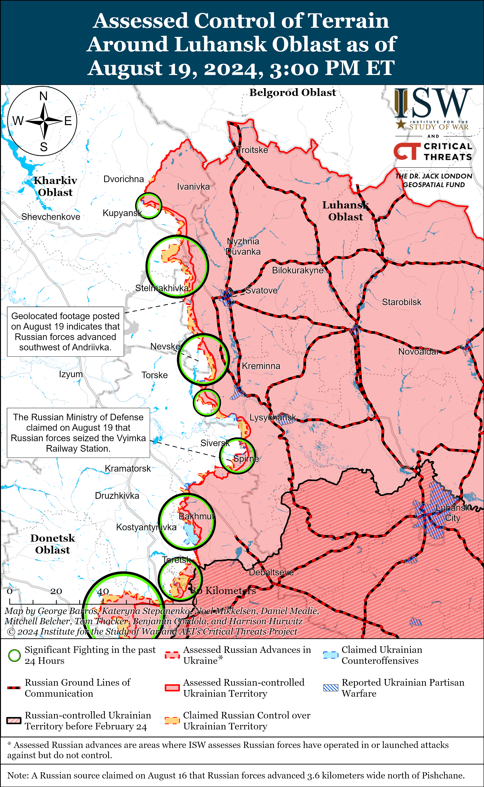](https://understandingwar.org/map/assessed-control-of-terrain-around-luhansk-oblast-as-of-august-19-2024-300-pm-et/)

**Russian Subordinate Main Effort #3 — Donetsk Oblast (Russian objective: Capture the entirety of Donetsk Oblast, the claimed territory of Russia’s proxies in Donbas)**

Russian forces reportedly advanced southeast of Siversk amid limited offensive operations in the area on August 19. The Russian Ministry of Defense (MoD) claimed on August 19 that Russian forces seized the Vyimka Railway Station, just southeast of Vyimka (southeast of Siversk).[41] A Russian milblogger claimed that Russian forces also advanced east of the railway station (also southeast of Vyimka), although ISW has not observed visual evidence of recent Russian advances in these areas.[42] The Ukrainian General Staff reported that Russian forces attacked east of Siversk near Verkhnokamyanske and southeast of Siversk near Sprine and Ivano-Darivka.[43] Elements of the “Khokhla” Chechen Akhmat Spetsnaz group are reportedly operating near Bilohorivka (northeast of Siversk).[44]

[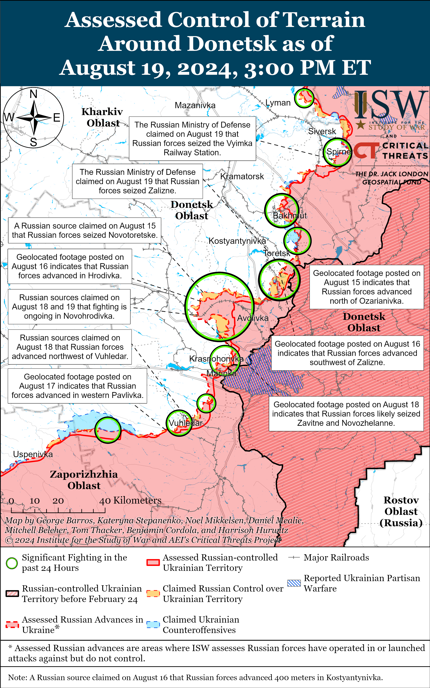](https://understandingwar.org/map/assessed-control-of-terrain-around-donetsk-as-of-august-19-2024-300-pm-et/)

Russian forces reportedly advanced within Chasiv Yar on August 19, although there were no confirmed changes to the frontline. A Russian milblogger claimed that Russian forces seized and cleared a Ukrainian fortification east of the Zhovtnevyi Miroraion in eastern Chasiv Yar, although ISW has not yet observed visual evidence of this claim.[45] The Ukrainian General Staff reported that fighting continued northeast of Chasiv Yar near Hryhorivka and Kalynivka; east of Chasiv Yar near Ivanivske; southeast of Chasiv Yar near Andriivka and Klishchiivka; and south of Chasiv Yar near Predtechnye and Stupochky.[46] Elements of the Russian 98th Airborne (VDV) Division are reportedly operating near the Siverskyi-Donets Donbas Canal in eastern Chasiv Yar.[47]

[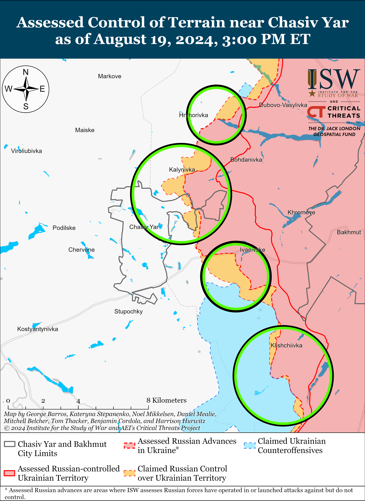](https://understandingwar.org/map/assessed-control-of-terrain-near-chasiv-yar-as-of-august-19-2024-300-pm-et/)

Russian forces reportedly continued to advance in the Toretsk direction on August 19. The Russian Ministry of Defense (MoD) claimed on August 19 that elements of the Russian Central Grouping of Forces seized Zalizne (southeast of Toretsk), and a prominent milblogger claimed that Russian forces also advanced through the electrical substation west of Zalizne and are moving towards Nelipivka (southwest of Zalizne and south of Toretsk).[48] Several Russian milbloggers additionally claimed that Russian forces seized all of Niu York (south of Toretsk) and are clearing positions in the northern part of the settlement in order to attack northwards towards Nelipivka, supporting efforts to move towards Nelipivka from western Zalizne.[49] Some Russian milbloggers also claimed that Russian forces have advanced into southern Nelipivka and are consolidating new positions in the settlement.[50] ISW has not yet observed visual confirmation of any of these Russian claims, however, and still does not have visual evidence confirming that Russian forces control all of Niu-York. The Ukrainian General Staff stated that Russian forces attacked near Nelipivka, which may suggest that Russian forces have advanced closer to Nelipivka either via Niu York or Zalizne.[51] The Ukrainian General Staff also reported fighting near Toretsk itself, as well as near Niu York, Zalizne, and Nelipivka.[52]

[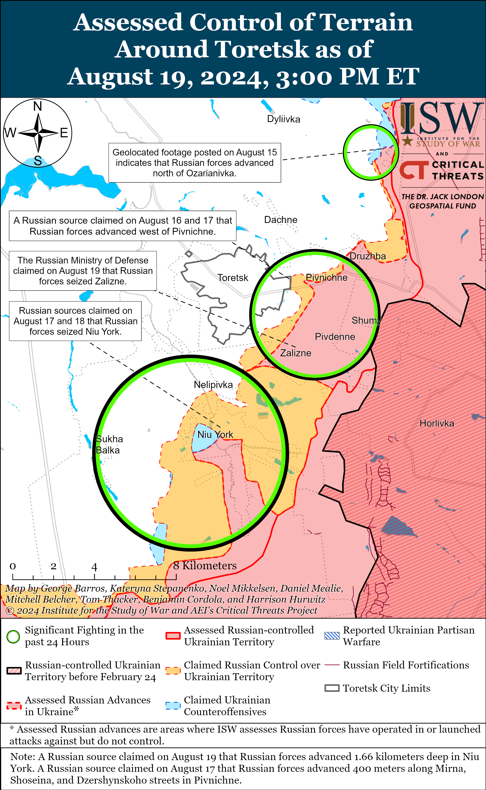](https://understandingwar.org/map/assessed-control-of-terrain-around-toretsk-as-of-august-19-2024-300-pm-et/)

Russian forces recently advanced southeast of Pokrovsk and continued offensive operations towards Pokrovsk on August 19. Geolocated footage published on August 18 showing a Russian flag in southern Zavitne (southeast of Pokrovsk) indicates that Russian forces recently seized Zavitne and Novozhelanne (just north of Zavitne).[53] Russian milbloggers reported that Russian forces are advancing towards Komyshivka and Ptychne (southeast of Pokrovsk and just southeast of the Novozhelanne-Komyshivka area) and that Ukrainian forces are withdrawing from these settlements to avoid tactical encirclement.[54] Some Russian milbloggers also claimed that Russian forces have reached the outskirts of Hrodivka and Novohrodivka (east and southeast of Pokrovsk, respectively), but ISW has not observed visual confirmation of Russian troops in either of these settlements.[55] The Ukrainian General Staff reported that Russian forces attacked northeast of Pokrovsk near Vozdvyzhenka, Zelene Pole, Kalynove, and Myrolyubivka and southeast of Pokrovsk near Mykolaivka, Ptychne, Novohrodivka, Zavitne, and Skuchne.[56]

[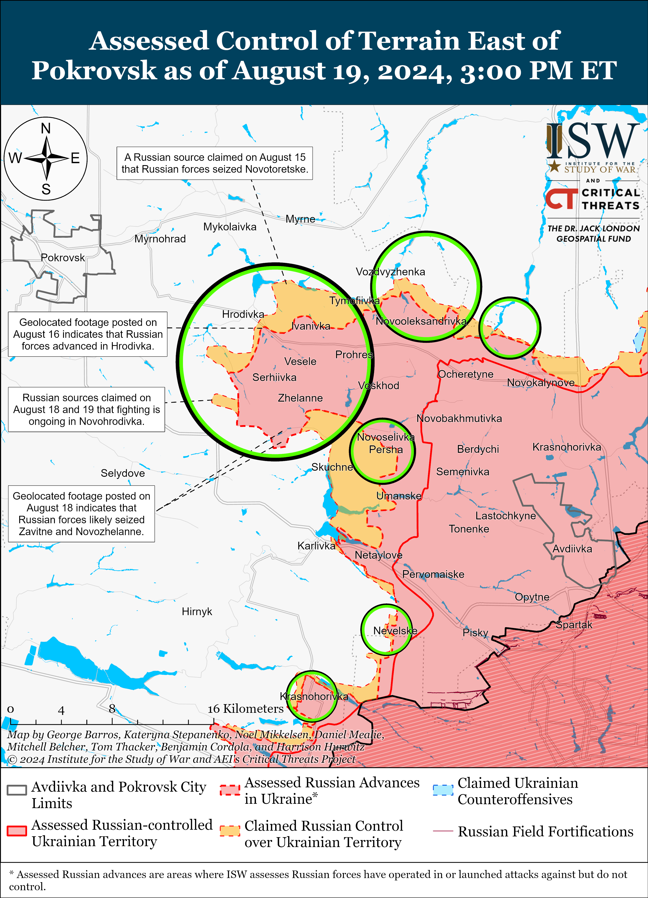](https://understandingwar.org/map/assessed-control-of-terrain-east-of-pokrovsk-as-of-august-19-2024-300-pm-et/)

Russian forces continued offensive operations west of Donetsk City on August 19 but did not make any confirmed advances. Russian forces continued attacking near Krasnohorivka and Heorhiivka on August 18 and 19.[57] Drone operators of the Russian “Kaira” Detachment (39th Motorized Rifle Brigade, 68th Army Corps [AC], Eastern Military District [EMD]) reportedly continue operating near Krasnohorivka; elements of the 238th Artillery Brigade (8th Combined Arms Army [CAA], Southern Military District [SMD]) reportedly continue operating near Heorhiivka; and elements of the 150th Motorized Rifle Division (8th CAA, SMD) reportedly continue operating toward Kurakhove (west of Donetsk City).[58]

Russian forces recently advanced southwest of Donetsk City amid continued offensive operations near Vuhledar on August 19. Geolocated footage published on August 17 indicates that Russian forces recently advanced in northwestern Pavlivka (just southwest of Vuhledar).[59] A Russian milblogger claimed that Russian forces consolidated positions near the shaft of the Pivdennodonbaska No. 1 Mine (east of Vuhledar) and seized two unspecified positions along the T-0524 Vuhledar-Kostyatnynivka highway.[60] Russian forces continued ground attacks southwest of Donetsk City near Kostyantynivka, Paraskoviivka, Vodyane, and Vuhledar on August 18 and 19.[61]

Limited positional engagements continued in the Donetsk-Zaporizhia Oblast border area on August 19, but there were no confirmed changes to the frontline. The Ukrainian General Staff reported that fighting continued towards Rozdolne (northeast of Velyka Novosilka) on August 18 and 19.[62]

**Russian Supporting Effort — Southern Axis (Russian objective: Maintain frontline positions and secure rear areas against Ukrainian strikes)**

A Russian milblogger claimed on August 19 that positional engagements continued in western Zaporizhia Oblast.[63] Elements of the Russian 429th Motorized Rifle Regiment (19th Motorized Rifle Regiment, 58th Combined Arms Army [CAA], Southern Military District [SMD]) and the 70th Motorized Rifle Regiment (42nd Motorized Rifle Division, 58th CAA, SMD) are reportedly operating in the Zaporizhia direction.[64]

[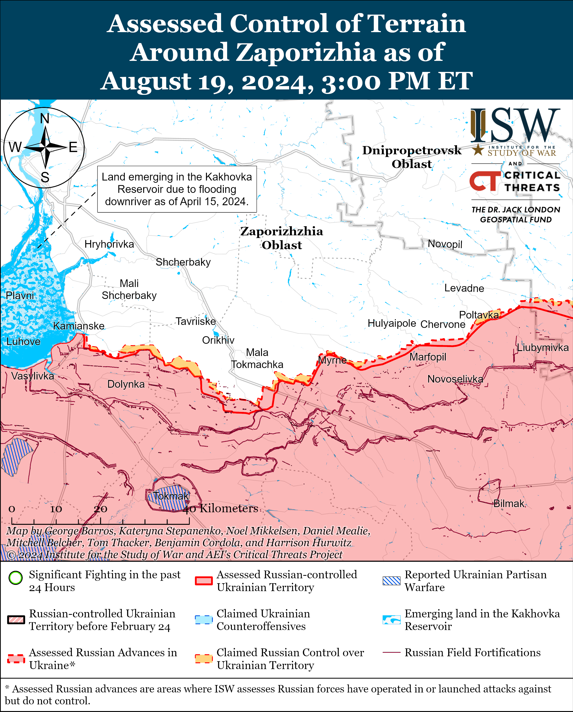](https://understandingwar.org/map/assessed-control-of-terrain-around-zaporizhia-as-of-august-19-2024-300-pm-et/)

Positional engagements continued in east (left) bank Kherson Oblast on August 19.[65]

[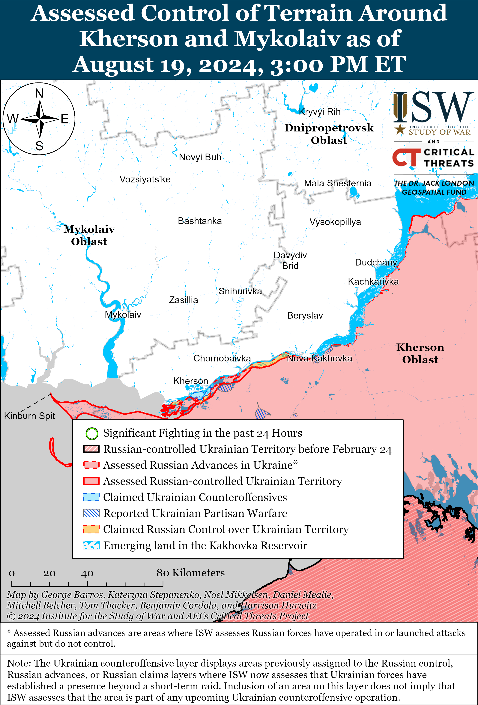](https://understandingwar.org/map/assessed-control-of-terrain-around-kherson-and-mykolaiv-as-of-august-19-2024-300-pm-et/)

**Russian Air, Missile, and Drone Campaign (Russian Objective: Target Ukrainian military and civilian infrastructure in the rear and on the frontline)**

Russian forces conducted a limited series of drone strikes against Ukraine on the night of August 18 to 19. Ukrainian Air Force Commander Lieutenant General Mykola Oleshchuk reported that Russian forces launched 19 Shahed-136/131 drones from Primorsko-Akhtarsk, Krasnodar Krai and Kursk Oblast and that Ukrainian forces downed all drones over Mykolaiv, Cherkasy, Vinnytsia, Kyiv, Dnipropetrovsk, Kharkiv, Sumy, and Donetsk oblasts.[66] The Russian Ministry of Defense (MoD) claimed on August 19 that a Russian Su-34 strike aircraft struck a Ukrainian air defense system in Kharkiv Oblast with a Kh-35 cruise missile, although ISW has not observed confirmation of this claim.[67]

The World Health Organization (WHO) reported on August 19 that Russian forces have conducted 1,940 WHO-confirmed strikes on Ukrainian healthcare infrastructure since the start of the full-scale invasion in 2022.[68] The WHO reported that 86 percent of these strikes have specifically impacted health facilities and that Russian strikes against health facilities have significantly intensified since December 2023, now occurring on nearly a daily basis.

**Russian Mobilization and Force Generation Efforts (Russian objective: Expand combat power without conducting general mobilization)**

Local Sakhalin Oblast media outlet *Sakhalin Media* reported on August 19 that the Russian Federal Security Service (FSB) Border Service in Sakhalin Oblast and other federal subjects within the Russian Far East, Northwestern, and North Caucasian federal okrugs has resumed conscription for the first time in an unspecified “long” length of time.[69] Russian President Vladimir Putin signed a bill in December 2023 allowing conscripts to serve in the FSB.[70]

**Russian Technological Adaptations (Russian objective: Introduce technological innovations to optimize systems for use in Ukraine)**

Nothing significant to report.

**Ukrainian Defense Industrial Efforts (Ukrainian objective: Develop its defense industrial base to become more self-sufficient in cooperation with US, European, and international partners)**

*ISW is suspending publishing coverage of Ukrainian defense industrial efforts until further notice.*

**Activities in Russian-occupied areas (Russian objective: Consolidate administrative control of annexed areas; forcibly integrate Ukrainian citizens into Russian sociocultural, economic, military, and governance systems)**

*ISW is not publishing coverage of activities in Russian-occupied areas today.*

**Russian Information Operations and Narratives**

Ukrainian President Volodymyr Zelensky stated on August 19 that Russia is trying to intimidate the world with a radiological incident at the Russian-occupied Zaporizhzhia Nuclear Power Plant (ZNPP), which is consistent with ISW’s assessment that Russia is amplifying fears of a radiological incident to scare the West into withholding support for Ukraine.[71] Zelensky stated that Russia uses the ZNPP’s territory to shell Ukrainian settlements and stores military equipment at the plant.[72] ISW has extensively reported on Russia forces’ routine endangerment of the ZNPP since their occupation of the ZNPP in March 2022.[73]

**Significant activity in Belarus (Russian efforts to increase its military presence in Belarus and further integrate Belarus into Russian-favorable frameworks and Wagner Group activity in Belarus)**

Belarusian Air and Air Defense Forces Commander Major General Andrei Lukyanovich stated on August 18 that Belarusian forces have significantly increased operations along the Belarusian-Ukrainian border and have conducted over 450 patrols and unspecified “combat missions” thus far in 2024.[74] Lukyanovich stated that Belarus expects batches of an unspecified quantity of Mi-35 attack helicopters and Su-30SM fighter aircraft from Russia in early 2025.

The Belarusian Ministry of Defense (MoD) announced that the media exercise “Voenkor-2024” began on August 19 and involves 25 journalists.[75] The Belarusian MoD stated that these journalists will undergo firearms, communications and radio, and hand-to-hand combat training and will study basic military topography, medicine, and psychological subjects.

**Note: ISW does not receive any classified material from any source, uses only publicly available information, and draws extensively on Russian, Ukrainian, and Western reporting and social media as well as commercially available satellite imagery and other geospatial data as the basis for these reports. References to all sources used are provided in the endnotes of each update.**

---

[1] https://x.com/moklasen/status/1825543783859233241

[2] https://t.me/mod\_russia/42342

[3] https://t.me/rybar/62900

[4] https://t.me/mod\_russia/42342 ; https://t.me/tass\_agency/267147 ; https://t.me/rybar/62907 ; https://t.me/dva\_majors/50141 ; https://t.me/rusich\_army/16624

[5] https://t.me/yurasumy/17237 ; https://t.me/DnevnikDesantnika/14216

[6] https://t.me/boris\_rozhin/134198 ; https://t.me/wargonzo/21649 ; https://t.me/boris\_rozhin/134212 ; https://t.me/VARYAGI\_155/102 ; https://t.me/voin\_dv/10358

[7] \*GRAPHIC\* https://t.me/tass\_agency/267147 ; https://t.me/rian\_ru/246558

[8] https://t.me/warhistoryalconafter/180240; https://t.me/rybar/62900 https://t.me/DnevnikDesantnika/14213 ; https://t.me/DnevnikDesantnika/14216 ; https://t.me/vrogov/17087 ; https://t.me/dva\_majors/50140 ; https://t.me/yurasumy/17237 ; https://t.me/sashakots/48475

[9] (Glushkovo) https://x.com/markito0171/status/1824393609749151924; https://x.com/markito0171/status/1824456276908159137; https://x.com/JonHallin/status/1824459196710129771 ; https://understandingwar.org/backgrounder/russian-offensive-campaign-assessment-august-16-2024

(Zvannoye) https://t.me/WarArchive\_ua/18855; https://t.me/ComAFUA/388 ; https://t.me/ButusovPlus/12839; https://t.me/astrapress/62178 ; https://understandingwar.org/backgrounder/russian-offensive-campaign-assessment-august-18-2024

[10] https://t.me/AptiAlaudinovAKHMAT/5337 ; https://meduza dot io/news/2024/08/19/a-zachem-vy-i-vashi-deti-nuzhny-etoy-strane-komandir-ahmata-apti-alaudinov-obratilsya-k-roditelyam-srochnikov-i-zayavil-chto-oni-dolzhny-voevat ; https://www.fontanka dot ru/2024/08/19/73976312/; https://www.kommersant dot ru/doc/6904646

[11] https://t.me/iamsniper/6448

[12] https://understandingwar.org/backgrounder/russian-offensive-campaign-assessment-august-10-2024

[13] https://isw.pub/UkrWar081424; https://t.me/tass\_agency/266785 ; https://t.me/tass\_agency/266836 ; https://t.me/tass\_agency/266837; https://t.me/tass\_agency/266788 ; https://t.me/tass\_agency/266500; https://t.me/tass\_agency/266569 ; https://t.me/tass\_agency/266376; https://t.me/tass\_agency/266392 ; https://t.me/tass\_agency/266311; https://t.me/tass\_agency/266315 ; https://t.me/tass\_agency/266198; https://t.me/tass\_agency/266196; https://t.me/tass\_agency/266189; https://t.me/tass\_agency/266186; https://t.me/tass\_agency/266007 ; https://t.me/tass\_agency/266008 ; https://t.me/tass\_agency/266010 ; https://t.me/tass\_agency/266038 ; https://t.me/tass\_agency/266039 ; https://t.me/tass\_agency/266040 ; https://t.me/tass\_agency/265941; https://t.me/tass\_agency/265664; https://t.me/tass\_agency/265665

[14] https://t.me/RKadyrov\_95/4982; https://t.me/RKadyrov\_95/4983; https://t.me/RKadyrov\_95/4997; https://t.me/RKadyrov\_95/5002

[15] http://www.kremlin dot ru/supplement/6177 ; https://t.me/tass\_agency/266994 ; https://www.yahoo.com/news/putin-arrives-azerbaijan-first-state-032833438.html

[16] https://president dot az/az/articles/view/66705; https://t.me/tass\_agency/267077;%20https://t.me/tass\_agency/267078;%20https://t.me/tass\_agency/267079; https://t.me/tass\_agency/267081; https://t.me/tass\_agency/267082; https://t.me/tass\_agency/267091

[17] https://storage.googleapis dot com/istories/opinions/2024/08/19/chto-proiskhodit-vnutri-rossiiskoi-vertikali-vlasti/index.html?tg\_rhash=a8983ea609be7d

[18] https://storage.googleapis dot com/istories/opinions/2024/08/19/chto-proiskhodit-vnutri-rossiiskoi-vertikali-vlasti/index.html?tg\_rhash=a8983ea609be7d

[19] https://understandingwar.org/backgrounder/russian-offensive-campaign-assessment-may-12-2024; https://isw.pub/UkrWar031924

[20] http://publication.pravo dot gov.ru/document/0001202408190001?index=1; https://ria dot ru/20240819/ukaz-1967101775.html

[21] http://publication.pravo dot gov.ru/document/0001202408190001?index=1; https://ria dot ru/20240819/ukaz-1967101775.html

[22] https://isw.pub/UkrWar06272024; https://isw.pub/UkrWar073024; https://isw.pub/UkrWar040924; https://isw.pub/UkrWar032924; https://isw.pub/UkrWar021524; https://understandingwar.org/backgrounder/russian-offensive-campaign-assessment-november-22-2023; https://rm.coe.int/constitution-of-the-russian-federation-en/1680a1a237

[23] https://isw.pub/UkrWar050324; https://understandingwar.org/backgrounder/russian-offensive-campaign-assessment-may-2-2024; https://isw.pub/UkrWar042824; https://isw.pub/UkrWar042724; https://isw.pub/UkrWar072924; https://isw.pub/UkrWar070124

[24] https://understandingwar.org/backgrounder/russian-offensive-campaign-assessment-may-7-2024

[25] https://understandingwar.org/backgrounder/russian-offensive-campaign-assessment-july-21-2023; https://understandingwar.org/backgrounder/russian-offensive-campaign-assessment-august-31-2023; https://understandingwar.org/backgrounder/russian-offensive-campaign-assessment-november-21-2023; https://understandingwar.org/backgrounder/russian-offensive-campaign-assessment-june-23-2023; https://understandingwar.org/backgrounder/russian-offensive-campaign-assessment-june-24-2024; https://understandingwar.org/backgrounder/russian-offensive-campaign-assessment-august-7-2024; https://isw.pub/UkrWar121423

[26] https://isw.pub/UkrWar073024; https://isw.pub/UkrWar061024; https://isw.pub/UkrWar08072024; https://isw.pub/UkrWar072924; https://isw.pub/UkrWar072224; https://isw.pub/UkrWar071224

[27] https://isw.pub/UkrWar072924; https://understandingwar.org/backgrounder/russian-offensive-campaign-assessment-july-17-2024; https://isw.pub/UkrWar071524; https://isw.pub/UkrWar06272024; https://isw.pub/UkrWar060724

[28] https://tass dot ru/politika/21635385

[29] https://aif dot ru/politics/world/lavrov-nazval-sluhami-soobshcheniya-o-skrytyh-kontaktah-moskvy-i-kieva; https://understandingwar.org/backgrounder/russian-offensive-campaign-assessment-june-14-2024

[30] https://isw.pub/UkrWar081224; https://tass dot ru/politika/21639225

[31] https://tass dot ru/politika/21639225

[32] https://understandingwar.org/backgrounder/russian-offensive-campaign-assessment-august-17-2024; https://isw.pub/UkrWar081324; https://isw.pub/UkrWar081224 ; https://isw.pub/UkrWar072524

[33] https://t.me/motopatriot/26306

[34]https://www.facebook.com/GeneralStaff.ua/posts/pfbid0337Q1DZpvF3XKanfgnHvUzUYxZsBLVU4BodbWvdY1sgRxCgyx6mcwkgmpqvLRdLvzl ; https://www.facebook.com/GeneralStaff.ua/posts/pfbid0Gvth89z8ZvXkaXU8Ere9mkWzHdRqoew9wgmiwDfbdGfEAyqAuXfFiCZggFKM39Cjl; https://t.me/wargonzo/21638

[35] https://t.me/otukharkiv/801

[36] https://armyinform dot com.ua/2024/08/19/byemo-vagneriv-pid-harkovom-intervyu-armiyainform-z-kombatom-z-iii-interlegionu/

[37] https://understandingwar.org/backgrounder/russian-offensive-campaign-assessment-august-10-2024; https://understandingwar.org/backgrounder/russian-offensive-campaign-assessment-june-18-2024; https://isw.pub/UkrWar081124; https://isw.pub/UkrWar081024

[38] https://x.com/sternenko/status/1825147960344117438; https://x.com/klinger66/status/1825319703591457181; https://x.com/MikiValbuena/status/1825457175428202585; https://x.com/PuenteUribarri/status/1825430448484261981

[39] https://t.me/motopatriot/26309; https://t.me/DnevnikDesantnika/14219; https://t.me/z\_arhiv/27689; https://t.me/z\_arhiv/27693

[40] https://www.facebook.com/GeneralStaff.ua/posts/pfbid02v5AnrkzGA5mTmW1nDiwGnc21DjD6wspGNP7gW6X4MzdNN7Q8q4Nq9rwNe3UZ7sQul ; https://www.facebook.com/GeneralStaff.ua/posts/pfbid0337Q1DZpvF3XKanfgnHvUzUYxZsBLVU4BodbWvdY1sgRxCgyx6mcwkgmpqvLRdLvzl ; https://www.facebook.com/GeneralStaff.ua/posts/pfbid0Gvth89z8ZvXkaXU8Ere9mkWzHdRqoew9wgmiwDfbdGfEAyqAuXfFiCZggFKM39Cjl

[41] https://t.me/mod\_russia/42330

[42] https://t.me/motopatriot/26331

[43] https://www.facebook.com/GeneralStaff.ua/posts/pfbid02v5AnrkzGA5mTmW1nDiwGnc21DjD6wspGNP7gW6X4MzdNN7Q8q4Nq9rwNe3UZ7sQul; https://www.facebook.com/GeneralStaff.ua/posts/pfbid0337Q1DZpvF3XKanfgnHvUzUYxZsBLVU4BodbWvdY1sgRxCgyx6mcwkgmpqvLRdLvzl

[44] https://t.me/boris\_rozhin/134153

[45] https://t.me/DnevnikDesantnika/14207

[46] https://www.facebook.com/GeneralStaff.ua/posts/pfbid02v5AnrkzGA5mTmW1nDiwGnc21DjD6wspGNP7gW6X4MzdNN7Q8q4Nq9rwNe3UZ7sQul; https://www.facebook.com/GeneralStaff.ua/posts/pfbid0337Q1DZpvF3XKanfgnHvUzUYxZsBLVU4BodbWvdY1sgRxCgyx6mcwkgmpqvLRdLvzl

[47] https://t.me/voin\_dv/10347

[48] https://t.me/rybar/62884

[49] https://t.me/RVvoenkor/75119; https://t.me/voenkorKotenok/58343; https://t.me/voenkorKotenok/58334; https://t.me/wargonzo/21638; https://t.me/boris\_rozhin/134166; https://t.me/boris\_rozhin/134180; https://t.me/notes\_veterans/72; https://t.me/vrogov/17092; https://t.me/voenkorKotenok/58357; https://t.me/DnevnikDesantnika/14244

[50] https://t.me/z\_arhiv/27691; https://t.me/RVvoenkor/75125

[51] https://www.facebook.com/GeneralStaff.ua/posts/pfbid02v5AnrkzGA5mTmW1nDiwGnc21DjD6wspGNP7gW6X4MzdNN7Q8q4Nq9rwNe3UZ7sQul; https://www.facebook.com/GeneralStaff.ua/posts/pfbid0337Q1DZpvF3XKanfgnHvUzUYxZsBLVU4BodbWvdY1sgRxCgyx6mcwkgmpqvLRdLvzl

[52] https://www.facebook.com/GeneralStaff.ua/posts/pfbid02v5AnrkzGA5mTmW1nDiwGnc21DjD6wspGNP7gW6X4MzdNN7Q8q4Nq9rwNe3UZ7sQul; https://www.facebook.com/GeneralStaff.ua/posts/pfbid0337Q1DZpvF3XKanfgnHvUzUYxZsBLVU4BodbWvdY1sgRxCgyx6mcwkgmpqvLRdLvzl

[53] https://x.com/chris\_\_759/status/1825307840849793099;; https://t.me/rusich\_army/16615

[54] https://t.me/wargonzo/21638; https://t.me/motopatriot/26310; https://t.me/RVvoenkor/75125; https://t.me/RVvoenkor/75110; https://t.me/voenkorKotenok/58344; https://t.me/boris\_rozhin/134226; https://t.me/motopatriot/26344

[55] https://t.me/motopatriot/26310; https://t.me/RVvoenkor/75117; https://t.me/boris\_rozhin/134180

[56] https://www.facebook.com/GeneralStaff.ua/posts/pfbid02v5AnrkzGA5mTmW1nDiwGnc21DjD6wspGNP7gW6X4MzdNN7Q8q4Nq9rwNe3UZ7sQul; https://www.facebook.com/GeneralStaff.ua/posts/pfbid0337Q1DZpvF3XKanfgnHvUzUYxZsBLVU4BodbWvdY1sgRxCgyx6mcwkgmpqvLRdLvzl

[57] https://t.me/voenkorKotenok/58342 ; https://t.me/wargonzo/21638 ; https://www.facebook.com/GeneralStaff.ua/posts/pfbid0Gvth89z8ZvXkaXU8Ere9mkWzHdRqoew9wgmiwDfbdGfEAyqAuXfFiCZggFKM39Cjl ; https://www.facebook.com/GeneralStaff.ua/posts/pfbid0337Q1DZpvF3XKanfgnHvUzUYxZsBLVU4BodbWvdY1sgRxCgyx6mcwkgmpqvLRdLvzl

[58] https://t.me/voin\_dv/10352 ; https://t.me/nm\_dnr/12592 ; https://t.me/voenkorKotenok/58342

[59] https://t.me/totem\_72/81; https://t.me/WarArchive\_ua/18913

[60] https://t.me/DnevnikDesantnika/14207

[61] https://www.facebook.com/GeneralStaff.ua/posts/pfbid02v5AnrkzGA5mTmW1nDiwGnc21DjD6wspGNP7gW6X4MzdNN7Q8q4Nq9rwNe3UZ7sQul ; https://www.facebook.com/GeneralStaff.ua/posts/pfbid0337Q1DZpvF3XKanfgnHvUzUYxZsBLVU4BodbWvdY1sgRxCgyx6mcwkgmpqvLRdLvzl ; https://www.facebook.com/GeneralStaff.ua/posts/pfbid0Gvth89z8ZvXkaXU8Ere9mkWzHdRqoew9wgmiwDfbdGfEAyqAuXfFiCZggFKM39Cjl ; https://t.me/wargonzo/21638 ; https://t.me/voenkorKotenok/58342 ; https://t.me/rusich\_army/16629

[62] https://www.facebook.com/GeneralStaff.ua/posts/pfbid0337Q1DZpvF3XKanfgnHvUzUYxZsBLVU4BodbWvdY1sgRxCgyx6mcwkgmpqvLRdLvzl ; https://www.facebook.com/GeneralStaff.ua/posts/pfbid0Gvth89z8ZvXkaXU8Ere9mkWzHdRqoew9wgmiwDfbdGfEAyqAuXfFiCZggFKM39Cjl

[63] https://t.me/wargonzo/21638

[64] https://t.me/NeoficialniyBeZsonoV/38815; https://t.me/stringer\_donetsk/13380; https://t.me/boris\_rozhin/134105

[65] https://www.facebook.com/GeneralStaff.ua/posts/pfbid0337Q1DZpvF3XKanfgnHvUzUYxZsBLVU4BodbWvdY1sgRxCgyx6mcwkgmpqvLRdLvzl; https://www.facebook.com/GeneralStaff.ua/posts/pfbid0Gvth89z8ZvXkaXU8Ere9mkWzHdRqoew9wgmiwDfbdGfEAyqAuXfFiCZggFKM39Cjl ; https://www.facebook.com/OperationalCommandSouth/posts/pfbid0pLWwjtc1cZG6jSL6JzgUVPtDYKbHdrFFZxJ2tTzbFKJQ5ybwRCAJQ4uHFhNCWUXVl?\_\_cft\_\_[0]=AZVcVhrv0IniFf-OdbBpaz756jz2vrtEwQE9TU8pBrlDBufVji-BFvlN4SnQKmRS7-IZb\_ElxHnVXaUtDWi\_Ky\_Fw2kdS-YMFR2XjG7lnveFdI\_9rjKUWndUpnJ5iHsPNBc20ldjNyDgeyBI65mjzDXxIYOIMBbFk4bOVTtI\_5jvRIgedIDpQfw3\_FoyLUv9V61k7CLszcavmGlpnPwqIECZ&\_\_tn\_\_=%2CO%2CP-R

[66] https://t.me/ComAFUA/389

[67] https://t.me/mod\_russia/42329

[68] https://www.who.int/europe/news/item/19-08-2024-grim-milestone-on-world-humanitarian-day–who-records-1940-attacks-on-health-care-in-ukraine-since-start-of-full-scale-war#:~:text=For%20over%202.5%20years%20now,on%20a%20near%2Ddaily%20basis.

[69] https://sakhalinmedia dot ru/news/1821602/

[70] https://understandingwar.org/backgrounder/russian-offensive-campaign-assessment-december-26-2023

[71] https://t.me/V\_Zelenskiy\_official/11386 ; https://understandingwar.org/backgrounder/russian-offensive-campaign-assessment-august-18-2024

[72] https://t.me/V\_Zelenskiy\_official/11386

[73] https://isw.pub/UkrWar111623 ; https://isw.pub/UkrWar030824 ; https://isw.pub/UkrWar021524 ; https://isw.pub/UkrWar070924 ; https://isw.pub/UkrWar070824

[74] https://www.belta dot by/society/view/lukjjanovich-adekvatno-reagiruem-na-vse-izmenenija-v-obstanovke-vdol-nashih-granits-655023-2024/; https://t.me/tass\_agency/266995; https://t.me/tass\_agency/266996; https://t.me/tass\_agency/266997

[75] https://t.me/modmilby/41140
