# Russian Offensive Campaign Assessment, August 20, 2024

**Karolina Hird, Christina Harward, Nicole Wolkov, Angelica Evans, Davit Gasparyan, and George Barros**

**August 20, 2024, 7:45pm ET**

**Click**[**here**](https://storymaps.arcgis.com/stories/36a7f6a6f5a9448496de641cf64bd375)**to see ISW’s interactive map of the Russian invasion of Ukraine. This map is updated daily alongside the static maps present in this report.**

**Click**[**here**](https://understandingwar.maps.arcgis.com/apps/instant/3dviewer/index.html?appid=1602762dbcde419bb957dea358449580)**to see ISW’s 3D control of terrain topographic map of Ukraine. Use of a computer (not a mobile device) is strongly recommended for using this data-heavy tool.**

**Click**[**here**](https://storymaps.arcgis.com/stories/733fe90805894bfc8562d90b106aa895)**to access ISW’s archive of interactive time-lapse maps of the Russian invasion of Ukraine. These maps complement the static control-of-terrain map that ISW produces daily by showing a dynamic frontline. ISW will update this time-lapse map archive monthly.**

**Note: The data cut-off for this product was 12:30pm ET on August 20. ISW will cover subsequent reports in the August 21 Russian Offensive Campaign Assessment.**

**Ukrainian forces continued attacking throughout the Ukrainian salient in Kursk Oblast on August 20 and recently made additional advances.**Ukrainian forces appear to be continuing efforts to strike Russian pontoon bridges and pontoon engineering equipment west of the current Kursk Oblast salient over the Seim River in Glushkovo Raion—geolocated footage published on August 20 shows Ukrainian drones striking Russian equipment bringing pontoons to a staging area near the Seim River about 3km north of Glushkovo. Satellite imagery indicates that Ukrainian forces have destroyed at least one pontoon bridge across the Seim as of August 19 that was visible on August 17.[1] Some Russian milbloggers claimed that Ukrainian forces seized Vishnevka (southwest of Koronevo and 14km from the international border), consistent with the Russian Ministry of Defense’s (MoD) reporting from August 19 that tacitly acknowledged Ukrainian advances in the Vishnevka area.[2] Geolocated footage published on August 19 shows that Ukrainian forces have advanced westward along Sudzhanskiy Shlyakh Street (38K-030 highway) in eastern Korenevo as well as in fields northeast of Korenevo.[3] Russian milbloggers widely claimed on August 20 that Ukrainian forces continued mechanized assaults on the outskirts of Korenevo and that Russian forces were conducting artillery and airstrikes to contain Ukrainian advances.[4] Russian milbloggers indicated that Russian forces regained some lost positions and advanced in fields south of Safonovka (northeast of Koreveno and 30km from the international border).[5] Geolocated footage published on August 20 shows that Ukrainian forces have also advanced in forested areas north of Russkoye Porechnoye (northeast of Sudzha and 20km from the international border), consistent with Russian milblogger maps that depict Ukrainian advances over the entire administrative boundaries of Russkoye Porechnoye.[6] A prominent Kremlin-affiliated milblogger claimed on August 20 that Ukrainian forces have also advanced up the western outskirts of Russkaya Konopelka, just east of Sudzha.[7] Geolocated footage published on August 20 showing Ukrainian forces towing a captured Russian T-90M tank along the Snagost-Liubimivka road (southeast of Koreveno and 8km from the international border) indicates that Ukrainian forces continue operating well within the maximalist claimed limit of Ukrainian advances in Kursk Oblast.[8]

[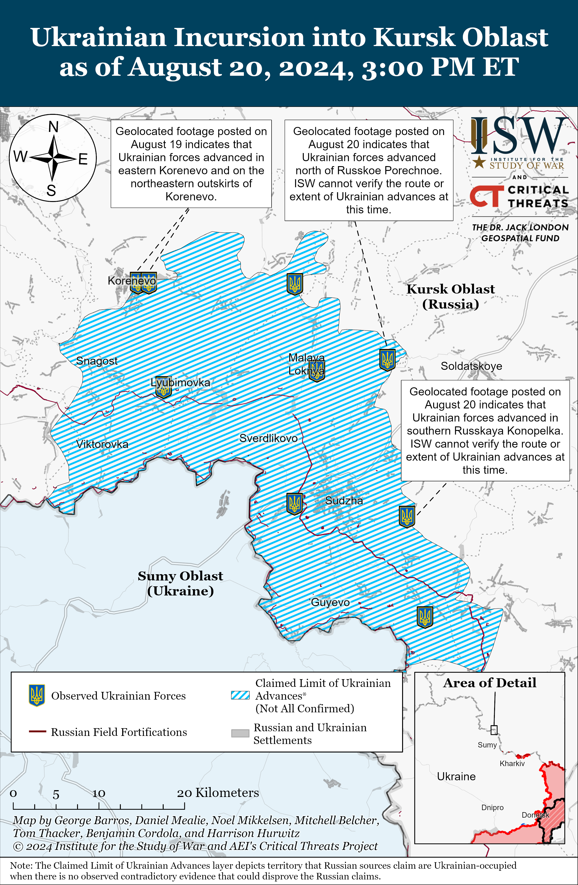](https://understandingwar.org/map/ukrainian-incursion-into-kursk-oblast-as-of-august-20-2024-300-pm-et/)

**Ukrainian Commander-in-Chief Colonel General Oleksandr Syrskyi displayed a map depicting the situation in Kursk Oblast on August 20, and ISW will use the boundaries of this map to update its assessment of maximalist claimed limits of Ukrainian advances in Kursk Oblast, consistent with ISW’s mapping methodology for the Ukrainian incursion thus far.**During a televised meeting of the Ukrainian Congress of Local and Regional Authorities on August 20, Syrskyi shared a map showing the purported current Ukrainian forward line of troops (FLOT) in Kursk Oblast.[9] Syrskyi’s map indicates that Ukrainian forces have advanced slightly beyond ISW’s assessed FLOT, namely near Viktorovka (southwest of Koreveno); between Snagost and Koreveno; northeast of Koreveno in the areas north of Kremyanoye and northwest of Pogrebki; east of Malaya Loknya (north of Sudzha); and southeast of Sudzha.[10] Heat anomalies from NASA FIRMS/VIIRS are located in very close proximity to the FLOT depicted in Syrskyi’s map**.** ISW will expand its maximalist limit of claimed Ukrainian advances to match Syrskyi’s map, but will not recess maximalist claims in areas where they extend beyond Syrskyi’s FLOT (the southeasternmost part of the salient, for example), to reflect ISW’s methodological commitment to mapping events in Kursk Oblast based off of the *maximal claims made by both Ukrainian and Russian sources in the wider information space.* ISW does not question Syrskyi’s presentation of the location of Ukrainian forces in Kursk Oblast and presents them in alignment with Syrskyi’s presentation. ISW continues to assess that Ukrainian forces do not control all the territory behind the FLOT according to the doctrinal definition of “control” that ISW uses to shape its control of terrain assessments.[11] The expansion of ISW’s map in accordance with Syrskyi’s, therefore, should be taken as a recognition of maximal Ukrainian and Russian claims, and not an assessment of Ukraine’s control of the area behind the FLOT. Syrskyi’s map notably depicts Russian units operating behind the FLOT, especially in the northwestern part of the salient, consistent with ISW’s assessment that large portions of the salient are likely contested zones.[12]

[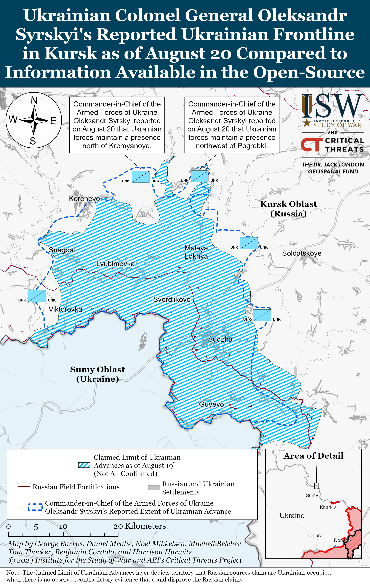](https://understandingwar.org/map/ukrainian-colonel-general-oleksandr-syrskyis-reported-ukrainian-frontline-in-kursk-as-of-august-20-compared-to-information-available-in-the-open-source/)

**Ukrainian officials continued to clarify some of the objectives of the Ukrainian operation in Kursk Oblast and reported on the extent of additional Ukrainian advances.**Ukrainian Commander-in-Chief Colonel General Oleksandr Syrskyi stated on August 20 that Ukrainian forces advanced between 28 to 35 kilometers deep into Kursk Oblast and that they “control” 93 settlements (1,263 square kilometers).[13] Syrskyi stated that Ukrainian advances in Kursk Oblast are pressuring Russian forces to redeploy elements of unspecified units from the frontline in Ukraine to Kursk Oblast, which may impact the tempo and prospect of Russian offensive efforts in Ukraine.[14] Syrskyi also stated that Ukrainian forces aim to establish a buffer zone in Russian territory to prevent Russian forces from shelling Sumy Oblast and to “outpace” the efforts of the Russian forces at large. Ukrainian President Volodymyr Zelensky stated on August 19 that the “preventative defense” of the Ukrainian forces in Kursk Oblast is the most effective countermeasure against Russian forces and that Ukrainian forces have largely “cleared” the Russian border area close to Sumy Oblast of Russian forces.[15] The Ukrainian General Staff reported on August 20 that Ukrainian forces are exhausting the combat potential of Russian forces particularly in Kursk Oblast, acknowledging the Kursk operation.[16] Deputy Chair of the Committee on Ukraine‘s Integration into the European Union (EU) Maria Mezentseva-Fedorenko stated on August 19 that Ukraine is preparing a new round of exchange of prisoners of war (POWs) and civilian hostages with Russia and that Ukraine’s operations in Kursk Oblast comply with international humanitarian law.[17]

**The Russian military command continues to complicate and bureaucratize its thus-far ineffective command and control (C2) structure for the Russian response to the Ukrainian incursion into Kursk Oblast.**Russian Defense Minister Andrei Belousov announced on August 20 that he appointed Russian Deputy Defense Minister Colonel General Yunus-Bek Yevkurov as Deputy Head of the “Coordinating Council” within the Russian Ministry of Defense (MoD) for military and security issues in Bryansk, Kursk and Belgorod oblasts and stated that Yevkurov is already currently in Kursk Oblast.[18] Belousov’s decision to appoint Yevkurov — who heads the Russian MoD’s Africa Corps and has been the face of Russian military outreach and cooperation with African countries since the dissolution of the Wagner Group in 2023 — may suggest that the Russian MoD removed Yevkurov from his position in Africa Corps, as a Kremlin-affiliated milblogger previously speculated, and that that the Russian MoD is temporarily deprioritizing defense cooperation efforts in Africa in response to the incursion into Kursk Oblast.[19]

Belousov also tasked five members of the Coordinating Council with addressing specific issues related to the Ukrainian incursion into Kursk Oblast. Belousov announced that Deputy Defense Minister Lieutenant General Andrei Bulyga is responsible for resolving logistics, transport, and assisting civilian authorities in civilian evacuations; that Deputy Defense Minister Alexei Krivoruchko is responsible for solving problems related to military-technical support; that Deputy Defense Minister Pavel Fradkov is responsible for engineering and construction; and that the Russian MoD’s Main Military Medical Directorate Head Dmitry Trishkin is responsible for medical support.[20] Belousov also announced the creation of the Bryansk, Kursk, and Belgorod groupings of forces and stated that their unspecified commanders and an unspecified representative of the Russian General Staff are responsible for protecting civilians from drone strikes and other attacks.[21] The Russian MoD additionally created a special task force at the National Defense Control Center to monitor issues in Bryansk, Kursk, and Belgorod oblasts.[22] The National Defense Control Center’s Deputy Head Lieutenant General Yuri Korsachev claimed that the center’s task force has already resolved 25 issues voiced by the Bryansk, Kursk, and Belgorod operational headquarters, of which most requested additional drone supplies, mobile electronic warfare (EW) systems, radios, radio jammers, and all-terrain vehicles.[23] Belousov did not comment on how the Coordination Council officials, the National Defense Control Center’s task force, and the newly-created groupings of forces will interact with the existing C2 structure that the Kremlin established when it tasked that Russian Federal Security Service (FSB) with conducting a counterterrorism operation in Bryansk, Kursk, and Belgorod oblasts. The increasing bureaucratization of the Coordination Council and other Russian MoD structures dedicated to defending against the incursion into Kursk Oblast will likely create additional confusion within the Russian MoD and friction among the Russian MoD, FSB, and Rosgvardia, all of which are attempting to operate in Kursk Oblast. ISW continues to assess that complex and overlapping responsibilities and seemingly ever-growing list of actors the Kremlin has tasked with responding to the Ukrainian incursion impedes Russia’s ability to establish effective joint C2 structures.[24]

**Russian authorities have reportedly re-deployed Russian units from the Chasiv Yar direction to Kursk Oblast amid efforts to address the ongoing Ukrainian incursion into Kursk Oblast with Russian forces previously in the area and re-deployments from lower priority sectors of the frontline in Ukraine.** A Russian milblogger claimed on August 20 that elements of the Russian 11th Airborne (VDV) Brigade struck a Ukrainian armored vehicle in southern Russkaya Konopelka (east of Sudzha), and elements of the Russian 11th VDV Brigade were reportedly operating near Chasiv Yar as of late July 2024.[25] The Russian military command likely re-deployed elements of the 11th VDV Brigade intended to relieve or reinforce frontline units and not units that have been engaged in combat on the frontline, however. ISW previously noted that such deployments could affect the tempo of Russian offensive operations, but that it would likely take several weeks to observe any possible impacts of such redeployments on Russian operations in Donetsk Oblast.[26] ISW continues to assess that the Russian military command is likely extremely averse to pulling Russian military units engaged in combat from higher priority sectors in Donetsk Oblast due to concerns about further slowing the tempo of Russian operations in these directions.[27]

Russian sources also claimed that Russian forces re-deployed elements of the 30th Motorized Rifle Regiment (72nd Motorized Rifle Division, 22nd Army Corps [AC], Leningrad Military District [LMD]) to Kursk Oblast, and elements of the 30th Motorized Rifle Regiment were reportedly operating in northern Kharkiv Oblast as of mid-July 2024.[28] A Ukrainian military observer claimed that an unspecified element of the 4th Tank Division (1st Guards Tank Army [GTA], Moscow Military District [MMD]) is also operating in Kursk Oblast, although the military observer insinuated that the element was operating in the area prior to the Ukrainian incursion into Kursk Oblast.[29] ISW has previously observed additional indications that Russian authorities are largely relying on an amalgamation of conscripts, irregular Russian forces, and regular Russian forces re-deployed from lower priority frontline areas in Ukraine to counter the Ukrainian incursion into Kursk Oblast.[30]

**Russian President Vladimir Putin visited the site of the 2004 Beslan school siege on August 20, likely in an effort to link the Russian “counterterrorism” response to the Ukrainian operation in Kursk Oblast to a “successful” Russian counterterrorism operation in the early 2000s.**Putin arrived in the North-Ossetia Alania Republic on August 20 and visited the memorial to the 2004 Beslan school siege as well as the site of the siege itself.[31] This was Putin’s first visit to the school and his second to the city since August 2008.[32] Terrorists affiliated with the Chechen separatist Riyad-us Saliheen Brigade took over 1,000 adults and children hostage in a Beslan school over three days in September 2004, resulting in the deaths of more than 330 people, including 186 children.[33] The Russian response to the 2004 terrorist attack was documented to be inefficient and dangerous. The European Court of Human Rights ruled in 2017 that local Russian authorities knew about the 2004 terrorist attack beforehand but did not increase security or warn the public.[34] The European Court also stated that the Russian security services’ response lacked formal leadership and rules about how to engage terrorists, resulting in uncoordinated actions that endangered the hostages. Putin alleged on August 20 that Russia is currently fighting terrorists in Kursk Oblast and Ukraine, just as Russia fought terrorists in Beslan in 2004, claiming that Russia will emerge similarly victorious against Ukraine.[35]

**Putin met with representatives of the “Mothers of Beslan” Association of Victims of Terrorist Acts organization on August 20, and the Kremlin’s reporting on the meeting attempted to portray Putin as sympathetic to mothers’ complaints – likely in response to the potential growing threat to Putin’s regime posed by family members complaining about the ongoing involvement of Russian conscripts in Kursk Oblast.[36]** Russian opposition news outlet *Agentsvo*reported that Aneta Gadieva, one of the “Mothers of Beslan” representatives present at the meeting, stated that most of the conversation focused on why Russian officials had not closed the investigation into the 2004 attack.[37] Gadieva noted that Putin promised the organization during their last meeting in 2005 that he would take control of the investigation. Putin reportedly attempted to shift the blame for this inaction away from himself during the August 20 meeting, claiming that he was unaware of the prolonged investigation and that he would contact Russian Investigative Committee Head Alexander Bastrykin about the matter. Gadieva also statedthat the women told Putin that unspecified Russian officials are not conveying the whole truth to him about the situation in Kursk Oblast and that Federal Security Service (FSB) border guards, conscripts, and other servicemembers from the North Ossetia-Alania Republic have been captured, calling for Putin to secure their release.[38]

The Kremlin has not publicized the reported discussions about the Beslan investigation or conscripts in Kursk Oblast, instead highlighting Putin’s statements that he is aware that the women of the “Mothers of Beslan” organization cannot take advantage of sanatorium programs due to the lack of childcare at the facilities — a relatively extraneous point compared to the women’s reported emphasis during the meeting on the shortcomings of the 20-year-long official investigation. Putin also notably incorrectly claimed during the meeting that 136 children died in the 2004 siege, when in fact 186 children died.[39] Mothers’ organizations have been able to steer large Russian social movements in the past, as with the Committee of Soldiers’ Mothers (later renamed the Union of Committees of Soldiers’ Mothers), which rallied around issues with Soviet conscripts in the late 1980s and early 1990s and successfully called for greater transparency in the Soviet military, and Putin showed great concern in 2022 about societal backlash about Russia’s use of conscripts in the war in Ukraine following appeals made by conscripts’ mothers.[40]

**Key Takeaways:**

- **Ukrainian forces continued attacking throughout the Ukrainian salient in Kursk Oblast on August 20 and recently made additional advances.**
- **Ukrainian Commander-in-Chief Colonel General Oleksandr Syrskyi displayed a map depicting the situation in Kursk Oblast on August 20, and ISW will use the boundaries of this map to update its assessment of maximalist claimed limits of Ukrainian advances in Kursk Oblast, consistent with ISW’s mapping methodology for the Ukrainian incursion thus far.**
- **Russian authorities have reportedly re-deployed Russian units from the Chasiv Yar direction to Kursk Oblast amid efforts to address the ongoing Ukrainian incursion into Kursk Oblast with Russian forces previously in the area and re-deployments from lower priority sectors of the frontline in Ukraine.**
- **Russian President Vladimir Putin visited the site of the 2004 Beslan school siege on August 20, likely in an effort to link the Russian “counterterrorism” response to the Ukrainian operation in Kursk Oblast to a “successful” Russian counterterrorism operation in the early 2000s.**
- **Russian forces recently advanced near Toretsk, Pokrovsk, and Donetsk City.**
- **Russian federal subjects (regions) continue to increase monetary incentives for signing Russian military contracts in order to bolster Russia’s force generation efforts.**

[***[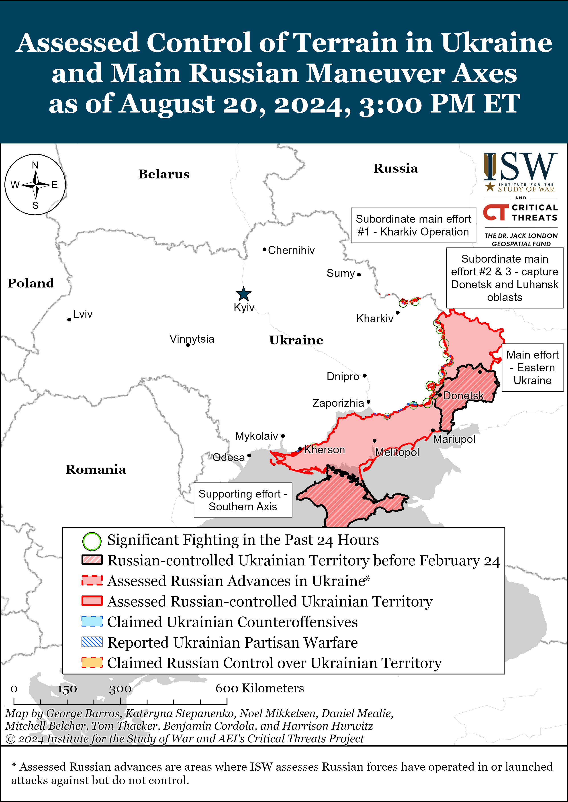](https://understandingwar.org/map/assessed-control-of-terrain-in-ukraine-and-main-russian-maneuver-axes-as-of-august-20-2024-300-pm-et/)***](https://understandingwar.org/wp-content/uploads/2025/05/DraftUkraineCoT20August20202C202024.png)

***We do not report in detail on Russian war crimes because these activities are well-covered in Western media and do not directly affect the military operations we are assessing and forecasting. We will continue to evaluate and report on the effects of these criminal activities on the Ukrainian military and the Ukrainian population and specifically on combat in Ukrainian urban areas. We utterly condemn Russian violations of the laws of armed conflict and the Geneva Conventions and crimes against humanity even though we do not describe them in these reports.***

- Russian Main Effort – Eastern Ukraine (comprised of three subordinate main efforts)
- Russian Subordinate Main Effort #1 – Push Ukrainian forces back from the international border with Belgorod Oblast and approach to within tube artillery range of Kharkiv City
- Russian Subordinate Main Effort #2 – Capture the remainder of Luhansk Oblast and push westward into eastern Kharkiv Oblast and encircle northern Donetsk Oblast
- Russian Subordinate Main Effort #3 – Capture the entirety of Donetsk Oblast
- Russian Supporting Effort – Southern Axis
- Russian Air, Missile, and Drone Campaign
- Russian Mobilization and Force Generation Efforts
- Russian Technological Adaptations
- Activities in Russian-occupied areas
- Ukrainian Defense Industrial Base Efforts
- Russian Information Operations and Narratives
- Significant Activity in Belarus

**Russian Main Effort – Eastern Ukraine**

**Russian Subordinate Main Effort #1 – Kharkiv Oblast (Russian objective: Push Ukrainian forces back from the international border with Belgorod Oblast and approach to within tube artillery range of Kharkiv City)**

Limited positional engagements continued in northern Kharkiv Oblast on August 20, but there were no confirmed changes to the frontline. A Russian milblogger claimed that Ukrainian forces conducted a reinforced platoon-sized mechanized counterattack near Hlyboke (north of Kharkiv City), but that Russian forces repelled the assault and prevented Ukrainian troops from re-establishing lost positions.[41] Ukraine’s Kharkiv Group of Forces reported that Russian forces are preparing to re-intensify assault operations in Vovchansk (northeast of Kharkiv City) and are conducting TOS-1A thermobaric artillery strikes against high-rise buildings to set conditions for future ground assaults.[42] Ukrainian and Russian sources reported continued fighting north of Kharkiv City near Hlyboke and Lyptsi, as well as within Vovchansk.[43] Elements of the Russian 11th Tank Regiment (18th Motorized Rifle Division, 11th Army Corps [AC], Leningrad Military District [LMD]) and 7th Motorized Rifle Regiment (11th AC, LMD) reportedly continue to operate near Hlyboke and Lyptsi, while elements of the 155th Naval Infantry Brigade (Pacific Fleet) are reportedly operating in the general northern Kharkiv Oblast direction.[44]

[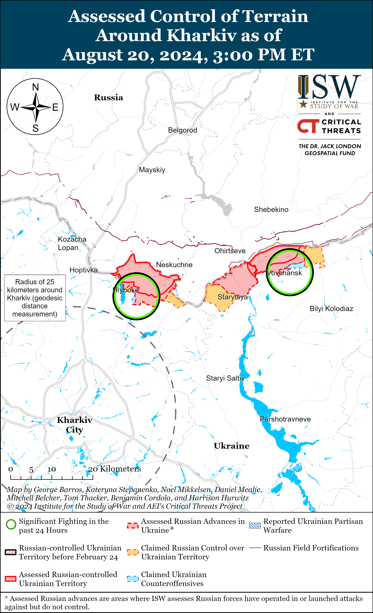](https://understandingwar.org/map/assessed-control-of-terrain-around-kharkiv-as-of-august-20-2024-300-pm-et/)

[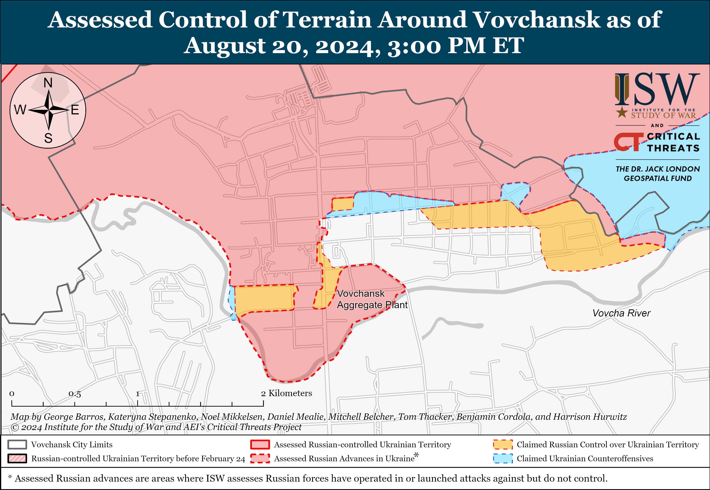](https://understandingwar.org/map/assessed-control-of-terrain-around-vovchansk-as-of-august-20-2024-300-pm-et/)

**Russian Subordinate Main Effort #2 – Luhansk Oblast (Russian objective: Capture the remainder of Luhansk Oblast and push westward into eastern Kharkiv Oblast and northern Donetsk Oblast)**

Russian forces continued ground attacks along the Kupyansk-Svatove-Kreminna line on August 20, but there were no confirmed changes to the frontline. A Russian milblogger claimed that Russian forces crossed the Zherebets River and gained a foothold in the direction of Hrekivka (northwest of Kreminna).[45] ISW has not observed visual evidence of this claim but assesses that Russian forces have advanced across the Zherebets River in northern Makiivka (northwest of Kreminna and just east of Hrekivka). Another Russian milblogger claimed that Russian forces are slowly advancing toward Kolisnykivka (southeast of Kupyansk).[46] Fighting continued northeast of Kupyansk near Synkivka; east of Kupyansk near Petropavlivka; southeast of Kupyansk near Hlushkivka, Stelmakhivka, Kruhlyakivka and toward Novoosynove and Lozova; west of Svatove near Andriivka; southwest of Svatove near Novoyehorivka and Novoserhiivka; northwest of Kreminna near Makiivka, Nevske, Novosadove, and Hrekivka; west of Kreminna near Torske; south of Kreminna in the Serebryanske forest area; and southwest of Kreminna near Dibrova on August 19 and 20.[47]

[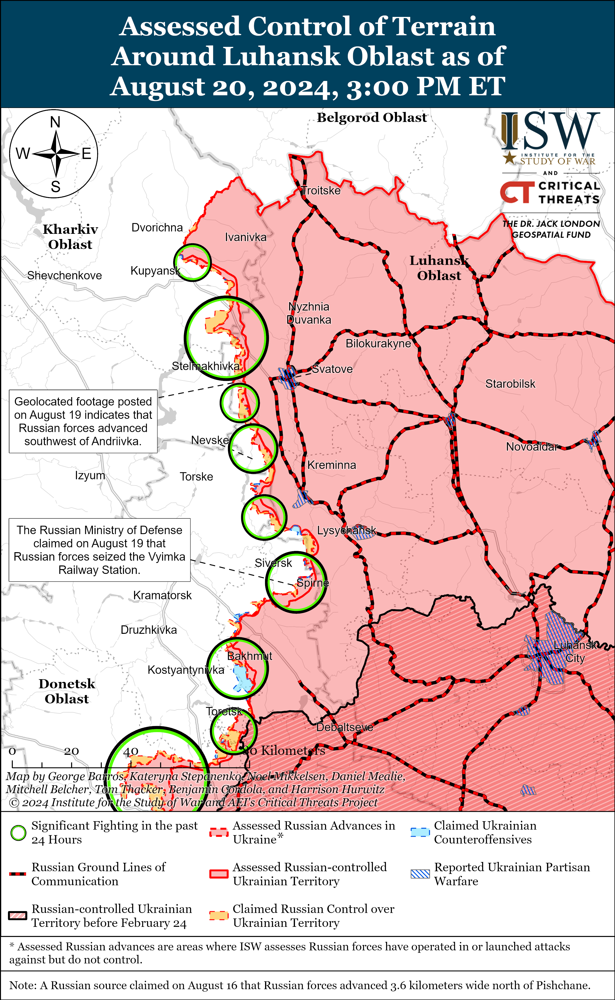](https://understandingwar.org/map/assessed-control-of-terrain-around-luhansk-oblast-as-of-august-20-2024-300-pm-et/)

**Russian Subordinate Main Effort #3 – Donetsk Oblast (Russian objective: Capture the entirety of Donetsk Oblast, the claimed territory of Russia’s proxies in Donbas)**

Russian forces continued ground attacks in the Siversk direction on August 20, but there were no confirmed changes to the frontline. A Russian milblogger claimed that Russian forces advanced south and southeast of Vyimka (southeast of Siversk), but ISW has not observed visual confirmation of this claim.[48] The Ukrainian General Staff reported that Russian forces continued assaults east of Siversk near Verkhnokamyanske; southeast of Siversk near Spirne, Ivano-Darivka, and Vyimka; and south of Siversk near Pereizne on August 19 and 20.[49] Elements of the Russian 106th Airborne (VDV) Division are reportedly operating near Pereizne.[50]

Russian forces continued offensive operations near Chasiv Yar; east of Chasiv Yar near Ivanivske, and southeast of Chasiv Yar near Klishchiivka and Andriivka on August 20, but there were no confirmed changes to the frontline.[51]

[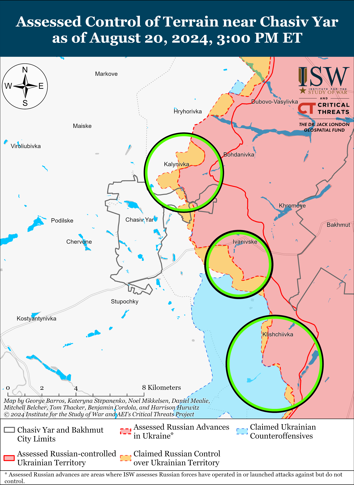](https://understandingwar.org/map/assessed-control-of-terrain-near-chasiv-yar-as-of-august-20-2024-300-pm-et/)

Russian forces advanced east and southeast of Toretsk amid continued offensive operations in the area on August 20. Geolocated footage published on August 20 indicates that Russian forces recently advanced along Tsentralna and Molodizhna streets in northwestern and western Pivnichne (east of Toretsk).[52] Additional geolocated footage published on August 14 and 18 indicates that Russian forces recently advanced in northwestern and western Zalizne (east of Toretsk) and have seized the Artem Mine’s waste heap (on the western outskirts of Zalizne).[53] Ukrainian outlet *Ukrainska Pravda* reported that sources within the leadership of a Ukrainian brigade operating in the Toretsk direction stated that Ukrainian forces still “control” around 20 percent of Niu York, but that Russian forces are advancing in the area.[54] Russian milbloggers reiterated claims that Russian forces cleared Ukrainian forces from Niu York (south of Toretsk), completely seized Niu York, and advanced towards Nelipivka (just north of Niu York and south of Toretsk), although ISW has not observed confirmation of these claims.[55] Elements of the Russian 1st “Slavic” Motorized Rifle Brigade’s (1st Donetsk People’s Republic [DNR] Army Corps [AC]) “Storm” assault unit are reportedly operating within Zalizne.[56]

[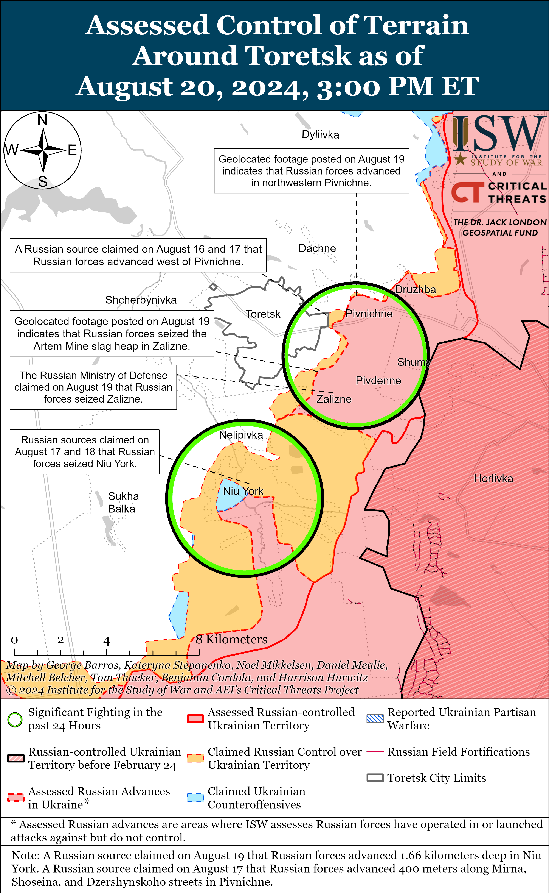](https://understandingwar.org/map/assessed-control-of-terrain-around-toretsk-as-of-august-20-2024-300-pm-et/)

Russian forces recently marginally advanced east of Pokrovsk amid continued offensive operations in the area on August 20. Geolocated footage published on August 20 indicates that Russian forces recently advanced within southeastern Hrodivka (east of Pokrovsk).[57] Russian advances through Hrodivka will likely slow as Russian forces begin to fight through the settlement’s more urban areas, and Russian forces may struggle to maintain their current tempo of advance as they attempt to advance further west to Myrnohrad (just northeast of Pokrovsk) and Pokrovsk, as these towns are larger and more densely urbanized in comparison to the small and mainly rural settlements that Russian forces have seized east of Pokrovsk and west of Avdiivka thus far. The tempo of Russian advances in the area will also depend on how well-manned and equipped the Ukrainian forces defending these towns will be. Russian milbloggers claimed that Russian forces also advanced southeast of Pokrovsk near Marynivka, Mykolaivka, and Komyshivka and towards Novohrodivka, but ISW has not observed visual confirmation of these claims.[58] Russian forces continued offensive operations east of Pokrovsk near Vozdvyzhenka and Mykhailivka and in the direction of Zelene Pole and southeast of Pokrovsk near Kalynivka, Ptyche, and Skuchne on August 19 and 20.[59] Elements of the Russian “Volga” Brigade are reportedly operating near Novohrodivka.[60]

[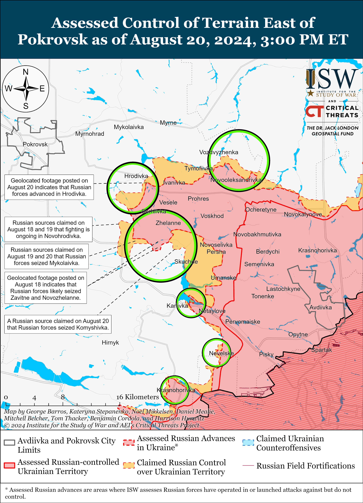](https://understandingwar.org/map/assessed-control-of-terrain-east-of-pokrovsk-as-of-august-20-2024-300-pm-et/)

[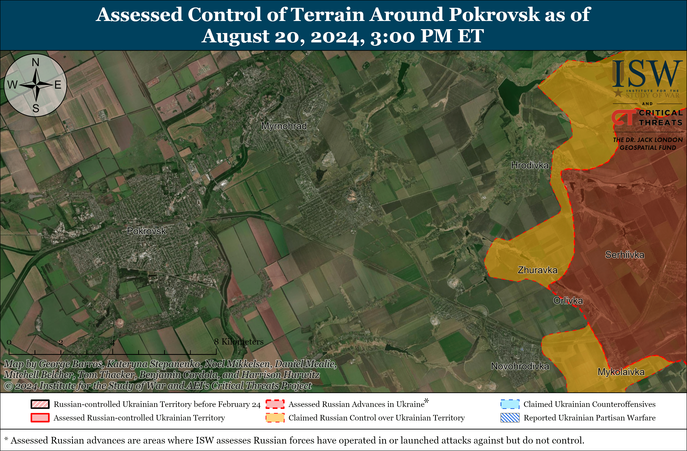](https://understandingwar.org/map/assessed-control-of-terrain-around-pokrovsk-as-of-august-20-2024-300-pm-et/)

Russian forces recently advanced west of Donetsk City amid continued offensive operations in the area on August 20. Geolocated footage published on August 18 indicates that Russian forces recently advanced in northwestern Krasnohorivka.[61] Russian milbloggers claimed that fighting continued in Krasnohorivka on August 20.[62]

Russian forces continued offensive operations southwest of Donetsk City on August 20, but there were no confirmed changes to the frontline. A Russian milblogger claimed that Russian forces advanced near Vodyane.[63] Fighting continued near Kostyantynivka, Solodke, Vodyane, Volodymyrivka, and Vuhledar on August 19 and 20.[64] Elements of the Russian “Kaira” Detachment (39th Motorized Rifle Brigade, 68th Army Corps [AC], Eastern Military District [EMD]) are reportedly operating near Kostyantynivka.[65]

Neither Russian nor Ukrainian sources reported ground attacks in the Donetsk-Zaporizhia Oblast border area on August 20.

[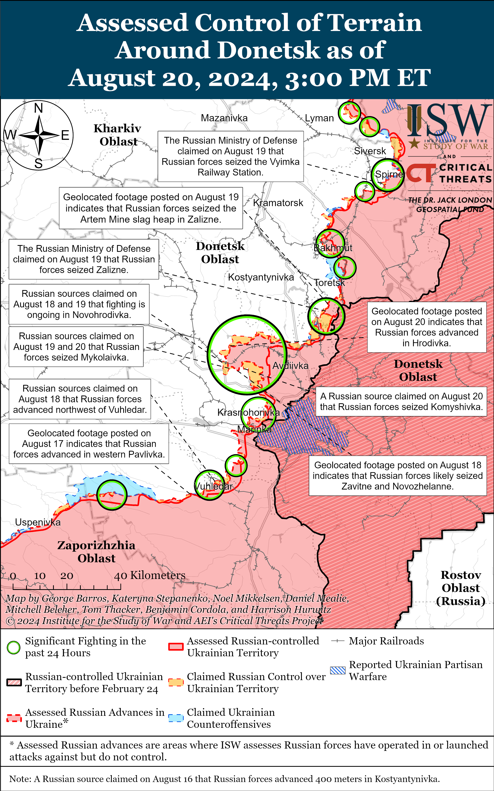](https://understandingwar.org/map/assessed-control-of-terrain-around-donetsk-as-of-august-20-2024-300-pm-et/)

**Russian Supporting Effort – Southern Axis (Russian objective: Maintain frontline positions and secure rear areas against Ukrainian strikes)**

Positional engagements continued in western Zaporizhia Oblast on August 20, but there were no confirmed changes to the frontline. The Ukrainian General Staff reported that Russian forces unsuccessfully attacked north of Robotyne near Novodanylivka on August 20.[66]

[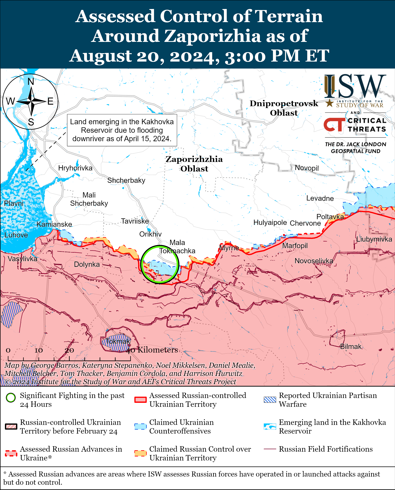](https://understandingwar.org/map/assessed-control-of-terrain-around-zaporizhia-as-of-august-20-2024-300-pm-et/)

The Ukrainian General Staff reported that Russian forces unsuccessfully attacked in the Kherson direction, including in east (left) bank Kherson Oblast and on the Dnipro River delta islands, on August 20.[67] Elements of the Russian 80th Motorized Rifle Brigade (14th Army Corps [AC], Leningrad Military District [LMD], formerly Northern Fleet) and unspecified elements of the Russian 18th Combined Arms Army (CAA) (Southern Military District [SMD]) are reportedly operating in the Kherson direction.[68]

[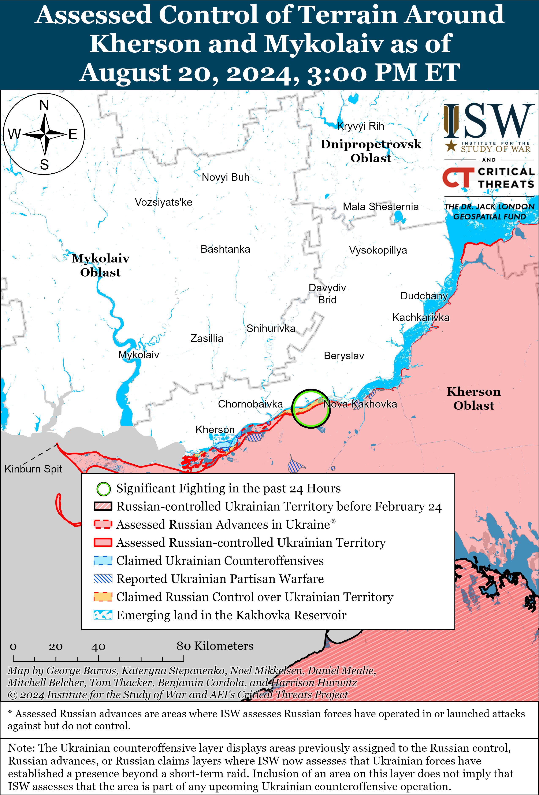](https://understandingwar.org/map/assessed-control-of-terrain-around-kherson-and-mykolaiv-as-of-august-20-2024-300-pm-et/)

Ukrainian Navy Spokesperson Captain Third Rank Dmytro Pletenchuk reported on August 20 that Russian forces are struggling to repair Russian Black Sea Fleet (BSF) ships that Ukrainian strikes have damaged.[69] Pletenchuk stated that Ukrainian forces have prevented Russian forces from effectively using Russia’s main naval repair base in occupied Sevastopol, Crimea, and that it is not logistically viable for Russia to transfer the ships for repair to other naval bases such as Novorossiysk, Krasnodar Krai.[70] Pletenchuk stated that Russian forces are using aviation and drones for reconnaissance on the western and southern coasts of occupied Crimea instead of using damaged surface ships, impairing the BSF’s combat capabilities. Pletenchuk also reported that Russian forces have transferred two small Karakurt-class corvettes equipped with Kalibr cruise missiles from the Black Sea to the Caspian Sea to threaten Ukrainian forces, although Pletenchuk noted that the Kalibr missiles no longer pose the same magnitude of threat to Ukrainian forces as they did at the beginning of the war.[71]

**Russian Air, Missile, and Drone Campaign (Russian Objective: Target Ukrainian military and civilian infrastructure in the rear and on the frontline)**

Russian forces conducted a series of drone and missile strikes against Ukraine on the night of August 19 to 20. Ukrainian Air Force Commander Lieutenant General Mykola Oleshchuk reported on August 20 that Russian forces launched two Iskander-M or North Korean KN-23 ballistic missiles from Voronezh Oblast; one Iskander-K cruise missile from Bryansk Oblast; an unspecified number of Kh-59 cruise missiles from Kursk and occupied Zaporizhia oblasts; and 26 Shahed-136/131 drones from Kursk Oblast and Yeysk and Primorsko-Akhtarsk, Krasnodar Krai.[72] Oleshchuk stated that Ukrainian forces shot down one Iskander-K cruise missile, two Kh-59 cruise missiles, and 25 Shahed-136/131 drones over Kyiv, Dnipropetrovsk, Mykolaiv, Kherson, Vinnytsia, Khmelnytskyi, Kirovohrad, Sumy, and Chernihiv oblasts.[73] Kharkiv Oblast Military Administration Head Oleh Synehubov stated that Russian forces struck civilian infrastructure in Kharkiv Oblast with two Kh-38 air-to-surface missiles and three anti-aircraft missiles.[74] Dnipropetrovsk Oblast Military Administration Head Serhii Lysak reported that Ukrainian forces destroyed two unspecified cruise missiles and two drones over Dnipropetrovsk Oblast.[75] The Ternopil Oblast Military Administration reported that Russian forces also struck an industrial facility and caused a fire at a fuel and lubricant warehouse in Ternopil Oblast on the night of August 19 to 20.[76]

**Russian Mobilization and Force Generation Efforts (Russian objective: Expand combat power without conducting general mobilization)**

Russian federal subjects (regions) continue to increase monetary incentives for signing Russian military contracts in order to bolster Russia’s force generation efforts. Russian opposition outlet *Idel Realii*stated on August 19 that the Mari El Republic increased one-time payments to Russian contract soldiers (*kontraktniki*) to one million rubles (about $10,970).[77] Russian opposition outlet *7×7 – Horizontal Russia*stated that 36 Russian federal subjects have increased their one-time payments to *kontrakniki* in 2024 and that 11 federal subjects – Stavropol and Krasnodar krais; Moscow, Leningrad, Rostov, and Volgograd oblasts; the Adygea, Karachay-Cherkassia, Kabardino-Balkarian, and Tatarstan republics; and the Yamalo-Nenets Autonomous Okrug – are paying Russian *kontraktniki* one million rubles or more.[78]

Russian military authorities reportedly continue to physically abuse injured Russian servicemembers and forcibly redeploy them to Ukraine. Russian opposition media reported on August 20 that military authorities are holding and physically abusing wounded mobilized personnel at the headquarters of the 272nd Motorized Rifle Regiment (47th Tank Division, 1st Guards Tank Army [GTA], Moscow Military District [MMD]) in Nizhny Novgorod Oblast before sending them back to fight in Ukraine without medical treatment.[79] Russian medical, legal, and investigative authorities are reportedly aware of these incidents but not taking any action. Russian milbloggers have recently complained that the Russian Ministry of Defense (MoD) is providing inadequate medical care to injured soldiers and improperly returning injured personnel to service, including fighting on the frontline.[80]

**Russian Technological Adaptations (Russian objective: Introduce technological innovations to optimize systems for use in Ukraine)**

Russian state-owned defense conglomerate Rostec claimed on August 20 that it has tested a modified Pantsir-SM-SV air defense system in combat.[81] The modified Pantsir reportedly includes two types of air defense missiles with an increased range and a new tracked chassis that can traverse snow and off-road conditions.

**Ukrainian Defense Industrial Efforts (Ukrainian objective: Develop its defense industrial base to become more self-sufficient in cooperation with US, European, and international partners)**

*ISW is suspending publishing coverage of Ukrainian defense industrial efforts until further notice.*

**Activities in Russian-occupied areas (Russian objective: Consolidate administrative control of annexed areas; forcibly integrate Ukrainian citizens into Russian sociocultural, economic, military, and governance systems)**

*ISW is not publishing coverage of activities in Russian-occupied areas today.*

**Russian Information Operations and Narratives**

Russian officials and commentators continue to deliberately misrepresent Ukraine’s legitimate efforts to guard against the influence of the Kremlin-controlled Russian Orthodox Church (ROC) as Ukraine persecuting religious minorities. The Ukrainian Verkhovna Rada adopted a draft law on August 20 that prohibits the activities of any religious organizations affiliated with the ROC and gives ROC-controlled Ukrainian Orthodox Church Moscow Patriarchate (UOC MP) parishes nine months to officially sever ties with the ROC.[82] This draft law is intended to secure Ukraine’s “spiritual independence” and protect against the influence of the UOC MP, which Ukrainian officials recognize as an “integral part” of the Kremlin’s regime and efforts to control Ukraine.[83] ISW has reported at length on the links between the ROC’s spiritual doctrine and the Kremlin’s pro-war ideology and has observed that the UOC MP is not an independent religious organization but an extension of the Kremlin and a tool of Russian hybrid warfare that seeks to enforce Russian ideologies in Ukrainian society and persecute religious minorities in occupied Ukraine.[84] Russian and ROC officials responded to the August 20 Verkhovna Rada bill, however, by accusing Ukraine of “destroying” Orthodoxy and violating religious freedoms—echoing several long-standing Russian narratives that seek to weaponize religion in an effort to discredit the Ukrainian government both domestically and abroad.[85] The Ecumenical Patriarch of Constantinople granted the Autocephalous (independent) Orthodox Church of Ukraine (OCU) independence from the Moscow Patriarchate in 2019, and the OCU is not related to the UOC MP.[86]

**Significant activity in Belarus (Russian efforts to increase its military presence in Belarus and further integrate Belarus into Russian-favorable frameworks and Wagner Group activity in Belarus)**

Nothing significant to report.

**Note: ISW does not receive any classified material from any source, uses only publicly available information, and draws extensively on Russian, Ukrainian, and Western reporting and social media as well as commercially available satellite imagery and other geospatial data as the basis for these reports. References to all sources used are provided in the endnotes of each update.**

---

[1] https://t.me/ssternenko/32614; https://x.com/DefMon3/status/1825816985122283619; https://x.com/DefMon3/status/1825817942056943993; https://x.com/kromark/status/1825637544408789053; https://x.com/kromark/status/1825824102168269299; https://x.com/kromark/status/1825856628505325878; https://t.me/radiosvoboda/66822

[2] https://x.com/GirkinGirkin/status/1825787369854824875; https://t.me/motopatriot/26354; ttps://t.me/motopatriot/26391; https://t.me/mod\_russia/42342; https://isw.pub/UkrWar081924

[3] https://x.com/99Dominik\_/status/1825615246792282466; https://t.me/control\_sigma/33632; https://x.com/AF\_LABS1/status/1825735661711753358; https://t.me/warriorofnorth/2200 ; https://t.me/creamy\_caprice/6434

[4] https://t.me/dva\_majors/50245; https://t.me/warhistoryalconafter/180403; https://t.me/rybar/62924; https://t.me/motopatriot/26374; https://t.me/DnevnikDesantnika/14270

[5] https://t.me/rybar/62924; https://t.me/motopatriot/26379

[6] https://t.me/creamy\_caprice/6436; https://t.me/warriorofnorth/2203; https://t.me/rybar/62924

[7] https://t.me/rybar/62924

[8] https://x.com/99Dominik\_/status/1825785409541980308; https://x.com/markito0171/status/1825782353362395257

[9] https://glavcom dot ua/img/forall/u/264/58/image\_2024-08-20\_18-53-33.png; https://www.rbc dot ua/rus/news/sirskiy-pokazav-kartu-operatsiyi-zsu-kurskiy-1724173262.html; https://t.me/RBC\_ua\_news/107602

[10] https://x.com/bayraktar\_1love/status/1825914398814200302?s=46&t=\_XWt9fOAD77gQx8flqZr2A; https://glavcom dot ua/img/forall/u/264/58/image\_2024-08-20\_18-53-33.png

[11] https://isw.pub/UkrWar081324

[12] https://glavcom.ua/img/forall/u/264/58/image\_2024-08-20\_18-53-33.png

[13] https://suspilne dot media/817883-sirskij-zsu-kontroluut-93-naseleni-punkti-rosia-vede-manevrovu-oboronu/

[14] https://suspilne dot media/817883-sirskij-zsu-kontroluut-93-naseleni-punkti-rosia-vede-manevrovu-oboronu/

[15] https://www.president dot gov.ua/news/vid-nashoyi-spilnoyi-roboti-zalezhit-yaka-zbroya-v-rukah-u-n-92669

[16]https://www.facebook.com/GeneralStaff.ua/posts/pfbid02A8XunLNtdh1NhmryzzYxvDPX3zEergzxHkU3A7Yt6kG4rF7dBwSevL3PrJVBusQGl

[17] https://armyinform dot com.ua/2024/08/19/v-uryadi-rozpovily-pro-dotrymannya-norm-mizhnarodnogo-gumanitarnogo-prava-v-kurskij-oblasti/

[18] https://t.me/tass\_agency/267383 ; https://t.me/tass\_agency/267382

[19] https://isw.pub/UkrWar051824

[20] https://t.me/tass\_agency/267382

[21] https://t.me/tass\_agency/267385 ; https://crimea.ria dot ru/20240820/minoborony-soobschilo-o-sozdanii-gruppirovok-belgorod-bryansk-i-kursk-1139743462.html

[22] https://t.me/tass\_agency/267382

[23] https://t.me/mod\_russia/42384

[24] https://understandingwar.org/backgrounder/russian-offensive-campaign-assessment-august-15-2024 ; https://isw.pub/UkrWar081224

[25] https://understandingwar.org/backgrounder/russian-offensive-campaign-assessment-july-29-2024 ; https://understandingwar.org/backgrounder/russian-offensive-campaign-assessment-july-8-2024 ; https://t.me/rusich\_army/16651 ; https://t.me/rusich\_army/16640

[26] https://isw.pub/UkrWar081324

[27] https://understandingwar.org/backgrounder/russian-offensive-campaign-assessment-august-15-2024 ; https://isw.pub/UkrWar081324

[28] https://x.com/666\_mancer/status/1825865108486082585 ; https://dobrraion dot ru/news/37631/ ; https://understandingwar.org/backgrounder/russian-offensive-campaign-assessment-july-17-2024

[29] https://t.me/ButusovPlus/12890

[30] https://isw.pub/UkrWar081324 ; https://isw.pub/UkrWar080824 ; https://isw.pub/UkrWar080924 ; https://isw.pub/UkrWar081024 ; https://isw.pub/UkrWar081124

[31] http://www.kremlin dot ru/events/president/news/74896http://www.kremlin.ru/events/president/news/74896

[32] http://www.kremlin dot ru/events/president/news/74897; https://t.me/tass\_agency/267338 ; https://meduza dot io/feature/2024/08/20/kreml-opublikoval-video-vstrechi-putina-s-materyami-beslana-pervoy-za-19-let

[33] https://www.britannica.com/event/Beslan-school-attack; https://www.coe.int/en/web/impact-convention-human-rights/-/court-win-for-victims-of-the-beslan-school-terrorism-attack

[34] https://www.coe dot int/en/web/impact-convention-human-rights/-/court-win-for-victims-of-the-beslan-school-terrorism-attack

[35] http://kremlin dot ru/events/president/news/74901

[36] http://kremlin dot ru/events/president/news/74901; https://isw.pub/UkrWar081024; https://isw.pub/UkrWar081924

[37] https://t.me/agentstvonews/7039

[38] https://t.me/agentstvonews/7040

[39] https://www.svoboda dot org/a/na-vstreche-s-materyami-beslana-putin-zanizil-chislo-pogibshih-detey/33086155.html

[40] https://isw.pub/UkrWar020324; https://understandingwar.org/backgrounder/russian-offensive-campaign-assessment-august-10-2024

[41] https://t.me/DnevnikDesantnika/14251

[42] https://t.me/otukharkiv/820

[43] https://www.facebook.com/GeneralStaff.ua/posts/pfbid0eooeoRXiyXUaeDV5dQ8H8K3LJrdNatNNA3svkffqCDWsxymwGZdhpphXVf4FnXwBl; https://www.facebook.com/GeneralStaff.ua/posts/pfbid02A8XunLNtdh1NhmryzzYxvDPX3zEergzxHkU3A7Yt6kG4rF7dBwSevL3PrJVBusQGl; https://t.me/wargonzo/21657; https://t.me/DnevnikDesantnika/14276; https://t.me/DnevnikDesantnika/14251

[44] https://t.me/otukharkiv/820; https://t.me/voin\_dv/10364

[45] https://t.me/DnevnikDesantnika/14285

[46] https://t.me/notes\_veterans/19027

[47] https://www.facebook.com/GeneralStaff.ua/posts/pfbid0eooeoRXiyXUaeDV5dQ8H8K3LJrdNatNNA3svkffqCDWsxymwGZdhpphXVf4FnXwBl ; https://www.facebook.com/GeneralStaff.ua/posts/pfbid02A8XunLNtdh1NhmryzzYxvDPX3zEergzxHkU3A7Yt6kG4rF7dBwSevL3PrJVBusQGl ; https://www.facebook.com/GeneralStaff.ua/posts/pfbid0TzHPmfBciuxjtoNaxPiK9EptHiJJQRdULBretvLBAcZ9cGXCS7zTgcohNJbqaJjQl

[48] https://t.me/motopatriot/26365 ; https://t.me/motopatriot/26414

[49] https://www.facebook.com/GeneralStaff.ua/posts/pfbid0eooeoRXiyXUaeDV5dQ8H8K3LJrdNatNNA3svkffqCDWsxymwGZdhpphXVf4FnXwBl ; https://www.facebook.com/GeneralStaff.ua/posts/pfbid02A8XunLNtdh1NhmryzzYxvDPX3zEergzxHkU3A7Yt6kG4rF7dBwSevL3PrJVBusQGl ; https://www.facebook.com/GeneralStaff.ua/posts/pfbid0TzHPmfBciuxjtoNaxPiK9EptHiJJQRdULBretvLBAcZ9cGXCS7zTgcohNJbqaJjQl

[50] https://t.me/boris\_rozhin/134261

[51] https://www.facebook.com/GeneralStaff.ua/posts/pfbid0eooeoRXiyXUaeDV5dQ8H8K3LJrdNatNNA3svkffqCDWsxymwGZdhpphXVf4FnXwBl ; https://www.facebook.com/GeneralStaff.ua/posts/pfbid02A8XunLNtdh1NhmryzzYxvDPX3zEergzxHkU3A7Yt6kG4rF7dBwSevL3PrJVBusQGl ; https://www.facebook.com/GeneralStaff.ua/posts/pfbid0TzHPmfBciuxjtoNaxPiK9EptHiJJQRdULBretvLBAcZ9cGXCS7zTgcohNJbqaJjQl ; https://t.me/DnevnikDesantnika/14284

[52] https://t.me/creamy\_caprice/6451; https://t.me/liut\_npu/476 ;

[53] https://t.me/creamy\_caprice/6445; https://t.me/voron1OO/52 ; https://t.me/creamy\_caprice/6441; https://t.me/ZSU\_32\_OMBR/102 ; https://x.com/klinger66/status/1825680278645334047; https://t.me/Kalashmat\_DNR/2837 ; [Note: the following geolocation is incorrect but is part of an analytical exchange regarding a factual geolocation: https://x.com/GNovosibir79446/status/1825225562597814534]

[54] https://www.pravda dot com.ua/rus/news/2024/08/20/7471074/

[55] https://t.me/mod\_russia/42376 ; https://t.me/tass\_agency/267321 ; https://t.me/tass\_agency/267283 ; https://t.me/z\_arhiv/27706 ; https://t.me/dva\_majors/50195 ; https://t.me/wargonzo/21657 ; https://t.me/RVvoenkor/75213 ; https://t.me/boris\_rozhin/134280 ; https://t.me/sashakots/48497 ; https://t.me/epoddubny/20762 ; https://t.me/DnevnikDesantnika/14286

[56] https://x.com/GNovosibir79446/status/1825225562597814534; https://x.com/klinger66/status/1825680278645334047; https://t.me/Kalashmat\_DNR/2837

[57] https://t.me/creamy\_caprice/6440; https://www.facebook.com/151OMBr/videos/1211157619925940

[58] https://t.me/wargonzo/21657 ; https://t.me/z\_arhiv/27704 ; https://t.me/motopatriot/26367 ; https://t.me/motopatriot/26384 ; https://t.me/motopatriot/26397 ; https://t.me/voenkorKotenok/58361 ; https://t.me/dva\_majors/50195

[59] https://www.facebook.com/GeneralStaff.ua/posts/pfbid0eooeoRXiyXUaeDV5dQ8H8K3LJrdNatNNA3svkffqCDWsxymwGZdhpphXVf4FnXwBl ; https://www.facebook.com/GeneralStaff.ua/posts/pfbid02A8XunLNtdh1NhmryzzYxvDPX3zEergzxHkU3A7Yt6kG4rF7dBwSevL3PrJVBusQGl ; https://www.facebook.com/GeneralStaff.ua/posts/pfbid0TzHPmfBciuxjtoNaxPiK9EptHiJJQRdULBretvLBAcZ9cGXCS7zTgcohNJbqaJjQl

[60] https://t.me/RVvoenkor/75221 ; https://t.me/motopatriot/26384

[61] https://t.me/creamy\_caprice/6442; https://t.me/ssternenko/32555; https://x.com/AudaxonX/status/1825848319093981381

[62] https://t.me/wargonzo/21657 ; https://t.me/voenkorKotenok/58361

[63] https://t.me/voin\_dv/10367

[64] https://t.me/dva\_majors/50195 ; https://t.me/wargonzo/21657 ; https://www.facebook.com/GeneralStaff.ua/posts/pfbid02A8XunLNtdh1NhmryzzYxvDPX3zEergzxHkU3A7Yt6kG4rF7dBwSevL3PrJVBusQGl ; https://www.facebook.com/GeneralStaff.ua/posts/pfbid0TzHPmfBciuxjtoNaxPiK9EptHiJJQRdULBretvLBAcZ9cGXCS7zTgcohNJbqaJjQl

[65] https://t.me/boris\_rozhin/134327

[66]https://www.facebook.com/GeneralStaff.ua/posts/pfbid0eooeoRXiyXUaeDV5dQ8H8K3LJrdNatNNA3svkffqCDWsxymwGZdhpphXVf4FnXwBl

[67]https://www.facebook.com/GeneralStaff.ua/posts/pfbid0TzHPmfBciuxjtoNaxPiK9EptHiJJQRdULBretvLBAcZ9cGXCS7zTgcohNJbqaJjQl; https://www.facebook.com/GeneralStaff.ua/posts/pfbid02A8XunLNtdh1NhmryzzYxvDPX3zEergzxHkU3A7Yt6kG4rF7dBwSevL3PrJVBusQGl; https://www.facebook.com/GeneralStaff.ua/posts/pfbid0eooeoRXiyXUaeDV5dQ8H8K3LJrdNatNNA3svkffqCDWsxymwGZdhpphXVf4FnXwBl

[68] https://t.me/mod\_russia/42366; https://t.me/voin\_dv/10360

[69] https://armyinform.com dot ua/2024/08/20/smerty-podobno-dlya-rosijskogo-flotu-povertatysya-v-krym-dmytro-pletenchuk/

[70] https://armyinform.com dot ua/2024/08/20/smerty-podobno-dlya-rosijskogo-flotu-povertatysya-v-krym-dmytro-pletenchuk/ ; https://armyinform.com dot ua/2024/08/20/remontni-potuzhnosti-v-krymu-praktychno-nedostupni-dlya-rosijskogo-flotu/ ; https://armyinform.com dot ua/2024/08/20/u-chornomu-mori-rosijski-korabli-zaraz-ye-lyshe-na-dni-vms-zsu/

[71] https://armyinform.com dot ua/2024/08/20/chy-zmozhut-rosijski-korabli-zapuskaty-kalibry-z-kaspiyu-rozpovily-u-vms-zsu/

[72] https://t.me/ComAFUA/390; https://t.me/kpszsu/18009

[73] https://t.me/ComAFUA/390

[74] https://t.me/synegubov/10753

[75] https://t.me/dnipropetrovskaODA/15355

[76] https://t.me/ternopilskaODA/8244; https://suspilne dot media/ternopil/817167-u-ternopoli-pid-cas-nicnoi-trivogi-stalasa-pozeza-so-vidomo/ ; https://t.me/dsns\_telegram/31364

[77] https://t.me/idelrealii/37098 ; https://t.me/marireporter/2975

[78] https://t.me/horizontal\_russia/38683

[79] https://t.me/mobilizationnews/19880; https://t.me/astrapress/62288

[80] https://understandingwar.org/backgrounder/russian-offensive-campaign-assessment-july-11-2024 ; https://understandingwar.org/backgrounder/russian-offensive-campaign-assessment-july-5-2024; https://understandingwar.org/backgrounder/russian-offensive-campaign-assessment-july-2-2024; https://understandingwar.org/backgrounder/russian-offensive-campaign-assessment-june-30-2024; https://understandingwar.org/backgrounder/russian-offensive-campaign-assessment-june-23-2024; https://understandingwar.org/backgrounder/russian-offensive-campaign-assessment-august-5-2024 ; https://understandingwar.org/backgrounder/russian-offensive-campaign-assessment-july-26-2024

[81] https://tass dot ru/armiya-i-opk/21641211

[82] https://interfax.com dot ua/news/general/1008193.html; https://t.me/yzheleznyak/9629

[83] https://t.me/V\_Zelenskiy\_official/11394; https://t.me/otukharkiv/837

[84] https://understandingwar.org/backgrounder/ukraine-conflicts-updates-january-2-may-31-2024; https://understandingwar.org/backgrounder/russian-offensive-campaign-assessment-april-9-2023; https://isw.pub/UkrWar031423; https://isw.pub/UkrWar112823; https://isw.pub/UkrWar042823

[85] https://t.me/tass\_agency/267307 ; https://t.me/tass\_agency/267325; https://t.me/tass\_agency/267343 ; https://t.me/vladimirlegoyda/8165 ; https://rg dot ru/2024/08/20/rpc-reshenie-o-zaprete-kanonicheskoj-upc-privedet-k-massovomu-nasiliiu-na-ukraine.html ; https://t.me/tass\_agency/267366; https://t.me/tass\_agency/267369; https://t.me/tass\_agency/267345 ; https://t.me/tass\_agency/267394; https://isw.pub/UkrWar031423; https://isw.pub/UkrWar011423; https://t.me/tass\_agency/267414

[86] https://understandingwar.org/backgrounder/russian-offensive-campaign-assessment-april-9-2023
