# Russian Offensive Campaign Assessment, August 21, 2024

**Angelica Evans, Karolina Hird, Nicole Wolkov, Kateryna Stepanenko, and George Barros**

**August 21, 2024, 8:40pm ET**

**Click** [**here**](https://storymaps.arcgis.com/stories/36a7f6a6f5a9448496de641cf64bd375) **to see ISW’s interactive map of the Russian invasion of Ukraine. This map is updated daily alongside the static maps present in this report.**

**Click** [**here**](https://understandingwar.maps.arcgis.com/apps/instant/3dviewer/index.html?appid=1602762dbcde419bb957dea358449580) **to see ISW’s 3D control of terrain topographic map of Ukraine. Use of a computer (not a mobile device) is strongly recommended for using this data-heavy tool.**

**Click** [**here**](https://storymaps.arcgis.com/stories/733fe90805894bfc8562d90b106aa895) **to access ISW’s archive of interactive time-lapse maps of the Russian invasion of Ukraine. These maps complement the static control-of-terrain map that ISW produces daily by showing a dynamic frontline. ISW will update this time-lapse map archive monthly.**

**Note: The data cut-off for this product was 1pm ET on August 21. ISW will cover subsequent reports in the August 22 Russian Offensive Campaign Assessment.**

**The Kremlin appears to have launched an intricate messaging campaign aimed at justifying to its domestic audience why Russia is prioritizing maintaining the initiative in eastern Ukraine over immediately expelling Ukrainian forces from Kursk Oblast.** Russian government sources close to the Russian Presidential Administration told Russian independent outlet *Meduza* that the Kremlin is actively trying to condition Russian society to accept the limited Ukrainian presence in Kursk Oblast as a “new normal” and downplay the significance of the incursion.[1] The sources noted that the Kremlin will use propaganda to encourage Russians to wait for Russian forces to retake these territories after an “inevitable” Ukrainian defeat in eastern Ukraine. The sources also added that the Kremlin is redirecting Russians’ concerns over Kursk Oblast by preoccupying domestic society with humanitarian assistance drives to assist the affected residents of Kursk Oblast and noted that the Kremlin decided against canceling the upcoming Kursk Oblast gubernatorial elections scheduled for September to minimize panic in the region.[2] The Russian Central Election Commission, however, decided to postpone local elections in the seven raions in Kursk Oblast that are impacted by the Ukrainian incursion due to security risks, and the Kremlin may have decided to maintain gubernatorial elections as scheduled to replace the interim Kursk Oblast Governor Alexei Smirnov, who has overseen much of the local Russian response to the incursion.[3] *Meduza* also highlighted Russian state media’s coverage of the incursion, which began increasingly portraying Kursk Oblast and its residents as supporting the Russian war effort in Ukraine, despite encountering some mild wartime disruptions to residents’ ordinary lives.[4] The Kremlin may be also attempting to weaponize state media’s coverage of its months-long offensive in eastern Ukraine to advance its messaging campaign about the incursion. Russian state TV channels are notably covering Ukraine’s incursion in Kursk Oblast as a limited operation, while actively contrasting it with Russian advances in the Pokrovsk direction, which Russian media is painting as major victories.[5]

**The Kremlin may be using this messaging campaign to afford itself time and space to respond to the Ukrainian incursion into Kursk Oblast *after* achieving its offensive objectives in eastern Ukraine.** Russian government sources told *Meduza* that the Kremlin was initially shocked and worried about Ukraine’s incursion into Kursk Oblast but calmed down within a week because Ukrainian forces’ advances were far from more densely populated regional centers such as Kursk City.[6] *Meduza* reported that all interviewed officials expressed confidence that battles in Kursk Oblast will continue at their current scale for months, indicating that the Kremlin may not be rushing to repel Ukrainian forces from the region and will instead continue to prioritize its offensive operations in eastern Ukraine. A Ukrainian source in the military-political leadership, on the contrary, told Ukrainian news wire *RBC-Ukraine* that Putin tasked Russian forces with repelling Ukrainian forces from Kursk Oblast by October 1 without re-deploying forces from key frontlines areas – namely from the Pokrovsk and Toretsk directions. ISW previously assessed that Russian President Vladimir Putin and Russian military command likely view maintaining the theater-wide initiative as a strategic imperative to win the war of attrition against Ukraine and are continuing to prioritize the Russian offensive operations in eastern Ukraine.[7] Putin’s reported October 1 deadline assumes a long time for Russia’s territorial integrity to have been contested given that the incursion began on August 6th. Such a protracted occupation of Russian territory undermines the Kremlin’s longstanding narratives about why Russia is at war in the first place; the Kremlin had been justifying its war in Ukraine as a defensive war that aims to protect Russian sovereignty and territorial integrity.[8] The Kremlin’s relaxed approach to the temporal aspect implies that the Kremlin has decided to prioritize tactical advances in Ukraine over rapidly restoring Russia’s territorial integrity in Kursk, and this apparent decision undermines a series of long-standing narratives about Russian “red lines.”

**Putin notably appears to be demanding that Russia defeat Ukraine’s incursion into Kursk Oblast without sacrificing the stability of his regime, deprioritizing the offensive in eastern Ukraine, or firing his incompetent but loyal lieutenants. The results of such a strategy are too early to forecast.** *Meduza’s* sources also noted that the Kremlin also considered the need for a new mobilization wave at the start of the incursion, but that the Russian Cabinet of Ministers and Kremlin-affiliated businessmen immediately opposed general mobilization due to ongoing labor shortages in Russia — although it is unclear whether Kremlin even considered this argument.[9] *Meduza’s* sources assessed that the Kremlin is much more likely to double down on the use of conscripts in Kursk Oblast, which if true, would mark another example of Putin making unrealistic demands of the Russian military command without providing the command appropriate manpower and resources to achieve its objectives. ISW has repeatedly assessed that Putin has neglected the need to declare general mobilization throughout the course of Russia’s full-scale invasion of Ukraine out of concern for his regime’s stability on numerous occasions, and his recent decision to announce a counterterrorism operation in Kursk Oblast (as opposed to declaring war or mobilization) may indicate that he is not prepared to respond to the incursion with mobilization at this time.[10] *Meduza’s* sources also observed that there are currently no rumors within the Kremlin about the removal of Russian Chief of the General Staff Army General Valery Gerasimov due to his ongoing involvement in the Russian offensive in Donbas or the ongoing crisis in Kursk Oblast. The sources noted that the Kremlin might need to appoint a scapegoat for the incursion in the future but is not currently considering placing Gerasimov in that position. ISW cannot independently verify these reports, but they appear to be consistent with ISW’s assessments about the Kremlin’s prioritization of the offensive in eastern Ukraine and Putin’s, inability to dynamically adjust objectives, and his aversion to taking risks.[11] The Kremlin’s reported approach to command changes appears to be consistent with Putin’s observed pattern of withholding command changes until he is no longer actively facing a crisis.[12]

**Ukrainian forces continued offensive operations throughout the Kursk Oblast salient on August 21 and have made additional marginal advances.** Ukraine’s Special Operations Forces posted footage on August 21 showing Ukrainian strikes on several pontoon bridges and staging areas along the Seim River in Glushkovsky Raion, west of the current Ukrainian salient in Kursk Oblast.[13] The Ukrainian Special Operations Forces suggested that Ukrainian forces may have used HIMARS in some of the strikes against pontoon bridges, while milbloggers speculated that Ukrainian forces used air-launched small-diameter glide bombs.[14] Geolocated footage published on August 21 shows drone operators of Russia’s 155th Naval Infantry Brigade (Pacific Fleet, Eastern Military District [EMD]) striking Ukrainian forces in and around Vishnevka (south of Koreveno and 14km from the international border), confirming that Ukrainian forces have likely advanced into and beyond the settlement.[15] A Russian milblogger claimed that a reinforced platoon-sized Ukrainian element unsuccessfully attacked from Vishnevka towards Komarovka (southwest of Koreveno and 12km from the international border), but that Russian drone strikes and anti-tank guided missile (ATGM) fire stopped Ukrainian forces from establishing positions within Komarovka.[16] Another Russian milblogger claimed that Ukrainian forces conducted a platoon-sized mechanized attack towards Korenevo but were unsuccessful.[17] Additional geolocated footage published on August 21 indicates that Ukrainian forces hold positions in forest areas east of Aleksandrovka (northeast of Koreveno and 33km from the international border).[18] Geolocated footage published on August 21 also shows that elements of the Russian 200th Guards Motorized Rifle Brigade (14th Army Corps, Leningrad Military District [LMD]) hold positions along the 38H-564 road east of Zhuravli (east of Koreveno and 21km from the international border), indicating that Russian forces either recently retook these positions or that Ukrainian forces have not yet closed the small salient along the 38H-564 road near Zhuravli.[19] Russian milbloggers continued to claim that Ukrainian forces are advancing north of Sudzha near Malaya Loknya and are encircling Russian forces in Martynovka (northeast of Sudzha and 19km from the international border).[20] Elements of the Russian 810th Naval Infantry Brigade (Black Sea Fleet) are reportedly facing encirclement in Martynovka, and Russian milbloggers lauded a soldier from the Russian 11th Airborne (VDV) Brigade for allegedly leading conscripts out of an encirclement in an unspecified area in Kursk Oblast, potentially in reference to the Martynovka pocket.[21] Geolocated footage published on August 21 indicates that Ukrainian forces have advanced into southern Russkaya Konopelka (east of Sudzha and 12km from the international border).[22] The Russian 810th Naval Infantry Brigade appears to be deployed particularly sporadically throughout the Kursk Oblast salient — various Russian sources have reported that its elements are operating as far north as the Kauchuk area (30km from the international border) and between Martynovka and Spalnoye (southeast of Sudzha and 45km away from Kauchuk).[23]

[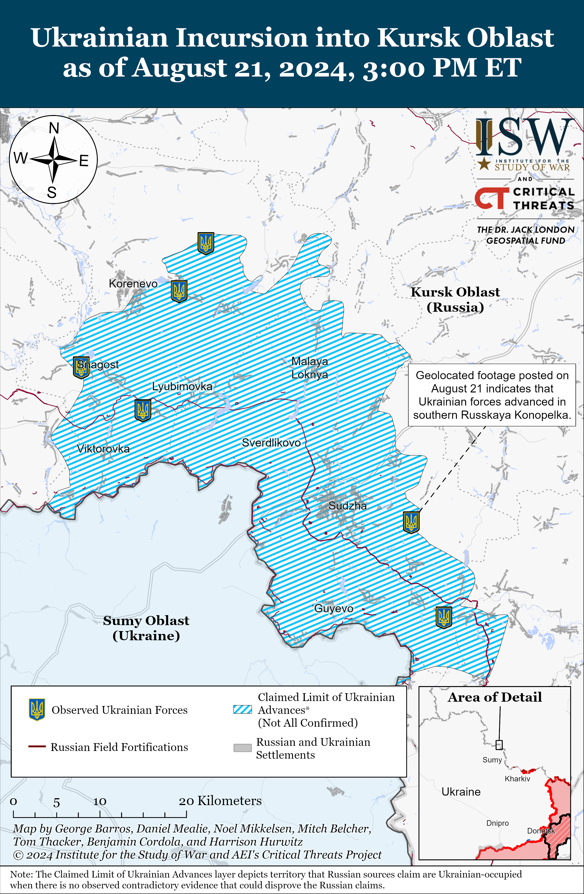](https://understandingwar.org/map/ukrainian-incursion-inot-kursk-oblast-as-of-august-21-2024-300-pm-est/)

**Russian President Vladimir Putin visited the Republic of Chechnya for the first time in 13 years on August 20, likely in an effort to shift domestic focus away from the Ukrainian incursion into Kursk Oblast and posture normalcy and stability.** Putin met with Chechen Republic Head Ramzan Kadyrov in Grozny, Chechnya, and praised Kadyrov for his socio-economic development programs.[24] Kadyrov claimed that Chechnya has sent 47,000 military personnel to Ukraine since the start of the full-scale invasion, including 19,000 volunteers who trained at the Spetsnaz University in Gudermes, Chechnya. Kadyrov also claimed that Chechnya has “several tens of thousands” of trained and equipped military personnel in reserve. Putin visited Spetsnaz University, which trains military personnel from across Russia and spoke to a group of military commanders, instructors, and volunteers. Putin claimed that all Russians — no matter their ethnicity or religious affiliations — are united by their morals, ethics, love for the Fatherland, respect for elders, respect for Russia’s history, and faith in Russia’s future.[25] Putin also ostentatiously kissed a Quran to demonstrate his purported respect for the Islamic faith and the people of Chechnya. Putin consistently attempts to portray Russia as a harmonious multi-ethnic and multi-religious country despite growing xenophobia against migrants and ethnic and religious minorities[26] Putin additionally emphasized Russian soldiers’ alleged heroism for putting themselves at risk to protect Russia by fighting in Ukraine.[27] Putin also may have intended to use his visit to Chechnya to commend Chechen leaders for dedicating forces to the defensive effort in Kursk Oblast and address concerns about the reportedly significant number of Chechen military personnel that Ukrainian forces have taken as prisoners of war in Kursk Oblast.[28]

**Recent US intelligence assessments highlight Ukraine’s efforts to develop alternative and asymmetric capabilities in the face of Russian manpower and materiel advantages, as well as Ukraine’s continued dependence on Western security assistance.** The US Department of Defense (DoD) Inspector General’s Office published a series of assessments by the Defense Intelligence Agency (DIA) in the DoD’s quarterly review of US military assistance to Ukraine on August 15.[29] DIA’s assessments largely cohere with trends and phenomena observable in the open source, although it is unclear what conclusions policymakers should draw from DIA’s assessments given that some of these assessments assume that certain battlefield conditions are totally static, whereas ISW assesses the same conditions to be in flux.

The DIA assesses that recent US military assistance to Ukraine will “almost certainly” be insufficient in helping Ukraine match or overcome Russia’s artillery advantage in Ukraine and the estimated Russian daily fire rate of 10,000 artillery rounds.[30] Ukrainian servicemembers have consistently expressed concern about Ukrainian artillery shortages following significant delays in US aid in Winter 2023–2024 and Spring 2024, and Ukrainian officials have previously acknowledged the impact of artillery constraints on Ukraine’s defensive and offensive capabilities, particularly in Donetsk Oblast.[31] Destructive Russian shelling and glide bomb strikes appear to be a fundamental aspect of the Kremlin’s theory of victory in Ukraine, which posits that Russian forces can continue slow, grinding advances aided by razing Ukrainian settlements to the ground regardless of Russian manpower losses and premised on the assumption that Russian forces can deprive Ukraine of the ability to contest the theater-wide initiative in perpetuity.[32] Ukrainian forces have, on the contrary, demonstrated their commitment and ability to develop and employ alternative and asymmetric capabilities, namely drones and long-range strikes, to partially counter Russia’s artillery advantage in Ukraine and to defend against Russian mechanized and infantry assaults, often to outsized effect compared to the smaller-scale systems Ukrainian forces are employing. Ukrainian forces successfully defended against a series of large-scale Russian mechanized assaults in western Donetsk Oblast in late July 2024 with drone strikes and limited artillery support, and Russian milbloggers have previously warned about the threat of targeted Ukrainian first-person view (FPV) drone strikes throughout the frontline in Ukraine.[33] Ukrainian forces have also used long-range strikes against Russian military targets and oil depots supplying military equipment in Russia to complicate Russian logistics, force Russia to reallocate air defense assets, and disrupt Russia’s oil and gas industry.[34] The most recent allotment of US aid to Ukraine is undoubtedly insufficient to address the ongoing artillery disparity between Russian and Ukrainian forces and asymmetric means are not a replacement for artillery and other conventional means, but the US and wider Western alliance remain capable of addressing Ukraine’s constraints caused by delays in Western security assistance.

The DIA also assesses that Ukraine “probably” remains capable of continuing defensive operations in Ukraine but is not capable of conducting large-scale counteroffensive operations for at least the next six months.[35] ISW recently assessed that both Russian and Ukrainian forces lack the capability to conduct individual decisive war-winning operations and must instead conduct multiple successful operations with limited operational objectives that, in the aggregate, can achieve strategic objectives.[36] ISW continues to assess that Ukrainian forces could use smaller-scale Ukrainian counterattacks and localized counteroffensive operations to liberate territory while avoiding the challenges associated with conducting large-scale counteroffensive operations amid continued Western delays and hesitancy in allocating further military assistance to Ukraine. Ukrainian forces have conducted several localized counterattacks in northern Kharkiv Oblast and towards Kreminna (in the Luhansk-Donetsk Oblast border area) in recent months, suggesting that Ukrainian forces are already attempting to contest the tactical initiative in select frontline areas.[37] Ukrainian forces have also succeeded in launching a localized offensive operation into Kursk Oblast and seizing the operational initiative in this sector of the frontline, which is drawing Russian forces from other, lower-priority frontline areas in Ukraine. Ukrainian officials have identified drawing Russian forces from lower-priority frontline areas as a key goal of Ukraine’s incursion into Kursk Oblast, and this effort could force Russia to leave some of these areas vulnerable to further Ukrainian counterattacks.[38] ISW continues to assess that Ukrainian forces can contest the battlefield initiative and eventually set conditions to conduct both limited and eventually large-scale counteroffensive operations provided timely and appropriate Western security assistance.[39] The US and the international coalition supporting Ukraine retain significant influence over Ukrainian warfighting capabilities and Western decisions about Ukraine’s resourcing levels and rules of engagement regarding Russian military targets can substantially alter the trajectory of the war.

**Ukraine continues efforts to attrit Russia’s air defense and aviation capabilities.** The Ukrainian General Staff reported that overnight on August 20 to 21, Ukrainian naval forces and other Ukrainian units conducted a coordinated strike with unspecified weapons and hit a Russian S-300 air defense system’s position near Novoshakhtinsk, Rostov Oblast.[40] The Ukrainian General Staff noted that it is still clarifying the results of the strike but reported explosions near the S-300 site. Russian Rostov Oblast officials claimed that Russian air defense forces shot down an unspecified type of missile over Rostov Oblast early in the morning on August 21, and social media footage shows a fire at an oil refinery in Novoshakhtinsk reportedly caused by debris from the downed missile.[41] A prominent Kremlin-affiliated milblogger claimed that Russian forces destroyed a Ukrainian ATACMS missile over Novoshakhtinsk, alleging that this is the first ATACMS strike against Russian territory.[42] ISW has not observed any visual evidence or additional reports of the purported use of ATACMS, however.

Russian opposition sources and milbloggers also claimed that Ukraine conducted a long-range drone strike against targets in Russia’s far-northern Murmansk Oblast (nearly 2,000 kilometers away from Ukraine) on August 21.[43] Geolocated Russian social media footage shows Russian forces shooting down a small aircraft-type drone flying at low altitude over Vysokiy, Murmansk Oblast, and Russian sources claimed that this is the fourth day in a row that attack drones have been targeting Murmansk Oblast.[44] The Russian Federal Air Transport Agency (Rosaviatsya) temporarily restricted the airspace over the Murmansk and Apatity airports on August 21, likely due to the operation of drones in the airspace.[45] Several Russian sources speculated that the drones were targeting Olenya airfield, which is co-located with the village of Vysokiy and from which Russia launches Tu-95MS and Tu-22M3 strategic bomber aircraft.[46] Ukrainian sources previously confirmed that Ukrainian long-range drones damaged a Tu-22M3 strategic bomber at Olenya on the night of July 26 to 27.[47] ISW has not observed visual evidence or official Ukrainian or Russian confirmation of drones impacting the Olenya airfield at the time of this publication, however.

**Russian authorities may have attempted to block Telegram and other non-Russian internet communications services on August 21.** Russian sources stated that Russian internet users reported outages of multiple internet communication, internet streaming, and telecommunication services on August 21.[48] Russian state media censor Roskomnadzor claimed that distributed denial of service (DDOS) attacks caused the outages, but that it successfully repelled the attack.[49] Russian activist and Director of the Internet Defense Society Mikhail Klimarev told Russian opposition outlet *Agentstvo Novosti* that such outages usually occur when Russian authorities activate the “anti-messenger mode” and noted that similar outages occurred during the antisemitic pogroms in Dagestan Republic in November 2023, and during protests in the Sakha and Bashkortostan republics in January 2024.[50] Experts from Roskomsvoboda, an independent Russian organization that supports internet freedom and digital rights, told *Agentstvo Novosti* that a centralized impact likely caused the outages and assessed that Roskomnadzor attempted to block Telegram, which inadvertently blocked other internet-based services in Russia. The experts also noted that similar outages occurred in 2018 when Russian authorities tried to block Telegram.[51] Russian authorities have also been attempting to further censor the Russian information space by disconnecting Russia from the global internet, and also temporarily disconnected Russia at least partially from the global internet during a test of its “sovereign internet” system overnight on July 4–5, 2023.[52]

**The Russian government is reportedly supporting a bill that would allow Russian authorities to draw up administrative protocols against Russian citizens who violate Russian law while living aboard.** Kremlin-affiliated business outlet *Kommersant* reported on August 21 that the bill would allow the Russian government to charge Russian citizens living abroad under vague charges of extremism, abuse of freedom of speech, and discrediting the Russian Armed Forces.[53] Unnamed Russian lawyers told *Kommersant* that Russian courts have previously prosecuted Russian citizens living outside of Russia for social media posts under similar charges.

**Russian President Vladimir Putin and People’s Republic of China (PRC) Premier Li Qiang discussed deepening bilateral economic and trade relations in Moscow on August 21.** Putin stated that Russia and the PRC have jointly developed large-scale economic and humanitarian plans, and Li stated that the PRC is ready to develop a multifaceted mutually beneficial cooperation with Russia.[54] Li also met with Russian Prime Minister Mikhail Mishustin on August 21, and they signed a joint communique that includes a plan for Russian–PRC investment cooperation and 15 other unspecified intergovernmental and interdepartmental documents.[55] Li also noted during his meeting with Mishustin that Russia and the PRC are increasing cooperation in the energy sector.[56]

**Key Takeaways:**

- **The Kremlin appears to have launched an intricate messaging campaign aimed at justifying to its domestic audience why Russia is prioritizing maintaining the initiative in eastern Ukraine over immediately expelling Ukrainian forces from Kursk Oblast.**
- **Putin notably appears to be demanding that Russia defeat Ukraine’s incursion into Kursk Oblast without sacrificing the stability of his regime, deprioritizing the offensive in eastern Ukraine, or firing his incompetent but loyal lieutenants. The results of such a strategy are too early to forecast.**
- **Ukrainian forces continued offensive operations throughout the Kursk Oblast salient on August 21 and have made additional marginal advances.**
- **Russian President Vladimir Putin visited the Republic of Chechnya for the first time in 13 years on August 20, likely in an effort to shift domestic focus away from the Ukrainian incursion into Kursk Oblast and posture normalcy and stability.**
- **Recent US intelligence assessments highlight Ukraine’s efforts to develop alternative and asymmetric capabilities in the face of Russian manpower and materiel advantages, as well as Ukraine’s continued dependence on Western security assistance.**
- **Ukraine continues efforts to attrit Russia’s air defense and aviation capabilities.**
- **Russian authorities may have attempted to block Telegram and other non-Russian internet communications services on August 21.**
- **The Russian government is reportedly supporting a bill that would allow Russian authorities to draw up administrative protocols against Russian citizens who violate Russian law while living aboard.**
- **Russian President Vladimir Putin and People’s Republic of China (PRC) Premier Li Qiang discussed deepening bilateral economic and trade relations in Moscow on August 21.**
- **Russian forces recently advanced southeast of Pokrovsk, southwest of Donetsk City, and northeast of Robotyne.**
- **Russian occupation authorities continue to create Cossack organizations in occupied Ukraine, likely to build out Russia’s military reserves and law enforcement bodies in occupied Ukraine.**

***[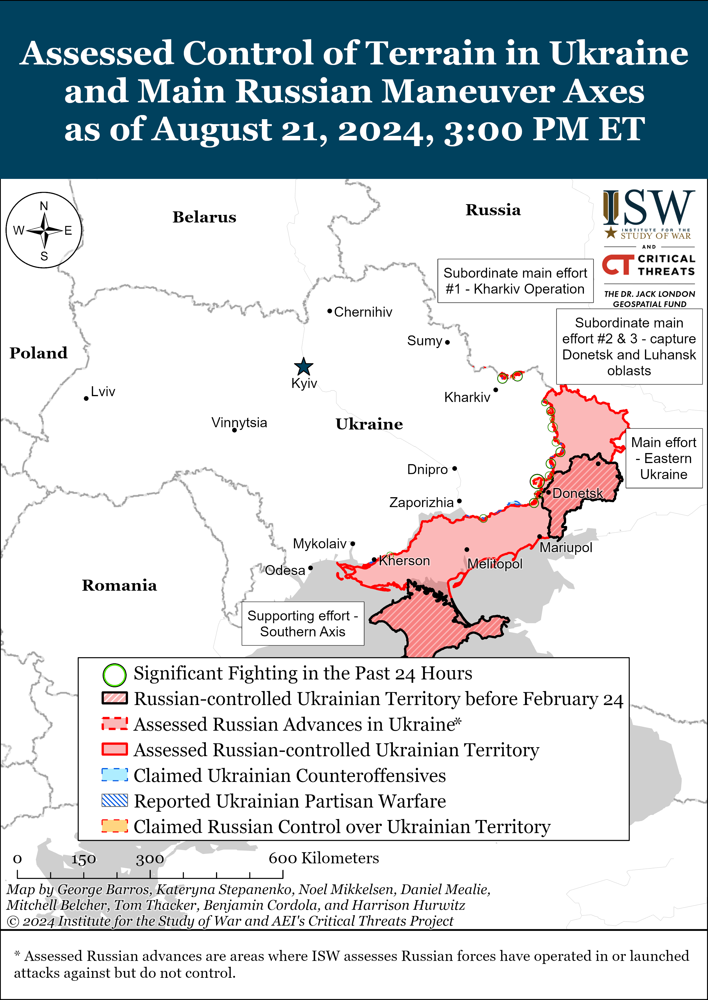](https://understandingwar.org/map/assessed-control-of-terrain-in-ukraine-and-russian-maneuver-axes-as-of-august-21-2024-300-pm-et/)***

***We do not report in detail on Russian war crimes because these activities are well-covered in Western media and do not directly affect the military operations we are assessing and forecasting. We will continue to evaluate and report on the effects of these criminal activities on the Ukrainian military and the Ukrainian population and specifically on combat in Ukrainian urban areas. We utterly condemn Russian violations of the laws of armed conflict and the Geneva Conventions and crimes against humanity even though we do not describe them in these reports.***

- Russian Main Effort – Eastern Ukraine (comprised of three subordinate main efforts)
- Russian Subordinate Main Effort #1 – Push Ukrainian forces back from the international border with Belgorod Oblast and approach to within tube artillery range of Kharkiv City
- Russian Subordinate Main Effort #2 – Capture the remainder of Luhansk Oblast and push westward into eastern Kharkiv Oblast and encircle northern Donetsk Oblast
- Russian Subordinate Main Effort #3 – Capture the entirety of Donetsk Oblast
- Russian Supporting Effort – Southern Axis
- Russian Air, Missile, and Drone Campaign
- Russian Mobilization and Force Generation Efforts
- Russian Technological Adaptations
- Activities in Russian-occupied areas
- Ukrainian Defense Industrial Base Efforts
- Russian Information Operations and Narratives
- Significant Activity in Belarus

**Russian Main Effort – Eastern Ukraine**

**Russian Subordinate Main Effort #1 – Kharkiv Oblast** **(Russian objective: Push Ukrainian forces back from the international border with Belgorod Oblast and approach to within tube artillery range of Kharkiv City)**

Limited positional engagements continued in northern Kharkiv Oblast on August 21, but there were no confirmed changes to the frontline. Ukrainian Kharkiv Group of Forces Spokesperson Colonel Vitaly Sarantsev noted that Russian forces have decreased their use of tactical aviation targeting Kharkiv Oblast in order to prioritize airstrikes in other areas of the theater and in Kursk Oblast.[57] Sarantsev also reported that a contingent of Russian forces remains blocked in the Vovchansk Aggregate Plant in Vovchansk (northeast of Kharkiv City), but that they are unable to attack their way out of the plant because Ukrainian forces control all logistics routes into and out of the plant.[58] Fighting continued north of Kharkiv City near Lyptsi and Hlyboke and in and around Vovchansk.[59] Elements of the Russian 11th Tank Regiment (18th Motorized Rifle Division, 11th Army Corps [AC], Leningrad Military District [LMD]) and 7th Motorized Rifle Regiment (11th AC, LMD) reportedly continue operating near Hlyboke and Lukyantsi (north of Kharkiv City and east of Hlyboke), respectively.[60]

[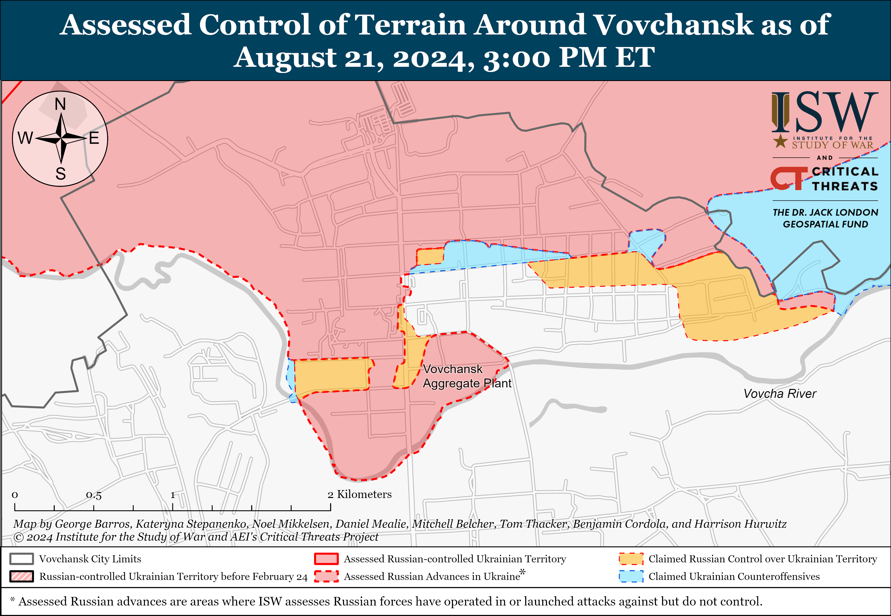](https://understandingwar.org/map/assesed-control-of-terrain-around-vovchansk-as-of-august-21-2024-300-pm-et/)

[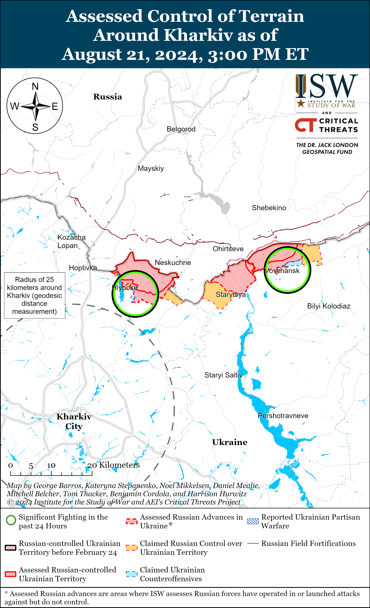](https://understandingwar.org/map/assessed-control-of-terrain-around-kharkiv-as-of-august-21-2024-300-pm-et/)

**Russian Subordinate Main Effort #2 – Luhansk Oblast** **(Russian objective: Capture the remainder of Luhansk Oblast and push westward into eastern Kharkiv Oblast and northern Donetsk Oblast)**

Limited positional engagements continued along the Kupyansk-Svatove-Kreminna line on August 21, but there were no confirmed changes to the frontline. The Ukrainian General Staff reported that Russian forces attacked northeast of Kupyansk near Synkivka; east of Kupyansk near Petropavlivka; southeast of Kupyansk near Stepova Novoselivka and Berestove; northwest of Svatove near Stelmakhivka; west of Svatove near Andriivka; southwest of Svatove near Serhiivka and Novoserhiivka; northwest of Kreminna near Novosadove, Makiivka, Hrekivka, and Torske; and southwest of Kreminna near Dibrova on August 20 and 21.[61] Elements of the Russian 144th Motorized Rifle Division (20th Combined Arms Army [CAA], Moscow Military District [MMD]) reportedly continue operating in the Lyman direction (west of Kreminna).[62]

[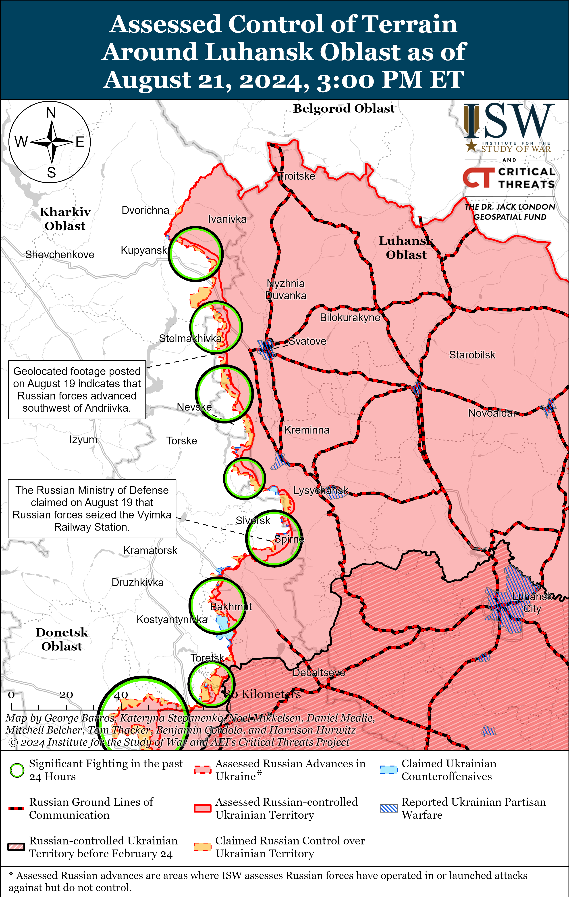](https://understandingwar.org/map/assessed-control-of-terrain-around-luhansk-oblast-as-of-august-21-2024-300-pm-et/)

**Russian Subordinate Main Effort #3 – Donetsk Oblast** **(Russian objective: Capture the entirety of Donetsk Oblast, the claimed territory of Russia’s proxies in Donbas)**

Russian forces continued limited offensive operations southeast of Siversk near Spirne and Vyimka and south of Siversk near Pereizne on August 20 and 21.[63]

Russian forces did not make confirmed advances in the Chasiv Yar direction amid ongoing offensive operations on August 20 and 21. The Ukrainian General Staff reported that Russian forces continued offensive operations near Chasiv Yar; north of Chasiv Yar near Hryhorivka; southeast of Chasiv Yar near Ivanivske and Klishchiivka; and south of Chasiv Yar near Predtechyne on August 20 and 21.[64] A Russian milblogger claimed that Russian forces consolidated their positions in the forest south of Hryhorivka (north of Chasiv Yar) in an area up to 2.36 kilometers wide and that elements of the Russian Sever-V Brigade (Russian Volunteer Corps) reportedly continued operating near Hryhorivka.[65] A Russian milblogger claimed that Russian forces advanced southeast of Orikhovo-Vasylivka (northeast of Chasiv Yar), but ISW has not observed confirmation of this claim.[66]

[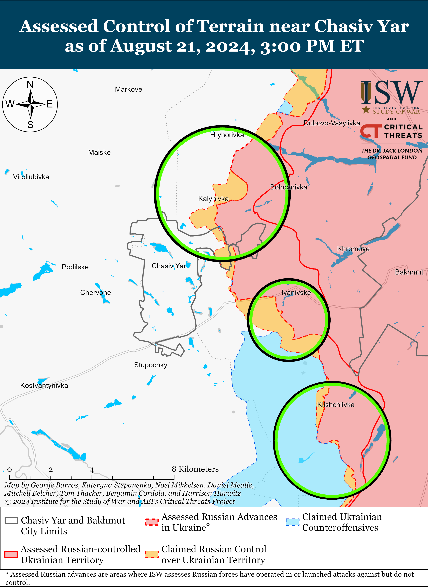](https://understandingwar.org/map/assessed-control-of-terrain-near-chasiv-yar-as-of-august-21-2024-300-pm-et/)

Russian Defense Minister Andrei Belousov claimed on August 21 that Russian forces seized Niu York (south of Toretsk), but Ukrainian military sources continue to report that Ukrainian forces still control 20 percent of the settlement.[67] Belousov credited elements of the Russian 9th Motorized Rifle Brigade (1st Donetsk People’s Republic Army Corps [DNR AC]) for the seizure of Niu York.[68] A source from a Ukrainian brigade operating in the Toretsk direction told Ukrainian outlet *Suspilne* that the situation in Niu York is very difficult because Russian forces are constantly attacking the settlement in small assault groups but that Ukrainian forces still control about 20 percent of Niu York.[69] Russian milbloggers claimed that Russian forces advanced in the fields northeast of Druzhba (east of Toretsk); in northwestern Pivnichne (east of Toretsk); and in eastern Toretsk.[70] The Ukrainian General Staff reported that Russian forces launched assaults near Toretsk; southeast of Toretsk near Zalizne; south of Toretsk near Nelipivka and Niu York; and southwest of Toretsk near Panteleymonivka on August 20 and 21.[71] Belousov claimed on August 20 that elements of the Russian 132nd Motorized Rifle Brigade and 1st Slavic Brigade (both 1st DNR AC) seized Zalizne.[72]

[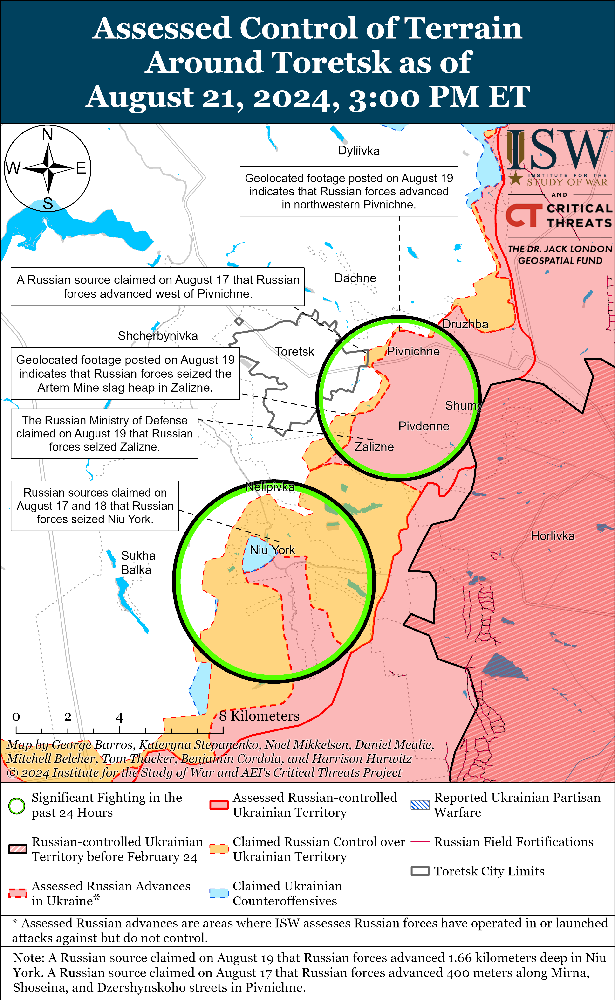](https://understandingwar.org/map/assessed-control-of-terrain-around-toretsk-as-of-august-21-2024-300-pm-et/)

Russian forces recently advanced southeast of Pokrovsk and continued offensive operations in this direction on August 20 and 21. Geolocated footage published on August 20 shows that Russian forces advanced in northwestern Zhuravka (southeast of Pokrovsk), and some Russian milbloggers claimed that elements of the Russian 27th Motorized Rifle Division (2nd Combined Arms Army [CAA], Central Military District [CMD]) seized Zhuravka.[73] ISW had not observed visual evidence confirming Russian advances in the northwesternmost part of Zhuravka, nor to suggest that Russian forces control the entire settlement. Russian milbloggers claimed that Russian forces advanced northeast of Hrodivka (east of Porkrovsk) and northeast of Novohrodivka, south of Mykolaivka, and north of Ptyche (all southeast of Pokrovsk).[74] Russian milbloggers also claimed that Russian forces seized Komyshivka (southeast of Pokrovsk) but ISW has not yet observed visual evidence confirming these milblogger claims.[75] The Russian Ministry of Defense (MoD) retroactively announced on August 21 that the Russian Central Grouping of Forces (GoF) seized Zhelanne, and ISW assessed that Russian forces likely seized Zhelanne around August 18.[76] The Ukrainian General Staff reported that Russian forces continued offensive operations east of Pokrovsk near Vozdvyzhenka, Zelene Pole, Myrolyubivka, Hrodivka, and Kalynove; and southeast of Pokrovsk near Mykolaivka, Novohrodivka, Mykhailivka, Ptyche, and Skuchne.[77] Elements of the Russian BARS-15 unit (Russian Combat Army Reserve) are reportedly operating in the Avdiivka direction, and a drone company of the ”Volga” Brigade is reportedly operating near Novohrodivka.[78]

[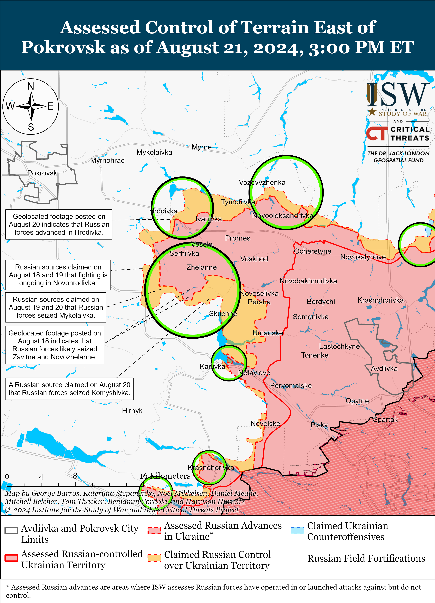](https://understandingwar.org/map/assessed-control-of-terrain-east-of-pokrosk/)

Russian forces continued offensive operations west of Donetsk City near Krasnohorivka and Heorhiivka on August 20 and 21, but there were no confirmed changes to the frontline in the area.[79]

[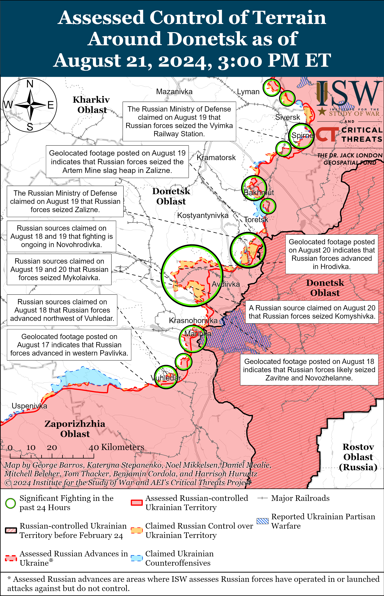](https://understandingwar.org/map/assessed-control-of-terrain-around-donetsk-as-of-august-21-2024-300-pm-et/)

Russian forces recently advanced southwest of Donetsk City amid continued assaults in the area on August 21. Geolocated footage published on August 20 and 21 indicates that Russian forces recently advanced north of Kostyantynivka and southeast of Vodyane (both northeast of Vuhledar).[80] Russian milbloggers claimed that Russian forces are also advancing northwest of Paraskoviivka.[81] Russian forces also continued offensive operations near Pobieda on August 21.[82] A Russian milblogger noted that Russian forces recently advanced up to another area of O-0532 (T-0524) Vuhledar-Kostyantynivka highway near Vuhledar, which is consistent with ISW’s assessment of Russian advances in the area.[83] Russian forces achieved their longstanding tactical objective of reaching the O-0532 highway and cutting the Ukrainian ground line of communication (GLOC) between Vuhledar and Kostyantynivka on August 2, although these advances have not significantly impacted Russian nor Ukrainian operations in the area in subsequent weeks.[84]

Neither Russian nor Ukrainian sources reported ground attacks in the Donetsk-Zaporizhia Oblast border area on August 21.

**Russian Supporting Effort – Southern Axis** **(Russian objective: Maintain frontline positions and secure rear areas against Ukrainian strikes)**

Geolocated footage published on August 20 indicates that Russian forces have recently advanced in western Zaporizhia Oblast to the southern outskirts of Luhivske (northeast of Robotyne).[85] Some Russian milbloggers claimed that Ukrainian forces are preparing for offensive operations in Zaporizhia Oblast, with one milblogger claiming on the evening of August 20 that Ukrainian forces launched an offensive operation near Polohy (in central Zaporizhia Oblast east of Robotyne).[86] Former Roscosmos (Russian space agency) head and Zaporizhia Oblast occupation senator Dmitry Rogozin and several milbloggers denied claims of Ukrainian activation anywhere in Zaporizhia Oblast, however, and accused other Russian commentators of overhyping false information and creating panic in the information space.[87] The Ukrainian General Staff reported that Russian forces attacked north of Robotyne near Novodanylivka and northeast of Robotyne near Mala Tokmachka on August 20 and 21.[88] Elements of BARS-32 (Russian Combat Army Reserve) are reportedly operating near Enerhodar (west of Robotyne), while elements of the 503rd Motorized Rifle Regiment (19th Motorized Rifle Division, 58th Combined Arms Army [CAA], Southern Military District [SMD]) and BARS-3 are operating in the general Zaporizhia Oblast direction.[89]

[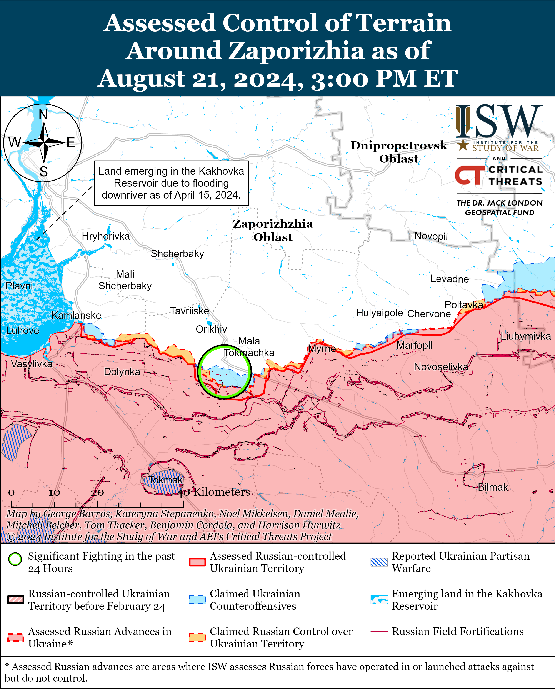](https://understandingwar.org/map/assessed-control-of-terrain-around-zaporizhia-as-of-august-21-2024-300-pm-et/)

Russian forces continued unsuccessful ground attacks in east (left) bank Kherson Oblast on August 20 and 21 but did not make any confirmed advances.[90] Russian forces conducted drone, artillery, and air strikes against settlements and civilian infrastructure in west bank Kherson Oblast.[91]

**[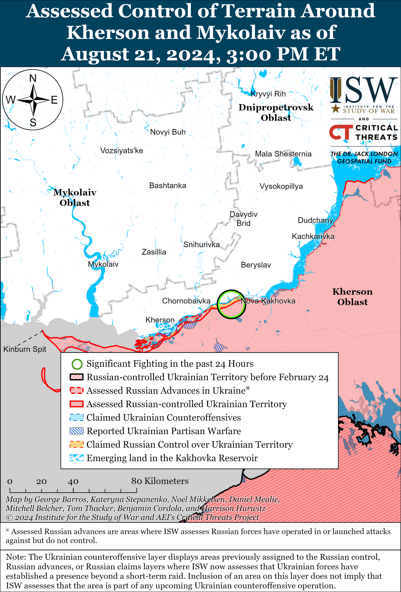](https://understandingwar.org/map/assessed-control-of-terrain-around-kherson-and-mykolaiv-as-of-august-21-2024-300-pm-et/)**

**Russian Air, Missile, and Drone Campaign** **(Russian Objective: Target Ukrainian military and civilian infrastructure in the rear and on the frontline)**

Russian forces conducted a series of missile and drone strikes against Ukraine on the night of August 20 to 21. Ukrainian Air Force Commander Lieutenant General Mykola Oleshchuk reported that Russian forces launched two Iskander-M or North Korean KN-23 ballistic missiles from Voronezh Oblast, a Kh-59/69 cruise missile from the airspace over Kursk Oblast, and 69 Shahed-136/131 drones from Kursk Oblastand Yeysk and Primorsko-Akhtarsk, Krasnodar Krai.[92] Oleshchuk stated that Ukrainian forces shot down one Kh-59/69 missile and 50 Shahed drones over Khmelnytskyi, Poltava, Cherkasy, Kyiv, Vinnytsia, Ivano-Frankivsk, Dnipropetrovsk, Mykolaiv, Odesa, Kherson, Donetsk, Kirovohrad, Sumy and Chernihiv oblasts. Oleshchuk added that 16 Shahed drones did not reach their targets and likely fell due to Ukrainian electronic warfare (EW) suppression and that another Shahed drone flew from Chernihiv Oblast’s airspace into Belgorod Oblast’s airspace via Belarussian airspace. The Kyiv City Military Administration reported that Ukrainian forces destroyed up to a dozen drones near Kyiv City.[93]

**Russian Mobilization and Force Generation Efforts** **(Russian objective: Expand combat power without conducting general mobilization)**

Russian occupation authorities continue to create Cossack organizations in occupied Ukraine, likely to build out Russia’s military reserves and law enforcement bodies in occupied Ukraine. Zaporizhia Oblast occupation administration head Yevgeny Balitsky announced on August 21 that Russian occupation authorities are attempting to recreate the “Zaporizhian Cossack Army” – in reference to the historical Zaporizhian Cossacks (which, ironically, fought against the Russian Empire to exist as an independent and democratic polity) – and will start registering Cossack societies in occupied Zaporizhia Oblast before the end of 2024.[94] Balitsky further claimed that the BARS-32 Detachment of the Sudoplatov Volunteer Battalion already operating in Zaporizhia Oblast is staffed with Cossacks. Kherson Oblast occupation administration head Vladimir Saldo also announced that occupied Kherson Oblast will start registering Cossack societies in October 2024.[95] Saldo claimed that over 18,000 Cossacks are currently fighting in Ukraine and that unspecified Cossack units are operating in occupied Kherson Oblast and on the occupied Kinburn Spit, Mykolaiv Oblast. Russian President Vladimir Putin notably signed a law in March 2024 that authorized members of the All-Russian Cossack Society who are in the Russian military and security services reserves to join the mobilization reserve, and Putin transferred control of the Cossack Cadet Corps to the jurisdiction of the Russian Ministry of Defense (MoD) in June 2024.[96]

Moscow City authorities are advertising their Military Service Consulting Center, which provides administrative and social services to Russians who signed military service contracts, amid recent reports that Moscow City is struggling to recruit military personnel.[97] Moscow’s Military Service Consulting center advertises Russian military contract service and provides contract service personnel with travel and administrative assistance and provides accommodation and food to prospective personnel undergoing selection. Moscow Mayor Sergei Sobyanin recently claimed that 43,000 Muscovites are currently fighting in Ukraine and that another 23,000 Muscovites will deploy to Ukraine as volunteers by the end of 2024, although a source within Sobyanin’s office told Russian opposition outlet *Verstka* that most of the recruits registered as being from Moscow actually originate from other regions of Russia.[98]

Russian opposition outlet *Verstka* reported that 48 high-ranking Russian military officials have resigned or been dismissed since the start of the full-scale invasion of Ukraine.[99] *Verstka* reported that 21 officials left offices within the Russian Ministry of Defense (MoD), including former Russian Defense Minister and current Security Council Secretary Sergei Shoigu and six of his deputies. *Verstka* also noted that 13 of the 48 senior military officials held leadership positions within the Joint Grouping of Forces in Ukraine, that eight of them were military district commanders, and that five of them held main commands. *Verstka* reported that Russian authorities have opened criminal cases against at least seven of these officials.

The Russian MoD appointed Former CEO of the Federal State Unitary Enterprise “Goszagransobstvennost,” Yevgeny Logvinov to the position of director of the MoD’s Military Property Department.[100]

**Russian Technological Adaptations** **(Russian objective: Introduce technological innovations to optimize systems for use in Ukraine)**

Russia continues to find ways to incorporate US-produced electronic components into its weapons and censorship, and surveillance systems. Russian investigative outlet *The Insider* published a story on August 20 detailing how Russia is importing programmable logic devices (PLDs) for use in missile and drone navigation systems, internet content filtration, and facial recognition, many of which come from US companies.[101] *The Insider* noted that Russia is using Xilex and Altera integrated circuits, both products of American PLD manufacturers, in the navigation systems for Iskander and Kalibr missiles. *The Insider* also emphasized that Russia is able to import such PLDs despite extensive international sanctions, largely because many export companies are ignoring international embargoes.

**Ukrainian Defense Industrial Efforts** **(Ukrainian objective: Develop its defense industrial base to become more self-sufficient in cooperation with US, European, and international partners)**

*ISW is suspending publishing coverage of Ukrainian defense industrial efforts until further notice.*

**Activities in Russian-occupied areas** **(Russian objective: Consolidate administrative control of annexed areas; forcibly integrate Ukrainian citizens into Russian sociocultural, economic, military, and governance systems)**

*ISW is not publishing coverage of activities in Russian-occupied areas today.*

**Russian Information Operations and Narratives**

Ukrainian Main Military Intelligence Directorate (GUR) Deputy Chief Major General Vadym Skibitskyi reported on August 21 that Russian and pro-Russian actors are conducting an information operation aimed at discouraging Ukrainian refugees in the European Union (EU) from returning to Ukraine and degrading their Ukrainian identity.[102] Skibitskyi stated that pro-Russian journalists are distributing publications in Italy about supposed Ukrainian crimes against civilians in occupied Donetsk and Luhansk oblasts.

Russian officials continue to seize on the Ukrainian incursion into Kursk Oblast as part of a long-standing Kremlin information operation that falsely portrays Ukraine as unwilling to engage in legitimate, good-faith negotiations and places the onus for peace negotiations on Ukraine. Russian Security Council Deputy Chairperson Dmitry Medvedev claimed on August 21 that Russia could have previously fallen into a “negotiation trap” by entering into “unnecessary peace negotiations” with Ukraine, but that the Ukrainian incursion into Kursk Oblast has clarified that Russia will not negotiate with Ukraine until Ukraine is “completely defeated.”[103] Russian Ministry of Foreign Affairs (MFA) Spokesperson Maria Zakharova claimed that Ukraine’s incursion into Kursk Oblast a priori cancels the possibility of peace negotiations.[104] ISW continues to assess that the Kremlin is only interested in a negotiated settlement that results in complete Ukrainian capitulation and that any Russian statements to the contrary are intended to delude the West into making pre-emptive concessions on Ukraine’s sovereignty and territory integrity.[105]

**Significant activity in Belarus** **(Russian efforts to increase its military presence in Belarus and further integrate Belarus into Russian-favorable frameworks and Wagner Group activity in Belarus)**

The Belarusian Ministry of Defense (MoD) reported on August 21 that the head of the MoD’s First Directorate of the Department of International Military Cooperation, Colonel Dmitry Ryabikhin, visited an unspecified People’s Liberation Army (PLA) unit during his visit to the People’s Republic of China (PRC).[106]

Belarusian President Alexander Lukashenko dismissed Major General Igor Butkevich as First Deputy Chairman of the Belarusian Border Committee due to Butkevich’s age on August 21 and appointed Colonel Andrey Filatov as the new first deputy chairman.[107]

**Note: ISW does not receive any classified material from any source, uses only publicly available information, and draws extensively on Russian, Ukrainian, and Western reporting and social media as well as commercially available satellite imagery and other geospatial data as the basis for these reports. References to all sources used are provided in the endnotes of each update.**

---

[1] https://meduza dot io/feature/2024/08/21/v-kremle-schitayut-chto-boi-v-kurskoy-oblasti-prodlyatsya-neskolko-mesyatsev-i-hotyat-ubedit-rossiyan-chto-eto-novaya-normalnost

[2] https://www.pravda dot com.ua/eng/news/2024/08/21/7471267/

[3] https://www.pravda dot com.ua/eng/news/2024/08/21/7471267/; https://t.me/cikrossii/3944

[4] https://meduza dot io/paragraph/2024/08/21/kursk-ne-slomit-kak-v-geroicheskom-1943-m-my-vse-ot-hipsterov-do-vatnikov-dolzhny-ob-edinitsya

[5] https://t.me/warhistoryalconafter/180564

[6] https://meduza dot io/feature/2024/08/21/v-kremle-schitayut-chto-boi-v-kurskoy-oblasti-prodlyatsya-neskolko-mesyatsev-i-hotyat-ubedit-rossiyan-chto-eto-novaya-normalnost

[7] https://understandingwar.org/backgrounder/assessing-significance-current-russian-and-ukrainian-operations-course-war

[8] https://understandingwar.org/backgrounder/russian-offensive-campaign-assessment-june-7-2024

[9] https://meduza dot io/feature/2024/08/21/v-kremle-schitayut-chto-boi-v-kurskoy-oblasti-prodlyatsya-neskolko-mesyatsev-i-hotyat-ubedit-rossiyan-chto-eto-novaya-normalnost

[10] https://understandingwar.org/backgrounder/russian-offensive-campaign-assessment-february-26-2023; https://understandingwar.org/backgrounder/russian-offensive-campaign-assessment-march-12-2023; https://understandingwar.org/backgrounder/russian-offensive-campaign-assessment-august-10-2024

[11] https://understandingwar.org/backgrounder/putin-vulnerable-western-policy-masks-russian-weakness

[12] https://understandingwar.org/backgrounder/russian-offensive-campaign-assessment-april-30-2023; https://understandingwar.org/backgrounder/russian-offensive-campaign-assessment-may-12-2024; https://understandingwar.org/backgrounder/russian-offensive-campaign-assessment-june-24-2023

[13] https://t.me/ukr\_sof/1183; https://t.me/kiber\_boroshno/9623; https://t.me/WarArchive\_ua/19046 ; https://t.me/warhistoryalconafter/180535 ; https://x.com/666\_mancer/status/1826175406610829766

[14] https://t.me/ukr\_sof/1183;https://t.me/motopatriot/26477

[15] https://t.me/VARYAGI\_155/105; https://x.com/AudaxonX/status/1826198757483896954; https://x.com/AudaxonX/status/1826222767802351867; https://x.com/AudaxonX/status/1826225646197952718; https://x.com/AudaxonX/status/1826233665426456948; https://x.com/AudaxonX/status/1826236574507679841; https://x.com/giK1893/status/1826214202534437305; https://t.me/creamy\_caprice/6464

[16] https://t.me/rusich\_army/16657

[17] https://t.me/dva\_majors/50276

[18] https://t.me/morpexiMO/6306; https://x.com/franfran2424/status/1826200674851344588; https://x.com/GNovosibir79446/status/1826192342170189845; https://x.com/moklasen/status/1826202988295127510; https://x.com/moklasen/status/1826202992103539130; https://t.me/morpexiMO/6306; https://t.me/creamy\_caprice/6462

[19] https://x.com/moklasen/status/1826296192013304096; https://t.me/khornegroup/2556

[20] https://t.me/DnevnikDesantnika/14331; https://t.me/motopatriot/26459; https://t.me/motopatriot/26447; https://t.me/voenkorKotenok/58401; https://t.me/philologist\_zov/1260

[21] https://t.me/dva\_majors/50306; https://t.me/RVvoenkor/75284 ; https://t.me/s/NgP\_raZVedka; https://t.me/boris\_rozhin/134360 ; https://t.me/mobilizationnews/19905

[22] https://x.com/EjShahid/status/1826295667318280343; https://t.me/rusich\_army/16669

[23] https://t.me/astrapress/62346; https://t.me/dva\_majors/50306; https://x.com/AudaxonX/status/1825990685901615544; https://t.me/dva\_majors/50231; https://t.me/control\_sigma/33709 **;** https://t.me/DnevnikDesantnika/14319

[24] http://kremlin dot ru/events/president/news/74906

[25] http://kremlin dot ru/events/president/news/74904

[26] https://isw.pub/UkrWar103023 ; https://isw.pub/UkrWar122023 ; https://isw.pub/UkrWar033024

[27] http://kremlin dot ru/events/president/news/74904

[28] https://isw.pub/UkrWar081624 ; https://isw.pub/UkrWar081924 ; https://isw.pub/UkrWar081424

[29] https://media.defense.gov/2024/Aug/16/2003527561/-1/-1/1/OAR\_Q3\_JUN2024\_FINAL\_508.PDF

[30] https://media.defense.gov/2024/Aug/16/2003527561/-1/-1/1/OAR\_Q3\_JUN2024\_FINAL\_508.PDF

[31] https://isw.pub/UkrWar061524 ; https://isw.pub/UkrWar042024 ; https://isw.pub/UkrWar041924 ; https://isw.pub/UkrWar020924 ; https://understandingwar.org/backgrounder/russian-offensive-campaign-assessment-may-2-2024 ; https://isw.pub/UkrWar041924 ; https://www.ft.com/content/daa1a6ad-9ada-42ba-bfb2-2c199118e904 ; https://archive.ph/7LGbR

[32] https://isw.pub/UkrWar060724

[33] https://isw.pub/UkrWar072524 ; https://isw.pub/UkrWar073024 ; https://isw.pub/UkrWar052124 ; https://isw.pub/UkrWar031224 ; https://isw.pub/UkrWar121623 ;

[34] https://isw.pub/UkrWar071624 ; https://isw.pub/UkrWar071424 ; https://understandingwar.org/backgrounder/russian-offensive-campaign-assessment-june-9-2024 ; https://isw.pub/UkrWar042324 ; https://isw.pub/UkrWar040824 ; https://isw.pub/UkrWar032024 ; https://understandingwar.org/backgrounder/russian-offensive-campaign-assessment-january-29-2024 ; https://understandingwar.org/backgrounder/russian-offensive-campaign-assessment-january-21-2024

[35] https://media.defense.gov/2024/Aug/16/2003527561/-1/-1/1/OAR\_Q3\_JUN2024\_FINAL\_508.PDF

[36] https://understandingwar.org/backgrounder/russian-offensive-campaign-assessment-august-17-2024

[37] https://isw.pub/UkrWar071224

[38] https://understandingwar.org/backgrounder/russian-offensive-campaign-assessment-august-17-2024

[39] https://isw.pub/UkrWar072424 ; https://isw.pub/UkrWar072024

[40] https://www.facebook.com/GeneralStaff.ua/posts/pfbid0xJoc2FgD5hUcErqdGSmku86d2jBJSLAp22DNCGhaDHtvNVkjW5hVySfgxy9PRMbJl

[41] https://t.me/andriyshTime/26252 ; https://t.me/vrogov/17127; https://x.com/666\_mancer/status/1826251220308430880; https://vk.com/wall-90644414\_39836; https://t.me/golubev\_vu/1494; https://t.me/golubev\_vu/1495;https://t.me/etorostov/62864 ; https://t.me/vchkogpu/50118

[42] https://t.me/rybar/62951

[43] https://t.me/sotaproject/85660 ; https://t.me/astrapress/62407; https://t.me/milinfolive/128915

[44] https://t.me/VGrudina/2794; https://x.com/666\_mancer/status/1826270072307855362 https://x.com/666\_mancer/status/1826292246460711184 ; https://x.com/Grimm\_Intel/status/1826270127722996150; https://t.me/voenkorKotenok/58419 ; https://t.me/voenkorKotenok/58417 ; https://t.me/milinfolive/128912%20;%20https:/t.me/milinfolive/128915

[45] https://t.me/tass\_agency/267622; https://t.me/sotaproject/85664

[46] https://t.me/milinfolive/128915; https://t.me/vchkogpu/50145; https://meduza dot io/news/2024/08/21/glava-murmanskoy-oblasti-zayavil-ob-ugroze-bespilotnikov-v-regione-mestnyy-aeroport-vremenno-zakryli

[47] https://suspilne dot media/800159-droni-gur-atakuvali-npz-vijskovi-aerodromi-rf-i-poskodili-nadzvukovij-bombarduvalnik-dzerela/ ; https://armyinform.com dot ua/2024/07/27/chorni-dni-rosijskoyi-aviacziyi-detali-atak-na-obyekty-v-tylu-rf/

[48] https://t.me/tass\_agency/267588 ; https://t.me/tass\_agency/267597 ; https://meduza dot io/feature/2024/08/21/v-rossii-perestali-otkryvatsya-telegram-whatsapp-steam-discord-i-mnogie-drugie-servisy-chto-proishodit-neponyatno

[49] https://t.me/tass\_agency/267601

[50] https://t.me/agentstvonews/7046

[51] https://meduza dot io/short/2020/06/18/dva-goda-popytok-blokirovki-telegram-v-rossii-kak-eto-bylo

[52] https://understandingwar.org/backgrounder/russian-offensive-campaign-assessment-july-7-2023

[53] https://www.kommersant dot ru/doc/6905653 ; https://www.vesti dot ru/article/4103600; https://meduza dot io/feature/2024/08/21/vlasti-smogut-privlekat-uehavshih-rossiyan-po-politicheskim-statyam-koap-a-razve-ranshe-ne-privlekali-ili-teper-oni-budut-delat-eto-chasche

[54] http://kremlin dot ru/events/president/news/74910

[55] https://t.me/tass\_agency/267576

[56] https://t.me/tass\_agency/267528

[57] https://armyinform dot com.ua/2024/08/21/na-harkivskomu-napryamku-rosiyany-zmenshyly-zastosuvannya-taktychnoyi-aviacziyi/

[58] https://suspilne dot media/817997-zsu-kontroluut-93-naseleni-punkti-v-kurskij-oblasti-trivae-evakuacia-z-pokrovska-910-den-vijni-onlajn/?anchor=live\_1724252042&utm\_source=copylink&utm\_medium=ps; https://armyinform.com dot ua/2024/08/21/v-otu-harkiv-rozpovily-pro-stanovyshhe-okupantiv-na-agregatnomu-zavodu-u-vovchansku/

[59] https://www.facebook.com/GeneralStaff.ua/posts/pfbid02mbcfj2CsF4Zev5JUw6tqFFzHABZsE9uVBhz9tSKev7YcfT8NvQUYajTna6B7vAUQl; https://www.facebook.com/GeneralStaff.ua/posts/pfbid02F1pqeXSUWGYRQ1xdb5t2uwAyf9GudeWCy3oNHFZvP775hNmxQpgwqVTfYVPgbnD6l; https://t.me/wargonzo/21670

[60] https://t.me/otukharkiv/841

[61] https://www.facebook.com/GeneralStaff.ua/posts/pfbid02mbcfj2CsF4Zev5JUw6tqFFzHABZsE9uVBhz9tSKev7YcfT8NvQUYajTna6B7vAUQl; https://www.facebook.com/GeneralStaff.ua/posts/pfbid02F1pqeXSUWGYRQ1xdb5t2uwAyf9GudeWCy3oNHFZvP775hNmxQpgwqVTfYVPgbnD6l

[62] https://t.me/vysokygovorit/17012

[63] https://www.facebook.com/GeneralStaff.ua/posts/pfbid02F1pqeXSUWGYRQ1xdb5t2uwAyf9GudeWCy3oNHFZvP775hNmxQpgwqVTfYVPgbnD6l; https://www.facebook.com/GeneralStaff.ua/posts/pfbid02KwX54hpu7qM9kdUS9qLQhEGJavR3XHNSBMNzsBeoh6Q6oH644FBij6cnaZVo2Cssl; https://www.facebook.com/GeneralStaff.ua/posts/pfbid02mbcfj2CsF4Zev5JUw6tqFFzHABZsE9uVBhz9tSKev7YcfT8NvQUYajTna6B7vAUQl

[64] https://www.facebook.com/GeneralStaff.ua/posts/pfbid02mbcfj2CsF4Zev5JUw6tqFFzHABZsE9uVBhz9tSKev7YcfT8NvQUYajTna6B7vAUQl; https://www.facebook.com/GeneralStaff.ua/posts/pfbid02F1pqeXSUWGYRQ1xdb5t2uwAyf9GudeWCy3oNHFZvP775hNmxQpgwqVTfYVPgbnD6l; https://www.facebook.com/GeneralStaff.ua/posts/pfbid02KwX54hpu7qM9kdUS9qLQhEGJavR3XHNSBMNzsBeoh6Q6oH644FBij6cnaZVo2Cssl

[65] https://t.me/RVvoenkor/75309; https://t.me/voin\_dv/10389

[66] https://t [dot] me/motopatriot/26441

[67] https://t.me/mod\_russia/42426; https://suspilne dot media/817997-zsu-kontroluut-93-naseleni-punkti-v-kurskij-oblasti-trivae-evakuacia-z-pokrovska-910-den-vijni-onlajn/?anchor=live\_1724242209&utm\_source=copylink&utm\_medium=ps

[68] https://t.me/mod\_russia/42426

[69] https://suspilne dot media/817997-zsu-kontroluut-93-naseleni-punkti-v-kurskij-oblasti-trivae-evakuacia-z-pokrovska-910-den-vijni-onlajn/?anchor=live\_1724242209&utm\_source=copylink&utm\_medium=ps

[70] https://t [dot] me/z\_arhiv/27719; https://t.me/rybar/62934 ; https://t.me/RVvoenkor/75309; https://t.me/dva\_majors/50276; https://t.me/boris\_rozhin/134415

[71] https://www.facebook.com/GeneralStaff.ua/posts/pfbid02mbcfj2CsF4Zev5JUw6tqFFzHABZsE9uVBhz9tSKev7YcfT8NvQUYajTna6B7vAUQl; https://www.facebook.com/GeneralStaff.ua/posts/pfbid02F1pqeXSUWGYRQ1xdb5t2uwAyf9GudeWCy3oNHFZvP775hNmxQpgwqVTfYVPgbnD6l; https://www.facebook.com/GeneralStaff.ua/posts/pfbid02KwX54hpu7qM9kdUS9qLQhEGJavR3XHNSBMNzsBeoh6Q6oH644FBij6cnaZVo2Cssl

[72] https://t.me/mod\_russia/42396

[73] https://t.me/dva\_majors/50276 ; https://t.me/motopatriot/26417; https://t.me/RVvoenkor/75278

[74] https://t [dot] me/z\_arhiv/27717; https://t [dot] me/boris\_rozhin/134415; https://t [dot] me/z\_arhiv/27715; https://t [dot] me/motopatriot/26443; https://t [dot] me/boris\_rozhin/134415

[75] https://t.me/RVvoenkor/75281 ; https://t.me/DnevnikDesantnika/14318; https://t.me/boris\_rozhin/134415

[76] https://t.me/mod\_russia/42412 ; https://understandingwar.org/backgrounder/russian-offensive-campaign-assessment-august-19-2024

[77] https://www.facebook.com/GeneralStaff.ua/posts/pfbid02mbcfj2CsF4Zev5JUw6tqFFzHABZsE9uVBhz9tSKev7YcfT8NvQUYajTna6B7vAUQl; https://www.facebook.com/GeneralStaff.ua/posts/pfbid02F1pqeXSUWGYRQ1xdb5t2uwAyf9GudeWCy3oNHFZvP775hNmxQpgwqVTfYVPgbnD6l; https://www.facebook.com/GeneralStaff.ua/posts/pfbid02KwX54hpu7qM9kdUS9qLQhEGJavR3XHNSBMNzsBeoh6Q6oH644FBij6cnaZVo2Cssl

[78] https://t.me/ButusovPlus/12923 ; https://t.me/voenkorKotenok/58405; https://t.me/motopatriot/26423

[79] https://www.facebook.com/GeneralStaff.ua/posts/pfbid02mbcfj2CsF4Zev5JUw6tqFFzHABZsE9uVBhz9tSKev7YcfT8NvQUYajTna6B7vAUQl ; https://www.facebook.com/GeneralStaff.ua/posts/pfbid02F1pqeXSUWGYRQ1xdb5t2uwAyf9GudeWCy3oNHFZvP775hNmxQpgwqVTfYVPgbnD6l ; https://www.facebook.com/GeneralStaff.ua/posts/pfbid02KwX54hpu7qM9kdUS9qLQhEGJavR3XHNSBMNzsBeoh6Q6oH644FBij6cnaZVo2Cssl ; https://t.me/wargonzo/21670 ; https://t.me/voenkorKotenok/58402

[80] https://x.com/PuenteUribarri/status/1826153970517029174; https://x.com/klinger66/status/1826174132343517470; https://x.com/klinger66/status/1826188895937020218; https://t.me/creamy\_caprice/6461 ; https://t.me/odshbr79/304; https://t.me/creamy\_caprice/6452

[81] https://t.me/DnevnikDesantnika/14324 ; https://t.me/boris\_rozhin/134415 ; https://t.me/z\_arhiv/27713

[82] https://www.facebook.com/GeneralStaff.ua/posts/pfbid02mbcfj2CsF4Zev5JUw6tqFFzHABZsE9uVBhz9tSKev7YcfT8NvQUYajTna6B7vAUQl

[83] https://t.me/motopatriot/26456

[84] https://understandingwar.org/backgrounder/russian-offensive-campaign-assessment-august-2-2024

[85] https://t.me/operativnoZSU/154906; https://t.me/creamy\_caprice/6459

[86] https://t.me/romanov\_92/45062; https://t.me/DnevnikDesantnika/14310; https://t.me/sashakots/48517; https://t.me/sashakots/48517

[87] https://t.me/rogozin\_do/6326; https://t.me/NgP\_raZVedka/18763; https://t.me/NgP\_raZVedka/18762; https://t.me/NgP\_raZVedka/18765; https://t.me/dva\_majors/50271 ; https://t.me/romanov\_92/45062

[88] https://www.facebook.com/GeneralStaff.ua/posts/pfbid02KwX54hpu7qM9kdUS9qLQhEGJavR3XHNSBMNzsBeoh6Q6oH644FBij6cnaZVo2Cssl; https://www.facebook.com/GeneralStaff.ua/posts/pfbid02F1pqeXSUWGYRQ1xdb5t2uwAyf9GudeWCy3oNHFZvP775hNmxQpgwqVTfYVPgbnD6l; https://t.me/SJTF\_Odes/11036

[89] https://t.me/orly\_rs/5549;

[90] https://www.facebook.com/GeneralStaff.ua/posts/pfbid02KwX54hpu7qM9kdUS9qLQhEGJavR3XHNSBMNzsBeoh6Q6oH644FBij6cnaZVo2Cssl; https://www.facebook.com/GeneralStaff.ua/posts/pfbid02F1pqeXSUWGYRQ1xdb5t2uwAyf9GudeWCy3oNHFZvP775hNmxQpgwqVTfYVPgbnD6l; https://t.me/SJTF\_Odes/11036

[91] https://t.me/khersonskaODA/23489; https://t.me/olexandrprokudin/4265; https://t.me/khersonskaODA/23488; https://t.me/khersonskaODA/23482; https://t.me/khersonskaODA/23468; https://t.me/khersonskaODA/23467; https://t.me/khersonskaODA/23459; https://t.me/olexandrprokudin/4268

[92] https://t.me/ComAFUA/393

[93] https://t.me/VA\_Kyiv/7492

[94] https://t.me/BalitskyEV/3765

[95] https://t.me/SALDO\_VGA/4063

[96] https://understandingwar.org/backgrounder/russian-offensive-campaign-assessment-june-23-2024 ; https://understandingwar.org/backgrounder/russian-offensive-campaign-assessment-march-24-2024

[97] https://t.me/voenkom\_on\_line/410 ; https://understandingwar.org/backgrounder/russian-offensive-campaign-assessment-august-13-2024

[98] https://understandingwar.org/backgrounder/russian-offensive-campaign-assessment-august-13-2024

[99] https://t.me/svobodnieslova/5479 ; https://verstka dot media/chistki-v-minoborony-50-uvoleno

[100] https://www.interfax dot ru/russia/977489

[101] https://theins dot ru/obshestvo/273811

[102] https://t.me/DIUkraine/4274; https://armyinform dot com.ua/2024/08/21/operacziyi-proty-ukrayinskyh-bizhencziv-u-yevropi-gotuye-rf-gur/

[103] https://t.me/tass\_agency/267509 ; https://t.me/dva\_majors/50281 ; https://t.me/medvedev\_telegram/523 ; https://t.me/medvedev\_telegramE/19

[104] https://t.me/tass\_agency/267567

[105] https://isw.pub/UkrWar081324 ; https://isw.pub/UkrWar072524 ; https://isw.pub/UkrWar072424 ; https://isw.pub/UkrWar071924

[106] https://t.me/modmilby/41217

[107] https://t.me/pul\_1/13409
