# Russian Offensive Campaign Assessment, August 22, 2024

**Riley Bailey, Angelica Evans, Kateryna Stepanenko, Grace Mappes, Frederick W. Kagan**

**August 22, 2024, 9:30pm ET**

**Click**[**here**](https://storymaps.arcgis.com/stories/36a7f6a6f5a9448496de641cf64bd375)**to see ISW’s interactive map of the Russian invasion of Ukraine. This map is updated daily alongside the static maps present in this report.**

**Click**[**here**](https://understandingwar.maps.arcgis.com/apps/instant/3dviewer/index.html?appid=1602762dbcde419bb957dea358449580)**to see ISW’s 3D control of terrain topographic map of Ukraine. Use of a computer (not a mobile device) is strongly recommended for using this data-heavy tool.**

**Click**[**here**](https://storymaps.arcgis.com/stories/733fe90805894bfc8562d90b106aa895)**to access ISW’s archive of interactive time-lapse maps of the Russian invasion of Ukraine. These maps complement the static control-of-terrain map that ISW produces daily by showing a dynamic frontline. ISW will update this time-lapse map archive monthly.**

**Note: The data cut-off for this product was 1:30pm ET on August 22. ISW will cover subsequent reports in the August 23 Russian Offensive Campaign Assessment.**

**The Russian military command recently redeployed elements of at least one Russian airborne (VDV) regiment from western Zaporizhia Oblast in response to Ukraine’s incursion into Kursk Oblast, possibly in an effort to stabilize the lines and improve command and control (C2) over Russian conscripts.**A Crimean occupation official, who had volunteered to fight as part of the Russian 56th VDV Regiment (7th VDV Division), claimed on August 19 that his platoon redeployed from the Robotyne and Verbove area in western Zaporizhia Oblast to “defend” Kursk Oblast.[1] A Russian relative also claimed on Telegram that elements of the 1st Assault Company (56th VDV Regiment) began redeploying to unspecified area in Russia on August 15, and a Russian VDV-affiliated Telegram channel announced a crowdfunding effort on August 17 in support of elements of the 56th VDV Regiment that were reportedly already in Kursk Oblast.[2] Elements of the 56th VDV Regiment have been operating in western Zaporizhia Oblast since at least Summer 2023.[3] ISW has also observed proprietary, commercially-available data appearing to support reports of these redeployments. The Crimea-based Telegram channel Crimean Wind posted footage on August 22 of Russian military trucks reportedly transferring a “large amount of military equipment” from occupied Sevastopol and Perevalne, Crimea in the “northern direction.”[4] OSINT analysts on X (formerly Twitter) observed tactical insignia on the trucks seen in Crimean Wind’s footage that reportedly belongs to the 56th VDV Regiment and analyzed other footage of Russian military equipment and trucks moving through Voronezh Oblast towards Kursk Oblast.[5] A Russian milblogger also claimed on August 22 that elements of the 56th VDV “Brigade” were operating in Russkaya Konopelka (just east of Sudzha and 12km from the international border) alongside former Wagner Group elements before editing the post to claim that elements of the 11th VDV Brigade were operating in the area.[6] Russian sources recently amplified footage purportedly showing elements of the 11th VDV Brigade allegedly leading conscripts out of an encirclement in an unspecified area in Kursk Oblast, and ISW observed elements of the 11th VDV Brigade operating in the Chasiv Yar direction in early July 2024.[7]

[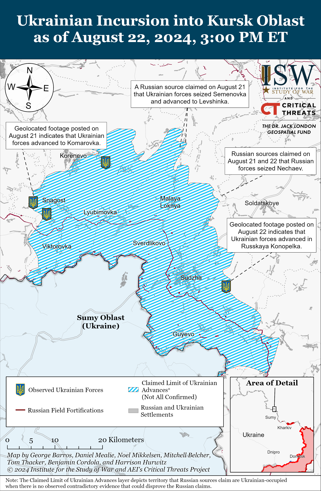](https://understandingwar.org/map/ukrainian-incursion-into-kursk-oblast-as-of-august-22-2024-300-pm-et/)

The scale of the redeployment of the 56th VDV Regiment is unclear from available information in the open source, although this reported redeployment is consistent with ISW’s observation that Russia has been pulling forces from less critical sectors of the frontline such as western Zaporizhia and Kherson oblasts.[8] The Russian military command notably redeployed elements of the Russian 810th Naval Infantry Brigade (Black Sea Fleet [BSF]) and elements of two unspecified VDV battalions from the Kherson direction to Kursk Oblast, and ISW has also observed claims that elements of the 810th Naval Infantry Brigade were operating near Vovchansk, Kharkiv Oblast in June 2024.[9] The Russian military command generally regards VDV and naval infantry elements as “elite” forces (even though many Russian elite units have lost their eliteness over the course of the Russian full-scale invasion of Ukraine) and tends to deploy these forces to prioritized directions.[10] The scale of such redeployments serves as a greater indicator of the Russian military’s prioritization, however. ISW continues to assess that Russian President Vladimir Putin and the Russian military will likely continue prioritizing Russian offensive operations in eastern Ukraine – namely in the Pokrovsk and Toretsk directions.[11] The Ukrainian General Staff notably observed a decrease in Russian combat operations in western Zaporizhia and Kherson oblasts on August 22.[12] The effects of redeploying elements of the 56th VDV Regiment and other elite elements from southern Ukraine will also depend on the scale of the redeployments. The Russian military command may be redeploying limited numbers of elite forces to improve C2 in Kursk Oblast and oversee inexperienced conscripts.

**The Russian military command reportedly heavily committed elements initially intended for the Russian offensive effort in northern Kharkiv Oblast to the defense of Kursk Oblast.**Russian opposition outlet *Novaya Gazeta*reported on August 19 that appeals from relatives on Russian social media, reports about missing soldiers, and OSINT assessments indicate that Russia has committed elements of the following units to fighting in Kursk Oblast: the 488th Motorized Rifle Regiment’s 17th and 18th battalions (144th Motorized Rifle Division, 20th Combined Arms Army [CAA], Moscow Military District [MMD]), the 252nd Motorized Rifle Regiment (3rd Motorized Rifle Division, 20th CAA, MMD), the 102nd Motorized Rifle Regiment’s 31st Battalion (150th Motorized Rifle Division, 8th CAA, SMD), the 9th Motorized Rifle Regiment (1st Donetsk People’s Republic [DNR] Army Corps [AC]), the 143rd Motorized Rifle Regiment (127th Motorized Rifle Division, 5th CAA, Eastern Military District [EMD]), Chechen Akhmat Spetsnaz units, 810th Naval Infantry Brigade (Black Sea Fleet), 22nd Motorized Rifle Regiment (72nd Motorized Rifle Division, 44th AC, Leningrad Military District [LMD]), 25th Motorized Rifle Brigade (6th CAA, LMD), 200th Motorized Rifle Brigade (14th AC, LMD), Nizhnyi Novgorod’s “Kulibin” detachment, the DNR “Pyatnashka” Brigade, “Veterany” 60th Motorized Rifle Brigade’s “Oleg Mamiev” 3rd reconnaissance and assault detachment and “Otvazhnye” assault squad (Russian Volunteer Corps), unspecified BARS volunteer formations, and the 5th Anti-Aircraft Missile Brigade (6th Air Defense Army).[13] *Novaya Gazeta* noted that elements of the 22nd Motorized Rifle Regiment, “Veterany” 60th Motorized Rifle Brigade, and the 25th Motorized Rifle Brigade that were committed to Kursk Oblast were either recently deployed or about to deploy to Vovchansk (northeast of Kharkiv City).[14] ISW has observed that significant redeployments of elements of the Northern Grouping of Forces (which is responsible for the Kharkiv direction) to Kursk Oblast suggest that the Russian military command has determined that disruption to the offensive operation in northern Kharkiv Oblast is a necessary sacrifice to appropriately respond to the Ukrainian incursion while avoiding redeployments from higher priority sectors of the frontline.[15] The Ukrainian incursion into Kursk Oblast will continue to generate theater-wide operational pressures on Russian forces, and it is unlikely that the Russian military will be able to restrict significant disruptions to just the Northern Grouping of Forces particularly if and when it undertakes to expel Ukrainian forces from Kursk.[16]

**The Kremlin may be taking steps to address its border vulnerabilities amid the Ukrainian incursion into Kursk Oblast and following a series of unsuccessful long-term efforts to improve Russian border security.** Russian President Vladimir Putin met with the heads of Bryansk, Kursk, and Belgorod oblasts and several Russian officials to discuss the updated socio-economic situation in Russia’s oblasts bordering Ukraine on August 22 amid the larger-scale Ukrainian incursion into Kursk Oblast and more limited Ukrainian attacks into Belgorod and Bryansk oblasts.[17] Bryansk Oblast Head Alexander Bogomaz reported during the meeting that the Bryansk government formed a territorial defense force during October 2023 on Putin’s orders and that an unnamed Russian airborne forces (VDV) major general commands Bryansk Oblast’s territorial defense forces. Bogomaz claimed that Rosgvardia recently provided light and heavy weapons for the forces and stated that Rosgvardia and the territorial defense forces are currently jointly patrolling the international border. Bogomaz asked Putin to consider financing regional territorial defense forces from the Russian federal budget in order to alleviate strain on regional budgets and incentivize participation in the territorial defense forces by offering regular wages to participants. Belgorod Oblast Head Vyacheslav Gladkov also expressed his support for this initiative, and a series of Kremlin officials, including Putin, insinuated that the Russian government will work to resolve the issue and provide federal funding for regional territorial defense forces.

**The Russian government has previously hesitated to fully allocate federal materiel to territorial defense forces.** The Russian Ministry of Defense (MoD) allocated military weapons and equipment to the Belgorod and Kursk territorial defense forces in August 2023, although a Kremlin-affiliated Russian milblogger claimed that Russian authorities would store the weapons in a centralized, locked location and noted that it is unclear how the territorial defense forces will be able to access the weapons in an emergency.[18] Bogomaz’s claim that a VDV commander is leading Bryansk Oblast’s territorial defense forces may be indicative of the Kremlin’s wider intentions to allocate better-trained, “elite” commanders to lead units comprised of poorer-trained territorial defense forces or conscripts. ISW previously assessed that the Kremlin may have attempted to balance the need for increased border security with a desire to avoid empowering decentralized military formations following the Wagner Group’s armed rebellion in June 2023.[19] The Kremlin may be recalculating such assessments in the wake of the Ukrainian incursion into Kursk Oblast, however, and may be more willing to allocate greater materiel and manpower support to territorial defense forces.

**Putin may also hope to use this meeting and the promise of improved funding and materiel for territorial defense units to alleviate concerns about the long-term use of Russian conscripts for Russian border security operations.** A Ukrainian source in the military-political leadership told Ukrainian newswire *RBC-Ukraine* on August 21 that Putin tasked Russian forces with repelling Ukrainian forces from Kursk Oblast by October 1 without re-deploying forces from key frontlines areas.[20] October 1 is notably the first scheduled day of the semi-annual conscription cycle in Russia, and Russian conscripts notably serve for 12 months – suggesting that the 130,000 personnel conscripted in October 2023 should be released from their duties in the coming months.[21] Russian authorities are largely relying on conscripts (in some cases under the leadership of Russian regular and irregular forces) to defend against Ukrainian assaults in Kursk Oblast and are likely considering how to address the upcoming outflow of conscripts from the pool of manpower available to serve in Kursk Oblast.[22] It is unclear if the Russian military will adequately train Russian conscripts to defend Russian border areas, and even the most experienced Russian conscripts will likely continue to be woefully underequipped to push back the highly trained and organized Ukrainian units attacking in Kursk Oblast. The Kremlin may attempt to press outgoing conscripts into signing military service contracts, although ISW previously noted that the Kremlin is highly sensitive to the societal backlash that such an effort could generate.[23]

**Ukrainian forces marginally advanced throughout their salient in Kursk Oblast amid continued Russian efforts to stop these advances on August 22.** Geolocated footage published on August 21 indicates that Ukrainian forces advanced into eastern Komarovka (south of Korenevo and east of Sudzha), although Russian sources claimed that Russian forces repelled Ukrainian attacks in the area.[24] Russian milbloggers claimed that Ukrainian forces operating northeast of Korenevo seized Semyonovka and advanced into southern Levshinka and that Ukrainian forces marginally advanced within northern Martynovka (northeast of Sudzha).[25] Additional geolocated footage published on August 22 that Ukrainian forces marginally advanced within southern Russkaya Konopelka (east of Sudzha).[26] Russian milbloggers claimed that elements of the Russian “Dikaya Division of Donbas” including the “Arbat,” “Pyatnashka,” and “Sarmat” battalions re-took Nechayev (north of Sudzha).[27] Russian milbloggers claimed that Ukrainian forces continued to engage with Russian forces throughout Glushkovo, Korenevo, Sudzha, and Belovo raions in Kursk Oblast.[28] Russian sources also claimed that Ukrainian forces conducted a reconnaissance-in-force operation near Zabrama, Bryansk Oblast on the evening of August 21 but that Russian forces — including Russian border guards and Chechen “Akhmat” Spetsnaz personnel – repelled the attack.[29]

**Recent Russian advances in the Pokrovsk direction appear to have prompted Ukrainian withdrawals from limited positions southeast of Pokrovsk, and Russian forces have likely failed to achieve their apparent objective of tactically encircling Ukrainian forces in the area.**Geolocated footage published on August 22 indicates that Russian forces recently seized Ptyche (southeast of Pokrovsk) and advanced further south of the settlement, and ISW assesses that this confirms Russian claims that Russian forces had previously seized the remainder of the east bank of the Karlivske Reservoir in the area.[30] Recent Russian advances south and southwest of the T-0511 (Ocheretyne-Hrodivka) highway have leveled the Russian salient east and southeast of Pokrovsk instead of setting conditions for the tactical encirclement of Ukrainian forces, however. Russian forces likely aimed to advance westward of the Karlivske Reservoir from Yasnobrodivka and Karlivka in order to encircle Ukrainian forces east of the Hrodivka-Novohrodivka-Selydove line but failed to make such gains in concert with their advances in the direction of Novohrodivka and Selydove from the south of the T-0511 highway.[31] Russian forces enveloped Ukrainian forces as they advanced towards the E-50 (Donetsk City-Pokrovsk) highway in recent weeks, however, and the threat of tactical encirclement likely prompted Ukrainian withdrawals. The spokesperson for a Ukrainian brigade operating in the Pokrovsk direction acknowledged on August 22 that Russian advances have encouraged Ukrainian forces to conduct withdrawals to level the front and preserve the lives of Ukrainian personnel.[32] Several Ukrainian commanders operating in the Pokrovsk direction told the*Associated Press* in an article published on August 22 that newly generated Ukrainian recruits in the Pokrovsk direction have retreated from positions in some instances.[33] ISW has not observed widespread reporting of chaotic Ukrainian withdrawals in the Pokrovsk direction, and the lack of rapid Russian tactical gains in the area suggests that Ukrainian forces managed to withdraw from enveloped positions in recent weeks. ISW has also not observed widespread reporting of Russian forces encircling and destroying Ukrainian personnel at positions southeast of Pokrovsk in recent weeks, and previous conversations among Russian milbloggers about an envisioned tactical encirclement in the area have subsided.[34]

**The tempo of Russian aviation operations is reportedly decreasing throughout most of the theater, although this decreased tempo may be temporary, and its cause is unclear.**Spokespeople forUkrainian brigades operating in the Pokrovsk and Chasiv Yar directions both reported a general decrease in the number of glide bomb strikes and decreased Russian aviation activity on August 22.[35] The spokesperson for the Ukrainian brigade operating in the Pokrovsk direction suggested that Russian aircraft shortages and Ukrainian air defense capabilities in this sector of the front may be prompting the Russian military to decrease aviation activity.[36] ISW has not yet observed confirmation of decreased Russian aviation operations in the Pokrovsk and Chasiv Yar directions. Ukrainian Kharkiv Group of Forces Spokesperson Colonel Vitaly Sarantsev reported on August 18 that Russian forces conducted 30 to 40 strikes per day in the Kharkiv direction a few weeks ago but have decreased the number of glide bomb strikes to roughly one to four strikes per day in the previous several days.[37] Sarantsev stated that Russian forces may be conducting fewer glide bomb strikes to prioritize aviation operations in the Pokrovsk, Kursk, and Sumy directions or because of the effects of Ukrainian strikes against Russian rear areas (likely referring to Ukrainian strikes against Russian airfields).[38] Data available from NASA FIRMS may partially corroborate Sarantsev’s statements about the tempo of Russian aviation operations in the Kharkiv direction.[39] Ukrainian Northern Operational Command Spokesperson Vadym Mysnyk stated on August 15 that Russian forces launched half as many glide bombs against Sumy Oblast as compared to August 14, although it is unclear if the decreased tempo of Russian glide bomb strikes against Sumy Oblast will persist.[40]

Ukrainian Air Force Commander Lieutenant General Mykola Oleshchuk reported that Russian forces launched 10 Shahed-136/131 drones from Kursk Oblast largely against frontline Ukrainian positions in Kharkiv Oblast on the night of August 21 to 22 and that Ukrainian forces shot down two of the drones.[41] Russian forces routinely use Shahed drones for rear area strikes against Ukraine, and the use of Shaheds for frontline strikes may indicate that Russian forces are looking for ways to compensate for decreased glide bomb strikes in certain sectors of the frontline. Ukraine has recently struck several airfields within Russia and has destroyed ammunition warehouses holding glide bombs, and these strikes may have generated temporary disruptions to Russian aviation operations.[42] The Russian military is also committing aviation assets to the defense of Kursk Oblast, although not at a scale that would prevent Russian forces from fielding aviation throughout most of the theater.

**Ukrainian forces conducted a series of successful strikes against targets in Volgograd Oblast and Krasnodar Krai on August 22.** Sources within Ukraine’s Security Service (SBU) told Ukrainian media on August 22 that SBU and Special Operations Forces (SSO) personnel successfully struck several warehouses filled with glide bombs and fuel at the Marinovka airfield in Volgograd Oblast.[43] The sources stated that Russian aircraft based at the Marinovka airfield were involved in bombing frontline Ukrainian settlements and populations and noted that there were secondary detonations at the warehouses following the strike. Footage published on August 22 shows smoke plumes and explosions at the airfield, and satellite imagery shows significant damage to hangars at the airfield, although it is unclear if Ukrainian forces damaged any aircraft based on the footage and imagery.[44] The Krasnodar Krai Operational Headquarters claimed on August 22 that a Ukrainian strike sank a railway ferry carrying fuel tanks that was moored in the port of Kavkaz, Krasnodar Krai.[45] The Crimea-based Telegram channel Crimean Wind stated that Ukrainian forces used a missile to strike the ferry and published footage showing the aftermath of the strike.[46] Russian authorities stated that the ferry was carrying 30 fuel tanks, and Russian sources claimed that Ukrainian forces may have used a Neptune anti-ship missile to strike the ferry.[47] Ukraine’s Main Military Intelligence Directorate (GUR) Head Kyrylo Budanov told the *War Zone*defense outlet that the GUR conducted drone strikes against a Russian signals intelligence center and the Ostafyevo airport near Moscow City and the Millerovo Airbase in Rostov Oblast on August 21.[48] Budanov stated that Ukrainian forces are clarifying the extent of any damage to these targets. Ukrainian forces reportedly struck a Russian S-300 air defense system near Novoshakhtinsk, Rostov Oblast on the night of August 20 and 21, and Russian sources claimed that Russian forces downed a Ukrainian drone over Murmansk Oblast on August 21.[49]

**Key Takeaways:**

- **The Russian military command recently redeployed elements of at least one Russian airborne (VDV) regiment from western Zaporizhia Oblast in response to Ukraine’s incursion into Kursk Oblast, possibly in an effort to stabilize the lines and improve command and control (C2) over Russian conscripts.**
- **The Russian military command reportedly heavily committed elements initially intended for the Russian offensive effort in northern Kharkiv Oblast to the defense of Kursk Oblast.**
- **The Kremlin may be taking steps to address its border vulnerabilities amid the Ukrainian incursion into Kursk Oblast and following a series of unsuccessful long-term efforts to improve Russian border security.**
- **Ukrainian forces marginally advanced throughout their salient in Kursk Oblast amid continued Russian efforts to stop these advances on August 22.**
- **Recent Russian advances in the Pokrovsk direction appear to have prompted Ukrainian withdrawals from limited positions southeast of Pokrovsk, and Russian forces have likely failed to achieve their apparent objective of tactically encircling Ukrainian forces in the area.**
- **The tempo of Russian aviation operations is reportedly decreasing throughout most of the theater, although this decreased tempo may be temporary, and its cause is unclear.**
- **Ukrainian forces conducted a series of successful strikes against targets in Volgograd Oblast and Krasnodar Krai on August 22.**
- **Russian forces recently advanced north of Siversk, within Chasiv Yar and southeast of Toretsk and Pokrovsk.**
- **Russian State Duma Committee on Information Policy Head Alexander Khinshtein stated on August 21 that the Russian Union of Journalists and Ministry of Digital Development submitted a bill to the Cabinet of Ministers proposing to grant veteran status to journalists who have worked in Ukraine, the “counter-terrorism operation” zone in Kursk Oblast, and other unspecified combat zones.**

[***[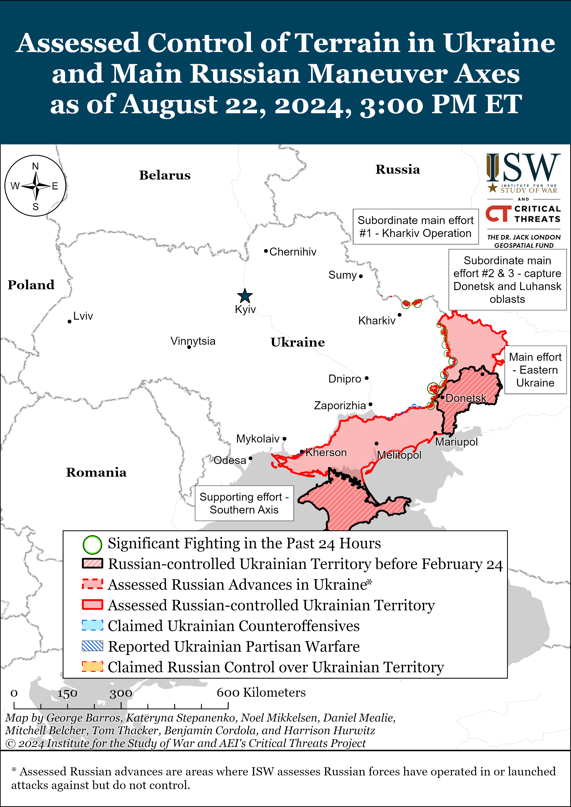](https://understandingwar.org/map/assessed-control-of-terrain-in-ukraine-and-main-russian-maneuver-axes-as-of-august-22-2024-300-pm-et/)***](https://understandingwar.org/wp-content/uploads/2025/05/DraftUkraineCoT20August20222C202024.png)

***We do not report in detail on Russian war crimes because these activities are well-covered in Western media and do not directly affect the military operations we are assessing and forecasting. We will continue to evaluate and report on the effects of these criminal activities on the Ukrainian military and the Ukrainian population and specifically on combat in Ukrainian urban areas. We utterly condemn Russian violations of the laws of armed conflict and the Geneva Conventions and crimes against humanity even though we do not describe them in these reports.***

- Russian Main Effort – Eastern Ukraine (comprised of three subordinate main efforts)
- Russian Subordinate Main Effort #1 – Push Ukrainian forces back from the international border with Belgorod Oblast and approach to within tube artillery range of Kharkiv City
- Russian Subordinate Main Effort #2 – Capture the remainder of Luhansk Oblast and push westward into eastern Kharkiv Oblast and encircle northern Donetsk Oblast
- Russian Subordinate Main Effort #3 – Capture the entirety of Donetsk Oblast
- Russian Supporting Effort – Southern Axis
- Russian Air, Missile, and Drone Campaign
- Russian Mobilization and Force Generation Efforts
- Russian Technological Adaptations
- Activities in Russian-occupied areas
- Ukrainian Defense Industrial Base Efforts
- Russian Information Operations and Narratives
- Significant Activity in Belarus

**Russian Main Effort – Eastern Ukraine**

**Russian Subordinate Main Effort #1 – Kharkiv Oblast (Russian objective: Push Ukrainian forces back from the international border with Belgorod Oblast and approach to within tube artillery range of Kharkiv City)**

Fighting continued north of Kharkiv City near Hlyboke and Lyptsi and northeast of Kharkiv City in Vovchansk on August 21 and 22.[50] A Russian milblogger claimed on August 22 that Russian forces repelled a Ukrainian mechanized assault of an unspecified size near Hlyboke.[51] Ukraine’s Kharkiv Group of Forces reported that Russian forces operating in the Kharkiv direction remain most active within Vovchansk.[52] The Kharkiv Group of Forces reported that Russian forces committed elements of the 155th Naval Infantry Brigade (Pacific Fleet, Eastern Military District [EMD]) to the frontline near Hlyboke and conducted internal rotations for unspecified Russian units at advanced positions near Buhruvatka (northeast of Kharkiv City).[53]

[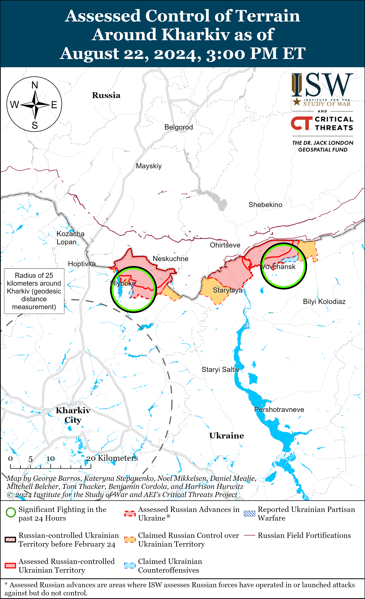](https://understandingwar.org/map/assessed-control-of-terrain-around-kharkiv-as-of-august-22-2024-300-pm-et/)

[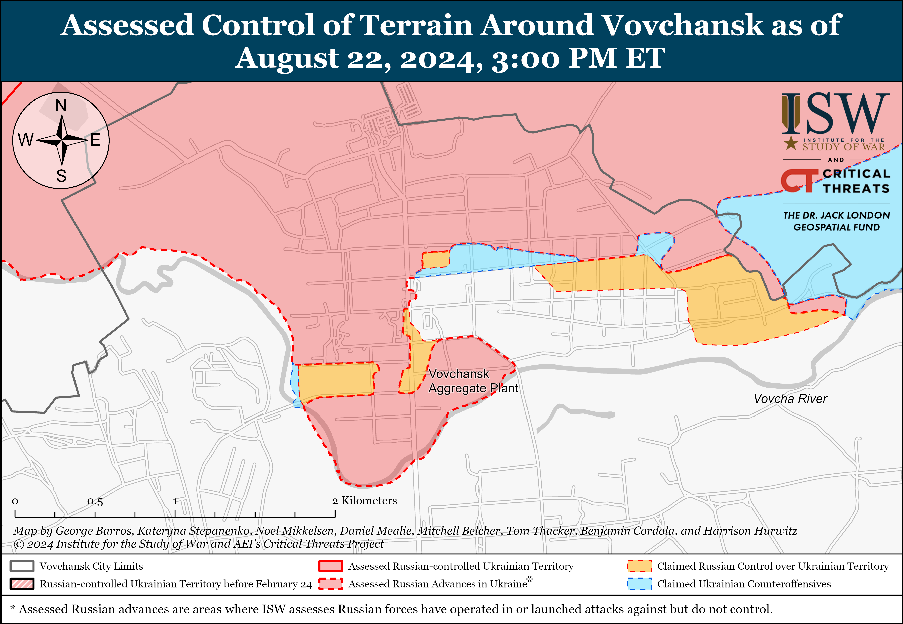](https://understandingwar.org/map/assessed-control-of-terrain-around-vovchansk-as-of-august-22-2024-300-pm-et/)

**Russian Subordinate Main Effort #2 – Luhansk Oblast (Russian objective: Capture the remainder of Luhansk Oblast and push westward into eastern Kharkiv Oblast and northern Donetsk Oblast)**

Ukrainian forces reportedly recently conducted a counterattack and advanced in an unspecified area in Kharkiv Oblast, likely along the Svatove-Kreminna line. A Ukrainian brigade reportedly operating in Kharkiv Oblast reported on August 22 that it seized a Russian battalion-sized defense area and platoon and company-sized positions and advanced almost two kilometers deep in Kharkiv Oblast on August 15.[54] The brigade’s commander stated that the Ukrainian counterattack aimed to decrease the offensive potential of the Russian 20th Combined Arms Army ([CAA], Moscow Military District [MMD]), and ISW has observed elements of the 20th CAA operating northwest of Kreminna near Makiivka and Nevske.[55] The brigade noted that Russian forces sustained significant losses despite having a manpower advantage of 2.5 to one and that the Ukrainian counterattack diverted a Russian attack in the Makiivka direction and relieved the pressure on Ukrainian defenses in neighboring areas of this front.

A Kremlin-affiliated military expert claimed on August 22 that Russian forces achieved a tactical advance near Kupyansk and weakened Ukrainian positions near Pishchane (southeast of Kupyansk), and a Russian milblogger claimed that Russian forces continued to advance north of Pishchane.[56] ISW has not observed visual confirmation of these claims. The Ukrainian General Staff reported that Russian forces also attacked northeast of Kupyansk near Synkivka; east of Kupyansk near Petropavlivka; southeast of Kupyansk near Hlushkivka, Stelmakhivka, and Berestove and toward Lozova; west of Svatove near Andriivka; northwest of Kreminna near Hrekivka, Makiivka, Nevske, Serhiivka, and Novoserhiivka; west of Kreminna near Torske and Terny; and southwest of Kreminna near Dibrova on August 21 and 22.[57]

[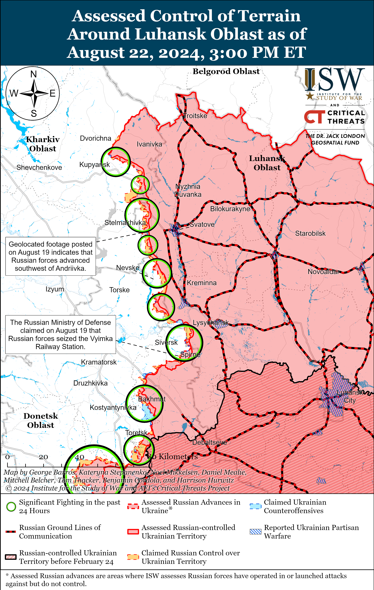](https://understandingwar.org/map/assessed-control-of-terrain-around-luhansk-oblast-as-of-august-22-2024-300-pm-et/)

**Russian Subordinate Main Effort #3 – Donetsk Oblast (Russian objective: Capture the entirety of Donetsk Oblast, the claimed territory of Russia’s proxies in Donbas)**

Russian forces recently marginally advanced in the Siversk direction amid continued fighting on August 22. Geolocated footage published on August 21 shows that Russian forces marginally advanced in eastern Bilohorivka (north of Siversk).[58] Russian forces reportedly continued ground attacks southeast of Siversk near Spirne and Vyimka on August 21 and 22.[59]

Russian forces recently marginally advanced within Chasiv Yar amid continued offensive operations on August 22. Geolocated footage published on August 22 shows that Russian forces recently marginally advanced within northeastern Chasiv Yar and northwest of Klishchiivka (southeast of Chasiv Yar).[60] The press officer of a Ukrainian brigade operating in the Chasiv Yar direction stated that Russian forces near Chasiv Yar are focusing their efforts on a 700-meter front in the Kalynivka area (northeast of Chasiv Yar) where the  Siverskyi Donets-Donbas Canal goes underground and creates a flat surface for advance and that Russian forces believe this area to be a weak point in Ukrainian defenses.[61] The press officer indicated that Russian forces do not have a significant, enduring presence on the west (right) bank of this canal and that limited elements of the Russian 98th Airborne (VDV) Division sometimes temporarily cross to the west bank before returning to the east (left) bank.[62] The press officer added that the number of Russian assaults in the Chasiv Yar direction fluctuates daily between 10 to 16 attacks and five to six attacks following Russian infantry casualties. The press officer also observed that Russian forces have stopped using mechanized forces and are now relying on purely infantry-led assaults.[63] Russian forces also continued attacks near Chasiv Yar; north of Chasiv Yar near Hryhorivka; southeast of Chasiv Yar near Ivanivske and Klishchiivka; and southwest of Chasiv Yar near Predtechyne on August 21 and 22.[64]

[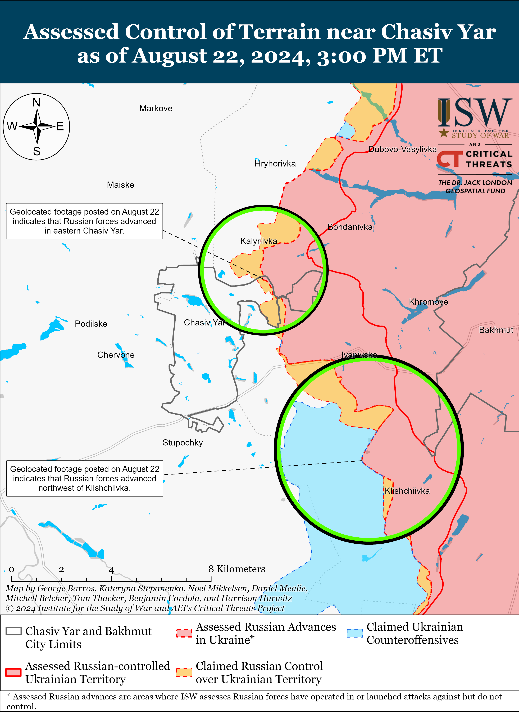](https://understandingwar.org/map/assessed-control-of-terrain-near-chasiv-yar-as-of-august-22-2024-300-pm-et/)

Russian forces recently advanced in the Toretsk direction. Geolocated footage published on August 18 and 21 shows that Russian forces advanced within western Zalizne (southeast of Toretsk) and central Druzhba (east of Toretsk).[65] A Russian milblogger claimed that Russian forces advanced 1.2 kilometers within Pivnichne (east of Toretsk) and up to the Toretsk-Niu York road (south of Toretsk).[66] Russian forces also continued ground attacks near Nelipivka and Panteleymonivka (both south of Toretsk) on August 21 and 22.[67] Elements of the Russian 1st “Slavic” Motorized Rifle Brigade (1st Donetsk People’s Republic Army Corps [DNR AC]) are reportedly fighting in Zalizne, and elements of the Russian 17th Artillery Brigade (3rd AC) are reportedly firing on targets near Ivanopillya (northwest of Toretsk).[68]

[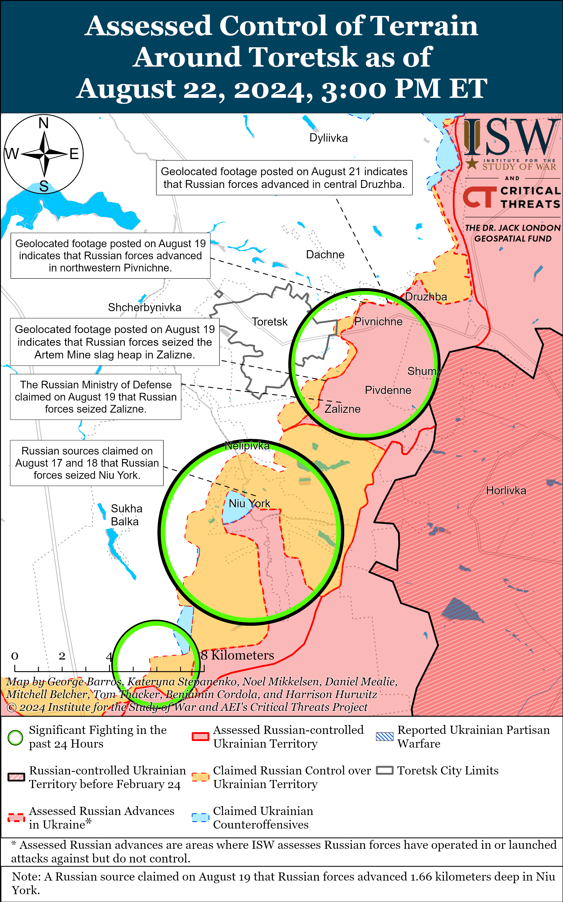](https://understandingwar.org/map/assessed-control-of-terrain-around-toretsk-as-of-august-22-2024-300-pm-et/)

Russian forces recently advanced in the Pokrovsk direction amid continued offensive operations on August 22. See the topline text for a discussion of Russian advances up to the east bank of the Vovcha River southeast of Pokrovsk.[69] Russian milbloggers claimed that Russian forces also advanced into eastern Novohrodivka and towards Kalynove from Ptyche (all southeast and east of Pokrovsk).[70] Russian forces reportedly continued offensive operations east of Pokrovsk near Vozdvyzhenka, Zelene Pole,  Kalynove, Hrodivka, Myrolyubivka, and Novotroitske; and southeast of Pokrovsk near Novohrodivka, Mykhailivka, Mykolaivka, Ptyche, and Komyshivka on August 21 and 22.[71] The Russian MoD retroactively announced on August 22 that the Russian Central Grouping of Forces (GoF) seized Mezhove (southeast of Pokrovsk). The spokesperson for a Ukrainian brigade operating in the Pokrovsk direction stated that Russian forces in this area have slightly reduced the number of their assaults since August 21 to regroup but renewed offensive operations along the Karlivka-Pokrovsk road (southeast of Pokrovsk) on the morning of August 22.[72] A Ukrainian drone operator told the*Associated Press* (AP) that Russian forces are relatively successful in the Pokrovsk direction because they are conducting ground attacks in groups of two to four soldiers, making them harder for Ukrainian drone operators to detect especially under the cover of trees.[73] Ukrainian military observer Kostyantyn Mashovets reported that elements of the Russian 2nd Combined Arms Army [CAA] (Central Military District [CMD]) advanced on the western bank of the Vovcha River southeast of Pokrovsk; elements of the 15th and 30th motorized rifle brigades (2nd CAA) reinforced by elements of the 1st DNR AC reached the Hrodivka-Novohrodivka line (east to southeast of Pokrovsk); elements 90th Tank Division (41st CAA, CMD) are operating south of the 2nd CAA’s frontline; and elements of the 27th Motorized Rifle Division and 15th and 30th motorized rifle brigades (all of 2nd CAA) and 114th Motorized Rifle Brigade (1st DNR AC) are all fighting in the Pokrovsk direction from Vozdvyzhenka to Karlivka (southeast of Pokrovsk and southwest of Avdiivka).[74]

[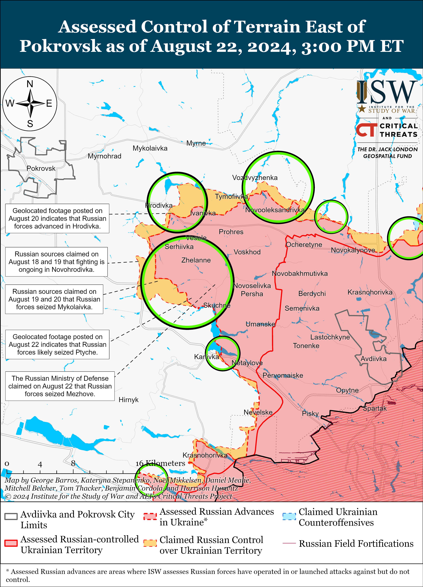](https://understandingwar.org/map/assessed-control-of-terrain-east-of-pokrovsk-as-of-august-22-2024-300-pm-et/)

Russian forces continued ground attacks west of Donetsk City near Heorhiivka on August 21 and 22.[75]

Russian forces reportedly advanced southwest of Donetsk City amid continued assaults in the area on August 22. Russian milbloggers claimed that Russian forces advanced north of Paraskoviivka (northeast of Vuhledar) and southeast of Vuhledar and that Russian forces have cut the O-0532 Kostyantynivka-Vuhledar highway in two places.[76]  Footage published on August 22 shows that Russian forces conducted a platoon-sized mechanized assault followed by a second, reduced-company sized assault against a Ukrainian brigade operating in the Kurakhove direction (west and southwest of Donetsk City).[77] The brigade reported that it damaged and destroyed a total of 13 Russian armored vehicles during both assaults.[78] Russian forces also continued ground assaults southwest of Donetsk City near Pobieda, Kostyantynivka, Vuhledar, Vodyane (southeast of Vuhledar), and Volodymyrivka (southeast of Vuhledar) on August 21 and 22.[79] Elements of the Russian 68th AC (EMD) and “Storm-1” detachment are reportedly fighting in Kostyantynivka.[80]

[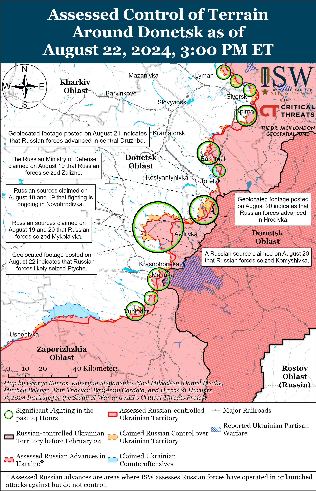](https://understandingwar.org/map/assessed-control-of-terrain-around-donetsk-as-of-august-22-2024-300-pm-et/)

Neither Russian nor Ukrainian sources reported on ground activity in the Donetsk-Zaporizhia Oblast border area on August 21.

**Russian Supporting Effort – Southern Axis (Russian objective: Maintain frontline positions and secure rear areas against Ukrainian strikes)**

The Ukrainian General Staff reported on August 22 that Russian forces reduced the intensity of their combat operations in the Hulyaipole and Orikhiv directions (both in western Zaporizhia Oblast) and in the Dnipro (Kherson Oblast) direction.[81] The Ukrainian General Staff added that Russian forces did not conduct offensive operations in western Zaporizhia and Kherson oblasts on August 22.[82] Elements of the Russian 81st Self-Propelled Artillery Regiment (likely a restored Soviet regiment) are reportedly operating in the Kherson direction.[83] The Ukrainian Navy reported on August 21 that Ukrainian forces struck a Russian ammunition, fuel, and lubricants warehouse on the Kinburn Spit, Mykolaiv Oblast.[84]

[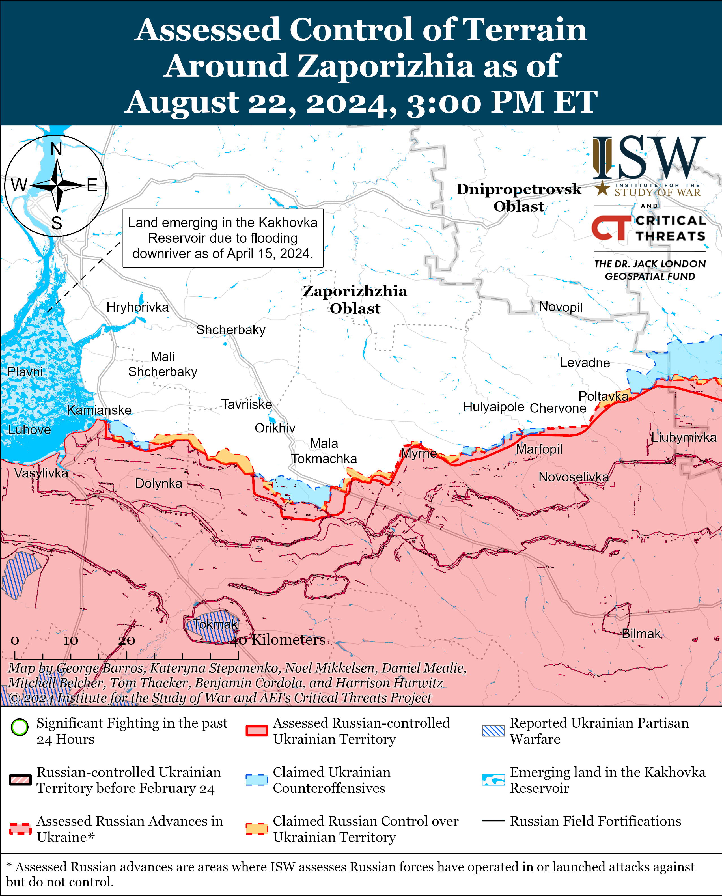](https://understandingwar.org/map/assessed-control-of-terrain-around-zaporizhia-as-of-august-22-2024-300-pm-et/)

Russian forces are reportedly constructing an unspecified infrastructure object along the Kerch Strait Bridge. Ukrainian Navy Spokesperson Captain Third Rank Dmytro Pletenchuk commented on the construction and hypothesized that Russian forces may be trying to “duplicate” the Kerch Strait Bridge.[85] Pletenchuk noted that this construction is “surprising” given that weather conditions in the Kerch Strait will likely worsen due to the stormy season starting in mid-fall. Pletenchuk also observed that Russian aviation and drones continue operating on the western and southern Crimean coasts and that Russian forces have been primarily using submarines to conduct defensive operations in the Black Sea for the past few months.[86]

[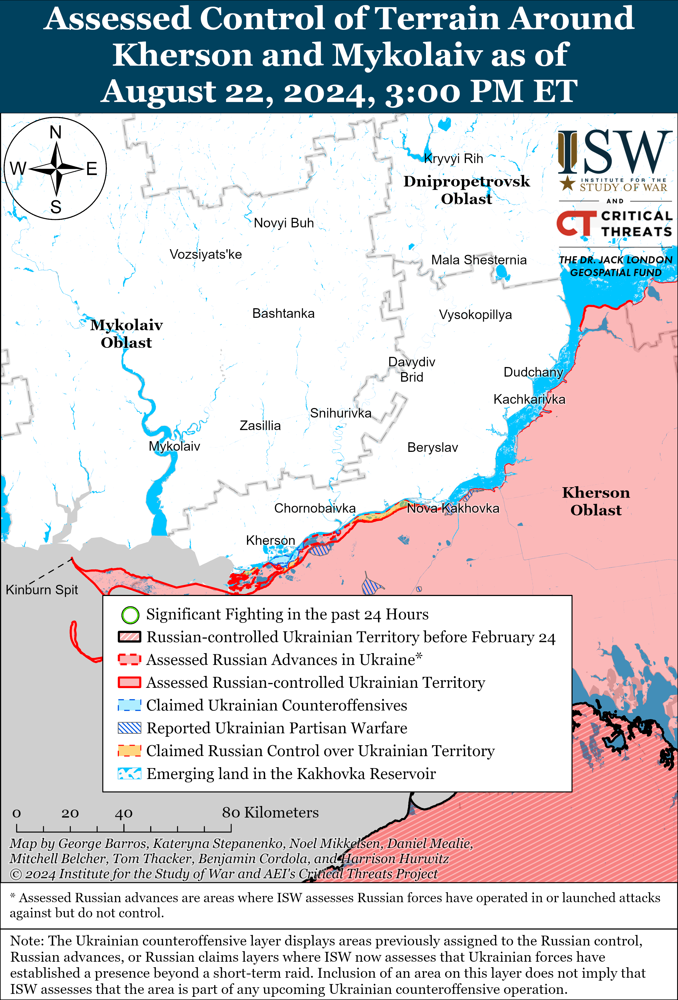](https://understandingwar.org/map/assessed-control-of-terrain-around-kherson-and-mykolaiv-as-of-august-22-2024-300-pm-et/)

**Russian Air, Missile, and Drone Campaign (Russian Objective: Target Ukrainian military and civilian infrastructure in the rear and on the frontline)**

Russian forces also conducted a series of missile strikes against Ukraine on the night of August 21 to 22. Ukrainian Air Force Commander Lieutenant General Mykola Oleshchuk reported on August 22 that Russian forces launched an unspecified number of Kh-31P anti-radar missiles from aircraft over the Black Sea and two Iskander-M ballistic missiles from Belgorod Oblast and occupied Crimea.[87] Oleshchuk reported that the Russian missiles did not reach their targets due to unspecified Ukrainian “active countermeasures.” Kharkiv Oblast Military Administration Head Oleh Synehubov reported that Russian forces have launched four Kh-35 missiles and an Iskander missile of an unspecified variety at civilian infrastructure in Kharkiv Oblast since the morning of August 21.[88] Mykolaiv Oblast Military Administration Head Vitaliy Kim reported that a Russian Iskander-M missile strike caused a fire in residential areas of Bereznehuvate Hromada, Mykolaiv Oblast on the evening of August 21.[89]

**Russian Mobilization and Force Generation Efforts (Russian objective: Expand combat power without conducting general mobilization)**

Russian State Duma Committee on Information Policy Head Alexander Khinshtein stated on August 21 that the Russian Union of Journalists and Ministry of Digital Development submitted a bill to the Cabinet of Ministers proposing to grant veteran status to journalists who have worked in Ukraine, the “counter-terrorism operation” zone in Kursk Oblast, and other unspecified combat zones.[90] Khinshtein reported that media employees from occupied Luhansk, Donetsk, Zaporizhia, and Kherson oblasts would also be eligible for combat veteran status and that the bill would provide journalists the same rights and benefits as other combat veterans. Russian authorities likely also plan to use this bill to provide military correspondents (*voenkory*) with veteran status – a long-term request of *voenkory*– in an effort to co-opt them and to strengthen the Kremlin’s control over the war coverage.

Russian officials appear to be conducting a federal-level recruitment campaign amid continued efforts to incentivize volunteer and contract military service in the Russian military. Russian propagandist Vladimir Solovyov published a high-budget, professional recruitment ad on August 21 indicating that the Russian government may be trying to leverage national figures in its recruitment efforts on a federal level.[91] The Russian government has previously organized its recruitment campaigns on the regional level and have relied on regional officials to encourage and incentivize military service, which has recently resulted in Russian federal subjects (regions) offering significant one-time financial incentives to prospective recruits.[92]

Russian state defense conglomerate Rostec CEO Sergei Chemezov praised Russia’s defense industrial capabilities during an interview with Kremlin newswire *TASS* on August 22.[93] Chemezov claimed that Russia’s defense export portfolio is currently worth $60 billion and that the world continues to be impressed by how Russian military equipment performs on the battlefield in Ukraine. Chemezov claimed that Russian defense companies are prioritizing the delivery of equipment to Russian units in Ukraine and noted that secondary sanctions are not affecting Rostec’s ability to conclude contracts with foreign customers.

Russian President Vladimir Putin appointed Russian Defense Minister Andrei Belousov and Russian Minister of Industry and Trade Anton Alikhanov to the board of Russia’s Military-Industrial Commission on August 22.[94]

**Russian Technological Adaptations (Russian objective: Introduce technological innovations to optimize systems for use in Ukraine)**

Nothing significant to report.

**Ukrainian Defense Industrial Efforts (Ukrainian objective: Develop its defense industrial base to become more self-sufficient in cooperation with US, European, and international partners)**

*ISW is suspending publishing coverage of Ukrainian defense industrial efforts until further notice.*

**Activities in Russian-occupied areas (Russian objective: Consolidate administrative control of annexed areas; forcibly integrate Ukrainian citizens into Russian sociocultural, economic, military, and governance systems)**

*ISW is not publishing coverage of activities in Russian-occupied areas today.*

**Russian Information Operations and Narratives**

The *New York Times* reported on August 21 that the US Department of Justice (DoJ) is investigating US citizens who are currently working and have worked for Russian state TV networks in an effort to combat Kremlin information operations that are attempting to influence US politics ahead of the 2024 presidential election.[95] The *New York Times*reported that the investigations are currently focused on potential sanctions violations and the violations of laws requiring individuals to disclose lobbying efforts on behalf of foreign governments.[96] Russian Ministry of Foreign Affairs (MFA) Spokesperson Maria Zakharova called for international organizations to respond to the *New York Times*report in an apparent appeal to press freedom that was aimed at distracting from the ongoing malign Kremlin informational effort targeting the US.[97]

Russian government and Russian Orthodox Church (ROC) officials continue to falsely allege that Ukraine is violating religious freedom as part of ongoing Russian efforts to weaken international support for Ukraine while appealing to domestic religious ultra-nationalists. The Russian Permanent Representative to the Organization for Security and Co-operation in Europe (OSCE), Alexander Lukashevich, stated on August 22 that Ukraine’s recent ban against the Ukrainian Orthodox Church Moscow Patriarchate (UOC MP) is a violation of religious freedom in Ukraine, and the Russian Orthodox Church Holy Synod accused Archbishop of Constantinople Patriarch Bartholomew of bearing responsibility for the ban and worsening the “church schism” in Ukraine.[98] ISW has reported at length on the links between the Kremlin-controlled ROC’s spiritual doctrine and the Kremlin’s pro-war ideology and has observed that the UOC MP is not an independent religious organization but an extension of the Kremlin and a tool of Russian hybrid warfare that seeks to enforce Russian ideologies in Ukrainian society and persecute religious minorities in occupied Ukraine.[99]

**Significant activity in Belarus (Russian efforts to increase its military presence in Belarus and further integrate Belarus into Russian-favorable frameworks and Wagner Group activity in Belarus)**

Ukrainian State Border Service Spokesperson Andriy Demchenko stated on August 22 that recent Belarusian statements about significant Belarusian military deployments to the border with Ukraine are false.[100] Demchenko stated that the situation along the Belarusian-Ukrainian border has not changed and that Belarusian military redeployments have occurred further into Belarusian territory.[101] Russian and Belarusian officials have previously conducted information operations suggesting that Belarusian forces might escalate along the border with Ukraine in order to draw and fix Ukrainian forces to the Belarusian border, but Belarus will almost certainly not directly enter the war in Ukraine.[102]

Belarusian President Alexander Lukashenko met with People’s Republic of China (PRC) Premier Li Qiang in Minsk on August 22 and discussed Chinese technology imports to Belarus and joint Belarusian-PRC investment projects.[103] Lukashenko stated that Belarus and the PRC will sign an agreement establishing a free trade zone for services and investment during Li’s visit.[104]

**Note: ISW does not receive any classified material from any source, uses only publicly available information, and draws extensively on Russian, Ukrainian, and Western reporting and social media as well as commercially available satellite imagery and other geospatial data as the basis for these reports. References to all sources used are provided in the endnotes of each update.**

---

[1] https://pobedagazeta dot ru/archives/37312; https://m.vk.com/video6937030\_456239128?list=2f934a9a5566e61c3c&from=wall6937030\_2001 ; https://vk.com/id6937030

[2] https://x.com/JohnH105/status/1826724125164925110; https://t.me/DWB56SVOROSSIYA/3169; https://t.me/DWB56SVOROSSIYA/3172 ; https://x.com/kromark/status/1826730120884707581 ; https://t.me/rusich\_army/16569

[3] https://understandingwar.org/wp-content/uploads/2024/08/Aug201420Russian20Offensive20Campaign20Assessment20PDF.pdf

[4] https://t.me/Crimeanwind/65922

[5] https://x.com/kromark/status/1825952814000124257; https://x.com/kromark/status/1826194829535027402; https://x.com/kromark/status/1826197827690590270; https://x.com/kromark/status/1826199795050156176; https://x.com/kromark/status/1826204042625794406; https://x.com/kromark/status/1826205405514551806; https://x.com/kromark/status/1826215832512270606; https://x.com/kromark/status/1826220860593803483; https://x.com/kromark/status/1826561630919966842; https://x.com/kromark/status/1826674725780873265; https://x.com/kromark/status/1826731161235923374

[6] https://t.me/karymat/8797; https://t.me/lost\_warinua/87296; https://t.me/z\_arhiv/27732 ; https://t.me/zogrussia1/706 ; https://archive.ph/FQXVv; https://t.me/orchestra\_w

[7] https://understandingwar.org/backgrounder/russian-offensive-campaign-assessment-july-8-2024

[8] https://understandingwar.org/wp-content/uploads/2024/08/Aug201420Russian20Offensive20Campaign20Assessment20PDF.pdf

[9] https://understandingwar.org/wp-content/uploads/2024/08/Russian20Offensive20Campaign20Assessment2C20August20132C20202420PDF\_0.pdf ; https://understandingwar.org/backgrounder/russian-offensive-campaign-assessment-june-22-2024

[10] https://understandingwar.org/backgrounder/russian-offensive-campaign-assessment-august-28-2023

[11] https://understandingwar.org/backgrounder/russian-offensive-campaign-assessment-august-21-2024-0

[12] https://www.facebook.com/GeneralStaff.ua/posts/pfbid0G4f6D71JiatGZzyq1GfZwppZyKurD55Xf2z9L4ikT1vbtXzXM4C3qZbUxyzFTo5sl

[13] https://novayagazeta dot eu/articles/2024/08/19/akhmat-kulibin-i-piatnashka

[14] https://novayagazeta dot eu/articles/2024/08/19/akhmat-kulibin-i-piatnashka

[15] https://isw.pub/UkrWar080924 ; https://isw.pub/UkrWar080924 ; https://isw.pub/UkrWar081024

[16] https://understandingwar.org/backgrounder/assessing-significance-current-russian-and-ukrainian-operations-course-war

[17] http://www.kremlin dot ru/supplement/6181 ; http://www.kremlin dot ru/events/president/news/74919

[18] https://understandingwar.org/backgrounder/russian-offensive-campaign-assessment-august-2-2023

[19] https://understandingwar.org/backgrounder/russian-offensive-campaign-assessment-august-2-2023

[20] https://understandingwar.org/backgrounder/russian-offensive-campaign-assessment-august-21-2024-0

[21] https://understandingwar.org/backgrounder/russian-offensive-campaign-assessment-september-29-2023

[22] https://isw.pub/UkrWar082024 ; https://isw.pub/UkrWar081424 ; https://isw.pub/UkrWar081324

[23] https://isw.pub/UkrWar081924

[24] https://t.me/creamy\_caprice/6467; https://t.me/RVvoenkor/75356

 ; https://t.me/dva\_majors/50382   ; https://t.me/mod\_russia/42453   ; https://t.me/rusich\_army/16688   ; https://t.me/RVvoenkor/75356

[25] https://t.me/motopatriot/26479 ; https://t.me/rybar/62968   ;; https://t.me/motopatriot/26479

[26] https://t.me/karymat/8797; https://t.me/lost\_warinua/87296

[27] https://t.me/wargonzo/21687 ; https://t.me/boris\_rozhin/134501 ; https://t.me/milinfolive/128943  ; https://t.me/RVvoenkor/75361 ; https://t.me/dva\_majors/50430 ; https://t.me/warhistoryalconafter/180741 ; https://t.me/rybar/62968  ; https://t.me/DnevnikDesantnika/14352 ; https://t.me/Sladkov\_plus/11222   ; https://t.me/rusich\_army/16688

[28] https://t.me/rybar/62957 ; https://t.me/rybar/62968  ; https://t.me/motopatriot/26479   ; https://t.me/dva\_majors/50382  https://t.me/dva\_majors/50430 ; https://t.me/warhistoryalconafter/180741

[29] https://t.me/tass\_agency/267676 ; https://t.me/dva\_majors/50359 ; https://t.me/dva\_majors/50377; https://t.me/rybar/62960  ; https://t.me/breakingmash/56918 ; https://t.me/NgP\_raZVedka/18771; ; https://t.me/NgP\_raZVedka/18772  ; https://t.me/DnevnikDesantnika/14350

[30] https://t.me/SolovievLive/275349; https://t.me/creamy\_caprice/6481;

[31] https://understandingwar.org/backgrounder/russian-offensive-campaign-assessment-july-28-2024

[32] https://suspilne dot media/donbas/819119-boi-vihodat-na-trasu-pokrovsk-karlivka-u-59-j-brigadi-poasnili-vidhid-z-pevnih-dilanok/

[33] https://apnews.com/article/russia-ukraine-war-new-recruits-pokrovsk-ed2d06ad529e3b7e47ecd32f79911b83

[34] https://understandingwar.org/backgrounder/russian-offensive-campaign-assessment-july-28-2024

[35] https://suspilne dot media/donbas/819337-casiv-ar-ta-kanal-ake-misce-rosiani-vvazaut-slabkim-i-comu-sturmuut-same-z-boku-kalinivki/ ; https://suspilne dot media/donbas/819119-boi-vihodat-na-trasu-pokrovsk-karlivka-u-59-j-brigadi-poasnili-vidhid-z-pevnih-dilanok/

[36] https://suspilne dot media/donbas/819119-boi-vihodat-na-trasu-pokrovsk-karlivka-u-59-j-brigadi-poasnili-vidhid-z-pevnih-dilanok/

[37] https://armyinform dot com.ua/2024/08/18/promaczaty-ukrayinsku-oboronu-shho-namagayetsya-robyty-vorog-na-harkivskomu-napryamku-rozpovily-v-zsu/

[38] https://armyinform dot com.ua/2024/08/18/promaczaty-ukrayinsku-oboronu-shho-namagayetsya-robyty-vorog-na-harkivskomu-napryamku-rozpovily-v-zsu/

[39] https://understandingwar.org/backgrounder/russian-offensive-campaign-assessment-august-18-2024

[40] https://armyinform dot com.ua/2024/08/15/zmenshennya-kilkosti-udariv-kabamy-po-sumshhyni-mynuloyi-doby-poyasnyly-v-zsu/

[41] https://t.me/kpszsu/18088; https://armyinform dot com.ua/2024/08/22/povitryani-syly-ppo-zbyla-dva-shahedy-bilshist-vorozhyh-raket-ne-dosyagly-czilej/

[42] https://understandingwar.org/backgrounder/russian-offensive-campaign-assessment-august-15-2024 ; https://isw.pub/UkrWar081424 ; https://isw.pub/UkrWar080924 ; https://isw.pub/UkrWar080524

[43] https://suspilne dot media/818897-minoboroni-rf-zaavilo-pro-ataku-28-ukrainskih-droniv-u-volgogradskij-oblasti-gorit-vijskovij-obekt/; https://suspilne dot media/818841-gur-atakuvalo-aerodrom-savaslejka-rada-ratifikuvala-rimskij-statut-svitlo-ne-vimikatimut-911-den-vijni-onlajn/; https://t.me/ButusovPlus/12955; https://www.pravda.com dot ua/rus/news/2024/08/22/7471401/; https://meduza dot io/news/2024/08/22/volgogradskuyu-oblast-atakovali-drony-po-dannym-telegram-kanalov-tselyu-byl-voennyy-aerodrom

[44] https://t.me/kiber\_boroshno/9642 ; https://x.com/MT\_Anderson/status/1826467369809514975  ; https://x.com/MT\_Anderson/status/1826643666934661462 ; https://x.com/MT\_Anderson/status/1826657803408404865  ; https://t.me/exilenova\_plus/1726 ; https://vk dot com/wall-194368310\_33152 ; https://t.me/vlgchp/18589 ; https://x.com/666\_mancer/status/1826499855071449532

[45] https://t.me/opershtab23/8425 ; https://t.me/opershtab23/8429 ;  https://t.me/tass\_agency/267861 ; https://t.me/tass\_agency/267862 ; https://t.me/tass\_agency/267867 ; https://t.me/tass\_agency/267868 ; https://t.me/opershtab23/8430   ; https://www.interfax dot ru/russia/977704; https://www.interfax dot ru/russia/977703?utm\_source=interlink&utm\_medium=977704

[46] https://t.me/Crimeanwind/65951

[47] https://t.me/tass\_agency/267853 ; https://t.me/tass\_agency/267854 ; https://t.me/tass\_agency/267855 ; https://t.me/rybar/62973 ; https://ura dot news/news/1052808610; https://t.me/vchkogpu/50179

[48] https://www.twz.com/news-features/signals-intelligence-center-targeted-in-drone-attack-on-moscow-ukraines-intel-chief

[49] https://understandingwar.org/backgrounder/russian-offensive-campaign-assessment-august-21-2024-0

[50] https://www.facebook.com/GeneralStaff.ua/posts/pfbid02HM2azfSZfYjuDW2DUDt3UNDoayZzNwqYYZxhnGXuYqYrybcnQEvqSvigNcoBTdhWl ; https://www.facebook.com/GeneralStaff.ua/posts/pfbid0G4f6D71JiatGZzyq1GfZwppZyKurD55Xf2z9L4ikT1vbtXzXM4C3qZbUxyzFTo5sl ; https://www.facebook.com/GeneralStaff.ua/posts/pfbid0bAGPBKtUQDmPiNEgbjnvzCaS35cyv2TxBcBW4YM82sDz9wTqRxbkJAxAxm99edKPl ; https://t.me/wargonzo/21690

[51] https://t.me/RVvoenkor/75417

[52] https://t.me/otukharkiv/862

[53] https://t.me/otukharkiv/862

[54] https://t.me/ab3army/4504

[55] https://understandingwar.org/backgrounder/russian-offensive-campaign-assessment-august-11-2024; https://t.me/rusich\_army/15792; https://understandingwar.org/backgrounder/russian-offensive-campaign-assessment-june-20-2024 ; https://t.me/ab3army/4504

[56] https://tass dot ru/armiya-i-opk/21659215; https://t.me/motopatriot/26508

[57] https://www.facebook.com/GeneralStaff.ua/posts/pfbid02HM2azfSZfYjuDW2DUDt3UNDoayZzNwqYYZxhnGXuYqYrybcnQEvqSvigNcoBTdhWl ; https://www.facebook.com/GeneralStaff.ua/posts/pfbid0G4f6D71JiatGZzyq1GfZwppZyKurD55Xf2z9L4ikT1vbtXzXM4C3qZbUxyzFTo5sl  ; https://www.facebook.com/GeneralStaff.ua/posts/pfbid0bAGPBKtUQDmPiNEgbjnvzCaS35cyv2TxBcBW4YM82sDz9wTqRxbkJAxAxm99edKPl

[58] https://t.me/WarArchive\_ua/19074; https://t.me/sowaFm/481

[59] https://www.facebook.com/GeneralStaff.ua/posts/pfbid02HM2azfSZfYjuDW2DUDt3UNDoayZzNwqYYZxhnGXuYqYrybcnQEvqSvigNcoBTdhWl; https://www.facebook.com/GeneralStaff.ua/posts/pfbid0G4f6D71JiatGZzyq1GfZwppZyKurD55Xf2z9L4ikT1vbtXzXM4C3qZbUxyzFTo5sl; https://www.facebook.com/GeneralStaff.ua/posts/pfbid0bAGPBKtUQDmPiNEgbjnvzCaS35cyv2TxBcBW4YM82sDz9wTqRxbkJAxAxm99edKPl

[60] https://t.me/creamy\_caprice/6479; https://t.me/EnotHersonVDV/3728; https://t.me/ptashkaDoDo/612; https://t.me/creamy\_caprice/6478

[61] https://suspilne dot media/donbas/819337-casiv-ar-ta-kanal-ake-misce-rosiani-vvazaut-slabkim-i-comu-sturmuut-same-z-boku-kalinivki/

[62] https://suspilne dot media/donbas/819337-casiv-ar-ta-kanal-ake-misce-rosiani-vvazaut-slabkim-i-comu-sturmuut-same-z-boku-kalinivki/

[63] https://armyinform dot com.ua/2024/08/22/u-sylah-oborony-rozpovily-pro-lavyny-rosijskyh-atak-poblyzu-chasovogo-yaru/; https://www.youtube.com/watch?v=aDXWlQ2K0dM

[64] https://www.facebook.com/GeneralStaff.ua/posts/pfbid02HM2azfSZfYjuDW2DUDt3UNDoayZzNwqYYZxhnGXuYqYrybcnQEvqSvigNcoBTdhWl; https://www.facebook.com/GeneralStaff.ua/posts/pfbid0G4f6D71JiatGZzyq1GfZwppZyKurD55Xf2z9L4ikT1vbtXzXM4C3qZbUxyzFTo5sl; https://www.facebook.com/GeneralStaff.ua/posts/pfbid0bAGPBKtUQDmPiNEgbjnvzCaS35cyv2TxBcBW4YM82sDz9wTqRxbkJAxAxm99edKPl; https://t.me/z\_arhiv/27733; https://t.me/rusich\_army/16691

[65] https://x.com/Alerivan\_/status/1826599427425140805; https://t.me/Kalashmat\_DNR/2837; https://t.me/creamy\_caprice/6469; https://t.me/kurt\_compani\_group/422

[66] https://t.me/DnevnikDesantnika/14365

[67] https://www.facebook.com/GeneralStaff.ua/posts/pfbid02HM2azfSZfYjuDW2DUDt3UNDoayZzNwqYYZxhnGXuYqYrybcnQEvqSvigNcoBTdhWl; https://www.facebook.com/GeneralStaff.ua/posts/pfbid0G4f6D71JiatGZzyq1GfZwppZyKurD55Xf2z9L4ikT1vbtXzXM4C3qZbUxyzFTo5sl; https://www.facebook.com/GeneralStaff.ua/posts/pfbid0bAGPBKtUQDmPiNEgbjnvzCaS35cyv2TxBcBW4YM82sDz9wTqRxbkJAxAxm99edKPl;

[68] https://x.com/Alerivan\_/status/1826599427425140805; https://t.me/Kalashmat\_DNR/2837; https://t.me/boris\_rozhin/134543

[69] https://t.me/SolovievLive/275349; https://t.me/creamy\_caprice/6481 ; https://t.me/vrogov/17164

[70] https://t.me/motopatriot/26493; https://t.me/dva\_majors/50384; https://t.me/DnevnikDesantnika/14351; https://t.me/RVvoenkor/75354; https://t.me/RVvoenkor/75370; https://t.me/DnevnikDesantnika/14358; https://t.me/boris\_rozhin/134545

[71] https://www.facebook.com/GeneralStaff.ua/posts/pfbid02HM2azfSZfYjuDW2DUDt3UNDoayZzNwqYYZxhnGXuYqYrybcnQEvqSvigNcoBTdhWl; https://www.facebook.com/GeneralStaff.ua/posts/pfbid02HM2azfSZfYjuDW2DUDt3UNDoayZzNwqYYZxhnGXuYqYrybcnQEvqSvigNcoBTdhWl; https://www.facebook.com/GeneralStaff.ua/posts/pfbid0bAGPBKtUQDmPiNEgbjnvzCaS35cyv2TxBcBW4YM82sDz9wTqRxbkJAxAxm99edKPl; https://t.me/dva\_majors/50384;     https://t.me/z\_arhiv/27730; https://t.me/boris\_rozhin/134545

[72] https://armyinform dot com.ua/2024/08/22/u-sylah-oborony-rozpovily-pro-lavyny-rosijskyh-atak-poblyzu-chasovogo-yaru/; https://www.youtube.com/watch?v=aDXWlQ2K0dM

[73] https://apnews.com/article/russia-ukraine-war-new-recruits-pokrovsk-ed2d06ad529e3b7e47ecd32f79911b83

[74] https://t.me/zvizdecmanhustu/2127; https://t.me/zvizdecmanhustu/2127;

[75] https://www.facebook.com/GeneralStaff.ua/posts/pfbid0G4f6D71JiatGZzyq1GfZwppZyKurD55Xf2z9L4ikT1vbtXzXM4C3qZbUxyzFTo5sl; https://www.facebook.com/GeneralStaff.ua/posts/pfbid0bAGPBKtUQDmPiNEgbjnvzCaS35cyv2TxBcBW4YM82sDz9wTqRxbkJAxAxm99edKPl

[76] https://t.me/rybar/62966; https://t.me/DnevnikDesantnika/14344

[77] https://armyinform.com dot ua/2024/08/22/detonacziya-bk-samoznyshhennya-rosiyan-udar-po-skladah-rf-strim-z-pryfrontovogo-mista/

[78] https://armyinform.com dot ua/2024/08/22/detonacziya-bk-samoznyshhennya-rosiyan-udar-po-skladah-rf-strim-z-pryfrontovogo-mista/

[79] https://www.facebook.com/GeneralStaff.ua/posts/pfbid0G4f6D71JiatGZzyq1GfZwppZyKurD55Xf2z9L4ikT1vbtXzXM4C3qZbUxyzFTo5sl; https://www.facebook.com/GeneralStaff.ua/posts/pfbid02HM2azfSZfYjuDW2DUDt3UNDoayZzNwqYYZxhnGXuYqYrybcnQEvqSvigNcoBTdhWl; https://www.facebook.com/GeneralStaff.ua/posts/pfbid0bAGPBKtUQDmPiNEgbjnvzCaS35cyv2TxBcBW4YM82sDz9wTqRxbkJAxAxm99edKPl; https://t.me/dva\_majors/50382; https://t.me/wargonzo/21690

[80] https://t.me/voin\_dv/10405

[81] https://www.facebook.com/GeneralStaff.ua/posts/pfbid0G4f6D71JiatGZzyq1GfZwppZyKurD55Xf2z9L4ikT1vbtXzXM4C3qZbUxyzFTo5sl

[82] https://www.facebook.com/GeneralStaff.ua/posts/pfbid0G4f6D71JiatGZzyq1GfZwppZyKurD55Xf2z9L4ikT1vbtXzXM4C3qZbUxyzFTo5sl

[83] https://t.me/dva\_majors/50390; https://podolyaka dot ru/81-y-samohodno-artilleriyskiy-polk-pokazyvaet-naskolko-vazhny-drony-dlya-kontrbatareynoy-borby/

[84] https://www.facebook.com/watch/?v=1466509957326095

[85] https://armyinform dot com.ua/2024/08/22/vms-zsu-prokomentuvaly-zagadkovyj-obyekt-yakyj-buduyut-rosiyany/

[86] https://armyinform dot com.ua/2024/08/22/dmytro-pletenchuk-poyasnyv-chomu-vorozhyj-flot-ne-ryzykuye-vyhodyty-v-more/; https://www.youtube.com/watch?v=j5TqaWCCdUg  ; https://armyinform dot com.ua/2024/08/22/u-vms-zsu-rozpovily-shho-pereshkodzhaye-nashomu-povnomu-kontrolyu-nad-akvatoriyeyu-chornogo-morya/

[87] https://t.me/kpszsu/18088

[88] https://t.me/synegubov/10786 ; https://armyinform dot com.ua/2024/08/22/iskanderom-ta-chotyrma-raketamy-h-35-vdaryly-rosiyany-po-harkivshhyni-mynuloyi-doby/

[89] https://armyinform dot com.ua/2024/08/22/protyvnyk-vdaryv-iskanderom-po-fermerskomu-gospodarstvu-na-mykolayivshhyni/; https://t.me/mykolaivskaODA/11062

[90] https://t.me/Hinshtein/7468 ; https://t.me/tass\_agency/267672

[91] https://t.me/SolovievLive/275229

[92] https://isw.pub/UkrWar110422 ; https://understandingwar.org/backgrounder/russian-offensive-campaign-assessment-september-28 ; https://isw.pub/RusCampaignAugust25 ; https://isw.pub/RusCampaignAugust26 ; https://understandingwar.org/backgrounder/russian-offensive-campaign-assessment-july-31-2024 ; https://understandingwar.org/backgrounder/russian-offensive-campaign-assessment-august-3-2024 ; https://understandingwar.org/backgrounder/russian-offensive-campaign-assessment-july-17-2024

[93] https://tass dot ru/interviews/21655923

[94] http://publication dot pravo.gov.ru/document/0001202408220032 ; https://tass dot ru/armiya-i-opk/21665153

[95] https://www.nytimes.com/2024/08/21/technology/us-fbi-russia-election-disinformation.html

[96] https://www.nytimes.com/2024/08/21/technology/us-fbi-russia-election-disinformation.html

[97] https://t.me/tass\_agency/267744

[98] https://t.me/tass\_agency/267762 ; https://t.me/MID\_Russia/44365

[99] https://understandingwar.org/backgrounder/ukraine-conflicts-updates-january-2-may-31-2024; https://understandingwar.org/backgrounder/russian-offensive-campaign-assessment-april-9-2023; https://isw.pub/UkrWar031423; https://isw.pub/UkrWar112823; https://isw.pub/UkrWar042823

[100] https://armyinform dot com.ua/2024/08/22/chy-ye-nebezpeka-z-boku-biloruskogo-kordonu-poyasnyly-u-derzhprykordonsluzhbi/; https://youtu.be/j5TqaWCCdUg

[101] https://armyinform dot com.ua/2024/08/22/chy-ye-nebezpeka-z-boku-biloruskogo-kordonu-poyasnyly-u-derzhprykordonsluzhbi/; https://youtu.be/j5TqaWCCdUg

[102] https://understandingwar.org/backgrounder/russian-offensive-campaign-assessment-december-11 ; https://understandingwar.org/backgrounder/russian-offensive-campaign-assessment-august-18-2024

[103] https://t.me/belta\_telegramm/264752;  https://www.belta dot by/president/view/lukashenko-nazval-samuju-aktualnuju-zadachu-v-sotrudnichestve-s-kitaem-655915-2024/ ; https://t.me/pul\_1/13417 ; https://t.me/belta\_telegramm/264753 ; https://www.belta dot by/president/view/belarus-prorabatyvaet-s-kitaem-15-strategicheskih-investproektov-na-3-mlrd-655927-2024/ ; https://t.me/pul\_1/13416 ; https://t.me/belta\_telegramm/264751 ; https://www.belta dot by/president/view/lukashenko-predlozhil-knr-realizovat-bolshoj-prihod-kitajskih-tehnologij-v-belarus-655914-2024/   ; https://t.me/pul\_1/13412 ; https://t.me/pul\_1/13413 ; https://t.me/pul\_1/13414 ; https://t.me/pul\_1/13415 ; https://t.me/belta\_telegramm/264740 ; https://t.me/belta\_telegramm/264743 ; https://t.me/belta\_telegramm/264746;

[104] https://t.me/belta\_telegramm/264754; https://www.belta dot by/president/view/belarus-i-kitaj-podpishut-soglashenie-ob-investitsijah-i-zone-svobodnoj-torgovli-uslugami-655919-2024/
