# Russian Offensive Campaign Assessment, August 23, 2024

**Angelica Evans, Christina Harward, Riley Bailey, Davit Gasparyan, Grace Mappes, George Barros**

**August 23, 2024, 7:05pm ET**

**Click [here](https://storymaps.arcgis.com/stories/36a7f6a6f5a9448496de641cf64bd375)to see ISW’s interactive map of the Russian invasion of Ukraine. This map is updated daily alongside the static maps present in this report.**

**Click [here](https://storymaps.arcgis.com/stories/83a2f24901c941d581c0c523ecd2619b) to see ISW’s interactive map of Ukraine’s offensive in Kursk Oblast.**

**Click [here](https://understandingwar.maps.arcgis.com/apps/instant/3dviewer/index.html?appid=1602762dbcde419bb957dea358449580) to see ISW’s 3D control of terrain topographic map of Ukraine. Use of a computer (not a mobile device) is strongly recommended for using this data-heavy tool.**

**Click [here](https://storymaps.arcgis.com/stories/733fe90805894bfc8562d90b106aa895) to access ISW’s archive of interactive time-lapse maps of the Russian invasion of Ukraine. These maps complement the static control-of-terrain map that ISW produces daily by showing a dynamic frontline. ISW will update this time-lapse map archive monthly.**

**Note: The data cut-off for this product was 12:15pm ET on August 23. ISW will cover subsequent reports in the August 24 Russian Offensive Campaign Assessment.**

**Ukrainian forces continued to marginally advance near Sudzha amid continued Ukrainian operations in Kursk Oblast on August 23.**Geolocated footage published on August 22 indicates that Ukrainian forces recently advanced further in southern Russkaya Konopelka (east of Sudzha).[1] A Russian milblogger claimed that Ukrainian forces also advanced north of Martynovka (northeast of Sudzha) along the Sudzha-Sukhodolovka R-200 highway.[2] Russian sources claimed that there are conflicting reports about fighting east of Sudzha near Samoryadovo and Kozyrevka, but that Ukrainian mobile groups may be operating in the area.[3] Some Russian milbloggers claimed that Russian forces re-took Spalnoye and Krupets (both southeast of Sudzha), although the situation in the area remains unclear.[4] Russian milbloggers claimed that Russian forces repelled a platoon-sized Ukrainian mechanized assault near Aleksandrovka (northeast of Korenevo).[5] A Russian milblogger claimed that Russian forces re-took positions west of Korenevo on August 23, suggesting that Ukrainian forces were recently operating west of the settlement.[6] Russian sources claimed that fighting continued throughout the line of contact in Kursk Oblast on August 22 and 23.[7]

Pentagon Press Secretary Sabrina Singh stated on August 22 that the US is gaining “a better understanding” of Ukraine’s goals in Kursk Oblast and noted that Ukraine wants to create a buffer zone in Kursk Oblast.[8] Singh stated that the US is still working to determine how the buffer zone fits into Ukraine’s strategic objectives and that the US continues to provide materiel to support Ukraine’s battlefield needs. Singh clarified that current US restrictions on Ukraine’s ability to use US-provided weapons to strike military targets in Russian border areas allows Ukrainian forces to engage in counterfire while defending against Russian attacks across the international border, including in Kursk Oblast.

[[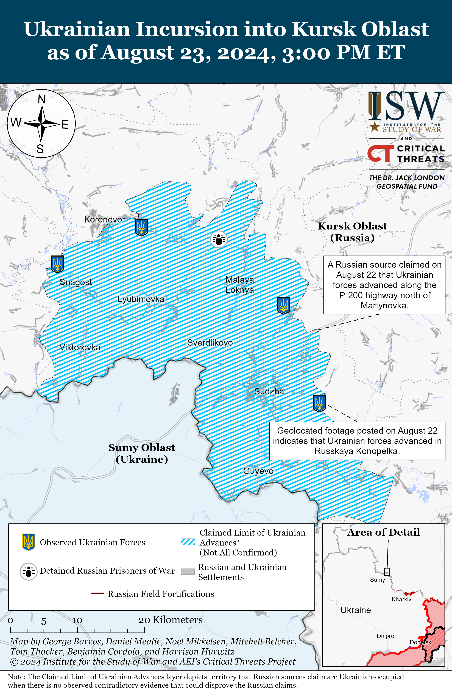](https://understandingwar.org/map/ukrainian-incursion-into-kursk-oblast-as-of-august-23-2024-300-pm-et/)](https://understandingwar.org/wp-content/uploads/2025/05/UAF20Kursk20Incursion20August20232C202024.png)

**Ukrainian officials continue to highlight how Ukrainian forces can leverage tactical and technological advantages to offset Russian materiel advantages.**Ukrainian First Deputy Defense Minister Lieutenant General Ivan Havrylyuk stated in an interview with Ukrainian outlet *Ukrinform*published on August 23 that the Ukrainian military has been able to inflict heavy losses against significantly larger quantities of Russian armored vehicles, artillery, and other equipment due to Ukrainian tactics and Ukraine’s effective use of available weapons.[9] Havrylyuk stated that Ukrainian forces have destroyed over 8,500 Russian tanks, 17,000 artillery systems, 1,000 air defense systems, about 370 aircraft, and 2,500 cruise missiles since the start of Russia’s full-scale invasion in February 2022.[10] ISW cannot confirm these figures, however. Havrylyuk stated that Russian forces have fired roughly 300,000 artillery shells throughout the theater each month on average and aimed to overwhelm Ukrainian forces with Russia’s large artillery advantage.[11] Havrylyuk stated that more precise (and effective) Western artillery systems can offset these advantages as long as Russian forces do not have an artillery advantage greater than three-to-one.[12] Ukrainian forces have leveraged GMLRS rocket artillery and NATO 155mm artillery systems and ammunition capable of striking targets at longer ranges than Russian / Soviet field artillery to conduct superior counterbattery fire throughout the war in Ukraine.[13] Havrylyuk added that Ukrainian artillery units also use tactics that provide greater mobility than Russian artillery units and therefore conduct more effective counterbattery fire.[14] Havrylyuk noted that Ukraine’s rapidly growing use of unmanned systems is another example of how Ukrainian forces can reduce costs while inflicting high losses on Russian forces and that increased Ukrainian drone use in 2024 has led to higher Russian artillery and armored vehicle losses.[15] Havrylyuk stated that long-range precision strikes into Russia would allow Ukraine to prevent Russia from transferring larger quantities of ammunition and equipment to the frontline and that strikes against military bases, arsenals, and logistic routes within Russia would heavily degrade Russian artillery advantages.[16] Western self-imposed restrictions on military aid provisions to Ukraine and policies restricting Ukrainian long-range strikes against military targets within Russia are constraining Ukrainian capabilities to degrade Russian materiel advantages.[17]

**US President Joe Biden announced a new military assistance package for Ukraine following a phone call with Ukrainian President Volodymyr Zelensky on August 23.[18]**The package is valued at $125 million and includes: Counter-Unmanned Aerial Systems (c-UAS) equipment and munitions; ammunition for High Mobility Artillery Rocket Systems (HIMARS); 155mm and 105mm artillery ammunition and additional ammunition for small arms and demolitions; Tube-launched, Optically-tracked, Wire-guided (TOW) missiles; Javelin and AT-4 anti-armor systems; medical and mine-clearing equipment; and additional materiel and training services.

**Ukrainian forces reportedly conducted another drone strike against the oil depot in Proletarsk, Rostov Oblast on August 23.**Russian opposition media reported that Ukrainian forces conducted a drone strike against the oil depot at about 0500 on August 23, following a strike against the depot on August 18 that caused a fire that Russian authorities have been battling since August 18.[19] Satellite imagery captured on August 22 of the Marinovka airbase in Volgograd Oblast shows that the Ukrainian strike on August 22 may have destroyed at least one Russian Su-24 or Su-34 fighter aircraft parked at the base, and additional imagery shows that several Russian fighter jets parked in the hangars also sustained damage.[20] An aviation-focused Russian milblogger claimed on August 22 that the light hangars at the Marinovka base did not protect Russian aircraft and called for Russian authorities to build reinforced concrete hangars wherever possible and only build light hangars when they cannot build stronger structures.[21]

**Islamic State (IS)-affiliated inmates took prison employees and other inmates hostage at a penal colony in Surovikino, Volgograd Oblast, Russia, on August 23.**Four inmates took eight employees and four other inmates of the IK-19 prison hostage.[22] The hostage-takers displayed an ISIS flag during the attack.[23] The attackers stated that they were taking revenge “for their Muslim brothers” whom Russian authorities detained in connection with the March 2024 terrorist attack at Crocus City Hall.[24] The attackers inflicted stab wounds upon four of the employees, three of whom died, and four other hostages were hospitalized, one of whom later died.[25] Rosgvardia snipers reportedly killed the four hostage-takers.[26] Two of the attackers were citizens of Uzbekistan and two were from Tajikistan.[27] Three of the attackers were imprisoned for drug trafficking and one was convicted for beating a man to death during a fight. Russian sources claimed that one of the attackers wore a suicide vest but disagreed on what happened, with some sources claiming that the vest malfunctioned and others claiming that Russian forces killed the attacker before he could activate the vest.[28] Russian opposition outlet *Vazhnye Istorii*stated that locals in the Kalmykia Republic and Volgograd and Rostov oblasts reported problems accessing Telegram, WhatsApp, and Viber shortly after the start of the attack and that Russian authorities likely blocked the messenger platforms.[29] Russian President Vladimir Putin convened a meeting of the permanent members of the Security Council on August 23 during the hostage situation and heard reports from Minister of Internal Affairs Vladimir Kolokoltsev, Federal Security Service Head Alexander Bortnikov, and Rosgvardia Head Viktor Zolotov.[30] Mufti of the Volgograd Oblast Central Spiritual Administration of Muslims Bat Kifah stated that Russian authorities should not negotiate with the hostage-takers, but kill them and should punish those who allowed the “negligence” in penal colonies.[31] Acting Chairperson of the Russian Spiritual Directorate of Muslims Mufti Damir Mukhetdinov stated that the organization disagreed with the attackers’ actions and that the hostage-takers may have been inspired from abroad in order to discredit Russia’s strengthening relations with Muslim states.[32]

**Russian milbloggers reacted to the hostage crisis with criticisms of the Russian prison system and migration policy.**Russian milbloggers claimed that the IK-19 prison is known for bribes, with some of the prison employees reportedly selling knives to inmates.[33] Russian sources complained that prisoners are becoming radicalized within Russian penal colonies and claimed that this problem has increased since the start of the full-scale invasion of Ukraine, the mobilization of prisoners to fight in Ukraine, and alleged increased flows of previously convicted Central Asian migrants to Russia.[34] Russian milbloggers called for the Russian government to take action to resolve these issues, including by reforming Russia’s prison system.[35] The Volgograd Oblast Prosecutor’s Office stated that it organized inspections of the IK-19 prison to ensure its compliance with its personnel’s safety, taking measures to prevent inmates from using prohibited items, and other laws and regulations.[36] Six reportedly IS-affiliated inmates at a pretrial detention center in Rostov-on-Don, Rostov Oblast similarly took two employees of the pretrial detention center hostage in June 2024, evoking similar criticisms from Russian milbloggers about Russian authorities’ failure to crack down on extremist groups and maintain security in penal colonies.[37] ISW continues to assess that the Kremlin has attempted to posture that it has been cracking down against domestic extremism since the Crocus City Hall attack, but the prison hostage crises undermine this Kremlin effort.[38]

**Indian Prime Minister Narendra Modi reaffirmed India’s support for peace in Ukraine on the basis of India’s participation in Ukraine’s July 2024 peace summit and signed several bilateral cooperation agreements during a visit to Ukraine.** Modi arrived in Kyiv on August 23 following his visit to Poland on August 21, marking the first time an Indian prime minister has visited Ukraine since the establishment of bilateral relations in 1992.[39] Modi and Ukrainian President Volodymyr Zelensky issued a joint statement emphasizing their commitment to ensuring a “just and lasting peace in Ukraine” based on principles of international law such as “respect for territorial integrity and sovereignty of states.”[40] This statement contrasts with Modi’s previous and more general calls for peace and diplomacy during his meeting with Russian President Vladimir Putin in Moscow in July 2024.[41] The Ukrainian side emphasized that the Joint Communique on the Foundation of Peace established at the June 2024 peace summit can serve as a guiding framework for setting the terms of a peace deal, although India has not signed the document despite its participation in June 2024.[42] Modi and Zelensky also signed four bilateral cooperation agreements in agriculture, economics, development, and culture.[43] Modi and Zelensky agreed to strengthen bilateral defense cooperation, particularly in manufacturing, and to hold a second Joint Ukrainian-Indian Working Group meeting on military-technical cooperation in the near future.[44] Modi’s visit to Ukraine marks a significant political inflection in India’s foreign policy towards Ukraine and may indicate an Indian effort to take a stronger pro-Ukraine position than New Delhi has before, despite India’s historical close and longstanding relationship with Moscow.

**Key Takeaways:**

- **Ukrainian forces continued to marginally advance near Sudzha amid continued Ukrainian operations in Kursk Oblast on August 23.**
- **Ukrainian officials continue to highlight how Ukrainian forces can leverage tactical and technological advantages to offset Russian materiel advantages.**
- **US President Joe Biden announced a new military assistance package for Ukraine following a phone call with Ukrainian President Volodymyr Zelensky on August 23.**
- **Ukrainian forces reportedly conducted another drone strike against the oil depot in Proletarsk, Rostov Oblast on August 23.**
- **Islamic State (IS)-affiliated inmates took prison employees and other inmates hostage at a penal colony in Surovikino, Volgograd Oblast on August 23.**
- **Russian milbloggers reacted to the hostage crisis with criticisms of the Russian prison system and migration policy.**
- **Indian Prime Minister Narendra Modi reaffirmed India’s support for peace in Ukraine on the basis of India’s participation in Ukraine’s July 2024 peace summit and signed several bilateral cooperation agreements during a visit to Ukraine.**
- **Russian forces recently advanced near Kreminna, Toretsk, Pokrovsk, and Donetsk City.**
- **Russian authorities continue efforts to leverage conscripts to free up manpower elsewhere for combat operations in Ukraine.**

[**[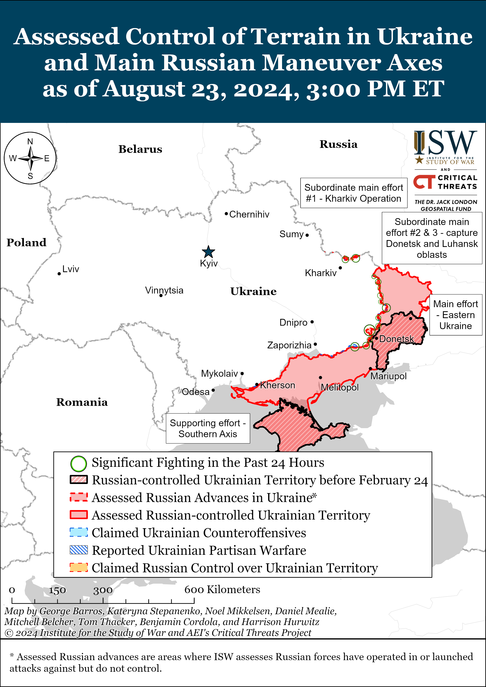](https://understandingwar.org/map/assessed-control-of-terrain-in-ukraine-and-main-russian-maneuver-axes-as-of-august-23-2024-300-pm-et/)**](https://understandingwar.org/wp-content/uploads/2025/05/DraftUkraineCoT20August20232C202024.png)

***We do not report in detail on Russian war crimes because these activities are well-covered in Western media and do not directly affect the military operations we are assessing and forecasting. We will continue to evaluate and report on the effects of these criminal activities on the Ukrainian military and the Ukrainian population and specifically on combat in Ukrainian urban areas. We utterly condemn Russian violations of the laws of armed conflict and the Geneva Conventions and crimes against humanity even though we do not describe them in these reports.***

- Russian Main Effort – Eastern Ukraine (comprised of three subordinate main efforts)
- Russian Subordinate Main Effort #1 – Push Ukrainian forces back from the international border with Belgorod Oblast and approach to within tube artillery range of Kharkiv City
- Russian Subordinate Main Effort #2 – Capture the remainder of Luhansk Oblast and push westward into eastern Kharkiv Oblast and encircle northern Donetsk Oblast
- Russian Subordinate Main Effort #3 – Capture the entirety of Donetsk Oblast
- Russian Supporting Effort – Southern Axis
- Russian Air, Missile, and Drone Campaign
- Russian Mobilization and Force Generation Efforts
- Russian Technological Adaptations
- Activities in Russian-occupied areas
- Ukrainian Defense Industrial Base Efforts
- Russian Information Operations and Narratives
- Significant Activity in Belarus

**Russian Main Effort – Eastern Ukraine**

**Russian Subordinate Main Effort #1 – Kharkiv Oblast (Russian objective: Push Ukrainian forces back from the international border with Belgorod Oblast and approach to within tube artillery range of Kharkiv City)**

Fighting continued north and northeast of Kharkiv City on August 23, but there were no confirmed changes to the frontline. A Russian milblogger claimed that Russian forces recently advanced northeast of Vovchansk (northeast of Kharkiv City), although ISW has not observed confirmation of this claim.[45] Russian milbloggers posted footage of the aftermath of an allegedly unsuccessful Ukrainian mechanized assault near Hlyboke (north of Kharkiv City) and claimed that Russian forces destroyed up to three Ukrainian armored vehicles in the area.[46] A Russian milblogger claimed that small Ukrainian infantry groups are also routinely attacking near Ohirtseve and Hatyshche (both immediately west of Vovchansk) but are not advancing in the area.[47] Russian forces continued ground assaults north of Kharkiv City near Hlyboke and northeast of Kharkiv City near Starytsya, Vovchansk, and Tykhe on August 22 and 23.[48] Elements of the Russian 41st Motorized Rifle Regiment (72nd Motorized Rifle Division, 44th Army Corps [AC], Leningrad Military District [LMD]) and the 4th Volunteer Reconnaissance Assault Brigade are reportedly operating near Vovchansk.[49]

[[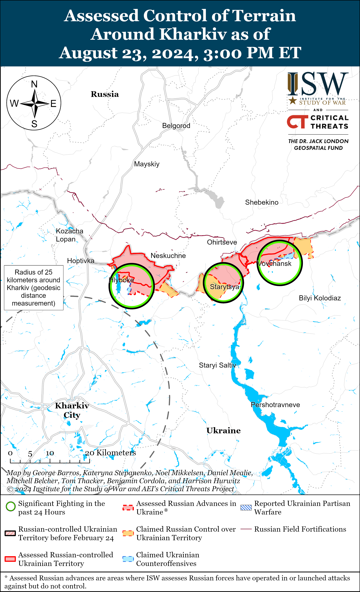](https://understandingwar.org/map/assessed-control-of-terrain-around-kharkiv-as-of-august-23-2024-300-pm-et/)](https://understandingwar.org/wp-content/uploads/2025/05/Kharkiv20Battle20Map20Draft20August20232C202024.png)

[[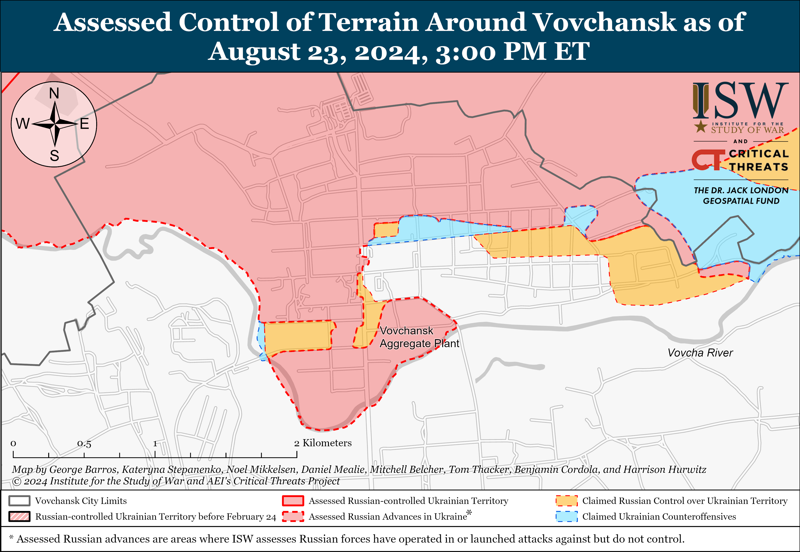](https://understandingwar.org/map/assessed-control-of-terrain-around-vovchansk-as-of-august-23-2024-300-pm-et/)](https://understandingwar.org/wp-content/uploads/2025/05/Vovchansk20Battle20Map20Draft20August20232C202024.png)

Ukrainian Kharkiv Group of Forces Spokesperson Colonel Vitaly Sarantsev stated on August 23 that Russian forces have transferred some unspecified units from the Kharkiv direction to Kursk Oblast but that Russian forces have enough manpower in the area to continue assaults.[50] Sarantsev added that there is data that suggests that Russian forces may be transferring additional reserves to the Kharkiv direction, but that Ukrainian forces need to clarify this information.[51] Sarantsev noted that Russian forces are less active in select unspecified areas of the Kharkiv direction.[52] ISW has observed significant redeployments of elements of the Northern Grouping of Forces (which is responsible for the Kharkiv direction) to Kursk Oblast, which suggests that the Russian military command has determined that disruption to the offensive operation in northern Kharkiv Oblast is a necessary sacrifice to appropriately respond to the Ukrainian incursion in Kursk Oblast.[53]

Kharkiv Oblast occupation administration head Vitaly Ganchev claimed on August 23 that Russian forces control roughly 50 settlements in Kharkiv Oblast, and 57 settlements throughout Kharkiv Oblast are fully within areas where ISW has observed Russian advances and claims of Russian advances.[54] Ganchev claimed that 13 to 14 settlements are a part of the current Russian “sanitary zone” in northern Kharkiv Oblast, and ISW currently assesses that 14 settlements in northern Kharkiv Oblast are fully under both observed and claimed Russian advances.[55]

**Russian Subordinate Main Effort #2 – Luhansk Oblast (Russian objective: Capture the remainder of Luhansk Oblast and push westward into eastern Kharkiv Oblast and northern Donetsk Oblast)**

Russian forces recently advanced northwest of Kreminna amid continued offensive operations along the Kupyansk-Svatove-Kreminna line on August 23. Geolocated footage published on August 23 indicates that Russian forces recently advanced further within eastern Makiivka (northwest of Kreminna).[56] Russian forces continued offensive operations northeast of Kupyansk near Synkivka; east of Kupyansk near Petropavlivka; northwest of Svatove near Hlushkivka, Stelmakhivka, and Andriivka; west of Svatove near Lozova; southwest of Svatove near Druzhelyubivka; northwest of Kreminna near Novosadove, Makiivka, and Nevske; and west of Kreminna near Torske and Terny on August 22 and 23.[57]

[[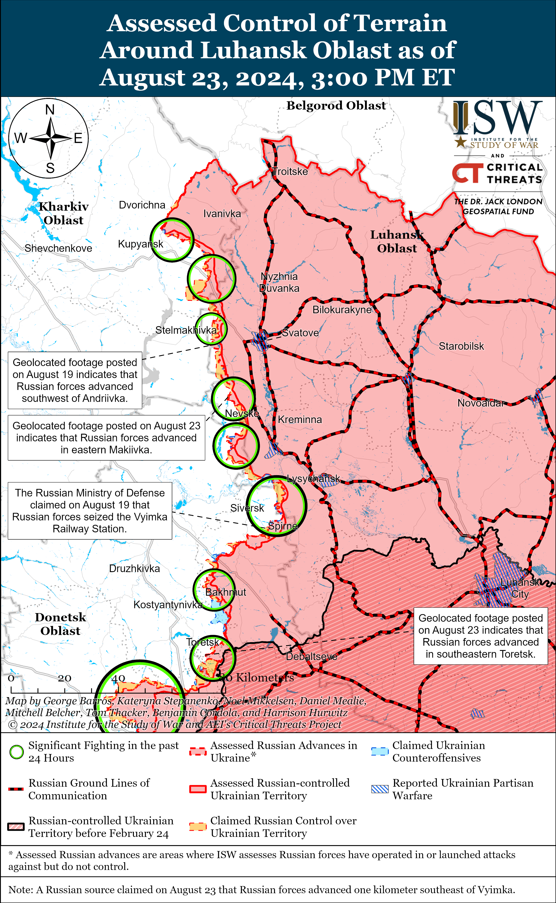](https://understandingwar.org/map/assessed-control-of-terrain-around-luhansk-oblast-as-of-august-23-2024-300-pm-et/)](https://understandingwar.org/wp-content/uploads/2025/05/Luhansk20Battle20Map20Draft20August20232C202024.png)

**Russian Subordinate Main Effort #3 – Donetsk Oblast (Russian objective: Capture the entirety of Donetsk Oblast, the claimed territory of Russia’s proxies in Donbas)**

Russian forces continued offensive operations in the Siversk direction on August 23, but there were no confirmed changes to the frontline. The Ukrainian General Staff reported that Russian forces conducted offensive operations northeast of Siversk near Bilohorivka, east of Siversk near Verkhnokamyanske, and southeast of Siversk near Vyimka and Spirne on August 22 and 23.[58] A Russian milblogger claimed that Russian forces advanced one kilometer southeast of Vyimka, but ISW has not observed confirmation of this claim.[59] Elements of the Russian 11th Engineering Brigade (Southern Military District [SMD]) are reportedly operating near Verkhnokamyanske.[60]

Russian forces continued offensive operations near Chasiv Yar on August 23, but there were no confirmed changes the frontline. Russian milbloggers claimed that Russian forces advanced near Ivanivske (east of Chasiv Yar) and Klishchiivka (southeast of Chasiv Yar) and within Zhovtnevyi Microraion (eastern Chasiv Yar), but ISW has not observed confirmation of these claims.[61] Russian forces continued offensive operations northeast of Chasiv Yar near Kalynivka, east of Chasiv Yar near Ivanivske, and near Chasiv Yar itself on August 22 and 23.[62] Elements of the Russian 98th Airborne (VDV) Division are reportedly operating within Zhovtnevyi Microraion.[63]

[[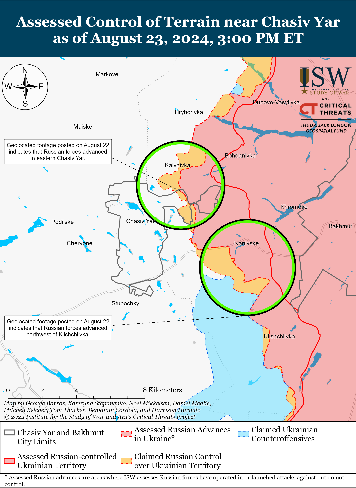](https://understandingwar.org/map/assessed-control-of-terrain-near-chasiv-yar-as-of-august-23-2024-300-pm-et/)](https://understandingwar.org/wp-content/uploads/2025/05/Chasiv20Yar20Battle20Map20Draft20August20232C202024.png)

Russian forces recently advanced near Toretsk amid continued Russian offensive operations in the area on August 23. Geolocated footage published on August 23 indicates that Russian forces recently advanced within southeastern Toretsk.[64] Russian sources claimed that Russian forces also advanced to the Central Hospital in eastern Toretsk, but ISW has not observed confirmation of this claim.[65] A Russian milblogger claimed that Russian forces advanced along a front 750 meters wide and 800 meters deep within Toretsk.[66] Russian forces conducted offensive operations near Toretsk, east of Toretsk near Pivnichne and Druzhba, and south of Toretsk near Nelipivka and Niu York on August 22 and 23.[67]

[[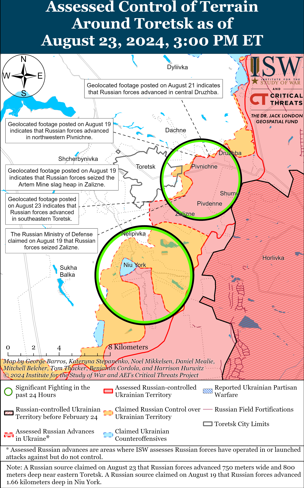](https://understandingwar.org/map/assessed-control-of-terrain-around-toretsk-as-of-august-23-2024-300-pm-et/)](https://understandingwar.org/wp-content/uploads/2025/05/Toretsk20Battle20Map20Draft20August20232C202024.png)

Russian forces recently advanced in the Pokrovsk direction amid continued Russian offensive operations in the area on August 23. Geolocated footage published on August 22 indicates that Russian forces advanced west of Orlivka (southeast of Pokrovsk).[68] Additional geolocated footage published on August 23 indicates that Russian forces advanced within eastern Novohrodivka (southeast of Pokrovsk).[69] Russian milbloggers claimed that Russian forces advanced up to 400 meters within eastern Novohrodivka, up to 500 meters within southern Novohrodivka, and within southeastern Novohrodivka.[70] Russian milbloggers claimed that Russian forces operating southeast of Pokrovsk seized Krutyi Yar and advanced further west of Orlivka, within southeastern Krasnyi Yar, south of Mykolaivka, west of Skuchne, towards Mykhailivka, and southwest and southeast of Ptyche.[71] A Russian source claimed that there are unconfirmed reports that Russian forces seized Kalynove (southeast of Pokrovsk).[72] ISW has not observed confirmation of these Russian claims, however. Russian forces continued offensive operations east of Pokrovsk near Vozdvyzhenka, Zelene Pole, and Hrodivka and southeast of Pokrovsk near Kalynove, Novohrodivka, Ptyche, Mykolaivka, Mykhailivka, Novohrodivka, and Karlivka on August 22 and 23.[73] The *Economist*reported on August 22 that Ukrainian security sources stated that the Russian military command has redeployed troops from unspecified sectors of the frontline in eastern Ukraine to Kursk Oblast but not from Pokrovsk and that Russian forces have recently committed unspecified reinforcements to the Pokrovsk direction.[74]

[[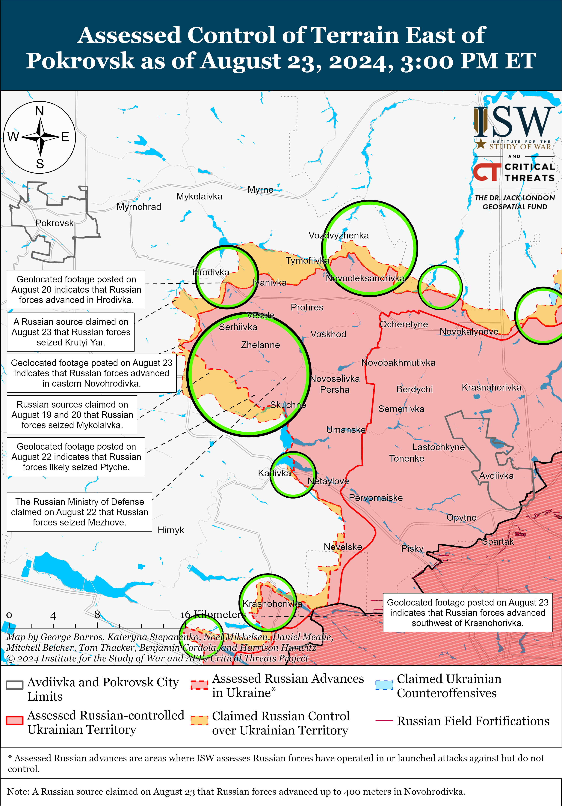](https://understandingwar.org/map/assessed-control-of-terrain-east-of-pokrovsk-as-of-august-23-2024-300-pm-et/)](https://understandingwar.org/wp-content/uploads/2025/05/East20of20Pokrovsk20Battle20Map20Draft20August20232C202024.png)

Russian forces recently advanced west of Donetsk City amid continued Russian offensive operations in the area on August 23. Geolocated footage published on August 23 indicates that Russian forces advanced southwest of Krasnohorivka during a reinforced platoon-sized mechanized assault.[75] The Ukrainian brigade that repelled the Russian attack stated that Ukrainian forces destroyed one tank and five infantry fighting vehicles.[76] Russian forces conducted offensive operations near Heorhiivka and Krasnohorivka on August 22 and 23.[77]

Russian forces continued offensive operations southwest of Donetsk City on August 23, but there were no confirmed changes to the frontline. Russian forces continued offensive operations near Kostyantynivka, Vodyane, Volodymyrivka, and Vuhledar on August 22 and 23.[78] Russian milbloggers claimed that Russian forces advanced near Kostyantynivka and north of Paraskoviivka, but ISW has not observed confirmation of these claims.[79]

Positional engagements continued in the Donetsk-Zaporizhia Oblast border area northeast of Velyka Novosilka near Rozdolne and south of Velyka Novosilka near Urozhaine on August 23.[80]

[[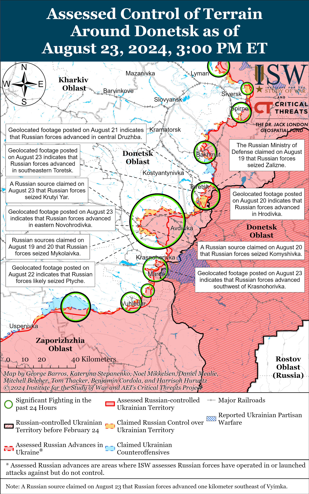](https://understandingwar.org/map/assessed-control-of-terrain-around-donetsk-as-of-august-23-2024-300-pm-et/)](https://understandingwar.org/wp-content/uploads/2025/05/Donetsk20Battle20Map20Draft20August20232C202024.png)

**Russian Supporting Effort – Southern Axis (Russian objective: Maintain frontline positions and secure rear areas against Ukrainian strikes)**

A Russian milblogger claimed on August 23 that positional fighting continued in western Zaporizhia Oblast, but Ukrainian sources did not report any Russian assaults in the area.[81]

[[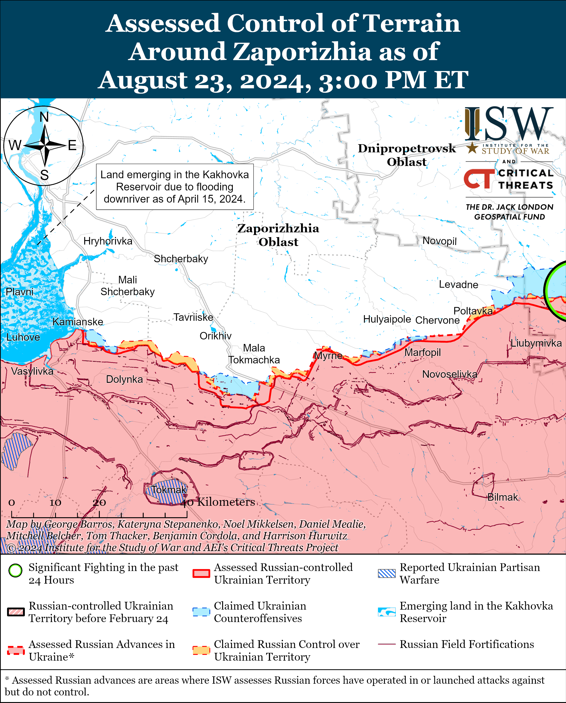](https://understandingwar.org/map/assessed-control-of-terrain-around-zaporizhzia-as-of-august-23-2024-300-pm-et/)](https://understandingwar.org/wp-content/uploads/2025/05/Zaporizhia20Battle20Map20Draft20August20232C202024.png)

The Russian Ministry of Defense (MoD) claimed on August 23 that unspecified Russian Airborne (VDV) Forces disrupted a Ukrainian landing attempt on an unspecified island in the Dnipro River Delta in Kherson Oblast.[82]

[[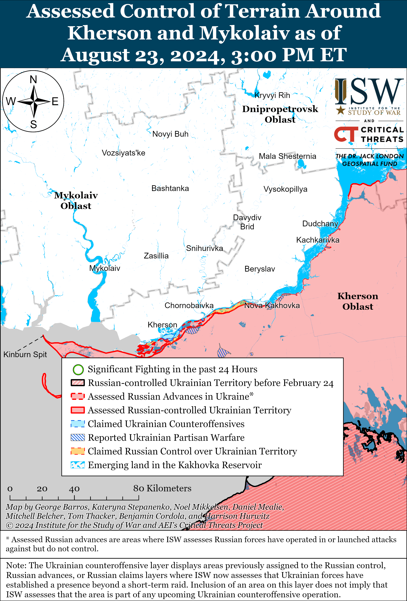](https://understandingwar.org/map/assessed-control-of-terrain-around-kherson-and-mykolaiv-as-of-august-23-2024-300-pm-et/)](https://understandingwar.org/wp-content/uploads/2025/05/Kherson-Mykolaiv20Battle20Map20Draft20August20232C202024.png)

Russian and Ukrainian sources stated that Ukraine disconnected the Russian-occupied Zaporizhzhia Nuclear Power Plant (ZNPP) from an external power line on August 23.[83] Ukraine’s nuclear operator Energoatom noted that Russian shelling damaged the external power line, however, which prompted Ukraine to disconnect the line from the ZNPP.[84]

Ukrainian Navy Spokesperson Captain Third Rank Dmytro Pletenchuk reported on August 23 that Ukrainian forces destroyed the Russian “Konro Trader” ferry in the port of Kavkaz on August 22.[85] Pletenchuk reported that the “Konro Trader” was the last functioning ferry at the port but noted that Russian forces are repairing one ferry and have another anchored in Azov. Pletenchuk noted that Russian forces may have to resort to transporting fuel across the Kerch Strait Brigade or on tankers through the strait following the loss of the ferries. Satellite imagery published on August 23 also shows the destroyed ferry and several small, damaged vessels nearby in the port of Kavkaz.[86] Russian milbloggers expressed concern on August 22 and 23 that the loss of the ferries will affect fuel supplies to occupied Crimea and complicate Russian logistics.[87]

**Russian Air, Missile, and Drone Campaign (Russian Objective: Target Ukrainian military and civilian infrastructure in the rear and on the frontline)**

Ukrainian Air Force Commander Lieutenant General Mykola Oleshchuk reported on August 23 that Russian forces launched two Iskander-M/North Korean KN-23 ballistic missiles from Voronezh Oblast and 16 Shahed-136/131 drones from Krasnodar Krai and Kursk Oblast on the night of August 22 to 23.[88] Oleshchuk reported that Ukrainian forces downed 14 Shahed drones over Cherkasy, Kirovohrad, Poltava, and Sumy oblasts and that the other two drones did not reach their targets. Kharkiv Oblast Police Head Volodymyr Tymoshko stated that Russian forces conducted a glide bomb strike against Bohuslavka, Izyum Raion.[89]

**Russian Mobilization and Force Generation Efforts (Russian objective: Expand combat power without conducting general mobilization)**

Russian authorities continue efforts to leverage conscripts to free up manpower elsewhere for combat operations in Ukraine. Ukraine’s National Resistance Center published internal Russian documents on August 23 purportedly showing surveys conducted among Russian conscripts asking whether the conscripts agreed to go on a “business trip” (*“komanidrovka” –*the Russian military’s term for tours of duty and deployments) to occupied Crimea.[90] The published documents purportedly indicate that Russian authorities forced conscripts who answered in the negative to write reports about their positions but then forged those reports to indicate that the conscripts had ”voluntarily agreed“ to go to Crimea to replace Russian soldiers who deployed to the frontline in Ukraine.[91]

Russian officials continue to recruit contract military personnel (*kontraktniki*) through the promise of large one-time payments. Russian opposition outlet *SOTA*published footage on August 23 purportedly showing a recruitment advertisement that promises to pay residents a one-time payment of 1.9 million rubles (about $21,000) and a yearly salary of 5.2 million rubles ($57,000) if they sign a contract with the Russian Ministry of Defense (MoD). The advertisement purportedly offers to pay 50,000 rubles ($547) to those who bring other individuals to the Russian military registration and recruitment office with them.[92]

**Russian Technological Adaptations (Russian objective: Introduce technological innovations to optimize systems for use in Ukraine)**

The head of the modernization project at the Russian Aviastroitel Design Bureau, Dmitry Motin, claimed on August 23 that it will upgrade the two-seater Yakovlev Yak-52 trainer aircraft into the Yak-52V2 capable of combating drones.[93] Motin claimed that the Russian Aviastroitel Design Bureau is working to upgrade the Yakovlev Yak-52 trainer aircraft to be able to combat attack and reconnaissance drones by installing new equipment on the aircraft, including a multifunctional display in the rear cockpit, and modernizing the aircraft’s navigation and control facilities, electronic warfare (EW) system, and radar.[94]

**Ukrainian Defense Industrial Efforts (Ukrainian objective: Develop its defense industrial base to become more self-sufficient in cooperation with US, European, and international partners)**

*ISW is suspending publishing coverage of Ukrainian defense industrial efforts until further notice.*

**Activities in Russian-occupied areas (Russian objective: Consolidate administrative control of annexed areas; forcibly integrate Ukrainian citizens into Russian sociocultural, economic, military, and governance systems)**

*ISW is not publishing coverage of activities in Russian-occupied areas today.*

**Russian Information Operations and Narratives**

The Kremlin is attempting to distract from Ukraine’s incursion into Kursk Oblast by amplifying several information operations intended to deter the West from providing further military assistance to Ukraine. Russian Ambassador to the US Anatoly Antonov accused the US on August 22 of preparing to lift restrictions against the use of US-provided weapons to strike Russian territory and insinuated that this would escalate the war in Ukraine and “change [the world] tomorrow.”[95] Antonov claimed on August 23 that the Ukrainian incursion in Kursk Oblast will not result in the desired “buffer zone” and said that Russian President Vladimir Putin has promised to “severely punish” Ukraine.[96] The Russian Embassy in the US attempted to link the Ukrainian incursion into Kursk Oblast to the Battle of Kursk against Nazi Germany in 1943.[97] Russian Ministry of Foreign Affairs (MFA) Spokesperson Maria Zakharova directly accused the United States of supporting Ukraine’s so-called “terrorist” attack in Kursk Oblast and reiterated the ongoing information operation accusing Ukraine of targeting the Kursk Nuclear Power Plant (KNPP).[98] Russian state and pro-Kremlin media continued to focus on foreign journalists reporting on Ukraine’s incursion from within Kursk Oblast with a Ukrainian military escort.[99]

The Russian MFA marked the anniversary of the signing of the Molotov-Ribbentrop Pact (the Nazi-Soviet anti-aggression pact that Adolf Hiter and Joseph Stalin used to partition Poland in 1939) by accusing the West of forcing the Soviet Union to sign the nonaggression pact with Nazi Germany on August 23, 1939, deflecting blame for the Soviet Union’s own imperialist ambitions during the Second World War.[100] The Russian MFA accused the UK and France of enabling Nazi Germany’s desire for territorial expansion by pursuing policies of appeasement, somehow compelling the Soviet leadership to make a “difficult and forced decision” to sign the pact to avoid the “imminent war in Europe.”[101] The Russian MFA’s characterization conveniently ignores, however, the Soviet Union’s subsequent invasions of many states whose territories were preemptively partitioned between the Soviet Union and Nazi Germany in the Molotov-Ribbentrop Pact. The Soviet Union joined Nazi Germany’s invasion of Poland on September 17 – just weeks after signing the Molotov-Ribbentrop Pact – and subsequently invaded Finland in November 1939 and annexed Moldova and the Baltics in 1940.[102]

**Significant activity in Belarus (Russian efforts to increase its military presence in Belarus and further integrate Belarus into Russian-favorable frameworks and Wagner Group activity in Belarus)**

Nothing significant to report.

**Note: ISW does not receive any classified material from any source, uses only publicly available information, and draws extensively on Russian, Ukrainian, and Western reporting and social media as well as commercially available satellite imagery and other geospatial data as the basis for these reports. References to all sources used are provided in the endnotes of each update.**

---

[1] https://t.me/creamy\_caprice/6495; https://t.me/rian\_ru/258350

[2] https://t.me/RVvoenkor/75422

[3] https://x.com/GirkinGirkin/status/1826972786121703923; https://x.com/Daedalus\_17\_/status/1826974161438122125 ; https://t.me/rybar/63003 ; https://t.me/DnevnikDesantnika/14430

[4] https://t.me/rybar/63003 ; https://t.me/motopatriot/26586; https://t.me/DnevnikDesantnika/14429

[5] https://t.me/motopatriot/26557 ; https://t.me/motopatriot/26558 ; https://t.me/DnevnikDesantnika/14402

[6] https://t.me/motopatriot/26585

[7] https://t.me/mod\_russia/42506 ; https://t.me/rybar/62990 ; https://t.me/rybar/62979 ; https://t.me/dva\_majors/50469 ; https://t.me/motopatriot/26550 ; https://t.me/DnevnikDesantnika/14402 ; https://t.me/wargonzo/21702

[8] https://www.defense.gov/News/Transcripts/Transcript/Article/3882144/deputy-pentagon-press-secretary-sabrina-singh-holds-a-press-briefing/

[9] https://www.ukrinform dot ua/rubric-ato/3897923-udari-po-vijskovih-aerodromah-i-zavodah-rf-ce-ne-zagroza-eskalacii-vijni-a-slah-do-ii-zaversenna.html

[10] https://www.ukrinform dot ua/rubric-ato/3897923-udari-po-vijskovih-aerodromah-i-zavodah-rf-ce-ne-zagroza-eskalacii-vijni-a-slah-do-ii-zaversenna.html

[11] https://www.ukrinform dot ua/rubric-ato/3897923-udari-po-vijskovih-aerodromah-i-zavodah-rf-ce-ne-zagroza-eskalacii-vijni-a-slah-do-ii-zaversenna.html

[12] https://www.ukrinform dot ua/rubric-ato/3897923-udari-po-vijskovih-aerodromah-i-zavodah-rf-ce-ne-zagroza-eskalacii-vijni-a-slah-do-ii-zaversenna.html

[13] https://isw.pub/UkrWar021324 ; https://understandingwar.org/backgrounder/russian-offensive-campaign-assessment-april-19-2024

[14] https://www.ukrinform dot ua/rubric-ato/3897923-udari-po-vijskovih-aerodromah-i-zavodah-rf-ce-ne-zagroza-eskalacii-vijni-a-slah-do-ii-zaversenna.html

[15] https://www.ukrinform dot ua/rubric-ato/3897923-udari-po-vijskovih-aerodromah-i-zavodah-rf-ce-ne-zagroza-eskalacii-vijni-a-slah-do-ii-zaversenna.html

[16] https://www.ukrinform dot ua/rubric-ato/3897923-udari-po-vijskovih-aerodromah-i-zavodah-rf-ce-ne-zagroza-eskalacii-vijni-a-slah-do-ii-zaversenna.html

[17] https://understandingwar.org/backgrounder/russian-offensive-campaign-assessment-june-19-2024 ; https://isw.pub/UkrWar062224

[18] https://www.whitehouse.gov/briefing-room/statements-releases/2024/08/23/statement-from-president-joe-biden-ahead-of-ukraine-independence-day/ ; https://www.defense.gov/News/Releases/Release/Article/3883533/biden-administration-announces-additional-security-assistance-for-ukraine/

[19] https://t.me/astrapress/62519 ; https://t.me/bazabazon/30528; https://understandingwar.org/backgrounder/russian-offensive-campaign-assessment-august-18-2024

[20] https://x.com/MT\_Anderson/status/1826643666934661462; https://x.com/MT\_Anderson/status/1826657803408404865; https://mil dot in.ua/uk/news/na-aerodromi-marynovka-znyshhyly-ta-poshkodyly-bombarduvalnyky-su-34/; https://x.com/kromark/status/1826874796476416300

[21] https://t.me/fighter\_bomber/17832

[22] https://meduza dot io/news/2024/08/23/pri-zahvate-zalozhnikov-v-kolonii-v-volgogradskoy-oblasti-pogibli-chetyre-sotrudnika-fsin ; https://t.me/fsinrussia/5253

[23] Warning: Graphic Content https://t.me/opersvodki/22393?single ; https://t.me/dva\_majors/50496 ; https://x.com/AggregateOsint/status/1826976964172787777

[24] https://meduza dot io/news/2024/08/23/mash-nachalsya-shturm-ik-19-v-volgogradskoy-oblasti-gde-zaklyuchennye-vzyali-zalozhnikov

[25] https://t.me/fsinrussia/5253

[26] https://t.me/RosgvardOfficial/6831

[27] https://t.me/tass\_agency/268043

[28] https://t.me/rybar/62998 ; https://t.me/dva\_majors/50508; https://t.me/dva\_majors/50509; https://t.me/RVvoenkor/75470; https://t.me/voenkorKotenok/58463; https://t.me/wargonzo/21716

[29] https://t.me/istories\_media/7360

[30] http://kremlin dot ru/events/president/news/74926

[31] https://www.gazeta dot ru/social/news/2024/08/23/23758315.shtml

[32] https://tass dot ru/proisshestviya/21673517

[33] https://t.me/rustroyka1945/17817 ; https://t.me/notes\_veterans/19070 https://t.me/RVvoenkor/75471

[34] https://t.me/MedvedevVesti/18374 ; https://t.me/dva\_majors/50497; https://t.me/zhivoff/16483 ; https://t.me/dva\_majors/50504 https://t.me/sashakots/48562

[35] https://t.me/vysokygovorit/17039; https://t.me/boris\_rozhin/134688

[36] https://t.me/volgoproc\_pravo/4808

[37] https://understandingwar.org/backgrounder/russian-offensive-campaign-assessment-june-16-2024

[38] https://understandingwar.org/backgrounder/russian-offensive-campaign-assessment-june-16-2024

[39] https://www.nytimes.com/2024/08/23/world/europe/ukraine-modi-india.html

[40] https://www.mea dot gov.in/outoging-visit-detail.htm?38220/Transcript+of+Special+Briefing+by+External+Affairs+Minister+on+Prime+Ministers+visit+to+Ukraine+August+23+2024; https://www.msn.com/en-us/news/world/modi-offers-to-bring-peace-to-ukraine-as-a-friend/ar-AA1pjUYw?ocid=BingNewsSerp; https://www.president dot gov.ua/news/spilna-zayava-ukrayini-ta-indiyi-za-pidsumkami-vizitu-premye-92781 ; https://suspilne dot media/820117-ukraina-ta-india-pogodili-nizku-dokumentiv-pro-spivpracu-u-akih-galuzah/  

[41] https://www.washingtonpost.com/world/2024/07/09/russia-india-putin-modi-moscow/; https://understandingwar.org/backgrounder/russian-offensive-campaign-assessment-july-9-2024

[42] https://www.mea dot gov.in/outoging-visit-detail.htm?38220/Transcript+of+Special+Briefing+by+External+Affairs+Minister+on+Prime+Ministers+visit+to+Ukraine+August+23+2024; https://timesofindia dot indiatimes.com/world/europe/pm-modi-comforts-zelenskyy-but-asks-him-to-have-peace-talks-with-russia/articleshow/112748003.cms

[43] https://www.president.gov.ua/news/spilna-zayava-ukrayini-ta-indiyi-za-pidsumkami-vizitu-premye-92781

[44] https://www.yahoo.com/news/ukraine-india-hold-joint-working-171531950.html; https://www.president dot gov.ua/news/spilna-zayava-ukrayini-ta-indiyi-za-pidsumkami-vizitu-premye-92781 ; https://suspilne dot media/820117-ukraina-ta-india-pogodili-nizku-dokumentiv-pro-spivpracu-u-akih-galuzah/

[45] https://t.me/motopatriot/26532

[46] https://t.me/motopatriot/26536 ; https://t.me/milinfolive/128996 ; https://t.me/DnevnikDesantnika/14436

[47] https://t.me/motopatriot/26532

[48] https://www.facebook.com/GeneralStaff.ua/posts/pfbid02aMCK9zLYgX5RMrTCD6JTMdpJhMzAPDv6zk2MFE8oYecEMTYFvT11rtEBLcgt2NUrl ; https://www.facebook.com/GeneralStaff.ua/posts/pfbid02mTkgU8nPvQCeGQrm78vNGiaRrhpYAUzUEjBxda2q7cHoiLLdgsJ499A7qQBbyyP6l ; https://www.facebook.com/GeneralStaff.ua/posts/pfbid02dkKX7odkPZkgrX5Pg7Txu1ZLo15vmLtW6rZakBMg2nmtgEvXrwnUHpqSPe7Ht7GMl ; . https://armyinform dot com.ua/2024/08/23/vorog-namagayetsya-probytysya-do-richky-vovcha-shho-vidbuvayetsya-na-najaktyvnishij-dilyanczi-harkivskogo-napryamku/

[49] https://t.me/otukharkiv/880

[50] https://armyinform dot com.ua/2024/08/23/okupanty-perekydayut-dodatkovi-rezervy-na-harkivskyj-napryamok/

[51] https://armyinform dot com.ua/2024/08/23/okupanty-perekydayut-dodatkovi-rezervy-na-harkivskyj-napryamok/

[52] https://armyinform dot com.ua/2024/08/23/okupanty-perekydayut-dodatkovi-rezervy-na-harkivskyj-napryamok/

[53] https://isw.pub/UkrWar080924 ; https://isw.pub/UkrWar080924 ; https://isw.pub/UkrWar081024 ; https://understandingwar.org/backgrounder/russian-offensive-campaign-assessment-august-22-2024

[54] https://t.me/tass\_agency/267906

[55] https://t.me/tass\_agency/267911

[56] https://t.me/creamy\_caprice/6501 ; https://t.me/ZSU\_115OMBr/416

[57] https://www.facebook.com/GeneralStaff.ua/posts/pfbid02aMCK9zLYgX5RMrTCD6JTMdpJhMzAPDv6zk2MFE8oYecEMTYFvT11rtEBLcgt2NUrl ; https://www.facebook.com/GeneralStaff.ua/posts/pfbid02mTkgU8nPvQCeGQrm78vNGiaRrhpYAUzUEjBxda2q7cHoiLLdgsJ499A7qQBbyyP6l ; https://www.facebook.com/GeneralStaff.ua/posts/pfbid02dkKX7odkPZkgrX5Pg7Txu1ZLo15vmLtW6rZakBMg2nmtgEvXrwnUHpqSPe7Ht7GMl

[58] https://www.facebook.com/GeneralStaff.ua/posts/pfbid02aMCK9zLYgX5RMrTCD6JTMdpJhMzAPDv6zk2MFE8oYecEMTYFvT11rtEBLcgt2NUrl ; https://www.facebook.com/GeneralStaff.ua/posts/pfbid02mTkgU8nPvQCeGQrm78vNGiaRrhpYAUzUEjBxda2q7cHoiLLdgsJ499A7qQBbyyP6l ; https://www.facebook.com/GeneralStaff.ua/posts/pfbid02dkKX7odkPZkgrX5Pg7Txu1ZLo15vmLtW6rZakBMg2nmtgEvXrwnUHpqSPe7Ht7GMl

[59] https://t.me/motopatriot/26583

[60] https://t.me/frontline\_pvt/1991 ; https://t.me/voin\_dv/10412

[61] https://t.me/wargonzo/21703; https://t.me/motopatriot/26573; https://t.me/DnevnikDesantnika/14427

[62] https://www.facebook.com/GeneralStaff.ua/posts/pfbid02aMCK9zLYgX5RMrTCD6JTMdpJhMzAPDv6zk2MFE8oYecEMTYFvT11rtEBLcgt2NUrl; https://www.facebook.com/GeneralStaff.ua/posts/pfbid02mTkgU8nPvQCeGQrm78vNGiaRrhpYAUzUEjBxda2q7cHoiLLdgsJ499A7qQBbyyP6l ;https://www.facebook.com/GeneralStaff.ua/posts/pfbid02dkKX7odkPZkgrX5Pg7Txu1ZLo15vmLtW6rZakBMg2nmtgEvXrwnUHpqSPe7Ht7GMl ; https://t.me/wargonzo/21703

[63] https://t.me/motopatriot/26573

[64] https://t.me/creamy\_caprice/6499; https://t.me/voron1OO/55

[65] https://t.me/RVvoenkor/75441 ; https://t.me/z\_arhiv/27743; https://t.me/motopatriot/26559

[66] https://t.me/RVvoenkor/75441

[67] https://www.facebook.com/GeneralStaff.ua/posts/pfbid02aMCK9zLYgX5RMrTCD6JTMdpJhMzAPDv6zk2MFE8oYecEMTYFvT11rtEBLcgt2NUrl; https://www.facebook.com/GeneralStaff.ua/posts/pfbid02mTkgU8nPvQCeGQrm78vNGiaRrhpYAUzUEjBxda2q7cHoiLLdgsJ499A7qQBbyyP6l ; https://www.facebook.com/GeneralStaff.ua/posts/pfbid02dkKX7odkPZkgrX5Pg7Txu1ZLo15vmLtW6rZakBMg2nmtgEvXrwnUHpqSPe7HtGMl ; https://t.me/RVvoenkor/75441 ;

[68] https://t.me/ngu\_war\_for\_peace/20110; https://x.com/blinzka/status/1826910590415073431; https://x.com/666\_mancer/status/1826897007132172777

[69] https://t.me/creamy\_caprice/6497; https://t.me/btr80/19749; https://x.com/franfran2424/status/1826913938958598335

[70] https://t.me/RVvoenkor/75441; https://t.me/voenkorKotenok/58455; https://t.me/motopatriot/26568

[71] https://t.me/motopatriot/26599 ; https://t.me/rybar/62983 ; https://t.me/motopatriot/26569; https://t.me/z\_arhiv/27745; https://t.me/DnevnikDesantnika/14399; https://t.me/motopatriot/26598 ; https://t.me/motopatriot/26599

[72] https://t.me/rybar/62983

[73] https://www.facebook.com/GeneralStaff.ua/posts/pfbid02aMCK9zLYgX5RMrTCD6JTMdpJhMzAPDv6zk2MFE8oYecEMTYFvT11rtEBLcgt2NUrl ; https://www.facebook.com/GeneralStaff.ua/posts/pfbid02mTkgU8nPvQCeGQrm78vNGiaRrhpYAUzUEjBxda2q7cHoiLLdgsJ499A7qQBbyyP6l ; https://www.facebook.com/GeneralStaff.ua/posts/pfbid02dkKX7odkPZkgrX5Pg7Txu1ZLo15vmLtW6rZakBMg2nmtgEvXrwnUHpqSPe7Ht7GMl; https://t.me/dva\_majors/50469; https://t.me/wargonzo/21703

[74] https://www.economist.com/europe/2024/08/22/the-kremlin-is-close-to-crushing-pokrovsk-a-vital-ukrainian-town

[75] https://t.me/oaembr46/975; https://t.me/creamy\_caprice/6504

[76] https://t.me/oaembr46/975

[77] https://www.facebook.com/GeneralStaff.ua/posts/pfbid02aMCK9zLYgX5RMrTCD6JTMdpJhMzAPDv6zk2MFE8oYecEMTYFvT11rtEBLcgt2NUrl; https://www.facebook.com/GeneralStaff.ua/posts/pfbid02mTkgU8nPvQCeGQrm78vNGiaRrhpYAUzUEjBxda2q7cHoiLLdgsJ499A7qQBbyyP6l ; https://www.facebook.com/GeneralStaff.ua/posts/pfbid02dkKX7odkPZkgrX5Pg7Txu1ZLo15vmLtW6rZakBMg2nmtgEvXrwnUHpqSPe7Ht7GMl

[78] https://www.facebook.com/GeneralStaff.ua/posts/pfbid02aMCK9zLYgX5RMrTCD6JTMdpJhMzAPDv6zk2MFE8oYecEMTYFvT11rtEBLcgt2NUrl; https://www.facebook.com/GeneralStaff.ua/posts/pfbid02mTkgU8nPvQCeGQrm78vNGiaRrhpYAUzUEjBxda2q7cHoiLLdgsJ499A7qQBbyyP6l ; https://www.facebook.com/GeneralStaff.ua/posts/pfbid02dkKX7odkPZkgrX5Pg7Txu1ZLo15vmLtW6rZakBMg2nmtgEvXrwnUHpqSPe7Ht7GMl; https://t.me/wargonzo/21703 ; https://t.me/dva\_majors/50469

[79] https://t.me/belarusian\_silovik/39646 ; https://t.me/dva\_majors/50459; https://t.me/RVvoenkor/75441; https://t.me/z\_arhiv/27753; https://t.me/wargonzo/21703

[80] https://www.facebook.com/GeneralStaff.ua/posts/pfbid02mTkgU8nPvQCeGQrm78vNGiaRrhpYAUzUEjBxda2q7cHoiLLdgsJ499A7qQBbyyP6l

[81] https://t.me/wargonzo/21703 ; https://t.me/SJTF\_Odes/11071

[82] https://t.me/mod\_russia/42507

[83] https://t.me/tass\_agency/267920; https://t.me/tass\_agency/26792 ; https://t.me/tass\_agency/267943; https://t.me/tass\_agency/267944; https://t.me/energoatom\_ua/18938

[84] https://t.me/energoatom\_ua/18938

[85] https://armyinform dot com.ua/2024/08/23/vms-zsu-pidtverdyly-znyshhennya-poroma-u-rosijskomu-portu/ ; https://suspilne dot media/crimea/819747-u-vms-zsu-pidtverdili-udar-po-portu-kavkaz-22-serpna/ ; https://armyinform dot com.ua/2024/08/23/znyshhenyj-sylamy-oborony-porom-zachynyv-rosijskyj-port-u-chornomu-mori/

[86] https://t.me/cxemu/4136

[87] https://t.me/rybar/62978 ; https://t.me/dva\_majors/50469

[88] https://t.me/ComAFUA/398 ; https://suspilne dot media/819711-ukrainska-ppo-vnoci-zbila-14-iz-16-sahediv-povitrani-sili/

[89] https://t.me/DSNS\_Kharkiv/8812

[90] https://t.me/sprotyv\_official/5061; https://sprotyv.mod dot gov.ua/tsns-otrymav-dokazy-tysku-rosijskogo-komanduvannya-na-strokovykiv-dlya-vidpravky-yih-v-zonu-svo/

[91] https://t.me/sprotyv\_official/5061; https://sprotyv.mod dot gov.ua/tsns-otrymav-dokazy-tysku-rosijskogo-komanduvannya-na-strokovykiv-dlya-vidpravky-yih-v-zonu-svo/

[92] https://t.me/sotaproject/85819

[93] https://sputnikglobe dot com/20240821/modernized-russian-yak-52-aircraft-to-be-upgraded-to-fight-drones-1119853566.html; https://t.me/basurin\_e/13632

[94] https://sputnikglobe dot com/20240821/modernized-russian-yak-52-aircraft-to-be-upgraded-to-fight-drones-1119853566.html; https://t.me/basurin\_e/13632

[95] https://tass dot ru/politika/21668087

[96] https://t.me/tass\_agency/267953; https://t.me/tass\_agency/267924

[97] https://tass dot ru/politika/21668499

[98] https://t.me/tass\_agency/268016; https://t.me/tass\_agency/267941; https://t.me/tass\_agency/267942

[99] https://iz dot ru/1747420/2024-08-23/v-kurskuiu-oblast-nezakonno-pronik-eshche-odin-zapadnyi-zhurnalist; https://www.vedomosti dot ru/politics/news/2024/08/23/1057561-korrespondent-deutsche-welle-posetil; https://ria dot ru/20240823/zapad-1967976175.html; https://tass dot ru/obschestvo/21670191

[100] https://t.me/MID\_Russia/44372

[101] https://t.me/MID\_Russia/44372

[102] https://enrs.eu/news/soviet-invasion-of-poland; https://europe.unc.edu/the-end-of-wwii-and-the-division-of-europe/#:~:text=The%20Soviet%20Union%20subsequently%20annexed,been%20annexed%20prior%20to%201939.; https://www.britannica.com/event/Russo-Finnish-War
